# Angular Complete Documentation

This is a comprehensive collection of Angular documentation consolidated into a single file for easier reference.


---

## Cli

(From index.md)

### CLI Overview and Command Reference

The Angular CLI is a command-line interface tool that you use to initialize, develop, scaffold, and maintain Angular applications directly from a command shell.

#### Installing Angular CLI

Major versions of Angular CLI follow the supported major version of Angular, but minor versions can be released separately.

Install the CLI using the `npm` package manager:

<code-example format="shell" language="shell">

npm install -g &commat;angular/cli<aio-angular-dist-tag class="pln"></aio-angular-dist-tag>

</code-example>

For details about changes between versions, and information about updating from previous releases, see the Releases tab on GitHub: https://github.com/angular/angular-cli/releases

#### Basic workflow

Invoke the tool on the command line through the `ng` executable.
Online help is available on the command line.
Enter the following to list commands or options for a given command \(such as [new](cli/new)\) with a short description.

<code-example format="shell" language="shell">

ng --help
ng new --help

</code-example>

To create, build, and serve a new, basic Angular project on a development server, go to the parent directory of your new workspace use the following commands:

<code-example format="shell" language="shell">

ng new my-first-project
cd my-first-project
ng serve

</code-example>

In your browser, open http://localhost:4200/ to see the new application run.
When you use the [ng serve](cli/serve) command to build an application and serve it locally, the server automatically rebuilds the application and reloads the page when you change any of the source files.

<div class="docs-alert docs-alert-helpful">

When you run `ng new my-first-project` a new folder, named `my-first-project`, will be created in the current working directory.
Since you want to be able to create files inside that folder, make sure you have sufficient rights in the current working directory before running the command.

If the current working directory is not the right place for your project, you can change to a more appropriate directory by running `cd <path-to-other-directory>`.

</div>

#### Workspaces and project files

The [ng new](cli/new) command creates an *Angular workspace* folder and generates a new application skeleton.
A workspace can contain multiple applications and libraries.
The initial application created by the [ng new](cli/new) command is at the top level of the workspace.
When you generate an additional application or library in a workspace, it goes into a `projects/` subfolder.

A newly generated application contains the source files for a root module, with a root component and template.
Each application has a `src` folder that contains the logic, data, and assets.

You can edit the generated files directly, or add to and modify them using CLI commands.
Use the [ng generate](cli/generate) command to add new files for additional components and services, and code for new pipes, directives, and so on.
Commands such as [add](cli/add) and [generate](cli/generate), which create or operate on applications and libraries, must be executed from within a workspace or project folder.

*   See more about the [Workspace file structure](guide/file-structure).

##### Workspace and project configuration

A single workspace configuration file, `angular.json`, is created at the top level of the workspace.
This is where you can set per-project defaults for CLI command options, and specify configurations to use when the CLI builds a project for different targets.

The [ng config](cli/config) command lets you set and retrieve configuration values from the command line, or you can edit the `angular.json` file directly.

<div class="alert is-helpful">

**NOTE**: <br />
Option names in the configuration file must use [camelCase](guide/glossary#case-types), while option names supplied to commands must be dash-case.

</div>

*   See more about [Workspace Configuration](guide/workspace-config).

#### CLI command-language syntax

Command syntax is shown as follows:

`ng` *<command-name>* *<required-arg>* [*optional-arg*] `[options]`

*   Most commands, and some options, have aliases.
    Aliases are shown in the syntax statement for each command.

*   Option names are prefixed with a double dash \(`--`\) characters.
    Option aliases are prefixed with a single dash \(`-`\) character.
    Arguments are not prefixed.
    For example:

    <code-example format="shell" language="shell">

    ng build my-app -c production

    </code-example>

*   Typically, the name of a generated artifact can be given as an argument to the command or specified with the `--name` option.

*   Arguments and option names must be given in [dash-case](guide/glossary#case-types).
    For example: `--my-option-name`

##### Boolean options

Boolean options have two forms: `--this-option` sets the flag to `true`, `--no-this-option` sets it to `false`.
If neither option is supplied, the flag remains in its default state, as listed in the reference documentation.

##### Array options

Array options can be provided in two forms: `--option value1 value2` or `--option value1 --option value2`.

##### Relative paths

Options that specify files can be given as absolute paths, or as paths relative to the current working directory, which is generally either the workspace or project root.

##### Schematics

The [ng generate](cli/generate) and [ng add](cli/add) commands take, as an argument, the artifact or library to be generated or added to the current project.
In addition to any general options, each artifact or library defines its own options in a *schematic*.
Schematic options are supplied to the command in the same format as immediate command options.

<!-- links -->

<!-- external links -->

<!-- end links -->

@reviewed 2022-02-28

---

---

## Rxjs Interop

(From output-interop.md)

### RxJS interop with component and directive outputs

Tip: This guide assumes you're familiar with [component and directive outputs](guide/components/outputs).

The `@angular/rxjs-interop` package offers two APIs related to component and directive outputs.

#### Creating an output based on an RxJs Observable

The `outputFromObservable` lets you create a component or directive output that emits based on an RxJS observable:

<docs-code language="ts" highlight="[7]">
import {Directive} from '@angular/core';
import {outputFromObservable} from '@angular/core/rxjs-interop';

@Directive({/*...*/})
class Draggable {
  pointerMoves$: Observable<PointerMovements> = listenToPointerMoves();
  
  // Whenever `pointerMoves$` emits, the `pointerMove` event fires.
  pointerMove = outputFromObservable(this.pointerMoves$);
}
</docs-code>

The `outputFromObservable` function has special meaning to the Angular compiler. **You may only call `outputFromObservable` in component and directive property initializers.**

When you `subscribe` to the output, Angular automatically forwards the subscription to the underlying observable. Angular stops forwarding values when the component or directive is destroyed.

HELPFUL: Consider using `output()` directly if you can emit values imperatively.

#### Creating an RxJS Observable from a component or directive output

The `outputToObservable` function lets you create an RxJS observable from a component output.

<docs-code language="ts" highlight="[11]">
import {outputToObservable} from '@angular/core/rxjs-interop';

@Component(/*...*/)
class CustomSlider {
  valueChange = output<number>();
}

// Instance reference to `CustomSlider`.
const slider: CustomSlider = createSlider();

outputToObservable(slider.valueChange) // Observable<number>
  .pipe(...)
  .subscribe(...);
</docs-code>

HELPFUL: Consider using the `subscribe` method on `OutputRef` directly if it meets your needs.

---


(From signals-interop.md)

### RxJS interop with Angular signals

IMPORTANT: The RxJS Interop package is available for [developer preview](reference/releases#developer-preview). It's ready for you to try, but it might change before it is stable.

The `@angular/rxjs-interop` package offers APIs that help you integrate RxJS and Angular signals.

#### Create a signal from an RxJs Observable with `toSignal`

Use the `toSignal` function to create a signal which tracks the value of an Observable. It behaves similarly to the `async` pipe in templates, but is more flexible and can be used anywhere in an application.

```ts
import { Component } from '@angular/core';
import { AsyncPipe } from '@angular/common';
import { interval } from 'rxjs';
import { toSignal } from '@angular/core/rxjs-interop';

@Component({
  template: `{{ counter() }}`,
})
export class Ticker {
  counterObservable = interval(1000);

  // Get a `Signal` representing the `counterObservable`'s value.
  counter = toSignal(this.counterObservable, {initialValue: 0});
}
```

Like the `async` pipe, `toSignal` subscribes to the Observable immediately, which may trigger side effects. The subscription created by `toSignal` automatically unsubscribes from the given Observable when the component or service which calls `toSignal` is destroyed.

IMPORTANT: `toSignal` creates a subscription. You should avoid calling it repeatedly for the same Observable, and instead reuse the signal it returns.

##### Injection context

`toSignal` by default needs to run in an [injection context](guide/di/dependency-injection-context), such as during construction of a component or service. If an injection context is not available, you can manually specify the `Injector` to use instead.

##### Initial values

Observables may not produce a value synchronously on subscription, but signals always require a current value. There are several ways to deal with this "initial" value of `toSignal` signals.

###### The `initialValue` option

As in the example above, you can specify an `initialValue` option with the value the signal should return before the Observable emits for the first time.

###### `undefined` initial values

If you don't provide an `initialValue`, the resulting signal will return `undefined` until the Observable emits. This is similar to the `async` pipe's behavior of returning `null`.

###### The `requireSync` option

Some Observables are guaranteed to emit synchronously, such as `BehaviorSubject`. In those cases, you can specify the `requireSync: true` option.

When `requiredSync` is `true`, `toSignal` enforces that the Observable emits synchronously on subscription. This guarantees that the signal always has a value, and no `undefined` type or initial value is required.

##### `manualCleanup`

By default, `toSignal` automatically unsubscribes from the Observable when the component or service that creates it is destroyed.

To override this behavior, you can pass the `manualCleanup` option. You can use this setting for Observables that complete themselves naturally.

##### Error and Completion

If an Observable used in `toSignal` produces an error, that error is thrown when the signal is read.

If an Observable used in `toSignal` completes, the signal continues to return the most recently emitted value before completion.

#### Create an RxJS Observable from a signal with `toObservable`

Use the `toObservable` utility to create an `Observable` which tracks the value of a signal. The signal's value is monitored with an `effect` which emits the value to the Observable when it changes.

```ts
import { Component, signal } from '@angular/core';
import { toObservable } from '@angular/core/rxjs-interop';

@Component(...)
export class SearchResults {
  query: Signal<string> = inject(QueryService).query;
  query$ = toObservable(this.query);

  results$ = this.query$.pipe(
    switchMap(query => this.http.get('/search?q=' + query ))
  );
}
```

As the `query` signal changes, the `query$` Observable emits the latest query and triggers a new HTTP request.

##### Injection context

`toObservable` by default needs to run in an [injection context](guide/di/dependency-injection-context), such as during construction of a component or service. If an injection context is not available, you can manually specify the `Injector` to use instead.

##### Timing of `toObservable`

`toObservable` uses an effect to track the value of the signal in a `ReplaySubject`. On subscription, the first value (if available) may be emitted synchronously, and all subsequent values will be asynchronous.

Unlike Observables, signals never provide a synchronous notification of changes. Even if you update a signal's value multiple times, `toObservable` will only emit the value after the signal stabilizes.

```ts
const obs$ = toObservable(mySignal);
obs$.subscribe(value => console.log(value));

mySignal.set(1);
mySignal.set(2);
mySignal.set(3);
```

Here, only the last value (3) will be logged.

---

---

## Service Workers

(From app-shell.md)

### App shell pattern

The [App shell pattern](https://developer.chrome.com/blog/app-shell) is a way to render a portion of your application using a route at build time.
It can improve the user experience by quickly launching a static rendered page (a skeleton common to all pages) while the browser downloads the full client version and switches to it automatically after the code loads.

This gives users a meaningful first paint of your application that appears quickly because the browser can render the HTML and CSS without the need to initialize any JavaScript.

<docs-workflow>
<docs-step title="Prepare the application">
Do this with the following Angular CLI command:

<docs-code language="shell">

ng new my-app --routing

</docs-code>

For an existing application, you have to manually add the `Router` and defining a `<router-outlet>` within your application.
</docs-step>
<docs-step title="Create the application shell">
Use the Angular CLI to automatically create the application shell.

<docs-code language="shell">

ng generate app-shell

</docs-code>

For more information about this command, see [App shell command](cli/generate/app-shell).

The command updates the application code and adds extra files to the project structure.

<docs-code language="text">
src
├── app
│ ├── app.config.server.ts # server application configuration
│ └── app-shell # app-shell component
│   ├── app-shell.component.html
│   ├── app-shell.component.scss
│   ├── app-shell.component.spec.ts
│   └── app-shell.component.ts
└── main.server.ts # main server application bootstrapping
</docs-code>

<docs-step title="Verify the application is built with the shell content">

<docs-code language="shell">

ng build --configuration=development

</docs-code>

Or to use the production configuration.

<docs-code language="shell">

ng build

</docs-code>

To verify the build output, open <code class="no-auto-link">dist/my-app/browser/index.html</code>.
Look for default text `app-shell works!` to show that the application shell route was rendered as part of the output.
</docs-step>
</docs-workflow>

---


(From communications.md)

### Communicating with the Service Worker

Enabling service worker support does more than just register the service worker; it also provides services you can use to interact with the service worker and control the caching of your application.

#### `SwUpdate` service

The `SwUpdate` service gives you access to events that indicate when the service worker discovers and installs an available update for your application.

The `SwUpdate` service supports three separate operations:

* Receiving notifications when an updated version is *detected* on the server, *installed and ready* to be used locally or when an *installation fails*.
* Asking the service worker to check the server for new updates.
* Asking the service worker to activate the latest version of the application for the current tab.

##### Version updates

The `versionUpdates` is an `Observable` property of `SwUpdate` and emits four event types:

| Event types                      | Details |
|:---                              |:---     |
| `VersionDetectedEvent`           | Emitted when the service worker has detected a new version of the app on the server and is about to start downloading it.                                                   |
| `NoNewVersionDetectedEvent`      | Emitted when the service worker has checked the version of the app on the server and did not find a new version.                                                            |
| `VersionReadyEvent`              | Emitted when a new version of the app is available to be activated by clients. It may be used to notify the user of an available update or prompt them to refresh the page. |
| `VersionInstallationFailedEvent` | Emitted when the installation of a new version failed. It may be used for logging/monitoring purposes.                                                                      |

<docs-code header="log-update.service.ts" path="adev/src/content/examples/service-worker-getting-started/src/app/log-update.service.ts" visibleRegion="sw-update"/>

##### Checking for updates

It's possible to ask the service worker to check if any updates have been deployed to the server.
The service worker checks for updates during initialization and on each navigation request —that is, when the user navigates from a different address to your application.
However, you might choose to manually check for updates if you have a site that changes frequently or want updates to happen on a schedule.

Do this with the `checkForUpdate()` method:

<docs-code header="check-for-update.service.ts" path="adev/src/content/examples/service-worker-getting-started/src/app/check-for-update.service.ts"/>

This method returns a `Promise<boolean>` which indicates if an update is available for activation.
The check might fail, which will cause a rejection of the `Promise`.

<docs-callout important title="Stabilization and service worker registration">
In order to avoid negatively affecting the initial rendering of the page, by default the Angular service worker service waits for up to 30 seconds for the application to stabilize before registering the ServiceWorker script.

Constantly polling for updates, for example, with [setInterval()](https://developer.mozilla.org/docs/Web/API/WindowOrWorkerGlobalScope/setInterval) or RxJS' [interval()](https://rxjs.dev/api/index/function/interval), prevents the application from stabilizing and the ServiceWorker script is not registered with the browser until the 30 seconds upper limit is reached.

This is true for any kind of polling done by your application.
Check the [isStable](api/core/ApplicationRef#isStable) documentation for more information.

Avoid that delay by waiting for the application to stabilize first, before starting to poll for updates, as shown in the preceding example.
Alternatively, you might want to define a different [registration strategy](api/service-worker/SwRegistrationOptions#registrationStrategy) for the ServiceWorker.
</docs-callout>

##### Updating to the latest version

You can update an existing tab to the latest version by reloading the page as soon as a new version is ready.
To avoid disrupting the user's progress, it is generally a good idea to prompt the user and let them confirm that it is OK to reload the page and update to the latest version:

<docs-code header="prompt-update.service.ts" path="adev/src/content/examples/service-worker-getting-started/src/app/prompt-update.service.ts" visibleRegion="sw-version-ready"/>

<docs-callout important title="Safety of updating without reloading">
Calling `activateUpdate()` updates a tab to the latest version without reloading the page, but this could break the application.

Updating without reloading can create a version mismatch between the application shell and other page resources, such as lazy-loaded chunks, whose filenames may change between versions.

You should only use `activateUpdate()`, if you are certain it is safe for your specific use case.
</docs-callout>

##### Handling an unrecoverable state

In some cases, the version of the application used by the service worker to serve a client might be in a broken state that cannot be recovered from without a full page reload.

For example, imagine the following scenario:

1. A user opens the application for the first time and the service worker caches the latest version of the application.
    Assume the application's cached assets include `index.html`, `main.<main-hash-1>.js` and `lazy-chunk.<lazy-hash-1>.js`.

1. The user closes the application and does not open it for a while.
1. After some time, a new version of the application is deployed to the server.
    This newer version includes the files `index.html`, `main.<main-hash-2>.js` and `lazy-chunk.<lazy-hash-2>.js`.

IMPORTANT: The hashes are different now, because the content of the files changed. The old version is no longer available on the server.

1. In the meantime, the user's browser decides to evict `lazy-chunk.<lazy-hash-1>.js` from its cache.
    Browsers might decide to evict specific (or all) resources from a cache in order to reclaim disk space.

1. The user opens the application again.
    The service worker serves the latest version known to it at this point, namely the old version (`index.html` and `main.<main-hash-1>.js`).

1. At some later point, the application requests the lazy bundle, `lazy-chunk.<lazy-hash-1>.js`.
1. The service worker is unable to find the asset in the cache (remember that the browser evicted it).
    Nor is it able to retrieve it from the server (because the server now only has `lazy-chunk.<lazy-hash-2>.js` from the newer version).

In the preceding scenario, the service worker is not able to serve an asset that would normally be cached.
That particular application version is broken and there is no way to fix the state of the client without reloading the page.
In such cases, the service worker notifies the client by sending an `UnrecoverableStateEvent` event.
Subscribe to `SwUpdate#unrecoverable` to be notified and handle these errors.

<docs-code header="handle-unrecoverable-state.service.ts" path="adev/src/content/examples/service-worker-getting-started/src/app/handle-unrecoverable-state.service.ts" visibleRegion="sw-unrecoverable-state"/>

#### More on Angular service workers

You might also be interested in the following:

<docs-pill-row>
  <docs-pill href="ecosystem/service-workers/push-notifications" title="Push notifications"/>
  <docs-pill href="ecosystem/service-workers/devops" title="Service Worker devops"/>
</docs-pill-row>

---


(From config.md)

### Service Worker configuration file

This topic describes the properties of the service worker configuration file.

#### Modifying the configuration

The `ngsw-config.json` JSON configuration file specifies which files and data URLs the Angular service worker should cache and how it should update the cached files and data.
The [Angular CLI](tools/cli) processes this configuration file during `ng build`.

All file paths must begin with `/`, which corresponds to the deployment directory — usually `dist/<project-name>` in CLI projects.

Unless otherwise commented, patterns use a **limited*** glob format that internally will be converted into regex:

| Glob formats | Details |
|:---          |:---     |
| `**`         | Matches 0 or more path segments                                                                        |
| `*`          | Matches 0 or more characters excluding `/`                                                             |
| `?`          | Matches exactly one character excluding `/`                                                            |
| `!` prefix   | Marks the pattern as being negative, meaning that only files that don't match the pattern are included |

<docs-callout important title="Special characters need to be escaped">
Pay attention that some characters with a special meaning in a regular expression are not escaped and also the pattern is not wrapped in `^`/`$` in the internal glob to regex conversion.

`$` is a special character in regex that matches the end of the string and will not be automatically escaped when converting the glob pattern to a regular expression.

If you want to literally match the `$` character, you have to escape it yourself (with `\\$`). For example, the glob pattern `/foo/bar/$value` results in an unmatchable expression, because it is impossible to have a string that has any characters after it has ended.

The pattern will not be automatically wrapped in `^` and `$` when converting it to a regular expression. Therefore, the patterns will partially match the request URLs.

If you want your patterns to match the beginning and/or end of URLs, you can add `^`/`$` yourself. For example, the glob pattern `/foo/bar/*.js` will match both `.js` and `.json` files. If you want to only match `.js` files, use `/foo/bar/*.js$`.
</docs-callout>

Example patterns:

| Patterns     | Details |
|:---          |:---     |
| `/**/*.html` | Specifies all HTML files              |
| `/*.html`    | Specifies only HTML files in the root |
| `!/**/*.map` | Exclude all sourcemaps                |

#### Service worker configuration properties

The following sections describe each property of the configuration file.

##### `appData`

This section enables you to pass any data you want that describes this particular version of the application.
The `SwUpdate` service includes that data in the update notifications.
Many applications use this section to provide additional information for the display of UI popups, notifying users of the available update.

##### `index`

Specifies the file that serves as the index page to satisfy navigation requests.
Usually this is `/index.html`.

##### `assetGroups`

*Assets* are resources that are part of the application version that update along with the application.
They can include resources loaded from the page's origin as well as third-party resources loaded from CDNs and other external URLs.
As not all such external URLs might be known at build time, URL patterns can be matched.

HELPFUL: For the service worker to handle resources that are loaded from different origins, make sure that [CORS](https://developer.mozilla.org/docs/Web/HTTP/CORS) is correctly configured on each origin's server.

This field contains an array of asset groups, each of which defines a set of asset resources and the policy by which they are cached.

<docs-code language="json">

{
  "assetGroups": [
    {
      …
    },
    {
      …
    }
  ]
}

</docs-code>

HELPFUL: When the ServiceWorker handles a request, it checks asset groups in the order in which they appear in `ngsw-config.json`.
The first asset group that matches the requested resource handles the request.

It is recommended that you put the more specific asset groups higher in the list.
For example, an asset group that matches `/foo.js` should appear before one that matches `*.js`.

Each asset group specifies both a group of resources and a policy that governs them.
This policy determines when the resources are fetched and what happens when changes are detected.

Asset groups follow the Typescript interface shown here:

<docs-code language="typescript">

interface AssetGroup {
  name: string;
  installMode?: 'prefetch' | 'lazy';
  updateMode?: 'prefetch' | 'lazy';
  resources: {
    files?: string[];
    urls?: string[];
  };
  cacheQueryOptions?: {
    ignoreSearch?: boolean;
  };
}

</docs-code>

Each `AssetGroup` is defined by the following asset group properties.

###### `name`

A `name` is mandatory.
It identifies this particular group of assets between versions of the configuration.

###### `installMode`

The `installMode` determines how these resources are initially cached.
The `installMode` can be either of two values:

| Values     | Details |
|:---        |:---     |
| `prefetch` | Tells the Angular service worker to fetch every single listed resource while it's caching the current version of the application. This is bandwidth-intensive but ensures resources are available whenever they're requested, even if the browser is currently offline.                                                                                                                       |
| `lazy`     | Does not cache any of the resources up front. Instead, the Angular service worker only caches resources for which it receives requests. This is an on-demand caching mode. Resources that are never requested are not cached. This is useful for things like images at different resolutions, so the service worker only caches the correct assets for the particular screen and orientation. |

Defaults to `prefetch`.

###### `updateMode`

For resources already in the cache, the `updateMode` determines the caching behavior when a new version of the application is discovered.
Any resources in the group that have changed since the previous version are updated in accordance with `updateMode`.

| Values     | Details |
|:---        |:---     |
| `prefetch` | Tells the service worker to download and cache the changed resources immediately.                                                                                                                                                        |
| `lazy`     | Tells the service worker to not cache those resources. Instead, it treats them as unrequested and waits until they're requested again before updating them. An `updateMode` of `lazy` is only valid if the `installMode` is also `lazy`. |

Defaults to the value `installMode` is set to.

###### `resources`

This section describes the resources to cache, broken up into the following groups:

| Resource groups | Details |
|:---             |:---     |
| `files`         | Lists patterns that match files in the distribution directory. These can be single files or glob-like patterns that match a number of files.                                                                                                                                                                                                                                                                   |
| `urls`          | Includes both URLs and URL patterns that are matched at runtime. These resources are not fetched directly and do not have content hashes, but they are cached according to their HTTP headers. This is most useful for CDNs such as the Google Fonts service. <br />  *(Negative glob patterns are not supported and `?` will be matched literally; that is, it will not match any character other than `?`.)* |

###### `cacheQueryOptions`

These options are used to modify the matching behavior of requests.
They are passed to the browsers `Cache#match` function.
See [MDN](https://developer.mozilla.org/docs/Web/API/Cache/match) for details.
Currently, only the following options are supported:

| Options        | Details |
|:---            |:---     |
| `ignoreSearch` | Ignore query parameters. Defaults to `false`. |

##### `dataGroups`

Unlike asset resources, data requests are not versioned along with the application.
They're cached according to manually-configured policies that are more useful for situations such as API requests and other data dependencies.

This field contains an array of data groups, each of which defines a set of data resources and the policy by which they are cached.

<docs-code language="json">

{
  "dataGroups": [
    {
      …
    },
    {
      …
    }
  ]
}

</docs-code>

HELPFUL: When the ServiceWorker handles a request, it checks data groups in the order in which they appear in `ngsw-config.json`.
The first data group that matches the requested resource handles the request.

It is recommended that you put the more specific data groups higher in the list.
For example, a data group that matches `/api/foo.json` should appear before one that matches `/api/*.json`.

Data groups follow this Typescript interface:

<docs-code language="typescript">

export interface DataGroup {
  name: string;
  urls: string[];
  version?: number;
  cacheConfig: {
    maxSize: number;
    maxAge: string;
    timeout?: string;
    refreshAhead?: string;
    strategy?: 'freshness' | 'performance';
  };
  cacheQueryOptions?: {
    ignoreSearch?: boolean;
  };
}

</docs-code>

Each `DataGroup` is defined by the following data group properties.

###### `name`

Similar to `assetGroups`, every data group has a `name` which uniquely identifies it.

###### `urls`

A list of URL patterns.
URLs that match these patterns are cached according to this data group's policy.
Only non-mutating requests (GET and HEAD) are cached.

* Negative glob patterns are not supported
* `?` is matched literally; that is, it matches *only* the character `?`

###### `version`

Occasionally APIs change formats in a way that is not backward-compatible.
A new version of the application might not be compatible with the old API format and thus might not be compatible with existing cached resources from that API.

`version` provides a mechanism to indicate that the resources being cached have been updated in a backwards-incompatible way, and that the old cache entries —those from previous versions— should be discarded.

`version` is an integer field and defaults to `1`.

###### `cacheConfig`

The following properties define the policy by which matching requests are cached.

###### `maxSize`

The maximum number of entries, or responses, in the cache.

CRITICAL: Open-ended caches can grow in unbounded ways and eventually exceed storage quotas, resulting in eviction.

###### `maxAge`

The `maxAge` parameter indicates how long responses are allowed to remain in the cache before being considered invalid and evicted. `maxAge` is a duration string, using the following unit suffixes:

| Suffixes | Details |
|:---      |:---     |
| `d`      | Days         |
| `h`      | Hours        |
| `m`      | Minutes      |
| `s`      | Seconds      |
| `u`      | Milliseconds |

For example, the string `3d12h` caches content for up to three and a half days.

###### `timeout`

This duration string specifies the network timeout.
The network timeout is how long the Angular service worker waits for the network to respond before using a cached response, if configured to do so.
`timeout` is a duration string, using the following unit suffixes:

| Suffixes | Details |
|:---      |:---     |
| `d`      | Days         |
| `h`      | Hours        |
| `m`      | Minutes      |
| `s`      | Seconds      |
| `u`      | Milliseconds |

For example, the string `5s30u` translates to five seconds and 30 milliseconds of network timeout.


###### `refreshAhead`

This duration string specifies the time ahead of the expiration of a cached resource when the Angular service worker should proactively attempt to refresh the resource from the network.
The `refreshAhead` duration is an optional configuration that determines how much time before the expiration of a cached response the service worker should initiate a request to refresh the resource from the network.

| Suffixes | Details |
|:---      |:---     |
| `d`      | Days         |
| `h`      | Hours        |
| `m`      | Minutes      |
| `s`      | Seconds      |
| `u`      | Milliseconds |

For example, the string `1h30m` translates to one hour and 30 minutes ahead of the expiration time.

###### `strategy`

The Angular service worker can use either of two caching strategies for data resources.

| Caching strategies | Details |
|:---                |:---     |
| `performance`      | The default, optimizes for responses that are as fast as possible. If a resource exists in the cache, the cached version is used, and no network request is made. This allows for some staleness, depending on the `maxAge`, in exchange for better performance. This is suitable for resources that don't change often; for example, user avatar images. |
| `freshness`        | Optimizes for currency of data, preferentially fetching requested data from the network. Only if the network times out, according to `timeout`, does the request fall back to the cache. This is useful for resources that change frequently; for example, account balances.                                                                              |

HELPFUL: You can also emulate a third strategy, [staleWhileRevalidate](https://developers.google.com/web/fundamentals/instant-and-offline/offline-cookbook/#stale-while-revalidate), which returns cached data if it is available, but also fetches fresh data from the network in the background for next time.
To use this strategy set `strategy` to `freshness` and `timeout` to `0u` in `cacheConfig`.

This essentially does the following:

1. Try to fetch from the network first.
2. If the network request does not complete immediately, that is after a timeout of 0&nbsp;ms, ignore the cache age and fall back to the cached value.
3. Once the network request completes, update the cache for future requests.
4. If the resource does not exist in the cache, wait for the network request anyway.

###### `cacheOpaqueResponses`

Whether the Angular service worker should cache opaque responses or not.

If not specified, the default value depends on the data group's configured strategy:

| Strategies                             | Details |
|:---                                    |:---     |
| Groups with the `freshness` strategy   | The default value is `true` and the service worker caches opaque responses. These groups will request the data every time and only fall back to the cached response when offline or on a slow network. Therefore, it doesn't matter if the service worker caches an error response. |
| Groups with the `performance` strategy | The default value is `false` and the service worker doesn't cache opaque responses. These groups would continue to return a cached response until `maxAge` expires, even if the error was due to a temporary network or server issue. Therefore, it would be problematic for the service worker to cache an error response. |

<docs-callout title="Comment on opaque responses">

In case you are not familiar, an [opaque response](https://fetch.spec.whatwg.org#concept-filtered-response-opaque) is a special type of response returned when requesting a resource that is on a different origin which doesn't return CORS headers.
One of the characteristics of an opaque response is that the service worker is not allowed to read its status, meaning it can't check if the request was successful or not.
See [Introduction to `fetch()`](https://developers.google.com/web/updates/2015/03/introduction-to-fetch#response_types) for more details.

If you are not able to implement CORS — for example, if you don't control the origin — prefer using the `freshness` strategy for resources that result in opaque responses.

</docs-callout>

###### `cacheQueryOptions`

See [assetGroups](#assetgroups) for details.

##### `navigationUrls`

This optional section enables you to specify a custom list of URLs that will be redirected to the index file.

###### Handling navigation requests

The ServiceWorker redirects navigation requests that don't match any `asset` or `data` group to the specified [index file](#index).
A request is considered to be a navigation request if:

* Its [method](https://developer.mozilla.org/docs/Web/API/Request/method) is `GET`
* Its [mode](https://developer.mozilla.org/docs/Web/API/Request/mode) is `navigation`
* It accepts a `text/html` response as determined by the value of the `Accept` header
* Its URL matches the following criteria:
  * The URL must not contain a file extension (that is, a `.`) in the last path segment
  * The URL must not contain `__`

HELPFUL: To configure whether navigation requests are sent through to the network or not, see the [navigationRequestStrategy](#navigationrequeststrategy) section and [applicationMaxAge](#application-max-age) sections.

###### Matching navigation request URLs

While these default criteria are fine in most cases, it is sometimes desirable to configure different rules.
For example, you might want to ignore specific routes, such as those that are not part of the Angular app, and pass them through to the server.

This field contains an array of URLs and [glob-like](#modifying-the-configuration) URL patterns that are matched at runtime.
It can contain both negative patterns (that is, patterns starting with `!`) and non-negative patterns and URLs.

Only requests whose URLs match *any* of the non-negative URLs/patterns and *none* of the negative ones are considered navigation requests.
The URL query is ignored when matching.

If the field is omitted, it defaults to:

<docs-code language="typescript">

[
  '/**',           // Include all URLs.
  '!/**/*.*',      // Exclude URLs to files (containing a file extension in the last segment).
  '!/**/*__*',     // Exclude URLs containing `__` in the last segment.
  '!/**/*__*/**',  // Exclude URLs containing `__` in any other segment.
]

</docs-code>

##### `navigationRequestStrategy`

This optional property enables you to configure how the service worker handles navigation requests:

<docs-code language="json">

{
  "navigationRequestStrategy": "freshness"
}

</docs-code>

| Possible values | Details |
|:---             |:---     |
| `'performance'` | The default setting. Serves the specified [index file](#index-file), which is typically cached. |
| `'freshness'`   | Passes the requests through to the network and falls back to the `performance` behavior when offline. This value is useful when the server redirects the navigation requests elsewhere using a `3xx` HTTP redirect status code. Reasons for using this value include: <ul> <li> Redirecting to an authentication website when authentication is not handled by the application </li> <li> Redirecting specific URLs to avoid breaking existing links/bookmarks after a website redesign </li> <li> Redirecting to a different website, such as a server-status page, while a page is temporarily down </li> </ul> |

IMPORTANT: The `freshness` strategy usually results in more requests sent to the server, which can increase response latency. It is recommended that you use the default performance strategy whenever possible.

##### `applicationMaxAge`

This optional property enables you to configure how long the service worker will cache any requests. Within the `maxAge`, files will be served from cache. Beyond it, all requests will only be served from the network, including asset and data requests.

---


(From devops.md)

### Service worker devops

This page is a reference for deploying and supporting production applications that use the Angular service worker.
It explains how the Angular service worker fits into the larger production environment, the service worker's behavior under various conditions, and available resources and fail-safes.

#### Service worker and caching of application resources

Imagine the Angular service worker as a forward cache or a Content Delivery Network (CDN) edge that is installed in the end user's web browser.
The service worker responds to requests made by the Angular application for resources or data from a local cache, without needing to wait for the network.
Like any cache, it has rules for how content is expired and updated.

##### Application versions

In the context of an Angular service worker, a "version" is a collection of resources that represent a specific build of the Angular application.
Whenever a new build of the application is deployed, the service worker treats that build as a new version of the application.
This is true even if only a single file is updated.
At any given time, the service worker might have multiple versions of the application in its cache and it might be serving them simultaneously.
For more information, see the [Application tabs](#application-tabs) section.

To preserve application integrity, the Angular service worker groups all files into a version together.
The files grouped into a version usually include HTML, JS, and CSS files.
Grouping of these files is essential for integrity because HTML, JS, and CSS files frequently refer to each other and depend on specific content.
For example, an `index.html` file might have a `<script>` tag that references `bundle.js` and it might attempt to call a function `startApp()` from within that script.
Any time this version of `index.html` is served, the corresponding `bundle.js` must be served with it.
For example, assume that the `startApp()` function is renamed to `runApp()` in both files.
In this scenario, it is not valid to serve the old `index.html`, which calls `startApp()`, along with the new bundle, which defines `runApp()`.

This file integrity is especially important when lazy loading.
A JS bundle might reference many lazy chunks, and the filenames of the lazy chunks are unique to the particular build of the application.
If a running application at version `X` attempts to load a lazy chunk, but the server has already updated to version `X + 1`, the lazy loading operation fails.

The version identifier of the application is determined by the contents of all resources, and it changes if any of them change.
In practice, the version is determined by the contents of the `ngsw.json` file, which includes hashes for all known content.
If any of the cached files change, the file's hash changes in `ngsw.json`. This change causes the Angular service worker to treat the active set of files as a new version.

HELPFUL: The build process creates the manifest file, `ngsw.json`, using information from `ngsw-config.json`.

With the versioning behavior of the Angular service worker, an application server can ensure that the Angular application always has a consistent set of files.

###### Update checks

Every time the user opens or refreshes the application, the Angular service worker checks for updates to the application by looking for updates to the `ngsw.json` manifest.
If an update is found, it is downloaded and cached automatically, and is served the next time the application is loaded.

##### Resource integrity

One of the potential side effects of long caching is inadvertently caching a resource that's not valid.
In a normal HTTP cache, a hard refresh or the cache expiring limits the negative effects of caching a file that's not valid.
A service worker ignores such constraints and effectively long-caches the entire application.
It's important that the service worker gets the correct content, so it keeps hashes of the resources to maintain their integrity.

###### Hashed content

To ensure resource integrity, the Angular service worker validates the hashes of all resources for which it has a hash.
For an application created with the [Angular CLI](tools/cli), this is everything in the `dist` directory covered by the user's `src/ngsw-config.json` configuration.

If a particular file fails validation, the Angular service worker attempts to re-fetch the content using a "cache-busting" URL parameter to prevent browser or intermediate caching.
If that content also fails validation, the service worker considers the entire version of the application to not be valid and stops serving the application.
If necessary, the service worker enters a safe mode where requests fall back on the network. The service worker doesn't use its cache if there's a high risk of serving content that is broken, outdated, or not valid.

Hash mismatches can occur for a variety of reasons:

* Caching layers between the origin server and the end user could serve stale content
* A non-atomic deployment could result in the Angular service worker having visibility of partially updated content
* Errors during the build process could result in updated resources without `ngsw.json` being updated.
    The reverse could also happen resulting in an updated `ngsw.json` without updated resources.

###### Unhashed content

The only resources that have hashes in the `ngsw.json` manifest are resources that were present in the `dist` directory at the time the manifest was built.
Other resources, especially those loaded from CDNs, have content that is unknown at build time or are updated more frequently than the application is deployed.

If the Angular service worker does not have a hash to verify a resource is valid, it still caches its contents. At the same time, it honors the HTTP caching headers by using a policy of *stale while revalidate*.
The Angular service worker continues to serve a resource even after its HTTP caching headers indicate
that it is no longer valid. At the same time, it attempts to refresh the expired resource in the background.
This way, broken unhashed resources do not remain in the cache beyond their configured lifetimes.

##### Application tabs

It can be problematic for an application if the version of resources it's receiving changes suddenly or without warning.
See the [Application versions](#application-versions) section for a description of such issues.

The Angular service worker provides a guarantee: a running application continues to run the same version of the application.
If another instance of the application is opened in a new web browser tab, then the most current version of the application is served.
As a result, that new tab can be running a different version of the application than the original tab.

IMPORTANT: This guarantee is **stronger** than that provided by the normal web deployment model. Without a service worker, there is no guarantee that lazily loaded code is from the same version as the application's initial code.

The Angular service worker might change the version of a running application under error conditions such as:

* The current version becomes non-valid due to a failed hash.
* An unrelated error causes the service worker to enter safe mode and deactivates it temporarily.

The Angular service worker cleans up application versions when no tab is using them.

Other reasons the Angular service worker might change the version of a running application are normal events:

* The page is reloaded/refreshed.
* The page requests an update be immediately activated using the `SwUpdate` service.

##### Service worker updates

The Angular service worker is a small script that runs in web browsers.
From time to time, the service worker is updated with bug fixes and feature improvements.

The Angular service worker is downloaded when the application is first opened and when the application is accessed after a period of inactivity.
If the service worker changes, it's updated in the background.

Most updates to the Angular service worker are transparent to the application. The old caches are still valid and content is still served normally.
Occasionally, a bug fix or feature in the Angular service worker might require the invalidation of old caches.
In this case, the service worker transparently refreshes the application from the network.

##### Bypassing the service worker

In some cases, you might want to bypass the service worker entirely and let the browser handle the request.
An example is when you rely on a feature that is currently not supported in service workers, such as [reporting progress on uploaded files](https://github.com/w3c/ServiceWorker/issues/1141).

To bypass the service worker, set `ngsw-bypass` as a request header, or as a query parameter.
The value of the header or query parameter is ignored and can be empty or omitted.

##### Service worker requests when the server can't be reached

The service worker processes all requests unless the [service worker is explicitly bypassed](#bypassing-the-service-worker).
The service worker either returns a cached response or sends the request to the server, depending on the state and configuration of the cache.
The service worker only caches responses to non-mutating requests, such as `GET` and `HEAD`.

If the service worker receives an error from the server or it doesn't receive a response, it returns an error status that indicates the result of the call.
For example, if the service worker doesn't receive a response, it creates a [504 Gateway Timeout](https://developer.mozilla.org/docs/Web/HTTP/Status/504) status to return. The `504` status in this example could be returned because the server is offline or the client is disconnected.

#### Debugging the Angular service worker

Occasionally, it might be necessary to examine the Angular service worker in a running state to investigate issues or whether it's operating as designed.
Browsers provide built-in tools for debugging service workers and the Angular service worker itself includes useful debugging features.

##### Locating and analyzing debugging information

The Angular service worker exposes debugging information under the `ngsw/` virtual directory.
Currently, the single exposed URL is `ngsw/state`.
Here is an example of this debug page's contents:

<docs-code hideCopy language="shell">

NGSW Debug Info:

Driver version: 13.3.7
Driver state: NORMAL ((nominal))
Latest manifest hash: eea7f5f464f90789b621170af5a569d6be077e5c
Last update check: never

=== Version eea7f5f464f90789b621170af5a569d6be077e5c ===

Clients: 7b79a015-69af-4d3d-9ae6-95ba90c79486, 5bc08295-aaf2-42f3-a4cc-9e4ef9100f65

=== Idle Task Queue ===
Last update tick: 1s496u
Last update run: never
Task queue:
 * init post-load (update, cleanup)

Debug log:

</docs-code>

###### Driver state

The first line indicates the driver state:

<docs-code hideCopy language="shell">

Driver state: NORMAL ((nominal))

</docs-code>

`NORMAL` indicates that the service worker is operating normally and is not in a degraded state.

There are two possible degraded states:

| Degraded states         | Details |
|:---                     |:---     |
| `EXISTING_CLIENTS_ONLY` | The service worker does not have a clean copy of the latest known version of the application. Older cached versions are safe to use, so existing tabs continue to run from cache, but new loads of the application will be served from the network. The service worker will try to recover from this state when a new version of the application is detected and installed. This happens when a new `ngsw.json` is available. |
| `SAFE_MODE`             | The service worker cannot guarantee the safety of using cached data. Either an unexpected error occurred or all cached versions are invalid. All traffic will be served from the network, running as little service worker code as possible. |

In both cases, the parenthetical annotation provides the
error that caused the service worker to enter the degraded state.

Both states are temporary; they are saved only for the lifetime of the [ServiceWorker instance](https://developer.mozilla.org/docs/Web/API/ServiceWorkerGlobalScope).
The browser sometimes terminates an idle service worker to conserve memory and processor power, and creates a new service worker instance in response to network events.
The new instance starts in the `NORMAL` mode, regardless of the state of the previous instance.

###### Latest manifest hash

<docs-code hideCopy language="shell">

Latest manifest hash: eea7f5f464f90789b621170af5a569d6be077e5c

</docs-code>

This is the SHA1 hash of the most up-to-date version of the application that the service worker knows about.

###### Last update check

<docs-code hideCopy language="shell">

Last update check: never

</docs-code>

This indicates the last time the service worker checked for a new version, or update, of the application.
`never` indicates that the service worker has never checked for an update.

In this example debug file, the update check is currently scheduled, as explained the next section.

###### Version

<docs-code hideCopy language="shell">

=== Version eea7f5f464f90789b621170af5a569d6be077e5c ===

Clients: 7b79a015-69af-4d3d-9ae6-95ba90c79486, 5bc08295-aaf2-42f3-a4cc-9e4ef9100f65

</docs-code>

In this example, the service worker has one version of the application cached and being used to serve two different tabs.

HELPFUL: This version hash is the "latest manifest hash" listed above. Both clients are on the latest version. Each client is listed by its ID from the `Clients` API in the browser.

###### Idle task queue

<docs-code hideCopy language="shell">

=== Idle Task Queue ===
Last update tick: 1s496u
Last update run: never
Task queue:
 * init post-load (update, cleanup)

</docs-code>

The Idle Task Queue is the queue of all pending tasks that happen in the background in the service worker.
If there are any tasks in the queue, they are listed with a description.
In this example, the service worker has one such task scheduled, a post-initialization operation involving an update check and cleanup of stale caches.

The last update tick/run counters give the time since specific events happened related to the idle queue.
The "Last update run" counter shows the last time idle tasks were actually executed.
"Last update tick" shows the time since the last event after which the queue might be processed.

###### Debug log

<docs-code hideCopy language="shell">

Debug log:

</docs-code>

Errors that occur within the service worker are logged here.

##### Developer tools

Browsers such as Chrome provide developer tools for interacting with service workers.
Such tools can be powerful when used properly, but there are a few things to keep in mind.

* When using developer tools, the service worker is kept running in the background and never restarts.
    This can cause behavior with Dev Tools open to differ from behavior a user might experience.

* If you look in the Cache Storage viewer, the cache is frequently out of date.
    Right-click the Cache Storage title and refresh the caches.

* Stopping and starting the service worker in the Service Worker pane checks for updates

#### Service worker safety

Bugs or broken configurations could cause the Angular service worker to act in unexpected ways.
If this happens, the Angular service worker contains several failsafe mechanisms in case an administrator needs to deactivate the service worker quickly.

##### Fail-safe

To deactivate the service worker, rename the `ngsw.json` file or delete it.
When the service worker's request for `ngsw.json` returns a `404`, then the service worker removes all its caches and de-registers itself, essentially self-destructing.

##### Safety worker

<!-- vale Angular.Google_Acronyms = NO -->

A small script, `safety-worker.js`, is also included in the `@angular/service-worker` NPM package.
When loaded, it un-registers itself from the browser and removes the service worker caches.
This script can be used as a last resort to get rid of unwanted service workers already installed on client pages.

<!-- vale Angular.Google_Acronyms = YES -->

CRITICAL: You cannot register this worker directly, as old clients with cached state might not see a new `index.html` which installs the different worker script.

Instead, you must serve the contents of `safety-worker.js` at the URL of the Service Worker script you are trying to unregister. You must continue to do so until you are certain all users have successfully unregistered the old worker.
For most sites, this means that you should serve the safety worker at the old Service Worker URL forever.
This script can be used to deactivate `@angular/service-worker` and remove the corresponding caches. It also removes any other Service Workers which might have been served in the past on your site.

##### Changing your application's location

IMPORTANT: Service workers don't work behind redirect.
You might have already encountered the error `The script resource is behind a redirect, which is disallowed`.

This can be a problem if you have to change your application's location.
If you set up a redirect from the old location, such as `example.com`, to the new location, `www.example.com` in this example, the worker stops working.
Also, the redirect won't even trigger for users who are loading the site entirely from Service Worker.
The old worker, which was registered at `example.com`, tries to update and sends a request to the old location `example.com`. This request is redirected to the new location `www.example.com` and creates the error: `The script resource is behind a redirect, which is disallowed`.

To remedy this, you might need to deactivate the old worker using one of the preceding techniques: [Fail-safe](#fail-safe) or [Safety Worker](#safety-worker).

#### More on Angular service workers

You might also be interested in the following:

<docs-pill-row>
  <docs-pill href="ecosystem/service-workers/config" title="Configuration file"/>
  <docs-pill href="ecosystem/service-workers/communications" title="Communicating with the Service Worker"/>
</docs-pill-row>

---


(From getting-started.md)

### Getting started with service workers

This document explains how to enable Angular service worker support in projects that you created with the [Angular CLI](tools/cli). It then uses an example to show you a service worker in action, demonstrating loading and basic caching.

#### Adding a service worker to your project

To set up the Angular service worker in your project, run the following CLI command:

<docs-code language="shell">

ng add @angular/pwa

</docs-code>

The CLI configures your application to use service workers with the following actions:

1. Adds the `@angular/service-worker` package to your project.
1. Enables service worker build support in the CLI.
1. Imports and registers the service worker with the application's root providers.
1. Updates the `index.html` file:
    * Includes a link to add the `manifest.webmanifest` file
    * Adds a meta tag for `theme-color`
1. Installs icon files to support the installed Progressive Web App (PWA).
1. Creates the service worker configuration file called [`ngsw-config.json`](ecosystem/service-workers/config),
which specifies the caching behaviors and other settings.

Now, build the project:

<docs-code language="shell">

ng build

</docs-code>

The CLI project is now set up to use the Angular service worker.

#### Service worker in action: a tour

This section demonstrates a service worker in action,
using an example application. To enable service worker support during local development, use the production configuration with the following command:

<docs-code language="shell">

ng serve --prod

</docs-code>

Alternatively, you can use the [`http-server package`](https://www.npmjs.com/package/http-server) from
npm, which supports service worker applications. Run it without installation using:

<docs-code language="shell">

npx http-server -p 8080 -c-1 dist/&lt;project-name&gt;/browser

</docs-code>

This will serve your application with service worker support at http://localhost:8080.

##### Initial load

With the server running on port `8080`, point your browser at `http://localhost:8080`.
Your application should load normally.

Tip: When testing Angular service workers, it's a good idea to use an incognito or private window in your browser to ensure the service worker doesn't end up reading from a previous leftover state, which can cause unexpected behavior.

HELPFUL: If you are not using HTTPS, the service worker will only be registered when accessing the application on `localhost`.

##### Simulating a network issue

To simulate a network issue, disable network interaction for your application.

In Chrome:

1. Select **Tools** > **Developer Tools** (from the Chrome menu located in the top right corner).
1. Go to the **Network tab**.
1. Select **Offline** in the **Throttling** dropdown menu.


Now the application has no access to network interaction.

For applications that do not use the Angular service worker, refreshing now would display Chrome's Internet disconnected page that says "There is no Internet connection".

With the addition of an Angular service worker, the application behavior changes.
On a refresh, the page loads normally.

Look at the Network tab to verify that the service worker is active.


HELPFUL: Under the "Size" column, the requests state is `(ServiceWorker)`.
This means that the resources are not being loaded from the network.
Instead, they are being loaded from the service worker's cache.

##### What's being cached?

Notice that all of the files the browser needs to render this application are cached.
The `ngsw-config.json` boilerplate configuration is set up to cache the specific resources used by the CLI:

* `index.html`
* `favicon.ico`
* Build artifacts (JS and CSS bundles)
* Anything under `assets`
* Images and fonts directly under the configured `outputPath` (by default `./dist/<project-name>/`) or `resourcesOutputPath`.
    See the documentation for `ng build` for more information about these options.

IMPORTANT: The generated `ngsw-config.json` includes a limited list of cacheable fonts and images extensions. In some cases, you might want to modify the glob pattern to suit your needs.

IMPORTANT: If `resourcesOutputPath` or `assets` paths are modified after the generation of configuration file, you need to change the paths manually in `ngsw-config.json`.

##### Making changes to your application

Now that you've seen how service workers cache your application, the next step is understanding how updates work.
Make a change to the application, and watch the service worker install the update:

1. If you're testing in an incognito window, open a second blank tab.
    This keeps the incognito and the cache state alive during your test.

1. Close the application tab, but not the window.
    This should also close the Developer Tools.

1. Shut down `http-server` (Ctrl-c).
1. Open `src/app/app.component.html` for editing.
1. Change the text `Welcome to {{title}}!` to `Bienvenue à {{title}}!`.
1. Build and run the server again:

    <docs-code language="shell">

    ng build
    npx http-server -p 8080 -c-1 dist/<project-name>/browser

    </docs-code>

##### Updating your application in the browser

Now look at how the browser and service worker handle the updated application.

1. Open [http://localhost:8080](http://localhost:8080) again in the same window.
    What happens?

    

    What went wrong?
    _Nothing, actually!_
    The Angular service worker is doing its job and serving the version of the application that it has **installed**, even though there is an update available.
    In the interest of speed, the service worker doesn't wait to check for updates before it serves the application that it has cached.

    Look at the `http-server` logs to see the service worker requesting `/ngsw.json`.

    <docs-code language="shell">
    [2023-09-07T00:37:24.372Z]  "GET /ngsw.json?ngsw-cache-bust=0.9365263935102124" "Mozilla/5.0 (Macintosh; Intel Mac OS X 10_15_7) AppleWebKit/537.36 (KHTML, like Gecko) Chrome/115.0.0.0 Safari/537.36"
    </docs-code>

    This is how the service worker checks for updates.

1. Refresh the page.

    

    The service worker installed the updated version of your application _in the background_, and the next time the page is loaded or reloaded, the service worker switches to the latest version.

#### More on Angular service workers

You might also be interested in the following:

<docs-pill-row>
  <docs-pill href="ecosystem/service-workers/config" title="Configuration file"/>
  <docs-pill href="ecosystem/service-workers/communications" title="Communicating with the Service Worker"/>
  <docs-pill href="ecosystem/service-workers/push-notifications" title="Push notifications"/>
  <docs-pill href="ecosystem/service-workers/devops" title="Service Worker devops"/>
  <docs-pill href="ecosystem/service-workers/app-shell" title="App shell pattern"/>
</docs-pill-row>

---


(From overview.md)

### Angular service worker overview

Service workers augment the traditional web deployment model and empower applications to deliver a user experience with the reliability and performance on par with code that is written to run on your operating system and hardware.
Adding a service worker to an Angular application is one of the steps for turning an application into a [Progressive Web App](https://web.dev/progressive-web-apps/) (also known as a PWA).

At its simplest, a service worker is a script that runs in the web browser and manages caching for an application.

Service workers function as a network proxy.
They intercept all outgoing HTTP requests made by the application and can choose how to respond to them.
For example, they can query a local cache and deliver a cached response if one is available.
Proxying isn't limited to requests made through programmatic APIs, such as `fetch`; it also includes resources referenced in HTML and even the initial request to `index.html`.
Service worker-based caching is thus completely programmable and doesn't rely on server-specified caching headers.

Unlike the other scripts that make up an application, such as the Angular application bundle, the service worker is preserved after the user closes the tab.
The next time that browser loads the application, the service worker loads first, and can intercept every request for resources to load the application.
If the service worker is designed to do so, it can *completely satisfy the loading of the application, without the need for the network*.

Even across a fast reliable network, round-trip delays can introduce significant latency when loading the application.
Using a service worker to reduce dependency on the network can significantly improve the user experience.

#### Service workers in Angular

Angular applications, as single-page applications, are in a prime position to benefit from the advantages of service workers. Angular ships with a service worker implementation. Angular developers can take advantage of this service worker and benefit from the increased reliability and performance it provides, without needing to code against low-level APIs.

Angular's service worker is designed to optimize the end user experience of using an application over a slow or unreliable network connection, while also minimizing the risks of serving outdated content.

To achieve this, the Angular service worker follows these guidelines:

* Caching an application is like installing a native application.
    The application is cached as one unit, and all files update together.

* A running application continues to run with the same version of all files.
    It does not suddenly start receiving cached files from a newer version, which are likely incompatible.

* When users refresh the application, they see the latest fully cached version.
    New tabs load the latest cached code.

* Updates happen in the background, relatively quickly after changes are published.
    The previous version of the application is served until an update is installed and ready.

* The service worker conserves bandwidth when possible.
    Resources are only downloaded if they've changed.

To support these behaviors, the Angular service worker loads a *manifest* file from the server.
The file, called `ngsw.json` (not to be confused with the [web app manifest](https://developer.mozilla.org/docs/Web/Manifest)), describes the resources to cache and includes hashes of every file's contents.
When an update to the application is deployed, the contents of the manifest change, informing the service worker that a new version of the application should be downloaded and cached.
This manifest is generated from a CLI-generated configuration file called `ngsw-config.json`.

Installing the Angular service worker is as straightforward as [running an Angular CLI command](ecosystem/service-workers/getting-started#adding-a-service-worker-to-your-project).
In addition to registering the Angular service worker with the browser, this also makes a few services available for injection which interact with the service worker and can be used to control it.
For example, an application can ask to be notified when a new update becomes available, or an application can ask the service worker to check the server for available updates.

#### Before you start

To make use of all the features of Angular service workers, use the latest versions of Angular and the [Angular CLI](tools/cli).

For service workers to be registered, the application must be accessed over HTTPS, not HTTP.
Browsers ignore service workers on pages that are served over an insecure connection.
The reason is that service workers are quite powerful, so extra care is needed to ensure the service worker script has not been tampered with.

There is one exception to this rule: to make local development more straightforward, browsers do *not* require a secure connection when accessing an application on `localhost`.

##### Browser support

To benefit from the Angular service worker, your application must run in a web browser that supports service workers in general.
Currently, service workers are supported in the latest versions of Chrome, Firefox, Edge, Safari, Opera, UC Browser (Android version) and Samsung Internet.
Browsers like IE and Opera Mini do not support service workers.

If the user is accessing your application with a browser that does not support service workers, the service worker is not registered and related behavior such as offline cache management and push notifications does not happen.
More specifically:

* The browser does not download the service worker script and the `ngsw.json` manifest file
* Active attempts to interact with the service worker, such as calling `SwUpdate.checkForUpdate()`, return rejected promises
* The observable events of related services, such as `SwUpdate.available`, are not triggered

It is highly recommended that you ensure that your application works even without service worker support in the browser.
Although an unsupported browser ignores service worker caching, it still reports errors if the application attempts to interact with the service worker.
For example, calling `SwUpdate.checkForUpdate()` returns rejected promises.
To avoid such an error, check whether the Angular service worker is enabled using `SwUpdate.isEnabled`.

To learn more about other browsers that are service worker ready, see the [Can I Use](https://caniuse.com/#feat=serviceworkers) page and [MDN docs](https://developer.mozilla.org/docs/Web/API/Service_Worker_API).

#### Related resources

The rest of the articles in this section specifically address the Angular implementation of service workers.

<docs-pill-row>
  <docs-pill href="ecosystem/service-workers/config" title="Configuration file"/>
  <docs-pill href="ecosystem/service-workers/communications" title="Communicating with the Service Worker"/>
  <docs-pill href="ecosystem/service-workers/push-notifications" title="Push notifications"/>
  <docs-pill href="ecosystem/service-workers/devops" title="Service Worker devops"/>
  <docs-pill href="ecosystem/service-workers/app-shell" title="App shell pattern"/>
</docs-pill-row>

For more information about service workers in general, see [Service Workers: an Introduction](https://developers.google.com/web/fundamentals/primers/service-workers).

For more information about browser support, see the [browser support](https://developers.google.com/web/fundamentals/primers/service-workers/#browser_support) section of [Service Workers: an Introduction](https://developers.google.com/web/fundamentals/primers/service-workers), Jake Archibald's [Is Serviceworker ready?](https://jakearchibald.github.io/isserviceworkerready), and [Can I Use](https://caniuse.com/serviceworkers).

For additional recommendations and examples, see:

<docs-pill-row>
  <docs-pill href="https://web.dev/precaching-with-the-angular-service-worker" title="Precaching with Angular Service Worker"/>
  <docs-pill href="https://web.dev/creating-pwa-with-angular-cli" title="Creating a PWA with Angular CLI"/>
</docs-pill-row>

#### Next step

To begin using Angular service workers, see [Getting Started with service workers](ecosystem/service-workers/getting-started).

---


(From push-notifications.md)

### Push notifications

Push notifications are a compelling way to engage users.
Through the power of service workers, notifications can be delivered to a device even when your application is not in focus.

The Angular service worker enables the display of push notifications and the handling of notification click events.

HELPFUL: When using the Angular service worker, push notification interactions are handled using the `SwPush` service.
To learn more about the browser APIs involved see [Push API](https://developer.mozilla.org/docs/Web/API/Push_API) and [Using the Notifications API](https://developer.mozilla.org/docs/Web/API/Notifications_API/Using_the_Notifications_API).

#### Notification payload

Invoke push notifications by pushing a message with a valid payload.
See `SwPush` for guidance.

HELPFUL: In Chrome, you can test push notifications without a backend.
Open Devtools -> Application -> Service Workers and use the `Push` input to send a JSON notification payload.

#### Notification click handling

The default behavior for the `notificationclick` event is to close the notification and notify `SwPush.notificationClicks`.

You can specify an additional operation to be executed on `notificationclick` by adding an `onActionClick` property to the `data` object, and providing a `default` entry.
This is especially useful for when there are no open clients when a notification is clicked.

<docs-code language="json">

{
  "notification": {
    "title": "New Notification!",
    "data": {
      "onActionClick": {
        "default": {"operation": "openWindow", "url": "foo"}
      }
    }
  }
}

</docs-code>

##### Operations

The Angular service worker supports the following operations:

| Operations                  | Details |
|:---                         |:---     |
| `openWindow`                | Opens a new tab at the specified URL.                                                                                                            |
| `focusLastFocusedOrOpen`    | Focuses the last focused client. If there is no client open, then it opens a new tab at the specified URL.                                       |
| `navigateLastFocusedOrOpen` | Focuses the last focused client and navigates it to the specified URL. If there is no client open, then it opens a new tab at the specified URL. |
| `sendRequest`               | Send a simple GET request to the specified URL.                                                                                                                                                          |

IMPORTANT: URLs are resolved relative to the service worker's registration scope.<br />If an `onActionClick` item does not define a `url`, then the service worker's registration scope is used.

##### Actions

Actions offer a way to customize how the user can interact with a notification.

Using the `actions` property, you can define a set of available actions.
Each action is represented as an action button that the user can click to interact with the notification.

In addition, using the `onActionClick` property on the `data` object, you can tie each action to an operation to be performed when the corresponding action button is clicked:

<docs-code language="typescript">

{
  "notification": {
    "title": "New Notification!",
    "actions": [
      {"action": "foo", "title": "Open new tab"},
      {"action": "bar", "title": "Focus last"},
      {"action": "baz", "title": "Navigate last"},
      {"action": "qux", "title": "Send request in the background"},
      {"action": "other", "title": "Just notify existing clients"}
    ],
    "data": {
      "onActionClick": {
        "default": {"operation": "openWindow"},
        "foo": {"operation": "openWindow", "url": "/absolute/path"},
        "bar": {"operation": "focusLastFocusedOrOpen", "url": "relative/path"},
        "baz": {"operation": "navigateLastFocusedOrOpen", "url": "https://other.domain.com/"},
        "qux": {"operation": "sendRequest", "url": "https://yet.another.domain.com/"}
      }
    }
  }
}

</docs-code>

IMPORTANT: If an action does not have a corresponding `onActionClick` entry, then the notification is closed and `SwPush.notificationClicks` is notified on existing clients.

#### More on Angular service workers

You might also be interested in the following:

<docs-pill-row>

  <docs-pill href="ecosystem/service-workers/communications" title="Communicating with the Service Worker"/>
  <docs-pill href="ecosystem/service-workers/devops" title="Service Worker devops"/>
</docs-pill-row>

---

---

## Custom build pipeline

When building an Angular app we strongly recommend you to use the Angular CLI to leverage its structure-dependent update functionality and build system abstraction. This way your projects benefit from the latest security, performance, and API improvements and transparent build improvements.

This page explores the **rare use cases** when you need a custom build pipeline that does not use the Angular CLI. All listed tools below are open source build plugins that are maintained by members of the Angular community. To learn more about their support model and maintenance status look at their documentation and GitHub repository URLs.

### When should you use a custom build pipeline?

There are some niche use cases when you may want to maintain a custom build pipeline. For example:

* You have an existing app using a different toolchain and you’d like to add Angular to it
* You’re strongly coupled to [module federation](https://module-federation.io/) and unable to adopt bundler-agnostic [native federation](https://www.npmjs.com/package/@angular-architects/native-federation)
* You’d like to create an short-lived experiment using your favorite build tool

### What are the options?

Currently, there are two well supported community tools that enable you to create a custom build pipeline with a [Vite plugin](https://www.npmjs.com/package/@analogjs/vite-plugin-angular) and [Rspack plugin](https://www.npmjs.com/package/@ng-rspack/build). Both of them use underlying abstractions that power the Angular CLI. They allow you to create a flexible build pipeline and require manual maintenance and no automated update experience.

#### Rspack

Rspack is a Rust-based bundler that aims to provide compatibility with the webpack plugin ecosystem.

If your project is tightly coupled to the webpack ecosystem, heavily relying on a custom webpack configuration you can leverage Rspack to improve your build times.

You can find more about Angular Rspack on the project’s [documentation website](https://angular-rspack.dev/guide/migration/from-webpack).

#### Vite

Vite is a frontend build tool that aims to provide a faster and leaner development experience for modern web projects. Vite is also extensible through its plugin system that allows ecosystems to build integrations with Vite, such as Vitest for unit and browser testing, Storybook for authoring components in isolation, and more. The Angular CLI also uses Vite as its development server.

The [AnalogJS Vite plugin for Angular](https://www.npmjs.com/package/@analogjs/vite-plugin-angular) enables the adoption of Angular with a project or framework that uses or is built on top of Vite. This can consist of developing and building an Angular project with Vite directly, or adding Angular to an existing project or pipeline. One example is integrating Angular UI components into a documentation website using [Astro and Starlight](https://analogjs.org/docs/packages/astro-angular/overview).

You can learn more about AnalogJS and how to use the plugin through its [documentation page](https://analogjs.org/docs/packages/vite-plugin-angular/overview).

---

## Background processing using web workers

[Web workers](https://developer.mozilla.org/docs/Web/API/Web_Workers_API) let you run CPU-intensive computations in a background thread, freeing the main thread to update the user interface.
Application's performing a lot of computations, like generating Computer-Aided Design \(CAD\) drawings or doing heavy geometric calculations, can use web workers to increase performance.

HELPFUL: The Angular CLI does not support running itself in a web worker.

### Adding a web worker

To add a web worker to an existing project, use the Angular CLI `ng generate` command.

<docs-code language="shell">

ng generate web-worker <location>

</docs-code>

You can add a web worker anywhere in your application.
For example, to add a web worker to the root component, `src/app/app.component.ts`, run the following command.

<docs-code language="shell">

ng generate web-worker app

</docs-code>

The command performs the following actions.

1. Configures your project to use web workers, if it isn't already.
1. Adds the following scaffold code to `src/app/app.worker.ts` to  receive messages.

    <docs-code language="typescript" header="src/app/app.worker.ts">

    addEventListener('message', ({ data }) => {
      const response = `worker response to ${data}`;
      postMessage(response);
    });

    </docs-code>

1. Adds the following scaffold code to `src/app/app.component.ts` to use the worker.

    <docs-code language="typescript" header="src/app/app.component.ts">

    if (typeof Worker !== 'undefined') {
      // Create a new
      const worker = new Worker(new URL('./app.worker', import.meta.url));
      worker.onmessage = ({ data }) => {
        console.log(`page got message: ${data}`);
      };
      worker.postMessage('hello');
    } else {
      // Web workers are not supported in this environment.
      // You should add a fallback so that your program still executes correctly.
    }

    </docs-code>

After you create this initial scaffold, you must refactor your code to use the web worker by sending messages to and from the worker.

IMPORTANT: Some environments or platforms, such as `@angular/platform-server` used in [Server-side Rendering](guide/ssr), don't support web workers.

To ensure that your application works in these environments, you must provide a fallback mechanism to perform the computations that the worker would otherwise perform.

---

## Introduction

(From components.md)

<docs-decorative-header title="Components" imgSrc="adev/src/assets/images/components.svg"> <!-- markdownlint-disable-line -->
The fundamental building block for creating applications in Angular.
</docs-decorative-header>

Components are the main building blocks of Angular applications. Each component represents a part of a larger web page. Organizing an application into components helps provide structure to your project, clearly separating code into specific parts that are easy to maintain and grow over time.

#### Defining a component

Every component has a few main parts:

1. A `@Component`[decorator](https://www.typescriptlang.org/docs/handbook/decorators.html) that contains some configuration used by Angular.
2. An HTML template that controls what renders into the DOM.
3. A [CSS selector](https://developer.mozilla.org/docs/Learn/CSS/Building_blocks/Selectors) that defines how the component is used in HTML.
4. A TypeScript class with behaviors, such as handling user input or making requests to a server.

Here is a simplified example of a `UserProfile` component.

```angular-ts
// user-profile.ts
@Component({
  selector: 'user-profile',
  template: `
    <h1>User profile</h1>
    <p>This is the user profile page</p>
  `,
})
export class UserProfile { /* Your component code goes here */ }
```

The `@Component` decorator also optionally accepts a `styles` property for any CSS you want to apply to your template:

```angular-ts
// user-profile.ts
@Component({
  selector: 'user-profile',
  template: `
    <h1>User profile</h1>
    <p>This is the user profile page</p>
  `,
  styles: `h1 { font-size: 3em; } `,
})
export class UserProfile { /* Your component code goes here */ }
```

##### Separating HTML and CSS into separate files

You can define a component's HTML and CSS in separate files using `templateUrl` and `styleUrl`:

```angular-ts
// user-profile.ts
@Component({
  selector: 'user-profile',
  templateUrl: 'user-profile.html',
  styleUrl: 'user-profile.css',
})
export class UserProfile {
  // Component behavior is defined in here
}
```

```angular-html
<!-- user-profile.html -->
<h1>Use profile</h1>
<p>This is the user profile page</p>
```

```css
/* user-profile.css */
h1 {
  font-size: 3em;
}
```

#### Using components

You build an application by composing multiple components together. For example, if you are building a user profile page, you might break the page up into several components like this:

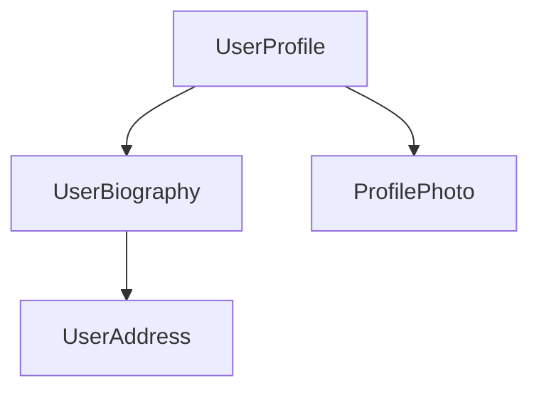

Here, the `UserProfile` component uses several other components to produce the final page.

To import and use a component, you need to:
1. In your component's TypeScript file, add an `import` statement for the component you want to use.
2. In your `@Component` decorator, add an entry to the `imports` array for the component you want to use.
3. In your component's template, add an element that matches the selector of the component you want to use.

Here's an example of a `UserProfile` component importing a `ProfilePhoto` component:

```angular-ts
// user-profile.ts
import {ProfilePhoto} from 'profile-photo.ts';

@Component({
  selector: 'user-profile',
  imports: [ProfilePhoto],
  template: `
    <h1>User profile</h1>
    <profile-photo />
    <p>This is the user profile page</p>
  `,
})
export class UserProfile {
  // Component behavior is defined in here
}
```

Tip: Want to know more about Angular components? See the [In-depth Components guide](guide/components) for the full details.

#### Next Step

Now that you know how components work in Angular, it's time to learn how we add and manage dynamic data in our application.

<docs-pill-row>
  <docs-pill title="Reactivity with signals" href="essentials/signals" />
  <docs-pill title="In-depth components guide" href="guide/components" />
</docs-pill-row>

---


(From dependency-injection.md)

<docs-decorative-header title="Dependency Injection" imgSrc="adev/src/assets/images/dependency_injection.svg"> <!-- markdownlint-disable-line -->
Reuse code and control behaviors across your application and tests.
</docs-decorative-header>

When you need to share logic between components, Angular leverages the design pattern of [dependency injection](guide/di) that allows you to create a “service” which allows you to inject code into components while managing it from a single source of truth.

#### What are services?

Services are reusable pieces of code that can be injected.

Similar to defining a component, services are comprised of the following:

- A **TypeScript decorator** that declares the class as an Angular service via `@Injectable` and allows you to define what part of the application can access the service via the `providedIn` property (which is typically `'root'`) to allow a service to be accessed anywhere within the application.
- A **TypeScript class** that defines the desired code that will be accessible when the service is injected

Here is an example of a `Calculator` service.

```angular-ts
import {Injectable} from '@angular/core';

@Injectable({providedIn: 'root'})
export class Calculator {
  add(x: number, y: number) {
    return x + y;
  }
}
```

#### How to use a service

When you want to use a service in a component, you need to:

1. Import the service
2. Declare a class field where the service is injected. Assign the class field to the result of the call of the built-in function `inject` which creates the service

Here’s what it might look like in the `Receipt` component:

```angular-ts
import { Component, inject } from '@angular/core';
import { Calculator } from './calculator';

@Component({
  selector: 'app-receipt',
  template: `<h1>The total is {{ totalCost }}</h1>`,
})

export class Receipt {
  private calculator = inject(Calculator);
  totalCost = this.calculator.add(50, 25);
}
```

In this example, the `Calculator` is being used by calling the Angular function `inject` and passing in the service to it.

#### Next Step

<docs-pill-row>
  <docs-pill title="Next Steps After Essentials" href="essentials/next-steps" />
  <docs-pill title="In-depth dependency injection guide" href="guide/di" />
</docs-pill-row>

---


(From next-steps.md)

<docs-decorative-header title="Next Steps" imgSrc="adev/src/assets/images/roadmap.svg"> <!-- markdownlint-disable-line -->
</docs-decorative-header>

Now that you have been introduced to main concepts of Angular - you're ready to put what you learned into practices with our interactive tutorials and learn more with our in-depth guides.

#### Playground

Try out Angular in an interactive code editor to further explore the concepts you've learned.

<docs-pill-row>
  <docs-pill title="Play with Angular!" href="playground" />
</docs-pill-row>

#### Tutorials

Put these main concepts into practice with our in-browser tutorial or build your first app locally with the Angular CLI.

<docs-pill-row>
  <docs-pill title="Learn Angular's fundamentals" href="tutorials/learn-angular" />
  <docs-pill title="Build your first Angular app" href="tutorials/first-app" />
</docs-pill-row>

#### In-depth Guides

Here are some in-depth guides you might be interested in reading:

<docs-pill-row>
  <docs-pill title="Components In-depth Guide" href="guide/components/importing" />
  <docs-pill title="Template In-depth Guide" href="guide/templates" />
  <docs-pill title="Forms In-depth Guide" href="/guide/forms" />
</docs-pill-row>

To see the rest of our in-depth guides, check out the main navigation.

---


(From overview.md)

<docs-decorative-header title="Essentials" imgSrc="adev/src/assets/images/what_is_angular.svg"> <!-- markdownlint-disable-line -->
A short introduction to some of Angular's main concepts.
</docs-decorative-header>

#### Interested in Angular?

Welcome! This _Essentials_ guide explains some of Angular's main concepts, helping you understand what it's like to use the framework. This guide focuses on just a few building blocks as a short introduction. If you're looking for deep, comprehensive documentation, you can navigate to specific _In-depth Guides_ from the [documentation landing page](overview).

If you prefer to immediately start writing some code, you can [skip straight to the hands-on tutorial](tutorials/learn-angular).

##### Before you start

This site expects that you're familiar with HTML, CSS and TypeScript. If you are totally new to web development, you should seek out some more introductory content before coming back here.

In particular, you should be familiar with the following concepts:

- [JavaScript Classes](https://developer.mozilla.org/docs/Web/JavaScript/Reference/Classes)
- [TypeScript fundamentals](https://www.typescriptlang.org/docs/handbook/typescript-in-5-minutes.html)
- [TypeScript Decorators](https://www.typescriptlang.org/docs/handbook/decorators.html)

#### Next Step

Ready to jump in? It's time to learn about components in Angular!

<docs-pill-row>
  <docs-pill title="Composing with Components" href="essentials/components" />
</docs-pill-row>

---


(From signals.md)

<docs-decorative-header title="Signals" imgSrc="adev/src/assets/images/signals.svg"> <!-- markdownlint-disable-line -->
Create and manage dynamic data.
</docs-decorative-header>

In Angular, you use *signals* to create and manage state. A signal is a lightweight wrapper around a value.

Use the `signal` function to create a signal for holding local state:

```typescript
import {signal} from '@angular/core';

// Create a signal with the `signal` function.
const firstName = signal('Morgan');

// Read a signal value by calling it— signals are functions.
console.log(firstName());

// Change the value of this signal by calling its `set` method with a new value.
firstName.set('Jaime');

// You can also use the `update` method to change the value
// based on the previous value.
firstName.update(name => name.toUpperCase()); 
```

Angular tracks where signals are read and when they're updated. The framework uses this information to do additional work, such as updating the DOM with new state. This ability to respond to changing signal values over time is known as *reactivity*.

#### Computed expressions

A `computed` is a signal that produces its value based on other signals.

```typescript
import {signal, computed} from '@angular/core';

const firstName = signal('Morgan');
const firstNameCapitalized = computed(() => firstName().toUpperCase());

console.log(firstNameCapitalized()); // MORGAN
``` 

A `computed` signal is read-only; it does not have a `set` or an `update` method. Instead, the value of the `computed` signal automatically changes when any of the signals it reads change:

```typescript
import {signal, computed} from '@angular/core';

const firstName = signal('Morgan');
const firstNameCapitalized = computed(() => firstName().toUpperCase());
console.log(firstNameCapitalized()); // MORGAN

firstName.set('Jaime');
console.log(firstNameCapitalized()); // JAIME
```

#### Using signals in components

Use `signal` and `computed` inside your components to create and manage state:

```typescript
@Component({/* ... */})
export class UserProfile {
  isTrial = signal(false);
  isTrialExpired = signal(false);
  showTrialDuration = computed(() => this.isTrial() && !this.isTrialExpired());

  activateTrial() {
    this.isTrial.set(true);
  }
}
```

Tip: Want to know more about Angular Signals? See the [In-depth Signals guide](guide/signals) for the full details.

#### Next Step

Now that you have learned how to declare and manage dynamic data, it's time to learn how to use that data inside of templates.

<docs-pill-row>
  <docs-pill title="Dynamic interfaces with templates" href="essentials/templates" />
  <docs-pill title="In-depth signals guide" href="guide/signals" />
</docs-pill-row>

---


(From templates.md)

<docs-decorative-header title="Templates" imgSrc="adev/src/assets/images/templates.svg"> <!-- markdownlint-disable-line -->
Use Angular's template syntax to create dynamic user interfaces.
</docs-decorative-header>

Component templates aren't just static HTML— they can use data from your component class and set up handlers for user interaction.

#### Showing dynamic text

In Angular, a *binding* creates a dynamic connection between a component's template and its data. This connection ensures that changes to the component's data automatically update the rendered template.

You can create a binding to show some dynamic text in a template by using double curly-braces:

```angular-ts
@Component({
  selector: 'user-profile',
  template: `<h1>Profile for {{userName()}}</h1>`,
})
export class TodoListItem {
  userName = signal('pro_programmer_123');
}
```

When Angular renders the component, you see:

```html
<h1>Profile for pro_programmer_123</h1>
```

Angular automatically keeps the binding up-to-date when the value of the signal changes. Building on
the example above, if we update the value of the `userName` signal:

```typescript
this.userName.set('cool_coder_789');
```

The rendered page updates to reflect the new value:

```html
<h1>Profile for cool_coder_789</h1>
```

#### Setting dynamic properties and attributes

Angular supports binding dynamic values into DOM properties with square brackets:

```angular-ts
@Component({
  /*...*/
  // Set the `disabled` property of the button based on the value of `isValidUserId`.
  template: `<button [disabled]="isValidUserId()">Save changes</button>`,
})
export class UserProfile {
  isValidUserId = signal(false);
}
```

You can also bind to HTML _attributes_ by prefixing the attribute name with `attr.`:

```angular-html
<!-- Bind the `role` attribute on the `<ul>` element to value of `listRole`. -->
<ul [attr.role]="listRole()">
```

Angular automatically updates DOM properties and attribute when the bound value changes.

#### Handling user interaction

Angular lets you add event listeners to an element in your template with parentheses:

```angular-ts
@Component({
  /*...*/
  // Add an 'click' event handler that calls the `cancelSubscription` method. 
  template: `<button (click)="cancelSubscription()">Cancel subscription</button>`,
})
export class UserProfile {
  /* ... */
  
  cancelSubscription() { /* Your event handling code goes here. */  }
}
```

If you need to pass the [event](https://developer.mozilla.org/docs/Web/API/Event) object to your listener, you can use Angular's built-in `$event` variable inside the function call:

```angular-ts
@Component({
  /*...*/
  // Add an 'click' event handler that calls the `cancelSubscription` method. 
  template: `<button (click)="cancelSubscription($event)">Cancel subscription</button>`,
})
export class UserProfile {
  /* ... */
  
  cancelSubscription(event: Event) { /* Your event handling code goes here. */  }
}
```

#### Control flow with `@if` and `@for`

You can conditionally hide and show parts of a template with Angular's `@if` block:

```angular-html
<h1>User profile</h1>

@if (isAdmin()) {
  <h2>Admin settings</h2>
  <!-- ... -->
}
```

The `@if` block also supports an optional `@else` block:

```angular-html
<h1>User profile</h1>

@if (isAdmin()) {
  <h2>Admin settings</h2>
  <!-- ... -->
} @else {
  <h2>User settings</h2>
  <!-- ... -->  
}
```

You can repeat part of a template multiple times with Angular's `@for` block:

```angular-html
<h1>User profile</h1>

<ul class="user-badge-list">
  @for (badge of badges(); track badge.id) {
    <li class="user-badge">{{badge.name}}</li>
  }
</ul>
```

Angular's uses the `track` keyword, shown in the example above, to associate data with the DOM elements created by `@for`. See [_Why is track in @for blocks important?_](guide/templates/control-flow#why-is-track-in-for-blocks-important) for more info.

Tip: Want to know more about Angular templates? See the [In-depth Templates guide](guide/templates) for the full details.

#### Next Step

Now that you have dynamic data and templates in the application, it's time to learn how to enhance templates by conditionally hiding or showing certain elements, looping over elements, and more.

<docs-pill-row>
  <docs-pill title="Modular design with dependency injection" href="essentials/dependency-injection" />
  <docs-pill title="In-depth template guide" href="guide/templates" />
</docs-pill-row>

---


(From installation.md)

<docs-decorative-header title="Installation" imgSrc="adev/src/assets/images/what_is_angular.svg"> <!-- markdownlint-disable-line -->
</docs-decorative-header>

Get started with Angular quickly with online starters or locally with your terminal.

#### Play Online

If you just want to play around with Angular in your browser without setting up a project, you can use our online sandbox:

<docs-card-container>
  <docs-card title="" href="/playground" link="Open on Playground">
  The fastest way to play with an Angular app. No setup required.
  </docs-card>
</docs-card-container>

#### Set up a new project locally

If you're starting a new project, you'll most likely want to create a local project so that you can use tooling such as Git.

##### Prerequisites

- **Node.js** - v[^18.19.1 or newer](/reference/versions)
- **Text editor** - We recommend [Visual Studio Code](https://code.visualstudio.com/)
- **Terminal** - Required for running Angular CLI commands
- **Development Tool** - To improve your development workflow, we recommend the [Angular Language Service](/tools/language-service)

##### Instructions

The following guide will walk you through setting up a local Angular project.

###### Install Angular CLI

Open a terminal (if you're using [Visual Studio Code](https://code.visualstudio.com/), you can open an [integrated terminal](https://code.visualstudio.com/docs/editor/integrated-terminal)) and run the following command:

<docs-code-multifile>
  <docs-code
    header="npm"
    >
    npm install -g @angular/cli
    </docs-code>
  <docs-code
    header="pnpm"
    >
    pnpm install -g @angular/cli
    </docs-code>
  <docs-code
    header="yarn"
    >
    yarn global add @angular/cli
    </docs-code>
  <docs-code
    header="bun"
    >
    bun install -g @angular/cli
    </docs-code>

</docs-code-multifile>

If you are having issues running this command in Windows or Unix, check out the [CLI docs](/tools/cli/setup-local#install-the-angular-cli) for more info.

###### Create a new project

In your terminal, run the CLI command `ng new` with the desired project name. In the following examples, we'll be using the example project name of `my-first-angular-app`.

<docs-code language="shell">

ng new <project-name>

</docs-code>

You will be presented with some configuration options for your project. Use the arrow and enter keys to navigate and select which options you desire.

If you don't have any preferences, just hit the enter key to take the default options and continue with the setup.

After you select the configuration options and the CLI runs through the setup, you should see the following message:

```shell
✔ Packages installed successfully.
    Successfully initialized git.
```

At this point, you're now ready to run your project locally!

###### Running your new project locally

In your terminal, switch to your new Angular project.

<docs-code language="shell">

cd my-first-angular-app

</docs-code>

All of your dependencies should be installed at this point (which you can verify by checking for the existent for a `node_modules` folder in your project), so you can start your project by running the command:

<docs-code language="shell">

npm start

</docs-code>

If everything is successful, you should see a similar confirmation message in your terminal:

```shell
Watch mode enabled. Watching for file changes...
NOTE: Raw file sizes do not reflect development server per-request transformations.
  ➜  Local:   http://localhost:4200/
  ➜  press h + enter to show help
```

And now you can visit the path in `Local` (e.g., `http://localhost:4200`) to see your application. Happy coding! 🎉

#### Next steps

Now that you've created your Angular project, you can learn more about Angular in our [Essentials guide](/essentials) or choose a topic in our in-depth guides!

---


(From what-is-angular.md)

<docs-decorative-header title="What is Angular?" imgSrc="adev/src/assets/images/what_is_angular.svg"> <!-- markdownlint-disable-line -->
</docs-decorative-header>

<big style="margin-top: 2em">
Angular is a web framework that empowers developers to build fast, reliable applications.
</big>

Maintained by a dedicated team at Google, Angular provides a broad suite of tools, APIs, and
libraries to simplify and streamline your development workflow. Angular gives you
a solid platform on which to build fast, reliable applications that scale with both the size of
your team and the size of your codebase.

**Want to see some code?** Jump over to our [Essentials](essentials) for a quick overview of
what it's like to use Angular, or get started in the [Tutorial](tutorials/learn-angular) if you
prefer following step-by-step instructions.

#### Features that power your development

<docs-card-container>
  <docs-card title="Keep your codebase organized with an opinionated component model and flexible dependency injection
system" href="guide/components" link="Get started with Components">
  Angular components make it easy to split your code into well-encapsulated parts.

  The versatile dependency injection helps you keep your code modular, loosely-coupled, and
  testable.
  </docs-card>
  <docs-card title="Get fast state updates with fine-grained reactivity based on Signals" href="guide/signals" link="Explore Angular Signals">
  Our fine-grained reactivity model, combined with compile-time optimizations, simplifies development and helps build faster apps by default.

  Granularly track how and where state is used throughout an application, giving the framework the power to render fast updates via highly optimized instructions.
  </docs-card>
  <docs-card title="Meet your performance targets with SSR, SSG, hydration, and next-generation deferred loading" href="guide/ssr" link="Read about SSR">
    Angular supports both server-side rendering (SSR) and static site generation (SSG) along
    with full DOM hydration. `@defer` blocks in templates make it simple to declaratively divide
    your templates into lazy-loadable parts.
  </docs-card>
  <docs-card title="Guarantee everything works together with Angular's first-party modules for forms, routing, and
more">
  [Angular's router](guide/routing) provides a feature-rich navigation toolkit, including support
  for route guards, data resolution, lazy-loading, and much more.

  [Angular's forms module](guide/forms) provides a standardized system for form participation and validation.
  </docs-card>
</docs-card-container>

#### Develop applications faster than ever

<docs-card-container>
  <docs-card title="Effortlessly build, serve, test, deploy with Angular CLI" href="tools/cli" link="Angular CLI">
  Angular CLI gets your project running in under a minute with the commands you need to
  grow into a deployed production application.
  </docs-card>
  <docs-card title="Visually debug, analyze, and optimize your code with the Angular DevTools browser extension" href="tools/devtools" link="Angular DevTools">
  Angular DevTools sits alongside your browser's developer tools. It helps debug and analyze your
  app, including a component tree inspector, dependency injection tree view,
  and custom performance profiling flame chart.
  </docs-card>
  <docs-card title="Never miss a version with ng update" href="cli/update" link="ng update">
  Angular CLI's `ng update` runs automated code transformations that automatically handle routine
  breaking changes, dramatically simplifying major version updates. Keeping up with the latest
  version keeps your app as fast and secure as possible.
  </docs-card>
  <docs-card title="Stay productive with IDE integration in your favorite editor" href="tools/language-service" link="Language service">
  Angular's IDE language services powers code completion, navigation, refactoring, and real-time
  diagnostics in your favorite editor.
  </docs-card>
</docs-card-container>

#### Ship with confidence

<docs-card-container>
  <docs-card title="Verified commit-by-commit against Google's colossal monorepo" href="https://cacm.acm.org/magazines/2016/7/204032-why-google-stores-billions-of-lines-of-code-in-a-single-repository/fulltext" link="Learn about Google's monorepo">
  Every Angular commit is checked against _hundreds of thousands_ of tests in Google's internal code
  repository, representing countless real-world scenarios.

  Angular is committed to stability for some of Google’s largest products, including Google Cloud.
  This commitment ensures changes are well-tested, backwards compatible, and include migration tools
  whenever possible.
  </docs-card>
  <docs-card title="Clear support policies and predictable release schedule" href="reference/releases" link="Versioning & releasing">
  Angular's predictable, time-based release schedule gives your organization confidence in the
  stability and backwards compatibility of the framework. Long Term Support (LTS) windows make sure
  you get critical security fixes when you need them. First-party update tools, guides and automated
  migration schematics help keep your apps up-to-date with the latest advancements to the framework
  and the web platform.
  </docs-card>
</docs-card-container>

#### Works at any scale

<docs-card-container>
  <docs-card title="Reach users everywhere with internationalization support" href="guide/i18n" link="Internationalization">
  Angular's internationalization features handle message translations and formatting, including
  support for unicode standard ICU syntax.
  </docs-card>
  <docs-card title="Protect your users with security by default" href="best-practices/security" link="Security">
  In collaboration with Google's world-class security engineers, Angular aims to make development
  safe by default. Built-in security features, including HTML sanitization and
  trusted type support, help protect your users from common vulnerabilities like
  cross-site scripting and cross-site request forgery.
  </docs-card>
  <docs-card title="Keep large teams productive with Vite and esbuild" href="tools/cli/build-system-migration" link="ESBuild and Vite">
  Angular CLI includes a fast, modern build pipeline using Vite and ESBuild. Developers report
  building projects with hundreds of thousands of lines of code in less than a minute.
  </docs-card>
  <docs-card title="Proven in some of Google's largest web apps">
  Large Google products build on top of Angular's architecture and help develop new features that
  further improve Angular's scalability, from [Google Fonts](https://fonts.google.com/) to [Google Cloud](https://console.cloud.google.com).
  </docs-card>
</docs-card-container>

#### Open-source first

<docs-card-container>
  <docs-card title="Made in the open on GitHub" href="https://github.com/angular/angular" link="Star our GitHub">
  Curious what we’re working on? Every PR and commit is available on our GitHub. Run into an issue or bug? We triage GitHub issues regularly to ensure we’re responsive and engaged with our community, and solving the real world problems you’re facing.
  </docs-card>
  <docs-card title="Built with transparency" href="roadmap" link="Read our public roadmap">
  Our team publishes a public roadmap of our current and future work and values your feedback. We publish Request for Comments (RFCs) to collect feedback on larger feature changes and ensure the community voice is heard while shaping the future direction of Angular.
  </docs-card>
</docs-card-container>

#### A thriving community

<docs-card-container>
  <docs-card title="Courses, blogs and resources" href="https://devlibrary.withgoogle.com/products/angular?sort=added" link="Check out DevLibrary">
  Our community is composed of talented developers, writers, instructors, podcasters, and more. The Google for Developers library is just a sample of the high quality resources available for new and experienced developers to continue developing.
  </docs-card>
  <docs-card title="Open Source" href="https://github.com/angular/angular/blob/main/CONTRIBUTING.md" link="Contribute to Angular">
  We are thankful for the open source contributors who make Angular a better framework for everyone. From fixing a typo in the docs, to adding major features, we encourage anyone interested to get started on our GitHub.
  </docs-card>
  <docs-card title="Community partnerships" href="https://developers.google.com/community/experts/directory?specialization=angular" link="Meet the Angular GDEs">
  Our team partners with individuals, educators, and enterprises to ensure we consistently are supporting developers. Angular Google Developer Experts (GDEs) represent community leaders around the world educating, organizing, and developing with Angular. Enterprise partnerships help ensure that Angular scales well for technology industry leaders.
  </docs-card>
  <docs-card title="Partnering with other Google technologies">
  Angular partners closely with other Google technologies and teams to improve the web.

  Our ongoing partnership with Chrome’s Aurora actively explores improvements to user experience across the web, developing built-in performance optimizations like NgOptimizedImage and improvements to Angular’s Core Web Vitals.

  We are also working with [Firebase](https://firebase.google.com/), [Tensorflow](https://www.tensorflow.org/), [Flutter](https://flutter.dev/), [Material Design](https://m3.material.io/), and [Google Cloud](https://cloud.google.com/) to ensure we provide meaningful integrations across the developer workflow.
  </docs-card>
</docs-card-container>

<docs-callout title="Join the momentum!">
  <docs-pill-row>
    <docs-pill href="roadmap" title="Read Angular's roadmap"/>
    <docs-pill href="playground" title="Try out our playground"/>
    <docs-pill href="tutorials" title="Learn with tutorials"/>
    <docs-pill href="https://youtube.com/playlist?list=PL1w1q3fL4pmj9k1FrJ3Pe91EPub2_h4jF" title="Watch our YouTube course"/>
    <docs-pill href="api" title="Reference our APIs"/>
  </docs-pill-row>
</docs-callout>

---

---

## Reference

(From cli.md)

### CLI Reference

| Command                           | Alias  | Description                                                       |
|:---                               |:---    |:---                                                               |
| [`add`](cli/add)                  |        | Adds support for an external library to your project.             |
| [`analytics`](cli/analytics)      |        | Configures the gathering of Angular CLI usage metrics.            |
| [`build`](cli/build)              | `b`      | Compiles an Angular application or library into an output directory named dist/ at the given output path. |
| [`cache`](cli/cache)              |        | Configure persistent disk cache and retrieve cache statistics.    |
| [`completion`](cli/completion)    |        | Set up Angular CLI autocompletion for your terminal.              |
| [`config`](cli/config)            |        | Retrieves or sets Angular configuration values in the angular.json file for the workspace. |
| [`deploy`](cli/deploy)            |        | Invokes the deploy builder for a specified project or for the default project in the workspace. |
| [`e2e`](cli/e2e)                  | `e`      | Builds and serves an Angular application, then runs end-to-end tests. |
| [`extract-i18n`](cli/extract-i18n)|        | Extracts i18n messages from source code.                          |
| [`generate`](cli/generate)        | `g`      | Generates and/or modifies files based on a schematic.             |
| [`lint`](cli/lint)                |        | Runs linting tools on Angular application code in a given project folder. |
| [`new`](cli/new)                  | `n`      | Creates a new Angular workspace. |
| [`run`](cli/run)                  |        | Runs an Architect target with an optional custom builder configuration defined in your project. |
| [`serve`](cli/serve)              | `s`, `dev`      | Builds and serves your application, rebuilding on file changes. |
| [`test`](cli/test)                | `t`      | Runs unit tests in a project. |
| [`update`](cli/update)            |        | Updates your workspace and its dependencies. See https://angular.dev/update-guide/.             |
| [`version`](cli/version)          | `v`      | Outputs Angular CLI version. |

---


(From overview.md)

### Concepts

<docs-card-container>
  <docs-card title="NgModules" link="Learn more" href="guide/ngmodules">
    NgModules is a concept that commonly used in architecture v16 and earlier to help configure the injector and the compiler and help organize related things together.
  </docs-card>
</docs-card-container>

---


(From angular-compiler-options.md)

### Angular compiler options

When you use [ahead-of-time compilation (AOT)](tools/cli/aot-compiler), you can control how your application is compiled by specifying Angular compiler options in the [TypeScript configuration file](https://www.typescriptlang.org/docs/handbook/tsconfig-json.html).

The Angular options object, `angularCompilerOptions`, is a sibling to the `compilerOptions` object that supplies standard options to the TypeScript compiler.

<docs-code header="tsconfig.json" path="adev/src/content/examples/angular-compiler-options/tsconfig.json" visibleRegion="angular-compiler-options"/>

#### Configuration inheritance with `extends`

Like the TypeScript compiler, the Angular AOT compiler also supports `extends` in the `angularCompilerOptions` section of the TypeScript configuration file.
The `extends` property is at the top level, parallel to `compilerOptions` and `angularCompilerOptions`.

A TypeScript configuration can inherit settings from another file using the `extends` property.
The configuration options from the base file are loaded first, then overridden by those in the inheriting configuration file.

For example:

<docs-code header="tsconfig.app.json" path="adev/src/content/examples/angular-compiler-options/tsconfig.app.json" visibleRegion="angular-compiler-options-app"/>

For more information, see the [TypeScript Handbook](https://www.typescriptlang.org/docs/handbook/tsconfig-json.html).

#### Template options

The following options are available for configuring the Angular AOT compiler.

##### `annotationsAs`

Modifies how Angular-specific annotations are emitted to improve tree-shaking.
Non-Angular annotations are not affected.
One of `static fields` or `decorators`. The default value is `static fields`.

* By default, the compiler replaces decorators with a static field in the class, which allows advanced tree-shakers like [Closure compiler](https://github.com/google/closure-compiler) to remove unused classes
* The `decorators` value leaves the decorators in place, which makes compilation faster.
    TypeScript emits calls to the `__decorate` helper.
    Use `--emitDecoratorMetadata` for runtime reflection.

    HELPFUL: That the resulting code cannot tree-shake properly.

##### `annotateForClosureCompiler`

<!-- vale Angular.Angular_Spelling = NO -->

When `true`, use [Tsickle](https://github.com/angular/tsickle) to annotate the emitted JavaScript with [JSDoc](https://jsdoc.app) comments needed by the [Closure Compiler](https://github.com/google/closure-compiler).
Default is `false`.

<!-- vale Angular.Angular_Spelling = YES -->

##### `compilationMode`

Specifies the compilation mode to use.
The following modes are available:

| Modes       | Details |
|:---         |:---     |
| `'full'`    | Generates fully AOT-compiled code according to the version of Angular that is currently being used. |
| `'partial'` | Generates code in a stable, but intermediate form suitable for a published library.                 |

The default value is `'full'`.

For most applications, `'full'` is the correct compilation mode.

Use `'partial'` for independently published libraries, such as NPM packages.
`'partial'` compilations output a stable, intermediate format which better supports usage by applications built at different Angular versions from the library.
Libraries built at "HEAD" alongside their applications and using the same version of Angular such as in a mono-repository can use `'full'` since there is no risk of version skew.

##### `disableExpressionLowering`

When `true`, the default, transforms code that is or could be used in an annotation, to allow it to be imported from template factory modules.
See [metadata rewriting](tools/cli/aot-compiler#metadata-rewriting) for more information.

When `false`, disables this rewriting, requiring the rewriting to be done manually.

##### `disableTypeScriptVersionCheck`

When `true`, the compiler does not look at the TypeScript version and does not report an error when an unsupported version of TypeScript is used.
Not recommended, as unsupported versions of TypeScript might have undefined behavior.
Default is `false`.

##### `enableI18nLegacyMessageIdFormat`

Instructs the Angular template compiler to create legacy ids for messages that are tagged in templates by the `i18n` attribute.
See [Mark text for translations][GuideI18nCommonPrepareMarkTextInComponentTemplate] for more information about marking messages for localization.

Set this option to `false` unless your project relies upon translations that were created earlier using legacy IDs.
Default is `true`.

The pre-Ivy message extraction tooling created a variety of legacy formats for extracted message IDs.
These message formats have some issues, such as whitespace handling and reliance upon information inside the original HTML of a template.

The new message format is more resilient to whitespace changes, is the same across all translation file formats, and can be created directly from calls to `$localize`.
This allows `$localize` messages in application code to use the same ID as identical `i18n` messages in component templates.

##### `enableResourceInlining`

When `true`, replaces the `templateUrl` and `styleUrls` properties in all `@Component` decorators with inline content in the `template` and `styles` properties.

When enabled, the `.js` output of `ngc` does not include any lazy-loaded template or style URLs.

For library projects created with the Angular CLI, the development configuration default is `true`.

##### `enableLegacyTemplate`

When `true`, enables the deprecated `<template>` element in place of `<ng-template>`.
Default is `false`.
Might be required by some third-party Angular libraries.

##### `flatModuleId`

The module ID to use for importing a flat module \(when `flatModuleOutFile` is `true`\).
References created by the template compiler use this module name when importing symbols from the flat module.
Ignored if `flatModuleOutFile` is `false`.

##### `flatModuleOutFile`

When `true`, generates a flat module index of the given filename and the corresponding flat module metadata.
Use to create flat modules that are packaged similarly to `@angular/core` and `@angular/common`.
When this option is used, the `package.json` for the library should refer to the created flat module index instead of the library index file.

Produces only one `.metadata.json` file, which contains all the metadata necessary for symbols exported from the library index.
In the created `.ngfactory.js` files, the flat module index is used to import symbols. Symbols that include both the public API from the library index and shrouded internal symbols.

By default, the `.ts` file supplied in the `files` field is assumed to be the library index.
If more than one `.ts` file is specified, `libraryIndex` is used to select the file to use.
If more than one `.ts` file is supplied without a `libraryIndex`, an error is produced.

A flat module index `.d.ts` and `.js` is created with the given `flatModuleOutFile` name in the same location as the library index `.d.ts` file.

For example, if a library uses the `public_api.ts` file as the library index of the module, the `tsconfig.json` `files` field would be `["public_api.ts"]`.
The `flatModuleOutFile` option could then be set, for example, to `"index.js"`, which produces `index.d.ts` and `index.metadata.json` files.
The `module` field of the library's `package.json` would be `"index.js"` and the `typings` field would be `"index.d.ts"`.

##### `fullTemplateTypeCheck`

When `true`, the recommended value, enables the [binding expression validation](tools/cli/aot-compiler#binding-expression-validation) phase of the template compiler. This phase uses TypeScript to verify binding expressions.
For more information, see [Template type checking](tools/cli/template-typecheck).

Default is `false`, but when you use the Angular CLI command `ng new --strict`, it is set to `true` in the new project's configuration.

IMPORTANT: The `fullTemplateTypeCheck` option has been deprecated in Angular 13 in favor of the `strictTemplates` family of compiler options.

##### `generateCodeForLibraries`

When `true`, creates factory files \(`.ngfactory.js` and `.ngstyle.js`\) for `.d.ts` files with a corresponding `.metadata.json` file. The default value is `true`.

When `false`, factory files are created only for `.ts` files.
Do this when using factory summaries.

##### `preserveWhitespaces`

When `false`, the default, removes blank text nodes from compiled templates, which results in smaller emitted template factory modules.
Set to `true` to preserve blank text nodes.

HELPFUL: When using hydration, it is recommended that you use `preserveWhitespaces: false`, which is the default value. If you choose to enable preserving whitespaces by adding `preserveWhitespaces: true` to your tsconfig, it is possible you may encounter issues with hydration. This is not yet a fully supported configuration. Ensure this is also consistently set between the server and client tsconfig files. See the [hydration guide](guide/hydration#preserve-whitespaces) for more details.

##### `skipMetadataEmit`

When `true`, does not produce `.metadata.json` files.
Default is `false`.

The `.metadata.json` files contain information needed by the template compiler from a `.ts` file that is not included in the `.d.ts` file produced by the TypeScript compiler.
This information includes, for example, the content of annotations, such as a component's template, which TypeScript emits to the `.js` file but not to the `.d.ts` file.

You can set to `true` when using factory summaries, because the factory summaries include a copy of the information that is in the `.metadata.json` file.

Set to `true` if you are using TypeScript's `--outFile` option, because the metadata files are not valid for this style of TypeScript output.
The Angular community does not recommend using `--outFile` with Angular.
Use a bundler, such as [webpack](https://webpack.js.org), instead.

##### `skipTemplateCodegen`

When `true`, does not emit `.ngfactory.js` and `.ngstyle.js` files.
This turns off most of the template compiler and disables the reporting of template diagnostics.

Can be used to instruct the template compiler to produce `.metadata.json` files for distribution with an `npm` package. This avoids the production of `.ngfactory.js` and `.ngstyle.js` files that cannot be distributed to `npm`.

For library projects created with the Angular CLI, the development configuration default is `true`.

##### `strictMetadataEmit`

When `true`, reports an error to the `.metadata.json` file if `"skipMetadataEmit"` is `false`.
Default is `false`.
Use only when `"skipMetadataEmit"` is `false` and `"skipTemplateCodegen"` is `true`.

This option is intended to verify the `.metadata.json` files emitted for bundling with an `npm` package.
The validation is strict and can emit errors for metadata that would never produce an error when used by the template compiler.
You can choose to suppress the error emitted by this option for an exported symbol by including `@dynamic` in the comment documenting the symbol.

It is valid for `.metadata.json` files to contain errors.
The template compiler reports these errors if the metadata is used to determine the contents of an annotation.
The metadata collector cannot predict the symbols that are designed for use in an annotation. It preemptively includes error nodes in the metadata for the exported symbols.
The template compiler can then use the error nodes to report an error if these symbols are used.

If the client of a library intends to use a symbol in an annotation, the template compiler does not normally report this. It gets reported after the client actually uses the symbol.
This option allows detection of these errors during the build phase of the library and is used, for example, in producing Angular libraries themselves.

For library projects created with the Angular CLI, the development configuration default is `true`.

##### `strictInjectionParameters`

When `true`, reports an error for a supplied parameter whose injection type cannot be determined.
When `false`, constructor parameters of classes marked with `@Injectable` whose type cannot be resolved produce a warning.
The recommended value is `true`, but the default value is `false`.

When you use the Angular CLI command `ng new --strict`, it is set to `true` in the created project's configuration.

##### `strictTemplates`

When `true`, enables [strict template type checking](tools/cli/template-typecheck#strict-mode).

The strictness flags that this option enables allow you to turn on and off specific types of strict template type checking.
See [troubleshooting template errors](tools/cli/template-typecheck#troubleshooting-template-errors).

When you use the Angular CLI command `ng new --strict`, it is set to `true` in the new project's configuration.

##### `strictStandalone`

When `true`, reports an error if a component, directive, or pipe is not standalone.

##### `trace`

When `true`, prints extra information while compiling templates.
Default is `false`.

#### Command line options

Most of the time, you interact with the Angular Compiler indirectly using [Angular CLI](reference/configs/angular-compiler-options). When debugging certain issues, you might find it useful to invoke the Angular Compiler directly.
You can use the `ngc` command provided by the `@angular/compiler-cli` npm package to call the compiler from the command line.

The `ngc` command is a wrapper around TypeScript's `tsc` compiler command. The Angular Compiler is primarily configured through `tsconfig.json` while Angular CLI is primarily configured through `angular.json`.

Besides the configuration file, you can also use [`tsc` command line options](https://www.typescriptlang.org/docs/handbook/compiler-options.html) to configure `ngc`.

[GuideI18nCommonPrepareMarkTextInComponentTemplate]: guide/i18n/prepare#mark-text-in-component-template "Mark text in component template - Prepare component for translation | Angular"

---


(From file-structure.md)

### Workspace and project file structure

You develop applications in the context of an Angular workspace.
A workspace contains the files for one or more projects.
A project is the set of files that comprise an application or a shareable library.

The Angular CLI `ng new` command creates a workspace.

<docs-code language="shell">

ng new my-project

</docs-code>

When you run this command, the CLI installs the necessary Angular npm packages and other dependencies in a new workspace, with a root-level application named *my-project*.

By default, `ng new` creates an initial skeleton application at the root level of the workspace, along with its end-to-end tests.
The skeleton is for a simple welcome application that is ready to run and easy to modify.
The root-level application has the same name as the workspace, and the source files reside in the `src/` subfolder of the workspace.

This default behavior is suitable for a typical "multi-repo" development style where each application resides in its own workspace.
Beginners and intermediate users are encouraged to use `ng new` to create a separate workspace for each application.

Angular also supports workspaces with [multiple projects](#multiple-projects).
This type of development environment is suitable for advanced users who are developing shareable libraries,
and for enterprises that use a "monorepo" development style, with a single repository and global configuration for all Angular projects.

To set up a monorepo workspace, you should skip creating the root application.
See [Setting up for a multi-project workspace](#multiple-projects) below.

#### Workspace configuration files

All projects within a workspace share a [configuration](reference/configs/workspace-config).
The top level of the workspace contains workspace-wide configuration files, configuration files for the root-level application, and subfolders for the root-level application source and test files.

| Workspace configuration files | Purpose                                                                                                                                                                                                                                                                                                          |
|:---                           |:---                                                                                                                                                                                                                                                                                                              |
| `.editorconfig`               | Configuration for code editors. See [EditorConfig](https://editorconfig.org).                                                                                                                                                                                                                                    |
| `.gitignore`                  | Specifies intentionally untracked files that [Git](https://git-scm.com) should ignore.                                                                                                                                                                                                                           |
| `README.md`                   | Documentation for the workspace.                                                                                                                                                                                                                                                                                 |
| `angular.json`                | CLI configuration for all projects in the workspace, including configuration options for how to build, serve, and test each project. For details, see [Angular Workspace Configuration](reference/configs/workspace-config).                                                                                     |
| `package.json`                | Configures [npm package dependencies](reference/configs/npm-packages) that are available to all projects in the workspace. See [npm documentation](https://docs.npmjs.com/files/package.json) for the specific format and contents of this file.                                                                 |
| `package-lock.json`           | Provides version information for all packages installed into `node_modules` by the npm client. See [npm documentation](https://docs.npmjs.com/files/package-lock.json) for details.                                                                                                                              |
| `src/`                        | Source files for the root-level application project.                                                                                                                                                                                                                                                             |
| `public/`                     | Contains image and other asset files to be served as static files by the dev server and copied as-is when you build your application.                                                                                             |
| `node_modules/`               | Installed [npm packages](reference/configs/npm-packages) for the entire workspace. Workspace-wide `node_modules` dependencies are visible to all projects.                                                                                                                                                       |
| `tsconfig.json`               | The base [TypeScript](https://www.typescriptlang.org) configuration for projects in the workspace. All other configuration files inherit from this base file. For more information, see the [relevant TypeScript documentation](https://www.typescriptlang.org/docs/handbook/tsconfig-json.html#tsconfig-bases). |

#### Application project files

By default, the CLI command `ng new my-app` creates a workspace folder named "my-app" and generates a new application skeleton in a `src/` folder at the top level of the workspace.
A newly generated application contains source files for a root module, with a root component and template.

When the workspace file structure is in place, you can use the `ng generate` command on the command line to add functionality and data to the application.
This initial root-level application is the *default app* for CLI commands (unless you change the default after creating [additional apps](#multiple-projects)).

For a single-application workspace, the `src` subfolder of the workspace contains the source files (application logic, data, and assets) for the root application.
For a multi-project workspace, additional projects in the `projects` folder contain a `project-name/src/` subfolder with the same structure.

##### Application source files

Files at the top level of `src/` support running your application.
Subfolders contain the application source and application-specific configuration.

| Application support files | Purpose                                                                                                                                                                                                                           |
|:---                       |:---                                                                                                                                                                                                                               |
| `app/`                    | Contains the component files in which your application logic and data are defined. See details [below](#app-src).                                                                                                                 |
| `favicon.ico`             | An icon to use for this application in the bookmark bar.                                                                                                                                                                          |
| `index.html`              | The main HTML page that is served when someone visits your site. The CLI automatically adds all JavaScript and CSS files when building your app, so you typically don't need to add any `<script>` or`<link>` tags here manually. |
| `main.ts`                 | The main entry point for your application.                                                                                                                                                                                        |
| `styles.css`              | Global CSS styles applied to the entire application.                                                                                                                                                                              |

Inside the `src` folder, the `app` folder contains your project's logic and data.
Angular components, templates, and styles go here.

| `src/app/` files        | Purpose                                                                                                                                                                                                                                                                            |
|:---                     |:---                                                                                                                                                                                                                                                                                |
| `app.config.ts`         | Defines the application configuration that tells Angular how to assemble the application. As you add more providers to the app, they should be declared here.<br><br>*Only generated when using the `--standalone` option.*                                                        |
| `app.component.ts`      | Defines the application's root component, named `AppComponent`. The view associated with this root component becomes the root of the view hierarchy as you add components and services to your application.                                                                        |
| `app.component.html`    | Defines the HTML template associated with `AppComponent`.                                                                                                                                                                                                                          |
| `app.component.css`     | Defines the CSS stylesheet for `AppComponent`.                                                                                                                                                                                                                                     |
| `app.component.spec.ts` | Defines a unit test for `AppComponent`.                                                                                                                                                                                                                                            |
| `app.module.ts`         | Defines the root module, named `AppModule`, that tells Angular how to assemble the application. Initially declares only the `AppComponent`. As you add more components to the app, they must be declared here.<br><br>*Only generated when using the `--standalone false` option.* |
| `app.routes.ts`         | Defines the application's routing configuration.                                                                                                                                                                                                                                   |

##### Application configuration files

Application-specific configuration files for the root application reside at the workspace root level.
For a multi-project workspace, project-specific configuration files are in the project root, under `projects/project-name/`.

Project-specific [TypeScript](https://www.typescriptlang.org) configuration files inherit from the workspace-wide `tsconfig.json`.

| Application-specific configuration files | Purpose                                                                                                                                                                                             |
|:---                                      |:---                                                                                                                                                                                                 |
| `tsconfig.app.json`                      | Application-specific [TypeScript configuration](https://www.typescriptlang.org/docs/handbook/tsconfig-json.html), including [Angular compiler options](reference/configs/angular-compiler-options). |
| `tsconfig.spec.json`                     | [TypeScript configuration](https://www.typescriptlang.org/docs/handbook/tsconfig-json.html) for application tests.                                                                                  |

#### Multiple projects

A multi-project workspace is suitable for an organization that uses a single repository and global configuration for multiple Angular projects (the "monorepo" model).
A multi-project workspace also supports library development.

##### Setting up for a multi-project workspace

If you intend to have multiple projects in a workspace, you can skip the initial application generation when you create the workspace, and give the workspace a unique name.
The following command creates a workspace with all of the workspace-wide configuration files, but no root-level application.

<docs-code language="shell">

ng new my-workspace --no-create-application

</docs-code>

You can then generate applications and libraries with names that are unique within the workspace.

<docs-code language="shell">

cd my-workspace
ng generate application my-app
ng generate library my-lib

</docs-code>

##### Multiple project file structure

The first explicitly generated application goes into the `projects` folder along with all other projects in the workspace.
Newly generated libraries are also added under `projects`.
When you create projects this way, the file structure of the workspace is entirely consistent with the structure of the [workspace configuration file](reference/configs/workspace-config), `angular.json`.

```markdown
my-workspace/
  ├── …                (workspace-wide configuration files)
  └── projects/        (applications and libraries)
      ├── my-app/      (an explicitly generated application)
      │   └── …        (application-specific code and configuration)
      └── my-lib/      (a generated library)
          └── …        (library-specific code and configuration)
```

#### Library project files

When you generate a library using the CLI (with a command such as `ng generate library my-lib`), the generated files go into the `projects/` folder of the workspace.
For more information about creating your own libraries, see  [Creating Libraries](tools/libraries/creating-libraries).

Unlike an application, a library has its own `package.json` configuration file.

Under the `projects/` folder, the `my-lib` folder contains your library code.

| Library source files     | Purpose                                                                                                                                                                                         |
|:---                      |:---                                                                                                                                                                                             |
| `src/lib`                | Contains your library project's logic and data. Like an application project, a library project can contain components, services, modules, directives, and pipes.                                |
| `src/public-api.ts`      | Specifies all files that are exported from your library.                                                                                                                                        |
| `ng-package.json`        | Configuration file used by [ng-packagr](https://github.com/ng-packagr/ng-packagr) for building your library.                                                                                    |
| `package.json`           | Configures [npm package dependencies](reference/configs/npm-packages) that are required for this library.                                                                                       |
| `tsconfig.lib.json`      | Library-specific [TypeScript Configuration](https://www.typescriptlang.org/docs/handbook/tsconfig-json.html), including [Angular compiler options](reference/configs/angular-compiler-options). |
| `tsconfig.lib.prod.json` | Library-specific [TypeScript Configuration](https://www.typescriptlang.org/docs/handbook/tsconfig-json.html) that is used when building the library in production mode.                         |
| `tsconfig.spec.json`     | [TypeScript Configuration](https://www.typescriptlang.org/docs/handbook/tsconfig-json.html) for the library's unit tests.                                                                       |

---


(From npm-packages.md)

### Workspace npm dependencies

The Angular Framework, Angular CLI, and components used by Angular applications are packaged as [npm packages](https://docs.npmjs.com/getting-started/what-is-npm "What is npm?") and distributed using the [npm registry](https://docs.npmjs.com).

You can download and install these npm packages by using the [npm CLI client](https://docs.npmjs.com/cli/install).
By default, Angular CLI uses the npm client.

HELPFUL: See [Local Environment Setup](tools/cli/setup-local "Setting up for Local Development") for information about the required versions and installation of `Node.js` and `npm`.

If you already have projects running on your machine that use other versions of Node.js and npm, consider using [nvm](https://github.com/creationix/nvm) to manage the multiple versions of Node.js and npm.

#### `package.json`

`npm` installs the packages identified in a [`package.json`](https://docs.npmjs.com/files/package.json) file.

The CLI command `ng new` creates a `package.json` file when it creates the new workspace.
This `package.json` is used by all projects in the workspace, including the initial application project that is created by the CLI when it creates the workspace.
Libraries created with `ng generate library` will include their own `package.json` file.

Initially, this `package.json` includes *a starter set of packages*, some of which are required by Angular and others that support common application scenarios.
You add packages to `package.json` as your application evolves.

#### Default Dependencies

The following Angular packages are included as dependencies in the default `package.json` file for a new Angular workspace.
For a complete list of Angular packages, see the [API reference](api).

| Package name                                                              | Details                                                                                                                                                                                        |
|:---                                                                       |:---                                                                                                                                                                                            |
| [`@angular/animations`](api#animations)                                   | Angular's animations library makes it easy to define and apply animation effects such as page and list transitions. For more information, see the [Animations guide](guide/animations).        |
| [`@angular/common`](api#common)                                           | The commonly-needed services, pipes, and directives provided by the Angular team.                                                                                                              |
| `@angular/compiler`                                                       | Angular's template compiler. It understands Angular templates and can convert them to code that makes the application run.                                                                     |
| `@angular/compiler-cli`                                                   | Angular's compiler which is invoked by the Angular CLI's `ng build` and `ng serve` commands. It processes Angular templates with `@angular/compiler` inside a standard TypeScript compilation. |
| [`@angular/core`](api#core)                                               | Critical runtime parts of the framework that are needed by every application. Includes all metadata decorators such as `@Component`, dependency injection, and component lifecycle hooks.      |
| [`@angular/forms`](api#forms)                                             | Support for both [template-driven](guide/forms) and [reactive forms](guide/forms/reactive-forms). See [Introduction to forms](guide/forms).                                                    |
| [`@angular/platform-browser`](api#platform-browser)                       | Everything DOM and browser related, especially the pieces that help render into the DOM.                                                                                                       |
| [`@angular/platform-browser-dynamic`](api#platform-browser-dynamic)       | Includes [providers](api/core/Provider) and methods to compile and run the application on the client using the [JIT compiler](tools/cli/aot-compiler#choosing-a-compiler).                     |
| [`@angular/router`](api#router)                                           | The router module navigates among your application pages when the browser URL changes. For more information, see [Routing and Navigation](guide/routing).                                       |
| [`@angular/cli`](https://github.com/angular/angular-cli)                  | Contains the Angular CLI binary for running `ng` commands.                                                                                                                                     |
| [`@angular-devkit/build-angular`](https://github.com/angular/angular-cli) | Contains default CLI builders for bundling, testing, and serving Angular applications and libraries.                                                                                           |
| `rxjs`                                                                    | A library for reactive programming using `Observables`.                                                                                                                                        |
| [`zone.js`](https://github.com/angular/zone.js)                           | Angular relies on `zone.js`` to run Angular's change detection processes when native JavaScript operations raise events.                                                                       |
| [`typescript`](https://www.npmjs.com/package/typescript)                  | The TypeScript compiler, language server, and built-in type definitions.                                                                                                                       |

---


(From workspace-config.md)

### Angular workspace configuration

The `angular.json` file at the root level of an Angular workspace provides workspace-wide and project-specific configuration defaults. These are used for build and development tools provided by the Angular CLI.
Path values given in the configuration are relative to the root workspace directory.

#### General JSON structure

At the top-level of `angular.json`, a few properties configure the workspace and a `projects` section contains the remaining per-project configuration options.
You can override Angular CLI defaults set at the workspace level through defaults set at the project level.
You can also override defaults set at the project level using the command line.

The following properties, at the top-level of the file, configure the workspace.

| Properties       | Details                                                                                                                                                                                        |
|:---              |:---                                                                                                                                                                                            |
| `version`        | The configuration-file version.                                                                                                                                                                |
| `newProjectRoot` | Path where new projects are created through tools like `ng generate application` or `ng generate library`. Path can be absolute or relative to the workspace directory. Defaults to `projects` |
| `cli`            | A set of options that customize the [Angular CLI](tools/cli). See [Angular CLI configuration options](#angular-cli-configuration-options) below.                                               |
| `schematics`     | A set of [schematics](tools/cli/schematics) that customize the `ng generate` sub-command option defaults for this workspace. See [schematics](#schematics) below.                              |
| `projects`       | Contains a subsection for each application or library in the workspace, with project-specific configuration options.                                                                           |

The initial application that you create with `ng new app-name` is listed under "projects":

When you create a library project with `ng generate library`, the library project is also added to the `projects` section.

HELPFUL: The `projects` section of the configuration file does not correspond exactly to the workspace file structure.
<!-- markdownlint-disable-next-line MD032 -->
* The initial application created by `ng new` is at the top level of the workspace file structure.
* Other applications and libraries are under the `projects` directory by default.

For more information, see [Workspace and project file structure](reference/configs/file-structure).

#### Angular CLI configuration options

The following properties are a set of options that customize the Angular CLI.

| Property              | Details                                                                                                                                                                    | Value type                            | Default value |
|:---                   |:---                                                                                                                                                                        |:---                                   |:---           |
| `analytics`           | Share anonymous usage data with the Angular Team. A boolean value indicates whether or not to share data, while a UUID string shares data using a pseudonymous identifier. | `boolean` \| `string`                 | `false`       |
| `cache`               | Control [persistent disk cache](cli/cache) used by [Angular CLI Builders](tools/cli/cli-builder).                                                                          | [Cache options](#cache-options)       | `{}`          |
| `schematicCollections`| List schematics collections to use in `ng generate`.                                                                                                                       | `string[]`                            | `[]`          |
| `packageManager`      | The preferred package manager tool to use.                                                                                                                                 | `npm` \| `cnpm` \| `pnpm` \| `yarn`   | `npm`         |
| `warnings`            | Control Angular CLI specific console warnings.                                                                                                                             | [Warnings options](#warnings-options) | `{}`          |

##### Cache options

| Property      | Details                                                                                                                                                                                                                                      | Value type               | Default value    |
|:---           |:---                                                                                                                                                                                                                                          |:---                      |:---              |
| `enabled`     | Configure whether disk caching is enabled for builds.                                                                                                                                                                                        | `boolean`                | `true`           |
| `environment` | Configure in which environment disk cache is enabled.<br><br>* `ci` enables caching only in continuous integration (CI) environments.<br>* `local` enables caching only *outside* of CI environments.<br>* `all` enables caching everywhere. | `local` \| `ci` \| `all` | `local`          |
| `path`        | The directory used to stored cache results.                                                                                                                                                                                                  | `string`                 | `.angular/cache` |

##### Warnings options

| Property          | Details                                                                         | Value type | Default value |
|:---               |:---                                                                             |:---        |:---           |
| `versionMismatch` | Show a warning when the global Angular CLI version is newer than the local one. | `boolean`  | `true`        |

#### Project configuration options

The following top-level configuration properties are available for each project, under `projects['project-name']`.

| Property      | Details                                                                                                                                                                              | Value type                                                      | Default value   |
|:---           |:---                                                                                                                                                                                  |:---                                                             |:---             |
| `root`        | The root directory for this project's files, relative to the workspace directory. Empty for the initial application, which resides at the top level of the workspace.                | `string`                                                        | None (required) |
| `projectType` | One of "application" or "library" An application can run independently in a browser, while a library cannot.                                                                         | `application` \| `library`                                      | None (required) |
| `sourceRoot`  | The root directory for this project's source files.                                                                                                                                  | `string`                                                        | `''`            |
| `prefix`      | A string that Angular prepends to selectors when generating new components, directives, and pipes using `ng generate`. Can be customized to identify an application or feature area. | `string`                                                        | `'app'`         |
| `schematics`  | A set of schematics that customize the `ng generate` sub-command option defaults for this project. See the [Generation schematics](#schematics) section.                             | See [schematics](#schematics)                                   | `{}`            |
| `architect`   | Configuration defaults for Architect builder targets for this project.                                                                                                               | See [Configuring builder targets](#configuring-builder-targets) | `{}`            |

#### Schematics

[Angular schematics](tools/cli/schematics) are instructions for modifying a project by adding new files or modifying existing files.
These can be configured by mapping the schematic name to a set of default options.

The "name" of a schematic is in the format: `<schematic-package>:<schematic-name>`.
Schematics for the default Angular CLI `ng generate` sub-commands are collected in the package [`@schematics/angular`](https://github.com/angular/angular-cli/blob/main/packages/schematics/angular/application/schema.json).
For example, the schematic for generating a component with `ng generate component` is `@schematics/angular:component`.

The fields given in the schematic's schema correspond to the allowed command-line argument values and defaults for the Angular CLI sub-command options.
You can update your workspace schema file to set a different default for a sub-command option. For example, to disable `standalone` in `ng generate component` by default:

<docs-code language="json">

{
  "projects": {
    "my-app": {
      "schematics": {
        "@schematics/angular:component": {
          "standalone": false
        }
      }
    }
  }
}

</docs-code>

#### Configuring CLI builders

Architect is the tool that the Angular CLI uses to perform complex tasks, such as compilation and test running.
Architect is a shell that runs a specified builder to perform a given task, according to a target configuration.
You can define and configure new builders and targets to extend the Angular CLI.
See [Angular CLI Builders](tools/cli/cli-builder).

##### Default Architect builders and targets

Angular defines default builders for use with specific commands, or with the general `ng run` command.
The JSON schemas that define the options and defaults for each of these builders are collected in the [`@angular-devkit/build-angular`](https://github.com/angular/angular-cli/blob/main/packages/angular_devkit/build_angular/builders.json) package.
The schemas configure options for the following builders.

##### Configuring builder targets

The `architect` section of `angular.json` contains a set of Architect targets.
Many of the targets correspond to the Angular CLI commands that run them.
Other targets can be executed using the `ng run` command, and you can define your own targets.

Each target object specifies the `builder` for that target, which is the npm package for the tool that Architect runs.
Each target also has an `options` section that configures default options for the target, and a `configurations` section that names and specifies alternative configurations for the target.
See the example in [Build target](#build-target) below.

| Property       | Details                                                                                                                                                                                              |
|:---            |:---                                                                                                                                                                                                  |
| `build`        | Configures defaults for options of the `ng build` command. See the [Build target](#build-target) section for more information.                                                                       |
| `serve`        | Overrides build defaults and supplies extra serve defaults for the `ng serve` command. Besides the options available for the `ng build` command, it adds options related to serving the application. |
| `e2e`          | Overrides build defaults for building end-to-end testing applications using the `ng e2e` command.                                                                                                    |
| `test`         | Overrides build defaults for test builds and supplies extra test-running defaults for the `ng test` command.                                                                                         |
| `lint`         | Configures defaults for options of the `ng lint` command, which performs static code analysis on project source files.                                                                               |
| `extract-i18n` | Configures defaults for options of the `ng extract-i18n` command, which extracts localized message strings from source code and outputs translation files for internationalization.                  |

HELPFUL: All options in the configuration file must use `camelCase`, rather than `dash-case` as used on the command line.

#### Build target

Each target under `architect` has the following properties:

| Property        | Details                                                                                                                                                                                                                                                |
|:---             |:---                                                                                                                                                                                                                                                    |
| `builder`       | The CLI builder used to create this target in the form of `<package-name>:<builder-name>`.                                                                                                                                                             |
| `options`       | Build target default options.                                                                                                                                                                                                                          |
| `configurations`| Alternative configurations for executing the target. Each configuration sets the default options for that intended environment, overriding the associated value under `options`. See [Alternate build configurations](#alternate-build-configurations) below. |

For example, to configure a build with optimizations disabled:

<docs-code language="json">

{
  "projects": {
    "my-app": {
      "architect": {
        "build": {
          "builder": "@angular-devkit/build-angular:application",
          "options": {
            "optimization": false
          }
        }
      }
    }
  }
}

</docs-code>

##### Alternate build configurations

Angular CLI comes with two build configurations: `production` and `development`.
By default, the `ng build` command uses the `production` configuration, which applies several build optimizations, including:

* Bundling files
* Minimizing excess whitespace
* Removing comments and dead code
* Minifying code to use short, mangled names

You can define and name extra alternate configurations (such as `staging`, for instance) appropriate to your development process.
You can select an alternate configuration by passing its name to the `--configuration` command line flag.

For example, to configure a build where optimization is enabled only for production builds (`ng build --configuration production`):

<docs-code language="json">

{
  "projects": {
    "my-app": {
      "architect": {
        "build": {
          "builder": "@angular-devkit/build-angular:application",
          "options": {
            "optimization": false
          },
          "configurations": {
            "production": {
              "optimization": true
            }
          }
        }
      }
    }
  }
}

</docs-code>

You can also pass in more than one configuration name as a comma-separated list.
For example, to apply both `staging` and `french` build configurations, use the command `ng build --configuration staging,french`.
In this case, the command parses the named configurations from left to right.
If multiple configurations change the same setting, the last-set value is the final one.
In this example, if both `staging` and `french` configurations set the output path, the value in `french` would get used.

##### Extra build and test options

The configurable options for a default or targeted build generally correspond to the options available for the [`ng build`](cli/build), [`ng serve`](cli/serve), and [`ng test`](cli/test) commands.
For details of those options and their possible values, see the [Angular CLI Reference](cli).

| Options properties         | Details                                                                                                                                                                                                                                                                |
|:---                        |:---------------------------------------------------------------------------------------------------------------------------------------------------------------------------------------------------------------------------------------------------------------------- |
| `assets`                   | An object containing paths to static assets to serve with the application. The default paths point to the project's `public` directory. See more in the [Assets configuration](#assets-configuration) section.                                       |
| `styles`                   | An array of CSS files to add to the global context of the project. Angular CLI supports CSS imports and all major CSS preprocessors. See more in the [Styles and scripts configuration](#styles-and-scripts-configuration) section.                                    |
| `stylePreprocessorOptions` | An object containing option-value pairs to pass to style preprocessors. See more in the [Styles and scripts configuration](#styles-and-scripts-configuration) section.                                                                                                 |
| `scripts`                  | An object containing JavaScript files to add to the application. The scripts are loaded exactly as if you had added them in a `<script>` tag inside `index.html`. See more in the [Styles and scripts configuration](#styles-and-scripts-configuration) section.       |
| `budgets`                  | Default size-budget type and thresholds for all or parts of your application. You can configure the builder to report a warning or an error when the output reaches or exceeds a threshold size. See [Configure size budgets](tools/cli/build#configure-size-budgets). |
| `fileReplacements`         | An object containing files and their compile-time replacements. See more in [Configure target-specific file replacements](tools/cli/build#configure-target-specific-file-replacements).                                                                                |
| `index`                    | A base HTML document which loads the application. See more in [Index configuration](#index-configuration).                                                                                                                                                                    |

#### Complex configuration values

The `assets`, `index`, `outputPath`, `styles`, and `scripts` options can have either simple path string values, or object values with specific fields.
The `sourceMap` and `optimization` options can be set to a simple boolean value. They can also be given a complex value using the configuration file.

The following sections provide more details of how these complex values are used in each case.

##### Assets configuration

Each `build` target configuration can include an `assets` array that lists files or folders you want to copy as-is when building your project.
By default, the contents of the `public/` directory are copied over.

To exclude an asset, you can remove it from the assets configuration.

You can further configure assets to be copied by specifying assets as objects, rather than as simple paths relative to the workspace root.
An asset specification object can have the following fields.

| Fields           | Details                                                                                                                                   |
|:---              |:---                                                                                                                                       |
| `glob`           | A [node-glob](https://github.com/isaacs/node-glob/blob/master/README.md) using `input` as base directory.                                 |
| `input`          | A path relative to the workspace root.                                                                                                    |
| `output`         | A path relative to `outDir`. Because of the security implications, the Angular CLI never writes files outside of the project output path. |
| `ignore`         | A list of globs to exclude.                                                                                                               |
| `followSymlinks` | Allow glob patterns to follow symlink directories. This allows subdirectories of the symlink to be searched. Defaults to `false`.         |

For example, the default asset paths can be represented in more detail using the following objects.

<docs-code language="json">

{
  "projects": {
    "my-app": {
      "architect": {
        "build": {
          "builder": "@angular-devkit/build-angular:application",
          "options": {
            "assets": [
              {
                "glob": "**/*",
                "input": "src/assets/",
                "output": "/assets/"
              },
              {
                "glob": "favicon.ico",
                "input": "src/",
                "output": "/"
              }
            ]
          }
        }
      }
    }
  }
}

</docs-code>

The following example uses the `ignore` field to exclude certain files in the assets directory from being copied into the build:

<docs-code language="json">

{
  "projects": {
    "my-app": {
      "architect": {
        "build": {
          "builder": "@angular-devkit/build-angular:application",
          "options": {
            "assets": [
              {
                "glob": "**/*",
                "input": "src/assets/",
                "ignore": ["**/*.svg"],
                "output": "/assets/"
              }
            ]
          }
        }
      }
    }
  }
}

</docs-code>

##### Styles and scripts configuration

An array entry for the `styles` and `scripts` options can be a simple path string, or an object that points to an extra entry-point file.
The associated builder loads that file and its dependencies as a separate bundle during the build.
With a configuration object, you have the option of naming the bundle for the entry point, using a `bundleName` field.

The bundle is injected by default, but you can set `inject` to `false` to exclude the bundle from injection.
For example, the following object values create and name a bundle that contains styles and scripts, and excludes it from injection:

<docs-code language="json">

{
  "projects": {
    "my-app": {
      "architect": {
        "build": {
          "builder": "@angular-devkit/build-angular:application",
          "options": {
            "styles": [
              {
                "input": "src/external-module/styles.scss",
                "inject": false,
                "bundleName": "external-module"
              }
            ],
            "scripts": [
              {
                "input": "src/external-module/main.js",
                "inject": false,
                "bundleName": "external-module"
              }
            ]
          }
        }
      }
    }
  }
}

</docs-code>

###### Style preprocessor options

In Sass, you can make use of the `includePaths` feature for both component and global styles. This allows you to add extra base paths that are checked for imports.

To add paths, use the `stylePreprocessorOptions` option:

<docs-code language="json">

{
  "projects": {
    "my-app": {
      "architect": {
        "build": {
          "builder": "@angular-devkit/build-angular:application",
          "options": {
            "stylePreprocessorOptions": {
              "includePaths": [
                "src/style-paths"
              ]
            }
          }
        }
      }
    }
  }
}

</docs-code>

Files in that directory, such as `src/style-paths/_variables.scss`, can be imported from anywhere in your project without the need for a relative path:

<docs-code language="scss">

// src/app/app.component.scss
// A relative path works
@import '../style-paths/variables';

// But now this works as well
@import 'variables';

</docs-code>

HELPFUL: You also need to add any styles or scripts to the `test` builder if you need them for unit tests.
See also [Using runtime-global libraries inside your application](tools/libraries/using-libraries#using-runtime-global-libraries-inside-your-app).

##### Optimization configuration

The `optimization` option can be either a boolean or an object for more fine-tune configuration.
This option enables various optimizations of the build output, including:

* Minification of scripts and styles
* Tree-shaking
* Dead-code elimination
* Inlining of critical CSS
* Fonts inlining

Several options can be used to fine-tune the optimization of an application.

| Options   | Details                                                        | Value type                                                                     | Default value |
|:---       |:---                                                            |:---                                                                            |:---           |
| `scripts` | Enables optimization of the scripts output.                    | `boolean`                                                                      | `true`        |
| `styles`  | Enables optimization of the styles output.                     | `boolean` \| [Styles optimization options](#styles-optimization-options) | `true`        |
| `fonts`   | Enables optimization for fonts. This requires internet access. | `boolean` \| [Fonts optimization options](#fonts-optimization-options)   | `true`        |

###### Styles optimization options

| Options          | Details                                                                                                                  | Value type | Default value |
|:---              |:---                                                                                                                      |:---        |:---           |
| `minify`         | Minify CSS definitions by removing extraneous whitespace and comments, merging identifiers, and minimizing values.       | `boolean`  | `true`        |
| `inlineCritical` | Extract and inline critical CSS definitions to improve [First Contentful Paint](https://web.dev/first-contentful-paint). | `boolean`  | `true`        |
| `removeSpecialComments` | Remove comments in global CSS that contains `@license` or `@preserve` or that starts with `//!` or `/*!`.         | `boolean`  | `true`        |

###### Fonts optimization options

| Options  | Details                                                                                                                                                                                                             | Value type | Default value |
|:---      |:---                                                                                                                                                                                                                 |:---        |:---           |
| `inline` | Reduce [render blocking requests](https://web.dev/render-blocking-resources) by inlining external Google Fonts and Adobe Fonts CSS definitions in the application's HTML index file. This requires internet access. | `boolean`  | `true`        |

You can supply a value such as the following to apply optimization to one or the other:

<docs-code language="json">

{
  "projects": {
    "my-app": {
      "architect": {
        "build": {
          "builder": "@angular-devkit/build-angular:application",
          "options": {
            "optimization": {
              "scripts": true,
              "styles": {
                "minify": true,
                "inlineCritical": true
              },
              "fonts": true
            }
          }
        }
      }
    }
  }
}

</docs-code>

##### Source map configuration

The `sourceMap` builder option can be either a boolean or an object for more fine-tune configuration to control the source maps of an application.

| Options   | Details                                             | Value type | Default value |
|:---       |:---                                                 |:---        |:---           |
| `scripts` | Output source maps for all scripts.                 | `boolean`  | `true`        |
| `styles`  | Output source maps for all styles.                  | `boolean`  | `true`        |
| `vendor`  | Resolve vendor packages source maps.                | `boolean`  | `false`       |
| `hidden`  | Omit link to sourcemaps from the output JavaScript. | `boolean`  | `false`       |

The example below shows how to toggle one or more values to configure the source map outputs:

<docs-code language="json">

{
  "projects": {
    "my-app": {
      "architect": {
        "build": {
          "builder": "@angular-devkit/build-angular:application",
          "options": {
            "sourceMap": {
              "scripts": true,
              "styles": false,
              "hidden": true,
              "vendor": true
            }
          }
        }
      }
    }
  }
}

</docs-code>

HELPFUL: When using hidden source maps, source maps are not referenced in the bundle.
These are useful if you only want source maps to map stack traces in error reporting tools without showing up in browser developer tools.
Note that even though `hidden` prevents the source map from being linked in the output bundle, your deployment process must take care not to serve the generated sourcemaps in production, or else the information is still leaked.

##### Index configuration

Configures generation of the application's HTML index.

The `index` option can be either a string or an object for more fine-tune configuration.

When supplying the value as a string the filename of the specified path will be used for the generated file and will be created in the root of the application's configured output path.

###### Index options

| Options  | Details                                                                                                                                                                          | Value type | Default value   |
|:---      |:---                                                                                                                                                                              |:---        |:---             |
| `input`  | The path of a file to use for the application's generated HTML index.                                                                                                            | `string`   | None (required) |
| `output` | The output path of the application's generated HTML index file. The full provided path will be used and will be considered relative to the application's configured output path. | `string`   | `index.html`    |

##### Output path configuration

The `outputPath` option can be either a String which will be used as the `base` value or an Object for more fine-tune configuration.

Several options can be used to fine-tune the output structure of an application.

| Options   | Details                                                                            | Value type | Default value |
|:---       |:---                                                                                |:---        |:---           |
| `base`    | Specify the output path relative to workspace root.                                | `string`   |               |
| `browser` | The output directory name for your browser build is within the base output path. This can be safely served to users.       | `string`   | `browser`     |
| `server`  | The output directory name of your server build within the output path base.        | `string`   | `server`      |
| `media`   | The output directory name for your media files located within the output browser directory. These media files are commonly referred to as resources in CSS files. | `string`   | `media`       |

---


(From NG0100.md)

### Expression Changed After Checked

<docs-video src="https://www.youtube.com/embed/O47uUnJjbJc"/>

Angular throws an `ExpressionChangedAfterItHasBeenCheckedError` when an expression value has been changed after change detection has completed. Angular only throws this error in development mode.

In development mode, Angular performs an additional check after each change detection run, to ensure the bindings haven't changed. This catches errors where the view is left in an inconsistent state. This can occur, for example, if a method or getter returns a different value each time it is called, or if a child component changes values on its parent. If either of these occurs, this is a sign that change detection is not stabilized. Angular throws the error to ensure data is always reflected correctly in the view, which prevents erratic UI behavior or a possible infinite loop.

This error commonly occurs when you've added template expressions or have begun to implement lifecycle hooks like `ngAfterViewInit` or `ngOnChanges`. It is also common when dealing with loading status and asynchronous operations, or when a child component changes its parent bindings.

#### Debugging the error

The [source maps](https://developer.mozilla.org/docs/Tools/Debugger/How_to/Use_a_source_map) generated by the CLI are very useful when debugging. Navigate up the call stack until you find a template expression where the value displayed in the error has changed.

Ensure that there are no changes to the bindings in the template after change detection is run. This often means refactoring to use the correct component lifecycle hook for your use case. If the issue exists within `ngAfterViewInit`, the recommended solution is to use a constructor or `ngOnInit` to set initial values, or use `ngAfterContentInit` for other value bindings.

If you are binding to methods in the view, ensure that the invocation does not update any of the other bindings in the template.

Read more about which solution is right for you in ['Everything you need to know about the "ExpressionChangedAfterItHasBeenCheckedError" error'](https://angularindepth.com/posts/1001/everything-you-need-to-know-about-the-expressionchangedafterithasbeencheckederror-error) and why this is useful at ['Angular Debugging "Expression has changed after it was checked": Simple Explanation (and Fix)'](https://blog.angular-university.io/angular-debugging).

---


(From NG01101.md)

### Wrong Async Validator Return Type

Async validators must return a promise or an observable, and emit/resolve them whether the validation fails or succeeds. In particular, they must implement the [AsyncValidatorFn API](api/forms/AsyncValidator)

```typescript
export function isTenAsync(control: AbstractControl): 
  Observable<ValidationErrors | null> {
    const v: number = control.value;
    if (v !== 10) {
    // Emit an object with a validation error.
      return of({ 'notTen': true, 'requiredValue': 10 });
    }
    // Emit null, to indicate no error occurred.
    return of(null);
  }
```

#### Debugging the error

Did you mistakenly use a synchronous validator instead of an async validator?

---


(From NG01203.md)

### Missing value accessor

For all custom form controls, you must register a value accessor.

Here's an example of how to provide one:

```typescript
providers: [
  {
    provide: NG_VALUE_ACCESSOR,
    useExisting: forwardRef(() => MyInputField),
    multi: true,
  }
]
```

#### Debugging the error

As described above, your control was expected to have a value accessor, but was missing one. However, there are many different reasons this can happen in practice. Here's a listing of some known problems leading to this error.

1. If you **defined** a custom form control, did you remember to provide a value accessor?
1. Did you put `ngModel` on an element with no value, or an **invalid element** (e.g. `<div [(ngModel)]="foo">`)?
1. Are you using a custom form control declared inside an `NgModule`? if so, make sure you are **importing** the `NgModule`.
1. Are you using `ngModel` with a third-party custom form control? Check whether that control provides a value accessor. If not, use **`ngDefaultControl`** on the control's element.
1. Are you **testing** a custom form control? Be sure to configure your testbed to know about the control. You can do so with `Testbed.configureTestingModule`.
1. Are you using **Nx and Module Federation** with webpack? Your `webpack.config.js` may require [extra configuration](https://github.com/angular/angular/issues/43821#issuecomment-1054845431) to ensure the forms package is shared.

---


(From NG0200.md)

### Circular Dependency in DI

<docs-video src="https://www.youtube.com/embed/CpLOm4o_FzM"/>

A cyclic dependency exists when a [dependency of a service](guide/di/hierarchical-dependency-injection) directly or indirectly depends on the service itself. For example, if `UserService` depends on `EmployeeService`, which also depends on `UserService`. Angular will have to instantiate `EmployeeService` to create `UserService`, which depends on `UserService`, itself.

#### Debugging the error

Use the call stack to determine where the cyclical dependency exists.
You will be able to see if any child dependencies rely on the original file by [mapping out](guide/di/di-in-action) the component, module, or service's dependencies, and identifying the loop causing the problem.

Break this loop \(or circle\) of dependency to resolve this error. This most commonly means removing or refactoring the dependencies to not be reliant on one another.

---


(From NG0201.md)

### No Provider Found

<docs-video src="https://www.youtube.com/embed/lAlOryf1-WU"/>

You see this error when you try to inject a service but have not declared a corresponding provider. A provider is a mapping that supplies a value that you can inject into the constructor of a class in your application.

Read more on providers in our [Dependency Injection guide](guide/di).

#### Debugging the error

Work backwards from the object where the error states that a provider is missing: `No provider for ${this}!`. This is commonly thrown in services, which require non-existing providers.

To fix the error ensure that your service is registered in the list of providers of an `NgModule` or has the `@Injectable` decorator with a `providedIn` property at top.

The most common solution is to add a provider in `@Injectable` using `providedIn`:

<docs-code language="typescript">
@Injectable({ providedIn: 'app' })
</docs-code>

---


(From NG0203.md)

### `inject()` must be called from an injection context

You see this error when you try to use the [`inject`](api/core/inject) function outside of the allowed [injection context](guide/di/dependency-injection-context). The injection context is available during the class creation and initialization. It is also available to functions
used with `runInInjectionContext`.

In practice the `inject()` calls are allowed in a constructor, a constructor parameter and a field initializer:

```typescript
@Injectable({providedIn: 'root'})
export class Car {
  radio: Radio|undefined;

  // OK: field initializer
  spareTyre = inject(Tyre);
  
  constructor() {
    // OK: constructor body
    this.radio = inject(Radio);
  }
}
```

It is also legal to call [`inject`](api/core/inject) from a provider's factory:

```typescript
providers: [
  {provide: Car, useFactory: () => {
    // OK: a class factory
    const engine = inject(Engine);
    return new Car(engine);
  }}
]
```

Calls to the [`inject`](api/core/inject) function outside of the class creation or `runInInjectionContext` will result in error. Most notably, calls to `inject()` are disallowed after a class instance was created, in methods (including lifecycle hooks):

```typescript
@Component({ ... })
export class CarComponent {
  ngOnInit() {
    // ERROR: too late, the component instance was already created
    const engine = inject(Engine);
    engine.start();
  }
}
```

#### Debugging the error

Work backwards from the stack trace of the error to identify a place where the disallowed call to `inject()` is located.

To fix the error move the [`inject`](api/core/inject) call to an allowed place (usually a class constructor or a field initializer).

**Note:** If you are running in a test context, `TestBed.runInInjectionContext` will enable `inject()` to succeed.

```typescript
TestBed.runInInjectionContext(() => {
   // ...
});
```

---


(From NG0209.md)

### Invalid multi provider

The Angular runtime will throw this error when it injects a token intended to be used with `multi: true` but
a non-Array was found instead. For example, `ENVIRONMENT_INITIALIZER` should be provided
like `{provide: ENVIRONMENT_INITIALIZER, multi: true, useValue: () => {...}}`.

---


(From NG02200.md)

### Missing Iterable Differ

`NgFor` could not find an iterable differ for the value passed in. Make sure it's an iterable, like an `Array`.

#### Debugging the error

When using ngFor in a template, you must use some type of Iterable, like `Array`, `Set`, `Map`, etc.
If you're trying to iterate over the keys in an object, you should look at the [KeyValue pipe](/api/common/KeyValuePipe) instead.

---


(From NG02800.md)

### JSONP support in HttpClient configuration

Angular produces this error when you attempt a `JSONP` request without providing the necessary support for it in the `HttpClient` configuration.
To enable `JSONP` support, you can do one of the following:

- add the `withJsonpSupport()` as an argument during the `provideHttpClient` function call (e.g. `provideHttpClient(withJsonpSupport())`) when `bootstrapApplication` is used
- import the `HttpClientJsonpModule` in your root AppModule, when NgModule-based bootstrap is used.## Debugging the error
Make sure that the JSONP support is added into your application either by calling the `withJsonpSupport` function (when `provideHttpClient` is used) or importing the `HttpClientJsonpModule` module as described above.

---


(From NG0300.md)

### Selector Collision

<docs-video src="https://www.youtube.com/embed/z_3Z5mOm59I"/>

Two or more [components](guide/components) use the same element selector. Because there can only be a single component associated with an element, selectors must be unique strings to prevent ambiguity for Angular.

This error occurs at runtime when you apply two selectors to a single node, each of which matches a different component, or when you apply a single selector to a node and it matches more than one component.

<docs-code language="typescript">

import { Component } from '@angular/core';

@Component({
  selector: '[stroked-button]',
  templateUrl: './stroked-button.component.html',
})
export class StrokedBtnComponent {}

@Component({
  selector: '[raised-button]',
  templateUrl: './raised-button.component.html',
})
export class RaisedBtnComponent {}


@Component({
  selector: 'app-root',
  template: `
  <!-- This node has 2 selectors: stroked-button and raised-button, and both match a different component: StrokedBtnComponent, and RaisedBtnComponent , so NG0300 will be raised  -->
  <button stroked-button  raised-button></button>
  `,
})
export class AppComponent {}

</docs-code>

#### Debugging the error

Use the element name from the error message to search for places where you're using the same selector declaration in your codebase:

<docs-code language="typescript">

@Component({
  selector: 'YOUR_STRING',
  …
})

</docs-code>

Ensure that each component has a unique CSS selector. This will guarantee that Angular renders the component you expect.

If you're having trouble finding multiple components with this selector tag name, check for components from imported component libraries, such as Angular Material. Make sure you're following the [best practices](style-guide#component-selectors) for your selectors to prevent collisions.

---


(From NG0301.md)

### Export Not Found

<docs-video src="https://www.youtube.com/embed/fUSAg4kp2WQ"/>

Angular can't find a directive with `{{ PLACEHOLDER }}` export name. The export name is specified in the `exportAs` property of the directive decorator. This is common when using FormsModule or Material modules in templates and you've forgotten to import the corresponding modules.

HELPFUL: This is the runtime equivalent of a common compiler error [NG8003: No directive found with export](errors/NG8003).

#### Debugging the error

Use the export name to trace the templates or modules using this export.

Ensure that all dependencies are properly imported and declared in your NgModules. For example, if the export not found is `ngForm`, we need to import `FormsModule` and declare it in the list of imports in `*.module.ts` to resolve the error.

<docs-code language="typescript">

import { FormsModule } from '@angular/forms';

@NgModule({
  …
  imports: [
    FormsModule,
    …

</docs-code>

If you recently added an import, you may need to restart your server to see these changes.

---


(From NG0302.md)

### Pipe Not Found

<docs-video src="https://www.youtube.com/embed/maI2u6Sxk9M"/>

Angular can't find a pipe with this name.

The [pipe](guide/templates/pipes) referenced in the template has not been named or declared properly.

To use the pipe:

- Ensure the name used in a template matches the name defined in the pipe decorator.
- Add the pipe to your component's `imports` array or, if the pipe sets `standalone: false`, add the `NgModule` to which the pipe belongs.

#### Debugging the error

Use the pipe name to trace where the pipe is declared and used.

To resolve this error:

- If the pipe is local to the `NgModule`, give it a unique name in the pipe's decorator and declared it in the `NgModule`.
- If the pipe is standalone or is declared in another `NgModule`, add it to the `imports` field of the standalone component or the current `NgModule`.

If you recently added an import or declaration, you may need to restart your server to see these changes.

---


(From NG0403.md)

### Bootstrapped NgModule doesn't specify which component to initialize

This error means that an NgModule that was used for bootstrapping an application is missing key information for Angular to proceed with the bootstrap process.

The error happens when the NgModule `bootstrap` property is missing (or is an empty array) in the `@NgModule` annotation and there is no `ngDoBootstrap` lifecycle hook defined on that NgModule class.

More information about the bootstrapping process can be found in [this guide](guide/ngmodules/bootstrapping).

The following examples will trigger the error.

```typescript
@NgModule({
  declarations: [AppComponent],
  imports: [BrowserModule, AppRoutingModule],
  providers: [],
})
export class AppModule {}

// The `AppModule` is used for bootstrapping, but the `@NgModule.bootstrap` field is missing.
platformBrowser().bootstrapModule(AppModule);
```

```typescript
@NgModule({
  declarations: [AppComponent],
  imports: [BrowserModule, AppRoutingModule],
  providers: [],
  bootstrap: [],
})
export class AppModule {}

// The `AppModule` is used for bootstrapping, but the `@NgModule.bootstrap` field contains an empty array.
platformBrowser().bootstrapModule(AppModule);
```

#### Debugging the error

Please make sure that the NgModule that is used for bootstrapping is set up correctly:

- either the `bootstrap` property exists (and contains a non-empty array) in the `@NgModule` annotation
- or the `ngDoBootstrap` method exists on the NgModule class

---


(From NG0500.md)

### Hydration Node Mismatch

This error means that during the hydration process, Angular expected a DOM structure as rendered and annotated during server-side rendering. However, on the client, the DOM tree was different than the server rendered DOM tree.

This error typically happens due to direct DOM manipulation using native browser APIs that alter the DOM structure outside of what Angular produced. It will also occur if you use `innerHTML` or `outerHTML` to set HTML content, which similarly alters the DOM structure outside of what Angular produced. You can resolve this by refactoring the component to use native Angular APIs instead of native APIs. If that's not possible, you can add the `ngSkipHydration` attribute to your component's host node, which will disable hydration for the component and its children. `ngSkipHydration` should only be used as a last resort and should be considered a bug that needs to be fixed.

More information about hydration can be found in [this guide](guide/hydration).

The following example will trigger the error.

```typescript
@Component({
  selector: 'app-example',
  template: '<div><span>world</span></div>',
})
export class ExampleComponent {
  hostElement = inject(ElementRef).nativeElement;

  ngOnInit() {
    // Create a new <p> element with the `Hello` text inside
    const newNode = document.createElement('p');
    newNode.innerHTML = 'Hello';

    // Insert the <p> before the first element. Since Angular has no information
   // about the <p> element, it will be looking for the <div> element at the first
   // element position instead. As a result, a hydration mismatch error would be
   // thrown. Instead, update component's template to create the <p> element.
   this.hostElement.insertBefore(newNode, this.hostElement.firstChild);
 }
}
```

#### Debugging the error

The error message in the developer console should contain information on a specific part of the application's DOM structure that is causing the problem. Review that part of the application for hydration-related errors, such as direct DOM manipulation using native APIs.

Check that your template has valid HTML structure. See more information in the [hydration guide](guide/hydration#valid-html-structure).

You can add the `ngSkipHydration` attribute to your component host node as a possible workaround.

If your application works in development environment, but you see hydration errors in production builds, make sure that the generated HTML that is delivered to a browser contains comment nodes produced by Angular during the rendering on the server. Those comment nodes are used by Angular runtime as anchors for view containers (with and without hydration) and hydration process expects them to be present at their original locations. If you have a custom logic to remove comment nodes from the HTML generated by the server-side rendering or you've configured your CDN to remove them before serving the content - disable the comment nodes removal and check if hydration errors are gone.

---


(From NG05000.md)

### Hydration with unsupported Zone.js instance

This warning means that the hydration was enabled for an application that was configured to use an unsupported version of Zone.js: either a custom or a "noop" one (see more info [here](api/core/BootstrapOptions#ngZone)).

Hydration relies on a signal from Zone.js when it becomes stable inside an application, so that Angular can start the serialization process on the server or post-hydration cleanup on the client (to remove DOM nodes that remained unclaimed).

Providing a custom or a "noop" Zone.js implementation may lead to a different timing of the "stable" event, thus triggering the serialization or the cleanup too early or too late. This is not yet a fully supported configuration.

If you use a custom Zone.js implementation, make sure that the "onStable" event is emitted at the right time and does not result in incorrect application behavior with hydration.

More information about hydration can be found in the [hydration guide](guide/hydration).

---


(From NG0501.md)

### Hydration Missing Siblings

This error is similar to the [error NG0500](errors/NG0500), but it indicates that Angular hydration process expected more siblings present in the DOM structure at a particular location. Please refer to the [error NG0500](errors/NG0500) page for additional information.

#### Debugging the error

See the [error NG0500](errors/NG0500) for more information on how to debug this error.

---


(From NG0502.md)

### Hydration Missing Node

This error is similar to the [error NG0500](errors/NG0500), but it indicates that Angular hydration process expected a node to be present in the DOM structure at a particular location and none was found. Please refer to the [error NG0500](errors/NG0500) page for additional information.

#### Debugging the error

See the [error NG0500](errors/NG0500) for more information on how to debug this error.

---


(From NG0503.md)

### Hydration Unsupported Projection of DOM Nodes

This error means that during the server-side serialization process, Angular encountered nodes that were created outside of Angular's context (i.e. using native DOM APIs) and found those nodes were provided as projectable nodes. They were likely provided using `ViewContainerRef.createComponent` or `createComponent` APIs. Angular hydration does not support this use case.

More information about hydration can be found in [this guide](guide/hydration).

The following examples will trigger the error.

```typescript
@Component({
  selector: 'dynamic',
  template: `
  <ng-content />
`,
})
class DynamicComponent {
}

@Component({
  selector: 'app',
  template: `<div #target></div>`,
})
class SimpleComponent {
  @ViewChild('target', {read: ViewContainerRef}) vcr!: ViewContainerRef;
  envInjector = inject(EnvironmentInjector);

  ngAfterViewInit() {
    const div = document.createElement('div');
    const p = document.createElement('p');
    // In this test we create DOM nodes outside of Angular context
    // (i.e. not using Angular APIs) and try to content-project them.
    // This is an unsupported pattern and an exception will be thrown.
    const compRef = createComponent(DynamicComponent, {
      environmentInjector: this.envInjector,
      projectableNodes: [[div, p]]
    });
  }
}
```

#### Debugging the error

The error message in the developer console should contain information on a specific part of the application's DOM structure that is causing the problem. Review that part of the application for hydration-related errors, such as direct DOM manipulation using native APIs.

You can add the `ngSkipHydration` attribute to your component host node as a possible workaround.

---


(From NG0504.md)

### Skip hydration flag is applied to an invalid node

This error occurs when the `ngSkipHydration` attribute was added to an inappropriate DOM node. The `ngSkipHydration` attribute can only be applied to component host nodes either directly in the template or via a host binding. It cannot be applied to other DOM nodes and will have no effect if done so other than causing this error.

More information about hydration can be found in [this guide](guide/hydration).

The following examples will trigger the error.

#### Example 1

In this example, the `ngSkipHydration` attribute is applied to a `<div>` using host bindings of a directive. Since the `<div>` doesn't act as a component host node, Angular will throw an error.

```typescript
@Directive({
  selector: '[dir]',
  host: {ngSkipHydration: 'true'},
})
class Dir {
}

@Component({
  selector: 'app',
  imports: [Dir],
  template: `
    <div dir></div>
  `,
})
class SimpleComponent {
}
```

#### Example 2

In this example, the `ngSkipHydration` is applied to a `<div>` as an attribute via a template.
Since the `<div>` doesn't act as a component host node, Angular will throw an error.

```typescript
@Component({
  selector: 'app',
  template: `
    <div ngSkipHydration></div>
  `,
})
class SimpleComponent {
}
```

#### Debugging the error

Remove the `ngSkipHydration` attribute from any invalid DOM nodes. Alternatively, move the `ngSkipHydration` attribute to the component host node either in a template or via a host binding.

---


(From NG0505.md)

### No hydration info in server response

This error occurs when hydration is enabled on the client, but the server response
doesn't contain special serialized information about the application that hydration
logic relies on.

This can happen when the `provideClientHydration()` function is included in the client
part of the application configuration, but is missing in the server part of the configuration.

In applications with the default project structure (generated by the `ng new`),
the `provideClientHydration()` call is added either into the `providers` array of
the main `AppModule` (which is imported into the server module) or into a set of
providers that are included into both client and server configurations.

If you have a custom setup where client and server configuration are independent
and do not share common set of providers, make sure that the `provideClientHydration()`
is also included into the set of providers used to bootstrap an application on the server.

More information about hydration can be found in [this guide](guide/hydration).

#### Debugging the error

Verify that the `provideClientHydration()` call is included into a set of providers
that is used to bootstrap an application on the server.

---


(From NG0506.md)

### Application remains unstable

This warning only appears in the browser during the hydration process when it's enabled on the client but the application remains unstable for an extended period of time (over 10 seconds).

Typically that happens when there are some pending microtasks or macrotasks on a page.

Angular Hydration relies on a signal from `ApplicationRef.isStable` when it becomes stable inside an application:

- during the server-side rendering (SSR) to start the serialization process
- in a browser this signal is used to start the post-hydration cleanup to remove DOM nodes that remained unclaimed

This warning is displayed when `ApplicationRef.isStable` does not emit `true` within 10 seconds. If this behavior is intentional and your application stabilizes later, you could choose to ignore this warning.

#### Applications that use zone.js

Applications that use zone.js may have various factors contributing to delays in stability. These may include pending HTTP requests, timers (`setInterval`, `setTimeout`) or some logic that continuously invokes `requestAnimationFrame`.

##### Macrotasks

Macrotasks include functions like `setInterval`, `setTimeout`, `requestAnimationFrame`, etc.
If one of these functions is called during the initialization phase of the application or in bootstrapped components, it may delay the moment when the application becomes stable.

```typescript
@Component({
  selector: 'app',
  template: ``,
})
class SimpleComponent {
  constructor() {
    setInterval(() => { ... }, 1000)

    // or

    setTimeout(() => { ... }, 10_000)
  }
}
```

If these functions must be called during the initialization phase, invoking them outside the Angular zone resolves the problem:

```typescript
class SimpleComponent {
  constructor() {
    const ngZone = inject(NgZone);

    ngZone.runOutsideAngular(() => {
      setInterval(() => {}, 1000);
    });
  }
}
```

##### Third-party libraries

Some third-party libraries can also produce long-running asynchronous tasks, which may delay application stability. The recommendation is to invoke relevant library code outside of the zone as described above.

##### Running code after an application becomes stable

You can run a code that sets up asynchronous tasks once an application becomes stable:

```typescript
class SimpleComponent {
  constructor() {
    const applicationRef = inject(ApplicationRef);

    applicationRef.isStable.pipe( first((isStable) => isStable) ).subscribe(() => {
      // Note that we don't need to use `runOutsideAngular` because `isStable`
      // emits events outside of the Angular zone when it's truthy (falsy values
      // are emitted inside the Angular zone).
      setTimeout(() => { ... });
    });
  }
}
```

#### Zoneless applications

In zoneless scenarios, stability might be delayed by an application code inside of an `effect` running in an infinite loop (potentially because signals used in effect functions keep changing) or a pending HTTP request.

Developers may also explicitly contribute to indicating the application's stability by using the [`PendingTasks`](/api/core/PendingTasks) service. If you use the mentioned APIs in your application, make sure you invoke a function to mark the task as completed.

---


(From NG0507.md)

### HTML content was altered after server-side rendering

Angular throws this error when it detects that the content generated by server-side rendering (SSR) was altered after the rendering. The process of hydration relies on the content to be untouched after SSR, which also includes whitespaces and comment nodes. Those whitespaces and comment nodes must be retained in the HTML generated by the SSR process. Learn more in the Hydration guide.

#### Debugging the error

Typically this happens in the following cases:

Some CDN providers have a built-in feature to remove whitespaces and comment nodes from HTML as an optimization. Please verify if there is such an option in CDN configuration and turn it off.
If you use custom post-processing of HTML generated by SSR (as a build step), make sure that this process doesn't remove whitespaces and comment nodes.

---


(From NG05104.md)

### Root element was not found

Bootstrapped components are defined in the `bootstrap` property of an `@NgModule` decorator or as the first parameter of `bootstrapApplication` for standalone components.

This error happens when Angular tries to bootstrap one of these components but cannot find its corresponding node in the DOM.

#### Debugging the error

This issue occurs when the selector mismatches the tag

```typescript
@Component({
  selector: 'my-app',
  ...
})
class AppComponent {}
```

```angular-html
<html>
    <app-root></app-root> <!-- Doesn't match the selector -->
</html>
```

Replace the tag with the correct one:

```angular-html
<html>
    <my-app></my-app> <!-- OK -->
</html>
```

---


(From NG0602.md)

### Disallowed function call inside reactive context

A function that is not allowed to run inside a reactive context was called from within a reactive context.

For example, an `effect` cannot be scheduled from within a `computed` or an actively executing effect.
Avoid calling functions like `effect` as part of template expressions, as those execute in their own reactive context.

Computed expressions are expected to be pure.
Pure means that expression do not trigger any side effects.
Side effects are operations like scheduling `afterRender`, creating a new `effect`, or subscribing to observables.

Some operations are explicitly banned inside reactive contexts in order to avoid common pitfalls.
As an example, using `afterRender` inside a `computed` will schedule new render hooks every time the computed expression evaluates.
This is likely not intended and could degrade application performance.

##### Fixing the error

This error guide is non-exhaustive.
It captures a few common scenarios and how to address the error.

###### `afterRender`
Move the call for `afterRender` outside of the reactive context.

A good place to schedule the after render hook is in the component's class constructor.
Alternatively, use `untracked` to leave the reactive context and explicitly opt-out of this error.

###### `effect`
Move the call for `effect` outside of the reactive context.

A good place to schedule an effect is in a `@Component`'s class constructor.

###### `toSignal`
Move the call for `toSignal` outside of the reactive context.

```typescript
result = computed(() => {
  const dataSignal = toSignal(dataObservable$);
  return doSomething(dataSignal());
});
```

can be refactored into:

```typescript
dataSignal = toSignal(dataObservable$);
result = computed(() => doSomething(dataSignal()));
```

Alternatively, if this is not possible, consider manually subscribing to the observable.

As a last resort, use `untracked` to leave the reactive context.
Be careful as leaving the reactive context can result in signal reads to be ignored inside `untracked`.

@debugging

The error message mentions the function that was unexpectedly called.
Look for this function call in your application code.

Alternatively, the stack trace in your browser will show where the function was invoked and where it's located.

---


(From NG0750.md)

### @defer dependencies failed to load

This error occurs when loading dependencies for a `@defer` block fails (typically due to poor network conditions) and no `@error` block has been configured to handle the failure state. Having no `@error` block in this scenario may create a poor user experience.

#### Debugging the error
Verify that you added `@error` blocks to your `@defer` blocks to handle failure states.

---


(From NG0910.md)

### Unsafe bindings on an iframe element

You see this error when Angular detects an attribute binding or a property binding on an `<iframe>` element using the following property names:

* sandbox
* allow
* allowFullscreen
* referrerPolicy
* csp
* fetchPriority

The mentioned attributes affect the security model setup for `<iframe>`s
and it's important to apply them before setting the `src` or `srcdoc` attributes.
To enforce that, Angular requires these attributes to be set on `<iframe>`s as
static attributes, so the values are set at the element creation time and they
remain the same throughout the lifetime of an `<iframe>` instance.

The error is thrown when a property binding with one of the mentioned attribute names is used:

```angular-html
<iframe [sandbox]="'allow-scripts'" src="..."></iframe>
```

or when it's an attribute bindings:

```angular-html
<iframe [attr.sandbox]="'allow-scripts'" src="..."></iframe>
```

Also, the error is thrown when a similar pattern is used in Directive's host bindings:

```typescript
@Directive({
  selector: 'iframe',
  host: {
    '[sandbox]': `'allow-scripts'`,
    '[attr.sandbox]': `'allow-scripts'`,
  }
})
class IframeDirective {}
```

#### Debugging the error

The error message includes the name of the component with the template where
an `<iframe>` element with unsafe bindings is located.

The recommended solution is to use the mentioned attributes as static ones, for example:

```angular-html
<iframe sandbox="allow-scripts" src="..."></iframe>
```

If you need to have different values for these attributes (depending on various conditions),
you can use an `*ngIf` or an `*ngSwitch` on an `<iframe>` element:

```angular-html
<iframe *ngIf="someConditionA" sandbox="allow-scripts" src="..."></iframe>
<iframe *ngIf="someConditionB" sandbox="allow-forms" src="..."></iframe>
<iframe *ngIf="someConditionC" sandbox="allow-popups" src="..."></iframe>
```

---


(From NG0912.md)

### Component ID generation collision

When creating components, Angular generates a unique component ID for each component. This is generated using the Angular component metadata, including but not limited:  selectors, the number of host bindings, class property names, view and content queries. When two components metadata are identical (often times sharing the same selector), an ID generation collision will occur.

Component IDs are used in Angular internally:

- for extra annotations of DOM nodes for style encapsulation
- during [hydration](guide/hydration) to restore an application state after [server-side rendering](guide/ssr).

To avoid issues that might be caused by the component ID collision, it's recommended to resolve them as described below.

#### Example of a Component ID collision

```typescript
@Component({
  selector: 'my-component',
  template: 'complex-template',
})
class SomeComponent {}

@Component({
  selector: 'my-component',
  template: 'empty-template',
})
class SomeMockedComponent {}
```

Having these two components defined will trigger an ID generation collision and during development a warning will be displayed.

#### Debugging the error

The warning message includes the class name of the two components whose IDs are colliding.

The problem can be resolved using one of the solutions below:

1. Change the selector of one of the two components. For example by using a pseudo-selector with no effect like `:not()` and a different tag name.

```typescript
@Component({
  selector: 'my-component:not(p)',
  template: 'empty-template',
})
class SomeMockedComponent {}
```

1. Add an extra host attribute to one of the components.

```typescript
@Component({
  selector: 'my-component',
  template: 'complex-template',
  host: {'some-binding': 'some-value'},
})
class SomeComponent {}
```

---


(From NG0913.md)

### Runtime Performance Warnings

##### Oversized images
When images are loaded, the **intrinsic size** of the downloaded file is checked against the actual size of the image on the page. The actual size is calculated using the **rendered size** of the image with CSS applied, multiplied by the [pixel device ratio](https://web.dev/codelab-density-descriptors/#pixel-density). If the downloaded image is much larger (more than 1200px too large in either dimension), this warning is triggered. Downloading oversized images can slow down page loading and have a negative effect on [Core Web Vitals](https://web.dev/vitals/).

##### Lazy-loaded LCP element
The largest contentful element on a page during load is considered the "LCP Element", which relates to [Largest Contentful Paint](https://web.dev/lcp/), one of the Core Web Vitals. Lazy loading an LCP element will have a strong negative effect on page performance. With this strategy, the browser has to complete layout calculations to determine whether the element is in the viewport before starting the image download. As a result, a warning is triggered when Angular detects that the LCP element has been given the `loading="lazy"` attribute.

@debugging
Use the image URL provided in the console warning to find the `` element in question. 
##### Ways to fix oversized images
* Use a smaller source image
* Add a [`srcset`](https://web.dev/learn/design/responsive-images/#responsive-images-with-srcset) if multiple sizes are needed for different layouts. 
* Switch to use Angular's built-in image directive ([`NgOptimizedImage`](https://angular.io/api/common/NgOptimizedImage)), which generates [srcsets automatically](https://angular.io/guide/image-directive#request-images-at-the-correct-size-with-automatic-srcset).
##### Ways to fix lazy-loaded LCP element
 
* Change the `loading` attribute to a different value such as `"eager"`.
* Switch to use Angular's built-in image directive ([`NgOptimizedImage`](https://angular.io/api/common/NgOptimizedImage)), which allows for easily [prioritizing LCP images](https://angular.io/guide/image-directive#step-4-mark-images-as-priority).

##### Disabling Image Performance Warnings
Both warnings can be disabled individually, site-wide, using a provider at the root of your application:

```typescript
providers: [
  {
    provide: IMAGE_CONFIG,
    useValue: {
      disableImageSizeWarning: true, 
      disableImageLazyLoadWarning: true
    }
  },
],
```

---


(From NG0950.md)

### Required input is accessed before a value is set.

A required input was accessed but no value was bound.

This can happen when a required input is accessed too early in your directive or component.
This is commonly happening when the input is read as part of class construction.

Inputs are guaranteed to be available in the `ngOnInit` lifecycle hook and afterwards.

#### Fixing the error

Access the required input in reactive contexts.
For example, in the template itself, inside a `computed`, or inside an effect.

Alternatively, access the input inside the `ngOnInit` lifecycle hook, or later.

---


(From NG0951.md)

### Child query result is required but no value is available.

Required child query (`contentChild.required` or `viewChild.required`) result was accessed before query results were calculated or query has no matches.

This can happen in two distinct situations:
* query results were accessed before a given query could collect results;
* a query was executed but didn't match any nodes and has no results as a consequence.

Content queries and view queries each calculate their results at different points in time:
* `contentChild` results are available after a _host_ view (template where a directive declaring a query is used) is created;
* `viewChild` results are available after a template of a component declaring a query is created.

Accessing query results before they're available results in the error described on this page. Most notably, query results are _never_ available in a constructor of the component or directive declaring a query.

#### Fixing the error

`contentChild` query results can be accessed in the `AfterContentChecked` lifecycle hook, or later.
`viewChild` query results can be accessed in the `AfterViewChecked` lifecycle hook, or later.

Make sure that a required query matches at least one node and has results at all. You can verify this by accessing query results in the lifecycle hooks listed above.

---


(From NG0955.md)

### Track expression resulted in duplicated keys for a given collection.

A track expression specified in the `@for` loop evaluated to duplicated keys for a given collection, ex.:

```typescript
@Component({
    template: `@for (item of items; track item.value) {{{item.value}}}`,
})
class TestComponent {
    items = [{key: 1, value: 'a'}, {key: 2, value: 'b'}, {key: 3, value: 'a'}];
}
```

In the provided example the `item.key` tracking expression will find two duplicate keys `a` (at index 0 and 2). 

Duplicate keys are problematic from the correctness point of view: since the `@for` loop can't uniquely identify items it might choose DOM nodes corresponding to _another_ item (with the same key) when performing DOM moves or destroy.

There is also performance penalty associated with duplicated keys - internally Angular must use more sophisticated and slower data structures while repeating over collections with duplicated keys.

#### Fixing the error

Change the tracking expression such that it uniquely identifies an item in a collection. In the discussed example the correct track expression would use the unique `key` property (`item.key`):

```typescript
@Component({
    template: `@for (item of items; track item.key) {{{item.value}}}`,
})
class TestComponent {
    items = [{key: 1, value: 'a'}, {key: 2, value: 'b'}, {key: 3, value: 'a'}];
}
```

---


(From NG0956.md)

### Tracking expression caused re-creation of the DOM structure.

The identity track expression specified in the `@for` loop caused re-creation of the DOM corresponding to _all_ items. This is a very expensive operation that commonly occurs when working with immutable data structures. For example:

```typescript
@Component({
  template: `
    <button (click)="toggleAllDone()">All done!</button>
    <ul>
    @for (todo of todos; track todo) {
      <li>{{todo.task}}</li>
    }
    </ul>
  `,
})
export class App {
  todos = [
    { id: 0, task: 'understand trackBy', done: false },
    { id: 1, task: 'use proper tracking expression', done: false },
  ];

  toggleAllDone() {
    this.todos = this.todos.map(todo => ({ ...todo, done: true }));
  }
}
```

In the provided example, the entire list with all the views (DOM nodes, Angular directives, components, queries, etc.) are re-created (!) after toggling the "done" status of items. Here, a relatively inexpensive binding update to the `done` property would suffice. 

Apart from having a high performance penalty, re-creating the DOM tree results in loss of state in the DOM elements (ex.: focus, text selection, sites loaded in an iframe, etc.).

#### Fixing the error

Change the tracking expression such that it uniquely identifies an item in a collection, regardless of its object identity. In the discussed example, the correct track expression would use the unique `id` property (`item.id`):

```typescript
@Component({
  template: `
    <button (click)="toggleAllDone()">All done!</button>
    <ul>
    @for (todo of todos; track todo.id) {
      <li>{{todo.task}}</li>
    }
    </ul>
  `,
})
export class App {
  todos = [
    { id: 0, task: 'understand trackBy', done: false },
    { id: 1, task: 'use proper tracking expression', done: false },
  ];

  toggleAllDone() {
    this.todos = this.todos.map(todo => ({ ...todo, done: true }));
  }
}
```

---


(From NG1001.md)

### Argument Not Literal

To make the metadata extraction in the Angular compiler faster, the decorators `@NgModule`, `@Pipe`, `@Component`, `@Directive`, and `@Injectable` accept only object literals as arguments.

This is an [intentional change in Ivy](https://github.com/angular/angular/issues/30840#issuecomment-498869540), which enforces stricter argument requirements for decorators than View Engine.
Ivy requires this approach because it compiles decorators by moving the expressions into other locations in the class output.

#### Debugging the error

Move all declarations:

<docs-code language="typescript">

const moduleDefinition = {…}

@NgModule(moduleDefinition)
export class AppModule {
    constructor() {}
}

</docs-code>

into the decorator:

<docs-code language="typescript">

@NgModule({…})
export class AppModule {
    constructor() {}
}

</docs-code>

---


(From NG2003.md)

### Missing Token

There is no injection token for a constructor parameter at compile time. [InjectionTokens](api/core/InjectionToken) are tokens that can be used in a Dependency Injection Provider.

#### Debugging the error

Look at the parameter that throws the error, and all uses of the class.
This error is commonly thrown when a constructor defines parameters with primitive types such as `string`, `number`, `boolean`, and `Object`.

Use the `@Injectable` method or `@Inject` decorator from `@angular/core` to ensure that the type you are injecting is reified \(has a runtime representation\). Make sure to add a provider to this decorator so that you do not throw [NG0201: No Provider Found](errors/NG0201).

---


(From NG2009.md)

### Invalid Shadow DOM selector

The selector of a component using `ViewEncapsulation.ShadowDom` doesn't match the custom element tag name requirements.

In order for a tag name to be considered a valid custom element name, it has to:

* Be in lower case.
* Contain a hyphen.
* Start with a letter \(a-z\).

#### Debugging the error

Rename your component's selector so that it matches the requirements.

**Before:**

<docs-code language="typescript">

@Component({
  selector: 'comp',
  encapsulation: ViewEncapsulation.ShadowDom
  …
})

</docs-code>

**After:**

<docs-code language="typescript">

@Component({
  selector: 'app-comp',
  encapsulation: ViewEncapsulation.ShadowDom
  …
})

</docs-code>

---


(From NG3003.md)

### Import Cycle Detected

A component, directive, or pipe that is referenced by this component would require the compiler to add an import that would lead to a cycle of imports.
For example, consider a scenario where a `ParentComponent` references a `ChildComponent` in its template:

<docs-code header="parent.component.ts" path="adev/src/content/examples/errors/cyclic-imports/parent.component.ts"/>

<docs-code header="child.component.ts" path="adev/src/content/examples/errors/cyclic-imports/child.component.ts"/>

There is already an import from `child.component.ts` to `parent.component.ts` since the `ChildComponent` references the `ParentComponent` in its constructor.

HELPFUL: The parent component's template contains `<child></child>`.
The generated code for this template must therefore contain a reference to the `ChildComponent` class.
In order to make this reference, the compiler would have to add an import from `parent.component.ts` to `child.component.ts`, which would cause an import cycle:

<docs-code language="text">

parent.component.ts -> child.component.ts -> parent.component.ts

</docs-code>

#### Remote Scoping

If you are using NgModules, to avoid adding imports that create cycles, additional code is added to the `NgModule` class where the component that wires up the dependencies is declared.

This is known as "remote scoping".

#### Libraries

Unfortunately, "remote scoping" code is side-effectful —which prevents tree shaking— and cannot be used in libraries.
So when building libraries using the `"compilationMode": "partial"` setting, any component that would require a cyclic import will cause this `NG3003` compiler error to be raised.

#### Debugging the error

The cycle that would be generated is shown as part of the error message.
For example:

<docs-code hideCopy="true">

The component ChildComponent is used in the template but importing it would create a cycle:
/parent.component.ts -> /child.component.ts -> /parent.component.ts

</docs-code>

Use this to identify how the referenced component, pipe, or directive has a dependency back to the component being compiled.
Here are some ideas for fixing the problem:

* Try to rearrange your dependencies to avoid the cycle.
  For example, using an intermediate interface that is stored in an independent file that can be imported to both dependent files without causing an import cycle.
* Move the classes that reference each other into the same file, to avoid any imports between them.
* Convert import statements to type-only imports \(using `import type` syntax\) if the imported declarations are only used as types, as type-only imports do not contribute to cycles.

---


(From NG6100.md)

### NgModule.id Set to module.id anti-pattern

Using `module.id` as an NgModule `id` is a common anti-pattern and is likely not serving a useful purpose in your code.

NgModules can be declared with an `id`:

```typescript
@NgModule({
  id: 'my_module'
})
export class MyModule {}
```

Declaring an `id` makes the NgModule available for lookup via the `getNgModuleById()` operation. This functionality is rarely used, mainly in very specific bundling scenarios when lazily loading NgModules without obtaining direct references to them. In most Angular code, ES dynamic `import()` (`import('./path/to/module')`) should be used instead, as this provides a direct reference to the NgModule being loaded without the need for a global registration side effect.

If you are not using `getNgModuleById`, you do not need to provide `id`s for your NgModules. Providing one has a significant drawback: it makes the NgModule non-tree-shakable, which can have an impact on your bundle size.

In particular, the pattern of specifying `id: module.id` results from a misunderstanding of `@NgModule.id`. In earlier versions of Angular, it was sometimes necessary to include the property `moduleId: module.id` in `@Component` metadata.

Using `module.id` for `@NgModule.id` likely results from confusion between `@Component.moduleId` and `@NgModule.id`. `module.id` would not typically be useful for `getNgModuleById()` operations as the `id` needs to be a well-known string, and `module.id` is usually opaque to consumers.

#### Debugging the error

You can remove the `id: module.id` declaration from your NgModules. The compiler ignores this declaration and issues this warning instead.

---


(From NG8001.md)

### Invalid Element

One or more elements cannot be resolved during compilation because the element is not defined by the HTML spec, or there is no component or directive with such element selector.

HELPFUL: This is the compiler equivalent of a common runtime error `NG0304: '${tagName}' is not a known element: ...`.

#### Debugging the error

Use the element name in the error to find the file(s) where the element is being used.

Check that the name and selector are correct.

Make sure that the component is correctly imported inside your NgModule or standalone component, by checking its presence in the `imports` field. If the component is declared in an NgModule (meaning that it is not standalone) make sure that it is exported correctly from it, by checking its presence in the `exports` field.

When using custom elements or web components, ensure that you add [`CUSTOM_ELEMENTS_SCHEMA`](api/core/CUSTOM_ELEMENTS_SCHEMA) to the application module.

If this does not resolve the error, check the imported libraries for any recent changes to the exports and properties you are using, and restart your server.

---


(From NG8002.md)

### Invalid Attribute

<docs-video src="https://www.youtube.com/embed/wfLkB3RsSJM"/>

An attribute or property cannot be resolved during compilation.

This error arises when attempting to bind to a property that does not exist.
Any property binding must correspond to either:

* A native property on the HTML element, or
* An `@Input()` property of a component or directive applied to the element.

The runtime error for this is `NG0304: '${tagName}' is not a known element: …'`.

#### Debugging the error

Look at documentation for the specific [binding syntax](guide/templates) used. This is usually a typo or incorrect import.
There may also be a missing direction with property selector 'name' or missing input.

---


(From NG8003.md)

### Missing Reference Target

<docs-video src="https://www.youtube.com/embed/fUSAg4kp2WQ"/>

Angular can't find a directive with `{{ PLACEHOLDER }}` export name.
This is common with a missing import or a missing [`exportAs`](api/core/Directive#exportAs) on a directive.

HELPFUL: This is the compiler equivalent of a common runtime error [NG0301: Export Not Found](errors/NG0301).

#### Debugging the error

Use the string name of the export not found to trace the templates or modules using this export.

Ensure that all dependencies are properly imported and declared in our Modules.
For example, if the export not found is `ngForm`, we will need to import `FormsModule` and declare it in our list of imports in `*.module.ts` to resolve the missing export error.

<docs-code language="typescript">

import { FormsModule } from '@angular/forms';

@NgModule({
  …
  imports: [
    FormsModule,
    …

</docs-code>

If you recently added an import, you will need to restart your server to see these changes.

---


(From overview.md)

### Error Encyclopedia

#### Runtime errors

| Code      | Name                                                                                 |
| :-------- | :----------------------------------------------------------------------------------- |
| `NG0100`  | [Expression Changed After Checked](errors/NG0100)                                    |
| `NG0200`  | [Circular Dependency in DI](errors/NG0200)                                           |
| `NG0201`  | [No Provider Found](errors/NG0201)                                                   |
| `NG0203`  | [`inject()` must be called from an injection context](errors/NG0203)                 |
| `NG0209`  | [Invalid multi provider](errors/NG0209)                                              |
| `NG0300`  | [Selector Collision](errors/NG0300)                                                  |
| `NG0301`  | [Export Not Found](errors/NG0301)                                                    |
| `NG0302`  | [Pipe Not Found](errors/NG0302)                                                      |
| `NG0403`  | [Bootstrapped NgModule doesn't specify which component to initialize](errors/NG0403) |
| `NG0500`  | [Hydration Node Mismatch](errors/NG0500)                                             |
| `NG0501`  | [Hydration Missing Siblings](errors/NG0501)                                          |
| `NG0502`  | [Hydration Missing Node](errors/NG0502)                                              |
| `NG0503`  | [Hydration Unsupported Projection of DOM Nodes](errors/NG0503)                       |
| `NG0504`  | [Skip hydration flag is applied to an invalid node](errors/NG0504)                   |
| `NG0505`  | [No hydration info in server response](errors/NG0505)                                |
| `NG0506`  | [NgZone remains unstable](errors/NG0506)                                             |
| `NG0507`  | [HTML content was altered after SSR](errors/NG0507)                                  |
| `NG0750`  | [@defer dependencies failed to load](errors/NG0750)                                  |
| `NG0910`  | [Unsafe bindings on an iframe element](errors/NG0910)                                |
| `NG0912`  | [Component ID generation collision](errors/NG0912)                                   |
| `NG0955`  | [Track expression resulted in duplicated keys for a given collection](errors/NG0955) |
| `NG0956`  | [Tracking expression caused re-creation of the DOM structure](errors/NG0956)         |
| `NG01101` | [Wrong Async Validator Return Type](errors/NG01101)                                  |
| `NG01203` | [Missing value accessor](errors/NG01203)                                             |
| `NG02200` | [Missing Iterable Differ](errors/NG02200)                                            |
| `NG02800` | [JSONP support in HttpClient configuration](errors/NG02800)                          |
| `NG05000` | [Hydration with unsupported Zone.js instance.](errors/NG05000)                       |
| `NG05104` | [Root element was not found.](errors/NG05104)                                        |

#### Compiler errors

| Code     | Name                                                       |
| :------- | :--------------------------------------------------------- |
| `NG1001` | [Argument Not Literal](errors/NG1001)                      |
| `NG2003` | [Missing Token](errors/NG2003)                             |
| `NG2009` | [Invalid Shadow DOM selector](errors/NG2009)               |
| `NG3003` | [Import Cycle Detected](errors/NG3003)                     |
| `NG6100` | [NgModule.id Set to module.id anti-pattern](errors/NG6100) |
| `NG8001` | [Invalid Element](errors/NG8001)                           |
| `NG8002` | [Invalid Attribute](errors/NG8002)                         |
| `NG8003` | [Missing Reference Target](errors/NG8003)                  |

---


(From NG8101.md)

### Invalid Banana-in-Box

This diagnostic detects a backwards "banana-in-box" syntax for [two-way bindings](guide/templates/two-way-binding).

<docs-code language="html">

<user-viewer ([user])="loggedInUser" />

</docs-code>

#### What's wrong with that?

As it stands, `([var])` is actually an [event binding](guide/templates/event-listeners) with the name `[var]`.
The author likely intended this as a two-way binding to a variable named `var` but, as written, this binding has no effect.

#### What should I do instead?

Fix the typo.
As the name suggests, the banana `(` should go _inside_ the box `[]`.
In this case:

<docs-code language="html">

<user-viewer [(user)]="loggedInUser" />

</docs-code>

#### Configuration requirements

[`strictTemplates`](tools/cli/template-typecheck#strict-mode) must be enabled for any extended diagnostic to emit.
`invalidBananaInBox` has no additional requirements beyond `strictTemplates`.

#### What if I can't avoid this?

This diagnostic can be disabled by editing the project's `tsconfig.json` file:

<docs-code language="json">
{
  "angularCompilerOptions": {
    "extendedDiagnostics": {
      "checks": {
        "invalidBananaInBox": "suppress"
      }
    }
  }
}
</docs-code>

See [extended diagnostic configuration](extended-diagnostics#configuration) for more info.

---


(From NG8102.md)

### Nullish coalescing not nullable

This diagnostic detects a useless nullish coalescing operator \(`??`\) characters in Angular templates.
Specifically, it looks for operations where the input is not "nullable", meaning its type does not include `null` or `undefined`.
For such values, the right side of the `??` will never be used.

<docs-code language="typescript">

import {Component} from '@angular/core';

@Component({
  // Template displays `username` if present, falls back to 'root' if it is
  // `null` or `undefined`.
  template: `<div>{{ username ?? 'root' }}</div>`,
})
class MyComponent {
  // `username` is declared as a `string` which *cannot* be `null` or
  // `undefined`.
  username: string = 'Angelino';
}

</docs-code>

#### What's wrong with that?

Using the nullish coalescing operator with a non-nullable input has no effect and is indicative of a discrepancy between the allowed type of a value and how it is presented in the template.
A developer might reasonably assume that the right side of the nullish coalescing operator is displayed in some case, but it will never actually be displayed.
This can lead to confusion about the expected output of the program.

#### What should I do instead?

Update the template and declared type to be in sync.
Double-check the type of the input and confirm whether it is actually expected to be nullable.

If the input should be nullable, add `null` or `undefined` to its type to indicate this.

<docs-code language="typescript">

import {Component} from '@angular/core';

@Component({
  template: `<div>{{ username ?? 'root' }}</div>`,
})
class MyComponent {
  // `username` is now nullable. If it is ever set to `null`, 'root' will be
  // displayed.
  username: string | null = 'Angelino';
}

</docs-code>

If the input should *not* be nullable, delete the `??` operator and its right operand, since the value is guaranteed by TypeScript to always be non-nullable.

<docs-code language="typescript">

import {Component} from '@angular/core';

@Component({
  // Template always displays `username`, which is guaranteed to never be `null`
  // or `undefined`.
  template: `<div>{{ username }}</div>`,
})
class MyComponent {
  username: string = 'Angelino';
}

</docs-code>

#### Configuration requirements

[`strictTemplates`](tools/cli/template-typecheck#strict-mode) must be enabled for any extended diagnostic to emit.
[`strictNullChecks`](tools/cli/template-typecheck#strict-null-checks) must also be enabled to emit `nullishCoalescingNotNullable` diagnostics.

#### What if I can't avoid this?

This diagnostic can be disabled by editing the project's `tsconfig.json` file:

<docs-code language="json">
{
  "angularCompilerOptions": {
    "extendedDiagnostics": {
      "checks": {
        "nullishCoalescingNotNullable": "suppress"
      }
    }
  }
}
</docs-code>

See [extended diagnostic configuration](extended-diagnostics#configuration) for more info.

---


(From NG8103.md)

### Missing control flow directive

This diagnostics ensures that a standalone component which uses known control flow directives
(such as `*ngIf`, `*ngFor`, or `*ngSwitch`) in a template, also imports those directives either
individually or by importing the `CommonModule`.

<docs-code language="typescript">

import {Component} from '@angular/core';

@Component({
  // Template uses `*ngIf`, but no corresponding directive imported.
  imports: [],
  template: `<div *ngIf="visible">Hi</div>`,
})
class MyComponent {}

</docs-code>

#### What's wrong with that?

Using a control flow directive without importing it will fail at runtime, as Angular attempts to bind to an `ngIf` property of the HTML element, which does not exist.

#### What should I do instead?

Make sure that a corresponding control flow directive is imported.

A directive can be imported individually:

<docs-code language="typescript">

import {Component} from '@angular/core';
import {NgIf} from '@angular/common';

@Component({
  imports: [NgIf],
  template: `<div *ngIf="visible">Hi</div>`,
})
class MyComponent {}

</docs-code>

or you could import the entire `CommonModule`, which contains all control flow directives:

<docs-code language="typescript">

import {Component} from '@angular/core';
import {CommonModule} from '@angular/common';

@Component({
  imports: [CommonModule],
  template: `<div *ngIf="visible">Hi</div>`,
})
class MyComponent {}

</docs-code>

#### Configuration requirements

[`strictTemplates`](tools/cli/template-typecheck#strict-mode) must be enabled for any extended diagnostic to emit.
`missingControlFlowDirective` has no additional requirements beyond `strictTemplates`.

#### What if I can't avoid this?

This diagnostic can be disabled by editing the project's `tsconfig.json` file:

<docs-code language="json">
{
  "angularCompilerOptions": {
    "extendedDiagnostics": {
      "checks": {
        "missingControlFlowDirective": "suppress"
      }
    }
  }
}
</docs-code>

See [extended diagnostic configuration](extended-diagnostics#configuration) for more info.

---


(From NG8104.md)

### Text attribute not binding

This diagnostic ensures that attributes which have the "special" Angular binding prefix (`attr.`, `style.`, and
`class.`) are interpreted as bindings.

<docs-code language="html">

<div attr.id="my-id"></div>

</docs-code>

#### What's wrong with that?

In this example, `attr.id` is interpreted as a regular attribute and will appear
as-is in the final HTML (`<div attr.id="my-id"></div>`). This is likely not the intent of the developer.
Instead, the intent is likely to set the `id` attribute (`<div id="my-id"></div>`).

#### What should I do instead?

When binding to `attr.`, `class.`, or `style.`, ensure you use the Angular template binding syntax (`[]`).

<docs-code language="html">

<div [attr.id]="my-id"></div>
<div [style.color]="red"></div>
<div [class.large]="true"></div>

</docs-code>

#### Configuration requirements

[`strictTemplates`](tools/cli/template-typecheck#strict-mode) must be enabled for any extended diagnostic to emit.
`textAttributeNotBinding` has no additional requirements beyond `strictTemplates`.

#### What if I can't avoid this?

This diagnostic can be disabled by editing the project's `tsconfig.json` file:

<docs-code language="json">

{
  "angularCompilerOptions": {
    "extendedDiagnostics": {
      "checks": {
        "textAttributeNotBinding": "suppress"
      }
    }
  }
}

</docs-code>

See [extended diagnostic configuration](extended-diagnostics#configuration) for more info.

---


(From NG8105.md)

### Missing `let` keyword in an `*ngFor` expression

This diagnostic is emitted when an expression used in `*ngFor` is missing the `let` keyword.

<docs-code language="typescript">

import {Component} from '@angular/core';

@Component({
  // The `let` keyword is missing in the `*ngFor` expression.
  template: `<div *ngFor="item of items">{{ item }}</div>`,
})
class MyComponent {
  items = [1, 2, 3];
}

</docs-code>

#### What's wrong with that?

A missing `let` is indicative of a syntax error in the `*ngFor` string. It also means that `item` will not be properly pulled into scope and `{{ item }}` will not resolve correctly.

#### What should I do instead?

Add the missing `let` keyword.

<docs-code language="typescript">

import {Component} from '@angular/core';

@Component({
  // The `let` keyword is now present in the `*ngFor` expression,
  // no diagnostic messages are emitted in this case.
  template: `<div *ngFor="let item of items">{{ item }}</div>`,
})
class MyComponent {
  items = [1, 2, 3];
}

</docs-code>

#### Configuration requirements

[`strictTemplates`](tools/cli/template-typecheck#strict-mode) must be enabled for any extended diagnostic to emit.
`missingNgForOfLet` has no additional requirements beyond `strictTemplates`.

#### What if I can't avoid this?

This diagnostic can be disabled by editing the project's `tsconfig.json` file:

<docs-code language="json">
{
  "angularCompilerOptions": {
    "extendedDiagnostics": {
      "checks": {
        "missingNgForOfLet": "suppress"
      }
    }
  }
}
</docs-code>

See [extended diagnostic configuration](extended-diagnostics#configuration) for more info.

---


(From NG8106.md)

### Suffix not supported

This diagnostic detects when the `.px`, `.%`, and `.em` suffixes are used with an attribute
binding.

<docs-code language="html">


</docs-code>

#### What's wrong with that?

These suffixes are only available for style bindings. They do not have any meaning when binding to an attribute.

#### What should I do instead?

Rather than using the `.px`, `.%`, or `.em` suffixes that are only supported in style bindings,
move this to the value assignment of the binding.

<docs-code language="html">


</docs-code>

#### Configuration requirements

[`strictTemplates`](tools/cli/template-typecheck#strict-mode) must be enabled for any extended diagnostic to emit.
`suffixNotSupported` has no additional requirements beyond `strictTemplates`.

#### What if I can't avoid this?

This diagnostic can be disabled by editing the project's `tsconfig.json` file:

<docs-code language="json">
{
  "angularCompilerOptions": {
    "extendedDiagnostics": {
      "checks": {
        "suffixNotSupported": "suppress"
      }
    }
  }
}
</docs-code>

See [extended diagnostic configuration](extended-diagnostics#configuration) for more info.

---


(From NG8107.md)

### Optional chain not nullable

This diagnostic detects when the left side of an optional chain operation (`.?`) does not include `null` or `undefined` in its type in Angular templates.

<docs-code language="typescript">

import {Component} from '@angular/core';

@Component({
  // Print the user's name safely, even if `user` is `null` or `undefined`.
  template: `<div>User name: {{ user?.name }}</div>`,
})
class MyComponent {
  // `user` is declared as an object which *cannot* be `null` or `undefined`.
  user: { name: string } = { name: 'Angelino' };
}

</docs-code>

#### What's wrong with that?

Using the optional chain operator with a non-nullable input has no effect and is indicative of a discrepancy between the allowed type of a value and how it is presented in the template.
A developer might reasonably assume that the output of the optional chain operator is could be `null` or `undefined`, but it will never actually be either of those values.
This can lead to confusion about the expected output of the program.

#### What should I do instead?

Update the template and declared type to be in sync.
Double-check the type of the input and confirm whether it is actually expected to be nullable.

If the input should be nullable, add `null` or `undefined` to its type to indicate this.

<docs-code language="typescript">

import {Component} from '@angular/core';

@Component({
  // If `user` is nullish, `name` won't be evaluated and the expression will
  // return the nullish value (`null` or `undefined`).
  template: `<div>{{ user?.name }}</div>`,
})
class MyComponent {
  user: { name: string } | null = { name: 'Angelino' };
}

</docs-code>

If the input should not be nullable, delete the `?` operator.

<docs-code language="typescript">

import {Component} from '@angular/core';

@Component({
  // Template always displays `name` as `user` is guaranteed to never be `null`
  // or `undefined`.
  template: `<div>{{ foo.bar }}</div>`,
})
class MyComponent {
  user: { name: string } = { name: 'Angelino' };
}

</docs-code>

#### Configuration requirements

[`strictTemplates`](tools/cli/template-typecheck#strict-mode) must be enabled for any extended diagnostic to emit.
[`strictNullChecks`](tools/cli/template-typecheck#strict-null-checks) must also be enabled to emit `optionalChainNotNullable` diagnostics.

#### What if I can't avoid this?

This diagnostic can be disabled by editing the project's `tsconfig.json` file:

<docs-code language="json">
{
  "angularCompilerOptions": {
    "extendedDiagnostics": {
      "checks": {
        "optionalChainNotNullable": "suppress"
      }
    }
  }
}
</docs-code>

See [extended diagnostic configuration](extended-diagnostics#configuration) for more info.

---


(From NG8108.md)

### `ngSkipHydration` should be a static attribute

`ngSkipHydration` is a special attribute which indicates to Angular that a particular component should be opted-out of [hydration](guide/hydration).
This diagnostic ensures that this attribute `ngSkipHydration` is set statically and the value is either set to `"true"` or an empty value.

<docs-code language="typescript">

import {Component} from '@angular/core';

@Component({
  template: `<user-viewer ngSkipHydration="hasUser" />`,
})
class MyComponent {
  hasUser = true;
}

</docs-code>

#### What's wrong with that?

As a special attribute implemented by Angular, `ngSkipHydration` needs to be statically analyzable so Angular knows at compile-time whether or not hydration is needed for a component.

#### What should I do instead?

When using the `ngSkipHydration`, ensure that it's set as a static attribute (i.e. you do not use the Angular template binding syntax).

<docs-code language="typescript">

import {Component} from '@angular/core';

@Component({
  template: `
    <user-viewer ngSkipHydration />
    <user-viewer ngSkipHydration="true" />
  `,
})
class MyComponent {}

</docs-code>

If a conditional is necessary, you can wrap the component in an `*ngIf`.

<docs-code language="html">

import {Component} from '@angular/core';

@Component({
  template: `
    <div *ngIf="hasUser; else noUser">
      <user-viewer ngSkipHydration />
    </div>

    <ng-template #noUser>
      <user-viewer />
    </ng-template>
  `,
})
class MyComponent {}

</docs-code>

#### Configuration requirements

[`strictTemplates`](tools/cli/template-typecheck#strict-mode) must be enabled for any extended diagnostic to emit.
`skipHydrationNotStatic` has no additional requirements beyond `strictTemplates`.

#### What if I can't avoid this?

This diagnostic can be disabled by editing the project's `tsconfig.json` file:

<docs-code language="json">
{
  "angularCompilerOptions": {
    "extendedDiagnostics": {
      "checks": {
        "skipHydrationNotStatic": "suppress"
      }
    }
  }
}
</docs-code>

See [extended diagnostic configuration](extended-diagnostics#configuration) for more info.

---


(From NG8109.md)

### Signals must be invoked in template interpolations. 

This diagnostic detects uninvoked signals in template interpolations.

<docs-code language="typescript">

import {Component, signal, Signal} from '@angular/core';

@Component({
  template: `<div>{{ mySignal }}/div>`,
})
class MyComponent {
    mySignal: Signal<number> = signal(0);
}

</docs-code>

#### What's wrong with that?

Angular Signals are zero-argument functions (`() => T`). When executed, they return the current value of the signal.
This means they are meant to be invoked when used in template interpolations to render their value.

#### What should I do instead?

Ensure to invoke the signal when you use it within a template interpolation to render its value.

<docs-code language="typescript">

import {Component, signal, Signal} from '@angular/core';

@Component({
  template: `<div>{{ mySignal() }}/div>`,
})
class MyComponent {
  mySignal: Signal<number> = signal(0)
}

</docs-code>

#### Configuration requirements

[`strictTemplates`](tools/cli/template-typecheck#strict-mode) must be enabled for any extended diagnostic to emit.
`interpolatedSignalNotInvoked` has no additional requirements beyond `strictTemplates`.

#### What if I can't avoid this?

This diagnostic can be disabled by editing the project's `tsconfig.json` file:

<docs-code language="json">
{
  "angularCompilerOptions": {
    "extendedDiagnostics": {
      "checks": {
        "interpolatedSignalNotInvoked": "suppress"
      }
    }
  }
}
</docs-code>

See [extended diagnostic configuration](extended-diagnostics#configuration) for more info.

---


(From NG8111.md)

### Functions should be invoked in event bindings. 

This diagnostic detects uninvoked functions in event bindings.

<docs-code language="typescript">

import {Component, signal, Signal} from '@angular/core';

@Component({
  template: `<button (click)="onClick">Click me</button>`,
})
class MyComponent {
  onClick() {
    console.log('clicked');
  }
}

</docs-code>

#### What's wrong with that?

Functions in event bindings should be invoked when the event is triggered. 
If the function is not invoked, it will not execute when the event is triggered.

#### What should I do instead?

Ensure to invoke the function when you use it in an event binding to execute the function when the event is triggered.

<docs-code language="typescript">

import {Component} from '@angular/core';

@Component({
  template: `<button (click)="onClick()">Click me</button>`,
})
class MyComponent {
  onClick() {
    console.log('clicked');
  }
}

</docs-code>

#### Configuration requirements

[`strictTemplates`](tools/cli/template-typecheck#strict-mode) must be enabled for any extended diagnostic to emit.
`uninvokedFunctionInEventBinding` has no additional requirements beyond `strictTemplates`.

#### What if I can't avoid this?

This diagnostic can be disabled by editing the project's `tsconfig.json` file:

<docs-code language="json">
{
  "angularCompilerOptions": {
    "extendedDiagnostics": {
      "checks": {
        "uninvokedFunctionInEventBinding": "suppress"
      }
    }
  }
}
</docs-code>

See [extended diagnostic configuration](extended-diagnostics#configuration) for more info.

---


(From NG8113.md)

### Unused Standalone Imports

This diagnostic detects cases where the `imports` array of a `@Component` contains symbols that
aren't used within the template.

<docs-code language="typescript">

@Component({
  imports: [UsedDirective, UnusedPipe]
})
class AwesomeCheckbox {}

</docs-code>

#### What's wrong with that?

The unused imports add unnecessary noise to your code and can increase your compilation time.

#### What should I do instead?

Delete the unused import.

<docs-code language="typescript">

@Component({
  imports: [UsedDirective]
})
class AwesomeCheckbox {}

</docs-code>

#### What if I can't avoid this?

This diagnostic can be disabled by editing the project's `tsconfig.json` file:

<docs-code language="json">
{
  "angularCompilerOptions": {
    "extendedDiagnostics": {
      "checks": {
        "unusedStandaloneImports": "suppress"
      }
    }
  }
}
</docs-code>

See [extended diagnostic configuration](extended-diagnostics#configuration) for more info.

---


(From overview.md)

### Extended Diagnostics

There are many coding patterns that are technically valid to the compiler or runtime, but which may have complex nuances or caveats.
These patterns may not have the intended effect expected by a developer, which often leads to bugs.
The Angular compiler includes "extended diagnostics" which identify many of these patterns, in order to warn developers about the potential issues and enforce common best practices within a codebase.

#### Diagnostics

Currently, Angular supports the following extended diagnostics:

| Code     | Name                                                             |
|:---------|:-----------------------------------------------------------------|
| `NG8101` | [`invalidBananaInBox`](extended-diagnostics/NG8101)              |
| `NG8102` | [`nullishCoalescingNotNullable`](extended-diagnostics/NG8102)    |
| `NG8103` | [`missingControlFlowDirective`](extended-diagnostics/NG8103)     |
| `NG8104` | [`textAttributeNotBinding`](extended-diagnostics/NG8104)         |
| `NG8105` | [`missingNgForOfLet`](extended-diagnostics/NG8105)               |
| `NG8106` | [`suffixNotSupported`](extended-diagnostics/NG8106)              |
| `NG8107` | [`optionalChainNotNullable`](extended-diagnostics/NG8107)        |
| `NG8108` | [`skipHydrationNotStatic`](extended-diagnostics/NG8108)          |
| `NG8109` | [`interpolatedSignalNotInvoked`](extended-diagnostics/NG8109)    |
| `NG8111` | [`uninvokedFunctionInEventBinding`](extended-diagnostics/NG8111) |
| `NG8113` | [`unusedStandaloneImports`](extended-diagnostics/NG8113) |

#### Configuration

Extended diagnostics are warnings by default and do not block compilation.
Each diagnostic can be configured as either:

| Error category | Effect                                                                                                                                                                   |
|:---            | :---                                                                                                                                                                     |
| `warning`      | Default - The compiler emits the diagnostic as a warning but does not block compilation. The compiler will still exist with status code 0, even if warnings are emitted. |
| `error`        | The compiler emits the diagnostic as an error and fails the compilation. The compiler will exit with a non-zero status code if one or more errors are emitted.           |
| `suppress`     | The compiler does *not* emit the diagnostic at all.                                                                                                                      |

Check severity can be configured as an [Angular compiler option](reference/configs/angular-compiler-options):

<docs-code language="json">
{
  "angularCompilerOptions": {
    "extendedDiagnostics": {
      // The categories to use for specific diagnostics.
      "checks": {
        // Maps check name to its category.
        "invalidBananaInBox": "suppress"
      },

      // The category to use for any diagnostics not listed in `checks` above.
      "defaultCategory": "error"
    }
  }
}
</docs-code>

The `checks` field maps the name of individual diagnostics to their associated category.
See [Diagnostics](#diagnostics) for a complete list of extended diagnostics and the name to use for configuring them.

The `defaultCategory` field is used for any diagnostics that are not explicitly listed under `checks`.
If not set, such diagnostics will be treated as `warning`.

Extended diagnostics will emit when [`strictTemplates`](tools/cli/template-typecheck#strict-mode) is enabled.
This is required to allow the compiler to better understand Angular template types and provide accurate and meaningful diagnostics.

#### Semantic Versioning

The Angular team intends to add or enable new extended diagnostics in **minor** versions of Angular (see [semver](https://docs.npmjs.com/about-semantic-versioning)).
This means that upgrading Angular may show new warnings in your existing codebase.
This enables the team to deliver features more quickly and to make extended diagnostics more accessible to developers.

However, setting `"defaultCategory": "error"` will promote such warnings to hard errors.
This can cause a minor version upgrade to introduce compilation errors, which may be seen as a semver non-compliant breaking change.
Any new diagnostics can be suppressed or demoted to warnings via the above [configuration](#configuration), so the impact of a new diagnostic should be minimal to
projects that treat extended diagnostics as errors by default.
Defaulting to error is a very powerful tool; just be aware of this semver caveat when deciding if `error` is the right default for your project.

#### New Diagnostics

The Angular team is always open to suggestions about new diagnostics that could be added.
Extended diagnostics should generally:

* Detect a common, non-obvious developer mistake with Angular templates
* Clearly articulate why this pattern can lead to bugs or unintended behavior
* Suggest one or more clear solutions
* Have a low, preferably zero, false-positive rate
* Apply to the vast majority of Angular applications (not specific to an unofficial library)
* Improve program correctness or performance (not style, that responsibility falls to a linter)

If you have an idea for an extended diagnostic which fits these criteria, consider filing a [feature request](https://github.com/angular/angular/issues/new?template=2-feature-request.yaml).

---


(From license.md)

### The MIT License

Copyright (c) 2010-2025 Google LLC. https://angular.dev/license

Permission is hereby granted, free of charge, to any person obtaining a copy of this software and associated documentation files (the "Software"), to deal in the Software without restriction, including without limitation the rights to use, copy, modify, merge, publish, distribute, sublicense, and/or sell copies of the Software, and to permit persons to whom the Software is furnished to do so, subject to the following conditions:

The above copyright notice and this permission notice shall be included in all copies or substantial portions of the Software.

THE SOFTWARE IS PROVIDED "AS IS", WITHOUT WARRANTY OF ANY KIND, EXPRESS OR IMPLIED, INCLUDING BUT NOT LIMITED TO THE WARRANTIES OF MERCHANTABILITY, FITNESS FOR A PARTICULAR PURPOSE AND NONINFRINGEMENT. IN NO EVENT SHALL THE AUTHORS OR COPYRIGHT HOLDERS BE LIABLE FOR ANY CLAIM, DAMAGES OR OTHER LIABILITY, WHETHER IN AN ACTION OF CONTRACT, TORT OR OTHERWISE, ARISING FROM, OUT OF OR IN CONNECTION WITH THE SOFTWARE OR THE USE OR OTHER DEALINGS IN THE SOFTWARE.

---


(From cleanup-unused-imports.md)

### Clean up unused imports

As of version 19, Angular reports when a component's `imports` array contains symbols that aren't used in its template.

Running this schematic will clean up all unused imports within the project.

Run the schematic using the following command:

<docs-code language="shell">

ng generate @angular/core:cleanup-unused-imports

</docs-code>

###### Before

<docs-code language="typescript">
import { Component } from '@angular/core';
import { UnusedDirective } from './unused';

@Component({
  template: 'Hello',
  imports: [UnusedDirective],
})
export class MyComp {}
</docs-code>

###### After

<docs-code language="typescript">
import { Component } from '@angular/core';

@Component({
  template: 'Hello',
  imports: [],
})
export class MyComp {}
</docs-code>

---


(From control-flow.md)

### Migration to Control Flow syntax

[Control flow syntax](guide/templates/control-flow) is available from Angular v17. The new syntax is baked into the template, so you don't need to import `CommonModule` anymore.

This schematic migrates all existing code in your application to use new Control Flow Syntax.

Run the schematic using the following command:

<docs-code language="shell">

ng generate @angular/core:control-flow

</docs-code>

---


(From inject-function.md)

### Migration to the `inject` function

Angular's `inject` function offers more accurate types and better compatibility with standard decorators, compared to constructor-based injection.

This schematic converts constructor-based injection in your classes to use the `inject` function instead.

Run the schematic using the following command:

<docs-code language="shell">

ng generate @angular/core:inject

</docs-code>

###### Before

<docs-code language="typescript">
import { Component, Inject, Optional } from '@angular/core';
import { MyService } from './service';
import { DI_TOKEN } from './token';

@Component()
export class MyComp {
  constructor(
    private service: MyService,
    @Inject(DI_TOKEN) @Optional() readonly token: string) {}
}
</docs-code>

###### After

<docs-code language="typescript">
import { Component, inject } from '@angular/core';
import { MyService } from './service';
import { DI_TOKEN } from './token';

@Component()
export class MyComp {
  private service = inject(MyService);
  readonly token = inject(DI_TOKEN, { optional: true });
}
</docs-code>

#### Migration options

The migration includes several options to customize its output.

##### `path`

Determines which sub-path in your project should be migrated. Pass in `.` or leave it blank to
migrate the entire directory.

##### `migrateAbstractClasses`

Angular doesn't validate that parameters of abstract classes are injectable. This means that the
migration can't reliably migrate them to `inject` without risking breakages which is why they're
disabled by default. Enable this option if you want abstract classes to be migrated, but note
that you may have to **fix some breakages manually**.

##### `backwardsCompatibleConstructors`

By default the migration tries to clean up the code as much as it can, which includes deleting
parameters from the constructor, or even the entire constructor if it doesn't include any code.
In some cases this can lead to compilation errors when classes with Angular decorators inherit from
other classes with Angular decorators. If you enable this option, the migration will generate an
additional constructor signature to keep it backwards compatible, at the expense of more code.

###### Before

<docs-code language="typescript">
import { Component } from '@angular/core';
import { MyService } from './service';

@Component()
export class MyComp {
  constructor(private service: MyService) {}
}
</docs-code>

###### After

<docs-code language="typescript">
import { Component } from '@angular/core';
import { MyService } from './service';

@Component()
export class MyComp {
  private service = inject(MyService);

  /** Inserted by Angular inject() migration for backwards compatibility */
  constructor(...args: unknown[]);

  constructor() {}
}
</docs-code>

##### `nonNullableOptional`

If injection fails for a parameter with the `@Optional` decorator, Angular returns `null` which
means that the real type of any `@Optional` parameter will be `| null`. However, because decorators
cannot influence their types, there is a lot of existing code whose type is incorrect. The type is
fixed in `inject()` which can cause new compilation errors to show up. If you enable this option,
the migration will produce a non-null assertion after the `inject()` call to match the old type,
at the expense of potentially hiding type errors.

**Note:** non-null assertions won't be added to parameters that are already typed to be nullable,
because the code that depends on them likely already accounts for their nullability.

###### Before

<docs-code language="typescript">
import { Component, Inject, Optional } from '@angular/core';
import { TOKEN_ONE, TOKEN_TWO } from './token';

@Component()
export class MyComp {
  constructor(
    @Inject(TOKEN_ONE) @Optional() private tokenOne: number,
    @Inject(TOKEN_TWO) @Optional() private tokenTwo: string | null) {}
}
</docs-code>

###### After

<docs-code language="typescript">
import { Component, inject } from '@angular/core';
import { TOKEN_ONE, TOKEN_TWO } from './token';

@Component()
export class MyComp {
  // Note the `!` at the end.
  private tokenOne = inject(TOKEN_ONE, { optional: true })!;

  // Does not have `!` at the end, because the type was already nullable.
  private tokenTwo = inject(TOKEN_TWO, { optional: true });
}
</docs-code>

---


(From outputs.md)

### Migration to output function

Angular introduced an improved API for outputs in v17.3 that is considered
production ready as of v19. This API mimics the `input()` API but is not based on Signals.
Read more about custom events output function and its benefits in the [dedicated guide](guide/components/outputs).

To support existing projects that would like to use output function, the Angular team
provides an automated migration that converts `@Output` custom events to the new `output()` API.

Run the schematic using the following command:

```bash
ng generate @angular/core:output-migration
```

#### What does the migration change?

1. `@Output()` class members are updated to their `output()` equivalent.
2. Imports in the file of components or directives, at Typescript module level, are updated as well.
3. Migrates the APIs functions like `event.next()`, which use is not recommended, to `event.emit()` and removes `event.complete()` calls.

**Before**

```typescript
import {Component, Output} from '@angular/core';

@Component({
  template: `<button (click)="someMethod('test')">emit</button>`
})
export class MyComponent {
  @Output() someChange = new EventEmitter<string>();

  someMethod(value: string): void {
    this.someChange.emit(value);
  }
}
```

**After**

```typescript
import {Component, output} from '@angular/core';

@Component({
  template: `<button (click)="someMethod('test')">emit</button>`
})
export class MyComponent {
  readonly someChange = output<string>();

  someMethod(value: string): void {
    this.someChange.emit(value);
  }
}
```

#### Configuration options

The migration supports a few options for fine tuning the migration to your specific needs.

##### `--path`

If not specified, the migration will ask you for a path and update your whole Angular CLI workspace.
You can limit the migration to a specific sub-directory using this option.

##### `--analysis-dir`

In large projects you may use this option to reduce the amount of files being analyzed.
By default, the migration analyzes the whole workspace, regardless of the `--path` option, in
order to update all references affected by an `@Output()` migration.

With this option, you can limit analysis to a sub-folder. Note that this means that any
references outside this directory are silently skipped, potentially breaking your build.

Use these options as shown below:

```bash
ng generate @angular/core:output-migration --path src/app/sub-folder
```

#### Exceptions

In some cases, the migration will not touch the code.
One of these exceptions is the case where the event is used with a `pipe()` method.
The following code won't be migrated:

```typescript
export class MyDialogComponent {
  @Output() close = new EventEmitter<void>();
  doSome(): void {
    this.close.complete();
  }
  otherThing(): void {
    this.close.pipe();
  }
}
```

---


(From overview.md)

### Migrations

Learn about how you can migrate your existing angular project to the latest features incrementally.

<docs-card-container>
  <docs-card title="Standalone" link="Migrate now" href="reference/migrations/standalone">
    Standalone components provide a simplified way to build Angular applications. Standalone components specify their dependencies directly instead of getting them through NgModules.
  </docs-card>
  <docs-card title="Control Flow Syntax" link="Migrate now" href="reference/migrations/control-flow">
    Built-in Control Flow Syntax allows you to use more ergonomic syntax which is close to JavaScript and has better type checking. It replaces the need to import `CommonModule` to use functionality like `*ngFor`, `*ngIf` and `*ngSwitch`.
  </docs-card>
  <docs-card title="inject() Function" link="Migrate now" href="reference/migrations/inject-function">
    Angular's `inject` function offers more accurate types and better compatibility with standard decorators, compared to constructor-based injection.
  </docs-card>
  <docs-card title="Lazy-loaded routes" link="Migrate now" href="reference/migrations/route-lazy-loading">
    Convert eagerly loaded component routes to lazy loaded ones. This allows the build process to split production bundles into smaller chunks, to load less JavaScript at initial page load.
  </docs-card>
  <docs-card title="New `input()` API" link="Migrate now" href="reference/migrations/signal-inputs">
    Convert existing `@Input` fields to the new signal input API that is now production ready.
  </docs-card>
  <docs-card title="New `output()` function" link="Migrate now" href="reference/migrations/outputs">
    Convert existing `@Output` custom events to the new output function that is now production ready.
  </docs-card>
  <docs-card title="Queries as signal" link="Migrate now" href="reference/migrations/signal-queries">
    Convert existing decorator query fields to the improved signal queries API. The API is now production ready.
  </docs-card>
  <docs-card title="Cleanup unused imports" link="Try it now" href="reference/migrations/cleanup-unused-imports">
    Clean up unused imports in your project.
  </docs-card>
  <docs-card title="Self-closing tags" link="Migrate now" href="reference/migrations/self-closing-tags">
    Convert component templates to use self-closing tags where possible.
  </docs-card>
</docs-card-container>

---


(From route-lazy-loading.md)

### Migration to lazy-loaded routes

This schematic helps developers to convert eagerly loaded component routes to lazy loaded routes. This allows the build process to split the production bundle into smaller chunks, to avoid big JS bundle that includes all routes, which negatively affects initial page load of an application.

Run the schematic using the following command:

<docs-code language="shell">

ng generate @angular/core:route-lazy-loading

</docs-code>

##### `path` config option

By default, migration will go over the entire application. If you want to apply this migration to a subset of the files, you can pass the path argument as shown below:

<docs-code language="shell">

ng generate @angular/core:route-lazy-loading --path src/app/sub-component

</docs-code>

The value of the path parameter is a relative path within the project.

##### How does it work?

The schematic will attempt to find all the places where the application routes as defined:

- `RouterModule.forRoot` and `RouterModule.forChild`
- `Router.resetConfig`
- `provideRouter`
- `provideRoutes`
- variables of type `Routes` or `Route[]` (e.g. `const routes: Routes = [{...}]`)

The migration will check all the components in the routes, check if they are standalone and eagerly loaded, and if so, it will convert them to lazy loaded routes.

###### Before

<docs-code language="typescript">
// app.module.ts
import { HomeComponent } from './home/home.component';

@NgModule({
  imports: [
    RouterModule.forRoot([
      {
        path: 'home',
        // HomeComponent is standalone and eagerly loaded
        component: HomeComponent,
      },
    ]),
  ],
})
export class AppModule {}
</docs-code>

###### After

<docs-code language="typescript">
// app.module.ts
@NgModule({
  imports: [
    RouterModule.forRoot([
      {
        path: 'home',
        // ↓ HomeComponent is now lazy loaded
        loadComponent: () => import('./home/home.component').then(m => m.HomeComponent),
      },
    ]),
  ],
})
export class AppModule {}
</docs-code>

This migration will also collect information about all the components declared in NgModules and output the list of routes that use them (including corresponding location of the file). Consider making those components standalone and run this migration again. You can use an existing migration (see https://angular.dev/reference/migrations/standalone) to convert those components to standalone.

---


(From self-closing-tags.md)

### Migration to self-closing tags

Self-closing tags are supported in Angular templates since [v16](https://blog.angular.dev/angular-v16-is-here-4d7a28ec680d#7065). .

This schematic migrates the templates in your application to use self-closing tags.

Run the schematic using the following command:

<docs-code language="shell">

ng generate @angular/core:self-closing-tag

</docs-code>


###### Before

<docs-code language="angular-html">

<!-- Before -->
<hello-world></hello-world>

<!-- After -->
<hello-world />

</docs-code>

---


(From signal-inputs.md)

### Migration to signal inputs

Angular introduced an improved API for inputs that is considered
production ready as of v19.
Read more about signal inputs and their benefits in the [dedicated guide](guide/signals/inputs).

To support existing teams that would like to use signal inputs, the Angular team
provides an automated migration that converts `@Input` fields to the new `input()` API.

Run the schematic using the following command:

```bash
ng generate @angular/core:signal-input-migration
```

Alternatively, the migration is available as a [code refactor action](https://code.visualstudio.com/docs/typescript/typescript-refactoring#_refactoring) in VSCode.
Install the latest version of the VSCode extension and click on an `@Input` field.
See more details in the section [below](#vscode-extension).

#### What does the migration change?

1. `@Input()` class members are updated to their signal `input()` equivalent.
2. References to migrated inputs are updated to call the signal.
   - This includes references in templates, host bindings or TypeScript code.

**Before**

```typescript
import {Component, Input} from '@angular/core';

@Component({
  template: `Name: {{name ?? ''}}`
})
export class MyComponent {
  @Input() name: string|undefined = undefined;

  someMethod(): number {
    if (this.name) {
      return this.name.length;
    }
    return -1;
  }
}
```

**After**

<docs-code language="angular-ts" highlight="[[4],[7], [10,12]]">
import {Component, input} from '@angular/core';

@Component({
  template: `Name: {{name() ?? ''}}`
})
export class MyComponent {
  readonly name = input<string>();

  someMethod(): number {
    const name = this.name();
    if (name) {
      return name.length;
    }
    return -1;
  }
}
</docs-code>

#### Configuration options

The migration supports a few options for fine tuning the migration to your specific needs.

##### `--path`

By default, the migration will update your whole Angular CLI workspace.
You can limit the migration to a specific sub-directory using this option.

##### `--best-effort-mode`

By default, the migration skips inputs that cannot be safely migrated.
The migration tries to refactor code as safely as possible.

When the `--best-effort-mode` flag is enabled, the migration eagerly
tries to migrate as much as possible, even if it could break your build.

##### `--insert-todos`

When enabled, the migration will add TODOs to inputs that couldn't be migrated.
The TODOs will include reasoning on why inputs were skipped. E.g.

```ts
// TODO: Skipped for migration because:
//  Your application code writes to the input. This prevents migration.
@Input() myInput = false;
```

##### `--analysis-dir`

In large projects you may use this option to reduce the amount of files being analyzed.
By default, the migration analyzes the whole workspace, regardless of the `--path` option, in
order to update all references affected by an `@Input()` migration.

With this option, you can limit analysis to a sub-folder. Note that this means that any
references outside this directory are silently skipped, potentially breaking your build.

#### VSCode extension


The migration is available as a [code refactor action](https://code.visualstudio.com/docs/typescript/typescript-refactoring#_refactoring) in VSCode.

To make use of the migration via VSCode, install the latest version of the VSCode extension and either click:

- on a `@Input` field.
- or, on a directive/component

Then, wait for the yellow lightbulb VSCode refactoring button to appear.
Via this button you can then select the signal input migration.

---


(From signal-queries.md)

### Migration to signal queries

Angular introduced improved APIs for queries that are considered
production ready as of v19.
Read more about signal queries and their benefits in the [dedicated guide](guide/signals/queries).

To support existing teams that would like to use signal queries, the Angular team
provides an automated migration that converts existing decorator query fields to the new API.

Run the schematic using the following command:

```bash
ng generate @angular/core:signal-queries-migration
```

Alternatively, the migration is available as a [code refactor action](https://code.visualstudio.com/docs/typescript/typescript-refactoring#_refactoring) in VSCode.
Install the latest version of the VSCode extension and click onto e.g. a `@ViewChild` field.
See more details in the section [below](#vscode-extension).

#### What does the migration change?

1. `@ViewChild()`, `@ViewChildren`, `@ContentChild` and `@ContentChildren` class members
   are updated to their signal equivalents.
2. References in your application to migrated queries are updated to call the signal.
   - This includes references in templates, host bindings or TypeScript code.

**Before**

```typescript
import {Component, ContentChild} from '@angular/core';

@Component({
  template: `Has ref: {{someRef ? 'Yes' : 'No'}}`
})
export class MyComponent {
  @ContentChild('someRef') ref: ElementRef|undefined = undefined;

  someMethod() {
    if (this.ref) {
      this.ref.nativeElement;
    }
  }
}
```

**After**

```typescript
import {Component, contentChild} from '@angular/core';

@Component({
  template: `Has ref: {{someRef() ? 'Yes' : 'No'}}`
})
export class MyComponent {
  readonly ref = contentChild<ElementRef>('someRef');

  someMethod() {
    const ref = this.ref();
    if (ref) {
      ref.nativeElement;
    }
  }
}
```

#### Configuration options

The migration supports a few options for fine tuning the migration to your specific needs.

##### `--path`

By default, the migration will update your whole Angular CLI workspace.
You can limit the migration to a specific sub-directory using this option.

##### `--best-effort-mode`

By default, the migration skips queries that cannot be safely migrated.
The migration tries to refactor code as safely as possible.

When the `--best-effort-mode` flag is enabled, the migration eagerly
tries to migrate as much as possible, even if it could break your build.

##### `--insert-todos`

When enabled, the migration will add TODOs to queries that couldn't be migrated.
The TODOs will include reasoning on why queries were skipped. E.g.

```ts
// TODO: Skipped for migration because:
//  Your application code writes to the query. This prevents migration.
@ViewChild('ref') ref?: ElementRef;
```

##### `--analysis-dir`

In large projects you may use this option to reduce the amount of files being analyzed.
By default, the migration analyzes the whole workspace, regardless of the `--path` option, in
order to update all references affected by a query declaration being migrated.

With this option, you can limit analysis to a sub-folder. Note that this means that any
references outside this directory are silently skipped, potentially breaking your build.

#### VSCode extension


The migration is available as a [code refactor action](https://code.visualstudio.com/docs/typescript/typescript-refactoring#_refactoring) in VSCode.

To make use of the migration via VSCode, install the latest version of the VSCode extension and either click:

- on a `@ViewChild`, `@ViewChildren`, `@ContentChild`, or `@ContentChildren` field.
- on a directive/component

Then, wait for the yellow lightbulb VSCode refactoring button to appear.
Via this button you can then select the signal queries migration.

---


(From standalone.md)

### Migrate an existing Angular project to standalone

**Standalone components** provide a simplified way to build Angular applications. Standalone components, directives, and pipes aim to streamline the authoring experience by reducing the need for `NgModule`s. Existing applications can optionally and incrementally adopt the new standalone style without any breaking changes.

<docs-video src="https://www.youtube.com/embed/x5PZwb4XurU" title="Getting started with standalone components"/>

This schematic helps to transform components, directive and pipes in existing projects to become standalone. The schematic aims to transform as much code as possible automatically, but it may require some manual fixes by the project author.

Run the schematic using the following command:

<docs-code language="shell">

ng generate @angular/core:standalone

</docs-code>

#### Before updating

Before using the schematic, please ensure that the project:

1. Is using Angular 15.2.0 or later.
2. Builds without any compilation errors.
3. Is on a clean Git branch and all work is saved.

#### Schematic options

| Option              | Details                                                    |
|:---                 |:---                                                        |
| `mode`              | The transformation to perform. See [Migration modes](#migration-modes) below for details on the available options. |
| `path`              | The path to migrate, relative to the project root. You can use this option to migrate sections of your project incrementally. |

#### Migrations steps

The migration process is composed of three steps. You'll have to run it multiple times and check manually that the project builds and behaves as expected.

Note: While the schematic can automatically update most code, some edge cases require developer intervention.
You should plan to apply manual fixes after each step of the migration. Additionally, the new code generated by the schematic may not match your code's formatting rules.

Run the migration in the order listed below, verifying that your code builds and runs between each step:

1. Run `ng g @angular/core:standalone` and select "Convert all components, directives and pipes to standalone"
2. Run `ng g @angular/core:standalone` and select "Remove unnecessary NgModule classes"
3. Run `ng g @angular/core:standalone` and select "Bootstrap the project using standalone APIs"
4. Run any linting and formatting checks, fix any failures, and commit the result

#### After the migration

Congratulations, your application has been converted to standalone 🎉. These are some optional follow-up steps you may want to take now:

* Find and remove any remaining `NgModule` declarations: since the ["Remove unnecessary NgModules" step](#remove-unnecessary-ngmodules) cannot remove all modules automatically, you may have to remove the remaining declarations manually.
* Run the project's unit tests and fix any failures.
* Run any code formatters, if the project uses automatic formatting.
* Run any linters in your project and fix new warnings. Some linters support a `--fix` flag that may resolve some of your warnings automatically.

#### Migration modes

The migration has the following modes:

1. Convert declarations to standalone.
2. Remove unnecessary NgModules.
3. Switch to standalone bootstrapping API.
You should run these migrations in the order given.

##### Convert declarations to standalone

In this mode, the migration converts all components, directives and pipes to standalone by removing `standalone: false` and adding dependencies to their `imports` array.

HELPFUL: The schematic ignores NgModules which bootstrap a component during this step because they are likely root modules used by `bootstrapModule` rather than the standalone-compatible `bootstrapApplication`. The schematic converts these declarations automatically as a part of the ["Switch to standalone bootstrapping API"](#switch-to-standalone-bootstrapping-api) step.

**Before:**

```typescript
// shared.module.ts
@NgModule({
  imports: [CommonModule],
  declarations: [GreeterComponent],
  exports: [GreeterComponent]
})
export class SharedModule {}
```

```typescript
// greeter.component.ts
@Component({
  selector: 'greeter',
  template: '<div *ngIf="showGreeting">Hello</div>',
  standalone: false,
})
export class GreeterComponent {
  showGreeting = true;
}
```

**After:**

```typescript
// shared.module.ts
@NgModule({
  imports: [CommonModule, GreeterComponent],
  exports: [GreeterComponent]
})
export class SharedModule {}
```

```typescript
// greeter.component.ts
@Component({
  selector: 'greeter',
  template: '<div *ngIf="showGreeting">Hello</div>',
  imports: [NgIf]
})
export class GreeterComponent {
  showGreeting = true;
}
```

##### Remove unnecessary NgModules

After converting all declarations to standalone, many NgModules can be safely removed. This step deletes such module declarations and as many corresponding references as possible. If the migration cannot delete a reference automatically, it leaves the following TODO comment so that you can delete the NgModule manually:

```typescript
/* TODO(standalone-migration): clean up removed NgModule reference manually */
```

The migration considers a module safe to remove if that module:

* Has no `declarations`.
* Has no `providers`.
* Has no `bootstrap` components.
* Has no `imports` that reference a `ModuleWithProviders` symbol or a module that can't be removed.
* Has no class members. Empty constructors are ignored.

**Before:**

```typescript
// importer.module.ts
@NgModule({
  imports: [FooComponent, BarPipe],
  exports: [FooComponent, BarPipe]
})
export class ImporterModule {}
```

**After:**

```typescript
// importer.module.ts
// Does not exist!
```

##### Switch to standalone bootstrapping API

This step converts any usages of  `bootstrapModule` to the new, standalone-based `bootstrapApplication`. It also removes `standalone: false` from the root component and deletes the root NgModule. If the root module has any `providers` or `imports`, the migration attempts to copy as much of this configuration as possible into the new bootstrap call.

**Before:**

```typescript
// ./app/app.module.ts
import { NgModule } from '@angular/core';
import { AppComponent } from './app.component';

@NgModule({
  declarations: [AppComponent],
  bootstrap: [AppComponent]
})
export class AppModule {}
```

```typescript
// ./app/app.component.ts
@Component({
  selector: 'app',
  template: 'hello',
  standalone: false,
})
export class AppComponent {}
```

```typescript
// ./main.ts
import { platformBrowser } from '@angular/platform-browser';
import { AppModule } from './app/app.module';

platformBrowser().bootstrapModule(AppModule).catch(e => console.error(e));
```

**After:**

```typescript
// ./app/app.module.ts
// Does not exist!
```

```typescript
// ./app/app.component.ts
@Component({
  selector: 'app',
  template: 'hello'
})
export class AppComponent {}
```

```typescript
// ./main.ts
import { bootstrapApplication } from '@angular/platform-browser';
import { AppComponent } from './app/app.component';

bootstrapApplication(AppComponent).catch(e => console.error(e));
```

#### Common problems

Some common problems that may prevent the schematic from working correctly include:

* Compilation errors - if the project has compilation errors, Angular cannot analyze and migrate it correctly.
* Files not included in a tsconfig - the schematic determines which files to migrate by analyzing your project's `tsconfig.json` files. The schematic excludes any files not captured by a tsconfig.
* Code that cannot be statically analyzed - the schematic uses static analysis to understand your code and determine where to make changes. The migration may skip any classes with metadata that cannot be statically analyzed at build time.

#### Limitations

Due to the size and complexity of the migration, there are some cases that the schematic cannot handle:

* Because unit tests are not ahead-of-time (AoT) compiled, `imports` added to components in unit tests might not be entirely correct.
* The schematic relies on direct calls to Angular APIs. The schematic cannot recognize custom wrappers around Angular APIs. For example, if there you define a custom `customConfigureTestModule` function that wraps `TestBed.configureTestingModule`, components it declares may not be recognized.

---


(From press-kit.md)

### Angular Press Kit

The logo graphics available for download on this page are provided under [CC BY 4.0](https://creativecommons.org/licenses/by/4.0/).

<docs-card-container>
  <docs-card title="Angular logos" href="https://drive.google.com/drive/folders/1IgcAwLDVZUz8ycnFa7T4_H6B4V4LhYUQ?usp=sharing" link="Download from Google Drive">
    
    
    
    Black and white are the default color variations and should be used in most circumstances. A gradient version of the icon and lockup is available in both static and animated formats and can be used in cases where a color icon is required.
  </docs-card>
  <docs-card title="Brand guidelines" href="https://drive.google.com/drive/folders/1gD5-kamfribnib6TH4-aqVZxjYaDZlCg?usp=drive_link" link="Download from Google Drive">
    
    Our brand guidelines folders contain the design files, guidance and community examples for how the brand can be adapted.
    Read more about adapting the logo in the section below.
  </docs-card>
</docs-card-container>

#### Press and Media

For inquiries regarding press and media please contact us at press@angular.io. For developer inquiries contact devrel@angular.io.

#### Adapting the logo

Angular’s success is deeply connected to our community. We know many communities, meetups, conferences, blogs, websites, YouTube channels and developers have built their brand on top of ours. This logo is for us and our community, and it’s important that you can join us in updating your brand as well.

Angular has long valued creative expression through customized shield icons. The new Angular icon allows customization in several ways. The icon shape can be used as a container for simple colors and patterns. Alternatively, a custom backplate can be used for more intricate designs. We recommend keeping your compositions simple and clear, since busy and complex patterns can be difficult to read. We appreciate your cooperation in keeping our community a safe and welcoming space. Please keep designs respectful and be mindful of our community guidelines when creating your icons.

We have provided a template to get you started.

If you have any questions on adapting the new logo, or updating your own, please email devrel@angular.io for additional help – we can’t wait to see what you create!

<docs-workflow>

<docs-step title="Adapt the logo colors as your own">
Lean into the shape of Angular’s new logo by changing the logo colors to match your brand colors, flag, cause, etc.

In this example, we’ve adapted the colors to create an Angular Pride logo variation:

</docs-step>

<docs-step title="Adapt the logo shape as your own">
Lean into the shape of Angular’s new logo by adapting the shield to match your own brand.

In this example, we’ve adapted the shield to create an Angular Signals logo variation:

</docs-step>

<docs-step title="Do’s and don’ts of using Angular's brand">
If you are creating your own logo, we encourage differentiating your logo from ours to not cause confusion. When adapting the logo, you are free to change and adapt the colors and shape to make it your own.
  
When representing Angular with the original logo, please follow these guidelines:

</docs-step>

</docs-workflow>

#### Deprecated logos

##### 2016 Angular (v3-v16)

In 2023 , we announced a modernized logo with v17. We advise against using the former Angular logo to prevent confusion. You can view the old press kit on our [old docs site](https://angular.io/presskit).

##### AngularJS

AngularJS is the v1.x predecessor of modern Angular. We advise against using this logo to prevent confusion.
Read more about the discontinued LTS (Long Term Support) for AngularJS on our [blog](https://blog.angular.dev/discontinued-long-term-support-for-angularjs-cc066b82e65a).

---


(From releases.md)

### Angular versioning and releases

We recognize that you need stability from the Angular framework.
Stability ensures that reusable components and libraries, tutorials, tools, and learned practices don't become obsolete unexpectedly.
Stability is essential for the ecosystem around Angular to thrive.

We also share with you the need for Angular to keep evolving.
We strive to ensure that the foundation on top of which you are building is continuously improving and enabling you to stay up-to-date with the rest of the web ecosystem and your user needs.

This document contains the practices that we follow to provide you with a leading-edge application development platform, balanced with stability.
We strive to ensure that future changes are always introduced in a predictable way.
We want everyone who depends on Angular to know when and how new features are added, and to be well-prepared when obsolete ones are removed.

Sometimes *breaking changes*, such as the removal of APIs or features, are necessary to innovate and stay current with evolving best practices, changing dependencies, or shifts in the web platform. These breaking changes go through a deprecation process explained in our [deprecation policy](#deprecation-policy).

To make these transitions as straightforward as possible, the Angular team makes these commitments:

* We work hard to minimize the number of breaking changes and to provide migration tools when possible
* We follow the deprecation policy described here, so you have time to update your applications to the latest APIs and best practices

HELPFUL: The practices described in this document apply to Angular 2.0 and later.
If you are currently using AngularJS, see [Upgrading from AngularJS](https://angular.io/guide/upgrade "Upgrading from Angular JS").
*AngularJS* is the name for all v1.x versions of Angular.

#### Angular versioning

Angular version numbers indicate the level of changes that are introduced by the release.
This use of [semantic versioning](https://semver.org/ "Semantic Versioning Specification") helps you understand the potential impact of updating to a new version.

Angular version numbers have three parts: `major.minor.patch`.
For example, version 7.2.11 indicates major version 7, minor version 2, and patch level 11.

The version number is incremented based on the level of change included in the release.

| Level of change | Details |
|:---             |:---     |
| Major release   | Contains significant new features, some but minimal developer assistance is expected during the update. When updating to a new major release, you might need to run update scripts, refactor code, run additional tests, and learn new APIs.                                                                                                                                                                                      |
| Minor release   | Contains new smaller features. Minor releases are fully backward-compatible; no developer assistance is expected during update, but you can optionally modify your applications and libraries to begin using new APIs, features, and capabilities that were added in the release. We update peer dependencies in minor versions by expanding the supported versions, but we do not require projects to update these dependencies. |
| Patch release   | Low risk, bug fix release. No developer assistance is expected during update.                                                                                                                                                                                                                                                                                                                                                     |

HELPFUL: As of Angular version 7, the major versions of Angular core and the CLI are aligned.
This means that in order to use the CLI as you develop an Angular app, the version of `@angular/core` and the CLI need to be the same.

##### Preview releases

We let you preview what's coming by providing "Next" and Release Candidates \(`rc`\) pre-releases for each major and minor release:

| Pre-release type  | Details |
|:---               |:---     |
| Next              | The release that is under active development and testing. The next release is indicated by a release tag appended with the `-next` identifier, such as  `8.1.0-next.0`.      |
| Release candidate | A release that is feature complete and in final testing. A release candidate is indicated by a release tag appended with the `-rc` identifier, such as version `8.1.0-rc.0`. |

The latest `next` or `rc` pre-release version of the documentation is available at [next.angular.dev](https://next.angular.dev).

#### Release frequency

We work toward a regular schedule of releases, so that you can plan and coordinate your updates with the continuing evolution of Angular.

HELPFUL: Dates are offered as general guidance and are subject to change.

In general, expect the following release cycle:

* A major release every 6 months
* 1-3 minor releases for each major release
* A patch release and pre-release \(`next` or `rc`\) build almost every week

This cadence of releases gives eager developers access to new features as soon as they are fully developed and pass through our code review and integration testing processes, while maintaining the stability and reliability of the platform for production users that prefer to receive features after they have been validated by Google and other developers that use the pre-release builds.

#### Support policy and schedule

HELPFUL: Approximate dates are offered as general guidance and are subject to change.

##### Release schedule

| Version | Date               |
|:--------|:-------------------|
| v19.1   | Week of 2025-01-13 |
| v19.2   | Week of 2025-02-24 |
| v20.0   | Week of 2025-05-26 |

##### Support window

All major releases are typically supported for 18 months.

| Support stage     | Support Timing | Details |
|:---               |:---            |:---     |
| Active            | 6 months       | Regularly-scheduled updates and patches are released                |
| Long-term \(LTS\) | 12 months      | Only [critical fixes and security patches](#lts-fixes) are released |

##### Actively supported versions

The following table provides the status for Angular versions under support.

| Version | Status | Released   | Active ends | LTS ends   |
|:--------|:-------|:-----------|:------------|:-----------|
| ^19.0.0 | Active | 2024-11-19 | 2025-05-19  | 2026-05-19 |
| ^18.0.0 | LTS    | 2024-05-22 | 2024-11-19  | 2025-11-19 |
| ^17.0.0 | LTS    | 2023-11-08 | 2024-05-08  | 2025-05-15 |

Angular versions v2 to v16 are no longer supported.

##### LTS fixes

As a general rule, a fix is considered for an LTS version if it resolves one of:

* A newly identified security vulnerability,
* A regression, since the start of LTS, caused by a 3rd party change, such as a new browser version.

#### Deprecation policy

When the Angular team intends to remove an API or feature, it will be marked as *deprecated*. This occurs when an API is obsolete, superseded by another API, or otherwise discontinued. Deprecated API remain available through their deprecated phase, which lasts a minimum two major versions (approximately one year).

To help ensure that you have sufficient time and a clear path to update, this is our deprecation policy:

| Deprecation stages | Details |
|:---                |:---     |
| Announcement       | We announce deprecated APIs and features in the [change log](https://github.com/angular/angular/blob/main/CHANGELOG.md "Angular change log"). Deprecated APIs appear in the [documentation](api?status=deprecated) with ~~strikethrough~~. When we announce a deprecation, we also announce a recommended update path. Additionally, all deprecated APIs are annotated with `@deprecated` in the corresponding documentation, which enables text editors and IDEs to provide hints if your project depends on them.                            |
| Deprecation period | When an API or a feature is deprecated, it is still present in at least the next two major releases (period of at least 12 months). After that, deprecated APIs and features are candidates for removal. A deprecation can be announced in any release, but the removal of a deprecated API or feature happens only in major release. Until a deprecated API or feature is removed, it is maintained according to the LTS support policy, meaning that only critical and security issues are fixed. |
| npm dependencies   | We only make npm dependency updates that require changes to your applications in a major release. In minor releases, we update peer dependencies by expanding the supported versions, but we do not require projects to update these dependencies until a future major version. This means that during minor Angular releases, npm dependency updates within Angular applications and libraries are optional.                                               |

#### Compatibility policy

Angular is a collection of many packages, subprojects, and tools.
To prevent accidental use of private APIs and so that you can clearly understand what is covered by the practices described here — we document what is and is not considered our public API surface.
For details, see [Supported Public API Surface of Angular](https://github.com/angular/angular/blob/main/contributing-docs/public-api-surface.md "Supported Public API Surface of Angular").

To guarantee backward compatibility of Angular we run a series of checks before we merge any change:

* Unit tests and integration tests
* Comparing the type definitions of the public API surface before and after the change
* Running the tests of all the applications at Google that depend on Angular

Any changes to the public API surface are made in accordance with the versioning, support, and depreciation policies previously described. In exceptional cases, such as critical security patches, fixes may introduce backwards incompatible changes. Such exceptional cases are accompanied by explicit notice on the framework's official communication channels.

#### Breaking change policy and update paths

Breaking change requires you to do work because the state after it is not backward compatible with the state before it. You can find the rare exceptions from this rule in the [Compatibility policy](#compatibility-policy). Examples of breaking changes are the removal of public APIs or other changes of the type definition of Angular, changing the timing of calls, or updating to a new version of a dependency of Angular, which includes breaking changes itself.

To support you in case of breaking changes in Angular:

* We follow our [deprecation policy](#deprecation-policy) before we remove a public API
* Support update automation via the `ng update` command. It provides code transformations which we often have tested ahead of time over hundreds of thousands of projects at Google
* Step by step instructions how to update from one major version to another at the ["Angular Update Guide"](update-guide)

You can `ng update` to any version of Angular, provided that the following criteria are met:

* The version you want to update *to* is supported.
* The version you want to update *from* is within one major version of the version you want to
    upgrade to.

For example, you can update from version 11 to version 12, provided that version 12 is still supported.
If you want to update across multiple major versions, perform each update one major version at a time.
For example, to update from version 10 to version 12:

1. Update from version 10 to version 11.
1. Update from version 11 to version 12.

#### Developer Preview

Occasionally we introduce new APIs under the label of "Developer Preview". These are APIs that are fully functional and polished, but that we are not ready to stabilize under our normal deprecation policy.

This may be because we want to gather feedback from real applications before stabilization, or because the associated documentation or migration tooling is not fully complete. Feedback can be provided via a [GitHub issue](https://github.com/angular/angular/issues), where developers can share their experiences, report bugs, or suggest improvements to help refine the feature.

The policies and practices that are described in this document do not apply to APIs marked as Developer Preview. Such APIs can change at any time, even in new patch versions of the framework. Teams should decide for themselves whether the benefits of using Developer Preview APIs are worth the risk of breaking changes outside of our normal use of semantic versioning.


#### Experimental

These APIs might not become stable at all or have significant changes before becoming stable.

The policies and practices that are described in this document do not apply to APIs marked as experimental. Such APIs can change at any time, even in new patch versions of the framework. Teams should decide for themselves whether the benefits of using experimental APIs are worth the risk of breaking changes outside of our normal use of semantic versioning.

---


(From roadmap.md)

<docs-decorative-header title="Angular Roadmap" imgSrc="adev/src/assets/images/roadmap.svg"> <!-- markdownlint-disable-line -->
Learn how the Angular team is building momentum on the web.
</docs-decorative-header>

As an open source project, Angular’s daily commits, PRs and momentum is all trackable on GitHub. To increase transparency into how this daily work connects to the framework’s future, our roadmap brings together the team’s current and future planned vision.

The following projects are not associated with a particular Angular version. We will release them on completion, and they will be part of a specific version based on our release schedule, following semantic versioning. For example, we release features in the next minor after completion or the next major if they include breaking changes.

Currently, Angular has two goals for the framework:

1. Improve the [Angular developer experience](#improving-the-angular-developer-experience) and
2. Improve the [framework’s performance](#fast-by-default).

Continue reading to learn how we plan to deliver these objectives with specific project work.

#### Explore modern Angular

Start developing with the latest Angular features from our roadmap. This list represents the current status of new features from our roadmap:

##### Available to experiment with

* [Incremental hydration](/guide/incremental-hydration)
* [Zoneless change detection](/guide/experimental/zoneless)
* [Hydration support for i18n blocks](/api/platform-browser/withI18nSupport)
* [Resource API](/guide/signals/resource)
* [Effect API](/api/core/effect)
* [Linked Signal API](/guide/signals/linked-signal)
* [Route-level render mode](/guide/hybrid-rendering)

##### Production ready

* [Explore Angular Signals](/guide/signals)
* [Event replay with SSR](/api/platform-browser/withEventReplay)
* [Deferrable views](/guide/defer)
* [Built-in control flow](/guide/templates/control-flow)
* [Local variable declaration](/guide/templates/variables)
* [Signal inputs](/guide/signals/inputs)
* [Model inputs](/guide/signals/model)
* [Signal queries](/guide/signals/queries)
* [Function-based outputs](/guide/components/outputs)

#### Improving the Angular developer experience

##### Developer velocity

<docs-card-container>
  <docs-card title="Deliver Angular Signals" href="https://github.com/angular/angular/discussions/49685">
  This project rethinks the Angular reactivity model by introducing Signals as a reactivity primitive. The initial planning resulted in hundreds of discussions, conversations with developers, feedback sessions, user experience studies, and a series of RFCs, which received over 1,000 comments.

  As part of the v17 release, we graduated the Angular Signals library from developer preview. In v19 we moved signal-based queries, inputs, and model inputs to stable. Next, we'll need to finalize effects before we complete this project.
  </docs-card>
  <docs-card title="Zoneless Angular" href="">
  In v18 we shipped experimental zoneless support in Angular. It enables developers to use the framework without including zone.js in their bundle, which improves performance, debugging experience, and interoperability. As part of the initial release we also introduced zoneless support to the Angular CDK and Angular Material.

  In v19 we introduced zoneless support in server-side rendering, addressed some edge cases, and created a schematic to scaffold zoneless projects. We transitioned <a href="https://fonts.google.com/">Google Fonts</a> to zoneless which improved performance, developer experience, and allowed us to identify gaps that we need to address before moving this feature to developer preview. Stay tuned for more updates in the next months.
  </docs-card>
  <docs-card title="Signal integrations" href="">
  We're working towards improving the integration of fundamental Angular packages, such as forms, HTTP, and router, with Signals. As part of this project, we'll seek opportunities to introduce convenient signal-based APIs or wrappers to improve the holistic developer experience.
  </docs-card>
  <docs-card title="Signal debugging in Angular DevTools" href="">
  With the evolution of Signals in Angular, we are working on a better tooling for debugging them. High on the priority list is a UI for inspecting and debugging signals.
  </docs-card>
  <docs-card title="Improve HMR (Hot Module Reload)" href="https://github.com/angular/angular/issues/39367#issuecomment-1439537306">
  We're working towards faster edit/refresh cycle by enabling hot module replacement.
  
  In Angular v19 we shipped initial support for CSS and template HMR. We'll continue collecting feedback to make sure we're addressing developers' needs before we mark this project as complete.
  </docs-card>
</docs-card-container>

##### Improve Angular Material and the CDK

<docs-card-container>
  <docs-card title="New CDK primitives" href="">
  We are working on new CDK primitives to facilitate creating custom components based on the WAI-ARIA design patterns for [Combobox](https://www.w3.org/TR/wai-aria-practices-1.1/#combobox). Angular v14 introduced stable [menu and dialog primitives](https://material.angular.io/cdk/categories) as part of this project, and in v15 Listbox.
  </docs-card>
  <docs-card title="Angular component accessibility" href="">
  We are evaluating components in Angular Material against accessibility standards such as WCAG and working to fix any issues that arise from this process.
  </docs-card>
</docs-card-container>

##### Improve tooling

<docs-card-container>
  <docs-card title="Modernize unit testing tooling with ng test" href="">
  In v12, we revisited the Angular end-to-end testing experience by replacing Protractor with modern alternatives such as Cypress, Nightwatch, Puppeteer, Playwright, and Webdriver.io. Next, we'd like to tackle `ng test` to modernize Angular's unit testing experience.

  We're currently evaluating Web Test Runner, Vitest, and Jest as candidates for a new test runner for Angular projects while preserving Jasmine as assertion library to not break existing tests.
  </docs-card>
  <docs-card title="Evaluating Nitro support in the Angular CLI" href="https://nitro.unjs.io/">
  We're excited about the set of features that Nitro offers such as more deployment options, improved compatibility of server-side rendering with different runtimes and file-based routing. In 2025 we'll evaluate how it fits in the Angular server-side rendering model.

  We'll share updates as we make progress in this investigation.
  </docs-card>
</docs-card-container>

#### Fast by default

<docs-card-container>
  <docs-card title="Enable incremental hydration" href="">
  In v17 we graduated hydration from developer preview and we've been consistently observing 40-50% improvements in LCP. Since then we started prototyping incremental hydration and shared a demo on stage at ng-conf.
  
  In v19 we shipped the incremental hydration in developer preview mode, powered by `@defer` blocks. Give it a try and <a href="https://github.com/angular/angular/issues">share your feedback</a> with us!
  </docs-card>
  <docs-card title="Server route configuration" href="">
  We're working towards enabling a more ergonomic route configuration on the server. We want to make it trivial to declare which routes should be server-side rendered, prerendered or client-side rendered.

  In Angular v19 we shipped developer preview of route-level render mode which allows you to granularly configure which routes you want Angular to prerender, server-side render or client-side render. 
  </docs-card>
</docs-card-container>

#### Future work, explorations, and prototyping

This section represents explorations and prototyping of potential future projects. A reasonable outcome is to decide that our current solutions are the best options. Other projects may result in RFCs, graduating to in-progress projects, or being deprioritized as the web continues to innovate along with our framework.

<docs-card-container>
  <docs-card title="Signal Forms" href="">
  We plan to analyze existing feedback about Angular forms and design a solution which addresses developers' requirements and uses Signals for management of reactive state.
  </docs-card>
  <docs-card title="Selectorless" href="">
  To reduce boilerplate and improve the ergonomics of standalone components we are now designing a solution that will make selectors optional. To use a component or directive you'll be able to import it and directly use it in a component's template.

  We're still in early stages of planning selectorless. We'll share a request for comments when we have an early design and we're ready for next steps.
  </docs-card>
  <docs-card title="Exploration of streamed server-side rendering" href="">
  Over the past few releases we've been working on making Angular's server-side rendering story more robust. On our priority list is to explore streamed server-side rendering for zoneless application.
  </docs-card>
  <docs-card title="Investigation for authoring format improvements" href="">
  Based on our developer surveys' results we saw there are opportunities for improving the ergonomics of the component authoring format. The first step of the process will be to gather requirements and understand the problem space in advanced to an RFC. We'll share updates as we make progress. High priority in the future work will be backward compatibility and interoperability.
  </docs-card>
  <docs-card title="Improve TestBed" href="">
  Based on feedback over the years and the recent updates in Angular's runtime, we'll evaluate TestBed to identify opportunities to improve developer experience and reduce boilerplate when developing unit tests.
  </docs-card>
  <docs-card title="Incremental adoption" href="">
  Angular has been lacking the tools and the flexibility to add interactivity to a multi-page app or embed an Angular component inside of an existing app built with a different framework.

  As part of this project, we'll explore the requirement space of cross framework interop and our build tooling offering to make this use case possible.
  </docs-card>
</docs-card-container>

#### Completed projects

<docs-card-container>
  <docs-card title="Support two-dimensional drag-and-drop" link="Completed in Q2 2024" href="https://github.com/angular/components/issues/13372">
  As part of this project, we implemented mixed orientation support for the Angular CDK drag and drop. This is one of the repository's most highly requested features.
  </docs-card>
  <docs-card title="Event replay with SSR and prerendering" link="Completed in Q4 2024" href="https://angular.dev/api/platform-browser/withEventReplay">
  In v18 we introduced an event replay functionality when using server-side rendering or prerendering. For this feature we depend on the event dispatch primitive (previously known as jsaction) that is running on Google.com.

  In Angular v19 we graduated event replay to stable and enabled it by default for all new projects.
  </docs-card>
  <docs-card title="Integrate Angular Language Service with Schematics" link="Completed in Q4 2024" href="">
  To make it easier for developers to use modern Angular APIs, we enabled integration between the Angular language service and schematics which allows you to refactor your app with a single click.
  </docs-card>
  <docs-card title="Streamline standalone imports with Language Service" link="Completed in Q4 2024" href="">
  As part of this initiative, the language service automatically imports components and pipes in standalone and NgModule-based apps. Additionally, we've added a template diagnostic to highlight unused imports in standalone components, which should help make application bundles smaller.
  </docs-card>
  <docs-card title="Local template variables" link="Completed in Q3 2024">
  We've released the support for local template variables in Angular, see [`@let` docs](https://angular.dev/api/core/@let) for additional information.
  </docs-card>
  <docs-card title="Expand the customizability of Angular Material" link="Completed in Q2 2024" href="https://material.angular.io/guide/theming">
  To provide better customization of our Angular Material components and enable Material 3 capabilities, we'll be collaborating with Google's Material Design team on defining token-based theming APIs.

  In v17.2 we shared experimental support for Angular Material 3 and in v18 we graduated it to stable.
  </docs-card>
  <docs-card title="Introduce deferred loading" link="Completed in Q2 2024" href="https://next.angular.dev/guide/defer">
  In v17 we shipped deferrable views in developer preview, which provide an ergonomic API for deferred code loading. In v18 we enabled deferrable views for library developers and graduated the API to stable.
  </docs-card>
  <docs-card title="iframe support in Angular DevTools" link="Completed in Q2 2024" href="">
  We enabled debugging and profiling of Angular apps embedded within an iframe on the page.
  </docs-card>
  <docs-card title="Automation for transition of existing hybrid rendering projects to esbuild and vite" link="Completed in Q2 2024" href="tools/cli/build-system-migration">
  In v17 we shipped a vite and esbuild-based application builder and enabled it for new projects by default. It improves build time for projects using hybrid rendering with up to 87%. As part of v18 we shipped schematics and a guide that migrate existing projects using hybrid rendering to the new build pipeline.
  </docs-card>
  <docs-card title="Make Angular.dev the official home for Angular developers" link="Completed in Q2 2024" href="https://goo.gle/angular-dot-dev">
  Angular.dev is the new site, domain and home for Angular development. The new site contains updated documentation, tutorials and guidance that will help developers build with Angular’s latest features.
  </docs-card>
  <docs-card title="Introduce built-in control flow" link="Completed in Q2 2024" href="https://next.angular.dev/essentials/conditionals-and-loops">
  In v17 we shipped a developer preview version of a new control flow. It brings significant performance improvements and better ergonomics for template authoring. We also provided a migration of existing `*ngIf`, `*ngFor`, and `*ngSwitch` which you can run to move your project to the new implementation. As of v18 the built-in control flow is now stable.
  </docs-card>
  <docs-card title="Modernize getting started tutorial" link="Completed Q4 2023" href="">
  Over the past two quarters, we developed a new [video](https://www.youtube.com/watch?v=xAT0lHYhHMY&list=PL1w1q3fL4pmj9k1FrJ3Pe91EPub2_h4jF) and [textual](https://angular.dev/tutorials/learn-angular) tutorial based on standalone components.
  </docs-card>
  <docs-card title="Investigate modern bundlers" link="Completed Q4 2023" href="guide/hydration">
  In Angular v16, we released a developer preview of an esbuild-based builder with support for `ng build` and `ng serve`. The `ng serve` development server uses Vite and a multi-file compilation by esbuild and the Angular compiler. In v17 we graduated the build tooling from developer preview and enabled it by default for new projects.
  </docs-card>
  <docs-card title="Introduce dependency injection debugging APIs" link="Completed Q4 2023" href="tools/devtools">
  To improve the debugging utilities of Angular and Angular DevTools, we'll work on APIs that provide access to the dependency injection runtime. As part of the project, we'll expose debugging methods that allow us to explore the injector hierarchy and the dependencies across their associated providers. As of v17, we shipped a feature that enables us to plug into the dependency injection life-cycle. We also launched a visualization of the injector tree and inspection of the providers declared inside each individual node,
  </docs-card>
  <docs-card title="Improve documentation and schematics for standalone components" link="Completed Q4 2023" href="components">
  We released a developer preview of the `ng new --standalone` schematics collection, allowing you to create apps free of NgModules. In v17 we switched the new application authoring format to standalone APIs and changed the documentation to reflect the recommendation. Additionally, we shipped schematics which support updating existing applications to standalone components, directives, and pipes. Even though NgModules will stick around for foreseeable future, we recommend you to explore the benefits of the new APIs to improve developer experience and benefit from the new features we build for them.
  </docs-card>
  <docs-card title="Explore hydration and server-side rendering improvements" link="Completed Q4 2023">
  In v16, we released a developer preview of non-destructive full hydration, see the [hydration guide](guide/hydration) and the [blog post](https://blog.angular.dev/whats-next-for-server-side-rendering-in-angular-2a6f27662b67) for additional information. We're already seeing significant improvements to Core Web Vitals, including [LCP](https://web.dev/lcp) and [CLS](https://web.dev/cls). In lab tests, we consistently observed 45% better LCP of a real-world app.

  In v17 we launched hydration outside developer preview and did a series of improvements in the server-side rendering story, including: route discovery at runtime for SSG, up to 87% faster build times for hybrid rendered applications, prompt that enables hybrid rendering for new projects.
  </docs-card>
  <docs-card title="Non-destructive full app hydration" link="Completed Q1 2023" href="guide/hydration">
  In v16, we released a developer preview of non-destructive full hydration, which allows Angular to reuse existing DOM nodes on a server-side rendered page, instead of re-creating an app from scratch. See additional information in the hydration guide.
  </docs-card>
  <docs-card title="Improvements in the image directive" link="Completed Q1 2023" href="guide/image-optimization">
  We released the Angular image directive as stable in v15. We introduced a new fill mode feature that enables images to fit within their parent container rather than having explicit dimensions. Over the past two months, the Chrome Aurora team backported the directive to v12 and newer.
  </docs-card>
  <docs-card title="Documentation refactoring" link="Completed Q1 2023" href="https://angular.io">
  Ensure all existing documentation fits into a consistent set of content types. Update excessive use of tutorial-style documentation into independent topics. We want to ensure the content outside the main tutorials is self-sufficient without being tightly coupled to a series of guides. In Q2 2022, we refactored the template content and dependency injection. In Q1 2023, we improved the HTTP guides, and with this, we're putting the documentation refactoring project on hold.
  </docs-card>
  <docs-card title="Improve image performance" link="Completed Q4 2022" href="guide/image-optimization">
  The Aurora and the Angular teams are working on the implementation of an image directive that aims to improve Core Web Vitals. We shipped a stable version of the image directive in v15.
  </docs-card>
  <docs-card title="Modern CSS" link="Completed Q4 2022" href="https://blog.angular.dev/modern-css-in-angular-layouts-4a259dca9127">
  The Web ecosystem evolves constantly and we want to reflect the latest modern standards in Angular. In this project we aim to provide guidelines on using modern CSS features in Angular to ensure developers follow best practices for layout, styling, etc. We shared official guidelines for layout and as part of the initiative stopped publishing flex layout.
  </docs-card>
  <docs-card title="Support adding directives to host elements" link="Completed Q4 2022" href="guide/directives/directive-composition-api">
  A long-standing feature request is to add the ability to add directives to host elements. The feature lets developers augment their own components with additional behaviors without using inheritance. In v15 we shipped our directive composition API, which enables enhancing host elements with directives.
  </docs-card>
  <docs-card title="Better stack traces" link="Completed Q4 2022" href="https://developer.chrome.com/blog/devtools-better-angular-debugging/">
  The Angular and the Chrome DevTools are working together to enable more readable stack traces for error messages. In v15 we released improved relevant and linked stack traces. As a lower priority initiative, we'll be exploring how to make the stack traces friendlier by providing more accurate call frame names for templates.
  </docs-card>
  <docs-card title="Enhanced Angular Material components by integrating MDC Web" link="Completed Q4 2022" href="https://material.angular.io/guide/mdc-migration">
  MDC Web is a library created by the Google Material Design team that provides reusable primitives for building Material Design components. The Angular team is incorporating these primitives into Angular Material. Using MDC Web aligns Angular Material more closely with the Material Design specification, expands accessibility, improves component quality, and improves the velocity of our team.
  </docs-card>
  <docs-card title="Implement APIs for optional NgModules" link="Completed Q4 2022" href="https://blog.angular.dev/angular-v15-is-now-available-df7be7f2f4c8">
  In the process of making Angular simpler, we are working on introducing APIs that allow developers to initialize apps, instantiate components, and use the router without NgModules. Angular v14 introduces developer preview of the APIs for standalone components, directives, and pipes. In the next few quarters we'll collect feedback from developers and finalize the project making the APIs stable. As the next step we will work on improving use cases such as TestBed, Angular elements, etc.
  </docs-card>
  <docs-card title="Allow binding to protected fields in templates" link="Completed Q2 2022" href="guide/templates/binding">
  To improve the encapsulation of Angular components we enabled binding to protected members of the component instance. This way you'll no longer have to expose a field or a method as public to use it inside your templates.
  </docs-card>
  <docs-card title="Publish guides on advanced concepts" link="Completed Q2 2022" href="https://angular.io/guide/change-detection">
  Develop and publish an in-depth guide on change detection. Develop content for performance profiling of Angular apps. Cover how change detection interacts with Zone.js and explain when it gets triggered, how to profile its duration, as well as common practices for performance optimization.
  </docs-card>
  <docs-card title="Rollout strict typings for @angular/forms" link="Completed Q2 2022" href="guide/forms/typed-forms">
  In Q4 2021 we designed a solution for introducing strict typings for forms and in Q1 2022 we concluded the corresponding request for comments. Currently, we are implementing a rollout strategy with an automated migration step that will enable the improvements for existing projects. We are first testing the solution with more than 2,500 projects at Google to ensure a smooth migration path for the external community.
  </docs-card>
  <docs-card title="Remove legacy View Engine" link="Completed Q1 2022" href="https://blog.angular.dev/angular-v15-is-now-available-df7be7f2f4c8">
  After the transition of all our internal tooling to Ivy is completed, we will remove the legacy View Engine for reduced Angular conceptual overhead, smaller package size, lower maintenance cost, and lower codebase complexity.
  </docs-card>
  <docs-card title="Simplified Angular mental model with optional NgModules" link="Completed Q1 2022" href="https://blog.angular.dev/angular-v15-is-now-available-df7be7f2f4c8">
  To simplify the Angular mental model and learning journey, we will be working on making NgModules optional. This work lets developers develop standalone components and implement an alternative API for declaring the compilation scope of the component. We kicked this project off with high-level design discussions that we captured in an RFC.
  </docs-card>
  <docs-card title="Design strict typing for @angular/forms" link="Completed Q1 2022" href="guide/forms/typed-forms">
  We will work on finding a way to implement stricter type checking for reactive forms with minimal backward incompatible implications. This way, we let developers catch more issues during development time, enable better text editor and IDE support, and improve the type checking for reactive forms.
  </docs-card>
  <docs-card title="Improve integration of Angular DevTools with framework" link="Completed Q1 2022" href="tools/devtools">
  To improve the integration of Angular DevTools with the framework, we are working on moving the codebase to the angular/angular monorepository. This includes transitioning Angular DevTools to Bazel and integrating it into the existing processes and CI pipeline.
  </docs-card>
  <docs-card title="Launch advanced compiler diagnostics" link="Completed Q1 2022" href="reference/extended-diagnostics">
  Extend the diagnostics of the Angular compiler outside type checking. Introduce other correctness and conformance checks to further guarantee correctness and best practices.
  </docs-card>
  <docs-card title="Update our e2e testing strategy" link="Completed Q3 2021" href="guide/testing">
  To ensure we provide a future-proof e2e testing strategy, we want to evaluate the state of Protractor, community innovations, e2e best practices, and explore novel opportunities. As first steps of the effort, we shared an RFC and worked with partners to ensure smooth integration between the Angular CLI and state-of-the-art tooling for e2e testing. As the next step, we need to finalize the recommendations and compile a list of resources for the transition.
  </docs-card>
  <docs-card title="Angular libraries use Ivy" link="Completed Q3 2021" href="tools/libraries">
  Earlier in 2020, we shared an RFC for Ivy library distribution. After invaluable feedback from the community, we developed a design of the project. We are now investing in the development of Ivy library distribution, including an update of the library package format to use Ivy compilation, unblock the deprecation of the View Engine library format, and ngcc.
  </docs-card>
  <docs-card title="Improve test times and debugging with automatic test environment tear down" link="Completed Q3 2021" href="guide/testing">
  To improve test time and create better isolation across tests, we want to change TestBed to automatically clean up and tear down the test environment after each test run.
  </docs-card>
  <docs-card title="Deprecate and remove IE11 support" link="Completed Q3 2021" href="https://github.com/angular/angular/issues/41840">
  Internet Explorer 11 (IE11) has been preventing Angular from taking advantage of some of the modern features of the Web platform. As part of this project we are going to deprecate and remove IE11 support to open the path for modern features that evergreen browsers provide. We ran an RFC to collect feedback from the community and decide on next steps to move forward.
  </docs-card>
  <docs-card title="Leverage ES2017+ as the default output language" link="Completed Q3 2021" href="https://www.typescriptlang.org/docs/handbook/tsconfig-json.html">
  Supporting modern browsers lets us take advantage of the more compact, expressive, and performant new syntax of JavaScript. As part of this project we will investigate what the blockers are to moving forward with this effort, and take the steps to enable it.
  </docs-card>
  <docs-card title="Accelerated debugging and performance profiling with Angular DevTools" link="Completed Q2 2021" href="tools/devtools">
  We are working on development tooling for Angular that provides utilities for debugging and performance profiling. This project aims to help developers understand the component structure and the change detection in an Angular app.
  </docs-card>
  <docs-card title="Streamline releases with consolidated Angular versioning & branching" link="Completed Q2 2021" href="reference/releases">
  We want to consolidate release management tooling between the multiple GitHub repositories for Angular (angular/angular, angular/angular-cli, and angular/components). This effort lets us reuse infrastructure, unify and simplify processes, and improve the reliability of our release process.
  </docs-card>
  <docs-card title="Higher developer consistency with commit message standardization" link="Completed Q2 2021" href="https://github.com/angular/angular">
  We want to unify commit message requirements and conformance across Angular repositories (angular/angular, angular/components, and angular/angular-cli) to bring consistency to our development process and reuse infrastructure tooling.
  </docs-card>
  <docs-card title="Transition the Angular language service to Ivy" link="Completed Q2 2021" href="tools/language-service">
  The goal of this project is to improve the experience and remove legacy dependency by transitioning the language service to Ivy. Today the language service still uses the View Engine compiler and type checking, even for Ivy apps. We want to use the Ivy template parser and improved type checking for the Angular Language service to match app behavior. This migration is also a step towards unblocking the removal of View Engine, which will simplify Angular, reduce the npm package size, and improve the maintainability of the framework.
  </docs-card>
  <docs-card title="Increased security with native Trusted Types in Angular" link="Completed Q2 2021" href="best-practices/security">
  In collaboration with the Google security team, we are adding support for the new Trusted Types API. This web platform API helps developers build more secure web apps.
  </docs-card>
  <docs-card title="Optimized build speed and bundle sizes with Angular CLI webpack 5" link="Completed Q2 2021" href="tools/cli/build">
  As part of the v11 release, we introduced an opt-in preview of webpack 5 in the Angular CLI. To ensure stability, we will continue iterating on the implementation to enable build speed and bundle size improvements.
  </docs-card>
  <docs-card title="Faster apps by inlining critical styles in Universal apps" link="Completed Q1 2021" href="guide/ssr">
  Loading external stylesheets is a blocking operation, which means that the browser cannot start rendering your app until it loads all the referenced CSS. Having render-blocking resources in the header of a page can significantly impact its load performance, for example, its first contentful paint. To make apps faster, we have been collaborating with the Google Chrome team on inlining critical CSS and loading the rest of the styles asynchronously.
  </docs-card>
  <docs-card title="Improve debugging with better Angular error messages" link="Completed Q1 2021" href="reference/errors">
  Error messages often bring limited actionable information to help developers resolve them. We have been working on making error messages more discoverable by adding associated codes, developing guides, and other materials to ensure a smoother debugging experience.
  </docs-card>
  <docs-card title="Improved developer onboarding with refreshed introductory documentation" link="Completed Q1 2021" href="tutorials">
  We will redefine the user learning journeys and refresh the introductory documentation. We will clearly state the benefits of Angular, how to explore its capabilities and provide guidance so developers can become proficient with the framework in as little time as possible.
  </docs-card>
  <docs-card title="Expand component harnesses best practices" link="Completed Q1 2021" href="https://material.angular.io/guide/using-component-harnesses">
  Angular CDK introduced the concept of component test harnesses to Angular in version 9. Test harnesses let component authors create supported APIs for testing component interactions. We are continuing to improve this harness infrastructure and clarifying the best practices around using harnesses. We are also working to drive more harness adoption inside of Google.
  </docs-card>
  <docs-card title="Author a guide for content projection" link="Completed Q2 2021" href="https://angular.io/docs">
  Content projection is a core Angular concept that does not have the presence it deserves in the documentation. As part of this project we want to identify the core use cases and concepts for content projection and document them.
  </docs-card>
  <docs-card title="Migrate to ESLint" link="Completed Q4 2020" href="tools/cli">
  With the deprecation of TSLint we will be moving to ESLint. As part of the process, we will work on ensuring backward compatibility with our current recommended TSLint configuration, implement a migration strategy for existing Angular apps and introduce new tooling to the Angular CLI toolchain.
  </docs-card>
  <docs-card title="Operation Bye Bye Backlog (also known as Operation Byelog)" link="Completed Q4 2020" href="https://github.com/angular/angular/issues">
  We are actively investing up to 50% of our engineering capacity on triaging issues and PRs until we have a clear understanding of broader community needs. After that, we will commit up to 20% of our engineering capacity to keep up with new submissions promptly.
  </docs-card>
</docs-card-container>

---


(From versions.md)

### Version compatibility

The following tables describe the versions of Node.js, TypeScript, and RxJS that each version of
Angular requires.

#### Actively supported versions

This table covers [Angular versions under active support](reference/releases#actively-supported-versions).

| Angular            | Node.js                              | TypeScript     | RxJS               |
| ------------------ | ------------------------------------ | -------------- | ------------------ |
| 19.2.x             | ^18.19.1 \|\| ^20.11.1 \|\| ^22.0.0  | >=5.5.0 <5.9.0 | ^6.5.3 \|\| ^7.4.0 |
| 19.1.x             | ^18.19.1 \|\| ^20.11.1 \|\| ^22.0.0  | >=5.5.0 <5.8.0 | ^6.5.3 \|\| ^7.4.0 |
| 19.0.x             | ^18.19.1 \|\| ^20.11.1 \|\| ^22.0.0  | >=5.5.0 <5.7.0 | ^6.5.3 \|\| ^7.4.0 |
| 18.1.x \|\| 18.2.x | ^18.19.1 \|\| ^20.11.1 \|\| ^22.0.0  | >=5.4.0 <5.6.0 | ^6.5.3 \|\| ^7.4.0 |
| 18.0.x             | ^18.19.1 \|\| ^20.11.1 \|\| ^22.0.0  | >=5.4.0 <5.5.0 | ^6.5.3 \|\| ^7.4.0 |
| 17.3.x             | ^18.13.0 \|\| ^20.9.0                | >=5.2.0 <5.5.0 | ^6.5.3 \|\| ^7.4.0 |
| 17.1.x \|\| 17.2.x | ^18.13.0 \|\| ^20.9.0                | >=5.2.0 <5.4.0 | ^6.5.3 \|\| ^7.4.0 |
| 17.0.x             | ^18.13.0 \|\| ^20.9.0                | >=5.2.0 <5.3.0 | ^6.5.3 \|\| ^7.4.0 |

#### Unsupported Angular versions

This table covers Angular versions that are no longer under long-term support (LTS). This
information was correct when each version went out of LTS and is provided without any further
guarantees. It is listed here for historical reference.

| Angular            | Node.js                              | TypeScript     | RxJS               |
| ------------------ | ------------------------------------ | -------------- | ------------------ |
| 16.1.x \|\| 16.2.x | ^16.14.0 \|\| ^18.10.0               | >=4.9.3 <5.2.0 | ^6.5.3 \|\| ^7.4.0 |
| 16.0.x             | ^16.14.0 \|\| ^18.10.0               | >=4.9.3 <5.1.0 | ^6.5.3 \|\| ^7.4.0 |
| 15.1.x \|\| 15.2.x | ^14.20.0 \|\| ^16.13.0 \|\| ^18.10.0 | >=4.8.2 <5.0.0 | ^6.5.3 \|\| ^7.4.0 |
| 15.0.x             | ^14.20.0 \|\| ^16.13.0 \|\| ^18.10.0 | ~4.8.2         | ^6.5.3 \|\| ^7.4.0 |
| 14.2.x \|\| 14.3.x | ^14.15.0 \|\| ^16.10.0               | >=4.6.2 <4.9.0 | ^6.5.3 \|\| ^7.4.0 |
| 14.0.x \|\| 14.1.x | ^14.15.0 \|\| ^16.10.0               | >=4.6.2 <4.8.0 | ^6.5.3 \|\| ^7.4.0 |
| 13.3.x \|\| 13.4.x | ^12.20.0 \|\| ^14.15.0 \|\| ^16.10.0 | >=4.4.3 <4.7.0 | ^6.5.3 \|\| ^7.4.0 |
| 13.1.x \|\| 13.2.x | ^12.20.0 \|\| ^14.15.0 \|\| ^16.10.0 | >=4.4.3 <4.6.0 | ^6.5.3 \|\| ^7.4.0 |
| 13.0.x             | ^12.20.0 \|\| ^14.15.0 \|\| ^16.10.0 | ~4.4.3         | ^6.5.3 \|\| ^7.4.0 |
| 12.2.x             | ^12.14.0 \|\| ^14.15.0               | >=4.2.3 <4.4.0 | ^6.5.3 \|\| ^7.0.0 |
| 12.1.x             | ^12.14.0 \|\| ^14.15.0               | >=4.2.3 <4.4.0 | ^6.5.3             |
| 12.0.x             | ^12.14.0 \|\| ^14.15.0               | ~4.2.3         | ^6.5.3             |
| 11.2.x             | ^10.13.0 \|\| ^12.11.0               | >=4.0.0 <4.2.0 | ^6.5.3             |
| 11.1.x             | ^10.13.0 \|\| ^12.11.0               | >=4.0.0 <4.2.0 | ^6.5.3             |
| 11.0.x             | ^10.13.0 \|\| ^12.11.0               | ~4.0.0         | ^6.5.3             |
| 10.2.x             | ^10.13.0 \|\| ^12.11.0               | >=3.9.0 <4.1.0 | ^6.5.3             |
| 10.1.x             | ^10.13.0 \|\| ^12.11.0               | >=3.9.0 <4.1.0 | ^6.5.3             |
| 10.0.x             | ^10.13.0 \|\| ^12.11.0               | ~3.9.0         | ^6.5.3             |
| 9.1.x              | ^10.13.0 \|\| ^12.11.0               | >=3.6.0 <3.9.0 | ^6.5.3             |
| 9.0.x              | ^10.13.0 \|\| ^12.11.0               | >=3.6.0 <3.8.0 | ^6.5.3             |

##### Before v9

Until Angular v9, Angular and Angular CLI versions were not synced.

| Angular                     | Angular CLI                 | Node.js             | TypeScript     | RxJS   |
| --------------------------- | --------------------------- | ------------------- | -------------- | ------ |
| 8.2.x                       | 8.2.x \|\| 8.3.x            | ^10.9.0             | >=3.4.2 <3.6.0 | ^6.4.0 |
| 8.0.x \|\| 8.1.x            | 8.0.x \|\| 8.1.x            | ^10.9.0             | ~3.4.2         | ^6.4.0 |
| 7.2.x                       | 7.2.x \|\| 7.3.x            | ^8.9.0 \|\| ^10.9.0 | >=3.1.3 <3.3.0 | ^6.0.0 |
| 7.0.x \|\| 7.1.x            | 7.0.x \|\| 7.1.x            | ^8.9.0 \|\| ^10.9.0 | ~3.1.3         | ^6.0.0 |
| 6.1.x                       | 6.1.x \|\| 6.2.x            | ^8.9.0              | >=2.7.2 <3.0.0 | ^6.0.0 |
| 6.0.x                       | 6.0.x                       | ^8.9.0              | ~2.7.2         | ^6.0.0 |
| 5.2.x                       | 1.6.x \|\| 1.7.x            | ^6.9.0 \|\| ^8.9.0  | >=2.4.2 <2.7.0 | ^5.5.0 |
| 5.0.x \|\| 5.1.x            | 1.5.x                       | ^6.9.0 \|\| ^8.9.0  | ~2.4.2         | ^5.5.0 |
| 4.2.x \|\| 4.3.x \|\| 4.4.x | 1.4.x                       | ^6.9.0 \|\| ^8.9.0  | >=2.1.6 <2.5.0 | ^5.0.1 |
| 4.2.x \|\| 4.3.x \|\| 4.4.x | 1.3.x                       | ^6.9.0              | >=2.1.6 <2.5.0 | ^5.0.1 |
| 4.0.x \|\| 4.1.x            | 1.0.x \|\| 1.1.x \|\| 1.2.x | ^6.9.0              | >=2.1.6 <2.4.0 | ^5.0.1 |
| 2.x                         | -                           | ^6.9.0              | >=1.8.0 <2.2.0 | ^5.0.1 |

#### Browser support

Angular supports most recent browsers.
This includes the following specific versions:

| Browser | Supported versions                          |
| :------ | :------------------------------------------ |
| Chrome  | 2 most recent versions                      |
| Firefox | latest and extended support release \(ESR\) |
| Edge    | 2 most recent major versions                |
| Safari  | 2 most recent major versions                |
| iOS     | 2 most recent major versions                |
| Android | 2 most recent major versions                |

HELPFUL: Angular's continuous integration process runs unit tests of the framework on all of these browsers for every pull request, using [Sauce Labs](https://saucelabs.com).

#### Polyfills

Angular is built on the latest standards of the web platform.
Targeting such a wide range of browsers is challenging because they do not support all features of modern browsers.
You compensate by loading polyfill scripts \("polyfills"\) for the browsers that you must support.
See instructions on how to include polyfills into your project below.

IMPORTANT: The suggested polyfills are the ones that run full Angular applications.
You might need additional polyfills to support features not covered by this list.

HELPFUL: Polyfills cannot magically transform an old, slow browser into a modern, fast one.

#### Enabling polyfills with CLI projects

The [Angular CLI](tools/cli) provides support for polyfills.
If you are not using the CLI to create your projects, see [Polyfill instructions for non-CLI users](#polyfills-for-non-cli-users).

The `polyfills` options of the [browser and test builder](tools/cli/cli-builder) can be a full path for a file \(Example: `src/polyfills.ts`\) or,
relative to the current workspace or module specifier \(Example: `zone.js`\).

If you create a TypeScript file, make sure to include it in the `files` property of your `tsconfig` file.

<docs-code language="json">
{
  "extends": "./tsconfig.json",
  "compilerOptions": {
    ...
  },
  "files": [
    "src/main.ts",
    "src/polyfills.ts"
  ]
  ...
}
</docs-code>

#### Polyfills for non-CLI users

If you are not using the CLI, add your polyfill scripts directly to the host web page \(`index.html`\).

For example:

<docs-code header="src/index.html" language="html">
<!-- pre-zone polyfills -->
<script src="node_modules/core-js/client/shim.min.js"></script>
<script>
  /**
   * you can configure some zone flags which can disable zone interception for some
   * asynchronous activities to improve startup performance - use these options only
   * if you know what you are doing as it could result in hard to trace down bugs.
   */
  // &lowbar;&lowbar;Zone_disable_requestAnimationFrame = true; // disable patch requestAnimationFrame
  // &lowbar;&lowbar;Zone_disable_on_property = true; // disable patch onProperty such as onclick
  // &lowbar;&lowbar;zone_symbol__UNPATCHED_EVENTS = ['scroll', 'mousemove']; // disable patch specified eventNames
  /*
   * in Edge developer tools, the addEventListener will also be wrapped by zone.js
   * with the following flag, it will bypass `zone.js` patch for Edge.
   */
  // &lowbar;&lowbar;Zone_enable_cross_context_check = true;
</script>
<!-- zone.js required by Angular -->
<script src="node_modules/zone.js/bundles/zone.umd.js"></script>
<!-- application polyfills -->
</docs-code>

---

---

## Cli Tools

(From aot-compiler.md)

### Ahead-of-time (AOT) compilation

An Angular application consists mainly of components and their HTML templates.
Because the components and templates provided by Angular cannot be understood by the browser directly, Angular applications require a compilation process before they can run in a browser.

The Angular ahead-of-time (AOT) compiler converts your Angular HTML and TypeScript code into efficient JavaScript code during the build phase *before* the browser downloads and runs that code.
Compiling your application during the build process provides a faster rendering in the browser.

This guide explains how to specify metadata and apply available compiler options to compile your applications efficiently using the AOT compiler.

HELPFUL: [Watch Alex Rickabaugh explain the Angular compiler](https://www.youtube.com/watch?v=anphffaCZrQ) at AngularConnect 2019.

Here are some reasons you might want to use AOT.

| Reasons                                 | Details |
|:---                                     |:---     |
| Faster rendering                        | With AOT, the browser downloads a pre-compiled version of the application. The browser loads executable code so it can render the application immediately, without waiting to compile the application first.                                       |
| Fewer asynchronous requests             | The compiler *inlines* external HTML templates and CSS style sheets within the application JavaScript, eliminating separate ajax requests for those source files.                                                                                  |
| Smaller Angular framework download size | There's no need to download the Angular compiler if the application is already compiled. The compiler is roughly half of Angular itself, so omitting it dramatically reduces the application payload.                                              |
| Detect template errors earlier          | The AOT compiler detects and reports template binding errors during the build step before users can see them.                                                                                                                                      |
| Better security                         | AOT compiles HTML templates and components into JavaScript files long before they are served to the client. With no templates to read and no risky client-side HTML or JavaScript evaluation, there are fewer opportunities for injection attacks. |

#### Choosing a compiler

Angular offers two ways to compile your application:

| Angular compile       | Details |
|:---                   |:---     |
| Just-in-Time \(JIT\)  | Compiles your application in the browser at runtime. This was the default until Angular 8.        |
| Ahead-of-Time \(AOT\) | Compiles your application and libraries at build time. This is the default starting in Angular 9. |

When you run the [`ng build`](cli/build) \(build only\) or [`ng serve`](cli/serve) \(build and serve locally\) CLI commands, the type of compilation \(JIT or AOT\) depends on the value of the `aot` property in your build configuration specified in `angular.json`.
By default, `aot` is set to `true` for new CLI applications.

See the [CLI command reference](cli) and [Building and serving Angular apps](tools/cli/build) for more information.

#### How AOT works

The Angular AOT compiler extracts **metadata** to interpret the parts of the application that Angular is supposed to manage.
You can specify the metadata explicitly in **decorators** such as `@Component()` and `@Input()`, or implicitly in the constructor declarations of the decorated classes.
The metadata tells Angular how to construct instances of your application classes and interact with them at runtime.

In the following example, the `@Component()` metadata object and the class constructor tell Angular how to create and display an instance of `TypicalComponent`.

<docs-code language="typescript">

@Component({
  selector: 'app-typical',
  template: '<div>A typical component for {{data.name}}</div>'
})
export class TypicalComponent {
  @Input() data: TypicalData;
  constructor(private someService: SomeService) { … }
}

</docs-code>

The Angular compiler extracts the metadata *once* and generates a *factory* for `TypicalComponent`.
When it needs to create a `TypicalComponent` instance, Angular calls the factory, which produces a new visual element, bound to a new instance of the component class with its injected dependency.

##### Compilation phases

There are three phases of AOT compilation.

|     | Phase                  | Details                                                                                                                                                                                                                                                                                                        |
|:--- |:---                    |:---                                                                                                                                                                                                                                                                                                            |
| 1   | code analysis          | In this phase, the TypeScript compiler and *AOT collector* create a representation of the source. The collector does not attempt to interpret the metadata it collects. It represents the metadata as best it can and records errors when it detects a metadata syntax violation.                              |
| 2   | code generation        | In this phase, the compiler's `StaticReflector` interprets the metadata collected in phase 1, performs additional validation of the metadata, and throws an error if it detects a metadata restriction violation.                                                                                              |
| 3   | template type checking | In this optional phase, the Angular *template compiler* uses the TypeScript compiler to validate the binding expressions in templates. You can enable this phase explicitly by setting the `strictTemplates` configuration option; see [Angular compiler options](reference/configs/angular-compiler-options). |

##### Metadata restrictions

You write metadata in a *subset* of TypeScript that must conform to the following general constraints:

* Limit [expression syntax](#expression-syntax-limitations) to the supported subset of JavaScript
* Only reference exported symbols after [code folding](#code-folding)
* Only call [functions supported](#supported-classes-and-functions) by the compiler
* Input/Outputs and data-bound class members must be public or protected.For additional guidelines and instructions on preparing an application for AOT compilation, see [Angular: Writing AOT-friendly applications](https://medium.com/sparkles-blog/angular-writing-aot-friendly-applications-7b64c8afbe3f).

HELPFUL: Errors in AOT compilation commonly occur because of metadata that does not conform to the compiler's requirements \(as described more fully below\).
For help in understanding and resolving these problems, see [AOT Metadata Errors](tools/cli/aot-metadata-errors).

##### Configuring AOT compilation

You can provide options in the [TypeScript configuration file](https://www.typescriptlang.org/docs/handbook/tsconfig-json.html) that controls the compilation process.
See [Angular compiler options](reference/configs/angular-compiler-options) for a complete list of available options.

#### Phase 1: Code analysis

The TypeScript compiler does some of the analytic work of the first phase.
It emits the `.d.ts` *type definition files* with type information that the AOT compiler needs to generate application code.
At the same time, the AOT **collector** analyzes the metadata recorded in the Angular decorators and outputs metadata information in **`.metadata.json`** files, one per `.d.ts` file.

You can think of `.metadata.json` as a diagram of the overall structure of a decorator's metadata, represented as an [abstract syntax tree (AST)](https://en.wikipedia.org/wiki/Abstract_syntax_tree).

HELPFUL: Angular's [schema.ts](https://github.com/angular/angular/blob/main/packages/compiler-cli/src/metadata/schema.ts) describes the JSON format as a collection of TypeScript interfaces.

##### Expression syntax limitations

The AOT collector only understands a subset of JavaScript.
Define metadata objects with the following limited syntax:

| Syntax                    | Example |
|:---                       |:---     |
| Literal object            | `{cherry: true, apple: true, mincemeat: false}`                        |
| Literal array             | `['cherries', 'flour', 'sugar']`                                       |
| Spread in literal array   | `['apples', 'flour', …]`                                               |
| Calls                     | `bake(ingredients)`                                                    |
| New                       | `new Oven()`                                                           |
| Property access           | `pie.slice`                                                            |
| Array index               | `ingredients[0]`                                                       |
| Identity reference        | `Component`                                                            |
| A template string         | <code>`pie is ${multiplier} times better than cake`</code> |
| Literal string            | `'pi'`                                                                 |
| Literal number            | `3.14153265`                                                           |
| Literal boolean           | `true`                                                                 |
| Literal null              | `null`                                                                 |
| Supported prefix operator | `!cake`                                                                |
| Supported binary operator | `a+b`                                                                  |
| Conditional operator      | `a ? b : c`                                                            |
| Parentheses               | `(a+b)`                                                                |

If an expression uses unsupported syntax, the collector writes an error node to the `.metadata.json` file.
The compiler later reports the error if it needs that piece of metadata to generate the application code.

HELPFUL: If you want `ngc` to report syntax errors immediately rather than produce a `.metadata.json` file with errors, set the `strictMetadataEmit` option in the TypeScript configuration file.

<docs-code language="json">

"angularCompilerOptions": {
  …
  "strictMetadataEmit" : true
}

</docs-code>

Angular libraries have this option to ensure that all Angular `.metadata.json` files are clean and it is a best practice to do the same when building your own libraries.

##### No arrow functions

The AOT compiler does not support [function expressions](https://developer.mozilla.org/docs/Web/JavaScript/Reference/Operators/function)
and [arrow functions](https://developer.mozilla.org/docs/Web/JavaScript/Reference/Functions/Arrow_functions), also called *lambda* functions.

Consider the following component decorator:

<docs-code language="typescript">

@Component({
  …
  providers: [{provide: server, useFactory: () => new Server()}]
})

</docs-code>

The AOT collector does not support the arrow function, `() => new Server()`, in a metadata expression.
It generates an error node in place of the function.
When the compiler later interprets this node, it reports an error that invites you to turn the arrow function into an *exported function*.

You can fix the error by converting to this:

<docs-code language="typescript">

export function serverFactory() {
  return new Server();
}

@Component({
  …
  providers: [{provide: server, useFactory: serverFactory}]
})

</docs-code>

In version 5 and later, the compiler automatically performs this rewriting while emitting the `.js` file.

##### Code folding

The compiler can only resolve references to ***exported*** symbols.
The collector, however, can evaluate an expression during collection and record the result in the `.metadata.json`, rather than the original expression.
This allows you to make limited use of non-exported symbols within expressions.

For example, the collector can evaluate the expression `1 + 2 + 3 + 4` and replace it with the result, `10`.
This process is called *folding*.
An expression that can be reduced in this manner is *foldable*.

The collector can evaluate references to module-local `const` declarations and initialized `var` and `let` declarations, effectively removing them from the `.metadata.json` file.

Consider the following component definition:

<docs-code language="typescript">

const template = '<div>{{hero.name}}</div>';

@Component({
  selector: 'app-hero',
  template: template
})
export class HeroComponent {
  @Input() hero: Hero;
}

</docs-code>

The compiler could not refer to the `template` constant because it isn't exported.
The collector, however, can fold the `template` constant into the metadata definition by in-lining its contents.
The effect is the same as if you had written:

<docs-code language="typescript">

@Component({
  selector: 'app-hero',
  template: '<div>{{hero.name}}</div>'
})
export class HeroComponent {
  @Input() hero: Hero;
}

</docs-code>

There is no longer a reference to `template` and, therefore, nothing to trouble the compiler when it later interprets the *collector's* output in `.metadata.json`.

You can take this example a step further by including the `template` constant in another expression:

<docs-code language="typescript">

const template = '<div>{{hero.name}}</div>';

@Component({
  selector: 'app-hero',
  template: template + '<div>{{hero.title}}</div>'
})
export class HeroComponent {
  @Input() hero: Hero;
}

</docs-code>

The collector reduces this expression to its equivalent *folded* string:

<docs-code language="typescript">

'<div>{{hero.name}}</div><div>{{hero.title}}</div>'

</docs-code>

###### Foldable syntax

The following table describes which expressions the collector can and cannot fold:

| Syntax                           | Foldable |
|:---                              |:---      |
| Literal object                   | yes                                      |
| Literal array                    | yes                                      |
| Spread in literal array          | no                                       |
| Calls                            | no                                       |
| New                              | no                                       |
| Property access                  | yes, if target is foldable               |
| Array index                      | yes, if target and index are foldable    |
| Identity reference               | yes, if it is a reference to a local     |
| A template with no substitutions | yes                                      |
| A template with substitutions    | yes, if the substitutions are foldable   |
| Literal string                   | yes                                      |
| Literal number                   | yes                                      |
| Literal boolean                  | yes                                      |
| Literal null                     | yes                                      |
| Supported prefix operator        | yes, if operand is foldable              |
| Supported binary operator        | yes, if both left and right are foldable |
| Conditional operator             | yes, if condition is foldable            |
| Parentheses                      | yes, if the expression is foldable       |

If an expression is not foldable, the collector writes it to `.metadata.json` as an [AST](https://en.wikipedia.org/wiki/Abstract*syntax*tree) for the compiler to resolve.

#### Phase 2: code generation

The collector makes no attempt to understand the metadata that it collects and outputs to `.metadata.json`.
It represents the metadata as best it can and records errors when it detects a metadata syntax violation.
It's the compiler's job to interpret the `.metadata.json` in the code generation phase.

The compiler understands all syntax forms that the collector supports, but it may reject *syntactically* correct metadata if the *semantics* violate compiler rules.

##### Public or protected symbols

The compiler can only reference *exported symbols*.

* Decorated component class members must be public or protected.
    You cannot make an `@Input()` property private.

* Data bound properties must also be public or protected

##### Supported classes and functions

The collector can represent a function call or object creation with `new` as long as the syntax is valid.
The compiler, however, can later refuse to generate a call to a *particular* function or creation of a *particular* object.

The compiler can only create instances of certain classes, supports only core decorators, and only supports calls to macros \(functions or static methods\) that return expressions.

| Compiler action      | Details |
|:---                  |:---     |
| New instances        | The compiler only allows metadata that create instances of the class `InjectionToken` from `@angular/core`.                                            |
| Supported decorators | The compiler only supports metadata for the [Angular decorators in the `@angular/core` module](api/core#decorators).                                   |
| Function calls       | Factory functions must be exported, named functions. The AOT compiler does not support lambda expressions \("arrow functions"\) for factory functions. |

##### Functions and static method calls

The collector accepts any function or static method that contains a single `return` statement.
The compiler, however, only supports macros in the form of functions or static methods that return an *expression*.

For example, consider the following function:

<docs-code language="typescript">

export function wrapInArray<T>(value: T): T[] {
  return [value];
}

</docs-code>

You can call the `wrapInArray` in a metadata definition because it returns the value of an expression that conforms to the compiler's restrictive JavaScript subset.

You might use  `wrapInArray()` like this:

<docs-code language="typescript">

@NgModule({
  declarations: wrapInArray(TypicalComponent)
})
export class TypicalModule {}

</docs-code>

The compiler treats this usage as if you had written:

<docs-code language="typescript">

@NgModule({
  declarations: [TypicalComponent]
})
export class TypicalModule {}

</docs-code>

The Angular [`RouterModule`](api/router/RouterModule) exports two macro static methods, `forRoot` and `forChild`, to help declare root and child routes.
Review the [source code](https://github.com/angular/angular/blob/main/packages/router/src/router_module.ts#L139 "RouterModule.forRoot source code")
for these methods to see how macros can simplify configuration of complex [NgModules](guide/ngmodules).

##### Metadata rewriting

The compiler treats object literals containing the fields `useClass`, `useValue`, `useFactory`, and `data` specially, converting the expression initializing one of these fields into an exported variable that replaces the expression.
This process of rewriting these expressions removes all the restrictions on what can be in them because
the compiler doesn't need to know the expression's value — it just needs to be able to generate a reference to the value.

You might write something like:

<docs-code language="typescript">

class TypicalServer {

}

@NgModule({
  providers: [{provide: SERVER, useFactory: () => TypicalServer}]
})
export class TypicalModule {}

</docs-code>

Without rewriting, this would be invalid because lambdas are not supported and `TypicalServer` is not exported.
To allow this, the compiler automatically rewrites this to something like:

<docs-code language="typescript">

class TypicalServer {

}

export const θ0 = () => new TypicalServer();

@NgModule({
  providers: [{provide: SERVER, useFactory: θ0}]
})
export class TypicalModule {}

</docs-code>

This allows the compiler to generate a reference to `θ0` in the factory without having to know what the value of `θ0` contains.

The compiler does the rewriting during the emit of the `.js` file.
It does not, however, rewrite the `.d.ts` file, so TypeScript doesn't recognize it as being an export.
And it does not interfere with the ES module's exported API.

#### Phase 3: Template type checking

One of the Angular compiler's most helpful features is the ability to type-check expressions within templates, and catch any errors before they cause crashes at runtime.
In the template type-checking phase, the Angular template compiler uses the TypeScript compiler to validate the binding expressions in templates.

Enable this phase explicitly by adding the compiler option `"fullTemplateTypeCheck"` in the `"angularCompilerOptions"` of the project's TypeScript configuration file
(see [Angular Compiler Options](reference/configs/angular-compiler-options)).

Template validation produces error messages when a type error is detected in a template binding
expression, similar to how type errors are reported by the TypeScript compiler against code in a `.ts`
file.

For example, consider the following component:

<docs-code language="typescript">

@Component({
  selector: 'my-component',
  template: '{{person.addresss.street}}'
})
class MyComponent {
  person?: Person;
}

</docs-code>

This produces the following error:

<docs-code hideCopy language="shell">

my.component.ts.MyComponent.html(1,1): : Property 'addresss' does not exist on type 'Person'. Did you mean 'address'?

</docs-code>

The file name reported in the error message, `my.component.ts.MyComponent.html`, is a synthetic file
generated by the template compiler that holds contents of the `MyComponent` class template.
The compiler never writes this file to disk.
The line and column numbers are relative to the template string in the `@Component` annotation of the class, `MyComponent` in this case.
If a component uses `templateUrl` instead of `template`, the errors are reported in the HTML file referenced by the `templateUrl` instead of a synthetic file.

The error location is the beginning of the text node that contains the interpolation expression with the error.
If the error is in an attribute binding such as `[value]="person.address.street"`, the error
location is the location of the attribute that contains the error.

The validation uses the TypeScript type checker and the options supplied to the TypeScript compiler to control how detailed the type validation is.
For example, if the `strictTypeChecks` is specified, the error

<docs-code hideCopy language="shell">

my.component.ts.MyComponent.html(1,1): : Object is possibly 'undefined'

</docs-code>

is reported as well as the above error message.

##### Type narrowing

The expression used in an `ngIf` directive is used to narrow type unions in the Angular
template compiler, the same way the `if` expression does in TypeScript.
For example, to avoid `Object is possibly 'undefined'` error in the template above, modify it to only emit the interpolation if the value of `person` is initialized as shown below:

<docs-code language="typescript">

@Component({
  selector: 'my-component',
  template: '<span *ngIf="person"> {{person.address.street}} </span>'
})
class MyComponent {
  person?: Person;
}

</docs-code>

Using `*ngIf` allows the TypeScript compiler to infer that the `person` used in the binding expression will never be `undefined`.

For more information about input type narrowing, see [Improving template type checking for custom directives](guide/directives/structural-directives#directive-type-checks).

##### Non-null type assertion operator

Use the non-null type assertion operator to suppress the `Object is possibly 'undefined'` error when it is inconvenient to use `*ngIf` or when some constraint in the component ensures that the expression is always non-null when the binding expression is interpolated.

In the following example, the `person` and `address` properties are always set together, implying that `address` is always non-null if `person` is non-null.
There is no convenient way to describe this constraint to TypeScript and the template compiler, but the error is suppressed in the example by using `address!.street`.

<docs-code language="typescript">

@Component({
  selector: 'my-component',
  template: '<span *ngIf="person"> {{person.name}} lives on {{address!.street}} </span>'
})
class MyComponent {
  person?: Person;
  address?: Address;

  setData(person: Person, address: Address) {
    this.person = person;
    this.address = address;
  }
}

</docs-code>

The non-null assertion operator should be used sparingly as refactoring of the component might break this constraint.

In this example it is recommended to include the checking of `address` in the `*ngIf` as shown below:

<docs-code language="typescript">

@Component({
  selector: 'my-component',
  template: '<span *ngIf="person &amp;&amp; address"> {{person.name}} lives on {{address.street}} </span>'
})
class MyComponent {
  person?: Person;
  address?: Address;

  setData(person: Person, address: Address) {
    this.person = person;
    this.address = address;
  }
}

</docs-code>

---


(From aot-metadata-errors.md)

### AOT metadata errors

The following are metadata errors you may encounter, with explanations and suggested corrections.

#### Expression form not supported

HELPFUL: The compiler encountered an expression it didn't understand while evaluating Angular metadata.

Language features outside of the compiler's [restricted expression syntax](tools/cli/aot-compiler#expression-syntax)
can produce this error, as seen in the following example:

<docs-code language="typescript">
// ERROR
export class Fooish { … }
…
const prop = typeof Fooish; // typeof is not valid in metadata
  …
  // bracket notation is not valid in metadata
  { provide: 'token', useValue: { [prop]: 'value' } };
  …
</docs-code>

You can use `typeof` and bracket notation in normal application code.
You just can't use those features within expressions that define Angular metadata.

Avoid this error by sticking to the compiler's [restricted expression syntax](tools/cli/aot-compiler#expression-syntax)
when writing Angular metadata
and be wary of new or unusual TypeScript features.

#### Reference to a local (non-exported) symbol

HELPFUL: Reference to a local \(non-exported\) symbol 'symbol name'. Consider exporting the symbol.

The compiler encountered a reference to a locally defined symbol that either wasn't exported or wasn't initialized.

Here's a `provider` example of the problem.

<docs-code language="typescript">

// ERROR
let foo: number; // neither exported nor initialized

@Component({
  selector: 'my-component',
  template: … ,
  providers: [
    { provide: Foo, useValue: foo }
  ]
})
export class MyComponent {}

</docs-code>

The compiler generates the component factory, which includes the `useValue` provider code, in a separate module. *That* factory module can't reach back to *this* source module to access the local \(non-exported\) `foo` variable.

You could fix the problem by initializing `foo`.

<docs-code language="typescript">
let foo = 42; // initialized
</docs-code>

The compiler will [fold](tools/cli/aot-compiler#code-folding) the expression into the provider as if you had written this.

<docs-code language="typescript">
providers: [
  { provide: Foo, useValue: 42 }
]
</docs-code>

Alternatively, you can fix it by exporting `foo` with the expectation that `foo` will be assigned at runtime when you actually know its value.

<docs-code language="typescript">
// CORRECTED
export let foo: number; // exported

@Component({
  selector: 'my-component',
  template: … ,
  providers: [
    { provide: Foo, useValue: foo }
  ]
})
export class MyComponent {}
</docs-code>

Adding `export` often works for variables referenced in metadata such as `providers` and `animations` because the compiler can generate *references* to the exported variables in these expressions. It doesn't need the *values* of those variables.

Adding `export` doesn't work when the compiler needs the *actual value*
in order to generate code.
For example, it doesn't work for the `template` property.

<docs-code language="typescript">

// ERROR
export let someTemplate: string; // exported but not initialized

@Component({
  selector: 'my-component',
  template: someTemplate
})
export class MyComponent {}

</docs-code>

The compiler needs the value of the `template` property *right now* to generate the component factory.
The variable reference alone is insufficient.
Prefixing the declaration with `export` merely produces a new error, "[`Only initialized variables and constants can be referenced`](#only-initialized-variables)".

#### Only initialized variables and constants

HELPFUL: *Only initialized variables and constants can be referenced because the value of this variable is needed by the template compiler.*

The compiler found a reference to an exported variable or static field that wasn't initialized.
It needs the value of that variable to generate code.

The following example tries to set the component's `template` property to the value of the exported `someTemplate` variable which is declared but *unassigned*.

<docs-code language="typescript">

// ERROR
export let someTemplate: string;

@Component({
  selector: 'my-component',
  template: someTemplate
})
export class MyComponent {}

</docs-code>

You'd also get this error if you imported `someTemplate` from some other module and neglected to initialize it there.

<docs-code language="typescript">

// ERROR - not initialized there either
import { someTemplate } from './config';

@Component({
  selector: 'my-component',
  template: someTemplate
})
export class MyComponent {}

</docs-code>

The compiler cannot wait until runtime to get the template information.
It must statically derive the value of the `someTemplate` variable from the source code so that it can generate the component factory, which includes instructions for building the element based on the template.

To correct this error, provide the initial value of the variable in an initializer clause *on the same line*.

<docs-code language="typescript">

// CORRECTED
export let someTemplate = '<h1>Greetings from Angular</h1>';

@Component({
  selector: 'my-component',
  template: someTemplate
})
export class MyComponent {}

</docs-code>

#### Reference to a non-exported class

HELPFUL: *Reference to a non-exported class `<class name>`.*
*Consider exporting the class.*

Metadata referenced a class that wasn't exported.

For example, you may have defined a class and used it as an injection token in a providers array but neglected to export that class.

<docs-code language="typescript">

// ERROR
abstract class MyStrategy { }

  …
  providers: [
    { provide: MyStrategy, useValue: … }
  ]
  …

</docs-code>

Angular generates a class factory in a separate module and that factory [can only access exported classes](tools/cli/aot-compiler#exported-symbols).
To correct this error, export the referenced class.

<docs-code language="typescript">

// CORRECTED
export abstract class MyStrategy { }

  …
  providers: [
    { provide: MyStrategy, useValue: … }
  ]
  …

</docs-code>

#### Reference to a non-exported function

HELPFUL: *Metadata referenced a function that wasn't exported.*

For example, you may have set a providers `useFactory` property to a locally defined function that you neglected to export.

<docs-code language="typescript">

// ERROR
function myStrategy() { … }

  …
  providers: [
    { provide: MyStrategy, useFactory: myStrategy }
  ]
  …

</docs-code>

Angular generates a class factory in a separate module and that factory [can only access exported functions](tools/cli/aot-compiler#exported-symbols).
To correct this error, export the function.

<docs-code language="typescript">

// CORRECTED
export function myStrategy() { … }

  …
  providers: [
    { provide: MyStrategy, useFactory: myStrategy }
  ]
  …

</docs-code>

#### Function calls are not supported

HELPFUL: *Function calls are not supported. Consider replacing the function or lambda with a reference to an exported function.*

The compiler does not currently support [function expressions or lambda functions](tools/cli/aot-compiler#function-expression).
For example, you cannot set a provider's `useFactory` to an anonymous function or arrow function like this.

<docs-code language="typescript">

// ERROR
  …
  providers: [
    { provide: MyStrategy, useFactory: function() { … } },
    { provide: OtherStrategy, useFactory: () => { … } }
  ]
  …

</docs-code>

You also get this error if you call a function or method in a provider's `useValue`.

<docs-code language="typescript">

// ERROR
import { calculateValue } from './utilities';

  …
  providers: [
    { provide: SomeValue, useValue: calculateValue() }
  ]
  …

</docs-code>

To correct this error, export a function from the module and refer to the function in a `useFactory` provider instead.

<docs-code language="typescript">

// CORRECTED
import { calculateValue } from './utilities';

export function myStrategy() { … }
export function otherStrategy() { … }
export function someValueFactory() {
  return calculateValue();
}
  …
  providers: [
    { provide: MyStrategy, useFactory: myStrategy },
    { provide: OtherStrategy, useFactory: otherStrategy },
    { provide: SomeValue, useFactory: someValueFactory }
  ]
  …

</docs-code>

#### Destructured variable or constant not supported

HELPFUL: *Referencing an exported destructured variable or constant is not supported by the template compiler. Consider simplifying this to avoid destructuring.*

The compiler does not support references to variables assigned by [destructuring](https://www.typescriptlang.org/docs/handbook/variable-declarations.html#destructuring).

For example, you cannot write something like this:

<docs-code language="typescript">

// ERROR
import { configuration } from './configuration';

// destructured assignment to foo and bar
const {foo, bar} = configuration;
  …
  providers: [
    {provide: Foo, useValue: foo},
    {provide: Bar, useValue: bar},
  ]
  …

</docs-code>

To correct this error, refer to non-destructured values.

<docs-code language="typescript">

// CORRECTED
import { configuration } from './configuration';
  …
  providers: [
    {provide: Foo, useValue: configuration.foo},
    {provide: Bar, useValue: configuration.bar},
  ]
  …

</docs-code>

#### Could not resolve type

HELPFUL: *The compiler encountered a type and can't determine which module exports that type.*

This can happen if you refer to an ambient type.
For example, the `Window` type is an ambient type declared in the global `.d.ts` file.

You'll get an error if you reference it in the component constructor, which the compiler must statically analyze.

<docs-code language="typescript">

// ERROR
@Component({ })
export class MyComponent {
  constructor (private win: Window) { … }
}

</docs-code>

TypeScript understands ambient types so you don't import them.
The Angular compiler does not understand a type that you neglect to export or import.

In this case, the compiler doesn't understand how to inject something with the `Window` token.

Do not refer to ambient types in metadata expressions.

If you must inject an instance of an ambient type,
you can finesse the problem in four steps:

1. Create an injection token for an instance of the ambient type.
1. Create a factory function that returns that instance.
1. Add a `useFactory` provider with that factory function.
1. Use `@Inject` to inject the instance.

Here's an illustrative example.

<docs-code language="typescript">

// CORRECTED
import { Inject } from '@angular/core';

export const WINDOW = new InjectionToken('Window');
export function _window() { return window; }

@Component({
  …
  providers: [
    { provide: WINDOW, useFactory: _window }
  ]
})
export class MyComponent {
  constructor (@Inject(WINDOW) private win: Window) { … }
}

</docs-code>

The `Window` type in the constructor is no longer a problem for the compiler because it
uses the `@Inject(WINDOW)` to generate the injection code.

Angular does something similar with the `DOCUMENT` token so you can inject the browser's `document` object \(or an abstraction of it, depending upon the platform in which the application runs\).

<docs-code language="typescript">

import { Inject }   from '@angular/core';
import { DOCUMENT } from '@angular/common';

@Component({ … })
export class MyComponent {
  constructor (@Inject(DOCUMENT) private doc: Document) { … }
}

</docs-code>

#### Name expected

HELPFUL: *The compiler expected a name in an expression it was evaluating.*

This can happen if you use a number as a property name as in the following example.

<docs-code language="typescript">

// ERROR
provider: [{ provide: Foo, useValue: { 0: 'test' } }]

</docs-code>

Change the name of the property to something non-numeric.

<docs-code language="typescript">

// CORRECTED
provider: [{ provide: Foo, useValue: { '0': 'test' } }]

</docs-code>

#### Unsupported enum member name

HELPFUL: *Angular couldn't determine the value of the [enum member](https://www.typescriptlang.org/docs/handbook/enums.html) that you referenced in metadata.*

The compiler can understand simple enum values but not complex values such as those derived from computed properties.

<docs-code language="typescript">

// ERROR
enum Colors {
  Red = 1,
  White,
  Blue = "Blue".length // computed
}

  …
  providers: [
    { provide: BaseColor,   useValue: Colors.White } // ok
    { provide: DangerColor, useValue: Colors.Red }   // ok
    { provide: StrongColor, useValue: Colors.Blue }  // bad
  ]
  …

</docs-code>

Avoid referring to enums with complicated initializers or computed properties.

#### Tagged template expressions are not supported

HELPFUL: *Tagged template expressions are not supported in metadata.*

The compiler encountered a JavaScript ES2015 [tagged template expression](https://developer.mozilla.org/docs/Web/JavaScript/Reference/Template_literals#Tagged_template_literals) such as the following.

<docs-code language="typescript">

// ERROR
const expression = 'funky';
const raw = String.raw`A tagged template ${expression} string`;
 …
 template: '<div>' + raw + '</div>'
 …

</docs-code>

[`String.raw()`](https://developer.mozilla.org/docs/Web/JavaScript/Reference/Global_Objects/String/raw) is a *tag function* native to JavaScript ES2015.

The AOT compiler does not support tagged template expressions; avoid them in metadata expressions.

#### Symbol reference expected

HELPFUL: *The compiler expected a reference to a symbol at the location specified in the error message.*

This error can occur if you use an expression in the `extends` clause of a class.

<!--todo: Chuck: After reviewing your PR comment I'm still at a loss. See [comment there](https://github.com/angular/angular/pull/17712#discussion_r132025495). -->

---


(From build-system-migration.md)

### Angular application build system

In v17 and higher, the new build system provides an improved way to build Angular applications. This new build system includes:

- A modern output format using ESM, with dynamic import expressions to support lazy module loading.
- Faster build-time performance for both initial builds and incremental rebuilds.
- Newer JavaScript ecosystem tools such as [esbuild](https://esbuild.github.io/) and [Vite](https://vitejs.dev/).
- Integrated SSR and prerendering capabilities.
- Automatic global and component stylesheet hot replacement.

This new build system is stable and fully supported for use with Angular applications.
You can migrate to the new build system with applications that use the `browser` builder.
If using a custom builder, please refer to the documentation for that builder on possible migration options.

IMPORTANT: The existing webpack-based build system is still considered stable and fully supported.
Applications can continue to use the `browser` builder and projects can opt-out of migrating during an update.

#### For new applications

New applications will use this new build system by default via the `application` builder.

#### For existing applications

Both automated and manual procedures are available depending on the requirements of the project.
Starting with v18, the update process will ask if you would like to migrate existing applications to use the new build system via the automated migration.
Prior to migrating, please consider reviewing the [Known Issues](#known-issues) section as it may contain relevant information for your project.

HELPFUL: Remember to remove any CommonJS assumptions in the application server code if using SSR such as `require`, `__filename`, `__dirname`, or other constructs from the [CommonJS module scope](https://nodejs.org/api/modules.html#the-module-scope). All application code should be ESM compatible. This does not apply to third-party dependencies.

##### Automated migration (Recommended)

The automated migration will adjust both the application configuration within `angular.json` as well as code and stylesheets to remove previous webpack-specific feature usage.
While many changes can be automated and most applications will not require any further changes, each application is unique and there may be some manual changes required.
After the migration, please attempt a build of the application as there could be new errors that will require adjustments within the code.
The errors will attempt to provide solutions to the problem when possible and the later sections of this guide describe some of the more common situations that you may encounter.
When updating to Angular v18 via `ng update`, you will be asked to execute the migration.
This migration is entirely optional for v18 and can also be run manually at anytime after an update via the following command:

<docs-code language="shell">

ng update @angular/cli --name use-application-builder

</docs-code>

The migration does the following:

* Converts existing `browser` or `browser-esbuild` target to `application`
* Removes any previous SSR builders (because `application` does that now).
* Updates configuration accordingly.
* Merges `tsconfig.server.json` with `tsconfig.app.json` and adds the TypeScript option `"esModuleInterop": true` to ensure `express` imports are [ESM compliant](#esm-default-imports-vs-namespace-imports).
* Updates application server code to use new bootstrapping and output directory structure.
* Removes any webpack-specific builder stylesheet usage such as the tilde or caret in `@import`/`url()` and updates the configuration to provide equivalent behavior
* Converts to use the new lower dependency `@angular/build` Node.js package if no other `@angular-devkit/build-angular` usage is found.

##### Manual migration

Additionally for existing projects, you can manually opt-in to use the new builder on a per-application basis with two different options.
Both options are considered stable and fully supported by the Angular team.
The choice of which option to use is a factor of how many changes you will need to make to migrate and what new features you would like to use in the project.

- The `browser-esbuild` builder builds only the client-side bundle of an application designed to be compatible with the existing `browser` builder that provides the preexisting build system.
This builder provides equivalent build options, and in many cases, it serves as a drop-in replacement for existing `browser` applications.
- The `application` builder covers an entire application, such as the client-side bundle, as well as optionally building a server for server-side rendering and performing build-time prerendering of static pages.

The `application` builder is generally preferred as it improves server-side rendered (SSR) builds, and makes it easier for client-side rendered projects to adopt SSR in the future.
However it requires a little more migration effort, particularly for existing SSR applications if performed manually.
If the `application` builder is difficult for your project to adopt, `browser-esbuild` can be an easier solution which gives most of the build performance benefits with fewer breaking changes.

###### Manual migration to the compatibility builder

A builder named `browser-esbuild` is available within the `@angular-devkit/build-angular` package that is present in an Angular CLI generated application.
You can try out the new build system for applications that use the `browser` builder.
If using a custom builder, please refer to the documentation for that builder on possible migration options.

The compatibility option was implemented to minimize the amount of changes necessary to initially migrate your applications.
This is provided via an alternate builder (`browser-esbuild`).
You can update the `build` target for any application target to migrate to the new build system.

The following is what you would typically find in `angular.json` for an application:

<docs-code language="json">
...
"architect": {
  "build": {
    "builder": "@angular-devkit/build-angular:browser",
...
</docs-code>

Changing the `builder` field is the only change you will need to make.

<docs-code language="json">
...
"architect": {
  "build": {
    "builder": "@angular-devkit/build-angular:browser-esbuild",
...
</docs-code>

###### Manual migration to the new `application` builder

A builder named `application` is also available within the `@angular-devkit/build-angular` package that is present in an Angular CLI generated application.
This builder is the default for all new applications created via `ng new`.

The following is what you would typically find in `angular.json` for an application:

<docs-code language="json">
...
"architect": {
  "build": {
    "builder": "@angular-devkit/build-angular:browser",
...
</docs-code>

Changing the `builder` field is the first change you will need to make.

<docs-code language="json">
...
"architect": {
  "build": {
    "builder": "@angular-devkit/build-angular:application",
...
</docs-code>

Once the builder name has been changed, options within the `build` target will need to be updated.
The following list discusses all the `browser` builder options that will need to be adjusted.

- `main` should be renamed to `browser`.
- `polyfills` should be an array, rather than a single file.
- `buildOptimizer` should be removed, as this is covered by the `optimization` option.
- `resourcesOutputPath` should be removed, this is now always `media`.
- `vendorChunk` should be removed, as this was a performance optimization which is no longer needed.
- `commonChunk` should be removed, as this was a performance optimization which is no longer needed.
- `deployUrl` should be removed and is not supported. Prefer [`<base href>`](guide/routing/common-router-tasks) instead. See [deployment documentation](tools/cli/deployment#--deploy-url) for more information.
- `ngswConfigPath` should be renamed to `serviceWorker`.

If the application is not using SSR currently, this should be the final step to allow `ng build` to function.
After executing `ng build` for the first time, there may be new warnings or errors based on behavioral differences or application usage of webpack-specific features.
Many of the warnings will provide suggestions on how to remedy that problem.
If it appears that a warning is incorrect or the solution is not apparent, please open an issue on [GitHub](https://github.com/angular/angular-cli/issues).
Also, the later sections of this guide provide additional information on several specific cases as well as current known issues.

For applications new to SSR, the [Angular SSR Guide](guide/ssr) provides additional information regarding the setup process for adding SSR to an application.

For applications that are already using SSR, additional adjustments will be needed to update the application server to support the new integrated SSR capabilities.
The `application` builder now provides the integrated functionality for all of the following preexisting builders:

- `app-shell`
- `prerender`
- `server`
- `ssr-dev-server`

The `ng update` process will automatically remove usages of the `@nguniversal` scope packages where some of these builders were previously located.
The new `@angular/ssr` package will also be automatically added and used with configuration and code being adjusted during the update.
The `@angular/ssr` package supports the `browser` builder as well as the `application` builder.

#### Executing a build

Once you have updated the application configuration, builds can be performed using `ng build` as was previously done.
Depending on the choice of builder migration, some of the command line options may be different.
If the build command is contained in any `npm` or other scripts, ensure they are reviewed and updated.
For applications that have migrated to the `application` builder and that use SSR and/or prererending, you also may be able to remove extra `ng run` commands from scripts now that `ng build` has integrated SSR support.

<docs-code language="shell">

ng build

</docs-code>

#### Starting the development server

The development server will automatically detect the new build system and use it to build the application.
To start the development server no changes are necessary to the `dev-server` builder configuration or command line.

<docs-code language="shell">

ng serve

</docs-code>

You can continue to use the [command line options](/cli/serve) you have used in the past with the development server.

HELPFUL: With the development server, you may see a small Flash of Unstyled Content (FOUC) on startup as the server initializes.
The development server attempts to defer processing of stylesheets until first use to improve rebuild times.
This will not occur in builds outside the development server.

##### Hot module replacement

Hot Module Replacement (HMR) is a technique used by development servers to avoid reloading the entire page when only part of an application is changed.
The changes in many cases can be immediately shown in the browser which allows for an improved edit/refresh cycle while developing an application.
While general JavaScript-based hot module replacement (HMR) is currently not supported, several more specific forms of HMR are available:
- **global stylesheet** (`styles` build option)
- **component stylesheet** (inline and file-based)
- **component template** (inline and file-based)

The HMR capabilities are automatically enabled and require no code or configuration changes to use.
Angular provides HMR support for both file-based (`templateUrl`/`styleUrl`/`styleUrls`) and inline (`template`/`styles`) component styles and templates.
The build system will attempt to compile and process the minimal amount of application code when it detects a stylesheet only change.

If preferred, the HMR capabilities can be disabled by setting the `hmr` development server option to `false`.
This can also be changed on the command line via:

<docs-code language="shell">

ng serve --no-hmr

</docs-code>

##### Vite as a development server

The usage of Vite in the Angular CLI is currently within a _development server capacity only_. Even without using the underlying Vite build system, Vite provides a full-featured development server with client side support that has been bundled into a low dependency npm package. This makes it an ideal candidate to provide comprehensive development server functionality. The current development server process uses the new build system to generate a development build of the application in memory and passes the results to Vite to serve the application. The usage of Vite, much like the Webpack-based development server, is encapsulated within the Angular CLI `dev-server` builder and currently cannot be directly configured.

##### Prebundling

Prebundling provides improved build and rebuild times when using the development server.
Vite provides [prebundling capabilities](https://vite.dev/guide/dep-pre-bundling) that are enabled by default when using the Angular CLI.
The prebundling process analyzes all the third-party project dependencies within a project and processes them the first time the development server is executed.
This process removes the need to rebuild and bundle the project's dependencies each time a rebuild occurs or the development server is executed.

In most cases, no additional customization is required. However, some situations where it may be needed include:
- Customizing loader behavior for imports within the dependency such as the [`loader` option](#file-extension-loader-customization)
- Symlinking a dependency to local code for development such as [`npm link`](https://docs.npmjs.com/cli/v10/commands/npm-link)
- Working around an error encountered during prebundling of a dependency

The prebundling process can be fully disabled or individual dependencies can be excluded if needed by a project.
The `dev-server` builder's `prebundle` option can be used for these customizations.
To exclude specific dependencies, the `prebundle.exclude` option is available:

<docs-code language="json">
    "serve": {
      "builder": "@angular/build:dev-server",
      "options": {
        "prebundle": {
          "exclude": ["some-dep"]
        }
      },
</docs-code>

By default, `prebundle` is set to `true` but can be set to `false` to fully disable prebundling.
However, excluding specific dependencies is recommended instead since rebuild times will increase with prebundling disabled.

<docs-code language="json">
    "serve": {
      "builder": "@angular/build:dev-server",
      "options": {
        "prebundle": false
      },
</docs-code>

#### New features

One of the main benefits of the application build system is the improved build and rebuild speed.
However, the new application build system also provides additional features not present in the `browser` builder.

IMPORTANT: The new features of the `application` builder described here are incompatible with the `karma` test builder by default because it is using the `browser` builder internally.
Users can opt-in to use the `application` builder by setting the `builderMode` option to `application` for the `karma` builder.
This option is currently in developer preview.
If you notice any issues, please report them [here](https://github.com/angular/angular-cli/issues).

##### Build-time value replacement (define)

The `define` option allows identifiers present in the code to be replaced with another value at build time.
This is similar to the behavior of Webpack's `DefinePlugin` which was previously used with some custom Webpack configurations that used third-party builders.
The option can either be used within the `angular.json` configuration file or on the command line.
Configuring `define` within `angular.json` is useful for cases where the values are constant and able to be checked in to source control.

Within the configuration file, the option is in the form of an object.
The keys of the object represent the identifier to replace and the values of the object represent the corresponding replacement value for the identifier.
An example is as follows:

<docs-code language="json">
  "build": {
    "builder": "@angular/build:application",
    "options": {
      ...
      "define": {
          "SOME_NUMBER": "5",
          "ANOTHER": "'this is a string literal, note the extra single quotes'",
          "REFERENCE": "globalThis.someValue.noteTheAbsentSingleQuotes"
      }
    }
  }
</docs-code>

HELPFUL: All replacement values are defined as strings within the configuration file.
If the replacement is intended to be an actual string literal, it should be enclosed in single quote marks.
This allows the flexibility of using any valid JSON type as well as a different identifier as a replacement.

The command line usage is preferred for values that may change per build execution such as the git commit hash or an environment variable.
The CLI will merge `--define` values from the command line with `define` values from `angular.json`, including both in a build.
Command line usage takes precedence if the same identifier is present for both.
For command line usage, the `--define` option uses the format of `IDENTIFIER=VALUE`.

<docs-code language="shell">
ng build --define SOME_NUMBER=5 --define "ANOTHER='these will overwrite existing'"
</docs-code>

Environment variables can also be selectively included in a build.
For non-Windows shells, the quotes around the hash literal can be escaped directly if preferred.
This example assumes a bash-like shell but similar behavior is available for other shells as well.

<docs-code language="shell">
export MY_APP_API_HOST="http://example.com"
export API_RETRY=3
ng build --define API_HOST=\'$MY_APP_API_HOST\' --define API_RETRY=$API_RETRY
</docs-code>

For either usage, TypeScript needs to be aware of the types for the identifiers to prevent type-checking errors during the build.
This can be accomplished with an additional type definition file within the application source code (`src/types.d.ts`, for example) with similar content:

```ts
declare const SOME_NUMBER: number;
declare const ANOTHER: string;
declare const GIT_HASH: string;
declare const API_HOST: string;
declare const API_RETRY: number;
```

The default project configuration is already setup to use any type definition files present in the project source directories.
If the TypeScript configuration for the project has been altered, it may need to be adjusted to reference this newly added type definition file.

IMPORTANT: This option will not replace identifiers contained within Angular metadata such as a Component or Directive decorator.

##### File extension loader customization

IMPORTANT: This feature is only available with the `application` builder.

Some projects may need to control how all files with a specific file extension are loaded and bundled into an application.
When using the `application` builder, the `loader` option can be used to handle these cases.
The option allows a project to define the type of loader to use with a specified file extension.
A file with the defined extension can then be used within the application code via an import statement or dynamic import expression.
The available loaders that can be used are:
* `text` - inlines the content as a `string` available as the default export
* `binary` - inlines the content as a `Uint8Array` available as the default export
* `file` - emits the file at the application output path and provides the runtime location of the file as the default export
* `empty` - considers the content to be empty and will not include it in bundles

The `empty` value, while less common, can be useful for compatibility of third-party libraries that may contain bundler-specific import usage that needs to be removed.
One case for this is side-effect imports (`import 'my.css';`) of CSS files which has no effect in a browser.
Instead, the project can use `empty` and then the CSS files can be added to the `styles` build option or use some other injection method.

The loader option is an object-based option with the keys used to define the file extension and the values used to define the loader type.

An example of the build option usage to inline the content of SVG files into the bundled application would be as follows:

<docs-code language="json">
  "build": {
    "builder": "@angular/build:application",
    "options": {
      ...
      "loader": {
        ".svg": "text"
      }
    }
  }
</docs-code>

An SVG file can then be imported:
```ts
import contents from './some-file.svg';

console.log(contents); // <svg>...</svg>
```

Additionally, TypeScript needs to be aware of the module type for the import to prevent type-checking errors during the build. This can be accomplished with an additional type definition file within the application source code (`src/types.d.ts`, for example) with the following or similar content:
```ts
declare module "*.svg" {
  const content: string;
  export default content;
}
```

The default project configuration is already setup to use any type definition files (`.d.ts` files) present in the project source directories. If the TypeScript configuration for the project has been altered, the tsconfig may need to be adjusted to reference this newly added type definition file.

##### Import attribute loader customization

For cases where only certain files should be loaded in a specific way, per file control over loading behavior is available.
This is accomplished with a `loader` [import attribute](https://developer.mozilla.org/en-US/docs/Web/JavaScript/Reference/Statements/import/with) that can be used with both import statements and expressions.
The presence of the import attribute takes precedence over all other loading behavior including JS/TS and any `loader` build option values.
For general loading for all files of an otherwise unsupported file type, the [`loader`](#file-extension-loader-customization) build option is recommended.

For the import attribute, the following loader values are supported:
* `text` - inlines the content as a `string` available as the default export
* `binary` - inlines the content as a `Uint8Array` available as the default export
* `file` - emits the file at the application output path and provides the runtime location of the file as the default export

An additional requirement to use import attributes is that the TypeScript `module` option must be set to `esnext` to allow TypeScript to successfully build the application code.
Once `ES2025` is available within TypeScript, this change will no longer be needed.

At this time, TypeScript does not support type definitions that are based on import attribute values.
The use of `@ts-expect-error`/`@ts-ignore` or the use of individual type definition files (assuming the file is only imported with the same loader attribute) is currently required.
As an example, an SVG file can be imported as text via:
```ts
// @ts-expect-error TypeScript cannot provide types based on attributes yet
import contents from './some-file.svg' with { loader: 'text' };
```

The same can be accomplished with an import expression inside an async function.
```ts
async function loadSvg(): Promise<string> {
  // @ts-expect-error TypeScript cannot provide types based on attributes yet
  return import('./some-file.svg', { with: { loader: 'text' } }).then((m) => m.default);
}
```
For the import expression, the `loader` value must be a string literal to be statically analyzed.
A warning will be issued if the value is not a string literal.

The `file` loader is useful when a file will be loaded at runtime through either a `fetch()`, setting to an image elements `src`, or other similar method.
```ts
// @ts-expect-error TypeScript cannot provide types based on attributes yet
import imagePath from './image.webp' with { loader: 'file' };

console.log(imagePath); // media/image-ULK2SIIB.webp
```
For production builds as shown in the code comment above, hashing will be automatically added to the path for long-term caching.

HELPFUL: When using the development server and using a `loader` attribute to import a file from a Node.js package, that package must be excluded from prebundling via the development server `prebundle` option.

##### Import/export conditions

Projects may need to map certain import paths to different files based on the type of build.
This can be particularly useful for cases such as `ng serve` needing to use debug/development specific code but `ng build` needing to use code without any development features/information.
Several import/export [conditions](https://nodejs.org/api/packages.html#community-conditions-definitions) are automatically applied to support these project needs:
* For optimized builds, the `production` condition is enabled.
* For non-optimized builds, the `development` condition is enabled.
* For browser output code, the `browser` condition is enabled.

An optimized build is determined by the value of the `optimization` option.
When `optimization` is set to `true` or more specifically if `optimization.scripts` is set to `true`, then the build is considered optimized.
This classification applies to both `ng build` and `ng serve`.
In a new project, `ng build` defaults to optimized and `ng serve` defaults to non-optimized.

A useful method to leverage these conditions within application code is to combine them with [subpath imports](https://nodejs.org/api/packages.html#subpath-imports).
By using the following import statement:
```ts
import {verboseLogging} from '#logger';
```

The file can be switched in the `imports` field in `package.json`:

<docs-code language="json">
{
  ...
  "imports": {
    "#logger": {
      "development": "./src/logging/debug.ts",
      "default": "./src/logging/noop.ts"
    }
  }
}
</docs-code>

For applications that are also using SSR, browser and server code can be switched by using the `browser` condition:

<docs-code language="json">
{
  ...
  "imports": {
    "#crashReporter": {
      "browser": "./src/browser-logger.ts",
      "default": "./src/server-logger.ts"
    }
  }
}
</docs-code>

These conditions also apply to Node.js packages and any defined [`exports`](https://nodejs.org/api/packages.html#conditional-exports) within the packages.

HELPFUL: If currently using the `fileReplacements` build option, this feature may be able to replace its usage.

#### Known Issues

There are currently several known issues that you may encounter when trying the new build system. This list will be updated to stay current. If any of these issues are currently blocking you from trying out the new build system, please check back in the future as it may have been solved.

##### Type-checking of Web Worker code and processing of nested Web Workers

Web Workers can be used within application code using the same syntax (`new Worker(new URL('<workerfile>', import.meta.url))`) that is supported with the `browser` builder.
However, the code within the Worker will not currently be type-checked by the TypeScript compiler. TypeScript code is supported just not type-checked.
Additionally, any nested workers will not be processed by the build system. A nested worker is a Worker instantiation within another Worker file.

##### ESM default imports vs. namespace imports

TypeScript by default allows default exports to be imported as namespace imports and then used in call expressions.
This is unfortunately a divergence from the ECMAScript specification.
The underlying bundler (`esbuild`) within the new build system expects ESM code that conforms to the specification.
The build system will now generate a warning if your application uses an incorrect type of import of a package.
However, to allow TypeScript to accept the correct usage, a TypeScript option must be enabled within the application's `tsconfig` file.
When enabled, the [`esModuleInterop`](https://www.typescriptlang.org/tsconfig#esModuleInterop) option provides better alignment with the ECMAScript specification and is also recommended by the TypeScript team.
Once enabled, you can update package imports where applicable to an ECMAScript conformant form.

Using the [`moment`](https://npmjs.com/package/moment) package as an example, the following application code will cause runtime errors:

```ts
import * as moment from 'moment';

console.log(moment().format());
```

The build will generate a warning to notify you that there is a potential problem. The warning will be similar to:

<docs-code language="text">
▲ [WARNING] Calling "moment" will crash at run-time because it's an import namespace object, not a function [call-import-namespace]

    src/main.ts:2:12:
      2 │ console.log(moment().format());
        ╵             ~~~~~~

Consider changing "moment" to a default import instead:

    src/main.ts:1:7:
      1 │ import * as moment from 'moment';
        │        ~~~~~~~~~~~
        ╵        moment

</docs-code>

However, you can avoid the runtime errors and the warning by enabling the `esModuleInterop` TypeScript option for the application and changing the import to the following:

```ts
import moment from 'moment';

console.log(moment().format());
```

##### Order-dependent side-effectful imports in lazy modules

Import statements that are dependent on a specific ordering and are also used in multiple lazy modules can cause top-level statements to be executed out of order.
This is not common as it depends on the usage of side-effectful modules and does not apply to the `polyfills` option.
This is caused by a [defect](https://github.com/evanw/esbuild/issues/399) in the underlying bundler but will be addressed in a future update.

IMPORTANT: Avoiding the use of modules with non-local side effects (outside of polyfills) is recommended whenever possible regardless of the build system being used and avoids this particular issue. Modules with non-local side effects can have a negative effect on both application size and runtime performance as well.

#### Bug reports

Report issues and feature requests on [GitHub](https://github.com/angular/angular-cli/issues).

Please provide a minimal reproduction where possible to aid the team in addressing issues.

---


(From build.md)

### Building Angular apps

You can build your Angular CLI application or library with the `ng build` command.
This will compile your TypeScript code to JavaScript, as well as optimize, bundle, and minify the output as appropriate.

`ng build` only executes the builder for the `build` target in the default project as specified in `angular.json`.
Angular CLI includes four builders typically used as `build` targets:

| Builder                                         | Purpose                                                                                                                                                                           |
| ----------------------------------------------- | --------------------------------------------------------------------------------------------------------------------------------------------------------------------------------- |
| `@angular-devkit/build-angular:application`     | Builds an application with a client-side bundle, a Node server, and build-time prerendered routes with [esbuild](https://esbuild.github.io/).                                     |
| `@angular-devkit/build-angular:browser-esbuild` | Bundles a client-side application for use in a browser with [esbuild](https://esbuild.github.io/). See [`browser-esbuild` documentation](tools/cli/build-system-migration#manual-migration-to-the-compatibility-builder) for more information. |
| `@angular-devkit/build-angular:browser`         | Bundles a client-side application for use in a browser with [webpack](https://webpack.js.org/).                                                                                   |
| `@angular-devkit/build-angular:ng-packagr`      | Builds an Angular library adhering to [Angular Package Format](tools/libraries/angular-package-format).                                                                           |

Applications generated by `ng new` use `@angular-devkit/build-angular:application` by default.
Libraries generated by `ng generate library` use `@angular-devkit/build-angular:ng-packagr` by default.

You can determine which builder is being used for a particular project by looking up the `build` target for that project.

<docs-code language="json">

{
  "projects": {
    "my-app": {
      "architect": {
        // `ng build` invokes the Architect target named `build`.
        "build": {
          "builder": "@angular-devkit/build-angular:application",
          …
        },
        "serve": { … }
        "test": { … }
        …
      }
    }
  }
}

</docs-code>

This page discusses usage and options of `@angular-devkit/build-angular:application`.

#### Output directory

The result of this build process is output to a directory (`dist/${PROJECT_NAME}` by default).

#### Configuring size budgets

As applications grow in functionality, they also grow in size.
The CLI lets you set size thresholds in your configuration to ensure that parts of your application stay within size boundaries that you define.

Define your size boundaries in the CLI configuration file, `angular.json`, in a `budgets` section for each [configured environment](tools/cli/environments).

<docs-code language="json">

{
  …
  "configurations": {
    "production": {
      …
      "budgets": [
        {
          "type": "initial",
          "maximumWarning": "250kb",
          "maximumError": "500kb"
        },
      ]
    }
  }
}

</docs-code>

You can specify size budgets for the entire app, and for particular parts.
Each budget entry configures a budget of a given type.
Specify size values in the following formats:

| Size value      | Details                                                                     |
| :-------------- | :-------------------------------------------------------------------------- |
| `123` or `123b` | Size in bytes.                                                              |
| `123kb`         | Size in kilobytes.                                                          |
| `123mb`         | Size in megabytes.                                                          |
| `12%`           | Percentage of size relative to baseline. \(Not valid for baseline values.\) |

When you configure a budget, the builder warns or reports an error when a given part of the application reaches or exceeds a boundary size that you set.

Each budget entry is a JSON object with the following properties:

| Property       | Value                                                                                                                                                                                                                                                                                                                                                                                                                                                                                                                                                                                                                                                                                                                                                                                                                                                                                    |
| :------------- | :--------------------------------------------------------------------------------------------------------------------------------------------------------------------------------------------------------------------------------------------------------------------------------------------------------------------------------------------------------------------------------------------------------------------------------------------------------------------------------------------------------------------------------------------------------------------------------------------------------------------------------------------------------------------------------------------------------------------------------------------------------------------------------------------------------------------------------------------------------------------------------------- |
| type           | The type of budget. One of: <table> <thead> <tr> <th> Value </th> <th> Details </th> </tr> </thead> <tbody> <tr> <td> <code>bundle</code> </td> <td> The size of a specific bundle. </td> </tr> <tr> <td> <code>initial</code> </td> <td> The size of JavaScript needed for bootstrapping the application. Defaults to warning at 500kb and erroring at 1mb. </td> </tr> <tr> <td> <code>allScript</code> </td> <td> The size of all scripts. </td> </tr> <tr> <td> <code>all</code> </td> <td> The size of the entire application. </td> </tr> <tr> <td> <code>anyComponentStyle</code> </td> <td> This size of any one component stylesheet. Defaults to warning at 2kb and erroring at 4kb. </td> </tr> <tr> <td> <code>anyScript</code> </td> <td> The size of any one script. </td> </tr> <tr> <td> <code>any</code> </td> <td> The size of any file. </td> </tr> </tbody> </table> |
| name           | The name of the bundle (for `type=bundle`).                                                                                                                                                                                                                                                                                                                                                                                                                                                                                                                                                                                                                                                                                                                                                                                                                                              |
| baseline       | The baseline size for comparison.                                                                                                                                                                                                                                                                                                                                                                                                                                                                                                                                                                                                                                                                                                                                                                                                                                                        |
| maximumWarning | The maximum threshold for warning relative to the baseline.                                                                                                                                                                                                                                                                                                                                                                                                                                                                                                                                                                                                                                                                                                                                                                                                                              |
| maximumError   | The maximum threshold for error relative to the baseline.                                                                                                                                                                                                                                                                                                                                                                                                                                                                                                                                                                                                                                                                                                                                                                                                                                |
| minimumWarning | The minimum threshold for warning relative to the baseline.                                                                                                                                                                                                                                                                                                                                                                                                                                                                                                                                                                                                                                                                                                                                                                                                                              |
| minimumError   | The minimum threshold for error relative to the baseline.                                                                                                                                                                                                                                                                                                                                                                                                                                                                                                                                                                                                                                                                                                                                                                                                                                |
| warning        | The threshold for warning relative to the baseline (min & max).                                                                                                                                                                                                                                                                                                                                                                                                                                                                                                                                                                                                                                                                                                                                                                                                                          |
| error          | The threshold for error relative to the baseline (min & max).                                                                                                                                                                                                                                                                                                                                                                                                                                                                                                                                                                                                                                                                                                                                                                                                                            |

#### Configuring CommonJS dependencies

Always prefer native [ECMAScript modules](https://developer.mozilla.org/docs/Web/JavaScript/Reference/Statements/import) (ESM) throughout your application and its dependencies.
ESM is a fully specified web standard and JavaScript language feature with strong static analysis support. This makes bundle optimizations more powerful than other module formats.

Angular CLI also supports importing [CommonJS](https://nodejs.org/api/modules.html) dependencies into your project and will bundle these dependencies automatically.
However, CommonJS modules can prevent bundlers and minifiers from optimizing those modules effectively, which results in larger bundle sizes.
For more information, see [How CommonJS is making your bundles larger](https://web.dev/commonjs-larger-bundles).

Angular CLI outputs warnings if it detects that your browser application depends on CommonJS modules.
When you encounter a CommonJS dependency, consider asking the maintainer to support ECMAScript modules, contributing that support yourself, or using an alternative dependency which meets your needs.
If the best option is to use a CommonJS dependency, you can disable these warnings by adding the CommonJS module name to `allowedCommonJsDependencies` option in the `build` options located in `angular.json`.

<docs-code language="json">

"build": {
  "builder": "@angular-devkit/build-angular:browser",
  "options": {
     "allowedCommonJsDependencies": [
        "lodash"
     ]
     …
   }
   …
},

</docs-code>

#### Configuring browser compatibility

The Angular CLI uses [Browserslist](https://github.com/browserslist/browserslist) to ensure compatibility with different browser versions.
Depending on supported browsers, Angular will automatically transform certain JavaScript and CSS features to ensure the built application does not use a feature which has not been implemented by a supported browser. However, the Angular CLI will not automatically add polyfills to supplement missing Web APIs. Use the `polyfills` option in `angular.json` to add polyfills.

Internally, the Angular CLI uses the below default `browserslist` configuration which matches the [browsers that are supported](reference/versions#browser-support) by Angular.

<docs-code language="text">

last 2 Chrome versions
last 1 Firefox version
last 2 Edge major versions
last 2 Safari major versions
last 2 iOS major versions
last 2 Android major versions
Firefox ESR

</docs-code>

To override the internal configuration, run [`ng generate config browserslist`](cli/generate/config), which generates a `.browserslistrc` configuration file in the project directory.

See the [browserslist repository](https://github.com/browserslist/browserslist) for more examples of how to target specific browsers and versions.
Avoid expanding this list to more browsers. Even if your application code more broadly compatible, Angular itself might not be.
You should only ever _reduce_ the set of browsers or versions in this list.

HELPFUL: Use [browsersl.ist](https://browsersl.ist) to display compatible browsers for a `browserslist` query.

#### Configuring Tailwind

Angular supports [Tailwind](https://tailwindcss.com/), a utility-first CSS framework.

Follow the [Tailwind documentation](https://tailwindcss.com/docs/installation/framework-guides/angular) for integrating with Angular CLI.

---


(From cli-builder.md)

### Angular CLI builders

A number of Angular CLI commands run a complex process on your code, such as building, testing, or serving your application.
The commands use an internal tool called Architect to run *CLI builders*, which invoke another tool (bundler, test runner, server) to accomplish the desired task.
Custom builders can perform an entirely new task, or to change which third-party tool is used by an existing command.

This document explains how CLI builders integrate with the workspace configuration file, and shows how you can create your own builder.

HELPFUL: Find the code from the examples used here in this [GitHub repository](https://github.com/mgechev/cli-builders-demo).

#### CLI builders

The internal Architect tool delegates work to handler functions called *builders*.
A builder handler function receives two arguments:

| Argument  | Type             |
|:---       |:---              |
| `options` | `JSONObject`     |
| `context` | `BuilderContext` |

The separation of concerns here is the same as with [schematics](tools/cli/schematics-authoring), which are used for other CLI commands that touch your code (such as `ng generate`).

* The `options` object is provided by the CLI user's options and configuration, while the `context` object is provided by the CLI Builder API automatically.
* In addition to the contextual information, the `context` object also provides access to a scheduling method, `context.scheduleTarget()`.
    The scheduler executes the builder handler function with a given target configuration.

The builder handler function can be synchronous (return a value), asynchronous (return a `Promise`), or watch and return multiple values (return an `Observable`).
The return values must always be of type `BuilderOutput`.
This object contains a Boolean `success` field and an optional `error` field that can contain an error message.

Angular provides some builders that are used by the CLI for commands such as `ng build` and `ng test`.
Default target configurations for these and other built-in CLI builders can be found and configured in the "architect" section of the [workspace configuration file](reference/configs/workspace-config), `angular.json`.
Also, extend and customize Angular by creating your own builders, which you can run directly using the [`ng run` CLI command](cli/run).

##### Builder project structure

A builder resides in a "project" folder that is similar in structure to an Angular workspace, with global configuration files at the top level, and more specific configuration in a source folder with the code files that define the behavior.
For example, your `myBuilder` folder could contain the following files.

| Files                    | Purpose                                                                                                   |
|:---                      | :---                                                                                                      |
| `src/my-builder.ts`      | Main source file for the builder definition.                                                              |
| `src/my-builder.spec.ts` | Source file for tests.                                                                                    |
| `src/schema.json`        | Definition of builder input options.                                                                      |
| `builders.json`          | Builders definition.                                                                                      |
| `package.json`           | Dependencies. See [https://docs.npmjs.com/files/package.json](https://docs.npmjs.com/files/package.json). |
| `tsconfig.json`          | [TypeScript configuration](https://www.typescriptlang.org/docs/handbook/tsconfig-json.html).              |

Builders can be published to `npm`, see [Publishing your Library](tools/libraries/creating-libraries).

#### Creating a builder

As an example, create a builder that copies a file to a new location.
To create a builder, use the `createBuilder()` CLI Builder function, and return a `Promise<BuilderOutput>` object.

<docs-code header="src/my-builder.ts (builder skeleton)" path="adev/src/content/examples/cli-builder/src/my-builder.ts" visibleRegion="builder-skeleton"/>

Now let's add some logic to it.
The following code retrieves the source and destination file paths from user options and copies the file from the source to the destination \(using the [Promise version of the built-in NodeJS `copyFile()` function](https://nodejs.org/api/fs.html#fs_fspromises_copyfile_src_dest_mode)\).
If the copy operation fails, it returns an error with a message about the underlying problem.

<docs-code header="src/my-builder.ts (builder)" path="adev/src/content/examples/cli-builder/src/my-builder.ts" visibleRegion="builder"/>

##### Handling output

By default, `copyFile()` does not print anything to the process standard output or error.
If an error occurs, it might be difficult to understand exactly what the builder was trying to do when the problem occurred.
Add some additional context by logging additional information using the `Logger` API.
This also lets the builder itself be executed in a separate process, even if the standard output and error are deactivated.

You can retrieve a `Logger` instance from the context.

<docs-code header="src/my-builder.ts (handling output)" path="adev/src/content/examples/cli-builder/src/my-builder.ts" visibleRegion="handling-output"/>

##### Progress and status reporting

The CLI Builder API includes progress and status reporting tools, which can provide hints for certain functions and interfaces.

To report progress, use the `context.reportProgress()` method, which takes a current value, optional total, and status string as arguments.
The total can be any number. For example, if you know how many files you have to process, the total could be the number of files, and current should be the number processed so far.
The status string is unmodified unless you pass in a new string value.

In our example, the copy operation either finishes or is still executing, so there's no need for a progress report, but you can report status so that a parent builder that called our builder would know what's going on.
Use the `context.reportStatus()` method to generate a status string of any length.

HELPFUL: There's no guarantee that a long string will be shown entirely; it could be cut to fit the UI that displays it.

Pass an empty string to remove the status.

<docs-code header="src/my-builder.ts (progress reporting)" path="adev/src/content/examples/cli-builder/src/my-builder.ts" visibleRegion="progress-reporting"/>

#### Builder input

You can invoke a builder indirectly through a CLI command such as `ng build`, or directly with the Angular CLI `ng run` command.
In either case, you must provide required inputs, but can let other inputs default to values that are pre-configured for a specific *target*, specified by a [configuration](tools/cli/environments), or set on the command line.

##### Input validation

You define builder inputs in a JSON schema associated with that builder.
Similar to schematics, the Architect tool collects the resolved input values into an `options` object, and validates their types against the schema before passing them to the builder function.

For our example builder, `options` should be a `JsonObject` with two keys:
a `source` and a `destination`, each of which are a string.

You can provide the following schema for type validation of these values.

<docs-code header="src/schema.json" language="json">

{
  "$schema": "http://json-schema.org/schema",
  "type": "object",
  "properties": {
    "source": {
      "type": "string"
    },
    "destination": {
      "type": "string"
    }
  }
}

</docs-code>

HELPFUL: This is a minimal example, but the use of a schema for validation can be very powerful.
For more information, see the [JSON schemas website](http://json-schema.org).

To link our builder implementation with its schema and name, you need to create a *builder definition* file, which you can point to in `package.json`.

Create a file named `builders.json` that looks like this:

<docs-code header="builders.json" language="json">

{
  "builders": {
    "copy": {
      "implementation": "./dist/my-builder.js",
      "schema": "./src/schema.json",
      "description": "Copies a file."
    }
  }
}

</docs-code>

In the `package.json` file, add a `builders` key that tells the Architect tool where to find our builder definition file.

<docs-code header="package.json" language="json">

{
  "name": "@example/copy-file",
  "version": "1.0.0",
  "description": "Builder for copying files",
  "builders": "builders.json",
  "dependencies": {
    "@angular-devkit/architect": "~0.1200.0",
    "@angular-devkit/core": "^12.0.0"
  }
}

</docs-code>

The official name of our builder is now `@example/copy-file:copy`.
The first part of this is the package name and the second part is the builder name as specified in the `builders.json` file.

These values are accessed on `options.source` and `options.destination`.

<docs-code header="src/my-builder.ts (report status)" path="adev/src/content/examples/cli-builder/src/my-builder.ts" visibleRegion="report-status"/>

##### Target configuration

A builder must have a defined target that associates it with a specific input configuration and project.

Targets are defined in the `angular.json` [CLI configuration file](reference/configs/workspace-config).
A target specifies the builder to use, its default options configuration, and named alternative configurations.
Architect in the Angular CLI uses the target definition to resolve input options for a given run.

The `angular.json` file has a section for each project, and the "architect" section of each project configures targets for builders used by CLI commands such as 'build', 'test', and 'serve'.
By default, for example, the `ng build` command runs the builder `@angular-devkit/build-angular:browser` to perform the build task, and passes in default option values as specified for the `build` target in `angular.json`.

<docs-code header="angular.json" language="json">

…

"myApp": {
  …
  "architect": {
    "build": {
      "builder": "@angular-devkit/build-angular:browser",
      "options": {
        "outputPath": "dist/myApp",
        "index": "src/index.html",
        …
      },
      "configurations": {
        "production": {
          "fileReplacements": [
            {
              "replace": "src/environments/environment.ts",
              "with": "src/environments/environment.prod.ts"
            }
          ],
          "optimization": true,
          "outputHashing": "all",
          …
        }
      }
    },
    …
  }
}

…

</docs-code>

The command passes the builder the set of default options specified in the "options" section.
If you pass the `--configuration=production` flag, it uses the override values specified in the `production` configuration.
Specify further option overrides individually on the command line.

###### Target strings

The generic `ng run` CLI command takes as its first argument a target string of the following form.

<docs-code language="shell">

project:target[:configuration]

</docs-code>

|               | Details |
|:---           |:---     |
| project       | The name of the Angular CLI project that the target is associated with.                                               |
| target        | A named builder configuration from the `architect` section of the `angular.json` file.                                |
| configuration | (optional) The name of a specific configuration override for the given target, as defined in the `angular.json` file. |

If your builder calls another builder, it might need to read a passed target string.
Parse this string into an object by using the `targetFromTargetString()` utility function from `@angular-devkit/architect`.

#### Schedule and run

Architect runs builders asynchronously.
To invoke a builder, you schedule a task to be run when all configuration resolution is complete.

The builder function is not executed until the scheduler returns a `BuilderRun` control object.
The CLI typically schedules tasks by calling the `context.scheduleTarget()` function, and then resolves input options using the target definition in the `angular.json` file.

Architect resolves input options for a given target by taking the default options object, then overwriting values from the configuration, then further overwriting values from the overrides object passed to `context.scheduleTarget()`.
For the Angular CLI, the overrides object is built from command line arguments.

Architect validates the resulting options values against the schema of the builder.
If inputs are valid, Architect creates the context and executes the builder.

For more information see [Workspace Configuration](reference/configs/workspace-config).

HELPFUL: You can also invoke a builder directly from another builder or test by calling `context.scheduleBuilder()`.
You pass an `options` object directly to the method, and those option values are validated against the schema of the builder without further adjustment.

Only the  `context.scheduleTarget()` method resolves the configuration and overrides through the `angular.json` file.

##### Default architect configuration

Let's create a simple `angular.json` file that puts target configurations into context.

You can publish the builder to npm (see [Publishing your Library](tools/libraries/creating-libraries#publishing-your-library)), and install it using the following command:

<docs-code language="shell">

npm install @example/copy-file

</docs-code>

If you create a new project with `ng new builder-test`, the generated `angular.json` file looks something like this, with only default builder configurations.

<docs-code header="angular.json" language="json">

{
  "projects": {
    "builder-test": {
      "architect": {
        "build": {
          "builder": "@angular-devkit/build-angular:browser",
          "options": {
            // more options...
            "outputPath": "dist/builder-test",
            "index": "src/index.html",
            "main": "src/main.ts",
            "polyfills": "src/polyfills.ts",
            "tsConfig": "src/tsconfig.app.json"
          },
          "configurations": {
            "production": {
              // more options...
              "optimization": true,
              "aot": true,
              "buildOptimizer": true
            }
          }
        }
      }
    }
  }
}

</docs-code>

##### Adding a target

Add a new target that will run our builder to copy a file.
This target tells the builder to copy the `package.json` file.

* We will add a new target section to the `architect` object for our project
* The target named `copy-package` uses our builder, which you published to `@example/copy-file`.
* The options object provides default values for the two inputs that you defined.
  * `source` - The existing file you are copying.
  * `destination` - The path you want to copy to.

<docs-code header="angular.json" language="json">

{
  "projects": {
    "builder-test": {
      "architect": {
        "copy-package": {
          "builder": "@example/copy-file:copy",
          "options": {
            "source": "package.json",
            "destination": "package-copy.json"
          }
        },

        // Existing targets...
      }
    }
  }
}

</docs-code>

##### Running the builder

To run our builder with the new target's default configuration, use the following CLI command.

<docs-code language="shell">

ng run builder-test:copy-package

</docs-code>

This copies the `package.json` file to `package-copy.json`.

Use command-line arguments to override the configured defaults.
For example, to run with a different `destination` value, use the following CLI command.

<docs-code language="shell">

ng run builder-test:copy-package --destination=package-other.json

</docs-code>

This copies the file to `package-other.json` instead of `package-copy.json`.
Because you did not override the *source* option, it will still copy from the default `package.json` file.

#### Testing a builder

Use integration testing for your builder, so that you can use the Architect scheduler to create a context, as in this [example](https://github.com/mgechev/cli-builders-demo).
In the builder source directory, create a new test file `my-builder.spec.ts`. The test creates new instances of `JsonSchemaRegistry` (for schema validation), `TestingArchitectHost` (an in-memory implementation of `ArchitectHost`), and `Architect`.

Here's an example of a test that runs the copy file builder.
The test uses the builder to copy the `package.json` file and validates that the copied file's contents are the same as the source.

<docs-code header="src/my-builder.spec.ts" path="adev/src/content/examples/cli-builder/src/my-builder.spec.ts"/>

HELPFUL: When running this test in your repo, you need the [`ts-node`](https://github.com/TypeStrong/ts-node) package.
You can avoid this by renaming `my-builder.spec.ts` to `my-builder.spec.js`.

##### Watch mode

Most builders to run once and return. However, this behavior is not entirely compatible with a builder that watches for changes (like a devserver, for example).
Architect can support watch mode, but there are some things to look out for.

* To be used with watch mode, a builder handler function should return an `Observable`.
    Architect subscribes to the `Observable` until it completes and might reuse it if the builder is scheduled again with the same arguments.

* The builder should always emit a `BuilderOutput` object after each execution.
    Once it's been executed, it can enter a watch mode, to be triggered by an external event.
    If an event triggers it to restart, the builder should execute the `context.reportRunning()` function to tell Architect that it is running again.
    This prevents Architect from stopping the builder if another run is scheduled.

When your builder calls `BuilderRun.stop()` to exit watch mode, Architect unsubscribes from the builder's `Observable` and calls the builder's teardown logic to clean up.
This behavior also allows for long-running builds to be stopped and cleaned up.

In general, if your builder is watching an external event, you should separate your run into three phases.

| Phases     | Details |
|:---        |:---     |
| Running    | The task being performed, such as invoking a compiler. This ends when the compiler finishes and your builder emits a `BuilderOutput` object.                                                                                                  |
| Watching   | Between two runs, watch an external event stream. For example, watch the file system for any changes. This ends when the compiler restarts, and `context.reportRunning()` is called.                                                          |
| Completion | Either the task is fully completed, such as a compiler which needs to run a number of times, or the builder run was stopped (using `BuilderRun.stop()`). Architect executes teardown logic and unsubscribes from your builder's `Observable`. |

#### Summary

The CLI Builder API provides a means of changing the behavior of the Angular CLI by using builders to execute custom logic.

* Builders can be synchronous or asynchronous, execute once or watch for external events, and can schedule other builders or targets.
* Builders have option defaults specified in the `angular.json` configuration file, which can be overwritten by an alternate configuration for the target, and further overwritten by command line flags
* The Angular team recommends that you use integration tests to test Architect builders. Use unit tests to validate the logic that the builder executes.
* If your builder returns an `Observable`, it should clean up the builder in the teardown logic of that `Observable`.

---


(From deployment.md)

### Deployment

When you are ready to deploy your Angular application to a remote server, you have various options.

#### Automatic deployment with the CLI

The Angular CLI command `ng deploy` executes the `deploy` [CLI builder](tools/cli/cli-builder) associated with your project.
A number of third-party builders implement deployment capabilities to different platforms.
You can add any of them to your project with `ng add`.

When you add a package with deployment capability, it will automatically update your workspace configuration (`angular.json` file) with a `deploy` section for the selected project.
You can then use the `ng deploy` command to deploy that project.

For example, the following command automatically deploys a project to [Firebase](https://firebase.google.com/).

<docs-code language="shell">

ng add @angular/fire
ng deploy

</docs-code>

The command is interactive.
In this case, you must have or create a Firebase account and authenticate using it.
The command prompts you to select a Firebase project for deployment before building your application and uploading the production assets to Firebase.

The table below lists tools which implement deployment functionality to different platforms.
The `deploy` command for each package may require different command line options.
You can read more by following the links associated with the package names below:

| Deployment to                                                     | Setup Command                                                                              |
|:---                                                               |:---                                                                                  |
| [Firebase hosting](https://firebase.google.com/docs/hosting)      | [`ng add @angular/fire`](https://npmjs.org/package/@angular/fire)                           |
| [Vercel](https://vercel.com/solutions/angular)                    | [`vercel init angular`](https://github.com/vercel/vercel/tree/main/examples/angular) |
| [Netlify](https://www.netlify.com)                                | [`ng add @netlify-builder/deploy`](https://npmjs.org/package/@netlify-builder/deploy)       |
| [GitHub pages](https://pages.github.com)                          | [`ng add angular-cli-ghpages`](https://npmjs.org/package/angular-cli-ghpages)               |
| [Amazon Cloud S3](https://aws.amazon.com/s3/?nc2=h_ql_prod_st_s3) | [`ng add @jefiozie/ngx-aws-deploy`](https://www.npmjs.com/package/@jefiozie/ngx-aws-deploy) |

If you're deploying to a self-managed server or there's no builder for your favorite cloud platform, you can either [create a builder](tools/cli/cli-builder) that allows you to use the `ng deploy` command, or read through this guide to learn how to manually deploy your application.

#### Manual deployment to a remote server

To manually deploy your application, create a production build and copy the output directory to a web server or content delivery network (CDN).
By default, `ng build` uses the `production` configuration.
If you have customized your build configurations, you may want to confirm [production optimizations](tools/cli/deployment#production-optimizations) are being applied before deploying.

`ng build` outputs the built artifacts to `dist/my-app/` by default, however this path can be configured with the `outputPath` option in the `@angular-devkit/build-angular:browser` builder.
Copy this directory to the server and configure it to serve the directory.

While this is a minimal deployment solution, there are a few requirements for the server to serve your Angular application correctly.

#### Server configuration

This section covers changes you may need to configure on the server to run your Angular application.

##### Routed apps must fall back to `index.html`

Client-side rendered Angular applications are perfect candidates for serving with a static HTML server because all the content is static and generated at build time.

If the application uses the Angular router, you must configure the server to return the application's host page (`index.html`) when asked for a file that it does not have.

A routed application should support "deep links".
A *deep link* is a URL that specifies a path to a component inside the application.
For example, `http://my-app.test/users/42` is a *deep link* to the user detail page that displays the user with `id` 42.

There is no issue when the user initially loads the index page and then navigates to that URL from within a running client.
The Angular router performs the navigation *client-side* and does not request a new HTML page.

But clicking a deep link in an email, entering it in the browser address bar, or even refreshing the browser while already on the deep linked page will all be handled by the browser itself, *outside* the running application.
The browser makes a direct request to the server for `/users/42`, bypassing Angular's router.

A static server routinely returns `index.html` when it receives a request for `http://my-app.test/`.
But most servers by default will reject `http://my-app.test/users/42` and returns a `404 - Not Found` error *unless* it is configured to return `index.html` instead.
Configure the fallback route or 404 page to `index.html` for your server, so Angular is served for deep links and can display the correct route.
Some servers call this fallback behavior "Single-Page Application" (SPA) mode.

Once the browser loads the application, Angular router will read the URL to determine which page it is on and display `/users/42` correctly.

For "real" 404 pages such as `http://my-app.test/does-not-exist`, the server does not require any additional configuration.
[404 pages implemented in the Angular router](guide/routing/common-router-tasks#displaying-a-404-page) will be displayed correctly.

##### Requesting data from a different server (CORS)

Web developers may encounter a [*cross-origin resource sharing*](https://developer.mozilla.org/docs/Web/HTTP/CORS "Cross-origin resource sharing") error when making a network request to a server other than the application's own host server.
Browsers forbid such requests unless the server explicitly permits them.

There isn't anything Angular or the client application can do about these errors.
The _server_ must be configured to accept the application's requests.
Read about how to enable CORS for specific servers at [enable-cors.org](https://enable-cors.org/server.html "Enabling CORS server").

#### Production optimizations

`ng build` uses the `production` configuration unless configured otherwise. This configuration enables the following build optimization features.

| Features                                                           | Details                                                                                       |
|:---                                                                |:---                                                                                           |
| [Ahead-of-Time (AOT) Compilation](tools/cli/aot-compiler)          | Pre-compiles Angular component templates.                                                     |
| [Production mode](tools/cli/deployment#development-only-features) | Optimizes the application for the best runtime performance                                    |
| Bundling                                                           | Concatenates your many application and library files into a minimum number of deployed files. |
| Minification                                                       | Removes excess whitespace, comments, and optional tokens.                                     |
| Mangling                                                           | Renames functions, classes, and variables to use shorter, arbitrary identifiers.              |
| Dead code elimination                                              | Removes unreferenced modules and unused code.                                                 |

See [`ng build`](cli/build) for more about CLI build options and their effects.

##### Development-only features

When you run an application locally using `ng serve`, Angular uses the development configuration
at runtime which enables:

* Extra safety checks such as [`expression-changed-after-checked`](errors/NG0100) detection.
* More detailed error messages.
* Additional debugging utilities such as the global `ng` variable with [debugging functions](api#core-global) and [Angular DevTools](tools/devtools) support.

These features are helpful during development, but they require extra code in the app, which is
undesirable in production. To ensure these features do not negatively impact bundle size for end users, Angular CLI
removes development-only code from the bundle when building for production.

Building your application with `ng build` by default uses the `production` configuration which removes these features from the output for optimal bundle size.

#### `--deploy-url`

`--deploy-url` is a command line option used to specify the base path for resolving relative URLs for assets such as images, scripts, and style sheets at *compile* time.

<docs-code language="shell">

ng build --deploy-url /my/assets

</docs-code>

The effect and purpose of `--deploy-url` overlaps with [`<base href>`](guide/routing/common-router-tasks). Both can be used for initial scripts, stylesheets, lazy scripts, and css resources.

Unlike `<base href>` which can be defined in a single place at runtime, the `--deploy-url` needs to be hard-coded into an application at build time.
Prefer `<base href>` where possible.

---


(From end-to-end.md)

### End to End Testing

End-to-end or (E2E) testing is a form of testing used to assert your entire application works as expected from start to finish or _"end-to-end"_. E2E testing differs from unit testing in that it is completely decoupled from the underlying implementation details of your code. It is typically used to validate an application in a way that mimics the way a user would interact with it. This page serves as a guide to getting started with end-to-end testing in Angular using the Angular CLI.

#### Set Up E2E Testing

The Angular CLI downloads and installs everything you need to run end-to-end tests for your Angular application.

<docs-code language="shell">

ng e2e

</docs-code>

The `ng e2e` command will first check your project for the "e2e" target. If it can't locate it, the CLI will then prompt you which e2e package you would like to use and walk you through the setup.

<docs-code language="shell">

Cannot find "e2e" target for the specified project.
You can add a package that implements these capabilities.

For example:
Cypress: ng add @cypress/schematic
Nightwatch: ng add @nightwatch/schematics
WebdriverIO: ng add @wdio/schematics
Playwright: ng add playwright-ng-schematics
Puppeteer: ng add @puppeteer/ng-schematics

Would you like to add a package with "e2e" capabilities now?
No
❯ Cypress
Nightwatch
WebdriverIO
Playwright
Puppeteer

</docs-code>

If you don't find the test runner you would like to use from the list above, you can manually add a package using `ng add`.

#### Running E2E Tests

Now that your application is configured for end-to-end testing we can now run the same command to execute your tests.

<docs-code language="shell">

ng e2e

</docs-code>

Note, their isn't anything "special" about running your tests with any of the integrated e2e packages. The `ng e2e` command is really just running the `e2e` builder under the hood. You can always [create your own custom builder](tools/cli/cli-builder#creating-a-builder) named `e2e` and run it using `ng e2e`.

#### More information on end-to-end testing tools

| Testing Tool | Details                                                                                                              |
| :----------- | :------------------------------------------------------------------------------------------------------------------- |
| Cypress      | [Getting started with Cypress](https://docs.cypress.io/guides/end-to-end-testing/writing-your-first-end-to-end-test) |
| Nightwatch   | [Getting started with Nightwatch](https://nightwatchjs.org/guide/writing-tests/introduction.html)                    |
| WebdriverIO  | [Getting started with Webdriver.io](https://webdriver.io/docs/gettingstarted)                                        |
| Playwright   | [Getting started with Playwright](https://playwright.dev/docs/writing-tests)                                         |
| Puppeteer    | [Getting started with Puppeteer](https://pptr.dev)                                                                   |

---


(From environments.md)

### Configuring application environments

You can define different named build configurations for your project, such as `development` and `staging`, with different defaults.

Each named configuration can have defaults for any of the options that apply to the various builder targets, such as `build`, `serve`, and `test`.
The [Angular CLI](tools/cli) `build`, `serve`, and `test` commands can then replace files with appropriate versions for your intended target environment.

#### Angular CLI configurations

Angular CLI builders support a `configurations` object, which allows overwriting specific options for a builder based on the configuration provided on the command line.

<docs-code language="json">

{
  "projects": {
    "my-app": {
      "architect": {
        "build": {
          "builder": "@angular-devkit/build-angular:browser",
          "options": {
            // By default, disable source map generation.
            "sourceMap": false
          },
          "configurations": {
            // For the `debug` configuration, enable source maps.
            "debug": {
              "sourceMap": true
            }
          }
        },
        …
      }
    }
  }
}

</docs-code>

You can choose which configuration to use with the `--configuration` option.

<docs-code language="shell">

ng build --configuration debug

</docs-code>

Configurations can be applied to any Angular CLI builder. Multiple configurations can be specified with a comma separator. The configurations are applied in order, with conflicting options using the value from the last configuration.

<docs-code language="shell">

ng build --configuration debug,production,customer-facing

</docs-code>

#### Configure environment-specific defaults

`@angular-devkit/build-angular:browser` supports file replacements, an option for substituting source files before executing a build.
Using this in combination with `--configuration` provides a mechanism for configuring environment-specific data in your application.

Start by [generating environments](cli/generate/environments) to create the `src/environments/` directory and configure the project to use file replacements.

<docs-code language="shell">

ng generate environments

</docs-code>

The project's `src/environments/` directory contains the base configuration file, `environment.ts`, which provides the default configuration for production.
You can override default values for additional environments, such as `development` and `staging`, in target-specific configuration files.

For example:

<docs-code language="text">

my-app/src/environments
├── environment.development.ts
├── environment.staging.ts
└── environment.ts

</docs-code>

The base file `environment.ts`, contains the default environment settings.
For example:

<docs-code language="typescript">

export const environment = {
  production: true
};

</docs-code>

The `build` command uses this as the build target when no environment is specified.
You can add further variables, either as additional properties on the environment object, or as separate objects.
For example, the following adds a default for a variable to the default environment:

<docs-code language="typescript">

export const environment = {
  production: true,
  apiUrl: 'http://my-prod-url'
};

</docs-code>

You can add target-specific configuration files, such as `environment.development.ts`.
The following content sets default values for the development build target:

<docs-code language="typescript">

export const environment = {
  production: false,
  apiUrl: 'http://my-dev-url'
};

</docs-code>

#### Using environment-specific variables in your app

To use the environment configurations you have defined, your components must import the original environments file:

<docs-code language="typescript">

import { environment } from './environments/environment';

</docs-code>

This ensures that the build and serve commands can find the configurations for specific build targets.

The following code in the component file (`app.component.ts`) uses an environment variable defined in the configuration files.

<docs-code language="typescript">

import { environment } from './../environments/environment';

// Fetches from `http://my-prod-url` in production, `http://my-dev-url` in development.
fetch(environment.apiUrl);

</docs-code>

The main CLI configuration file, `angular.json`, contains a `fileReplacements` section in the configuration for each build target, which lets you replace any file in the TypeScript program with a target-specific version of that file.
This is useful for including target-specific code or variables in a build that targets a specific environment, such as production or staging.

By default no files are replaced, however `ng generate environments` sets up this configuration automatically.
You can change or add file replacements for specific build targets by editing the `angular.json` configuration directly.

<docs-code language="json">

  "configurations": {
    "development": {
      "fileReplacements": [
          {
            "replace": "src/environments/environment.ts",
            "with": "src/environments/environment.development.ts"
          }
        ],
        …

</docs-code>

This means that when you build your development configuration with `ng build --configuration development`, the `src/environments/environment.ts` file is replaced with the target-specific version of the file, `src/environments/environment.development.ts`.

To add a staging environment, create a copy of `src/environments/environment.ts` called `src/environments/environment.staging.ts`, then add a `staging` configuration to `angular.json`:

<docs-code language="json">

  "configurations": {
    "development": { … },
    "production": { … },
    "staging": {
      "fileReplacements": [
        {
          "replace": "src/environments/environment.ts",
          "with": "src/environments/environment.staging.ts"
        }
      ]
    }
  }

</docs-code>

You can add more configuration options to this target environment as well.
Any option that your build supports can be overridden in a build target configuration.

To build using the staging configuration, run the following command:

<docs-code language="shell">

ng build --configuration staging

</docs-code>

By default, the `build` target includes `production` and `development` configurations and `ng serve` uses the development build of the application.
You can also configure `ng serve` to use the targeted build configuration if you set the `buildTarget` option:

<docs-code language="json">

  "serve": {
    "builder": "@angular-devkit/build-angular:dev-server",
    "options": { … },
    "configurations": {
      "development": {
        // Use the `development` configuration of the `build` target.
        "buildTarget": "my-app:build:development"
      },
      "production": {
        // Use the `production` configuration of the `build` target.
        "buildTarget": "my-app:build:production"
      }
    },
    "defaultConfiguration": "development"
  },

</docs-code>

The `defaultConfiguration` option specifies which configuration is used by default.
When `defaultConfiguration` is not set, `options` are used directly without modification.

---


(From overview.md)

### The Angular CLI

The Angular CLI is a command-line interface tool which allows you to scaffold, develop, test, deploy, and maintain Angular applications directly from a command shell.

Angular CLI is published on npm as the `@angular/cli` package and includes a binary named `ng`. Commands invoking `ng` are using the Angular CLI.

<docs-callout title="Try Angular without local setup">

If you are new to Angular, you might want to start with [Try it now!](tutorials/learn-angular), which introduces the essentials of Angular in the context of a ready-made basic online store app for you to examine and modify.
This standalone tutorial takes advantage of the interactive [StackBlitz](https://stackblitz.com) environment for online development.
You don't need to set up your local environment until you're ready.

</docs-callout>

<docs-card-container>
  <docs-card title="Getting Started" link="Get Started" href="tools/cli/setup-local">
    Install Angular CLI to create and build your first app.
  </docs-card>
  <docs-card title="Command Reference" link="Learn More" href="cli">
    Discover CLI commands to make you more productive with Angular.
  </docs-card>
  <docs-card title="Schematics" link="Learn More" href="tools/cli/schematics">
    Create and run schematics to generate and modify source files in your application automatically.
  </docs-card>
  <docs-card title="Builders" link="Learn More" href="tools/cli/cli-builder">
    Create and run builders to perform complex transformations from your source code to generated build outputs.
  </docs-card>
</docs-card-container>

#### CLI command-language syntax

Angular CLI roughly follows Unix/POSIX conventions for option syntax.

##### Boolean options

Boolean options have two forms: `--this-option` sets the flag to `true`, `--no-this-option` sets it to `false`.
You can also use `--this-option=false` or `--this-option=true`.
If neither option is supplied, the flag remains in its default state, as listed in the reference documentation.

##### Array options

Array options can be provided in two forms: `--option value1 value2` or `--option value1 --option value2`.

##### Key/value options

Some options like `--define` expect an array of `key=value` pairs as their values.
Just like array options, key/value options can be provided in two forms:
`--define 'KEY_1="value1"' KEY_2=true` or `--define 'KEY_1="value1"' --define KEY_2=true`.

##### Relative paths

Options that specify files can be given as absolute paths, or as paths relative to the current working directory, which is generally either the workspace or project root.

---


(From schematics-authoring.md)

### Authoring schematics

You can create your own schematics to operate on Angular projects.
Library developers typically package schematics with their libraries to integrate them with the Angular CLI.
You can also create stand-alone schematics to manipulate the files and constructs in Angular applications as a way of customizing them for your development environment and making them conform to your standards and constraints.
Schematics can be chained, running other schematics to perform complex operations.

Manipulating the code in an application has the potential to be both very powerful and correspondingly dangerous.
For example, creating a file that already exists would be an error, and if it was applied immediately, it would discard all the other changes applied so far.
The Angular Schematics tooling guards against side effects and errors by creating a virtual file system.
A schematic describes a pipeline of transformations that can be applied to the virtual file system.
When a schematic runs, the transformations are recorded in memory, and only applied in the real file system once they're confirmed to be valid.

#### Schematics concepts

The public API for schematics defines classes that represent the basic concepts.

* The virtual file system is represented by a `Tree`.
    The `Tree` data structure contains a *base* \(a set of files that already exists\) and a *staging area* \(a list of changes to be applied to the base\).
    When making modifications, you don't actually change the base, but add those modifications to the staging area.

* A `Rule` object defines a function that takes a `Tree`, applies transformations, and returns a new `Tree`.
    The main file for a schematic, `index.ts`, defines a set of rules that implement the schematic's logic.

* A transformation is represented by an `Action`.
    There are four action types: `Create`, `Rename`, `Overwrite`, and `Delete`.

* Each schematic runs in a context, represented by a `SchematicContext` object.

The context object passed into a rule provides access to utility functions and metadata that the schematic might need to work with, including a logging API to help with debugging.
The context also defines a *merge strategy* that determines how changes are merged from the staged tree into the base tree.
A change can be accepted or ignored, or throw an exception.

##### Defining rules and actions

When you create a new blank schematic with the [Schematics CLI](#schematics-cli), the generated entry function is a *rule factory*.
A `RuleFactory` object defines a higher-order function that creates a `Rule`.

<docs-code header="index.ts" language="typescript">

import { Rule, SchematicContext, Tree } from '@angular-devkit/schematics';

// You don't have to export the function as default.
// You can also have more than one rule factory per file.
export function helloWorld(_options: any): Rule {
 return (tree: Tree,_context: SchematicContext) => {
   return tree;
 };
}

</docs-code>

Your rules can make changes to your projects by calling external tools and implementing logic.
You need a rule, for example, to define how a template in the schematic is to be merged into the hosting project.

Rules can make use of utilities provided with the `@schematics/angular` package.
Look for helper functions for working with modules, dependencies, TypeScript, AST, JSON, Angular CLI workspaces and projects, and more.

<docs-code header="index.ts" language="typescript">

import {
  JsonAstObject,
  JsonObject,
  JsonValue,
  Path,
  normalize,
  parseJsonAst,
  strings,
} from '@angular-devkit/core';

</docs-code>

##### Defining input options with a schema and interfaces

Rules can collect option values from the caller and inject them into templates.
The options available to your rules, with their allowed values and defaults, are defined in the schematic's JSON schema file, `<schematic>/schema.json`.
Define variable or enumerated data types for the schema using TypeScript interfaces.

The schema defines the types and default values of variables used in the schematic.
For example, the hypothetical "Hello World" schematic might have the following schema.

<docs-code header="src/hello-world/schema.json" language="json">

{
    "properties": {
        "name": {
            "type": "string",
            "minLength": 1,
            "default": "world"
        },
        "useColor": {
            "type": "boolean"
        }
    }
}
</docs-code>

See examples of schema files for the Angular CLI command schematics in [`@schematics/angular`](https://github.com/angular/angular-cli/blob/main/packages/schematics/angular/application/schema.json).

##### Schematic prompts

Schematic *prompts* introduce user interaction into schematic execution.
Configure schematic options to display a customizable question to the user.
The prompts are displayed before the execution of the schematic, which then uses the response as the value for the option.
This lets users direct the operation of the schematic without requiring in-depth knowledge of the full spectrum of available options.

The "Hello World" schematic might, for example, ask the user for their name, and display that name in place of the default name "world".
To define such a prompt, add an `x-prompt` property to the schema for the `name` variable.

Similarly, you can add a prompt to let the user decide whether the schematic uses color when executing its hello action.
The schema with both prompts would be as follows.

<docs-code header="src/hello-world/schema.json" language="json">

{
    "properties": {
        "name": {
            "type": "string",
            "minLength": 1,
            "default": "world",
            "x-prompt": "What is your name?"
        },
        "useColor": {
            "type": "boolean",
            "x-prompt": "Would you like the response in color?"
        }
    }
}
</docs-code>

###### Prompt short-form syntax

These examples use a shorthand form of the prompt syntax, supplying only the text of the question.
In most cases, this is all that is required.
Notice however, that the two prompts expect different types of input.
When using the shorthand form, the most appropriate type is automatically selected based on the property's schema.
In the example, the `name` prompt uses the `input` type because it is a string property.
The `useColor` prompt uses a `confirmation` type because it is a Boolean property.
In this case, "yes" corresponds to `true` and "no" corresponds to `false`.

There are three supported input types.

| Input type   | Details |
|:---          |:----    |
| confirmation | A yes or no question; ideal for Boolean options.   |
| input        | Textual input; ideal for string or number options. |
| list         | A predefined set of allowed values.                |

In the short form, the type is inferred from the property's type and constraints.

| Property schema | Prompt type |
|:---             |:---         |
| "type": "boolean"  | confirmation \("yes"=`true`, "no"=`false`\)  |
| "type": "string"   | input                                        |
| "type": "number"   | input \(only valid numbers accepted\)        |
| "type": "integer"  | input \(only valid numbers accepted\)        |
| "enum": […] | list \(enum members become list selections\) |

In the following example, the property takes an enumerated value, so the schematic automatically chooses the list type, and creates a menu from the possible values.

<docs-code header="schema.json" language="json">

"style": {
  "description": "The file extension or preprocessor to use for style files.",
  "type": "string",
  "default": "css",
  "enum": [
    "css",
    "scss",
    "sass",
    "less",
    "styl"
  ],
  "x-prompt": "Which stylesheet format would you like to use?"
}

</docs-code>

The prompt runtime automatically validates the provided response against the constraints provided in the JSON schema.
If the value is not acceptable, the user is prompted for a new value.
This ensures that any values passed to the schematic meet the expectations of the schematic's implementation, so that you do not need to add additional checks within the schematic's code.

###### Prompt long-form syntax

The `x-prompt` field syntax supports a long form for cases where you require additional customization and control over the prompt.
In this form, the `x-prompt` field value is a JSON object with subfields that customize the behavior of the prompt.

| Field   | Data value |
|:---     |:---        |
| type    | `confirmation`, `input`, or `list` \(selected automatically in short form\) |
| message | string \(required\)                                                         |
| items   | string and/or label/value object pair \(only valid with type `list`\)       |

The following example of the long form is from the JSON schema for the schematic that the CLI uses to [generate applications](https://github.com/angular/angular-cli/blob/ba8a6ea59983bb52a6f1e66d105c5a77517f062e/packages/schematics/angular/application/schema.json#L56).
It defines the prompt that lets users choose which style preprocessor they want to use for the application being created.
By using the long form, the schematic can provide more explicit formatting of the menu choices.

<docs-code header="package/schematics/angular/application/schema.json" language="json">

"style": {
  "description": "The file extension or preprocessor to use for style files.",
  "type": "string",
  "default": "css",
  "enum": [
    "css",
    "scss",
    "sass",
    "less"
  ],
  "x-prompt": {
    "message": "Which stylesheet format would you like to use?",
    "type": "list",
    "items": [
      { "value": "css",  "label": "CSS" },
      { "value": "scss", "label": "SCSS   [ https://sass-lang.com/documentation/syntax#scss                ]" },
      { "value": "sass", "label": "Sass   [ https://sass-lang.com/documentation/syntax#the-indented-syntax ]" },
      { "value": "less", "label": "Less   [ https://lesscss.org/                                            ]" }
    ]
  },
},

</docs-code>

###### x-prompt schema

The JSON schema that defines a schematic's options supports extensions to allow the declarative definition of prompts and their respective behavior.
No additional logic or changes are required to the code of a schematic to support the prompts.
The following JSON schema is a complete description of the long-form syntax for the `x-prompt` field.

<docs-code header="x-prompt schema" language="json">

{
    "oneOf": [
        { "type": "string" },
        {
            "type": "object",
            "properties": {
                "type": { "type": "string" },
                "message": { "type": "string" },
                "items": {
                    "type": "array",
                    "items": {
                        "oneOf": [
                            { "type": "string" },
                            {
                                "type": "object",
                                "properties": {
                                    "label": { "type": "string" },
                                    "value": { }
                                },
                                "required": [ "value" ]
                            }
                        ]
                    }
                }
            },
            "required": [ "message" ]
        }
    ]
}

</docs-code>

#### Schematics CLI

Schematics come with their own command-line tool.
Using Node 6.9 or later, install the Schematics command line tool globally:

<docs-code language="shell">

npm install -g @angular-devkit/schematics-cli

</docs-code>

This installs the `schematics` executable, which you can use to create a new schematics collection in its own project folder, add a new schematic to an existing collection, or extend an existing schematic.

In the following sections, you will create a new schematics collection using the CLI to introduce the files and file structure, and some of the basic concepts.

The most common use of schematics, however, is to integrate an Angular library with the Angular CLI.
Do this by creating the schematic files directly within the library project in an Angular workspace, without using the Schematics CLI.
See [Schematics for Libraries](tools/cli/schematics-for-libraries).

##### Creating a schematics collection

The following command creates a new schematic named `hello-world` in a new project folder of the same name.

<docs-code language="shell">

schematics blank --name=hello-world

</docs-code>

The `blank` schematic is provided by the Schematics CLI.
The command creates a new project folder \(the root folder for the collection\) and an initial named schematic in the collection.

Go to the collection folder, install your npm dependencies, and open your new collection in your favorite editor to see the generated files.
For example, if you are using VS Code:

<docs-code language="shell">

cd hello-world
npm install
npm run build
code .

</docs-code>

The initial schematic gets the same name as the project folder, and is generated in `src/hello-world`.
Add related schematics to this collection, and modify the generated skeleton code to define your schematic's functionality.
Each schematic name must be unique within the collection.

##### Running a schematic

Use the `schematics` command to run a named schematic.
Provide the path to the project folder, the schematic name, and any mandatory options, in the following format.

<docs-code language="shell">

schematics <path-to-schematics-project>:<schematics-name> --<required-option>=<value>

</docs-code>

The path can be absolute or relative to the current working directory where the command is executed.
For example, to run the schematic you just generated \(which has no required options\), use the following command.

<docs-code language="shell">

schematics .:hello-world

</docs-code>

##### Adding a schematic to a collection

To add a schematic to an existing collection, use the same command you use to start a new schematics project, but run the command inside the project folder.

<docs-code language="shell">

cd hello-world
schematics blank --name=goodbye-world

</docs-code>

The command generates the new named schematic inside your collection, with a main `index.ts` file and its associated test spec.
It also adds the name, description, and factory function for the new schematic to the collection's schema in the `collection.json` file.

#### Collection contents

The top level of the root project folder for a collection contains configuration files, a `node_modules` folder, and a `src/` folder.
The `src/` folder contains subfolders for named schematics in the collection, and a schema, `collection.json`, which describes the collected schematics.
Each schematic is created with a name, description, and factory function.

<docs-code language="json">

{
  "$schema":
     "../node_modules/@angular-devkit/schematics/collection-schema.json",
  "schematics": {
    "hello-world": {
      "description": "A blank schematic.",
      "factory": "./hello-world/index#helloWorld"
    }
  }
}

</docs-code>

* The `$schema` property specifies the schema that the CLI uses for validation.
* The `schematics` property lists named schematics that belong to this collection.
    Each schematic has a plain-text description, and points to the generated entry function in the main file.

* The `factory` property points to the generated entry function.
    In this example, you invoke the `hello-world` schematic by calling the `helloWorld()` factory function.

* The optional  `schema` property points to a JSON schema file that defines the command-line options available to the schematic.
* The optional `aliases` array specifies one or more strings that can be used to invoke the schematic.
    For example, the schematic for the Angular CLI "generate" command has an alias "g", that lets you use the command `ng g`.

##### Named schematics

When you use the Schematics CLI to create a blank schematics project, the new blank schematic is the first member of the collection, and has the same name as the collection.
When you add a new named schematic to this collection, it is automatically added to the  `collection.json`  schema.

In addition to the name and description, each schematic has a `factory` property that identifies the schematic's entry point.
In the example, you invoke the schematic's defined functionality by calling the `helloWorld()` function in the main file,  `hello-world/index.ts`.


Each named schematic in the collection has the following main parts.

| Parts          | Details |
|:---            |:---     |
| `index.ts`     | Code that defines the transformation logic for a named schematic.  |
| `schema.json`  | Schematic variable definition.                                     |
| `schema.d.ts`  | Schematic variables.                                               |
| `files/`       | Optional component/template files to replicate.                    |

It is possible for a schematic to provide all of its logic in the `index.ts` file, without additional templates.
You can create dynamic schematics for Angular, however, by providing components and templates in the `files` folder, like those in standalone Angular projects.
The logic in the index file configures these templates by defining rules that inject data and modify variables.

---


(From schematics-for-libraries.md)

### Schematics for libraries

When you create an Angular library, you can provide and package it with schematics that integrate it with the Angular CLI.
With your schematics, your users can use `ng add` to install an initial version of your library,
`ng generate` to create artifacts defined in your library, and `ng update` to adjust their project for a new version of your library that introduces breaking changes.

All three types of schematics can be part of a collection that you package with your library.

#### Creating a schematics collection

To start a collection, you need to create the schematic files.
The following steps show you how to add initial support without modifying any project files.

1. In your library's root folder, create a `schematics` folder.
1. In the `schematics/` folder, create an `ng-add` folder for your first schematic.
1. At the root level of the `schematics` folder, create a `collection.json` file.
1. Edit the `collection.json` file to define the initial schema for your collection.

    <docs-code header="projects/my-lib/schematics/collection.json (Schematics Collection)" path="adev/src/content/examples/schematics-for-libraries/projects/my-lib/schematics/collection.1.json"/>

    * The `$schema` path is relative to the Angular Devkit collection schema.
    * The `schematics` object describes the named schematics that are part of this collection.
    * The first entry is for a schematic named `ng-add`.
        It contains the description, and points to the factory function that is called when your schematic is executed.

1. In your library project's `package.json` file, add a "schematics" entry with the path to your schema file.
    The Angular CLI uses this entry to find named schematics in your collection when it runs commands.

    <docs-code header="projects/my-lib/package.json (Schematics Collection Reference)" path="adev/src/content/examples/schematics-for-libraries/projects/my-lib/package.json" visibleRegion="collection"/>

The initial schema that you have created tells the CLI where to find the schematic that supports the `ng add` command.
Now you are ready to create that schematic.

#### Providing installation support

A schematic for the `ng add` command can enhance the initial installation process for your users.
The following steps define this type of schematic.

1. Go to the `<lib-root>/schematics/ng-add` folder.
1. Create the main file, `index.ts`.
1. Open `index.ts` and add the source code for your schematic factory function.

    <docs-code header="projects/my-lib/schematics/ng-add/index.ts (ng-add Rule Factory)" path="adev/src/content/examples/schematics-for-libraries/projects/my-lib/schematics/ng-add/index.ts"/>

The Angular CLI will install the latest version of the library automatically, and this example is taking it a step further by adding the `MyLibModule` to the root of the application. The `addRootImport` function accepts a callback that needs to return a code block. You can write any code inside of the string tagged with the `code` function and any external symbol have to be wrapped with the `external` function to ensure that the appropriate import statements are generated.

##### Define dependency type

Use the `save` option of `ng-add` to configure if the library should be added to the `dependencies`, the `devDependencies`, or not saved at all in the project's `package.json` configuration file.

<docs-code header="projects/my-lib/package.json (ng-add Reference)" path="adev/src/content/examples/schematics-for-libraries/projects/my-lib/package.json" visibleRegion="ng-add"/>

Possible values are:

| Values              | Details |
|:---                 |:---     |
| `false`             | Don't add the package to `package.json` |
| `true`              | Add the package to the dependencies     |
| `"dependencies"`    | Add the package to the dependencies     |
| `"devDependencies"` | Add the package to the devDependencies  |

#### Building your schematics

To bundle your schematics together with your library, you must configure the library to build the schematics separately, then add them to the bundle.
You must build your schematics *after* you build your library, so they are placed in the correct directory.

* Your library needs a custom Typescript configuration file with instructions on how to compile your schematics into your distributed library
* To add the schematics to the library bundle, add scripts to the library's `package.json` file

Assume you have a library project `my-lib` in your Angular workspace.
To tell the library how to build the schematics, add a `tsconfig.schematics.json` file next to the generated `tsconfig.lib.json` file that configures the library build.

1. Edit the `tsconfig.schematics.json` file to add the following content.

    <docs-code header="projects/my-lib/tsconfig.schematics.json (TypeScript Config)" path="adev/src/content/examples/schematics-for-libraries/projects/my-lib/tsconfig.schematics.json"/>

    | Options | Details |
    |:---     |:---     |
    | `rootDir` | Specifies that your `schematics` folder contains the input files to be compiled.                                 |
    | `outDir`  | Maps to the library's output folder. By default, this is the `dist/my-lib` folder at the root of your workspace. |

1. To make sure your schematics source files get compiled into the library bundle, add the following scripts to the `package.json` file in your library project's root folder \(`projects/my-lib`\).

    <docs-code header="projects/my-lib/package.json (Build Scripts)" path="adev/src/content/examples/schematics-for-libraries/projects/my-lib/package.json"/>

    * The `build` script compiles your schematic using the custom `tsconfig.schematics.json` file
    * The `postbuild` script copies the schematic files after the `build` script completes
    * Both the `build` and the `postbuild` scripts require the `copyfiles` and `typescript` dependencies.
        To install the dependencies, navigate to the path defined in `devDependencies` and run `npm install` before you run the scripts.

#### Providing generation support

You can add a named schematic to your collection that lets your users use the `ng generate` command to create an artifact that is defined in your library.

We'll assume that your library defines a service, `my-service`, that requires some setup.
You want your users to be able to generate it using the following CLI command.

<docs-code language="shell">

ng generate my-lib:my-service

</docs-code>

To begin, create a new subfolder, `my-service`, in the `schematics` folder.

##### Configure the new schematic

When you add a schematic to the collection, you have to point to it in the collection's schema, and provide configuration files to define options that a user can pass to the command.

1. Edit the `schematics/collection.json` file to point to the new schematic subfolder, and include a pointer to a schema file that specifies inputs for the new schematic.

    <docs-code header="projects/my-lib/schematics/collection.json (Schematics Collection)" path="adev/src/content/examples/schematics-for-libraries/projects/my-lib/schematics/collection.json"/>

1. Go to the `<lib-root>/schematics/my-service` folder.
1. Create a `schema.json` file and define the available options for the schematic.

    <docs-code header="projects/my-lib/schematics/my-service/schema.json (Schematic JSON Schema)" path="adev/src/content/examples/schematics-for-libraries/projects/my-lib/schematics/my-service/schema.json"/>

    * *id*: A unique ID for the schema in the collection.
    * *title*: A human-readable description of the schema.
    * *type*: A descriptor for the type provided by the properties.
    * *properties*: An object that defines the available options for the schematic.

    Each option associates key with a type, description, and optional alias.
    The type defines the shape of the value you expect, and the description is displayed when the user requests usage help for your schematic.

    See the workspace schema for additional customizations for schematic options.

1. Create a `schema.ts` file and define an interface that stores the values of the options defined in the `schema.json` file.

    <docs-code header="projects/my-lib/schematics/my-service/schema.ts (Schematic Interface)" path="adev/src/content/examples/schematics-for-libraries/projects/my-lib/schematics/my-service/schema.ts"/>

    | Options | Details |
    |:---     |:---     |
    | name    | The name you want to provide for the created service.                                                                                       |
    | path    | Overrides the path provided to the schematic. The default path value is based on the current working directory.                             |
    | project | Provides a specific project to run the schematic on. In the schematic, you can provide a default if the option is not provided by the user. |

##### Add template files

To add artifacts to a project, your schematic needs its own template files.
Schematic templates support special syntax to execute code and variable substitution.

1. Create a `files/` folder inside the `schematics/my-service/` folder.
1. Create a file named `__name@dasherize__.service.ts.template` that defines a template to use for generating files.
    This template will generate a service that already has Angular's `HttpClient` injected into its constructor.

    <docs-code lang="typescript" header="projects/my-lib/schematics/my-service/files/__name@dasherize__.service.ts.template (Schematic Template)">

    import { Injectable } from '@angular/core';
    import { HttpClient } from '@angular/common/http';

    @Injectable({
      providedIn: 'root'
    })
    export class <%= classify(name) %>Service {
      constructor(private http: HttpClient) { }
    }

    </docs-code>

    * The `classify` and `dasherize` methods are utility functions that your schematic uses to transform your source template and filename.

    * The `name` is provided as a property from your factory function.
        It is the same `name` you defined in the schema.

##### Add the factory function

Now that you have the infrastructure in place, you can define the main function that performs the modifications you need in the user's project.

The Schematics framework provides a file templating system, which supports both path and content templates.
The system operates on placeholders defined inside files or paths that loaded in the input `Tree`.
It fills these in using values passed into the `Rule`.

For details of these data structures and syntax, see the [Schematics README](https://github.com/angular/angular-cli/blob/main/packages/angular_devkit/schematics/README.md).

1. Create the main file `index.ts` and add the source code for your schematic factory function.
1. First, import the schematics definitions you will need.
    The Schematics framework offers many utility functions to create and use rules when running a schematic.

    <docs-code header="projects/my-lib/schematics/my-service/index.ts (Imports)" path="adev/src/content/examples/schematics-for-libraries/projects/my-lib/schematics/my-service/index.ts" visibleRegion="schematics-imports"/>

1. Import the defined schema interface that provides the type information for your schematic's options.

    <docs-code header="projects/my-lib/schematics/my-service/index.ts (Schema Import)" path="adev/src/content/examples/schematics-for-libraries/projects/my-lib/schematics/my-service/index.ts" visibleRegion="schema-imports"/>

1. To build up the generation schematic, start with an empty rule factory.

    <docs-code header="projects/my-lib/schematics/my-service/index.ts (Initial Rule)" path="adev/src/content/examples/schematics-for-libraries/projects/my-lib/schematics/my-service/index.1.ts" visibleRegion="factory"/>

This rule factory returns the tree without modification.
The options are the option values passed through from the `ng generate` command.

#### Define a generation rule

You now have the framework in place for creating the code that actually modifies the user's application to set it up for the service defined in your library.

The Angular workspace where the user installed your library contains multiple projects \(applications and libraries\).
The user can specify the project on the command line, or let it default.
In either case, your code needs to identify the specific project to which this schematic is being applied, so that you can retrieve information from the project configuration.

Do this using the `Tree` object that is passed in to the factory function.
The `Tree` methods give you access to the complete file tree in your workspace, letting you read and write files during the execution of the schematic.

##### Get the project configuration

1. To determine the destination project, use the `workspaces.readWorkspace` method to read the contents of the workspace configuration file, `angular.json`.
    To use `workspaces.readWorkspace` you need to create a `workspaces.WorkspaceHost` from the `Tree`.
    Add the following code to your factory function.

    <docs-code header="projects/my-lib/schematics/my-service/index.ts (Schema Import)" path="adev/src/content/examples/schematics-for-libraries/projects/my-lib/schematics/my-service/index.ts" visibleRegion="workspace"/>

    Be sure to check that the context exists and throw the appropriate error.

1. Now that you have the project name, use it to retrieve the project-specific configuration information.

    <docs-code header="projects/my-lib/schematics/my-service/index.ts (Project)" path="adev/src/content/examples/schematics-for-libraries/projects/my-lib/schematics/my-service/index.ts" visibleRegion="project-info"/>

    The `workspace.projects` object contains all the project-specific configuration information.

1. The `options.path` determines where the schematic template files are moved to once the schematic is applied.

    The `path` option in the schematic's schema is substituted by default with the current working directory.
    If the `path` is not defined, use the `sourceRoot` from the project configuration along with the `projectType`.

    <docs-code header="projects/my-lib/schematics/my-service/index.ts (Project Info)" path="adev/src/content/examples/schematics-for-libraries/projects/my-lib/schematics/my-service/index.ts" visibleRegion="path"/>

##### Define the rule

A `Rule` can use external template files, transform them, and return another `Rule` object with the transformed template.
Use the templating to generate any custom files required for your schematic.

1. Add the following code to your factory function.

    <docs-code header="projects/my-lib/schematics/my-service/index.ts (Template transform)" path="adev/src/content/examples/schematics-for-libraries/projects/my-lib/schematics/my-service/index.ts" visibleRegion="template"/>

    | Methods            | Details |
    |:---                |:---     |
    | `apply()`          | Applies multiple rules to a source and returns the transformed source. It takes 2 arguments, a source and an array of rules.                                                                                                                     |
    | `url()`            | Reads source files from your filesystem, relative to the schematic.                                                                                                                                                                              |
    | `applyTemplates()` | Receives an argument of methods and properties you want make available to the schematic template and the schematic filenames. It returns a `Rule`. This is where you define the `classify()` and `dasherize()` methods, and the `name` property. |
    | `classify()`       | Takes a value and returns the value in title case. For example, if the provided name is `my service`, it is returned as `MyService`.                                                                                                             |
    | `dasherize()`      | Takes a value and returns the value in dashed and lowercase. For example, if the provided name is MyService, it is returned as `my-service`.                                                                                                     |
    | `move()`           | Moves the provided source files to their destination when the schematic is applied.                                                                                                                                                              |

1. Finally, the rule factory must return a rule.

    <docs-code header="projects/my-lib/schematics/my-service/index.ts (Chain Rule)" path="adev/src/content/examples/schematics-for-libraries/projects/my-lib/schematics/my-service/index.ts" visibleRegion="chain"/>

    The `chain()` method lets you combine multiple rules into a single rule, so that you can perform multiple operations in a single schematic.
    Here you are only merging the template rules with any code executed by the schematic.

See a complete example of the following schematic rule function.

<docs-code header="projects/my-lib/schematics/my-service/index.ts" path="adev/src/content/examples/schematics-for-libraries/projects/my-lib/schematics/my-service/index.ts"/>

For more information about rules and utility methods, see [Provided Rules](https://github.com/angular/angular-cli/tree/main/packages/angular_devkit/schematics#provided-rules).

#### Running your library schematic

After you build your library and schematics, you can install the schematics collection to run against your project.
The following steps show you how to generate a service using the schematic you created earlier.

##### Build your library and schematics

From the root of your workspace, run the `ng build` command for your library.

<docs-code language="shell">

ng build my-lib

</docs-code>

Then, you change into your library directory to build the schematic

<docs-code language="shell">

cd projects/my-lib
npm run build

</docs-code>

##### Link the library

Your library and schematics are packaged and placed in the `dist/my-lib` folder at the root of your workspace.
For running the schematic, you need to link the library into your `node_modules` folder.
From the root of your workspace, run the `npm link` command with the path to your distributable library.

<docs-code language="shell">

npm link dist/my-lib

</docs-code>

##### Run the schematic

Now that your library is installed, run the schematic using the `ng generate` command.

<docs-code language="shell">

ng generate my-lib:my-service --name my-data

</docs-code>

In the console, you see that the schematic was run and the `my-data.service.ts` file was created in your application folder.

<docs-code language="shell" hideCopy>

CREATE src/app/my-data.service.ts (208 bytes)

</docs-code>

---


(From schematics.md)

### Generating code using schematics

A schematic is a template-based code generator that supports complex logic.
It is a set of instructions for transforming a software project by generating or modifying code.
Schematics are packaged into collections and installed with npm.

The schematic collection can be a powerful tool for creating, modifying, and maintaining any software project, but is particularly useful for customizing Angular projects to suit the particular needs of your own organization.
You might use schematics, for example, to generate commonly-used UI patterns or specific components, using predefined templates or layouts.
Use schematics to enforce architectural rules and conventions, making your projects consistent and interoperative.

#### Schematics for the Angular CLI

Schematics are part of the Angular ecosystem.
The Angular CLI  uses schematics to apply transforms to a web-app project.
You can modify these schematics, and define new ones to do things like update your code to fix breaking changes in a dependency, for example, or to add a new configuration option or framework to an existing project.

Schematics that are included in the `@schematics/angular` collection are run by default by the commands `ng generate` and `ng add`.
The package contains named schematics that configure the options that are available to the CLI for `ng generate` sub-commands, such as `ng generate component` and `ng generate service`.
The sub-commands for `ng generate` are shorthand for the corresponding schematic.
To specify and generate a particular schematic, or a collection of schematics, using the long form:

<docs-code language="shell">

ng generate my-schematic-collection:my-schematic-name

</docs-code>

or

<docs-code language="shell">

ng generate my-schematic-name --collection collection-name

</docs-code>

##### Configuring CLI schematics

A JSON schema associated with a schematic tells the Angular CLI what options are available to commands and sub-commands, and determines the defaults.
These defaults can be overridden by providing a different value for an option on the command line.
See [Workspace Configuration](reference/configs/workspace-config) for information about how to change the generation option defaults for your workspace.

The JSON schemas for the default schematics used by the CLI to generate projects and parts of projects are collected in the package [`@schematics/angular`](https://github.com/angular/angular-cli/tree/main/packages/schematics/angular).
The schema describes the options available to the CLI for each of the `ng generate` sub-commands, as shown in the `--help` output.

#### Developing schematics for libraries

As a library developer, you can create your own collections of custom schematics to integrate your library with the Angular CLI.

* An *add schematic* lets developers install your library in an Angular workspace using `ng add`
* *Generation schematics* can tell the `ng generate` sub-commands how to modify projects, add configurations and scripts, and scaffold artifacts that are defined in your library
* An *update schematic* can tell the `ng update` command how to update your library's dependencies and adjust for breaking changes when you release a new version

For more details of what these look like and how to create them, see:

<docs-pill-row>
  <docs-pill href="tools/cli/schematics-authoring" title="Authoring Schematics"/>
  <docs-pill href="tools/cli/schematics-for-libraries" title="Schematics for Libraries"/>
</docs-pill-row>

##### Add schematics

An *add schematic* is typically supplied with a library, so that the library can be added to an existing project with `ng add`.
The `add` command uses your package manager to download new dependencies, and invokes an installation script that is implemented as a schematic.

For example, the [`@angular/material`](https://material.angular.io/guide/schematics) schematic tells the `add` command to install and set up Angular Material and theming, and register new starter components that can be created with `ng generate`.
Look at this one as an example and model for your own add schematic.

Partner and third party libraries also support the Angular CLI with add schematics.
For example, `@ng-bootstrap/schematics` adds [ng-bootstrap](https://ng-bootstrap.github.io)  to an app, and  `@clr/angular` installs and sets up [Clarity from VMWare](https://clarity.design/documentation/get-started).

An *add schematic* can also update a project with configuration changes, add additional dependencies \(such as polyfills\), or scaffold package-specific initialization code.
For example, the `@angular/pwa` schematic turns your application into a PWA by adding an application manifest and service worker.

##### Generation schematics

Generation schematics are instructions for the `ng generate` command.
The documented sub-commands use the default Angular generation schematics, but you can specify a different schematic \(in place of a sub-command\) to generate an artifact defined in your library.

Angular Material, for example, supplies generation schematics for the UI components that it defines.
The following command uses one of these schematics to render an Angular Material `<mat-table>` that is pre-configured with a datasource for sorting and pagination.

<docs-code language="shell">

ng generate @angular/material:table <component-name>

</docs-code>

##### Update schematics

 The `ng update` command can be used to update your workspace's library dependencies.
 If you supply no options or use the help option, the command examines your workspace and suggests libraries to update.

<docs-code language="shell">

ng update
We analyzed your package.json, there are some packages to update:

    Name                                      Version                     Command to update
    &hyphen;-------------------------------------------------------------------------------
    @angular/cdk                       7.2.2 -> 7.3.1           ng update @angular/cdk
    @angular/cli                       7.2.3 -> 7.3.0           ng update @angular/cli
    @angular/core                      7.2.2 -> 7.2.3           ng update @angular/core
    @angular/material                  7.2.2 -> 7.3.1           ng update @angular/material
    rxjs                                      6.3.3 -> 6.4.0           ng update rxjs

    There might be additional packages that are outdated.
    Run "ng update --all" to try to update all at the same time.

</docs-code>

If you pass the command a set of libraries to update \(or the `--all` flag\), it updates those libraries, their peer dependencies, and the peer dependencies that depend on them.

HELPFUL: If there are inconsistencies \(for example, if peer dependencies cannot be matched by a simple [semver](https://semver.io) range\), the command generates an error and does not change anything in the workspace.

We recommend that you do not force an update of all dependencies by default.
Try updating specific dependencies first.

For more about how the `ng update` command works, see [Update Command](https://github.com/angular/angular-cli/blob/main/docs/specifications/update.md).

If you create a new version of your library that introduces potential breaking changes, you can provide an *update schematic* to enable the `ng update` command to automatically resolve any such changes in the project being updated.

For example, suppose you want to update the Angular Material library.

<docs-code language="shell">
ng update @angular/material
</docs-code>

This command updates both `@angular/material` and its dependency `@angular/cdk` in your workspace's `package.json`.
If either package contains an update schematic that covers migration from the existing version to a new version, the command runs that schematic on your workspace.

---


(From serve.md)

### Serving Angular apps for development

You can serve your Angular CLI application with the `ng serve` command.
This will compile your application, skip unnecessary optimizations, start a devserver, and automatically rebuild and live reload any subsequent changes.
You can stop the server by pressing `Ctrl+C`.

`ng serve` only executes the builder for the `serve` target in the default project as specified in `angular.json`.
While any builder can be used here, the most common (and default) builder is `@angular-devkit/build-angular:dev-server`.

You can determine which builder is being used for a particular project by looking up the `serve` target for that project.

<docs-code language="json">

{
  "projects": {
    "my-app": {
      "architect": {
        // `ng serve` invokes the Architect target named `serve`.
        "serve": {
          "builder": "@angular-devkit/build-angular:dev-server",
          // ...
        },
        "build": { /* ... */ }
        "test": { /* ... */ }
      }
    }
  }
}

</docs-code>

This page discusses usage and options of `@angular-devkit/build-angular:dev-server`.

#### Proxying to a backend server

Use [proxying support](https://webpack.js.org/configuration/dev-server/#devserverproxy) to divert certain URLs to a backend server, by passing a file to the `--proxy-config` build option.
For example, to divert all calls for `http://localhost:4200/api` to a server running on `http://localhost:3000/api`, take the following steps.

1. Create a file `proxy.conf.json` in your project's `src/` folder.
1. Add the following content to the new proxy file:

    <docs-code language="json">

    {
      "/api": {
        "target": "http://localhost:3000",
        "secure": false
      }
    }

    </docs-code>

1. In the CLI configuration file, `angular.json`, add the `proxyConfig` option to the `serve` target:

    <docs-code language="json">

    {
      "projects": {
        "my-app": {
          "architect": {
            "serve": {
              "builder": "@angular-devkit/build-angular:dev-server",
              "options": {
                "proxyConfig": "src/proxy.conf.json"
              }
            }
          }
        }
      }
    }

    </docs-code>

1. To run the development server with this proxy configuration, call `ng serve`.

Edit the proxy configuration file to add configuration options; following are some examples.
For a detailed description of all options, refer to the [webpack DevServer documentation](https://webpack.js.org/configuration/dev-server/#devserverproxy) when using `@angular-devkit/build-angular:browser`, or the [Vite DevServer documentation](https://vite.dev/config/server-options#server-proxy) when using `@angular-devkit/build-angular:browser-esbuild` or `@angular-devkit/build-angular:application`.

NOTE: If you edit the proxy configuration file, you must relaunch the `ng serve` process to make your changes effective.

#### `localhost` resolution

As of Node version 17, Node will _not_ always resolve `http://localhost:<port>` to `http://127.0.0.1:<port>`
depending on each machine's configuration.

If you get an `ECONNREFUSED` error using a proxy targeting a `localhost` URL,
you can fix this issue by updating the target from `http://localhost:<port>` to `http://127.0.0.1:<port>`.

See [the `http-proxy-middleware` documentation](https://github.com/chimurai/http-proxy-middleware#nodejs-17-econnrefused-issue-with-ipv6-and-localhost-705)
for more information.

---


(From setup-local.md)

### Setting up the local environment and workspace

This guide explains how to set up your environment for Angular development using the [Angular CLI](cli "CLI command reference").
It includes information about installing the CLI, creating an initial workspace and starter app, and running that app locally to verify your setup.

<docs-callout title="Try Angular without local setup">

If you are new to Angular, you might want to start with [Try it now!](tutorials/learn-angular), which introduces the essentials of Angular in your browser.
This standalone tutorial takes advantage of the interactive [StackBlitz](https://stackblitz.com) environment for online development.
You don't need to set up your local environment until you're ready.

</docs-callout>

#### Before you start

To use Angular CLI, you should be familiar with the following:

<docs-pill-row>
  <docs-pill href="https://developer.mozilla.org/docs/Web/JavaScript/A_re-introduction_to_JavaScript" title="JavaScript"/>
  <docs-pill href="https://developer.mozilla.org/docs/Learn/HTML/Introduction_to_HTML" title="HTML"/>
  <docs-pill href="https://developer.mozilla.org/docs/Learn/CSS/First_steps" title="CSS"/>
</docs-pill-row>

You should also be familiar with usage of command line interface (CLI) tools and have a general understanding of command shells.
Knowledge of [TypeScript](https://www.typescriptlang.org) is helpful, but not required.

#### Dependencies

To install Angular CLI on your local system, you need to install [Node.js](https://nodejs.org/).
Angular CLI uses Node and its associated package manager, npm, to install and run JavaScript tools outside the browser.

[Download and install Node.js](https://nodejs.org/en/download), which will include the `npm` CLI as well.
Angular requires an [active LTS or maintenance LTS](https://nodejs.org/en/about/previous-releases) version of Node.js.
See [Angular's version compatibility](reference/versions) guide for more information.

#### Install the Angular CLI

To install the Angular CLI, open a terminal window and run the following command:

<docs-code-multifile>
   <docs-code
     header="npm"
     >
     npm install -g @angular/cli
     </docs-code>
   <docs-code
     header="pnpm"
     >
     pnpm install -g @angular/cli
     </docs-code>
   <docs-code
     header="yarn"
     >
     yarn global add @angular/cli
     </docs-code>
   <docs-code
     header="bun"
     >
     bun install -g @angular/cli
     </docs-code>

 </docs-code-multifile>

##### Powershell execution policy

On Windows client computers, the execution of PowerShell scripts is disabled by default, so the above command may fail with an error.
To allow the execution of PowerShell scripts, which is needed for npm global binaries, you must set the following <a href="https://docs.microsoft.com/powershell/module/microsoft.powershell.core/about/about_execution_policies">execution policy</a>:

<docs-code language="sh">

Set-ExecutionPolicy -Scope CurrentUser -ExecutionPolicy RemoteSigned

</docs-code>

Carefully read the message displayed after executing the command and follow the instructions. Make sure you understand the implications of setting an execution policy.

##### Unix permissions

On some Unix-like setups, global  scripts may be owned by the root user, so to the above command may fail with a permission error.
Run with `sudo` to execute the command as the root user and enter your password when prompted:

<docs-code-multifile>
   <docs-code
     header="npm"
     >
     sudo npm install -g @angular/cli
     </docs-code>
   <docs-code
     header="pnpm"
     >
     sudo pnpm install -g @angular/cli
     </docs-code>
   <docs-code
     header="yarn"
     >
     sudo yarn global add @angular/cli
     </docs-code>
   <docs-code
     header="bun"
     >
     sudo bun install -g @angular/cli
     </docs-code>

 </docs-code-multifile>

Make sure you understand the implications of running commands as root.

#### Create a workspace and initial application

You develop apps in the context of an Angular **workspace**.

To create a new workspace and initial starter app, run the CLI command `ng new` and provide the name `my-app`, as shown here, then answer prompts about features to include:

<docs-code language="shell">

ng new my-app

</docs-code>

The Angular CLI installs the necessary Angular npm packages and other dependencies.
This can take a few minutes.

The CLI creates a new workspace and a small welcome app in a new directory with the same name as the workspace, ready to run.
Navigate to the new directory so subsequent commands use this workspace.

<docs-code language="shell">

cd my-app

</docs-code>

#### Run the application

The Angular CLI includes a development server, for you to build and serve your app locally. Run the following command:

<docs-code language="shell">

ng serve --open

</docs-code>

The `ng serve` command launches the server, watches your files, as well as rebuilds the app and reloads the browser as you make changes to those files.

The `--open` (or just `-o`) option automatically opens your browser to `http://localhost:4200/` to view the generated application.

#### Workspaces and project files

The [`ng new`](cli/new) command creates an [Angular workspace](reference/configs/workspace-config) folder and generates a new application inside it.
A workspace can contain multiple applications and libraries.
The initial application created by the [`ng new`](cli/new) command is at the root directory of the workspace.
When you generate an additional application or library in an existing workspace, it goes into a `projects/` subfolder by default.

A newly generated application contains the source files for a root component and template.
Each application has a `src` folder that contains its components, data, and assets.

You can edit the generated files directly, or add to and modify them using CLI commands.
Use the [`ng generate`](cli/generate) command to add new files for additional components, directives, pipes, services, and more.
Commands such as [`ng add`](cli/add) and [`ng generate`](cli/generate), which create or operate on applications and libraries, must be executed
from within a workspace. By contrast, commands such as `ng new` must be executed *outside* a workspace because they will create a new one.

#### Next steps

* Learn more about the [file structure](reference/configs/file-structure) and [configuration](reference/configs/workspace-config) of the generated workspace.

* Test your new application with [`ng test`](cli/test).

* Generate boilerplate like components, directives, and pipes with [`ng generate`](cli/generate).

* Deploy your new application and make it available to real users with [`ng deploy`](cli/deploy).

* Set up and run end-to-end tests of your application with [`ng e2e`](cli/e2e).

---


(From template-typecheck.md)

### Template type checking

#### Overview of template type checking

Just as TypeScript catches type errors in your code, Angular checks the expressions and bindings within the templates of your application and can report any type errors it finds.
Angular currently has three modes of doing this, depending on the value of the `fullTemplateTypeCheck` and `strictTemplates` flags in [Angular's compiler options](reference/configs/angular-compiler-options).

##### Basic mode

In the most basic type-checking mode, with the `fullTemplateTypeCheck` flag set to `false`, Angular validates only top-level expressions in a template.

If you write `<map [city]="user.address.city">`, the compiler verifies the following:

* `user` is a property on the component class
* `user` is an object with an address property
* `user.address` is an object with a city property

The compiler does not verify that the value of `user.address.city` is assignable to the city input of the `<map>` component.

The compiler also has some major limitations in this mode:

* Importantly, it doesn't check embedded views, such as `*ngIf`, `*ngFor`, other `<ng-template>` embedded view.
* It doesn't figure out the types of `#refs`, the results of pipes, or the type of `$event` in event bindings.

In many cases, these things end up as type `any`, which can cause subsequent parts of the expression to go unchecked.

##### Full mode

If the `fullTemplateTypeCheck` flag is set to `true`, Angular is more aggressive in its type-checking within templates.
In particular:

* Embedded views \(such as those within an `*ngIf` or `*ngFor`\) are checked
* Pipes have the correct return type
* Local references to directives and pipes have the correct type \(except for any generic parameters, which will be `any`\)

The following still have type `any`.

* Local references to DOM elements
* The `$event` object
* Safe navigation expressions

IMPORTANT: The `fullTemplateTypeCheck` flag has been deprecated in Angular 13.
The `strictTemplates` family of compiler options should be used instead.

##### Strict mode

Angular maintains the behavior of the `fullTemplateTypeCheck` flag, and introduces a third "strict mode".
Strict mode is a superset of full mode, and is accessed by setting the `strictTemplates` flag to true.
This flag supersedes the `fullTemplateTypeCheck` flag.

In addition to the full mode behavior, Angular does the following:

* Verifies that component/directive bindings are assignable to their `@Input()`s
* Obeys TypeScript's `strictNullChecks` flag when validating the preceding mode
* Infers the correct type of components/directives, including generics
* Infers template context types where configured \(for example, allowing correct type-checking of `NgFor`\)
* Infers the correct type of `$event` in component/directive, DOM, and animation event bindings
* Infers the correct type of local references to DOM elements, based on the tag name \(for example, the type that `document.createElement` would return for that tag\)

#### Checking of `*ngFor`

The three modes of type-checking treat embedded views differently.
Consider the following example.

<docs-code language="typescript" header="User interface">

interface User {
  name: string;
  address: {
    city: string;
    state: string;
  }
}

</docs-code>

<docs-code language="html">

<div *ngFor="let user of users">
  <h2>{{config.title}}</h2>
  <span>City: {{user.address.city}}</span>
</div>

</docs-code>

The `<h2>` and the `<span>` are in the `*ngFor` embedded view.
In basic mode, Angular doesn't check either of them.
However, in full mode, Angular checks that `config` and `user` exist and assumes a type of `any`.
In strict mode, Angular knows that the `user` in the `<span>` has a type of `User`, and that `address` is an object with a `city` property of type `string`.

#### Troubleshooting template errors

With strict mode, you might encounter template errors that didn't arise in either of the previous modes.
These errors often represent genuine type mismatches in the templates that were not caught by the previous tooling.
If this is the case, the error message should make it clear where in the template the problem occurs.

There can also be false positives when the typings of an Angular library are either incomplete or incorrect, or when the typings don't quite line up with expectations as in the following cases.

* When a library's typings are wrong or incomplete \(for example, missing `null | undefined` if the library was not written with `strictNullChecks` in mind\)
* When a library's input types are too narrow and the library hasn't added appropriate metadata for Angular to figure this out.
    This usually occurs with disabled or other common Boolean inputs used as attributes, for example, `<input disabled>`.

* When using `$event.target` for DOM events \(because of the possibility of event bubbling, `$event.target` in the DOM typings doesn't have the type you might expect\)

In case of a false positive like these, there are a few options:

* Use the `$any()` type-cast function in certain contexts to opt out of type-checking for a part of the expression
* Disable strict checks entirely by setting `strictTemplates: false` in the application's TypeScript configuration file, `tsconfig.json`
* Disable certain type-checking operations individually, while maintaining strictness in other aspects, by setting a *strictness flag* to `false`
* If you want to use `strictTemplates` and `strictNullChecks` together, opt out of strict null type checking specifically for input bindings using `strictNullInputTypes`

Unless otherwise commented, each following option is set to the value for `strictTemplates` \(`true` when `strictTemplates` is `true` and conversely, the other way around\).

| Strictness flag              | Effect |
|:---                          |:---    |
| `strictInputTypes`           | Whether the assignability of a binding expression to the `@Input()` field is checked. Also affects the inference of directive generic types.                                                                                                                                                                                                                                                                                                |
| `strictInputAccessModifiers` | Whether access modifiers such as `private`/`protected`/`readonly` are honored when assigning a binding expression to an `@Input()`. If disabled, the access modifiers of the `@Input` are ignored; only the type is checked. This option is `false` by default, even with `strictTemplates` set to `true`.                                                                                                                                  |
| `strictNullInputTypes`       | Whether `strictNullChecks` is honored when checking `@Input()` bindings \(per `strictInputTypes`\). Turning this off can be useful when using a library that was not built with `strictNullChecks` in mind.                                                                                                                                                                                                                                 |
| `strictAttributeTypes`       | Whether to check `@Input()` bindings that are made using text attributes. For example, `<input matInput disabled="true">` \(setting the `disabled` property to the string `'true'`\) vs `<input matInput [disabled]="true">` \(setting the `disabled` property to the boolean `true`\). |
| `strictSafeNavigationTypes`  | Whether the return type of safe navigation operations \(for example, `user?.name` will be correctly inferred based on the type of `user`\). If disabled, `user?.name` will be of type `any`.                                                                                                                                                                                                                                                |
| `strictDomLocalRefTypes`     | Whether local references to DOM elements will have the correct type. If disabled `ref` will be of type `any` for `<input #ref>`.                                                                                                                                                                                                                                                                                                            |
| `strictOutputEventTypes`     | Whether `$event` will have the correct type for event bindings to component/directive an `@Output()`, or to animation events. If disabled, it will be `any`.                                                                                                                                                                                                                                                                                |
| `strictDomEventTypes`        | Whether `$event` will have the correct type for event bindings to DOM events. If disabled, it will be `any`.                                                                                                                                                                                                                                                                                                                                |
| `strictContextGenerics`      | Whether the type parameters of generic components will be inferred correctly \(including any generic bounds\). If disabled, any type parameters will be `any`.                                                                                                                                                                                                                                                                              |
| `strictLiteralTypes`         | Whether object and array literals declared in the template will have their type inferred. If disabled, the type of such literals will be `any`. This flag is `true` when *either* `fullTemplateTypeCheck` or `strictTemplates` is set to `true`.                                                                                                                                                                                            |

If you still have issues after troubleshooting with these flags, fall back to full mode by disabling `strictTemplates`.

If that doesn't work, an option of last resort is to turn off full mode entirely with `fullTemplateTypeCheck: false`.

A type-checking error that you cannot resolve with any of the recommended methods can be the result of a bug in the template type-checker itself.
If you get errors that require falling back to basic mode, it is likely to be such a bug.
If this happens, [file an issue](https://github.com/angular/angular/issues) so the team can address it.

#### Inputs and type-checking

The template type checker checks whether a binding expression's type is compatible with that of the corresponding directive input.
As an example, consider the following component:

<docs-code language="typescript">

export interface User {
  name: string;
}

@Component({
  selector: 'user-detail',
  template: '{{ user.name }}',
})
export class UserDetailComponent {
  @Input() user: User;
}

</docs-code>

The `AppComponent` template uses this component as follows:

<docs-code language="typescript">

@Component({
  selector: 'app-root',
  template: '<user-detail [user]="selectedUser"></user-detail>',
})
export class AppComponent {
  selectedUser: User | null = null;
}

</docs-code>

Here, during type checking of the template for `AppComponent`, the `[user]="selectedUser"` binding corresponds with the `UserDetailComponent.user` input.
Therefore, Angular assigns the `selectedUser` property to `UserDetailComponent.user`, which would result in an error if their types were incompatible.
TypeScript checks the assignment according to its type system, obeying flags such as `strictNullChecks` as they are configured in the application.

Avoid run-time type errors by providing more specific in-template type requirements to the template type checker.
Make the input type requirements for your own directives as specific as possible by providing template-guard functions in the directive definition.
See [Improving template type checking for custom directives](guide/directives/structural-directives#directive-type-checks) in this guide.

##### Strict null checks

When you enable `strictTemplates` and the TypeScript flag `strictNullChecks`, typecheck errors might occur for certain situations that might not easily be avoided.
For example:

* A nullable value that is bound to a directive from a library which did not have `strictNullChecks` enabled.

    For a library compiled without `strictNullChecks`, its declaration files will not indicate whether a field can be `null` or not.
    For situations where the library handles `null` correctly, this is problematic, as the compiler will check a nullable value against the declaration files which omit the `null` type.
    As such, the compiler produces a type-check error because it adheres to `strictNullChecks`.

* Using the `async` pipe with an Observable which you know will emit synchronously.

    The `async` pipe currently assumes that the Observable it subscribes to can be asynchronous, which means that it's possible that there is no value available yet.
    In that case, it still has to return something —which is `null`.
    In other words, the return type of the `async` pipe includes `null`, which might result in errors in situations where the Observable is known to emit a non-nullable value synchronously.

There are two potential workarounds to the preceding issues:

* In the template, include the non-null assertion operator `!` at the end of a nullable expression, such as

    <docs-code hideCopy language="html">

    <user-detail [user]="user!"></user-detail>

    </docs-code>

    In this example, the compiler disregards type incompatibilities in nullability, just as in TypeScript code.
    In the case of the `async` pipe, notice that the expression needs to be wrapped in parentheses, as in

    <docs-code hideCopy language="html">

    <user-detail [user]="(user$ | async)!"></user-detail>

    </docs-code>

* Disable strict null checks in Angular templates completely.

    When `strictTemplates` is enabled, it is still possible to disable certain aspects of type checking.
    Setting the option `strictNullInputTypes` to `false` disables strict null checks within Angular templates.
    This flag applies for all components that are part of the application.

##### Advice for library authors

As a library author, you can take several measures to provide an optimal experience for your users.
First, enabling `strictNullChecks` and including `null` in an input's type, as appropriate, communicates to your consumers whether they can provide a nullable value or not.
Additionally, it is possible to provide type hints that are specific to the template type checker.
See [Improving template type checking for custom directives](guide/directives/structural-directives#directive-type-checks), and [Input setter coercion](#input-setter-coercion).

#### Input setter coercion

Occasionally it is desirable for the `@Input()` of a directive or component to alter the value bound to it, typically using a getter/setter pair for the input.
As an example, consider this custom button component:

Consider the following directive:

<docs-code language="typescript">

@Component({
  selector: 'submit-button',
  template: `
    <div class="wrapper">
      <button [disabled]="disabled">Submit</button>
    </div>
  `,
})
class SubmitButton {
  private _disabled: boolean;

  @Input()
  get disabled(): boolean {
    return this._disabled;
  }

  set disabled(value: boolean) {
    this._disabled = value;
  }
}

</docs-code>

Here, the `disabled` input of the component is being passed on to the `<button>` in the template.
All of this works as expected, as long as a `boolean` value is bound to the input.
But, suppose a consumer uses this input in the template as an attribute:

<docs-code language="html">

<submit-button disabled></submit-button>

</docs-code>

This has the same effect as the binding:

<docs-code language="html">

<submit-button [disabled]="''"></submit-button>

</docs-code>

At runtime, the input will be set to the empty string, which is not a `boolean` value.
Angular component libraries that deal with this problem often "coerce" the value into the right type in the setter:

<docs-code language="typescript">

set disabled(value: boolean) {
  this._disabled = (value === '') || value;
}

</docs-code>

It would be ideal to change the type of `value` here, from `boolean` to `boolean|''`, to match the set of values which are actually accepted by the setter.
TypeScript prior to version 4.3 requires that both the getter and setter have the same type, so if the getter should return a `boolean` then the setter is stuck with the narrower type.

If the consumer has Angular's strictest type checking for templates enabled, this creates a problem: the empty string \(`''`\) is not actually assignable to the `disabled` field, which creates a type error when the attribute form is used.

As a workaround for this problem, Angular supports checking a wider, more permissive type for `@Input()` than is declared for the input field itself.
Enable this by adding a static property with the `ngAcceptInputType_` prefix to the component class:

<docs-code language="typescript">

class SubmitButton {
  private _disabled: boolean;

  @Input()
  get disabled(): boolean {
    return this._disabled;
  }

  set disabled(value: boolean) {
    this._disabled = (value === '') || value;
  }

  static ngAcceptInputType_disabled: boolean|'';
}

</docs-code>

Since TypeScript 4.3, the setter could have been declared to accept `boolean|''` as type, making the input setter coercion field obsolete.
As such, input setters coercion fields have been deprecated.

This field does not need to have a value.
Its existence communicates to the Angular type checker that the `disabled` input should be considered as accepting bindings that match the type `boolean|''`.
The suffix should be the `@Input` *field* name.

Care should be taken that if an `ngAcceptInputType_` override is present for a given input, then the setter should be able to handle any values of the overridden type.

#### Disabling type checking using `$any()`

Disable checking of a binding expression by surrounding the expression in a call to the `$any()` cast pseudo-function.
The compiler treats it as a cast to the `any` type just like in TypeScript when a `<any>` or `as any` cast is used.

In the following example, casting `person` to the `any` type suppresses the error `Property address does not exist`.

<docs-code language="typescript">

@Component({
  selector: 'my-component',
  template: '{{$any(person).address.street}}'
})
class MyComponent {
  person?: Person;
}

</docs-code>

---

---

## Libraries

(From angular-package-format.md)

### Angular package format

This document describes the Angular Package Format \(APF\).
APF is an Angular specific specification for the structure and format of npm packages that is used by all first-party Angular packages \(`@angular/core`, `@angular/material`, etc.\) and most third-party Angular libraries.

APF enables a package to work seamlessly under most common scenarios that use Angular.
Packages that use APF are compatible with the tooling offered by the Angular team as well as wider JavaScript ecosystem.
It is recommended that third-party library developers follow the same npm package format.

HELPFUL: APF is versioned along with the rest of Angular, and every major version improves the package format.
You can find the versions of the specification prior to v13 in this [google doc](https://docs.google.com/document/d/1CZC2rcpxffTDfRDs6p1cfbmKNLA6x5O-NtkJglDaBVs/preview).

#### Why specify a package format?

In today's JavaScript landscape, developers consume packages in many different ways, using many different toolchains \(webpack, Rollup, esbuild, etc.\).
These tools may understand and require different inputs - some tools may be able to process the latest ES language version, while others may benefit from directly consuming an older ES version.

The Angular distribution format supports all of the commonly used development tools and workflows, and adds emphasis on optimizations that result either in smaller application payload size or faster development iteration cycle \(build time\).

Developers can rely on Angular CLI and [ng-packagr](https://github.com/ng-packagr/ng-packagr) \(a build tool Angular CLI uses\) to produce packages in the Angular package format.
See the [Creating Libraries](tools/libraries/creating-libraries) guide for more details.

#### File layout

The following example shows a simplified version of the `@angular/core` package's file layout, with an explanation for each file in the package.

```markdown
node_modules/@angular/core
├── README.md
├── package.json
├── index.d.ts
├── fesm2022
│   ├── core.mjs
│   ├── core.mjs.map
│   ├── testing.mjs
│   └── testing.mjs.map
└── testing
    └── index.d.ts
```

This table describes the file layout under `node_modules/@angular/core` annotated to describe the purpose of files and directories:

| Files                                                                                                                                                     | Purpose |
|:---                                                                                                                                                       |:---     |
| `README.md`                                                                                                                                               | Package README, used by npmjs web UI.                                                                                                                                                                          |
| `package.json`                                                                                                                                            | Primary `package.json`, describing the package itself as well as all available entrypoints and code formats. This file contains the "exports" mapping used by runtimes and tools to perform module resolution. |
| `index.d.ts`                                                                                                                                               | Bundled `.d.ts` for the primary entrypoint `@angular/core`.                                                                                                                                                    |
| `fesm2022/` <br /> &nbsp;&nbsp;─ `core.mjs` <br /> &nbsp;&nbsp;─ `core.mjs.map` <br /> &nbsp;&nbsp;─ `testing.mjs` <br /> &nbsp;&nbsp;─ `testing.mjs.map` | Code for all entrypoints in flattened \(FESM\) ES2022 format, along with source maps.                                                                                                                           |
| `testing/`                                                                                                                                                | Directory representing the "testing" entrypoint.                                                                                                                                                               |
| `testing/index.d.ts`                                                                                                                                    | Bundled `.d.ts` for the `@angular/core/testing` entrypoint.                                                                                                                                                     |

#### `package.json`

The primary `package.json` contains important package metadata, including the following:

* It [declares](#esm-declaration) the package to be in EcmaScript Module \(ESM\) format
* It contains an [`"exports"` field](#exports) which defines the available source code formats of all entrypoints
* It contains [keys](#legacy-resolution-keys) which define the available source code formats of the primary `@angular/core` entrypoint, for tools which do not understand `"exports"`.
    These keys are considered deprecated, and could be removed as the support for `"exports"` rolls out across the ecosystem.

* It declares whether the package contains [side effects](#side-effects)

##### ESM declaration

The top-level `package.json` contains the key:

<docs-code language="javascript">

{
  "type": "module"
}

</docs-code>

This informs resolvers that code within the package is using EcmaScript Modules as opposed to CommonJS modules.

##### `"exports"`

The `"exports"` field has the following structure:

<docs-code language="javascript">

"exports": {
  "./schematics/*": {
    "default": "./schematics/*.js"
  },
  "./package.json": {
    "default": "./package.json"
  },
  ".": {
    "types": "./core.d.ts",
    "default": "./fesm2022/core.mjs"
  },
  "./testing": {
    "types": "./testing/testing.d.ts",
    "default": "./fesm2022/testing.mjs"
  }
}

</docs-code>

Of primary interest are the `"."` and the `"./testing"` keys, which define the available code formats for the `@angular/core` primary entrypoint and the `@angular/core/testing` secondary entrypoint, respectively.
For each entrypoint, the available formats are:

| Formats                   | Details |
|:---                       |:---     |
| Typings \(`.d.ts` files\) | `.d.ts` files are used by TypeScript when depending on a given package.                                                                                                           |
| `default`               | ES2022 code flattened into a single source.

Tooling that is aware of these keys may preferentially select a desirable code format from `"exports"`.

Libraries may want to expose additional static files which are not captured by the exports of the JavaScript-based entry-points such as Sass mixins or pre-compiled CSS.

For more information, see [Managing assets in a library](tools/libraries/creating-libraries#managing-assets-in-a-library).

##### Legacy resolution keys

In addition to `"exports"`, the top-level `package.json` also defines legacy module resolution keys for resolvers that don't support `"exports"`.
For `@angular/core` these are:

<docs-code language="javascript">

{
  "module": "./fesm2022/core.mjs",
  "typings": "./core.d.ts",
}

</docs-code>

As shown in the preceding code snippet, a module resolver can use these keys to load a specific code format.

##### Side effects

The last function of `package.json` is to declare whether the package has [side effects](#sideeffects-flag).

<docs-code language="javascript">

{
  "sideEffects": false
}

</docs-code>

Most Angular packages should not depend on top-level side effects, and thus should include this declaration.

#### Entrypoints and code splitting

Packages in the Angular Package Format contain one primary entrypoint and zero or more secondary entrypoints \(for example, `@angular/common/http`\).
Entrypoints serve several functions.

1. They define the module specifiers from which users import code \(for example, `@angular/core` and `@angular/core/testing`\).

    Users typically perceive these entrypoints as distinct groups of symbols, with different purposes or capability.

    Specific entrypoints might only be used for special purposes, such as testing.
    Such APIs can be separated out from the primary entrypoint to reduce the chance of them being used accidentally or incorrectly.

1. They define the granularity at which code can be lazily loaded.

    Many modern build tools are only capable of "code splitting" \(aka lazy loading\) at the ES Module level.
    The Angular Package Format uses primarily a single "flat" ES Module per entry point. This means that most build tooling is not able to split code with a single entry point into multiple output chunks.

The general rule for APF packages is to use entrypoints for the smallest sets of logically connected code possible.
For example, the Angular Material package publishes each logical component or set of components as a separate entrypoint - one for Button, one for Tabs, etc.
This allows each Material component to be lazily loaded separately, if desired.

Not all libraries require such granularity.
Most libraries with a single logical purpose should be published as a single entrypoint.
`@angular/core` for example uses a single entrypoint for the runtime, because the Angular runtime is generally used as a single entity.

##### Resolution of secondary entry points

Secondary entrypoints can be resolved via the `"exports"` field of the `package.json` for the package.

#### README.md

The README file in the Markdown format that is used to display description of a package on npm and GitHub.

Example README content of @angular/core package:

<docs-code language="html">

Angular
&equals;&equals;&equals;&equals;&equals;&equals;&equals;

The sources for this package are in the main [Angular](https://github.com/angular/angular) repo.Please file issues and pull requests against that repo.

License: MIT

</docs-code>

#### Partial compilation

Libraries in the Angular Package Format must be published in "partial compilation" mode.
This is a compilation mode for `ngc` which produces compiled Angular code that is not tied to a specific Angular runtime version, in contrast to the full compilation used for applications, where the Angular compiler and runtime versions must match exactly.

To partially compile Angular code, use the `compilationMode` flag in the `angularCompilerOptions` property of your `tsconfig.json`:

<docs-code language="javascript">

{
  …
  "angularCompilerOptions": {
    "compilationMode": "partial",
  }
}

</docs-code>

Partially compiled library code is then converted to fully compiled code during the application build process by the Angular CLI.

If your build pipeline does not use the Angular CLI then refer to the [Consuming partial ivy code outside the Angular CLI](tools/libraries/creating-libraries#consuming-partial-ivy-code-outside-the-angular-cli) guide.

#### Optimizations

##### Flattening of ES modules

The Angular Package Format specifies that code be published in "flattened" ES module format.
This significantly reduces the build time of Angular applications as well as download and parse time of the final application bundle.
Please check out the excellent post ["The cost of small modules"](https://nolanlawson.com/2016/08/15/the-cost-of-small-modules) by Nolan Lawson.

The Angular compiler can generate index ES module files. Tools like Rollup can use these files to generate flattened modules in a *Flattened ES Module* (FESM) file format.

FESM is a file format created by flattening all ES Modules accessible from an entrypoint into a single ES Module.
It's formed by following all imports from a package and copying that code into a single file while preserving all public ES exports and removing all private imports.

The abbreviated name, FESM, pronounced *phe-som*, can be followed by a number such as FESM2020.
The number refers to the language level of the JavaScript inside the module.
Accordingly a FESM2022 file would be ESM+ES2022 and include import/export statements and ES2022 source code.

To generate a flattened ES Module index file, use the following configuration options in your tsconfig.json file:

<docs-code language="javascript">

{
  "compilerOptions": {
    …
    "module": "esnext",
    "target": "es2022",
    …
  },
  "angularCompilerOptions": {
    …
    "flatModuleOutFile": "my-ui-lib.js",
    "flatModuleId": "my-ui-lib"
  }
}

</docs-code>

Once the index file \(for example, `my-ui-lib.js`\) is generated by ngc, bundlers and optimizers like Rollup can be used to produce the flattened ESM file.

##### "sideEffects" flag

By default, EcmaScript Modules are side-effectful: importing from a module ensures that any code at the top level of that module should run.
This is often undesirable, as most side-effectful code in typical modules is not truly side-effectful, but instead only affects specific symbols.
If those symbols are not imported and used, it's often desirable to remove them in an optimization process known as tree-shaking, and the side-effectful code can prevent this.

Build tools such as webpack support a flag which allows packages to declare that they do not depend on side-effectful code at the top level of their modules, giving the tools more freedom to tree-shake code from the package.
The end result of these optimizations should be smaller bundle size and better code distribution in bundle chunks after code-splitting.
This optimization can break your code if it contains non-local side-effects - this is however not common in Angular applications and it's usually a sign of bad design.
The recommendation is for all packages to claim the side-effect free status by setting the `sideEffects` property to `false`, and that developers follow the [Angular Style Guide](/style-guide) which naturally results in code without non-local side-effects.

More info: [webpack docs on side effects](https://github.com/webpack/webpack/tree/master/examples/side-effects)

##### ES2022 language level

ES2022 Language level is now the default language level that is consumed by Angular CLI and other tooling.
The Angular CLI down-levels the bundle to a language level that is supported by all targeted browsers at application build time.

##### d.ts bundling / type definition flattening

As of APF v8, it is recommended to bundle TypeScript definitions.
Bundling of type definitions can significantly speed up compilations for users, especially if there are many individual `.ts` source files in your library.

Angular uses [`rollup-plugin-dts`](https://github.com/Swatinem/rollup-plugin-dts) to flatten `.d.ts` files (using `rollup`, similar to how FESM files are created).

Using rollup for `.d.ts` bundling is beneficial as it supports code splitting between entry-points.
For example, consider you have multiple entrypoints relying on the same shared type, a shared `.d.ts` file would be created along with the larger flattened `.d.ts` files.
This is desirable and avoids duplication of types.

##### Tslib

As of APF v10, it is recommended to add tslib as a direct dependency of your primary entry-point.
This is because the tslib version is tied to the TypeScript version used to compile your library.

#### Examples

<docs-pill-row>
  <docs-pill href="https://unpkg.com/browse/@angular/core@17.0.0/" title="@angular/core package"/>
  <docs-pill href="https://unpkg.com/browse/@angular/material@17.0.0/" title="@angular/material package"/>
</docs-pill-row>

#### Definition of terms

The following terms are used throughout this document intentionally.
In this section are the definitions of all of them to provide additional clarity.

##### Package

The smallest set of files that are published to NPM and installed together, for example `@angular/core`.
This package includes a manifest called package.json, compiled source code, typescript definition files, source maps, metadata, etc.
The package is installed with `npm install @angular/core`.

##### Symbol

A class, function, constant, or variable contained in a module and optionally made visible to the external world via a module export.

##### Module

Short for ECMAScript Modules.
A file containing statements that import and export symbols.
This is identical to the definition of modules in the ECMAScript spec.

##### ESM

Short for ECMAScript Modules \(see above\).

##### FESM

Short for Flattened ES Modules and consists of a file format created by flattening all ES Modules accessible from an entry point into a single ES Module.

##### Module ID

The identifier of a module used in the import statements \(for example, `@angular/core`\).
The ID often maps directly to a path on the filesystem, but this is not always the case due to various module resolution strategies.

##### Module specifier

A module identifier \(see above\).

##### Module resolution strategy

Algorithm used to convert Module IDs to paths on the filesystem.
Node.js has one that is well specified and widely used, TypeScript supports several module resolution strategies, [Closure Compiler](https://developers.google.com/closure/compiler) has yet another strategy.

##### Module format

Specification of the module syntax that covers at minimum the syntax for the importing and exporting from a file.
Common module formats are CommonJS \(CJS, typically used for Node.js applications\) or ECMAScript Modules \(ESM\).
The module format indicates only the packaging of the individual modules, but not the JavaScript language features used to make up the module content.
Because of this, the Angular team often uses the language level specifier as a suffix to the module format, \(for example, ESM+ES2022 specifies that the module is in ESM format and contains ES2022 code\).

##### Bundle

An artifact in the form of a single JS file, produced by a build tool \(for example, [webpack](https://webpack.js.org) or [Rollup](https://rollupjs.org)\) that contains symbols originating in one or more modules.
Bundles are a browser-specific workaround that reduce network strain that would be caused if browsers were to start downloading hundreds if not tens of thousands of files.
Node.js typically doesn't use bundles.
Common bundle formats are UMD and System.register.

##### Language level

The language of the code \(ES2022\).
Independent of the module format.

##### Entry point

A module intended to be imported by the user.
It is referenced by a unique module ID and exports the public API referenced by that module ID.
An example is `@angular/core` or `@angular/core/testing`.
Both entry points exist in the `@angular/core` package, but they export different symbols.
A package can have many entry points.

##### Deep import

A process of retrieving symbols from modules that are not Entry Points.
These module IDs are usually considered to be private APIs that can change over the lifetime of the project or while the bundle for the given package is being created.

##### Top-Level import

An import coming from an entry point.
The available top-level imports are what define the public API and are exposed in "@angular/name" modules, such as `@angular/core` or `@angular/common`.

##### Tree-shaking

The process of identifying and removing code not used by an application - also known as dead code elimination.
This is a global optimization performed at the application level using tools like [Rollup](https://rollupjs.org), [Closure Compiler](https://developers.google.com/closure/compiler), or [Terser](https://github.com/terser/terser).

##### AOT compiler

The Ahead of Time Compiler for Angular.

##### Flattened type definitions

The bundled TypeScript definitions generated from [API Extractor](https://api-extractor.com).

---


(From creating-libraries.md)

### Creating libraries

This page provides a conceptual overview of how to create and publish new libraries to extend Angular functionality.

If you find that you need to solve the same problem in more than one application \(or want to share your solution with other developers\), you have a candidate for a library.
A simple example might be a button that sends users to your company website, that would be included in all applications that your company builds.

#### Getting started

Use the Angular CLI to generate a new library skeleton in a new workspace with the following commands.

<docs-code language="shell">

ng new my-workspace --no-create-application
cd my-workspace
ng generate library my-lib

</docs-code>

<docs-callout title="Naming your library">

You should be very careful when choosing the name of your library if you want to publish it later in a public package registry such as npm.
See [Publishing your library](tools/libraries/creating-libraries#publishing-your-library).

Avoid using a name that is prefixed with `ng-`, such as `ng-library`.
The `ng-` prefix is a reserved keyword used from the Angular framework and its libraries.
The `ngx-` prefix is preferred as a convention used to denote that the library is suitable for use with Angular.
It is also an excellent indication to consumers of the registry to differentiate between libraries of different JavaScript frameworks.

</docs-callout>

The `ng generate` command creates the `projects/my-lib` folder in your workspace, which contains a component and a service inside an NgModule.

HELPFUL: For more details on how a library project is structured, refer to the [Library project files](reference/configs/file-structure#library-project-files) section of the [Project File Structure guide](reference/configs/file-structure).

Use the monorepo model to use the same workspace for multiple projects.
See [Setting up for a multi-project workspace](reference/configs/file-structure#multiple-projects).

When you generate a new library, the workspace configuration file, `angular.json`, is updated with a project of type `library`.

<docs-code language="json">

"projects": {
  …
  "my-lib": {
    "root": "projects/my-lib",
    "sourceRoot": "projects/my-lib/src",
    "projectType": "library",
    "prefix": "lib",
    "architect": {
      "build": {
        "builder": "@angular-devkit/build-angular:ng-packagr",
        …

</docs-code>

Build, test, and lint the project with CLI commands:

<docs-code language="shell">

ng build my-lib --configuration development
ng test my-lib
ng lint my-lib

</docs-code>

Notice that the configured builder for the project is different from the default builder for application projects.
This builder, among other things, ensures that the library is always built with the [AOT compiler](tools/cli/aot-compiler).

To make library code reusable you must define a public API for it.
This "user layer" defines what is available to consumers of your library.
A user of your library should be able to access public functionality \(such as NgModules, service providers and general utility functions\) through a single import path.

The public API for your library is maintained in the `public-api.ts` file in your library folder.
Anything exported from this file is made public when your library is imported into an application.
Use an NgModule to expose services and components.

Your library should supply documentation \(typically a README file\) for installation and maintenance.

#### Refactoring parts of an application into a library

To make your solution reusable, you need to adjust it so that it does not depend on application-specific code.
Here are some things to consider in migrating application functionality to a library.

* Declarations such as components and pipes should be designed as stateless, meaning they don't rely on or alter external variables.
    If you do rely on state, you need to evaluate every case and decide whether it is application state or state that the library would manage.

* Any observables that the components subscribe to internally should be cleaned up and disposed of during the lifecycle of those components
* Components should expose their interactions through inputs for providing context, and outputs for communicating events to other components

* Check all internal dependencies.
  * For custom classes or interfaces used in components or service, check whether they depend on additional classes or interfaces that also need to be migrated
  * Similarly, if your library code depends on a service, that service needs to be migrated
  * If your library code or its templates depend on other libraries \(such as Angular Material, for instance\), you must configure your library with those dependencies

* Consider how you provide services to client applications.

  * Services should declare their own providers, rather than declaring providers in the NgModule or a component.
        Declaring a provider makes that service *tree-shakable*.
        This practice lets the compiler leave the service out of the bundle if it never gets injected into the application that imports the library.
        For more about this, see [Tree-shakable providers](guide/di/lightweight-injection-tokens).

  * If you register global service providers or share providers across multiple NgModules, use the [`forRoot()` and `forChild()` design patterns](guide/ngmodules/singleton-services) provided by the [RouterModule](api/router/RouterModule)
  * If your library provides optional services that might not be used by all client applications, support proper tree-shaking for that case by using the [lightweight token design pattern](guide/di/lightweight-injection-tokens)

#### Integrating with the CLI using code-generation schematics

A library typically includes *reusable code* that defines components, services, and other Angular artifacts \(pipes, directives\) that you import into a project.
A library is packaged into an npm package for publishing and sharing.
This package can also include schematics that provide instructions for generating or transforming code directly in your project, in the same way that the CLI creates a generic new component with `ng generate component`.
A schematic that is packaged with a library can, for example, provide the Angular CLI with the information it needs to generate a component that configures and uses a particular feature, or set of features, defined in that library.
One example of this is [Angular Material's navigation schematic](https://material.angular.io/guide/schematics#navigation-schematic) which configures the CDK's [BreakpointObserver](https://material.angular.io/cdk/layout/overview#breakpointobserver) and uses it with Material's [MatSideNav](https://material.angular.io/components/sidenav/overview) and [MatToolbar](https://material.angular.io/components/toolbar/overview) components.

Create and include the following kinds of schematics:

* Include an installation schematic so that `ng add` can add your library to a project
* Include generation schematics in your library so that `ng generate` can scaffold your defined artifacts \(components, services, tests\) in a project
* Include an update schematic so that `ng update` can update your library's dependencies and provide migrations for breaking changes in new releases

What you include in your library depends on your task.
For example, you could define a schematic to create a dropdown that is pre-populated with canned data to show how to add it to an application.
If you want a dropdown that would contain different passed-in values each time, your library could define a schematic to create it with a given configuration.
Developers could then use `ng generate` to configure an instance for their own application.

Suppose you want to read a configuration file and then generate a form based on that configuration.
If that form needs additional customization by the developer who is using your library, it might work best as a schematic.
However, if the form will always be the same and not need much customization by developers, then you could create a dynamic component that takes the configuration and generates the form.
In general, the more complex the customization, the more useful the schematic approach.

For more information, see [Schematics Overview](tools/cli/schematics) and [Schematics for Libraries](tools/cli/schematics-for-libraries).

#### Publishing your library

Use the Angular CLI and the npm package manager to build and publish your library as an npm package.

Angular CLI uses a tool called [ng-packagr](https://github.com/ng-packagr/ng-packagr/blob/master/README.md) to create packages from your compiled code that can be published to npm.
See [Building libraries with Ivy](tools/libraries/creating-libraries#publishing-libraries) for information on the distribution formats supported by `ng-packagr` and guidance on how
to choose the right format for your library.

You should always build libraries for distribution using the `production` configuration.
This ensures that generated output uses the appropriate optimizations and the correct package format for npm.

<docs-code language="shell">

ng build my-lib
cd dist/my-lib
npm publish

</docs-code>

#### Managing assets in a library

In your Angular library, the distributable can include additional assets like theming files, Sass mixins, or documentation \(like a changelog\).
For more information [copy assets into your library as part of the build](https://github.com/ng-packagr/ng-packagr/blob/master/docs/copy-assets.md) and [embed assets in component styles](https://github.com/ng-packagr/ng-packagr/blob/master/docs/embed-assets-css.md).

IMPORTANT: When including additional assets like Sass mixins or pre-compiled CSS.
You need to add these manually to the conditional ["exports"](tools/libraries/angular-package-format#quotexportsquot) in the `package.json` of the primary entrypoint.

`ng-packagr` will merge handwritten `"exports"` with the auto-generated ones, allowing for library authors to configure additional export subpaths, or custom conditions.

<docs-code language="json">

"exports": {
  ".": {
    "sass": "./_index.scss",
  },
  "./theming": {
    "sass": "./_theming.scss"
  },
  "./prebuilt-themes/indigo-pink.css": {
    "style": "./prebuilt-themes/indigo-pink.css"
  }
}

</docs-code>

The above is an extract from the [@angular/material](https://unpkg.com/browse/@angular/material/package.json) distributable.

#### Peer dependencies

Angular libraries should list any `@angular/*` dependencies the library depends on as peer dependencies.
This ensures that when modules ask for Angular, they all get the exact same module.
If a library lists `@angular/core` in `dependencies` instead of `peerDependencies`, it might get a different Angular module instead, which would cause your application to break.

#### Using your own library in applications

You don't have to publish your library to the npm package manager to use it in the same workspace, but you do have to build it first.

To use your own library in an application:

* Build the library.
    You cannot use a library before it is built.

    <docs-code language="shell">

    ng build my-lib

    </docs-code>

* In your applications, import from the library by name:

    <docs-code language="typescript">

    import { myExport } from 'my-lib';

    </docs-code>

##### Building and rebuilding your library

The build step is important if you haven't published your library as an npm package and then installed the package back into your application from npm.
For instance, if you clone your git repository and run `npm install`, your editor shows the `my-lib` imports as missing if you haven't yet built your library.

HELPFUL: When you import something from a library in an Angular application, Angular looks for a mapping between the library name and a location on disk.
When you install a library package, the mapping is in the `node_modules` folder.
When you build your own library, it has to find the mapping in your `tsconfig` paths.

Generating a library with the Angular CLI automatically adds its path to the `tsconfig` file.
The Angular CLI uses the `tsconfig` paths to tell the build system where to find the library.

For more information, see [Path mapping overview](https://www.typescriptlang.org/docs/handbook/module-resolution.html#path-mapping).

If you find that changes to your library are not reflected in your application, your application is probably using an old build of the library.

You can rebuild your library whenever you make changes to it, but this extra step takes time.
*Incremental builds* functionality improves the library-development experience.
Every time a file is changed a partial build is performed that emits the amended files.

Incremental builds can be run as a background process in your development environment.
To take advantage of this feature add the `--watch` flag to the build command:

<docs-code language="shell">

ng build my-lib --watch

</docs-code>

IMPORTANT: The CLI `build` command uses a different builder and invokes a different build tool for libraries than it does for applications.

* The build system for applications, `@angular-devkit/build-angular`, is based on `webpack`, and is included in all new Angular CLI projects
* The build system for libraries is based on `ng-packagr`.
    It is only added to your dependencies when you add a library using `ng generate library my-lib`.

The two build systems support different things, and even where they support the same things, they do those things differently.
This means that the TypeScript source can result in different JavaScript code in a built library than it would in a built application.

For this reason, an application that depends on a library should only use TypeScript path mappings that point to the *built library*.
TypeScript path mappings should *not* point to the library source `.ts` files.

#### Publishing libraries

There are two distribution formats to use when publishing a library:

| Distribution formats        | Details |
|:---                         |:---     |
| Partial-Ivy \(recommended\) | Contains portable code that can be consumed by Ivy applications built with any version of Angular from v12 onwards. |
| Full-Ivy                    | Contains private Angular Ivy instructions, which are not guaranteed to work across different versions of Angular. This format requires that the library and application are built with the *exact* same version of Angular. This format is useful for environments where all library and application code is built directly from source. |

For publishing to npm use the partial-Ivy format as it is stable between patch versions of Angular.

Avoid compiling libraries with full-Ivy code if you are publishing to npm because the generated Ivy instructions are not part of Angular's public API, and so might change between patch versions.

#### Ensuring library version compatibility

The Angular version used to build an application should always be the same or greater than the Angular versions used to build any of its dependent libraries.
For example, if you had a library using Angular version 13, the application that depends on that library should use Angular version 13 or later.
Angular does not support using an earlier version for the application.

If you intend to publish your library to npm, compile with partial-Ivy code by setting `"compilationMode": "partial"` in `tsconfig.prod.json`.
This partial format is stable between different versions of Angular, so is safe to publish to npm.
Code with this format is processed during the application build using the same version of the Angular compiler, ensuring that the application and all of its libraries use a single version of Angular.

Avoid compiling libraries with full-Ivy code if you are publishing to npm because the generated Ivy instructions are not part of Angular's public API, and so might change between patch versions.

If you've never published a package in npm before, you must create a user account.
Read more in [Publishing npm Packages](https://docs.npmjs.com/getting-started/publishing-npm-packages).

#### Consuming partial-Ivy code outside the Angular CLI

An application installs many Angular libraries from npm into its `node_modules` directory.
However, the code in these libraries cannot be bundled directly along with the built application as it is not fully compiled.
To finish compilation, use the Angular linker.

For applications that don't use the Angular CLI, the linker is available as a [Babel](https://babeljs.io) plugin.
The plugin is to be imported from `@angular/compiler-cli/linker/babel`.

The Angular linker Babel plugin supports build caching, meaning that libraries only need to be processed by the linker a single time, regardless of other npm operations.

Example of integrating the plugin into a custom [webpack](https://webpack.js.org) build by registering the linker as a [Babel](https://babeljs.io) plugin using [babel-loader](https://webpack.js.org/loaders/babel-loader/#options).

<docs-code header="webpack.config.mjs" path="adev/src/content/examples/angular-linker-plugin/webpack.config.mjs" visibleRegion="webpack-config"/>

HELPFUL: The Angular CLI integrates the linker plugin automatically, so if consumers of your library are using the CLI, they can install Ivy-native libraries from npm without any additional configuration.

---


(From overview.md)

### Overview of Angular libraries

Many applications need to solve the same general problems, such as presenting a unified user interface, presenting data, and allowing data entry.
Developers can create general solutions for particular domains that can be adapted for re-use in different applications.
Such a solution can be built as Angular *libraries* and these libraries can be published and shared as *npm packages*.

An Angular library is an Angular project that differs from an application in that it cannot run on its own.
A library must be imported and used in an application.

Libraries extend Angular's base features.
For example, to add [reactive forms](guide/forms/reactive-forms) to an application, add the library package using `ng add @angular/forms`, then import the `ReactiveFormsModule` from the `@angular/forms` library in your application code.
Similarly, adding the [service worker](ecosystem/service-workers) library to an Angular application is one of the steps for turning an application into a [Progressive Web App](https://developers.google.com/web/progressive-web-apps) \(PWA\).
[Angular Material](https://material.angular.io) is an example of a large, general-purpose library that provides sophisticated, reusable, and adaptable UI components.

Any application developer can use these and other libraries that have been published as npm packages by the Angular team or by third parties.
See [Using Published Libraries](tools/libraries/using-libraries).

HELPFUL: Libraries are intended to be used by Angular applications. To add Angular features to non-Angular web applications, use [Angular custom elements](guide/elements).

#### Creating libraries

If you have developed features that are suitable for reuse, you can create your own libraries.
These libraries can be used locally in your workspace, or you can publish them as [npm packages](reference/configs/npm-packages) to share with other projects or other Angular developers.
These packages can be published to the npm registry, a private npm Enterprise registry, or a private package management system that supports npm packages.
See [Creating Libraries](tools/libraries/creating-libraries).

Deciding to package features as a library is an architectural decision. It is comparable to deciding whether a feature is a component or a service, or deciding on the scope of a component.

Packaging features as a library forces the artifacts in the library to be decoupled from the application's business logic.
This can help to avoid various bad practices or architecture mistakes that can make it difficult to decouple and reuse code in the future.

Putting code into a separate library is more complex than simply putting everything in one application.
It requires more of an investment in time and thought for managing, maintaining, and updating the library.
This complexity can pay off when the library is being used in multiple applications.

---


(From using-libraries.md)

### Usage of Angular libraries published to npm

When you build your Angular application, take advantage of sophisticated first-party libraries, as well as a rich ecosystem of third-party libraries.
[Angular Material][AngularMaterialMain] is an example of a sophisticated first-party library.

#### Install libraries

Libraries are published as [npm packages][GuideNpmPackages], usually together with schematics that integrate them with the Angular CLI.
To integrate reusable library code into an application, you need to install the package and import the provided functionality in the location you use it.
For most published Angular libraries, use the `ng add <lib_name>` Angular CLI command.

The `ng add` Angular CLI command uses a package manager to install the library package and invokes schematics that are included in the package to other scaffolding within the project code.
Examples of package managers include [npm][NpmjsMain] or [yarn][YarnpkgMain].
Additional scaffolding within the project code includes import statements, fonts, and themes.

A published library typically provides a `README` file or other documentation on how to add that library to your application.
For an example, see the [Angular Material][AngularMaterialMain] documentation.

##### Library typings

Typically, library packages include typings in `.d.ts` files; see examples in `node_modules/@angular/material`.
If the package of your library does not include typings and your IDE complains, you might need to install the `@types/<lib_name>` package with the library.

For example, suppose you have a library named `d3`:

<docs-code language="shell">

npm install d3 --save
npm install @types/d3 --save-dev

</docs-code>

Types defined in a `@types/` package for a library installed into the workspace are automatically added to the TypeScript configuration for the project that uses that library.
TypeScript looks for types in the `node_modules/@types` directory by default, so you do not have to add each type package individually.

If a library does not have typings available at `@types/`, you may use it by manually adding typings for it.
To do this:

1. Create a `typings.d.ts` file in your `src/` directory.
    This file is automatically included as global type definition.

1. Add the following code in `src/typings.d.ts`:

    <docs-code language="typescript">

    declare module 'host' {
      export interface Host {
        protocol?: string;
        hostname?: string;
        pathname?: string;
      }
      export function parse(url: string, queryString?: string): Host;
    }

    </docs-code>

1. In the component or file that uses the library, add the following code:

    <docs-code language="typescript">

    import * as host from 'host';
    const parsedUrl = host.parse('https://angular.io');
    console.log(parsedUrl.hostname);

    </docs-code>

Define more typings as needed.

#### Updating libraries

A library is able to be updated by the publisher, and also has individual dependencies which need to be kept current.
To check for updates to your installed libraries, use the [`ng update`][CliUpdate] Angular CLI command.

Use `ng update <lib_name>` Angular CLI command to update individual library versions.
The Angular CLI checks the latest published release of the library, and if the latest version is newer than your installed version, downloads it and updates your `package.json` to match the latest version.

When you update Angular to a new version, you need to make sure that any libraries you are using are current.
If libraries have interdependencies, you might have to update them in a particular order.
See the [Angular Update Guide][AngularUpdateMain] for help.

#### Adding a library to the runtime global scope

If a legacy JavaScript library is not imported into an application, you may add it to the runtime global scope and load it as if it was added in a script tag.
Configure the Angular CLI to do this at build time using the `scripts` and `styles` options of the build target in the [`angular.json`][GuideWorkspaceConfig] workspace build configuration file.

For example, to use the [Bootstrap 4][GetbootstrapDocs40GettingStartedIntroduction] library

1. Install the library and the associated dependencies using the npm package manager:

    <docs-code language="shell">

    npm install jquery --save
    npm install popper.js --save
    npm install bootstrap --save

    </docs-code>

1. In the `angular.json` configuration file, add the associated script files to the `scripts` array:

    <docs-code language="json">

    "scripts": [
      "node_modules/jquery/dist/jquery.slim.js",
      "node_modules/popper.js/dist/umd/popper.js",
      "node_modules/bootstrap/dist/js/bootstrap.js"
    ],

    </docs-code>

1. Add the `bootstrap.css` CSS file to the `styles` array:

    <docs-code language="css">

    "styles": [
      "node_modules/bootstrap/dist/css/bootstrap.css",
      "src/styles.css"
    ],

    </docs-code>

1. Run or restart the `ng serve` Angular CLI command to see Bootstrap 4 work in your application.

##### Using runtime-global libraries inside your app

After you import a library using the "scripts" array, do **not** import it using an import statement in your TypeScript code.
The following code snippet is an example import statement.

<docs-code language="typescript">

import * as $ from 'jquery';

</docs-code>

If you import it using import statements, you have two different copies of the library: one imported as a global library, and one imported as a module.
This is especially bad for libraries with plugins, like JQuery, because each copy includes different plugins.

Instead, run the `npm install @types/jquery` Angular CLI command to download typings for your library and then follow the library installation steps.
This gives you access to the global variables exposed by that library.

##### Defining typings for runtime-global libraries

If the global library you need to use does not have global typings, you can declare them manually as `any` in `src/typings.d.ts`.

For example:

<docs-code language="typescript">

declare var libraryName: any;

</docs-code>

Some scripts extend other libraries; for instance with JQuery plugins:

<docs-code language="typescript">

$('.test').myPlugin();

</docs-code>

In this case, the installed `@types/jquery` does not include `myPlugin`, so you need to add an interface in `src/typings.d.ts`.
For example:

<docs-code language="typescript">

interface JQuery {
  myPlugin(options?: any): any;
}

</docs-code>

If you do not add the interface for the script-defined extension, your IDE shows an error:

<docs-code language="text">

[TS][Error] Property 'myPlugin' does not exist on type 'JQuery'

</docs-code>

[CliUpdate]: cli/update "ng update | CLI |Angular"

[GuideNpmPackages]: reference/configs/npm-packages "Workspace npm dependencies | Angular"

[GuideWorkspaceConfig]: reference/configs/workspace-config "Angular workspace configuration | Angular"

[Resources]: resources "Explore Angular Resources | Angular"

[AngularMaterialMain]: https://material.angular.io "Angular Material | Angular"

[AngularUpdateMain]: https://angular.dev/update-guide "Angular Update Guide | Angular"

[GetbootstrapDocs40GettingStartedIntroduction]: https://getbootstrap.com/docs/4.0/getting-started/introduction "Introduction | Bootstrap"

[NpmjsMain]: https://www.npmjs.com "npm"

[YarnpkgMain]: https://yarnpkg.com " Yarn"

---

---

## DevTools Overview

Angular DevTools is a browser extension that provides debugging and profiling capabilities for Angular applications.

<docs-video src="https://www.youtube.com/embed/bavWOHZM6zE"/>

Install Angular DevTools from the [Chrome Web Store](https://chrome.google.com/webstore/detail/angular-developer-tools/ienfalfjdbdpebioblfackkekamfmbnh) or from [Firefox Addons](https://addons.mozilla.org/firefox/addon/angular-devtools/).

You can open Chrome or Firefox DevTools on any web page by pressing <kbd>F12</kbd> or <kbd><kbd>Ctrl</kbd>+<kbd>Shift</kbd>+<kbd>I</kbd></kbd> (Windows or Linux) and <kbd><kbd>Fn</kbd>+<kbd>F12</kbd></kbd> or <kbd><kbd>Cmd</kbd>+<kbd>Option</kbd>+<kbd>I</kbd></kbd> (Mac).
Once browser DevTools is open and Angular DevTools is installed, you can find it under the "Angular" tab.

HELPFUL: Chrome's new tab page does not run installed extensions, so the Angular tab will not appear in DevTools. Visit any other page to see it.


### Open your application

When you open the extension, you'll see two additional tabs:

| Tabs                                     | Details |
|:---                                      |:---     |
| [Components](tools/devtools#debug-your-application) | Lets you explore the components and directives in your application and preview or edit their state.                    |
| [Profiler](tools/devtools#profile-your-application)     | Lets you profile your application and understand what the performance bottleneck is during change detection execution. |


In the top-right corner of Angular DevTools you'll find which version of Angular is running on the page as well as the latest commit hash for the extension.

#### Angular application not detected

If you see an error message "Angular application not detected" when opening Angular DevTools, this means it is not able to communicate with an Angular app on the page.
The most common reason for this is because the web page you are inspecting does not contain an Angular application.
Double check that you are inspecting the right web page and that the Angular app is running.

#### We detected an application built with production configuration

If you see an error message "We detected an application built with production configuration. Angular DevTools only supports development builds.", this means that an Angular application was found on the page, but it was compiled with production optimizations.
When compiling for production, Angular CLI removes various debug features to minimize the amount of the JavaScript on the page to improve performance. This includes features needed to communicate with DevTools.

To run DevTools, you need to compile your application with optimizations disabled. `ng serve` does this by default.
If you need to debug a deployed application, disable optimizations in your build with the [`optimization` configuration option](reference/configs/workspace-config#optimization-configuration) (`{"optimization": false}`).

### Debug your application

The **Components** tab lets you explore the structure of your application.
You can visualize the component and directive instances in the DOM and inspect or modify their state.

#### Explore the application structure

The component tree displays a hierarchical relationship of the *components and directives* within your application.


Click the individual components or directives in the component explorer to select them and preview their properties.
Angular DevTools displays properties and metadata on the right side of the component tree.

To look up a component or directive by name use the search box above the component tree.


#### Navigate to the host node

To go to the host element of a particular component or directive, double-click it in the component explorer.
Angular DevTools will open the Elements tab in Chrome or the Inspector tab in Firefox, and select the associated DOM node.

#### Navigate to source

For components, Angular DevTools lets you navigate to the component definition in the Sources tab (Chrome) and Debugger tab (Firefox).
After you select a particular component, click the icon at the top-right of the properties view:

` icon. An adjacent tooltip reads 'Open component source'.">

#### Update property value

Like browsers' DevTools, the properties view lets you edit the value of an input, output, or other properties.
Right-click on the property value and if edit functionality is available for this value type, a text input will appear.
Type the new value and press `Enter` to apply this value to the property.


#### Access selected component or directive in console

As a shortcut in the console, Angular DevTools provides access to instances of recently selected components or directives.
Type `$ng0` to get a reference to the instance of the currently selected component or directive, and type `$ng1` for the previously selected instance, `$ng2` for the instance selected before that, and so on.


#### Select a directive or component

Similar to browsers' DevTools, you can inspect the page to select a particular component or directive.
Click the ***Inspect element*** icon in the top left corner within Angular DevTools and hover over a DOM element on the page.
The extension recognizes the associated directives and/or components and lets you select the corresponding element in the Component tree.

` label displayed in an adjacent tooltip.">

### Profile your application

The **Profiler** tab lets you visualize the execution of Angular's change detection.
This is useful for determining when and how change detection impacts your application's performance.


The Profiler tab lets you start profiling the current application or import an existing profile from a previous run.
To start profiling your application, hover over the circle in the top-left corner within the **Profiler** tab and click **Start recording**.

During profiling, Angular DevTools captures execution events, such as change detection and lifecycle hook execution.
Interact with your application to trigger change detection and generate data Angular DevTools can use.
To finish recording, click the circle again to **Stop recording**.

You can also import an existing recording.
Read more about this feature in the [Import recording](tools/devtools#import-and-export-recordings) section.

#### Understand your application's execution

After recording or importing a profile, Angular DevTools displays a visualization of change detection cycles.


Each bar in the sequence represents a change detection cycle in your app.
The taller a bar is, the longer the application spent running change detection in this cycle.
When you select a bar, DevTools displays useful information about it including:

* A bar chart with all the components and directives that it captured during this cycle
* How much time Angular spent running change detection in this cycle.
* An estimated frame rate as experienced by the user.
* The source which triggered change detection.


#### Understand component execution

The bar chart displayed after clicking on a change detection cycle displays a detailed view about how much time your application spent running change detection in that particular component or directive.

This example shows the total time spent by the `NgForOf` directive and which method was called on it.


#### Hierarchical views


You can also visualize the change detection execution in a flame graph-like view.

Each tile in the graph represents an element on the screen at a specific position in the render tree.
For example, consider a change detection cycle where a `LoggedOutUserComponent` is removed and in its place Angular rendered a `LoggedInUserComponent`. In this scenario both components will be displayed in the same tile.

The x-axis represents the full time it took to render this change detection cycle.
The y-axis represents the element hierarchy. Running change detection for an element requires render its directives and child components.
Together, this graph visualizes which components are taking the longest time to render and where that time is going.

Each tile is colored depending on how much time Angular spent there.
Angular DevTools determines the intensity of the color by the time spent relative to the tile where rendering took the most time.

When you click on a certain tile, you'll see details about it in the panel on the right.
Double-clicking the tile zooms it in so you can more easily view its nested children.

#### Debug change detection and `OnPush` components

Normally, the graph visualizes the time it takes to *render* an application, for any given change detection frame. However some components such as `OnPush` components will only re-render if their input properties change. It can be useful to visualize the flame graph without these components for particular frames.

To visualize only the components in a change detection frame that went through the change detection process, select the **Change detection** checkbox at the top, above the flame graph.

This view highlights all the components that went through change detection and displays those that did not in gray, such as `OnPush` components that did not re-render.


#### Import and export recordings

Click the **Save Profile** button at the top-right of a recorded profiling session to export it as a JSON file and save it to the disk.
Later, import the file in the initial view of the profiler by clicking the **Choose file** input.


 ## Inspect your injectors

 Note: The Injector Tree is available for Angular Applications built with version 17 or higher.

#### View the injector hierarchy of your application

 The **Injector Tree** tab lets you explore the structure of the Injectors configured in your application. Here you will see two trees representing the [injector hierarchy](guide/di/hierarchical-dependency-injection) of your application. One tree is your environment hierarchy, the other is your element hierarchy.


 ### Visualize resolution paths

 When a specific injector is selected, the path that Angular's dependency injection algorithm traverses from that injector to the root is highlighted. For element injectors, this includes highlighting the environment injectors that the dependency injection algorithm jumps to when a dependency cannot be resolved in the element hierarchy.

See [resolution rules](guide/di/hierarchical-dependency-injection#resolution-rules) for more details about how Angular resolves resolution paths. 


 ### View injector providers

 Clicking an injector that has configured providers will display those providers in a list on the right of the injector tree view. Here you can view the provided token and it's type.


---

## Angular Language Service

The Angular Language Service provides code editors with a way to get completions, errors, hints, and navigation inside Angular templates.
It works with external templates in separate HTML files, and also with in-line templates.

### Configuring compiler options for the Angular Language Service

To enable the latest Language Service features, set the `strictTemplates` option in `tsconfig.json` by setting `strictTemplates` to `true`, as shown in the following example:

<docs-code language="json">

"angularCompilerOptions": {
  "strictTemplates": true
}

</docs-code>

For more information, see the [Angular compiler options](reference/configs/angular-compiler-options) guide.

### Features

Your editor autodetects that you are opening an Angular file.
It then uses the Angular Language Service to read your `tsconfig.json` file, find all the templates you have in your application, and then provide language services for any templates that you open.

Language services include:

* Completions lists
* AOT Diagnostic messages
* Quick info
* Go to definition

#### Autocompletion

Autocompletion can speed up your development time by providing you with contextual possibilities and hints as you type.
This example shows autocomplete in an interpolation.
As you type it out, you can press tab to complete.


There are also completions within elements.
Any elements you have as a component selector will show up in the completion list.

#### Error checking

The Angular Language Service can forewarn you of mistakes in your code.
In this example, Angular doesn't know what `orders` is or where it comes from.


#### Quick info and navigation

The quick-info feature lets you hover to see where components, directives, and modules come from.
You can then click "Go to definition" or press F12 to go directly to the definition.


### Angular Language Service in your editor

Angular Language Service is currently available as an extension for [Visual Studio Code](https://code.visualstudio.com), [WebStorm](https://www.jetbrains.com/webstorm), [Sublime Text](https://www.sublimetext.com) and [Eclipse IDE](https://www.eclipse.org/eclipseide).

#### Visual Studio Code

In [Visual Studio Code](https://code.visualstudio.com), install the extension from the [Extensions: Marketplace](https://marketplace.visualstudio.com/items?itemName=Angular.ng-template).
Open the marketplace from the editor using the Extensions icon on the left menu pane, or use VS Quick Open \(⌘+P on Mac, CTRL+P on Windows\) and type "? ext".
In the marketplace, search for Angular Language Service extension, and click the **Install** button.

The Visual Studio Code integration with the Angular language service is maintained and distributed by the Angular team.

#### Visual Studio

In [Visual Studio](https://visualstudio.microsoft.com), install the extension from the [Extensions: Marketplace](https://marketplace.visualstudio.com/items?itemName=TypeScriptTeam.AngularLanguageService).
Open the marketplace from the editor selecting Extensions on the top menu pane, and then selecting Manage Extensions.
In the marketplace, search for Angular Language Service extension, and click the **Install** button.

The Visual Studio integration with the Angular language service is maintained and distributed by Microsoft with help from the Angular team.
Check out the project [here](https://github.com/microsoft/vs-ng-language-service).

#### WebStorm

In [WebStorm](https://www.jetbrains.com/webstorm), enable the plugin [Angular and AngularJS](https://plugins.jetbrains.com/plugin/6971-angular-and-angularjs).

Since WebStorm 2019.1, the `@angular/language-service` is not required anymore and should be removed from your `package.json`.

#### Sublime Text

In [Sublime Text](https://www.sublimetext.com), the Language Service supports only in-line templates when installed as a plug-in.
You need a custom Sublime plug-in \(or modifications to the current plug-in\) for completions in HTML files.

To use the Language Service for in-line templates, you must first add an extension to allow TypeScript, then install the Angular Language Service plug-in.
Starting with TypeScript 2.3, TypeScript has a plug-in model that the language service can use.

1. Install the latest version of TypeScript in a local `node_modules` directory:

    <docs-code language="shell">

    npm install --save-dev typescript

    </docs-code>

1. Install the Angular Language Service package in the same location:

    <docs-code language="shell">

    npm install --save-dev @angular/language-service

    </docs-code>

1. Once the package is installed,  add the following to the `"compilerOptions"` section of your project's `tsconfig.json`.

    <docs-code header="tsconfig.json" language="json">

    "plugins": [
        {"name": "@angular/language-service"}
    ]

    </docs-code>

1. In your editor's user preferences \(`Cmd+,` or `Ctrl+,`\), add the following:

    <docs-code header="Sublime Text user preferences" language="json">

    "typescript-tsdk": "<path to your folder>/node_modules/typescript/lib"

    </docs-code>

This lets the Angular Language Service provide diagnostics and completions in `.ts` files.

#### Eclipse IDE

Either directly install the "Eclipse IDE for Web and JavaScript developers" package which comes with the Angular Language Server included, or from other Eclipse IDE packages, use Help > Eclipse Marketplace to find and install [Eclipse Wild Web Developer](https://marketplace.eclipse.org/content/wild-web-developer-html-css-javascript-typescript-nodejs-angular-json-yaml-kubernetes-xml).

#### Neovim

Angular language service can be used with Neovim by using the [nvim-lspconfig](https://github.com/neovim/nvim-lspconfig) plugin.

1. [Install nvim-lspconfig](https://github.com/neovim/nvim-lspconfig?tab=readme-ov-file#install)

2. [Configure angularls for nvim-lspconfig](https://github.com/neovim/nvim-lspconfig/blob/master/doc/configs.md#angularls)

### How the Language Service works

When you use an editor with a language service, the editor starts a separate language-service process and communicates with it through an [RPC](https://en.wikipedia.org/wiki/Remote_procedure_call), using the [Language Server Protocol](https://microsoft.github.io/language-server-protocol).
When you type into the editor, the editor sends information to the language-service process to track the state of your project.

When you trigger a completion list within a template, the editor first parses the template into an HTML [abstract syntax tree (AST)](https://en.wikipedia.org/wiki/Abstract_syntax_tree).
The Angular compiler interprets that tree to determine the context: which module the template is part of, the current scope, the component selector, and where your cursor is in the template AST.
It can then determine the symbols that could potentially be at that position.

It's a little more involved if you are in an interpolation.
If you have an interpolation of `{{data.---}}` inside a `div` and need the completion list after `data.---`, the compiler can't use the HTML AST to find the answer.
The HTML AST can only tell the compiler that there is some text with the characters "`{{data.---}}`".
That's when the template parser produces an expression AST, which resides within the template AST.
The Angular Language Services then looks at `data.---` within its context, asks the TypeScript Language Service what the members of `data` are, and returns the list of possibilities.

### More information

* For more in-depth information on the implementation, see the [Angular Language Service source](https://github.com/angular/angular/blob/main/packages/language-service/src)
* For more on the design considerations and intentions, see [design documentation here](https://github.com/angular/vscode-ng-language-service/wiki/Design)

---

## Best Practices

(From a11y.md)

### Accessibility in Angular

The web is used by a wide variety of people, including those who have visual or motor impairments.
A variety of assistive technologies are available that make it much easier for these groups to interact with web-based software applications.
Also, designing an application to be more accessible generally improves the user experience for all users.

For an in-depth introduction to issues and techniques for designing accessible applications, see Google's web.dev [Learn Accessibility](https://web.dev/learn/accessibility/) course.

This page discusses best practices for designing Angular applications that work well for all users, including those who rely on assistive technologies.

#### Accessibility attributes

<!-- TODO: add link once attribute binding guide is implemented -->
Building accessible web experience often involves setting [Accessible Rich Internet Applications \(ARIA\) attributes](https://web.dev/learn/accessibility/aria-html/) to provide semantic meaning where it might otherwise be missing.
Use attribute binding template syntax to control the values of accessibility-related attributes.

When binding to ARIA attributes in Angular, you must use the `attr.` prefix. The ARIA specification depends specifically on HTML attributes rather than properties of DOM elements.

<docs-code language="html">
<!-- Use attr. when binding to an ARIA attribute -->
<button [attr.aria-label]="myActionLabel">…</button>
</docs-code>

Note: This syntax is only necessary for attribute *bindings*.
Static ARIA attributes require no extra syntax.

<docs-code language="html">
<!-- Static ARIA attributes require no extra syntax -->
<button aria-label="Save document">…</button>
</docs-code>

HELPFUL: By convention, HTML attributes use lowercase names \(`tabindex`\), while properties use camelCase names \(`tabIndex`\).

<!-- TODO: add link once attribute binding guide implemented -->
See the [Binding syntax guide](guide/templates) for more background on the difference between attributes and properties.

#### Angular UI components

The [Angular Material](https://material.angular.io) library, which is maintained by the Angular team, is a suite of reusable UI components that aims to be fully accessible.
The [Component Development Kit (CDK)](https://material.angular.io/cdk/categories) includes the `a11y` package that provides tools to support various areas of accessibility.
For example:

* `LiveAnnouncer` is used to announce messages for screen-reader users using an `aria-live` region.
    See the W3C documentation for more information on [aria-live regions](https://www.w3.org/WAI/PF/aria-1.1/states_and_properties#aria-live).

* The `cdkTrapFocus` directive traps Tab-key focus within an element.
    Use it to create accessible experience for components such as modal dialogs, where focus must be constrained.

For full details of these and other tools, see the [Angular CDK accessibility overview](https://material.angular.io/cdk/a11y/overview).

##### Augmenting native elements

Native HTML elements capture several standard interaction patterns that are important to accessibility.
When authoring Angular components, you should re-use these native elements directly when possible, rather than re-implementing well-supported behaviors.

For example, instead of creating a custom element for a new variety of button, create a component that uses an attribute selector with a native `<button>` element.
This most commonly applies to `<button>` and `<a>`, but can be used with many other types of element.

You can see examples of this pattern in Angular Material:
[`MatButton`](https://github.com/angular/components/blob/main/src/material/button/button.ts#L33C3-L36C5), [`MatTabNav`](https://github.com/angular/components/blob/main/src/material/tabs/tab-nav-bar/tab-nav-bar.ts#L62), and [`MatTable`](https://github.com/angular/components/blob/main/src/material/table/table.ts#L40).

##### Using containers for native elements

Sometimes using the appropriate native element requires a container element.
For example, the native `<input>` element cannot have children, so any custom text entry components need to wrap an `<input>` with extra elements.
By just including `<input>` in your custom component's template, it's impossible for your component's users  to set arbitrary properties and attributes to the `<input>` element.
Instead, create a container component that uses content projection to include the native control in the component's API.

You can see [`MatFormField`](https://material.angular.io/components/form-field/overview) as an example of this pattern.

#### Case study: Building a custom progress bar

The following example shows how to make a progress bar accessible by using host binding to control accessibility-related attributes.

* The component defines an accessibility-enabled element with both the standard HTML attribute `role`, and ARIA attributes.
    The ARIA attribute `aria-valuenow` is bound to the user's input.
* In the template, the `aria-label` attribute ensures that the control is accessible to screen readers.

<docs-code-multifile>
  <docs-code
    path="adev/src/content/examples/accessibility/src/app/progress-bar.component.ts"
    language="ts"
    linenums
    highlight="[12, 20]"/>
  <docs-code
    path="adev/src/content/examples/accessibility/src/app/app.component.html"
    language="html"
    linenums
    highlight="[8, 9]"/>
</docs-code-multifile>

#### Routing

##### Focus management after navigation

Tracking and controlling [focus](https://web.dev/learn/accessibility/focus/) in a UI is an important consideration in designing for accessibility.
When using Angular routing, you should decide where page focus goes upon navigation.

To avoid relying solely on visual cues, you need to make sure your routing code updates focus after page navigation.
Use the `NavigationEnd` event from the `Router` service to know when to update focus.

The following example shows how to find and focus the main content header in the DOM after navigation.

<docs-code language="typescript">

router.events.pipe(filter(e => e instanceof NavigationEnd)).subscribe(() => {
  const mainHeader = document.querySelector('#main-content-header')
  if (mainHeader) {
    mainHeader.focus();
  }
});

</docs-code>

In a real application, the element that receives focus depends on your specific application structure and layout.
The focused element should put users in a position to immediately move into the main content that has just been routed into view.
You should avoid situations where focus returns to the `body` element after a route change.

##### Active links identification

CSS classes applied to active `RouterLink` elements, such as `RouterLinkActive`, provide a visual cue to identify the active link.
Unfortunately, a visual cue doesn't help blind or visually impaired users.
Applying the `aria-current` attribute to the element can help identify the active link.
For more information, see [Mozilla Developer Network \(MDN\) aria-current](https://developer.mozilla.org/docs/Web/Accessibility/ARIA/Attributes/aria-current)).

The `RouterLinkActive` directive provides the `ariaCurrentWhenActive` input which sets the `aria-current` to a specified value when the link becomes active.

The following example shows how to apply the `active-page` class to active links as well as setting their `aria-current` attribute to `"page"` when they are active:

```angular-html
<nav>
  <a routerLink="home"
      routerLinkActive="active-page"
      ariaCurrentWhenActive="page">
    Home
  </a>
  <a routerLink="about"
      routerLinkActive="active-page"
      ariaCurrentWhenActive="page">
    About
  </a>
  <a routerLink="shop"
      routerLinkActive="active-page"
      ariaCurrentWhenActive="page">
    Shop
  </a>
</nav>
```

<!-- vale Angular.Angular_Spelling = NO -->

#### More information

* [Accessibility - Google Web Fundamentals](https://developers.google.com/web/fundamentals/accessibility)
* [ARIA specification and authoring practices](https://www.w3.org/TR/wai-aria)
* [Material Design - Accessibility](https://material.io/design/usability/accessibility.html)
* [Smashing Magazine](https://www.smashingmagazine.com/search/?q=accessibility)
* [Inclusive Components](https://inclusive-components.design)
* [Accessibility Resources and Code Examples](https://dequeuniversity.com/resources)
* [W3C - Web Accessibility Initiative](https://www.w3.org/WAI/people-use-web)
* [Rob Dodson A11ycasts](https://www.youtube.com/watch?v=HtTyRajRuyY)
* [Angular ESLint](https://github.com/angular-eslint/angular-eslint#functionality) provides linting rules that can help you make sure your code meets accessibility standards.

<!-- vale Angular.Angular_Spelling = YES -->

Books

<!-- vale Angular.Google_Quotes = NO -->

* "A Web for Everyone: Designing Accessible User Experiences," Sarah Horton and Whitney Quesenbery
* "Inclusive Design Patterns," Heydon Pickering

<!-- vale Angular.Google_Quotes = YES -->

---


(From overview.md)

### Runtime performance optimization

Fast rendering is critical for Angular and we've built the framework with a lot of optimizations in mind to help you develop performant apps. To better understand the performance of your app we offer [Angular DevTools](tools/devtools) and a [video guide](https://www.youtube.com/watch?v=FjyX_hkscII) on how to use Chrome DevTools for profiling. In this section we cover the most common performance optimization techniques.

**Change detection** is the process through which Angular checks to see whether your application state has changed, and if any DOM needs to be updated. At a high level, Angular walks your components from top to bottom, looking for changes. Angular runs its change detection mechanism periodically so that changes to the data model are reflected in an application’s view. Change detection can be triggered either manually or through an asynchronous event (for example, a user interaction or an XMLHttpRequest completion).

Change detection is highly optimized and performant, but it can still cause slowdowns if the application runs it too frequently.

In this guide, you’ll learn how to control and optimize the change detection mechanism by skipping parts of your application and running change detection only when necessary.

Watch this video if you prefer to learn more about performance optimizations in a media format:

<docs-video src="https://www.youtube.com/embed/f8sA-i6gkGQ"/>

---


(From skipping-subtrees.md)

### Skipping component subtrees

JavaScript, by default, uses mutable data structures that you can reference from multiple different components. Angular runs change detection over your entire component tree to make sure that the most up-to-date state of your data structures is reflected in the DOM.

Change detection is sufficiently fast for most applications. However, when an application has an especially large component tree, running change detection across the whole application can cause performance issues. You can address this by configuring change detection to only run on a subset of the component tree.

If you are confident that a part of the application is not affected by a state change, you can use [OnPush](/api/core/ChangeDetectionStrategy) to skip change detection in an entire component subtree.

#### Using `OnPush`

OnPush change detection instructs Angular to run change detection for a component subtree **only** when:

* The root component of the subtree receives new inputs as the result of a template binding. Angular compares the current and past value of the input with `==`.
* Angular handles an event _(for example using event binding, output binding, or `@HostListener` )_ in the subtree's root component or any of its children whether they are using OnPush change detection or not.

You can set the change detection strategy of a component to `OnPush` in the `@Component` decorator:

```ts
import { ChangeDetectionStrategy, Component } from '@angular/core';
@Component({
  changeDetection: ChangeDetectionStrategy.OnPush,
})
export class MyComponent {}
```

#### Common change detection scenarios

This section examines several common change detection scenarios to illustrate Angular's behavior.

##### An event is handled by a component with default change detection

If Angular handles an event within a component without `OnPush` strategy, the framework executes change detection on the entire component tree. Angular will skip descendant component subtrees with roots using `OnPush`, which have not received new inputs.

As an example, if we set the change detection strategy of `MainComponent` to `OnPush` and the user interacts with a component outside the subtree with root `MainComponent`, Angular will check all the pink components from the diagram below (`AppComponent`, `HeaderComponent`, `SearchComponent`, `ButtonComponent`) unless `MainComponent` receives new inputs:

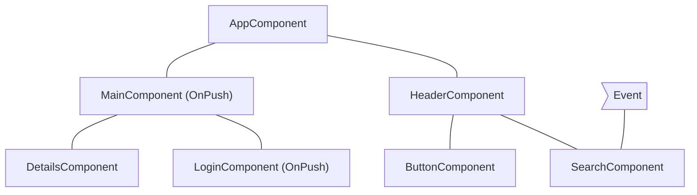

#### An event is handled by a component with OnPush

If Angular handles an event within a component with OnPush strategy, the framework will execute change detection within the entire component tree. Angular will ignore component subtrees with roots using OnPush, which have not received new inputs and are outside the component which handled the event.

As an example, if Angular handles an event within `MainComponent`, the framework will run change detection in the entire component tree. Angular will ignore the subtree with root `LoginComponent` because it has `OnPush` and the event happened outside of its scope.

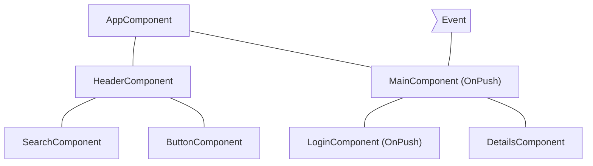

#### An event is handled by a descendant of a component with OnPush

If Angular handles an event in a component with OnPush, the framework will execute change detection in the entire component tree, including the component’s ancestors.

As an example, in the diagram below, Angular handles an event in `LoginComponent` which uses OnPush. Angular will invoke change detection in the entire component subtree including `MainComponent` (`LoginComponent`’s parent), even though `MainComponent` has `OnPush` as well. Angular checks `MainComponent` as well because `LoginComponent` is part of its view.

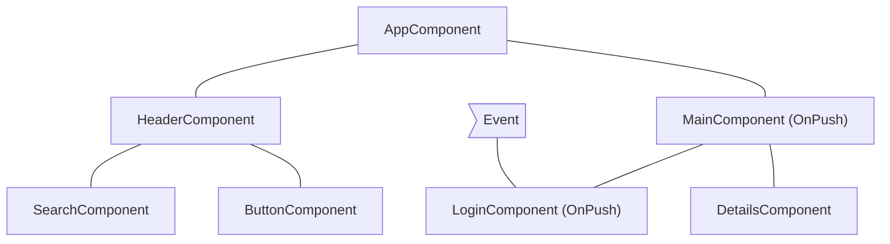

#### New inputs to component with OnPush

Angular will run change detection within a child component with `OnPush` when setting an input property as result of a template binding.

For example, in the diagram below, `AppComponent` passes a new input to `MainComponent`, which has `OnPush`. Angular will run change detection in `MainComponent` but will not run change detection in `LoginComponent`, which also has `OnPush`, unless it receives new inputs as well.

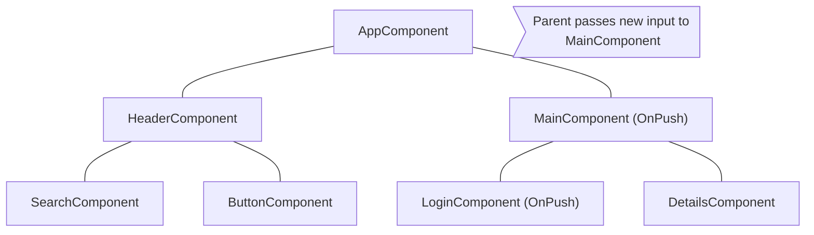

#### Edge cases

* **Modifying input properties in TypeScript code**. When you use an API like `@ViewChild` or `@ContentChild` to get a reference to a component in TypeScript and manually modify an `@Input` property, Angular will not automatically run change detection for OnPush components. If you need Angular to run change detection, you can inject `ChangeDetectorRef` in your component and call `changeDetectorRef.markForCheck()` to tell Angular to schedule a change detection.
* **Modifying object references**. In case an input receives a mutable object as value and you modify the object but preserve the reference, Angular will not invoke change detection. That’s the expected behavior because the previous and the current value of the input point to the same reference.

---


(From slow-computations.md)

### Slow computations

On every change detection cycle, Angular synchronously:

* Evaluates all template expressions in all components, unless specified otherwise, based on that each component's detection strategy
* Executes the `ngDoCheck`, `ngAfterContentChecked`, `ngAfterViewChecked`, and `ngOnChanges` lifecycle hooks.
A single slow computation within a template or a lifecycle hook can slow down the entire change detection process because Angular runs the computations sequentially.

#### Identifying slow computations

You can identify heavy computations with Angular DevTools’ profiler. In the performance timeline, click a bar to preview a particular change detection cycle. This displays a bar chart, which shows how long the framework spent in change detection for each component. When you click a component, you can preview how long Angular spent  evaluating its template and lifecycle hooks.


For example, in the preceding screenshot, the second recorded change detection cycle is selected. Angular spent over 573 ms on this cycle, with the most time spent in the `EmployeeListComponent`. In the details panel, you can see that Angular spent over 297 ms evaluating the template of the `EmployeeListComponent`.

#### Optimizing slow computations

Here are several techniques to remove slow computations:

* **Optimizing the underlying algorithm**. This is the recommended approach. If you can speed up the algorithm that is causing the problem, you can speed up the entire change detection mechanism.
* **Caching using pure pipes**. You can move the heavy computation to a pure [pipe](guide/pipes). Angular reevaluates a pure pipe only if it detects that its inputs have changed, compared to the previous time Angular called it.
* **Using memoization**. [Memoization](https://en.wikipedia.org/wiki/Memoization) is a similar technique to pure pipes, with the difference that pure pipes preserve only the last result from the computation where memoization could store multiple results.
* **Avoid repaints/reflows in lifecycle hooks**. Certain [operations](https://web.dev/avoid-large-complex-layouts-and-layout-thrashing/) cause the browser to either synchronously recalculate the layout of the page or re-render it. Since reflows and repaints are generally slow, you want to avoid performing them in every change detection cycle.

Pure pipes and memoization have different trade-offs. Pure pipes are an Angular built-in concept compared to memoization, which is a general software engineering practice for caching function results. The memory overhead of memoization could be significant if you invoke the heavy computation frequently with different arguments.

---


(From zone-pollution.md)

### Resolving zone pollution

**Zone.js** is a signaling mechanism that Angular uses to detect when an application state might have changed. It captures asynchronous operations like `setTimeout`, network requests, and event listeners. Angular schedules change detection based on signals from Zone.js.

In some cases scheduled [tasks](https://developer.mozilla.org/docs/Web/API/HTML_DOM_API/Microtask_guide#tasks) or [microtasks](https://developer.mozilla.org/docs/Web/API/HTML_DOM_API/Microtask_guide#microtasks) don’t make any changes in the data model, which makes running change detection unnecessary. Common examples are:

* `requestAnimationFrame`, `setTimeout` or `setInterval`
* Task or microtask scheduling by third-party libraries

This section covers how to identify such conditions, and how to run code outside the Angular zone to avoid unnecessary change detection calls.

#### Identifying unnecessary change detection calls

You can detect unnecessary change detection calls using Angular DevTools. Often they appear as consecutive bars in the profiler’s timeline with source `setTimeout`, `setInterval`, `requestAnimationFrame`, or an event handler. When you have limited calls within your application of these APIs, the change detection invocation is usually caused by a third-party library.


In the image above, there is a series of change detection calls triggered by event handlers associated with an element. That’s a common challenge when using third-party, non-native Angular components, which do not alter the default behavior of `NgZone`.

#### Run tasks outside `NgZone`

In such cases, you can instruct Angular to avoid calling change detection for tasks scheduled by a given piece of code using [NgZone](/api/core/NgZone).

<docs-code header="Run outside of the Zone" language='ts' linenums>
import { Component, NgZone, OnInit } from '@angular/core';

@Component(...)
class AppComponent implements OnInit {
  constructor(private ngZone: NgZone) {}
  ngOnInit() {
    this.ngZone.runOutsideAngular(() => setInterval(pollForUpdates), 500);
  }
}
</docs-code>

The preceding snippet instructs Angular to call `setInterval` outside the Angular Zone and skip running change detection after `pollForUpdates` runs.

Third-party libraries commonly trigger unnecessary change detection cycles when their APIs are invoked within the Angular zone. This phenomenon particularly affects libraries that set up event listeners or initiate other tasks (such as timers, XHR requests, etc.). Avoid these extra cycles by calling library APIs outside the Angular zone:

<docs-code header="Move the plot initialization outside of the Zone" language='ts' linenums>
import { Component, NgZone, OnInit } from '@angular/core';
import * as Plotly from 'plotly.js-dist-min';

@Component(...)
class AppComponent implements OnInit {

  constructor(private ngZone: NgZone) {}

  ngOnInit() {
    this.ngZone.runOutsideAngular(() => {
      Plotly.newPlot('chart', data);
    });
  }
}
</docs-code>

Running `Plotly.newPlot('chart', data);` within `runOutsideAngular` instructs the framework that it shouldn’t run change detection after the execution of tasks scheduled by the initialization logic.

For example, if `Plotly.newPlot('chart', data)` adds event listeners to a DOM element, Angular does not run change detection after the execution of their handlers.

But sometimes, you may need to listen to events dispatched by third-party APIs. In such cases, it's important to remember that those event listeners will also execute outside of the Angular zone if the initialization logic was done there:

<docs-code header="Check whether the handler is called outside of the Zone" language='ts' linenums>
import { Component, NgZone, OnInit, output } from '@angular/core';
import * as Plotly from 'plotly.js-dist-min';

@Component(...)
class AppComponent implements OnInit {
  plotlyClick = output<Plotly.PlotMouseEvent>();

  constructor(private ngZone: NgZone) {}

  ngOnInit() {
    this.ngZone.runOutsideAngular(() => {
      this.createPlotly();
    });
  }

  private async createPlotly() {
    const plotly = await Plotly.newPlot('chart', data);

    plotly.on('plotly_click', (event: Plotly.PlotMouseEvent) => {
      // This handler will be called outside of the Angular zone because
      // the initialization logic is also called outside of the zone. To check
      // whether we're in the Angular zone, we can call the following:
      console.log(NgZone.isInAngularZone());
      this.plotlyClick.emit(event);
    });
  }
}
</docs-code>

If you need to dispatch events to parent components and execute specific view update logic, you should consider re-entering the Angular zone to instruct the framework to run change detection or run change detection manually:

<docs-code header="Re-enter the Angular zone when dispatching event" language='ts' linenums>
import { Component, NgZone, OnInit, output } from '@angular/core';
import * as Plotly from 'plotly.js-dist-min';

@Component(...)
class AppComponent implements OnInit {
  plotlyClick = output<Plotly.PlotMouseEvent>();

  constructor(private ngZone: NgZone) {}

  ngOnInit() {
    this.ngZone.runOutsideAngular(() => {
      this.createPlotly();
    });
  }

  private async createPlotly() {
    const plotly = await Plotly.newPlot('chart', data);

    plotly.on('plotly_click', (event: Plotly.PlotMouseEvent) => {
      this.ngZone.run(() => {
        this.plotlyClick.emit(event);
      });
    });
  }
}
</docs-code>

The scenario of dispatching events outside of the Angular zone may also arise. It's important to remember that triggering change detection (for example, manually) may result to the creation/update of views outside of the Angular zone.

---


(From style-guide.md)

### Angular coding style guide

Looking for an opinionated guide to Angular syntax, conventions, and application structure?
Step right in.
This style guide presents preferred conventions and, as importantly, explains why.

#### Style vocabulary

Each guideline describes either a good or bad practice, and all have a consistent presentation.

The wording of each guideline indicates how strong the recommendation is.

**Do** is one that should always be followed.
*Always* might be a bit too strong of a word.
Guidelines that literally should always be followed are extremely rare.
On the other hand, you need a really unusual case for breaking a *Do* guideline.

**Consider** guidelines should generally be followed.
If you fully understand the meaning behind the guideline and have a good reason to deviate, then do so.
Aim to be consistent.

**Avoid** indicates something you should almost never do.
Code examples to *avoid* have an unmistakable red header.

**Why**? <br />
Gives reasons for following the previous recommendations.

#### File structure conventions

Some code examples display a file that has one or more similarly named companion files.
For example, `hero.component.ts` and `hero.component.html`.

The guideline uses the shortcut `hero.component.ts|html|css|spec` to represent those various files.
Using this shortcut makes this guide's file structures easier to read and more terse.

#### Single responsibility

Apply the [*single responsibility principle (SRP)*](https://wikipedia.org/wiki/Single_responsibility_principle) to all components, services, and other symbols.
This helps make the application cleaner, easier to read and maintain, and more testable.

##### Rule of One

###### Style 01-01

**Do** define one thing, such as a service or component, per file.

**Consider** limiting files to 400 lines of code.

**Why**? <br />
One component per file makes it far easier to read, maintain, and avoid collisions with teams in source control.

**Why**? <br />
One component per file avoids hidden bugs that often arise when combining components in a file where they may share variables, create unwanted closures, or unwanted coupling with dependencies.

**Why**? <br />
A single component can be the default export for its file which facilitates lazy loading with the router.

The key is to make the code more reusable, easier to read, and less mistake-prone.

The following *negative* example defines the `AppComponent`, bootstraps the app,
defines the `Hero` model object, and loads heroes from the server all in the same file.
*Don't do this*.

<docs-code path="adev/src/content/examples/styleguide/src/01-01/app/heroes/hero.component.avoid.ts" language="typescript" header="app/heroes/hero.component.ts"/>

It is a better practice to redistribute the component and its
supporting classes into their own, dedicated files.

<docs-code-multifile>
    <docs-code header="main.ts" path="adev/src/content/examples/styleguide/src/01-01/main.ts"/>
    <docs-code header="app/app.module.ts" path="adev/src/content/examples/styleguide/src/01-01/app/app.module.ts"/>
    <docs-code header="app/app.component.ts" path="adev/src/content/examples/styleguide/src/01-01/app/app.component.ts"/>
    <docs-code header="app/heroes/heroes.component.ts" path="adev/src/content/examples/styleguide/src/01-01/app/heroes/heroes.component.ts"/>
    <docs-code header="app/heroes/shared/hero.service.ts" path="adev/src/content/examples/styleguide/src/01-01/app/heroes/shared/hero.service.ts"/>
    <docs-code header="app/heroes/shared/hero.model.ts" path="adev/src/content/examples/styleguide/src/01-01/app/heroes/shared/hero.model.ts"/>
    <docs-code header="app/heroes/shared/mock-heroes.ts" path="adev/src/content/examples/styleguide/src/01-01/app/heroes/shared/mock-heroes.ts"/>
</docs-code-multifile>

As the application grows, this rule becomes even more important.

#### Naming

Naming conventions are hugely important to maintainability and readability.
This guide recommends naming conventions for the file name and the symbol name.

##### General Naming Guidelines

###### Style 02-01

**Do** use consistent names for all symbols.

**Do** follow a pattern that describes the symbol's feature then its type.
The recommended pattern is `feature.type.ts`.

**Why**? <br />
Naming conventions help provide a consistent way to find content at a glance.
Consistency within the project is vital.
Consistency with a team is important.
Consistency across a company provides tremendous efficiency.

**Why**? <br />
The naming conventions should help find desired code faster and make it easier to understand.

**Why**? <br />
Names of folders and files should clearly convey their intent.
For example, `app/heroes/hero-list.component.ts` may contain a component that manages a list of heroes.

##### Separate file names with dots and dashes

###### Style 02-02

**Do** use dashes to separate words in the descriptive name.

**Do** use dots to separate the descriptive name from the type.

**Do** use consistent type names for all components following a pattern that describes the component's feature then its type.
A recommended pattern is `feature.type.ts`.

**Do** use conventional type names including `.service`, `.component`, `.pipe`, `.module`, and `.directive`.
Invent additional type names if you must but take care not to create too many.

**Why**? <br />
Type names provide a consistent way to quickly identify what is in the file.

**Why**? <br />
Type names make it easy to find a specific file type using an editor or IDE's fuzzy search techniques.

**Why**? <br />
Unabbreviated type names such as `.service` are descriptive and unambiguous.
Abbreviations such as `.srv`, `.svc`, and `.serv` can be confusing.

**Why**? <br />
Type names provide pattern matching for any automated tasks.

##### Symbols and file names

###### Style 02-03

**Do** use consistent names for all assets named after what they represent.

**Do** use upper camel case for class names.

**Do** match the name of the symbol to the name of the file.

**Do** append the symbol name with the conventional suffix \(such as `Component`, `Directive`, `Module`, `Pipe`, or `Service`\) for a thing of that type.

**Do** give the filename the conventional suffix \(such as `.component.ts`, `.directive.ts`, `.module.ts`, `.pipe.ts`, or `.service.ts`\) for a file of that type.

**Why**? <br />
Consistent conventions make it easy to quickly identify and reference assets of different types.

| Symbol name                                                                                                                                                                          | File name |
|:---                                                                                                                                                                                  |:---       |
| <docs-code hideCopy language="typescript"> @Component({ … }) <br>export class AppComponent { } </docs-code>                             | app.component.ts |
| <docs-code hideCopy language="typescript"> @Component({ … }) <br>export class HeroesComponent { } </docs-code>                          | heroes.component.ts |
| <docs-code hideCopy language="typescript"> @Component({ … }) <br>export class HeroListComponent { } </docs-code>                        | hero-list.component.ts |
| <docs-code hideCopy language="typescript"> @Component({ … }) <br>export class HeroDetailComponent { } </docs-code>                      | hero-detail.component.ts |
| <docs-code hideCopy language="typescript"> @Directive({ … }) <br>export class ValidationDirective { } </docs-code>                      | validation.directive.ts |
| <docs-code hideCopy language="typescript"> @NgModule({ … }) <br>export class AppModule </docs-code>                                     | app.module.ts |
| <docs-code hideCopy language="typescript"> @Pipe({ name: 'initCaps' }) <br>export class InitCapsPipe implements PipeTransform { } </docs-code> | init-caps.pipe.ts |
| <docs-code hideCopy language="typescript"> @Injectable() <br>export class UserProfileService { } </docs-code>                                  | user-profile.service.ts |

##### Service names

###### Style 02-04

**Do** use consistent names for all services named after their feature.

**Do** suffix a service class name with `Service`.
For example, something that gets data or heroes should be called a `DataService` or a `HeroService`.

A few terms are unambiguously services.
They typically indicate agency by ending in "-er".
You may prefer to name a service that logs messages `Logger` rather than `LoggerService`.
Decide if this exception is agreeable in your project.
As always, strive for consistency.

**Why**? <br />
Provides a consistent way to quickly identify and reference services.

**Why**? <br />
Clear service names such as `Logger` do not require a suffix.

**Why**? <br />
Service names such as `Credit` are nouns and require a suffix and should be named with a suffix when it is not obvious if it is a service or something else.

| Symbol name                                                                                                                                      | File name |
|:---                                                                                                                                              |:---       |
| <docs-code hideCopy language="typescript"> @Injectable() <br>export class HeroDataService { } </docs-code> | hero-data.service.ts |
| <docs-code hideCopy language="typescript"> @Injectable() <br>export class CreditService { } </docs-code>   | credit.service.ts    |
| <docs-code hideCopy language="typescript"> @Injectable() <br>export class Logger { } </docs-code>          | logger.service.ts    |

##### Bootstrapping

###### Style 02-05

**Do** put bootstrapping and platform logic for the application in a file named `main.ts`.

**Do** include error handling in the bootstrapping logic.

**Avoid** putting application logic in `main.ts`.
Instead, consider placing it in a component or service.

**Why**? <br />
Follows a consistent convention for the startup logic of an app.

**Why**? <br />
Follows a familiar convention from other technology platforms.

<docs-code header="main.ts" path="adev/src/content/examples/styleguide/src/02-05/main.ts"/>

##### Component selectors

###### Style 05-02

**Do** use *dashed-case* or *kebab-case* for naming the element selectors of components.

**Why**? <br />
Keeps the element names consistent with the specification for [Custom Elements](https://www.w3.org/TR/custom-elements).

<docs-code header="app/heroes/shared/hero-button/hero-button.component.ts" path="adev/src/content/examples/styleguide/src/05-02/app/heroes/shared/hero-button/hero-button.component.avoid.ts" visibleRegion="example"/>

<docs-code-multifile>
    <docs-code header="app/heroes/shared/hero-button/hero-button.component.ts" path="adev/src/content/examples/styleguide/src/05-02/app/heroes/shared/hero-button/hero-button.component.ts" visibleRegion="example"/>
    <docs-code header="app/app.component.html" path="adev/src/content/examples/styleguide/src/05-02/app/app.component.html"/>
</docs-code-multifile>

##### Component custom prefix

###### Style 02-07

**Do** use a hyphenated, lowercase element selector value; for example, `admin-users`.

**Do** use a prefix that identifies the feature area or the application itself.

**Why**? <br />
Prevents element name collisions with components in other applications and with native HTML elements.

**Why**? <br />
Makes it easier to promote and share the component in other applications.

**Why**? <br />
Components are easy to identify in the DOM.

<docs-code header="app/heroes/hero.component.ts" path="adev/src/content/examples/styleguide/src/02-07/app/heroes/hero.component.avoid.ts" visibleRegion="example"/>

<docs-code header="app/users/users.component.ts" path="adev/src/content/examples/styleguide/src/02-07/app/users/users.component.avoid.ts" visibleRegion="example"/>

<docs-code header="app/heroes/hero.component.ts" path="adev/src/content/examples/styleguide/src/02-07/app/heroes/hero.component.ts" visibleRegion="example"/>

<docs-code header="app/users/users.component.ts" path="adev/src/content/examples/styleguide/src/02-07/app/users/users.component.ts" visibleRegion="example"/>

##### Directive selectors

###### Style 02-06

**Do** Use lower camel case for naming the selectors of directives.

**Why**? <br />
Keeps the names of the properties defined in the directives that are bound to the view consistent with the attribute names.

**Why**? <br />
The Angular HTML parser is case-sensitive and recognizes lower camel case.

##### Directive custom prefix

###### Style 02-08

**Do** spell non-element selectors in lower camel case unless the selector is meant to match a native HTML attribute.

**Don't** prefix a directive name with `ng` because that prefix is reserved for Angular and using it could cause bugs that are difficult to diagnose.

**Why**? <br />
Prevents name collisions.

**Why**? <br />
Directives are easily identified.

<docs-code header="app/shared/validate.directive.ts" path="adev/src/content/examples/styleguide/src/02-08/app/shared/validate.directive.avoid.ts" visibleRegion="example"/>

<docs-code header="app/shared/validate.directive.ts" path="adev/src/content/examples/styleguide/src/02-08/app/shared/validate.directive.ts" visibleRegion="example"/>

##### Pipe names

###### Style 02-09

**Do** use consistent names for all pipes, named after their feature.
The pipe class name should use `UpperCamelCase` \(the general convention for class names\), and the corresponding `name` string should use *lowerCamelCase*.
The `name` string cannot use hyphens \("dash-case" or "kebab-case"\).

**Why**? <br />
Provides a consistent way to quickly identify and reference pipes.

| Symbol name                                                                                                                                                                          | File name |
|:---                                                                                                                                                                                  |:---       |
| <docs-code hideCopy language="typescript"> @Pipe({ name: 'ellipsis' }) <br>export class EllipsisPipe implements PipeTransform { } </docs-code> | ellipsis.pipe.ts  |
| <docs-code hideCopy language="typescript"> @Pipe({ name: 'initCaps' }) <br>export class InitCapsPipe implements PipeTransform { } </docs-code> | init-caps.pipe.ts |

##### Unit test file names

###### Style 02-10

**Do** name test specification files the same as the component they test.

**Do** name test specification files with a suffix of `.spec`.

**Why**? <br />
Provides a consistent way to quickly identify tests.

**Why**? <br />
Provides pattern matching for [karma](https://karma-runner.github.io) or other test runners.

| Test type  | File names |
|:---        |:---        |
| Components | heroes.component.spec.ts <br /> hero-list.component.spec.ts <br /> hero-detail.component.spec.ts |
| Services   | logger.service.spec.ts <br /> hero.service.spec.ts <br /> filter-text.service.spec.ts            |
| Pipes      | ellipsis.pipe.spec.ts <br /> init-caps.pipe.spec.ts                                              |

#### Application structure and NgModules

Have a near-term view of implementation and a long-term vision.
Start small but keep in mind where the application is heading.

All of the application's code goes in a folder named `src`.
All feature areas are in their own folder.

All content is one asset per file.
Each component, service, and pipe is in its own file.
All third party vendor scripts are stored in another folder and not in the `src` folder.
Use the naming conventions for files in this guide.

##### Overall structural guidelines

###### Style 04-06

**Do** start small but keep in mind where the application is heading down the road.

**Do** have a near term view of implementation and a long term vision.

**Do** put all of the application's code in a folder named `src`.

**Consider** creating a folder for a component when it has multiple accompanying files \(`.ts`, `.html`, `.css`, and `.spec`\).

**Why**? <br />
Helps keep the application structure small and easy to maintain in the early stages, while being easy to evolve as the application grows.

**Why**? <br />
Components often have four files \(for example, `*.html`, `*.css`, `*.ts`, and `*.spec.ts`\) and can clutter a folder quickly.

Here is a compliant folder and file structure:

```markdown
project root
├── src
│ ├── app
│ │ ├── core
│ │ │ └── exception.service.ts|spec.ts
│ │ │ └── user-profile.service.ts|spec.ts
│ │ ├── heroes
│ │ │ ├── hero
│ │ │ │ └── hero.component.ts|html|css|spec.ts
│ │ │ ├── hero-list
│ │ │ │ └── hero-list.component.ts|html|css|spec.ts
│ │ │ ├── shared
│ │ │ │ └── hero-button.component.ts|html|css|spec.ts
│ │ │ │ └── hero.model.ts
│ │ │ │ └── hero.service.ts|spec.ts
│ │ │ └── heroes.component.ts|html|css|spec.ts
│ │ │ └── heroes.routes.ts
│ │ ├── shared
│ │ │ └── init-caps.pipe.ts|spec.ts
│ │ │ └── filter-text.component.ts|spec.ts
│ │ │ └── filter-text.service.ts|spec.ts
│ │ ├── villains
│ │ │ ├── villain
│ │ │ │ └── …
│ │ │ ├── villain-list
│ │ │ │ └── …
│ │ │ ├── shared
│ │ │ │ └── …
│ │ │ └── villains.component.ts|html|css|spec.ts
│ │ │ └── villains.module.ts
│ │ │ └── villains-routing.module.ts
│ │ └── app.component.ts|html|css|spec.ts
│ │ └── app.routes.ts
│ └── main.ts
│ └── index.html
│ └── …
└── node_modules/…
└── …
```

HELPFUL: While components in dedicated folders are widely preferred, another option for small applications is to keep components flat \(not in a dedicated folder\).
This adds up to four files to the existing folder, but also reduces the folder nesting.
Whatever you choose, be consistent.

##### *Folders-by-feature* structure

###### Style 04-07

**Do** create folders named for the feature area they represent.

**Why**? <br />
A developer can locate the code and identify what each file represents at a glance.
The structure is as flat as it can be and there are no repetitive or redundant names.

**Why**? <br />
Helps reduce the application from becoming cluttered through organizing the content.

**Why**? <br />
When there are a lot of files, for example 10+, locating them is easier with a consistent folder structure and more difficult in a flat structure.

For more information, refer to [this folder and file structure example](#overall-structural-guidelines).

##### App *root module*

IMPORTANT: The following style guide recommendations are for applications based on `NgModule`. New applications should use standalone components, directives, and pipes instead.

###### Style 04-08

**Do** create an NgModule in the application's root folder, for example, in `/src/app` if creating a `NgModule` based app.

**Why**? <br />
Every `NgModule` based application requires at least one root NgModule.

**Consider** naming the root module `app.module.ts`.

**Why**? <br />
Makes it easier to locate and identify the root module.

<docs-code path="adev/src/content/examples/styleguide/src/04-08/app/app.module.ts" language="typescript" visibleRegion="example" header="app/app.module.ts"/>

##### Feature modules

###### Style 04-09

**Do** create an NgModule for all distinct features in an application; for example, a `Heroes` feature.

**Do** place the feature module in the same named folder as the feature area; for example, in `app/heroes`.

**Do** name the feature module file reflecting the name of the feature area and folder; for example, `app/heroes/heroes.module.ts`.

**Do** name the feature module symbol reflecting the name of the feature area, folder, and file; for example, `app/heroes/heroes.module.ts` defines `HeroesModule`.

**Why**? <br />
A feature module can expose or hide its implementation from other modules.

**Why**? <br />
A feature module identifies distinct sets of related components that comprise the feature area.

**Why**? <br />
A feature module can easily be routed to both eagerly and lazily.

**Why**? <br />
A feature module defines clear boundaries between specific functionality and other application features.

**Why**? <br />
A feature module helps clarify and make it easier to assign development responsibilities to different teams.

**Why**? <br />
A feature module can easily be isolated for testing.

##### Shared feature module

###### Style 04-10

**Do** create a feature module named `SharedModule` in a `shared` folder; for example, `app/shared/shared.module.ts` defines `SharedModule`.

**Do** declare components, directives, and pipes in a shared module when those items will be re-used and referenced by the components declared in other feature modules.

**Consider** using the name SharedModule when the contents of a shared
module are referenced across the entire application.

**Consider** *not* providing services in shared modules.
Services are usually singletons that are provided once for the entire application or in a particular feature module.
There are exceptions, however.
For example, in the sample code that follows, notice that the `SharedModule` provides `FilterTextService`.
This is acceptable here because the service is stateless;that is, the consumers of the service aren't impacted by new instances.

**Do** import all modules required by the assets in the `SharedModule`; for example, `CommonModule` and `FormsModule`.

**Why**? <br />
`SharedModule` will contain components, directives, and pipes that may need features from another common module; for example, `ngFor` in `CommonModule`.

**Do** declare all components, directives, and pipes in the `SharedModule`.

**Do** export all symbols from the `SharedModule` that other feature modules need to use.

**Why**? <br />
`SharedModule` exists to make commonly used components, directives, and pipes available for use in the templates of components in many other modules.

**Avoid** specifying app-wide singleton providers in a `SharedModule`.
Intentional singletons are OK.
Take care.

**Why**? <br />
A lazy loaded feature module that imports that shared module will make its own copy of the service and likely have undesirable results.

**Why**? <br />
You don't want each module to have its own separate instance of singleton services.
Yet there is a real danger of that happening if the `SharedModule` provides a service.

```markdown
project root
├──src
├──├──app
├──├──├── shared
├──├──├──└── shared.module.ts
├──├──├──└── init-caps.pipe.ts|spec.ts
├──├──├──└── filter-text.component.ts|spec.ts
├──├──├──└── filter-text.service.ts|spec.ts
├──├──└── app.component.ts|html|css|spec.ts
├──├──└── app.module.ts
├──├──└── app-routing.module.ts
├──└── main.ts
├──└── index.html
└── …
```

<docs-code-multifile>
    <docs-code header="app/shared/shared.module.ts" path="adev/src/content/examples/styleguide/src/04-10/app/shared/shared.module.ts"/>
    <docs-code header="app/shared/init-caps.pipe.ts" path="adev/src/content/examples/styleguide/src/04-10/app/shared/init-caps.pipe.ts"/>
    <docs-code header="app/shared/filter-text/filter-text.component.ts" path="adev/src/content/examples/styleguide/src/04-10/app/shared/filter-text/filter-text.component.ts"/>
    <docs-code header="app/shared/filter-text/filter-text.service.ts" path="adev/src/content/examples/styleguide/src/04-10/app/shared/filter-text/filter-text.service.ts"/>
    <docs-code header="app/heroes/heroes.component.ts" path="adev/src/content/examples/styleguide/src/04-10/app/heroes/heroes.component.ts"/>
    <docs-code header="app/heroes/heroes.component.html" path="adev/src/content/examples/styleguide/src/04-10/app/heroes/heroes.component.html"/>
</docs-code-multifile>

##### Lazy Loaded folders

###### Style 04-11

A distinct application feature or workflow may be *lazy loaded* or *loaded on demand* rather than when the application starts.

**Do** put the contents of lazy loaded features in a *lazy loaded folder*.
A typical *lazy loaded folder* contains a *routing component*, its child components, and their related assets.

**Why**? <br />
The folder makes it easy to identify and isolate the feature content.

#### Components

##### Components as elements

###### Style 05-03

**Consider** giving components an *element* selector, as opposed to *attribute* or *class* selectors.

**Why**? <br />
Components have templates containing HTML and optional Angular template syntax.
They display content.
Developers place components on the page as they would native HTML elements and web components.

**Why**? <br />
It is easier to recognize that a symbol is a component by looking at the template's html.

HELPFUL: There are a few cases where you give a component an attribute, such as when you want to augment a built-in element.
For example, [Material Design](https://material.angular.io/components/button/overview) uses this technique with `<button mat-button>`.
However, you wouldn't use this technique on a custom element.

<docs-code header="app/heroes/hero-button/hero-button.component.ts" path="adev/src/content/examples/styleguide/src/05-03/app/heroes/shared/hero-button/hero-button.component.avoid.ts" visibleRegion="example"/>

<docs-code header="app/app.component.html" path="adev/src/content/examples/styleguide/src/05-03/app/app.component.avoid.html"/>

<docs-code-multifile>
    <docs-code header="app/heroes/shared/hero-button/hero-button.component.ts" path="adev/src/content/examples/styleguide/src/05-03/app/heroes/shared/hero-button/hero-button.component.ts" visibleRegion="example"/>
    <docs-code header="app/app.component.html" path="adev/src/content/examples/styleguide/src/05-03/app/app.component.html"/>
</docs-code-multifile>

##### Extract templates and styles to their own files

###### Style 05-04

**Do** extract templates and styles into a separate file, when more than 3 lines.

**Do** name the template file `[component-name].component.html`, where [component-name] is the component name.

**Do** name the style file `[component-name].component.css`, where [component-name] is the component name.

**Do** specify *component-relative* URLs, prefixed with `./`.

**Why**? <br />
Large, inline templates and styles obscure the component's purpose and implementation, reducing readability and maintainability.

**Why**? <br />
In most editors, syntax hints and code snippets aren't available when developing inline templates and styles.
The Angular TypeScript Language Service \(forthcoming\) promises to overcome this deficiency for HTML templates in those editors that support it; it won't help with CSS styles.

**Why**? <br />
A *component relative* URL requires no change when you move the component files, as long as the files stay together.

**Why**? <br />
The `./` prefix is standard syntax for relative URLs; don't depend on Angular's current ability to do without that prefix.

<docs-code header="app/heroes/heroes.component.ts" path="adev/src/content/examples/styleguide/src/05-04/app/heroes/heroes.component.avoid.ts" visibleRegion="example"/>

<docs-code-multifile>
    <docs-code header="app/heroes/heroes.component.ts" path="adev/src/content/examples/styleguide/src/05-04/app/heroes/heroes.component.ts" visibleRegion="example"/>
    <docs-code header="app/heroes/heroes.component.html" path="adev/src/content/examples/styleguide/src/05-04/app/heroes/heroes.component.html"/>
    <docs-code header="app/heroes/heroes.component.css" path="adev/src/content/examples/styleguide/src/05-04/app/heroes/heroes.component.css"/>
</docs-code-multifile>

##### Decorate `input` and `output` properties

###### Style 05-12

**Do** use the `@Input()` and `@Output()` class decorators instead of the `inputs` and `outputs` properties of the `@Directive` and `@Component` metadata:

**Consider** placing `@Input()` or `@Output()` on the same line as the property it decorates.

**Why**? <br />
It is easier and more readable to identify which properties in a class are inputs or outputs.

**Why**? <br />
If you ever need to rename the property or event name associated with `@Input()` or `@Output()`, you can modify it in a single place.

**Why**? <br />
The metadata declaration attached to the directive is shorter and thus more readable.

**Why**? <br />
Placing the decorator on the same line *usually* makes for shorter code and still easily identifies the property as an input or output.
Put it on the line above when doing so is clearly more readable.

<docs-code header="app/heroes/shared/hero-button/hero-button.component.ts" path="adev/src/content/examples/styleguide/src/05-12/app/heroes/shared/hero-button/hero-button.component.avoid.ts" visibleRegion="example"/>

<docs-code header="app/heroes/shared/hero-button/hero-button.component.ts" path="adev/src/content/examples/styleguide/src/05-12/app/heroes/shared/hero-button/hero-button.component.ts" visibleRegion="example"/>

##### Avoid aliasing `inputs` and `outputs`

###### Style 05-13

**Avoid** `input` and `output` aliases except when it serves an important purpose.

**Why**? <br />
Two names for the same property \(one private, one public\) is inherently confusing.

**Why**? <br />
You should use an alias when the directive name is also an `input` property,
and the directive name doesn't describe the property.

<docs-code header="app/heroes/shared/hero-button/hero-button.component.ts" path="adev/src/content/examples/styleguide/src/05-13/app/heroes/shared/hero-button/hero-button.component.avoid.ts" visibleRegion="example"/>

<docs-code header="app/app.component.html" path="adev/src/content/examples/styleguide/src/05-13/app/app.component.avoid.html"/>

<docs-code-multifile>
    <docs-code header="app/heroes/shared/hero-button/hero-button.component.ts" path="adev/src/content/examples/styleguide/src/05-13/app/heroes/shared/hero-button/hero-button.component.ts" visibleRegion="example"/>
    <docs-code header="app/heroes/shared/hero-button/hero-highlight.directive.ts" path="adev/src/content/examples/styleguide/src/05-13/app/heroes/shared/hero-highlight.directive.ts"/>
    <docs-code header="app/app.component.html" path="adev/src/content/examples/styleguide/src/05-13/app/app.component.html"/>
</docs-code-multifile>

##### Delegate complex component logic to services

###### Style 05-15

**Do** limit logic in a component to only that required for the view.
All other logic should be delegated to services.

**Do** move reusable logic to services and keep components simple and focused on their intended purpose.

**Why**? <br />
Logic may be reused by multiple components when placed within a service and exposed as a function.

**Why**? <br />
Logic in a service can more easily be isolated in a unit test, while the calling logic in the component can be easily mocked.

**Why**? <br />
Removes dependencies and hides implementation details from the component.

**Why**? <br />
Keeps the component slim, trim, and focused.

<docs-code header="app/heroes/hero-list/hero-list.component.ts" path="adev/src/content/examples/styleguide/src/05-15/app/heroes/hero-list/hero-list.component.avoid.ts"/>

<docs-code header="app/heroes/hero-list/hero-list.component.ts" path="adev/src/content/examples/styleguide/src/05-15/app/heroes/hero-list/hero-list.component.ts" visibleRegion="example"/>

##### Don't prefix `output` properties

###### Style 05-16

**Do** name events without the prefix `on`.

**Do** name event handler methods with the prefix `on` followed by the event name.

**Why**? <br />
This is consistent with built-in events such as button clicks.

**Why**? <br />
Angular allows for an [alternative syntax](guide/templates/binding) `on-*`.
If the event itself was prefixed with `on` this would result in an `on-onEvent` binding expression.

<docs-code header="app/heroes/hero.component.ts" path="adev/src/content/examples/styleguide/src/05-16/app/heroes/hero.component.avoid.ts" visibleRegion="example"/>

<docs-code header="app/app.component.html" path="adev/src/content/examples/styleguide/src/05-16/app/app.component.avoid.html"/>

<docs-code-multifile>
    <docs-code header="app/heroes/hero.component.ts" path="adev/src/content/examples/styleguide/src/05-16/app/heroes/hero.component.ts" visibleRegion="example"/>
    <docs-code header="app/app.component.html" path="adev/src/content/examples/styleguide/src/05-16/app/app.component.html"/>
</docs-code-multifile>

##### Put presentation logic in the component class

###### Style 05-17

**Do** put presentation logic in the component class, and not in the template.

**Why**? <br />
Logic will be contained in one place \(the component class\) instead of being spread in two places.

**Why**? <br />
Keeping the component's presentation logic in the class instead of the template improves testability, maintainability, and reusability.

<docs-code header="app/heroes/hero-list/hero-list.component.ts" path="adev/src/content/examples/styleguide/src/05-17/app/heroes/hero-list/hero-list.component.avoid.ts" visibleRegion="example"/>

<docs-code header="app/heroes/hero-list/hero-list.component.ts" path="adev/src/content/examples/styleguide/src/05-17/app/heroes/hero-list/hero-list.component.ts" visibleRegion="example"/>
##### Initialize inputs

###### Style 05-18

TypeScript's `--strictPropertyInitialization` compiler option ensures that a class initializes its properties during construction.
When enabled, this option causes the TypeScript compiler to report an error if the class does not set a value to any property that is not explicitly marked as optional.

By design, Angular treats all `@Input` properties as optional.
When possible, you should satisfy `--strictPropertyInitialization` by providing a default value.

<docs-code header="app/heroes/hero/hero.component.ts" path="adev/src/content/examples/styleguide/src/05-18/app/heroes/hero/hero.component.ts" visibleRegion="example"/>

If the property is hard to construct a default value for, use `?` to explicitly mark the property as optional.

<docs-code header="app/heroes/hero/hero.component.ts" path="adev/src/content/examples/styleguide/src/05-18/app/heroes/hero/hero.component.optional.ts" visibleRegion="example"/>

You may want to have a required `@Input` field, meaning all your component users are required to pass that attribute.
In such cases, use a default value.
Just suppressing the TypeScript error with `!` is insufficient and should be avoided because it will prevent the type checker from ensuring the input value is provided.

<docs-code header="app/heroes/hero/hero.component.ts" path="adev/src/content/examples/styleguide/src/05-18/app/heroes/hero/hero.component.avoid.ts" visibleRegion="example"/>

#### Directives

##### Use directives to enhance an element

###### Style 06-01

**Do** use attribute directives when you have presentation logic without a template.

**Why**? <br />
Attribute directives don't have an associated template.

**Why**? <br />
An element may have more than one attribute directive applied.

<docs-code header="app/shared/highlight.directive.ts" path="adev/src/content/examples/styleguide/src/06-01/app/shared/highlight.directive.ts" visibleRegion="example"/>

<docs-code header="app/app.component.html" path="adev/src/content/examples/styleguide/src/06-01/app/app.component.html"/>

##### `HostListener`/`HostBinding` decorators versus `host` metadata

###### Style 06-03

**Consider** preferring the `@HostListener` and `@HostBinding` to the `host` property of the `@Directive` and `@Component` decorators.

**Do** be consistent in your choice.

**Why**? <br />
The property associated with `@HostBinding` or the method associated with `@HostListener` can be modified only in a single place —in the directive's class.
If you use the `host` metadata property, you must modify both the property/method declaration in the directive's class and the metadata in the decorator associated with the directive.

<docs-code header="app/shared/validator.directive.ts" path="adev/src/content/examples/styleguide/src/06-03/app/shared/validator.directive.ts"/>

Compare with the less preferred `host` metadata alternative.

**Why**? <br />
The `host` metadata is only one term to remember and doesn't require extra ES imports.

<docs-code header="app/shared/validator2.directive.ts" path="adev/src/content/examples/styleguide/src/06-03/app/shared/validator2.directive.ts"/>
#### Services

##### Services are singletons

###### Style 07-01

**Do** use services as singletons within the same injector.
Use them for sharing data and functionality.

**Why**? <br />
Services are ideal for sharing methods across a feature area or an app.

**Why**? <br />
Services are ideal for sharing stateful in-memory data.

<docs-code header="app/heroes/shared/hero.service.ts" path="adev/src/content/examples/styleguide/src/07-01/app/heroes/shared/hero.service.ts" visibleRegion="example"/>

##### Providing a service

###### Style 07-03

**Do** provide a service with the application root injector in the `@Injectable` decorator of the service.

**Why**? <br />
The Angular injector is hierarchical.

**Why**? <br />
When you provide the service to a root injector, that instance of the service is shared and available in every class that needs the service.
This is ideal when a service is sharing methods or state.

**Why**? <br />
When you register a service in the `@Injectable` decorator of the service, optimization tools such as those used by the [Angular CLI's](cli) production builds can perform tree shaking and remove services that aren't used by your app.

**Why**? <br />
This is not ideal when two different components need different instances of a service.
In this scenario it would be better to provide the service at the component level that needs the new and separate instance.

<docs-code header="src/app/treeshaking/service.ts" path="adev/src/content/examples/dependency-injection/src/app/tree-shaking/service.ts"/>

##### Use the @Injectable() class decorator

###### Style 07-04

**Do** use the `@Injectable()` class decorator instead of the `@Inject` parameter decorator when using types as tokens for the dependencies of a service.

**Why**? <br />
The Angular Dependency Injection \(DI\) mechanism resolves a service's own
dependencies based on the declared types of that service's constructor parameters.

**Why**? <br />
When a service accepts only dependencies associated with type tokens, the `@Injectable()` syntax is much less verbose compared to using `@Inject()` on each individual constructor parameter.

<docs-code header="app/heroes/shared/hero-arena.service.ts" path="adev/src/content/examples/styleguide/src/07-04/app/heroes/shared/hero-arena.service.avoid.ts" visibleRegion="example"/>

<docs-code header="app/heroes/shared/hero-arena.service.ts" path="adev/src/content/examples/styleguide/src/07-04/app/heroes/shared/hero-arena.service.ts" visibleRegion="example"/>
#### Data Services

##### Talk to the server through a service

###### Style 08-01

**Do** refactor logic for making data operations and interacting with data to a service.

**Do** make data services responsible for XHR calls, local storage, stashing in memory, or any other data operations.

**Why**? <br />
The component's responsibility is for the presentation and gathering of information for the view.
It should not care how it gets the data, just that it knows who to ask for it.
Separating the data services moves the logic on how to get it to the data service, and lets the component be simpler and more focused on the view.

**Why**? <br />
This makes it easier to test \(mock or real\) the data calls when testing a component that uses a data service.

**Why**? <br />
The details of data management, such as headers, HTTP methods, caching, error handling, and retry logic, are irrelevant to components and other data consumers.

A data service encapsulates these details.
It's easier to evolve these details inside the service without affecting its consumers.
And it's easier to test the consumers with mock service implementations.

#### Lifecycle hooks

Use Lifecycle hooks to tap into important events exposed by Angular.

##### Implement lifecycle hook interfaces

###### Style 09-01

**Do** implement the lifecycle hook interfaces.

**Why**? <br />
Lifecycle interfaces prescribe typed method signatures.
Use those signatures to flag spelling and syntax mistakes.

<docs-code header="app/heroes/shared/hero-button/hero-button.component.ts" path="adev/src/content/examples/styleguide/src/09-01/app/heroes/shared/hero-button/hero-button.component.avoid.ts" visibleRegion="example"/>

<docs-code header="app/heroes/shared/hero-button/hero-button.component.ts" path="adev/src/content/examples/styleguide/src/09-01/app/heroes/shared/hero-button/hero-button.component.ts" visibleRegion="example"/>
#### Appendix

Useful tools and tips for Angular.

##### File templates and snippets

###### Style A-02

**Do** use file templates or snippets to help follow consistent styles and patterns.
Here are templates and/or snippets for some of the web development editors and IDEs.

**Consider** using [snippets](https://marketplace.visualstudio.com/items?itemName=johnpapa.Angular2) for [Visual Studio Code](https://code.visualstudio.com) that follow these styles and guidelines.

<a href="https://marketplace.visualstudio.com/items?itemName=johnpapa.Angular2">


</a>

**Consider** using [snippets](https://github.com/orizens/sublime-angular2-snippets) for [Sublime Text](https://www.sublimetext.com) that follow these styles and guidelines.

**Consider** using [snippets](https://github.com/mhartington/vim-angular2-snippets) for [Vim](https://www.vim.org) that follow these styles and guidelines.

---


(From update.md)

### Keeping your Angular projects up-to-date

Just like Web and the entire web ecosystem, Angular is continuously improving.
Angular balances continuous improvement with a strong focus on stability and making updates straightforward.
Keeping your Angular application up-to-date enables you to take advantage of leading-edge new features, as well as optimizations and bug fixes.

This document contains information and resources to help you keep your Angular applications and libraries up-to-date.

For information about our versioning policy and practices —including support and deprecation practices, as well as the release schedule— see [Angular versioning and releases](reference/releases "Angular versioning and releases").

HELPFUL: If you are currently using AngularJS, see [Upgrading from AngularJS](https://angular.io/guide/upgrade "Upgrading from Angular JS").
*AngularJS* is the name for all v1.x versions of Angular.

#### Getting notified of new releases

To be notified when new releases are available, follow [@angular](https://x.com/angular "@angular on X") on X (formerly Twitter) or subscribe to the [Angular blog](https://blog.angular.dev "Angular blog").

#### Learning about new features

What's new? What's changed? We share the most important things you need to know on the Angular blog in [release announcements]( https://blog.angular.dev/ "Angular blog - release announcements").

To review a complete list of changes, organized by version, see the [Angular change log](https://github.com/angular/angular/blob/main/CHANGELOG.md "Angular change log").

#### Checking your version of Angular

To check your application's version of Angular use the `ng version` command from within your project directory.

#### Finding the current version of Angular

The most recent stable released version of Angular appears [on npm](https://www.npmjs.com/package/@angular/core "Angular on npm") under "Version." For example, `16.2.4`.

You can also find the most current version of Angular by using the CLI command [`ng update`](cli/update).
By default, [`ng update`](cli/update)(without additional arguments) lists the updates that are available to you.

#### Updating your environment and apps

To make updating uncomplicated, we provide complete instructions in the interactive [Angular Update Guide](update-guide).

The Angular Update Guide provides customized update instructions, based on the current and target versions that you specify.
It includes basic and advanced update paths, to match the complexity of your applications.
It also includes troubleshooting information and any recommended manual changes to help you get the most out of the new release.

For simple updates, the CLI command [`ng update`](cli/update) is all you need.
Without additional arguments, [`ng update`](cli/update) lists the updates that are available to you and provides recommended steps to update your application to the most current version.

[Angular Versioning and Releases](reference/releases#versioning "Angular Release Practices, Versioning") describes the level of change that you can expect based on a release's version number.
It also describes supported update paths.

#### Resource summary

* Release announcements:
    [Angular blog - release announcements](https://blog.angular.dev/ "Angular blog announcements about recent releases")

* Release details:
    [Angular change log](https://github.com/angular/angular/blob/main/CHANGELOG.md "Angular change log")

* Update instructions:
    [Angular Update Guide](update-guide)

* Update command reference:
    [Angular CLI `ng update` command reference](cli/update)

* Versioning, release, support, and deprecation practices:
    [Angular versioning and releases](reference/releases "Angular versioning and releases")

---

---

## Guide Animations

(From complex-sequences.md)

### Complex animation sequences

So far, we've learned simple animations of single HTML elements.
Angular also lets you animate coordinated sequences, such as an entire grid or list of elements as they enter and leave a page.
You can choose to run multiple animations in parallel, or run discrete animations sequentially, one following another.

The functions that control complex animation sequences are:

| Functions                         | Details |
|:---                               |:---     |
| `query()`                         | Finds one or more inner HTML elements. |
| `stagger()`                       | Applies a cascading delay to animations for multiple elements. |
| [`group()`](api/animations/group) | Runs multiple animation steps in parallel. |
| `sequence()`                      | Runs animation steps one after another. |

#### The query() function

Most complex animations rely on the `query()` function to find child elements and apply animations to them, basic examples of such are:

| Examples                               | Details |
|:---                                    |:---     |
| `query()` followed by `animate()`      | Used to query simple HTML elements and directly apply animations to them.                                                                                                                            |
| `query()` followed by `animateChild()` | Used to query child elements, which themselves have animations metadata applied to them and trigger such animation \(which would be otherwise be blocked by the current/parent element's animation\). |

The first argument of `query()` is a [css selector](https://developer.mozilla.org/docs/Web/CSS/CSS_Selectors) string which can also contain the following Angular-specific tokens:

| Tokens                     | Details |
|:---                        |:---     |
| `:enter` <br /> `:leave`   | For entering/leaving elements.               |
| `:animating`               | For elements currently animating.            |
| `@*` <br /> `@triggerName` | For elements with any—or a specific—trigger. |
| `:self`                    | The animating element itself.                |

<docs-callout title="Entering and Leaving Elements">

Not all child elements are actually considered as entering/leaving; this can, at times, be counterintuitive and confusing. Please see the [query api docs](api/animations/query#entering-and-leaving-elements) for more information.

You can also see an illustration of this in the animations example \(introduced in the animations [introduction section](guide/animations#about-this-guide)\) under the Querying tab.

</docs-callout>

#### Animate multiple elements using query() and stagger() functions

After having queried child elements via `query()`, the `stagger()` function lets you define a timing gap between each queried item that is animated and thus animates elements with a delay between them.

The following example demonstrates how to use the `query()` and `stagger()` functions to animate a list \(of heroes\) adding each in sequence, with a slight delay, from top to bottom.

* Use `query()` to look for an element entering the page that meets certain criteria
* For each of these elements, use `style()` to set the same initial style for the element.
    Make it transparent and use `transform` to move it out of position so that it can slide into place.

* Use `stagger()` to delay each animation by 30 milliseconds
* Animate each element on screen for 0.5 seconds using a custom-defined easing curve, simultaneously fading it in and un-transforming it

<docs-code header="src/app/hero-list-page.component.ts" path="adev/src/content/examples/animations/src/app/hero-list-page.component.ts" visibleRegion="page-animations"/>

#### Parallel animation using group() function

You've seen how to add a delay between each successive animation.
But you might also want to configure animations that happen in parallel.
For example, you might want to animate two CSS properties of the same element but use a different `easing` function for each one.
For this, you can use the animation [`group()`](api/animations/group) function.

HELPFUL: The [`group()`](api/animations/group) function is used to group animation *steps*, rather than animated elements.

The following example uses [`group()`](api/animations/group)s on both `:enter` and `:leave` for two different timing configurations, thus applying two independent animations to the same element in parallel.

<docs-code header="src/app/hero-list-groups.component.ts (excerpt)" path="adev/src/content/examples/animations/src/app/hero-list-groups.component.ts" visibleRegion="animationdef"/>

#### Sequential vs. parallel animations

Complex animations can have many things happening at once.
But what if you want to create an animation involving several animations happening one after the other? Earlier you used [`group()`](api/animations/group) to run multiple animations all at the same time, in parallel.

A second function called `sequence()` lets you run those same animations one after the other.
Within `sequence()`, the animation steps consist of either `style()` or `animate()` function calls.

* Use `style()` to apply the provided styling data immediately.
* Use `animate()` to apply styling data over a given time interval.

#### Filter animation example

Take a look at another animation on the example page.
Under the Filter/Stagger tab, enter some text into the **Search Heroes** text box, such as `Magnet` or `tornado`.

The filter works in real time as you type.
Elements leave the page as you type each new letter and the filter gets progressively stricter.
The heroes list gradually re-enters the page as you delete each letter in the filter box.

The HTML template contains a trigger called `filterAnimation`.

<docs-code header="src/app/hero-list-page.component.html" path="adev/src/content/examples/animations/src/app/hero-list-page.component.html" visibleRegion="filter-animations" language="angular-html"/>

The `filterAnimation` in the component's decorator contains three transitions.

<docs-code header="src/app/hero-list-page.component.ts" path="adev/src/content/examples/animations/src/app/hero-list-page.component.ts" visibleRegion="filter-animations"/>

The code in this example performs the following tasks:

* Skips animations when the user first opens or navigates to this page \(the filter animation narrows what is already there, so it only works on elements that already exist in the DOM\)
* Filters heroes based on the search input's value

For each change:

* Hides an element leaving the DOM by setting its opacity and width to 0
* Animates an element entering the DOM over 300 milliseconds.
    During the animation, the element assumes its default width and opacity.

* If there are multiple elements entering or leaving the DOM, staggers each animation starting at the top of the page, with a 50-millisecond delay between each element

#### Animating the items of a reordering list

Although Angular animates correctly `*ngFor` list items out of the box, it will not be able to do so if their ordering changes.
This is because it will lose track of which element is which, resulting in broken animations.
The only way to help Angular keep track of such elements is by assigning a `TrackByFunction` to the `NgForOf` directive.
This makes sure that Angular always knows which element is which, thus allowing it to apply the correct animations to the correct elements all the time.

IMPORTANT: If you need to animate the items of an `*ngFor` list and there is a possibility that the order of such items will change during runtime, always use a `TrackByFunction`.

#### Animations and Component View Encapsulation

Angular animations are based on the components DOM structure and do not directly take [View Encapsulation](guide/components/styling#style-scoping) into account, this means that components using `ViewEncapsulation.Emulated` behave exactly as if they were using `ViewEncapsulation.None` (`ViewEncapsulation.ShadowDom` behaves differently as we'll discuss shortly).

For example if the `query()` function (which you'll see more of in the rest of the Animations guide) were to be applied at the top of a tree of components using the emulated view encapsulation, such query would be able to identify (and thus animate) DOM elements on any depth of the tree.

On the other hand the `ViewEncapsulation.ShadowDom` changes the component's DOM structure by "hiding" DOM elements inside [`ShadowRoot`](https://developer.mozilla.org/docs/Web/API/ShadowRoot) elements. Such DOM manipulations do prevent some of the animations implementation to work properly since it relies on simple DOM structures and doesn't take `ShadowRoot` elements into account. Therefore it is advised to avoid applying animations to views incorporating components using the ShadowDom view encapsulation.

#### Animation sequence summary

Angular functions for animating multiple elements start with `query()` to find inner elements; for example, gathering all images within a `<div>`.
The remaining functions, `stagger()`, [`group()`](api/animations/group), and `sequence()`, apply cascades or let you control how multiple animation steps are applied.

#### More on Angular animations

You might also be interested in the following:

<docs-pill-row>
  <docs-pill href="guide/animations" title="Introduction to Angular animations"/>
  <docs-pill href="guide/animations/transition-and-triggers" title="Transition and triggers"/>
  <docs-pill href="guide/animations/reusable-animations" title="Reusable animations"/>
  <docs-pill href="guide/animations/route-animations" title="Route transition animations"/>
</docs-pill-row>

---


(From overview.md)

### Introduction to Angular animations

Animation provides the illusion of motion: HTML elements change styling over time.
Well-designed animations can make your application more fun and straightforward to use, but they aren't just cosmetic.
Animations can improve your application and user experience in a number of ways:

* Without animations, web page transitions can seem abrupt and jarring
* Motion greatly enhances the user experience, so animations give users a chance to detect the application's response to their actions
* Good animations intuitively call the user's attention to where it is needed

Typically, animations involve multiple style *transformations* over time.
An HTML element can move, change color, grow or shrink, fade, or slide off the page.
These changes can occur simultaneously or sequentially. You can control the timing of each transformation.

Angular's animation system is built on CSS functionality, which means you can animate any property that the browser considers animatable.
This includes positions, sizes, transforms, colors, borders, and more.
The W3C maintains a list of animatable properties on its [CSS Transitions](https://www.w3.org/TR/css-transitions-1) page.

#### About this guide

This guide covers the basic Angular animation features to get you started on adding Angular animations to your project.

#### Getting started

The main Angular modules for animations are `@angular/animations` and `@angular/platform-browser`.

To get started with adding Angular animations to your project, import the animation-specific modules along with standard Angular functionality.

<docs-workflow>
<docs-step title="Enabling the animations module">
Import `provideAnimationsAsync` from `@angular/platform-browser/animations/async` and add it to the providers list in the `bootstrapApplication` function call.

<docs-code header="Enabling Animations" language="ts" linenums>
bootstrapApplication(AppComponent, {
  providers: [
    provideAnimationsAsync(),
  ]
});
</docs-code>

<docs-callout important title="If you need immediate animations in your application">
  If you need to have an animation happen immediately when your application is loaded,
  you will want to switch to the eagerly loaded animations module. Import `provideAnimations`
  from `@angular/platform-browser/animations` instead, and use `provideAnimations` **in place of**
  `provideAnimationsAsync` in the `bootstrapApplication` function call.
</docs-callout>

For `NgModule` based applications import `BrowserAnimationsModule`, which introduces the animation capabilities into your Angular root application module.

<docs-code header="src/app/app.module.ts" path="adev/src/content/examples/animations/src/app/app.module.1.ts"/>
</docs-step>
<docs-step title="Importing animation functions into component files">
If you plan to use specific animation functions in component files, import those functions from `@angular/animations`.

<docs-code header="src/app/app.component.ts" path="adev/src/content/examples/animations/src/app/app.component.ts" visibleRegion="imports"/>

See all [available animation functions](guide/animations#animations-api-summary) at the end of this guide.

</docs-step>
<docs-step title="Adding the animation metadata property">
In the component file, add a metadata property called `animations:` within the `@Component()` decorator.
You put the trigger that defines an animation within the `animations` metadata property.

<docs-code header="src/app/app.component.ts" path="adev/src/content/examples/animations/src/app/app.component.ts" visibleRegion="decorator"/>
</docs-step>
</docs-workflow>

#### Animating a transition

Let's animate a transition that changes a single HTML element from one state to another.
For example, you can specify that a button displays either **Open** or **Closed** based on the user's last action.
When the button is in the `open` state, it's visible and yellow.
When it's the `closed` state, it's translucent and blue.

In HTML, these attributes are set using ordinary CSS styles such as color and opacity.
In Angular, use the `style()` function to specify a set of CSS styles for use with animations.
Collect a set of styles in an animation state, and give the state a name, such as `open` or `closed`.

HELPFUL: Let's create a new `open-close` component to animate with simple transitions.

Run the following command in terminal to generate the component:

<docs-code language="shell">

ng g component open-close

</docs-code>

This will create the component at `src/app/open-close.component.ts`.

##### Animation state and styles

Use Angular's [`state()`](api/animations/state) function to define different states to call at the end of each transition.
This function takes two arguments:
A unique name like `open` or `closed` and a `style()` function.

Use the `style()` function to define a set of styles to associate with a given state name.
You must use *camelCase* for style attributes that contain dashes, such as `backgroundColor` or wrap them in quotes, such as `'background-color'`.

Let's see how Angular's [`state()`](api/animations/state) function works with the `style⁣­(⁠)` function to set CSS style attributes.
In this code snippet, multiple style attributes are set at the same time for the state.
In the `open` state, the button has a height of 200 pixels, an opacity of 1, and a yellow background color.

<docs-code header="src/app/open-close.component.ts" path="adev/src/content/examples/animations/src/app/open-close.component.ts" visibleRegion="state1"/>

In the following `closed` state, the button has a height of 100 pixels, an opacity of 0.8, and a background color of blue.

<docs-code header="src/app/open-close.component.ts" path="adev/src/content/examples/animations/src/app/open-close.component.ts" visibleRegion="state2"/>

##### Transitions and timing

In Angular, you can set multiple styles without any animation.
However, without further refinement, the button instantly transforms with no fade, no shrinkage, or other visible indicator that a change is occurring.

To make the change less abrupt, you need to define an animation *transition* to specify the changes that occur between one state and another over a period of time.
The `transition()` function accepts two arguments:
The first argument accepts an expression that defines the direction between two transition states, and the second argument accepts one or a series of `animate()` steps.

Use the `animate()` function to define the length, delay, and easing of a transition, and to designate the style function for defining styles while transitions are taking place.
Use the `animate()` function to define the `keyframes()` function for multi-step animations.
These definitions are placed in the second argument of the `animate()` function.

###### Animation metadata: duration, delay, and easing

The `animate()` function \(second argument of the transition function\) accepts the `timings` and `styles` input parameters.

The `timings` parameter takes either a number or a string defined in three parts.

<docs-code language="typescript">

animate (duration)

</docs-code>

or

<docs-code language="typescript">

animate ('duration delay easing')

</docs-code>

The first part, `duration`, is required.
The duration can be expressed in milliseconds as a number without quotes, or in seconds with quotes and a time specifier.
For example, a duration of a tenth of a second can be expressed as follows:

* As a plain number, in milliseconds:
    `100`

* In a string, as milliseconds:
    `'100ms'`

* In a string, as seconds:
    `'0.1s'`

The second argument, `delay`, has the same syntax as `duration`.
For example:

* Wait for 100ms and then run for 200ms: `'0.2s 100ms'`

The third argument, `easing`, controls how the animation [accelerates and decelerates](https://easings.net) during its runtime.
For example, `ease-in` causes the animation to begin slowly, and to pick up speed as it progresses.

* Wait for 100ms, run for 200ms.
    Use a deceleration curve to start out fast and slowly decelerate to a resting point:
    `'0.2s 100ms ease-out'`

* Run for 200ms, with no delay.
    Use a standard curve to start slow, accelerate in the middle, and then decelerate slowly at the end:
    `'0.2s ease-in-out'`

* Start immediately, run for 200ms.
    Use an acceleration curve to start slow and end at full velocity:
    `'0.2s ease-in'`

HELPFUL: See the Material Design website's topic on [Natural easing curves](https://material.io/design/motion/speed.html#easing) for general information on easing curves.

This example provides a state transition from `open` to `closed` with a 1-second transition between states.

<docs-code header="src/app/open-close.component.ts" path="adev/src/content/examples/animations/src/app/open-close.component.ts" visibleRegion="transition1"/>

In the preceding code snippet, the `=>` operator indicates unidirectional transitions, and `<=>` is bidirectional.
Within the transition, `animate()` specifies how long the transition takes.
In this case, the state change from `open` to `closed` takes 1 second, expressed here as `1s`.

This example adds a state transition from the `closed` state to the `open` state with a 0.5-second transition animation arc.

<docs-code header="src/app/open-close.component.ts" path="adev/src/content/examples/animations/src/app/open-close.component.ts" visibleRegion="transition2"/>

HELPFUL: Some additional notes on using styles within [`state`](api/animations/state) and `transition` functions.

* Use [`state()`](api/animations/state) to define styles that are applied at the end of each transition, they persist after the animation completes
* Use `transition()` to define intermediate styles, which create the illusion of motion during the animation
* When animations are disabled, `transition()` styles can be skipped, but [`state()`](api/animations/state) styles can't
* Include multiple state pairs within the same `transition()` argument:

    <docs-code language="typescript">

    transition( 'on => off, off => void' )

    </docs-code>

##### Triggering the animation

An animation requires a *trigger*, so that it knows when to start.
The `trigger()` function collects the states and transitions, and gives the animation a name, so that you can attach it to the triggering element in the HTML template.

The `trigger()` function describes the property name to watch for changes.
When a change occurs, the trigger initiates the actions included in its definition.
These actions can be transitions or other functions, as we'll see later on.

In this example, we'll name the trigger `openClose`, and attach it to the `button` element.
The trigger describes the open and closed states, and the timings for the two transitions.

HELPFUL: Within each `trigger()` function call, an element can only be in one state at any given time.
However, it's possible for multiple triggers to be active at once.

##### Defining animations and attaching them to the HTML template

Animations are defined in the metadata of the component that controls the HTML element to be animated.
Put the code that defines your animations under the `animations:` property within the `@Component()` decorator.

<docs-code header="src/app/open-close.component.ts" path="adev/src/content/examples/animations/src/app/open-close.component.ts" visibleRegion="component"/>

When you've defined an animation trigger for a component, attach it to an element in that component's template by wrapping the trigger name in brackets and preceding it with an `@` symbol.
Then, you can bind the trigger to a template expression using standard Angular property binding syntax as shown below, where `triggerName` is the name of the trigger, and `expression` evaluates to a defined animation state.

<docs-code language="typescript">

<div [@triggerName]="expression">…</div>;

</docs-code>

The animation is executed or triggered when the expression value changes to a new state.

The following code snippet binds the trigger to the value of the `isOpen` property.

<docs-code header="src/app/open-close.component.html" path="adev/src/content/examples/animations/src/app/open-close.component.1.html" visibleRegion="trigger"/>

In this example, when the `isOpen` expression evaluates to a defined state of `open` or `closed`, it notifies the trigger `openClose` of a state change.
Then it's up to the `openClose` code to handle the state change and kick off a state change animation.

For elements entering or leaving a page \(inserted or removed from the DOM\), you can make the animations conditional.
For example, use `*ngIf` with the animation trigger in the HTML template.

HELPFUL: In the component file, set the trigger that defines the animations as the value of the `animations:` property in the `@Component()` decorator.

In the HTML template file, use the trigger name to attach the defined animations to the HTML element to be animated.

##### Code review

Here are the code files discussed in the transition example.

<docs-code-multifile>
    <docs-code header="src/app/open-close.component.ts" path="adev/src/content/examples/animations/src/app/open-close.component.ts" visibleRegion="component"/>
    <docs-code header="src/app/open-close.component.html" path="adev/src/content/examples/animations/src/app/open-close.component.1.html" visibleRegion="trigger"/>
    <docs-code header="src/app/open-close.component.css" path="adev/src/content/examples/animations/src/app/open-close.component.css"/>
</docs-code-multifile>

##### Summary

You learned to add animation to a transition between two states, using `style()` and [`state()`](api/animations/state) along with `animate()` for the timing.

Learn about more advanced features in Angular animations under the Animation section, beginning with advanced techniques in [transition and triggers](guide/animations/transition-and-triggers).

#### Animations API summary

The functional API provided by the `@angular/animations` module provides a domain-specific language \(DSL\) for creating and controlling animations in Angular applications.
See the [API reference](api#animations) for a complete listing and syntax details of the core functions and related data structures.

| Function name                     | What it does                                                                                                                                                                                                |
|:---                               |:---                                                                                                                                                                                                         |
| `trigger()`                       | Kicks off the animation and serves as a container for all other animation function calls. HTML template binds to `triggerName`. Use the first argument to declare a unique trigger name. Uses array syntax. |
| `style()`                         | Defines one or more CSS styles to use in animations. Controls the visual appearance of HTML elements during animations. Uses object syntax.                                                                 |
| [`state()`](api/animations/state) | Creates a named set of CSS styles that should be applied on successful transition to a given state. The state can then be referenced by name within other animation functions.                              |
| `animate()`                       | Specifies the timing information for a transition. Optional values for `delay` and `easing`. Can contain `style()` calls within.                                                                            |
| `transition()`                    | Defines the animation sequence between two named states. Uses array syntax.                                                                                                                                 |
| `keyframes()`                     | Allows a sequential change between styles within a specified time interval. Use within `animate()`. Can include multiple `style()` calls within each `keyframe()`. Uses array syntax.                       |
| [`group()`](api/animations/group) | Specifies a group of animation steps \(*inner animations*\) to be run in parallel. Animation continues only after all inner animation steps have completed. Used within `sequence()` or `transition()`.     |
| `query()`                         | Finds one or more inner HTML elements within the current element.                                                                                                                                           |
| `sequence()`                      | Specifies a list of animation steps that are run sequentially, one by one.                                                                                                                                  |
| `stagger()`                       | Staggers the starting time for animations for multiple elements.                                                                                                                                            |
| `animation()`                     | Produces a reusable animation that can be invoked from elsewhere. Used together with `useAnimation()`.                                                                                                      |
| `useAnimation()`                  | Activates a reusable animation. Used with `animation()`.                                                                                                                                                    |
| `animateChild()`                  | Allows animations on child components to be run within the same timeframe as the parent.                                                                                                                    |

</table>

#### More on Angular animations

HELPFUL: Check out this [presentation](https://www.youtube.com/watch?v=rnTK9meY5us), shown at the AngularConnect conference in November 2017, and the accompanying [source code](https://github.com/matsko/animationsftw.in).

You might also be interested in the following:

<docs-pill-row>
  <docs-pill href="guide/animations/transition-and-triggers" title="Transition and triggers"/>
  <docs-pill href="guide/animations/complex-sequences" title="Complex animation sequences"/>
  <docs-pill href="guide/animations/reusable-animations" title="Reusable animations"/>
  <docs-pill href="guide/animations/route-animations" title="Route transition animations"/>
</docs-pill-row>

---


(From reusable-animations.md)

### Reusable animations

This topic provides some examples of how to create reusable animations.

#### Create reusable animations

To create a reusable animation, use the [`animation()`](api/animations/animation) function to define an animation in a separate `.ts` file and declare this animation definition as a `const` export variable.
You can then import and reuse this animation in any of your application components using the [`useAnimation()`](api/animations/useAnimation) function.

<docs-code header="src/app/animations.ts" path="adev/src/content/examples/animations/src/app/animations.1.ts" visibleRegion="animation-const"/>

In the preceding code snippet, `transitionAnimation` is made reusable by declaring it as an export variable.

HELPFUL: The `height`, `opacity`, `backgroundColor`, and `time` inputs are replaced during runtime.

You can also export a part of an animation.
For example, the following snippet exports the animation `trigger`.

<docs-code header="src/app/animations.1.ts" path="adev/src/content/examples/animations/src/app/animations.1.ts" visibleRegion="trigger-const"/>

From this point, you can import reusable animation variables in your component class.
For example, the following code snippet imports the `transitionAnimation` variable and uses it via the `useAnimation()` function.

<docs-code header="src/app/open-close.component.ts" path="adev/src/content/examples/animations/src/app/open-close.component.3.ts" visibleRegion="reusable"/>

#### More on Angular animations

You might also be interested in the following:

<docs-pill-row>
  <docs-pill href="guide/animations" title="Introduction to Angular animations"/>
  <docs-pill href="guide/animations/transition-and-triggers" title="Transition and triggers"/>
  <docs-pill href="guide/animations/complex-sequences" title="Complex animation sequences"/>
  <docs-pill href="guide/animations/route-animations" title="Route transition animations"/>
</docs-pill-row>

---


(From route-animations.md)

### Route transition animations

When a user navigates from one route to another, the Angular Router maps the URL path to the relevant component and displays its view. Animating this route transition can greatly enhance the user experience. The Router has support for the View Transitions API when navigating between routes in Chrome/Chromium browsers.

HELPFUL: The Router's native View Transitions integraiton is currently in [developer preview](/reference/releases#developer-preview). Native View Transitions are also a relatively new feature so there may be limited support in some browsers.

#### How View Transitions work

The native browser method that’s used for view transitions is `document.startViewTransition`. When `startViewTransition()` is called, the browser captures the current state of the page which includes taking a screenshot. The method takes a callback that updates the DOM and this function can be asynchronous. The new state is captured and the transition begins in the next animation frame when the promise returned by the callback resolves.

Here’s an example of the startViewTransition api:

```ts
document.startViewTransition(async () => {
  await updateTheDOMSomehow();
});
```

If you’re curious to read more about the details of the browser API, the [Chrome Explainer](https://developer.chrome.com/docs/web-platform/view-transitions) is an invaluable resource.

#### How the Router uses view transitions

Several things happen after navigation starts in the router: route matching, loading lazy routes and components, executing guards and resolvers to name a few. Once these have completed successfully, the new routes are ready to be activated. This route activation is the DOM update that we want to perform as part of the view transition.

When the view transition feature is enabled, navigation “pauses” and a call is made to the browser’s `startViewTransition` method. Once the `startViewTransition` callback executes (this happens asynchronously, as outlined in the spec here), navigation “resumes”. The remaining steps for the router navigation include updating the browser URL and activating or deactivating the matched routes (the DOM update).

Finally, the callback passed to `startViewTransition` returns a Promise that resolves once Angular has finished rendering. As described above, this indicates to the browser that the new DOM state should be captured and the transition should begin.

View transitions are a [progressive enhancement](https://developer.mozilla.org/en-US/docs/Glossary/Progressive_Enhancement). If the browser does not support the API, the Router will perform the DOM updates without calling `startViewTransition` and the navigation will not be animated.

#### Enabling View Transitions in the Router

To enable this feature, simply add `withViewTransitions` to the `provideRouter` or set `enableViewTransitions: true` in `RouterModule.forRoot`:

```ts
// Standalone bootstrap
bootstrapApplication(MyApp, {providers: [
  provideRouter(ROUTES, withViewTransitions()),
]});

// NgModule bootstrap
@NgModule({
  imports: [RouterModule.forRoot(routes, {enableViewTransitions: true})]
})
export class AppRouting {}
```

[Try the “count” example on StackBlitz](https://stackblitz.com/edit/stackblitz-starters-2dnvtm?file=src%2Fmain.ts)

This example uses the counter application from the Chrome explainer and replaces the direct call to startViewTransition when the counter increments with a router navigation.

#### Using CSS to customize transitions

View transitions can be customized with CSS. We can also instruct the browser to create separate elements for the transition by setting a view-transition-name. We can expand the first example by adding view-transition-name: count to the .count style in the Counter component. Then, in the global styles, we can define a custom animation for this view transition:

```css
/* Custom transition */
@keyframes rotate-out {
 to {
   transform: rotate(90deg);
 }
}
@keyframes rotate-in {
 from {
   transform: rotate(-90deg);
 }
}
::view-transition-old(count),
::view-transition-new(count) {
 animation-duration: 200ms;
 animation-name: -ua-view-transition-fade-in, rotate-in;
}
::view-transition-old(count) {
 animation-name: -ua-view-transition-fade-out, rotate-out;
}
```

It is important that the view transition animations are defined in a global style file. They cannot be defined in the component styles because the default view encapsulation will scope the styles to the component.

[Try the updated “count” example on StackBlitz](https://stackblitz.com/edit/stackblitz-starters-fwn4i7?file=src%2Fmain.ts)

#### Controlling transitions with onViewTransitionCreated

The `withViewTransitions` router feature can also be called with an options object that includes an `onViewTransitionCreated` callback. This callback is run in an [injection context](/guide/di/dependency-injection-context#run-within-an-injection-context) and receives a [ViewTransitionInfo](/api/router/ViewTransitionInfo) object that includes the `ViewTransition` returned from `startViewTransition`, as well as the `ActivatedRouteSnapshot` that the navigation is transitioning from and the new one that it is transitioning to.

This callback can be used for any number of customizations. For example, you might want to skip transitions under certain conditions. We use this on the new angular.dev docs site:

```ts
withViewTransitions({
 onViewTransitionCreated: ({transition}) => {
   const router = inject(Router);
   const targetUrl = router.getCurrentNavigation()!.finalUrl!;
   // Skip the transition if the only thing 
   // changing is the fragment and queryParams
   const config = { 
     paths: 'exact', 
     matrixParams: 'exact',
     fragment: 'ignored',
     queryParams: 'ignored',
   };

   if (router.isActive(targetUrl, config)) {
     transition.skipTransition();
   }
 },
}),
```

In this code snippet, we create a `UrlTree` from the `ActivatedRouteSnapshot` the navigation is going to. We then check with the Router to see if this `UrlTree` is already active, ignoring any differences in the fragment or query parameters. If it is already active, we call skipTransition which will skip the animation portion of the view transition. This is the case when clicking on an anchor link that will only scroll to another location in the same document.

#### Examples from the Chrome explainer adapted to Angular

We’ve recreated some of the great examples from the Chrome Team in Angular for you to explore.

##### Transitioning elements don’t need to be the same DOM element

* [Chrome Explainer](https://developer.chrome.com/docs/web-platform/view-transitions/same-document#transitioning_elements_dont_need_to_be_the_same_dom_element)
* [Angular Example on StackBlitz](https://stackblitz.com/edit/stackblitz-starters-dh8npr?file=src%2Fmain.ts)

##### Custom entry and exit animations

* [Chrome Explainer](https://developer.chrome.com/docs/web-platform/view-transitions/same-document#custom_entry_and_exit_transitions)
* [Angular Example on StackBlitz](https://stackblitz.com/edit/stackblitz-starters-8kly3o)

##### Async DOM updates and waiting for content

* [Chrome Explainer](https://developer.chrome.com/docs/web-platform/view-transitions/same-document#async_dom_updates_and_waiting_for_content)

> During this time, the page is frozen, so delays here should be kept to a minimum…in some cases it’s better to avoid the delay altogether, and use the content you already have.

The view transition feature in the Angular router does not provide a way to delay the animation. For the moment, our stance is that it’s always better to use the content you have rather than making the page non-interactive for any additional amount of time.

##### Handle multiple view transition styles with view transition types

* [Chrome Explainer](https://developer.chrome.com/docs/web-platform/view-transitions/same-document#view-transition-types)
* [Angular Example on StackBlitz](https://stackblitz.com/edit/stackblitz-starters-vxzcam)

##### Handle multiple view transition styles with a class name on the view transition root (deprecated)

* [Chrome Explainer](https://developer.chrome.com/docs/web-platform/view-transitions/same-document#changing-on-navigation-type)
* [Angular Example on StackBlitz](https://stackblitz.com/edit/stackblitz-starters-nmnzzg?file=src%2Fmain.ts)

##### Transitioning without freezing other animations

* [Chrome Explainer](https://developer.chrome.com/docs/web-platform/view-transitions/same-document#transitioning-without-freezing)
* [Angular Example on StackBlitz](https://stackblitz.com/edit/stackblitz-starters-76kgww)

##### Animating with Javascript

* [Chrome Explainer](https://developer.chrome.com/docs/web-platform/view-transitions/same-document#animating-with-javascript)
* [Angular Example on StackBlitz](https://stackblitz.com/edit/stackblitz-starters-cklnkm)

#### Native View Transitions Alternative

Animating the transition between routes can also be done with the `@angular/animations` package. 
The animation [triggers and transitions](/guide/animations/transition-and-triggers)
can be derived from the router state, such as the current URL or `ActivatedRoute`.

---


(From transition-and-triggers.md)

### Animation transitions and triggers

This guide goes into depth on special transition states such as the `*` wildcard and `void`. It shows how these special states are used for elements entering and leaving a view.
This section also explores multiple animation triggers, animation callbacks, and sequence-based animation using keyframes.

#### Predefined states and wildcard matching

In Angular, transition states can be defined explicitly through the [`state()`](api/animations/state) function, or using the predefined `*` wildcard and `void` states.

##### Wildcard state

An asterisk `*` or *wildcard* matches any animation state.
This is useful for defining transitions that apply regardless of the HTML element's start or end state.

For example, a transition of `open => *` applies when the element's state changes from open to anything else.


The following is another code sample using the wildcard state together with the previous example using the `open` and `closed` states.
Instead of defining each state-to-state transition pair, any transition to `closed` takes 1 second, and any transition to `open` takes 0.5 seconds.

This allows the addition of new states without having to include separate transitions for each one.

<docs-code header="src/app/open-close.component.ts" path="adev/src/content/examples/animations/src/app/open-close.component.ts" visibleRegion="trigger-wildcard1"/>

Use a double arrow syntax to specify state-to-state transitions in both directions.

<docs-code header="src/app/open-close.component.ts" path="adev/src/content/examples/animations/src/app/open-close.component.ts" visibleRegion="trigger-wildcard2"/>

##### Use wildcard state with multiple transition states

In the two-state button example, the wildcard isn't that useful because there are only two possible states, `open` and `closed`.
In general, use wildcard states when an element has multiple potential states that it can change to.
If the button can change from `open` to either `closed` or something like `inProgress`, using a wildcard state could reduce the amount of coding needed.


<docs-code header="src/app/open-close.component.ts" path="adev/src/content/examples/animations/src/app/open-close.component.ts" visibleRegion="trigger-transition"/>

The `* => *` transition applies when any change between two states takes place.

Transitions are matched in the order in which they are defined.
Thus, you can apply other transitions on top of the `* => *` transition.
For example, define style changes or animations that would apply just to `open => closed`, then use `* => *` as a fallback for state pairings that aren't otherwise called out.

To do this, list the more specific transitions *before* `* => *`.

##### Use wildcards with styles

Use the wildcard `*` with a style to tell the animation to use whatever the current style value is, and animate with that.
Wildcard is a fallback value that's used if the state being animated isn't declared within the trigger.

<docs-code header="src/app/open-close.component.ts" path="adev/src/content/examples/animations/src/app/open-close.component.ts" visibleRegion="transition4"/>

##### Void state

Use the `void` state to configure transitions for an element that is entering or leaving a page.
See [Animating entering and leaving a view](guide/animations/transition-and-triggers#aliases-enter-and-leave).

##### Combine wildcard and void states

Combine wildcard and void states in a transition to trigger animations that enter and leave the page:

* A transition of `* => void` applies when the element leaves a view, regardless of what state it was in before it left
* A transition of `void => *` applies when the element enters a view, regardless of what state it assumes when entering
* The wildcard state `*` matches to *any* state, including `void`

#### Animate entering and leaving a view

This section shows how to animate elements entering or leaving a page.

Add a new behavior:

* When you add a hero to the list of heroes, it appears to fly onto the page from the left
* When you remove a hero from the list, it appears to fly out to the right

<docs-code header="src/app/hero-list-enter-leave.component.ts" path="adev/src/content/examples/animations/src/app/hero-list-enter-leave.component.ts" visibleRegion="animationdef"/>

In the preceding code, you applied the `void` state when the HTML element isn't attached to a view.

#### Aliases :enter and :leave

`:enter` and `:leave` are aliases for the `void => *` and `* => void` transitions.
These aliases are used by several animation functions.

<docs-code hideCopy language="typescript">

transition ( ':enter', [ … ] );  // alias for void => *
transition ( ':leave', [ … ] );  // alias for * => void

</docs-code>

It's harder to target an element that is entering a view because it isn't in the DOM yet.
Use the aliases `:enter` and `:leave` to target HTML elements that are inserted or removed from a view.

##### Use `*ngIf` and `*ngFor` with :enter and :leave

The `:enter` transition runs when any `*ngIf` or `*ngFor` views are placed on the page, and `:leave` runs when those views are removed from the page.

IMPORTANT: Entering/leaving behaviors can sometime be confusing.
As a rule of thumb consider that any element being added to the DOM by Angular passes via the `:enter` transition. Only elements being directly removed from the DOM by Angular pass via the `:leave` transition. For example, an element's view is removed from the DOM because its parent is being removed from the DOM.

This example has a special trigger for the enter and leave animation called `myInsertRemoveTrigger`.
The HTML template contains the following code.

<docs-code header="src/app/insert-remove.component.html" path="adev/src/content/examples/animations/src/app/insert-remove.component.html" visibleRegion="insert-remove"/>

In the component file, the `:enter` transition sets an initial opacity of 0. It then animates it to change that opacity to 1 as the element is inserted into the view.

<docs-code header="src/app/insert-remove.component.ts" path="adev/src/content/examples/animations/src/app/insert-remove.component.ts" visibleRegion="enter-leave-trigger"/>

Note that this example doesn't need to use [`state()`](api/animations/state).

#### Transition :increment and :decrement

The `transition()` function takes other selector values, `:increment` and `:decrement`.
Use these to kick off a transition when a numeric value has increased or decreased in value.

HELPFUL: The following example uses `query()` and `stagger()` methods.
For more information on these methods, see the [complex sequences](guide/animations/complex-sequences) page.

<docs-code header="src/app/hero-list-page.component.ts" path="adev/src/content/examples/animations/src/app/hero-list-page.component.ts" visibleRegion="increment"/>

#### Boolean values in transitions

If a trigger contains a Boolean value as a binding value, then this value can be matched using a `transition()` expression that compares `true` and `false`, or `1` and `0`.

<docs-code header="src/app/open-close.component.html" path="adev/src/content/examples/animations/src/app/open-close.component.2.html" visibleRegion="trigger-boolean"/>

In the code snippet above, the HTML template binds a `<div>` element to a trigger named `openClose` with a status expression of `isOpen`, and with possible values of `true` and `false`.
This pattern is an alternative to the practice of creating two named states like `open` and `close`.

Inside the `@Component` metadata under the `animations:` property, when the state evaluates to `true`, the associated HTML element's height is a wildcard style or default.
In this case, the animation uses whatever height the element already had before the animation started.
When the element is `closed`, the element gets animated to a height of 0, which makes it invisible.

<docs-code header="src/app/open-close.component.ts" path="adev/src/content/examples/animations/src/app/open-close.component.2.ts" visibleRegion="trigger-boolean"/>

#### Multiple animation triggers

You can define more than one animation trigger for a component.
Attach animation triggers to different elements, and the parent-child relationships among the elements affect how and when the animations run.

##### Parent-child animations

Each time an animation is triggered in Angular, the parent animation always gets priority and child animations are blocked.
For a child animation to run, the parent animation must query each of the elements containing child animations. It then lets the animations run using the [`animateChild()`](api/animations/animateChild) function.

###### Disable an animation on an HTML element

A special animation control binding called `@.disabled` can be placed on an HTML element to turn off animations on that element, as well as any nested elements.
When true, the `@.disabled` binding prevents all animations from rendering.

The following code sample shows how to use this feature.

<docs-code-multifile>
    <docs-code header="src/app/open-close.component.html" path="adev/src/content/examples/animations/src/app/open-close.component.4.html" visibleRegion="toggle-animation"/>
    <docs-code header="src/app/open-close.component.ts" path="adev/src/content/examples/animations/src/app/open-close.component.4.ts" visibleRegion="toggle-animation" language="typescript"/>
</docs-code-multifile>

When the `@.disabled` binding is true, the `@childAnimation` trigger doesn't kick off.

When an element within an HTML template has animations turned off using the `@.disabled` host binding, animations are turned off on all inner elements as well.
You can't selectively turn off multiple animations on a single element.<!-- vale off -->

A selective child animations can still be run on a disabled parent in one of the following ways:

* A parent animation can use the [`query()`](api/animations/query) function to collect inner elements located in disabled areas of the HTML template.
    Those elements can still animate.
<!-- vale on -->

* A child animation can be queried by a parent and then later animated with the `animateChild()` function

###### Disable all animations

To turn off all animations for an Angular application, place the `@.disabled` host binding on the topmost Angular component.

<docs-code header="src/app/app.component.ts" path="adev/src/content/examples/animations/src/app/app.component.ts" visibleRegion="toggle-app-animations"/>

HELPFUL: Disabling animations application-wide is useful during end-to-end \(E2E\) testing.

#### Animation callbacks

The animation `trigger()` function emits *callbacks* when it starts and when it finishes.
The following example features a component that contains an `openClose` trigger.

<docs-code header="src/app/open-close.component.ts" path="adev/src/content/examples/animations/src/app/open-close.component.ts" visibleRegion="events1"/>

In the HTML template, the animation event is passed back via `$event`, as `@triggerName.start` and `@triggerName.done`, where `triggerName` is the name of the trigger being used.
In this example, the trigger `openClose` appears as follows.

<docs-code header="src/app/open-close.component.html" path="adev/src/content/examples/animations/src/app/open-close.component.3.html" visibleRegion="callbacks"/>

A potential use for animation callbacks could be to cover for a slow API call, such as a database lookup.
For example, an **InProgress** button can be set up to have its own looping animation while the backend system operation finishes.

Another animation can be called when the current animation finishes.
For example, the button goes from the `inProgress` state to the `closed` state when the API call is completed.

An animation can influence an end user to *perceive* the operation as faster, even when it is not.

Callbacks can serve as a debugging tool, for example in conjunction with `console.warn()` to view the application's progress in a browser's Developer JavaScript Console.
The following code snippet creates console log output for the original example, a button with the two states of `open` and `closed`.

<docs-code header="src/app/open-close.component.ts" path="adev/src/content/examples/animations/src/app/open-close.component.ts" visibleRegion="events"/>

#### Keyframes

To create an animation with multiple steps run in sequence, use *keyframes*.

Angular's `keyframe()` function allows several style changes within a single timing segment.
For example, the button, instead of fading, could change color several times over a single 2-second time span.


The code for this color change might look like this.

<docs-code header="src/app/status-slider.component.ts" path="adev/src/content/examples/animations/src/app/status-slider.component.ts" visibleRegion="keyframes"/>

##### Offset

Keyframes include an `offset` that defines the point in the animation where each style change occurs.
Offsets are relative measures from zero to one, marking the beginning and end of the animation. They should be applied to each of the keyframe steps if used at least once.

Defining offsets for keyframes is optional.
If you omit them, evenly spaced offsets are automatically assigned.
For example, three keyframes without predefined offsets receive offsets of 0, 0.5, and 1.
Specifying an offset of 0.8 for the middle transition in the preceding example might look like this.


The code with offsets specified would be as follows.

<docs-code header="src/app/status-slider.component.ts" path="adev/src/content/examples/animations/src/app/status-slider.component.ts" visibleRegion="keyframesWithOffsets"/>

You can combine keyframes with `duration`, `delay`, and `easing` within a single animation.

##### Keyframes with a pulsation

Use keyframes to create a pulse effect in your animations by defining styles at specific offset throughout the animation.

Here's an example of using keyframes to create a pulse effect:

* The original `open` and `closed` states, with the original changes in height, color, and opacity, occurring over a timeframe of 1 second
* A keyframes sequence inserted in the middle that causes the button to appear to pulsate irregularly over the course of that same 1 second timeframe


The code snippet for this animation might look like this.

<docs-code header="src/app/open-close.component.ts" path="adev/src/content/examples/animations/src/app/open-close.component.1.ts" visibleRegion="trigger"/>

##### Animatable properties and units

Angular animations support builds on top of web animations, so you can animate any property that the browser considers animatable.
This includes positions, sizes, transforms, colors, borders, and more.
The W3C maintains a list of animatable properties on its [CSS Transitions](https://www.w3.org/TR/css-transitions-1) page.

For properties with a numeric value, define a unit by providing the value as a string, in quotes, with the appropriate suffix:

* 50 pixels:
    `'50px'`

* Relative font size:
    `'3em'`

* Percentage:
    `'100%'`

You can also provide the value as a number. In such cases Angular assumes a default unit of pixels, or `px`.
Expressing 50 pixels as `50` is the same as saying `'50px'`.

HELPFUL: The string `"50"` would instead not be considered valid\).

##### Automatic property calculation with wildcards

Sometimes, the value of a dimensional style property isn't known until runtime.
For example, elements often have widths and heights that depend on their content or the screen size.
These properties are often challenging to animate using CSS.

In these cases, you can use a special wildcard `*` property value under `style()`. The value of that particular style property is computed at runtime and then plugged into the animation.

The following example has a trigger called `shrinkOut`, used when an HTML element leaves the page.
The animation takes whatever height the element has before it leaves, and animates from that height to zero.

<docs-code header="src/app/hero-list-auto.component.ts" path="adev/src/content/examples/animations/src/app/hero-list-auto.component.ts" visibleRegion="auto-calc"/>

##### Keyframes summary

The `keyframes()` function in Angular allows you to specify multiple interim styles within a single transition. An optional `offset` can be used to define the point in the animation where each style change should occur.

#### More on Angular animations

You might also be interested in the following:

<docs-pill-row>
  <docs-pill href="guide/animations" title="Introduction to Angular animations"/>
  <docs-pill href="guide/animations/complex-sequences" title="Complex animation sequences"/>
  <docs-pill href="guide/animations/reusable-animations" title="Reusable animations"/>
  <docs-pill href="guide/animations/route-animations" title="Route transition animations"/>
</docs-pill-row>

---

---

## Guide Components

(From advanced-configuration.md)

### Advanced component configuration

Tip: This guide assumes you've already read the [Essentials Guide](essentials). Read that first if you're new to Angular.

#### ChangeDetectionStrategy

The `@Component` decorator accepts a `changeDetection` option that controls the component's **change
detection mode**. There are two change detection mode options.

**`ChangeDetectionStrategy.Default`** is, unsurprisingly, the default strategy. In this mode,
Angular checks whether the component's DOM needs an update whenever any activity may have occurred
application-wide. Activities that trigger this checking include user interaction, network response,
timers, and more.

**`ChangeDetectionStrategy.OnPush`** is an optional mode that reduces the amount of checking Angular
needs to perform. In this mode, the framework only checks if a component's DOM needs an update when:

- A component input has changes as a result of a binding in a template, or
- An event listener in this component runs
- The component is explicitly marked for check, via `ChangeDetectorRef.markForCheck` or something which wraps it, like `AsyncPipe`.

Additionally, when an OnPush component is checked, Angular _also_ checks all of its ancestor
components, traversing upwards through the application tree.

#### PreserveWhitespaces

By default, Angular removes and collapses superfluous whitespace in templates, most commonly from
newlines and indentation. You can change this setting by explicitly setting `preserveWhitespaces` to
`true` in a component's metadata.

#### Custom element schemas

By default, Angular throws an error when it encounters an unknown HTML element. You can
disable this behavior for a component by including `CUSTOM_ELEMENTS_SCHEMA` in the `schemas`
property in your component metadata.

```angular-ts
import {Component, CUSTOM_ELEMENTS_SCHEMA} from '@angular/core';

@Component({
  ...,
  schemas: [CUSTOM_ELEMENTS_SCHEMA],
  template: '<some-unknown-component></some-unknown-component>'
})
export class ComponentWithCustomElements { }
```

Angular does not support any other schemas at this time.

---


(From anatomy-of-components.md)

<docs-decorative-header title="Anatomy of a component" imgSrc="adev/src/assets/images/components.svg"> <!-- markdownlint-disable-line -->
</docs-decorative-header>

Tip: This guide assumes you've already read the [Essentials Guide](essentials). Read that first if you're new to Angular.

Every component must have:

* A TypeScript class with _behaviors_ such as handling user input and fetching data from a server
* An HTML template that controls what renders into the DOM
* A [CSS selector](https://developer.mozilla.org/docs/Learn/CSS/Building_blocks/Selectors) that defines how the component is used in HTML

You provide Angular-specific information for a component by adding a `@Component` [decorator](https://www.typescriptlang.org/docs/handbook/decorators.html) on top of the TypeScript class:

<docs-code language="angular-ts" highlight="[1, 2, 3, 4]">
@Component({
  selector: 'profile-photo',
  template: ``,
})
export class ProfilePhoto { }
</docs-code>

For full details on writing Angular templates, including data binding, event handling, and control flow, see the [Templates guide](guide/templates).

The object passed to the `@Component` decorator is called the component's **metadata**. This includes the `selector`, `template`, and other properties described throughout this guide.

Components can optionally include a list of CSS styles that apply to that component's DOM:

<docs-code language="angular-ts" highlight="[4]">
@Component({
  selector: 'profile-photo',
  template: ``,
  styles: `img { border-radius: 50%; }`,
})
export class ProfilePhoto { }
</docs-code>

By default, a component's styles only affect elements defined in that component's template. See [Styling Components](guide/components/styling) for details on Angular's approach to styling.

You can alternatively choose to write your template and styles in separate files:

<docs-code language="angular-ts" highlight="[3, 4]">
@Component({
  selector: 'profile-photo',
  templateUrl: 'profile-photo.html',
  styleUrl: 'profile-photo.css',
})
export class ProfilePhoto { }
</docs-code>

This can help separate the concerns of _presentation_ from _behavior_ in your project. You can choose one approach for your entire project, or you decide which to use for each component.

Both `templateUrl` and `styleUrl` are relative to the directory in which the component resides.

#### Using components

##### Imports in the `@Component` decorator

To use a component, [directive](guide/directives), or [pipe](guide/templates/pipes), you must add
it to the `imports` array in the `@Component` decorator:

```angular-ts
import {ProfilePhoto} from './profile-photo';

@Component({
  // Import the `ProfilePhoto` component in
  // order to use it in this component's template.
  imports: [ProfilePhoto],
  /* ... */
})
export class UserProfile { }
```

By default, Angular components are *standalone*, meaning that you can directly add them to the `imports` array of other components. Components created with an earlier version of Angular may instead specify `standalone: false` in their `@Component` decorator. For these components, you instead import the `NgModule` in which the component is defined. See the full [`NgModule` guide](guide/ngmodules) for details.

Important: In Angular versions before 19.0.0, the `standalone` option defaults to `false`.

##### Showing components in a template

Every component defines a [CSS selector](https://developer.mozilla.org/docs/Learn/CSS/Building_blocks/Selectors):

<docs-code language="angular-ts" highlight="[2]">
@Component({
  selector: 'profile-photo',
  ...
})
export class ProfilePhoto { }
</docs-code>

See [Component Selectors](guide/components/selectors) for details about which types of selectors Angular supports and guidance on choosing a selector.

You show a component by creating a matching HTML element in the template of _other_ components:

<docs-code language="angular-ts" highlight="[8]">
@Component({
  selector: 'profile-photo',
})
export class ProfilePhoto { }

@Component({
  imports: [ProfilePhoto],
  template: `<profile-photo />`
})
export class UserProfile { }
</docs-code>

Angular creates an instance of the component for every matching HTML element it encounters. The DOM element that matches a component's selector is referred to as that component's **host element**. The contents of a component's template are rendered inside its host element.

The DOM rendered by a component, corresponding to that component's template, is called that
component's **view**.

In composing components in this way, **you can think of your Angular application as a tree of components**.

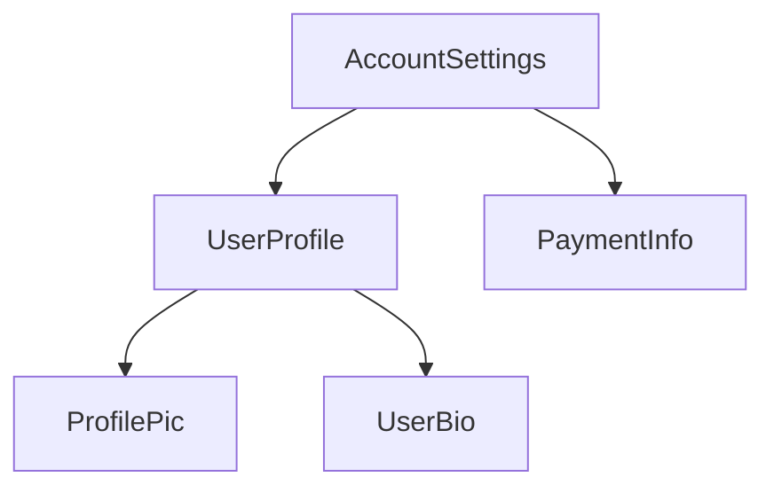


This tree structure is important to understanding several other Angular concepts, including [dependency injection](guide/di) and [child queries](guide/components/queries).

---


(From content-projection.md)

### Content projection with ng-content

Tip: This guide assumes you've already read the [Essentials Guide](essentials). Read that first if you're new to Angular.

You often need to create components that act as containers for different types of content. For
example, you may want to create a custom card component:

```angular-ts
@Component({
  selector: 'custom-card',
  template: '<div class="card-shadow"> <!-- card content goes here --> </div>',
})
export class CustomCard {/* ... */}
```

**You can use the `<ng-content>` element as a placeholder to mark where content should go**:

```angular-ts
@Component({
  selector: 'custom-card',
  template: '<div class="card-shadow"> <ng-content></ng-content> </div>',
})
export class CustomCard {/* ... */}
```

Tip: `<ng-content>` works similarly
to [the native `<slot>` element](https://developer.mozilla.org/docs/Web/HTML/Element/slot),
but with some Angular-specific functionality.

When you use a component with `<ng-content>`, any children of the component host element are
rendered, or **projected**, at the location of that `<ng-content>`:

```angular-ts
// Component source
@Component({
  selector: 'custom-card',
  template: `
    <div class="card-shadow">
      <ng-content />
    </div>
  `,
})
export class CustomCard {/* ... */}
```

```angular-html
<!-- Using the component -->
<custom-card>
  <p>This is the projected content</p>
</custom-card>
```

```angular-html
<!-- The rendered DOM -->
<custom-card>
  <div class="card-shadow">
    <p>This is the projected content</p>
  </div>
</custom-card>
```

Angular refers to any children of a component passed this way as that component's **content**. This
is distinct from the component's **view**, which refers to the elements defined in the component's
template.

**The `<ng-content>` element is neither a component nor DOM element**. Instead, it is a special
placeholder that tells Angular where to render content. Angular's compiler processes
all `<ng-content>` elements at build-time. You cannot insert, remove, or modify `<ng-content>` at
run time. You cannot add directives, styles, or arbitrary attributes to `<ng-content>`.

You should not conditionally include `<ng-content>` with `@if`, `@for`, or `@switch`. Angular always
instantiates and creates DOM nodes for content rendered to a `<ng-content>` placeholder, even if
that `<ng-content>` placeholder is hidden. For conditional rendering of component content,
see [Template fragments](api/core/ng-template).

#### Multiple content placeholders

Angular supports projecting multiple different elements into different `<ng-content>` placeholders
based on CSS selector. Expanding the card example from above, you could create two placeholders for
a card title and a card body by using the `select` attribute:

```angular-html
<!-- Component template -->
<div class="card-shadow">
  <ng-content select="card-title"></ng-content>
  <div class="card-divider"></div>
  <ng-content select="card-body"></ng-content>
</div>
```

```angular-html
<!-- Using the component -->
<custom-card>
  <card-title>Hello</card-title>
  <card-body>Welcome to the example</card-body>
</custom-card>
```

```angular-html
<!-- Rendered DOM -->
<custom-card>
  <div class="card-shadow">
    <card-title>Hello</card-title>
    <div class="card-divider"></div>
    <card-body>Welcome to the example</card-body>
  </div>
</custom-card>
```

The `<ng-content>` placeholder supports the same CSS selectors
as [component selectors](guide/components/selectors).

If you include one or more `<ng-content>` placeholders with a `select` attribute and
one `<ng-content>` placeholder without a `select` attribute, the latter captures all elements that
did not match a `select` attribute:

```angular-html
<!-- Component template -->
<div class="card-shadow">
  <ng-content select="card-title"></ng-content>
  <div class="card-divider"></div>
  <!-- capture anything except "card-title" -->
  <ng-content></ng-content>
</div>
```

```angular-html
<!-- Using the component -->
<custom-card>
  <card-title>Hello</card-title>
  
  <p>Welcome to the example</p>
</custom-card>
```

```angular-html
<!-- Rendered DOM -->
<custom-card>
  <div class="card-shadow">
    <card-title>Hello</card-title>
    <div class="card-divider"></div>
    
    <p>Welcome to the example></p>
  </div>
</custom-card>
```

If a component does not include an `<ng-content>` placeholder without a `select` attribute, any
elements that don't match one of the component's placeholders do not render into the DOM.

#### Fallback content

Angular can show *fallback content* for a component's `<ng-content>` placeholder if that component doesn't have any matching child content. You can specify fallback content by adding child content to the `<ng-content>` element itself.

```angular-html
<!-- Component template -->
<div class="card-shadow">
  <ng-content select="card-title">Default Title</ng-content>
  <div class="card-divider"></div>
  <ng-content select="card-body">Default Body</ng-content>
</div>
```

```angular-html
<!-- Using the component -->
<custom-card>
  <card-title>Hello</card-title>
  <!-- No card-body provided -->
</custom-card>
```

```angular-html
<!-- Rendered DOM -->
<custom-card>
  <div class="card-shadow">
    Hello
    <div class="card-divider"></div>
    Default Body
  </div>
</custom-card>
```

#### Aliasing content for projection

Angular supports a special attribute, `ngProjectAs`, that allows you to specify a CSS selector on
any element. Whenever an element with `ngProjectAs` is checked against an `<ng-content>`
placeholder, Angular compares against the `ngProjectAs` value instead of the element's identity:

```angular-html
<!-- Component template -->
<div class="card-shadow">
  <ng-content select="card-title"></ng-content>
  <div class="card-divider"></div>
  <ng-content></ng-content>
</div>
```

```angular-html
<!-- Using the component -->
<custom-card>
  <h3 ngProjectAs="card-title">Hello</h3>

  <p>Welcome to the example</p>
</custom-card>
```

```angular-html
<!-- Rendered DOM -->
<custom-card>
  <div class="card-shadow">
    <h3>Hello</h3>
    <div class="card-divider"></div>
    <p>Welcome to the example></p>
  </div>
</custom-card>
```

`ngProjectAs` supports only static values and cannot be bound to dynamic expressions.

---


(From dom-apis.md)

### Using DOM APIs

Tip: This guide assumes you've already read the [Essentials Guide](essentials). Read that first if you're new to Angular.

Angular handles most DOM creation, updates, and removals for you. However, you might rarely need to
directly interact with a component's DOM. Components can inject ElementRef to get a reference to the
component's host element:

```ts
@Component({...})
export class ProfilePhoto {
  constructor(elementRef: ElementRef) {
    console.log(elementRef.nativeElement);
  }
}
```

The `nativeElement` property references the
host [Element](https://developer.mozilla.org/docs/Web/API/Element) instance.

You can use Angular's `afterRender` and `afterNextRender` functions to register a **render
callback** that runs when Angular has finished rendering the page.

```ts
@Component({...})
export class ProfilePhoto {
  constructor(elementRef: ElementRef) {
    afterRender(() => {
      // Focus the first input element in this component.
      elementRef.nativeElement.querySelector('input')?.focus();
    });
  }
}
```

`afterRender` and `afterNextRender` must be called in an _injection context_, typically a
component's constructor.

**Avoid direct DOM manipulation whenever possible.** Always prefer expressing your DOM's structure
in component templates and updating that DOM with bindings.

**Render callbacks never run during server-side rendering or build-time pre-rendering.**

**Never directly manipulate the DOM inside of other Angular lifecycle hooks**. Angular does not
guarantee that a component's DOM is fully rendered at any point other than in render callbacks.
Further, reading or modifying the DOM during other lifecycle hooks can negatively impact page
performance by
causing [layout thrashing](https://web.dev/avoid-large-complex-layouts-and-layout-thrashing).

#### Using a component's renderer

Components can inject an instance of `Renderer2` to perform certain DOM manipulations that are tied
to other Angular features.

Any DOM elements created by a component's `Renderer2` participate in that
component's [style encapsulation](guide/components/styling#style-scoping).

Certain `Renderer2` APIs also tie into Angular's animation system. You can use the `setProperty`
method to update synthetic animation properties and the `listen` method to add event listeners for
synthetic animation events. See the [Animations](guide/animations) guide for details.

Aside from these two narrow use-cases, there is no difference between using `Renderer2` and native
DOM APIs. `Renderer2` APIs do not support DOM manipulation in server-side rendering or build-time
pre-rendering contexts.

#### When to use DOM APIs

While Angular handles most rendering concerns, some behaviors may still require using DOM APIs. Some
common use cases include:

- Managing element focus
- Measuring element geometry, such as with `getBoundingClientRect`
- Reading an element's text content
- Setting up native observers such
  as [`MutationObserver`](https://developer.mozilla.org/docs/Web/API/MutationObserver),
  [`ResizeObserver`](https://developer.mozilla.org/docs/Web/API/ResizeObserver), or
  [`IntersectionObserver`](https://developer.mozilla.org/docs/Web/API/Intersection_Observer_API).

Avoid inserting, removing, and modifying DOM elements. In particular, **never directly set an
element's `innerHTML` property**, which can make your application vulnerable
to [cross-site scripting (XSS) exploits](https://developer.mozilla.org/docs/Glossary/Cross-site_scripting).
Angular's template bindings, including bindings for `innerHTML`, include safeguards that help
protect against XSS attacks. See the [Security guide](best-practices/security) for details.

---


(From host-elements.md)

### Component host elements

Tip: This guide assumes you've already read the [Essentials Guide](essentials). Read that first if you're new to Angular.

Angular creates an instance of a component for every HTML element that matches the component's
selector. The DOM element that matches a component's selector is that component's **host element**.
The contents of a component's template are rendered inside its host element.

```angular-ts
// Component source
@Component({
  selector: 'profile-photo',
  template: `
    
  `,
})
export class ProfilePhoto {}
```

```angular-html
<!-- Using the component -->
<h3>Your profile photo</h3>
<profile-photo />
<button>Upload a new profile photo</button>
```

```angular-html
<!-- Rendered DOM -->
<h3>Your profile photo</h3>
<profile-photo>
  
</profile-photo>
<button>Upload a new profile photo</button>
```

In the above example, `<profile-photo>` is the host element of the `ProfilePhoto` component.

#### Binding to the host element

A component can bind properties, attributes, and events to its host element. This behaves
identically to bindings on elements inside the component's template, but instead defined with
the `host` property in the `@Component` decorator:

```angular-ts
@Component({
  ...,
  host: {
    'role': 'slider',
    '[attr.aria-valuenow]': 'value',
    '[class.active]': 'isActive()',
    '[tabIndex]': 'disabled ? -1 : 0',
    '(keydown)': 'updateValue($event)',
  },
})
export class CustomSlider {
  value: number = 0;
  disabled: boolean = false;
  isActive = signal(false);
  updateValue(event: KeyboardEvent) { /* ... */ }

  /* ... */
}
```

#### The `@HostBinding` and `@HostListener` decorators

You can alternatively bind to the host element by applying the `@HostBinding` and `@HostListener`
decorator to class members.

`@HostBinding` lets you bind host properties and attributes to properties and methods:

```angular-ts
@Component({
  /* ... */
})
export class CustomSlider {
  @HostBinding('attr.aria-valuenow')
  value: number = 0;

  @HostBinding('tabIndex')
  getTabIndex() {
    return this.disabled ? -1 : 0;
  }

  /* ... */
}
```

`@HostListener` lets you bind event listeners to the host element. The decorator accepts an event
name and an optional array of arguments:

```ts
export class CustomSlider {
  @HostListener('keydown', ['$event'])
  updateValue(event: KeyboardEvent) {
    /* ... */
  }
}
```

**Always prefer using the `host` property over `@HostBinding` and `@HostListener`.** These
decorators exist exclusively for backwards compatibility.

#### Binding collisions

When you use a component in a template, you can add bindings to that component instance's element.
The component may _also_ define host bindings for the same properties or attributes.

```angular-ts
@Component({
  ...,
  host: {
    'role': 'presentation',
    '[id]': 'id',
  }
})
export class ProfilePhoto { /* ... */ }
```

```angular-html
<profile-photo role="group" [id]="otherId" />
```

In cases like this, the following rules determine which value wins:

- If both values are static, the instance binding wins.
- If one value is static and the other dynamic, the dynamic value wins.
- If both values are dynamic, the component's host binding wins.

---


(From inheritance.md)

### Inheritance

Tip: This guide assumes you've already read the [Essentials Guide](essentials). Read that first if you're new to Angular.

Angular components are TypeScript classes and participate in standard JavaScript inheritance
semantics.

A component can extend any base class:

```ts
export class ListboxBase {
  value: string;
}

@Component({ ... })
export class CustomListbox extends ListboxBase {
  // CustomListbox inherits the `value` property.
}
```

#### Extending other components and directives

When a component extends another component or a directive, it inherits all the metadata defined in
the base class's decorator and the base class's decorated members. This includes the selector,
template, styles, host bindings, inputs, outputs, lifecycle methods, and any other settings.

```angular-ts
@Component({
  selector: 'base-listbox',
  template: `
    ...
  `,
  host: {
    '(keydown)': 'handleKey($event)',
  },
})
export class ListboxBase {
  @Input() value: string;
  handleKey(event: KeyboardEvent) {
    /* ... */
  }
}

@Component({
  selector: 'custom-listbox',
  template: `
    ...
  `,
  host: {
    '(click)': 'focusActiveOption()',
  },
})
export class CustomListbox extends ListboxBase {
  @Input() disabled = false;
  focusActiveOption() {
    /* ... */
  }
}
```

In the example above, `CustomListbox` inherits all the information associated with `ListboxBase`,
overriding the selector and template with its own values. `CustomListbox` has two inputs (`value`
and `disabled`) and two event listeners (`keydown` and `click`).

Child classes end up with the _union_ of all of their ancestors' inputs, outputs, and host bindings
and their own.

##### Forwarding injected dependencies

If a base class relies on dependency injection, the child class must explicitly pass these
dependencies to `super`.

```ts
@Component({ ... })
export class ListboxBase {
  constructor(private element: ElementRef) { }
}

@Component({ ... })
export class CustomListbox extends ListboxBase {
  constructor(element: ElementRef) {
    super(element);
  }
}
```

##### Overriding lifecycle methods

If a base class defines a lifecycle method, such as `ngOnInit`, a child class that also
implements `ngOnInit` _overrides_ the base class's implementation. If you want to preserve the base
class's lifecycle method, explicitly call the method with `super`:

```ts
@Component({ ... })
export class ListboxBase {
  protected isInitialized = false;
  ngOnInit() {
    this.isInitialized = true;
  }
}

@Component({ ... })
export class CustomListbox extends ListboxBase {
  override ngOnInit() {
    super.ngOnInit();
    /* ... */
  }
}
```

---


(From inputs.md)

### Accepting data with input properties

Tip: This guide assumes you've already read the [Essentials Guide](essentials). Read that first if you're new to Angular.

Tip: If you're familiar with other web frameworks, input properties are similar to _props_.

When you use a component, you commonly want to pass some data to it. A component specifies the data that it accepts by declaring
**inputs**:

<docs-code language="ts" highlight="[7]">
import {Component, input} from '@angular/core';

@Component({/*...*/})
export class CustomSlider {
  // Declare an input named 'value' with a default value of zero.
  value = input(0);
}
</docs-code>

This lets you bind to the property in a template:

```angular-html
<custom-slider [value]="50" />
```

If an input has a default value, TypeScript infers the type from the default value:

```typescript
@Component({/*...*/})
export class CustomSlider {
  // TypeScript infers that this input is a number, returning InputSignal<number>.
  value = input(0);
}
```

You can explicitly declare a type for the input by specifying a generic parameter to the function.

If an input without a default value is not set, its value is `undefined`:

```typescript
@Component({/*...*/})
export class CustomSlider {
  // Produces an InputSignal<number | undefined> because `value` may not be set.
  value = input<number>();
}
```

**Angular records inputs statically at compile-time**. Inputs cannot be added or removed at run-time.

The `input` function has special meaning to the Angular compiler. **You can exclusively call `input` in component and directive property initializers.**

When extending a component class, **inputs are inherited by the child class.**

**Input names are case-sensitive.**

#### Reading inputs

The `input` function returns an `InputSignal`. You can read the value by calling the signal:

<docs-code language="ts" highlight="[5]">
import {Component, input} from '@angular/core';

@Component({/*...*/})
export class CustomSlider {
  // Declare an input named 'value' with a default value of zero. 
  value = input(0);

  // Create a computed expression that reads the value input
  label = computed(() => `The slider's value is ${this.value()}`); 
}
</docs-code>

Signals created by the `input` function are read-only.

#### Required inputs

You can declare that an input is `required` by calling `input.required` instead of `input`:

<docs-code language="ts" highlight="[3]">
@Component({/*...*/})
export class CustomSlider {
  // Declare a required input named value. Returns an `InputSignal<number>`.
  value = input.required<number>();
}
</docs-code>

Angular enforces that required inputs _must_ be set when the component is used in a template. If you try to use a component without specifying all of its required inputs, Angular reports an error at build-time.

Required inputs do not automatically include `undefined` in the generic parameter of the returned `InputSignal`.

#### Configuring inputs

The `input` function accepts a config object as a second parameter that lets you change the way that input works.

##### Input transforms

You can specify a `transform` function to change the value of an input when it's set by Angular.

<docs-code language="ts" highlight="[6]">
@Component({
  selector: 'custom-slider',
  /*...*/
})
export class CustomSlider {
  label = input('', {transform: trimString});
}

function trimString(value: string | undefined): string {
  return value?.trim() ?? '';
}
</docs-code>

```angular-html
<custom-slider [label]="systemVolume" />
```

In the example above, whenever the value of `systemVolume` changes, Angular runs `trimString` and sets `label` to the result.

The most common use-case for input transforms is to accept a wider range of value types in templates, often including `null` and `undefined`.

**Input transform function must be statically analyzable at build-time.** You cannot set transform functions conditionally or as the result of an expression evaluation.

**Input transform functions should always be [pure functions](https://en.wikipedia.org/wiki/Pure_function).** Relying on state outside the transform function can lead to unpredictable behavior.

###### Type checking

When you specify an input transform, the type of the transform function's parameter determines the types of values that can be set to the input in a template.

<docs-code language="ts">
@Component({/*...*/})
export class CustomSlider {
  widthPx = input('', {transform: appendPx});
}

function appendPx(value: number): string {
  return `${value}px`;
}
</docs-code>

In the example above, the `widthPx` input accepts a `number` while the `InputSignal` property returns a `string`.

###### Built-in transformations

Angular includes two built-in transform functions for the two most common scenarios: coercing values to boolean and numbers.

<docs-code language="ts">
import {Component, input, booleanAttribute, numberAttribute} from '@angular/core';

@Component({/*...*/})
export class CustomSlider {
  disabled = input(false, {transform: booleanAttribute}); 
  value = input(0, {transform: numberAttribute}); 
}
</docs-code>

`booleanAttribute` imitates the behavior of standard HTML [boolean attributes](https://developer.mozilla.org/docs/Glossary/Boolean/HTML), where the
_presence_ of the attribute indicates a "true" value. However, Angular's `booleanAttribute` treats the literal string `"false"` as the boolean `false`.

`numberAttribute` attempts to parse the given value to a number, producing `NaN` if parsing fails.

##### Input aliases

You can specify the `alias` option to change the name of an input in templates.

<docs-code language="ts" highlight="[3]">
@Component({/*...*/})
export class CustomSlider {
  value = input(0, {alias: 'sliderValue'});
}
</docs-code>

```angular-html
<custom-slider [sliderValue]="50" />
```

This alias does not affect usage of the property in TypeScript code.

While you should generally avoid aliasing inputs for components, this feature can be useful for renaming properties while preserving an alias for the original name or for avoiding collisions with the name of native DOM element properties.

#### Model inputs

**Model inputs** are a special type of input that enable a component to propagate new values back to its parent component.

When creating a component, you can define a model input similarly to how you create a standard input.

Both types of input allow someone to bind a value into the property. However, **model inputs allow the component author to write values into the property**. If the property is bound with a two-way binding, the new value propagates to that binding.

```typescript
@Component({ /* ... */})
export class CustomSlider {
  // Define a model input named "value".
  value = model(0);

  increment() {
    // Update the model input with a new value, propagating the value to any bindings. 
    this.value.update(oldValue => oldValue + 10);
  }
}

@Component({
  /* ... */
  // Using the two-way binding syntax means that any changes to the slider's
  // value automatically propagate back to the `volume` signal.
  // Note that this binding uses the signal *instance*, not the signal value.
  template: `<custom-slider [(value)]="volume" />`,
})
export class MediaControls {
  // Create a writable signal for the `volume` local state. 
  volume = signal(0);
}
```

In the above example, the `CustomSlider` can write values into its `value` model input, which then propagates those values back to the `volume` signal in `MediaControls`. This binding keeps the values of `value` and `volume` in sync. Notice that the binding passes the `volume` signal instance, not the _value_ of the signal.

In other respects, model inputs work similarly to standard inputs. You can read the value by calling the signal function, including in reactive contexts like `computed` and `effect`.

See [Two-way binding](guide/templates/two-way-binding) for more details on two-way binding in templates.

##### Two-way binding with plain properties

You can bind a plain JavaScript property to a model input.

```angular-ts
@Component({
  /* ... */
  // `value` is a model input.
  // The parenthesis-inside-square-brackets syntax (aka "banana-in-a-box") creates a two-way binding
  template: '<custom-slider [(value)]="volume" />',
})
export class MediaControls {
  protected volume = 0;
}
```

In the example above, the `CustomSlider` can write values into its `value` model input, which then propagates those values back to the `volume` property in `MediaControls`. This binding keeps the values of `value` and `volume` in sync.

##### Implicit `change` events

When you declare a model input in a component or directive, Angular automatically creates a corresponding [output](guide/components/outputs) for that model. The output's name is the model input's name suffixed with "Change".

```angular-ts
@Directive({ /* ... */ })
export class CustomCheckbox {
  // This automatically creates an output named "checkedChange".
  // Can be subscribed to using `(checkedChange)="handler()"` in the template.
  checked = model(false);
}
```

Angular emits this change event whenever you write a new value into the model input by calling its `set` or `update` methods.

See [Custom events with outputs](guide/components/outputs) for more details on outputs.

##### Customizing model inputs

You can mark a model input as required or provide an alias in the same way as a [standard input](guide/signals/inputs).

Model inputs do not support input transforms.

##### When to use model inputs

Use model inputs when you want a component to support two-way binding. This is typically appropriate when a component exists to modify a value based on user interaction. Most commonly, custom form controls, such as a date picker or combobox, should use model inputs for their primary value.

#### Choosing input names

Avoid choosing input names that collide with properties on DOM elements like HTMLElement. Name collisions introduce confusion about whether the bound property belongs to the component or the DOM element.

Avoid adding prefixes for component inputs like you would with component selectors. Since a given element can only host one component, any custom properties can be assumed to belong to the component.

#### Declaring inputs with the `@Input` decorator

Tip: While the Angular team recommends using the signal-based `input` function for new projects, the original decorator-based `@Input` API remains fully supported.

You can alternatively declare component inputs by adding the `@Input` decorator to a property:

<docs-code language="ts" highlight="[3]">
@Component({...})
export class CustomSlider {
  @Input() value = 0;
}
</docs-code>

Binding to an input is the same in both signal-based and decorator-based inputs:

```angular-html
<custom-slider [value]="50" />
```

##### Customizing decorator-based inputs

The `@Input` decorator accepts a config object that lets you change the way that input works.

###### Required inputs

You can specify the `required` option to enforce that a given input must always have a value.

<docs-code language="ts" highlight="[3]">
@Component({...})
export class CustomSlider {
  @Input({required: true}) value = 0;
}
</docs-code>

If you try to use a component without specifying all of its required inputs, Angular reports an error at build-time.

###### Input transforms

You can specify a `transform` function to change the value of an input when it's set by Angular. This transform function works identically to transform functions for signal-based inputs described above.

<docs-code language="ts" highlight="[6]">
@Component({
  selector: 'custom-slider',
  ...
})
export class CustomSlider {
  @Input({transform: trimString}) label = '';
}

function trimString(value: string | undefined) { return value?.trim() ?? ''; }
</docs-code>

###### Input aliases

You can specify the `alias` option to change the name of an input in templates.

<docs-code language="ts" highlight="[3]">
@Component({...})
export class CustomSlider {
  @Input({alias: 'sliderValue'}) value = 0;
}
</docs-code>

```angular-html
<custom-slider [sliderValue]="50" />
```

The `@Input` decorator also accepts the alias as its first parameter in place of the config object.

Input aliases work the same way as for signal-based inputs described above.

##### Inputs with getters and setters

When using decorator-based inputs, a property implemented with a getter and setter can be an input:

<docs-code language="ts">
export class CustomSlider {
  @Input()
  get value(): number {
    return this.internalValue;
  }

set value(newValue: number) { this.internalValue = newValue; }

private internalValue = 0; }
</docs-code>

You can even create a _write-only_ input by only defining a public setter:

<docs-code language="ts">
export class CustomSlider {
  @Input()
  set value(newValue: number) {
    this.internalValue = newValue;
  }

private internalValue = 0; }
</docs-code>

**Prefer using input transforms instead of getters and setters** if possible.

Avoid complex or costly getters and setters. Angular may invoke an input's setter multiple times, which may negatively impact application performance if the setter performs any costly behaviors, such as DOM manipulation.

#### Specify inputs in the `@Component` decorator

In addition to the `@Input` decorator, you can also specify a component's inputs with the `inputs` property in the `@Component` decorator. This can be useful when a component inherits a property from a base class:

<docs-code language="ts" highlight="[4]">
// `CustomSlider` inherits the `disabled` property from `BaseSlider`.
@Component({
  ...,
  inputs: ['disabled'],
})
export class CustomSlider extends BaseSlider { }
</docs-code>

You can additionally specify an input alias in the `inputs` list by putting the alias after a colon in the string:

<docs-code language="ts" highlight="[4]">
// `CustomSlider` inherits the `disabled` property from `BaseSlider`.
@Component({
  ...,
  inputs: ['disabled: sliderDisabled'],
})
export class CustomSlider extends BaseSlider { }
</docs-code>

---


(From lifecycle.md)

### Component Lifecycle

Tip: This guide assumes you've already read the [Essentials Guide](essentials). Read that first if you're new to Angular.

A component's **lifecycle** is the sequence of steps that happen between the component's creation
and its destruction. Each step represents a different part of Angular's process for rendering
components and checking them for updates over time.

In your components, you can implement **lifecycle hooks** to run code during these steps.
Lifecycle hooks that relate to a specific component instance are implemented as methods on your
component class. Lifecycle hooks that relate the Angular application as a whole are implemented
as functions that accept a callback.

A component's lifecycle is tightly connected to how Angular checks your components for changes over
time. For the purposes of understanding this lifecycle, you only need to know that Angular walks
your application tree from top to bottom, checking template bindings for changes. The lifecycle
hooks described below run while Angular is doing this traversal. This traversal visits each
component exactly once, so you should always avoid making further state changes in the middle of the
process.

#### Summary

<div class="docs-table docs-scroll-track-transparent">
  <table>
    <tr>
      <td><strong>Phase</strong></td>
      <td><strong>Method</strong></td>
      <td><strong>Summary</strong></td>
    </tr>
    <tr>
      <td>Creation</td>
      <td><code>constructor</code></td>
      <td>
        <a href="https://developer.mozilla.org/docs/Web/JavaScript/Reference/Classes/constructor" target="_blank">
          Standard JavaScript class constructor
        </a>. Runs when Angular instantiates the component.
      </td>
    </tr>
    <tr>
      <td rowspan="7">Change<p>Detection</td>
      <td><code>ngOnInit</code>
      </td>
      <td>Runs once after Angular has initialized all the component's inputs.</td>
    </tr>
    <tr>
      <td><code>ngOnChanges</code></td>
      <td>Runs every time the component's inputs have changed.</td>
    </tr>
    <tr>
      <td><code>ngDoCheck</code></td>
      <td>Runs every time this component is checked for changes.</td>
    </tr>
    <tr>
      <td><code>ngAfterContentInit</code></td>
      <td>Runs once after the component's <em>content</em> has been initialized.</td>
    </tr>
    <tr>
      <td><code>ngAfterContentChecked</code></td>
      <td>Runs every time this component content has been checked for changes.</td>
    </tr>
    <tr>
      <td><code>ngAfterViewInit</code></td>
      <td>Runs once after the component's <em>view</em> has been initialized.</td>
    </tr>
    <tr>
      <td><code>ngAfterViewChecked</code></td>
      <td>Runs every time the component's view has been checked for changes.</td>
    </tr>
    <tr>
      <td rowspan="2">Rendering</td>
      <td><code>afterNextRender</code></td>
      <td>Runs once the next time that <strong>all</strong> components have been rendered to the DOM.</td>
    </tr>
    <tr>
      <td><code>afterRender</code></td>
      <td>Runs every time <strong>all</strong> components have been rendered to the DOM.</td>
    </tr>
    <tr>
      <td>Destruction</td>
      <td><code>ngOnDestroy</code></td>
      <td>Runs once before the component is destroyed.</td>
    </tr>
  </table>
</div>

##### ngOnInit

The `ngOnInit` method runs after Angular has initialized all the components inputs with their
initial values. A component's `ngOnInit` runs exactly once.

This step happens _before_ the component's own template is initialized. This means that you can
update the component's state based on its initial input values.

##### ngOnChanges

The `ngOnChanges` method runs after any component inputs have changed.

This step happens _before_ the component's own template is checked. This means that you can update
the component's state based on its initial input values.

During initialization, the first `ngOnChanges` runs before `ngOnInit`.

###### Inspecting changes

The `ngOnChanges` method accepts one `SimpleChanges` argument. This object is
a [`Record`](https://www.typescriptlang.org/docs/handbook/utility-types.html#recordkeys-type)
mapping each component input name to a `SimpleChange` object. Each `SimpleChange` contains the
input's previous value, its current value, and a flag for whether this is the first time the input
has changed.

```ts
@Component({
  /* ... */
})
export class UserProfile {
  @Input() name: string = '';

  ngOnChanges(changes: SimpleChanges) {
    for (const inputName in changes) {
      const inputValues = changes[inputName];
      console.log(`Previous ${inputName} == ${inputValues.previousValue}`);
      console.log(`Current ${inputName} == ${inputValues.currentValue}`);
      console.log(`Is first ${inputName} change == ${inputValues.firstChange}`);
    }
  }
}
```

If you provide an `alias` for any input properties, the `SimpleChanges` Record still uses the
TypeScript property name as a key, rather than the alias.

##### ngOnDestroy

The `ngOnDestroy` method runs once just before a component is destroyed. Angular destroys a
component when it is no longer shown on the page, such as being hidden by `@if` or upon navigating
to another page.

###### DestroyRef

As an alternative to the `ngOnDestroy` method, you can inject an instance of `DestroyRef`. You can
register a callback to be invoked upon the component's destruction by calling the `onDestroy` method
of `DestroyRef`.

```ts
@Component({
  /* ... */
})
export class UserProfile {
  constructor(private destroyRef: DestroyRef) {
    destroyRef.onDestroy(() => {
      console.log('UserProfile destruction');
    });
  }
}
```

You can pass the `DestroyRef` instance to functions or classes outside your component. Use this
pattern if you have other code that should run some cleanup behavior when the component is
destroyed.

You can also use `DestroyRef` to keep setup code close to cleanup code, rather than putting
all cleanup code in the `ngOnDestroy` method.

##### ngDoCheck

The `ngDoCheck` method runs before every time Angular checks a component's template for changes.

You can use this lifecycle hook to manually check for state changes outside of Angular's normal
change detection, manually updating the component's state.

This method runs very frequently and can significantly impact your page's performance. Avoid
defining this hook whenever possible, only using it when you have no alternative.

During initialization, the first `ngDoCheck` runs after `ngOnInit`.

##### ngAfterContentInit

The `ngAfterContentInit` method runs once after all the children nested inside the component (its
_content_) have been initialized.

You can use this lifecycle hook to read the results of
[content queries](guide/components/queries#content-queries). While you can access the initialized
state of these queries, attempting to change any state in this method results in an
[ExpressionChangedAfterItHasBeenCheckedError](errors/NG0100)

##### ngAfterContentChecked

The `ngAfterContentChecked` method runs every time the children nested inside the component (its
_content_) have been checked for changes.

This method runs very frequently and can significantly impact your page's performance. Avoid
defining this hook whenever possible, only using it when you have no alternative.

While you can access the updated state
of [content queries](guide/components/queries#content-queries) here, attempting to
change any state in this method results in
an [ExpressionChangedAfterItHasBeenCheckedError](errors/NG0100).

##### ngAfterViewInit

The `ngAfterViewInit` method runs once after all the children in the component's template (its
_view_) have been initialized.

You can use this lifecycle hook to read the results of
[view queries](guide/components/queries#view-queries). While you can access the initialized state of
these queries, attempting to change any state in this method results in an
[ExpressionChangedAfterItHasBeenCheckedError](errors/NG0100)

##### ngAfterViewChecked

The `ngAfterViewChecked` method runs every time the children in the component's template (its
_view_) have been checked for changes.

This method runs very frequently and can significantly impact your page's performance. Avoid
defining this hook whenever possible, only using it when you have no alternative.

While you can access the updated state of [view queries](guide/components/queries#view-queries)
here, attempting to
change any state in this method results in
an [ExpressionChangedAfterItHasBeenCheckedError](errors/NG0100).

##### afterRender and afterNextRender

The `afterRender` and `afterNextRender` functions let you register a **render callback** to be
invoked after Angular has finished rendering _all components_ on the page into the DOM.

These functions are different from the other lifecycle hooks described in this guide. Rather than a
class method, they are standalone functions that accept a callback. The execution of render
callbacks are not tied to any specific component instance, but instead an application-wide hook.

`afterRender` and `afterNextRender` must be called in
an [injection context](guide/di/dependency-injection-context), typically a
component's constructor.

You can use render callbacks to perform manual DOM operations.
See [Using DOM APIs](guide/components/dom-apis) for guidance on working with the DOM in Angular.

Render callbacks do not run during server-side rendering or during build-time pre-rendering.

###### afterRender phases

When using `afterRender` or `afterNextRender`, you can optionally split the work into phases. The
phase gives you control over the sequencing of DOM operations, letting you sequence _write_
operations before _read_ operations in order to minimize
[layout thrashing](https://web.dev/avoid-large-complex-layouts-and-layout-thrashing). In order to
communicate across phases, a phase function may return a result value that can be accessed in the
next phase.

```ts
import {Component, ElementRef, afterNextRender} from '@angular/core';

@Component({...})
export class UserProfile {
  private prevPadding = 0;
  private elementHeight = 0;

  constructor(elementRef: ElementRef) {
    const nativeElement = elementRef.nativeElement;

    afterNextRender({
      // Use the `Write` phase to write to a geometric property.
      write: () => {
        const padding = computePadding();
        const changed = padding !== this.prevPadding;
        if (changed) {
          nativeElement.style.padding = padding;
        }
        return changed; // Communicate whether anything changed to the read phase.
      },

      // Use the `Read` phase to read geometric properties after all writes have occurred.
      read: (didWrite) => {
        if (didWrite) {
          this.elementHeight = nativeElement.getBoundingClientRect().height;
        }
      }
    });
  }
}
```

There are four phases, run in the following order:

| Phase            | Description                                                                                                                                                                                           |
| ---------------- | ----------------------------------------------------------------------------------------------------------------------------------------------------------------------------------------------------- |
| `earlyRead`      | Use this phase to read any layout-affecting DOM properties and styles that are strictly necessary for subsequent calculation. Avoid this phase if possible, preferring the `write` and `read` phases. |
| `mixedReadWrite` | Default phase. Use for any operations need to both read and write layout-affecting properties and styles. Avoid this phase if possible, preferring the explicit `write` and `read` phases.            |
| `write`          | Use this phase to write layout-affecting DOM properties and styles.                                                                                                                                   |
| `read`           | Use this phase to read any layout-affecting DOM properties.                                                                                                                                           |

#### Lifecycle interfaces

Angular provides a TypeScript interface for each lifecycle method. You can optionally import
and `implement` these interfaces to ensure that your implementation does not have any typos or
misspellings.

Each interface has the same name as the corresponding method without the `ng` prefix. For example,
the interface for `ngOnInit` is `OnInit`.

```ts
@Component({
  /* ... */
})
export class UserProfile implements OnInit {
  ngOnInit() {
    /* ... */
  }
}
```

#### Execution order

The following diagrams show the execution order of Angular's lifecycle hooks.

##### During initialization

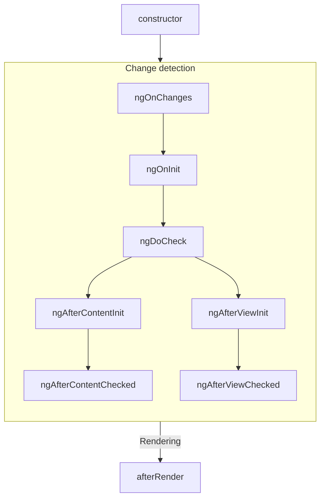

##### Subsequent updates

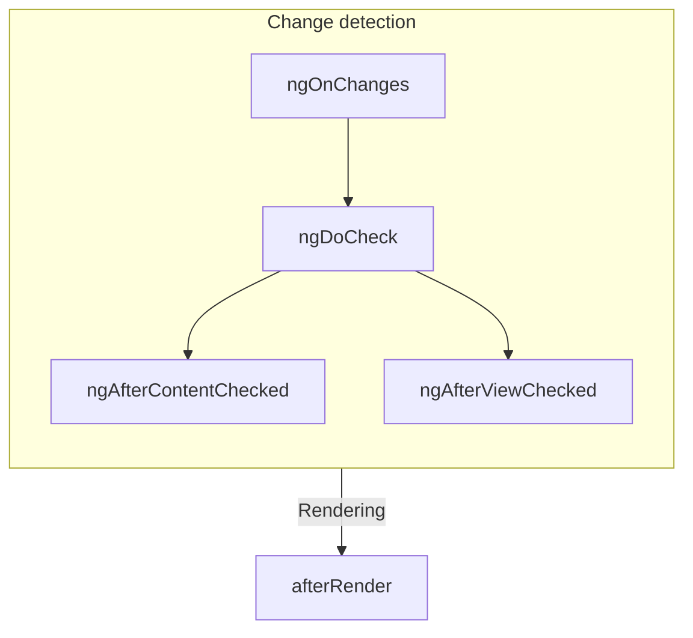

##### Ordering with directives

When you put one or more directives on the same element as a component, either in a template or with
the `hostDirectives` property, the framework does not guarantee any ordering of a given lifecycle
hook between the component and the directives on a single element. Never depend on an observed
ordering, as this may change in later versions of Angular.

---


(From outputs.md)

### Custom events with outputs

Tip: This guide assumes you've already read the [Essentials Guide](essentials). Read that first if you're new to Angular.

Angular components can define custom events by assigning a property to the `output` function:

<docs-code language="ts" highlight="3">
@Component({/*...*/})
export class ExpandablePanel {
  panelClosed = output<void>();
}
</docs-code>

```angular-html
<expandable-panel (panelClosed)="savePanelState()" />
```

The `output` function returns an `OutputEmitterRef`. You can emit an event by calling the `emit` method on the `OutputEmitterRef`:

<docs-code language="ts" highlight="">
  this.panelClosed.emit();
</docs-code>

Angular refers to properties initialized with the `output` function as **outputs**. You can use outputs to raise custom events, similar to native browser events like `click`.

**Angular custom events do not bubble up the DOM**.

**Output names are case-sensitive.**

When extending a component class, **outputs are inherited by the child class.**

The `output` function has special meaning to the Angular compiler. **You can exclusively call `output` in component and directive property initializers.**

#### Emitting event data

You can pass event data when calling `emit`:

<docs-code language="ts" highlight="">
// You can emit primitive values.
this.valueChanged.emit(7);

// You can emit custom event objects
this.thumbDropped.emit({
  pointerX: 123,
  pointerY: 456,
})
</docs-code>

When defining an event listener in a template, you can access the event data from the `$event` variable:

```angular-html
<custom-slider (valueChanged)="logValue($event)" />
```

#### Customizing output names

The `output` function accepts a parameter that lets you specify a different name for the event in a template:

<docs-code language="ts" highlight="">
@Component({/*...*/})
export class CustomSlider {
  changed = output({alias: 'valueChanged'});
}
</docs-code>

```angular-html
<custom-slider (valueChanged)="saveVolume()" />
```

This alias does not affect usage of the property in TypeScript code.

While you should generally avoid aliasing outputs for components, this feature can be useful for renaming properties while preserving an alias for the original name or for avoiding collisions with the name of native DOM events.

#### Subscribing to outputs programmatically

When creating a component dynamically, you can programmatically subscribe to output events
from the component instance. The `OutputRef` type includes a `subscribe` method:

```ts
const someComponentRef: ComponentRef<SomeComponent> = viewContainerRef.createComponent(/*...*/);

someComponentRef.instance.someEventProperty.subscribe(eventData => {
  console.log(eventData);
});
```

Angular automatically cleans up event subscriptions when it destroys components with subscribers. Alternatively, you can manually unsubscribe from an event. The `subscribe` function returns an `OutputRefSubscription` with an `unsubscribe` method:

```typescript
const eventSubscription = someComponent.someEventProperty.subscribe(eventData => {
  console.log(eventData);
});

// ...

eventSubscription.unsubscribe();
```

#### Choosing event names

Avoid choosing output names that collide with events on DOM elements like HTMLElement. Name collisions introduce confusion about whether the bound property belongs to the component or the DOM element.

Avoid adding prefixes for component outputs like you would with component selectors. Since a given element can only host one component, any custom properties can be assumed to belong to the component.

Always use [camelCase](https://en.wikipedia.org/wiki/Camel_case) output names. Avoid prefixing output names with "on".

#### Using outputs with RxJS

See [RxJS interop with component and directive outputs](ecosystem/rxjs-interop/output-interop) for details on interoperability between outputs and RxJS.

#### Declaring outputs with the `@Output` decorator

Tip: While the Angular team recommends using the `output` function for new projects, the
original decorator-based `@Output` API remains fully supported.

You can alternatively define custom events by assigning a property to a new `EventEmitter` and adding the `@Output` decorator:

<docs-code language="ts" highlight="">
@Component({/*...*/})
export class ExpandablePanel {
  @Output() panelClosed = new EventEmitter<void>();
}
</docs-code>

You can emit an event by calling the `emit` method on the `EventEmitter`.

##### Aliases with the `@Output` decorator

The `@Output` decorator accepts a parameter that lets you specify a different name for the event in a template:

<docs-code language="ts" highlight="">
@Component({/*...*/})
export class CustomSlider {
  @Output('valueChanged') changed = new EventEmitter<number>();
}
</docs-code>

```angular-html
<custom-slider (valueChanged)="saveVolume()" />
```

This alias does not affect usage of the property in TypeScript code.

#### Specify outputs in the `@Component` decorator

In addition to the `@Output` decorator, you can also specify a component's outputs with the `outputs` property in the `@Component` decorator. This can be useful when a component inherits a property from a base class:

<docs-code language="ts" highlight="">
// `CustomSlider` inherits the `valueChanged` property from `BaseSlider`.
@Component({
  /*...*/
  outputs: ['valueChanged'],
})
export class CustomSlider extends BaseSlider {}
</docs-code>

You can additionally specify an output alias in the `outputs` list by putting the alias after a colon in the string:

<docs-code language="ts" highlight="">
// `CustomSlider` inherits the `valueChanged` property from `BaseSlider`.
@Component({
  /*...*/
  outputs: ['valueChanged: volumeChanged'],
})
export class CustomSlider extends BaseSlider {}
</docs-code>

---


(From programmatic-rendering.md)

### Programmatically rendering components

Tip: This guide assumes you've already read the [Essentials Guide](essentials). Read that first if you're new to Angular.

In addition to using a component directly in a template, you can also dynamically render components.
There are two main ways to dynamically render a component: in a template with `NgComponentOutlet`,
or in your TypeScript code with `ViewContainerRef`.

#### Using NgComponentOutlet

`NgComponentOutlet` is a structural directive that dynamically renders a given component in a
template.

```angular-ts
@Component({ ... })
export class AdminBio { /* ... */ }

@Component({ ... })
export class StandardBio { /* ... */ }

@Component({
  ...,
  template: `
    <p>Profile for {{user.name}}</p>
    <ng-container *ngComponentOutlet="getBioComponent()" /> `
})
export class CustomDialog {
  @Input() user: User;

  getBioComponent() {
    return this.user.isAdmin ? AdminBio : StandardBio;
  }
}
```

See the [NgComponentOutlet API reference](api/common/NgComponentOutlet) for more information on the
directive's capabilities.

#### Using ViewContainerRef

A **view container** is a node in Angular's component tree that can contain content. Any component
or directive can inject `ViewContainerRef` to get a reference to a view container corresponding to
that component or directive's location in the DOM.

You can use the `createComponent`method on `ViewContainerRef` to dynamically create and render a
component. When you create a new component with a `ViewContainerRef`, Angular appends it into the
DOM as the next sibling of the component or directive that injected the `ViewContainerRef`.

```angular-ts
@Component({
  selector: 'leaf-content',
  template: `
    This is the leaf content
  `,
})
export class LeafContent {}

@Component({
  selector: 'outer-container',
  template: `
    <p>This is the start of the outer container</p>
    <inner-item />
    <p>This is the end of the outer container</p>
  `,
})
export class OuterContainer {}

@Component({
  selector: 'inner-item',
  template: `
    <button (click)="loadContent()">Load content</button>
  `,
})
export class InnerItem {
  constructor(private viewContainer: ViewContainerRef) {}

  loadContent() {
    this.viewContainer.createComponent(LeafContent);
  }
}
```

In the example above, clicking the "Load content" button results in the following DOM structure

```angular-html
<outer-container>
  <p>This is the start of the outer container</p>
  <inner-item>
    <button>Load content</button>
  </inner-item>
  <leaf-content>This is the leaf content</leaf-content>
  <p>This is the end of the outer container</p>
</outer-container>
```

#### Lazy-loading components

You can use both of the approaches described above, `NgComponentOutlet` and `ViewContainerRef`, to
render components that are lazy-loaded with a standard
JavaScript [dynamic import](https://developer.mozilla.org/docs/Web/JavaScript/Reference/Operators/import).

```angular-ts
@Component({
  ...,
  template: `
    <section>
      <h2>Basic settings</h2>
      <basic-settings />
    </section>
    <section>
      <h2>Advanced settings</h2>
      <button (click)="loadAdvanced()" *ngIf="!advancedSettings">
        Load advanced settings
      </button>
      <ng-container *ngComponentOutlet="advancedSettings" />
    </section>
  `
})
export class AdminSettings {
  advancedSettings: {new(): AdvancedSettings} | undefined;

  async loadAdvanced() {
    const { AdvancedSettings } = await import('path/to/advanced_settings.js');
    this.advancedSettings = AdvancedSettings;
  }
}
```

The example above loads and displays the `AdvancedSettings` upon receiving a button click.

---


(From queries.md)

### Referencing component children with queries

Tip: This guide assumes you've already read the [Essentials Guide](essentials). Read that first if you're new to Angular.

A component can define **queries** that find child elements and read values from their injectors.

Developers most commonly use queries to retrieve references to child components, directives, DOM elements, and more.

All query functions return signals that reflect the most up-to-date results. You can read the
result by calling the signal function, including in reactive contexts like `computed` and `effect`.

There are two categories of query: **view queries** and **content queries.**

#### View queries

View queries retrieve results from the elements in the component's _view_ — the elements defined in the component's own template. You can query for a single result with the `viewChild` function.

<docs-code language="angular-ts" highlight="[14, 15]">
@Component({
  selector: 'custom-card-header',
  /*...*/
})
export class CustomCardHeader {
  text: string;
}

@Component({
  selector: 'custom-card',
  template: '<custom-card-header>Visit sunny California!</custom-card-header>',
})
export class CustomCard {
  header = viewChild(CustomCardHeader);
  headerText = computed(() => this.header()?.text);
}
</docs-code>

In this example, the `CustomCard` component queries for a child `CustomCardHeader` and uses the result in a `computed`.

If the query does not find a result, its value is `undefined`. This may occur if the target element is hidden by `@if`. Angular keeps the result of `viewChild` up to date as your application state changes.

You can also query for multiple results with the `viewChildren` function.

<docs-code language="angular-ts" highlight="[17, 19, 20, 21, 22, 23]">
@Component({
  selector: 'custom-card-action',
  /*...*/
})
export class CustomCardAction {
  text: string;
}

@Component({
  selector: 'custom-card',
  template: `
    <custom-card-action>Save</custom-card-action>
    <custom-card-action>Cancel</custom-card-action>
  `,
})
export class CustomCard {
  actions = viewChildren(CustomCardAction);
  actionsTexts = computed(() => this.actions().map(action => action.text);
}
</docs-code>

`viewChildren` creates a signal with an `Array` of the query results.

**Queries never pierce through component boundaries.** View queries can only retrieve results from the component's template.

#### Content queries

Content queries retrieve results from the elements in the component's _content_— the elements nested inside the component in the template where it's used. You can query for a single result with the `contentChild` function.

<docs-code language="angular-ts" highlight="[14, 15]">
@Component({
  selector: 'custom-toggle',
  /*...*/
})
export class CustomToggle {
  text: string;
}

@Component({
  selector: 'custom-expando',
  /*...*/
})
export class CustomExpando {
  toggle = contentChild(CustomToggle);
  toggleText = computed(() => this.toggle()?.text);
}

@Component({ 
  /* ... */
  // CustomToggle is used inside CustomExpando as content.  
  template: `
    <custom-expando>
      <custom-toggle>Show</custom-toggle>
    </custom-expando>
  `
})
export class UserProfile { }
</docs-code>

In this example, the `CustomExpando` component queries for a child `CustomToggle` and accesses the result in a `computed`.

If the query does not find a result, its value is `undefined`. This may occur if the target element is absent or hidden by `@if`. Angular keeps the result of `contentChild` up to date as your application state changes.

By default, content queries find only _direct_ children of the component and do not traverse into descendants.

You can also query for multiple results with the `contentChildren` function.

<docs-code language="angular-ts" highlight="[14, 16, 17, 18, 19, 20]">
@Component({
  selector: 'custom-menu-item',
  /*...*/
})
export class CustomMenuItem {
  text: string;
}

@Component({
  selector: 'custom-menu',
  /*...*/
})
export class CustomMenu {
  items = contentChildren(CustomMenuItem);
  itemTexts = computed(() => this.items().map(item => item.text));
}

@Component({
  selector: 'user-profile',
  template: `
    <custom-menu>
      <custom-menu-item>Cheese</custom-menu-item>
      <custom-menu-item>Tomato</custom-menu-item>
    </custom-menu>
  `
})
export class UserProfile { }
</docs-code>

`contentChildren` creates a signal with an `Array` of the query results.

**Queries never pierce through component boundaries.** Content queries can only retrieve results from the same template as the component itself.

#### Required queries

If a child query (`viewChild` or `contentChild`) does not find a result, its value is `undefined`. This may occur if the target element is hidden by a control flow statement like `@if` or `@for`. Because of this, the child queries return a signal that include `undefined` in their value type.

If some cases, especially with `viewChild`, you know with certainty that a specific child is always available. In other cases, you may want to strictly enforce that a specific child is present. For these cases, you can use a *required query*.

```angular-ts
@Component({/* ... */})
export class CustomCard {
  header = viewChild.required(CustomCardHeader);
  body = contentChild.required(CustomCardBody);
}
```

If a required query does not find a matching result, Angular reports an error. Because this guarantees that a result is available, require queries do not automatically include `undefined` in the signal's value type.

#### Query locators

This first parameter for each query decorator is its **locator**.

Most of the time, you want to use a component or directive as your locator.

You can alternatively specify a string locator corresponding to
a [template reference variable](guide/templates/variables#template-reference-variables).

```angular-ts
@Component({
  /*...*/
  template: `
    <button #save>Save</button>
    <button #cancel>Cancel</button>
  `
})
export class ActionBar {
  saveButton = viewChild<ElementRef<HTMLButtonElement>>('save');
}
```

If more than one element defines the same template reference variable, the query retrieves the first matching element.

Angular does not support CSS selectors as query locators.

##### Queries and the injector tree

Tip: See [Dependency Injection](guide/di) for background on providers and Angular's injection tree.

For more advanced cases, you can use any `ProviderToken` as a locator. This lets you locate elements based on component and directive providers.

```angular-ts
const SUB_ITEM = new InjectionToken<string>('sub-item');

@Component({
  /*...*/
  providers: [{provide: SUB_ITEM, useValue: 'special-item'}],
})
export class SpecialItem { }

@Component({/*...*/})
export class CustomList {
  subItemType = contentChild(SUB_ITEM);
}
```

The above example uses an `InjectionToken` as a locator, but you can use any `ProviderToken` to locate specific elements.

#### Query options

All query functions accept an options object as a second parameter. These options control how the query finds its results.

##### Reading specific values from an element's injector

By default, the query locator indicates both the element you're searching for and the value retrieved. You can alternatively specify the `read` option to retrieve a different value from the element matched by the locator.

```ts
@Component({/*...*/})
export class CustomExpando {
  toggle = contentChild(ExpandoContent, {read: TemplateRef});
}
```

The above example, locates an element with the directive `ExpandoContent` and retrieves
the `TemplateRef` associated with that element.

Developers most commonly use `read` to retrieve `ElementRef` and `TemplateRef`.

##### Content descendants

By default, content queries find only _direct_ children of the component and do not traverse into descendants.

<docs-code language="angular-ts" highlight="[13, 14, 15, 16]">
@Component({
  selector: 'custom-expando',
  /*...*/
})
export class CustomExpando {
  toggle = contentChild(CustomToggle);
}

@Component({
  selector: 'user-profile',
  template: `
    <custom-expando>
      <some-other-component>
        <!-- custom-toggle will not be found! -->
        <custom-toggle>Show</custom-toggle>
      </some-other-component>
    </custom-expando>
  `
})
export class UserProfile { }
</docs-code>

In the example above, `CustomExpando` cannot find `<custom-toggle>` because it is not a direct child of `<custom-expando>`. By setting `descendants: true`, you configure the query to traverse all descendants in the same template. Queries, however, _never_ pierce into components to traverse elements in other templates.

View queries do not have this option because they _always_ traverse into descendants.

#### Decorator-based queries
Tip: While the Angular team recommends using the signal-based query function for new projects, the
original decorator-based query APIs remain fully supported.

You can alternatively declare queries by adding the corresponding decorator to a property. Decorator-based queries behave the same way as signal-based queries except as described below.

##### View queries

You can query for a single result with the `@ViewChild` decorator.

<docs-code language="angular-ts" highlight="[14, 16, 17, 18]">
@Component({
  selector: 'custom-card-header',
  /*...*/
})
export class CustomCardHeader {
  text: string;
}

@Component({
  selector: 'custom-card',
  template: '<custom-card-header>Visit sunny California!</custom-card-header>',
})
export class CustomCard {
  @ViewChild(CustomCardHeader) header: CustomCardHeader;

  ngAfterViewInit() {
    console.log(this.header.text);
  }
}
</docs-code>

In this example, the `CustomCard` component queries for a child `CustomCardHeader` and accesses the result in `ngAfterViewInit`.

Angular keeps the result of `@ViewChild` up to date as your application state changes.

**View query results become available in the `ngAfterViewInit` lifecycle method**. Before this point, the value is `undefined`. See the [Lifecycle](guide/components/lifecycle) section for details on the component lifecycle.

You can also query for multiple results with the `@ViewChildren` decorator.

<docs-code language="angular-ts" highlight="[17, 19, 20, 21, 22, 23]">
@Component({
  selector: 'custom-card-action',
  /*...*/
})
export class CustomCardAction {
  text: string;
}

@Component({
  selector: 'custom-card',
  template: `
    <custom-card-action>Save</custom-card-action>
    <custom-card-action>Cancel</custom-card-action>
  `,
})
export class CustomCard {
  @ViewChildren(CustomCardAction) actions: QueryList<CustomCardAction>;

  ngAfterViewInit() {
    this.actions.forEach(action => {
      console.log(action.text);
    });
  }
}
</docs-code>

`@ViewChildren` creates a `QueryList` object that contains the query results. You can subscribe to changes to the query results over time via the `changes` property.

##### Content queries

You can query for a single result with the `@ContentChild` decorator.

<docs-code language="angular-ts" highlight="[14, 16, 17, 18, 25]">
@Component({
  selector: 'custom-toggle',
  /*...*/
})
export class CustomToggle {
  text: string;
}

@Component({
  selector: 'custom-expando',
  /*...*/
})
export class CustomExpando {
  @ContentChild(CustomToggle) toggle: CustomToggle;

  ngAfterContentInit() {
    console.log(this.toggle.text);
  }
}

@Component({
  selector: 'user-profile',
  template: `
    <custom-expando>
      <custom-toggle>Show</custom-toggle>
    </custom-expando>
  `
})
export class UserProfile { }
</docs-code>

In this example, the `CustomExpando` component queries for a child `CustomToggle` and accesses the result in `ngAfterContentInit`.

Angular keeps the result of `@ContentChild` up to date as your application state changes.

**Content query results become available in the `ngAfterContentInit` lifecycle method**. Before this point, the value is `undefined`. See the [Lifecycle](guide/components/lifecycle) section for details on the component lifecycle.

You can also query for multiple results with the `@ContentChildren` decorator.

<docs-code language="angular-ts" highlight="[14, 16, 17, 18, 19, 20]">
@Component({
  selector: 'custom-menu-item',
  /*...*/
})
export class CustomMenuItem {
  text: string;
}

@Component({
  selector: 'custom-menu',
  /*...*/
})
export class CustomMenu {
  @ContentChildren(CustomMenuItem) items: QueryList<CustomMenuItem>;

  ngAfterContentInit() {
    this.items.forEach(item => {
      console.log(item.text);
    });
  }
}

@Component({
  selector: 'user-profile',
  template: `
    <custom-menu>
      <custom-menu-item>Cheese</custom-menu-item>
      <custom-menu-item>Tomato</custom-menu-item>
    </custom-menu>
  `
})
export class UserProfile { }
</docs-code>

`@ContentChildren` creates a `QueryList` object that contains the query results. You can subscribe to changes to the query results over time via the `changes` property.

##### Decorator-based query options

All query decorators accept an options object as a second parameter. These options work the same way as signal-based queries except where described below.

##### Static queries

`@ViewChild` and `@ContentChild` decorators accept the `static` option.

```angular-ts
@Component({
  selector: 'custom-card',
  template: '<custom-card-header>Visit sunny California!</custom-card-header>',
})
export class CustomCard {
  @ViewChild(CustomCardHeader, {static: true}) header: CustomCardHeader;

  ngOnInit() {
    console.log(this.header.text);
  }
}
```

By setting `static: true`, you guarantee to Angular that the target of this query is _always_ present and is not conditionally rendered. This makes the result available earlier, in the `ngOnInit` lifecycle method.

Static query results do not update after initialization.

The `static` option is not available for `@ViewChildren` and `@ContentChildren` queries.

##### Using QueryList

`@ViewChildren` and `@ContentChildren` both provide a `QueryList` object that contains a list of results.

`QueryList` offers a number of convenience APIs for working with results in an array-like manner, such as `map`, `reduce`, and `forEach`. You can get an array of the current results by calling `toArray`.

You can subscribe to the `changes` property to do something any time the results change.

#### Common query pitfalls

When using queries, common pitfalls can make your code harder to understand and maintain.

Always maintain a single source of truth for state shared between multiple components. This avoids scenarios where repeated state in different components becomes out of sync.

Avoid directly writing state to child components. This pattern can lead to brittle code that is hard to understand and is prone to [ExpressionChangedAfterItHasBeenChecked](errors/NG0100) errors.

Never directly write state to parent or ancestor components. This pattern can lead to brittle code that is hard to understand and is prone to [ExpressionChangedAfterItHasBeenChecked](errors/NG0100) errors.

---


(From selectors.md)

### Component selectors

Tip: This guide assumes you've already read the [Essentials Guide](essentials). Read that first if you're new to Angular.

Every component defines
a [CSS selector](https://developer.mozilla.org/docs/Web/CSS/CSS_selectors) that determines how
the component is used:

<docs-code language="angular-ts" highlight="[2]">
@Component({
  selector: 'profile-photo',
  ...
})
export class ProfilePhoto { }
</docs-code>

You use a component by creating a matching HTML element in the templates of _other_ components:

<docs-code language="angular-ts" highlight="[3]">
@Component({
  template: `
    <profile-photo />
    <button>Upload a new profile photo</button>`,
  ...,
})
export class UserProfile { }
</docs-code>

**Angular matches selectors statically at compile-time**. Changing the DOM at run-time, either via
Angular bindings or with DOM APIs, does not affect the components rendered.

**An element can match exactly one component selector.** If multiple component selectors match a
single element, Angular reports an error.

**Component selectors are case-sensitive.**

#### Types of selectors

Angular supports a limited subset
of [basic CSS selector types](https://developer.mozilla.org/docs/Web/CSS/CSS_Selectors) in
component selectors:

| **Selector type**  | **Description**                                                                                                 | **Examples**                  |
| ------------------ | --------------------------------------------------------------------------------------------------------------- | ----------------------------- |
| Type selector      | Matches elements based on their HTML tag name, or node name.                                                    | `profile-photo`               |
| Attribute selector | Matches elements based on the presence of an HTML attribute and, optionally, an exact value for that attribute. | `[dropzone]` `[type="reset"]` |
| Class selector     | Matches elements based on the presence of a CSS class.                                                          | `.menu-item`                  |

For attribute values, Angular supports matching an exact attribute value with the equals (`=`)
operator. Angular does not support other attribute value operators.

Angular component selectors do not support combinators, including
the [descendant combinator](https://developer.mozilla.org/docs/Web/CSS/Descendant_combinator)
or [child combinator](https://developer.mozilla.org/docs/Web/CSS/Child_combinator).

Angular component selectors do not support
specifying [namespaces](https://developer.mozilla.org/docs/Web/SVG/Namespaces_Crash_Course).

##### The `:not` pseudo-class

Angular supports [the `:not` pseudo-class](https://developer.mozilla.org/docs/Web/CSS/:not).
You can append this pseudo-class to any other selector to narrow which elements a component's
selector matches. For example, you could define a `[dropzone]` attribute selector and prevent
matching `textarea` elements:

<docs-code language="angular-ts" highlight="[2]">
@Component({
  selector: '[dropzone]:not(textarea)',
  ...
})
export class DropZone { }
</docs-code>

Angular does not support any other pseudo-classes or pseudo-elements in component selectors.

##### Combining selectors

You can combine multiple selectors by concatenating them. For example, you can match `<button>`
elements that specify `type="reset"`:

<docs-code language="angular-ts" highlight="[2]">
@Component({
  selector: 'button[type="reset"]',
  ...
})
export class ResetButton { }
</docs-code>

You can also define multiple selectors with a comma-separated list:

<docs-code language="angular-ts" highlight="[2]">
@Component({
  selector: 'drop-zone, [dropzone]',
  ...
})
export class DropZone { }
</docs-code>

Angular creates a component for each element that matches _any_ of the selectors in the list.

#### Choosing a selector

The vast majority of components should use a custom element name as their selector. All custom
element names should include a hyphen as described
by [the HTML specification](https://html.spec.whatwg.org/multipage/custom-elements.html#valid-custom-element-name).
By default, Angular reports an error if it encounters a custom tag name that does not match any
available components, preventing bugs due to mistyped component names.

See [Advanced component configuration](guide/components/advanced-configuration) for details on
using [native custom elements](https://developer.mozilla.org/docs/Web/Web_Components) in
Angular templates.

##### Selector prefixes

The Angular team recommends using a short, consistent prefix for all the custom components
defined inside your project. For example, if you were to build YouTube with Angular, you might
prefix your components with `yt-`, with components like `yt-menu`, `yt-player`, etc. Namespacing
your selectors like this makes it immediately clear where a particular component comes from. By
default, the Angular CLI uses `app-`.

Angular uses the `ng` selector prefix for its own framework APIs. Never use `ng` as a selector
prefix for your own custom components.

##### When to use an attribute selector

You should consider an attribute selector when you want to create a component on a standard native
element. For example, if you want to create a custom button component, you can take advantage of the
standard `<button>` element by using an attribute selector:

<docs-code language="angular-ts" highlight="[2]">
@Component({
  selector: 'button[yt-upload]',
   ...
})
export class YouTubeUploadButton { }
</docs-code>

This approach allows consumers of the component to directly use all the element's standard APIs
without extra work. This is especially valuable for ARIA attributes such as `aria-label`.

Angular does not report errors when it encounters custom attributes that don't match an available
component. When using components with attribute selectors, consumers may forget to import the
component or its NgModule, resulting in the component not rendering.
See [Importing and using components](guide/components/importing) for more information.

Components that define attribute selectors should use lowercase, dash-case attributes. You can
follow the same prefixing recommendation described above.

---


(From styling.md)

### Styling components

Tip: This guide assumes you've already read the [Essentials Guide](essentials). Read that first if you're new to Angular.

Components can optionally include CSS styles that apply to that component's DOM:

<docs-code language="angular-ts" highlight="[4]">
@Component({
  selector: 'profile-photo',
  template: ``,
  styles: ` img { border-radius: 50%; } `,
})
export class ProfilePhoto { }
</docs-code>

You can also choose to write your styles in separate files:

<docs-code language="angular-ts" highlight="[4]">
@Component({
  selector: 'profile-photo',
  templateUrl: 'profile-photo.html',
  styleUrl: 'profile-photo.css',
})
export class ProfilePhoto { }
</docs-code>

When Angular compiles your component, these styles are emitted with your component's JavaScript
output. This means that component styles participate in the JavaScript module system. When you
render an Angular component, the framework automatically includes its associated styles, even when
lazy-loading a component.

Angular works with any tool that outputs CSS,
including [Sass](https://sass-lang.com), [less](https://lesscss.org),
and [stylus](https://stylus-lang.com).

#### Style scoping

Every component has a **view encapsulation** setting that determines how the framework scopes a
component's styles. There are three view encapsulation modes: `Emulated`, `ShadowDom`, and `None`.
You can specify the mode in the `@Component` decorator:

<docs-code language="angular-ts" highlight="[3]">
@Component({
  ...,
  encapsulation: ViewEncapsulation.None,
})
export class ProfilePhoto { }
</docs-code>

##### ViewEncapsulation.Emulated

By default, Angular uses emulated encapsulation so that a component's styles only apply to elements
defined in that component's template. In this mode, the framework generates a unique HTML attribute
for each component instance, adds that attribute to elements in the component's template, and
inserts that attribute into the CSS selectors defined in your component's styles.

This mode ensures that a component's styles do not leak out and affect other components. However,
global styles defined outside of a component may still affect elements inside a component with
emulated encapsulation.

In emulated mode, Angular supports
the [`:host`](https://developer.mozilla.org/docs/Web/CSS/:host)
and [`:host-context()`](https://developer.mozilla.org/docs/Web/CSS/:host-context) pseudo
classes without
using [Shadow DOM](https://developer.mozilla.org/docs/Web/Web_Components/Using_shadow_DOM).
During compilation, the framework transforms these pseudo classes into attributes so it doesn't 
comply with these native pseudo classes' rules at runtime (e.g. browser compatibility, specificity). Angular's
emulated encapsulation mode does not support any other pseudo classes related to Shadow DOM, such
as `::shadow` or `::part`.

###### `::ng-deep`

Angular's emulated encapsulation mode supports a custom pseudo class, `::ng-deep`. Applying this
pseudo class to a CSS rule disables encapsulation for that rule, effectively turning it into a
global style. **The Angular team strongly discourages new use of `::ng-deep`**. These APIs remain
exclusively for backwards compatibility.

##### ViewEncapsulation.ShadowDom

This mode scopes styles within a component by
using [the web standard Shadow DOM API](https://developer.mozilla.org/docs/Web/Web_Components/Using_shadow_DOM).
When enabling this mode, Angular attaches a shadow root to the component's host element and renders
the component's template and styles into the corresponding shadow tree.

This mode strictly guarantees that _only_ that component's styles apply to elements in the
component's template. Global styles cannot affect elements in a shadow tree and styles inside the
shadow tree cannot affect elements outside of that shadow tree.

Enabling `ShadowDom` encapsulation, however, impacts more than style scoping. Rendering the
component in a shadow tree affects event propagation, interaction
with [the `<slot>` API](https://developer.mozilla.org/docs/Web/Web_Components/Using_templates_and_slots),
and how browser developer tools show elements. Always understand the full implications of using
Shadow DOM in your application before enabling this option.

##### ViewEncapsulation.None

This mode disables all style encapsulation for the component. Any styles associated with the
component behave as global styles.

#### Defining styles in templates

You can use the `<style>` element in a component's template to define additional styles. The
component's view encapsulation mode applies to styles defined this way.

Angular does not support bindings inside of style elements.

#### Referencing external style files

Component templates can
use [the `<link>` element](https://developer.mozilla.org/docs/Web/HTML/Element/link) to
reference CSS files. Additionally, your CSS may
use [the `@import`at-rule](https://developer.mozilla.org/docs/Web/CSS/@import) to reference
CSS files. Angular treats these references as _external_ styles. External styles are not affected by
emulated view encapsulation.

---

---

## Guide Di

(From creating-injectable-service.md)

### Creating an injectable service

Service is a broad category encompassing any value, function, or feature that an application needs.
A service is typically a class with a narrow, well-defined purpose.
A component is one type of class that can use DI.

Angular distinguishes components from services to increase modularity and reusability.
By separating a component's view-related features from other kinds of processing, you can make your component classes lean and efficient.

Ideally, a component's job is to enable the user experience and nothing more.
A component should present properties and methods for data binding, to mediate between the view (rendered by the template) and the application logic (which often includes some notion of a model).

A component can delegate certain tasks to services, such as fetching data from the server, validating user input, or logging directly to the console.
By defining such processing tasks in an injectable service class, you make those tasks available to any component.
You can also make your application more adaptable by configuring different providers of the same kind of service, as appropriate in different circumstances.

Angular does not enforce these principles.
Angular helps you follow these principles by making it easy to factor your application logic into services and make those services available to components through DI.

#### Service examples

Here's an example of a service class that logs to the browser console:

<docs-code header="src/app/logger.service.ts (class)" language="typescript">
export class Logger {
  log(msg: unknown) { console.log(msg); }
  error(msg: unknown) { console.error(msg); }
  warn(msg: unknown) { console.warn(msg); }
}
</docs-code>

Services can depend on other services.
For example, here's a `HeroService` that depends on the `Logger` service, and also uses `BackendService` to get heroes.
That service in turn might depend on the `HttpClient` service to fetch heroes asynchronously from a server:

<docs-code header="src/app/hero.service.ts" language="typescript"
           highlight="[7,8,12,13]">
import { inject } from "@angular/core";

export class HeroService {
  private heroes: Hero[] = [];

  private backend = inject(BackendService);
  private logger = inject(Logger);

  async getHeroes() {
    // Fetch
    this.heroes = await this.backend.getAll(Hero);
    // Log
    this.logger.log(`Fetched ${this.heroes.length} heroes.`);
    return this.heroes;
  }
}
</docs-code>

#### Creating an injectable service

The Angular CLI provides a command to create a new service. In the following example, you add a new service to an existing application.

To generate a new `HeroService` class in the `src/app/heroes` folder, follow these steps:

1. Run this [Angular CLI](/tools/cli) command:

<docs-code language="sh">
ng generate service heroes/hero
</docs-code>

This command creates the following default `HeroService`:

<docs-code header="src/app/heroes/hero.service.ts (CLI-generated)" language="typescript">
import { Injectable } from '@angular/core';

@Injectable({
  providedIn: 'root',
})
export class HeroService {}
</docs-code>

The `@Injectable()` decorator specifies that Angular can use this class in the DI system.
The metadata, `providedIn: 'root'`, means that the `HeroService` is provided throughout the application.

Add a `getHeroes()` method that returns the heroes from `mock.heroes.ts` to get the hero mock data:

<docs-code header="src/app/heroes/hero.service.ts" language="typescript">
import { Injectable } from '@angular/core';
import { HEROES } from './mock-heroes';

@Injectable({
  // declares that this service should be created
  // by the root application injector.
  providedIn: 'root',
})
export class HeroService {
  getHeroes() {
    return HEROES;
  }
}
</docs-code>

For clarity and maintainability, it is recommended that you define components and services in separate files.

#### Injecting services

To inject a service as a dependency into a component, you can declare a class field representing the dependency and use Angular's `inject` function to initialize it.

The following example specifies the `HeroService` in the `HeroListComponent`.
The type of `heroService` is `HeroService`.
Angular recognizes the `HeroService` type as a dependency, since that class was previously annotated with the `@Injectable` decorator:

<docs-code header="src/app/heroes/hero-list.component.ts" language="typescript">
import { inject } from "@angular/core";

export class HeroListComponent {
  private heroService = inject(HeroService);
}
</docs-code>

It is also possible to inject a service into a component using the component's constructor:

<docs-code header="src/app/heroes/hero-list.component.ts (constructor signature)" language="typescript">
  constructor(private heroService: HeroService)
</docs-code>

The `inject` method can be used in both classes and functions, while the constructor method can naturally only be used in a class constructor. However, in either case a dependency may only be injected in a valid [injection context](guide/di/dependency-injection-context), usually in the construction or initialization of a component.

#### Injecting services in other services

When a service depends on another service, follow the same pattern as injecting into a component.
In the following example, `HeroService` depends on a `Logger` service to report its activities:

<docs-code header="src/app/heroes/hero.service.ts" language="typescript"
           highlight="[3,9,12]">
import { inject, Injectable } from '@angular/core';
import { HEROES } from './mock-heroes';
import { Logger } from '../logger.service';

@Injectable({
  providedIn: 'root',
})
export class HeroService {
  private logger = inject(Logger);

  getHeroes() {
    this.logger.log('Getting heroes.');
    return HEROES;
  }
}
</docs-code>

In this example, the `getHeroes()` method uses the `Logger` service by logging a message when fetching heroes.

#### What's next

<docs-pill-row>
  <docs-pill href="/guide/di/dependency-injection-providers" title="Configuring dependency providers"/>
  <docs-pill href="/guide/di/dependency-injection-providers#using-an-injectiontoken-object" title="`InjectionTokens`"/>
</docs-pill-row>

---


(From dependency-injection-context.md)

### Injection context

The dependency injection (DI) system relies internally on a runtime context where the current injector is available.
This means that injectors can only work when code is executed in such a context.

The injection context is available in these situations:

* During construction (via the `constructor`) of a class being instantiated by the DI system, such as an `@Injectable` or `@Component`.
* In the initializer for fields of such classes.
* In the factory function specified for `useFactory` of a `Provider` or an `@Injectable`.
* In the `factory` function specified for an `InjectionToken`.
* Within a stack frame that runs in an injection context.

Knowing when you are in an injection context will allow you to use the [`inject`](api/core/inject) function to inject instances.

#### Class constructors

Every time the DI system instantiates a class, it does so in an injection context. This is handled by the framework itself. The constructor of the class is executed in that runtime context, which also allows injection of a token using the [`inject`](api/core/inject) function.

<docs-code language="typescript" highlight="[[3],[6]]">
class MyComponent  {
  private service1: Service1;
  private service2: Service2 = inject(Service2); // In context

  constructor() {
    this.service1 = inject(Service1) // In context
  }
}
</docs-code>

#### Stack frame in context

Some APIs are designed to be run in an injection context. This is the case, for example, with router guards. This allows the use of [`inject`](api/core/inject) within the guard function to access a service.

Here is an example for `CanActivateFn`

<docs-code language="typescript" highlight="[3]">
const canActivateTeam: CanActivateFn =
    (route: ActivatedRouteSnapshot, state: RouterStateSnapshot) => {
      return inject(PermissionsService).canActivate(inject(UserToken), route.params.id);
    };
</docs-code>

#### Run within an injection context

When you want to run a given function in an injection context without already being in one, you can do so with `runInInjectionContext`.
This requires access to a given injector, like the `EnvironmentInjector`, for example:

<docs-code header="src/app/heroes/hero.service.ts" language="typescript"
           highlight="[9]">
@Injectable({
  providedIn: 'root',
})
export class HeroService {
  private environmentInjector = inject(EnvironmentInjector);

  someMethod() {
    runInInjectionContext(this.environmentInjector, () => {
      inject(SomeService); // Do what you need with the injected service
    });
  }
}
</docs-code>

Note that `inject` will return an instance only if the injector can resolve the required token.

#### Asserts the context

Angular provides the `assertInInjectionContext` helper function to assert that the current context is an injection context.

#### Using DI outside of a context

Calling [`inject`](api/core/inject) or calling `assertInInjectionContext` outside of an injection context will throw [error NG0203](/errors/NG0203).

---


(From dependency-injection-providers.md)

### Configuring dependency providers

The previous sections described how to use class instances as dependencies.
Aside from classes, you can also use values such as `boolean`, `string`, `Date`, and objects as dependencies.
Angular provides the necessary APIs to make the dependency configuration flexible, so you can make those values available in DI.

#### Specifying a provider token

If you specify the service class as the provider token, the default behavior is for the injector to instantiate that class using the `new` operator.

In the following example, the app component provides a `Logger` instance:

<docs-code header="src/app/app.component.ts" language="typescript">
providers: [Logger],
</docs-code>

You can, however, configure DI to associate the `Logger` provider token with a different class or any other value.
So when the `Logger` is injected, the configured value is used instead.

In fact, the class provider syntax is a shorthand expression that expands into a provider configuration, defined by the `Provider` interface.
Angular expands the `providers` value in this case into a full provider object as follows:

<docs-code header="src/app/app.component.ts" language="typescript">
[{ provide: Logger, useClass: Logger }]
</docs-code>

The expanded provider configuration is an object literal with two properties:

- The `provide` property holds the token that serves as the key for consuming the dependency value.
- The second property is a provider definition object, which tells the injector **how** to create the dependency value. The provider-definition can be one of the following:
  - `useClass` - this option tells Angular DI to instantiate a provided class when a dependency is injected
  - `useExisting` - allows you to alias a token and reference any existing one.
  - `useFactory` - allows you to define a function that constructs a dependency.
  - `useValue` - provides a static value that should be used as a dependency.

The sections below describe how to use the different provider definitions.

##### Class providers: useClass

The `useClass` provider key lets you create and return a new instance of the specified class.

You can use this type of provider to substitute an alternative implementation for a common or default class.
The alternative implementation can, for example, implement a different strategy, extend the default class, or emulate the behavior of the real class in a test case.

In the following example, `BetterLogger` would be instantiated when the `Logger` dependency is requested in a component or any other class:

<docs-code header="src/app/app.component.ts" language="typescript">
[{ provide: Logger, useClass: BetterLogger }]
</docs-code>

If the alternative class providers have their own dependencies, specify both providers in the providers metadata property of the parent module or component:

<docs-code header="src/app/app.component.ts" language="typescript">
[
  UserService, // dependency needed in `EvenBetterLogger`.
  { provide: Logger, useClass: EvenBetterLogger },
]
</docs-code>

In this example, `EvenBetterLogger` displays the user name in the log message. This logger gets the user from an injected `UserService` instance:

<docs-code header="src/app/even-better-logger.component.ts" language="typescript"
           highlight="[[3],[6]]">
@Injectable()
export class EvenBetterLogger extends Logger {
  constructor(private userService: UserService) {}

  override log(message: string) {
    const name = this.userService.user.name;
    super.log(`Message to ${name}: ${message}`);
  }
}
</docs-code>

Angular DI knows how to construct the `UserService` dependency, since it has been configured above and is available in the injector.

##### Alias providers: useExisting

The `useExisting` provider key lets you map one token to another.
In effect, the first token is an alias for the service associated with the second token, creating two ways to access the same service object.

In the following example, the injector injects the singleton instance of `NewLogger` when the component asks for either the new or the old logger:
In this way, `OldLogger` is an alias for `NewLogger`.

<docs-code header="src/app/app.component.ts" language="typescript" highlight="[4]">
[
  NewLogger,
  // Alias OldLogger w/ reference to NewLogger
  { provide: OldLogger, useExisting: NewLogger},
]
</docs-code>

Note: Ensure you do not alias `OldLogger` to `NewLogger` with `useClass`, as this creates two different `NewLogger` instances.

##### Factory providers: useFactory

The `useFactory` provider key lets you create a dependency object by calling a factory function.
With this approach, you can create a dynamic value based on information available in the DI and elsewhere in the app.

In the following example, only authorized users should see secret heroes in the `HeroService`.
Authorization can change during the course of a single application session, as when a different user logs in .

To keep security-sensitive information in `UserService` and out of `HeroService`, give the `HeroService` constructor a boolean flag to control display of secret heroes:

<docs-code header="src/app/heroes/hero.service.ts" language="typescript"
           highlight="[[4],[7]]">
class HeroService {
  constructor(
    private logger: Logger,
    private isAuthorized: boolean) { }

  getHeroes() {
    const auth = this.isAuthorized ? 'authorized' : 'unauthorized';
    this.logger.log(`Getting heroes for ${auth} user.`);
    return HEROES.filter(hero => this.isAuthorized || !hero.isSecret);
  }
}
</docs-code>

To implement the `isAuthorized` flag, use a factory provider to create a new logger instance for `HeroService`.
This is necessary as we need to manually pass `Logger` when constructing the hero service:

<docs-code header="src/app/heroes/hero.service.provider.ts" language="typescript">
const heroServiceFactory = (logger: Logger, userService: UserService) =>
  new HeroService(logger, userService.user.isAuthorized);
</docs-code>

The factory function has access to `UserService`.
You inject both `Logger` and `UserService` into the factory provider so the injector can pass them along to the factory function:

<docs-code header="src/app/heroes/hero.service.provider.ts" language="typescript"
           highlight="[3,4]">
export const heroServiceProvider = {
  provide: HeroService,
  useFactory: heroServiceFactory,
  deps: [Logger, UserService]
};
</docs-code>

- The `useFactory` field specifies that the provider is a factory function whose implementation is `heroServiceFactory`.
- The `deps` property is an array of provider tokens.
The `Logger` and `UserService` classes serve as tokens for their own class providers.
The injector resolves these tokens and injects the corresponding services into the matching `heroServiceFactory` factory function parameters, based on the order specified.

Capturing the factory provider in the exported variable, `heroServiceProvider`, makes the factory provider reusable.

##### Value providers: useValue

The `useValue` key lets you associate a static value with a DI token.

Use this technique to provide runtime configuration constants such as website base addresses and feature flags.
You can also use a value provider in a unit test to provide mock data in place of a production data service.

The next section provides more information about the `useValue` key.

#### Using an `InjectionToken` object

Use an `InjectionToken` object as provider token for non-class dependencies.
The following example defines a token, `APP_CONFIG`. of the type `InjectionToken`:

<docs-code header="src/app/app.config.ts" language="typescript" highlight="[3]">
import { InjectionToken } from '@angular/core';

export interface AppConfig {
  title: string;
}

export const APP_CONFIG = new InjectionToken<AppConfig>('app.config description');
</docs-code>

The optional type parameter, `<AppConfig>`, and the token description, `app.config description`, specify the token's purpose.

Next, register the dependency provider in the component using the `InjectionToken` object of `APP_CONFIG`:

<docs-code header="src/app/app.component.ts" language="typescript">
const MY_APP_CONFIG_VARIABLE: AppConfig = {
  title: 'Hello',
};

providers: [{ provide: APP_CONFIG, useValue: MY_APP_CONFIG_VARIABLE }]
</docs-code>

Now, inject the configuration object into the constructor with the `@Inject()` parameter decorator:

<docs-code header="src/app/app.component.ts" language="typescript" highlight="[2]">
export class AppComponent {
  constructor(@Inject(APP_CONFIG) config: AppConfig) {
    this.title = config.title;
  }
}
</docs-code>

##### Interfaces and DI

Though the TypeScript `AppConfig` interface supports typing within the class, the `AppConfig` interface plays no role in DI.
In TypeScript, an interface is a design-time artifact, and does not have a runtime representation, or token, that the DI framework can use.

When the TypeScript transpiles to JavaScript, the interface disappears because JavaScript doesn't have interfaces.
Because there is no interface for Angular to find at runtime, the interface cannot be a token, nor can you inject it:

<docs-code header="src/app/app.component.ts" language="typescript">
// Can't use interface as provider token
[{ provide: AppConfig, useValue: MY_APP_CONFIG_VARIABLE })]
</docs-code>

<docs-code header="src/app/app.component.ts" language="typescript" highlight="[3]">
export class AppComponent {
  // Can't inject using the interface as the parameter type
  constructor(private config: AppConfig) {}
}
</docs-code>

---


(From dependency-injection.md)

### Understanding dependency injection

Dependency injection, or DI, is one of the fundamental concepts in Angular. DI is wired into the Angular framework and allows classes with Angular decorators, such as Components, Directives, Pipes, and Injectables, to configure dependencies that they need.

Two main roles exist in the DI system: dependency consumer and dependency provider.

Angular facilitates the interaction between dependency consumers and dependency providers using an abstraction called `Injector`. When a dependency is requested, the injector checks its registry to see if there is an instance already available there. If not, a new instance is created and stored in the registry. Angular creates an application-wide injector (also known as the "root" injector) during the application bootstrap process. In most cases you don't need to manually create injectors, but you should know that there is a layer that connects providers and consumers.

This topic covers basic scenarios of how a class can act as a dependency. Angular also allows you to use functions, objects, primitive types such as string or Boolean, or any other types as dependencies. For more information, see [Dependency providers](guide/di/dependency-injection-providers).

#### Providing a dependency

Consider a class called `HeroService` that needs to act as a dependency in a component.

The first step is to add the `@Injectable` decorator to show that the class can be injected.

<docs-code language="typescript" highlight="[1]">
@Injectable()
class HeroService {}
</docs-code>

The next step is to make it available in the DI by providing it.
A dependency can be provided in multiple places:

* [**Preferred**: At the application root level using `providedIn`.](#preferred-at-the-application-root-level-using-providedin)
* [At the Component level.](#at-the-component-level)
* [At the application root level using `ApplicationConfig`.](#at-the-application-root-level-using-applicationconfig)
* [`NgModule` based applications.](#ngmodule-based-applications)

##### **Preferred**: At the application root level using `providedIn`

Providing a service at the application root level using `providedIn` allows injecting the service into all other classes.
Using `providedIn` enables Angular and JavaScript code optimizers to effectively remove services that are unused (known as tree-shaking).

You can provide a service by using `providedIn: 'root'` in the `@Injectable` decorator:

<docs-code language="typescript" highlight="[2]">
@Injectable({
  providedIn: 'root'
})
class HeroService {}
</docs-code>

When you provide the service at the root level, Angular creates a single, shared instance of the `HeroService` and injects it into any class that asks for it.

##### At the Component level

You can provide services at `@Component` level by using the `providers` field of the `@Component` decorator.
In this case the `HeroService` becomes available to all instances of this component and other components and directives used in the template.

For example:

<docs-code language="typescript" highlight="[4]">
@Component({
  selector: 'hero-list',
  template: '...',
  providers: [HeroService]
})
class HeroListComponent {}
</docs-code>

When you register a provider at the component level, you get a new instance of the service with each new instance of that component.

Note: Declaring a service like this causes `HeroService` to always be included in your application— even if the service is unused.

##### At the application root level using `ApplicationConfig`

You can use the `providers` field of the `ApplicationConfig` (passed to the `bootstrapApplication` function) to provide a service or other `Injectable` at the application level.

In the example below, the `HeroService` is available to all components, directives, and pipes:

<docs-code language="typescript" highlight="[3]">
export const appConfig: ApplicationConfig = {
    providers: [
      { provide: HeroService },
    ]
};
</docs-code>

Then, in `main.ts`:

<docs-code language="typescript">
bootstrapApplication(AppComponent, appConfig)
</docs-code>

Note: Declaring a service like this causes `HeroService` to always be included in your application— even if the service is unused.

##### `NgModule` based applications

`@NgModule`-based applications use the `providers` field of the `@NgModule` decorator to provide a service or other `Injectable` available at the application level.

A service provided in a module is available to all declarations of the module, or to any other modules which share the same `ModuleInjector`.
To understand all edge-cases, see [Hierarchical injectors](guide/di/hierarchical-dependency-injection).

Note: Declaring a service using `providers` causes the service to be included in your application— even if the service is unused.

#### Injecting/consuming a dependency

The most common way to inject a dependency is to declare it in a class constructor. When Angular creates a new instance of a component, directive, or pipe class, it determines which services or other dependencies that class needs by looking at the constructor parameter types. For example, if the `HeroListComponent` needs the `HeroService`, the constructor can look like this:

<docs-code language="typescript" highlight="[3]">
@Component({ … })
class HeroListComponent {
  constructor(private service: HeroService) {}
}
</docs-code>

Another option is to use the [inject](api/core/inject) method:

<docs-code language="typescript" highlight="[3]">
@Component({ … })
class HeroListComponent {
  private service = inject(HeroService);
}
</docs-code>

When Angular discovers that a component depends on a service, it first checks if the injector has any existing instances of that service. If a requested service instance doesn't yet exist, the injector creates one using the registered provider, and adds it to the injector before returning the service to Angular.

When all requested services have been resolved and returned, Angular can call the component's constructor with those services as arguments.

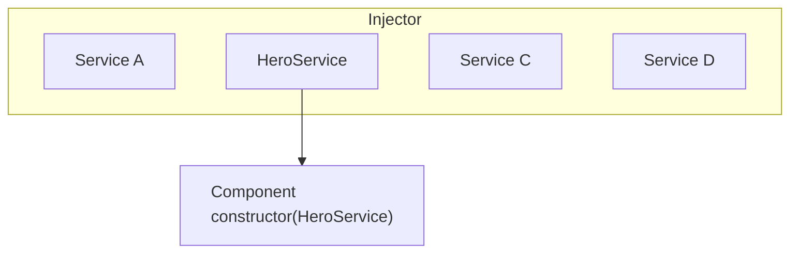

#### What's next

<docs-pill-row>
  <docs-pill href="/guide/di/creating-injectable-service" title="Creating an injectable service"/>
</docs-pill-row>

---


(From di-in-action.md)

### DI in action

This guide explores additional features of dependency injection in Angular.

#### Custom providers with `@Inject`

Using a custom provider allows you to provide a concrete implementation for implicit dependencies, such as built-in browser APIs.
The following example uses an `InjectionToken` to provide the [localStorage](https://developer.mozilla.org/docs/Web/API/Window/localStorage) browser API as a dependency in the `BrowserStorageService`:

<docs-code header="src/app/storage.service.ts" language="typescript"
           highlight="[[3,6],[12]]">
import { Inject, Injectable, InjectionToken } from '@angular/core';

export const BROWSER_STORAGE = new InjectionToken<Storage>('Browser Storage', {
  providedIn: 'root',
  factory: () => localStorage
});

@Injectable({
  providedIn: 'root'
})
export class BrowserStorageService {
  constructor(@Inject(BROWSER_STORAGE) public storage: Storage) {}

  get(key: string) {
    return this.storage.getItem(key);
  }

  set(key: string, value: string) {
    this.storage.setItem(key, value);
  }
}
</docs-code>

The `factory` function returns the `localStorage` property that is attached to the browser's window object.
The `Inject` decorator is applied to the `storage` constructor parameter and specifies a custom provider of the dependency.

This custom provider can now be overridden during testing with a mock API of `localStorage` instead of interacting with real browser APIs.

#### Inject the component's DOM element

Although developers strive to avoid it, some visual effects and third-party tools require direct DOM access.
As a result, you might need to access a component's DOM element.

Angular exposes the underlying element of a `@Component` or `@Directive` via injection using the `ElementRef` injection token:

<docs-code language="typescript" highlight="[7]">
import { Directive, ElementRef } from '@angular/core';

@Directive({
  selector: '[appHighlight]'
})
export class HighlightDirective {
  constructor(private element: ElementRef) {}

  update() {
    this.element.nativeElement.style.color = 'red';
  }
}
</docs-code>

#### Resolve circular dependencies with a forward reference

The order of class declaration matters in TypeScript.
You can't refer directly to a class until it's been defined.

This isn't usually a problem, especially if you adhere to the recommended *one class per file* rule.
But sometimes circular references are unavoidable.
For example, when class 'A' refers to class 'B' and 'B' refers to 'A', one of them has to be defined first.

The Angular `forwardRef()` function creates an *indirect* reference that Angular can resolve later.

You face a similar problem when a class makes *a reference to itself*.
For example, in its `providers` array.
The `providers` array is a property of the `@Component()` decorator function, which must appear before the class definition.
You can break such circular references by using `forwardRef`.

<docs-code header="app.component.ts" language="typescript" highlight="[4]">
providers: [
  {
    provide: PARENT_MENU_ITEM,
    useExisting: forwardRef(() => MenuItem),
  },
],
</docs-code>

---


(From hierarchical-dependency-injection.md)

### Hierarchical injectors

Injectors in Angular have rules that you can leverage to achieve the desired visibility of injectables in your applications.
By understanding these rules, you can determine whether to declare a provider at the application level, in a Component, or in a Directive.

The applications you build with Angular can become quite large, and one way to manage this complexity is to split up the application into a well-defined tree of components.

There can be sections of your page that work in a completely independent way than the rest of the application, with its own local copies of the services and other dependencies that it needs.
Some of the services that these sections of the application use might be shared with other parts of the application, or with parent components that are further up in the component tree, while other dependencies are meant to be private.

With hierarchical dependency injection, you can isolate sections of the application and give them their own private dependencies not shared with the rest of the application, or have parent components share certain dependencies with its child components only but not with the rest of the component tree, and so on. Hierarchical dependency injection enables you to share dependencies between different parts of the application only when and if you need to.

#### Types of injector hierarchies

Angular has two injector hierarchies:

| Injector hierarchies        | Details |
|:---                         |:---     |
| `EnvironmentInjector` hierarchy | Configure an `EnvironmentInjector` in this hierarchy using `@Injectable()` or `providers` array in `ApplicationConfig`. |
| `ElementInjector` hierarchy | Created implicitly at each DOM element. An `ElementInjector` is empty by default unless you configure it in the `providers` property on `@Directive()` or `@Component()`. |

<docs-callout title="NgModule Based Applications">
For `NgModule` based applications, you can provide dependencies with the `ModuleInjector` hierarchy using an `@NgModule()` or `@Injectable()` annotation.
</docs-callout>

##### `EnvironmentInjector`

The `EnvironmentInjector` can be configured in one of two ways by using:

* The `@Injectable()` `providedIn` property to refer to `root` or `platform`
* The `ApplicationConfig` `providers` array

<docs-callout title="Tree-shaking and @Injectable()">

Using the `@Injectable()` `providedIn` property is preferable to using the `ApplicationConfig` `providers` array. With `@Injectable()` `providedIn`, optimization tools can perform tree-shaking, which removes services that your application isn't using. This results in smaller bundle sizes.

Tree-shaking is especially useful for a library because the application which uses the library may not have a need to inject it.

</docs-callout>

`EnvironmentInjector` is configured by the `ApplicationConfig.providers`.

Provide services using `providedIn` of `@Injectable()` as follows:

<docs-code language="typescript" highlight="[4]">
import { Injectable } from '@angular/core';

@Injectable({
  providedIn: 'root'  // <--provides this service in the root EnvironmentInjector
})
export class ItemService {
  name = 'telephone';
}

</docs-code>

The `@Injectable()` decorator identifies a service class.
The `providedIn` property configures a specific `EnvironmentInjector`, here `root`, which makes the service available in the `root` `EnvironmentInjector`.

##### ModuleInjector

In the case of `NgModule` based applications, the ModuleInjector can be configured in one of two ways by using:

* The `@Injectable()` `providedIn` property to refer to `root` or `platform`
* The `@NgModule()` `providers` array

`ModuleInjector` is configured by the `@NgModule.providers` and `NgModule.imports` property. `ModuleInjector` is a flattening of all the providers arrays that can be reached by following the `NgModule.imports` recursively.

Child `ModuleInjector` hierarchies are created when lazy loading other `@NgModules`.

##### Platform injector

There are two more injectors above `root`, an additional `EnvironmentInjector` and `NullInjector()`.

Consider how Angular bootstraps the application with the following in `main.ts`:

<docs-code language="javascript">
bootstrapApplication(AppComponent, appConfig);
</docs-code>

The `bootstrapApplication()` method creates a child injector of the platform injector which is configured by the `ApplicationConfig` instance.
This is the `root` `EnvironmentInjector`.

The `platformBrowserDynamic()` method creates an injector configured by a `PlatformModule`, which contains platform-specific dependencies.
This allows multiple applications to share a platform configuration.
For example, a browser has only one URL bar, no matter how many applications you have running.
You can configure additional platform-specific providers at the platform level by supplying `extraProviders` using the `platformBrowser()` function.

The next parent injector in the hierarchy is the `NullInjector()`, which is the top of the tree.
If you've gone so far up the tree that you are looking for a service in the `NullInjector()`, you'll get an error unless you've used `@Optional()` because ultimately, everything ends at the `NullInjector()` and it returns an error or, in the case of `@Optional()`, `null`.
For more information on `@Optional()`, see the [`@Optional()` section](#optional) of this guide.

The following diagram represents the relationship between the `root` `ModuleInjector` and its parent injectors as the previous paragraphs describe.

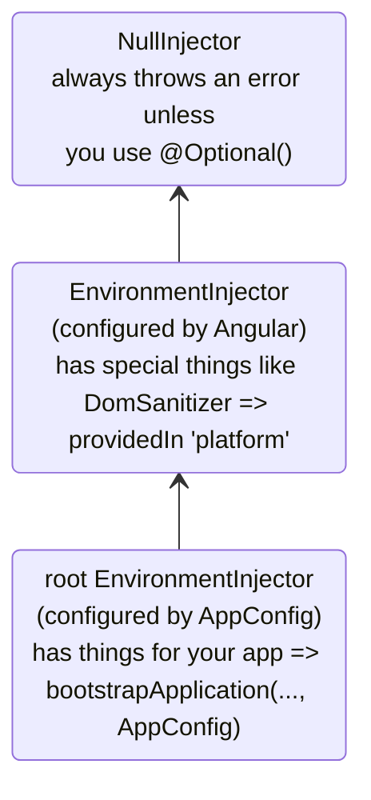

While the name `root` is a special alias, other `EnvironmentInjector` hierarchies don't have aliases.
You have the option to create `EnvironmentInjector` hierarchies whenever a dynamically loaded component is created, such as with the Router, which will create child `EnvironmentInjector` hierarchies.

All requests forward up to the root injector, whether you configured it with the `ApplicationConfig` instance passed to the `bootstrapApplication()` method, or registered all providers with `root` in their own services.

<docs-callout title="@Injectable() vs. ApplicationConfig">

If you configure an app-wide provider in the `ApplicationConfig` of `bootstrapApplication`, it overrides one configured for `root` in the `@Injectable()` metadata.
You can do this to configure a non-default provider of a service that is shared with multiple applications.

Here is an example of the case where the component router configuration includes a non-default [location strategy](guide/routing#location-strategy) by listing its provider in the `providers` list of the `ApplicationConfig`.

```ts
providers: [
  { provide: LocationStrategy, useClass: HashLocationStrategy }
]
```

For `NgModule` based applications, configure app-wide providers in the `AppModule` `providers`.

</docs-callout>

##### `ElementInjector`

Angular creates `ElementInjector` hierarchies implicitly for each DOM element.

Providing a service in the `@Component()` decorator using its `providers` or `viewProviders` property configures an `ElementInjector`.
For example, the following `TestComponent` configures the `ElementInjector` by providing the service as follows:

<docs-code language="typescript" highlight="[3]">
@Component({
  …
  providers: [{ provide: ItemService, useValue: { name: 'lamp' } }]
})
export class TestComponent
</docs-code>

HELPFUL: See the [resolution rules](#resolution-rules) section to understand the relationship between the `EnvironmentInjector` tree, the `ModuleInjector` and the `ElementInjector` tree.

When you provide services in a component, that service is available by way of the `ElementInjector` at that component instance.
It may also be visible at child component/directives based on visibility rules described in the [resolution rules](#resolution-rules) section.

When the component instance is destroyed, so is that service instance.

###### `@Directive()` and `@Component()`

A component is a special type of directive, which means that just as `@Directive()` has a `providers` property, `@Component()` does too.
This means that directives as well as components can configure providers, using the `providers` property.
When you configure a provider for a component or directive using the `providers` property, that provider belongs to the `ElementInjector` of that component or directive.
Components and directives on the same element share an injector.

#### Resolution rules

When resolving a token for a component/directive, Angular resolves it in two phases:

1. Against its parents in the `ElementInjector` hierarchy.
2. Against its parents in the `EnvironmentInjector` hierarchy.

When a component declares a dependency, Angular tries to satisfy that dependency with its own `ElementInjector`.
If the component's injector lacks the provider, it passes the request up to its parent component's `ElementInjector`.

The requests keep forwarding up until Angular finds an injector that can handle the request or runs out of ancestor `ElementInjector` hierarchies.

If Angular doesn't find the provider in any `ElementInjector` hierarchies, it goes back to the element where the request originated and looks in the `EnvironmentInjector` hierarchy.
If Angular still doesn't find the provider, it throws an error.

If you have registered a provider for the same DI token at different levels, the first one Angular encounters is the one it uses to resolve the dependency.
If, for example, a provider is registered locally in the component that needs a service,
Angular doesn't look for another provider of the same service.

HELPFUL: For `NgModule` based applications, Angular will search the `ModuleInjector` hierarchy if it cannot find a provider in the `ElementInjector` hierarchies.

#### Resolution modifiers

Angular's resolution behavior can be modified with `@Optional()`, `@Self()`, `@SkipSelf()` and `@Host()`.
Import each of them from `@angular/core` and use each in the component class constructor or in the `inject` configuration when you inject your service.

##### Types of modifiers

Resolution modifiers fall into three categories:

* What to do if Angular doesn't find what you're looking for, that is `@Optional()`
* Where to start looking, that is `@SkipSelf()`
* Where to stop looking, `@Host()` and `@Self()`

By default, Angular always starts at the current `Injector` and keeps searching all the way up.
Modifiers allow you to change the starting, or _self_, location and the ending location.

Additionally, you can combine all of the modifiers except:

* `@Host()` and `@Self()`
* `@SkipSelf()` and `@Self()`.

##### `@Optional()`

`@Optional()` allows Angular to consider a service you inject to be optional.
This way, if it can't be resolved at runtime, Angular resolves the service as `null`, rather than throwing an error.
In the following example, the service, `OptionalService`, isn't provided in the service, `ApplicationConfig`, `@NgModule()`, or component class, so it isn't available anywhere in the app.

<docs-code header="src/app/optional/optional.component.ts" language="typescript">
export class OptionalComponent {
  constructor(@Optional() public optional?: OptionalService) {}
}
</docs-code>

##### `@Self()`

Use `@Self()` so that Angular will only look at the `ElementInjector` for the current component or directive.

A good use case for `@Self()` is to inject a service but only if it is available on the current host element.
To avoid errors in this situation, combine `@Self()` with `@Optional()`.

For example, in the following `SelfNoDataComponent`, notice the injected `LeafService` in the constructor.

<docs-code header="src/app/self-no-data/self-no-data.component.ts" language="typescript"
           highlight="[7]">
@Component({
  selector: 'app-self-no-data',
  templateUrl: './self-no-data.component.html',
  styleUrls: ['./self-no-data.component.css']
})
export class SelfNoDataComponent {
  constructor(@Self() @Optional() public leaf?: LeafService) { }
}
</docs-code>

In this example, there is a parent provider and injecting the service will return the value, however, injecting the service with `@Self()` and `@Optional()` will return `null` because `@Self()` tells the injector to stop searching in the current host element.

Another example shows the component class with a provider for `FlowerService`.
In this case, the injector looks no further than the current `ElementInjector` because it finds the `FlowerService` and returns the tulip <code>&#x1F337;</code>.

<docs-code header="src/app/self/self.component.ts" path="adev/src/content/examples/resolution-modifiers/src/app/self/self.component.ts" visibleRegion="self-component"/>

##### `@SkipSelf()`

`@SkipSelf()` is the opposite of `@Self()`.
With `@SkipSelf()`, Angular starts its search for a service in the parent `ElementInjector`, rather than in the current one.
So if the parent `ElementInjector` were using the fern <code>&#x1F33F;</code> value for `emoji`, but you had maple leaf <code>&#x1F341;</code> in the component's `providers` array, Angular would ignore maple leaf <code>&#x1F341;</code> and use fern <code>&#x1F33F;</code>.

To see this in code, assume that the following value for `emoji` is what the parent component were using, as in this service:

<docs-code header="src/app/leaf.service.ts" language="typescript">
export class LeafService {
  emoji = '🌿';
}
</docs-code>

Imagine that in the child component, you had a different value, maple leaf <code>&#x1F341;</code> but you wanted to use the parent's value instead.
This is when you'd use `@SkipSelf()`:

<docs-code header="src/app/skipself/skipself.component.ts" language="typescript"
           highlight="[[6],[10]]">
@Component({
  selector: 'app-skipself',
  templateUrl: './skipself.component.html',
  styleUrls: ['./skipself.component.css'],
  // Angular would ignore this LeafService instance
  providers: [{ provide: LeafService, useValue: { emoji: '🍁' } }]
})
export class SkipselfComponent {
  // Use @SkipSelf() in the constructor
  constructor(@SkipSelf() public leaf: LeafService) { }
}
</docs-code>

In this case, the value you'd get for `emoji` would be fern <code>&#x1F33F;</code>, not maple leaf <code>&#x1F341;</code>.

###### `@SkipSelf()` with `@Optional()`

Use `@SkipSelf()` with `@Optional()` to prevent an error if the value is `null`.

In the following example, the `Person` service is injected in the constructor.
`@SkipSelf()` tells Angular to skip the current injector and `@Optional()` will prevent an error should the `Person` service be `null`.

<docs-code language="typescript">
class Person {
  constructor(@Optional() @SkipSelf() parent?: Person) {}
}
</docs-code>

##### `@Host()`

<!-- TODO: Remove ambiguity between @Host and @Self. -->

`@Host()` lets you designate a component as the last stop in the injector tree when searching for providers.

Even if there is a service instance further up the tree, Angular won't continue looking.
Use `@Host()` as follows:

<docs-code header="src/app/host/host.component.ts" language="typescript"
           highlight="[[6],[10]]">
@Component({
  selector: 'app-host',
  templateUrl: './host.component.html',
  styleUrls: ['./host.component.css'],
  //  provide the service
  providers: [{ provide: FlowerService, useValue: { emoji: '🌷' } }]
})
export class HostComponent {
  // use @Host() in the constructor when injecting the service
  constructor(@Host() @Optional() public flower?: FlowerService) { }
}
</docs-code>

Since `HostComponent` has `@Host()` in its constructor, no matter what the parent of `HostComponent` might have as a `flower.emoji` value, the `HostComponent` will use tulip <code>&#x1F337;</code>.

#### Logical structure of the template

When you provide services in the component class, services are visible within the `ElementInjector` tree relative to where and how you provide those services.

Understanding the underlying logical structure of the Angular template will give you a foundation for configuring services and in turn control their visibility.

Components are used in your templates, as in the following example:

<docs-code language="html">
<app-root>
  <app-child></app-child>;
</app-root>
</docs-code>

HELPFUL: Usually, you declare the components and their templates in separate files.
For the purposes of understanding how the injection system works, it is useful to look at them from the point of view of a combined logical tree.
The term _logical_ distinguishes it from the render tree, which is your application's DOM tree.
To mark the locations of where the component templates are located, this guide uses the `<#VIEW>` pseudo-element, which doesn't actually exist in the render tree and is present for mental model purposes only.

The following is an example of how the `<app-root>` and `<app-child>` view trees are combined into a single logical tree:

<docs-code language="html">
<app-root>
  <#VIEW>
    <app-child>
     <#VIEW>
       …content goes here…
     </#VIEW>
    </app-child>
  </#VIEW>
</app-root>
</docs-code>

Understanding the idea of the `<#VIEW>` demarcation is especially significant when you configure services in the component class.

#### Example: Providing services in `@Component()`

How you provide services using a `@Component()` (or `@Directive()`) decorator determines their visibility.
The following sections demonstrate `providers` and `viewProviders` along with ways to modify service visibility with `@SkipSelf()` and `@Host()`.

A component class can provide services in two ways:

| Arrays                       | Details |
|:---                          |:---     |
| With a `providers` array     | `@Component({ providers: [SomeService] })`     |
| With a `viewProviders` array | `@Component({ viewProviders: [SomeService] })` |

In the examples below, you will see the logical tree of an Angular application.
To illustrate how the injector works in the context of templates, the logical tree will represent the HTML structure of the application.
For example, the logical tree will show that `<child-component>` is a direct children of `<parent-component>`.

In the logical tree, you will see special attributes: `@Provide`, `@Inject`, and `@ApplicationConfig`.
These aren't real attributes but are here to demonstrate what is going on under the hood.

| Angular service attribute                                                                                          | Details |
|:---                                                                                                                |:---     |
| `@Inject(Token)=>Value`     | If `Token` is injected at this location in the logical tree, its value would be `Value`.     |
| `@Provide(Token=Value)`     | Indicates that `Token` is provided with `Value` at this location in the logical tree.        |
| `@ApplicationConfig` | Demonstrates that a fallback `EnvironmentInjector` should be used at this location.          |

##### Example app structure

The example application has a `FlowerService` provided in `root` with an `emoji` value of red hibiscus <code>&#x1F33A;</code>.

<docs-code header="src/app/flower.service.ts" language="typescript">
@Injectable({
  providedIn: 'root'
})
export class FlowerService {
  emoji = '🌺';
}
</docs-code>

Consider an application with only an `AppComponent` and a `ChildComponent`.
The most basic rendered view would look like nested HTML elements such as the following:

<docs-code language="html">

<app-root> <!-- AppComponent selector -->
  <app-child> <!-- ChildComponent selector -->
  </app-child>
</app-root>

</docs-code>

However, behind the scenes, Angular uses a logical view representation as follows when resolving injection requests:

<docs-code language="html">
<app-root> <!-- AppComponent selector -->
  <#VIEW>
    <app-child> <!-- ChildComponent selector -->
      <#VIEW>
      </#VIEW>
    </app-child>
  </#VIEW>
</app-root>
</docs-code>

The `<#VIEW>` here represents an instance of a template.
Notice that each component has its own `<#VIEW>`.

Knowledge of this structure can inform how you provide and inject your services, and give you complete control of service visibility.

Now, consider that `<app-root>` injects the `FlowerService`:

<docs-code header="src/app/app.component.ts" language="typescript">
export class AppComponent  {
  constructor(public flower: FlowerService) {}
}
</docs-code>

Add a binding to the `<app-root>` template to visualize the result:

<docs-code header="src/app/app.component.html" language="html">
<p>Emoji from FlowerService: {{flower.emoji}}</p>
</docs-code>

The output in the view would be:

<docs-code language="shell">
Emoji from FlowerService: &#x1F33A;
</docs-code>

In the logical tree, this would be represented as follows:

<docs-code language="html" highlight="[[1],[2],[4]]">
<app-root @ApplicationConfig
        @Inject(FlowerService) flower=>"&#x1F33A;">
  <#VIEW>
    <p>Emoji from FlowerService: {{flower.emoji}} (&#x1F33A;)</p>
    <app-child>
      <#VIEW>
      </#VIEW>
    </app-child>
  </#VIEW>
</app-root>

</docs-code>

When `<app-root>` requests the `FlowerService`, it is the injector's job to resolve the `FlowerService` token.
The resolution of the token happens in two phases:

1. The injector determines the starting location in the logical tree and an ending location of the search.
    The injector begins with the starting location and looks for the token at each view level in the logical tree.
    If the token is found it is returned.

1. If the token is not found, the injector looks for the closest parent `EnvironmentInjector` to delegate the request to.

In the example case, the constraints are:

1. Start with `<#VIEW>` belonging to `<app-root>` and end with `<app-root>`.

    * Normally the starting point for search is at the point of injection.
        However, in this case `<app-root>` is a component. `@Component`s are special in that they also include their own `viewProviders`, which is why the search starts at `<#VIEW>` belonging to `<app-root>`.
        This would not be the case for a directive matched at the same location.
    * The ending location happens to be the same as the component itself, because it is the topmost component in this application.

1. The `EnvironmentInjector` provided by the `ApplicationConfig` acts as the fallback injector when the injection token can't be found in the `ElementInjector` hierarchies.

##### Using the `providers` array

Now, in the `ChildComponent` class, add a provider for `FlowerService` to demonstrate more complex resolution rules in the upcoming sections:

<docs-code header="src/app/child.component.ts" language="typescript"
           highlight="[[5,6],[10]]">
@Component({
  selector: 'app-child',
  templateUrl: './child.component.html',
  styleUrls: ['./child.component.css'],
  // use the providers array to provide a service
  providers: [{ provide: FlowerService, useValue: { emoji: '🌻' } }]
})
export class ChildComponent {
  // inject the service
  constructor( public flower: FlowerService) { }
}
</docs-code>

Now that the `FlowerService` is provided in the `@Component()` decorator, when the `<app-child>` requests the service, the injector has only to look as far as the `ElementInjector` in the `<app-child>`.
It won't have to continue the search any further through the injector tree.

The next step is to add a binding to the `ChildComponent` template.

<docs-code header="src/app/child.component.html" language="html">
<p>Emoji from FlowerService: {{flower.emoji}}</p>
</docs-code>

To render the new values, add `<app-child>` to the bottom of the `AppComponent` template so the view also displays the sunflower:

<docs-code language="shell">
Child Component
Emoji from FlowerService: &#x1F33B;
</docs-code>

In the logical tree, this is represented as follows:

<docs-code language="html">

<app-root @ApplicationConfig
        @Inject(FlowerService) flower=>"&#x1F33A;">
  <#VIEW>
    <p>Emoji from FlowerService: {{flower.emoji}} (&#x1F33A;)</p>
    <app-child @Provide(FlowerService="&#x1F33B;")
               @Inject(FlowerService)=>"&#x1F33B;"> <!-- search ends here -->
      <#VIEW> <!-- search starts here -->
        <h2>Child Component</h2>
        <p>Emoji from FlowerService: {{flower.emoji}} (&#x1F33B;)</p>
      </#VIEW>
    </app-child>
  </#VIEW>
</app-root>

</docs-code>

When `<app-child>` requests the `FlowerService`, the injector begins its search at the `<#VIEW>` belonging to `<app-child>` \(`<#VIEW>` is included because it is injected from `@Component()`\) and ends with `<app-child>`.
In this case, the `FlowerService` is resolved in the `providers` array with sunflower <code>&#x1F33B;</code> of the `<app-child>`.
The injector doesn't have to look any further in the injector tree.
It stops as soon as it finds the `FlowerService` and never sees the red hibiscus <code>&#x1F33A;</code>.

##### Using the `viewProviders` array

Use the `viewProviders` array as another way to provide services in the `@Component()` decorator.
Using `viewProviders` makes services visible in the `<#VIEW>`.

HELPFUL: The steps are the same as using the `providers` array, with the exception of using the `viewProviders` array instead.

For step-by-step instructions, continue with this section.
If you can set it up on your own, skip ahead to [Modifying service availability](#visibility-of-provided-tokens).

For demonstration, we are building an `AnimalService` to demonstrate `viewProviders`.
First, create an `AnimalService` with an `emoji` property of whale <code>&#x1F433;</code>:

<docs-code header="src/app/animal.service.ts" language="typescript">
import { Injectable } from '@angular/core';

@Injectable({
  providedIn: 'root'
})
export class AnimalService {
  emoji = '🐳';
}
</docs-code>

Following the same pattern as with the `FlowerService`, inject the `AnimalService` in the `AppComponent` class:

<docs-code header="src/app/app.component.ts" language="typescript" highlight="[4]">
export class AppComponent {
  constructor(
    public flower: FlowerService,
    public animal: AnimalService) {}
}
</docs-code>

HELPFUL: You can leave all the `FlowerService` related code in place as it will allow a comparison with the `AnimalService`.

Add a `viewProviders` array and inject the `AnimalService` in the `<app-child>` class, too, but give `emoji` a different value.
Here, it has a value of dog <code>&#x1F436;</code>.

<docs-code header="src/app/child.component.ts" language="typescript"
           highlight="[[7],[11]]">
@Component({
  selector: 'app-child',
  templateUrl: './child.component.html',
  styleUrls: ['./child.component.css'],
  // provide services
  providers: [{ provide: FlowerService, useValue: { emoji: '🌻' } }],
  viewProviders: [{ provide: AnimalService, useValue: { emoji: '🐶' } }]
})
export class ChildComponent {
  // inject service
  constructor( public flower: FlowerService, public animal: AnimalService) { }
...
}
</docs-code>

Add bindings to the `ChildComponent` and the `AppComponent` templates.
In the `ChildComponent` template, add the following binding:

<docs-code header="src/app/child.component.html" language="html">
<p>Emoji from AnimalService: {{animal.emoji}}</p>
</docs-code>

Additionally, add the same to the `AppComponent` template:

<docs-code header="src/app/app.component.html" language="html">
<p>Emoji from AnimalService: {{animal.emoji}}</p>s
</docs-code>

Now you should see both values in the browser:

<docs-code hideCopy language="shell">

AppComponent
Emoji from AnimalService: &#x1F433;

Child Component
Emoji from AnimalService: &#x1F436;

</docs-code>

The logic tree for this example of `viewProviders` is as follows:

<docs-code language="html">

<app-root @ApplicationConfig
         @Inject(AnimalService) animal=>"&#x1F433;">
  <#VIEW>
    <app-child>
      <#VIEW @Provide(AnimalService="&#x1F436;")
            @Inject(AnimalService=>"&#x1F436;")>
       <!-- ^^using viewProviders means AnimalService is available in <#VIEW>-->
       <p>Emoji from AnimalService: {{animal.emoji}} (&#x1F436;)</p>
      </#VIEW>
    </app-child>
  </#VIEW>
</app-root>

</docs-code>

Just as with the `FlowerService` example, the `AnimalService` is provided in the `<app-child>` `@Component()` decorator.
This means that since the injector first looks in the `ElementInjector` of the component, it finds the `AnimalService` value of dog <code>&#x1F436;</code>.
It doesn't need to continue searching the `ElementInjector` tree, nor does it need to search the `ModuleInjector`.

##### `providers` vs. `viewProviders`

The `viewProviders` field is conceptually similar to `providers`, but there is one notable difference.
Configured providers in `viewProviders` are not visible to projected content that ends up as a logical children of the component.

To see the difference between using `providers` and `viewProviders`, add another component to the example and call it `InspectorComponent`.
`InspectorComponent` will be a child of the `ChildComponent`.
In `inspector.component.ts`, inject the `FlowerService` and `AnimalService` in the constructor:

<docs-code header="src/app/inspector/inspector.component.ts" language="typescript">
export class InspectorComponent {
  constructor(public flower: FlowerService, public animal: AnimalService) { }
}
</docs-code>

You do not need a `providers` or `viewProviders` array.
Next, in `inspector.component.html`, add the same markup from previous components:

<docs-code header="src/app/inspector/inspector.component.html" language="html">
<p>Emoji from FlowerService: {{flower.emoji}}</p>
<p>Emoji from AnimalService: {{animal.emoji}}</p>
</docs-code>

Remember to add the `InspectorComponent` to the `ChildComponent` `imports` array.

<docs-code header="src/app/child/child.component.ts" language="typescript"
           highlight="[3]">
@Component({
  ...
  imports: [InspectorComponent]
})

</docs-code>

Next, add the following to `child.component.html`:

<docs-code header="src/app/child/child.component.html" language="html"
           highlight="[3,9]">
...

<div class="container">
  <h3>Content projection</h3>
  <ng-content></ng-content>
</div>
<h3>Inside the view</h3>

<app-inspector></app-inspector>
</docs-code>

`<ng-content>` allows you to project content, and `<app-inspector>` inside the `ChildComponent` template makes the `InspectorComponent` a child component of `ChildComponent`.

Next, add the following to `app.component.html` to take advantage of content projection.

<docs-code header="src/app/app.component.html" language="html" highlight="[2]">
<app-child>
  <app-inspector></app-inspector>
</app-child>
</docs-code>

The browser now renders the following, omitting the previous examples for brevity:

<docs-code hideCopy language="shell">
...
Content projection

Emoji from FlowerService: &#x1F33B;
Emoji from AnimalService: &#x1F433;

Emoji from FlowerService: &#x1F33B;
Emoji from AnimalService: &#x1F436;

</docs-code>

These four bindings demonstrate the difference between `providers` and `viewProviders`.
Remember that the dog emoji <code>&#x1F436;</code> is declared inside the `<#VIEW>` of `ChildComponent` and isn't visible to the projected content.
Instead, the projected content sees the whale <code>&#x1F433;</code>.

However, in the next output section though, the `InspectorComponent` is an actual child component of `ChildComponent`, `InspectorComponent` is inside the `<#VIEW>`, so when it asks for the `AnimalService`, it sees the dog <code>&#x1F436;</code>.

The `AnimalService` in the logical tree would look like this:

<docs-code language="html">

<app-root @ApplicationConfig
         @Inject(AnimalService) animal=>"&#x1F433;">
  <#VIEW>
    <app-child>
      <#VIEW @Provide(AnimalService="&#x1F436;")
            @Inject(AnimalService=>"&#x1F436;")>
        <!-- ^^using viewProviders means AnimalService is available in <#VIEW>-->
        <p>Emoji from AnimalService: {{animal.emoji}} (&#x1F436;)</p>

        <div class="container">
          <h3>Content projection</h3>
          <app-inspector @Inject(AnimalService) animal=>"&#x1F433;">
            <p>Emoji from AnimalService: {{animal.emoji}} (&#x1F433;)</p>
          </app-inspector>
        </div>

        <app-inspector>
          <#VIEW @Inject(AnimalService) animal=>"&#x1F436;">
            <p>Emoji from AnimalService: {{animal.emoji}} (&#x1F436;)</p>
          </#VIEW>
        </app-inspector>
      </#VIEW>
    </app-child>
  </#VIEW>
</app-root>

</docs-code>

The projected content of `<app-inspector>` sees the whale <code>&#x1F433;</code>, not the dog <code>&#x1F436;</code>, because the dog <code>&#x1F436;</code> is inside the `<app-child>` `<#VIEW>`.
The `<app-inspector>` can only see the dog <code>&#x1F436;</code> if it is also within the `<#VIEW>`.

##### Visibility of provided tokens

Visibility decorators influence where the search for the injection token begins and ends in the logic tree.
To do this, place visibility decorators at the point of injection, that is, the `constructor()`, rather than at a point of declaration.

To alter where the injector starts looking for `FlowerService`, add `@SkipSelf()` to the `<app-child>` `@Inject` declaration where `FlowerService` is injected.
This declaration is in the `<app-child>` constructor as shown in `child.component.ts`:

<docs-code language="typescript">
constructor(@SkipSelf() public flower: FlowerService) { }
</docs-code>

With `@SkipSelf()`, the `<app-child>` injector doesn't look to itself for the `FlowerService`.
Instead, the injector starts looking for the `FlowerService` at the `ElementInjector` of the `<app-root>`, where it finds nothing.
Then, it goes back to the `<app-child>` `ModuleInjector` and finds the red hibiscus <code>&#x1F33A;</code> value, which is available because `<app-child>` and `<app-root>` share the same `ModuleInjector`.
The UI renders the following:

<docs-code hideCopy language="shell">

Emoji from FlowerService: &#x1F33A;

</docs-code>

In a logical tree, this same idea might look like this:

<docs-code language="html">

<app-root @ApplicationConfig
        @Inject(FlowerService) flower=>"&#x1F33A;">
  <#VIEW>
    <app-child @Provide(FlowerService="&#x1F33B;")>
      <#VIEW @Inject(FlowerService, SkipSelf)=>"&#x1F33A;">
        <!-- With SkipSelf, the injector looks to the next injector up the tree (app-root) -->
      </#VIEW>
    </app-child>
  </#VIEW>
</app-root>

</docs-code>

Though `<app-child>` provides the sunflower <code>&#x1F33B;</code>, the application renders the red hibiscus <code>&#x1F33A;</code> because `@SkipSelf()` causes the current injector (`app-child`) to skip itself and look to its parent.

If you now add `@Host()` (in addition to the `@SkipSelf()`), the result will be `null`.
This is because `@Host()` limits the upper bound of the search to the `app-child` `<#VIEW>`.
Here's the idea in the logical tree:

<docs-code language="html">

<app-root @ApplicationConfig
        @Inject(FlowerService) flower=>"&#x1F33A;">
  <#VIEW> <!-- end search here with null-->
    <app-child @Provide(FlowerService="&#x1F33B;")> <!-- start search here -->
      <#VIEW @Inject(FlowerService, @SkipSelf, @Host, @Optional)=>null>
      </#VIEW>
      </app-parent>
  </#VIEW>
</app-root>

</docs-code>

Here, the services and their values are the same, but `@Host()` stops the injector from looking any further than the `<#VIEW>` for `FlowerService`, so it doesn't find it and returns `null`.

##### `@SkipSelf()` and `viewProviders`

Remember, `<app-child>` provides the `AnimalService` in the `viewProviders` array with the value of dog <code>&#x1F436;</code>.
Because the injector has only to look at the `ElementInjector` of the `<app-child>` for the `AnimalService`, it never sees the whale <code>&#x1F433;</code>.

As in the `FlowerService` example, if you add `@SkipSelf()` to the constructor for the `AnimalService`, the injector won't look in the  `ElementInjector` of the current `<app-child>` for the `AnimalService`.
Instead, the injector will begin at the `<app-root>` `ElementInjector`.

<docs-code language="typescript" highlight="[5]">
@Component({
  selector: 'app-child',
  …
  viewProviders: [
    { provide: AnimalService, useValue: { emoji: '&#x1F436;' } },
  ],
})
</docs-code>

The logical tree looks like this with `@SkipSelf()` in `<app-child>`:

<docs-code language="html">

<app-root @ApplicationConfig
          @Inject(AnimalService=>"&#x1F433;")>
  <#VIEW><!-- search begins here -->
    <app-child>
      <#VIEW @Provide(AnimalService="&#x1F436;")
             @Inject(AnimalService, SkipSelf=>"&#x1F433;")>
        <!--Add @SkipSelf -->
      </#VIEW>
    </app-child>
  </#VIEW>
</app-root>

</docs-code>

With `@SkipSelf()` in the `<app-child>`, the injector begins its search for the `AnimalService` in the `<app-root>` `ElementInjector` and finds whale <code>&#x1F433;</code>.

##### `@Host()` and `viewProviders`

If you just use `@Host()` for the injection of `AnimalService`, the result is dog <code>&#x1F436;</code> because the injector finds the `AnimalService` in the `<app-child>` `<#VIEW>` itself.
The `ChildComponent` configures the `viewProviders` so that the dog emoji is provided as `AnimalService` value.
You can also see `@Host()` in the constructor:

<docs-code language="typescript" highlight="[[5],[9]]">
@Component({
  selector: 'app-child',
  …
  viewProviders: [
    { provide: AnimalService, useValue: { emoji: '&#x1F436;' } },
  ]
})
export class ChildComponent {
  constructor(@Host() public animal: AnimalService) { }
}
</docs-code>

`@Host()` causes the injector to look until it encounters the edge of the `<#VIEW>`.

<docs-code language="html">

<app-root @ApplicationConfig
          @Inject(AnimalService=>"&#x1F433;")>
  <#VIEW>
    <app-child>
      <#VIEW @Provide(AnimalService="&#x1F436;")
             @Inject(AnimalService, @Host=>"&#x1F436;")> <!-- @Host stops search here -->
      </#VIEW>
    </app-child>
  </#VIEW>
</app-root>

</docs-code>

Add a `viewProviders` array with a third animal, hedgehog <code>&#x1F994;</code>, to the `app.component.ts` `@Component()` metadata:

<docs-code language="typescript" highlight="[6]">
@Component({
  selector: 'app-root',
  templateUrl: './app.component.html',
  styleUrls: [ './app.component.css' ],
  viewProviders: [
    { provide: AnimalService, useValue: { emoji: '&#x1F994;' } },
  ],
})

</docs-code>

Next, add `@SkipSelf()` along with `@Host()` to the constructor for the `AnimalService` injection in `child.component.ts`.
Here are `@Host()` and `@SkipSelf()` in the `<app-child>` constructor:

<docs-code language="typescript" highlight="[4]">
export class ChildComponent {

  constructor(
    @Host() @SkipSelf() public animal: AnimalService) { }
}

</docs-code>

<!-- TODO: This requires a rework. It seems not well explained what `viewProviders`/`injectors` is here
  and how `@Host()` works.
 -->

When `@Host()` and `@SkipSelf()` were applied to the `FlowerService`, which is in the `providers` array, the result was `null` because `@SkipSelf()` starts its search in the `<app-child>` injector, but `@Host()` stops searching at `<#VIEW>` —where there is no `FlowerService`
In the logical tree, you can see that the `FlowerService` is visible in `<app-child>`, not its `<#VIEW>`.

However, the `AnimalService`, which is provided in the `AppComponent` `viewProviders` array, is visible.

The logical tree representation shows why this is:

<docs-code language="html">

<app-root @ApplicationConfig
        @Inject(AnimalService=>"&#x1F433;")>
  <#VIEW @Provide(AnimalService="&#x1F994;")
         @Inject(AnimalService, @Optional)=>"&#x1F994;">
    <!-- ^^@SkipSelf() starts here,  @Host() stops here^^ -->
    <app-child>
      <#VIEW @Provide(AnimalService="&#x1F436;")
             @Inject(AnimalService, @SkipSelf, @Host, @Optional)=>"&#x1F994;">
               <!-- Add @SkipSelf ^^-->
      </#VIEW>
      </app-child>
  </#VIEW>
</app-root>

</docs-code>

`@SkipSelf()`, causes the injector to start its search for the `AnimalService` at the `<app-root>`, not the `<app-child>`, where the request originates, and `@Host()` stops the search at the `<app-root>` `<#VIEW>`.
Since `AnimalService` is provided by way of the `viewProviders` array, the injector finds hedgehog <code>&#x1F994;</code> in the `<#VIEW>`.

#### Example: `ElementInjector` use cases

The ability to configure one or more providers at different levels opens up useful possibilities.

##### Scenario: service isolation

Architectural reasons may lead you to restrict access to a service to the application domain where it belongs.
For example, consider we build a `VillainsListComponent` that displays a list of villains.
It gets those villains from a `VillainsService`.

If you provide `VillainsService` in the root `AppModule`, it will make `VillainsService` visible everywhere in the application.
If you later modify the `VillainsService`, you could break something in other components that started depending this service by accident.

Instead, you should provide the `VillainsService` in the `providers` metadata of the `VillainsListComponent` like this:

<docs-code header="src/app/villains-list.component.ts (metadata)" language="typescript"
           highlight="[4]">
@Component({
  selector: 'app-villains-list',
  templateUrl: './villains-list.component.html',
  providers: [VillainsService]
})
export class VillainsListComponent {}
</docs-code>

By providing `VillainsService` in the `VillainsListComponent` metadata and nowhere else, the service becomes available only in the `VillainsListComponent` and its subcomponent tree.

`VillainService` is a singleton with respect to `VillainsListComponent` because that is where it is declared.
As long as `VillainsListComponent` does not get destroyed it will be the same instance of `VillainService` but if there are multiple instances of `VillainsListComponent`, then each instance of `VillainsListComponent` will have its own instance of `VillainService`.

##### Scenario: multiple edit sessions

Many applications allow users to work on several open tasks at the same time.
For example, in a tax preparation application, the preparer could be working on several tax returns, switching from one to the other throughout the day.

To demonstrate that scenario, imagine a `HeroListComponent` that displays a list of super heroes.

To open a hero's tax return, the preparer clicks on a hero name, which opens a component for editing that return.
Each selected hero tax return opens in its own component and multiple returns can be open at the same time.

Each tax return component has the following characteristics:

* Is its own tax return editing session
* Can change a tax return without affecting a return in another component
* Has the ability to save the changes to its tax return or cancel them

Suppose that the `HeroTaxReturnComponent` had logic to manage and restore changes.
That would be a straightforward task for a hero tax return.
In the real world, with a rich tax return data model, the change management would be tricky.
You could delegate that management to a helper service, as this example does.

The `HeroTaxReturnService` caches a single `HeroTaxReturn`, tracks changes to that return, and can save or restore it.
It also delegates to the application-wide singleton `HeroService`, which it gets by injection.

<docs-code header="src/app/hero-tax-return.service.ts" language="typescript">
import { Injectable } from '@angular/core';
import { HeroTaxReturn } from './hero';
import { HeroesService } from './heroes.service';

@Injectable()
export class HeroTaxReturnService {
  private currentTaxReturn!: HeroTaxReturn;
  private originalTaxReturn!: HeroTaxReturn;

  constructor(private heroService: HeroesService) {}

  set taxReturn(htr: HeroTaxReturn) {
    this.originalTaxReturn = htr;
    this.currentTaxReturn  = htr.clone();
  }

  get taxReturn(): HeroTaxReturn {
    return this.currentTaxReturn;
  }

  restoreTaxReturn() {
    this.taxReturn = this.originalTaxReturn;
  }

  saveTaxReturn() {
    this.taxReturn = this.currentTaxReturn;
    this.heroService.saveTaxReturn(this.currentTaxReturn).subscribe();
  }
}
</docs-code>

Here is the `HeroTaxReturnComponent` that makes use of `HeroTaxReturnService`.

<docs-code header="src/app/hero-tax-return.component.ts" language="typescript">
import { Component, EventEmitter, Input, Output } from '@angular/core';
import { HeroTaxReturn } from './hero';
import { HeroTaxReturnService } from './hero-tax-return.service';

@Component({
  selector: 'app-hero-tax-return',
  templateUrl: './hero-tax-return.component.html',
  styleUrls: [ './hero-tax-return.component.css' ],
  providers: [ HeroTaxReturnService ]
})
export class HeroTaxReturnComponent {
  message = '';

  @Output() close = new EventEmitter<void>();

  get taxReturn(): HeroTaxReturn {
    return this.heroTaxReturnService.taxReturn;
  }

  @Input()
  set taxReturn(htr: HeroTaxReturn) {
    this.heroTaxReturnService.taxReturn = htr;
  }

  constructor(private heroTaxReturnService: HeroTaxReturnService) {}

  onCanceled()  {
    this.flashMessage('Canceled');
    this.heroTaxReturnService.restoreTaxReturn();
  }

  onClose() { this.close.emit(); }

  onSaved() {
    this.flashMessage('Saved');
    this.heroTaxReturnService.saveTaxReturn();
  }

  flashMessage(msg: string) {
    this.message = msg;
    setTimeout(() => this.message = '', 500);
  }
}
</docs-code>

The _tax-return-to-edit_ arrives by way of the `@Input()` property, which is implemented with getters and setters.
The setter initializes the component's own instance of the `HeroTaxReturnService` with the incoming return.
The getter always returns what that service says is the current state of the hero.
The component also asks the service to save and restore this tax return.

This won't work if the service is an application-wide singleton.
Every component would share the same service instance, and each component would overwrite the tax return that belonged to another hero.

To prevent this, configure the component-level injector of `HeroTaxReturnComponent` to provide the service, using the `providers` property in the component metadata.

<docs-code header="src/app/hero-tax-return.component.ts (providers)" language="typescript">
providers: [HeroTaxReturnService]
</docs-code>

The `HeroTaxReturnComponent` has its own provider of the `HeroTaxReturnService`.
Recall that every component _instance_ has its own injector.
Providing the service at the component level ensures that _every_ instance of the component gets a private instance of the service. This makes sure that no tax return gets overwritten.

HELPFUL: The rest of the scenario code relies on other Angular features and techniques that you can learn about elsewhere in the documentation.

##### Scenario: specialized providers

Another reason to provide a service again at another level is to substitute a _more specialized_ implementation of that service, deeper in the component tree.

For example, consider a `Car` component that includes tire service information and depends on other services to provide more details about the car.

The root injector, marked as (A), uses _generic_ providers for details about `CarService` and `EngineService`.

1. `Car` component (A).  Component (A) displays tire service data about a car and specifies generic services to provide more information about the car.

2. Child component (B). Component (B) defines its own, _specialized_ providers for `CarService` and `EngineService` that have special capabilities suitable for what's going on in component (B).

3. Child component (C) as a child of Component (B). Component (C) defines its own, even _more specialized_ provider for `CarService`.

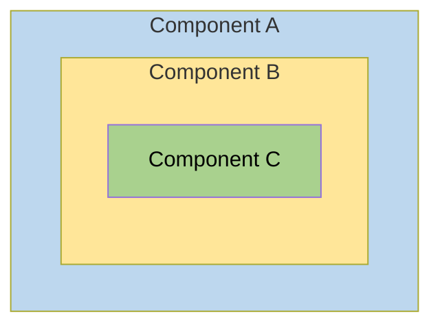

Behind the scenes, each component sets up its own injector with zero, one, or more providers defined for that component itself.

When you resolve an instance of `Car` at the deepest component (C), its injector produces:

* An instance of `Car` resolved by injector (C)
* An `Engine` resolved by injector (B)
* Its `Tires` resolved by the root injector (A).

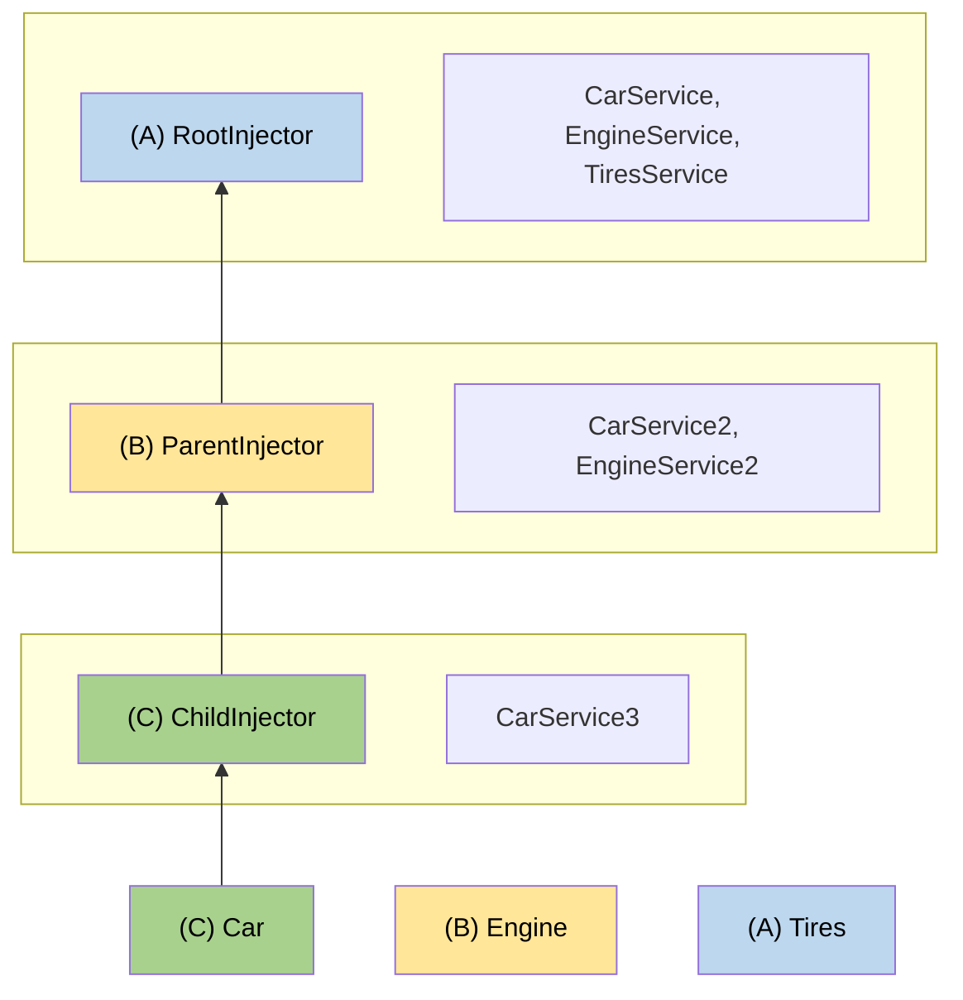

#### More on dependency injection

<docs-pill-row>
  <docs-pill href="/guide/di/dependency-injection-providers" title="DI Providers"/>
</docs-pill-row>

---


(From lightweight-injection-tokens.md)

### Optimizing client application size with lightweight injection tokens

This page provides a conceptual overview of a dependency injection technique that is recommended for library developers.
Designing your library with *lightweight injection tokens* helps optimize the bundle size of client applications that use your library.

You can manage the dependency structure among your components and injectable services to optimize bundle size by using tree-shakable providers.
This normally ensures that if a provided component or service is never actually used by the application, the compiler can remove its code from the bundle.

Due to the way Angular stores injection tokens, it is possible that such an unused component or service can end up in the bundle anyway.
This page describes a dependency injection design pattern that supports proper tree-shaking by using lightweight injection tokens.

The lightweight injection token design pattern is especially important for library developers.
It ensures that when an application uses only some of your library's capabilities, the unused code can be eliminated from the client's application bundle.

When an application uses your library, there might be some services that your library supplies which the client application doesn't use.
In this case, the application developer should expect that service to be tree-shaken, and not contribute to the size of the compiled application.
Because the application developer cannot know about or remedy a tree-shaking problem in the library, it is the responsibility of the library developer to do so.
To prevent the retention of unused components, your library should use the lightweight injection token design pattern.

#### When tokens are retained

To better explain the condition under which token retention occurs, consider a library that provides a library-card component.
This component contains a body and can contain an optional header:

<docs-code language="html">

<lib-card>;
  <lib-header>…</lib-header>;
</lib-card>;

</docs-code>

In a likely implementation, the `<lib-card>` component uses `@ContentChild()` or `@ContentChildren()` to get `<lib-header>` and `<lib-body>`, as in the following:

<docs-code language="typescript" highlight="[12]">
@Component({
  selector: 'lib-header',
  …,
})
class LibHeaderComponent {}

@Component({
  selector: 'lib-card',
  …,
})
class LibCardComponent {
  @ContentChild(LibHeaderComponent) header: LibHeaderComponent|null = null;
}

</docs-code>

Because `<lib-header>` is optional, the element can appear in the template in its minimal form, `<lib-card></lib-card>`.
In this case, `<lib-header>` is not used and you would expect it to be tree-shaken, but that is not what happens.
This is because `LibCardComponent` actually contains two references to the `LibHeaderComponent`:

<docs-code language="typescript">
@ContentChild(LibHeaderComponent) header: LibHeaderComponent;
</docs-code>

* One of these reference is in the *type position*-- that is, it specifies `LibHeaderComponent` as a type: `header: LibHeaderComponent;`.
* The other reference is in the *value position*-- that is, LibHeaderComponent is the value of the `@ContentChild()` parameter decorator: `@ContentChild(LibHeaderComponent)`.

The compiler handles token references in these positions differently:

* The compiler erases *type position* references after conversion from TypeScript, so they have no impact on tree-shaking.
* The compiler must keep *value position* references at runtime, which **prevents** the component from being tree-shaken.

In the example, the compiler retains the `LibHeaderComponent` token that occurs in the value position.
This prevents the referenced component from being tree-shaken, even if the application does not actually use `<lib-header>` anywhere.
If `LibHeaderComponent` 's code, template, and styles combine to become too large, including it unnecessarily can significantly increase the size of the client application.

#### When to use the lightweight injection token pattern

The tree-shaking problem arises when a component is used as an injection token.
There are two cases when that can happen:

* The token is used in the value position of a [content query](guide/components/queries#content-queries).
* The token is used as a type specifier for constructor injection.

In the following example, both uses of the `OtherComponent` token cause retention of `OtherComponent`, preventing it from being tree-shaken when it is not used:

<docs-code language="typescript" highlight="[[2],[4]]">
class MyComponent {
  constructor(@Optional() other: OtherComponent) {}

  @ContentChild(OtherComponent) other: OtherComponent|null;
}
</docs-code>

Although tokens used only as type specifiers are removed when converted to JavaScript, all tokens used for dependency injection are needed at runtime.
These effectively change `constructor(@Optional() other: OtherComponent)` to `constructor(@Optional() @Inject(OtherComponent) other)`.
The token is now in a value position, which causes the tree-shaker to keep the reference.

HELPFUL: Libraries should use [tree-shakable providers](guide/di/dependency-injection#providing-dependency) for all services, providing dependencies at the root level rather than in components or modules.

#### Using lightweight injection tokens

The lightweight injection token design pattern consists of using a small abstract class as an injection token, and providing the actual implementation at a later stage.
The abstract class is retained, not tree-shaken, but it is small and has no material impact on the application size.

The following example shows how this works for the `LibHeaderComponent`:

<docs-code language="typescript" language="[[1],[6],[17]]">
abstract class LibHeaderToken {}

@Component({
  selector: 'lib-header',
  providers: [
    {provide: LibHeaderToken, useExisting: LibHeaderComponent}
  ]
  …,
})
class LibHeaderComponent extends LibHeaderToken {}

@Component({
  selector: 'lib-card',
  …,
})
class LibCardComponent {
  @ContentChild(LibHeaderToken) header: LibHeaderToken|null = null;
}
</docs-code>

In this example, the `LibCardComponent` implementation no longer refers to `LibHeaderComponent` in either the type position or the value position.
This lets full tree-shaking of `LibHeaderComponent` take place.
The `LibHeaderToken` is retained, but it is only a class declaration, with no concrete implementation.
It is small and does not materially impact the application size when retained after compilation.

Instead, `LibHeaderComponent` itself implements the abstract `LibHeaderToken` class.
You can safely use that token as the provider in the component definition, allowing Angular to correctly inject the concrete type.

To summarize, the lightweight injection token pattern consists of the following:

1. A lightweight injection token that is represented as an abstract class.
1. A component definition that implements the abstract class.
1. Injection of the lightweight pattern, using `@ContentChild()` or `@ContentChildren()`.
1. A provider in the implementation of the lightweight injection token which associates the lightweight injection token with the implementation.

##### Use the lightweight injection token for API definition

A component that injects a lightweight injection token might need to invoke a method in the injected class.
The token is now an abstract class. Since the injectable component implements that class, you must also declare an abstract method in the abstract lightweight injection token class.
The implementation of the method, with all its code overhead, resides in the injectable component that can be tree-shaken.
This lets the parent communicate with the child, if it is present, in a type-safe manner.

For example, the `LibCardComponent` now queries `LibHeaderToken` rather than `LibHeaderComponent`.
The following example shows how the pattern lets `LibCardComponent` communicate with the `LibHeaderComponent` without actually referring to `LibHeaderComponent`:

<docs-code language="typescript" highlight="[[3],[13,16],[27]]">
abstract class LibHeaderToken {
  abstract doSomething(): void;
}

@Component({
  selector: 'lib-header',
  providers: [
    {provide: LibHeaderToken, useExisting: LibHeaderComponent}
  ]
  …,
})
class LibHeaderComponent extends LibHeaderToken {
  doSomething(): void {
    // Concrete implementation of `doSomething`
  }
}

@Component({
  selector: 'lib-card',
  …,
})
class LibCardComponent implement AfterContentInit {
  @ContentChild(LibHeaderToken) header: LibHeaderToken|null = null;

  ngAfterContentInit(): void {
    if (this.header !== null) {
      this.header?.doSomething();
    }
  }
}
</docs-code>

In this example, the parent queries the token to get the child component, and stores the resulting component reference if it is present.
Before calling a method in the child, the parent component checks to see if the child component is present.
If the child component has been tree-shaken, there is no runtime reference to it, and no call to its method.

##### Naming your lightweight injection token

Lightweight injection tokens are only useful with components.
The Angular style guide suggests that you name components using the "Component" suffix.
The example "LibHeaderComponent" follows this convention.

You should maintain the relationship between the component and its token while still distinguishing between them.
The recommended style is to use the component base name with the suffix "`Token`" to name your lightweight injection tokens: "`LibHeaderToken`."

---


(From overview.md)

<docs-decorative-header title="Dependency injection in Angular" imgSrc="adev/src/assets/images/dependency_injection.svg"> <!-- markdownlint-disable-line -->
"DI" is a design pattern and mechanism for creating and delivering some parts of an app to other parts of an app that require them.
</docs-decorative-header>

Tip: Check out Angular's [Essentials](essentials/dependency-injection) before diving into this comprehensive guide.

When you develop a smaller part of your system, like a module or a class, you may need to use features from other classes. For example, you may need an HTTP service to make backend calls. Dependency Injection, or DI, is a design pattern and mechanism for creating and delivering some parts of an application to other parts of an application that require them. Angular supports this design pattern and you can use it in your applications to increase flexibility and modularity.

In Angular, dependencies are typically services, but they also can be values, such as strings or functions. An injector for an application (created automatically during bootstrap) instantiates dependencies when needed, using a configured provider of the service or value.

#### Learn about Angular dependency injection

<docs-card-container>
  <docs-card title="Understanding dependency injection" href="/guide/di/dependency-injection">
    Learn basic principles of dependency injection in Angular.
  </docs-card>
  <docs-card title="Creating and injecting service" href="/guide/di/creating-injectable-service">
    Describes how to create a service and inject it in other services and components.
  </docs-card>
  <docs-card title="Configuring dependency providers" href="/guide/di/dependency-injection-providers">
    Describes how to configure dependencies using the providers field on the @Component and @NgModule decorators. Also describes how to use InjectionToken to provide and inject values in DI, which can be helpful when you want to use a value other than classes as dependencies.
  </docs-card>
    <docs-card title="Injection context" href="/guide/di/dependency-injection-context">
    Describes what an injection context is and how to use the DI system where you need it.
  </docs-card>
  <docs-card title="Hierarchical injectors" href="/guide/di/hierarchical-dependency-injection">
    Hierarchical DI enables you to share dependencies between different parts of the application only when and if you need to. This is an advanced topic.
  </docs-card>
</docs-card-container>

---

---

## Guide Directives

(From attribute-directives.md)

### Attribute directives

Change the appearance or behavior of DOM elements and Angular components with attribute directives.

#### Building an attribute directive

This section walks you through creating a highlight directive that sets the background color of the host element to yellow.

1. To create a directive, use the CLI command [`ng generate directive`](tools/cli/schematics).

    <docs-code language="shell">

    ng generate directive highlight

    </docs-code>

    The CLI creates `src/app/highlight.directive.ts`, a corresponding test file `src/app/highlight.directive.spec.ts`.

    <docs-code header="src/app/highlight.directive.ts" path="adev/src/content/examples/attribute-directives/src/app/highlight.directive.0.ts"/>

    The `@Directive()` decorator's configuration property specifies the directive's CSS attribute selector, `[appHighlight]`.

1. Import `ElementRef` from `@angular/core`.
    `ElementRef` grants direct access to the host DOM element through its `nativeElement` property.

1. Add `ElementRef` in the directive's `constructor()` to [inject](guide/di) a reference to the host DOM element, the element to which you apply `appHighlight`.

1. Add logic to the `HighlightDirective` class that sets the background to yellow.

    <docs-code header="src/app/highlight.directive.ts" path="adev/src/content/examples/attribute-directives/src/app/highlight.directive.1.ts"/>

HELPFUL: Directives *do not* support namespaces.

<docs-code header="src/app/app.component.avoid.html (unsupported)" path="adev/src/content/examples/attribute-directives/src/app/app.component.avoid.html" visibleRegion="unsupported"/>

#### Applying an attribute directive

1. To use the `HighlightDirective`, add a `<p>` element to the HTML template with the directive as an attribute.

    <docs-code header="src/app/app.component.html" path="adev/src/content/examples/attribute-directives/src/app/app.component.1.html" visibleRegion="applied"/>

Angular creates an instance of the `HighlightDirective` class and injects a reference to the `<p>` element into the directive's constructor, which sets the `<p>` element's background style to yellow.

#### Handling user events

This section shows you how to detect when a user mouses into or out of the element and to respond by setting or clearing the highlight color.

1. Import `HostListener` from '@angular/core'.

    <docs-code header="src/app/highlight.directive.ts (imports)" path="adev/src/content/examples/attribute-directives/src/app/highlight.directive.2.ts" visibleRegion="imports"/>

1. Add two event handlers that respond when the mouse enters or leaves, each with the `@HostListener()` decorator.

    <docs-code header="src/app/highlight.directive.ts (mouse-methods)" path="adev/src/content/examples/attribute-directives/src/app/highlight.directive.2.ts" visibleRegion="mouse-methods"/>

Subscribe to events of the DOM element that hosts an attribute directive, the `<p>` in this case, with the `@HostListener()` decorator.

HELPFUL: The handlers delegate to a helper method, `highlight()`, that sets the color on the host DOM element, `el`.

The complete directive is as follows:

<docs-code header="src/app/highlight.directive.ts" path="adev/src/content/examples/attribute-directives/src/app/highlight.directive.2.ts"/>

The background color appears when the pointer hovers over the paragraph element and disappears as the pointer moves out.


#### Passing values into an attribute directive

This section walks you through setting the highlight color while applying the `HighlightDirective`.

1. In `highlight.directive.ts`, import `Input` from `@angular/core`.

    <docs-code header="src/app/highlight.directive.ts (imports)" path="adev/src/content/examples/attribute-directives/src/app/highlight.directive.3.ts" visibleRegion="imports"/>

1. Add an `appHighlight` `@Input()` property.

    <docs-code header="src/app/highlight.directive.ts" path="adev/src/content/examples/attribute-directives/src/app/highlight.directive.3.ts" visibleRegion="input"/>

    The `@Input()` decorator adds metadata to the class that makes the directive's `appHighlight` property available for binding.

1. In `app.component.ts`, add a `color` property to the `AppComponent`.

    <docs-code header="src/app/app.component.ts (class)" path="adev/src/content/examples/attribute-directives/src/app/app.component.1.ts" visibleRegion="class"/>

1. To simultaneously apply the directive and the color, use property binding with the `appHighlight` directive selector, setting it equal to `color`.

    <docs-code header="src/app/app.component.html (color)" path="adev/src/content/examples/attribute-directives/src/app/app.component.html" visibleRegion="color"/>

    The `[appHighlight]` attribute binding performs two tasks:

    * Applies the highlighting directive to the `<p>` element
    * Sets the directive's highlight color with a property binding

##### Setting the value with user input

This section guides you through adding radio buttons to bind your color choice to the `appHighlight` directive.

1. Add markup to `app.component.html` for choosing a color as follows:

    <docs-code header="src/app/app.component.html (v2)" path="adev/src/content/examples/attribute-directives/src/app/app.component.html" visibleRegion="v2"/>

1. Revise the `AppComponent.color` so that it has no initial value.

    <docs-code header="src/app/app.component.ts (class)" path="adev/src/content/examples/attribute-directives/src/app/app.component.ts" visibleRegion="class"/>

1. In `highlight.directive.ts`, revise `onMouseEnter` method so that it first tries to highlight with `appHighlight` and falls back to `red` if `appHighlight` is `undefined`.

    <docs-code header="src/app/highlight.directive.ts (mouse-enter)" path="adev/src/content/examples/attribute-directives/src/app/highlight.directive.3.ts" visibleRegion="mouse-enter"/>

1. Serve your application to verify that the user can choose the color with the radio buttons.

    

#### Binding to a second property

This section guides you through configuring your application so the developer can set the default color.

1. Add a second `Input()` property to `HighlightDirective` called `defaultColor`.

    <docs-code header="src/app/highlight.directive.ts (defaultColor)" path="adev/src/content/examples/attribute-directives/src/app/highlight.directive.ts" visibleRegion="defaultColor"/>

1. Revise the directive's `onMouseEnter` so that it first tries to highlight with the `appHighlight`, then with the `defaultColor`, and falls back to `red` if both properties are `undefined`.

    <docs-code header="src/app/highlight.directive.ts (mouse-enter)" path="adev/src/content/examples/attribute-directives/src/app/highlight.directive.ts" visibleRegion="mouse-enter"/>

1. To bind to the `AppComponent.color` and fall back to "violet" as the default color, add the following HTML.
    In this case,  the `defaultColor` binding doesn't use square brackets, `[]`, because it is static.

    <docs-code header="src/app/app.component.html (defaultColor)" path="adev/src/content/examples/attribute-directives/src/app/app.component.html" visibleRegion="defaultColor"/>

    As with components, you can add multiple directive property bindings to a host element.

The default color is red if there is no default color binding.
When the user chooses a color the selected color becomes the active highlight color.


#### Deactivating Angular processing with `NgNonBindable`

To prevent expression evaluation in the browser, add `ngNonBindable` to the host element.
`ngNonBindable` deactivates interpolation, directives, and binding in templates.

In the following example, the expression `{{ 1 + 1 }}` renders just as it does in your code editor, and does not display `2`.

<docs-code header="src/app/app.component.html" path="adev/src/content/examples/attribute-directives/src/app/app.component.html" visibleRegion="ngNonBindable"/>

Applying `ngNonBindable` to an element stops binding for that element's child elements.
However, `ngNonBindable` still lets directives work on the element where you apply `ngNonBindable`.
In the following example, the `appHighlight` directive is still active but Angular does not evaluate the expression `{{ 1 + 1 }}`.

<docs-code header="src/app/app.component.html" path="adev/src/content/examples/attribute-directives/src/app/app.component.html" visibleRegion="ngNonBindable-with-directive"/>

If you apply `ngNonBindable` to a parent element, Angular disables interpolation and binding of any sort, such as property binding or event binding, for the element's children.

---


(From directive-composition-api.md)

### Directive composition API

Angular directives offer a great way to encapsulate reusable behaviors— directives can apply
attributes, CSS classes, and event listeners to an element.

The *directive composition API* lets you apply directives to a component's host element from
*within* the component TypeScript class.

#### Adding directives to a component

You apply directives to a component by adding a `hostDirectives` property to a component's
decorator. We call such directives *host directives*.

In this example, we apply the directive `MenuBehavior` to the host element of `AdminMenu`. This
works similarly to applying the `MenuBehavior` to the `<admin-menu>` element in a template.

```typescript
@Component({
  selector: 'admin-menu',
  template: 'admin-menu.html',
  hostDirectives: [MenuBehavior],
})
export class AdminMenu { }
```

When the framework renders a component, Angular also creates an instance of each host directive. The
directives' host bindings apply to the component's host element. By default, host directive inputs
and outputs are not exposed as part of the component's public API. See
[Including inputs and outputs](#including-inputs-and-outputs) below for more information.

**Angular applies host directives statically at compile time.** You cannot dynamically add
directives at runtime.

**Directives used in `hostDirectives` may not specify `standalone: false`.**

**Angular ignores the `selector` of directives applied in the `hostDirectives` property.**

#### Including inputs and outputs

When you apply `hostDirectives` to your component, the inputs and outputs from the host directives
are not included in your component's API by default. You can explicitly include inputs and outputs
in your component's API by expanding the entry in `hostDirectives`:

```typescript
@Component({
  selector: 'admin-menu',
  template: 'admin-menu.html',
  hostDirectives: [{
    directive: MenuBehavior,
    inputs: ['menuId'],
    outputs: ['menuClosed'],
  }],
})
export class AdminMenu { }
```

By explicitly specifying the inputs and outputs, consumers of the component with `hostDirective` can
bind them in a template:

```angular-html

<admin-menu menuId="top-menu" (menuClosed)="logMenuClosed()">
```

Furthermore, you can alias inputs and outputs from `hostDirective` to customize the API of your
component:

```typescript
@Component({
  selector: 'admin-menu',
  template: 'admin-menu.html',
  hostDirectives: [{
    directive: MenuBehavior,
    inputs: ['menuId: id'],
    outputs: ['menuClosed: closed'],
  }],
})
export class AdminMenu { }
```

```angular-html

<admin-menu id="top-menu" (closed)="logMenuClosed()">
```

#### Adding directives to another directive

You can also add `hostDirectives` to other directives, in addition to components. This enables the
transitive aggregation of multiple behaviors.

In the following example, we define two directives, `Menu` and `Tooltip`. We then compose the behavior
of these two directives in `MenuWithTooltip`. Finally, we apply `MenuWithTooltip`
to `SpecializedMenuWithTooltip`.

When `SpecializedMenuWithTooltip` is used in a template, it creates instances of all of `Menu`
, `Tooltip`, and `MenuWithTooltip`. Each of these directives' host bindings apply to the host
element of `SpecializedMenuWithTooltip`.

```typescript
@Directive({...})
export class Menu { }

@Directive({...})
export class Tooltip { }

// MenuWithTooltip can compose behaviors from multiple other directives
@Directive({
  hostDirectives: [Tooltip, Menu],
})
export class MenuWithTooltip { }

// CustomWidget can apply the already-composed behaviors from MenuWithTooltip
@Directive({
  hostDirectives: [MenuWithTooltip],
})
export class SpecializedMenuWithTooltip { }
```

#### Host directive semantics

##### Directive execution order

Host directives go through the same lifecycle as components and directives used directly in a
template. However, host directives always execute their constructor, lifecycle hooks, and bindings _before_ the component or directive on which they are applied.

The following example shows minimal use of a host directive:

```typescript
@Component({
  selector: 'admin-menu',
  template: 'admin-menu.html',
  hostDirectives: [MenuBehavior],
})
export class AdminMenu { }
```

The order of execution here is:

1. `MenuBehavior` instantiated
2. `AdminMenu` instantiated
3. `MenuBehavior` receives inputs (`ngOnInit`)
4. `AdminMenu` receives inputs (`ngOnInit`)
5. `MenuBehavior` applies host bindings
6. `AdminMenu` applies host bindings

This order of operations means that components with `hostDirectives` can override any host bindings
specified by a host directive.

This order of operations extends to nested chains of host directives, as shown in the following
example.

```typescript
@Directive({...})
export class Tooltip { }

@Directive({
  hostDirectives: [Tooltip],
})
export class CustomTooltip { }

@Directive({
  hostDirectives: [CustomTooltip],
})
export class EvenMoreCustomTooltip { }
```

In the example above, the order of execution is:

1. `Tooltip` instantiated
2. `CustomTooltip` instantiated
3. `EvenMoreCustomTooltip` instantiated
4. `Tooltip` receives inputs (`ngOnInit`)
5. `CustomTooltip` receives inputs (`ngOnInit`)
6. `EvenMoreCustomTooltip` receives inputs (`ngOnInit`)
7. `Tooltip` applies host bindings
8. `CustomTooltip` applies host bindings
9. `EvenMoreCustomTooltip` applies host bindings

##### Dependency injection

A component or directive that specifies `hostDirectives` can inject the instances of those host
directives and vice versa.

When applying host directives to a component, both the component and host directives can define
providers.

If a component or directive with `hostDirectives` and those host directives both provide the same
injection token, the providers defined by class with `hostDirectives` take precedence over providers
defined by the host directives.

---


(From overview.md)

<docs-decorative-header title="Built-in directives" imgSrc="adev/src/assets/images/directives.svg"> <!-- markdownlint-disable-line -->
Directives are classes that add additional behavior to elements in your Angular applications.
</docs-decorative-header>

Use Angular's built-in directives to manage forms, lists, styles, and what users see.

The different types of Angular directives are as follows:

| Directive Types                                          | Details                                                                           |
| :------------------------------------------------------- | :-------------------------------------------------------------------------------- |
| [Components](guide/components)                           | Used with a template. This type of directive is the most common directive type.   |
| [Attribute directives](#built-in-attribute-directives)   | Change the appearance or behavior of an element, component, or another directive. |
| [Structural directives](#built-in-structural-directives) | Change the DOM layout by adding and removing DOM elements.                        |

This guide covers built-in [attribute directives](#built-in-attribute-directives) and [structural directives](#built-in-structural-directives).

#### Built-in attribute directives

Attribute directives listen to and modify the behavior of other HTML elements, attributes, properties, and components.

The most common attribute directives are as follows:

| Common directives                                             | Details                                            |
| :------------------------------------------------------------ | :------------------------------------------------- |
| [`NgClass`](#adding-and-removing-classes-with-ngclass)        | Adds and removes a set of CSS classes.             |
| [`NgStyle`](#setting-inline-styles-with-ngstyle)              | Adds and removes a set of HTML styles.             |
| [`NgModel`](#displaying-and-updating-properties-with-ngmodel) | Adds two-way data binding to an HTML form element. |

HELPFUL: Built-in directives use only public APIs. They do not have special access to any private APIs that other directives can't access.

#### Adding and removing classes with `NgClass`

Add or remove multiple CSS classes simultaneously with `ngClass`.

HELPFUL: To add or remove a _single_ class, use [class binding](guide/templates/class-binding) rather than `NgClass`.

##### Import `NgClass` in the component

To use `NgClass`, add it to the component's `imports` list.

<docs-code header="src/app/app.component.ts (NgClass import)" path="adev/src/content/examples/built-in-directives/src/app/app.component.ts" visibleRegion="import-ng-class"/>

##### Using `NgClass` with an expression

On the element you'd like to style, add `[ngClass]` and set it equal to an expression.
In this case, `isSpecial` is a boolean set to `true` in `app.component.ts`.
Because `isSpecial` is true, `ngClass` applies the class of `special` to the `<div>`.

<docs-code header="src/app/app.component.html" path="adev/src/content/examples/built-in-directives/src/app/app.component.html" visibleRegion="special-div"/>

##### Using `NgClass` with a method

1. To use `NgClass` with a method, add the method to the component class.
   In the following example, `setCurrentClasses()` sets the property `currentClasses` with an object that adds or removes three classes based on the `true` or `false` state of three other component properties.

   Each key of the object is a CSS class name.
   If a key is `true`, `ngClass` adds the class.
   If a key is `false`, `ngClass` removes the class.

   <docs-code header="src/app/app.component.ts" path="adev/src/content/examples/built-in-directives/src/app/app.component.ts" visibleRegion="setClasses"/>

1. In the template, add the `ngClass` property binding to `currentClasses` to set the element's classes:

<docs-code header="src/app/app.component.html" path="adev/src/content/examples/built-in-directives/src/app/app.component.html" visibleRegion="NgClass-1"/>

For this use case, Angular applies the classes on initialization and in case of changes caused by reassigning the `currentClasses` object.
The full example calls `setCurrentClasses()` initially with `ngOnInit()` when the user clicks on the `Refresh currentClasses` button.
These steps are not necessary to implement `ngClass`.

#### Setting inline styles with `NgStyle`

HELPFUL: To add or remove a _single_ style, use [style bindings](guide/templates/binding#css-class-and-style-property-bindings) rather than `NgStyle`.

##### Import `NgStyle` in the component

To use `NgStyle`, add it to the component's `imports` list.

<docs-code header="src/app/app.component.ts (NgStyle import)" path="adev/src/content/examples/built-in-directives/src/app/app.component.ts" visibleRegion="import-ng-style"/>

Use `NgStyle` to set multiple inline styles simultaneously, based on the state of the component.

1. To use `NgStyle`, add a method to the component class.

   In the following example, `setCurrentStyles()` sets the property `currentStyles` with an object that defines three styles, based on the state of three other component properties.

   <docs-code header="src/app/app.component.ts" path="adev/src/content/examples/built-in-directives/src/app/app.component.ts" visibleRegion="setStyles"/>

1. To set the element's styles, add an `ngStyle` property binding to `currentStyles`.

<docs-code header="src/app/app.component.html" path="adev/src/content/examples/built-in-directives/src/app/app.component.html" visibleRegion="NgStyle-2"/>

For this use case, Angular applies the styles upon initialization and in case of changes.
To do this, the full example calls `setCurrentStyles()` initially with `ngOnInit()` and when the dependent properties change through a button click.
However, these steps are not necessary to implement `ngStyle` on its own.

#### Displaying and updating properties with `ngModel`

Use the `NgModel` directive to display a data property and update that property when the user makes changes.

1. Import `FormsModule` and add it to the AppComponent's `imports` list.

<docs-code header="src/app/app.component.ts (FormsModule import)" path="adev/src/content/examples/built-in-directives/src/app/app.component.ts" visibleRegion="import-forms-module" />

1. Add an `[(ngModel)]` binding on an HTML `<form>` element and set it equal to the property, here `name`.

   <docs-code header="src/app/app.component.html (NgModel example)" path="adev/src/content/examples/built-in-directives/src/app/app.component.html" visibleRegion="NgModel-1"/>

   This `[(ngModel)]` syntax can only set a data-bound property.

To customize your configuration, write the expanded form, which separates the property and event binding.
Use [property binding](guide/templates/property-binding) to set the property and [event binding](guide/templates/event-listeners) to respond to changes.
The following example changes the `<input>` value to uppercase:

<docs-code header="src/app/app.component.html" path="adev/src/content/examples/built-in-directives/src/app/app.component.html" visibleRegion="uppercase"/>

Here are all variations in action, including the uppercase version:


##### `NgModel` and value accessors

The `NgModel` directive works for an element supported by a [ControlValueAccessor](api/forms/ControlValueAccessor).
Angular provides _value accessors_ for all of the basic HTML form elements.
For more information, see [Forms](guide/forms).

To apply `[(ngModel)]` to a non-form built-in element or a third-party custom component, you have to write a value accessor.
For more information, see the API documentation on [DefaultValueAccessor](api/forms/DefaultValueAccessor).

HELPFUL: When you write an Angular component, you don't need a value accessor or `NgModel` if you name the value and event properties according to Angular's [two-way binding syntax](guide/templates/two-way-binding#how-two-way-binding-works).

#### Built-in structural directives

Structural directives are responsible for HTML layout.
They shape or reshape the DOM's structure, typically by adding, removing, and manipulating the host elements to which they are attached.

This section introduces the most common built-in structural directives:

| Common built-in structural directives              | Details                                                          |
| :------------------------------------------------- | :--------------------------------------------------------------- |
| [`NgIf`](#adding-or-removing-an-element-with-ngif) | Conditionally creates or disposes of subviews from the template. |
| [`NgFor`](#listing-items-with-ngfor)               | Repeat a node for each item in a list.                           |
| [`NgSwitch`](#switching-cases-with-ngswitch)       | A set of directives that switch among alternative views.         |

For more information, see [Structural Directives](guide/directives/structural-directives).

#### Adding or removing an element with `NgIf`

Add or remove an element by applying an `NgIf` directive to a host element.

When `NgIf` is `false`, Angular removes an element and its descendants from the DOM.
Angular then disposes of their components, which frees up memory and resources.

##### Import `NgIf` in the component

To use `NgIf`, add it to the component's `imports` list.

<docs-code header="src/app/app.component.ts (NgIf import)" path="adev/src/content/examples/built-in-directives/src/app/app.component.ts" visibleRegion="import-ng-if"/>

##### Using `NgIf`

To add or remove an element, bind `*ngIf` to a condition expression such as `isActive` in the following example.

<docs-code header="src/app/app.component.html" path="adev/src/content/examples/built-in-directives/src/app/app.component.html" visibleRegion="NgIf-1"/>

When the `isActive` expression returns a truthy value, `NgIf` adds the `ItemDetailComponent` to the DOM.
When the expression is falsy, `NgIf` removes the `ItemDetailComponent` from the DOM and disposes of the component and all of its subcomponents.

For more information on `NgIf` and `NgIfElse`, see the [NgIf API documentation](api/common/NgIf).

##### Guarding against `null`

By default, `NgIf` prevents display of an element bound to a null value.

To use `NgIf` to guard a `<div>`, add `*ngIf="yourProperty"` to the `<div>`.
In the following example, the `currentCustomer` name appears because there is a `currentCustomer`.

<docs-code header="src/app/app.component.html" path="adev/src/content/examples/built-in-directives/src/app/app.component.html" visibleRegion="NgIf-2"/>

However, if the property is `null`, Angular does not display the `<div>`.
In this example, Angular does not display the `nullCustomer` because it is `null`.

<docs-code header="src/app/app.component.html" path="adev/src/content/examples/built-in-directives/src/app/app.component.html" visibleRegion="NgIf-2b"/>

#### Listing items with `NgFor`

Use the `NgFor` directive to present a list of items.

##### Import `NgFor` in the component

To use `NgFor`, add it to the component's `imports` list.

<docs-code header="src/app/app.component.ts (NgFor import)" path="adev/src/content/examples/built-in-directives/src/app/app.component.ts" visibleRegion="import-ng-for"/>

##### Using `NgFor`

To use `NgFor`, you have to:

1. Define a block of HTML that determines how Angular renders a single item.
1. To list your items, assign the shorthand `let item of items` to `*ngFor`.

<docs-code header="src/app/app.component.html" path="adev/src/content/examples/built-in-directives/src/app/app.component.html" visibleRegion="NgFor-1"/>

The string `"let item of items"` instructs Angular to do the following:

- Store each item in the `items` array in the local `item` looping variable
- Make each item available to the templated HTML for each iteration
- Translate `"let item of items"` into an `<ng-template>` around the host element
- Repeat the `<ng-template>` for each `item` in the list

For more information see the [Structural directive shorthand](guide/directives/structural-directives#structural-directive-shorthand) section of [Structural directives](guide/directives/structural-directives).

##### Repeating a component view

To repeat a component element, apply `*ngFor` to the selector.
In the following example, the selector is `<app-item-detail>`.

<docs-code header="src/app/app.component.html" path="adev/src/content/examples/built-in-directives/src/app/app.component.html" visibleRegion="NgFor-2"/>

Reference a template input variable, such as `item`, in the following locations:

- Within the `ngFor` host element
- Within the host element descendants to access the item's properties

The following example references `item` first in an interpolation and then passes in a binding to the `item` property of the `<app-item-detail>` component.

<docs-code header="src/app/app.component.html" path="adev/src/content/examples/built-in-directives/src/app/app.component.html" visibleRegion="NgFor-1-2"/>

For more information about template input variables, see [Structural directive shorthand](guide/directives/structural-directives#structural-directive-shorthand).

##### Getting the `index` of `*ngFor`

Get the `index` of `*ngFor` in a template input variable and use it in the template.

In the `*ngFor`, add a semicolon and `let i=index` to the shorthand.
The following example gets the `index` in a variable named `i` and displays it with the item name.

<docs-code header="src/app/app.component.html" path="adev/src/content/examples/built-in-directives/src/app/app.component.html" visibleRegion="NgFor-3"/>

The index property of the `NgFor` directive context returns the zero-based index of the item in each iteration.

Angular translates this instruction into an `<ng-template>` around the host element,
then uses this template repeatedly to create a new set of elements and bindings for each `item`
in the list.
For more information about shorthand, see the [Structural Directives](guide/directives/structural-directives#structural-directive-shorthand) guide.

#### Repeating elements when a condition is true

To repeat a block of HTML when a particular condition is true, put the `*ngIf` on a container element that wraps an `*ngFor` element.

For more information see [one structural directive per element](guide/directives/structural-directives#one-structural-directive-per-element).

##### Tracking items with `*ngFor` `trackBy`

Reduce the number of calls your application makes to the server by tracking changes to an item list.
With the `*ngFor` `trackBy` property, Angular can change and re-render only those items that have changed, rather than reloading the entire list of items.

1. Add a method to the component that returns the value `NgFor` should track.
In this example, the value to track is the item's `id`.
If the browser has already rendered `id`, Angular keeps track of it and doesn't re-query the server for the same `id`.

<docs-code header="src/app/app.component.ts" path="adev/src/content/examples/built-in-directives/src/app/app.component.ts" visibleRegion="trackByItems"/>

1. In the shorthand expression, set `trackBy` to the `trackByItems()` method.

<docs-code header="src/app/app.component.html" path="adev/src/content/examples/built-in-directives/src/app/app.component.html" visibleRegion="trackBy"/>

**Change ids** creates new items with new `item.id`s.
In the following illustration of the `trackBy` effect, **Reset items** creates new items with the same `item.id`s.

- With no `trackBy`, both buttons trigger complete DOM element replacement.
- With `trackBy`, only changing the `id` triggers element replacement.


#### Hosting a directive without a DOM element

The Angular `<ng-container>` is a grouping element that doesn't interfere with styles or layout because Angular doesn't put it in the DOM.

Use `<ng-container>` when there's no single element to host the directive.

Here's a conditional paragraph using `<ng-container>`.

<docs-code header="src/app/app.component.html (ngif-ngcontainer)" path="adev/src/content/examples/structural-directives/src/app/app.component.html" visibleRegion="ngif-ngcontainer"/>


1. Import the `ngModel` directive from `FormsModule`.

1. Add `FormsModule` to the imports section of the relevant Angular module.

1. To conditionally exclude an `<option>`, wrap the `<option>` in an `<ng-container>`.

   <docs-code header="src/app/app.component.html (select-ngcontainer)" path="adev/src/content/examples/structural-directives/src/app/app.component.html" visibleRegion="select-ngcontainer"/>

   

#### Switching cases with `NgSwitch`

Like the JavaScript `switch` statement, `NgSwitch` displays one element from among several possible elements, based on a switch condition.
Angular puts only the selected element into the DOM.

<!--todo: API Flagged -->

`NgSwitch` is a set of three directives:

| `NgSwitch` directives | Details                                                                                                                                                                |
| :-------------------- | :--------------------------------------------------------------------------------------------------------------------------------------------------------------------- |
| `NgSwitch`            | An attribute directive that changes the behavior of its companion directives.                                                                                          |
| `NgSwitchCase`        | Structural directive that adds its element to the DOM when its bound value equals the switch value and removes its bound value when it doesn't equal the switch value. |
| `NgSwitchDefault`     | Structural directive that adds its element to the DOM when there is no selected `NgSwitchCase`.                                                                        |

To use the directives, add the `NgSwitch`, `NgSwitchCase` and `NgSwitchDefault` to the component's `imports` list.

<docs-code header="src/app/app.component.ts (NgSwitch imports)" path="adev/src/content/examples/built-in-directives/src/app/app.component.ts" visibleRegion="import-ng-switch"/>

##### Using `NgSwitch`

1. On an element, such as a `<div>`, add `[ngSwitch]` bound to an expression that returns the switch value, such as `feature`.
   Though the `feature` value in this example is a string, the switch value can be of any type.

1. Bind to `*ngSwitchCase` and `*ngSwitchDefault` on the elements for the cases.

<docs-code header="src/app/app.component.html" path="adev/src/content/examples/built-in-directives/src/app/app.component.html" visibleRegion="NgSwitch"/>

1. In the parent component, define `currentItem`, to use it in the `[ngSwitch]` expression.

<docs-code header="src/app/app.component.ts" path="adev/src/content/examples/built-in-directives/src/app/app.component.ts" visibleRegion="item"/>

1. In each child component, add an `item` [input property](guide/components/inputs) which is bound to the `currentItem` of the parent component.
   The following two snippets show the parent component and one of the child components.
   The other child components are identical to `StoutItemComponent`.

   <docs-code header="In each child component, here StoutItemComponent" path="adev/src/content/examples/built-in-directives/src/app/item-switch.component.ts" visibleRegion="input"/>

   

Switch directives also work with built-in HTML elements and web components.
For example, you could replace the `<app-best-item>` switch case with a `<div>` as follows.

<docs-code header="src/app/app.component.html" path="adev/src/content/examples/built-in-directives/src/app/app.component.html" visibleRegion="NgSwitch-div"/>

#### What's next

<docs-pill-row>
  <docs-pill href="guide/directives/attribute-directives" title="Attribute Directives"/>
  <docs-pill href="guide/directives/structural-directives" title="Structural Directives"/>
  <docs-pill href="guide/directives/directive-composition-api" title="Directive composition API"/>
</docs-pill-row>

---


(From structural-directives.md)

### Structural directives

Structural directives are directives applied to an `<ng-template>` element that conditionally or repeatedly render the content of that `<ng-template>`.

#### Example use case

In this guide you'll build a structural directive which fetches data from a given data source and renders its template when that data is available. This directive is called `SelectDirective`, after the SQL keyword `SELECT`, and match it with an attribute selector `[select]`.

`SelectDirective` will have an input naming the data source to be used, which you will call `selectFrom`. The `select` prefix for this input is important for the [shorthand syntax](#structural-directive-shorthand). The directive will instantiate its `<ng-template>` with a template context providing the selected data.

The following is an example of using this directive directly on an `<ng-template>` would look like:

```angular-html
<ng-template select let-data [selectFrom]="source">
  <p>The data is: {{ data }}</p>
</ng-template>
```

The structural directive can wait for the data to become available and then render its `<ng-template>`.

HELPFUL: Note that Angular's `<ng-template>` element defines a template that doesn't render anything by default, if you just wrap elements in an `<ng-template>` without applying a structural directive those elements will not be rendered.

For more information, see the [ng-template API](api/core/ng-template) documentation.

#### Structural directive shorthand

Angular supports a shorthand syntax for structural directives which avoids the need to explicitly author an `<ng-template>` element.

Structural directives can be applied directly on an element by prefixing the directive attribute selector with an asterisk (`*`), such as `*select`. Angular transforms the asterisk in front of a structural directive into an `<ng-template>` that hosts the directive and surrounds the element and its descendants.

You can use this with `SelectDirective` as follows:

```angular-html
<p *select="let data from source">The data is: {{data}}</p>
```

This example shows the flexibility of structural directive shorthand syntax, which is sometimes called _microsyntax_.

When used in this way, only the structural directive and its bindings are applied to the `<ng-template>`. Any other attributes or bindings on the `<p>` tag are left alone. For example, these two forms are equivalent:

```angular-html
<!-- Shorthand syntax: -->
<p class="data-view" *select="let data from source">The data is: {{data}}</p>

<!-- Long-form syntax: -->
<ng-template select let-data [selectFrom]="source">
  <p class="data-view">The data is: {{data}}</p>
</ng-template>
```

Shorthand syntax is expanded through a set of conventions. A more thorough [grammar](#structural-directive-syntax-reference) is defined below, but in the above example, this transformation can be explained as follows:

The first part of the `*select` expression is `let data`, which declares a template variable `data`. Since no assignment follows, the template variable is bound to the template context property `$implicit`.

The second piece of syntax is a key-expression pair, `from source`. `from` is a binding key and `source` is a regular template expression. Binding keys are mapped to properties by transforming them to PascalCase and prepending the structural directive selector. The `from` key is mapped to `selectFrom`, which is then bound to the expression `source`. This is why many structural directives will have inputs that are all prefixed with the structural directive's selector.

#### One structural directive per element

You can only apply one structural directive per element when using the shorthand syntax. This is because there is only one `<ng-template>` element onto which that directive gets unwrapped. Multiple directives would require multiple nested `<ng-template>`, and it's unclear which directive should be first. `<ng-container>` can be used when to create wrapper layers when multiple structural directives need to be applied around the same physical DOM element or component, which allows the user to define the nested structure.

#### Creating a structural directive

This section guides you through creating the `SelectDirective`.

<docs-workflow>
<docs-step title="Generate the directive">
Using the Angular CLI, run the following command, where `select` is the name of the directive:

```shell
ng generate directive select
```

Angular creates the directive class and specifies the CSS selector, `[select]`, that identifies the directive in a template.
</docs-step>
<docs-step title="Make the directive structural">
Import `TemplateRef`, and `ViewContainerRef`. Inject `TemplateRef` and `ViewContainerRef` in the directive constructor as private variables.

```ts
import {Directive, TemplateRef, ViewContainerRef} from '@angular/core';

@Directive({
  selector: '[select]',
})
export class SelectDirective {
  constructor(private templateRef: TemplateRef, private ViewContainerRef: ViewContainerRef) {}
}

```

</docs-step>
<docs-step title="Add the 'selectFrom' input">
Add a `selectFrom` `@Input()` property.

```ts
export class SelectDirective {
  // ...

  @Input({required: true}) selectFrom!: DataSource;
}
```

</docs-step>
<docs-step title="Add the business logic">
With `SelectDirective` now scaffolded as a structural directive with its input, you can now add the logic to fetch the data and render the template with it:

```ts
export class SelectDirective {
  // ...

  async ngOnInit() {
    const data = await this.selectFrom.load();
    this.viewContainerRef.createEmbeddedView(this.templateRef, {
      // Create the embedded view with a context object that contains
      // the data via the key `$implicit`.
      $implicit: data,
    });
  }
}
```

</docs-step>
</docs-workflow>

That's it - `SelectDirective` is up and running. A follow-up step might be to [add template type-checking support](#typing-the-directives-context).

#### Structural directive syntax reference

When you write your own structural directives, use the following syntax:

<docs-code hideCopy language="typescript">

*:prefix="( :let | :expression ) (';' | ',')? ( :let | :as | :keyExp )*"

</docs-code>

The following patterns describe each portion of the structural directive grammar:

```ts
as = :export "as" :local ";"?
keyExp = :key ":"? :expression ("as" :local)? ";"?
let = "let" :local "=" :export ";"?
```

| Keyword      | Details                                            |
| :----------- | :------------------------------------------------- |
| `prefix`     | HTML attribute key                                 |
| `key`        | HTML attribute key                                 |
| `local`      | Local variable name used in the template           |
| `export`     | Value exported by the directive under a given name |
| `expression` | Standard Angular expression                        |

##### How Angular translates shorthand

Angular translates structural directive shorthand into the normal binding syntax as follows:

| Shorthand | Translation |
|:--- |:--- |
| `prefix` and naked `expression` | `[prefix]="expression"` |
| `keyExp` | `[prefixKey]="expression"` (The `prefix` is added to the `key`) |
| `let local` | `let-local="export"` |

##### Shorthand examples

The following table provides shorthand examples:

| Shorthand | How Angular interprets the syntax |
|:--- |:--- |
| `*ngFor="let item of [1,2,3]"` | `<ng-template ngFor let-item [ngForOf]="[1, 2, 3]">` |
| `*ngFor="let item of [1,2,3] as items; trackBy: myTrack; index as i"` | `<ng-template ngFor let-item [ngForOf]="[1,2,3]" let-items="ngForOf" [ngForTrackBy]="myTrack" let-i="index">` |
| `*ngIf="exp"`| `<ng-template [ngIf]="exp">` |
| `*ngIf="exp as value"` | `<ng-template [ngIf]="exp" let-value="ngIf">` |

#### Improving template type checking for custom directives

You can improve template type checking for custom directives by adding template guards to your directive definition.
These guards help the Angular template type checker find mistakes in the template at compile time, which can avoid runtime errors.
Two different types of guards are possible:

* `ngTemplateGuard_(input)` lets you control how an input expression should be narrowed based on the type of a specific input.
* `ngTemplateContextGuard` is used to determine the type of the context object for the template, based on the type of the directive itself.

This section provides examples of both kinds of guards.
For more information, see [Template type checking](tools/cli/template-typecheck "Template type-checking guide").

##### Type narrowing with template guards

A structural directive in a template controls whether that template is rendered at run time. Some structural directives want to perform type narrowing based on the type of input expression.

There are two narrowings which are possible with input guards:

* Narrowing the input expression based on a TypeScript type assertion function.
* Narrowing the input expression based on its truthiness.

To narrow the input expression by defining a type assertion function:

```ts
// This directive only renders its template if the actor is a user.
// You want to assert that within the template, the type of the `actor`
// expression is narrowed to `User`.
@Directive(...)
class ActorIsUser {
  @Input() actor: User|Robot;

  static ngTemplateGuard_actor(dir: ActorIsUser, expr: User|Robot): expr is User {
    // The return statement is unnecessary in practice, but included to
    // prevent TypeScript errors.
    return true;
  }
}
```

Type-checking will behave within the template as if the `ngTemplateGuard_actor` has been asserted on the expression bound to the input.

Some directives only render their templates when an input is truthy. It's not possible to capture the full semantics of truthiness in a type assertion function, so instead a literal type of `'binding'` can be used to signal to the template type-checker that the binding expression itself should be used as the guard:

```ts
@Directive(...)
class CustomIf {
  @Input() condition!: any;

  static ngTemplateGuard_condition: 'binding';
}
```

The template type-checker will behave as if the expression bound to `condition` was asserted to be truthy within the template.

##### Typing the directive's context

If your structural directive provides a context to the instantiated template, you can properly type it inside the template by providing a static `ngTemplateContextGuard` type assertion function. This function can use the type of the directive to derive the type of the context, which is useful when the type of the directive is generic.

For the `SelectDirective` described above, you can implement an `ngTemplateContextGuard` to correctly specify the data type, even if the data source is generic.

```ts
// Declare an interface for the template context:
export interface SelectTemplateContext<T> {
  $implicit: T;
}

@Directive(...)
export class SelectDirective<T> {
  // The directive's generic type `T` will be inferred from the `DataSource` type
  // passed to the input.
  @Input({required: true}) selectFrom!: DataSource<T>;

  // Narrow the type of the context using the generic type of the directive.
  static ngTemplateContextGuard<T>(dir: SelectDirective<T>, ctx: any): ctx is SelectTemplateContext<T> {
    // As before the guard body is not used at runtime, and included only to avoid
    // TypeScript errors.
    return true;
  }
}
```

---

---

## Angular elements overview

_Angular elements_ are Angular components packaged as _custom elements_ \(also called Web Components\), a web standard for defining new HTML elements in a framework-agnostic way.

[Custom elements](https://developer.mozilla.org/docs/Web/Web_Components/Using_custom_elements) are a Web Platform feature available on all browsers supported by Angular.
A custom element extends HTML by allowing you to define a tag whose content is created and controlled by JavaScript code.
The browser maintains a `CustomElementRegistry` of defined custom elements, which maps an instantiable JavaScript class to an HTML tag.

The `@angular/elements` package exports a `createCustomElement()` API that provides a bridge from Angular's component interface and change detection functionality to the built-in DOM API.

Transforming a component to a custom element makes all the required Angular infrastructure available to the browser.
Creating a custom element is simple and straightforward, and automatically connects your component-defined view with change detection and data binding, mapping Angular functionality to the corresponding built-in HTML equivalents.

### Using custom elements

Custom elements bootstrap themselves - they start when they are added to the DOM, and are destroyed when removed from the DOM.
Once a custom element is added to the DOM for any page, it looks and behaves like any other HTML element, and does not require any special knowledge of Angular terms or usage conventions.

To add the `@angular/elements` package to your workspace, run the following command:

<docs-code language="shell">

npm install @angular/elements --save

</docs-code>

#### How it works

The `createCustomElement()` function converts a component into a class that can be registered with the browser as a custom element.
After you register your configured class with the browser's custom-element registry, use the new element just like a built-in HTML element in content that you add directly into the DOM:

<docs-code language="html">

<my-popup message="Use Angular!"></my-popup>

</docs-code>

When your custom element is placed on a page, the browser creates an instance of the registered class and adds it to the DOM.
The content is provided by the component's template, which uses Angular template syntax, and is rendered using the component and DOM data.
Input properties in the component correspond to input attributes for the element.

### Transforming components to custom elements

Angular provides the `createCustomElement()` function for converting an Angular component, together with its dependencies, to a custom element.

The conversion process implements the `NgElementConstructor` interface, and creates a
constructor class that is configured to produce a self-bootstrapping instance of your component.

Use the browser's native [`customElements.define()`](https://developer.mozilla.org/docs/Web/API/CustomElementRegistry/define) function to register the configured constructor and its associated custom-element tag with the browser's [`CustomElementRegistry`](https://developer.mozilla.org/docs/Web/API/CustomElementRegistry).
When the browser encounters the tag for the registered element, it uses the constructor to create a custom-element instance.

IMPORTANT: Avoid using the component's selector as the custom element tag name.
This can lead to unexpected behavior, due to Angular creating two component instances for a single DOM element:
One regular Angular component and a second one using the custom element.

#### Mapping

A custom element _hosts_ an Angular component, providing a bridge between the data and logic defined in the component and standard DOM APIs.
Component properties and logic maps directly into HTML attributes and the browser's event system.

* The creation API parses the component looking for input properties, and defines corresponding attributes for the custom element.
  It transforms the property names to make them compatible with custom elements, which do not recognize case distinctions.
  The resulting attribute names use dash-separated lowercase.
  For example, for a component with `@Input('myInputProp') inputProp`, the corresponding custom element defines an attribute `my-input-prop`.

* Component outputs are dispatched as HTML [Custom Events](https://developer.mozilla.org/docs/Web/API/CustomEvent), with the name of the custom event matching the output name.
    For example, for a component with `@Output() valueChanged = new EventEmitter()`, the corresponding custom element dispatches events with the name "valueChanged", and the emitted data is stored on the event's `detail` property.
    If you provide an alias, that value is used; for example, `@Output('myClick') clicks = new EventEmitter<string>();` results in dispatch events with the name "myClick".

For more information, see Web Component documentation for [Creating custom events](https://developer.mozilla.org/docs/Web/Guide/Events/Creating_and_triggering_events#Creating_custom_events).

### Example: A Popup Service

Previously, when you wanted to add a component to an application at runtime, you had to define a _dynamic component_, and then you would have to load it, attach it to an element in the DOM, and wire up all of the dependencies, change detection, and event handling.

Using an Angular custom element makes the process simpler and more transparent, by providing all the infrastructure and framework automatically —all you have to do is define the kind of event handling you want.
\(You do still have to exclude the component from compilation, if you are not going to use it in your application.\)

The following Popup Service example application defines a component that you can either load dynamically or convert to a custom element.

| Files                | Details                                                                                                                                                                                                                      |
| :------------------- | :--------------------------------------------------------------------------------------------------------------------------------------------------------------------------------------------------------------------------- |
| `popup.component.ts` | Defines a simple pop-up element that displays an input message, with some animation and styling.                                                                                                                             |
| `popup.service.ts`   | Creates an injectable service that provides two different ways to invoke the `PopupComponent`; as a dynamic component, or as a custom element. Notice how much more setup is required for the dynamic-loading method.        |  |
| `app.component.ts`   | Defines the application's root component, which uses the `PopupService` to add the pop-up to the DOM at run time. When the application runs, the root component's constructor converts `PopupComponent` to a custom element. |

For comparison, the demo shows both methods.
One button adds the popup using the dynamic-loading method, and the other uses the custom element.
The result is the same, but the preparation is different.

<docs-code-multifile>
    <docs-code header="popup.component.ts" path="adev/src/content/examples/elements/src/app/popup.component.ts"/>
    <docs-code header="popup.service.ts" path="adev/src/content/examples/elements/src/app/popup.service.ts"/>
    <docs-code header="app.component.ts" path="adev/src/content/examples/elements/src/app/app.component.ts"/>
</docs-code-multifile>

### Typings for custom elements

Generic DOM APIs, such as `document.createElement()` or `document.querySelector()`, return an element type that is appropriate for the specified arguments.
For example, calling `document.createElement('a')` returns an `HTMLAnchorElement`, which TypeScript knows has an `href` property.
Similarly, `document.createElement('div')` returns an `HTMLDivElement`, which TypeScript knows has no `href` property.

When called with unknown elements, such as a custom element name \(`popup-element` in our example\), the methods return a generic type, such as `HTMLElement`, because TypeScript can't infer the correct type of the returned element.

Custom elements created with Angular extend `NgElement` \(which in turn extends `HTMLElement`\).
Additionally, these custom elements will have a property for each input of the corresponding component.
For example, our `popup-element` has a `message` property of type `string`.

There are a few options if you want to get correct types for your custom elements.
Assume you create a `my-dialog` custom element based on the following component:

<docs-code language="typescript">

@Component(…)
class MyDialog {
  @Input() content: string;
}

</docs-code>

The most straightforward way to get accurate typings is to cast the return value of the relevant DOM methods to the correct type.
For that, use the `NgElement` and `WithProperties` types \(both exported from `@angular/elements`\):

<docs-code language="typescript">

const aDialog = document.createElement('my-dialog') as NgElement & WithProperties<{content: string}>;
aDialog.content = 'Hello, world!';
aDialog.content = 123;  // <-- ERROR: TypeScript knows this should be a string.
aDialog.body = 'News';  // <-- ERROR: TypeScript knows there is no `body` property on `aDialog`.

</docs-code>

This is a good way to quickly get TypeScript features, such as type checking and autocomplete support, for your custom element.
But it can get cumbersome if you need it in several places, because you have to cast the return type on every occurrence.

An alternative way, that only requires defining each custom element's type once, is augmenting the `HTMLElementTagNameMap`, which TypeScript uses to infer the type of a returned element based on its tag name \(for DOM methods such as `document.createElement()`, `document.querySelector()`, etc.\):

<docs-code language="typescript">

declare global {
  interface HTMLElementTagNameMap {
    'my-dialog': NgElement & WithProperties<{content: string}>;
    'my-other-element': NgElement & WithProperties<{foo: 'bar'}>;
    …
  }
}

</docs-code>

Now, TypeScript can infer the correct type the same way it does for built-in elements:

<docs-code language="typescript">

document.createElement('div')               //--> HTMLDivElement (built-in element)
document.querySelector('foo')               //--> Element        (unknown element)
document.createElement('my-dialog')         //--> NgElement & WithProperties<{content: string}> (custom element)
document.querySelector('my-other-element')  //--> NgElement & WithProperties<{foo: 'bar'}>      (custom element)

</docs-code>

### Limitations

Care should be taken when destroying and then re-attaching custom elements created with `@angular/elements` due to issues with the [disconnect()](https://github.com/angular/angular/issues/38778) callback. Cases where you may run into this issue are:

- Rendering a component in an `ng-if` or `ng-repeat` in `AngularJs`
- Manually detaching and re-attaching an element to the DOM

---

## Guide Forms

(From dynamic-forms.md)

### Building dynamic forms

Many forms, such as questionnaires, can be very similar to one another in format and intent.
To make it faster and easier to generate different versions of such a form, you can create a _dynamic form template_ based on metadata that describes the business object model.
Then, use the template to generate new forms automatically, according to changes in the data model.

The technique is particularly useful when you have a type of form whose content must change frequently to meet rapidly changing business and regulatory requirements.
A typical use-case is a questionnaire.
You might need to get input from users in different contexts.
The format and style of the forms a user sees should remain constant, while the actual questions you need to ask vary with the context.

In this tutorial you will build a dynamic form that presents a basic questionnaire.
You build an online application for heroes seeking employment.
The agency is constantly tinkering with the application process, but by using the dynamic form
you can create the new forms on the fly without changing the application code.

The tutorial walks you through the following steps.

1. Enable reactive forms for a project.
1. Establish a data model to represent form controls.
1. Populate the model with sample data.
1. Develop a component to create form controls dynamically.

The form you create uses input validation and styling to improve the user experience.
It has a Submit button that is only enabled when all user input is valid, and flags invalid input with color coding and error messages.

The basic version can evolve to support a richer variety of questions, more graceful rendering, and superior user experience.

#### Enable reactive forms for your project

Dynamic forms are based on reactive forms.

To give the application access reactive forms directives, import `ReactiveFormsModule` from the `@angular/forms` library into the necessary components.

The following code from the example shows the setup in the root module.

<docs-code-multifile>
    <docs-code header="dynamic-form.component.ts" path="adev/src/content/examples/dynamic-form/src/app/dynamic-form.component.ts"/>
    <docs-code header="dynamic-form-question.component.ts" path="adev/src/content/examples/dynamic-form/src/app/dynamic-form-question.component.ts"/>
</docs-code-multifile>

#### Create a form object model

A dynamic form requires an object model that can describe all scenarios needed by the form functionality.
The example hero-application form is a set of questions — that is, each control in the form must ask a question and accept an answer.

The data model for this type of form must represent a question.
The example includes the `DynamicFormQuestionComponent`, which defines a question as the fundamental object in the model.

The following `QuestionBase` is a base class for a set of controls that can represent the question and its answer in the form.

<docs-code header="src/app/question-base.ts" path="adev/src/content/examples/dynamic-form/src/app/question-base.ts"/>

##### Define control classes

From this base, the example derives two new classes, `TextboxQuestion` and `DropdownQuestion`, that represent different control types.
When you create the form template in the next step, you instantiate these specific question types in order to render the appropriate controls dynamically.

The `TextboxQuestion` control type is represented in a form template using an `<input>` element. It presents a question and lets users enter input. The `type` attribute of the element is defined based on the `type` field specified in the `options` argument (for example `text`, `email`, `url`).

<docs-code header="question-textbox.ts" path="adev/src/content/examples/dynamic-form/src/app/question-textbox.ts"/>

The `DropdownQuestion` control type presents a list of choices in a select box.

 <docs-code header="question-dropdown.ts" path="adev/src/content/examples/dynamic-form/src/app/question-dropdown.ts"/>

##### Compose form groups

A dynamic form uses a service to create grouped sets of input controls, based on the form model.
The following `QuestionControlService` collects a set of `FormGroup` instances that consume the metadata from the question model.
You can specify default values and validation rules.

<docs-code header="src/app/question-control.service.ts" path="adev/src/content/examples/dynamic-form/src/app/question-control.service.ts"/>

#### Compose dynamic form contents

The dynamic form itself is represented by a container component, which you add in a later step.
Each question is represented in the form component's template by an `<app-question>` tag, which matches an instance of `DynamicFormQuestionComponent`.

The `DynamicFormQuestionComponent` is responsible for rendering the details of an individual question based on values in the data-bound question object.
The form relies on a [`[formGroup]` directive](api/forms/FormGroupDirective "API reference") to connect the template HTML to the underlying control objects.
The `DynamicFormQuestionComponent` creates form groups and populates them with controls defined in the question model, specifying display and validation rules.

<docs-code-multifile>
  <docs-code header="dynamic-form-question.component.html" path="adev/src/content/examples/dynamic-form/src/app/dynamic-form-question.component.html"/>
  <docs-code header="dynamic-form-question.component.ts" path="adev/src/content/examples/dynamic-form/src/app/dynamic-form-question.component.ts"/>
</docs-code-multifile>

The goal of the `DynamicFormQuestionComponent` is to present question types defined in your model.
You only have two types of questions at this point but you can imagine many more.
The `ngSwitch` statement in the template determines which type of question to display.
The switch uses directives with the [`formControlName`](api/forms/FormControlName "FormControlName directive API reference") and [`formGroup`](api/forms/FormGroupDirective "FormGroupDirective API reference") selectors.
Both directives are defined in `ReactiveFormsModule`.

##### Supply data

Another service is needed to supply a specific set of questions from which to build an individual form.
For this exercise you create the `QuestionService` to supply this array of questions from the hard-coded sample data.
In a real-world app, the service might fetch data from a backend system.
The key point, however, is that you control the hero job-application questions entirely through the objects returned from `QuestionService`.
To maintain the questionnaire as requirements change, you only need to add, update, and remove objects from the `questions` array.

The `QuestionService` supplies a set of questions in the form of an array bound to `@Input()` questions.

<docs-code header="src/app/question.service.ts" path="adev/src/content/examples/dynamic-form/src/app/question.service.ts"/>

#### Create a dynamic form template

The `DynamicFormComponent` component is the entry point and the main container for the form, which is represented using the `<app-dynamic-form>` in a template.

The `DynamicFormComponent` component presents a list of questions by binding each one to an `<app-question>` element that matches the `DynamicFormQuestionComponent`.

<docs-code-multifile>
    <docs-code header="dynamic-form.component.html" path="adev/src/content/examples/dynamic-form/src/app/dynamic-form.component.html"/>
    <docs-code header="dynamic-form.component.ts" path="adev/src/content/examples/dynamic-form/src/app/dynamic-form.component.ts"/>
</docs-code-multifile>

##### Display the form

To display an instance of the dynamic form, the `AppComponent` shell template passes the `questions` array returned by the `QuestionService` to the form container component, `<app-dynamic-form>`.

<docs-code header="app.component.ts" path="adev/src/content/examples/dynamic-form/src/app/app.component.ts"/>

This separation of model and data lets you repurpose the components for any type of survey, as long as it's compatible with the _question_ object model.

##### Ensuring valid data

The form template uses dynamic data binding of metadata to render the form without making any hardcoded assumptions about specific questions.
It adds both control metadata and validation criteria dynamically.

To ensure valid input, the _Save_ button is disabled until the form is in a valid state.
When the form is valid, click _Save_ and the application renders the current form values as JSON.

The following figure shows the final form.


#### Next steps

<docs-pill-row>
  <docs-pill title="Validating form input" href="guide/forms/reactive-forms#validating-form-input" />
  <docs-pill title="Form validation guide" href="guide/forms/form-validation" />
</docs-pill-row>

---


(From form-validation.md)

### Validating form input

You can improve overall data quality by validating user input for accuracy and completeness.
This page shows how to validate user input from the UI and display useful validation messages, in both reactive and template-driven forms.

#### Validating input in template-driven forms

To add validation to a template-driven form, you add the same validation attributes as you would with [native HTML form validation](https://developer.mozilla.org/docs/Web/Guide/HTML/HTML5/Constraint_validation).
Angular uses directives to match these attributes with validator functions in the framework.

Every time the value of a form control changes, Angular runs validation and generates either a list of validation errors that results in an `INVALID` status, or null, which results in a VALID status.

You can then inspect the control's state by exporting `ngModel` to a local template variable.
The following example exports `NgModel` into a variable called `name`:

<docs-code header="template/actor-form-template.component.html (name)" path="adev/src/content/examples/form-validation/src/app/template/actor-form-template.component.html" visibleRegion="name-with-error-msg"/>

Notice the following features illustrated by the example.

* The `<input>` element carries the HTML validation attributes: `required` and `minlength`.
    It also carries a custom validator directive, `forbiddenName`.
    For more information, see the [Custom validators](#defining-custom-validators) section.

* `#name="ngModel"` exports `NgModel` into a local variable called `name`.
    `NgModel` mirrors many of the properties of its underlying `FormControl` instance, so you can use this in the template to check for control states such as `valid` and `dirty`.
    For a full list of control properties, see the [AbstractControl](api/forms/AbstractControl) API reference.

  * The `*ngIf` on the `<div>` element reveals a set of nested message `divs` but only if the `name` is invalid and the control is either `dirty` or `touched`.

  * Each nested `<div>` can present a custom message for one of the possible validation errors.
        There are messages for `required`, `minlength`, and `forbiddenName`.

HELPFUL: To prevent the validator from displaying errors before the user has a chance to edit the form, you should check for either the `dirty` or `touched` states in a control.

* When the user changes the value in the watched field, the control is marked as "dirty"
* When the user blurs the form control element, the control is marked as "touched"

#### Validating input in reactive forms

In a reactive form, the source of truth is the component class.
Instead of adding validators through attributes in the template, you add validator functions directly to the form control model in the component class.
Angular then calls these functions whenever the value of the control changes.

##### Validator functions

Validator functions can be either synchronous or asynchronous.

| Validator type   | Details |
|:---              |:---     |
| Sync validators  | Synchronous functions that take a control instance and immediately return either a set of validation errors or `null`. Pass these in as the second argument when you instantiate a `FormControl`.                       |
| Async validators | Asynchronous functions that take a control instance and return a Promise or Observable that later emits a set of validation errors or `null`. Pass these in as the third argument when you instantiate a `FormControl`. |

For performance reasons, Angular only runs async validators if all sync validators pass.
Each must complete before errors are set.

##### Built-in validator functions

You can choose to [write your own validator functions](#defining-custom-validators), or you can use some of Angular's built-in validators.

The same built-in validators that are available as attributes in template-driven forms, such as `required` and `minlength`, are all available to use as functions from the `Validators` class.
For a full list of built-in validators, see the [Validators](api/forms/Validators) API reference.

To update the actor form to be a reactive form, use some of the same
built-in validators —this time, in function form, as in the following example.

<docs-code header="reactive/actor-form-reactive.component.ts (validator functions)" path="adev/src/content/examples/form-validation/src/app/reactive/actor-form-reactive.component.1.ts" visibleRegion="form-group"/>

In this example, the `name` control sets up two built-in validators —`Validators.required` and `Validators.minLength(4)`— and one custom validator, `forbiddenNameValidator`.

All of these validators are synchronous, so they are passed as the second argument.
Notice that you can support multiple validators by passing the functions in as an array.

This example also adds a few getter methods.
In a reactive form, you can always access any form control through the `get` method on its parent group, but sometimes it's useful to define getters as shorthand for the template.

If you look at the template for the `name` input again, it is fairly similar to the template-driven example.

<docs-code header="reactive/actor-form-reactive.component.html (name with error msg)" path="adev/src/content/examples/form-validation/src/app/reactive/actor-form-reactive.component.html" visibleRegion="name-with-error-msg"/>

This form differs from the template-driven version in that it no longer exports any directives. Instead, it uses the `name` getter defined in  the component class.

Notice that the `required` attribute is still present in the template. Although it's not necessary for validation, it should be retained for accessibility purposes.

#### Defining custom validators

The built-in validators don't always match the exact use case of your application, so you sometimes need to create a custom validator.

Consider the `forbiddenNameValidator` function from the previous example.
Here's what the definition of that function looks like.

<docs-code header="shared/forbidden-name.directive.ts (forbiddenNameValidator)" path="adev/src/content/examples/form-validation/src/app/shared/forbidden-name.directive.ts" visibleRegion="custom-validator"/>

The function is a factory that takes a regular expression to detect a *specific* forbidden name and returns a validator function.

In this sample, the forbidden name is "bob", so the validator rejects any actor name containing "bob".
Elsewhere it could reject "alice" or any name that the configuring regular expression matches.

The `forbiddenNameValidator` factory returns the configured validator function.
That function takes an Angular control object and returns *either* null if the control value is valid *or* a validation error object.
The validation error object typically has a property whose name is the validation key, `'forbiddenName'`, and whose value is an arbitrary dictionary of values that you could insert into an error message, `{name}`.

Custom async validators are similar to sync validators, but they must instead return a Promise or observable that later emits null or a validation error object.
In the case of an observable, the observable must complete, at which point the form uses the last value emitted for validation.

##### Adding custom validators to reactive forms

In reactive forms, add a custom validator by passing the function directly to the `FormControl`.

<docs-code header="reactive/actor-form-reactive.component.ts (validator functions)" path="adev/src/content/examples/form-validation/src/app/reactive/actor-form-reactive.component.1.ts" visibleRegion="custom-validator"/>

##### Adding custom validators to template-driven forms

In template-driven forms, add a directive to the template, where the directive wraps the validator function.
For example, the corresponding `ForbiddenValidatorDirective` serves as a wrapper around the `forbiddenNameValidator`.

Angular recognizes the directive's role in the validation process because the directive registers itself with the `NG_VALIDATORS` provider, as shown in the following example.
`NG_VALIDATORS` is a predefined provider with an extensible collection of validators.

<docs-code header="shared/forbidden-name.directive.ts (providers)" path="adev/src/content/examples/form-validation/src/app/shared/forbidden-name.directive.ts" visibleRegion="directive-providers"/>

The directive class then implements the `Validator` interface, so that it can easily integrate with Angular forms.
Here is the rest of the directive to help you get an idea of how it all comes together.

<docs-code header="shared/forbidden-name.directive.ts (directive)" path="adev/src/content/examples/form-validation/src/app/shared/forbidden-name.directive.ts" visibleRegion="directive"/>

Once the `ForbiddenValidatorDirective` is ready, you can add its selector, `appForbiddenName`, to any input element to activate it.
For example:

<docs-code header="template/actor-form-template.component.html (forbidden-name-input)" path="adev/src/content/examples/form-validation/src/app/template/actor-form-template.component.html" visibleRegion="name-input"/>

HELPFUL: Notice that the custom validation directive is instantiated with `useExisting` rather than `useClass`.
The registered validator must be *this instance* of the `ForbiddenValidatorDirective` —the instance in the form with its `forbiddenName` property bound to "bob".

If you were to replace `useExisting` with `useClass`, then you'd be registering a new class instance, one that doesn't have a `forbiddenName`.

#### Control status CSS classes

Angular automatically mirrors many control properties onto the form control element as CSS classes.
Use these classes to style form control elements according to the state of the form.
The following classes are currently supported.

* `.ng-valid`
* `.ng-invalid`
* `.ng-pending`
* `.ng-pristine`
* `.ng-dirty`
* `.ng-untouched`
* `.ng-touched`
* `.ng-submitted` \(enclosing form element only\)

In the following example, the actor form uses the `.ng-valid` and `.ng-invalid` classes to
set the color of each form control's border.

<docs-code header="forms.css (status classes)" path="adev/src/content/examples/form-validation/src/assets/forms.css"/>

#### Cross-field validation

A cross-field validator is a [custom validator](#defining-custom-validators "Read about custom validators") that compares the values of different fields in a form and accepts or rejects them in combination.
For example, you might have a form that offers mutually incompatible options, so that if the user can choose A or B, but not both.
Some field values might also depend on others; a user might be allowed to choose B only if A is also chosen.

The following cross validation examples show how to do the following:

* Validate reactive or template-based form input based on the values of two sibling controls,
* Show a descriptive error message after the user interacted with the form and the validation failed.

The examples use cross-validation to ensure that actors do not reuse the same name in their role by filling out the Actor Form.
The validators do this by checking that the actor names and roles do not match.

##### Adding cross-validation to reactive forms

The form has the following structure:

<docs-code language="javascript">

const actorForm = new FormGroup({
  'name': new FormControl(),
  'role': new FormControl(),
  'skill': new FormControl()
});

</docs-code>

Notice that the `name` and `role` are sibling controls.
To evaluate both controls in a single custom validator, you must perform the validation in a common ancestor control: the `FormGroup`.
You query the `FormGroup` for its child controls so that you can compare their values.

To add a validator to the `FormGroup`, pass the new validator in as the second argument on creation.

<docs-code language="javascript">

const actorForm = new FormGroup({
  'name': new FormControl(),
  'role': new FormControl(),
  'skill': new FormControl()
}, { validators: unambiguousRoleValidator });

</docs-code>

The validator code is as follows.

<docs-code header="shared/unambiguous-role.directive.ts" path="adev/src/content/examples/form-validation/src/app/shared/unambiguous-role.directive.ts" visibleRegion="cross-validation-validator"/>

The `unambiguousRoleValidator` validator implements the `ValidatorFn` interface.
It takes an Angular control object as an argument and returns either null if the form is valid, or `ValidationErrors` otherwise.

The validator retrieves the child controls by calling the `FormGroup`'s [get](api/forms/AbstractControl#get) method, then compares the values of the `name` and `role` controls.

If the values do not match, the role is unambiguous, both are valid, and the validator returns null.
If they do match, the actor's role is ambiguous and the validator must mark the form as invalid by returning an error object.

To provide better user experience, the template shows an appropriate error message when the form is invalid.

<docs-code header="reactive/actor-form-template.component.html" path="adev/src/content/examples/form-validation/src/app/reactive/actor-form-reactive.component.html" visibleRegion="cross-validation-error-message"/>

This `*ngIf` displays the error if the `FormGroup` has the cross validation error returned by the `unambiguousRoleValidator` validator, but only if the user finished [interacting with the form](#control-status-css-classes).

##### Adding cross-validation to template-driven forms

For a template-driven form, you must create a directive to wrap the validator function.
You provide that directive as the validator using the [`NG_VALIDATORS` token](/api/forms/NG_VALIDATORS), as shown in the following example.

<docs-code header="shared/unambiguous-role.directive.ts" path="adev/src/content/examples/form-validation/src/app/shared/unambiguous-role.directive.ts" visibleRegion="cross-validation-directive"/>

You must add the new directive to the HTML template.
Because the validator must be registered at the highest level in the form, the following template puts the directive on the `form` tag.

<docs-code header="template/actor-form-template.component.html" path="adev/src/content/examples/form-validation/src/app/template/actor-form-template.component.html" visibleRegion="cross-validation-register-validator"/>

To provide better user experience, an appropriate error message appears when the form is invalid.

<docs-code header="template/actor-form-template.component.html" path="adev/src/content/examples/form-validation/src/app/template/actor-form-template.component.html" visibleRegion="cross-validation-error-message"/>

This is the same in both template-driven and reactive forms.

#### Creating asynchronous validators

Asynchronous validators implement the `AsyncValidatorFn` and `AsyncValidator` interfaces.
These are very similar to their synchronous counterparts, with the following differences.

* The `validate()` functions must return a Promise or an observable,
* The observable returned must be finite, meaning it must complete at some point.
    To convert an infinite observable into a finite one, pipe the observable through a filtering operator such as `first`, `last`, `take`, or `takeUntil`.

Asynchronous validation happens after the synchronous validation, and is performed only if the synchronous validation is successful.
This check lets forms avoid potentially expensive async validation processes \(such as an HTTP request\) if the more basic validation methods have already found invalid input.

After asynchronous validation begins, the form control enters a `pending` state.
Inspect the control's `pending` property and use it to give visual feedback about the ongoing validation operation.

A common UI pattern is to show a spinner while the async validation is being performed.
The following example shows how to achieve this in a template-driven form.

<docs-code language="html">

<input [(ngModel)]="name" #model="ngModel" appSomeAsyncValidator>
<app-spinner *ngIf="model.pending"></app-spinner>

</docs-code>

##### Implementing a custom async validator

In the following example, an async validator ensures that actors are cast for a role that is not already taken.
New actors are constantly auditioning and old actors are retiring, so the list of available roles cannot be retrieved ahead of time.
To validate the potential role entry, the validator must initiate an asynchronous operation to consult a central database of all currently cast actors.

The following code creates the validator class, `UniqueRoleValidator`, which implements the `AsyncValidator` interface.

<docs-code path="adev/src/content/examples/form-validation/src/app/shared/role.directive.ts" visibleRegion="async-validator"/>

The constructor injects the `ActorsService`, which defines the following interface.

<docs-code language="typescript">
interface ActorsService {
  isRoleTaken: (role: string) => Observable<boolean>;
}
</docs-code>

In a real world application, the `ActorsService` would be responsible for making an HTTP request to the actor database to check if the role is available.
From the validator's point of view, the actual implementation of the service is not important, so the example can just code against the `ActorsService` interface.

As the validation begins, the `UnambiguousRoleValidator` delegates to the `ActorsService` `isRoleTaken()` method with the current control value.
At this point the control is marked as `pending` and remains in this state until the observable chain returned from the `validate()` method completes.

The `isRoleTaken()` method dispatches an HTTP request that checks if the role is available, and returns `Observable<boolean>` as the result.
The `validate()` method pipes the response through the `map` operator and transforms it into a validation result.

The method then, like any validator, returns `null` if the form is valid, and `ValidationErrors` if it is not.
This validator handles any potential errors with the `catchError` operator.
In this case, the validator treats the `isRoleTaken()` error as a successful validation, because failure to make a validation request does not necessarily mean that the role is invalid.
You could handle the error differently and return the `ValidationError` object instead.

After some time passes, the observable chain completes and the asynchronous validation is done.
The `pending` flag is set to `false`, and the form validity is updated.

##### Adding async validators to reactive forms

To use an async validator in reactive forms, begin by injecting the validator into the constructor of the component class.

<docs-code path="adev/src/content/examples/form-validation/src/app/reactive/actor-form-reactive.component.2.ts" visibleRegion="async-validator-inject"/>

Then, pass the validator function directly to the `FormControl` to apply it.

In the following example, the `validate` function of `UnambiguousRoleValidator` is applied to `roleControl` by passing it to the control's `asyncValidators` option and binding it to the instance of `UnambiguousRoleValidator` that was injected into `ActorFormReactiveComponent`.
The value of `asyncValidators` can be either a single async validator function, or an array of functions.
To learn more about `FormControl` options, see the [AbstractControlOptions](api/forms/AbstractControlOptions) API reference.

<docs-code path="adev/src/content/examples/form-validation/src/app/reactive/actor-form-reactive.component.2.ts" visibleRegion="async-validator-usage"/>

##### Adding async validators to template-driven forms

To use an async validator in template-driven forms, create a new directive and register the `NG_ASYNC_VALIDATORS` provider on it.

In the example below, the directive injects the `UniqueRoleValidator` class that contains the actual validation logic and invokes it in the `validate` function, triggered by Angular when validation should happen.

<docs-code path="adev/src/content/examples/form-validation/src/app/shared/role.directive.ts" visibleRegion="async-validator-directive"/>

Then, as with synchronous validators, add the directive's selector to an input to activate it.

<docs-code header="template/actor-form-template.component.html (unique-unambiguous-role-input)" path="adev/src/content/examples/form-validation/src/app/template/actor-form-template.component.html" visibleRegion="role-input"/>

##### Optimizing performance of async validators

By default, all validators run after every form value change.
With synchronous validators, this does not normally have a noticeable impact on application performance.
Async validators, however, commonly perform some kind of HTTP request to validate the control.
Dispatching an HTTP request after every keystroke could put a strain on the backend API, and should be avoided if possible.

You can delay updating the form validity by changing the `updateOn` property from `change` (default) to `submit` or `blur`.

With template-driven forms, set the property in the template.

<docs-code language="html">
<input [(ngModel)]="name" [ngModelOptions]="{updateOn: 'blur'}">
</docs-code>

With reactive forms, set the property in the `FormControl` instance.

<docs-code language="typescript">
new FormControl('', {updateOn: 'blur'});
</docs-code>

#### Interaction with native HTML form validation

By default, Angular disables [native HTML form validation](https://developer.mozilla.org/docs/Web/Guide/HTML/Constraint_validation) by adding the `novalidate` attribute on the enclosing `<form>` and uses directives to match these attributes with validator functions in the framework.
If you want to use native validation **in combination** with Angular-based validation, you can re-enable it with the `ngNativeValidate` directive.
See the [API docs](api/forms/NgForm#native-dom-validation-ui) for details.

---


(From overview.md)

<docs-decorative-header title="Forms in Angular" imgSrc="adev/src/assets/images/overview.svg"> <!-- markdownlint-disable-line -->
Handling user input with forms is the cornerstone of many common applications.
</docs-decorative-header>

Applications use forms to enable users to log in, to update a profile, to enter sensitive information, and to perform many other data-entry tasks.

Angular provides two different approaches to handling user input through forms: reactive and template-driven.
Both capture user input events from the view, validate the user input, create a form model and data model to update, and provide a way to track changes.

This guide provides information to help you decide which type of form works best for your situation.
It introduces the common building blocks used by both approaches.
It also summarizes the key differences between the two approaches, and demonstrates those differences in the context of setup, data flow, and testing.

#### Choosing an approach

Reactive forms and template-driven forms process and manage form data differently.
Each approach offers different advantages.

| Forms                 | Details |
|:---                   |:---     |
| Reactive forms        | Provide direct, explicit access to the underlying form's object model. Compared to template-driven forms, they are more robust: they're more scalable, reusable, and testable. If forms are a key part of your application, or you're already using reactive patterns for building your application, use reactive forms.                                                                                             |
| Template-driven forms | Rely on directives in the template to create and manipulate the underlying object model. They are useful for adding a simple form to an app, such as an email list signup form. They're straightforward to add to an app, but they don't scale as well as reactive forms. If you have very basic form requirements and logic that can be managed solely in the template, template-driven forms could be a good fit. |

##### Key differences

The following table summarizes the key differences between reactive and template-driven forms.

|                                                    | Reactive                             | Template-driven                 |
|:---                                                |:---                                  |:---                             |
| [Setup of form model](#setting-up-the-form-model)  | Explicit, created in component class | Implicit, created by directives |
| [Data model](#mutability-of-the-data-model)        | Structured and immutable             | Unstructured and mutable        |
| [Data flow](#data-flow-in-forms)                     | Synchronous                          | Asynchronous                    |
| [Form validation](#form-validation)                | Functions                            | Directives                      |

##### Scalability

If forms are a central part of your application, scalability is very important.
Being able to reuse form models across components is critical.

Reactive forms are more scalable than template-driven forms.
They provide direct access to the underlying form API, and use [synchronous data flow](#data-flow-in-reactive-forms) between the view and the data model, which makes creating large-scale forms easier.
Reactive forms require less setup for testing, and testing does not require deep understanding of change detection to properly test form updates and validation.

Template-driven forms focus on simple scenarios and are not as reusable.
They abstract away the underlying form API, and use [asynchronous data flow](#data-flow-in-template-driven-forms) between the view and the data model.
The abstraction of template-driven forms also affects testing.
Tests are deeply reliant on manual change detection execution to run properly, and require more setup.

#### Setting up the form model

Both reactive and template-driven forms track value changes between the form input elements that users interact with and the form data in your component model.
The two approaches share underlying building blocks, but differ in how you create and manage the common form-control instances.

##### Common form foundation classes

Both reactive and template-driven forms are built on the following base classes.

| Base classes           | Details |
|:---                    |:---     |
| `FormControl`          | Tracks the value and validation status of an individual form control.               |
| `FormGroup`            | Tracks the same values and status for a collection of form controls.                |
| `FormArray`            | Tracks the same values and status for an array of form controls.                    |
| `ControlValueAccessor` | Creates a bridge between Angular `FormControl` instances and built-in DOM elements. |

##### Setup in reactive forms

With reactive forms, you define the form model directly in the component class.
The `[formControl]` directive links the explicitly created `FormControl` instance to a specific form element in the view, using an internal value accessor.

The following component implements an input field for a single control, using reactive forms.
In this example, the form model is the `FormControl` instance.

<docs-code path="adev/src/content/examples/forms-overview/src/app/reactive/favorite-color/favorite-color.component.ts"/>

IMPORTANT: In reactive forms, the form model is the source of truth; it provides the value and status of the form element at any given point in time, through the `[formControl]` directive on the `<input>` element.

##### Setup in template-driven forms

In template-driven forms, the form model is implicit, rather than explicit.
The directive `NgModel` creates and manages a `FormControl` instance for a given form element.

The following component implements the same input field for a single control, using template-driven forms.

<docs-code path="adev/src/content/examples/forms-overview/src/app/template/favorite-color/favorite-color.component.ts"/>

IMPORTANT: In a template-driven form the source of truth is the template. The `NgModel` directive automatically manages the `FormControl` instance for you.

#### Data flow in forms

When an application contains a form, Angular must keep the view in sync with the component model and the component model in sync with the view.
As users change values and make selections through the view, the new values must be reflected in the data model.
Similarly, when the program logic changes values in the data model, those values must be reflected in the view.

Reactive and template-driven forms differ in how they handle data flowing from the user or from programmatic changes.
The following diagrams illustrate both kinds of data flow for each type of form, using the favorite-color input field defined above.

##### Data flow in reactive forms

In reactive forms each form element in the view is directly linked to the form model (a `FormControl` instance).
Updates from the view to the model and from the model to the view are synchronous and do not depend on how the UI is rendered.

The view-to-model diagram shows how data flows when an input field's value is changed from the view through the following steps.

1. The user types a value into the input element, in this case the favorite color *Blue*.
1. The form input element emits an "input" event with the latest value.
1. The `ControlValueAccessor` listening for events on the form input element immediately relays the new value to the `FormControl` instance.
1. The `FormControl` instance emits the new value through the `valueChanges` observable.
1. Any subscribers to the `valueChanges` observable receive the new value.

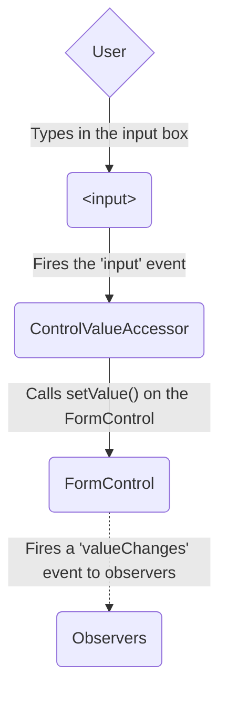

The model-to-view diagram shows how a programmatic change to the model is propagated to the view through the following steps.

1. The user calls the `favoriteColorControl.setValue()` method, which updates the `FormControl` value.
1. The `FormControl` instance emits the new value through the `valueChanges` observable.
1. Any subscribers to the `valueChanges` observable receive the new value.
1. The control value accessor on the form input element updates the element with the new value.

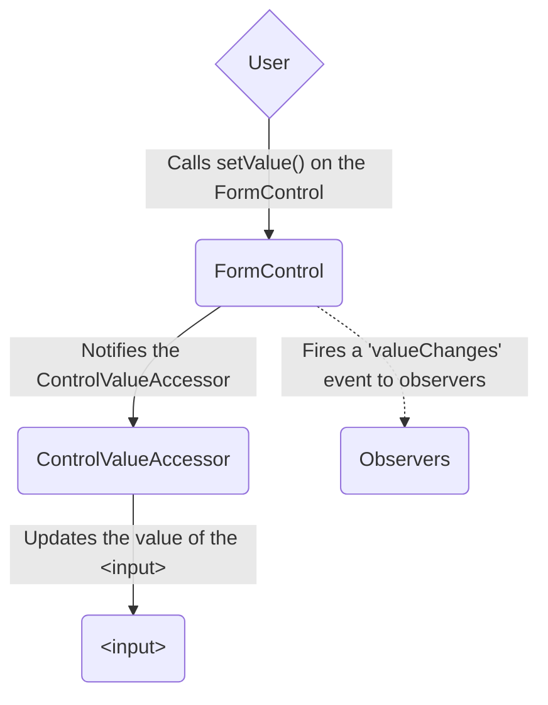

##### Data flow in template-driven forms

In template-driven forms, each form element is linked to a directive that manages the form model internally.

The view-to-model diagram shows how data flows when an input field's value is changed from the view through the following steps.

1. The user types *Blue* into the input element.
1. The input element emits an "input" event with the value *Blue*.
1. The control value accessor attached to the input triggers the `setValue()` method on the `FormControl` instance.
1. The `FormControl` instance emits the new value through the `valueChanges` observable.
1. Any subscribers to the `valueChanges` observable receive the new value.
1. The control value accessor also calls the `NgModel.viewToModelUpdate()` method which emits an `ngModelChange` event.
1. Because the component template uses two-way data binding for the `favoriteColor` property, the `favoriteColor` property in the component is updated to the value emitted by the `ngModelChange` event \(*Blue*\).

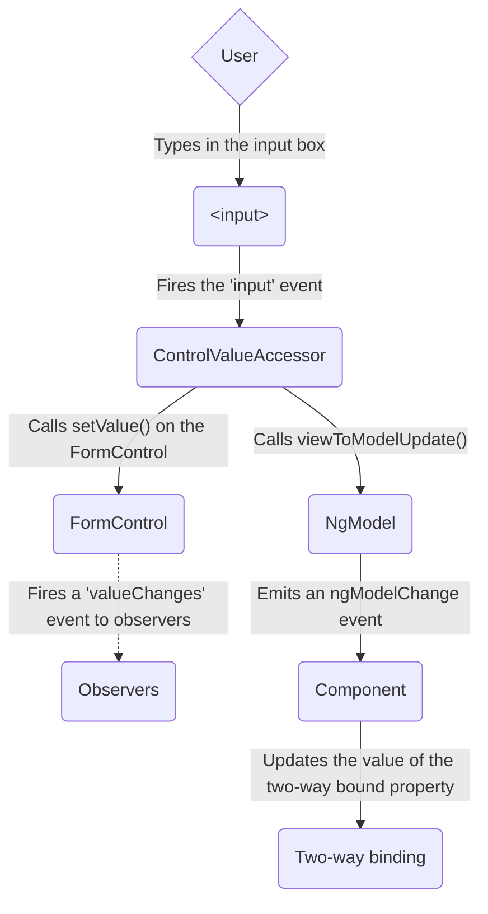

The model-to-view diagram shows how data flows from model to view when the `favoriteColor` changes from *Blue* to *Red*, through the following steps

1. The `favoriteColor` value is updated in the component.
1. Change detection begins.
1. During change detection, the `ngOnChanges` lifecycle hook is called on the `NgModel` directive instance because the value of one of its inputs has changed.
1. The `ngOnChanges()` method queues an async task to set the value for the internal `FormControl` instance.
1. Change detection completes.
1. On the next tick, the task to set the `FormControl` instance value is executed.
1. The `FormControl` instance emits the latest value through the `valueChanges` observable.
1. Any subscribers to the `valueChanges` observable receive the new value.
1. The control value accessor updates the form input element in the view with the latest `favoriteColor` value.

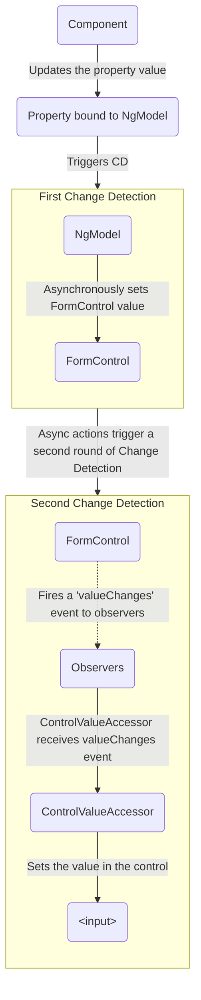

Note: `NgModel` triggers a second change detection to avoid `ExpressionChangedAfterItHasBeenChecked` errors, because the value change originates in an input binding.

##### Mutability of the data model

The change-tracking method plays a role in the efficiency of your application.

| Forms                 | Details |
|:---                   |:---     |
| Reactive forms        | Keep the data model pure by providing it as an immutable data structure. Each time a change is triggered on the data model, the `FormControl` instance returns a new data model rather than updating the existing data model. This gives you the ability to track unique changes to the data model through the control's observable. Change detection is more efficient because it only needs to update on unique changes. Because data updates follow reactive patterns, you can integrate with observable operators to transform data. |
| Template-driven forms | Rely on mutability with two-way data binding to update the data model in the component as changes are made in the template. Because there are no unique changes to track on the data model when using two-way data binding, change detection is less efficient at determining when updates are required.                                                                                                                                                                                                                                 |

The difference is demonstrated in the previous examples that use the favorite-color input element.

* With reactive forms, the **`FormControl` instance** always returns a new value when the control's value is updated
* With template-driven forms, the **favorite color property** is always modified to its new value

#### Form validation

Validation is an integral part of managing any set of forms.
Whether you're checking for required fields or querying an external API for an existing username, Angular provides a set of built-in validators as well as the ability to create custom validators.

| Forms                 | Details |
|:---                   |:---     |
| Reactive forms        | Define custom validators as **functions** that receive a control to validate                                 |
| Template-driven forms | Tied to template **directives**, and must provide custom validator directives that wrap validation functions |

For more information, see [Form Validation](guide/forms/form-validation#validating-input-in-reactive-forms).

#### Testing

Testing plays a large part in complex applications.
A simpler testing strategy is useful when validating that your forms function correctly.
Reactive forms and template-driven forms have different levels of reliance on rendering the UI to perform assertions based on form control and form field changes.
The following examples demonstrate the process of testing forms with reactive and template-driven forms.

##### Testing reactive forms

Reactive forms provide a relatively straightforward testing strategy because they provide synchronous access to the form and data models, and they can be tested without rendering the UI.
In these tests, status and data are queried and manipulated through the control without interacting with the change detection cycle.

The following tests use the favorite-color components from previous examples to verify the view-to-model and model-to-view data flows for a reactive form.

<!--todo: make consistent with other topics -->

###### Verifying view-to-model data flow

The first example performs the following steps to verify the view-to-model data flow.

1. Query the view for the form input element, and create a custom "input" event for the test.
1. Set the new value for the input to *Red*, and dispatch the "input" event on the form input element.
1. Assert that the component's `favoriteColorControl` value matches the value from the input.

<docs-code header="Favorite color test - view to model" path="adev/src/content/examples/forms-overview/src/app/reactive/favorite-color/favorite-color.component.spec.ts" visibleRegion="view-to-model"/>

The next example performs the following steps to verify the model-to-view data flow.

1. Use the `favoriteColorControl`, a `FormControl` instance, to set the new value.
1. Query the view for the form input element.
1. Assert that the new value set on the control matches the value in the input.

<docs-code header="Favorite color test - model to view" path="adev/src/content/examples/forms-overview/src/app/reactive/favorite-color/favorite-color.component.spec.ts" visibleRegion="model-to-view"/>

##### Testing template-driven forms

Writing tests with template-driven forms requires a detailed knowledge of the change detection process and an understanding of how directives run on each cycle to ensure that elements are queried, tested, or changed at the correct time.

The following tests use the favorite color components mentioned earlier to verify the data flows from view to model and model to view for a template-driven form.

The following test verifies the data flow from view to model.

<docs-code header="Favorite color test - view to model" path="adev/src/content/examples/forms-overview/src/app/template/favorite-color/favorite-color.component.spec.ts" visibleRegion="view-to-model"/>

Here are the steps performed in the view to model test.

1. Query the view for the form input element, and create a custom "input" event for the test.
1. Set the new value for the input to *Red*, and dispatch the "input" event on the form input element.
1. Run change detection through the test fixture.
1. Assert that the component `favoriteColor` property value matches the value from the input.

The following test verifies the data flow from model to view.

<docs-code header="Favorite color test - model to view" path="adev/src/content/examples/forms-overview/src/app/template/favorite-color/favorite-color.component.spec.ts" visibleRegion="model-to-view"/>

Here are the steps performed in the model to view test.

1. Use the component instance to set the value of the `favoriteColor` property.
1. Run change detection through the test fixture.
1. Use the `tick()` method to simulate the passage of time within the `fakeAsync()` task.
1. Query the view for the form input element.
1. Assert that the input value matches the value of the `favoriteColor` property in the component instance.

#### Next steps

To learn more about reactive forms, see the following guides:

<docs-pill-row>
  <docs-pill href="guide/forms/reactive-forms" title="Reactive forms"/>
  <docs-pill href="guide/forms/form-validation#validating-input-in-reactive-forms" title="Form validation"/>
  <docs-pill href="guide/forms/dynamic-forms" title="Dynamic forms"/>
</docs-pill-row>

To learn more about template-driven forms, see the following guides:

<docs-pill-row>
  <docs-pill href="guide/forms/template-driven-forms" title="Template Driven Forms tutorial" />
  <docs-pill href="guide/forms/form-validation#validating-input-in-template-driven-forms" title="Form validation" />
  <docs-pill href="api/forms/NgForm" title="NgForm directive API reference" />
</docs-pill-row>

---


(From reactive-forms.md)

### Reactive forms

Reactive forms provide a model-driven approach to handling form inputs whose values change over time.
This guide shows you how to create and update a basic form control, progress to using multiple controls in a group, validate form values, and create dynamic forms where you can add or remove controls at run time.

#### Overview of reactive forms

Reactive forms use an explicit and immutable approach to managing the state of a form at a given point in time.
Each change to the form state returns a new state, which maintains the integrity of the model between changes.
Reactive forms are built around observable streams, where form inputs and values are provided as streams of input values, which can be accessed synchronously.

Reactive forms also provide a straightforward path to testing because you are assured that your data is consistent and predictable when requested.
Any consumers of the streams have access to manipulate that data safely.

Reactive forms differ from [template-driven forms](guide/forms/template-driven-forms) in distinct ways.
Reactive forms provide synchronous access to the data model, immutability with observable operators, and change tracking through observable streams.

Template-driven forms let direct access modify data in your template, but are less explicit than reactive forms because they rely on directives embedded in the template, along with mutable data to track changes asynchronously.
See the [Forms Overview](guide/forms) for detailed comparisons between the two paradigms.

#### Adding a basic form control

There are three steps to using form controls.

1. Register the reactive forms module in your application.
    This module declares the reactive-form directives that you need to use reactive forms.

1. Generate a new component and instantiate a new `FormControl`.
1. Register the `FormControl` in the template.

You can then display the form by adding the component to the template.

The following examples show how to add a single form control.
In the example, the user enters their name into an input field, captures that input value, and displays the current value of the form control element.

<docs-workflow>

<docs-step title="Import the ReactiveFormsModule">
To use reactive form controls, import `ReactiveFormsModule` from the `@angular/forms` package and add it to your NgModule's `imports` array.

<docs-code header="src/app/app.module.ts (excerpt)" path="adev/src/content/examples/reactive-forms/src/app/app.module.ts" visibleRegion="imports" />
</docs-step>

<docs-step title="Generate a new component with a FormControl">
Use the CLI command `ng generate component` to generate a component in your project to host the control.

<docs-code header="src/app/name-editor/name-editor.component.ts" path="adev/src/content/examples/reactive-forms/src/app/name-editor/name-editor.component.ts" visibleRegion="create-control"/>

Use the constructor of `FormControl` to set its initial value, which in this case is an empty string. By creating these controls in your component class, you get immediate access to listen for, update, and validate the state of the form input.
</docs-step>

<docs-step title="Register the control in the template">
After you create the control in the component class, you must associate it with a form control element in the template. Update the template with the form control using the `formControl` binding provided by `FormControlDirective`, which is also included in the `ReactiveFormsModule`.

<docs-code header="src/app/name-editor/name-editor.component.html" path="adev/src/content/examples/reactive-forms/src/app/name-editor/name-editor.component.html" visibleRegion="control-binding" />

Using the template binding syntax, the form control is now registered to the `name` input element in the template. The form control and DOM element communicate with each other: the view reflects changes in the model, and the model reflects changes in the view.
</docs-step>

<docs-step title="Display the component">
The `FormControl` assigned to the `name` property is displayed when the `<app-name-editor>` component is added to a template.

<docs-code header="src/app/app.component.html (name editor)" path="adev/src/content/examples/reactive-forms/src/app/app.component.1.html" visibleRegion="app-name-editor"/>
</docs-step>
</docs-workflow>

##### Displaying a form control value

You can display the value in the following ways.

* Through the `valueChanges` observable where you can listen for changes in the form's value in the template using `AsyncPipe` or in the component class using the `subscribe()` method
* With the `value` property, which gives you a snapshot of the current value

The following example shows you how to display the current value using interpolation in the template.

<docs-code header="src/app/name-editor/name-editor.component.html (control value)" path="adev/src/content/examples/reactive-forms/src/app/name-editor/name-editor.component.html" visibleRegion="display-value"/>

The displayed value changes as you update the form control element.

Reactive forms provide access to information about a given control through properties and methods provided with each instance.
These properties and methods of the underlying [AbstractControl](api/forms/AbstractControl "API reference") class are used to control form state and determine when to display messages when handling [input validation](#validating-form-input "Learn more about validating form input").

Read about other `FormControl` properties and methods in the [API Reference](api/forms/FormControl "Detailed syntax reference").

##### Replacing a form control value

Reactive forms have methods to change a control's value programmatically, which gives you the flexibility to update the value without user interaction.
A form control instance provides a `setValue()` method that updates the value of the form control and validates the structure of the value provided against the control's structure.
For example, when retrieving form data from a backend API or service, use the `setValue()` method to update the control to its new value, replacing the old value entirely.

The following example adds a method to the component class to update the value of the control to *Nancy* using the `setValue()` method.

<docs-code header="src/app/name-editor/name-editor.component.ts (update value)" path="adev/src/content/examples/reactive-forms/src/app/name-editor/name-editor.component.ts" visibleRegion="update-value"/>

Update the template with a button to simulate a name update.
When you click the **Update Name** button, the value entered in the form control element is reflected as its current value.

<docs-code header="src/app/name-editor/name-editor.component.html (update value)" path="adev/src/content/examples/reactive-forms/src/app/name-editor/name-editor.component.html" visibleRegion="update-value"/>

The form model is the source of truth for the control, so when you click the button, the value of the input is changed within the component class, overriding its current value.

HELPFUL: In this example, you're using a single control.
When using the `setValue()` method with a [form group](#grouping-form-controls) or [form array](#creating-dynamic-forms) instance, the value needs to match the structure of the group or array.

#### Grouping form controls

Forms typically contain several related controls.
Reactive forms provide two ways of grouping multiple related controls into a single input form.

| Form groups | Details |
|:---         |:---     |
| Form group  | Defines a form with a fixed set of controls that you can manage together. Form group basics are discussed in this section. You can also [nest form groups](#creating-nested-form-groups "See more about nesting groups") to create more complex forms.      |
| Form array  | Defines a dynamic form, where you can add and remove controls at run time. You can also nest form arrays to create more complex forms. For more about this option, see [Creating dynamic forms](#creating-dynamic-forms). |

Just as a form control instance gives you control over a single input field, a form group instance tracks the form state of a group of form control instances \(for example, a form\).
Each control in a form group instance is tracked by name when creating the form group.
The following example shows how to manage multiple form control instances in a single group.

Generate a `ProfileEditor` component and import the `FormGroup` and `FormControl` classes from the `@angular/forms` package.

<docs-code language="shell">
ng generate component ProfileEditor
</docs-code>

<docs-code header="src/app/profile-editor/profile-editor.component.ts (imports)" path="adev/src/content/examples/reactive-forms/src/app/profile-editor/profile-editor.component.1.ts" visibleRegion="imports"/>

To add a form group to this component, take the following steps.

1. Create a `FormGroup` instance.
1. Associate the `FormGroup` model and view.
1. Save the form data.

<docs-workflow>

<docs-step title="Create a FormGroup instance">
Create a property in the component class named `profileForm` and set the property to a new form group instance. To initialize the form group, provide the constructor with an object of named keys mapped to their control.

For the profile form, add two form control instances with the names `firstName` and `lastName`

<docs-code header="src/app/profile-editor/profile-editor.component.ts (form group)" path="adev/src/content/examples/reactive-forms/src/app/profile-editor/profile-editor.component.1.ts" visibleRegion="formgroup"/>

The individual form controls are now collected within a group. A `FormGroup` instance provides its model value as an object reduced from the values of each control in the group. A form group instance has the same properties (such as `value` and `untouched`) and methods (such as `setValue()`) as a form control instance.
</docs-step>

<docs-step title="Associate the FormGroup model and view">
A form group tracks the status and changes for each of its controls, so if one of the controls changes, the parent control also emits a new status or value change. The model for the group is maintained from its members. After you define the model, you must update the template to reflect the model in the view.

<docs-code header="src/app/profile-editor/profile-editor.component.html (template form group)" path="adev/src/content/examples/reactive-forms/src/app/profile-editor/profile-editor.component.1.html" visibleRegion="formgroup"/>

Just as a form group contains a group of controls, the *profileForm* `FormGroup` is bound to the `form` element with the `FormGroup` directive, creating a communication layer between the model and the form containing the inputs.  The `formControlName` input provided by the `FormControlName` directive binds each individual input to the form control defined in `FormGroup`. The form controls communicate with their respective elements. They also communicate changes to the form group instance, which provides the source of truth for the model value.
</docs-step>

<docs-step title="Save form data">
The `ProfileEditor` component accepts input from the user, but in a real scenario you want to capture the form value and make it available for further processing outside the component. The `FormGroup` directive listens for the `submit` event emitted by the `form` element and emits an `ngSubmit` event that you can bind to a callback function. Add an `ngSubmit` event listener to the `form` tag with the `onSubmit()` callback method.

<docs-code header="src/app/profile-editor/profile-editor.component.html (submit event)" path="adev/src/content/examples/reactive-forms/src/app/profile-editor/profile-editor.component.html" visibleRegion="ng-submit"/>

The `onSubmit()` method in the `ProfileEditor` component captures the current value of `profileForm`. Use `EventEmitter` to keep the form encapsulated and to provide the form value outside the component. The following example uses `console.warn` to log a message to the browser console.

<docs-code header="src/app/profile-editor/profile-editor.component.ts (submit method)" path="adev/src/content/examples/reactive-forms/src/app/profile-editor/profile-editor.component.ts" visibleRegion="on-submit"/>

The `submit` event is emitted by the `form` tag using the built-in DOM event. You trigger the event by clicking a button with `submit` type. This lets the user press the **Enter** key to submit the completed form.

Use a `button` element to add a button to the bottom of the form to trigger the form submission.

<docs-code header="src/app/profile-editor/profile-editor.component.html (submit button)" path="adev/src/content/examples/reactive-forms/src/app/profile-editor/profile-editor.component.html" visibleRegion="submit-button"/>

The button in the preceding snippet also has a `disabled` binding attached to it to disable the button when `profileForm` is invalid. You aren't performing any validation yet, so the button is always enabled. Basic form validation is covered in the [Validating form input](#validating-form-input) section.
</docs-step>

<docs-step title="Display the component">
To display the `ProfileEditor` component that contains the form, add it to a component template.

<docs-code header="src/app/app.component.html (profile editor)" path="adev/src/content/examples/reactive-forms/src/app/app.component.1.html" visibleRegion="app-profile-editor"/>

`ProfileEditor` lets you manage the form control instances for the `firstName` and `lastName` controls within the form group instance.

##### Creating nested form groups

Form groups can accept both individual form control instances and other form group instances as children.
This makes composing complex form models easier to maintain and logically group together.

When building complex forms, managing the different areas of information is easier in smaller sections.
Using a nested form group instance lets you break large forms groups into smaller, more manageable ones.

To make more complex forms, use the following steps.

1. Create a nested group.
1. Group the nested form in the template.

Some types of information naturally fall into the same group.
A name and address are typical examples of such nested groups, and are used in the following examples.

<docs-workflow>
<docs-step title="Create a nested group">
To create a nested group in `profileForm`, add a nested `address` element to the form group instance.

<docs-code header="src/app/profile-editor/profile-editor.component.ts (nested form group)" path="adev/src/content/examples/reactive-forms/src/app/profile-editor/profile-editor.component.1.ts" visibleRegion="nested-formgroup"/>

In this example, `address group` combines the current `firstName` and `lastName` controls with the new `street`, `city`, `state`, and `zip` controls. Even though the `address` element in the form group is a child of the overall `profileForm` element in the form group, the same rules apply with value and status changes. Changes in status and value from the nested form group propagate to the parent form group, maintaining consistency with the overall model.
</docs-step>

<docs-step title="Group the nested form in the template">
After you update the model in the component class, update the template to connect the form group instance and its input elements. Add the `address` form group containing the `street`, `city`, `state`, and `zip` fields to the `ProfileEditor` template.

<docs-code header="src/app/profile-editor/profile-editor.component.html (template nested form group)" path="adev/src/content/examples/reactive-forms/src/app/profile-editor/profile-editor.component.1.html" visibleRegion="formgroupname"/>

The `ProfileEditor` form is displayed as one group, but the model is broken down further to represent the logical grouping areas.

Display the value for the form group instance in the component template using the `value` property and `JsonPipe`.
</docs-step>
</docs-workflow>

##### Updating parts of the data model

When updating the value for a form group instance that contains multiple controls, you might only want to update parts of the model.
This section covers how to update specific parts of a form control data model.

There are two ways to update the model value:

| Methods        | Details |
|:---            |:---     |
| `setValue()`   | Set a new value for an individual control. The `setValue()` method strictly adheres to the structure of the form group and replaces the entire value for the control. |
| `patchValue()` | Replace any properties defined in the object that have changed in the form model.                                                                                     |

The strict checks of the `setValue()` method help catch nesting errors in complex forms, while `patchValue()` fails silently on those errors.

In `ProfileEditorComponent`, use the `updateProfile` method with the following example to update the first name and street address for the user.

<docs-code header="src/app/profile-editor/profile-editor.component.ts (patch value)" path="adev/src/content/examples/reactive-forms/src/app/profile-editor/profile-editor.component.1.ts" visibleRegion="patch-value"/>

Simulate an update by adding a button to the template to update the user profile on demand.

<docs-code header="src/app/profile-editor/profile-editor.component.html (update value)" path="adev/src/content/examples/reactive-forms/src/app/profile-editor/profile-editor.component.1.html" visibleRegion="patch-value"/>

When a user clicks the button, the `profileForm` model is updated with new values for `firstName` and `street`. Notice that `street` is provided in an object inside the `address` property.
This is necessary because the `patchValue()` method applies the update against the model structure.
`PatchValue()` only updates properties that the form model defines.

#### Using the FormBuilder service to generate controls

Creating form control instances manually can become repetitive when dealing with multiple forms.
The `FormBuilder` service provides convenient methods for generating controls.

Use the following steps to take advantage of this service.

1. Import the `FormBuilder` class.
1. Inject the `FormBuilder` service.
1. Generate the form contents.

The following examples show how to refactor the `ProfileEditor` component to use the form builder service to create form control and form group instances.

<docs-workflow>
<docs-step title="Import the FormBuilder class">
Import the `FormBuilder` class from the `@angular/forms` package.

<docs-code header="src/app/profile-editor/profile-editor.component.ts (import)" path="adev/src/content/examples/reactive-forms/src/app/profile-editor/profile-editor.component.2.ts" visibleRegion="form-builder-imports"/>

</docs-step>

<docs-step title="Inject the FormBuilder service">
The `FormBuilder` service is an injectable provider from the reactive forms module. Use the `inject()` function to inject this dependency in your component.

<docs-code header="src/app/profile-editor/profile-editor.component.ts (constructor)" path="adev/src/content/examples/reactive-forms/src/app/profile-editor/profile-editor.component.2.ts" visibleRegion="inject-form-builder"/>

</docs-step>
<docs-step title="Generate form controls">
The `FormBuilder` service has three methods: `control()`, `group()`, and `array()`. These are factory methods for generating instances in your component classes including form controls, form groups, and form arrays. Use the `group` method to create the `profileForm` controls.

<docs-code header="src/app/profile-editor/profile-editor.component.ts (form builder)" path="adev/src/content/examples/reactive-forms/src/app/profile-editor/profile-editor.component.2.ts" visibleRegion="form-builder"/>

In the preceding example, you use the `group()` method with the same object to define the properties in the model. The value for each control name is an array containing the initial value as the first item in the array.

Tip: You can define the control with just the initial value, but if your controls need sync or async validation, add sync and async validators as the second and third items in the array. Compare using the form builder to creating the instances manually.

  <docs-code-multifile>
    <docs-code header="src/app/profile-editor/profile-editor.component.ts (instances)" path="adev/src/content/examples/reactive-forms/src/app/profile-editor/profile-editor.component.1.ts" visibleRegion="formgroup-compare"/>
    <docs-code header="src/app/profile-editor/profile-editor.component.ts (form builder)" path="adev/src/content/examples/reactive-forms/src/app/profile-editor/profile-editor.component.2.ts" visibleRegion="formgroup-compare"/>
  </docs-code-multifile>
</docs-step>

</docs-workflow>

#### Validating form input

*Form validation* is used to ensure that user input is complete and correct.
This section covers adding a single validator to a form control and displaying the overall form status.
Form validation is covered more extensively in the [Form Validation](guide/forms/form-validation) guide.

Use the following steps to add form validation.

1. Import a validator function in your form component.
1. Add the validator to the field in the form.
1. Add logic to handle the validation status.

The most common validation is making a field required.
The following example shows how to add a required validation to the `firstName` control and display the result of validation.

<docs-workflow>
<docs-step title="Import a validator function">
Reactive forms include a set of validator functions for common use cases. These functions receive a control to validate against and return an error object or a null value based on the validation check.

Import the `Validators` class from the `@angular/forms` package.

<docs-code header="src/app/profile-editor/profile-editor.component.ts (import)" path="adev/src/content/examples/reactive-forms/src/app/profile-editor/profile-editor.component.ts" visibleRegion="validator-imports"/>
</docs-step>

<docs-step title="Make a field required">
In the `ProfileEditor` component, add the `Validators.required` static method as the second item in the array for the `firstName` control.

<docs-code header="src/app/profile-editor/profile-editor.component.ts (required validator)" path="adev/src/content/examples/reactive-forms/src/app/profile-editor/profile-editor.component.ts" visibleRegion="required-validator"/>
</docs-step>

<docs-step title="Display form status">
When you add a required field to the form control, its initial status is invalid. This invalid status propagates to the parent form group element, making its status invalid. Access the current status of the form group instance through its `status` property.

Display the current status of `profileForm` using interpolation.

<docs-code header="src/app/profile-editor/profile-editor.component.html (display status)" path="adev/src/content/examples/reactive-forms/src/app/profile-editor/profile-editor.component.html" visibleRegion="display-status"/>

The **Submit** button is disabled because `profileForm` is invalid due to the required `firstName` form control. After you fill out the `firstName` input, the form becomes valid and the **Submit** button is enabled.

For more on form validation, visit the [Form Validation](guide/forms/form-validation) guide.
</docs-step>
</docs-workflow>

#### Creating dynamic forms

`FormArray` is an alternative to `FormGroup` for managing any number of unnamed controls.
As with form group instances, you can dynamically insert and remove controls from form array instances, and the form array instance value and validation status is calculated from its child controls.
However, you don't need to define a key for each control by name, so this is a great option if you don't know the number of child values in advance.

To define a dynamic form, take the following steps.

1. Import the `FormArray` class.
1. Define a `FormArray` control.
1. Access the `FormArray` control with a getter method.
1. Display the form array in a template.

The following example shows you how to manage an array of *aliases* in `ProfileEditor`.

<docs-workflow>
<docs-step title="Import the `FormArray` class">
Import the `FormArray` class from `@angular/forms` to use for type information. The `FormBuilder` service is ready to create a `FormArray` instance.

<docs-code header="src/app/profile-editor/profile-editor.component.ts (import)" path="adev/src/content/examples/reactive-forms/src/app/profile-editor/profile-editor.component.2.ts" visibleRegion="form-array-imports"/>
</docs-step>

<docs-step title="Define a `FormArray` control">
You can initialize a form array with any number of controls, from zero to many, by defining them in an array. Add an `aliases` property to the form group instance for `profileForm` to define the form array.

Use the `FormBuilder.array()` method to define the array, and the `FormBuilder.control()` method to populate the array with an initial control.

<docs-code header="src/app/profile-editor/profile-editor.component.ts (aliases form array)" path="adev/src/content/examples/reactive-forms/src/app/profile-editor/profile-editor.component.ts" visibleRegion="aliases"/>

The aliases control in the form group instance is now populated with a single control until more controls are added dynamically.
</docs-step>

<docs-step title="Access the `FormArray` control">
A getter provides access to the aliases in the form array instance compared to repeating the `profileForm.get()` method to get each instance. The form array instance represents an undefined number of controls in an array. It's convenient to access a control through a getter, and this approach is straightforward to repeat for additional controls. <br />

Use the getter syntax to create an `aliases` class property to retrieve the alias's form array control from the parent form group.

<docs-code header="src/app/profile-editor/profile-editor.component.ts (aliases getter)" path="adev/src/content/examples/reactive-forms/src/app/profile-editor/profile-editor.component.ts" visibleRegion="aliases-getter"/>

Because the returned control is of the type `AbstractControl`, you need to provide an explicit type to access the method syntax for the form array instance.  Define a method to dynamically insert an alias control into the alias's form array. The `FormArray.push()` method inserts the control as a new item in the array.

<docs-code header="src/app/profile-editor/profile-editor.component.ts (add alias)" path="adev/src/content/examples/reactive-forms/src/app/profile-editor/profile-editor.component.ts" visibleRegion="add-alias"/>

In the template, each control is displayed as a separate input field.

</docs-step>

<docs-step title="Display the form array in the template">

To attach the aliases from your form model, you must add it to the template. Similar to the `formGroupName` input provided by `FormGroupNameDirective`, `formArrayName` binds communication from the form array instance to the template with `FormArrayNameDirective`.

Add the following template HTML after the `<div>` closing the `formGroupName` element.

<docs-code header="src/app/profile-editor/profile-editor.component.html (aliases form array template)" path="adev/src/content/examples/reactive-forms/src/app/profile-editor/profile-editor.component.html" visibleRegion="formarrayname"/>

The `*ngFor` directive iterates over each form control instance provided by the aliases form array instance. Because form array elements are unnamed, you assign the index to the `i` variable and pass it to each control to bind it to the `formControlName` input.

Each time a new alias instance is added, the new form array instance is provided its control based on the index. This lets you track each individual control when calculating the status and value of the root control.

</docs-step>

<docs-step title="Add an alias">

Initially, the form contains one `Alias` field. To add another field, click the **Add Alias** button. You can also validate the array of aliases reported by the form model displayed by `Form Value` at the bottom of the template.  Instead of a form control instance for each alias, you can compose another form group instance with additional fields. The process of defining a control for each item is the same.
</docs-step>

</docs-workflow>

#### Reactive forms API summary

The following table lists the base classes and services used to create and manage reactive form controls.
For complete syntax details, see the API reference documentation for the [Forms package](api#forms "API reference").

##### Classes

| Class             | Details |
|:---               |:---     |
| `AbstractControl` | The abstract base class for the concrete form control classes `FormControl`, `FormGroup`, and `FormArray`. It provides their common behaviors and properties.                           |
| `FormControl`     | Manages the value and validity status of an individual form control. It corresponds to an HTML form control such as `<input>` or `<select>`.                                            |
| `FormGroup`       | Manages the value and validity state of a group of `AbstractControl` instances. The group's properties include its child controls. The top-level form in your component is `FormGroup`. |
| `FormArray`       | Manages the value and validity state of a numerically indexed array of `AbstractControl` instances.                                                                                     |
| `FormBuilder`     | An injectable service that provides factory methods for creating control instances.                                                                                                     |
| `FormRecord`      | Tracks the value and validity state of a collection of `FormControl` instances, each of which has the same value type.                                                                  |

##### Directives

| Directive              | Details |
|:---                    |:---     |
| `FormControlDirective` | Syncs a standalone `FormControl` instance to a form control element.                       |
| `FormControlName`      | Syncs `FormControl` in an existing `FormGroup` instance to a form control element by name. |
| `FormGroupDirective`   | Syncs an existing `FormGroup` instance to a DOM element.                                   |
| `FormGroupName`        | Syncs a nested `FormGroup` instance to a DOM element.                                      |
| `FormArrayName`        | Syncs a nested `FormArray` instance to a DOM element.                                      |

---


(From template-driven-forms.md)

### Building a template-driven form

This tutorial shows you how to create a template-driven form. The control elements in the form are bound to data properties that have input validation. The input validation helps maintain data integrity and styling to improve the user experience.

Template-driven forms use [two-way data binding](guide/templates/two-way-binding) to update the data model in the component as changes are made in the template and vice versa.

<docs-callout helpful title="Template vs Reactive forms">
Angular supports two design approaches for interactive forms. Template-driven forms allow you to use form-specific directives in your Angular template. Reactive forms provide a model-driven approach to building forms.

Template-driven forms are a great choice for small or simple forms, while reactive forms are more scalable and suitable for complex forms. For a comparison of the two approaches, see [Choosing an approach](guide/forms#choosing-an-approach)
</docs-callout>

You can build almost any kind of form with an Angular template —login forms, contact forms, and pretty much any business form.
You can lay out the controls creatively and bind them to the data in your object model.
You can specify validation rules and display validation errors, conditionally allow input from specific controls, trigger built-in visual feedback, and much more.

#### Objectives

This tutorial teaches you how to do the following:

- Build an Angular form with a component and template
- Use `ngModel` to create two-way data bindings for reading and writing input-control values
- Provide visual feedback using special CSS classes that track the state of the controls
- Display validation errors to users and conditionally allow input from form controls based on the form status
- Share information across HTML elements using [template reference variables](guide/templates/variables#template-reference-variables)

#### Build a template-driven form

Template-driven forms rely on directives defined in the `FormsModule`.

| Directives     | Details                                                                                                                                                                                                                                                                         |
| :------------- | :------------------------------------------------------------------------------------------------------------------------------------------------------------------------------------------------------------------------------------------------------------------------------ |
| `NgModel`      | Reconciles value changes in the attached form element with changes in the data model, allowing you to respond to user input with input validation and error handling.                                                                                                           |
| `NgForm`       | Creates a top-level `FormGroup` instance and binds it to a `<form>` element to track aggregated form value and validation status. As soon as you import `FormsModule`, this directive becomes active by default on all `<form>` tags. You don't need to add a special selector. |
| `NgModelGroup` | Creates and binds a `FormGroup` instance to a DOM element.                                                                                                                                                                                                                      |

##### Step overview

In the course of this tutorial, you bind a sample form to data and handle user input using the following steps.

1. Build the basic form.
   - Define a sample data model
   - Include required infrastructure such as the `FormsModule`
1. Bind form controls to data properties using the `ngModel` directive and two-way data-binding syntax.
   - Examine how `ngModel` reports control states using CSS classes
   - Name controls to make them accessible to `ngModel`
1. Track input validity and control status using `ngModel`.
   - Add custom CSS to provide visual feedback on the status
   - Show and hide validation-error messages
1. Respond to a native HTML button-click event by adding to the model data.
1. Handle form submission using the [`ngSubmit`](api/forms/NgForm#properties) output property of the form.
   - Disable the **Submit** button until the form is valid
   - After submit, swap out the finished form for different content on the page

#### Build the form

<!-- TODO: link to preview -->
<!-- <docs-code live/> -->

1. The provided sample application creates the `Actor` class which defines the data model reflected in the form.

<docs-code header="src/app/actor.ts" language="typescript" path="adev/src/content/examples/forms/src/app/actor.ts"/>

1. The form layout and details are defined in the `ActorFormComponent` class.

   <docs-code header="src/app/actor-form/actor-form.component.ts (v1)" path="adev/src/content/examples/forms/src/app/actor-form/actor-form.component.ts" visibleRegion="v1"/>

   The component's `selector` value of "app-actor-form" means you can drop this form in a parent template using the `<app-actor-form>` tag.

1. The following code creates a new actor instance, so that the initial form can show an example actor.

   <docs-code language="typescript" path="adev/src/content/examples/forms/src/app/actor-form/actor-form.component.ts" language="typescript" visibleRegion="Marilyn"/>

   This demo uses dummy data for `model` and `skills`.
   In a real app, you would inject a data service to get and save real data, or expose these properties as inputs and outputs.

1. The application enables the Forms feature and registers the created form component.

<docs-code header="src/app/app.module.ts" language="typescript" path="adev/src/content/examples/forms/src/app/app.module.ts"/>

1. The form is displayed in the application layout defined by the root component's template.

   <docs-code header="src/app/app.component.html" language="html" path="adev/src/content/examples/forms/src/app/app.component.html"/>

   The initial template defines the layout for a form with two form groups and a submit button.
   The form groups correspond to two properties of the Actor data model, name and studio.
   Each group has a label and a box for user input.

   - The **Name** `<input>` control element has the HTML5 `required` attribute
   - The **Studio** `<input>` control element does not because `studio` is optional

   The **Submit** button has some classes on it for styling.
   At this point, the form layout is all plain HTML5, with no bindings or directives.

1. The sample form uses some style classes from [Twitter Bootstrap](https://getbootstrap.com/css): `container`, `form-group`, `form-control`, and `btn`.
To use these styles, the application's style sheet imports the library.

<docs-code header="src/styles.css" path="adev/src/content/examples/forms/src/styles.1.css"/>

1. The form requires that an actor's skill is chosen from a predefined list of `skills` maintained internally in `ActorFormComponent`.
The Angular [NgForOf directive](api/common/NgForOf 'API reference') iterates over the data values to populate the `<select>` element.

<docs-code header="src/app/actor-form/actor-form.component.html (skills)" path="adev/src/content/examples/forms/src/app/actor-form/actor-form.component.html" visibleRegion="skills"/>

If you run the application right now, you see the list of skills in the selection control.
The input elements are not yet bound to data values or events, so they are still blank and have no behavior.

#### Bind input controls to data properties

The next step is to bind the input controls to the corresponding `Actor` properties with two-way data binding, so that they respond to user input by updating the data model, and also respond to programmatic changes in the data by updating the display.

The `ngModel` directive declared in the `FormsModule` lets you bind controls in your template-driven form to properties in your data model.
When you include the directive using the syntax for two-way data binding, `[(ngModel)]`, Angular can track the value and user interaction of the control and keep the view synced with the model.

1. Edit the template file `actor-form.component.html`.
1. Find the `<input>` tag next to the **Name** label.
1. Add the `ngModel` directive, using two-way data binding syntax `[(ngModel)]="..."`.

<docs-code header="src/app/actor-form/actor-form.component.html (excerpt)" path="adev/src/content/examples/forms/src/app/actor-form/actor-form.component.html" visibleRegion="ngModelName-1"/>

HELPFUL: This example has a temporary diagnostic interpolation after each input tag, `{{model.name}}`, to show the current data value of the corresponding property. The comment reminds you to remove the diagnostic lines when you have finished observing the two-way data binding at work.

##### Access the overall form status

When you imported the `FormsModule` in your component, Angular automatically created and attached an [NgForm](api/forms/NgForm) directive to the `<form>` tag in the template (because `NgForm` has the selector `form` that matches `<form>` elements).

To get access to the `NgForm` and the overall form status, declare a [template reference variable](guide/templates/variables#template-reference-variables).

1. Edit the template file `actor-form.component.html`.
1. Update the `<form>` tag with a template reference variable, `#actorForm`, and set its value as follows.

   <docs-code header="src/app/actor-form/actor-form.component.html (excerpt)" path="adev/src/content/examples/forms/src/app/actor-form/actor-form.component.html" visibleRegion="template-variable"/>

   The `actorForm` template variable is now a reference to the `NgForm` directive instance that governs the form as a whole.

1. Run the app.
1. Start typing in the **Name** input box.

   As you add and delete characters, you can see them appear and disappear from the data model.

The diagnostic line that shows interpolated values demonstrates that values are really flowing from the input box to the model and back again.

##### Naming control elements

When you use `[(ngModel)]` on an element, you must define a `name` attribute for that element.
Angular uses the assigned name to register the element with the `NgForm` directive attached to the parent `<form>` element.

The example added a `name` attribute to the `<input>` element and set it to "name", which makes sense for the actor's name.
Any unique value will do, but using a descriptive name is helpful.

1. Add similar `[(ngModel)]` bindings and `name` attributes to **Studio** and **Skill**.
1. You can now remove the diagnostic messages that show interpolated values.
1. To confirm that two-way data binding works for the entire actor model, add a new text binding with the [`json`](api/common/JsonPipe) pipe at the top to the component's template, which serializes the data to a string.

After these revisions, the form template should look like the following:

<docs-code header="src/app/actor-form/actor-form.component.html (excerpt)" path="adev/src/content/examples/forms/src/app/actor-form/actor-form.component.html" visibleRegion="ngModel-2"/>

You'll notice that:

- Each `<input>` element has an `id` property.
  This is used by the `<label>` element's `for` attribute to match the label to its input control.
  This is a [standard HTML feature](https://developer.mozilla.org/docs/Web/HTML/Element/label).

- Each `<input>` element also has the required `name` property that Angular uses to register the control with the form.

When you have observed the effects, you can delete the `{{ model | json }}` text binding.

#### Track form states

Angular applies the `ng-submitted` class to `form` elements after the form has been submitted. This class can be used to change the form's style after it has been submitted.

#### Track control states

Adding the `NgModel` directive to a control adds class names to the control that describe its state.
These classes can be used to change a control's style based on its state.

The following table describes the class names that Angular applies based on the control's state.

| States                           | Class if true | Class if false |
| :------------------------------- | :------------ | :------------- |
| The control has been visited.    | `ng-touched`  | `ng-untouched` |
| The control's value has changed. | `ng-dirty`    | `ng-pristine`  |
| The control's value is valid.    | `ng-valid`    | `ng-invalid`   |

Angular also applies the `ng-submitted` class to `form` elements upon submission,
but not to the controls inside the `form` element.

You use these CSS classes to define the styles for your control based on its status.

##### Observe control states

To see how the classes are added and removed by the framework, open the browser's developer tools and inspect the `<input>` element that represents the actor name.

1. Using your browser's developer tools, find the `<input>` element that corresponds to the **Name** input box.
   You can see that the element has multiple CSS classes in addition to "form-control".

1. When you first bring it up, the classes indicate that it has a valid value, that the value has not been changed since initialization or reset, and that the control has not been visited since initialization or reset.

   <docs-code language="html">

   <input class="form-control ng-untouched ng-pristine ng-valid">;

   </docs-code>

1. Take the following actions on the **Name** `<input>` box, and observe which classes appear.

   - Look but don't touch.
     The classes indicate that it is untouched, pristine, and valid.

   - Click inside the name box, then click outside it.
     The control has now been visited, and the element has the `ng-touched` class instead of the `ng-untouched` class.

   - Add slashes to the end of the name.
     It is now touched and dirty.

   - Erase the name.
     This makes the value invalid, so the `ng-invalid` class replaces the `ng-valid` class.

##### Create visual feedback for states

The `ng-valid`/`ng-invalid` pair is particularly interesting, because you want to send a
strong visual signal when the values are invalid.
You also want to mark required fields.

You can mark required fields and invalid data at the same time with a colored bar
on the left of the input box.

To change the appearance in this way, take the following steps.

1. Add definitions for the `ng-*` CSS classes.
1. Add these class definitions to a new `forms.css` file.
1. Add the new file to the project as a sibling to `index.html`:

<docs-code header="src/assets/forms.css" language="css" path="adev/src/content/examples/forms/src/assets/forms.css"/>

1. In the `index.html` file, update the `<head>` tag to include the new style sheet.

<docs-code header="src/index.html (styles)" path="adev/src/content/examples/forms/src/index.html" visibleRegion="styles"/>

##### Show and hide validation error messages

The **Name** input box is required and clearing it turns the bar red.
That indicates that something is wrong, but the user doesn't know what is wrong or what to do about it.
You can provide a helpful message by checking for and responding to the control's state.

The **Skill** select box is also required, but it doesn't need this kind of error handling because the selection box already constrains the selection to valid values.

To define and show an error message when appropriate, take the following steps.

<docs-workflow>
<docs-step title="Add a local reference to the input">
Extend the `input` tag with a template reference variable that you can use to access the input box's Angular control from within the template. In the example, the variable is `#name="ngModel"`.

The template reference variable (`#name`) is set to `"ngModel"` because that is the value of the [`NgModel.exportAs`](api/core/Directive#exportAs) property. This property tells Angular how to link a reference variable to a directive.
</docs-step>

<docs-step title="Add the error message">
Add a `<div>` that contains a suitable error message.
</docs-step>

<docs-step title="Make the error message conditional">
Show or hide the error message by binding properties of the `name` control to the message `<div>` element's `hidden` property.
</docs-step>

<docs-code header="src/app/actor-form/actor-form.component.html (hidden-error-msg)" path="adev/src/content/examples/forms/src/app/actor-form/actor-form.component.html" visibleRegion="hidden-error-msg"/>

<docs-step title="Add a conditional error message to name">
Add a conditional error message to the `name` input box, as in the following example.

<docs-code header="src/app/actor-form/actor-form.component.html (excerpt)" path="adev/src/content/examples/forms/src/app/actor-form/actor-form.component.html" visibleRegion="name-with-error-msg"/>
</docs-step>
</docs-workflow>

<docs-callout title='Illustrating the "pristine" state'>

In this example, you hide the message when the control is either valid or _pristine_.
Pristine means the user hasn't changed the value since it was displayed in this form.
If you ignore the `pristine` state, you would hide the message only when the value is valid.
If you arrive in this component with a new, blank actor or an invalid actor, you'll see the error message immediately, before you've done anything.

You might want the message to display only when the user makes an invalid change.
Hiding the message while the control is in the `pristine` state achieves that goal.
You'll see the significance of this choice when you add a new actor to the form in the next step.

</docs-callout>

#### Add a new actor

This exercise shows how you can respond to a native HTML button-click event by adding to the model data.
To let form users add a new actor, you will add a **New Actor** button that responds to a click event.

1. In the template, place a "New Actor" `<button>` element at the bottom of the form.
1. In the component file, add the actor-creation method to the actor data model.

<docs-code header="src/app/actor-form/actor-form.component.ts (New Actor method)" path="adev/src/content/examples/forms/src/app/actor-form/actor-form.component.ts" visibleRegion="new-actor"/>

1. Bind the button's click event to an actor-creation method, `newActor()`.

<docs-code header="src/app/actor-form/actor-form.component.html (New Actor button)" path="adev/src/content/examples/forms/src/app/actor-form/actor-form.component.html" visibleRegion="new-actor-button-no-reset"/>

1. Run the application again and click the **New Actor** button.

   The form clears, and the _required_ bars to the left of the input box are red, indicating invalid `name` and `skill` properties.
   Notice that the error messages are hidden.
   This is because the form is pristine; you haven't changed anything yet.

1. Enter a name and click **New Actor** again.

   Now the application displays a `Name is required` error message, because the input box is no longer pristine.
   The form remembers that you entered a name before clicking **New Actor**.

1. To restore the pristine state of the form controls, clear all of the flags imperatively by calling the form's `reset()` method after calling the `newActor()` method.

   <docs-code header="src/app/actor-form/actor-form.component.html (Reset the form)" path="adev/src/content/examples/forms/src/app/actor-form/actor-form.component.html" visibleRegion="new-actor-button-form-reset"/>

   Now clicking **New Actor** resets both the form and its control flags.

#### Submit the form with `ngSubmit`

The user should be able to submit this form after filling it in.
The **Submit** button at the bottom of the form does nothing on its own, but it does trigger a form-submit event because of its type (`type="submit"`).

To respond to this event, take the following steps.

<docs-workflow>

<docs-step title="Listen to ngOnSubmit">
Bind the form's [`ngSubmit`](api/forms/NgForm#properties) event property to the actor-form component's `onSubmit()` method.

<docs-code header="src/app/actor-form/actor-form.component.html (ngSubmit)" path="adev/src/content/examples/forms/src/app/actor-form/actor-form.component.html" visibleRegion="ngSubmit"/>
</docs-step>

<docs-step title="Bind the disabled property">
Use the template reference variable, `#actorForm` to access the form that contains the **Submit** button and create an event binding.

You will bind the form property that indicates its overall validity to the **Submit** button's `disabled` property.

<docs-code header="src/app/actor-form/actor-form.component.html (submit-button)" path="adev/src/content/examples/forms/src/app/actor-form/actor-form.component.html" visibleRegion="submit-button"/>
</docs-step>

<docs-step title="Run the application">
Notice that the button is enabled —although it doesn't do anything useful yet.
</docs-step>

<docs-step title="Delete the Name value">
This violates the "required" rule, so it displays the error message —and notice that it also disables the **Submit** button.

You didn't have to explicitly wire the button's enabled state to the form's validity.
The `FormsModule` did this automatically when you defined a template reference variable on the enhanced form element, then referred to that variable in the button control.
</docs-step>
</docs-workflow>

##### Respond to form submission

To show a response to form submission, you can hide the data entry area and display something else in its place.

<docs-workflow>
<docs-step title="Wrap the form">
Wrap the entire form in a `<div>` and bind its `hidden` property to the `ActorFormComponent.submitted` property.

<docs-code header="src/app/actor-form/actor-form.component.html (excerpt)" path="adev/src/content/examples/forms/src/app/actor-form/actor-form.component.html" visibleRegion="edit-div"/>

The main form is visible from the start because the `submitted` property is false until you submit the form, as this fragment from the `ActorFormComponent` shows:

<docs-code header="src/app/actor-form/actor-form.component.ts (submitted)" path="adev/src/content/examples/forms/src/app/actor-form/actor-form.component.ts" visibleRegion="submitted"/>

When you click the **Submit** button, the `submitted` flag becomes true and the form disappears.
</docs-step>

<docs-step title="Add the submitted state">
To show something else while the form is in the submitted state, add the following HTML below the new `<div>` wrapper.

<docs-code header="src/app/actor-form/actor-form.component.html (excerpt)" path="adev/src/content/examples/forms/src/app/actor-form/actor-form.component.html" visibleRegion="submitted"/>

This `<div>`, which shows a read-only actor with interpolation bindings, appears only while the component is in the submitted state.

The alternative display includes an _Edit_ button whose click event is bound to an expression that clears the `submitted` flag.
</docs-step>

<docs-step title="Test the Edit button">
Click the *Edit* button to switch the display back to the editable form.
</docs-step>
</docs-workflow>

#### Summary

The Angular form discussed in this page takes advantage of the following
framework features to provide support for data modification, validation, and more.

- An Angular HTML form template
- A form component class with a `@Component` decorator
- Handling form submission by binding to the `NgForm.ngSubmit` event property
- Template-reference variables such as `#actorForm` and `#name`
- `[(ngModel)]` syntax for two-way data binding
- The use of `name` attributes for validation and form-element change tracking
- The reference variable's `valid` property on input controls indicates whether a control is valid or should show error messages
- Controlling the **Submit** button's enabled state by binding to `NgForm` validity
- Custom CSS classes that provide visual feedback to users about controls that are not valid

Here's the code for the final version of the application:

<docs-code-multifile>
    <docs-code header="actor-form/actor-form.component.ts" path="adev/src/content/examples/forms/src/app/actor-form/actor-form.component.ts" visibleRegion="final"/>
    <docs-code header="actor-form/actor-form.component.html" path="adev/src/content/examples/forms/src/app/actor-form/actor-form.component.html" visibleRegion="final"/>
    <docs-code header="actor.ts" path="adev/src/content/examples/forms/src/app/actor.ts"/>
    <docs-code header="app.module.ts" path="adev/src/content/examples/forms/src/app/app.module.ts"/>
    <docs-code header="app.component.html" path="adev/src/content/examples/forms/src/app/app.component.html"/>
    <docs-code header="app.component.ts" path="adev/src/content/examples/forms/src/app/app.component.ts"/>
    <docs-code header="main.ts" path="adev/src/content/examples/forms/src/main.ts"/>
    <docs-code header="forms.css" path="adev/src/content/examples/forms/src/assets/forms.css"/>
</docs-code-multifile>

---


(From typed-forms.md)

### Typed Forms

As of Angular 14, reactive forms are strictly typed by default.

As background for this guide, you should already be familiar with [Angular Reactive Forms](guide/forms/reactive-forms).

#### Overview of Typed Forms

<docs-video src="https://www.youtube.com/embed/L-odCf4MfJc" alt="Typed Forms in Angular" />

With Angular reactive forms, you explicitly specify a *form model*. As a simple example, consider this basic user login form:

```ts
const login = new FormGroup({
  email: new FormControl(''),
  password: new FormControl(''),
});
```

Angular provides many APIs for interacting with this `FormGroup`. For example, you may call `login.value`, `login.controls`, `login.patchValue`, etc. (For a full API reference, see the [API documentation](api/forms/FormGroup).)

In previous Angular versions, most of these APIs included `any` somewhere in their types, and interacting with the structure of the controls, or the values themselves, was not type-safe. For example: you could write the following invalid code:

```ts
const emailDomain = login.value.email.domain;
```

With strictly typed reactive forms, the above code does not compile, because there is no `domain` property on `email`.

In addition to the added safety, the types enable a variety of other improvements, such as better autocomplete in IDEs, and an explicit way to specify form structure.

These improvements currently apply only to *reactive* forms (not [*template-driven* forms](guide/forms/template-driven-forms)).

#### Untyped Forms

Non-typed forms are still supported, and will continue to work as before. To use them, you must import the `Untyped` symbols from `@angular/forms`:

```ts
const login = new UntypedFormGroup({
  email: new UntypedFormControl(''),
  password: new UntypedFormControl(''),
});
```

Each `Untyped` symbol has exactly the same semantics as in previous Angular version. By removing the `Untyped` prefixes, you can incrementally enable the types.

#### `FormControl`: Getting Started

The simplest possible form consists of a single control:

```ts
const email = new FormControl('angularrox@gmail.com');
```

This control will be automatically inferred to have the type `FormControl<string|null>`. TypeScript will automatically enforce this type throughout the [`FormControl` API](api/forms/FormControl), such as `email.value`, `email.valueChanges`, `email.setValue(...)`, etc.

##### Nullability

You might wonder: why does the type of this control include `null`?  This is because the control can become `null` at any time, by calling reset:

```ts
const email = new FormControl('angularrox@gmail.com');
email.reset();
console.log(email.value); // null
```

TypeScript will enforce that you always handle the possibility that the control has become `null`. If you want to make this control non-nullable, you may use the `nonNullable` option. This will cause the control to reset to its initial value, instead of `null`:

```ts
const email = new FormControl('angularrox@gmail.com', {nonNullable: true});
email.reset();
console.log(email.value); // angularrox@gmail.com
```

To reiterate, this option affects the runtime behavior of your form when `.reset()` is called, and should be flipped with care.

##### Specifying an Explicit Type

It is possible to specify the type, instead of relying on inference. Consider a control that is initialized to `null`. Because the initial value is `null`, TypeScript will infer `FormControl<null>`, which is narrower than we want.

```ts
const email = new FormControl(null);
email.setValue('angularrox@gmail.com'); // Error!
```

To prevent this, we explicitly specify the type as `string|null`:

```ts
const email = new FormControl<string|null>(null);
email.setValue('angularrox@gmail.com');
```

#### `FormArray`: Dynamic, Homogenous Collections

A `FormArray` contains an open-ended list of controls. The type parameter corresponds to the type of each inner control:

```ts
const names = new FormArray([new FormControl('Alex')]);
names.push(new FormControl('Jess'));
```

This `FormArray` will have the inner controls type `FormControl<string|null>`.

If you want to have multiple different element types inside the array, you must use `UntypedFormArray`, because TypeScript cannot infer which element type will occur at which position.

#### `FormGroup` and `FormRecord`

Angular provides the `FormGroup` type for forms with an enumerated set of keys, and a type called `FormRecord`, for open-ended or dynamic groups.

##### Partial Values

Consider again a login form:

```ts
const login = new FormGroup({
    email: new FormControl('', {nonNullable: true}),
    password: new FormControl('', {nonNullable: true}),
});
```

On any `FormGroup`, it is [possible to disable controls](api/forms/FormGroup). Any disabled control will not appear in the group's value.

As a consequence, the type of `login.value` is `Partial<{email: string, password: string}>`. The `Partial` in this type means that each member might be undefined.

More specifically, the type of `login.value.email` is `string|undefined`, and TypeScript will enforce that you handle the possibly `undefined` value (if you have `strictNullChecks` enabled).

If you want to access the value *including* disabled controls, and thus bypass possible `undefined` fields, you can use `login.getRawValue()`.

##### Optional Controls and Dynamic Groups

Some forms have controls that may or may not be present, which can be added and removed at runtime. You can represent these controls using *optional fields*:

```ts
interface LoginForm {
  email: FormControl<string>;
  password?: FormControl<string>;
}

const login = new FormGroup<LoginForm>({
  email: new FormControl('', {nonNullable: true}),
  password: new FormControl('', {nonNullable: true}),
});

login.removeControl('password');
```

In this form, we explicitly specify the type, which allows us to make the `password` control optional. TypeScript will enforce that only optional controls can be added or removed.

##### `FormRecord`

Some `FormGroup` usages do not fit the above pattern because the keys are not known ahead of time. The `FormRecord` class is designed for that case:

```ts
const addresses = new FormRecord<FormControl<string|null>>({});
addresses.addControl('Andrew', new FormControl('2340 Folsom St'));
```

Any control of type `string|null` can be added to this `FormRecord`.

If you need a `FormGroup` that is both dynamic (open-ended) and heterogeneous (the controls are different types), no improved type safety is possible, and you should use `UntypedFormGroup`.

A `FormRecord` can also be built with the `FormBuilder`:

```ts
const addresses = fb.record({'Andrew': '2340 Folsom St'});
```

#### `FormBuilder` and `NonNullableFormBuilder`

The `FormBuilder` class has been upgraded to support the new types as well, in the same manner as the above examples.

Additionally, an additional builder is available: `NonNullableFormBuilder`. This type is shorthand for specifying `{nonNullable: true}` on every control, and can eliminate significant boilerplate from large non-nullable forms. You can access it using the `nonNullable` property on a `FormBuilder`:

```ts
const fb = new FormBuilder();
const login = fb.nonNullable.group({
  email: '',
  password: '',
});
```

On the above example, both inner controls will be non-nullable (i.e. `nonNullable` will be set).

You can also inject it using the name `NonNullableFormBuilder`.

---

---

## Guide Http

(From interceptors.md)

### Interceptors

`HttpClient` supports a form of middleware known as _interceptors_.

TLDR: Interceptors are middleware that allows common patterns around retrying, caching, logging, and authentication to be abstracted away from individual requests.

`HttpClient` supports two kinds of interceptors: functional and DI-based. Our recommendation is to use functional interceptors because they have more predictable behavior, especially in complex setups. Our examples in this guide use functional interceptors, and we cover [DI-based interceptors](#di-based-interceptors) in their own section at the end.

#### Interceptors

Interceptors are generally functions which you can run for each request, and have broad capabilities to affect the contents and overall flow of requests and responses. You can install multiple interceptors, which form an interceptor chain where each interceptor processes the request or response before forwarding it to the next interceptor in the chain.

You can use interceptors to implement a variety of common patterns, such as:

* Adding authentication headers to outgoing requests to a particular API.
* Retrying failed requests with exponential backoff.
* Caching responses for a period of time, or until invalidated by mutations.
* Customizing the parsing of responses.
* Measuring server response times and log them.
* Driving UI elements such as a loading spinner while network operations are in progress.
* Collecting and batch requests made within a certain timeframe.
* Automatically failing requests after a configurable deadline or timeout.
* Regularly polling the server and refreshing results.

#### Defining an interceptor

The basic form of an interceptor is a function which receives the outgoing `HttpRequest` and a `next` function representing the next processing step in the interceptor chain.

For example, this `loggingInterceptor` will log the outgoing request URL to `console.log` before forwarding the request:

<docs-code language="ts">
export function loggingInterceptor(req: HttpRequest<unknown>, next: HttpHandlerFn): Observable<HttpEvent<unknown>> {
  console.log(req.url);
  return next(req);
}
</docs-code>

In order for this interceptor to actually intercept requests, you must configure `HttpClient` to use it.

#### Configuring interceptors

You declare the set of interceptors to use when configuring `HttpClient` through dependency injection, by using the `withInterceptors` feature:

<docs-code language="ts">
bootstrapApplication(AppComponent, {providers: [
  provideHttpClient(
    withInterceptors([loggingInterceptor, cachingInterceptor]),
  )
]});
</docs-code>

The interceptors you configure are chained together in the order that you've listed them in the providers. In the above example, the `loggingInterceptor` would process the request and then forward it to the `cachingInterceptor`.

##### Intercepting response events

An interceptor may transform the `Observable` stream of `HttpEvent`s returned by `next` in order to access or manipulate the response. Because this stream includes all response events, inspecting the `.type` of each event may be necessary in order to identify the final response object.

<docs-code language="ts">
export function loggingInterceptor(req: HttpRequest<unknown>, next: HttpHandlerFn): Observable<HttpEvent<unknown>> {
  return next(req).pipe(tap(event => {
    if (event.type === HttpEventType.Response) {
      console.log(req.url, 'returned a response with status', event.status);
    }
  }));
}
</docs-code>

Tip: Interceptors naturally associate responses with their outgoing requests, because they transform the response stream in a closure that captures the request object.

#### Modifying requests

Most aspects of `HttpRequest` and `HttpResponse` instances are _immutable_, and interceptors cannot directly modify them. Instead, interceptors apply mutations by cloning these objects using the `.clone()` operation, and specifying which properties should be mutated in the new instance. This might involve performing immutable updates on the value itself (like `HttpHeaders` or `HttpParams`).

For example, to add a header to a request:

<docs-code language="ts">
const reqWithHeader = req.clone({
  headers: req.headers.set('X-New-Header', 'new header value'),
});
</docs-code>

This immutability allows most interceptors to be idempotent if the same `HttpRequest` is submitted to the interceptor chain multiple times. This can happen for a few reasons, including when a request is retried after failure.

CRITICAL: The body of a request or response is **not** protected from deep mutations. If an interceptor must mutate the body, take care to handle running multiple times on the same request.

#### Dependency injection in interceptors

Interceptors are run in the _injection context_ of the injector which registered them, and can use  Angular's `inject` API to retrieve dependencies.

For example, suppose an application has a service called `AuthService`, which creates authentication tokens for outgoing requests. An interceptor can inject and use this service:

<docs-code language="ts">
export function authInterceptor(req: HttpRequest<unknown>, next: HttpHandlerFn) {
  // Inject the current `AuthService` and use it to get an authentication token:
  const authToken = inject(AuthService).getAuthToken();

  // Clone the request to add the authentication header.
  const newReq = req.clone({
    headers: req.headers.append('X-Authentication-Token', authToken),
  });
  return next(newReq);
}
</docs-code>

#### Request and response metadata

Often it's useful to include information in a request that's not sent to the backend, but is specifically meant for interceptors. `HttpRequest`s have a `.context` object which stores this kind of metadata as an instance of `HttpContext`. This object functions as a typed map, with keys of type `HttpContextToken`.

To illustrate how this system works, let's use metadata to control whether a caching interceptor is enabled for a given request.

##### Defining context tokens

To store whether the caching interceptor should cache a particular request in that request's `.context` map, define a new `HttpContextToken` to act as a key:

<docs-code language="ts">
export const CACHING_ENABLED = new HttpContextToken<boolean>(() => true);
</docs-code>

The provided function creates the default value for the token for requests that haven't explicitly set a value for it. Using a function ensures that if the token's value is an object or array, each request gets its own instance.

##### Reading the token in an interceptor

An interceptor can then read the token and choose to apply caching logic or not based on its value:

<docs-code language="ts">
export function cachingInterceptor(req: HttpRequest<unknown>, next: HttpHandlerFn): Observable<HttpEvent<unknown>> {
  if (req.context.get(CACHING_ENABLED)) {
    // apply caching logic
    return ...;
  } else {
    // caching has been disabled for this request
    return next(req);
  }
}
</docs-code>

##### Setting context tokens when making a request

When making a request via the `HttpClient` API, you can provide values for `HttpContextToken`s:

<docs-code language="ts">
const data$ = http.get('/sensitive/data', {
  context: new HttpContext().set(CACHING_ENABLED, false),
});
</docs-code>

Interceptors can read these values from the `HttpContext` of the request.

##### The request context is mutable

Unlike other properties of `HttpRequest`s, the associated `HttpContext` is _mutable_. If an interceptor changes the context of a request that is later retried, the same interceptor will observe the context mutation when it runs again. This is useful for passing state across multiple retries if needed.

#### Synthetic responses

Most interceptors will simply invoke the `next` handler while transforming either the request or the response, but this is not strictly a requirement. This section discusses several of the ways in which an interceptor may incorporate more advanced behavior.

Interceptors are not required to invoke `next`. They may instead choose to construct responses through some other mechanism, such as from a cache or by sending the request through an alternate mechanism.

Constructing a response is possible using the `HttpResponse` constructor:

<docs-code language="ts">
const resp = new HttpResponse({
  body: 'response body',
});
</docs-code>

#### DI-based interceptors

`HttpClient` also supports interceptors which are defined as injectable classes and configured through the DI system. The capabilities of DI-based interceptors are identical to those of functional interceptors, but the configuration mechanism is different.

A DI-based interceptor is an injectable class which implements the `HttpInterceptor` interface:

<docs-code language="ts">
@Injectable()
export class LoggingInterceptor implements HttpInterceptor {
  intercept(req: HttpRequest<any>, handler: HttpHandler): Observable<HttpEvent<any>> {
    console.log('Request URL: ' + req.url);
    return handler.handle(req);
  }
}
</docs-code>

DI-based interceptors are configured through a dependency injection multi-provider:

<docs-code language="ts">
bootstrapApplication(AppComponent, {providers: [
  provideHttpClient(
    // DI-based interceptors must be explicitly enabled.
    withInterceptorsFromDi(),
  ),

  {provide: HTTP_INTERCEPTORS, useClass: LoggingInterceptor, multi: true},
]});
</docs-code>

DI-based interceptors run in the order that their providers are registered. In an app with an extensive and hierarchical DI configuration, this order can be very hard to predict.

---


(From making-requests.md)

### Making HTTP requests

`HttpClient` has methods corresponding to the different HTTP verbs used to make requests, both to load data and to apply mutations on the server. Each method returns an [RxJS `Observable`](https://rxjs.dev/guide/observable) which, when subscribed, sends the request and then emits the results when the server responds.

Note: `Observable`s created by `HttpClient` may be subscribed any number of times and will make a new backend request for each subscription.

Through an options object passed to the request method, various properties of the request and the returned response type can be adjusted.

#### Fetching JSON data

Fetching data from a backend often requires making a GET request using the [`HttpClient.get()`](api/common/http/HttpClient#get) method. This method takes two arguments: the string endpoint URL from which to fetch, and an *optional options* object to configure the request.

For example, to fetch configuration data from a hypothetical API using the `HttpClient.get()` method:

<docs-code language="ts">
http.get<Config>('/api/config').subscribe(config => {
  // process the configuration.
});
</docs-code>

Note the generic type argument which specifies that the data returned by the server will be of type `Config`. This argument is optional, and if you omit it then the returned data will have type `Object`.

Tip: When dealing with data of uncertain structure and potential `undefined` or `null` values, consider using the `unknown` type instead of `Object` as the response type.

CRITICAL: The generic type of request methods is a type **assertion** about the data returned by the server. `HttpClient` does not verify that the actual return data matches this type.

#### Fetching other types of data

By default, `HttpClient` assumes that servers will return JSON data. When interacting with a non-JSON API, you can tell `HttpClient` what response type to expect and return when making the request. This is done with the `responseType` option.

| **`responseType` value** | **Returned response type** |
| - | - |
| `'json'` (default) | JSON data of the given generic type |
| `'text'` | string data |
| `'arraybuffer'` | [`ArrayBuffer`](https://developer.mozilla.org/docs/Web/JavaScript/Reference/Global_Objects/ArrayBuffer) containing the raw response bytes |
| `'blob'` | [`Blob`](https://developer.mozilla.org/docs/Web/API/Blob) instance |

For example, you can ask `HttpClient` to download the raw bytes of a `.jpeg` image into an `ArrayBuffer`:

<docs-code language="ts">
http.get('/images/dog.jpg', {responseType: 'arraybuffer'}).subscribe(buffer => {
  console.log('The image is ' + buffer.byteLength + ' bytes large');
});
</docs-code>

<docs-callout important title="Literal value for `responseType`">
Because the value of `responseType` affects the type returned by `HttpClient`, it must have a literal type and not a `string` type.

This happens automatically if the options object passed to the request method is a literal object, but if you're extracting the request options out into a variable or helper method you might need to explicitly specify it as a literal, such as `responseType: 'text' as const`.
</docs-callout>

#### Mutating server state

Server APIs which perform mutations often require making POST requests with a request body specifying the new state or the change to be made.

The [`HttpClient.post()`](api/common/http/HttpClient#post) method behaves similarly to `get()`, and accepts an additional `body` argument before its options:

<docs-code language="ts">
http.post<Config>('/api/config', newConfig).subscribe(config => {
  console.log('Updated config:', config);
});
</docs-code>

Many different types of values can be provided as the request's `body`, and `HttpClient` will serialize them accordingly:

| **`body` type** | **Serialized as** |
| - | - |
| string | Plain text |
| number, boolean, array, or plain object | JSON |
| [`ArrayBuffer`](https://developer.mozilla.org/docs/Web/JavaScript/Reference/Global_Objects/ArrayBuffer) | raw data from the buffer |
| [`Blob`](https://developer.mozilla.org/docs/Web/API/Blob) | raw data with the `Blob`'s content type |
| [`FormData`](https://developer.mozilla.org/docs/Web/API/FormData) | `multipart/form-data` encoded data |
| [`HttpParams`](api/common/http/HttpParams) or [`URLSearchParams`](https://developer.mozilla.org/docs/Web/API/URLSearchParams) | `application/x-www-form-urlencoded` formatted string |

IMPORTANT: Remember to `.subscribe()` to mutation request `Observable`s in order to actually fire the request.

#### Setting URL parameters

Specify request parameters that should be included in the request URL using the `params` option.

Passing an object literal is the simplest way of configuring URL parameters:

<docs-code language="ts">
http.get('/api/config', {
  params: {filter: 'all'},
}).subscribe(config => {
  // ...
});
</docs-code>

Alternatively, pass an instance of `HttpParams` if you need more control over the construction or serialization of the parameters.

IMPORTANT: Instances of `HttpParams` are _immutable_ and cannot be directly changed. Instead, mutation methods such as `append()` return a new instance of `HttpParams` with the mutation applied.

<docs-code language="ts">
const baseParams = new HttpParams().set('filter', 'all');

http.get('/api/config', {
  params: baseParams.set('details', 'enabled'),
}).subscribe(config => {
  // ...
});
</docs-code>

You can instantiate `HttpParams` with a custom `HttpParameterCodec` that determines how `HttpClient` will encode the parameters into the URL.

#### Setting request headers

Specify request headers that should be included in the request using the `headers` option.

Passing an object literal is the simplest way of configuring request headers:

<docs-code language="ts">
http.get('/api/config', {
  headers: {
    'X-Debug-Level': 'verbose',
  }
}).subscribe(config => {
  // ...
});
</docs-code>

Alternatively, pass an instance of `HttpHeaders` if you need more control over the construction of headers

IMPORTANT: Instances of `HttpHeaders` are _immutable_ and cannot be directly changed. Instead, mutation methods such as `append()` return a new instance of `HttpHeaders` with the mutation applied.

<docs-code language="ts">
const baseHeaders = new HttpHeaders().set('X-Debug-Level', 'minimal');

http.get<Config>('/api/config', {
  headers: baseHeaders.set('X-Debug-Level', 'verbose'),
}).subscribe(config => {
  // ...
});
</docs-code>

#### Interacting with the server response events

For convenience, `HttpClient` by default returns an `Observable` of the data returned by the server (the response body). Occasionally it's desirable to examine the actual response, for example to retrieve specific response headers.

To access the entire response, set the `observe` option to `'response'`:

<docs-code language="ts">
http.get<Config>('/api/config', {observe: 'response'}).subscribe(res => {
  console.log('Response status:', res.status);
  console.log('Body:', res.body);
});
</docs-code>

<docs-callout important title="Literal value for `observe`">
Because the value of `observe` affects the type returned by `HttpClient`, it must have a literal type and not a `string` type.

This happens automatically if the options object passed to the request method is a literal object, but if you're extracting the request options out into a variable or helper method you might need to explicitly specify it as a literal, such as `observe: 'response' as const`.
</docs-callout>

#### Receiving raw progress events

In addition to the response body or response object, `HttpClient` can also return a stream of raw _events_ corresponding to specific moments in the request lifecycle. These events include when the request is sent, when the response header is returned, and when the body is complete. These events can also include _progress events_ which report upload and download status for large request or response bodies.

Progress events are disabled by default (as they have a performance cost) but can be enabled with the `reportProgress` option.

Note: The optional `fetch` implementation of `HttpClient` does not report _upload_ progress events.

To observe the event stream, set the `observe` option to `'events'`:

<docs-code language="ts">
http.post('/api/upload', myData, {
  reportProgress: true,
  observe: 'events',
}).subscribe(event => {
  switch (event.type) {
    case HttpEventType.UploadProgress:
      console.log('Uploaded ' + event.loaded + ' out of ' + event.total + ' bytes');
      break;
    case HttpEventType.Response:
      console.log('Finished uploading!');
      break;
  }
});
</docs-code>

<docs-callout important title="Literal value for `observe`">
Because the value of `observe` affects the type returned by `HttpClient`, it must have a literal type and not a `string` type.

This happens automatically if the options object passed to the request method is a literal object, but if you're extracting the request options out into a variable or helper method you might need to explicitly specify it as a literal, such as `observe: 'events' as const`.
</docs-callout>

Each `HttpEvent` reported in the event stream has a `type` which distinguishes what the event represents:

| **`type` value** | **Event meaning** |
| - | - |
| `HttpEventType.Sent` | The request has been dispatched to the server |
| `HttpEventType.UploadProgress` | An `HttpUploadProgressEvent` reporting progress on uploading the request body |
| `HttpEventType.ResponseHeader` | The head of the response has been received, including status and headers |
| `HttpEventType.DownloadProgress` | An `HttpDownloadProgressEvent` reporting progress on downloading the response body |
| `HttpEventType.Response` | The entire response has been received, including the response body |
| `HttpEventType.User` | A custom event from an Http interceptor.

#### Handling request failure

There are two ways an HTTP request can fail:

* A network or connection error can prevent the request from reaching the backend server.
* The backend can receive the request but fail to process it, and return an error response.

`HttpClient` captures both kinds of errors in an `HttpErrorResponse` which it returns through the `Observable`'s error channel. Network errors have a `status` code of `0` and an `error` which is an instance of [`ProgressEvent`](https://developer.mozilla.org/docs/Web/API/ProgressEvent). Backend errors have the failing `status` code returned by the backend, and the error response as the `error`. Inspect the response to identify the error's cause and the appropriate action to handle the error.

The [RxJS library](https://rxjs.dev/) offers several operators which can be useful for error handling.

You can use the `catchError` operator to transform an error response into a value for the UI. This value can tell the UI to display an error page or value, and capture the error's cause if necessary.

Sometimes transient errors such as network interruptions can cause a request to fail unexpectedly, and simply retrying the request will allow it to succeed. RxJS provides several *retry* operators which automatically re-subscribe to a failed `Observable` under certain conditions. For example, the `retry()` operator will automatically attempt to re-subscribe a specified number of times.

#### Http `Observable`s

Each request method on `HttpClient` constructs and returns an `Observable` of the requested response type. Understanding how these `Observable`s work is important when using `HttpClient`.

`HttpClient` produces what RxJS calls "cold" `Observable`s, meaning that no actual request happens until the `Observable` is subscribed. Only then is the request actually dispatched to the server. Subscribing to the same `Observable` multiple times will trigger multiple backend requests. Each subscription is independent.

TIP: You can think of `HttpClient` `Observable`s as _blueprints_ for actual server requests.

Once subscribed, unsubscribing will abort the in-progress request. This is very useful if the `Observable` is subscribed via the `async` pipe, as it will automatically cancel the request if the user navigates away from the current page. Additionally, if you use the `Observable` with an RxJS combinator like `switchMap`, this cancellation will clean up any stale requests.

Once the response returns, `Observable`s from `HttpClient` usually complete (although interceptors can influence this).

Because of the automatic completion, there is usually no risk of memory leaks if `HttpClient` subscriptions are not cleaned up. However, as with any async operation, we strongly recommend that you clean up subscriptions when the component using them is destroyed, as the subscription callback may otherwise run and encounter errors when it attempts to interact with the destroyed component.

TIP: Using the `async` pipe or the `toSignal` operation to subscribe to `Observable`s ensures that subscriptions are disposed properly.

#### Best practices

While `HttpClient` can be injected and used directly from components, generally we recommend you create reusable, injectable services which isolate and encapsulate data access logic. For example, this `UserService` encapsulates the logic to request data for a user by their id:

<docs-code language="ts">
@Injectable({providedIn: 'root'})
export class UserService {
  constructor(private http: HttpClient) {}

  getUser(id: string): Observable<User> {
    return this.http.get<User>(`/api/user/${id}`);
  }
}
</docs-code>

Within a component, you can combine `@if` with the `async` pipe to render the UI for the data only after it's finished loading:

<docs-code language="ts">
import { AsyncPipe } from '@angular/common';
@Component({
  imports: [AsyncPipe],
  template: `
    @if (user$ | async; as user) {
      <p>Name: {{ user.name }}</p>
      <p>Biography: {{ user.biography }}</p>
    }
  `,
})
export class UserProfileComponent {
  @Input() userId!: string;
  user$!: Observable<User>;

  constructor(private userService: UserService) {}

  ngOnInit(): void {
    this.user$ = this.userService.getUser(this.userId);
  }
}
</docs-code>

---


(From overview.md)

### Understanding communicating with backend services using HTTP

Most front-end applications need to communicate with a server over the HTTP protocol, to download or upload data and access other back-end services. Angular provides a client HTTP API for Angular applications, the `HttpClient` service class in `@angular/common/http`.

#### HTTP client service features

The HTTP client service offers the following major features:

* The ability to request [typed response values](guide/http/making-requests#fetching-json-data)
* Streamlined [error handling](guide/http/making-requests#handling-request-failure)
* Request and response [interception](guide/http/interceptors)
* Robust [testing utilities](guide/http/testing)

#### What's next

<docs-pill-row>
  <docs-pill href="guide/http/setup" title="Setting up HttpClient"/>
  <docs-pill href="guide/http/making-requests" title="Making HTTP requests"/>
</docs-pill-row>

---


(From security.md)

### `HttpClient` security

`HttpClient` includes built-in support for two common HTTP security mechanisms: XSSI protection and XSRF/CSRF protection.

Tip: Also consider adopting a [Content Security Policy](https://developer.mozilla.org/docs/Web/HTTP/Headers/Content-Security-Policy) for your APIs.

#### XSSI protection

Cross-Site Script Inclusion (XSSI) is a form of [Cross-Site Scripting](https://en.wikipedia.org/wiki/Cross-site_scripting) attack where an attacker loads JSON data from your API endpoints as `<script>`s on a page they control. Different JavaScript techniques can then be used to access this data.

A common technique to prevent XSSI is to serve JSON responses with a "non-executable prefix", commonly `)]}',\n`. This prefix prevents the JSON response from being interpreted as valid executable JavaScript. When the API is loaded as data, the prefix can be stripped before JSON parsing.

`HttpClient` automatically strips this XSSI prefix (if present) when parsing JSON from a response.

#### XSRF/CSRF protection

[Cross-Site Request Forgery (XSRF or CSRF)](https://en.wikipedia.org/wiki/Cross-site_request_forgery) is an attack technique by which the attacker can trick an authenticated user into unknowingly executing actions on your website.

`HttpClient` supports a [common mechanism](https://en.wikipedia.org/wiki/Cross-site_request_forgery#Cookie-to-header_token) used to prevent XSRF attacks. When performing HTTP requests, an interceptor reads a token from a cookie, by default `XSRF-TOKEN`, and sets it as an HTTP header, `X-XSRF-TOKEN`. Because only code that runs on your domain could read the cookie, the backend can be certain that the HTTP request came from your client application and not an attacker.

By default, an interceptor sends this header on all mutating requests (such as `POST`) to relative URLs, but not on GET/HEAD requests or on requests with an absolute URL.

<docs-callout helpful title="Why not protect GET requests?">
CSRF protection is only needed for requests that can change state on the backend. By their nature, CSRF attacks cross domain boundaries, and the web's [same-origin policy](https://developer.mozilla.org/docs/Web/Security/Same-origin_policy) will prevent an attacking page from retrieving the results of authenticated GET requests.
</docs-callout>

To take advantage of this, your server needs to set a token in a JavaScript readable session cookie called `XSRF-TOKEN` on either the page load or the first GET request. On subsequent requests the server can verify that the cookie matches the `X-XSRF-TOKEN` HTTP header, and therefore be sure that only code running on your domain could have sent the request. The token must be unique for each user and must be verifiable by the server; this prevents the client from making up its own tokens. Set the token to a digest of your site's authentication cookie with a salt for added security.

To prevent collisions in environments where multiple Angular apps share the same domain or subdomain, give each application a unique cookie name.

<docs-callout important title="HttpClient supports only the client half of the XSRF protection scheme">
  Your backend service must be configured to set the cookie for your page, and to verify that the header is present on all eligible requests. Failing to do so renders Angular's default protection ineffective.
</docs-callout>

##### Configure custom cookie/header names

If your backend service uses different names for the XSRF token cookie or header, use `withXsrfConfiguration` to override the defaults.

Add it to the `provideHttpClient` call as follows:

<docs-code language="ts">
export const appConfig: ApplicationConfig = {
  providers: [
    provideHttpClient(
      withXsrfConfiguration({
        cookieName: 'CUSTOM_XSRF_TOKEN',
        headerName: 'X-Custom-Xsrf-Header',
      }),
    ),
  ]
};
</docs-code>

##### Disabling XSRF protection

If the built-in XSRF protection mechanism doesn't work for your application, you can disable it using the `withNoXsrfProtection` feature:

<docs-code language="ts">
export const appConfig: ApplicationConfig = {
  providers: [
    provideHttpClient(
      withNoXsrfProtection(),
    ),
  ]
};
</docs-code>

---


(From setup.md)

### Setting up `HttpClient`

Before you can use `HttpClient` in your app, you must configure it using [dependency injection](guide/di).

#### Providing `HttpClient` through dependency injection

`HttpClient` is provided using the `provideHttpClient` helper function, which most apps include in the application `providers` in `app.config.ts`.

<docs-code language="ts">
export const appConfig: ApplicationConfig = {
  providers: [
    provideHttpClient(),
  ]
};
</docs-code>

If your app is using NgModule-based bootstrap instead, you can include `provideHttpClient` in the providers of your app's NgModule:

<docs-code language="ts">
@NgModule({
  providers: [
    provideHttpClient(),
  ],
  // ... other application configuration
})
export class AppModule {}
</docs-code>

You can then inject the `HttpClient` service as a dependency of your components, services, or other classes:

<docs-code language="ts">
@Injectable({providedIn: 'root'})
export class ConfigService {
  constructor(private http: HttpClient) {
    // This service can now make HTTP requests via `this.http`.
  }
}
</docs-code>

#### Configuring features of `HttpClient`

`provideHttpClient` accepts a list of optional feature configurations, to enable or configure the behavior of different aspects of the client. This section details the optional features and their usages.

##### `withFetch`

<docs-code language="ts">
export const appConfig: ApplicationConfig = {
  providers: [
    provideHttpClient(
      withFetch(),
    ),
  ]
};
</docs-code>

By default, `HttpClient` uses the [`XMLHttpRequest`](https://developer.mozilla.org/docs/Web/API/XMLHttpRequest) API to make requests. The `withFetch` feature switches the client to use the [`fetch`](https://developer.mozilla.org/docs/Web/API/Fetch_API) API instead.

`fetch` is a more modern API and is available in a few environments where `XMLHttpRequest` is not supported. It does have a few limitations, such as not producing upload progress events.

##### `withInterceptors(...)`

`withInterceptors` configures the set of interceptor functions which will process requests made through `HttpClient`. See the [interceptor guide](guide/http/interceptors) for more information.

##### `withInterceptorsFromDi()`

`withInterceptorsFromDi` includes the older style of class-based interceptors in the `HttpClient` configuration. See the [interceptor guide](guide/http/interceptors) for more information.

HELPFUL: Functional interceptors (through `withInterceptors`) have more predictable ordering and we recommend them over DI-based interceptors.

##### `withRequestsMadeViaParent()`

By default, when you configure `HttpClient` using `provideHttpClient` within a given injector, this configuration overrides any configuration for `HttpClient` which may be present in the parent injector.

When you add `withRequestsMadeViaParent()`, `HttpClient` is configured to instead pass requests up to the `HttpClient` instance in the parent injector, once they've passed through any configured interceptors at this level. This is useful if you want to _add_ interceptors in a child injector, while still sending the request through the parent injector's interceptors as well.

CRITICAL: You must configure an instance of `HttpClient` above the current injector, or this option is not valid and you'll get a runtime error when you try to use it.

##### `withJsonpSupport()`

Including `withJsonpSupport` enables the `.jsonp()` method on `HttpClient`, which makes a GET request via the [JSONP convention](https://en.wikipedia.org/wiki/JSONP) for cross-domain loading of data.

HELPFUL: Prefer using [CORS](https://developer.mozilla.org/docs/Web/HTTP/CORS) to make cross-domain requests instead of JSONP when possible.

##### `withXsrfConfiguration(...)`

Including this option allows for customization of `HttpClient`'s built-in XSRF security functionality. See the [security guide](best-practices/security) for more information.

##### `withNoXsrfProtection()`

Including this option disables `HttpClient`'s built-in XSRF security functionality. See the [security guide](best-practices/security) for more information.

#### `HttpClientModule`-based configuration

Some applications may configure `HttpClient` using the older API based on NgModules.

This table lists the NgModules available from `@angular/common/http` and how they relate to the provider configuration functions above.

| **NgModule**                            | `provideHttpClient()` equivalent              |
| --------------------------------------- | --------------------------------------------- |
| `HttpClientModule`                      | `provideHttpClient(withInterceptorsFromDi())` |
| `HttpClientJsonpModule`                 | `withJsonpSupport()`                          |
| `HttpClientXsrfModule.withOptions(...)` | `withXsrfConfiguration(...)`                  |
| `HttpClientXsrfModule.disable()`        | `withNoXsrfProtection()`                      |

<docs-callout important title="Use caution when using HttpClientModule in multiple injectors">
When `HttpClientModule` is present in multiple injectors, the behavior of interceptors is poorly defined and depends on the exact options and provider/import ordering.

Prefer `provideHttpClient` for multi-injector configurations, as it has more stable behavior. See the `withRequestsMadeViaParent` feature above.
</docs-callout>

---


(From testing.md)

### Test requests

As for any external dependency, you must mock the HTTP backend so your tests can simulate interaction with a remote server. The `@angular/common/http/testing` library provides tools to capture requests made by the application, make assertions about them, and mock the responses to emulate your backend's behavior.

The testing library is designed for a pattern in which the app executes code and makes requests first. The test then expects that certain requests have or have not been made, performs assertions against those requests, and finally provides responses by "flushing" each expected request.

At the end, tests can verify that the app made no unexpected requests.

#### Setup for testing

To begin testing usage of `HttpClient`, configure `TestBed` and include `provideHttpClient()` and `provideHttpClientTesting()` in your test's setup. This configures `HttpClient` to use a test backend instead of the real network. It also provides `HttpTestingController`, which you'll use to interact with the test backend, set expectations about which requests have been made, and flush responses to those requests. `HttpTestingController` can be injected from `TestBed` once configured.

Keep in mind to provide `provideHttpClient()` **before** `provideHttpClientTesting()`, as `provideHttpClientTesting()` will overwrite parts of `provideHttpCient()`. Doing it the other way around can potentially break your tests.

<docs-code language="ts">
TestBed.configureTestingModule({
  providers: [
    // ... other test providers
    provideHttpClient(),
    provideHttpClientTesting(),
  ],
});

const httpTesting = TestBed.inject(HttpTestingController);
</docs-code>

Now when your tests make requests, they will hit the testing backend instead of the normal one. You can use `httpTesting` to make assertions about those requests.

#### Expecting and answering requests

For example, you can write a test that expects a GET request to occur and provides a mock response:

<docs-code language="ts">
TestBed.configureTestingModule({
  providers: [
    ConfigService,
    provideHttpClient(),
    provideHttpClientTesting(),
  ],
});

const httpTesting = TestBed.inject(HttpTestingController);

// Load `ConfigService` and request the current configuration.
const service = TestBed.inject(ConfigService);
const config$ = this.configService.getConfig<Config>();

// `firstValueFrom` subscribes to the `Observable`, which makes the HTTP request,
// and creates a `Promise` of the response.
const configPromise = firstValueFrom(config$);

// At this point, the request is pending, and we can assert it was made
// via the `HttpTestingController`:
const req = httpTesting.expectOne('/api/config', 'Request to load the configuration');

// We can assert various properties of the request if desired.
expect(req.request.method).toBe('GET');

// Flushing the request causes it to complete, delivering the result.
req.flush(DEFAULT_CONFIG);

// We can then assert that the response was successfully delivered by the `ConfigService`:
expect(await configPromise).toEqual(DEFAULT_CONFIG);

// Finally, we can assert that no other requests were made.
httpTesting.verify();
</docs-code>

Note: `expectOne` will fail if the test has made more than one request which matches the given criteria.

As an alternative to asserting on `req.method`, you could instead use an expanded form of `expectOne` to also match the request method:

<docs-code language="ts">
const req = httpTesting.expectOne({
  method: 'GET',
  url: '/api/config',
}, 'Request to load the configuration');
</docs-code>

HELPFUL: The expectation APIs match against the full URL of requests, including any query parameters.

The last step, verifying that no requests remain outstanding, is common enough for you to move it into an `afterEach()` step:

<docs-code language="ts">
afterEach(() => {
  // Verify that none of the tests make any extra HTTP requests.
  TestBed.inject(HttpTestingController).verify();
});
</docs-code>

#### Handling more than one request at once

If you need to respond to duplicate requests in your test, use the `match()` API instead of `expectOne()`. It takes the same arguments but returns an array of matching requests. Once returned, these requests are removed from future matching and you are responsible for flushing and verifying them.

<docs-code language="ts">
const allGetRequests = httpTesting.match({method: 'GET'});
for (const req of allGetRequests) {
  // Handle responding to each request.
}
</docs-code>

#### Advanced matching

All matching functions accept a predicate function for custom matching logic:

<docs-code language="ts">
// Look for one request that has a request body.
const requestsWithBody = httpTesting.expectOne(req => req.body !== null);
</docs-code>

The `expectNone` function asserts that no requests match the given criteria.

<docs-code language="ts">
// Assert that no mutation requests have been issued.
httpTesting.expectNone(req => req.method !== 'GET');
</docs-code>

#### Testing error handling

You should test your app's responses when HTTP requests fail.

##### Backend errors

To test handling of backend errors (when the server returns a non-successful status code), flush requests with an error response that emulates what your backend would return when a request fails.

<docs-code language="ts">
const req = httpTesting.expectOne('/api/config');
req.flush('Failed!', {status: 500, statusText: 'Internal Server Error'});

// Assert that the application successfully handled the backend error.
</docs-code>

##### Network errors

Requests can also fail due to network errors, which surface as `ProgressEvent` errors. These can be delivered with the `error()` method:

<docs-code language="ts">
const req = httpTesting.expectOne('/api/config');
req.error(new ProgressEvent('network error!'));

// Assert that the application successfully handled the network error.
</docs-code>

#### Testing an Interceptor

You should test that your interceptors work under the desired circumstances.

For example, an application may be required to add an authentication token generated by a service to each outgoing request.
This behavior can be enforced with the use of an interceptor:

<docs-code language="ts">
export function authInterceptor(request: HttpRequest<unknown>, next: HttpHandlerFn): Observable<HttpEvent<unknown>> {
  const authService = inject(AuthService);

  const clonedRequest = request.clone({
    headers: request.headers.append('X-Authentication-Token', authService.getAuthToken()),
  });
  return next(clonedRequest);
}
</docs-code>

The `TestBed` configuration for this interceptor should rely on the `withInterceptors` feature.

<docs-code language="ts">
TestBed.configureTestingModule({
  providers: [
    AuthService,
    // Testing one interceptor at a time is recommended.
    provideHttpClient(withInterceptors([authInterceptor])),
    provideHttpClientTesting(),
  ],
});
</docs-code>

The `HttpTestingController` can retrieve the request instance which can then be inspected to ensure that the request was modified.

<docs-code language="ts">
const service = TestBed.inject(AuthService);
const req = httpTesting.expectOne('/api/config');

expect(req.request.headers.get('X-Authentication-Token')).toEqual(service.getAuthToken());
</docs-code>

A similar interceptor could be implemented with class based interceptors: 

<docs-code language="ts">
@Injectable()
export class AuthInterceptor implements HttpInterceptor {
  private authService = inject(AuthService);

  intercept(request: HttpRequest<unknown>, next: HttpHandler): Observable<HttpEvent<unknown>> {
    const clonedRequest = request.clone({
      headers: request.headers.append('X-Authentication-Token', this.authService.getAuthToken()),
    });
    return next.handle(clonedRequest);
  }
}
</docs-code>

In order to test it, the `TestBed` configuration should instead be:

<docs-code language="ts">
TestBed.configureTestingModule({
  providers: [
    AuthService,
    provideHttpClient(withInterceptorsFromDi()),
    provideHttpClientTesting(), 
    // We rely on the HTTP_INTERCEPTORS token to register the AuthInterceptor as an HttpInterceptor
    { provide: HTTP_INTERCEPTORS, useClass: AuthInterceptor, multi: true },
  ],
});
</docs-code>

---

---

## Hybrid rendering

### What is hybrid rendering?

Hybrid rendering combines the benefits of server-side rendering (SSR), pre-rendering (also known as "static site generation" or SSG) and client-side rendering (CSR) to optimize your Angular application. It allows you to render different parts of your application using different strategies, giving you fine-grained control over how your app is delivered to users.

Angular’s new **developer preview** server rendering APIs offer a more efficient and adaptable approach to building modern web applications. These APIs give you complete control over your app’s rendering, allowing for optimizations that enhance performance, Search Engine Optimization (SEO), and overall user experience.

**Benefits of these new APIs:**

- **Greater flexibility:**
  - Leverage fine-grained control over rendering allows you to optimize for performance and user experience in different parts of your application.
  - Choose the best rendering strategy for each route, whether it's server-side rendering for fast initial load times, client-side rendering for dynamic interactivity, or a hybrid approach.
- **Built-in internationalization (i18n):**
  - Easily adapt your application to different languages and regions with out-of-the-box i18n support.
- **Environment agnostic:**
  - Use these APIs with any JavaScript runtime environment, not just Node.js.
  - Enjoy the benefits of enhanced rendering capabilities regardless of your technology stack.
- **Seamless dev server integration:**
  - Take advantage of a smooth and efficient development experience from a fully integrated development server.

This developer preview gives you a first look at these powerful new features. The Angular team encourages you to explore them and provide feedback to help shape the future of Angular server rendering.

### Setting up hybrid rendering

You can create a **new** project with server-side routing with the Angular CLI:

```shell
ng new --ssr --server-routing
```

You can also add server-side routing to an existing project with the `ng add` command:

```shell
ng add @angular/ssr --server-routing
```

### Server routing

#### Configuring server routes

You can create a server route config by declaring an array of [`ServerRoute`](api/ssr/ServerRoute 'API reference') objects. This configuration typically lives in a file named `app.routes.server.ts`.

```typescript
// app.routes.server.ts
import { RenderMode, ServerRoute } from '@angular/ssr';

export const serverRoutes: ServerRoute[] = [
  {
    path: '', // This renders the "/" route on the client (CSR)
    renderMode: RenderMode.Client,
  },
  {
    path: 'about', // This page is static, so we prerender it (SSG)
    renderMode: RenderMode.Prerender,
  },
  {
    path: 'profile', // This page requires user-specific data, so we use SSR
    renderMode: RenderMode.Server,
  },
  {
    path: '**', // All other routes will be rendered on the server (SSR)
    renderMode: RenderMode.Server,
  },
];
```

You can add this config to your application using the [`provideServerRouting`](api/ssr/provideServerRouting 'API reference') function.

```typescript
import { provideServerRouting } from '@angular/ssr';
import { serverRoutes } from './app.routes.server';

// app.config.server.ts
const serverConfig: ApplicationConfig = {
  providers: [
    provideServerRendering(),
    provideServerRouting(serverRoutes),
    // ... other providers ...
  ]
};
```

When using the [App shell pattern](ecosystem/service-workers/app-shell), you must specify the route to be used as the app shell for client-side rendered routes. To do this, provide an options object with the `appShellRoute` property to [`provideServerRouting`](api/ssr/provideServerRouting 'API reference'):

```typescript
import { provideServerRouting, withAppShell } from '@angular/ssr';
import { AppShellComponent } from './app-shell/app-shell.component';

const serverConfig: ApplicationConfig = {
  providers: [
    provideServerRouting(serverRoutes, withAppShell(AppShellComponent)),
    // ... other providers ...
  ]
};
```

#### Rendering modes

The server routing configuration lets you specify how each route in your application should render by setting a [`RenderMode`](api/ssr/RenderMode 'API reference'):

| Rendering mode      | Description                                                                                                                                                                                                                                          |
| ------------------- | ---------------------------------------------------------------------------------------------------------------------------------------------------------------------------------------------------------------------------------------------------- |
| **Server (SSR)**    | Renders the application on the server for each request, sending a fully populated HTML page to the browser. See the [Server-Side Rendering (SSR) guide](guide/ssr) for more information.                                                             |
| **Client (CSR)**    | Renders the application in the browser. This is the default Angular behavior.                                                                                                                                                                        |
| **Prerender (SSG)** | Prerenders the application at build time, generating static HTML files for each route. See the [Prerendering guide](guide/prerendering) for more information.                                                                                        |

##### Choosing a rendering mode

Each rendering mode has different benefits and drawbacks. You can choose rendering modes based on the specific needs of your application.

###### Client-side rendering

Client-side rendering has the simplest development model, as you can write code that assumes it always runs in a web browser. This lets you use a wide range of client-side libraries that also assume they run in a browser.

Client-side rendering generally has worse performance than other rendering modes, as it must download, parse, and execute your page's JavaScript before the user can see any rendered content. If your page fetches more data from the server as it renders, users also have to wait for those additional requests before they can view the complete content.

If your page is indexed by search crawlers, client-side rendering may negatively affect search engine optimization (SEO), as search crawlers have limits to how much JavaScript they execute when indexing a page.

When client-side rendering, the server does not need to do any work to render a page beyond serving static JavaScript assets. You may consider this factor if server cost is a concern.

Applications that support installable, offline experiences with [service workers](https://developer.mozilla.org/en-US/docs/Web/API/Service_Worker_API) can rely on client-side rendering without needing to communicate with a server.

###### Server-side rendering

Server-side rendering offers faster page loads than client-side rendering. Instead of waiting for JavaScript to download and run, the server directly renders an HTML document upon receiving a request from the browser. The user experiences only the latency necessary for the server to fetch data and render the requested page. This mode also eliminates the need for additional network requests from the browser, as your code can fetch data during rendering on the server.

Server-side rendering generally has excellent search engine optimization (SEO), as search crawlers receive a fully rendered HTML document.

Server-side rendering requires you to author code that does not strictly depend on browser APIs and limits your selection of JavaScript libraries that assume they run in a browser.

When server-side rendering, your server runs Angular to produce an HTML response for every request. This additional cost may affect server hosting costs.

###### Build-time prerendering

Prerendering offers faster page loads than both client-side rendering and server-side rendering. Because prerendering creates HTML documents at _build-time_, the server can directly respond to requests with the static HTML document without any additional work.

Prerendering requires that all information necessary to render a page is available at _build-time_. This means that prerendered pages cannot include any data to the specific user loading the page. This means that prerendering is primarily useful for pages that are the same for all users of your application.

Because prerendering occurs at build-time, it may add significant time to your production builds. Using [`getPrerenderParams`](api/ssr/ServerRoutePrerenderWithParams#getPrerenderParams 'API reference') to produce a large number of HTML documents may affect the total file size of your deployments, and thus lead to slower deployments.

It may also add time to your deployments based on the number of static HTML documents included in your build output.

Prerendering generally has excellent search engine optimization (SEO), as search crawlers receive a fully rendered HTML document.

Prerendering requires you to author code that does not strictly depend on browser APIs and limits your selection of JavaScript libraries that assume they run in a browser.

Prerendering incurs extremely little overhead per server request, as your server responds with static HTML documents. Static files are also easily cached by Content Delivery Networks (CDNs), browsers, and intermediate caching layers for even faster subsequent page loads. Deploying static HTML files to a CDN improves scalability by offloading work from your application web server, which is impactful for high-traffic applications.

#### Setting headers and status codes

You can set custom headers and status codes for individual server routes using the `headers` and `status` properties in the `ServerRoute` configuration.

```typescript
// app.routes.server.ts
import { RenderMode, ServerRoute } from '@angular/ssr';

export const serverRoutes: ServerRoute[] = [
  {
    path: 'profile',
    renderMode: RenderMode.Server,
    headers: {
      'X-My-Custom-Header': 'some-value',
    },
    status: 201,
  },
  // ... other routes
];
```

#### Redirects

Angular handles redirects specified by the [`redirectTo`](api/ssr/ServerRoutePrerenderWithParams#getPrerenderParams 'API reference') property in route configurations, differently on the server-side.

**Server-Side Rendering (SSR)**
Redirects are performed using standard HTTP redirects (e.g., 301, 302) within the server-side rendering process.

**Prerendering (SSG)**
Redirects are implemented as "soft redirects" using `<meta http-equiv="refresh">` tags in the prerendered HTML. This allows for redirects without requiring a round trip to the server.

#### Customizing build-time prerendering (SSG)

When using [`RenderMode.Prerender`](api/ssr/RenderMode#Prerender 'API reference'), you can specify several configuration options to customize the prerendering and serving process.

##### Parameterized routes

For each route with [`RenderMode.Prerender`](api/ssr/RenderMode#Prerender 'API reference'), you can specify a [`getPrerenderParams`](api/ssr/ServerRoutePrerenderWithParams#getPrerenderParams 'API reference') function. This function lets you control which specific parameters produce separate prerendered documents.

The [`getPrerenderParams`](api/ssr/ServerRoutePrerenderWithParams#getPrerenderParams 'API reference') function returns a `Promise` that resolves to an array of objects. Each object is a key-value map of route parameter name to value. For example, if you define a route like `posts/:id`, `getPrerenderParams ` could return the array `[{id: 123}, {id: 456}]`, and thus render separate documents for `posts/123` and `posts/456`.

The body of [`getPrerenderParams`](api/ssr/ServerRoutePrerenderWithParams#getPrerenderParams 'API reference') can use Angular's [`inject`](api/core/inject 'API reference') function to inject dependencies and perform any work to determine which routes to prerender. This typically includes making requests to fetch data to construct the array of parameter values.

```typescript
// app.routes.server.ts
import { RenderMode, ServerRoute } from '@angular/ssr';

export const serverRoutes: ServerRoute[] = [
  {
    path: 'post/:id',
    renderMode: RenderMode.Prerender,
    async getPrerenderParams() {
      const dataService = inject(PostService);
      const ids = await dataService.getIds(); // Assuming this returns ['1', '2', '3']

      return ids.map(id => ({ id })); // Transforms IDs into an array of objects for prerendering

      // This will prerender the paths: `/post/1`, `/post/2` and `/post/3`
    },
  },
];
```

Because [`getPrerenderParams`](api/ssr/ServerRoutePrerenderWithParams#getPrerenderParams 'API reference') exclusively applies to [`RenderMode.Prerender`](api/ssr/RenderMode#Prerender 'API reference'), this function always runs at _build-time_. `getPrerenderParams` must not rely on any browser-specific or server-specific APIs for data. If the route does not specify a [`fallback`](api/ssr/ServerRoutePrerenderWithParams#fallback 'API reference') option, the route falls back to [`PrerenderFallback.Server`](api/ssr/PrerenderFallback#Server 'API reference') (SSR) by default.

IMPORTANT: When using [`inject`](api/core/inject 'API reference') inside `getPrerenderParams`, please remember that `inject` must be used synchronously. It cannot be invoked within asynchronous callbacks or following any `await` statements. For more information, refer to [`runInInjectionContext` API reference](api/core/runInInjectionContext).

##### Fallback strategies

When using [`RenderMode.Prerender`](api/ssr/RenderMode#Prerender 'API reference') mode, you can specify a fallback strategy to handle requests for paths that haven't been prerendered.

The available fallback strategies are:

- **Server:** Fallback to server-side rendering. This is the **default** behavior if no `fallback` property is specified.
- **Client:** Fallback to client-side rendering.
- **None:** No fallback. Angular will not handle requests for paths that are not prerendered.

```typescript
// app.routes.server.ts
import { RenderMode, PrerenderFallback, ServerRoute } from '@angular/ssr';

export const serverRoutes: ServerRoute[] = [
  {
    path: 'post/:id',
    renderMode: RenderMode.Prerender,
    fallback: PrerenderFallback.Client, // Fallback to CSR if not prerendered
    async getPrerenderParams() {
      // This function returns an array of objects representing prerendered posts at the paths:
      // `/post/1`, `/post/2`, and `/post/3`.
      // The path `/post/4` will utilize the fallback behavior if it's requested.
      return [{ id: 1 }, { id: 2 }, { id: 3 }];
    },
  },
];
```

### Accessing Request and Response via DI

The `@angular/core` package provides several tokens for interacting with the server-side rendering environment. These tokens give you access to crucial information and objects within your Angular application during SSR.

- **[`REQUEST`](api/core/REQUEST 'API reference'):** Provides access to the current request object, which is of type [`Request`](https://developer.mozilla.org/en-US/docs/Web/API/Request) from the Web API. This allows you to access headers, cookies, and other request information.
- **[`RESPONSE_INIT`](api/core/RESPONSE_INIT 'API reference'):** Provides access to the response initialization options, which is of type [`ResponseInit`](https://developer.mozilla.org/en-US/docs/Web/API/Response/Response#parameters) from the Web API. This allows you to set headers and the status code for the response dynamically. Use this token to set headers or status codes that need to be determined at runtime.
- **[`REQUEST_CONTEXT`](api/core/REQUEST_CONTEXT 'API reference'):** Provides access to additional context related to the current request. This context can be passed as the second parameter of the [`handle`](api/ssr/AngularAppEngine#handle 'API reference') function. Typically, this is used to provide additional request-related information that is not part of the standard Web API.

```angular-ts
import { inject, REQUEST } from '@angular/core';

@Component({
  selector: 'app-my-component',
  template: `<h1>My Component</h1>`,
})
export class MyComponent {
  constructor() {
    const request = inject(REQUEST);
    console.log(request?.url);
  }
}
```

IMPORTANT: The above tokens will be `null` in the following scenarios:
- During the build processes.
- When the application is rendered in the browser (client-side rendering).
- When performing static site generation (SSG).
- During route extraction in development (at the time of the request).

### Configuring a non-Node.js Server

The `@angular/ssr` provides essential APIs for server-side rendering your Angular application on platforms other than Node.js. It leverages the standard [`Request`](https://developer.mozilla.org/en-US/docs/Web/API/Request) and [`Response`](https://developer.mozilla.org/en-US/docs/Web/API/Response) objects from the Web API, enabling you to integrate Angular SSR into various server environments. For detailed information and examples, refer to the [`@angular/ssr` API reference](api/ssr/AngularAppEngine).

```typescript
// server.ts
import { AngularAppEngine, createRequestHandler } from '@angular/ssr';

const angularApp = new AngularAppEngine();

/**
 * This is a request handler used by the Angular CLI (dev-server and during build).
 */
const reqHandler = createRequestHandler(async (req: Request) => {
  const res: Response|null = await angularApp.render(req);

  // ...
});
```

### Configuring a Node.js Server

The `@angular/ssr/node` extends `@angular/ssr` specifically for Node.js environments. It provides APIs that make it easier to implement server-side rendering within your Node.js application. For a complete list of functions and usage examples, refer to the [`@angular/ssr/node` API reference](api/ssr/node/AngularNodeAppEngine) API reference.

```typescript
// server.ts
import { AngularNodeAppEngine, createNodeRequestHandler, writeResponseToNodeResponse } from '@angular/ssr/node';
import express from 'express';

const app = express();
const angularApp = new AngularNodeAppEngine();

app.use('*', (req, res, next) => {
  angularApp
    .handle(req)
    .then(response => {
      if (response) {
        writeResponseToNodeResponse(response, res);
      } else {
        next(); // Pass control to the next middleware
      }
    })
    .catch(next);
});

/**
 * The request handler used by the Angular CLI (dev-server and during build).
 */
export const reqHandler = createNodeRequestHandler(app);
```

---

## Hydration

### What is hydration

Hydration is the process that restores the server-side rendered application on the client. This includes things like reusing the server rendered DOM structures, persisting the application state, transferring application data that was retrieved already by the server, and other processes.

### Why is hydration important?

Hydration improves application performance by avoiding extra work to re-create DOM nodes. Instead, Angular tries to match existing DOM elements to the applications structure at runtime and reuses DOM nodes when possible. This results in a performance improvement that can be measured using [Core Web Vitals (CWV)](https://web.dev/learn-core-web-vitals/) statistics, such as reducing the First Input Delay ([FID](https://web.dev/fid/)) and Largest Contentful Paint ([LCP](https://web.dev/lcp/)), as well as Cumulative Layout Shift ([CLS](https://web.dev/cls/)). Improving these numbers also affects things like SEO performance.

Without hydration enabled, server-side rendered Angular applications will destroy and re-render the application's DOM, which may result in a visible UI flicker. This re-rendering can negatively impact [Core Web Vitals](https://web.dev/learn-core-web-vitals/) like [LCP](https://web.dev/lcp/) and cause a layout shift. Enabling hydration allows the existing DOM to be re-used and prevents a flicker.

### How do you enable hydration in Angular

Hydration can be enabled for server-side rendered (SSR) applications only. Follow the [Angular SSR Guide](guide/ssr) to enable server-side rendering first.

#### Using Angular CLI

If you've used Angular CLI to enable SSR (either by enabling it during application creation or later via `ng add @angular/ssr`), the code that enables hydration should already be included into your application.

#### Manual setup

If you have a custom setup and didn't use Angular CLI to enable SSR, you can enable hydration manually by visiting your main application component or module and importing `provideClientHydration` from `@angular/platform-browser`. You'll then add that provider to your app's bootstrapping providers list.

```typescript
import {
  bootstrapApplication,
  provideClientHydration,
} from '@angular/platform-browser';
...

bootstrapApplication(AppComponent, {
  providers: [provideClientHydration()]
});
```

Alternatively if you are using NgModules, you would add `provideClientHydration` to your root app module's provider list.

```typescript
import {provideClientHydration} from '@angular/platform-browser';
import {NgModule} from '@angular/core';

@NgModule({
  declarations: [AppComponent],
  exports: [AppComponent],
  bootstrap: [AppComponent],
  providers: [provideClientHydration()],
})
export class AppModule {}
```

IMPORTANT: Make sure that the `provideClientHydration()` call is also included into a set of providers that is used to bootstrap an application on the **server**. In applications with the default project structure (generated by the `ng new` command), adding a call to the root `AppModule` should be sufficient, since this module is imported by the server module. If you use a custom setup, add the `provideClientHydration()` call to the providers list in the server bootstrap configuration.

#### Verify that hydration is enabled

After you've configured hydration and have started up your server, load your application in the browser.

HELPFUL: You will likely need to fix instances of Direct DOM Manipulation before hydration will fully work either by switching to Angular constructs or by using `ngSkipHydration`. See [Constraints](#constraints), [Direct DOM Manipulation](#direct-dom-manipulation), and [How to skip hydration for particular components](#how-to-skip-hydration-for-particular-components) for more details.

While running an application in dev mode, you can confirm hydration is enabled by opening the Developer Tools in your browser and viewing the console. You should see a message that includes hydration-related stats, such as the number of components and nodes hydrated. Angular calculates the stats based on all components rendered on a page, including those that come from third-party libraries.

You can also use [Angular DevTools browser extension](tools/devtools) to see hydration status of components on a page. Angular DevTools also allows to enable an overlay to indicate which parts of the page were hydrated. If there is a hydration mismatch error - DevTools would also highlight a component that caused the error.

### Capturing and replaying events

When an application is rendered on the server, it is visible in a browser as soon as produced HTML loads. Users may assume that they can interact with the page, but event listeners are not attached until hydration completes. Starting from v18, you can enable the Event Replay feature that allows to capture all events that happen before hydration and replay those events once hydration has completed. You can enable it using the `withEventReplay()` function, for example:

```typescript
import {provideClientHydration, withEventReplay} from '@angular/platform-browser';

bootstrapApplication(App, {
  providers: [
    provideClientHydration(withEventReplay())
  ]
});
```

### Constraints

Hydration imposes a few constraints on your application that are not present without hydration enabled. Your application must have the same generated DOM structure on both the server and the client. The process of hydration expects the DOM tree to have the same structure in both places. This also includes whitespaces and comment nodes that Angular produces during the rendering on the server. Those whitespaces and nodes must be present in the HTML generated by the server-side rendering process.

IMPORTANT: The HTML produced by the server side rendering operation **must not** be altered between the server and the client.

If there is a mismatch between server and client DOM tree structures, the hydration process will encounter problems attempting to match up what was expected to what is actually present in the DOM. Components that do direct DOM manipulation using native DOM APIs are the most common culprit.

#### Direct DOM Manipulation

If you have components that manipulate the DOM using native DOM APIs or use `innerHTML` or `outerHTML`, the hydration process will encounter errors. Specific cases where DOM manipulation is a problem are situations like accessing the `document`, querying for specific elements, and injecting additional nodes using `appendChild`. Detaching DOM nodes and moving them to other locations will also result in errors.

This is because Angular is unaware of these DOM changes and cannot resolve them during the hydration process. Angular will expect a certain structure, but it will encounter a different structure when attempting to hydrate. This mismatch will result in hydration failure and throw a DOM mismatch error ([see below](#errors)).

It is best to refactor your component to avoid this sort of DOM manipulation. Try to use Angular APIs to do this work, if you can. If you cannot refactor this behavior, use the `ngSkipHydration` attribute ([described below](#how-to-skip-hydration-for-particular-components)) until you can refactor into a hydration friendly solution.

#### Valid HTML structure

There are a few cases where if you have a component template that does not have valid HTML structure, this could result in a DOM mismatch error during hydration.

As an example, here are some of the most common cases of this issue.

- `<table>` without a `<tbody>`
- `<div>` inside a `<p>`
- `<a>` inside another `<a>`

If you are uncertain about whether your HTML is valid, you can use a [syntax validator](https://validator.w3.org/) to check it.

Note: While the HTML standard does not require the `<tbody>` element inside tables, modern browsers automatically create a `<tbody>` element in tables that do not declare one. Because of this inconsistency, always explicitly declare a `<tbody>` element in tables to avoid hydration errors.

#### Preserve Whitespaces Configuration

When using the hydration feature, we recommend using the default setting of `false` for `preserveWhitespaces`. If this setting is not in your tsconfig, the value will be `false` and no changes are required. If you choose to enable preserving whitespaces by adding `preserveWhitespaces: true` to your tsconfig, it is possible you may encounter issues with hydration. This is not yet a fully supported configuration.

HELPFUL: Make sure that this setting is set **consistently** in `tsconfig.server.json` for your server and `tsconfig.app.json` for your browser builds. A mismatched value will cause hydration to break.

If you choose to set this setting in your tsconfig, we recommend to set it only in `tsconfig.app.json` which by default the `tsconfig.server.json` will inherit it from.

#### Custom or Noop Zone.js are not yet supported

Hydration relies on a signal from Zone.js when it becomes stable inside an application, so that Angular can start the serialization process on the server or post-hydration cleanup on the client to remove DOM nodes that remained unclaimed.

Providing a custom or a "noop" Zone.js implementation may lead to a different timing of the "stable" event, thus triggering the serialization or the cleanup too early or too late. This is not yet a fully supported configuration and you may need to adjust the timing of the `onStable` event in the custom Zone.js implementation.

### Errors

There are several hydration related errors you may encounter ranging from node mismatches to cases when the `ngSkipHydration` was used on an invalid host node. The most common error case that may occur is due to direct DOM manipulation using native APIs that results in hydration being unable to find or match the expected DOM tree structure on the client that was rendered by the server. The other case you may encounter this type of error was mentioned in the [Valid HTML structure](#valid-html-structure) section earlier. So, make sure the HTML in your templates are using valid structure, and you'll avoid that error case.

For a full reference on hydration related errors, visit the [Errors Reference Guide](/errors).

### How to skip hydration for particular components

Some components may not work properly with hydration enabled due to some of the aforementioned issues, like [Direct DOM Manipulation](#direct-dom-manipulation). As a workaround, you can add the `ngSkipHydration` attribute to a component's tag in order to skip hydrating the entire component.

```angular-html
<app-example ngSkipHydration />
```

Alternatively you can set `ngSkipHydration` as a host binding.

```typescript
@Component({
  ...
  host: {ngSkipHydration: 'true'},
})
class ExampleComponent {}
```

The `ngSkipHydration` attribute will force Angular to skip hydrating the entire component and its children. Using this attribute means that the component will behave as if hydration is not enabled, meaning it will destroy and re-render itself.

HELPFUL: This will fix rendering issues, but it means that for this component (and its children), you don't get the benefits of hydration. You will need to adjust your component's implementation to avoid hydration-breaking patterns (i.e. Direct DOM Manipulation) to be able to remove the skip hydration annotation.

The `ngSkipHydration` attribute can only be used on component host nodes. Angular throws an error if this attribute is added to other nodes.

Keep in mind that adding the `ngSkipHydration` attribute to your root application component would effectively disable hydration for your entire application. Be careful and thoughtful about using this attribute. It is intended as a last resort workaround. Components that break hydration should be considered bugs that need to be fixed.

### Hydration Timing and Application Stability

Application stability is an important part of the hydration process. Hydration and any post-hydration processes only occur once the application has reported stability. There are a number of ways that stability can be delayed. Examples include setting timeouts and intervals, unresolved promises, and pending microtasks. In those cases, you may encounter the [Application remains unstable](errors/NG0506) error, which indicates that your app has not yet reached the stable state after 10 seconds. If you're finding that your application is not hydrating right away, take a look at what is impacting application stability and refactor to avoid causing these delays.

### I18N

HELPFUL: Support for internationalization with hydration is currently in [developer preview](/reference/releases#developer-preview). By default, Angular will skip hydration for components that use i18n blocks, effectively re-rendering those components from scratch.

To enable hydration for i18n blocks, you can add [`withI18nSupport`](/api/platform-browser/withI18nSupport) to your `provideClientHydration` call.

```typescript
import {
  bootstrapApplication,
  provideClientHydration,
  withI18nSupport,
} from '@angular/platform-browser';
...

bootstrapApplication(AppComponent, {
  providers: [provideClientHydration(withI18nSupport())]
});
```

### Consistent rendering across server-side and client-side
Avoid introducing `@if` blocks and other conditionals that display different content when server-side rendering than client-side rendering, such as using an `@if` block with Angular's `isPlatformBrowser` function. These rendering differences cause layout shifts, negatively impacting end-user experience and core web vitals.

### Third Party Libraries with DOM Manipulation

There are a number of third party libraries that depend on DOM manipulation to be able to render. D3 charts is a prime example. These libraries worked without hydration, but they may cause DOM mismatch errors when hydration is enabled. For now, if you encounter DOM mismatch errors using one of these libraries, you can add the `ngSkipHydration` attribute to the component that renders using that library.

### Third Party Scripts with DOM Manipulation

Many third party scripts, such as ad trackers and analytics, modify the DOM before hydration can occur. These scripts may cause hydration errors because the page no longer matches the structure expected by Angular. Prefer deferring this type of script until after hydration whenever possible. Consider using [`AfterNextRender`](api/core/afterNextRender) to delay the script until post-hydration processes have occured.

### Incremental Hydration

Incremental hydration is an advanced form of hydration that allows for more granular control over when hydration happens. See the [incremental hydration guide](guide/incremental-hydration) for more information.

---

## Guide I18n

(From add-package.md)

### Add the localize package

To take advantage of the localization features of Angular, use the [Angular CLI][CliMain] to add the `@angular/localize` package to your project.

To add the `@angular/localize` package, use the following command to update the `package.json` and TypeScript configuration files in your project.

<docs-code path="adev/src/content/examples/i18n/doc-files/commands.sh" visibleRegion="add-localize"/>

It adds `types: ["@angular/localize"]` in the TypeScript configuration files.
It also adds line `/// <reference types="@angular/localize" />` at the top of the `main.ts` file which is the reference to the type definition.

HELPFUL: For more information about `package.json` and `tsconfig.json` files, see [Workspace npm dependencies][GuideNpmPackages] and [TypeScript Configuration][GuideTsConfig]. To learn about Triple-slash Directives visit [Typescript Handbook](https://www.typescriptlang.org/docs/handbook/triple-slash-directives.html#-reference-types-).

If `@angular/localize` is not installed and you try to build a localized version of your project (for example, while using the `i18n` attributes in templates), the [Angular CLI][CliMain] will generate an error, which would contain the steps that you can take to enable i18n for your project.

#### Options

| OPTION           | DESCRIPTION | VALUE TYPE | DEFAULT VALUE
|:---              |:---    |:------     |:------
| `--project`      | The name of the project. | `string` |
| `--use-at-runtime` | If set, then `$localize` can be used at runtime. Also `@angular/localize` gets included in the `dependencies` section of `package.json`, rather than `devDependencies`, which is the default.  | `boolean` | `false`

For more available options, see `ng add` in [Angular CLI][CliMain].

#### What's next

<docs-pill-row>
  <docs-pill href="guide/i18n/locale-id" title="Refer to locales by ID"/>
</docs-pill-row>

[CliMain]: cli "CLI Overview and Command Reference | Angular"

[GuideNpmPackages]: reference/configs/npm-packages "Workspace npm dependencies | Angular"

[GuideTsConfig]: https://www.typescriptlang.org/docs/handbook/tsconfig-json.html "TypeScript Configuration"

---


(From deploy.md)

### Deploy multiple locales

If `myapp` is the directory that contains the distributable files of your project, you typically make different versions available for different locales in locale directories.
For example, your French version is located in the `myapp/fr` directory and the Spanish version is located in the `myapp/es` directory.

The HTML `base` tag with the `href` attribute specifies the base URI, or URL, for relative links.
If you set the `"localize"` option in [`angular.json`][GuideWorkspaceConfig] workspace build configuration file to `true` or to an array of locale IDs, the CLI adjusts the base `href` for each version of the application.
To adjust the base `href` for each version of the application, the CLI adds the locale to the configured `"subPath"`.
Specify the `"subPath"` for each locale in your [`angular.json`][GuideWorkspaceConfig] workspace build configuration file.
The following example displays `"subPath"` set to an empty string.

<docs-code header="angular.json" path="adev/src/content/examples/i18n/angular.json" visibleRegion="i18n-subPath"/>

#### Configure a server

Typical deployment of multiple languages serve each language from a different subdirectory.
Users are redirected to the preferred language defined in the browser using the `Accept-Language` HTTP header.
If the user has not defined a preferred language, or if the preferred language is not available, then the server falls back to the default language.
To change the language, change your current location to another subdirectory.
The change of subdirectory often occurs using a menu implemented in the application.

For more information on how to deploy apps to a remote server, see [Deployment][GuideDeployment].

IMPORTANT: If you are using [Hybrid rendering](guide/hybrid-rendering) with `outputMode` set to `server`, Angular automatically handles redirection dynamically based on the `Accept-Language` HTTP header. This simplifies deployment by eliminating the need for manual server or configuration adjustments.

##### Nginx example

The following example displays an Nginx configuration.

<docs-code path="adev/src/content/examples/i18n/doc-files/nginx.conf" language="nginx"/>

##### Apache example

The following example displays an Apache configuration.

<docs-code path="adev/src/content/examples/i18n/doc-files/apache2.conf" language="apache"/>

[CliBuild]: cli/build "ng build | CLI | Angular"

[GuideDeployment]: tools/cli/deployment "Deployment | Angular"

[GuideWorkspaceConfig]: reference/configs/workspace-config "Angular workspace configuration | Angular"

---


(From example.md)

### Example Angular Internationalization application

<!-- ## Explore the translated example application -->

<!-- Explore the sample application with French translations used in the [Angular Internationalization][GuideI18nOverview] guide: -->
<!-- TODO: link to GitHub -->
<!-- <docs-code live path="adev/src/content/examples/i18n" title="live example"/> -->

#### `fr-CA` and `en-US` example

The following tabs display the example application and the associated translation files.

<docs-code-multifile>
    <docs-code header="src/app/app.component.html" path="adev/src/content/examples/i18n/src/app/app.component.html"/>
    <docs-code header="src/app/app.component.ts" path="adev/src/content/examples/i18n/src/app/app.component.ts"/>
    <docs-code header="src/main.ts" path="adev/src/content/examples/i18n/doc-files/main.1.ts"/>
    <docs-code header="src/locale/messages.fr.xlf" path="adev/src/content/examples/i18n/doc-files/messages.fr.xlf.html"/>
</docs-code-multifile>

---


(From format-data-locale.md)

### Format data based on locale

Angular provides the following built-in data transformation [pipes](guide/templates/pipes).
The data transformation pipes use the [`LOCALE_ID`][ApiCoreLocaleId] token to format data based on rules of each locale.

| Data transformation pipe                   | Details |
|:---                                        |:---     |
| [`DatePipe`][ApiCommonDatepipe]         | Formats a date value.                             |
| [`CurrencyPipe`][ApiCommonCurrencypipe] | Transforms a number into a currency string.       |
| [`DecimalPipe`][ApiCommonDecimalpipe]   | Transforms a number into a decimal number string. |
| [`PercentPipe`][ApiCommonPercentpipe]   | Transforms a number into a percentage string.     |

#### Use DatePipe to display the current date

To display the current date in the format for the current locale, use the following format for the `DatePipe`.

<!--todo: replace with docs-code -->

<docs-code language="typescript">

{{ today | date }}

</docs-code>

#### Override current locale for CurrencyPipe

Add the `locale` parameter to the pipe to override the current value of `LOCALE_ID` token.

To force the currency to use American English \(`en-US`\), use the following format for the `CurrencyPipe`

<!--todo: replace with docs-code -->

<docs-code language="typescript">

{{ amount | currency : 'en-US' }}

</docs-code>

HELPFUL: The locale specified for the `CurrencyPipe` overrides the global `LOCALE_ID` token of your application.

#### What's next

<docs-pill-row>
  <docs-pill href="guide/i18n/prepare" title="Prepare component for translation"/>
</docs-pill-row>

[ApiCommonCurrencypipe]: api/common/CurrencyPipe "CurrencyPipe | Common - API | Angular"

[ApiCommonDatepipe]: api/common/DatePipe "DatePipe | Common - API | Angular"
[ApiCommonDecimalpipe]: api/common/DecimalPipe "DecimalPipe | Common - API | Angular"
[ApiCommonPercentpipe]: api/common/PercentPipe "PercentPipe | Common - API | Angular"
[ApiCoreLocaleId]: api/core/LOCALE_ID "LOCALE_ID | Core - API | Angular"

---


(From import-global-variants.md)

### Import global variants of the locale data

The [Angular CLI][CliMain] automatically includes locale data if you run the [`ng build`][CliBuild] command with the `--localize` option.

<!--todo: replace with docs-code -->

<docs-code language="shell">

ng build --localize

</docs-code>

HELPFUL: The initial installation of Angular already contains locale data for English in the United States \(`en-US`\).
The [Angular CLI][CliMain] automatically includes the locale data and sets the `LOCALE_ID` value when you use the `--localize` option with [`ng build`][CliBuild] command.

The `@angular/common` package on npm contains the locale data files.
Global variants of the locale data are available in `@angular/common/locales/global`.

#### `import` example for French

For example, you could import the global variants for French \(`fr`\) in `main.ts` where you bootstrap the application.

<docs-code header="src/main.ts (import locale)" path="adev/src/content/examples/i18n/src/main.ts" visibleRegion="global-locale"/>

HELPFUL: In an `NgModules` application, you would import it in your `app.module`.

[CliMain]: cli "CLI Overview and Command Reference | Angular"
[CliBuild]: cli/build "ng build | CLI | Angular"

---


(From locale-id.md)

### Refer to locales by ID

Angular uses the Unicode *locale identifier* \(Unicode locale ID\) to find the correct locale data for internationalization of text strings.

<docs-callout title="Unicode locale ID">

* A locale ID conforms to the [Unicode Common Locale Data Repository (CLDR) core specification][UnicodeCldrDevelopmentCoreSpecification].
    For more information about locale IDs, see [Unicode Language and Locale Identifiers][UnicodeCldrDevelopmentCoreSpecificationLocaleIDs].

* CLDR and Angular use [BCP 47 tags][RfcEditorInfoBcp47] as the base for the locale ID

</docs-callout>

A locale ID specifies the language, country, and an optional code for further variants or subdivisions.
A locale ID consists of the language identifier, a hyphen \(`-`\) character, and the locale extension.

<docs-code language="html">
{language_id}-{locale_extension}
</docs-code>

HELPFUL: To accurately translate your Angular project, you must decide which languages and locales you are targeting for internationalization.

Many countries share the same language, but differ in usage.
The differences include grammar, punctuation, formats for currency, decimal numbers, dates, and so on.

For the examples in this guide, use the following languages and locales.

| Language | Locale                   | Unicode locale ID |
|:---      |:---                      |:---               |
| English  | Canada                   | `en-CA`           |
| English  | United States of America | `en-US`           |
| French   | Canada                   | `fr-CA`           |
| French   | France                   | `fr-FR`           |

The [Angular repository][GithubAngularAngularTreeMasterPackagesCommonLocales] includes common locales.

<docs-callout>
For a list of language codes, see [ISO 639-2](https://www.loc.gov/standards/iso639-2).
</docs-callout>

#### Set the source locale ID

Use the Angular CLI to set the source language in which you are writing the component template and code.

By default, Angular uses `en-US` as the source locale of your project.

To change the source locale of your project for the build, complete the following actions.

1. Open the [`angular.json`][GuideWorkspaceConfig] workspace build configuration file.
2. Add or modify the `sourceLocale` field inside the `i18n` section:
```json
{
  "projects": {
    "your-project": {
      "i18n": {
        "sourceLocale": "ca"  // Use your desired locale code
      }
    }
  }
}
```

#### What's next

<docs-pill-row>
  <docs-pill href="guide/i18n/format-data-locale" title="Format data based on locale"/>
</docs-pill-row>

[GuideWorkspaceConfig]: reference/configs/workspace-config "Angular workspace configuration | Angular"

[GithubAngularAngularTreeMasterPackagesCommonLocales]: <https://github.com/angular/angular/tree/main/packages/common/locales> "angular/packages/common/locales | angular/angular | GitHub"

[RfcEditorInfoBcp47]: https://www.rfc-editor.org/info/bcp47 "BCP 47 | RFC Editor"

[UnicodeCldrDevelopmentCoreSpecification]: https://cldr.unicode.org/index/cldr-spec "Core Specification | Unicode CLDR Project"

[UnicodeCldrDevelopmentCoreSpecificationLocaleID]: https://cldr.unicode.org/index/cldr-spec/picking-the-right-language-code "Unicode Language and Locale Identifiers - Core Specification | Unicode CLDR Project"

---


(From manage-marked-text.md)

### Manage marked text with custom IDs

The Angular extractor generates a file with a translation unit entry each of the following instances.

* Each `i18n` attribute in a component template
* Each [`$localize`][ApiLocalizeInitLocalize] tagged message string in component code

As described in [How meanings control text extraction and merges][GuideI18nCommonPrepareHowMeaningsControlTextExtractionAndMerges], Angular assigns each translation unit a unique ID.

The following example displays translation units with unique IDs.

<docs-code header="messages.fr.xlf.html" path="adev/src/content/examples/i18n/doc-files/messages.fr.xlf.html" visibleRegion="generated-id"/>

When you change the translatable text, the extractor generates a new ID for that translation unit.
In most cases, changes in the source text also require a change to the translation.
Therefore, using a new ID keeps the text change in sync with translations.

However, some translation systems require a specific form or syntax for the ID.
To address the requirement, use a custom ID to mark text.
Most developers don't need to use a custom ID.
If you want to use a unique syntax to convey additional metadata, use a custom ID.
Additional metadata may include the library, component, or area of the application in which the text appears.

To specify a custom ID in the `i18n` attribute or [`$localize`][ApiLocalizeInitLocalize] tagged message string, use the `@@` prefix.
The following example defines the `introductionHeader` custom ID in a heading element.

<docs-code header="app/app.component.html" path="adev/src/content/examples/i18n/doc-files/app.component.html" visibleRegion="i18n-attribute-solo-id"/>

The following example defines the `introductionHeader` custom ID for a variable.

<!--todo: replace with code example -->

<docs-code language="typescript">

variableText1 = $localize`:@@introductionHeader:Hello i18n!`;

</docs-code>

When you specify a custom ID, the extractor generates a translation unit with the custom ID.

<docs-code header="messages.fr.xlf.html" path="adev/src/content/examples/i18n/doc-files/messages.fr.xlf.html" visibleRegion="custom-id"/>

If you change the text, the extractor does not change the ID.
As a result, you don't have to take the extra step to update the translation.
The drawback of using custom IDs is that if you change the text, your translation may be out-of-sync with the newly changed source text.

#### Use a custom ID with a description

Use a custom ID in combination with a description and a meaning to further help the translator.

The following example includes a description, followed by the custom ID.

<docs-code header="app/app.component.html" path="adev/src/content/examples/i18n/doc-files/app.component.html" visibleRegion="i18n-attribute-id"/>

The following example defines the `introductionHeader` custom ID and description for a variable.

<!--todo: replace with code example -->

<docs-code language="typescript">

variableText2 = $localize`:An introduction header for this sample@@introductionHeader:Hello i18n!`;

</docs-code>

The following example adds a meaning.

<docs-code header="app/app.component.html" path="adev/src/content/examples/i18n/doc-files/app.component.html" visibleRegion="i18n-attribute-meaning-and-id"/>

The following example defines the `introductionHeader` custom ID for a variable.

<!--todo: replace with code example -->

<docs-code language="typescript">

variableText3 = $localize`:site header|An introduction header for this sample@@introductionHeader:Hello i18n!`;

</docs-code>

##### Define unique custom IDs

Be sure to define custom IDs that are unique.
If you use the same ID for two different text elements, the extraction tool extracts only the first one, and Angular uses the translation in place of both original text elements.

For example, in the following code snippet the same `myId` custom ID is defined for two different text elements.

<docs-code header="app/app.component.html" path="adev/src/content/examples/i18n/doc-files/app.component.html" visibleRegion="i18n-duplicate-custom-id"/>

The following displays the translation in French.

<docs-code header="src/locale/messages.fr.xlf" path="adev/src/content/examples/i18n/doc-files/messages.fr.xlf.html" visibleRegion="i18n-duplicate-custom-id"/>

Both elements now use the same translation \(`Bonjour`\), because both were defined with the same custom ID.

<docs-code path="adev/src/content/examples/i18n/doc-files/rendered-output.html"/>

[ApiLocalizeInitLocalize]: api/localize/init/$localize "$localize | init - localize - API | Angular"

[GuideI18nCommonPrepareHowMeaningsControlTextExtractionAndMerges]: guide/i18n/prepare#h1-example "How meanings control text extraction and merges - Prepare components for translations | Angular"

---


(From merge.md)

### Merge translations into the application

To merge the completed translations into your project, complete the following actions

1. Use the [Angular CLI][CliMain] to build a copy of the distributable files of your project
1. Use the `"localize"` option to replace all of the i18n messages with the valid translations and build a localized variant application.
    A variant application is a complete a copy of the distributable files of your application translated for a single locale.

After you merge the translations, serve each distributable copy of the application using server-side language detection or different subdirectories.

HELPFUL: For more information about how to serve each distributable copy of the application, see [deploying multiple locales](guide/i18n/deploy).

For a compile-time translation of the application, the build process uses ahead-of-time (AOT) compilation to produce a small, fast, ready-to-run application.

HELPFUL: For a detailed explanation of the build process, see [Building and serving Angular apps][GuideBuild].
The build process works for translation files in the `.xlf` format or in another format that Angular understands, such as `.xtb`.
For more information about translation file formats used by Angular, see [Change the source language file format][GuideI18nCommonTranslationFilesChangeTheSourceLanguageFileFormat]

To build a separate distributable copy of the application for each locale, [define the locales in the build configuration][GuideI18nCommonMergeDefineLocalesInTheBuildConfiguration] in the [`angular.json`][GuideWorkspaceConfig] workspace build configuration file of your project.

This method shortens the build process by removing the requirement to perform a full application build for each locale.

To [generate application variants for each locale][GuideI18nCommonMergeGenerateApplicationVariantsForEachLocale], use the `"localize"` option in the [`angular.json`][GuideWorkspaceConfig] workspace build configuration file.
Also, to [build from the command line][GuideI18nCommonMergeBuildFromTheCommandLine], use the [`build`][CliBuild] [Angular CLI][CliMain] command with the `--localize` option.

HELPFUL: Optionally, [apply specific build options for just one locale][GuideI18nCommonMergeApplySpecificBuildOptionsForJustOneLocale] for a custom locale configuration.

#### Define locales in the build configuration

Use the `i18n` project option in the [`angular.json`][GuideWorkspaceConfig] workspace build configuration file of your project to define locales for a project.

The following sub-options identify the source language and tell the compiler where to find supported translations for the project.

| Suboption      | Details |
|:---            |:--- |
| `sourceLocale` | The locale you use within the application source code \(`en-US` by default\) |
| `locales`      | A map of locale identifiers to translation files                             |

##### `angular.json` for `en-US` and `fr` example

For example, the following excerpt of an [`angular.json`][GuideWorkspaceConfig] workspace build configuration file sets the source locale to `en-US` and provides the path to the French \(`fr`\) locale translation file.

<docs-code header="angular.json" path="adev/src/content/examples/i18n/angular.json" visibleRegion="locale-config"/>

#### Generate application variants for each locale

To use your locale definition in the build configuration, use the `"localize"` option in the [`angular.json`][GuideWorkspaceConfig] workspace build configuration file to tell the CLI which locales to generate for the build configuration.

* Set `"localize"` to `true` for all the locales previously defined in the build configuration.
* Set `"localize"` to an array of a subset of the previously defined locale identifiers to build only those locale versions.
* Set `"localize"` to `false` to disable localization and not generate any locale-specific versions.

HELPFUL: Ahead-of-time (AOT) compilation is required to localize component templates.

If you changed this setting, set `"aot"` to `true` in order to use AOT.

HELPFUL: Due to the deployment complexities of i18n and the need to minimize rebuild time, the development server only supports localizing a single locale at a time.
If you set the `"localize"` option to `true`, define more than one locale, and use `ng serve`; then an error occurs.
If you want to develop against a specific locale, set the `"localize"` option to a specific locale.
For example, for French \(`fr`\), specify `"localize": ["fr"]`.

The CLI loads and registers the locale data, places each generated version in a locale-specific directory to keep it separate from other locale versions, and puts the directories within the configured `outputPath` for the project.
For each application variant the `lang` attribute of the `html` element is set to the locale.
The CLI also adjusts the HTML base HREF for each version of the application by adding the locale to the configured `baseHref`.

Set the `"localize"` property as a shared configuration to effectively inherit for all the configurations.
Also, set the property to override other configurations.

##### `angular.json` include all locales from build example

The following example displays the `"localize"` option set to `true` in the [`angular.json`][GuideWorkspaceConfig] workspace build configuration file, so that all locales defined in the build configuration are built.

<docs-code header="angular.json" path="adev/src/content/examples/i18n/angular.json" visibleRegion="build-localize-true"/>

#### Build from the command line

Also, use the `--localize` option with the [`ng build`][CliBuild] command and your existing `production` configuration.
The CLI builds all locales defined in the build configuration.
If you set the locales in build configuration, it is similar to when you set the `"localize"` option to `true`.

HELPFUL: For more information about how to set the locales, see [Generate application variants for each locale][GuideI18nCommonMergeGenerateApplicationVariantsForEachLocale].

<docs-code path="adev/src/content/examples/i18n/doc-files/commands.sh" visibleRegion="build-localize"/>

#### Apply specific build options for just one locale

To apply specific build options to only one locale, specify a single locale to create a custom locale-specific configuration.

IMPORTANT: Use the [Angular CLI][CliMain] development server \(`ng serve`\) with only a single locale.

##### build for French example

The following example displays a custom locale-specific configuration using a single locale.

<docs-code header="angular.json" path="adev/src/content/examples/i18n/angular.json" visibleRegion="build-single-locale"/>

Pass this configuration to the `ng serve` or `ng build` commands.
The following code example displays how to serve the French language file.

<docs-code path="adev/src/content/examples/i18n/doc-files/commands.sh" visibleRegion="serve-french"/>

For production builds, use configuration composition to run both configurations.

<docs-code path="adev/src/content/examples/i18n/doc-files/commands.sh" visibleRegion="build-production-french"/>

<docs-code header="angular.json" path="adev/src/content/examples/i18n/angular.json" visibleRegion="build-production-french" />

#### Report missing translations

When a translation is missing, the build succeeds but generates a warning such as `Missing translation for message "{translation_text}"`.
To configure the level of warning that is generated by the Angular compiler, specify one of the following levels.

| Warning level | Details                                              | Output |
|:---           |:---                                                  |:---    |
| `error`       | Throw an error and the build fails                   | n/a                                                    |
| `ignore`      | Do nothing                                           | n/a                                                    |
| `warning`     | Displays the default warning in the console or shell | `Missing translation for message "{translation_text}"` |

Specify the warning level in the `options` section for the `build` target of your [`angular.json`][GuideWorkspaceConfig] workspace build configuration file.

##### `angular.json` `error` warning example

The following example displays how to set the warning level to `error`.

<docs-code header="angular.json" path="adev/src/content/examples/i18n/angular.json" visibleRegion="missing-translation-error" />

HELPFUL: When you compile your Angular project into an Angular application, the instances of the `i18n` attribute are replaced with instances of the [`$localize`][ApiLocalizeInitLocalize] tagged message string.
This means that your Angular application is translated after compilation.
This also means that you can create localized versions of your Angular application without re-compiling your entire Angular project for each locale.

When you translate your Angular application, the *translation transformation* replaces and reorders the parts \(static strings and expressions\) of the template literal string with strings from a collection of translations.
For more information, see [`$localize`][ApiLocalizeInitLocalize].

TLDR: Compile once, then translate for each locale.

#### What's next

<docs-pill-row>
  <docs-pill href="guide/i18n/deploy" title="Deploy multiple locales"/>
</docs-pill-row>

[ApiLocalizeInitLocalize]: api/localize/init/$localize "$localize | init - localize - API | Angular"

[CliMain]: cli "CLI Overview and Command Reference | Angular"
[CliBuild]: cli/build "ng build | CLI | Angular"

[GuideBuild]: tools/cli/build "Building and serving Angular apps | Angular"

[GuideI18nCommonMergeApplySpecificBuildOptionsForJustOneLocale]: guide/i18n/merge#apply-specific-build-options-for-just-one-locale "Apply specific build options for just one locale - Merge translations into the application | Angular"
[GuideI18nCommonMergeBuildFromTheCommandLine]: guide/i18n/merge#build-from-the-command-line "Build from the command line - Merge translations into the application | Angular"
[GuideI18nCommonMergeDefineLocalesInTheBuildConfiguration]: guide/i18n/merge#define-locales-in-the-build-configuration "Define locales in the build configuration - Merge translations into the application | Angular"
[GuideI18nCommonMergeGenerateApplicationVariantsForEachLocale]: guide/i18n/merge#generate-application-variants-for-each-locale "Generate application variants for each locale - Merge translations into the application | Angular"

[GuideI18nCommonTranslationFilesChangeTheSourceLanguageFileFormat]: guide/i18n/translation-files#change-the-source-language-file-format "Change the source language file format - Work with translation files | Angular"

[GuideWorkspaceConfig]: reference/configs/workspace-config "Angular workspace configuration | Angular"

---


(From overview.md)

### Angular Internationalization

*Internationalization*, sometimes referenced as i18n, is the process of designing and preparing your project for use in different locales around the world.
*Localization* is the process of building versions of your project for different locales.
The localization process includes the following actions.

* Extract text for translation into different languages
* Format data for a specific locale

A *locale* identifies a region in which people speak a particular language or language variant.
Possible regions include countries and geographical regions.
A locale determines the formatting and parsing of the following details.

* Measurement units including date and time, numbers, and currencies
* Translated names including time zones, languages, and countries

For a quick introduction to localization and internationalization watch this video:

<docs-video src="https://www.youtube.com/embed/KNTN-nsbV7M"/>

#### Learn about Angular internationalization

<docs-card-container>
  <docs-card title="Add the localize package" href="guide/i18n/add-package">
    Learn how to add the Angular Localize package to your project
  </docs-card>
  <docs-card title="Refer to locales by ID" href="guide/i18n/locale-id">
    Learn how to identify and specify a locale identifier for your project
  </docs-card>
  <docs-card title="Format data based on locale" href="guide/i18n/format-data-locale">
    Learn how to implement localized data pipes and override the locale for your project
  </docs-card>
  <docs-card title="Prepare component for translation" href="guide/i18n/prepare">
    Learn how to specify source text for translation
  </docs-card>
  <docs-card title="Work with translation files" href="guide/i18n/translation-files">
    Learn how to review and process translation text
  </docs-card>
  <docs-card title="Merge translations into the application" href="guide/i18n/merge">
    Learn how to merge translations and build your translated application
  </docs-card>
  <docs-card title="Deploy multiple locales" href="guide/i18n/deploy">
    Learn how to deploy multiple locales for your application
  </docs-card>
  <docs-card title="Import global variants of the locale data" href="guide/i18n/import-global-variants">
    Learn how to import locale data for language variants
  </docs-card>
  <docs-card title="Manage marked text with custom IDs" href="guide/i18n/manage-marked-text">
    Learn how to implement custom IDs to help you manage your marked text
  </docs-card>
  <docs-card title="Internationalization example" href="guide/i18n/example">
    Review an example of Angular internationalization.
  </docs-card>
</docs-card-container>

---


(From prepare.md)

### Prepare component for translation

To prepare your project for translation, complete the following actions.

- Use the `i18n` attribute to mark text in component templates
- Use the `i18n-` attribute to mark attribute text strings in component templates
- Use the `$localize` tagged message string to mark text strings in component code

#### Mark text in component template

In a component template, the i18n metadata is the value of the `i18n` attribute.

<docs-code language="html">
<element i18n="{i18n_metadata}">{string_to_translate}</element>
</docs-code>

Use the `i18n` attribute to mark a static text message in your component templates for translation.
Place it on every element tag that contains fixed text you want to translate.

HELPFUL: The `i18n` attribute is a custom attribute that the Angular tools and compilers recognize.

##### `i18n` example

The following `<h1>` tag displays a simple English language greeting, "Hello i18n!".

<docs-code header="src/app/app.component.html" path="adev/src/content/examples/i18n/doc-files/app.component.html" visibleRegion="greeting"/>

To mark the greeting for translation, add the `i18n` attribute to the `<h1>` tag.

<docs-code header="src/app/app.component.html" path="adev/src/content/examples/i18n/doc-files/app.component.html" visibleRegion="i18n-attribute"/>


##### using conditional statement with `i18n`

The following `<div>` tag will display translated text as part of `div` and `aria-label` based on toggle status 

<docs-code-multifile>
    <docs-code header="src/app/app.component.html" path="adev/src/content/examples/i18n/src/app/app.component.html"  visibleRegion="i18n-conditional"/>
    <docs-code header="src/app/app.component.ts" path="adev/src/content/examples/i18n/src/app/app.component.ts" visibleLines="[[14,21],[33,37]]"/>
</docs-code-multifile>

##### Translate inline text without HTML element

Use the `<ng-container>` element to associate a translation behavior for specific text without changing the way text is displayed.

HELPFUL: Each HTML element creates a new DOM element.
To avoid creating a new DOM element, wrap the text in an `<ng-container>` element.
The following example shows the `<ng-container>` element transformed into a non-displayed HTML comment.

<docs-code path="adev/src/content/examples/i18n/src/app/app.component.html" visibleRegion="i18n-ng-container"/>

#### Mark element attributes for translations

In a component template, the i18n metadata is the value of the `i18n-{attribute_name}` attribute.

<docs-code language="html">
<element i18n-{attribute_name}="{i18n_metadata}" {attribute_name}="{attribute_value}" />
</docs-code>

The attributes of HTML elements include text that should be translated along with the rest of the displayed text in the component template.

Use `i18n-{attribute_name}` with any attribute of any element and replace `{attribute_name}` with the name of the attribute.
Use the following syntax to assign a meaning, description, and custom ID.

<!--todo: replace with docs-code -->

<docs-code language="html">
i18n-{attribute_name}="{meaning}|{description}@@{id}"
</docs-code>

##### `i18n-title` example

To translate the title of an image, review this example.
The following example displays an image with a `title` attribute.

<docs-code header="src/app/app.component.html" path="adev/src/content/examples/i18n/doc-files/app.component.html" visibleRegion="i18n-title"/>

To mark the title attribute for translation, complete the following action.

1. Add the `i18n-title` attribute

   The following example displays how to mark the `title` attribute on the `img` tag by adding `i18n-title`.

   <docs-code header="src/app/app.component.html" path="adev/src/content/examples/i18n/src/app/app.component.html" visibleRegion="i18n-title-translate"/>

#### Mark text in component code

In component code, the translation source text and the metadata are surrounded by backtick \(<code>&#96;</code>\) characters.

Use the [`$localize`][ApiLocalizeInitLocalize] tagged message string to mark a string in your code for translation.

<!--todo: replace with docs-code -->

<docs-code language="typescript">
$localize`string_to_translate`;
</docs-code>

The i18n metadata is surrounded by colon \(`:`\) characters and prepends the translation source text.

<!--todo: replace with docs-code -->

<docs-code language="typescript">
$localize`:{i18n_metadata}:string_to_translate`
</docs-code>

##### Include interpolated text

Include [interpolations](guide/templates/binding#render-dynamic-text-with-text-interpolation) in a [`$localize`][ApiLocalizeInitLocalize] tagged message string.

<!--todo: replace with docs-code -->

<docs-code language="typescript">
$localize`string_to_translate ${variable_name}`;
</docs-code>

##### Name the interpolation placeholder

<docs-code language="typescript">
$localize`string_to_translate ${variable_name}:placeholder_name:`;
</docs-code>

##### Conditional syntax for translations

<docs-code language="typescript">
return this.show ? $localize`Show Tabs` : $localize`Hide tabs`;
</docs-code>


#### i18n metadata for translation

<!--todo: replace with docs-code -->

<docs-code language="html">
{meaning}|{description}@@{custom_id}
</docs-code>

The following parameters provide context and additional information to reduce confusion for your translator.

| Metadata parameter | Details                                                               |
| :----------------- | :-------------------------------------------------------------------- |
| Custom ID          | Provide a custom identifier                                           |
| Description        | Provide additional information or context                             |
| Meaning            | Provide the meaning or intent of the text within the specific context |

For additional information about custom IDs, see [Manage marked text with custom IDs][GuideI18nOptionalManageMarkedText].

##### Add helpful descriptions and meanings

To translate a text message accurately, provide additional information or context for the translator.

Add a _description_ of the text message as the value of the `i18n` attribute or [`$localize`][ApiLocalizeInitLocalize] tagged message string.

The following example shows the value of the `i18n` attribute.

<docs-code header="src/app/app.component.html" path="adev/src/content/examples/i18n/doc-files/app.component.html" visibleRegion="i18n-attribute-desc"/>

The following example shows the value of the [`$localize`][ApiLocalizeInitLocalize] tagged message string with a description.

<!--todo: replace with docs-code -->

<docs-code language="typescript">

$localize`:An introduction header for this sample:Hello i18n!`;

</docs-code>

The translator may also need to know the meaning or intent of the text message within this particular application context, in order to translate it the same way as other text with the same meaning.
Start the `i18n` attribute value with the _meaning_ and separate it from the _description_ with the `|` character: `{meaning}|{description}`.

###### `h1` example

For example, you may want to specify that the `<h1>` tag is a site header that you need translated the same way, whether it is used as a header or referenced in another section of text.

The following example shows how to specify that the `<h1>` tag must be translated as a header or referenced elsewhere.

<docs-code header="src/app/app.component.html" path="adev/src/content/examples/i18n/doc-files/app.component.html" visibleRegion="i18n-attribute-meaning"/>

The result is any text marked with `site header`, as the _meaning_ is translated exactly the same way.

The following code example shows the value of the [`$localize`][ApiLocalizeInitLocalize] tagged message string with a meaning and a description.

<!--todo: replace with docs-code -->

<docs-code language="typescript">

$localize`:site header|An introduction header for this sample:Hello i18n!`;

</docs-code>

<docs-callout title="How meanings control text extraction and merges">

The Angular extraction tool generates a translation unit entry for each `i18n` attribute in a template.
The Angular extraction tool assigns each translation unit a unique ID based on the _meaning_ and _description_.

HELPFUL: For more information about the Angular extraction tool, see [Work with translation files](guide/i18n/translation-files).

The same text elements with different _meanings_ are extracted with different IDs.
For example, if the word "right" uses the following two definitions in two different locations, the word is translated differently and merged back into the application as different translation entries.

- `correct` as in "you are right"
- `direction` as in "turn right"

If the same text elements meet the following conditions, the text elements are extracted only once and use the same ID.

- Same meaning or definition
- Different descriptions

That one translation entry is merged back into the application wherever the same text elements appear.

</docs-callout>

#### ICU expressions

ICU expressions help you mark alternate text in component templates to meet conditions.
An ICU expression includes a component property, an ICU clause, and the case statements surrounded by open curly brace \(`{`\) and close curly brace \(`}`\) characters.

<!--todo: replace with docs-code -->

<docs-code language="html">

{ component_property, icu_clause, case_statements }

</docs-code>

The component property defines the variable
An ICU clause defines the type of conditional text.

| ICU clause                                                           | Details                                                             |
| :------------------------------------------------------------------- | :------------------------------------------------------------------ |
| [`plural`][GuideI18nCommonPrepareMarkPlurals]                        | Mark the use of plural numbers                                      |
| [`select`][GuideI18nCommonPrepareMarkAlternatesAndNestedExpressions] | Mark choices for alternate text based on your defined string values |

To simplify translation, use International Components for Unicode clauses \(ICU clauses\) with regular expressions.

HELPFUL: The ICU clauses adhere to the [ICU Message Format][GithubUnicodeOrgIcuUserguideFormatParseMessages] specified in the [CLDR pluralization rules][UnicodeCldrIndexCldrSpecPluralRules].

##### Mark plurals

Different languages have different pluralization rules that increase the difficulty of translation.
Because other locales express cardinality differently, you may need to set pluralization categories that do not align with English.
Use the `plural` clause to mark expressions that may not be meaningful if translated word-for-word.

<!--todo: replace with docs-code -->

<docs-code language="html">

{ component_property, plural, pluralization_categories }

</docs-code>

After the pluralization category, enter the default text \(English\) surrounded by open curly brace \(`{`\) and close curly brace \(`}`\) characters.

<!--todo: replace with docs-code -->

<docs-code language="html">

pluralization_category { }

</docs-code>

The following pluralization categories are available for English and may change based on the locale.

| Pluralization category | Details                    | Example                    |
| :--------------------- | :------------------------- | :------------------------- |
| `zero`                 | Quantity is zero           | `=0 { }` <br /> `zero { }` |
| `one`                  | Quantity is 1              | `=1 { }` <br /> `one { }`  |
| `two`                  | Quantity is 2              | `=2 { }` <br /> `two { }`  |
| `few`                  | Quantity is 2 or more      | `few { }`                  |
| `many`                 | Quantity is a large number | `many { }`                 |
| `other`                | The default quantity       | `other { }`                |

If none of the pluralization categories match, Angular uses `other` to match the standard fallback for a missing category.

<!--todo: replace with docs-code -->

<docs-code language="html">

other { default_quantity }

</docs-code>

HELPFUL: For more information about pluralization categories, see [Choosing plural category names][UnicodeCldrIndexCldrSpecPluralRulesTocChoosingPluralCategoryNames] in the [CLDR - Unicode Common Locale Data Repository][UnicodeCldrMain].

<docs-callout header='Background: Locales may not support some pluralization categories'>

Many locales don't support some of the pluralization categories.
The default locale \(`en-US`\) uses a very simple `plural()` function that doesn't support the `few` pluralization category.
Another locale with a simple `plural()` function is `es`.
The following code example shows the [en-US `plural()`][GithubAngularAngularBlobEcffc3557fe1bff9718c01277498e877ca44588dPackagesCoreSrcI18nLocaleEnTsL14L18] function.

<docs-code path="adev/src/content/examples/i18n/doc-files/locale_plural_function.ts" class="no-box" hideCopy/>

The `plural()` function only returns 1 \(`one`\) or 5 \(`other`\).
The `few` category never matches.

</docs-callout>

###### `minutes` example

If you want to display the following phrase in English, where `x` is a number.

<!--todo: replace output docs-code with screen capture image --->

<docs-code language="html">

updated x minutes ago

</docs-code>

And you also want to display the following phrases based on the cardinality of `x`.

<!--todo: replace output docs-code with screen capture image --->

<docs-code language="html">

updated just now

</docs-code>

<!--todo: replace output docs-code with screen capture image --->

<docs-code language="html">

updated one minute ago

</docs-code>

Use HTML markup and [interpolations](guide/templates/binding#render-dynamic-text-with-text-interpolation).
The following code example shows how to use the `plural` clause to express the previous three situations in a `<span>` element.

<docs-code header="src/app/app.component.html" path="adev/src/content/examples/i18n/src/app/app.component.html" visibleRegion="i18n-plural"/>

Review the following details in the previous code example.

| Parameters                        | Details                                                                                                               |
| :-------------------------------- | :-------------------------------------------------------------------------------------------------------------------- |
| `minutes`                         | The first parameter specifies the component property is `minutes` and determines the number of minutes.               |
| `plural`                          | The second parameter specifies the ICU clause is `plural`.                                                            |
| `=0 {just now}`                   | For zero minutes, the pluralization category is `=0`. The value is `just now`.                                        |
| `=1 {one minute}`                 | For one minute, the pluralization category is `=1`. The value is `one minute`.                                        |
| `other {{{minutes}} minutes ago}` | For any unmatched cardinality, the default pluralization category is `other`. The value is `{{minutes}} minutes ago`. |

`{{minutes}}` is an [interpolation](guide/templates/binding#render-dynamic-text-with-text-interpolation).

##### Mark alternates and nested expressions

The `select` clause marks choices for alternate text based on your defined string values.

<!--todo: replace with docs-code -->

<docs-code language="html">

{ component_property, select, selection_categories }

</docs-code>

Translate all of the alternates to display alternate text based on the value of a variable.

After the selection category, enter the text \(English\) surrounded by open curly brace \(`{`\) and close curly brace \(`}`\) characters.

<!--todo: replace with docs-code -->

<docs-code language="html">

selection_category { text }

</docs-code>

Different locales have different grammatical constructions that increase the difficulty of translation.
Use HTML markup.
If none of the selection categories match, Angular uses `other` to match the standard fallback for a missing category.

<!--todo: replace with docs-code -->

<docs-code language="html">

other { default_value }

</docs-code>

###### `gender` example

If you want to display the following phrase in English.

<!--todo: replace output docs-code with screen capture image --->

<docs-code language="html">

The author is other

</docs-code>

And you also want to display the following phrases based on the `gender` property of the component.

<!--todo: replace output docs-code with screen capture image --->

<docs-code language="html">

The author is female

</docs-code>

<!--todo: replace output docs-code with screen capture image --->

<docs-code language="html">

The author is male

</docs-code>

The following code example shows how to bind the `gender` property of the component and use the `select` clause to express the previous three situations in a `<span>` element.

The `gender` property binds the outputs to each of following string values.

| Value  | English value |
| :----- | :------------ |
| female | `female`      |
| male   | `male`        |
| other  | `other`       |

The `select` clause maps the values to the appropriate translations.
The following code example shows `gender` property used with the select clause.

<docs-code header="src/app/app.component.html" path="adev/src/content/examples/i18n/src/app/app.component.html" visibleRegion="i18n-select"/>

###### `gender` and `minutes` example

Combine different clauses together, such as the `plural` and `select` clauses.
The following code example shows nested clauses based on the `gender` and `minutes` examples.

<docs-code header="src/app/app.component.html" path="adev/src/content/examples/i18n/src/app/app.component.html" visibleRegion="i18n-nested"/>

#### What's next

<docs-pill-row>
  <docs-pill href="guide/i18n/translation-files" title="Work with translation files"/>
</docs-pill-row>

[ApiLocalizeInitLocalize]: api/localize/init/$localize '$localize | init - localize - API  | Angular'
[GuideI18nCommonPrepareMarkAlternatesAndNestedExpressions]: guide/i18n/prepare#mark-alternates-and-nested-expressions 'Mark alternates and nested expressions - Prepare templates for translation | Angular'
[GuideI18nCommonPrepareMarkPlurals]: guide/i18n/prepare#mark-plurals 'Mark plurals - Prepare component for translation | Angular'
[GuideI18nOptionalManageMarkedText]: guide/i18n/manage-marked-text 'Manage marked text with custom IDs | Angular'
[GithubAngularAngularBlobEcffc3557fe1bff9718c01277498e877ca44588dPackagesCoreSrcI18nLocaleEnTsL14L18]: https://github.com/angular/angular/blob/ecffc3557fe1bff9718c01277498e877ca44588d/packages/core/src/i18n/locale_en.ts#L14-L18 'Line 14 to 18 - angular/packages/core/src/i18n/locale_en.ts | angular/angular | GitHub'
[GithubUnicodeOrgIcuUserguideFormatParseMessages]: https://unicode-org.github.io/icu/userguide/format_parse/messages 'ICU Message Format - ICU Documentation | Unicode | GitHub'
[UnicodeCldrMain]: https://cldr.unicode.org 'Unicode CLDR Project'
[UnicodeCldrIndexCldrSpecPluralRules]: http://cldr.unicode.org/index/cldr-spec/plural-rules 'Plural Rules | CLDR - Unicode Common Locale Data Repository | Unicode'
[UnicodeCldrIndexCldrSpecPluralRulesTocChoosingPluralCategoryNames]: http://cldr.unicode.org/index/cldr-spec/plural-rules#TOC-Choosing-Plural-Category-Names 'Choosing Plural Category Names - Plural Rules | CLDR - Unicode Common Locale Data Repository | Unicode'

---


(From translation-files.md)

### Work with translation files

After you prepare a component for translation, use the [`extract-i18n`][CliExtractI18n] [Angular CLI][CliMain] command to extract the marked text in the component into a *source language* file.

The marked text includes text marked with `i18n`, attributes marked with `i18n-`*attribute*, and text tagged with `$localize` as described in [Prepare component for translation][GuideI18nCommonPrepare].

Complete the following steps to create and update translation files for your project.

1. [Extract the source language file][GuideI18nCommonTranslationFilesExtractTheSourceLanguageFile].
    1. Optionally, change the location, format, and name.
1. Copy the source language file to [create a translation file for each language][GuideI18nCommonTranslationFilesCreateATranslationFileForEachLanguage].
1. [Translate each translation file][GuideI18nCommonTranslationFilesTranslateEachTranslationFile].
1. Translate plurals and alternate expressions separately.
    1. [Translate plurals][GuideI18nCommonTranslationFilesTranslatePlurals].
    1. [Translate alternate expressions][GuideI18nCommonTranslationFilesTranslateAlternateExpressions].
    1. [Translate nested expressions][GuideI18nCommonTranslationFilesTranslateNestedExpressions].

#### Extract the source language file

To extract the source language file, complete the following actions.

1. Open a terminal window.
1. Change to the root directory of your project.
1. Run the following CLI command.

    <docs-code path="adev/src/content/examples/i18n/doc-files/commands.sh" visibleRegion="extract-i18n-default"/>

The `extract-i18n` command creates a source language file named `messages.xlf` in the root directory of your project.
For more information about the XML Localization Interchange File Format \(XLIFF, version 1.2\), see [XLIFF][WikipediaWikiXliff].

Use the following [`extract-i18n`][CliExtractI18n] command options to change the source language file location, format, and file name.

| Command option  | Details |
|:---             |:---     |
| `--format`      | Set the format of the output file    |
| `--out-file`     | Set the name of the output file      |
| `--output-path` | Set the path of the output directory |

##### Change the source language file location

To create a file in the `src/locale` directory, specify the output path as an option.

###### `extract-i18n --output-path` example

The following example specifies the output path as an option.

<docs-code path="adev/src/content/examples/i18n/doc-files/commands.sh" visibleRegion="extract-i18n-output-path"/>

##### Change the source language file format

The `extract-i18n` command creates files in the following translation formats.

| Translation format | Details                                                                                                          | File extension |
|:---                |:---                                                                                                              |:---            |
| ARB                | [Application Resource Bundle][GithubGoogleAppResourceBundleWikiApplicationresourcebundlespecification]           | `.arb`            |
| JSON               | [JavaScript Object Notation][JsonMain]                                                                           | `.json`           |
| XLIFF 1.2          | [XML Localization Interchange File Format, version 1.2][OasisOpenDocsXliffXliffCoreXliffCoreHtml]                | `.xlf`            |
| XLIFF 2            | [XML Localization Interchange File Format, version 2][OasisOpenDocsXliffXliffCoreV20Cos01XliffCoreV20Cose01Html] | `.xlf`            |
| XMB                | [XML Message Bundle][UnicodeCldrDevelopmentDevelopmentProcessDesignProposalsXmb]                                 | `.xmb` \(`.xtb`\) |

Specify the translation format explicitly with the `--format` command option.

HELPFUL: The XMB format generates `.xmb` source language files, but uses`.xtb` translation files.

###### `extract-i18n --format` example

The following example demonstrates several translation formats.

<docs-code path="adev/src/content/examples/i18n/doc-files/commands.sh" visibleRegion="extract-i18n-formats"/>

##### Change the source language file name

To change the name of the source language file generated by the extraction tool, use the `--out-file` command option.

###### `extract-i18n --out-file` example

The following example demonstrates naming the output file.

<docs-code path="adev/src/content/examples/i18n/doc-files/commands.sh" visibleRegion="extract-i18n-out-file"/>

#### Create a translation file for each language

To create a translation file for a locale or language, complete the following actions.

1. [Extract the source language file][GuideI18nCommonTranslationFilesExtractTheSourceLanguageFile].
1. Make a copy of the source language file to create a *translation* file for each language.
1. Rename the *translation* file to add the locale.

    <docs-code language="file">

    messages.xlf --> messages.{locale}.xlf

    </docs-code>

1. Create a new directory at your project root named `locale`.

    <docs-code language="file">

    src/locale

    </docs-code>

1. Move the *translation* file to the new directory.
1. Send the *translation* file to your translator.
1. Repeat the above steps for each language you want to add to your application.

##### `extract-i18n` example for French

For example, to create a French translation file, complete the following actions.

1. Run the `extract-i18n` command.
1. Make a copy of the `messages.xlf` source language file.
1. Rename the copy to `messages.fr.xlf` for the French language \(`fr`\) translation.
1. Move the `fr` translation file to the `src/locale` directory.
1. Send the `fr` translation file to the translator.

#### Translate each translation file

Unless you are fluent in the language and have the time to edit translations, you will likely complete the following steps.

1. Send each translation file to a translator.
1. The translator uses an XLIFF file editor to complete the following actions.
    1. Create the translation.
    1. Edit the translation.

##### Translation process example for French

To demonstrate the process, review the `messages.fr.xlf` file in the [Example Angular Internationalization application][GuideI18nExample].  The [Example Angular Internationalization application][GuideI18nExample] includes a French translation for you to edit without a special XLIFF editor or knowledge of French.

The following actions describe the translation process for French.

1. Open `messages.fr.xlf` and find the first `<trans-unit>` element.
    This is a *translation unit*, also known as a *text node*, that represents the translation of the `<h1>` greeting tag that was previously marked with the `i18n` attribute.

    <docs-code header="src/locale/messages.fr.xlf (<trans-unit>)" path="adev/src/content/examples/i18n/doc-files/messages.fr.xlf.html" visibleRegion="translated-hello-before"/>

    The `id="introductionHeader"` is a [custom ID][GuideI18nOptionalManageMarkedText], but without the `@@` prefix required in the source HTML.

1. Duplicate the `<source>... </source>` element in the text node, rename it to `target`, and then replace the content with the French text.

    <docs-code header="src/locale/messages.fr.xlf (<trans-unit>, after translation)" path="adev/src/content/examples/i18n/doc-files/messages.fr.xlf.html" visibleRegion="translated-hello"/>

    In a more complex translation, the information and context in the [description and meaning elements][GuideI18nCommonPrepareAddHelpfulDescriptionsAndMeanings] help you choose the right words for translation.

1. Translate the other text nodes.
    The following example displays the way to translate.

    <docs-code header="src/locale/messages.fr.xlf (<trans-unit>)" path="adev/src/content/examples/i18n/doc-files/messages.fr.xlf.html" visibleRegion="translated-other-nodes"/>

IMPORTANT: Don't change the IDs for translation units.
Each `id` attribute is generated by Angular and depends on the content of the component text and the assigned meaning.

If you change either the text or the meaning, then the `id` attribute changes.
For more about managing text updates and IDs, see [custom IDs][GuideI18nOptionalManageMarkedText].

#### Translate plurals

Add or remove plural cases as needed for each language.

HELPFUL: For language plural rules, see [CLDR plural rules][GithubUnicodeOrgCldrStagingChartsLatestSupplementalLanguagePluralRulesHtml].

##### `minute` `plural` example

To translate a `plural`, translate the ICU format match values.

* `just now`
* `one minute ago`
* `<x id="INTERPOLATION" equiv-text="{{minutes}}"/> minutes ago`

The following example displays the way to translate.

<docs-code header="src/locale/messages.fr.xlf (<trans-unit>)" path="adev/src/content/examples/i18n/doc-files/messages.fr.xlf.html" visibleRegion="translated-plural"/>

#### Translate alternate expressions

Angular also extracts alternate `select` ICU expressions as separate translation units.

##### `gender` `select` example

The following example displays a `select` ICU expression in the component template.

<docs-code header="src/app/app.component.html" path="adev/src/content/examples/i18n/src/app/app.component.html" visibleRegion="i18n-select"/>

In this example, Angular extracts the expression into two translation units.
The first contains the text outside of the `select` clause, and uses a placeholder for `select` \(`<x id="ICU">`\):

<docs-code header="src/locale/messages.fr.xlf (<trans-unit>)" path="adev/src/content/examples/i18n/doc-files/messages.fr.xlf.html" visibleRegion="translate-select-1"/>

IMPORTANT: When you translate the text, move the placeholder if necessary, but don't remove it.
If you remove the placeholder, the ICU expression is removed from your translated application.

The following example displays the second translation unit that contains the `select` clause.

<docs-code header="src/locale/messages.fr.xlf (<trans-unit>)" path="adev/src/content/examples/i18n/doc-files/messages.fr.xlf.html" visibleRegion="translate-select-2"/>

The following example displays both translation units after translation is complete.

<docs-code header="src/locale/messages.fr.xlf (<trans-unit>)" path="adev/src/content/examples/i18n/doc-files/messages.fr.xlf.html" visibleRegion="translated-select"/>

#### Translate nested expressions

Angular treats a nested expression in the same manner as an alternate expression.
Angular extracts the expression into two translation units.

##### Nested `plural` example

The following example displays the first translation unit that contains the text outside of the nested expression.

<docs-code header="src/locale/messages.fr.xlf (<trans-unit>)" path="adev/src/content/examples/i18n/doc-files/messages.fr.xlf.html" visibleRegion="translate-nested-1"/>

The following example displays the second translation unit that contains the complete nested expression.

<docs-code header="src/locale/messages.fr.xlf (<trans-unit>)" path="adev/src/content/examples/i18n/doc-files/messages.fr.xlf.html" visibleRegion="translate-nested-2"/>

The following example displays both translation units after translating.

<docs-code header="src/locale/messages.fr.xlf (<trans-unit>)" path="adev/src/content/examples/i18n/doc-files/messages.fr.xlf.html" visibleRegion="translate-nested"/>

#### What's next

<docs-pill-row>
  <docs-pill href="guide/i18n/merge" title="Merge translations into the app"/>
</docs-pill-row>

[CliMain]: cli "CLI Overview and Command Reference | Angular"
[CliExtractI18n]: cli/extract-i18n "ng extract-i18n | CLI | Angular"

[GuideI18nCommonPrepare]: guide/i18n/prepare "Prepare component for translation | Angular"
[GuideI18nCommonPrepareAddHelpfulDescriptionsAndMeanings]: guide/i18n/prepare#add-helpful-descriptions-and-meanings "Add helpful descriptions and meanings - Prepare component for translation | Angular"

[GuideI18nCommonTranslationFilesCreateATranslationFileForEachLanguage]: guide/i18n/translation-files#create-a-translation-file-for-each-language "Create a translation file for each language - Work with translation files | Angular"
[GuideI18nCommonTranslationFilesExtractTheSourceLanguageFile]: guide/i18n/translation-files#extract-the-source-language-file "Extract the source language file - Work with translation files | Angular"
[GuideI18nCommonTranslationFilesTranslateAlternateExpressions]: guide/i18n/translation-files#translate-alternate-expressions "Translate alternate expressions - Work with translation files | Angular"
[GuideI18nCommonTranslationFilesTranslateEachTranslationFile]: guide/i18n/translation-files#translate-each-translation-file "Translate each translation file - Work with translation files | Angular"
[GuideI18nCommonTranslationFilesTranslateNestedExpressions]: guide/i18n/translation-files#translate-nested-expressions "Translate nested expressions - Work with translation files | Angular"
[GuideI18nCommonTranslationFilesTranslatePlurals]: guide/i18n/translation-files#translate-plurals "Translate plurals - Work with translation files | Angular"

[GuideI18nExample]: guide/i18n/example "Example Angular Internationalization application | Angular"

[GuideI18nOptionalManageMarkedText]: guide/i18n/manage-marked-text "Manage marked text with custom IDs | Angular"

[GithubGoogleAppResourceBundleWikiApplicationresourcebundlespecification]: https://github.com/google/app-resource-bundle/wiki/ApplicationResourceBundleSpecification "ApplicationResourceBundleSpecification | google/app-resource-bundle | GitHub"

[GithubUnicodeOrgCldrStagingChartsLatestSupplementalLanguagePluralRulesHtml]: https://cldr.unicode.org/index/cldr-spec/plural-rules "Language Plural Rules - CLDR Charts | Unicode | GitHub"

[JsonMain]: https://www.json.org "Introducing JSON | JSON"

[OasisOpenDocsXliffXliffCoreXliffCoreHtml]: http://docs.oasis-open.org/xliff/xliff-core/xliff-core.html "XLIFF Version 1.2 Specification | Oasis Open Docs"
[OasisOpenDocsXliffXliffCoreV20Cos01XliffCoreV20Cose01Html]: http://docs.oasis-open.org/xliff/xliff-core/v2.0/cos01/xliff-core-v2.0-cos01.html "XLIFF Version 2.0 | Oasis Open Docs"

[UnicodeCldrDevelopmentDevelopmentProcessDesignProposalsXmb]: http://cldr.unicode.org/development/development-process/design-proposals/xmb "XMB | CLDR - Unicode Common Locale Data Repository | Unicode"

[WikipediaWikiXliff]: https://en.wikipedia.org/wiki/XLIFF "XLIFF | Wikipedia"

---

---

## Getting started with NgOptimizedImage

The `NgOptimizedImage` directive makes it easy to adopt performance best practices for loading images.

The directive ensures that the loading of the [Largest Contentful Paint (LCP)](http://web.dev/lcp) image is prioritized by:

* Automatically setting the `fetchpriority` attribute on the `` tag
* Lazy loading other images by default
* Automatically generating a preconnect link tag in the document head
* Automatically generating a `srcset` attribute
* Generating a [preload hint](https://developer.mozilla.org/docs/Web/HTML/Link_types/preload) if app is using SSR

In addition to optimizing the loading of the LCP image, `NgOptimizedImage` enforces a number of image best practices, such as:

* Using [image CDN URLs to apply image optimizations](https://web.dev/image-cdns/#how-image-cdns-use-urls-to-indicate-optimization-options)
* Preventing layout shift by requiring `width` and `height`
* Warning if `width` or `height` have been set incorrectly
* Warning if the image will be visually distorted when rendered

If you're using a background image in CSS, [start here](#how-to-migrate-your-background-image).

**Note: Although the `NgOptimizedImage` directive was made a stable feature in Angular version 15, it has been backported and is available as a stable feature in versions 13.4.0 and 14.3.0 as well.**

### Getting Started

<docs-workflow>
<docs-step title="Import `NgOptimizedImage` directive">
Import `NgOptimizedImage` directive from `@angular/common`:

<docs-code language="typescript">

import { NgOptimizedImage } from '@angular/common'

</docs-code>

and include it into the `imports` array of a standalone component or an NgModule:

<docs-code language="typescript">

imports: [
  NgOptimizedImage,
  // ...
],

</docs-code>
</docs-step>
<docs-step title="(Optional) Set up a Loader">
An image loader is not **required** in order to use NgOptimizedImage, but using one with an image CDN enables powerful performance features, including automatic `srcset`s for your images.

A brief guide for setting up a loader can be found in the [Configuring an Image Loader](#configuring-an-image-loader-for-ngoptimizedimage) section at the end of this page.
</docs-step>
<docs-step title="Enable the directive">
To activate the `NgOptimizedImage` directive, replace your image's `src` attribute with `ngSrc`.

<docs-code language="angular-html">


</docs-code>

If you're using a [built-in third-party loader](#built-in-loaders), make sure to omit the base URL path from `src`, as that will be prepended automatically by the loader.
</docs-step>
<docs-step title="Mark images as `priority`">
Always mark the [LCP image](https://web.dev/lcp/#what-elements-are-considered) on your page as `priority` to prioritize its loading.

<docs-code language="angular-html">


</docs-code>

Marking an image as `priority` applies the following optimizations:

* Sets `fetchpriority=high` (read more about priority hints [here](https://web.dev/priority-hints))
* Sets `loading=eager` (read more about native lazy loading [here](https://web.dev/browser-level-image-lazy-loading))
* Automatically generates a [preload link element](https://developer.mozilla.org/docs/Web/HTML/Link_types/preload) if [rendering on the server](guide/ssr).

Angular displays a warning during development if the LCP element is an image that does not have the `priority` attribute. A page’s LCP element can vary based on a number of factors - such as the dimensions of a user's screen, so a page may have multiple images that should be marked `priority`. See [CSS for Web Vitals](https://web.dev/css-web-vitals/#images-and-largest-contentful-paint-lcp) for more details.
</docs-step>
<docs-step title="Include Width and Height">
In order to prevent [image-related layout shifts](https://web.dev/css-web-vitals/#images-and-layout-shifts), NgOptimizedImage requires that you specify a height and width for your image, as follows:

<docs-code language="angular-html">


</docs-code>

For **responsive images** (images which you've styled to grow and shrink relative to the viewport), the `width` and `height` attributes should be the intrinsic size of the image file. For responsive images it's also important to [set a value for `sizes`.](#responsive-images)

For **fixed size images**, the `width` and `height` attributes should reflect the desired rendered size of the image. The aspect ratio of these attributes should always match the intrinsic aspect ratio of the image.

Note: If you don't know the size of your images, consider using "fill mode" to inherit the size of the parent container, as described below.
</docs-step>
</docs-workflow>

### Using `fill` mode

In cases where you want to have an image fill a containing element, you can use the `fill` attribute. This is often useful when you want to achieve a "background image" behavior. It can also be helpful when you don't know the exact width and height of your image, but you do have a parent container with a known size that you'd like to fit your image into (see "object-fit" below).

When you add the `fill` attribute to your image, you do not need and should not include a `width` and `height`, as in this example:

<docs-code language="angular-html">


</docs-code>

You can use the [object-fit](https://developer.mozilla.org/docs/Web/CSS/object-fit) CSS property to change how the image will fill its container. If you style your image with `object-fit: "contain"`, the image will maintain its aspect ratio and be "letterboxed" to fit the element. If you set `object-fit: "cover"`, the element will retain its aspect ratio, fully fill the element, and some content may be "cropped" off.

See visual examples of the above at the [MDN object-fit documentation.](https://developer.mozilla.org/docs/Web/CSS/object-fit)

You can also style your image with the [object-position property](https://developer.mozilla.org/docs/Web/CSS/object-position) to adjust its position within its containing element.

IMPORTANT: For the "fill" image to render properly, its parent element **must** be styled with `position: "relative"`, `position: "fixed"`, or `position: "absolute"`.

### How to migrate your background image

Here's a simple step-by-step process for migrating from `background-image` to `NgOptimizedImage`. For these steps, we'll refer to the element that has an image background as the "containing element":

1) Remove the `background-image` style from the containing element.
2) Ensure that the containing element has `position: "relative"`, `position: "fixed"`, or `position: "absolute"`.
3) Create a new image element as a child of the containing element, using `ngSrc` to enable the `NgOptimizedImage` directive.
4) Give that element the `fill` attribute. Do not include a `height` and `width`.
5) If you believe this image might be your [LCP element](https://web.dev/lcp/), add the `priority` attribute to the image element.

You can adjust how the background image fills the container as described in the [Using fill mode](#using-fill-mode) section.


### Using placeholders

#### Automatic placeholders

NgOptimizedImage can display an automatic low-resolution placeholder for your image if you're using a CDN or image host that provides automatic image resizing. Take advantage of this feature by adding the `placeholder` attribute to your image:

<docs-code format="typescript" language="angular-html">


</docs-code>

Adding this attribute automatically requests a second, smaller version of the image using your specified image loader. This small image will be applied as a `background-image` style with a CSS blur while your image loads. If no image loader is provided, no placeholder image can be generated and an error will be thrown.

The default size for generated placeholders is 30px wide. You can change this size by specifying a pixel value in the `IMAGE_CONFIG` provider, as seen below:

<docs-code format="typescript" language="typescript">
providers: [
  {
    provide: IMAGE_CONFIG,
    useValue: {
      placeholderResolution: 40
    }
  },
],
</docs-code>

If you want sharp edges around your blurred placeholder, you can wrap your image in a containing `<div>` with the `overflow: hidden` style. As long as the `<div>` is the same size as the image (such as by using the `width: fit-content` style), the "fuzzy edges" of the placeholder will be hidden.

#### Data URL placeholders

You can also specify a placeholder using a base64 [data URL](https://developer.mozilla.org/docs/Web/HTTP/Basics_of_HTTP/Data_URLs) without an image loader. The data url format is `data:image/[imagetype];[data]`, where `[imagetype]` is the image format, just as `png`, and `[data]` is a base64 encoding of the image. That encoding can be done using the command line or in JavaScript. For specific commands, see [the MDN documentation](https://developer.mozilla.org/docs/Web/HTTP/Basics_of_HTTP/Data_URLs#encoding_data_into_base64_format). An example of a data URL placeholder with truncated data is shown below:

<docs-code language="angular-html">


</docs-code>

However, large data URLs  increase the size of your Angular bundles and slow down page load. If you cannot use an image loader, the Angular team recommends keeping base64 placeholder images smaller than 4KB and using them exclusively on critical images. In addition to decreasing placeholder dimensions, consider changing image formats or parameters used when saving images. At very low resolutions, these parameters can have a large effect on file size.

#### Non-blurred placeholders

By default, NgOptimizedImage applies a CSS blur effect to image placeholders. To render a placeholder without blur, provide a `placeholderConfig` argument with an object that includes the `blur` property, set to false. For example:

<docs-code language="angular-html">


</docs-code>

### Adjusting image styling

Depending on the image's styling, adding `width` and `height` attributes may cause the image to render differently. `NgOptimizedImage` warns you if your image styling renders the image at a distorted aspect ratio.

You can typically fix this by adding `height: auto` or `width: auto` to your image styles. For more information, see the [web.dev article on the `` tag](https://web.dev/patterns/web-vitals-patterns/images/img-tag).

If the `width` and `height` attribute on the image are preventing you from sizing the image the way you want with CSS, consider using `fill` mode instead, and styling the image's parent element.

### Performance Features

NgOptimizedImage includes a number of features designed to improve loading performance in your app. These features are described in this section.

#### Add resource hints

A [`preconnect` resource hint](https://web.dev/preconnect-and-dns-prefetch) for your image origin ensures that the LCP image loads as quickly as possible.

Preconnect links are automatically generated for domains provided as an argument to a [loader](#optional-set-up-a-loader). If an image origin cannot be automatically identified, and no preconnect link is detected for the LCP image, `NgOptimizedImage` will warn during development. In that case, you should manually add a resource hint to `index.html`. Within the `<head>` of the document, add a `link` tag with `rel="preconnect"`, as shown below:

<docs-code language="html">

<link rel="preconnect" href="https://my.cdn.origin" />

</docs-code>


To disable preconnect warnings, inject the `PRECONNECT_CHECK_BLOCKLIST` token:

<docs-code language="typescript">

providers: [
  {provide: PRECONNECT_CHECK_BLOCKLIST, useValue: 'https://your-domain.com'}
],

</docs-code>

See more information on automatic preconnect generation [here](#why-is-a-preconnect-element-not-being-generated-for-my-image-domain).


#### Request images at the correct size with automatic `srcset`

Defining a [`srcset` attribute](https://developer.mozilla.org/docs/Web/API/HTMLImageElement/srcset) ensures that the browser requests an image at the right size for your user's viewport, so it doesn't waste time downloading an image that's too large. `NgOptimizedImage` generates an appropriate `srcset` for the image, based on the presence and value of the [`sizes` attribute](https://developer.mozilla.org/docs/Web/API/HTMLImageElement/sizes) on the image tag.

##### Fixed-size images

If your image should be "fixed" in size  (i.e. the same size across devices, except for [pixel density](https://web.dev/codelab-density-descriptors/)), there is no need to set a `sizes` attribute. A `srcset` can be generated automatically from the image's width and height attributes with no further input required.

Example srcset generated: 
```angular-html

```

##### Responsive images

If your image should be responsive (i.e. grow and shrink according to viewport size), then you will need to define a [`sizes` attribute](https://developer.mozilla.org/docs/Web/API/HTMLImageElement/sizes) to generate the `srcset`.

If you haven't used `sizes` before, a good place to start is to set it based on viewport width. For example, if your CSS causes the image to fill 100% of viewport width, set `sizes` to `100vw` and the browser will select the image in the `srcset` that is closest to the viewport width (after accounting for pixel density). If your image is only likely to take up half the screen (ex: in a sidebar), set `sizes` to `50vw` to ensure the browser selects a smaller image. And so on.

If you find that the above does not cover your desired image behavior, see the documentation on [advanced sizes values](#advanced-sizes-values).

Note that `NgOptimizedImage` automatically prepends `"auto"` to the provided `sizes` value. This is an optimization that increases the accuracy of srcset selection on browsers which support `sizes="auto"`, and is ignored by browsers which do not.

By default, the responsive breakpoints are:

`[16, 32, 48, 64, 96, 128, 256, 384, 640, 750, 828, 1080, 1200, 1920, 2048, 3840]`

If you would like to customize these breakpoints, you can do so using the `IMAGE_CONFIG` provider:

<docs-code language="typescript">
providers: [
  {
    provide: IMAGE_CONFIG,
    useValue: {
      breakpoints: [16, 48, 96, 128, 384, 640, 750, 828, 1080, 1200, 1920]
    }
  },
],
</docs-code>

If you would like to manually define a `srcset` attribute, you can provide your own using the `ngSrcset` attribute:

<docs-code language="angular-html">


</docs-code>

If the `ngSrcset` attribute is present, `NgOptimizedImage` generates and sets the `srcset` based on the sizes included. Do not include image file names in `ngSrcset` - the directive infers this information from `ngSrc`. The directive supports both width descriptors (e.g. `100w`) and density descriptors (e.g. `1x`).

<docs-code language="angular-html">


</docs-code>

#### Disabling automatic srcset generation

To disable srcset generation for a single image, you can add the `disableOptimizedSrcset` attribute on the image:

<docs-code language="angular-html">


</docs-code>

#### Disabling image lazy loading

By default, `NgOptimizedImage` sets `loading=lazy` for all images that are not marked `priority`. You can disable this behavior for non-priority images by setting the `loading` attribute. This attribute accepts values: `eager`, `auto`, and `lazy`. [See the documentation for the standard image `loading` attribute for details](https://developer.mozilla.org/docs/Web/API/HTMLImageElement/loading#value).

<docs-code language="angular-html">


</docs-code>

#### Advanced 'sizes' values

You may want to have images displayed at varying widths on differently-sized screens. A common example of this pattern is a grid- or column-based layout that renders a single column on mobile devices, and two columns on larger devices. You can capture this behavior in the `sizes` attribute, using a "media query" syntax, such as the following:

<docs-code language="angular-html">


</docs-code>

The `sizes` attribute in the above example says "I expect this image to be 100 percent of the screen width on devices under 768px wide. Otherwise, I expect it to be 50 percent of the screen width.

For additional information about the `sizes` attribute, see [web.dev](https://web.dev/learn/design/responsive-images/#sizes) or [mdn](https://developer.mozilla.org/docs/Web/API/HTMLImageElement/sizes).

### Configuring an image loader for `NgOptimizedImage`

A "loader" is a function that generates an [image transformation URL](https://web.dev/image-cdns/#how-image-cdns-use-urls-to-indicate-optimization-options) for a given image file. When appropriate, `NgOptimizedImage` sets the size, format, and image quality transformations for an image.

`NgOptimizedImage` provides both a generic loader that applies no transformations, as well as loaders for various third-party image services. It also supports writing your own custom loader.

| Loader type| Behavior |
|:--- |:--- |
| Generic loader | The URL returned by the generic loader will always match the value of `src`. In other words, this loader applies no transformations. Sites that use Angular to serve images are the primary intended use case for this loader.|
| Loaders for third-party image services | The URL returned by the loaders for third-party image services will follow API conventions used by that particular image service. |
| Custom loaders | A custom loader's behavior is defined by its developer. You should use a custom loader if your image service isn't supported by the loaders that come preconfigured with `NgOptimizedImage`.|

Based on the image services commonly used with Angular applications, `NgOptimizedImage` provides loaders preconfigured to work with the following image services:

| Image Service | Angular API | Documentation |
|:--- |:--- |:--- |
| Cloudflare Image Resizing | `provideCloudflareLoader` | [Documentation](https://developers.cloudflare.com/images/image-resizing/) |
| Cloudinary | `provideCloudinaryLoader` | [Documentation](https://cloudinary.com/documentation/resizing_and_cropping) |
| ImageKit | `provideImageKitLoader` | [Documentation](https://docs.imagekit.io/) |
| Imgix | `provideImgixLoader` | [Documentation](https://docs.imgix.com/) |
| Netlify | `provideNetlifyLoader` | [Documentation](https://docs.netlify.com/image-cdn/overview/) |

To use the **generic loader** no additional code changes are necessary. This is the default behavior.

#### Built-in Loaders

To use an existing loader for a **third-party image service**, add the provider factory for your chosen service to the `providers` array. In the example below, the Imgix loader is used:

<docs-code language="typescript">
providers: [
  provideImgixLoader('https://my.base.url/'),
],
</docs-code>

The base URL for your image assets should be passed to the provider factory as an argument. For most sites, this base URL should match one of the following patterns:

* <https://yoursite.yourcdn.com>
* <https://subdomain.yoursite.com>
* <https://subdomain.yourcdn.com/yoursite>

You can learn more about the base URL structure in the docs of a corresponding CDN provider.

#### Custom Loaders

To use a **custom loader**, provide your loader function as a value for the `IMAGE_LOADER` DI token. In the example below, the custom loader function returns a URL starting with `https://example.com` that includes `src` and `width` as URL parameters.

<docs-code language="typescript">
providers: [
  {
    provide: IMAGE_LOADER,
    useValue: (config: ImageLoaderConfig) => {
      return `https://example.com/images?src=${config.src}&width=${config.width}`;
    },
  },
],
</docs-code>

A loader function for the `NgOptimizedImage` directive takes an object with the `ImageLoaderConfig` type (from `@angular/common`) as its argument and returns the absolute URL of the image asset. The `ImageLoaderConfig` object contains the `src` property, and optional `width` and `loaderParams` properties.

Note: even though the `width` property may not always be present, a custom loader must use it to support requesting images at various widths in order for `ngSrcset` to work properly.

#### The `loaderParams` Property

There is an additional attribute supported by the `NgOptimizedImage` directive, called `loaderParams`, which is specifically designed to support the use of custom loaders. The `loaderParams` attribute takes an object with any properties as a value, and does not do anything on its own. The data in `loaderParams` is added to the `ImageLoaderConfig` object passed to your custom loader, and can be used to control the behavior of the loader.

A common use for `loaderParams` is controlling advanced image CDN features.

#### Example custom loader

The following shows an example of a custom loader function. This example function concatenates `src` and `width`, and uses `loaderParams` to control a custom CDN feature for rounded corners:

<docs-code language="typescript">
const myCustomLoader = (config: ImageLoaderConfig) => {
  let url = `https://example.com/images/${config.src}?`;
  let queryParams = [];
  if (config.width) {
    queryParams.push(`w=${config.width}`);
  }
  if (config.loaderParams?.roundedCorners) {
    queryParams.push('mask=corners&corner-radius=5');
  }
  return url + queryParams.join('&');
};
</docs-code>

Note that in the above example, we've invented the 'roundedCorners' property name to control a feature of our custom loader. We could then use this feature when creating an image, as follows:

<docs-code language="angular-html">


</docs-code>

### Frequently Asked Questions

#### Does NgOptimizedImage support the `background-image` css property?

The NgOptimizedImage does not directly support the `background-image` css property, but it is designed to easily accommodate the use case of having an image as the background of another element.

For a step-by-step process for migration from `background-image` to `NgOptimizedImage`, see the [How to migrate your background image](#how-to-migrate-your-background-image) section above. 

#### Why can't I use `src` with `NgOptimizedImage`?

The `ngSrc` attribute was chosen as the trigger for NgOptimizedImage due to technical considerations around how images are loaded by the browser. NgOptimizedImage makes programmatic changes to the `loading` attribute -- if the browser sees the `src` attribute before those changes are made, it will begin eagerly downloading the image file, and the loading changes will be ignored.

#### Why is a preconnect element not being generated for my image domain?
Preconnect generation is performed based on static analysis of your application. That means that the image domain must be directly included in the loader parameter, as in the following example:

<docs-code language="typescript">
providers: [
  provideImgixLoader('https://my.base.url/'),
],
</docs-code>

If you use a variable to pass the domain string to the loader, or you're not using a loader, the static analysis will not be able to identify the domain, and no preconnect link will be generated. In this case you should manually add a preconnect link to the document head, as [described above](#add-resource-hints).


#### Can I use two different image domains in the same page?

The [image loaders](#configuring-an-image-loader-for-ngoptimizedimage) provider pattern is designed to be as simple as possible for the common use case of having only a single image CDN used within a component. However, it's still very possible to manage multiple image CDNs using a single provider.

To do this, we recommend writing a [custom image loader](#custom-loaders) which uses the [`loaderParams` property](#the-loaderparams-property) to pass a flag that specifies which image CDN should be used, and then invokes the appropriate loader based on that flag.

#### Can you add a new built-in loader for my preferred CDN?

For maintenance reasons, we don't currently plan to support additional built-in loaders in the Angular repository. Instead, we encourage developers to publish any additional image loaders as third-party packages.

#### Can I use this with the `<picture>` tag

No, but this is on our roadmap, so stay tuned. 

If you're waiting on this feature, please upvote the Github issue [here](https://github.com/angular/angular/issues/56594).

#### How do I find my LCP image with Chrome DevTools?

1. Using the performance tab of the Chrome DevTools, click on the "start profiling and reload page" button on the top left. It looks like a page refresh icon.

2. This will trigger a profiling snapshot of your Angular application. 

3. Once the profiling result is available, select "LCP" in the timings section.

4. A summary entry should appear in the panel at the bottom. You can find the LCP element in the row for "related node".  Clicking on it will reveal the element in the Elements panel. 


NOTE: This only identifies the LCP element within the viewport of the page you are testing. It is also recommended to use mobile emulation to identify the LCP element for smaller screens.

---

## Incremental Hydration

Tip: Incremental hydration is currently in [developer preview](/reference/releases#developer-preview).

**Incremental hydration** is an advanced type of [hydration](guide/hydration) that can leave sections of your application dehydrated and _incrementally_ trigger hydration of those sections as they are needed.

### Why use incremental hydration?

Incremental hydration is a performance improvement that builds on top of full application hydration. It can produce smaller initial bundles while still providing an end-user experience that is comparable to a full application hydration experience. Smaller bundles improve initial load times, reducing [First Input Delay (FID)](https://web.dev/fid) and [Cumulative Layout Shift (CLS)](https://web.dev/cls).

Incremental hydration also lets you use deferrable views (`@defer`) for content that may not have been deferrable before. Specifically, you can now use deferrable views for content that is above the fold. Prior to incremental hydration, putting a `@defer` block above the fold would result in placeholder content rendering and then being replaced by the `@defer` block's main template content. This would result in a layout shift. Incremental hydration means the main template of the `@defer` block will render with no layout shift on hydration.

### How do you enable incremental hydration in Angular?

You can enable incremental hydration for applications that already use server-side rendering (SSR) with hydration. Follow the [Angular SSR Guide](guide/ssr) to enable server-side rendering and the [Angular Hydration Guide](guide/hydration) to enable hydration first.

Enable incremental hydration by adding the `withIncrementalHydration()` function to the `provideClientHydration` provider.

```typescript
import {
  bootstrapApplication,
  provideClientHydration,
  withIncrementalHydration,
} from '@angular/platform-browser';
...

bootstrapApplication(AppComponent, {
  providers: [provideClientHydration(withIncrementalHydration())]
});
```

Incremental Hydration depends on and enables event replay automatically. If you already have `withEventReplay()` in your list, you can safely remove it after enabling incremental hydration.

### How does incremental hydration work?

Incremental hydration builds on top of full-application [hydration](guide/hydration), [deferrable views](guide/defer), and [event replay](guide/hydration#capturing-and-replaying-events). With incremental hydration, you can add additional triggers to `@defer` blocks that define incremental hydration boundaries. Adding a `hydrate` trigger to a defer block tells Angular that it should load that defer block's dependencies during server-side rendering and render the main template rather than the `@placeholder`. When client-side rendering, the dependencies are still deferred, and the defer block content stays dehydrated until its `hydrate` trigger fires. That trigger tells the defer block to fetch its dependencies and hydrate the content. Any browser events, specifically those that match listeners registered in your component, that are triggered by the user prior to hydration are queued up and replayed once the hydration process is complete.

### Controlling hydration of content with triggers

You can specify **hydrate triggers** that control when Angular loads and hydrates deferred content. These are additional triggers that can be used alongside regular `@defer` triggers.

Each `@defer` block may have multiple hydrate event triggers, separated with a semicolon (`;`). Angular triggers hydration when _any_ of the triggers fire.

There are three types of hydrate triggers: `hydrate on`, `hydrate when`, and `hydrate never`.

#### `hydrate on`

`hydrate on` specifies a condition for when hydration is triggered for the `@defer` block.

The available triggers are as follows:

| Trigger                                             | Description                                                            |
| --------------------------------------------------- | ---------------------------------------------------------------------- |
| [`hydrate on idle`](#hydrate-on-idle)               | Triggers when the browser is idle.                                     |
| [`hydrate on viewport`](#hydrate-on-viewport)       | Triggers when specified content enters the viewport                    |
| [`hydrate on interaction`](#hydrate-on-interaction) | Triggers when the user interacts with specified element                |
| [`hydrate on hover`](#hydrate-on-hover)             | Triggers when the mouse hovers over specified area                     |
| [`hydrate on immediate`](#hydrate-on-immediate)     | Triggers immediately after non-deferred content has finished rendering |
| [`hydrate on timer`](#hydrate-on-timer)             | Triggers after a specific duration                                     |

##### `hydrate on idle`

The `hydrate on idle` trigger loads the deferrable view's dependencies and hydrates the content once the browser has reached an idle state, based on `requestIdleCallback`.

```angular-html
@defer (hydrate on idle) {
  <large-cmp />
} @placeholder {
  <div>Large component placeholder</div>
}
```

##### `hydrate on viewport`

The `hydrate on viewport` trigger loads the deferrable view's dependencies and hydrates the corresponding page of the app when the specified content enters the viewport using the
[Intersection Observer API](https://developer.mozilla.org/docs/Web/API/Intersection_Observer_API).

```angular-html
@defer (hydrate on viewport) {
  <large-cmp />
} @placeholder {
  <div>Large component placeholder</div>
}
```

##### `hydrate on interaction`

The `hydrate on interaction` trigger loads the deferrable view's dependencies and hydrates the content when the user interacts with the specified element through
`click` or `keydown` events.

```angular-html
@defer (hydrate on interaction) {
  <large-cmp />
} @placeholder {
  <div>Large component placeholder</div>
}
```

##### `hydrate on hover`

The `hydrate on hover` trigger loads the deferrable view's dependencies and hydrates the content when the mouse has hovered over the triggered area through the
`mouseover` and `focusin` events.

```angular-html
@defer (hydrate on hover) {
  <large-cmp />
} @placeholder {
  <div>Large component placeholder</div>
}
```

##### `hydrate on immediate`

The `hydrate on immediate` trigger loads the deferrable view's dependencies and hydrates the content immediately. This means that the deferred block loads as soon
as all other non-deferred content has finished rendering.

```angular-html
@defer (hydrate on immediate) {
  <large-cmp />
} @placeholder {
  <div>Large component placeholder</div>
}
```

##### `hydrate on timer`

The `hydrate on timer` trigger loads the deferrable view's dependencies and hydrates the content after a specified duration.

```angular-html
@defer (hydrate on timer(500ms)) {
  <large-cmp />
} @placeholder {
  <div>Large component placeholder</div>
}
```

The duration parameter must be specified in milliseconds (`ms`) or seconds (`s`).

#### `hydrate when`

The `hydrate when` trigger accepts a custom conditional expression and loads the deferrable view's dependencies and hydrates the content when the
condition becomes truthy.

```angular-html
@defer (hydrate when condition) {
  <large-cmp />
} @placeholder {
  <div>Large component placeholder</div>
}
```

Note: `hydrate when` conditions only trigger when they are the top-most dehydrated `@defer` block. The condition provided for the trigger is
specified in the parent component, which needs to exist before it can be triggered. If the parent block is dehydrated, that expression will not yet
be resolvable by Angular.

#### `hydrate never`

The `hydrate never` allows users to specify that the content in the defer block should remain dehydrated indefinitely, effectively becoming static
content. Note that this applies to the initial render only. During a subsequent client-side render, a `@defer` block with `hydrate never` would
still fetch dependencies, as hydration only applies to initial load of server-side rendered content. In the example below, subsequent client-side
renders would load the `@defer` block dependencies on viewport.

```angular-html
@defer (on viewport; hydrate never) {
  <large-cmp />
} @placeholder {
  <div>Large component placeholder</div>
}
```

Note: Using `hydrate never` prevents hydration of the entire nested subtree of a given `@defer` block. No other `hydrate` triggers fire for content nested underneath that block.

### Hydrate triggers alongside regular triggers

Hydrate triggers are additional triggers that are used alongside regular triggers on a `@defer` block. Hydration is an initial load optimization, and that means hydrate triggers only apply to that initial load. Any subsequent client side render will still use the regular trigger.

```angular-html
@defer (on idle; hydrate on interaction) {
  <example-cmp />
} @placeholder{
  <div>Example Placeholder</div>
}
```

In this example, on the initial load, the `hydrate on interaction` applies. Hydration will be triggered on interaction with the `<example-cmp />` component. On any subsequent page load that is client-side rendered, for example when a user clicks a routerLink that loads a page with this component, the `on idle` will apply.

### How does incremental hydration work with nested `@defer` blocks?

Angular's component and dependency system is hierarchical, which means hydrating any component requires all of its parents also be hydrated. So if hydration is triggered for a child `@defer` block of a nested set of dehydrated `@defer` blocks, hydration is triggered from the top-most dehydrated `@defer` block down to the triggered child and fire in that order.

```angular-html
@defer (hydrate on interaction) {
  <parent-block-cmp />
  @defer (hydrate on hover) {
    <child-block-cmp />
  } @placeholder {
    <div>Child placeholder</div>
  }
} @placeholder{
  <div>Parent Placeholder</div>
}
```

In the above example, hovering over the nested `@defer` block triggers hydration. The parent `@defer` block with the `<parent-block-cmp />` hydrates first, then the child `@defer` block with `<child-block-cmp />` hydrates after.

### Constraints

Incremental hydration has the same constraints as full-application hydration, including limits on direct DOM manipulation and requiring valid HTML structure. Visit the [Hydration guide constraints](guide/hydration#constraints) section for more details.

### Do I still need to specify `@placeholder` blocks?

Yes. `@placeholder` block content is not used for incremental hydration, but a `@placeholder` is still necessary for subsequent client-side rendering cases. If your content was not on the route that was part of the initial load, then any navigation to the route that has your `@defer` block content renders like a regular `@defer` block. So the `@placeholder` is rendered in those client-side rendering cases.

---

## Guide Ngmodules

(From overview.md)

### NgModules

IMPORTANT: The Angular team recommends using [standalone components](guide/components/anatomy-of-components#-imports-in-the-component-decorator) instead of `NgModule` for all new code. Use this guide to understand existing code built with `@NgModule`.

An NgModule is a class marked by the `@NgModule` decorator. This decorator accepts *metadata* that tells Angular how to compile component templates and configure dependency injection.

```typescript
import {NgModule} from '@angular/core';

@NgModule({
  // Metadata goes here
})
export class CustomMenuModule { }
```

An NgModule has two main responsibilities:
* Declaring components, directives, and pipes that belong to the NgModule
* Add providers to the injector for components, directives, and pipes that import the NgModule

#### Declarations

The `declarations` property of the `@NgModule` metadata declares the components, directives, and pipes that belong to the NgModule.

```typescript
@NgModule({
  /* ... */
  // CustomMenu and CustomMenuItem are components.
  declarations: [CustomMenu, CustomMenuItem],
})
export class CustomMenuModule { }
```

In the example above, the components `CustomMenu` and `CustomMenuItem` belong to `CustomMenuModule`.

The `declarations` property additionally accepts _arrays_ of components, directives, and pipes. These arrays, in turn, may also contain other arrays.

```typescript
const MENU_COMPONENTS = [CustomMenu, CustomMenuItem];
const WIDGETS = [MENU_COMPONENTS, CustomSlider];

@NgModule({
  /* ... */
  // This NgModule declares all of CustomMenu, CustomMenuItem,
  // CustomSlider, and CustomCheckbox.
  declarations: [WIDGETS, CustomCheckbox],
})
export class CustomMenuModule { }
```

If Angular discovers any components, directives, or pipes declared in more than one NgModule, it reports an error.

Any components, directives, or pipes must be explicitly marked as `standalone: false` in order to be declared in an NgModule.

```typescript
@Component({
  // Mark this component as `standalone: false` so that it can be declared in an NgModule.
  standalone: false,
  /* ... */
})
export class CustomMenu { /* ... */ }
```

##### imports

Components declared in an NgModule may depend on other components, directives, and pipes. Add these dependencies to the `imports` property of the `@NgModule` metadata.

```typescript
@NgModule({
  /* ... */
  // CustomMenu and CustomMenuItem depend on the PopupTrigger and SelectorIndicator components.
  imports: [PopupTrigger, SelectionIndicator],
  declarations: [CustomMenu, CustomMenuItem],
})
export class CustomMenuModule { }
```

The `imports` array accepts other NgModules, as well as standalone components, directives, and pipes.

##### exports

An NgModule can _export_ its declared components, directives, and pipes such that they're available to other components and NgModules.

 ```typescript
@NgModule({
  imports: [PopupTrigger, SelectionIndicator],
  declarations: [CustomMenu, CustomMenuItem],

  // Make CustomMenu and CustomMenuItem available to
  // components and NgModules that import CustomMenuModule.
  exports: [CustomMenu, CustomMenuItem],
})
export class CustomMenuModule { }
```

The `exports` property is not limited to declarations, however. An NgModule can also export any other components, directives, pipes, and NgModules that it imports.

 ```typescript
@NgModule({
  imports: [PopupTrigger, SelectionIndicator],
  declarations: [CustomMenu, CustomMenuItem],

  // Also make PopupTrigger available to any component or NgModule that imports CustomMenuModule.
  exports: [CustomMenu, CustomMenuItem, PopupTrigger],
})
export class CustomMenuModule { }
```

#### `NgModule` providers

Tip: See the [Dependency Injection guide](guide/di) for information on dependency injection and providers.

An `NgModule` can specify `providers` for injected dependencies. These providers are available to:
* Any standalone component, directive, or pipe that imports the NgModule, and
* The `declarations` and `providers` of any _other_ NgModule that imports the NgModule.

```typescript
@NgModule({
  imports: [PopupTrigger, SelectionIndicator],
  declarations: [CustomMenu, CustomMenuItem],

  // Provide the OverlayManager service
  providers: [OverlayManager],
  /* ... */
})
export class CustomMenuModule { }

@NgModule({
  imports: [CustomMenuModule],
  declarations: [UserProfile],
  providers: [UserDataClient],
})
export class UserProfileModule { }
```

In the example above:
* The `CustomMenuModule` provides `OverlayManager`.
* The `CustomMenu` and `CustomMenuItem` components can inject `OverlayManager` because they're declared in `CustomMenuModule`.
* `UserProfile` can inject `OverlayManager` because its NgModule imports `CustomMenuModule`.
* `UserDataClient` can inject `OverlayManager` because its NgModule imports `CustomMenuModule`.

##### The `forRoot` and `forChild` pattern

Some NgModules define a static `forRoot` method that accepts some configuration and returns an array of providers. The name "`forRoot`" is a convention that indicates that these providers are intended to be added exclusively to the _root_ of your application during bootstrap.

Any providers included in this way are eagerly loaded, increasing the JavaScript bundle size of your initial page load.

```typescript
boorstrapApplication(MyApplicationRoot, {
  providers: [
    CustomMenuModule.forRoot(/* some config */),
  ],
});
```

Similarly, some NgModules may define a static `forChild` that indicates the providers are intended to be added to components within your application hierarchy.

```typescript
@Component({
  /* ... */
  providers: [
    CustomMenuModule.forChild(/* some config */),
  ],
})
export class UserProfile { /* ... */ }
```

#### Bootstrapping an application

IMPORTANT: The Angular team recommends using [bootstrapApplication](api/platform-browser/bootstrapApplication) instead of `bootstrapModule` for all new code. Use this guide to understand existing applications bootstrapped with `@NgModule`.

The `@NgModule` decorator accepts an optional `bootstrap` array that may contain one or more components.

You can use the [`bootstrapModule`](https://angular.dev/api/core/PlatformRef#bootstrapModule) method from either [`platformBrowser`](api/platform-browser/platformBrowser) or [`platformServer`](api/platform-server/platformServer) to start an Angular application. When run, this function locates any elements on the page with a CSS selector that matches the listed componet(s) and renders those components on the page.

```typescript
import {platformBrowser} from '@angular/platform-browser';

@NgModule({
  bootstrap: [MyApplication],
})
export class MyApplicationModule { }

platformBrowser().bootstrapModule(MyApplicationModule);
```

Components listed in `bootstrap` are automatically included in the NgModule's declarations.

When you bootstrap an application from an NgModule, the collected `providers` of this module and all of the `providers` of its `imports` are eagerly loaded and available to inject for the entire application.

---

---

## Guide Performance

(From overview.md)

<docs-decorative-header title="Server-side & hybrid rendering" imgSrc="adev/src/assets/images/overview.svg"> <!-- markdownlint-disable-line -->
Learn about different ways you can optimize the performance of your application with different rendering strategies.
</docs-decorative-header>

One of the top priorities of any developer is ensuring that their application is as performant as possible. These guides are here to help you follow best practices for building performant applications by taking advantage of different rendering strategies.

| Guides Types                              | Description                                                                                                |
| :---------------------------------------- | :--------------------------------------------------------------------------------------------------------- |
| [Server-side rendering](/guide/ssr)             | Learn how to leverage rendering pages on the server to improve load times.                                 |
| [Build-time prerendering](/guide/prerendering)  | Also known as static-site generation (SSG), is an alternate rendering method to improve load times.           |
| [Hydration](/guide/hydration)                   | A process to improve application performance by restoring its state after server-side rendering and reusing existing DOM structure as much as possible. |

---

---

## Guide Pipes

(From change-detection.md)

### Change detection with pipes

Pipes are often used with data-bound values that might change based on user actions.
If the data is a primitive input value, such as `String` or `Number`, or an object reference as input, such as `Date` or `Array`, Angular executes the pipe whenever it detects a change for the value.

<docs-code-multifile path="adev/src/content/examples/pipes/src/app/power-booster.component.ts">
  <docs-code header="src/app/exponential-strength.pipe.ts" path="adev/src/content/examples/pipes/src/app/exponential-strength.pipe.ts"
             highlight="[16]" visibleRegion="pipe-class" />
  <docs-code header="src/app/power-booster.component.ts" path="adev/src/content/examples/pipes/src/app/power-booster.component.ts"/>
</docs-code-multifile>

The `exponentialStrength` pipe executes every time the user changes the value or the exponent. See the highlighted line above.

Angular detects each change and immediately runs the pipe.
This is fine for primitive input values.
However, if you change something *inside* a composite object (such as the month of a date, an element of an array, or an object property), you need to understand how change detection works, and how to use an `impure` pipe.

#### How change detection works

Angular looks for changes to data-bound values in a change detection process that runs after every DOM event: every keystroke, mouse move, timer tick, and server response.
The following example, which doesn't use a pipe, demonstrates how Angular uses its default change detection strategy to monitor and update its display of every hero in the `heroes` array.
The example tabs show the following:

| Files                               | Details |
|:---                                 |:---     |
| `flying-heroes.component.html (v1)` | The `*ngFor` repeater displays the hero names.                     |
| `flying-heroes.component.ts (v1)`   | Provides heroes, adds heroes into the array, and resets the array. |

<docs-code-multifile>
    <docs-code header="src/app/flying-heroes.component.html (v1)" path="adev/src/content/examples/pipes/src/app/flying-heroes.component.html" visibleRegion="template-1"/>
    <docs-code header="src/app/flying-heroes.component.ts (v1)" path="adev/src/content/examples/pipes/src/app/flying-heroes.component.ts" visibleRegion="v1"/>
</docs-code-multifile>

Angular updates the display every time the user adds a hero.
If the user clicks the **Reset** button, Angular replaces `heroes` with a new array of the original heroes and updates the display.
If you add the ability to remove or change a hero, Angular would detect those changes and update the display as well.

However, executing a pipe to update the display with every change would slow down your application's performance.
So Angular uses a faster change-detection algorithm for executing a pipe, as described in the next section.

#### Detecting pure changes to primitives and object references

By default, pipes are defined as *pure* so that Angular executes the pipe only when it detects a *pure change* to the input value or parameters.
A pure change is either a change to a primitive input value \(such as `String`, `Number`, `Boolean`, or `Symbol`\), or a changed object reference \(such as `Date`, `Array`, `Function`, or `Object`\).

A pure pipe must use a pure function, which is one that processes inputs and returns values without side effects.
In other words, given the same input, a pure function should always return the same output.

With a pure pipe, Angular ignores changes within objects and arrays because checking a primitive value or object reference is much faster than performing a deep check for differences within objects.
Angular can quickly determine if it can skip executing the pipe and updating the view.

However, a pure pipe with an array as input might not work the way you want.
To demonstrate this issue, change the previous example to filter the list of heroes to just those heroes who can fly.

For this, consider we use the `FlyingHeroesPipe` in the `*ngFor` repeater as shown in the following code.
The tabs for the example show the following:

| Files                          | Details |
|:---                            |:---     |
| flying-heroes.component.html   | Template with the new pipe used. |
| flying-heroes.pipe.ts          | File with custom pipe that filters flying heroes. |

<docs-code-multifile>
    <docs-code header="src/app/flying-heroes.component.html" path="adev/src/content/examples/pipes/src/app/flying-heroes.component.html" visibleRegion="template-flying-heroes"/>
    <docs-code header="src/app/flying-heroes.pipe.ts" path="adev/src/content/examples/pipes/src/app/flying-heroes.pipe.ts" visibleRegion="pure"/>
</docs-code-multifile>

The application now shows unexpected behavior: When the user adds flying heroes, none of them appear under "Heroes who fly."
This happens because the code that adds a hero does so by pushing it onto the `heroes` array that is used as input for the `flyingHeroes` pipe.

<docs-code header="src/app/flying-heroes.component.ts" path="adev/src/content/examples/pipes/src/app/flying-heroes.component.ts" visibleRegion="push"/>

The change detector ignores changes within elements of an array, so the pipe doesn't run.
The reason Angular ignores the changed array element is that the *reference* to the array hasn't changed.
Because the array is the same, Angular does not update the display.

One way to get the behavior you want is to change the object reference itself.
Replace the array with a new array containing the newly changed elements, and then input the new array to the pipe.
In the preceding example, create an array with the new hero appended, and assign that to `heroes`.
Angular detects the change in the array reference and executes the pipe.

To summarize, if you mutate the input array, the pure pipe doesn't execute.
If you *replace* the input array, the pipe executes and the display is updated.
As an alternative, use an *impure* pipe to detect changes within composite objects such as arrays, as described in the next section.

#### Detecting impure changes within composite objects

To execute a custom pipe after a change *within* a composite object, such as a change to an element of an array, you need to define your pipe as `impure` to detect impure changes.
Angular executes an impure pipe every time it detects a change (e.g. every keystroke or mouse event).

IMPORTANT: While an impure pipe can be useful, be careful using one.
A long-running impure pipe could dramatically slow down your application.

Make a pipe impure by setting its `pure` flag to `false`:

<docs-code header="src/app/flying-heroes.pipe.ts" path="adev/src/content/examples/pipes/src/app/flying-heroes.pipe.ts"
           visibleRegion="pipe-decorator" highlight="[19]"/>

The following code shows the complete implementation of `FlyingHeroesImpurePipe`, which extends `FlyingHeroesPipe` to inherit its characteristics.
The example shows that you don't have to change anything else—the only difference is setting the `pure` flag as `false` in the pipe metadata.

<docs-code-multifile>
    <docs-code header="src/app/flying-heroes.pipe.ts (FlyingHeroesImpurePipe)" path="adev/src/content/examples/pipes/src/app/flying-heroes.pipe.ts" visibleRegion="impure"/>
    <docs-code header="src/app/flying-heroes.pipe.ts (FlyingHeroesPipe)" path="adev/src/content/examples/pipes/src/app/flying-heroes.pipe.ts" visibleRegion="pure"/>
</docs-code-multifile>

`FlyingHeroesImpurePipe` is a reasonable candidate for an impure pipe because the `transform` function is trivial and fast:

<docs-code header="src/app/flying-heroes.pipe.ts (filter)" path="adev/src/content/examples/pipes/src/app/flying-heroes.pipe.ts" visibleRegion="filter"/>

You can derive a `FlyingHeroesImpureComponent` from `FlyingHeroesComponent`.
As shown in the following code, only the pipe in the template changes.

<docs-code header="src/app/flying-heroes-impure.component.html (excerpt)" path="adev/src/content/examples/pipes/src/app/flying-heroes-impure.component.html" visibleRegion="template-flying-heroes"/>

---


(From overview.md)

### Understanding Pipes

Use pipes to transform strings, currency amounts, dates, and other data for display.

#### What is a pipe

Pipes are simple functions to use in templates to accept an input value and return a transformed value. Pipes are useful because you can use them throughout your application, while only declaring each pipe once.
For example, you would use a pipe to show a date as **April 15, 1988** rather than the raw string format.

You can create your own custom pipes to expose reusable transformations in templates.

#### Built-in pipes

Angular provides built-in pipes for typical data transformations, including transformations for internationalization (i18n), which use locale information to format data.
The following are commonly used built-in pipes for data formatting:

- [`DatePipe`](api/common/DatePipe): Formats a date value according to locale rules.
- [`UpperCasePipe`](api/common/UpperCasePipe): Transforms text to all upper case.
- [`LowerCasePipe`](api/common/LowerCasePipe): Transforms text to all lower case.
- [`CurrencyPipe`](api/common/CurrencyPipe): Transforms a number to a currency string, formatted according to locale rules.
- [`DecimalPipe`](/api/common/DecimalPipe): Transforms a number into a string with a decimal point, formatted according to locale rules.
- [`PercentPipe`](api/common/PercentPipe): Transforms a number to a percentage string, formatted according to locale rules.
- [`AsyncPipe`](api/common/AsyncPipe): Subscribe and unsubscribe to an asynchronous source such as an observable.
- [`JsonPipe`](api/common/JsonPipe): Display a component object property to the screen as JSON for debugging.

Note: For a complete list of built-in pipes, see the [pipes API documentation](/api?type=pipe "Pipes API reference summary").
To learn more about using pipes for internationalization (i18n) efforts, see [formatting data based on locale](guide/i18n/format-data-locale).

---


(From precedence.md)

### Pipe precedence in template expressions

Sometimes you want to choose between two values, based on some condition, before passing the choice to the pipe.
You could use the JavaScript ternary operator (`?:`) in the template to make that choice.

Beware! The pipe operator has a higher precedence than the JavaScript ternary operator (`?:`).

If you simply write the expression as if it were evaluated left-to-right, you might be surprised by the result. For example,

```ts
condition ? a : b | pipe
```

is parsed as

```ts
condition ? a : (b | pipe)
```

The value of `b` passes through `pipe`; the value of `a` *will not*.

If you want the pipe to apply to the result of the ternary expression, wrap the entire expression in parentheses. For example,

```ts
(condition ? a : b) | pipe
```

In general, you should always use parentheses to be sure Angular evaluates the expression as you intend.

---


(From template.md)

### Using a pipe in a template

To apply a pipe, use the pipe operator (`|`) within a template expression as shown in the following code example.

<docs-code language="angular-html" header="app.component.html">
<p>The hero's birthday is {{ birthday | date }}</p>
</docs-code>

The component's `birthday` value flows through the pipe operator (`|`) to the [`DatePipe`](api/common/DatePipe) whose pipe name is `date`.
The pipe renders the date in the default format like **Apr 07, 2023**.

<docs-code header="app.component.ts" preview>
import { Component } from '@angular/core';
import { DatePipe } from '@angular/common';

@Component({
  templateUrl: './app.component.html',
  imports: [DatePipe],
})
export class AppComponent {
  birthday = new Date();
}
</docs-code>

#### Additional parameters for pipes

Pipes can take additional parameters that configure the transformation. Parameters can be optional or required.

For example, the `date` pipe takes optional parameters that control the date's display format.
To specify the parameter, follow the pipe name with a colon (`:`) and the parameter value (the format).

<docs-code language="angular-html" header="app.component.html">
<p>The hero's birthday is in {{ birthday | date:'yyyy' }}</p>
</docs-code>

Pipes can also take multiple parameters. You can pass multiple parameters by separating these via colons (`:`).
For example, the `date` pipe accepts a second optional parameter for controlling the timezone.

<docs-code header="app.component.html">
<p>The current time is: {{ currentTime | date:'hh:mm':'UTC' }}</p>
</docs-code>

This will display the current time (like `10:53`) in the `UTC` timezone.

#### Chaining pipes

You can connect multiple pipes so that the output of one pipe becomes the input to the next.

The following example passes a date to the `DatePipe` and then forwards the result to the [`UpperCasePipe`](api/common/UpperCasePipe 'API reference') pipe.

<docs-code language="angular-html" header="app.component.html">
<p>The hero's birthday is {{ birthday | date }}</p>
<p>The hero's birthday is in {{ birthday | date:'yyyy' | uppercase }}</p>
</docs-code>

---


(From transform-data.md)

### Custom pipes for new transforms

Create custom pipes to encapsulate transformations that are not provided with the built-in pipes.
Then, use your custom pipe in template expressions, the same way you use built-in pipes—to transform input values to output values for display.

#### Marking a class as a pipe

To mark a class as a pipe and supply configuration metadata, apply the `@Pipe` to the class.

Use UpperCamelCase (the general convention for class names) for the pipe class name, and camelCase for the corresponding `name` string.
Do not use hyphens in the `name`.

For details and more examples, see [Pipe names](/style-guide#pipe-names "Pipe names in the Angular coding style guide").

Use `name` in template expressions as you would for a built-in pipe.

```ts
import { Pipe } from '@angular/core';

@Pipe({
  name: 'greet',
})
export class GreetPipe {}
```

#### Using the PipeTransform interface

Implement the [`PipeTransform`](/api/core/PipeTransform "API reference for PipeTransform") interface in your custom pipe class to perform the transformation.

Angular invokes the `transform` method with the value of a binding as the first argument, and any parameters as the second argument in list form, and returns the transformed value.

```ts
import { Pipe, PipeTransform } from '@angular/core';

@Pipe({
  name: 'greet',
})
export class GreetPipe implements PipeTransform {
  transform(value: string, param1: boolean, param2: boolean): string {
    return `Hello ${value}`;
  }
}
```

#### Example: Transforming a value exponentially

In a game, you might want to implement a transformation that raises a value exponentially to increase a hero's power.
For example, if the hero's score is 2, boosting the hero's power exponentially by 10 produces a score of 1024 (`2**10`).
Use a custom pipe for this transformation.

The following code example shows two component definitions:

| Files                          | Details |
|:---                            |:---     |
| `exponential-strength.pipe.ts` | Defines a custom pipe named `exponentialStrength` with the `transform` method that performs the transformation. It defines an argument to the `transform` method \(`exponent`\) for a parameter passed to the pipe. |
| `power-booster.component.ts`   | Demonstrates how to use the pipe, specifying a value \(`2`\) and the exponent parameter \(`10`\).                                                                                                                   |

<docs-code-multifile>
  <docs-code header="src/app/exponential-strength.pipe.ts" language="ts" path="adev/src/content/examples/pipes/src/app/exponential-strength.pipe.ts"/>
  <docs-code header="src/app/power-booster.component.ts" language="ts" path="adev/src/content/examples/pipes/src/app/power-booster.component.ts"/>
</docs-code-multifile>

---


(From unwrapping-data-observables.md)

### Unwrapping data from an observable

Observables let you pass messages between parts of your application.
You can use observables for event handling, asynchronous programming, and handling multiple values.
Observables can deliver single or multiple values of any type, either synchronously (as a function delivers a value to its caller) or asynchronously on a schedule.

Use the built-in [`AsyncPipe`](api/common/AsyncPipe "API description of AsyncPipe") to accept an observable as input and subscribe to the input automatically.
Without this pipe, your component code would have to subscribe to the observable to consume its values, extract the resolved values, expose them for binding, and unsubscribe when the observable is destroyed in order to prevent memory leaks.
`AsyncPipe` is a pipe that saves boilerplate code in your component to maintain the subscription and keep delivering values from that observable as they arrive.

The following code example binds an observable of message strings (`message$`) to a view with the `async` pipe.

<!-- TODO: Enable preview if this example does not depend on Zone/ or if we run the example with Zone. -->
<docs-code header="src/app/hero-async-message.component.ts"
           path="adev/src/content/examples/pipes/src/app/hero-async-message.component.ts" />

---

---

## Prerendering (SSG)

Prerendering, commonly referred to as Static Site Generation (SSG), represents the method by which pages are rendered to static HTML files during the build process.

Prerendering maintains the same performance benefits of [server-side rendering (SSR)](guide/ssr#why-use-server-side-rendering) but achieves a reduced Time to First Byte (TTFB), ultimately enhancing user experience. The key distinction lies in its approach that pages are served as static content, and there is no request-based rendering.

When the data necessary for server-side rendering remains consistent across all users, the strategy of prerendering emerges as a valuable alternative. Rather than dynamically rendering pages for each user request, prerendering takes a proactive approach by rendering them in advance.

### How to prerender a page

To prerender a static page, add SSR capabilities to your application with the following Angular CLI command:

<docs-code language="shell">

ng add @angular/ssr

</docs-code>

<div class="docs-alert docs-alert-helpful">

To create an application with prerendering capabilities from the beginning use the [`ng new --ssr`](tools/cli/setup-local) command.

</div>

Once SSR is added, you can generate the static pages by running the build command:

<docs-code language="shell">

ng build

</docs-code>

#### Build options for prerender

The application builder `prerender` option can be either a Boolean or an Object for more fine-tuned configuration.
When the option is `false`, no prerendering is done. When it is `true`, all options use the default value. When it is an Object, each option can be individually configured.

| Options          | Details                                                                                                                                                                   | Default Value |
| :--------------- | :------------------------------------------------------------------------------------------------------------------------------------------------------------------------ | :------------ |
| `discoverRoutes` | Whether the builder should process the Angular Router configuration to find all unparameterized routes and prerender them.                                                | `true`        |
| `routesFile`     | The path to a file that contains a list of all routes to prerender, separated by newlines. This option is useful if you want to prerender routes with parameterized URLs. |               |

<docs-code language="json">

{
  "projects": {
    "my-app": {
      "architect": {
        "build": {
          "builder": "@angular-devkit/build-angular:application",
          "options": {
            "prerender": {
              "discoverRoutes": false
            }
          }
        }
      }
    }
  }
}

</docs-code>

#### Prerendering parameterized routes

You can prerender parameterized routes using the `routesFile` option. An example of a parameterized route is `product/:id`, where `id` is dynamically provided. To specify these routes, they should be listed in a text file, with each route on a separate line.

For an app with a large number of parameterized routes, consider generating this file using a script before running `ng build`.

<docs-code header="routes.txt" language="text">

/products/1
/products/555

</docs-code>

With routes specified in the `routes.txt` file, use the `routesFile` option to configure the builder to prerender the product routes.

<docs-code language="json">

{
  "projects": {
    "my-app": {
      "architect": {
        "build": {
          "builder": "@angular-devkit/build-angular:application",
          "options": {
            "prerender": {
              "routesFile": "routes.txt"
            }
          }
        }
      }
    }
  }
}

</docs-code>

This configures `ng build` to prerender `/products/1` and `/products/555` at build time.

---

## Guide Routing

(From common-router-tasks.md)

### Common Routing Tasks

This topic describes how to implement many of the common tasks associated with adding the Angular router to your application.

#### Generate an application with routing enabled

The following command uses the Angular CLI to generate a basic Angular application with application routes. The application name in the following example is `routing-app`.

```shell
ng new routing-app
```

##### Adding components for routing

To use the Angular router, an application needs to have at least two components so that it can navigate from one to the other. To create a component using the CLI, enter the following at the command line where `first` is the name of your component:

```shell
ng generate component first
```

Repeat this step for a second component but give it a different name. Here, the new name is `second`.

<docs-code language="shell">

ng generate component second

</docs-code>

The CLI automatically appends `Component`, so if you were to write `first-component`, your component would be `FirstComponentComponent`.

<docs-callout title="`base href`">

This guide works with a CLI-generated Angular application. If you are working manually, make sure that you have `<base href="/">` in the `<head>` of your index.html file.
This assumes that the `app` folder is the application root, and uses `"/"`.

</docs-callout>

##### Importing your new components

To use your new components, import them into `app.routes.ts` at the top of the file, as follows:

<docs-code language="ts">

import {FirstComponent} from './first/first.component';
import {SecondComponent} from './second/second.component';

</docs-code>

#### Defining a basic route

There are three fundamental building blocks to creating a route.

Import the routes into `app.config.ts` and add it to the `provideRouter` function. The following is the default `ApplicationConfig` using the CLI.

<docs-code language="ts">

export const appConfig: ApplicationConfig = {
  providers: [provideRouter(routes)]
};

</docs-code>

The Angular CLI performs this step for you. However, if you are creating an application manually or working with an existing, non-CLI application, verify that the imports and configuration are correct.

<docs-workflow>

<docs-step title="Set up a `Routes` array for your routes">

The Angular CLI performs this step automatically.

```ts
import { Routes } from '@angular/router';

export const routes: Routes = [];
```

</docs-step>

<docs-step title="Define your routes in your `Routes` array">

Each route in this array is a JavaScript object that contains two properties. The first property, `path`, defines the URL path for the route. The second property, `component`, defines the component Angular should use for the corresponding path.

```ts
const routes: Routes = [
  { path: 'first-component', component: FirstComponent },
  { path: 'second-component', component: SecondComponent },
];
```

</docs-step>

<docs-step title="Add your routes to your application">

Now that you have defined your routes, add them to your application. First, add links to the two components. Assign the anchor tag that you want to add the route to the `routerLink` attribute. Set the value of the attribute to the component to show when a user clicks on each link. Next, update your component template to include `<router-outlet>`. This element informs Angular to update the application view with the component for the selected route.

```angular-html
<h1>Angular Router App</h1>
<nav>
  <ul>
    <li><a routerLink="/first-component" routerLinkActive="active" ariaCurrentWhenActive="page">First Component</a></li>
    <li><a routerLink="/second-component" routerLinkActive="active" ariaCurrentWhenActive="page">Second Component</a></li>
  </ul>
</nav>
<!-- The routed views render in the <router-outlet>-->
<router-outlet />
```

You also need to add the `RouterLink`, `RouterLinkActive`, and `RouterOutlet` to the `imports` array of `AppComponent`.

```ts
@Component({
  selector: 'app-root',
  imports: [RouterOutlet, RouterLink, RouterLinkActive],
  templateUrl: './app.component.html',
  styleUrls: ['./app.component.css']
})
export class AppComponent {
  title = 'routing-app';
}
```

</docs-step>

</docs-workflow>

##### Route order

The order of routes is important because the `Router` uses a first-match wins strategy when matching routes, so more specific routes should be placed above less specific routes.
List routes with a static path first, followed by an empty path route, which matches the default route.
The [wildcard route](guide/routing/common-router-tasks#setting-up-wildcard-routes) comes last because it matches every URL and the `Router` selects it only if no other routes match first.

#### Getting route information

Often, as a user navigates your application, you want to pass information from one component to another.
For example, consider an application that displays a shopping list of grocery items.
Each item in the list has a unique `id`.
To edit an item, users click an Edit button, which opens an `EditGroceryItem` component.
You want that component to retrieve the `id` for the grocery item so it can display the right information to the user.

Use a route to pass this type of information to your application components.
To do so, you use the [withComponentInputBinding](api/router/withComponentInputBinding) feature with `provideRouter` or the `bindToComponentInputs` option of `RouterModule.forRoot`.

To get information from a route:

<docs-workflow>

<docs-step title="Add `withComponentInputBinding`">

Add the `withComponentInputBinding` feature to the `provideRouter` method.

```ts
providers: [
  provideRouter(appRoutes, withComponentInputBinding()),
]
```

</docs-step>

<docs-step title="Add an `Input` to the component">

Update the component to have an `Input` matching the name of the parameter.

```ts
@Input()
set id(heroId: string) {
  this.hero$ = this.service.getHero(heroId);
}
```

NOTE: You can bind all route data with key, value pairs to component inputs: static or resolved route data, path parameters, matrix parameters, and query parameters.
If you want to use the parent components route info you will need to set the router `paramsInheritanceStrategy` option:
`withRouterConfig({paramsInheritanceStrategy: 'always'})`

</docs-step>

</docs-workflow>

#### Setting up wildcard routes

A well-functioning application should gracefully handle when users attempt to navigate to a part of your application that does not exist.
To add this functionality to your application, you set up a wildcard route.
The Angular router selects this route any time the requested URL doesn't match any router paths.

To set up a wildcard route, add the following code to your `routes` definition.

<docs-code>

{ path: '**', component: <component-name> }

</docs-code>

The two asterisks, `**`, indicate to Angular that this `routes` definition is a wildcard route.
For the component property, you can define any component in your application.
Common choices include an application-specific `PageNotFoundComponent`, which you can define to [display a 404 page](guide/routing/common-router-tasks#displaying-a-404-page) to your users; or a redirect to your application's main component.
A wildcard route is the last route because it matches any URL.
For more detail on why order matters for routes, see [Route order](guide/routing/common-router-tasks#route-order).

#### Displaying a 404 page

To display a 404 page, set up a [wildcard route](guide/routing/common-router-tasks#setting-up-wildcard-routes) with the `component` property set to the component you'd like to use for your 404 page as follows:

```ts
const routes: Routes = [
  { path: 'first-component', component: FirstComponent },
  { path: 'second-component', component: SecondComponent },
  { path: '**', component: PageNotFoundComponent },  // Wildcard route for a 404 page
];
```

The last route with the `path` of `**` is a wildcard route.
The router selects this route if the requested URL doesn't match any of the paths earlier in the list and sends the user to the `PageNotFoundComponent`.

#### Setting up redirects

To set up a redirect, configure a route with the `path` you want to redirect from, the `component` you want to redirect to, and a `pathMatch` value that tells the router how to match the URL.

```ts
const routes: Routes = [
  { path: 'first-component', component: FirstComponent },
  { path: 'second-component', component: SecondComponent },
  { path: '',   redirectTo: '/first-component', pathMatch: 'full' }, // redirect to `first-component`
  { path: '**', component: PageNotFoundComponent },  // Wildcard route for a 404 page
];
```

In this example, the third route is a redirect so that the router defaults to the `first-component` route.
Notice that this redirect precedes the wildcard route.
Here, `path: ''` means to use the initial relative URL \(`''`\).

Sometimes a redirect is not a simple, static redirect. The `redirectTo` property can also be a function
with more complex logic that returns a string or `UrlTree`.

```ts
const routes: Routes = [
  { path: "first-component", component: FirstComponent },
  {
    path: "old-user-page",
    redirectTo: ({ queryParams }) => {
      const errorHandler = inject(ErrorHandler);
      const userIdParam = queryParams['userId'];
      if (userIdParam !== undefined) {
        return `/user/${userIdParam}`;
      } else {
        errorHandler.handleError(new Error('Attempted navigation to user page without user ID.'));
        return `/not-found`;
      }
    },
  },
  { path: "user/:userId", component: OtherComponent },
];
```

#### Nesting routes

As your application grows more complex, you might want to create routes that are relative to a component other than your root component.
These types of nested routes are called child routes.
This means you're adding a second `<router-outlet>` to your app, because it is in addition to the `<router-outlet>` in `AppComponent`.

In this example, there are two additional child components, `child-a`, and `child-b`.
Here, `FirstComponent` has its own `<nav>` and a second `<router-outlet>` in addition to the one in `AppComponent`.

```angular-html
<h2>First Component</h2>

<nav>
  <ul>
    <li><a routerLink="child-a">Child A</a></li>
    <li><a routerLink="child-b">Child B</a></li>
  </ul>
</nav>

<router-outlet />
```

A child route is like any other route, in that it needs both a `path` and a `component`.
The one difference is that you place child routes in a `children` array within the parent route.

```ts
const routes: Routes = [
  {
    path: 'first-component',
    component: FirstComponent, // this is the component with the <router-outlet> in the template
    children: [
      {
        path: 'child-a', // child route path
        component: ChildAComponent, // child route component that the router renders
      },
      {
        path: 'child-b',
        component: ChildBComponent, // another child route component that the router renders
      },
    ],
  },
];
```

#### Setting the page title

Each page in your application should have a unique title so that they can be identified in the browser history.
The `Router` sets the document's title using the `title` property from the `Route` config.

```ts
const routes: Routes = [
  {
    path: 'first-component',
    title: 'First component',
    component: FirstComponent,  // this is the component with the <router-outlet> in the template
    children: [
      {
        path: 'child-a',  // child route path
        title: resolvedChildATitle,
        component: ChildAComponent,  // child route component that the router renders
      },
      {
        path: 'child-b',
        title: 'child b',
        component: ChildBComponent,  // another child route component that the router renders
      },
    ],
  },
];

const resolvedChildATitle: ResolveFn<string> = () => Promise.resolve('child a');
```

HELPFUL: The `title` property follows the same rules as static route `data` and dynamic values that implement `ResolveFn`.

You can also provide a custom title strategy by extending the `TitleStrategy`.

```ts
@Injectable({ providedIn: 'root' })
export class TemplatePageTitleStrategy extends TitleStrategy {
  constructor(private readonly title: Title) {
    super();
  }

  override updateTitle(routerState: RouterStateSnapshot) {
    const title = this.buildTitle(routerState);
    if (title !== undefined) {
      this.title.setTitle(`My Application | ${title}`);
    }
  }
}

export const appConfig: ApplicationConfig = {
  providers: [
    provideRouter(routes),
    { provide: TitleStrategy, useClass: TemplatePageTitleStrategy },
  ]
};
```

#### Using relative paths

Relative paths let you define paths that are relative to the current URL segment.
The following example shows a relative route to another component, `second-component`.
`FirstComponent` and `SecondComponent` are at the same level in the tree, however, the link to `SecondComponent` is situated within the `FirstComponent`, meaning that the router has to go up a level and then into the second directory to find the `SecondComponent`.
Rather than writing out the whole path to get to `SecondComponent`, use the `../` notation to go up a level.

```angular-html
<h2>First Component</h2>

<nav>
  <ul>
    <li><a routerLink="../second-component">Relative Route to second component</a></li>
  </ul>
</nav>
<router-outlet />
```

In addition to `../`, use `./` or no leading slash to specify the current level.

##### Specifying a relative route

To specify a relative route, use the `NavigationExtras` `relativeTo` property.
In the component class, import `NavigationExtras` from the `@angular/router`.

Then use `relativeTo` in your navigation method.
After the link parameters array, which here contains `items`, add an object with the `relativeTo` property set to the `ActivatedRoute`, which is `this.route`.

```ts
goToItems() {
  this.router.navigate(['items'], { relativeTo: this.route });
}
```

The `navigate()` arguments configure the router to use the current route as a basis upon which to append `items`.

The `goToItems()` method interprets the destination URI as relative to the activated route and navigates to the `items` route.

#### Accessing query parameters and fragments

Sometimes, a feature of your application requires accessing a part of a route, such as a query parameter or a fragment.
In this example, the route contains an `id` parameter we can use to target a specific hero page.

```ts
import { ApplicationConfig } from "@angular/core";
import { Routes } from '@angular/router';
import { HeroListComponent } from './hero-list.component';

export const routes: Routes = [
  { path: 'hero/:id', component: HeroDetailComponent }
];

export const appConfig: ApplicationConfig = {
  providers: [provideRouter(routes)],
};
```

First, import the following members in the component you want to navigate from.

```ts
import { inject } from '@angular/core';
import { ActivatedRoute } from '@angular/router';
import { Observable, switchMap } from 'rxjs';
```

Next inject the activated route service:

```ts
private readonly route = inject(ActivatedRoute);
```

Configure the class so that you have an observable, `heroes$`, a `selectedId` to hold the `id` number of the hero, and the heroes in the `ngOnInit()`, add the following code to get the `id` of the selected hero.
This code snippet assumes that you have a heroes list, a hero service, a function to get your heroes, and the HTML to render your list and details, just as in the Tour of Heroes example.

```ts
heroes$: Observable<Hero[]>;
selectedId: number;
heroes = HEROES;

ngOnInit() {
  this.heroes$ = this.route.paramMap.pipe(
    switchMap(params => {
      this.selectedId = Number(params.get('id'));
      return this.service.getHeroes();
    })
  );
}
```

Next, in the component that you want to navigate to, import the following members.

```ts
import { Router, ActivatedRoute, ParamMap } from '@angular/router';
import { Observable } from 'rxjs';
```

Inject `ActivatedRoute` and `Router` in the constructor of the component class so they are available to this component:

```ts
private readonly route = inject(ActivatedRoute);
private readonly router = inject(Router);

hero$: Observable<Hero>;

ngOnInit() {
  const heroId = this.route.snapshot.paramMap.get('id');
  this.hero$ = this.service.getHero(heroId);
}

gotoItems(hero: Hero) {
  const heroId = hero ? hero.id : null;
  // Pass along the hero id if available
  // so that the HeroList component can select that item.
  this.router.navigate(['/heroes', { id: heroId }]);
}
```

#### Lazy loading

You can configure your routes to lazy load modules, which means that Angular only loads modules as needed, rather than loading all modules when the application launches.
Additionally, preload parts of your application in the background to improve the user experience.

Any route can lazily load its routed, standalone component by using `loadComponent:`

<docs-code header="Lazy loading a standalone component" language="typescript">

const routes: Routes = [
  {
    path: 'lazy',
    loadComponent: () => import('./lazy.component').then(c => c.LazyComponent)
  }
];
</docs-code>
This works as long as the loaded component is standalone.


For more information on lazy loading and preloading see the dedicated guide [Lazy loading](guide/ngmodules/lazy-loading).

#### Preventing unauthorized access

Use route guards to prevent users from navigating to parts of an application without authorization.
The following route guards are available in Angular:

<docs-pill-row>
  <docs-pill href="api/router/CanActivateFn" title="`canActivate`"/>
  <docs-pill href="api/router/CanActivateChildFn" title="`canActivateChild`"/>
  <docs-pill href="api/router/CanDeactivateFn" title="`canDeactivate`"/>
  <docs-pill href="api/router/CanMatchFn" title="`canMatch`"/>
  <docs-pill href="api/router/ResolveFn" title="`resolve`"/>
  <docs-pill href="api/router/CanLoadFn" title="`canLoad`"/>
</docs-pill-row>

To use route guards, consider using [component-less routes](api/router/Route#componentless-routes) as this facilitates guarding child routes.

Create a file for your guard:

```bash
ng generate guard your-guard
```

In your guard file, add the guard functions you want to use.
The following example uses `canActivateFn` to guard the route.

```ts
export const yourGuardFunction: CanActivateFn = (
  next: ActivatedRouteSnapshot,
  state: RouterStateSnapshot
) => {
  // your  logic goes here
}
```

In your routing module, use the appropriate property in your `routes` configuration.
Here, `canActivate` tells the router to mediate navigation to this particular route.

```ts
{
  path: '/your-path',
  component: YourComponent,
  canActivate: [yourGuardFunction],
}
```

#### Link parameters array

A link parameters array holds the following ingredients for router navigation:

- The path of the route to the destination component
- Required and optional route parameters that go into the route URL

Bind the `RouterLink` directive to such an array like this:

```angular-html
<a [routerLink]="['/heroes']">Heroes</a>
```

The following is a two-element array when specifying a route parameter:

```angular-html
<a [routerLink]="['/hero', hero.id]">
  <span class="badge">{{ hero.id }}</span>{{ hero.name }}
</a>
```

Provide optional route parameters in an object, as in `{ foo: 'foo' }`:

```angular-html
<a [routerLink]="['/crisis-center', { foo: 'foo' }]">Crisis Center</a>
```

These three examples cover the needs of an application with one level of routing.
However, with a child router, such as in the crisis center, you create new link array possibilities.

The following minimal `RouterLink` example builds upon a specified default child route for the crisis center.

```angular-html
<a [routerLink]="['/crisis-center']">Crisis Center</a>
```

Review the following:

- The first item in the array identifies the parent route \(`/crisis-center`\)
- There are no parameters for this parent route
- There is no default for the child route so you need to pick one
- You're navigating to the `CrisisListComponent`, whose route path is `/`, but you don't need to explicitly add the slash

Consider the following router link that navigates from the root of the application down to the Dragon Crisis:

```angular-html
<a [routerLink]="['/crisis-center', 1]">Dragon Crisis</a>
```

- The first item in the array identifies the parent route \(`/crisis-center`\)
- There are no parameters for this parent route
- The second item identifies the child route details about a particular crisis \(`/:id`\)
- The details child route requires an `id` route parameter
- You added the `id` of the Dragon Crisis as the second item in the array \(`1`\)
- The resulting path is `/crisis-center/1`

You could also redefine the `AppComponent` template with Crisis Center routes exclusively:

```angular-ts
@Component({
  template: `
    <h1 class="title">Angular Router</h1>
    <nav>
      <a [routerLink]="['/crisis-center']">Crisis Center</a>
      <a [routerLink]="['/crisis-center/1', { foo: 'foo' }]">Dragon Crisis</a>
      <a [routerLink]="['/crisis-center/2']">Shark Crisis</a>
    </nav>
    <router-outlet />
  `
})
export class AppComponent {}
```

In summary, you can write applications with one, two or more levels of routing.
The link parameters array affords the flexibility to represent any routing depth and any legal sequence of route paths, \(required\) router parameters, and \(optional\) route parameter objects.

#### `LocationStrategy` and browser URL styles

When the router navigates to a new component view, it updates the browser's location and history with a URL for that view.

Modern HTML5 browsers support [history.pushState](https://developer.mozilla.org/docs/Web/API/History_API/Working_with_the_History_API#adding_and_modifying_history_entries 'HTML5 browser history push-state'), a technique that changes a browser's location and history without triggering a server page request.
The router can compose a "natural" URL that is indistinguishable from one that would otherwise require a page load.

Here's the Crisis Center URL in this "HTML5 pushState" style:

```text
localhost:3002/crisis-center
```

Older browsers send page requests to the server when the location URL changes unless the change occurs after a "#" \(called the "hash"\).
Routers can take advantage of this exception by composing in-application route URLs with hashes.
Here's a "hash URL" that routes to the Crisis Center.

```text
localhost:3002/src/#/crisis-center
```

The router supports both styles with two `LocationStrategy` providers:

| Providers              | Details                              |
| :--------------------- | :----------------------------------- |
| `PathLocationStrategy` | The default "HTML5 pushState" style. |
| `HashLocationStrategy` | The "hash URL" style.                |

The `RouterModule.forRoot()` function sets the `LocationStrategy` to the `PathLocationStrategy`, which makes it the default strategy.
You also have the option of switching to the `HashLocationStrategy` with an override during the bootstrapping process.

HELPFUL: For more information on providers and the bootstrap process, see [Dependency Injection](guide/di/dependency-injection-providers).

#### Choosing a routing strategy

You must choose a routing strategy early in the development of your project because once the application is in production, visitors to your site use and depend on application URL references.

Almost all Angular projects should use the default HTML5 style.
It produces URLs that are easier for users to understand and it preserves the option to do server-side rendering.

Rendering critical pages on the server is a technique that can greatly improve perceived responsiveness when the application first loads.
An application that would otherwise take ten or more seconds to start could be rendered on the server and delivered to the user's device in less than a second.

This option is only available if application URLs look like normal web URLs without hash \(`#`\) characters in the middle.

#### `<base href>`

The router uses the browser's [history.pushState](https://developer.mozilla.org/docs/Web/API/History_API/Working_with_the_History_API#adding_and_modifying_history_entries 'HTML5 browser history push-state') for navigation.
`pushState` lets you customize in-application URL paths; for example, `localhost:4200/crisis-center`.
The in-application URLs can be indistinguishable from server URLs.

Modern HTML5 browsers were the first to support `pushState` which is why many people refer to these URLs as "HTML5 style" URLs.

HELPFUL: HTML5 style navigation is the router default.
In the [LocationStrategy and browser URL styles](#locationstrategy-and-browser-url-styles) section, learn why HTML5 style is preferable, how to adjust its behavior, and how to switch to the older hash \(`#`\) style, if necessary.

You must add a [`<base href>` element](https://developer.mozilla.org/docs/Web/HTML/Element/base 'base href') to the application's `index.html` for `pushState` routing to work.
The browser uses the `<base href>` value to prefix relative URLs when referencing CSS files, scripts, and images.

Add the `<base>` element just after the `<head>` tag.
If the `app` folder is the application root, as it is for this application, set the `href` value in `index.html` as shown here.

<docs-code header="src/index.html (base-href)" path="adev/src/content/examples/router/src/index.html" visibleRegion="base-href"/>

##### HTML5 URLs and the `<base href>`

The guidelines that follow will refer to different parts of a URL.
This diagram outlines what those parts refer to:

<docs-code hideCopy language="text">
foo://example.com:8042/over/there?name=ferret#nose
\_/   \______________/\_________/ \_________/ \__/
 |           |            |            |        |
scheme    authority      path        query   fragment
</docs-code>

While the router uses the [HTML5 pushState](https://developer.mozilla.org/docs/Web/API/History_API#Adding_and_modifying_history_entries 'Browser history push-state') style by default, you must configure that strategy with a `<base href>`.

The preferred way to configure the strategy is to add a [`<base href>` element](https://developer.mozilla.org/docs/Web/HTML/Element/base 'base href') tag in the `<head>` of the `index.html`.

```angular-html
<base href="/">
```

Without that tag, the browser might not be able to load resources \(images, CSS, scripts\) when "deep linking" into the application.

Some developers might not be able to add the `<base>` element, perhaps because they don't have access to `<head>` or the `index.html`.

Those developers can still use HTML5 URLs by taking the following two steps:

1. Provide the router with an appropriate `APP_BASE_HREF` value.
1. Use root URLs \(URLs with an `authority`\) for all web resources: CSS, images, scripts, and template HTML files.

   - The `<base href>` `path` should end with a "/", as browsers ignore characters in the `path` that follow the right-most "`/`"
   - If the `<base href>` includes a `query` part, the `query` is only used if the `path` of a link in the page is empty and has no `query`.
     This means that a `query` in the `<base href>` is only included when using `HashLocationStrategy`.

   - If a link in the page is a root URL \(has an `authority`\), the `<base href>` is not used.
     In this way, an `APP_BASE_HREF` with an authority will cause all links created by Angular to ignore the `<base href>` value.

   - A fragment in the `<base href>` is _never_ persisted

For more complete information on how `<base href>` is used to construct target URIs, see the [RFC](https://tools.ietf.org/html/rfc3986#section-5.2.2) section on transforming references.

##### `HashLocationStrategy`

Use `HashLocationStrategy` by providing the `useHash: true` in an object as the second argument of the `RouterModule.forRoot()` in the `AppModule`.

```ts
providers: [
  provideRouter(appRoutes, withHashLocation())
]
```

When using `RouterModule.forRoot`, this is configured with the `useHash: true` in the second argument: `RouterModule.forRoot(routes, {useHash: true})`.

---


(From overview.md)

<docs-decorative-header title="Angular Routing" imgSrc="adev/src/assets/images/routing.svg"> <!-- markdownlint-disable-line -->
Routing helps you change what the user sees in a single-page app.
</docs-decorative-header>

In a single-page app, you change what the user sees by showing or hiding portions of the display that correspond to particular components, rather than going out to the server to get a new page.

As users perform application tasks, they need to move between the different views that you have defined.

To handle the navigation from one view to the next, you use the Angular **`Router`**.
The **`Router`** enables navigation by interpreting a browser URL as an instruction to change the view.

#### Learn about Angular routing

<docs-card-container>
  <docs-card title="Common routing tasks" href="guide/routing/common-router-tasks">
    Learn how to implement many of the common tasks associated with Angular routing.
  </docs-card>
  <docs-card title="Routing SPA tutorial" href="guide/routing/router-tutorial">
    A tutorial that covers patterns associated with Angular routing.
  </docs-card>
  <docs-card title="Creating custom route matches tutorial" href="guide/routing/routing-with-urlmatcher">
    A tutorial that covers how to use custom matching strategy patterns with Angular routing.
  </docs-card>
  <docs-card title="Router reference" href="guide/routing/router-reference">
    Describes some core router API concepts.
  </docs-card>
</docs-card-container>

---


(From router-reference.md)

### Router reference

The following sections highlight some core router concepts.

#### Router imports

The Angular Router is an optional service that presents a particular component view for a given URL.
It isn't part of the Angular core and thus is in its own library package, `@angular/router`.

Import what you need from it as you would from any other Angular package.

```ts
import { provideRouter } from '@angular/router';
```

HELPFUL: For more on browser URL styles, see [`LocationStrategy` and browser URL styles](guide/routing/common-router-tasks#browser-url-styles).

#### Configuration

A routed Angular application has one singleton instance of the `Router` service.
When the browser's URL changes, that router looks for a corresponding `Route` from which it can determine the component to display.

A router has no routes until you configure it.
The following example creates five route definitions, configures the router via the `provideRouter` method, and adds the result to the `providers` array of the `ApplicationConfig`'.

```ts
const appRoutes: Routes = [
  { path: 'crisis-center', component: CrisisListComponent },
  { path: 'hero/:id',      component: HeroDetailComponent },
  {
    path: 'heroes',
    component: HeroListComponent,
    data: { title: 'Heroes List' }
  },
  { path: '',
    redirectTo: '/heroes',
    pathMatch: 'full'
  },
  { path: '**', component: PageNotFoundComponent }
];
export const appConfig: ApplicationConfig = {
    providers: [provideRouter(appRoutes, withDebugTracing())]
}
```

The `routes` array of routes describes how to navigate.
Pass it to the `provideRouter` method in the `ApplicationConfig` `providers` to configure the router.

Each `Route` maps a URL `path` to a component.
There are no leading slashes in the path.
The router parses and builds the final URL for you, which lets you use both relative and absolute paths when navigating between application views.

The `:id` in the second route is a token for a route parameter.
In a URL such as `/hero/42`, "42" is the value of the `id` parameter.
The corresponding `HeroDetailComponent` uses that value to find and present the hero whose `id` is 42.

The `data` property in the third route is a place to store arbitrary data associated with this specific route.
The data property is accessible within each activated route.
Use it to store items such as page titles, breadcrumb text, and other read-only, static data.
Use the resolve guard to retrieve dynamic data.

The empty path in the fourth route represents the default path for the application —the place to go when the path in the URL is empty, as it typically is at the start.
This default route redirects to the route for the `/heroes` URL and, therefore, displays the `HeroesListComponent`.

If you need to see what events are happening during the navigation lifecycle, there is the `withDebugTracing` feature.
This outputs each router event that took place during each navigation lifecycle to the browser console.
Use `withDebugTracing` only for debugging purposes.
You set the `withDebugTracing` option in the object passed as the second argument to the `provideRouter` method.

#### Router outlet

The `RouterOutlet` is a directive from the router library that is used like a component.
It acts as a placeholder that marks the spot in the template where the router should display the components for that outlet.

<docs-code language="html">

<router-outlet></router-outlet>
<!-- Routed components go here -->

</docs-code>

Given the preceding configuration, when the browser URL for this application becomes `/heroes`, the router matches that URL to the route path `/heroes` and displays the `HeroListComponent` as a sibling element to the `RouterOutlet` that you've placed in the host component's template.

#### Router links

To navigate as a result of some user action such as the click of an anchor tag, use `RouterLink`.

Consider the following template:

<docs-code header="src/app/app.component.html" path="adev/src/content/examples/router/src/app/app.component.1.html"/>

The `RouterLink` directives on the anchor tags give the router control over those elements.
The navigation paths are fixed, so you can assign a string as a one-time binding to the `routerLink`.

Had the navigation path been more dynamic, you could have bound to a template expression that returned an array of route link parameters; that is, the [link parameters array](guide/routing/common-router-tasks#link-parameters-array).
The router resolves that array into a complete URL.

#### Active router links

The `RouterLinkActive` directive toggles CSS classes for active `RouterLink` bindings based on the current `RouterState`.

On each anchor tag, you see a [property binding](guide/templates/property-binding) to the `RouterLinkActive` directive that looks like

<docs-code hideCopy language="html">

routerLinkActive="..."

</docs-code>

The template expression to the right of the equal sign, `=`, contains a space-delimited string of CSS classes that the Router adds when this link is active and removes when the link is inactive.
You set the `RouterLinkActive` directive to a string of classes such as `routerLinkActive="active fluffy"` or bind it to a component property that returns such a string.
For example,

<docs-code hideCopy language="typescript">

[routerLinkActive]="someStringProperty"

</docs-code>

Active route links cascade down through each level of the route tree, so parent and child router links can be active at the same time.
To override this behavior, bind to the `[routerLinkActiveOptions]` input binding with the `{ exact: true }` expression.
By using `{ exact: true }`, a given `RouterLink` is only active if its URL is an exact match to the current URL.

`RouterLinkActive` also allows you to easily apply the `aria-current` attribute to the active element, thus providing a more accessible experience for all users. For more information see the Accessibility Best Practices [Active links identification section](/best-practices/a11y#active-links-identification).

#### Router state

After the end of each successful navigation lifecycle, the router builds a tree of `ActivatedRoute` objects that make up the current state of the router.
You can access the current `RouterState` from anywhere in the application using the `Router` service and the `routerState` property.

Each `ActivatedRoute` in the `RouterState` provides methods to traverse up and down the route tree to get information from parent, child, and sibling routes.

#### Activated route

The route path and parameters are available through an injected router service called the [ActivatedRoute](api/router/ActivatedRoute).
It has a great deal of useful information including:

| Property        | Details |
|:---             |:---     |
| `url`           | An `Observable` of the route paths, represented as an array of strings for each part of the route path.                                                                                                                                                        |
| `data`          | An `Observable` that contains the `data` object provided for the route. Also contains any resolved values from the resolve guard.                                                                                     |
| `params`        | An `Observable` that contains the required and optional parameters specific to the route.                                                                                                                 |
| `paramMap`      | An `Observable` that contains a [map](api/router/ParamMap) of the required and optional parameters specific to the route. The map supports retrieving single and multiple values from the same parameter. |
| `queryParamMap` | An `Observable` that contains a [map](api/router/ParamMap) of the query parameters available to all routes. The map supports retrieving single and multiple values from the query parameter.                       |
| `queryParams`   | An `Observable` that contains the query parameters available to all routes.                                                                                                                                        |
| `fragment`      | An `Observable` of the URL fragment available to all routes.                                                                                                                                                               |
| `outlet`        | The name of the `RouterOutlet` used to render the route. For an unnamed outlet, the outlet name is primary.                                                                                                                                                      |
| `routeConfig`   | The route configuration used for the route that contains the origin path.                                                                                                                                                                                        |
| `parent`        | The route's parent `ActivatedRoute` when this route is a child route.                                                                                                                                       |
| `firstChild`    | Contains the first `ActivatedRoute` in the list of this route's child routes.                                                                                                                                                                                    |
| `children`      | Contains all the child routes activated under the current route.                                                                                                                                            |

#### Router events

During each navigation, the `Router` emits navigation events through the `Router.events` property.
These events are shown in the following table.

| Router event                                              | Details |
|:---                                                       |:---     |
| [`NavigationStart`](api/router/NavigationStart)           | Triggered when navigation starts.                                                                                                                                                     |
| [`RouteConfigLoadStart`](api/router/RouteConfigLoadStart) | Triggered before the `Router` lazy loads a route configuration.                                                                     |
| [`RouteConfigLoadEnd`](api/router/RouteConfigLoadEnd)     | Triggered after a route has been lazy loaded.                                                                                                                                         |
| [`RoutesRecognized`](api/router/RoutesRecognized)         | Triggered when the Router parses the URL and the routes are recognized.                                                                                                               |
| [`GuardsCheckStart`](api/router/GuardsCheckStart)         | Triggered when the Router begins the Guards phase of routing.                                                                                                                         |
| [`ChildActivationStart`](api/router/ChildActivationStart) | Triggered when the Router begins activating a route's children.                                                                                                                       |
| [`ActivationStart`](api/router/ActivationStart)           | Triggered when the Router begins activating a route.                                                                                                                                  |
| [`GuardsCheckEnd`](api/router/GuardsCheckEnd)             | Triggered when the Router finishes the Guards phase of routing successfully.                                                                                                          |
| [`ResolveStart`](api/router/ResolveStart)                 | Triggered when the Router begins the Resolve phase of routing.                                                                                                                        |
| [`ResolveEnd`](api/router/ResolveEnd)                     | Triggered when the Router finishes the Resolve phase of routing successfully.                                                                                                          |
| [`ChildActivationEnd`](api/router/ChildActivationEnd)     | Triggered when the Router finishes activating a route's children.                                                                                                                     |
| [`ActivationEnd`](api/router/ActivationEnd)               | Triggered when the Router finishes activating a route.                                                                                                                                |
| [`NavigationEnd`](api/router/NavigationEnd)               | Triggered when navigation ends successfully.                                                                                                                                          |
| [`NavigationCancel`](api/router/NavigationCancel)         | Triggered when navigation is canceled. This can happen when a Route Guard returns false during navigation, or redirects by returning a `UrlTree` or `RedirectCommand`. |
| [`NavigationError`](api/router/NavigationError)           | Triggered when navigation fails due to an unexpected error.                                                                                                                           |
| [`Scroll`](api/router/Scroll)                             | Represents a scrolling event.                                                                                                                                                         |

When you enable the `withDebugTracing` feature, Angular logs these events to the console.

#### Router terminology

Here are the key `Router` terms and their meanings:

| Router part           | Details |
|:---                   |:---     |
| `Router`              | Displays the application component for the active URL. Manages navigation from one component to the next.                                                                                        |
| `provideRouter`       | provides the necessary service providers for navigating through application views.                                                                                        |
| `RouterModule`        | A separate NgModule that provides the necessary service providers and directives for navigating through application views.                                                                       |
| `Routes`              | Defines an array of Routes, each mapping a URL path to a component.                                                                                                                              |
| `Route`               | Defines how the router should navigate to a component based on a URL pattern. Most routes consist of a path and a component type.                                                                |
| `RouterOutlet`        | The directive \(`<router-outlet>`\) that marks where the router displays a view.                                                                                                                 |
| `RouterLink`          | The directive for binding a clickable HTML element to a route. Clicking an element with a `routerLink` directive that's bound to a *string* or a *link parameters array* triggers a navigation. |
| `RouterLinkActive`    | The directive for adding/removing classes from an HTML element when an associated `routerLink` contained on or inside the element becomes active/inactive. It can also set the `aria-current` of an active link for better accessibility.                                       |
| `ActivatedRoute`      | A service that's provided to each route component that contains route specific information such as route parameters, static data, resolve data, global query parameters, and the global fragment.   |
| `RouterState`         | The current state of the router including a tree of the currently activated routes together with convenience methods for traversing the route tree.                                              |
| Link parameters array | An array that the router interprets as a routing instruction. You can bind that array to a `RouterLink` or pass the array as an argument to the `Router.navigate` method.                        |
| Routing component     | An Angular component with a `RouterOutlet` that displays views based on router navigations.                                                                                                      |

---


(From router-tutorial.md)

### Using Angular routes in a single-page application

This tutorial describes how to build a single-page application, SPA that uses multiple Angular routes.

In a Single Page Application \(SPA\), all of your application's functions exist in a single HTML page.
As users access your application's features, the browser needs to render only the parts that matter to the user, instead of loading a new page.
This pattern can significantly improve your application's user experience.

To define how users navigate through your application, you use routes.
Add routes to define how users navigate from one part of your application to another.
You can also configure routes to guard against unexpected or unauthorized behavior.

#### Objectives

* Organize a sample application's features into modules.
* Define how to navigate to a component.
* Pass information to a component using a parameter.
* Structure routes by nesting several routes.
* Check whether users can access a route.
* Control whether the application can discard unsaved changes.
* Improve performance by pre-fetching route data and lazy loading feature modules.
* Require specific criteria to load components.

#### Create a sample application

Using the Angular CLI, create a new application, *angular-router-sample*.
This application will have two components: *crisis-list* and *heroes-list*.

1. Create a new Angular project, *angular-router-sample*.

    <docs-code language="shell">
    ng new angular-router-sample
    </docs-code>

    When prompted with `Would you like to add Angular routing?`, select `N`.

    When prompted with `Which stylesheet format would you like to use?`, select `CSS`.

    After a few moments, a new project, `angular-router-sample`, is ready.

1. From your terminal, navigate to the `angular-router-sample` directory.
1. Create a component, *crisis-list*.

    <docs-code language="shell">
    ng generate component crisis-list
    </docs-code>

1. In your code editor, locate the file, `crisis-list.component.html` and replace the placeholder content with the following HTML.

    <docs-code header="src/app/crisis-list/crisis-list.component.html" path="adev/src/content/examples/router-tutorial/src/app/crisis-list/crisis-list.component.html"/>

1. Create a second component, *heroes-list*.

    <docs-code language="shell">
    ng generate component heroes-list
    </docs-code>

1. In your code editor, locate the file, `heroes-list.component.html` and replace the placeholder content with the following HTML.

    <docs-code header="src/app/heroes-list/heroes-list.component.html" path="adev/src/content/examples/router-tutorial/src/app/heroes-list/heroes-list.component.html"/>

1. In your code editor, open the file, `app.component.html` and replace its contents with the following HTML.

    <docs-code header="src/app/app.component.html" path="adev/src/content/examples/router-tutorial/src/app/app.component.html" visibleRegion="setup"/>

1. Verify that your new application runs as expected by running the `ng serve` command.

    <docs-code language="shell">
    ng serve
    </docs-code>

1. Open a browser to `http://localhost:4200`.

    You should see a single web page, consisting of a title and the HTML of your two components.

#### Define your routes

In this section, you'll define two routes:

* The route `/crisis-center` opens the `crisis-center` component.
* The route `/heroes-list` opens the `heroes-list` component.

A route definition is a JavaScript object.
Each route typically has two properties.
The first property, `path`, is a string that specifies the URL path for the route.
The second property, `component`, is a string that specifies what component your application should display for that path.

1. From your code editor, create and open the `app.routes.ts` file.
1. Create and export a routes list for your application:

    ```ts
    import {Routes} from '@angular/router';

    export const routes = [];
    ```

1. Add two routes for your first two components:

    ```ts
    {path: 'crisis-list', component: CrisisListComponent},
    {path: 'heroes-list', component: HeroesListComponent},
    ```

This routes list is an array of JavaScript objects, with each object defining the properties of a route.

#### Import `provideRouter` from `@angular/router`

Routing lets you display specific views of your application depending on the URL path.
To add this functionality to your sample application, you need to update the `app.config.ts` file to use the router providers function, `provideRouter`.
You import this provider function from `@angular/router`.

1. From your code editor, open the `app.config.ts` file.
1. Add the following import statements:

    ```ts
    import { provideRouter } from '@angular/router';
    import { routes } from './app.routes';
    ```

1. Update the providers in the `appConfig`:

    ```ts
    providers: [provideRouter(routes)]
    ```

For `NgModule` based applications, put the `provideRouter` in the `providers` list of the `AppModule`, or whichever module is passed to `bootstrapModule` in the application.

#### Update your component with `router-outlet`

At this point, you have defined two routes for your application.
However, your application still has both the `crisis-list` and `heroes-list` components hard-coded in your `app.component.html` template.
For your routes to work, you need to update your template to dynamically load a component based on the URL path.

To implement this functionality, you add the `router-outlet` directive to your template file.

1. From your code editor, open the `app.component.html` file.
1. Delete the following lines.

    <docs-code header="src/app/app.component.html" path="adev/src/content/examples/router-tutorial/src/app/app.component.html" visibleRegion="components"/>

1. Add the `router-outlet` directive.

    <docs-code header="src/app/app.component.html" path="adev/src/content/examples/router-tutorial/src/app/app.component.html" visibleRegion="router-outlet"/>

1. Add `RouterOutlet` to the imports of the `AppComponent` in `app.component.ts`

    ```ts
    imports: [RouterOutlet],
    ```

View your updated application in your browser.
You should see only the application title.
To view the `crisis-list` component, add `crisis-list` to the end of the path in your browser's address bar.
For example:

<docs-code language="http">
http://localhost:4200/crisis-list
</docs-code>

Notice that the `crisis-list` component displays.
Angular is using the route you defined to dynamically load the component.
You can load the `heroes-list` component the same way:

<docs-code language="http">
http://localhost:4200/heroes-list
</docs-code>

#### Control navigation with UI elements

Currently, your application supports two routes.
However, the only way to use those routes is for the user to manually type the path in the browser's address bar.
In this section, you'll add two links that users can click to navigate between the `heroes-list` and `crisis-list` components.
You'll also add some CSS styles.
While these styles are not required, they make it easier to identify the link for the currently-displayed component.
You'll add that functionality in the next section.

1. Open the `app.component.html` file and add the following HTML below the title.

    <docs-code header="src/app/app.component.html" path="adev/src/content/examples/router-tutorial/src/app/app.component.html" visibleRegion="nav"/>

    This HTML uses an Angular directive, `routerLink`.
    This directive connects the routes you defined to your template files.

1. Add the `RouterLink` directive to the imports list of `AppComponent` in `app.component.ts`.

1. Open the `app.component.css` file and add the following styles.

    <docs-code header="src/app/app.component.css" path="adev/src/content/examples/router-tutorial/src/app/app.component.css"/>

If you view your application in the browser, you should see these two links.
When you click on a link, the corresponding component appears.

#### Identify the active route

While users can navigate your application using the links you added in the previous section, they don't have a straightforward way to identify what the active route is.
Add this functionality using Angular's `routerLinkActive` directive.

1. From your code editor, open the `app.component.html` file.
1. Update the anchor tags to include the `routerLinkActive` directive.

    <docs-code header="src/app/app.component.html" path="adev/src/content/examples/router-tutorial/src/app/app.component.html" visibleRegion="routeractivelink"/>
1. Add the `RouterLinkActive` directive to the `imports` list of `AppComponent` in `app.component.ts`.

View your application again.
As you click one of the buttons, the style for that button updates automatically, identifying the active component to the user.
By adding the `routerLinkActive` directive, you inform your application to apply a specific CSS class to the active route.
In this tutorial, that CSS class is `activebutton`, but you could use any class that you want.

Note that we are also specifying a value for the `routerLinkActive`'s `ariaCurrentWhenActive`. This makes sure that visually impaired users (which may not perceive the different styling being applied) can also identify the active button. For more information see the Accessibility Best Practices [Active links identification section](/best-practices/a11y#active-links-identification).

#### Adding a redirect

In this step of the tutorial, you add a route that redirects the user to display the `/heroes-list` component.

1. From your code editor, open the `app.routes.ts` file.
1. Update the `routes` section as follows.

    ```ts
    {path: '', redirectTo: '/heroes-list', pathMatch: 'full'},
    ```

    Notice that this new route uses an empty string as its path.
    In addition, it replaces the `component` property with two new ones:

    | Properties   | Details |
    |:---        |:---    |
    | `redirectTo` | This property instructs Angular to redirect from an empty path to the `heroes-list` path.                                                                                                                                                       |
    | `pathMatch`  | This property instructs Angular on how much of the URL to match. For this tutorial, you should set this property to `full`. This strategy is recommended when you have an empty string for a path. For more information about this property, see the [Route API documentation](api/router/Route). |

Now when you open your application, it displays the `heroes-list` component by default.

#### Adding a 404 page

It is possible for a user to try to access a route that you have not defined.
To account for this behavior, the best practice is to display a 404 page.
In this section, you'll create a 404 page and update your route configuration to show that page for any unspecified routes.

1. From the terminal, create a new component, `PageNotFound`.

    <docs-code language="shell">
    ng generate component page-not-found
    </docs-code>

1. From your code editor, open the `page-not-found.component.html` file and replace its contents with the following HTML.

    <docs-code header="src/app/page-not-found/page-not-found.component.html" path="adev/src/content/examples/router-tutorial/src/app/page-not-found/page-not-found.component.html"/>

1. Open the `app.routes.ts` file and add the following route to the routes list:

    ```ts
    {path: '**', component: PageNotFoundComponent}
    ```

    The new route uses a path, `**`.
    This path is how Angular identifies a wildcard route.
    Any route that does not match an existing route in your configuration will use this route.

IMPORTANT: Notice that the wildcard route is placed at the end of the array.
The order of your routes is important, as Angular applies routes in order and uses the first match it finds.

Try navigating to a non-existing route on your application, such as `http://localhost:4200/powers`.
This route doesn't match anything defined in your `app.routes.ts` file.
However, because you defined a wildcard route, the application automatically displays your `PageNotFound` component.

#### Next steps

At this point, you have a basic application that uses Angular's routing feature to change what components the user can see based on the URL address.
You have extended these features to include a redirect, as well as a wildcard route to display a custom 404 page.

For more information about routing, see the following topics:

<docs-pill-row>
  <docs-pill href="guide/routing/common-router-tasks" title="In-app Routing and Navigation"/>
  <docs-pill href="api/router/Router" title="Router API"/>
</docs-pill-row>

---


(From routing-with-urlmatcher.md)

### Creating custom route matches

The Angular Router supports a powerful matching strategy that you can use to help users navigate your application.
This matching strategy supports static routes, variable routes with parameters, wildcard routes, and so on.
Also, build your own custom pattern matching for situations in which the URLs are more complicated.

In this tutorial, you'll build a custom route matcher using Angular's `UrlMatcher`.
This matcher looks for a Twitter handle in the URL.

#### Objectives

Implement Angular's `UrlMatcher` to create a custom route matcher.

#### Create a sample application

Using the Angular CLI, create a new application, *angular-custom-route-match*.
In addition to the default Angular application framework, you will also create a *profile* component.

1. Create a new Angular project, *angular-custom-route-match*.

    ```shell
    ng new angular-custom-route-match
    ```

    When prompted with `Would you like to add Angular routing?`, select `Y`.

    When prompted with `Which stylesheet format would you like to use?`, select `CSS`.

    After a few moments, a new project, `angular-custom-route-match`, is ready.

1. From your terminal, navigate to the `angular-custom-route-match` directory.
1. Create a component, *profile*.

    ```shell
    ng generate component profile
    ```

1. In your code editor, locate the file, `profile.component.html` and replace the placeholder content with the following HTML.

    <docs-code header="src/app/profile/profile.component.html" path="adev/src/content/examples/routing-with-urlmatcher/src/app/profile/profile.component.html"/>

1. In your code editor, locate the file, `app.component.html` and replace the placeholder content with the following HTML.

    <docs-code header="src/app/app.component.html" path="adev/src/content/examples/routing-with-urlmatcher/src/app/app.component.html"/>

#### Configure your routes for your application

With your application framework in place, you next need to add routing capabilities to the `app.config.ts` file.
As a part of this process, you will create a custom URL matcher that looks for a Twitter handle in the URL.
This handle is identified by a preceding `@` symbol.

1. In your code editor, open your `app.config.ts` file.
1. Add an `import` statement for Angular's `provideRouter` and `withComponentInputBinding` as well as the application routes.

    ```ts
    import {provideRouter, withComponentInputBinding} from '@angular/router';

    import {routes} from './app.routes';
    ```

1. In the providers array, add a `provideRouter(routes, withComponentInputBinding())` statement.

1. Define the custom route matcher by adding the following code to the application routes.

    <docs-code header="src/app/app.routes.ts" path="adev/src/content/examples/routing-with-urlmatcher/src/app/app.routes.ts" visibleRegion="matcher"/>

This custom matcher is a function that performs the following tasks:

* The matcher verifies that the array contains only one segment
* The matcher employs a regular expression to ensure that the format of the username is a match
* If there is a match, the function returns the entire URL, defining a `username` route parameter as a substring of the path
* If there isn't a match, the function returns null and the router continues to look for other routes that match the URL

HELPFUL: A custom URL matcher behaves like any other route definition. Define child routes or lazy loaded routes as you would with any other route.

#### Reading the route parameters

With the custom matcher in place, you can now bind the route parameter in the `profile` component.

In your code editor, open your `profile.component.ts` file and create an `Input` matching the `username` parameter.
We added the `withComponentInputBinding` feature earlier
in `provideRouter`. This allows the `Router` to bind information directly to the route components.

```ts
@Input() username!: string;
```

#### Test your custom URL matcher

With your code in place, you can now test your custom URL matcher.

1. From a terminal window, run the `ng serve` command.

    <docs-code language="shell">
    ng serve
    </docs-code>

1. Open a browser to `http://localhost:4200`.

    You should see a single web page, consisting of a sentence that reads `Navigate to my profile`.

1. Click the **my profile** hyperlink.

    A new sentence, reading `Hello, Angular!` appears on the page.

#### Next steps

Pattern matching with the Angular Router provides you with a lot of flexibility when you have dynamic URLs in your application.
To learn more about the Angular Router, see the following topics:

<docs-pill-row>
  <docs-pill href="guide/routing/common-router-tasks" title="In-app Routing and Navigation"/>
  <docs-pill href="api/router/Router" title="Router API"/>
</docs-pill-row>

HELPFUL: This content is based on [Custom Route Matching with the Angular Router](https://medium.com/@brandontroberts/custom-route-matching-with-the-angular-router-fbdd48665483), by [Brandon Roberts](https://twitter.com/brandontroberts).

---

---

## Security

This topic describes Angular's built-in protections against common web application vulnerabilities and attacks such as cross-site scripting attacks.
It doesn't cover application-level security, such as authentication and authorization.

For more information about the attacks and mitigations described below, see the [Open Web Application Security Project (OWASP) Guide](https://www.owasp.org/index.php/Category:OWASP_Guide_Project).

<a id="report-issues"></a>

<docs-callout title="Reporting vulnerabilities">

Angular is part of Google [Open Source Software Vulnerability Reward Program](https://bughunters.google.com/about/rules/6521337925468160/google-open-source-software-vulnerability-reward-program-rules). For vulnerabilities in Angular, please submit your report at [https://bughunters.google.com](https://bughunters.google.com/report).

For more information about how Google handles security issues, see [Google's security philosophy](https://www.google.com/about/appsecurity).

</docs-callout>

### Best practices

These are some best practices to ensure that your Angular application is secure.

1. **Keep current with the latest Angular library releases** - The Angular libraries get regular updates, and these updates might fix security defects discovered in previous versions. Check the Angular [change log](https://github.com/angular/angular/blob/main/CHANGELOG.md) for security-related updates.
2. **Don't alter your copy of Angular** - Private, customized versions of Angular tend to fall behind the current version and might not include important security fixes and enhancements. Instead, share your Angular improvements with the community and make a pull request.
3. **Avoid Angular APIs marked in the documentation as "_Security Risk_"** - For more information, see the [Trusting safe values](#trusting-safe-values) section of this page.

### Preventing cross-site scripting (XSS)

[Cross-site scripting (XSS)](https://en.wikipedia.org/wiki/Cross-site_scripting) enables attackers to inject malicious code into web pages.
Such code can then, for example, steal user and login data, or perform actions that impersonate the user.
This is one of the most common attacks on the web.

To block XSS attacks, you must prevent malicious code from entering the Document Object Model (DOM).
For example, if attackers can trick you into inserting a `<script>` tag in the DOM, they can run arbitrary code on your website.
The attack isn't limited to `<script>` tags —many elements and properties in the DOM allow code execution, for example, `` and `<a href="javascript:...">`.
If attacker-controlled data enters the DOM, expect security vulnerabilities.

#### Angular's cross-site scripting security model

To systematically block XSS bugs, Angular treats all values as untrusted by default.
When a value is inserted into the DOM from a template binding, or interpolation, Angular sanitizes and escapes untrusted values.
If a value was already sanitized outside of Angular and is considered safe, communicate this to Angular by marking the [value as trusted](#trusting-safe-values).

Unlike values to be used for rendering, Angular templates are considered trusted by default, and should be treated as executable code.
Never create templates by concatenating user input and template syntax.
Doing this would enable attackers to [inject arbitrary code](https://en.wikipedia.org/wiki/Code_injection) into your application.
To prevent these vulnerabilities, always use the default [Ahead-Of-Time (AOT) template compiler](#use-the-aot-template-compiler) in production deployments.

An extra layer of protection can be provided through the use of Content security policy and Trusted Types.
These web platform features operate at the DOM level which is the most effective place to prevent XSS issues. Here they can't be bypassed using other, lower-level APIs.
For this reason, it is strongly encouraged to take advantage of these features. To do this, configure the [content security policy](#content-security-policy) for the application and enable [trusted types enforcement](#enforcing-trusted-types).

#### Sanitization and security contexts

*Sanitization* is the inspection of an untrusted value, turning it into a value that's safe to insert into the DOM.
In many cases, sanitization doesn't change a value at all.
Sanitization depends on a context.
For example, a value that's harmless in CSS is potentially dangerous in a URL.

Angular defines the following security contexts:

| Security contexts | Details                                                                           |
| :---------------- | :-------------------------------------------------------------------------------- |
| HTML              | Used when interpreting a value as HTML, for example, when binding to `innerHtml`. |
| Style             | Used when binding CSS into the `style` property.                                  |
| URL               | Used for URL properties, such as `<a href>`.                                      |
| Resource URL      | A URL that is loaded and executed as code, for example, in `<script src>`.        |

Angular sanitizes untrusted values for HTML and URLs. Sanitizing resource URLs isn't possible because they contain arbitrary code.
In development mode, Angular prints a console warning when it has to change a value during sanitization.

#### Sanitization example

The following template binds the value of `htmlSnippet`. Once by interpolating it into an element's content, and once by binding it to the `innerHTML` property of an element:

<docs-code header="src/app/inner-html-binding.component.html" path="adev/src/content/examples/security/src/app/inner-html-binding.component.html"/>

Interpolated content is always escaped —the HTML isn't interpreted and the browser displays angle brackets in the element's text content.

For the HTML to be interpreted, bind it to an HTML property such as `innerHTML`.
Be aware that binding a value that an attacker might control into `innerHTML` normally causes an XSS vulnerability.
For example, one could run JavaScript in a following way:

<docs-code header="src/app/inner-html-binding.component.ts (class)" path="adev/src/content/examples/security/src/app/inner-html-binding.component.ts" visibleRegion="class"/>

Angular recognizes the value as unsafe and automatically sanitizes it, which removes the `script` element but keeps safe content such as the `<b>` element.


#### Direct use of the DOM APIs and explicit sanitization calls

Unless you enforce Trusted Types, the built-in browser DOM APIs don't automatically protect you from security vulnerabilities.
For example, `document`, the node available through `ElementRef`, and many third-party APIs contain unsafe methods.
Likewise, if you interact with other libraries that manipulate the DOM, you likely won't have the same automatic sanitization as with Angular interpolations.
Avoid directly interacting with the DOM and instead use Angular templates where possible.

For cases where this is unavoidable, use the built-in Angular sanitization functions.
Sanitize untrusted values with the [DomSanitizer.sanitize](api/platform-browser/DomSanitizer#sanitize) method and the appropriate `SecurityContext`.
That function also accepts values that were marked as trusted using the `bypassSecurityTrust` functions, and does not sanitize them, as [described below](#trusting-safe-values).

#### Trusting safe values

Sometimes applications genuinely need to include executable code, display an `<iframe>` from some URL, or construct potentially dangerous URLs.
To prevent automatic sanitization in these situations, tell Angular that you inspected a value, checked how it was created, and made sure it is secure.
Do _be careful_.
If you trust a value that might be malicious, you are introducing a security vulnerability into your application.
If in doubt, find a professional security reviewer.

To mark a value as trusted, inject `DomSanitizer` and call one of the following methods:

* `bypassSecurityTrustHtml`
* `bypassSecurityTrustScript`
* `bypassSecurityTrustStyle`
* `bypassSecurityTrustUrl`
* `bypassSecurityTrustResourceUrl`

Remember, whether a value is safe depends on context, so choose the right context for your intended use of the value.
Imagine that the following template needs to bind a URL to a `javascript:alert(...)` call:

<docs-code header="src/app/bypass-security.component.html (URL)" path="adev/src/content/examples/security/src/app/bypass-security.component.html" visibleRegion="URL"/>

Normally, Angular automatically sanitizes the URL, disables the dangerous code, and in development mode, logs this action to the console.
To prevent this, mark the URL value as a trusted URL using the `bypassSecurityTrustUrl` call:

<docs-code header="src/app/bypass-security.component.ts (trust-url)" path="adev/src/content/examples/security/src/app/bypass-security.component.ts" visibleRegion="trust-url"/>


If you need to convert user input into a trusted value, use a component method.
The following template lets users enter a YouTube video ID and load the corresponding video in an `<iframe>`.
The `<iframe src>` attribute is a resource URL security context, because an untrusted source can, for example, smuggle in file downloads that unsuspecting users could run.
To prevent this, call a method on the component to construct a trusted video URL, which causes Angular to let binding into `<iframe src>`:

<docs-code header="src/app/bypass-security.component.html (iframe)" path="adev/src/content/examples/security/src/app/bypass-security.component.html" visibleRegion="iframe"/>

<docs-code header="src/app/bypass-security.component.ts (trust-video-url)" path="adev/src/content/examples/security/src/app/bypass-security.component.ts" visibleRegion="trust-video-url"/>

#### Content security policy

Content Security Policy \(CSP\) is a defense-in-depth technique to prevent XSS.
To enable CSP, configure your web server to return an appropriate `Content-Security-Policy` HTTP header.
Read more about content security policy at the [Web Fundamentals guide](https://developers.google.com/web/fundamentals/security/csp) on the Google Developers website.

The minimal policy required for a brand-new Angular application is:

<docs-code language="text">

default-src 'self'; style-src 'self' 'nonce-randomNonceGoesHere'; script-src 'self' 'nonce-randomNonceGoesHere';

</docs-code>

When serving your Angular application, the server should include a  randomly-generated nonce in the HTTP header for each request.
You must provide this nonce to Angular so that the framework can render `<style>` elements.
You can set the nonce for Angular in one of two ways:

1. Set the `ngCspNonce` attribute on the root application element as `<app ngCspNonce="randomNonceGoesHere"></app>`. Use this approach if you have access to server-side templating that can add the nonce both to the header and the `index.html` when constructing the response.
2. Provide the nonce using the `CSP_NONCE` injection token. Use this approach if you have access to the nonce at runtime and you want to be able to cache the `index.html`.

<docs-code language="typescript">

import {bootstrapApplication, CSP_NONCE} from '@angular/core';
import {AppComponent} from './app/app.component';

bootstrapApplication(AppComponent, {
  providers: [{
    provide: CSP_NONCE,
    useValue: globalThis.myRandomNonceValue
  }]
});

</docs-code>

<docs-callout title="Unique nonces">

Always ensure that the nonces you provide are <strong>unique per request</strong> and that they are not predictable or guessable.
If an attacker can predict future nonces, they can circumvent the protections offered by CSP.

</docs-callout>

If you cannot generate nonces in your project, you can allow inline styles by adding `'unsafe-inline'` to the `style-src` section of the CSP header.

| Sections                                         | Details                                                                                                                                                                                                         |
| :----------------------------------------------- | :-------------------------------------------------------------------------------------------------------------------------------------------------------------------------------------------------------------- |
| `default-src 'self';`                            | Allows the page to load all its required resources from the same origin.                                                                                                                                        |
| `style-src 'self' 'nonce-randomNonceGoesHere';`  | Allows the page to load global styles from the same origin \(`'self'`\) and styles inserted by Angular with the `nonce-randomNonceGoesHere`.                                                                    |
| `script-src 'self' 'nonce-randomNonceGoesHere';` | Allows the page to load JavaScript from the same origin \(`'self'`\) and scripts inserted by the Angular CLI with the `nonce-randomNonceGoesHere`. This is only required if you're using critical CSS inlining. |

Angular itself requires only these settings to function correctly.
As your project grows, you may need to expand your CSP settings to accommodate extra features specific to your application.

#### Enforcing Trusted Types

It is recommended that you use [Trusted Types](https://w3c.github.io/trusted-types/dist/spec/) as a way to help secure your applications from cross-site scripting attacks.
Trusted Types is a [web platform](https://en.wikipedia.org/wiki/Web_platform) feature that can help you prevent cross-site scripting attacks by enforcing safer coding practices.
Trusted Types can also help simplify the auditing of application code.

<docs-callout title="Trusted types">

Trusted Types might not yet be available in all browsers your application targets.
In the case your Trusted-Types-enabled application runs in a browser that doesn't support Trusted Types, the features of the application are preserved. Your application is guarded against XSS by way of Angular's DomSanitizer.
See [caniuse.com/trusted-types](https://caniuse.com/trusted-types) for the current browser support.

</docs-callout>

To enforce Trusted Types for your application, you must configure your application's web server to emit HTTP headers with one of the following Angular policies:

| Policies                 | Detail                                                                                                                                                                                                                                                                                     |
| :----------------------- | :----------------------------------------------------------------------------------------------------------------------------------------------------------------------------------------------------------------------------------------------------------------------------------------- |
| `angular`                | This policy is used in security-reviewed code that is internal to Angular, and is required for Angular to function when Trusted Types are enforced. Any inline template values or content sanitized by Angular is treated as safe by this policy.                                          |
| `angular#bundler`        | This policy is used by the Angular CLI bundler when creating lazy chunk files.                                                                                                                                                                                                             |
| `angular#unsafe-bypass`  | This policy is used for applications that use any of the methods in Angular's [DomSanitizer](api/platform-browser/DomSanitizer) that bypass security, such as `bypassSecurityTrustHtml`. Any application that uses these methods must enable this policy.                                  |
| `angular#unsafe-jit`     | This policy is used by the [Just-In-Time (JIT) compiler](api/core/Compiler). You must enable this policy if your application interacts directly with the JIT compiler or is running in JIT mode using the [platform browser dynamic](api/platform-browser-dynamic/platformBrowserDynamic). |
| `angular#unsafe-upgrade` | This policy is used by the [@angular/upgrade](api/upgrade/static/UpgradeModule) package. You must enable this policy if your application is an AngularJS hybrid. |

You should configure the HTTP headers for Trusted Types in the following locations:

* Production serving infrastructure
* Angular CLI \(`ng serve`\), using the `headers` property in the `angular.json` file, for local development and end-to-end testing
* Karma \(`ng test`\), using the `customHeaders` property in the `karma.config.js` file, for unit testing

The following is an example of a header specifically configured for Trusted Types and Angular:

<docs-code language="html">

Content-Security-Policy: trusted-types angular; require-trusted-types-for 'script';

</docs-code>

An example of a header specifically configured for Trusted Types and Angular applications that use any of Angular's methods in [DomSanitizer](api/platform-browser/DomSanitizer) that bypasses security:

<docs-code language="html">

Content-Security-Policy: trusted-types angular angular#unsafe-bypass; require-trusted-types-for 'script';

</docs-code>

The following is an example of a header specifically configured for Trusted Types and Angular applications using JIT:

<docs-code language="html">

Content-Security-Policy: trusted-types angular angular#unsafe-jit; require-trusted-types-for 'script';

</docs-code>

The following is an example of a header specifically configured for Trusted Types and Angular applications that use lazy loading of modules:

<docs-code language="html">

Content-Security-Policy: trusted-types angular angular#bundler; require-trusted-types-for 'script';

</docs-code>

<docs-callout title="Community contributions">

To learn more about troubleshooting Trusted Type configurations, the following resource might be helpful:

[Prevent DOM-based cross-site scripting vulnerabilities with Trusted Types](https://web.dev/trusted-types/#how-to-use-trusted-types)

</docs-callout>

#### Use the AOT template compiler

The AOT template compiler prevents a whole class of vulnerabilities called template injection, and greatly improves application performance.
The AOT template compiler is the default compiler used by Angular CLI applications, and you should use it in all production deployments.

An alternative to the AOT compiler is the JIT compiler which compiles templates to executable template code within the browser at runtime.
Angular trusts template code, so dynamically generating templates and compiling them, in particular templates containing user data, circumvents Angular's built-in protections. This is a security anti-pattern.
For information about dynamically constructing forms in a safe way, see the [Dynamic Forms](guide/forms/dynamic-forms) guide.

#### Server-side XSS protection

HTML constructed on the server is vulnerable to injection attacks.
Injecting template code into an Angular application is the same as injecting executable code into the application:
It gives the attacker full control over the application.
To prevent this, use a templating language that automatically escapes values to prevent XSS vulnerabilities on the server.
Don't create Angular templates on the server side using a templating language. This carries a high risk of introducing template-injection vulnerabilities.

### HTTP-level vulnerabilities

Angular has built-in support to help prevent two common HTTP vulnerabilities, cross-site request forgery \(CSRF or XSRF\) and cross-site script inclusion \(XSSI\).
Both of these must be mitigated primarily on the server side, but Angular provides helpers to make integration on the client side easier.

#### Cross-site request forgery

In a cross-site request forgery \(CSRF or XSRF\), an attacker tricks the user into visiting a different web page \(such as `evil.com`\) with malignant code. This web page secretly sends a malicious request to the application's web server \(such as `example-bank.com`\).

Assume the user is logged into the application at `example-bank.com`.
The user opens an email and clicks a link to `evil.com`, which opens in a new tab.

The `evil.com` page immediately sends a malicious request to `example-bank.com`.
Perhaps it's a request to transfer money from the user's account to the attacker's account.
The browser automatically sends the `example-bank.com` cookies, including the authentication cookie, with this request.

If the `example-bank.com` server lacks XSRF protection, it can't tell the difference between a legitimate request from the application and the forged request from `evil.com`.

To prevent this, the application must ensure that a user request originates from the real application, not from a different site.
The server and client must cooperate to thwart this attack.

In a common anti-XSRF technique, the application server sends a randomly created authentication token in a cookie.
The client code reads the cookie and adds a custom request header with the token in all following requests.
The server compares the received cookie value to the request header value and rejects the request if the values are missing or don't match.

This technique is effective because all browsers implement the _same origin policy_.
Only code from the website on which cookies are set can read the cookies from that site and set custom headers on requests to that site.
That means only your application can read this cookie token and set the custom header.
The malicious code on `evil.com` can't.

#### `HttpClient` XSRF/CSRF security

`HttpClient` supports a [common mechanism](https://en.wikipedia.org/wiki/Cross-site_request_forgery#Cookie-to-header_token) used to prevent XSRF attacks. When performing HTTP requests, an interceptor reads a token from a cookie, by default `XSRF-TOKEN`, and sets it as an HTTP header, `X-XSRF-TOKEN`. Because only code that runs on your domain could read the cookie, the backend can be certain that the HTTP request came from your client application and not an attacker.

By default, an interceptor sends this header on all mutating requests (such as `POST`) to relative URLs, but not on GET/HEAD requests or on requests with an absolute URL.

<docs-callout helpful title="Why not protect GET requests?">
CSRF protection is only needed for requests that can change state on the backend. By their nature, CSRF attacks cross domain boundaries, and the web's [same-origin policy](https://developer.mozilla.org/docs/Web/Security/Same-origin_policy) will prevent an attacking page from retrieving the results of authenticated GET requests.
</docs-callout>

To take advantage of this, your server needs to set a token in a JavaScript readable session cookie called `XSRF-TOKEN` on either the page load or the first GET request. On subsequent requests the server can verify that the cookie matches the `X-XSRF-TOKEN` HTTP header, and therefore be sure that only code running on your domain could have sent the request. The token must be unique for each user and must be verifiable by the server; this prevents the client from making up its own tokens. Set the token to a digest of your site's authentication cookie with a salt for added security.

To prevent collisions in environments where multiple Angular apps share the same domain or subdomain, give each application a unique cookie name.

<docs-callout important title="HttpClient supports only the client half of the XSRF protection scheme">
  Your backend service must be configured to set the cookie for your page, and to verify that the header is present on all eligible requests. Failing to do so renders Angular's default protection ineffective.
</docs-callout>

#### Configure custom cookie/header names

If your backend service uses different names for the XSRF token cookie or header, use `withXsrfConfiguration` to override the defaults.

Add it to the `provideHttpClient` call as follows:

<docs-code language="ts">
export const appConfig: ApplicationConfig = {
  providers: [
    provideHttpClient(
      withXsrfConfiguration({
        cookieName: 'CUSTOM_XSRF_TOKEN',
        headerName: 'X-Custom-Xsrf-Header',
      }),
    ),
  ]
};
</docs-code>

#### Disabling XSRF protection

If the built-in XSRF protection mechanism doesn't work for your application, you can disable it using the `withNoXsrfProtection` feature:

<docs-code language="ts">
export const appConfig: ApplicationConfig = {
  providers: [
    provideHttpClient(
      withNoXsrfProtection(),
    ),
  ]
};
</docs-code>

For information about CSRF at the Open Web Application Security Project \(OWASP\), see [Cross-Site Request Forgery (CSRF)](https://owasp.org/www-community/attacks/csrf) and [Cross-Site Request Forgery (CSRF) Prevention Cheat Sheet](https://cheatsheetseries.owasp.org/cheatsheets/Cross-Site_Request_Forgery_Prevention_Cheat_Sheet.html).
The Stanford University paper [Robust Defenses for Cross-Site Request Forgery](https://seclab.stanford.edu/websec/csrf/csrf.pdf) is a rich source of detail.

See also Dave Smith's [talk on XSRF at AngularConnect 2016](https://www.youtube.com/watch?v=9inczw6qtpY "Cross Site Request Funkery Securing Your Angular Apps From Evil Doers").

#### Cross-site script inclusion (XSSI)

Cross-site script inclusion, also known as JSON vulnerability, can allow an attacker's website to read data from a JSON API.
The attack works on older browsers by overriding built-in JavaScript object constructors, and then including an API URL using a `<script>` tag.

This attack is only successful if the returned JSON is executable as JavaScript.
Servers can prevent an attack by prefixing all JSON responses to make them non-executable, by convention, using the well-known string `")]}',\n"`.

Angular's `HttpClient` library recognizes this convention and automatically strips the string `")]}',\n"` from all responses before further parsing.

For more information, see the XSSI section of this [Google web security blog post](https://security.googleblog.com/2011/05/website-security-for-webmasters.html).

### Auditing Angular applications

Angular applications must follow the same security principles as regular web applications, and must be audited as such.
Angular-specific APIs that should be audited in a security review, such as the [_bypassSecurityTrust_](#trusting-safe-values) methods, are marked in the documentation as security sensitive.

---

## Guide Signals

(From linked-signal.md)

### Dependent state with `linkedSignal`

IMPORTANT: `linkedSignal` is [developer preview](reference/releases#developer-preview). It's ready for you to try, but it might change before it is stable.

You can use the `signal` function to hold some state in your Angular code. Sometimes, this state depends on some _other_ state. For example, imagine a component that lets the user select a shipping method for an order:

```typescript
@Component({/* ... */})
export class ShippingMethodPicker {
  shippingOptions: Signal<ShippingMethod[]> = getShippingOptions();

  // Select the first shipping option by default.
  selectedOption = signal(this.shippingOptions()[0]);

  changeShipping(newOptionIndex: number) {
    this.selectedOption.set(this.shippingOptions()[newOptionIndex]);
  }
}
```

In this example, the `selectedOption` defaults to the first option, but changes if the user selects another option. But `shippingOptions` is a signal— its value may change! If `shippingOptions` changes, `selectedOption` may contain a value that is no longer a valid option.

**The `linkedSignal` function lets you create a signal to hold some state that is intrinsically _linked_ to some other state.** Revisiting the example above, `linkedSignal` can replace `signal`:

```typescript
@Component({/* ... */})
export class ShippingMethodPicker {
  shippingOptions: Signal<ShippingMethod[]> = getShippingOptions();

  // Initialize selectedOption to the first shipping option.
  selectedOption = linkedSignal(() => this.shippingOptions()[0]);

  changeShipping(index: number) {
    this.selectedOption.set(this.shippingOptions()[index]);
  }
}
```

`linkedSignal` works similarly to `signal` with one key difference— instead of passing a default value, you pass a _computation function_, just like `computed`. When the value of the computation changes, the value of the `linkedSignal` changes to the computation result. This helps ensure that the `linkedSignal` always has a valid value.

The following example shows how the value of a `linkedSignal` can change based on its linked state:

```typescript
const shippingOptions = signal(['Ground', 'Air', 'Sea']);
const selectedOption = linkedSignal(() => shippingOptions()[0]);
console.log(selectedOption()); // 'Ground'

selectedOption.set(shippingOptions()[2]);
console.log(selectedOption()); // 'Sea'

shippingOptions.set(['Email', 'Will Call', 'Postal service']);
console.log(selectedOption()); // 'Email'
```

#### Accounting for previous state

In some cases, the computation for a `linkedSignal` needs to account for the previous value of the `linkedSignal`.

In the example above, `selectedOption` always updates back to the first option when `shippingOptions` changes. You may, however, want to preserve the user's selection if their selected option is still somewhere in the list. To accomplish this, you can create a `linkedSignal` with a separate _source_ and _computation_:

```typescript
@Component({/* ... */})
export class ShippingMethodPicker {
  shippingOptions: Signal<ShippingMethod[]> = getShippingOptions();

  selectedOption = linkedSignal<ShippingMethod[], ShippingMethod>({
    // `selectedOption` is set to the `computation` result whenever this `source` changes.
    source: this.shippingOptions,
    computation: (newOptions, previous) => {
      // If the newOptions contain the previously selected option, preserve that selection.
      // Otherwise, default to the first option.
      return newOptions.find(opt => opt.id === previous?.value?.id) ?? newOptions[0];
    }
  });

  changeShipping(newOptionIndex: number) {
    this.selectedOption.set(this.shippingOptions()[newOptionIndex]);
  }
}
```

When you create a `linkedSignal`, you can pass an object with separate `source` and `computation` properties instead of providing just a computation.

The `source` can be any signal, such as a `computed` or component `input`. When the value of `source` changes, `linkedSignal` updates its value to the result of the provided `computation`.

The `computation` is a function that receives the new value of `source` and a `previous` object. The `previous` object has two properties— `previous.source` is the previous value of `source`, and `previous.value` is the previous result of the `computation`. You can use these previous values to decide the new result of the computation.

#### Custom equality comparison

`linkedSignal`, as any other signal, can be configured with a custom equality function. This function is used by downstream dependencies to determine if that value of the `linkedSignal` (result of a computation) changed:

```typescript
const activeUser = signal({id: 123, name: 'Morgan', isAdmin: true});

const activeUserEditCopy = linkedSignal(() => activeUser(), {
  // Consider the user as the same if it's the same `id`.
  equal: (a, b) => a.id === b.id,
});

// Or, if separating `source` and `computation`
const activeUserEditCopy = linkedSignal({
  source: activeUser,
  computation: user => user,
  equal: (a, b) => a.id === b.id,
});
```

---


(From overview.md)

<docs-decorative-header title="Angular Signals" imgSrc="adev/src/assets/images/signals.svg"> <!-- markdownlint-disable-line -->
Angular Signals is a system that granularly tracks how and where your state is used throughout an application, allowing the framework to optimize rendering updates.
</docs-decorative-header>

Tip: Check out Angular's [Essentials](essentials/signals) before diving into this comprehensive guide.

#### What are signals?

A **signal** is a wrapper around a value that notifies interested consumers when that value changes. Signals can contain any value, from primitives to complex data structures.

You read a signal's value by calling its getter function, which allows Angular to track where the signal is used.

Signals may be either _writable_ or _read-only_.

##### Writable signals

Writable signals provide an API for updating their values directly. You create writable signals by calling the `signal` function with the signal's initial value:

```ts
const count = signal(0);

// Signals are getter functions - calling them reads their value.
console.log('The count is: ' + count());
```

To change the value of a writable signal, either `.set()` it directly:

```ts
count.set(3);
```

or use the `.update()` operation to compute a new value from the previous one:

```ts
// Increment the count by 1.
count.update(value => value + 1);
```

Writable signals have the type `WritableSignal`.

##### Computed signals

**Computed signal** are read-only signals that derive their value from other signals. You define computed signals using the `computed` function and specifying a derivation:

```typescript
const count: WritableSignal<number> = signal(0);
const doubleCount: Signal<number> = computed(() => count() * 2);
```

The `doubleCount` signal depends on the `count` signal. Whenever `count` updates, Angular knows that `doubleCount` needs to update as well.

###### Computed signals are both lazily evaluated and memoized

`doubleCount`'s derivation function does not run to calculate its value until the first time you read `doubleCount`. The calculated value is then cached, and if you read `doubleCount` again, it will return the cached value without recalculating.

If you then change `count`, Angular knows that `doubleCount`'s cached value is no longer valid, and the next time you read `doubleCount` its new value will be calculated.

As a result, you can safely perform computationally expensive derivations in computed signals, such as filtering arrays.

###### Computed signals are not writable signals

You cannot directly assign values to a computed signal. That is,

```ts
doubleCount.set(3);
```

produces a compilation error, because `doubleCount` is not a `WritableSignal`.

###### Computed signal dependencies are dynamic

Only the signals actually read during the derivation are tracked. For example, in this `computed` the `count` signal is only read if the `showCount` signal is true:

```ts
const showCount = signal(false);
const count = signal(0);
const conditionalCount = computed(() => {
  if (showCount()) {
    return `The count is ${count()}.`;
  } else {
    return 'Nothing to see here!';
  }
});
```

When you read `conditionalCount`, if `showCount` is `false` the "Nothing to see here!" message is returned _without_ reading the `count` signal. This means that if you later update `count` it will _not_ result in a recomputation of `conditionalCount`.

If you set `showCount` to `true` and then read `conditionalCount` again, the derivation will re-execute and take the branch where `showCount` is `true`, returning the message which shows the value of `count`. Changing `count` will then invalidate `conditionalCount`'s cached value.

Note that dependencies can be removed during a derivation as well as added. If you later set `showCount` back to `false`, then `count` will no longer be considered a dependency of `conditionalCount`.

#### Reading signals in `OnPush` components

When you read a signal within an `OnPush` component's template, Angular tracks the signal as a dependency of that component. When the value of that signal changes, Angular automatically [marks](api/core/ChangeDetectorRef#markforcheck) the component to ensure it gets updated the next time change detection runs. Refer to the [Skipping component subtrees](best-practices/skipping-subtrees) guide for more information about `OnPush` components.

#### Effects

Signals are useful because they notify interested consumers when they change. An **effect** is an operation that runs whenever one or more signal values change. You can create an effect with the `effect` function:

```ts
effect(() => {
  console.log(`The current count is: ${count()}`);
});
```

Effects always run **at least once.** When an effect runs, it tracks any signal value reads. Whenever any of these signal values change, the effect runs again. Similar to computed signals, effects keep track of their dependencies dynamically, and only track signals which were read in the most recent execution.

Effects always execute **asynchronously**, during the change detection process.

##### Use cases for effects

Effects are rarely needed in most application code, but may be useful in specific circumstances. Here are some examples of situations where an `effect` might be a good solution:

* Logging data being displayed and when it changes, either for analytics or as a debugging tool.
* Keeping data in sync with `window.localStorage`.
* Adding custom DOM behavior that can't be expressed with template syntax.
* Performing custom rendering to a `<canvas>`, charting library, or other third party UI library.

<docs-callout critical title="When not to use effects">
Avoid using effects for propagation of state changes. This can result in `ExpressionChangedAfterItHasBeenChecked` errors, infinite circular updates, or unnecessary change detection cycles.

Instead, use `computed` signals to model state that depends on other state.
</docs-callout>

##### Injection context

By default, you can only create an `effect()` within an [injection context](guide/di/dependency-injection-context) (where you have access to the `inject` function). The easiest way to satisfy this requirement is to call `effect` within a component, directive, or service `constructor`:

```ts
@Component({...})
export class EffectiveCounterComponent {
  readonly count = signal(0);
  constructor() {
    // Register a new effect.
    effect(() => {
      console.log(`The count is: ${this.count()}`);
    });
  }
}
```

Alternatively, you can assign the effect to a field (which also gives it a descriptive name).

```ts
@Component({...})
export class EffectiveCounterComponent {
  readonly count = signal(0);

  private loggingEffect = effect(() => {
    console.log(`The count is: ${this.count()}`);
  });
}
```

To create an effect outside the constructor, you can pass an `Injector` to `effect` via its options:

```ts
@Component({...})
export class EffectiveCounterComponent {
  readonly count = signal(0);
  constructor(private injector: Injector) {}

  initializeLogging(): void {
    effect(() => {
      console.log(`The count is: ${this.count()}`);
    }, {injector: this.injector});
  }
}
```

##### Destroying effects

When you create an effect, it is automatically destroyed when its enclosing context is destroyed. This means that effects created within components are destroyed when the component is destroyed. The same goes for effects within directives, services, etc.

Effects return an `EffectRef` that you can use to destroy them manually, by calling the `.destroy()` method. You can combine this with the `manualCleanup` option to create an effect that lasts until it is manually destroyed. Be careful to actually clean up such effects when they're no longer required.

#### Advanced topics

##### Signal equality functions

When creating a signal, you can optionally provide an equality function, which will be used to check whether the new value is actually different than the previous one.

```ts
import _ from 'lodash';

const data = signal(['test'], {equal: _.isEqual});

// Even though this is a different array instance, the deep equality
// function will consider the values to be equal, and the signal won't
// trigger any updates.
data.set(['test']);
```

Equality functions can be provided to both writable and computed signals.

HELPFUL: By default, signals use referential equality ([`Object.is()`](https://developer.mozilla.org/docs/Web/JavaScript/Reference/Global_Objects/Object/is) comparison).

##### Reading without tracking dependencies

Rarely, you may want to execute code which may read signals within a reactive function such as `computed` or `effect` _without_ creating a dependency.

For example, suppose that when `currentUser` changes, the value of a `counter` should be logged. you could create an `effect` which reads both signals:

```ts
effect(() => {
  console.log(`User set to ${currentUser()} and the counter is ${counter()}`);
});
```

This example will log a message when _either_ `currentUser` or `counter` changes. However, if the effect should only run when `currentUser` changes, then the read of `counter` is only incidental and changes to `counter` shouldn't log a new message.

You can prevent a signal read from being tracked by calling its getter with `untracked`:

```ts
effect(() => {
  console.log(`User set to ${currentUser()} and the counter is ${untracked(counter)}`);
});
```

`untracked` is also useful when an effect needs to invoke some external code which shouldn't be treated as a dependency:

```ts
effect(() => {
  const user = currentUser();
  untracked(() => {
    // If the `loggingService` reads signals, they won't be counted as
    // dependencies of this effect.
    this.loggingService.log(`User set to ${user}`);
  });
});
```

##### Effect cleanup functions

Effects might start long-running operations, which you should cancel if the effect is destroyed or runs again before the first operation finished. When you create an effect, your function can optionally accept an `onCleanup` function as its first parameter. This `onCleanup` function lets you register a callback that is invoked before the next run of the effect begins, or when the effect is destroyed.

```ts
effect((onCleanup) => {
  const user = currentUser();

  const timer = setTimeout(() => {
    console.log(`1 second ago, the user became ${user}`);
  }, 1000);

  onCleanup(() => {
    clearTimeout(timer);
  });
});
```

#### Using signals with RxJS

See [RxJS interop with Angular signals](ecosystem/rxjs-interop) for details on interoperability between signals and RxJS.

---


(From resource.md)

### Async reactivity with resources

IMPORTANT: `resource` is [experimental](reference/releases#experimental). It's ready for you to try, but it might change before it is stable.

Most signal APIs are synchronous— `signal`, `computed`, `input`, etc. However, applications often need to deal with data that is available asynchronously. A `Resource` gives you a way to incorporate async data into your application's signal-based code.

You can use a `Resource` to perform any kind of async operation, but the most common use-case for `Resource` is fetching data from a server. The following example creates a resource to fetch some user data.

The easiest way to create a `Resource` is the `resource` function.

```typescript
import {resource, Signal} from '@angular/core';

const userId: Signal<string> = getUserId();

const userResource = resource({
  // Define a reactive request computation.
  // The request value recomputes whenever any read signals change.
  request: () => ({id: userId()}),

  // Define an async loader that retrieves data.
  // The resource calls this function every time the `request` value changes.
  loader: ({request}) => fetchUser(request),
});

// Create a computed signal based on the result of the resource's loader function.
const firstName = computed(() => userResource.value().firstName);
```

The `resource` function accepts a `ResourceOptions` object with two main properties: `request` and `loader`.

The `request` property defines a reactive computation that produce a request value. Whenever signals read in this computation change, the resource produces a new request value, similar to `computed`.

The `loader` property defines a `ResourceLoader`— an async function that retrieves some state. The resource calls the loader every time the `request` computation produces a new value, passing that value to the loader. See [Resource loaders](#resource-loaders) below for more details.

`Resource` has a `value` signal that contains the results of the loader.

#### Resource loaders

When creating a resource, you specify a `ResourceLoader`. This loader is an async function that accepts a single parameter— a `ResourceLoaderParams` object— and returns a value.

The `ResourceLoaderParams` object contains three properties: `request`, `previous`, and `abortSignal`.

| Property      | Description                                                                                                                                      |
| ------------- | ------------------------------------------------------------------------------------------------------------------------------------------------ |
| `request`     | The value of the resource's `request` computation.                                                                                               |
| `previous`    | An object with a `status` property, containing the previous `ResourceStatus`.                                                                    |
| `abortSignal` | An [`AbortSignal`](https://developer.mozilla.org/en-US/docs/Web/API/AbortSignal). See [Aborting requests](#aborting-requests) below for details. |


If the `request` computation returns `undefined`, the loader function does not run and the resource status becomes `Idle`.

##### Aborting requests

A resource aborts an outstanding request if the `request` computation changes while the resource is loading.

You can use the `abortSignal` in `ResourceLoaderParams` to respond to aborted requests. For example, the native `fetch` function accepts an `AbortSignal`:

```typescript
const userId: Signal<string> = getUserId();

const userResource = resource({
  request: () => ({id: userId()}),
  loader: ({request, abortSignal}): Promise<User> => {
    // fetch cancels any outstanding HTTP requests when the given `AbortSignal`
    // indicates that the request has been aborted.
    return fetch(`users/${request.id}`, {signal: abortSignal});
  },
});
```

See [`AbortSignal` on MDN](https://developer.mozilla.org/en-US/docs/Web/API/AbortSignal) for more details on request cancellation with `AbortSignal`.

##### Reloading

You can programmatically trigger a resource's `loader` by calling the `reload` method.

```typescript
const userId: Signal<string> = getUserId();

const userResource = resource({
  request: () => ({id: userId()}),
  loader: ({request}) => fetchUser(request),
});

// ...

userResource.reload();
```

#### Resource status

The resource object has several signal properties for reading the status of the asynchronous loader.

| Property    | Description                                                                                                     |
| ----------- | --------------------------------------------------------------------------------------------------------------- |
| `value`     | The most recent value of the resource, or `undefined` if no value has been received.                            |
| `hasValue`  | Whether the resource has a value.                                                                               |
| `error`     | The most recent error encountered while running the resource's loader, or `undefined` if no error has occurred. |
| `isLoading` | Whether the resource loader is currently running.                                                               |
| `status`    | The resource's specific `ResourceStatus`, as described below.                                                   |

The `status` signal provides a specific `ResourceStatus` that describes the state of the resource.

| Status      | `value()`         | Description                                                                  |
| ----------- | :---------------- | ---------------------------------------------------------------------------- |
| `Idle`      | `undefined`       | The resource has no valid request and the loader has not run.                |
| `Error`     | `undefined`       | The loader has encountered an error.                                         |
| `Loading`   | `undefined`       | The loader is running as a result of the `request` value changing.           |
| `Reloading` | Previous value    | The loader is running as a result calling of the resource's `reload` method. |
| `Resolved`  | Resolved value    | The loader has completed.                                                    |
| `Local`     | Locally set value | The resource's value has been set locally via `.set()` or `.update()`        |

You can use this status information to conditionally display user interface elements, such loading indicators and error messages.

---

---

## Server-side rendering

Server-side rendering (SSR) is a process that involves rendering pages on the server, resulting in initial HTML content which contains initial page state. Once the HTML content is delivered to a browser, Angular initializes the application and utilizes the data contained within the HTML.

### Why use SSR?

The main advantages of SSR as compared to client-side rendering (CSR) are:

- **Improved performance**: SSR can improve the performance of web applications by delivering fully rendered HTML to the client, which the browser can parse and display even before it downloads the application JavaScript. This can be especially beneficial for users on low-bandwidth connections or mobile devices.
- **Improved Core Web Vitals**: SSR results in performance improvements that can be measured using [Core Web Vitals (CWV)](https://web.dev/learn-core-web-vitals/) statistics, such as reduced First Contentful Paint ([FCP](https://developer.chrome.com/en/docs/lighthouse/performance/first-contentful-paint/)) and Largest Contentful Paint ([LCP](https://web.dev/lcp/)), as well as Cumulative Layout Shift ([CLS](https://web.dev/cls/)).
- **Better SEO**: SSR can improve the search engine optimization (SEO) of web applications by making it easier for search engines to crawl and index the content of the application.

### Enable server-side rendering

To create a **new** project with SSR, run:

```shell
ng new --ssr
```

To add SSR to an **existing** project, use the Angular CLI `ng add` command.

```shell
ng add @angular/ssr
```

Note: Interested in the latest SSR advancements in Angular? Take a look at the developer preview [hybrid rendering APIs](guide/hybrid-rendering).

These commands create and update application code to enable SSR and adds extra files to the project structure.

```
my-app
|-- server.ts                       # application server
└── src
    |-- app
    |   └── app.config.server.ts    # server application configuration
    └── main.server.ts              # main server application bootstrapping
```

To verify that the application is server-side rendered, run it locally with `ng serve`. The initial HTML request should contain application content.

### Configure server-side rendering

Note: In Angular v17 and later, `server.ts` is no longer used by `ng serve`. The dev server will use `main.server.ts` directly to perform server side rendering.

The `server.ts` file configures a Node.js Express server and Angular server-side rendering. `CommonEngine` is used to render an Angular application.

<docs-code path="adev/src/content/examples/ssr/server.ts" visibleLines="[33,47]"></docs-code>

Angular CLI will scaffold an initial server implementation focused on server-side rendering your Angular application. This server can be extended to support other features such as API routes, redirects, static assets, and more. See [Express documentation](https://expressjs.com/) for more details.

For more information on the APIs, refer to the [`CommonEngine` API reference](api/ssr/node/CommonEngineRenderOptions).

### Hydration

Hydration is the process that restores the server side rendered application on the client. This includes things like reusing the server rendered DOM structures, persisting the application state, transferring application data that was retrieved already by the server, and other processes. Hydration is enabled by default when you use SSR. You can find more info in [the hydration guide](guide/hydration).

### Caching data when using HttpClient

[`HttpClient`](api/common/http/HttpClient) cached outgoing network requests when running on the server. This information is serialized and transferred to the browser as part of the initial HTML sent from the server. In the browser, `HttpClient` checks whether it has data in the cache and if so, reuses it instead of making a new HTTP request during initial application rendering. `HttpClient` stops using the cache once an application becomes [stable](api/core/ApplicationRef#isStable) while running in a browser.

By default, `HttpClient` caches all `HEAD` and `GET` requests which don't contain `Authorization` or `Proxy-Authorization` headers. You can override those settings by using [`withHttpTransferCacheOptions`](api/platform-browser/withHttpTransferCacheOptions) when providing hydration.

```typescript
bootstrapApplication(AppComponent, {
  providers: [
    provideClientHydration(withHttpTransferCacheOptions({
      includePostRequests: true
    }))
  ]
});
```

### Authoring server-compatible components

Some common browser APIs and capabilities might not be available on the server. Applications cannot make use of browser-specific global objects like `window`, `document`, `navigator`, or `location` as well as certain properties of `HTMLElement`.

In general, code which relies on browser-specific symbols should only be executed in the browser, not on the server. This can be enforced through the [`afterRender`](api/core/afterRender) and [`afterNextRender`](api/core/afterNextRender) lifecycle hooks. These are only executed on the browser and skipped on the server.

```angular-ts
import { Component, ViewChild, afterNextRender } from '@angular/core';

@Component({
  selector: 'my-cmp',
  template: `<span #content>{{ ... }}</span>`,
})
export class MyComponent {
  @ViewChild('content') contentRef: ElementRef;

  constructor() {
    afterNextRender(() => {
      // Safe to check `scrollHeight` because this will only run in the browser, not the server.
      console.log('content height: ' + this.contentRef.nativeElement.scrollHeight);
    });
  }
}
```

### Using Angular Service Worker

If you are using Angular on the server in combination with the Angular service worker, the behavior deviates from the normal server-side rendering behavior. The initial server request will be rendered on the server as expected. However, after that initial request, subsequent requests are handled by the service worker and always client-side rendered.

---

## Guide Templates

(From binding.md)

### Binding dynamic text, properties and attributes

In Angular, a **binding** creates a dynamic connection between a component's template and its data. This connection ensures that changes to the component's data automatically update the rendered template.

#### Render dynamic text with text interpolation

You can bind dynamic text in templates with double curly braces, which tells Angular that it is responsible for the expression inside and ensuring it is updated correctly. This is called **text interpolation**.

```angular-ts
@Component({
  template: `
    <p>Your color preference is {{ theme }}.</p>
  `,
  ...
})
export class AppComponent {
  theme = 'dark';
}
```

In this example, when the snippet is rendered to the page, Angular will replace `{{ theme }}` with `dark`.

```angular-html
<!-- Rendered Output -->
<p>Your color preference is dark.</p>
```

In addition to evaluating the expression at first render, Angular also updates the rendered content when the expression's value changes.

Continuing the theme example, if a user clicks on a button that changes the value of `theme` to `'light'` after the page loads, the page updates accordingly to:

```angular-html
<!-- Rendered Output -->
<p>Your color preference is light.</p>
```

You can use text interpolation anywhere you would normally write text in HTML.

All expression values are converted to a string. Objects and arrays are converted using the value’s `toString` method.

#### Binding dynamic properties and attributes

Angular supports binding dynamic values into object properties and HTML attributes with square brackets.

You can bind to properties on an HTML element's DOM instance, a [component](guide/components) instance, or a [directive](guide/directives) instance.

##### Native element properties

Every HTML element has a corresponding DOM representation. For example, each `<button>` HTML element corresponds to an instance of `HTMLButtonElement` in the DOM. In Angular, you use property bindings to set values directly to the DOM representation of the element.

```angular-html
<!-- Bind the `disabled` property on the button element's DOM object -->
<button [disabled]="isFormValid">Save</button>
```

In this example, every time `isFormValid` changes, Angular automatically sets the `disabled` property of the `HTMLButtonElement` instance.

##### Component and directive properties

When an element is an Angular component, you can use property bindings to set component input properties using the same square bracket syntax.

```angular-html
<!-- Bind the `value` property on the `MyListbox` component instance. -->
<my-listbox [value]="mySelection" />
```

In this example, every time `mySelection` changes, Angular automatically sets the `value` property of the `MyListbox` instance.

You can bind to directive properties as well.

```angular-html
<!-- Bind to the `ngSrc` property of the `NgOptimizedImage` directive  -->

```

##### Attributes

When you need to set HTML attributes that do not have corresponding DOM properties, such as ARIA attributes or SVG attributes, you can bind attributes to elements in your template with the `attr.` prefix.

```angular-html
<!-- Bind the `role` attribute on the `<ul>` element to the component's `listRole` property. -->
<ul [attr.role]="listRole">
```

In this example, every time `listRole` changes, Angular automatically sets the `role` attribute of the `<ul>` element by calling `setAttribute`.

If the value of an attribute binding is `null`, Angular removes the attribute by calling `removeAttribute`.

##### Text interpolation in properties and attributes

You can also use text interpolation syntax in properties and attributes by using the double curly brace syntax instead of square braces around the property or attribute name. When using this syntax, Angular treats the assignment as a property binding.

```angular-html
<!-- Binds a value to the `alt` property of the image element's DOM object. -->

```

To bind to an attribute with the text interpolation syntax, prefix the attribute name with `attr.`

```angular-html
<button attr.aria-label="Save changes to {{ objectType }}">
```

#### CSS class and style property bindings

Angular supports additional features for binding CSS classes and CSS style properties to elements.

##### CSS classes

You can create a CSS class binding to conditionally add or remove a CSS class on an element based on whether the bound value is [truthy or falsy](https://developer.mozilla.org/en-US/docs/Glossary/Truthy).

```angular-html
<!-- When `isExpanded` is truthy, add the `expanded` CSS class. -->
<ul [class.expanded]="isExpanded">
```

You can also bind directly to the `class` property. Angular accepts three types of value:

| Description of `class` value                                                                                                                                      | TypeScript type       |
| ----------------------------------------------------------------------------------------------------------------------------------------------------------------- | --------------------- |
| A string containing one or more CSS classes separated by spaces                                                                                                   | `string`              |
| An array of CSS class strings                                                                                                                                     | `string[]`            |
| An object where each property name is a CSS class name and each corresponding value determines whether that class is applied to the element, based on truthiness. | `Record<string, any>` |

```angular-ts
@Component({
  template: `
    <ul [class]="listClasses"> ... </ul>
    <section [class]="sectionClasses"> ... </section>
    <button [class]="buttonClasses"> ... </button>
  `,
  ...
})
export class UserProfile {
  listClasses = 'full-width outlined';
  sectionClasses = ['expandable', 'elevated'];
  buttonClasses = {
    highlighted: true,
    embiggened: false,
  };
}
```

The above example renders the following DOM:

```angular-html
<ul class="full-width outlined"> ... </ul>
<section class="expandable elevated"> ... </section>
<button class="highlighted"> ... </button>
```

Angular ignores any string values that are not valid CSS class names.

When using static CSS classes, directly binding `class`, and binding specific classes, Angular intelligently combines all of the classes in the rendered result.

```angular-ts
@Component({
  template: `<ul class="list" [class]="listType" [class.expanded]="isExpanded"> ...`,
  ...
})
export class Listbox {
  listType = 'box';
  isExpanded = true;
}
```

In the example above, Angular renders the `ul` element with all three CSS classes.

```angular-html
<ul class="list box expanded">
```

Angular does not guarantee any specific order of CSS classes on rendered elements.

When binding `class` to an array or an object, Angular compares the previous value to the current value with the triple-equals operator (`===`). You must create a new object or array instance when you modify these values in order for Angular to apply any updates.

If an element has multiple bindings for the same CSS class, Angular resolves collisions by following its style precedence order.

##### CSS style properties

You can also bind to CSS style properties directly on an element.

```angular-html
<!-- Set the CSS `display` property based on the `isExpanded` property. -->
<section [style.display]="isExpanded ? 'block' : 'none'">
```

You can further specify units for CSS properties that accept units.

```angular-html
<!-- Set the CSS `height` property to a pixel value based on the `sectionHeightInPixels` property. -->
<section [style.height.px]="sectionHeightInPixels">
```

You can also set multiple style values in one binding. Angular accepts the following types of value:

| Description of `style` value                                                                                              | TypeScript type       |
| ------------------------------------------------------------------------------------------------------------------------- | --------------------- |
| A string containing zero or more CSS declarations, such as `"display: flex; margin: 8px"`.                                | `string`              |
| An object where each property name is a CSS property name and each corresponding value is the value of that CSS property. | `Record<string, any>` |

```angular-ts
@Component({
  template: `
    <ul [style]="listStyles"> ... </ul>
    <section [style]="sectionStyles"> ... </section>
  `,
  ...
})
export class UserProfile {
  listStyles = 'display: flex; padding: 8px';
  sectionStyles = {
    border: '1px solid black',
    'font-weight': 'bold',
  };
}
```

The above example renders the following DOM.

```angular-html
<ul style="display: flex; padding: 8px"> ... </ul>
<section style="border: 1px solid black; font-weight: bold"> ... </section>
```

When binding `style` to an object, Angular compares the previous value to the current value with the triple-equals operator (`===`). You must create a new object instance when you modify these values in order to Angular to apply any updates.

If an element has multiple bindings for the same style property, Angular resolves collisions by following its style precedence order.

---


(From control-flow.md)

### Control flow

Angular templates support control flow blocks that let you conditionally show, hide, and repeat elements.

Note: This was previously accomplished with the *ngIf, *ngFor, and \*ngSwitch directives.

#### Conditionally display content with `@if`, `@else-if` and `@else`

The `@if` block conditionally displays its content when its condition expression is truthy:

```angular-html
@if (a > b) {
  <p>{{a}} is greater than {{b}}</p>
}
```

If you want to display alternative content, you can do so by providing any number of `@else if` blocks and a singular `@else` block.

```angular-html
@if (a > b) {
  {{a}} is greater than {{b}}
} @else if (b > a) {
  {{a}} is less than {{b}}
} @else {
  {{a}} is equal to {{b}}
}
```

##### Referencing the conditional expression's result

The `@if` conditional supports saving the result of the conditional expression into a variable for reuse inside of the block.

```angular-html
@if (user.profile.settings.startDate; as startDate) {
  {{ startDate }}
}
```

This can be useful for referencing longer expressions that would be easier to read and maintain within the template.

#### Repeat content with the `@for` block

The `@for` block loops through a collection and repeatedly renders the content of a block. The collection can be any JavaScript [iterable](https://developer.mozilla.org/docs/Web/JavaScript/Reference/Iteration_protocols), but Angular has additional performance optimizations for `Array` values.

A typical `@for` loop looks like:

```angular-html
@for (item of items; track item.id) {
  {{ item.name }}
}
```

Angular's `@for` block does not support flow-modifying statements like JavaScript's `continue` or `break`.

##### Why is `track` in `@for` blocks important?

The `track` expression allows Angular to maintain a relationship between your data and the DOM nodes on the page. This allows Angular to optimize performance by executing the minimum necessary DOM operations when the data changes.

Using track effectively can significantly improve your application's rendering performance when looping over data collections.

Select a property that uniquely identifies each item in the `track` expression. If your data model includes a uniquely identifying property, commonly `id` or `uuid`, use this value. If your data does not include a field like this, strongly consider adding one.

For static collections that never change, you can use `$index` to tell Angular to track each item by its index in the collection.

If no other option is available, you can specify `identity`. This tells Angular to track the item by its reference identity using the triple-equals operator (`===`). Avoid this option whenever possible as it can lead to significantly slower rendering updates, as Angular has no way to map which data item corresponds to which DOM nodes.

##### Contextual variables in `@for` blocks

Inside `@for` blocks, several implicit variables are always available:

| Variable | Meaning                                       |
| -------- | --------------------------------------------- |
| `$count` | Number of items in a collection iterated over |
| `$index` | Index of the current row                      |
| `$first` | Whether the current row is the first row      |
| `$last`  | Whether the current row is the last row       |
| `$even`  | Whether the current row index is even         |
| `$odd`   | Whether the current row index is odd          |

These variables are always available with these names, but can be aliased via a `let` segment:

```angular-html
@for (item of items; track item.id; let idx = $index, e = $even) {
  <p>Item #{{ idx }}: {{ item.name }}</p>
}
```

The aliasing is useful when nesting `@for` blocks, letting you read variables from the outer `@for` block from an inner `@for` block.

##### Providing a fallback for `@for` blocks with the `@empty` block

You can optionally include an `@empty` section immediately after the `@for` block content. The content of the `@empty` block displays when there are no items:

```angular-html
@for (item of items; track item.name) {
  <li> {{ item.name }}</li>
} @empty {
  <li aria-hidden="true"> There are no items. </li>
}
```

#### Conditionally display content with the `@switch` block

While the `@if` block is great for most scenarios, the `@switch` block provides an alternate syntax to conditionally render data. Its syntax closely resembles JavaScript's `switch` statement.

```angular-html
@switch (userPermissions) {
  @case ('admin') {
    <app-admin-dashboard />
  }
  @case ('reviewer') {
    <app-reviewer-dashboard />
  }
  @case ('editor') {
    <app-editor-dashboard />
  }
  @default {
    <app-viewer-dashboard />
  }
}
```

The value of the conditional expression is compared to the case expression using the triple-equals (`===`) operator.

**`@switch` does not have a fallthrough**, so you do not need an equivalent to a `break` or `return` statement in the block.

You can optionally include a `@default` block. The content of the `@default` block displays if none of the preceding case expressions match the switch value.

If no `@case` matches the expression and there is no `@default` block, nothing is shown.

---


(From defer.md)

### Deferred loading with `@defer`

Deferrable views, also known as `@defer` blocks, reduce the initial bundle size of your application by deferring the loading of code that is not strictly necessary for the initial rendering of a page. This often results in a faster initial load and improvement in Core Web Vitals (CWV), primarily Largest Contentful Paint (LCP) and Time to First Byte (TTFB).

To use this feature, you can declaratively wrap a section of your template in a @defer block:

```angular-html
@defer {
  <large-component />
}
```

The code for any components, directives, and pipes inside the `@defer` block is split into a separate JavaScript file and loaded only when necessary, after the rest of the template has been rendered.

Deferrable views support a variety of triggers, prefetching options, and sub-blocks for placeholder, loading, and error state management.

#### Which dependencies are deferred?

Components, directives, pipes, and any component CSS styles can be deferred when loading an application.

In order for the dependencies within a `@defer` block to be deferred, they need to meet two conditions:

1. **They must be standalone.** Non-standalone dependencies cannot be deferred and are still eagerly loaded, even if they are inside of `@defer` blocks.
1. **They cannot be referenced outside of `@defer` blocks within the same file.** If they are referenced outside the `@defer` block or referenced within ViewChild queries, the dependencies will be eagerly loaded.

The _transitive_ dependencies of the components, directives and pipes used in the `@defer` block do not strictly need to be standalone; transitive dependencies can still be declared in an `NgModule` and participate in deferred loading.

Angular's compiler produces a [dynamic import](https://developer.mozilla.org/en-US/docs/Web/JavaScript/Reference/Operators/import) statement for each component, directive, and pipe used in the `@defer` block. The main content of the block renders after all the imports resolve. Angular does not guarantee any particular order for these imports.

#### How to manage different stages of deferred loading

`@defer` blocks have several sub blocks to allow you to gracefully handle different stages in the deferred loading process.

##### `@defer`

This is the primary block that defines the section of content that is lazily loaded. It is not rendered initially– deferred content loads and renders once the specified [trigger](/guide/defer#triggers) occurs or the `when` condition is met.

By default, a @defer block is triggered when the browser state becomes [idle](/guide/defer#idle).

```angular-html
@defer {
  <large-component />
}
```

##### Show placeholder content with `@placeholder`

By default, defer blocks do not render any content before they are triggered.

The `@placeholder` is an optional block that declares what content to show before the `@defer` block is triggered.

```angular-html
@defer {
  <large-component />
} @placeholder {
  <p>Placeholder content</p>
}
```

While optional, certain triggers may require the presence of either a `@placeholder` or a [template reference variable](/guide/templates/variables#template-reference-variables) to function. See the [Triggers](/guide/defer#triggers) section for more details.

Angular replaces placeholder content with the main content once loading is complete. You can use any content in the placeholder section including plain HTML, components, directives, and pipes. Keep in mind the _dependencies of the placeholder block are eagerly loaded_.

The `@placeholder` block accepts an optional parameter to specify the `minimum` amount of time that this placeholder should be shown after the placeholder content initially renders.

```angular-html
@defer {
  <large-component />
} @placeholder (minimum 500ms) {
  <p>Placeholder content</p>
}
```

This `minimum` parameter is specified in time increments of milliseconds (ms) or seconds (s). You can use this parameter to prevent fast flickering of placeholder content in the case that the deferred dependencies are fetched quickly.

##### Show loading content with `@loading`

The `@loading` block is an optional block that allows you to declare content that is shown while deferred dependencies are loading. It replaces the `@placeholder` block once loading is triggered.

```angular-html
@defer {
  <large-component />
} @loading {
  
} @placeholder {
  <p>Placeholder content</p>
}
```

Its dependencies are eagerly loaded (similar to `@placeholder`).

The `@loading` block accepts two optional parameters to help prevent fast flickering of content that may occur when deferred dependencies are fetched quickly,:

- `minimum` - the minimum amount of time that this placeholder should be shown
- `after` - the amount of time to wait after loading begins before showing the loading template

```angular-html
@defer {
  <large-component />
} @loading (after 100ms; minimum 1s) {
  
}
```

Both parameters are specified in time increments of milliseconds (ms) or seconds (s). In addition, the timers for both parameters begin immediately after the loading has been triggered.

##### Show error state when deferred loading fails with `@error`

The `@error` block is an optional block that displays if deferred loading fails. Similar to `@placeholder` and `@loading`, the dependencies of the @error block are eagerly loaded.

```angular-html
@defer {
  <large-component />
} @error {
  <p>Failed to load large component.</p>
}
```

#### Controlling deferred content loading with triggers

You can specify **triggers** that control when Angular loads and displays deferred content.

When a `@defer` block is triggered, it replaces placeholder content with lazily loaded content.

Multiple event triggers can be defined by separating them with a semicolon, `;` and will be evaluated as OR conditions.

There are two types of triggers: `on` and `when`.

##### `on`

`on` specifies a condition for when the `@defer` block is triggered.

The available triggers are as follows:

| Trigger                       | Description                                                            |
| ----------------------------- | ---------------------------------------------------------------------- |
| [`idle`](#idle)               | Triggers when the browser is idle.                                     |
| [`viewport`](#viewport)       | Triggers when specified content enters the viewport                    |
| [`interaction`](#interaction) | Triggers when the user interacts with specified element                |
| [`hover`](#hover)             | Triggers when the mouse hovers over specified area                     |
| [`immediate`](#immediate)     | Triggers immediately after non-deferred content has finished rendering |
| [`timer`](#timer)             | Triggers after a specific duration                                     |

###### `idle`

The `idle` trigger loads the deferred content once the browser has reached an idle state, based on requestIdleCallback. This is the default behavior with a defer block.

```angular-html
<!-- @defer (on idle) -->
@defer {
  <large-cmp />
} @placeholder {
  <div>Large component placeholder</div>
}
```

###### `viewport`

The `viewport` trigger loads the deferred content when the specified content enters the viewport using the [Intersection Observer API](https://developer.mozilla.org/docs/Web/API/Intersection_Observer_API). Observed content may be `@placeholder` content or an explicit element reference.

By default, the `@defer` watches for the placeholder entering the viewport. Placeholders used this way must have a single root element.

```angular-html
@defer (on viewport) {
  <large-cmp />
} @placeholder {
  <div>Large component placeholder</div>
}
```

Alternatively, you can specify a [template reference variable](/guide/templates/variables) in the same template as the `@defer` block as the element that is watched to enter the viewport. This variable is passed in as a parameter on the viewport trigger.

```angular-html
<div #greeting>Hello!</div>
@defer (on viewport(greeting)) {
  <greetings-cmp />
}
```

###### `interaction`

The `interaction` trigger loads the deferred content when the user interacts with the specified element through `click` or `keydown` events.

By default, the placeholder acts as the interaction element. Placeholders used this way must have a single root element.

```angular-html
@defer (on interaction) {
  <large-cmp />
} @placeholder {
  <div>Large component placeholder</div>
}
```

Alternatively, you can specify a [template reference variable](/guide/templates/variables) in the same template as the `@defer` block as the element that is watched to enter the viewport. This variable is passed in as a parameter on the viewport trigger.

```angular-html
<div #greeting>Hello!</div>
@defer (on interaction(greeting)) {
  <greetings-cmp />
}
```

###### `hover`

The `hover` trigger loads the deferred content when the mouse has hovered over the triggered area through the `mouseover` and `focusin` events.

By default, the placeholder acts as the interaction element. Placeholders used this way must have a single root element.

```angular-html
@defer (on hover) {
  <large-cmp />
} @placeholder {
  <div>Large component placeholder</div>
}
```

Alternatively, you can specify a [template reference variable](/guide/templates/variables) in the same template as the `@defer` block as the element that is watched to enter the viewport. This variable is passed in as a parameter on the viewport trigger.

```angular-html
<div #greeting>Hello!</div>
@defer (on hover(greeting)) {
  <greetings-cmp />
}
```

###### `immediate`

The `immediate` trigger loads the deferred content immediately. This means that the deferred block loads as soon as all other non-deferred content has finished rendering.

```angular-html
@defer (on immediate) {
  <large-cmp />
} @placeholder {
  <div>Large component placeholder</div>
}
```

###### `timer`

The `timer` trigger loads the deferred content after a specified duration.

```angular-html
@defer (on timer(500ms)) {
  <large-cmp />
} @placeholder {
  <div>Large component placeholder</div>
}
```

The duration parameter must be specified in milliseconds (`ms`) or seconds (`s`).

##### `when`

The `when` trigger accepts a custom conditional expression and loads the deferred content when the condition becomes truthy.

```angular-html
@defer (when condition) {
  <large-cmp />
} @placeholder {
  <div>Large component placeholder</div>
}
```

This is a one-time operation– the `@defer` block does not revert back to the placeholder if the condition changes to a falsy value after becoming truthy.

#### Prefetching data with `prefetch`

In addition to specifying a condition that determines when deferred content is shown, you can optionally specify a **prefetch trigger**. This trigger lets you load the JavaScript associated with the `@defer` block before the deferred content is shown.

Prefetching enables more advanced behaviors, such as letting you start to prefetch resources before a user has actually seen or interacted with a defer block, but might interact with it soon, making the resources available faster.

You can specify a prefetch trigger similarly to the block's main trigger, but prefixed with the `prefetch` keyword. The block's main trigger and prefetch trigger are separated with a semi-colon character (`;`).

In the example below, the prefetching starts when a browser becomes idle and the contents of the block is rendered only once the user interacts with the placeholder.

```angular-html
@defer (on interaction; prefetch on idle) {
  <large-cmp />
} @placeholder {
  <div>Large component placeholder</div>
}
```

#### Testing `@defer` blocks

Angular provides TestBed APIs to simplify the process of testing `@defer` blocks and triggering different states during testing. By default, `@defer` blocks in tests play through like a defer block would behave in a real application. If you want to manually step through states, you can switch the defer block behavior to `Manual` in the TestBed configuration.

```angular-ts
it('should render a defer block in different states', async () => {
  // configures the defer block behavior to start in "paused" state for manual control.
  TestBed.configureTestingModule({deferBlockBehavior: DeferBlockBehavior.Manual});
  @Component({
    // ...
    template: `
      @defer {
        <large-component />
      } @placeholder {
        Placeholder
      } @loading {
        Loading...
      }
    `
  })
  class ComponentA {}
  // Create component fixture.
  const componentFixture = TestBed.createComponent(ComponentA);
  // Retrieve the list of all defer block fixtures and get the first block.
  const deferBlockFixture = (await componentFixture.getDeferBlocks())[0];
  // Renders placeholder state by default.
  expect(componentFixture.nativeElement.innerHTML).toContain('Placeholder');
  // Render loading state and verify rendered output.
  await deferBlockFixture.render(DeferBlockState.Loading);
  expect(componentFixture.nativeElement.innerHTML).toContain('Loading');
  // Render final state and verify the output.
  await deferBlockFixture.render(DeferBlockState.Complete);
  expect(componentFixture.nativeElement.innerHTML).toContain('large works!');
});
```

#### Does `@defer` work with `NgModule`?

`@defer` blocks are compatible with both standalone and NgModule-based components, directives and pipes. However, **only standalone components, directives and pipes can be deferred**. NgModule-based dependencies are not deferred and are included in the eagerly loaded bundle.

#### How does `@defer` work with server-side rendering (SSR) and static-site generation (SSG)?

By default, when rendering an application on the server (either using SSR or SSG), defer blocks always render their `@placeholder` (or nothing if a placeholder is not specified) and triggers are not invoked. On the client, the content of the `@placeholder` is hydrated and triggers are activated.

To render the main content of `@defer` blocks on the server (both SSR and SSG), you can enable [the Incremental Hydration feature](/guide/incremental-hydration) and configure `hydrate` triggers for the necessary blocks.

#### Best practices for deferring views

##### Avoid cascading loads with nested `@defer` blocks

When you have nested `@defer` blocks, they should have different triggers in order to avoid loading simultaneously, which causes cascading requests and may negatively impact page load performance.

##### Avoid layout shifts

Avoid deferring components that are visible in the user’s viewport on initial load. Doing this may negatively affect Core Web Vitals by causing an increase in cumulative layout shift (CLS).

In the event this is necessary, avoid `immediate`, `timer`, `viewport`, and custom `when` triggers that cause the content to load during the initial page render.

---


(From event-listeners.md)

### Adding event listeners

Angular supports defining event listeners on an element in your template by specifying the event name inside parentheses along with a statement that runs every time the event occurs.

#### Listening to native events

When you want to add event listeners to an HTML element, you wrap the event with parentheses, `()`, which allows you to specify a listener statement.

```angular-ts
@Component({
  template: `
    <input type="text" (keyup)="updateField()" />
  `,
  ...
})
export class AppComponent{
  updateField(): void {
    console.log('Field is updated!');
  }
}
```

In this example, Angular calls `updateField` every time the `<input>` element emits a `keyup` event.

You can add listeners for any native events, such as: `click`, `keydown`, `mouseover`, etc. To learn more, check out the [all available events on elements on MDN](https://developer.mozilla.org/en-US/docs/Web/API/Element#events).

#### Accessing the event argument

In every template event listener, Angular provides a variable named `$event` that contains a reference to the event object.

```angular-ts
@Component({
  template: `
    <input type="text" (keyup)="updateField($event)" />
  `,
  ...
})
export class AppComponent {
  updateField(event: KeyboardEvent): void {
    console.log(`The user pressed: ${event.key}`);
  }
}
```

#### Using key modifiers

When you want to capture specific keyboard events for a specific key, you might write some code like the following:

```angular-ts
@Component({
  template: `
    <input type="text" (keyup)="updateField($event)" />
  `,
  ...
})
export class AppComponent {
  updateField(event: KeyboardEvent): void {
    if (event.key === 'Enter') {
      console.log('The user pressed enter in the text field.');
    }
  }
}
```

However, since this is a common scenario, Angular lets you filter the events by specifying a specific key using the period (`.`) character. By doing so, code can be simplified to:

```angular-ts
@Component({
  template: `
    <input type="text" (keyup.enter)="updateField($event)" />
  `,
  ...
})
export class AppComponent{
  updateField(event: KeyboardEvent): void {
    console.log('The user pressed enter in the text field.');
  }
}
```

You can also add additional key modifiers:

```angular-html
<!-- Matches shift and enter -->
<input type="text" (keyup.shift.enter)="updateField($event)" />
```

Angular supports the modifiers `alt`, `control`, `meta`, and `shift`.

You can specify the key or code that you would like to bind to keyboard events. The key and code fields are a native part of the browser keyboard event object. By default, event binding assumes you want to use the [Key values for keyboard events](https://developer.mozilla.org/docs/Web/API/UI_Events/Keyboard_event_key_values).

Angular also allows you to specify [Code values for keyboard events](https://developer.mozilla.org/docs/Web/API/UI_Events/Keyboard_event_code_values) by providing a built-in `code` suffix.

```angular-html
<!-- Matches alt and left shift -->
<input type="text" (keydown.code.alt.shiftleft)="updateField($event)" />
```

This can be useful for handling keyboard events consistently across different operating systems. For example, when using the Alt key on MacOS devices, the `key` property reports the key based on the character already modified by the Alt key. This means that a combination like Alt + S reports a `key` value of `'ß'`. The `code` property, however, corresponds to the physical or virtual button pressed rather than the character produced.

---


(From expression-syntax.md)

### Expression Syntax

Angular expressions are based on JavaScript, but differ in some key ways. This guide walks through the similarities and differences between Angular expressions and standard JavaScript.

#### Value literals

Angular supports a subset of [literal values](https://developer.mozilla.org/en-US/docs/Glossary/Literal) from JavaScript.

##### Supported value literals

| Literal type     | Example values                  |
| ---------------- | ------------------------------- |
| String           | `'Hello'`, `"World"`            |
| Boolean          | `true`, `false`                 |
| Number           | `123`, `3.14`                   |
| Object           | `{name: 'Alice'}`               |
| Array            | `['Onion', 'Cheese', 'Garlic']` |
| null             | `null`                          |
| Template string  | `` `Hello ${name}` ``           |

##### Unsupported literals

| Literal type             | Example value             |
| ------------------------ | ------------------------- |
| RegExp                   | `/\d+/`                   |
| Tagged template string   | `` tag`Hello ${name}` ``  |

#### Globals

Angular expressions support the following [globals](https://developer.mozilla.org/en-US/docs/Glossary/Global_object):

- [undefined](https://developer.mozilla.org/en-US/docs/Web/JavaScript/Reference/Global_Objects/undefined)
- [$any](https://www.typescriptlang.org/docs/handbook/2/everyday-types.html#any)

No other JavaScript globals are supported. Common JavaScript globals include `Number`, `Boolean`, `NaN`, `Infinity`, `parseInt`, and more.

#### Local variables

Angular automatically makes special local variables available for use in expressions in specific contexts. These special variables always start with the dollar sign character (`$`).

For example, `@for` blocks make several local variables corresponding to information about the loop, such as `$index`.

#### What operators are supported?

##### Supported operators

Angular supports the following operators from standard JavaScript.

| Operator              | Example(s)                               |
| --------------------- | ---------------------------------------- |
| Add / Concatenate     | `1 + 2`                                  |
| Subtract              | `52 - 3`                                 |
| Multiply              | `41 * 6`                                 |
| Divide                | `20 / 4`                                 |
| Remainder (Modulo)    | `17 % 5`                                 |
| Parenthesis           | `9 * (8 + 4)`                            |
| Conditional (Ternary) | `a > b ? true : false`                   |
| And (Logical)         | `&&`                                     |
| Or (Logical)          | `\|\|`                                   |
| Not (Logical)         | `!`                                      |
| Nullish Coalescing    | `const foo = null ?? 'default'`          |
| Comparison Operators  | `<`, `<=`, `>`, `>=`, `==`, `===`, `!==` |
| Unary Negation        | `const y = -x`                           |
| Unary Plus            | `const x = +y`                           |
| Property Accessor     | `person['name'] = 'Mirabel'`             |

Angular expressions additionally also support the following non-standard operators:

| Operator                        | Example(s)                     |
| ------------------------------- | ------------------------------ |
| [Pipe](/guide/templates/pipes) | `{{ total \| currency }}`      |
| Optional chaining\*             | `someObj.someProp?.nestedProp` |
| Non-null assertion (TypeScript) | `someObj!.someProp`            |

\*Note: Optional chaining behaves differently from the standard JavaScript version in that if the left side of Angular’s optional chaining operator is `null` or `undefined`, it returns `null` instead of `undefined`.

##### Unsupported operators

| Operator              | Example(s)                        |
| --------------------- | --------------------------------- |
| All bitwise operators | `&`, `&=`, `~`, `\|=`, `^=`, etc. |
| Assignment operators  | `=`                               |
| Object destructuring  | `const { name } = person`         |
| Array destructuring   | `const [firstItem] = items`       |
| Comma operator        | `x = (x++, x)`                    |
| typeof                | `typeof 42`                       |
| void                  | `void 1`                          |
| in                    | `'model' in car`                  |
| instanceof            | `car instanceof Automobile`       |
| new                   | `new Car()`                       |

#### Lexical context for expressions

Angular expressions are evaluated within the context of the component class as well as any relevant [template variables](/guide/templates/variables), locals, and globals.

When referring to class members, `this` is always implied.

#### Declarations

Generally speaking, declarations are not supported in Angular expressions. This includes, but is not limited to:

| Declarations    | Example(s)                                  |
| --------------- | ------------------------------------------- |
| Variables       | `let label = 'abc'`, `const item = 'apple'` |
| Functions       | `function myCustomFunction() { }`           |
| Arrow Functions | `() => { }`                                 |
| Classes         | `class Rectangle { }`                       |

### Event listener statements

Event handlers are **statements** rather than expressions. While they support all of the same syntax as Angular expressions, the are two key differences:

1. Statements **do support** assignment operators (but not destructing assignments)
1. Statements **do not support** pipes

---


(From ng-container.md)

### Grouping elements with ng-container

`<ng-container>` is a special element in Angular that groups multiple elements together or marks a location in a template without rendering a real element in the DOM.

```angular-html
<!-- Component template -->
<section>
  <ng-container>
    <h3>User bio</h3>
    <p>Here's some info about the user</p>
  </ng-container>
</section>
```

```angular-html
<!-- Rendered DOM -->
<section>
  <h3>User bio</h3>
  <p>Here's some info about the user</p>
</section>
```

You can apply directives to `<ng-container>` to add behaviors or configuration to a part of your template.

Angular ignores all attribute bindings and event listeners applied to `<ng-container>`, including those applied via directive.

#### Using `<ng-container>` to display dynamic contents

`<ng-container>` can act as a placeholder for rendering dynamic content.

##### Rendering components

You can use Angular's built-in `NgComponentOutlet` directive to dynamically render a component to the location of the `<ng-container>`.

```angular-ts
@Component({
  template: `
    <h2>Your profile</h2>
    <ng-container [ngComponentOutlet]="profileComponent()" />
  `
})
export class UserProfile {
  isAdmin = input(false);
  profileComponent = computed(() => this.isAdmin() ? AdminProfile : BasicUserProfile);
}
```

In the example above, the `NgComponentOutlet` directive dynamically renders either `AdminProfile` or `BasicUserProfile` in the location of the `<ng-container>` element.

##### Rendering template fragments

You can use Angular's built-in `NgTemplateOutlet` directive to dynamically render a template fragment to the location of the `<ng-container>`.

```angular-ts
@Component({
  template: `
    <h2>Your profile</h2>
    <ng-container [ngTemplateOutlet]="profileTemplate()" />

    <ng-template #admin>This is the admin profile</ng-template>
    <ng-template #basic>This is the basic profile</ng-template>
  `
})
export class UserProfile {
  isAdmin = input(false);
  adminTemplate = viewChild('admin', {read: TemplateRef});
  basicTemplate = viewChild('basic', {read: TemplateRef});
  profileTemplate = computed(() => this.isAdmin() ? this.adminTemplate() : this.basicTemplate());
}
```

In the example above, the `ngTemplateOutlet` directive dynamically renders one of two template fragments in the location of the `<ng-container>` element.

For more information regarding NgTemplateOutlet, see the [NgTemplateOutlets API documentation page](/api/common/NgTemplateOutlet).

#### Using `<ng-container>` with structural directives

You can also apply structural directives to `<ng-container>` elements. Common examples of this include `ngIf`and `ngFor`.

```angular-html
<ng-container *ngIf="permissions == 'admin'">
  <h1>Admin Dashboard</h1>
  <admin-infographic></admin-infographic>
</ng-container>

<ng-container *ngFor="let item of items; index as i; trackBy: trackByFn">
  <h2>{{ item.title }}</h2>
  <p>{{ item.description }}</p>
</ng-container>
```

#### Using `<ng-container>` for injection

See the Dependency Injection guide for more information on Angular's dependency injection system.

When you apply a directive to `<ng-container>`, descendant elements can inject the directive or anything that the directive provides. Use this when you want to declaratively provide a value to a specific part of your template.

```angular-ts
@Directive({
  selector: '[theme]',
})
export class Theme {
  // Create an input that accepts 'light' or 'dark`, defaulting to 'light'.
  mode = input<'light' | 'dark'>('light');
}
```

```angular-html
<ng-container theme="dark">
  <profile-pic />
  <user-bio />
</ng-container>
```

In the example above, the `ProfilePic` and `UserBio` components can inject the `Theme` directive and apply styles based on its `mode`.

---


(From ng-content.md)

### Render templates from a parent component with `ng-content`

`<ng-content>` is a special element that accepts markup or a template fragment and controls how components render content. It does not render a real DOM element.

Here is an example of a `BaseButton` component that accepts any markup from its parent.

```angular-ts
// ./base-button/base-button.component.ts
import { Component } from '@angular/core';

@Component({
  selector: 'button[baseButton]',
  template: `
      <ng-content />
  `,
})
export class BaseButton {}
```

```angular-ts
// ./app.component.ts
import { Component } from '@angular/core';
import { BaseButton } from './base-button/base-button.component.ts';

@Component({
  selector: 'app-root',
  imports: [BaseButton],
  template: `
    <button baseButton>
      Next <span class="icon arrow-right" />
    </button>
  `,
})
export class AppComponent {}
```

For more detail, check out the [`<ng-content>` in-depth guide](/guide/components/content-projection) for other ways you can leverage this pattern.

---


(From ng-template.md)

### Create template fragments with ng-template

Inspired by the [native `<template>` element](https://developer.mozilla.org/en-US/docs/Web/HTML/Element/template), the `<ng-template>` element lets you declare a **template fragment** – a section of content that you can dynamically or programmatically render.

#### Creating a template fragment

You can create a template fragment inside of any component template with the `<ng-template>` element:

```angular-html
<p>This is a normal element</p>

<ng-template>
  <p>This is a template fragment</p>
</ng-template>
```

When the above is rendered, the content of the `<ng-template>` element is not rendered on the page. Instead, you can get a reference to the template fragment and write code to dynamically render it.

##### Binding context for fragments

Template fragments may contain bindings with dynamic expressions:

```angular-ts
@Component({
  /* ... */,
  template: `<ng-template>You've selected {{count}} items.</ng-template>`,
})
export class ItemCounter {
  count: number = 0;
}
```

Expressions or statements in a template fragment are evaluated against the component in which the fragment is declared, regardless of where the fragment is rendered.

#### Getting a reference to a template fragment

You can get a reference to a template fragment in one of three ways:

- By declaring a [template reference variable](/guide/templates/variables#template-reference-variables) on the `<ng-template>` element
- By querying for the fragment with [a component or directive query](/guide/components/queries)
- By injecting the fragment in a directive that's applied directly to an `<ng-template>` element.

In all three cases, the fragment is represented by a [TemplateRef](/api/core/TemplateRef) object.

##### Referencing a template fragment with a template reference variable

You can add a template reference variable to an `<ng-template>` element to reference that template fragment in other parts of the same template file:

```angular-html
<p>This is a normal element</p>

<ng-template #myFragment>
  <p>This is a template fragment</p>
</ng-template>
```

You can then reference this fragment anywhere else in the template via the `myFragment` variable.

##### Referencing a template fragment with queries

You can get a reference to a template fragment using any [component or directive query API](/guide/components/queries).

For example, if your template has exactly one template fragment, you can query directly for the `TemplateRef` object with a `@ViewChild` query:

```angular-ts
@Component({
  /* ... */,
  template: `
    <p>This is a normal element</p>

    <ng-template>
      <p>This is a template fragment</p>
    </ng-template>
  `,
})
export class ComponentWithFragment {
  @ViewChild(TemplateRef) myFragment: TemplateRef<unknown> | undefined;
}
```

You can then reference this fragment in your component code or the component's template like any other class member.

If a template contains multiple fragments, you can assign a name to each fragment by adding a template reference variable to each `<ng-template>` element and querying for the fragments based on that name:

```angular-ts
@Component({
  /* ... */,
  template: `
    <p>This is a normal element</p>

    <ng-template #fragmentOne>
      <p>This is one template fragment</p>
    </ng-template>

    <ng-template #fragmentTwo>
      <p>This is another template fragment</p>
    </ng-template>
  `,
})
export class ComponentWithFragment {
  // When querying by name, you can use the `read` option to specify that you want to get the
  // TemplateRef object associated with the element.
  @ViewChild('fragmentOne', {read: TemplateRef}) fragmentOne: TemplateRef<unknown> | undefined;
  @ViewChild('fragmentTwo', {read: TemplateRef}) fragmentTwo: TemplateRef<unknown> | undefined;
}
```

Again, you can then reference these fragments in your component code or the component's template like any other class members.

##### Injecting a template fragment

A directive can inject a `TemplateRef` if that directive is applied directly to an `<ng-template>` element:

```angular-ts
@Directive({
  selector: '[myDirective]'
})
export class MyDirective {
  private fragment = inject(TemplateRef);
}
```

```angular-html
<ng-template myDirective>
  <p>This is one template fragment</p>
</ng-template>
```

You can then reference this fragment in your directive code like any other class member.

#### Rendering a template fragment

Once you have a reference to a template fragment's `TemplateRef` object, you can render a fragment in one of two ways: in your template with the `NgTemplateOutlet` directive or in your TypeScript code with `ViewContainerRef`.

##### Using `NgTemplateOutlet`

The `NgTemplateOutlet` directive from `@angular/common` accepts a `TemplateRef` and renders the fragment as a **sibling** to the element with the outlet. You should generally use `NgTemplateOutlet` on an [`<ng-container>` element](/guide/templates/ng-container).

First, import `NgTemplateOutlet`:
```typescript
import { NgTemplateOutlet } from '@angular/common';
```

The following example declares a template fragment and renders that fragment to a `<ng-container>` element with `NgTemplateOutlet`:

```angular-html
<p>This is a normal element</p>

<ng-template #myFragment>
  <p>This is a fragment</p>
</ng-template>

<ng-container *ngTemplateOutlet="myFragment"></ng-container>
```

This example produces the following rendered DOM:

```angular-html
<p>This is a normal element</p>
<p>This is a fragment</p>
```

##### Using `ViewContainerRef`

A **view container** is a node in Angular's component tree that can contain content. Any component or directive can inject `ViewContainerRef` to get a reference to a view container corresponding to that component or directive's location in the DOM.

You can use the `createEmbeddedView` method on `ViewContainerRef` to dynamically render a template fragment. When you render a fragment with a `ViewContainerRef`, Angular appends it into the DOM as the next sibling of the component or directive that injected the `ViewContainerRef`.

The following example shows a component that accepts a reference to a template fragment as an input and renders that fragment into the DOM on a button click.

```angular-ts
@Component({
  /* ... */,
  selector: 'component-with-fragment',
  template: `
    <h2>Component with a fragment</h2>
    <ng-template #myFragment>
      <p>This is the fragment</p>
    </ng-template>
    <my-outlet [fragment]="myFragment" />
  `,
})
export class ComponentWithFragment { }

@Component({
  /* ... */,
  selector: 'my-outlet',
  template: `<button (click)="showFragment()">Show</button>`,
})
export class MyOutlet {
  private viewContainer = inject(ViewContainerRef);
  @Input() fragment: TemplateRef<unknown> | undefined;

  showFragment() {
    if (this.fragment) {
      this.viewContainer.createEmbeddedView(this.fragment);
    }
  }
}
```

In the example above, clicking the "Show" button results in the following output:

```angular-html
<component-with-fragment>
  <h2>Component with a fragment>
  <my-outlet>
    <button>Show</button>
  </my-outlet>
  <p>This is the fragment</p>
</component-with-fragment>
```

#### Passing parameters when rendering a template fragment

When declaring a template fragment with `<ng-template>`, you can additionally declare parameters accepted by the fragment. When you render a fragment, you can optimally pass a `context` object corresponding to these parameters. You can use data from this context object in binding expressions and statements, in addition to referencing data from the component in which the fragment is declared.

Each parameter is written as an attribute prefixed with `let-` with a value matching a property name in the context object:

```angular-html
<ng-template let-pizzaTopping="topping">
  <p>You selected: {{pizzaTopping}}</p>
</ng-template>
```

##### Using `NgTemplateOutlet`

You can bind a context object to the `ngTemplateOutletContext` input:

```angular-html
<ng-template #myFragment let-pizzaTopping="topping">
  <p>You selected: {{pizzaTopping}}</p>
</ng-template>

<ng-container
  [ngTemplateOutlet]="myFragment"
  [ngTemplateOutletContext]="{topping: 'onion'}"
/>
```

##### Using `ViewContainerRef`

You can pass a context object as the second argument to `createEmbeddedView`:

```angular-ts
this.viewContainer.createEmbeddedView(this.myFragment, {topping: 'onion'});
```

#### Structural directives

A **structural directive** is any directive that:

- Injects `TemplateRef`
- Injects `ViewContainerRef` and programmatically renders the injected `TemplateRef`

Angular supports a special convenience syntax for structural directives. If you apply the directive to an element and prefix the directive's selector with an asterisk (`*`) character, Angular interprets the entire element and all of its content as a template fragment:

```angular-html
<section *myDirective>
  <p>This is a fragment</p>
</section>
```

This is equivalent to:

```angular-html
<ng-template myDirective>
  <section>
    <p>This is a fragment</p>
  </section>
</ng-template>
```

Developers typically use structural directives to conditionally render fragments or render fragments multiple times.

For more details, see [Structural Directives](/guide/directives/structural-directives).

#### Additional resources

For examples of how `ng-template` is used in other libraries, check out:

- [Tabs from Angular Material](https://material.angular.io/components/tabs/overview) - nothing gets rendered into the DOM until the tab is activated
- [Table from Angular Material](https://material.angular.io/components/table/overview) - allows developers to define different ways to render data

---


(From overview.md)

<docs-decorative-header title="Template syntax" imgSrc="adev/src/assets/images/templates.svg"> <!-- markdownlint-disable-line -->
In Angular, a template is a chunk of HTML.
Use special syntax within a template to leverage many of Angular's features.
</docs-decorative-header>

Tip: Check out Angular's [Essentials](essentials/templates) before diving into this comprehensive guide.

Every Angular component has a **template** that defines the [DOM](https://developer.mozilla.org/en-US/docs/Web/API/Document_Object_Model) that the component renders onto the page. By using templates, Angular is able to automatically keep your page up-to-date as data changes.

Templates are usually found within either the `template` property of a `*.component.ts` file or the `*.component.html` file. To learn more, check out the [in-depth components guide](/guide/components).

#### How do templates work?

Templates are based on [HTML](https://developer.mozilla.org/en-US/docs/Web/HTML) syntax, with additional features such as built-in template functions, data binding, event listening, variables, and more.

Angular compiles templates into JavaScript in order to build up an internal understanding of your application. One of the benefits of this are built-in rendering optimizations that Angular applies to your application automatically.

##### Differences from standard HTML

Some differences between templates and standard HTML syntax include:

- Comments in the template source code are not included in the rendered output
- Component and directive elements can be self-closed (e.g., `<UserProfile />`)
- Attributes with certain characters (i.e., `[]`, `()`, etc.) have special meaning to Angular. See [binding docs](guide/templates/binding) and [adding event listeners docs](guide/templates/event-listeners) for more information.
- The `@` character has a special meaning to Angular for adding dynamic behavior, such as [control flow](guide/templates/control-flow), to templates. You can include a literal `@` character by escaping it as an HTML entity code (`&commat;` or `&#64;`).
- Angular ignores and collapses unnecessary whitespace characters. See [whitespace in templates](guide/templates/whitespace) for more details.
- Angular may add comment nodes to a page as placeholders for dynamic content, but developers can ignore these.

In addition, while most HTML syntax is valid template syntax, Angular does not support `<script>` element in templates. For more information, see the [Security](best-practices/security) page.

#### What's next?

You might also be interested in the following:

| Topics                                                                      | Details                                                                                 |
| :-------------------------------------------------------------------------- | :-------------------------------------------------------------------------------------- |
| [Binding dynamic text, properties, and attributes](guide/templates/binding) | Bind dynamic data to text, properties and attributes.                                   |
| [Adding event listeners](guide/templates/event-listeners)                   | Respond to events in your templates.                                                    |
| [Two-way binding](guide/templates/two-way-binding)                          | Simultaneously binds a value and propagate changes.                                     |
| [Control flow](guide/templates/control-flow)                                | Conditionally show, hide and repeat elements.                                           |
| [Pipes](guide/templates/pipes)                                              | Transform data declaratively.                                                           |
| [Slotting child content with ng-content](guide/templates/ng-content)        | Control how components render content.                                                  |
| [Create template fragments with ng-template](guide/templates/ng-template)   | Declare a template fragment.                                                            |
| [Grouping elements with ng-container](guide/templates/ng-container)         | Group multiple elements together or mark a location for rendering.                      |
| [Variables in templates](guide/templates/variables)                         | Learn about variable declarations.                                                      |
| [Deferred loading with @defer](guide/templates/defer)                       | Create deferrable views with `@defer`.                                                  |
| [Expression syntax](guide/templates/expression-syntax)                      | Learn similarities and differences between Angular expressions and standard JavaScript. |
| [Whitespace in templates](guide/templates/whitespace)                       | Learn how Angular handles whitespace.                                                   |

---


(From pipes.md)

### Pipes

#### Overview

Pipes are a special operator in Angular template expressions that allows you to transform data declaratively in your template. Pipes let you declare a transformation function once and then use that transformation across multiple templates. Angular pipes use the vertical bar character (`|`), inspired by the [Unix pipe](<https://en.wikipedia.org/wiki/Pipeline_(Unix)>).

Note: Angular's pipe syntax deviates from standard JavaScript, which uses the vertical bar character for the [bitwise OR operator](https://developer.mozilla.org/en-US/docs/Web/JavaScript/Reference/Operators/Bitwise_OR). Angular template expressions do not support bitwise operators.

Here is an example using some built-in pipes that Angular provides:

```angular-ts
import { Component } from '@angular/core';
import { CurrencyPipe, DatePipe, TitleCasePipe } from '@angular/common';

@Component({
  selector: 'app-root',
  imports: [CurrencyPipe, DatePipe, TitleCasePipe],
  template: `
    <main>
       <!-- Transform the company name to title-case and
       transform the purchasedOn date to a locale-formatted string -->
<h1>Purchases from {{ company | titlecase }} on {{ purchasedOn | date }}</h1>

	    <!-- Transform the amount to a currency-formatted string -->
      <p>Total: {{ amount | currency }}</p>
    </main>
  `,
})
export class ShoppingCartComponent {
  amount = 123.45;
  company = 'acme corporation';
  purchasedOn = '2024-07-08';
}
```

When Angular renders the component, it will ensure that the appropriate date format and currency is based on the locale of the user. If the user is in the United States, it would render:

```angular-html
<main>
  <h1>Purchases from Acme Corporation on Jul 8, 2024</h1>
  <p>Total: $123.45</p>
</main>
```

See the [in-depth guide on i18n](/guide/i18n) to learn more about how Angular localizes values.

##### Built-in Pipes

Angular includes a set of built-in pipes in the `@angular/common` package:

| Name                                          | Description                                                                                   |
| --------------------------------------------- | --------------------------------------------------------------------------------------------- |
| [`AsyncPipe`](api/common/AsyncPipe)           | Read the value from a `Promise` or an RxJS `Observable`.                                      |
| [`CurrencyPipe`](api/common/CurrencyPipe)     | Transforms a number to a currency string, formatted according to locale rules.                |
| [`DatePipe`](api/common/DatePipe)             | Formats a `Date` value according to locale rules.                                             |
| [`DecimalPipe`](api/common/DecimalPipe)       | Transforms a number into a string with a decimal point, formatted according to locale rules.  |
| [`I18nPluralPipe`](api/common/I18nPluralPipe) | Maps a value to a string that pluralizes the value according to locale rules.                 |
| [`I18nSelectPipe`](api/common/I18nSelectPipe) | Maps a key to a custom selector that returns a desired value.                                 |
| [`JsonPipe`](api/common/JsonPipe)             | Transforms an object to a string representation via `JSON.stringify`, intended for debugging. |
| [`KeyValuePipe`](api/common/KeyValuePipe)     | Transforms Object or Map into an array of key value pairs.                                    |
| [`LowerCasePipe`](api/common/LowerCasePipe)   | Transforms text to all lower case.                                                            |
| [`PercentPipe`](api/common/PercentPipe)       | Transforms a number to a percentage string, formatted according to locale rules.              |
| [`SlicePipe`](api/common/SlicePipe)           | Creates a new Array or String containing a subset (slice) of the elements.                    |
| [`TitleCasePipe`](api/common/TitleCasePipe)   | Transforms text to title case.                                                                |
| [`UpperCasePipe`](api/common/UpperCasePipe)   | Transforms text to all upper case.                                                            |

#### Using pipes

Angular's pipe operator uses the vertical bar character (`|`), within a template expression. The pipe operator is a binary operator– the left-hand operand is the value passed to the transformation function, and the right side operand is the name of the pipe and any additional arguments (described below).

```angular-html
<p>Total: {{ amount | currency }}</p>
```

In this example, the value of `amount` is passed into the `CurrencyPipe` where the pipe name is `currency`. It then renders the default currency for the user’s locale.

##### Combining multiple pipes in the same expression

You can apply multiple transformations to a value by using multiple pipe operators. Angular runs the pipes from left to right.

The following example demonstrates a combination of pipes to display a localized date in all uppercase:

```angular-html
<p>The event will occur on {{ scheduledOn | date | uppercase }}.</p>
```

##### Passing parameters to pipes

Some pipes accept parameters to configure the transformation. To specify a parameter, append the pipe name with a colon (`:`) followed by the parameter value.

For example, the `DatePipe` is able to take parameters to format the date in a specific way.

```angular-html
<p>The event will occur at {{ scheduledOn | date:'hh:mm' }}.</p>
```

Some pipes may accept multiple parameters. You can specify additional parameter values separated by the colon character (`:`).

For example, we can also pass a second optional parameter to control the timezone.

```angular-html
<p>The event will occur at {{ scheduledOn | date:'hh:mm':'UTC' }}.</p>
```

#### How pipes work

Conceptually, pipes are functions that accept an input value and return a transformed value.

```angular-ts
import { Component } from '@angular/core';
import { CurrencyPipe} from '@angular/common';

@Component({
  selector: 'app-root',
  imports: [CurrencyPipe],
  template: `
    <main>
      <p>Total: {{ amount | currency }}</p>
    </main>
  `,
})
export class AppComponent {
  amount = 123.45;
}
```

In this example:

1. `CurrencyPipe` is imported from `@angular/common`
1. `CurrencyPipe` is added to the `imports` array
1. The `amount` data is passed to the `currency` pipe

##### Pipe operator precedence

The pipe operator has lower precedence than other binary operators, including `+`, `-`, `*`, `/`, `%`, `&&`, `||`, and `??`.

```angular-html
<!-- firstName and lastName are concatenated before the result is passed to the uppercase pipe -->
{{ firstName + lastName | uppercase }}
```

The pipe operator has higher precedence than the conditional (ternary) operator.

```angular-html
{{ (isAdmin ? 'Access granted' : 'Access denied') | uppercase }}
```

If the same expression were written without parentheses:

```angular-html
{{ isAdmin ? 'Access granted' : 'Access denied' | uppercase }}
```

It will be parsed instead as:

```angular-html
{{ isAdmin ? 'Access granted' : ('Access denied' | uppercase) }}
```

Always use parentheses in your expressions when operator precedence may be ambiguous.

##### Change detection with pipes

By default, all pipes are considered `pure`, which means that it only executes when a primitive input value (such as a `String`, `Number`, `Boolean`, or `Symbol`) or a changed object reference (such as `Array`, `Object`, `Function`, or `Date`). Pure pipes offer a performance advantage because Angular can avoid calling the transformation function if the passed value has not changed.

As a result, this means that mutations to object properties or array items are not detected unless the entire object or array reference is replaced with a different instance. If you want this level of change detection, refer to [detecting changes within arrays or objects](#detecting-change-within-arrays-or-objects).

#### Creating custom pipes

You can define a custom pipe by implementing a TypeScript class with the `@Pipe` decorator. A pipe must have two things:

- A name, specified in the pipe decorator
- A method named `transform` that performs the value transformation.

The TypeScript class should additionally implement the `PipeTransform` interface to ensure that it satisfies the type signature for a pipe.

Here is an example of a custom pipe that transforms strings to kebab case:

```angular-ts
// kebab-case.pipe.ts
import { Pipe, PipeTransform } from '@angular/core';

@Pipe({
  name: 'kebabCase',
})
export class KebabCasePipe implements PipeTransform {
  transform(value: string): string {
    return value.toLowerCase().replace(/ /g, '-');
  }
}
```

##### Using the `@Pipe` decorator

When creating a custom pipe, import `Pipe` from the `@angular/core` package and use it as a decorator for the TypeScript class.

```angular-ts
import { Pipe } from '@angular/core';

@Pipe({
  name: 'myCustomTransformation',
})
export class MyCustomTransformationPipe {}
```

The `@Pipe` decorator requires a `name` that controls how the pipe is used in a template.

##### Naming convention for custom pipes

The naming convention for custom pipes consists of two conventions:

- `name` - camelCase is recommended. Do not use hyphens.
- `class name` - PascalCase version of the `name` with `Pipe` appended to the end

##### Implement the `PipeTransform` interface

In addition to the `@Pipe` decorator, custom pipes should always implement the `PipeTransform` interface from `@angular/core`.

```angular-ts
import { Pipe, PipeTransform } from '@angular/core';

@Pipe({
  name: 'myCustomTransformation',
})
export class MyCustomTransformationPipe implements PipeTransform {}
```

Implementing this interface ensures that your pipe class has the correct structure.

##### Transforming the value of a pipe

Every transformation is invoked by the `transform` method with the first parameter being the value being passed in and the return value being the transformed value.

```angular-ts
import { Pipe, PipeTransform } from '@angular/core';

@Pipe({
  name: 'myCustomTransformation',
})
export class MyCustomTransformationPipe implements PipeTransform {
  transform(value: string): string {
    return `My custom transformation of ${value}.`
  }
}
```

##### Adding parameters to a custom pipe

You can add parameters to your transformation by adding additional parameters to the `transform` method:

```angular-ts
import { Pipe, PipeTransform } from '@angular/core';

@Pipe({
  name: 'myCustomTransformation',
})
export class MyCustomTransformationPipe implements PipeTransform {
  transform(value: string, format: string): string {
    let msg = `My custom transformation of ${value}.`

    if (format === 'uppercase') {
      return msg.toUpperCase()
    } else {
      return msg
    }
  }
}
```

##### Detecting change within arrays or objects

When you want a pipe to detect changes within arrays or objects, it must be marked as an impure function by passing the `pure` flag with a value of `false`.

Avoid creating impure pipes unless absolutely necessary, as they can incur a significant performance penalty if used without care.

```angular-ts
import { Pipe, PipeTransform } from '@angular/core';

@Pipe({
  name: 'joinNamesImpure',
  pure: false,
})
export class JoinNamesImpurePipe implements PipeTransform {
  transform(names: string[]): string {
    return names.join();
  }
}
```

Angular developers often adopt the convention of including `Impure` in the pipe `name` and class name to indicate the potential performance pitfall to other developers.

---


(From two-way-binding.md)

### Two-way binding

**Two way binding** is a shorthand to simultaneously bind a value into an element, while also giving that element the ability to propagate changes back through this binding.

#### Syntax

The syntax for two-way binding is a combination of square brackets and parentheses, `[()]`. It combines the syntax from property binding, `[]`, and the syntax from event binding, `()`. The Angular community informally refers to this syntax as "banana-in-a-box".

#### Two-way binding with form controls

Developers commonly use two-way binding to keep component data in sync with a form control as a user interacts with the control. For example, when a user fills out a text input, it should update the state in the component.

The following example dynamically updates the `firstName` attribute on the page:

```angular-ts
import { Component } from '@angular/core';
import { FormsModule } from '@angular/forms';

@Component({
  imports: [FormsModule],
  template: `
    <main>
      <h2>Hello {{ firstName }}!</h2>
      <input type="text" [(ngModel)]="firstName" />
    </main>
  `
})
export class AppComponent {
  firstName = 'Ada';
}
```

To use two-way binding with native form controls, you need to:

1. Import the `FormsModule` from `@angular/forms`
1. Use the `ngModel` directive with the two-way binding syntax (e.g., `[(ngModel)]`)
1. Assign it the state that you want it to update (e.g., `firstName`)

Once that is set up, Angular will ensure that any updates in the text input will reflect correctly inside of the component state!

Learn more about [`NgModel`](guide/directives#displaying-and-updating-properties-with-ngmodel) in the official docs.

#### Two-way binding between components

Leveraging two-way binding between a parent and child component requires more configuration compared to form elements.

Here is an example where the `AppComponent` is responsible for setting the initial count state, but the logic for updating and rendering the UI for the counter primarily resides inside its child `CounterComponent`.

```angular-ts
// ./app.component.ts
import { Component } from '@angular/core';
import { CounterComponent } from './counter/counter.component';

@Component({
  selector: 'app-root',
  imports: [CounterComponent],
  template: `
    <main>
      <h1>Counter: {{ initialCount }}</h1>
      <app-counter [(count)]="initialCount"></app-counter>
    </main>
  `,
})
export class AppComponent {
  initialCount = 18;
}
```

```angular-ts
// './counter/counter.component.ts';
import { Component, model } from '@angular/core';

@Component({
  selector: 'app-counter',
  template: `
    <button (click)="updateCount(-1)">-</button>
    <span>{{ count() }}</span>
    <button (click)="updateCount(+1)">+</button>
  `,
})
export class CounterComponent {
  count = model<number>(0);

  updateCount(amount: number): void {
    this.count.update(currentCount => currentCount + amount);
  }
}
```

##### Enabling two-way binding between components

If we break down the example above to its core, each two-way binding for components requires the following:

The child component must contain a `model` property.

Here is a simplified example:

```angular-ts
// './counter/counter.component.ts';
import { Component, model } from '@angular/core';

@Component({ // Omitted for brevity })
export class CounterComponent {
  count = model<number>(0);

  updateCount(amount: number): void {
    this.count.update(currentCount => currentCount + amount);
  }
}
```

The parent component must:

1. Wrap the `model` property name in the two-way binding syntax.
1. Assign a property or a signal to the `model` property.

Here is a simplified example:

```angular-ts
// ./app.component.ts
import { Component } from '@angular/core';
import { CounterComponent } from './counter/counter.component';

@Component({
  selector: 'app-root',
  imports: [CounterComponent],
  template: `
    <main>
      <app-counter [(count)]="initialCount"></app-counter>
    </main>
  `,
})
export class AppComponent {
  initialCount = 18;
}
```

---


(From variables.md)

### Variables in templates

Angular has two types of variable declarations in templates: local template variables and template reference variables.

#### Local template variables with `@let`

Angular's `@let` syntax allows you to define a local variable and re-use it across a template, similar to the [JavaScript `let` syntax](https://developer.mozilla.org/en-US/docs/Web/JavaScript/Reference/Statements/let).

##### Using `@let`

Use `@let` to declare a variable whose value is based on the result of a template expression. Angular automatically keeps the variable's value up-to-date with the given expression, similar to [bindings](./bindings).

```angular-html
@let name = user.name;
@let greeting = 'Hello, ' + name;
@let data = data$ | async;
@let pi = 3.1459;
@let coordinates = {x: 50, y: 100};
@let longExpression = 'Lorem ipsum dolor sit amet, consectetur adipiscing elit ' +
                      'sed do eiusmod tempor incididunt ut labore et dolore magna ' +
                      'Ut enim ad minim veniam...';
```

Each `@let` block can declare exactly one variable. You cannot declare multiple variables in the same block with a comma.

##### Referencing the value of `@let`

Once you've declared a variable with `@let`, you can reuse it in the same template:

```angular-html
@let user = user$ | async;

@if (user) {
  <h1>Hello, {{user.name}}</h1>
  <user-avatar [photo]="user.photo"/>

  <ul>
    @for (snack of user.favoriteSnacks; track snack.id) {
      <li>{{snack.name}}</li>
    }
  </ul>

  <button (click)="update(user)">Update profile</button>
}
```

##### Assignability

A key difference between `@let` and JavaScript's `let` is that `@let` cannot be reassigned after declaration. However, Angular automatically keeps the variable's value up-to-date with the given expression.

```angular-html
@let value = 1;

<!-- Invalid - This does not work! -->
<button (click)="value = value + 1">Increment the value</button>
```

##### Variable scope

`@let` declarations are scoped to the current view and its descendants. Angular creates a new view at component boundaries and wherever a template might contain dynamic content, such as control flow blocks, `@defer` blocks, or structural directives.

Since `@let` declarations are not hoisted, they **cannot** be accessed by parent views or siblings:

```angular-html
@let topLevel = value;

<div>
  @let insideDiv = value;
</div>

{{topLevel}} <!-- Valid -->
{{insideDiv}} <!-- Valid -->

@if (condition) {
  {{topLevel + insideDiv}} <!-- Valid -->

  @let nested = value;

  @if (condition) {
    {{topLevel + insideDiv + nested}} <!-- Valid -->
  }
}

<div *ngIf="condition">
  {{topLevel + insideDiv}} <!-- Valid -->

  @let nestedNgIf = value;

  <div *ngIf="condition">
     {{topLevel + insideDiv + nestedNgIf}} <!-- Valid -->
  </div>
</div>

{{nested}} <!-- Error, not hoisted from @if -->
{{nestedNgIf}} <!-- Error, not hoisted from *ngIf -->
```

##### Full syntax

The `@let` syntax is formally defined as:

- The `@let` keyword.
- Followed by one or more whitespaces, not including new lines.
- Followed by a valid JavaScript name and zero or more whitespaces.
- Followed by the = symbol and zero or more whitespaces.
- Followed by an Angular expression which can be multi-line.
- Terminated by the `;` symbol.

#### Template reference variables

Template reference variables give you a way to declare a variable that references a value from an element in your template.

A template reference variable can refer to the following:

- a DOM element within a template (including [custom elements](https://developer.mozilla.org/en-US/docs/Web/API/Web_components/Using_custom_elements))
- an Angular component or directive
- a [TemplateRef](/api/core/TemplateRef) from an [ng-template](/api/core/ng-template)

You can use template reference variables to read information from one part of the template in another part of the same template.

##### Declaring a template reference variable

You can declare a variable on an element in a template by adding an attribute that starts with the hash character (`#`) followed by the variable name.

```angular-html
<!-- Create a template reference variable named "taskInput", referring to the HTMLInputElement. -->
<input #taskInput placeholder="Enter task name">
```

##### Assigning values to template reference variables

Angular assigns a value to template variables based on the element on which the variable is declared.

If you declare the variable on a Angular component, the variable refers to the component instance.

```angular-html
<!-- The `startDate` variable is assigned the instance of `MyDatepicker`. -->
<my-datepicker #startDate />
```

If you declare the variable on an `<ng-template>` element, the variable refers to a TemplateRef instance which represents the template. For more information, see [How Angular uses the asterisk, \*, syntax](/guide/directives/structural-directives#asterisk) in [Structural directives](/guide/directives/structural-directives).

```angular-html
<!-- The `myFragment` variable is assigned the `TemplateRef` instance corresponding to this template fragment. -->
<ng-template #myFragment>
  <p>This is a template fragment</p>
</ng-template>
```

If you declare the variable on any other displayed element, the variable refers to the `HTMLElement` instance.

```angular-html
<!-- The "taskInput" variable refers to the HTMLInputElement instance. -->
<input #taskInput placeholder="Enter task name">
```

###### Assigning a reference to an Angular directive

Angular directives may have an `exportAs` property that defines a name by which the directive can be referenced in a template:

```angular-ts
@Directive({
  selector: '[dropZone]',
  exportAs: 'dropZone',
})
export class DropZone { /* ... */ }
```

When you declare a template variable on an element, you can assign that variable a directive instance by specifying this `exportAs` name:

```angular-html
<!-- The `firstZone` variable refers to the `DropZone` directive instance. -->
<section dropZone #firstZone="dropZone"> ... </section>
```

You cannot refer to a directive that does not specify an `exportAs` name.

##### Using template reference variables with queries

In addition to using template variables to read values from another part of the same template, you can also use this style of variable declaration to "mark" an element for [component and directive queries](/guide/components/queries).

When you want to query for a specific element in a template, you can declare a template variable on that element and then query for the element based on the variable name.

```angular-html
 <input #description value="Original description">
```

```angular-ts
@Component({
  /* ... */,
  template: `<input #description value="Original description">`,
})
export class AppComponent {
  // Query for the input element based on the template variable name.
  @ViewChild('description') input: ElementRef | undefined;
}
```

See [Referencing children with queries](/guide/components/queries) for more information on queries.

---


(From whitespace.md)

### Whitespace in templates

By default, Angular templates do not preserve whitespace that the framework considers unnecessary. This commonly occurs in two situations: whitespace between elements, and collapsible whitespace inside of text.

#### Whitespace between elements

Most developers prefer to format their templates with newlines and indentation to make the template readable:

```angular-html
<section>
  <h3>User profile</p>
  <label>
    User name
    <input>
  </label>
</section>
```

This template contains whitespace between all of the elements. The following snippet shows the same HTML with each whitespace character replaced with the hash (`#`) character to highlight how much whitespace is present:

```angular-html
<!-- Total Whitespace: 20 -->
<section>###<h3>User profile</p>###<label>#####User name#####<input>###</label>#</section>
```

Preserving the whitespace as written in the template would result in many unnecessary [text nodes](https://developer.mozilla.org/en-US/docs/Web/API/Text) and increase page rendering overhead. By ignoring this whitespace between elements, Angular performs less work when rendering the template on the page, improving overall performance.

#### Collapsible whitespace inside text

When your web browser renders HTML on a page, it collapses multiple consecutive whitespace characters to a single character:

```angular-html
<!-- What it looks like in the template -->
<p>Hello         world</p>
```

In this example, the browser displays only a single space between "Hello" and "world".

```angular-html
<!-- What shows up in the browser -->
<p>Hello world</p>
```

See [How whitespace is handled by HTML, CSS, and in the DOM](https://developer.mozilla.org/en-US/docs/Web/API/Document_Object_Model/Whitespace) for more context on how this works.

Angular avoids sending these unnecessary whitespace characters to the browser in the first place by collapsing them to a single character when it compiles the template.

#### Preserving whitespace

You can tell Angular to preserve whitespace in a template by specifying `preserveWhitespaces: true` in the `@Component` decorator for a template.

```angular-ts
@Component({
  /* ... */,
  preserveWhitespaces: true,
  template: `
    <p>Hello         world</p>
  `
})
```

Avoid setting this option unless absolutely necessary. Preserving whitespace can cause Angular to produce significantly more nodes while rendering, slowing down your application.

You can additionally use a special HTML entity unique to Angular, `&ngsp;`. This entity produces a single space character that's preserved in the compiled output.

---

---

## Guide Testing

(From attribute-directives.md)

### Testing Attribute Directives

An *attribute directive* modifies the behavior of an element, component or another directive.
Its name reflects the way the directive is applied: as an attribute on a host element.

#### Testing the `HighlightDirective`

The sample application's `HighlightDirective` sets the background color of an element based on either a data bound color or a default color \(lightgray\).
It also sets a custom property of the element \(`customProperty`\) to `true` for no reason other than to show that it can.

<docs-code header="app/shared/highlight.directive.ts" path="adev/src/content/examples/testing/src/app/shared/highlight.directive.ts"/>

It's used throughout the application, perhaps most simply in the `AboutComponent`:

<docs-code header="app/about/about.component.ts" path="adev/src/content/examples/testing/src/app/about/about.component.ts"/>

Testing the specific use of the `HighlightDirective` within the `AboutComponent` requires only the techniques explored in the ["Nested component tests"](guide/testing/components-scenarios#nested-component-tests) section of [Component testing scenarios](guide/testing/components-scenarios).

<docs-code header="app/about/about.component.spec.ts" path="adev/src/content/examples/testing/src/app/about/about.component.spec.ts" visibleRegion="tests"/>

However, testing a single use case is unlikely to explore the full range of a directive's capabilities.
Finding and testing all components that use the directive is tedious, brittle, and almost as unlikely to afford full coverage.

*Class-only tests* might be helpful, but attribute directives like this one tend to manipulate the DOM.
Isolated unit tests don't touch the DOM and, therefore, do not inspire confidence in the directive's efficacy.

A better solution is to create an artificial test component that demonstrates all ways to apply the directive.

<docs-code header="app/shared/highlight.directive.spec.ts (TestComponent)" path="adev/src/content/examples/testing/src/app/shared/highlight.directive.spec.ts" visibleRegion="test-component"/>


HELPFUL: The `<input>` case binds the `HighlightDirective` to the name of a color value in the input box.
The initial value is the word "cyan" which should be the background color of the input box.

Here are some tests of this component:

<docs-code header="app/shared/highlight.directive.spec.ts (selected tests)" path="adev/src/content/examples/testing/src/app/shared/highlight.directive.spec.ts" visibleRegion="selected-tests"/>

A few techniques are noteworthy:

* The `By.directive` predicate is a great way to get the elements that have this directive *when their element types are unknown*
* The [`:not` pseudo-class](https://developer.mozilla.org/docs/Web/CSS/:not) in `By.css('h2:not([highlight])')` helps find `<h2>` elements that *do not* have the directive.
    `By.css('*:not([highlight])')` finds *any* element that does not have the directive.

* `DebugElement.styles` affords access to element styles even in the absence of a real browser, thanks to the `DebugElement` abstraction.
    But feel free to exploit the `nativeElement` when that seems easier or more clear than the abstraction.

* Angular adds a directive to the injector of the element to which it is applied.
    The test for the default color uses the injector of the second `<h2>` to get its `HighlightDirective` instance and its `defaultColor`.

* `DebugElement.properties` affords access to the artificial custom property that is set by the directive

---


(From code-coverage.md)

### Find out how much code you're testing

The Angular CLI can run unit tests and create code coverage reports.
Code coverage reports show you any parts of your code base that might not be properly tested by your unit tests.

To generate a coverage report run the following command in the root of your project.

<docs-code language="shell">
ng test --no-watch --code-coverage
</docs-code>

When the tests are complete, the command creates a new `/coverage` directory in the project.
Open the `index.html` file to see a report with your source code and code coverage values.

If you want to create code-coverage reports every time you test, set the following option in the Angular CLI configuration file, `angular.json`:

<docs-code language="json">
"test": {
  "options": {
    "codeCoverage": true
  }
}
</docs-code>

#### Code coverage enforcement

The code coverage percentages let you estimate how much of your code is tested.
If your team decides on a set minimum amount to be unit tested, enforce this minimum with the Angular CLI.

For example, suppose you want the code base to have a minimum of 80% code coverage.
To enable this, open the [Karma](https://karma-runner.github.io) test platform configuration file, `karma.conf.js`, and add the `check` property in the `coverageReporter:` key.

<docs-code language="javascript">
coverageReporter: {
  dir: require('path').join(__dirname, './coverage/<project-name>'),
  subdir: '.',
  reporters: [
    { type: 'html' },
    { type: 'text-summary' }
  ],
  check: {
    global: {
      statements: 80,
      branches: 80,
      functions: 80,
      lines: 80
    }
  }
}
</docs-code>

HELPFUL: Read more about creating and fine tuning Karma configuration in the [testing guide](guide/testing#configuration).

The `check` property causes the tool to enforce a minimum of 80% code coverage when the unit tests are run in the project.

Read more on coverage configuration options in the [karma coverage documentation](https://github.com/karma-runner/karma-coverage/blob/master/docs/configuration.md).

---


(From component-harnesses-overview.md)

### Component harnesses overview

A <strong>component harness</strong> is a class that allows tests to interact with components the way an end user does via a supported API. You can create test harnesses for any component, ranging from small reusable widgets to full pages.

Harnesses offer several benefits:
- They make tests less brittle by insulating themselves against implementation details of a component, such as its DOM structure
- They make tests become more readable and easier to maintain
- They can be used across multiple testing environments

<docs-code language="typescript">
// Example of test with a harness for a component called MyButtonComponent
it('should load button with exact text', async () => {
  const button = await loader.getHarness(MyButtonComponentHarness);
  expect(await button.getText()).toBe('Confirm');
});
</docs-code>

Component harnesses are especially useful for shared UI widgets. Developers often write tests that depend on private implementation details of widgets, such as DOM structure and CSS classes. Those dependencies make tests brittle and hard to maintain. Harnesses offer an alternative— a supported API that interacts with the widget the same way an end-user does. Widget implementation changes now become less likely to break user tests. For example, [Angular Material](https://material.angular.io/components/categories) provides a test harness for each component in the library.

Component harnesses support multiple testing environments. You can use the same harness implementation in both unit and end-to-end tests. Test authors only need to learn one API and component authors don't have to maintain separate unit and end-to-end test implementations.

Many developers can be categorized by one of the following developer type categories: test authors, component harness authors, and harness environment authors. Use the table below to find the most relevant section in this guide based on these categories:

| Developer Type              | Description           | Relevant Section      |
|:---                         | :---                  | :---                  |
| Test Authors                | Developers that use component harnesses written by someone else to test their application. For example, this could be an app developer who uses a third-party menu component and needs to interact with the menu in a unit test. | [Using component harnesses in tests](guide/testing/using-component-harnesses) |
| Component harness authors   | Developers who maintain some reusable Angular components and want to create a test harness for its users to use in their tests. For example, an author of a third party Angular component library or a developer who maintains a set of common components for a large Angular application. | [Creating component harnesses for your components](guide/testing/creating-component-harnesses ) |
| Harness environment authors | Developers who want to add support for using component harnesses in additional testing environments. For information on supported testing environments out-of-the-box, see the [test harness environments and loaders](guide/testing/using-component-harnesses#test-harness-environments-and-loaders). | [Adding support for additional testing environments](guide/testing/component-harnesses-testing-environments) |

For the full API reference, please see the [Angular CDK's component harness API reference page](https://material.angular.io/cdk/testing/api).

---


(From component-harnesses-testing-environments.md)

### Adding harness support for additional testing environments

#### Before you start

Tip: This guide assumes you've already read the [component harnesses overview guide](guide/testing/component-harnesses-overview). Read that first if you're new to using component harnesses.

##### When does adding support for a test environment make sense?

To use component harnesses in the following environments, you can use Angular CDK's two built-in environments:
- Unit tests
- WebDriver end-to-end tests

To use a supported testing environment, read the [Creating harnesses for your components guide](guide/testing/creating-component-harnesses).

Otherwise, to add support for other environments, you need to define how to interact with a DOM element and how DOM interactions work in your environment. Continue reading to learn more.

##### CDK Installation

The [Component Dev Kit (CDK)](https://material.angular.io/cdk/categories) is a set of behavior primitives for building components. To use the component harnesses, first install `@angular/cdk` from npm. You can do this from your terminal using the Angular CLI:

<docs-code language="shell">
  ng add @angular/cdk
</docs-code>

#### Creating a `TestElement` implementation

Every test environment must define a `TestElement` implementation. The `TestElement` interface serves as an environment-agnostic representation of a DOM element. It enables harnesses to interact with DOM elements regardless of the underlying environment. Because some environments don't support interacting with DOM elements synchronously (e.g. WebDriver), all `TestElement` methods are asynchronous, returning a `Promise` with the result of the operation.

`TestElement` offers a number of methods to interact with the underlying DOM such as `blur()`, `click()`, `getAttribute()`, and more. See the [TestElement API reference page](https://material.angular.io/cdk/testing/api#TestElement) for the full list of methods.

The `TestElement` interface consists largely of methods that resemble methods available on `HTMLElement`. Similar methods exist in most test environments, which makes implementing the methods fairly straightforward. However, one important difference to note when implementing the `sendKeys` method, is that the key codes in the `TestKey` enum likely differ from the key codes used in the test environment. Environment authors should maintain a mapping from `TestKey` codes to the codes used in the particular testing environment.

The [UnitTestElement](https://github.com/angular/components/blob/main/src/cdk/testing/testbed/unit-test-element.ts#L33) and [SeleniumWebDriverElement](https://github.com/angular/components/blob/main/src/cdk/testing/selenium-webdriver/selenium-webdriver-keys.ts#L16) implementations in Angular CDK serve as good examples of implementations of this interface.

#### Creating a `HarnessEnvironment` implementation
Test authors use `HarnessEnvironment` to create component harness instances for use in tests. `HarnessEnvironment` is an abstract class that must be extended to create a concrete subclass for the new environment. When supporting a new test environment, create a `HarnessEnvironment` subclass that adds concrete implementations for all abstract members.

`HarnessEnvironment` has a generic type parameter: `HarnessEnvironment<E>`. This parameter, `E`, represents the raw element type of the environment. For example, this parameter is Element for unit test environments.

The following are the abstract methods that must be implemented:

| Method                                                        | Description           |
|:---                                                           | :---                  |
| `abstract getDocumentRoot(): E`                               | Gets the root element for the environment (e.g. `document.body`). |
| `abstract createTestElement(element: E): TestElement`         | Creates a `TestElement` for the given raw element. |
| `abstract createEnvironment(element: E): HarnessEnvironment`  | Creates a `HarnessEnvironment` rooted at the given raw element. |
| `abstract getAllRawElements(selector: string): Promise<E[]>`  | Gets all of the raw elements under the root element of the environment matching the given selector. |
| `abstract forceStabilize(): Promise<void>`                    | Gets a `Promise` that resolves when the `NgZone` is stable. Additionally, if applicable, tells `NgZone` to stabilize (e.g. calling `flush()` in a `fakeAsync` test). |
| `abstract waitForTasksOutsideAngular(): Promise<void>`        | Gets a `Promise` that resolves when the parent zone of `NgZone` is stable. |

In addition to implementing the missing methods, this class should provide a way for test authors to get `ComponentHarness` instances. You should define a protected constructor and provide a static method called `loader` that returns a `HarnessLoader` instance. This allows test authors to write code like: `SomeHarnessEnvironment.loader().getHarness(...)`. Depending on the needs of the particular environment, the class may provide several different static methods or require arguments to be passed. (e.g. the `loader` method on `TestbedHarnessEnvironment` takes a `ComponentFixture`, and the class provides additional static methods called `documentRootLoader` and `harnessForFixture`).

The [`TestbedHarnessEnvironment`](https://github.com/angular/components/blob/main/src/cdk/testing/testbed/testbed-harness-environment.ts#L89) and [SeleniumWebDriverHarnessEnvironment](https://github.com/angular/components/blob/main/src/cdk/testing/selenium-webdriver/selenium-web-driver-harness-environment.ts#L71) implementations in Angular CDK serve as good examples of implementations of this interface.

#### Handling auto change detection
In order to support the `manualChangeDetection` and parallel APIs, your environment should install a handler for the auto change detection status.

When your environment wants to start handling the auto change detection status it can call `handleAutoChangeDetectionStatus(handler)`. The handler function will receive a `AutoChangeDetectionStatus` which has two properties `isDisabled` and `onDetectChangesNow()`. See the [AutoChangeDetectionStatus API reference page](https://material.angular.io/cdk/testing/api#AutoChangeDetectionStatus) for more information.
If your environment wants to stop handling auto change detection status it can call `stopHandlingAutoChangeDetectionStatus()`.

---


(From components-basics.md)

### Basics of testing components

A component, unlike all other parts of an Angular application, combines an HTML template and a TypeScript class.
The component truly is the template and the class *working together*.
To adequately test a component, you should test that they work together as intended.

Such tests require creating the component's host element in the browser DOM, as Angular does, and investigating the component class's interaction with the DOM as described by its template.

The Angular `TestBed` facilitates this kind of testing as you'll see in the following sections.
But in many cases, *testing the component class alone*, without DOM involvement, can validate much of the component's behavior in a straightforward, more obvious way.

#### Component DOM testing

A component is more than just its class.
A component interacts with the DOM and with other components.
Classes alone cannot tell you if the component is going to render properly, respond to user input and gestures, or integrate with its parent and child components.

* Is `Lightswitch.clicked()` bound to anything such that the user can invoke it?
* Is the `Lightswitch.message` displayed?
* Can the user actually select the hero displayed by `DashboardHeroComponent`?
* Is the hero name displayed as expected \(such as uppercase\)?
* Is the welcome message displayed by the template of `WelcomeComponent`?

These might not be troubling questions for the preceding simple components illustrated.
But many components have complex interactions with the DOM elements described in their templates, causing HTML to appear and disappear as the component state changes.

To answer these kinds of questions, you have to create the DOM elements associated with the components, you must examine the DOM to confirm that component state displays properly at the appropriate times, and you must simulate user interaction with the screen to determine whether those interactions cause the component to behave as expected.

To write these kinds of test, you'll use additional features of the `TestBed` as well as other testing helpers.

##### CLI-generated tests

The CLI creates an initial test file for you by default when you ask it to generate a new component.

For example, the following CLI command generates a `BannerComponent` in the `app/banner` folder \(with inline template and styles\):

<docs-code language="shell">

ng generate component banner --inline-template --inline-style --module app

</docs-code>

It also generates an initial test file for the component, `banner-external.component.spec.ts`, that looks like this:

<docs-code header="app/banner/banner-external.component.spec.ts (initial)" path="adev/src/content/examples/testing/src/app/banner/banner-initial.component.spec.ts" visibleRegion="v1"/>

HELPFUL: Because `compileComponents` is asynchronous, it uses the [`waitForAsync`](api/core/testing/waitForAsync) utility function imported from `@angular/core/testing`.

Refer to the [waitForAsync](guide/testing/components-scenarios#waitForAsync) section for more details.

##### Reduce the setup

Only the last three lines of this file actually test the component and all they do is assert that Angular can create the component.

The rest of the file is boilerplate setup code anticipating more advanced tests that *might* become necessary if the component evolves into something substantial.

You'll learn about these advanced test features in the following sections.
For now, you can radically reduce this test file to a more manageable size:

<docs-code header="app/banner/banner-initial.component.spec.ts (minimal)" path="adev/src/content/examples/testing/src/app/banner/banner-initial.component.spec.ts" visibleRegion="v2"/>

In this example, the metadata object passed to `TestBed.configureTestingModule` simply declares `BannerComponent`, the component to test.

<docs-code path="adev/src/content/examples/testing/src/app/banner/banner-initial.component.spec.ts" visibleRegion="configureTestingModule"/>

HELPFUL: There's no need to declare or import anything else.
The default test module is pre-configured with something like the `BrowserModule` from `@angular/platform-browser`.

Later you'll call `TestBed.configureTestingModule()` with imports, providers, and more declarations to suit your testing needs.
Optional `override` methods can further fine-tune aspects of the configuration.

##### `createComponent()`

After configuring `TestBed`, you call its `createComponent()` method.

<docs-code path="adev/src/content/examples/testing/src/app/banner/banner-initial.component.spec.ts" visibleRegion="createComponent"/>

`TestBed.createComponent()` creates an instance of the `BannerComponent`, adds a corresponding element to the test-runner DOM, and returns a [`ComponentFixture`](#componentfixture).

IMPORTANT: Do not re-configure `TestBed` after calling `createComponent`.

The `createComponent` method freezes the current `TestBed` definition, closing it to further configuration.

You cannot call any more `TestBed` configuration methods, not `configureTestingModule()`, nor `get()`, nor any of the `override...` methods.
If you try, `TestBed` throws an error.

##### `ComponentFixture`

The [ComponentFixture](api/core/testing/ComponentFixture) is a test harness for interacting with the created component and its corresponding element.

Access the component instance through the fixture and confirm it exists with a Jasmine expectation:

<docs-code path="adev/src/content/examples/testing/src/app/banner/banner-initial.component.spec.ts" visibleRegion="componentInstance"/>

##### `beforeEach()`

You will add more tests as this component evolves.
Rather than duplicate the `TestBed` configuration for each test, you refactor to pull the setup into a Jasmine `beforeEach()` and some supporting variables:

<docs-code path="adev/src/content/examples/testing/src/app/banner/banner-initial.component.spec.ts" visibleRegion="v3"/>

Now add a test that gets the component's element from `fixture.nativeElement` and looks for the expected text.

<docs-code path="adev/src/content/examples/testing/src/app/banner/banner-initial.component.spec.ts" visibleRegion="v4-test-2"/>

##### `nativeElement`

The value of `ComponentFixture.nativeElement` has the `any` type.
Later you'll encounter the `DebugElement.nativeElement` and it too has the `any` type.

Angular can't know at compile time what kind of HTML element the `nativeElement` is or if it even is an HTML element.
The application might be running on a *non-browser platform*, such as the server or a [Web Worker](https://developer.mozilla.org/docs/Web/API/Web_Workers_API), where the element might have a diminished API or not exist at all.

The tests in this guide are designed to run in a browser so a `nativeElement` value will always be an `HTMLElement` or one of its derived classes.

Knowing that it is an `HTMLElement` of some sort, use the standard HTML `querySelector` to dive deeper into the element tree.

Here's another test that calls `HTMLElement.querySelector` to get the paragraph element and look for the banner text:

<docs-code path="adev/src/content/examples/testing/src/app/banner/banner-initial.component.spec.ts" visibleRegion="v4-test-3"/>

##### `DebugElement`

The Angular *fixture* provides the component's element directly through the `fixture.nativeElement`.

<docs-code path="adev/src/content/examples/testing/src/app/banner/banner-initial.component.spec.ts" visibleRegion="nativeElement"/>

This is actually a convenience method, implemented as `fixture.debugElement.nativeElement`.

<docs-code path="adev/src/content/examples/testing/src/app/banner/banner-initial.component.spec.ts" visibleRegion="debugElement-nativeElement"/>

There's a good reason for this circuitous path to the element.

The properties of the `nativeElement` depend upon the runtime environment.
You could be running these tests on a *non-browser* platform that doesn't have a DOM or whose DOM-emulation doesn't support the full `HTMLElement` API.

Angular relies on the `DebugElement` abstraction to work safely across *all supported platforms*.
Instead of creating an HTML element tree, Angular creates a `DebugElement` tree that wraps the *native elements* for the runtime platform.
The `nativeElement` property unwraps the `DebugElement` and returns the platform-specific element object.

Because the sample tests for this guide are designed to run only in a browser, a `nativeElement` in these tests is always an `HTMLElement` whose familiar methods and properties you can explore within a test.

Here's the previous test, re-implemented with `fixture.debugElement.nativeElement`:

<docs-code path="adev/src/content/examples/testing/src/app/banner/banner-initial.component.spec.ts" visibleRegion="v4-test-4"/>

The `DebugElement` has other methods and properties that are useful in tests, as you'll see elsewhere in this guide.

You import the `DebugElement` symbol from the Angular core library.

<docs-code path="adev/src/content/examples/testing/src/app/banner/banner-initial.component.spec.ts" visibleRegion="import-debug-element"/>

##### `By.css()`

Although the tests in this guide all run in the browser, some applications might run on a different platform at least some of the time.

For example, the component might render first on the server as part of a strategy to make the application launch faster on poorly connected devices.
The server-side renderer might not support the full HTML element API.
If it doesn't support `querySelector`, the previous test could fail.

The `DebugElement` offers query methods that work for all supported platforms.
These query methods take a *predicate* function that returns `true` when a node in the `DebugElement` tree matches the selection criteria.

You create a *predicate* with the help of a `By` class imported from a library for the runtime platform.
Here's the `By` import for the browser platform:

<docs-code path="adev/src/content/examples/testing/src/app/banner/banner-initial.component.spec.ts" visibleRegion="import-by"/>

The following example re-implements the previous test with `DebugElement.query()` and the browser's `By.css` method.

<docs-code path="adev/src/content/examples/testing/src/app/banner/banner-initial.component.spec.ts" visibleRegion="v4-test-5"/>

Some noteworthy observations:

* The `By.css()` static method selects `DebugElement` nodes with a [standard CSS selector](https://developer.mozilla.org/docs/Learn/CSS/Building_blocks/Selectors 'CSS selectors').
* The query returns a `DebugElement` for the paragraph.
* You must unwrap that result to get the paragraph element.

When you're filtering by CSS selector and only testing properties of a browser's *native element*, the `By.css` approach might be overkill.

It's often more straightforward and clear to filter with a standard `HTMLElement` method such as `querySelector()` or `querySelectorAll()`.

---


(From components-scenarios.md)

### Component testing scenarios

This guide explores common component testing use cases.

#### Component binding

In the example application, the `BannerComponent` presents static title text in the HTML template.

After a few changes, the `BannerComponent` presents a dynamic title by binding to the component's `title` property like this.

<docs-code header="app/banner/banner.component.ts" path="adev/src/content/examples/testing/src/app/banner/banner.component.ts" visibleRegion="component"/>

As minimal as this is, you decide to add a test to confirm that component actually displays the right content where you think it should.

##### Query for the `<h1>`

You'll write a sequence of tests that inspect the value of the `<h1>` element that wraps the *title* property interpolation binding.

You update the `beforeEach` to find that element with a standard HTML `querySelector` and assign it to the `h1` variable.

<docs-code header="app/banner/banner.component.spec.ts (setup)" path="adev/src/content/examples/testing/src/app/banner/banner.component.spec.ts" visibleRegion="setup"/>

##### `createComponent()` does not bind data

For your first test you'd like to see that the screen displays the default `title`.
Your instinct is to write a test that immediately inspects the `<h1>` like this:

<docs-code path="adev/src/content/examples/testing/src/app/banner/banner.component.spec.ts" visibleRegion="expect-h1-default-v1"/>

*That test fails* with the message:

<docs-code language="javascript">

expected '' to contain 'Test Tour of Heroes'.

</docs-code>

Binding happens when Angular performs **change detection**.

In production, change detection kicks in automatically when Angular creates a component or the user enters a keystroke, for example.

The `TestBed.createComponent` does not trigger change detection by default; a fact confirmed in the revised test:

<docs-code path="adev/src/content/examples/testing/src/app/banner/banner.component.spec.ts" visibleRegion="test-w-o-detect-changes"/>

##### `detectChanges()`

You can tell the `TestBed` to perform data binding by calling `fixture.detectChanges()`.
Only then does the `<h1>` have the expected title.

<docs-code path="adev/src/content/examples/testing/src/app/banner/banner.component.spec.ts" visibleRegion="expect-h1-default"/>

Delayed change detection is intentional and useful.
It gives the tester an opportunity to inspect and change the state of the component *before Angular initiates data binding and calls [lifecycle hooks](guide/components/lifecycle)*.

Here's another test that changes the component's `title` property *before* calling `fixture.detectChanges()`.

<docs-code path="adev/src/content/examples/testing/src/app/banner/banner.component.spec.ts" visibleRegion="after-change"/>

##### Automatic change detection

The `BannerComponent` tests frequently call `detectChanges`.
Many testers prefer that the Angular test environment run change detection automatically like it does in production.

That's possible by configuring the `TestBed` with the `ComponentFixtureAutoDetect` provider.
First import it from the testing utility library:

<docs-code header="app/banner/banner.component.detect-changes.spec.ts (import)" path="adev/src/content/examples/testing/src/app/banner/banner.component.detect-changes.spec.ts" visibleRegion="import-ComponentFixtureAutoDetect"/>

Then add it to the `providers` array of the testing module configuration:

<docs-code header="app/banner/banner.component.detect-changes.spec.ts (AutoDetect)" path="adev/src/content/examples/testing/src/app/banner/banner.component.detect-changes.spec.ts" visibleRegion="auto-detect"/>

HELPFUL: You can also use the `fixture.autoDetectChanges()` function instead if you only want to enable automatic change detection
after making updates to the state of the fixture's component. In addition, automatic change detection is on by default
when using `provideExperimentalZonelessChangeDetection` and turning it off is not recommended.

Here are three tests that illustrate how automatic change detection works.

<docs-code header="app/banner/banner.component.detect-changes.spec.ts (AutoDetect Tests)" path="adev/src/content/examples/testing/src/app/banner/banner.component.detect-changes.spec.ts" visibleRegion="auto-detect-tests"/>

The first test shows the benefit of automatic change detection.

The second and third test reveal an important limitation.
The Angular testing environment does not run change detection synchronously when updates happen inside the test case that changed the component's `title`.
The test must call `await fixture.whenStable` to wait for another round of change detection.

HELPFUL: Angular does not know about direct updates to values that are not signals. The easiest way to ensure that
change detection will be scheduled is to use signals for values read in the template.

##### Change an input value with `dispatchEvent()`

To simulate user input, find the input element and set its `value` property.

But there is an essential, intermediate step.

Angular doesn't know that you set the input element's `value` property.
It won't read that property until you raise the element's `input` event by calling `dispatchEvent()`.

The following example demonstrates the proper sequence.

<docs-code header="app/hero/hero-detail.component.spec.ts (pipe test)" path="adev/src/content/examples/testing/src/app/hero/hero-detail.component.spec.ts" visibleRegion="title-case-pipe"/>

#### Component with external files

The preceding `BannerComponent` is defined with an *inline template* and *inline css*, specified in the `@Component.template` and `@Component.styles` properties respectively.

Many components specify *external templates* and *external css* with the `@Component.templateUrl` and `@Component.styleUrls` properties respectively, as the following variant of `BannerComponent` does.

<docs-code header="app/banner/banner-external.component.ts (metadata)" path="adev/src/content/examples/testing/src/app/banner/banner-external.component.ts" visibleRegion="metadata"/>

This syntax tells the Angular compiler to read the external files during component compilation.

That's not a problem when you run the CLI `ng test` command because it *compiles the application before running the tests*.

However, if you run the tests in a **non-CLI environment**, tests of this component might fail.
For example, if you run the `BannerComponent` tests in a web coding environment such as [plunker](https://plnkr.co), you'll see a message like this one:

<docs-code hideCopy language="shell">

Error: This test module uses the component BannerComponent
which is using a "templateUrl" or "styleUrls", but they were never compiled.
Please call "TestBed.compileComponents" before your test.

</docs-code>

You get this test failure message when the runtime environment compiles the source code *during the tests themselves*.

To correct the problem, call `compileComponents()` as explained in the following [Calling compileComponents](#calling-compilecomponents) section.

#### Component with a dependency

Components often have service dependencies.

The `WelcomeComponent` displays a welcome message to the logged-in user.
It knows who the user is based on a property of the injected `UserService`:

<docs-code header="app/welcome/welcome.component.ts" path="adev/src/content/examples/testing/src/app/welcome/welcome.component.ts"/>

The `WelcomeComponent` has decision logic that interacts with the service, logic that makes this component worth testing.

##### Provide service test doubles

A *component-under-test* doesn't have to be provided with real services.

Injecting the real `UserService` could be difficult.
The real service might ask the user for login credentials and attempt to reach an authentication server.
These behaviors can be hard to intercept. Be aware that using test doubles makes the test behave differently from production so use them sparingly.

##### Get injected services

The tests need access to the `UserService` injected into the `WelcomeComponent`.

Angular has a hierarchical injection system.
There can be injectors at multiple levels, from the root injector created by the `TestBed` down through the component tree.

The safest way to get the injected service, the way that ***always works***,
is to **get it from the injector of the *component-under-test***.
The component injector is a property of the fixture's `DebugElement`.

<docs-code header="WelcomeComponent's injector" path="adev/src/content/examples/testing/src/app/welcome/welcome.component.spec.ts" visibleRegion="injected-service"/>

HELPFUL: This is _usually_ not necessary. Services are often provided in the root or the TestBed overrides and can be retrieved more easily with `TestBed.inject()` (see below).

##### `TestBed.inject()`

This is easier to remember and less verbose than retrieving a service using the fixture's `DebugElement`.

In this test suite, the *only* provider of `UserService` is the root testing module, so it is safe to call `TestBed.inject()` as follows:

<docs-code header="TestBed injector" path="adev/src/content/examples/testing/src/app/welcome/welcome.component.spec.ts" visibleRegion="inject-from-testbed" />

HELPFUL: For a use case in which `TestBed.inject()` does not work, see the [*Override component providers*](#override-component-providers) section that explains when and why you must get the service from the component's injector instead.

##### Final setup and tests

Here's the complete `beforeEach()`, using `TestBed.inject()`:

<docs-code header="app/welcome/welcome.component.spec.ts" path="adev/src/content/examples/testing/src/app/welcome/welcome.component.spec.ts" visibleRegion="setup"/>

And here are some tests:

<docs-code header="app/welcome/welcome.component.spec.ts" path="adev/src/content/examples/testing/src/app/welcome/welcome.component.spec.ts" visibleRegion="tests"/>

The first is a sanity test; it confirms that the `UserService` is called and working.

HELPFUL: The withContext function \(for example, `'expected name'`\) is an optional failure label.
If the expectation fails, Jasmine appends this label to the expectation failure message.
In a spec with multiple expectations, it can help clarify what went wrong and which expectation failed.

The remaining tests confirm the logic of the component when the service returns different values.
The second test validates the effect of changing the user name.
The third test checks that the component displays the proper message when there is no logged-in user.

#### Component with async service

In this sample, the `AboutComponent` template hosts a `TwainComponent`.
The `TwainComponent` displays Mark Twain quotes.

<docs-code header="app/twain/twain.component.ts (template)" path="adev/src/content/examples/testing/src/app/twain/twain.component.ts" visibleRegion="template" />

HELPFUL: The value of the component's `quote` property passes through an `AsyncPipe`.
That means the property returns either a `Promise` or an `Observable`.

In this example, the `TwainComponent.getQuote()` method tells you that the `quote` property returns an `Observable`.

<docs-code header="app/twain/twain.component.ts (getQuote)" path="adev/src/content/examples/testing/src/app/twain/twain.component.ts" visibleRegion="get-quote"/>

The `TwainComponent` gets quotes from an injected `TwainService`.
The component starts the returned `Observable` with a placeholder value \(`'...'`\), before the service can return its first quote.

The `catchError` intercepts service errors, prepares an error message, and returns the placeholder value on the success channel.

These are all features you'll want to test.

##### Testing with a spy

When testing a component, only the service's public API should matter.
In general, tests themselves should not make calls to remote servers.
They should emulate such calls.
The setup in this `app/twain/twain.component.spec.ts` shows one way to do that:

<docs-code header="app/twain/twain.component.spec.ts (setup)" path="adev/src/content/examples/testing/src/app/twain/twain.component.spec.ts" visibleRegion="setup"/>

Focus on the spy.

<docs-code path="adev/src/content/examples/testing/src/app/twain/twain.component.spec.ts" visibleRegion="spy"/>

The spy is designed such that any call to `getQuote` receives an observable with a test quote.
Unlike the real `getQuote()` method, this spy bypasses the server and returns a synchronous observable whose value is available immediately.

You can write many useful tests with this spy, even though its `Observable` is synchronous.

HELPFUL: It is best to limit the usage of spies to only what is necessary for the test. Creating mocks or spies for more than what's necessary can be brittle. As the component and injectable evolves, the unrelated tests can fail because they no longer mock enough behaviors that would otherwise not affect the test.


##### Async test with `fakeAsync()`

To use `fakeAsync()` functionality, you must import `zone.js/testing` in your test setup file.
If you created your project with the Angular CLI, `zone-testing` is already imported in `src/test.ts`.

The following test confirms the expected behavior when the service returns an `ErrorObservable`.

<docs-code path="adev/src/content/examples/testing/src/app/twain/twain.component.spec.ts" visibleRegion="error-test"/>

HELPFUL: The `it()` function receives an argument of the following form.

<docs-code language="javascript">

fakeAsync(() => { /*test body*/ })

</docs-code>

The `fakeAsync()` function enables a linear coding style by running the test body in a special `fakeAsync test zone`.
The test body appears to be synchronous.
There is no nested syntax \(like a `Promise.then()`\) to disrupt the flow of control.

HELPFUL: Limitation: The `fakeAsync()` function won't work if the test body makes an `XMLHttpRequest` \(XHR\) call.
XHR calls within a test are rare, but if you need to call XHR, see the [`waitForAsync()`](#waitForAsync) section.

IMPORTANT: Be aware that asynchronous tasks that happen inside the `fakeAsync` zone need to be manually executed with `flush` or `tick`. If you attempt to
wait for them to complete (i.e. using `fixture.whenStable`) without using the
`fakeAsync` test helpers to advance time, your test will likely fail. See below for more information.

##### The `tick()` function

You do have to call [tick()](api/core/testing/tick) to advance the virtual clock.

Calling [tick()](api/core/testing/tick) simulates the passage of time until all pending asynchronous activities finish.
In this case, it waits for the observable's `setTimeout()`.

The [tick()](api/core/testing/tick) function accepts `millis` and `tickOptions` as parameters. The `millis` parameter specifies how much the virtual clock advances and defaults to `0` if not provided.
For example, if you have a `setTimeout(fn, 100)` in a `fakeAsync()` test, you need to use `tick(100)` to trigger the fn callback.
The optional `tickOptions` parameter has a property named `processNewMacroTasksSynchronously`. The `processNewMacroTasksSynchronously` property represents whether to invoke new generated macro tasks when ticking and defaults to `true`.

<docs-code path="adev/src/content/examples/testing/src/app/demo/async-helper.spec.ts" visibleRegion="fake-async-test-tick"/>

The [tick()](api/core/testing/tick) function is one of the Angular testing utilities that you import with `TestBed`.
It's a companion to `fakeAsync()` and you can only call it within a `fakeAsync()` body.

##### tickOptions

In this example, you have a new macro task, the nested `setTimeout` function. By default, when the `tick` is setTimeout, `outside` and `nested` will both be triggered.

<docs-code path="adev/src/content/examples/testing/src/app/demo/async-helper.spec.ts" visibleRegion="fake-async-test-tick-new-macro-task-sync"/>

In some case, you don't want to trigger the new macro task when ticking. You can use `tick(millis, {processNewMacroTasksSynchronously: false})` to not invoke a new macro task.

<docs-code path="adev/src/content/examples/testing/src/app/demo/async-helper.spec.ts" visibleRegion="fake-async-test-tick-new-macro-task-async"/>

##### Comparing dates inside fakeAsync()

`fakeAsync()` simulates passage of time, which lets you calculate the difference between dates inside `fakeAsync()`.

<docs-code path="adev/src/content/examples/testing/src/app/demo/async-helper.spec.ts" visibleRegion="fake-async-test-date"/>

##### jasmine.clock with fakeAsync()

Jasmine also provides a `clock` feature to mock dates.
Angular automatically runs tests that are run after `jasmine.clock().install()` is called inside a `fakeAsync()` method until `jasmine.clock().uninstall()` is called.
`fakeAsync()` is not needed and throws an error if nested.

By default, this feature is disabled.
To enable it, set a global flag before importing `zone-testing`.

If you use the Angular CLI, configure this flag in `src/test.ts`.

<docs-code language="typescript">

[window as any]('&lowbar;&lowbar;zone&lowbar;symbol__fakeAsyncPatchLock') = true;
import 'zone.js/testing';

</docs-code>

<docs-code path="adev/src/content/examples/testing/src/app/demo/async-helper.spec.ts" visibleRegion="fake-async-test-clock"/>

##### Using the RxJS scheduler inside fakeAsync()

You can also use RxJS scheduler in `fakeAsync()` just like using `setTimeout()` or `setInterval()`, but you need to import `zone.js/plugins/zone-patch-rxjs-fake-async` to patch RxJS scheduler.

<docs-code path="adev/src/content/examples/testing/src/app/demo/async-helper.spec.ts" visibleRegion="fake-async-test-rxjs"/>

##### Support more macroTasks

By default, `fakeAsync()` supports the following macro tasks.

* `setTimeout`
* `setInterval`
* `requestAnimationFrame`
* `webkitRequestAnimationFrame`
* `mozRequestAnimationFrame`

If you run other macro tasks such as `HTMLCanvasElement.toBlob()`, an *"Unknown macroTask scheduled in fake async test"* error is thrown.

<docs-code-multifile>
    <docs-code header="src/app/shared/canvas.component.spec.ts (failing)" path="adev/src/content/examples/testing/src/app/shared/canvas.component.spec.ts" visibleRegion="without-toBlob-macrotask"/>
    <docs-code header="src/app/shared/canvas.component.ts" path="adev/src/content/examples/testing/src/app/shared/canvas.component.ts" visibleRegion="main"/>
</docs-code-multifile>

If you want to support such a case, you need to define the macro task you want to support in `beforeEach()`.
For example:

<docs-code header="src/app/shared/canvas.component.spec.ts (excerpt)" path="adev/src/content/examples/testing/src/app/shared/canvas.component.spec.ts" visibleRegion="enable-toBlob-macrotask"/>

HELPFUL: In order to make the `<canvas>` element Zone.js-aware in your app, you need to import the `zone-patch-canvas` patch \(either in `polyfills.ts` or in the specific file that uses `<canvas>`\):

<docs-code header="src/polyfills.ts or src/app/shared/canvas.component.ts" path="adev/src/content/examples/testing/src/app/shared/canvas.component.ts" visibleRegion="import-canvas-patch"/>

##### Async observables

You might be satisfied with the test coverage of these tests.

However, you might be troubled by the fact that the real service doesn't quite behave this way.
The real service sends requests to a remote server.
A server takes time to respond and the response certainly won't be available immediately as in the previous two tests.

Your tests will reflect the real world more faithfully if you return an *asynchronous* observable from the `getQuote()` spy like this.

<docs-code path="adev/src/content/examples/testing/src/app/twain/twain.component.spec.ts" visibleRegion="async-setup"/>

##### Async observable helpers

The async observable was produced by an `asyncData` helper.
The `asyncData` helper is a utility function that you'll have to write yourself, or copy this one from the sample code.

<docs-code header="testing/async-observable-helpers.ts" path="adev/src/content/examples/testing/src/testing/async-observable-helpers.ts" visibleRegion="async-data"/>

This helper's observable emits the `data` value in the next turn of the JavaScript engine.

The [RxJS `defer()` operator](http://reactivex.io/documentation/operators/defer.html) returns an observable.
It takes a factory function that returns either a promise or an observable.
When something subscribes to *defer*'s observable, it adds the subscriber to a new observable created with that factory.

The `defer()` operator transforms the `Promise.resolve()` into a new observable that, like `HttpClient`, emits once and completes.
Subscribers are unsubscribed after they receive the data value.

There's a similar helper for producing an async error.

<docs-code path="adev/src/content/examples/testing/src/testing/async-observable-helpers.ts" visibleRegion="async-error"/>

##### More async tests

Now that the `getQuote()` spy is returning async observables, most of your tests will have to be async as well.

Here's a `fakeAsync()` test that demonstrates the data flow you'd expect in the real world.

<docs-code path="adev/src/content/examples/testing/src/app/twain/twain.component.spec.ts" visibleRegion="fake-async-test"/>

Notice that the quote element displays the placeholder value \(`'...'`\) after `ngOnInit()`.
The first quote hasn't arrived yet.

To flush the first quote from the observable, you call [tick()](api/core/testing/tick).
Then call `detectChanges()` to tell Angular to update the screen.

Then you can assert that the quote element displays the expected text.

##### Async test without `fakeAsync()`

Here's the previous `fakeAsync()` test, re-written with the `async`.

<docs-code path="adev/src/content/examples/testing/src/app/twain/twain.component.spec.ts" visibleRegion="async-test"/>

##### `whenStable`

The test must wait for the `getQuote()` observable to emit the next quote.
Instead of calling [tick()](api/core/testing/tick), it calls `fixture.whenStable()`.

The `fixture.whenStable()` returns a promise that resolves when the JavaScript engine's task queue becomes empty.
In this example, the task queue becomes empty when the observable emits the first quote.


#### Component with inputs and outputs

A component with inputs and outputs typically appears inside the view template of a host component.
The host uses a property binding to set the input property and an event binding to listen to events raised by the output property.

The testing goal is to verify that such bindings work as expected.
The tests should set input values and listen for output events.

The `DashboardHeroComponent` is a tiny example of a component in this role.
It displays an individual hero provided by the `DashboardComponent`.
Clicking that hero tells the `DashboardComponent` that the user has selected the hero.

The `DashboardHeroComponent` is embedded in the `DashboardComponent` template like this:

<docs-code header="app/dashboard/dashboard.component.html (excerpt)" path="adev/src/content/examples/testing/src/app/dashboard/dashboard.component.html" visibleRegion="dashboard-hero"/>

The `DashboardHeroComponent` appears in an `*ngFor` repeater, which sets each component's `hero` input property to the looping value and listens for the component's `selected` event.

Here's the component's full definition:

<docs-code header="app/dashboard/dashboard-hero.component.ts (component)" path="adev/src/content/examples/testing/src/app/dashboard/dashboard-hero.component.ts" visibleRegion="component"/>

While testing a component this simple has little intrinsic value, it's worth knowing how.
Use one of these approaches:

* Test it as used by `DashboardComponent`
* Test it as a standalone component
* Test it as used by a substitute for `DashboardComponent`

The immediate goal is to test the `DashboardHeroComponent`, not the `DashboardComponent`, so, try the second and third options.

##### Test `DashboardHeroComponent` standalone

Here's the meat of the spec file setup.

<docs-code header="app/dashboard/dashboard-hero.component.spec.ts (setup)" path="adev/src/content/examples/testing/src/app/dashboard/dashboard-hero.component.spec.ts" visibleRegion="setup"/>

Notice how the setup code assigns a test hero \(`expectedHero`\) to the component's `hero` property, emulating the way the `DashboardComponent` would set it using the property binding in its repeater.

The following test verifies that the hero name is propagated to the template using a binding.

<docs-code path="adev/src/content/examples/testing/src/app/dashboard/dashboard-hero.component.spec.ts" visibleRegion="name-test"/>

Because the [template](#dashboard-hero-component) passes the hero name through the Angular `UpperCasePipe`, the test must match the element value with the upper-cased name.

##### Clicking

Clicking the hero should raise a `selected` event that the host component \(`DashboardComponent` presumably\) can hear:

<docs-code path="adev/src/content/examples/testing/src/app/dashboard/dashboard-hero.component.spec.ts" visibleRegion="click-test"/>

The component's `selected` property returns an `EventEmitter`, which looks like an RxJS synchronous `Observable` to consumers.
The test subscribes to it *explicitly* just as the host component does *implicitly*.

If the component behaves as expected, clicking the hero's element should tell the component's `selected` property to emit the `hero` object.

The test detects that event through its subscription to `selected`.

##### `triggerEventHandler`

The `heroDe` in the previous test is a `DebugElement` that represents the hero `<div>`.

It has Angular properties and methods that abstract interaction with the native element.
This test calls the `DebugElement.triggerEventHandler` with the "click" event name.
The "click" event binding responds by calling `DashboardHeroComponent.click()`.

The Angular `DebugElement.triggerEventHandler` can raise *any data-bound event* by its *event name*.
The second parameter is the event object passed to the handler.

The test triggered a "click" event.

<docs-code path="adev/src/content/examples/testing/src/app/dashboard/dashboard-hero.component.spec.ts" visibleRegion="trigger-event-handler"/>

In this case, the test correctly assumes that the runtime event handler, the component's `click()` method, doesn't care about the event object.

HELPFUL: Other handlers are less forgiving.
For example, the `RouterLink` directive expects an object with a `button` property that identifies which mouse button, if any, was pressed during the click.
The `RouterLink` directive throws an error if the event object is missing.

##### Click the element

The following test alternative calls the native element's own `click()` method, which is perfectly fine for *this component*.

<docs-code path="adev/src/content/examples/testing/src/app/dashboard/dashboard-hero.component.spec.ts" visibleRegion="click-test-2"/>

##### `click()` helper

Clicking a button, an anchor, or an arbitrary HTML element is a common test task.

Make that consistent and straightforward by encapsulating the *click-triggering* process in a helper such as the following `click()` function:

<docs-code header="testing/index.ts (click helper)" path="adev/src/content/examples/testing/src/testing/index.ts" visibleRegion="click-event"/>

The first parameter is the *element-to-click*.
If you want, pass a custom event object as the second parameter.
The default is a partial [left-button mouse event object](https://developer.mozilla.org/docs/Web/API/MouseEvent/button) accepted by many handlers including the `RouterLink` directive.

IMPORTANT: The `click()` helper function is **not** one of the Angular testing utilities.
It's a function defined in *this guide's sample code*.
All of the sample tests use it.
If you like it, add it to your own collection of helpers.

Here's the previous test, rewritten using the click helper.

<docs-code header="app/dashboard/dashboard-hero.component.spec.ts (test with click helper)" path="adev/src/content/examples/testing/src/app/dashboard/dashboard-hero.component.spec.ts" visibleRegion="click-test-3"/>

#### Component inside a test host

The previous tests played the role of the host `DashboardComponent` themselves.
But does the `DashboardHeroComponent` work correctly when properly data-bound to a host component?

<docs-code header="app/dashboard/dashboard-hero.component.spec.ts (test host)" path="adev/src/content/examples/testing/src/app/dashboard/dashboard-hero.component.spec.ts" visibleRegion="test-host"/>

The test host sets the component's `hero` input property with its test hero.
It binds the component's `selected` event with its `onSelected` handler, which records the emitted hero in its `selectedHero` property.

Later, the tests will be able to check `selectedHero` to verify that the `DashboardHeroComponent.selected` event emitted the expected hero.

The setup for the `test-host` tests is similar to the setup for the stand-alone tests:

<docs-code header="app/dashboard/dashboard-hero.component.spec.ts (test host setup)" path="adev/src/content/examples/testing/src/app/dashboard/dashboard-hero.component.spec.ts" visibleRegion="test-host-setup"/>

This testing module configuration shows three important differences:

* It *imports* both the `DashboardHeroComponent` and the `TestHostComponent`
* It *creates* the `TestHostComponent` instead of the `DashboardHeroComponent`
* The `TestHostComponent` sets the `DashboardHeroComponent.hero` with a binding

The `createComponent` returns a `fixture` that holds an instance of `TestHostComponent` instead of an instance of `DashboardHeroComponent`.

Creating the `TestHostComponent` has the side effect of creating a `DashboardHeroComponent` because the latter appears within the template of the former.
The query for the hero element \(`heroEl`\) still finds it in the test DOM, albeit at greater depth in the element tree than before.

The tests themselves are almost identical to the stand-alone version:

<docs-code header="app/dashboard/dashboard-hero.component.spec.ts (test-host)" path="adev/src/content/examples/testing/src/app/dashboard/dashboard-hero.component.spec.ts" visibleRegion="test-host-tests"/>

Only the selected event test differs.
It confirms that the selected `DashboardHeroComponent` hero really does find its way up through the event binding to the host component.

#### Routing component

A *routing component* is a component that tells the `Router` to navigate to another component.
The `DashboardComponent` is a *routing component* because the user can navigate to the `HeroDetailComponent` by clicking on one of the *hero buttons* on the dashboard.

Angular provides test helpers to reduce boilerplate and more effectively test code which depends on `HttpClient`. The `provideRouter` function can be used directly in the test module as well.

<docs-code header="app/dashboard/dashboard.component.spec.ts" path="adev/src/content/examples/testing/src/app/dashboard/dashboard.component.spec.ts" visibleRegion="router-harness"/>

The following test clicks the displayed hero and confirms that we navigate to the expected URL.

<docs-code header="app/dashboard/dashboard.component.spec.ts (navigate test)" path="adev/src/content/examples/testing/src/app/dashboard/dashboard.component.spec.ts" visibleRegion="navigate-test"/>

#### Routed components

A *routed component* is the destination of a `Router` navigation.
It can be trickier to test, especially when the route to the component *includes parameters*.
The `HeroDetailComponent` is a *routed component* that is the destination of such a route.

When a user clicks a *Dashboard* hero, the `DashboardComponent` tells the `Router` to navigate to `heroes/:id`.
The `:id` is a route parameter whose value is the `id` of the hero to edit.

The `Router` matches that URL to a route to the `HeroDetailComponent`.
It creates an `ActivatedRoute` object with the routing information and injects it into a new instance of the `HeroDetailComponent`.

Here's the `HeroDetailComponent` constructor:

<docs-code header="app/hero/hero-detail.component.ts (constructor)" path="adev/src/content/examples/testing/src/app/hero/hero-detail.component.ts" visibleRegion="ctor"/>

The `HeroDetail` component needs the `id` parameter so it can fetch the corresponding hero using the `HeroDetailService`.
The component has to get the `id` from the `ActivatedRoute.paramMap` property which is an `Observable`.

It can't just reference the `id` property of the `ActivatedRoute.paramMap`.
The component has to *subscribe* to the `ActivatedRoute.paramMap` observable and be prepared for the `id` to change during its lifetime.

<docs-code header="app/hero/hero-detail.component.ts (ngOnInit)" path="adev/src/content/examples/testing/src/app/hero/hero-detail.component.ts" visibleRegion="ng-on-init"/>

Tests can explore how the `HeroDetailComponent` responds to different `id` parameter values by navigating to different routes.

##### Testing with the `RouterTestingHarness`

Here's a test demonstrating the component's behavior when the observed `id` refers to an existing hero:

<docs-code header="app/hero/hero-detail.component.spec.ts (existing id)" path="adev/src/content/examples/testing/src/app/hero/hero-detail.component.spec.ts" visibleRegion="route-good-id"/>

HELPFUL: In the following section, the `createComponent()` method and `page` object are discussed.
Rely on your intuition for now.

When the `id` cannot be found, the component should re-route to the `HeroListComponent`.

The test suite setup provided the same router harness [described above](#routing-component).

This test expects the component to try to navigate to the `HeroListComponent`.

<docs-code header="app/hero/hero-detail.component.spec.ts (bad id)" path="adev/src/content/examples/testing/src/app/hero/hero-detail.component.spec.ts" visibleRegion="route-bad-id"/>

#### Nested component tests

Component templates often have nested components, whose templates might contain more components.

The component tree can be very deep and sometimes the nested components play no role in testing the component at the top of the tree.

The `AppComponent`, for example, displays a navigation bar with anchors and their `RouterLink` directives.

<docs-code header="app/app.component.html" path="adev/src/content/examples/testing/src/app/app.component.html"/>

To validate the links but not the navigation, you don't need the `Router` to navigate and you don't need the `<router-outlet>` to mark where the `Router` inserts *routed components*.

The `BannerComponent` and `WelcomeComponent` \(indicated by `<app-banner>` and `<app-welcome>`\) are also irrelevant.

Yet any test that creates the `AppComponent` in the DOM also creates instances of these three components and, if you let that happen, you'll have to configure the `TestBed` to create them.

If you neglect to declare them, the Angular compiler won't recognize the `<app-banner>`, `<app-welcome>`, and `<router-outlet>` tags in the `AppComponent` template and will throw an error.

If you declare the real components, you'll also have to declare *their* nested components and provide for *all* services injected in *any* component in the tree.

This section describes two techniques for minimizing the setup.
Use them, alone or in combination, to stay focused on testing the primary component.

##### Stubbing unneeded components

In the first technique, you create and declare stub versions of the components and directive that play little or no role in the tests.

<docs-code header="app/app.component.spec.ts (stub declaration)" path="adev/src/content/examples/testing/src/app/app.component.spec.ts" visibleRegion="component-stubs"/>

The stub selectors match the selectors for the corresponding real components.
But their templates and classes are empty.

Then declare them in the `TestBed` configuration next to the components, directives, and pipes that need to be real.

<docs-code header="app/app.component.spec.ts (TestBed stubs)" path="adev/src/content/examples/testing/src/app/app.component.spec.ts" visibleRegion="testbed-stubs"/>

The `AppComponent` is the test subject, so of course you declare the real version.

The rest are stubs.

##### `NO_ERRORS_SCHEMA`

In the second approach, add `NO_ERRORS_SCHEMA` to the `TestBed.schemas` metadata.

<docs-code header="app/app.component.spec.ts (NO_ERRORS_SCHEMA)" path="adev/src/content/examples/testing/src/app/app.component.spec.ts" visibleRegion="no-errors-schema"/>

The `NO_ERRORS_SCHEMA` tells the Angular compiler to ignore unrecognized elements and attributes.

The compiler recognizes the `<app-root>` element and the `routerLink` attribute because you declared a corresponding `AppComponent` and `RouterLink` in the `TestBed` configuration.

But the compiler won't throw an error when it encounters `<app-banner>`, `<app-welcome>`, or `<router-outlet>`.
It simply renders them as empty tags and the browser ignores them.

You no longer need the stub components.

##### Use both techniques together

These are techniques for *Shallow Component Testing*, so-named because they reduce the visual surface of the component to just those elements in the component's template that matter for tests.

The `NO_ERRORS_SCHEMA` approach is the easier of the two but don't overuse it.

The `NO_ERRORS_SCHEMA` also prevents the compiler from telling you about the missing components and attributes that you omitted inadvertently or misspelled.
You could waste hours chasing phantom bugs that the compiler would have caught in an instant.

The *stub component* approach has another advantage.
While the stubs in *this* example were empty, you could give them stripped-down templates and classes if your tests need to interact with them in some way.

In practice you will combine the two techniques in the same setup, as seen in this example.

<docs-code header="app/app.component.spec.ts (mixed setup)" path="adev/src/content/examples/testing/src/app/app.component.spec.ts" visibleRegion="mixed-setup"/>

The Angular compiler creates the `BannerStubComponent` for the `<app-banner>` element and applies the `RouterLink` to the anchors with the `routerLink` attribute, but it ignores the `<app-welcome>` and `<router-outlet>` tags.

##### `By.directive` and injected directives

A little more setup triggers the initial data binding and gets references to the navigation links:

<docs-code header="app/app.component.spec.ts (test setup)" path="adev/src/content/examples/testing/src/app/app.component.spec.ts" visibleRegion="test-setup"/>

Three points of special interest:

* Locate the anchor elements with an attached directive using `By.directive`
* The query returns `DebugElement` wrappers around the matching elements
* Each `DebugElement` exposes a dependency injector with the specific instance of the directive attached to that element

The `AppComponent` links to validate are as follows:

<docs-code header="app/app.component.html (navigation links)" path="adev/src/content/examples/testing/src/app/app.component.html" visibleRegion="links"/>

Here are some tests that confirm those links are wired to the `routerLink` directives as expected:

<docs-code header="app/app.component.spec.ts (selected tests)" path="adev/src/content/examples/testing/src/app/app.component.spec.ts" visibleRegion="tests"/>

#### Use a `page` object

The `HeroDetailComponent` is a simple view with a title, two hero fields, and two buttons.

But there's plenty of template complexity even in this simple form.

<docs-code
  path="adev/src/content/examples/testing/src/app/hero/hero-detail.component.html" header="app/hero/hero-detail.component.html"/>

Tests that exercise the component need …

* To wait until a hero arrives before elements appear in the DOM
* A reference to the title text
* A reference to the name input box to inspect and set it
* References to the two buttons so they can click them

Even a small form such as this one can produce a mess of tortured conditional setup and CSS element selection.

Tame the complexity with a `Page` class that handles access to component properties and encapsulates the logic that sets them.

Here is such a `Page` class for the `hero-detail.component.spec.ts`

<docs-code header="app/hero/hero-detail.component.spec.ts (Page)" path="adev/src/content/examples/testing/src/app/hero/hero-detail.component.spec.ts" visibleRegion="page"/>

Now the important hooks for component manipulation and inspection are neatly organized and accessible from an instance of `Page`.

A `createComponent` method creates a `page` object and fills in the blanks once the `hero` arrives.

<docs-code header="app/hero/hero-detail.component.spec.ts (createComponent)" path="adev/src/content/examples/testing/src/app/hero/hero-detail.component.spec.ts" visibleRegion="create-component"/>

Here are a few more `HeroDetailComponent` tests to reinforce the point.

<docs-code header="app/hero/hero-detail.component.spec.ts (selected tests)" path="adev/src/content/examples/testing/src/app/hero/hero-detail.component.spec.ts" visibleRegion="selected-tests"/>

#### Calling `compileComponents()`

HELPFUL: Ignore this section if you *only* run tests with the CLI `ng test` command because the CLI compiles the application before running the tests.

If you run tests in a **non-CLI environment**, the tests might fail with a message like this one:

<docs-code hideCopy language="shell">

Error: This test module uses the component BannerComponent
which is using a "templateUrl" or "styleUrls", but they were never compiled.
Please call "TestBed.compileComponents" before your test.

</docs-code>

The root of the problem is at least one of the components involved in the test specifies an external template or CSS file as the following version of the `BannerComponent` does.

<docs-code header="app/banner/banner-external.component.ts (external template & css)" path="adev/src/content/examples/testing/src/app/banner/banner-external.component.ts"/>

The test fails when the `TestBed` tries to create the component.

<docs-code avoid header="app/banner/banner-external.component.spec.ts (setup that fails)" path="adev/src/content/examples/testing/src/app/banner/banner-external.component.spec.ts" visibleRegion="setup-may-fail"/>

Recall that the application hasn't been compiled.
So when you call `createComponent()`, the `TestBed` compiles implicitly.

That's not a problem when the source code is in memory.
But the `BannerComponent` requires external files that the compiler must read from the file system, an inherently *asynchronous* operation.

If the `TestBed` were allowed to continue, the tests would run and fail mysteriously before the compiler could finish.

The preemptive error message tells you to compile explicitly with `compileComponents()`.

##### `compileComponents()` is async

You must call `compileComponents()` within an asynchronous test function.

CRITICAL: If you neglect to make the test function async (for example, forget to use `waitForAsync()` as described), you'll see this error message

<docs-code hideCopy language="shell">

Error: ViewDestroyedError: Attempt to use a destroyed view

</docs-code>

A typical approach is to divide the setup logic into two separate `beforeEach()` functions:

| Functions                   | Details                      |
| :-------------------------- | :--------------------------- |
| Asynchronous `beforeEach()` | Compiles the components      |
| Synchronous `beforeEach()`  | Performs the remaining setup |

##### The async `beforeEach`

Write the first async `beforeEach` like this.

<docs-code header="app/banner/banner-external.component.spec.ts (async beforeEach)" path="adev/src/content/examples/testing/src/app/banner/banner-external.component.spec.ts" visibleRegion="async-before-each"/>

The `TestBed.configureTestingModule()` method returns the `TestBed` class so you can chain calls to other `TestBed` static methods such as `compileComponents()`.

In this example, the `BannerComponent` is the only component to compile.
Other examples configure the testing module with multiple components and might import application modules that hold yet more components.
Any of them could require external files.

The `TestBed.compileComponents` method asynchronously compiles all components configured in the testing module.

IMPORTANT: Do not re-configure the `TestBed` after calling `compileComponents()`.

Calling `compileComponents()` closes the current `TestBed` instance to further configuration.
You cannot call any more `TestBed` configuration methods, not `configureTestingModule()` nor any of the `override...` methods.
The `TestBed` throws an error if you try.

Make `compileComponents()` the last step before calling `TestBed.createComponent()`.

##### The synchronous `beforeEach`

The second, synchronous `beforeEach()` contains the remaining setup steps, which include creating the component and querying for elements to inspect.

<docs-code header="app/banner/banner-external.component.spec.ts (synchronous beforeEach)" path="adev/src/content/examples/testing/src/app/banner/banner-external.component.spec.ts" visibleRegion="sync-before-each"/>

Count on the test runner to wait for the first asynchronous `beforeEach` to finish before calling the second.

##### Consolidated setup

You can consolidate the two `beforeEach()` functions into a single, async `beforeEach()`.

The `compileComponents()` method returns a promise so you can perform the synchronous setup tasks *after* compilation by moving the synchronous code after the `await` keyword, where the promise has been resolved.

<docs-code header="app/banner/banner-external.component.spec.ts (one beforeEach)" path="adev/src/content/examples/testing/src/app/banner/banner-external.component.spec.ts" visibleRegion="one-before-each"/>

##### `compileComponents()` is harmless

There's no harm in calling `compileComponents()` when it's not required.

The component test file generated by the CLI calls `compileComponents()` even though it is never required when running `ng test`.

The tests in this guide only call `compileComponents` when necessary.

#### Setup with module imports

Earlier component tests configured the testing module with a few `declarations` like this:

<docs-code header="app/dashboard/dashboard-hero.component.spec.ts (configure TestBed)" path="adev/src/content/examples/testing/src/app/dashboard/dashboard-hero.component.spec.ts" visibleRegion="config-testbed"/>

The `DashboardComponent` is simple.
It needs no help.
But more complex components often depend on other components, directives, pipes, and providers and these must be added to the testing module too.

Fortunately, the `TestBed.configureTestingModule` parameter parallels the metadata passed to the `@NgModule` decorator which means you can also specify `providers` and `imports`.

The `HeroDetailComponent` requires a lot of help despite its small size and simple construction.
In addition to the support it receives from the default testing module `CommonModule`, it needs:

* `NgModel` and friends in the `FormsModule` to enable two-way data binding
* The `TitleCasePipe` from the `shared` folder
* The Router services
* The Hero data access services

One approach is to configure the testing module from the individual pieces as in this example:

<docs-code header="app/hero/hero-detail.component.spec.ts (FormsModule setup)" path="adev/src/content/examples/testing/src/app/hero/hero-detail.component.spec.ts" visibleRegion="setup-forms-module"/>

HELPFUL: Notice that the `beforeEach()` is asynchronous and calls `TestBed.compileComponents` because the `HeroDetailComponent` has an external template and css file.

As explained in [Calling `compileComponents()`](#calling-compilecomponents), these tests could be run in a non-CLI environment where Angular would have to compile them in the browser.

##### Import a shared module

Because many application components need the `FormsModule` and the `TitleCasePipe`, the developer created a `SharedModule` to combine these and other frequently requested parts.

The test configuration can use the `SharedModule` too as seen in this alternative setup:

<docs-code header="app/hero/hero-detail.component.spec.ts (SharedModule setup)" path="adev/src/content/examples/testing/src/app/hero/hero-detail.component.spec.ts" visibleRegion="setup-shared-module"/>

It's a bit tighter and smaller, with fewer import statements, which are not shown in this example.

##### Import a feature module

The `HeroDetailComponent` is part of the `HeroModule` [Feature Module](guide/ngmodules/feature-modules) that aggregates more of the interdependent pieces including the `SharedModule`.
Try a test configuration that imports the `HeroModule` like this one:

<docs-code header="app/hero/hero-detail.component.spec.ts (HeroModule setup)" path="adev/src/content/examples/testing/src/app/hero/hero-detail.component.spec.ts" visibleRegion="setup-hero-module"/>

Only the *test doubles* in the `providers` remain.
Even the `HeroDetailComponent` declaration is gone.

In fact, if you try to declare it, Angular will throw an error because `HeroDetailComponent` is declared in both the `HeroModule` and the `DynamicTestModule` created by the `TestBed`.

HELPFUL: Importing the component's feature module can be the best way to configure tests when there are many mutual dependencies within the module and the module is small, as feature modules tend to be.

#### Override component providers

The `HeroDetailComponent` provides its own `HeroDetailService`.

<docs-code header="app/hero/hero-detail.component.ts (prototype)" path="adev/src/content/examples/testing/src/app/hero/hero-detail.component.ts" visibleRegion="prototype"/>

It's not possible to stub the component's `HeroDetailService` in the `providers` of the `TestBed.configureTestingModule`.
Those are providers for the *testing module*, not the component.
They prepare the dependency injector at the *fixture level*.

Angular creates the component with its *own* injector, which is a *child* of the fixture injector.
It registers the component's providers \(the `HeroDetailService` in this case\) with the child injector.

A test cannot get to child injector services from the fixture injector.
And `TestBed.configureTestingModule` can't configure them either.

Angular has created new instances of the real `HeroDetailService` all along!

HELPFUL: These tests could fail or timeout if the `HeroDetailService` made its own XHR calls to a remote server.
There might not be a remote server to call.

Fortunately, the `HeroDetailService` delegates responsibility for remote data access to an injected `HeroService`.

<docs-code header="app/hero/hero-detail.service.ts (prototype)" path="adev/src/content/examples/testing/src/app/hero/hero-detail.service.ts" visibleRegion="prototype"/>

The [previous test configuration](#import-a-feature-module) replaces the real `HeroService` with a `TestHeroService` that intercepts server requests and fakes their responses.

What if you aren't so lucky.
What if faking the `HeroService` is hard?
What if `HeroDetailService` makes its own server requests?

The `TestBed.overrideComponent` method can replace the component's `providers` with easy-to-manage *test doubles* as seen in the following setup variation:

<docs-code header="app/hero/hero-detail.component.spec.ts (Override setup)" path="adev/src/content/examples/testing/src/app/hero/hero-detail.component.spec.ts" visibleRegion="setup-override"/>

Notice that `TestBed.configureTestingModule` no longer provides a fake `HeroService` because it's [not needed](#spy-stub).

##### The `overrideComponent` method

Focus on the `overrideComponent` method.

<docs-code header="app/hero/hero-detail.component.spec.ts (overrideComponent)" path="adev/src/content/examples/testing/src/app/hero/hero-detail.component.spec.ts" visibleRegion="override-component-method"/>

It takes two arguments: the component type to override \(`HeroDetailComponent`\) and an override metadata object.
The [override metadata object](guide/testing/utility-apis#metadata-override-object) is a generic defined as follows:

<docs-code language="javascript">

type MetadataOverride<T> = {
  add?: Partial<T>;
  remove?: Partial<T>;
  set?: Partial<T>;
};

</docs-code>

A metadata override object can either add-and-remove elements in metadata properties or completely reset those properties.
This example resets the component's `providers` metadata.

The type parameter, `T`, is the kind of metadata you'd pass to the `@Component` decorator:

<docs-code language="javascript">

selector?: string;
template?: string;
templateUrl?: string;
providers?: any[];
…

</docs-code>

##### Provide a *spy stub* (`HeroDetailServiceSpy`)

This example completely replaces the component's `providers` array with a new array containing a `HeroDetailServiceSpy`.

The `HeroDetailServiceSpy` is a stubbed version of the real `HeroDetailService` that fakes all necessary features of that service.
It neither injects nor delegates to the lower level `HeroService` so there's no need to provide a test double for that.

The related `HeroDetailComponent` tests will assert that methods of the `HeroDetailService` were called by spying on the service methods.
Accordingly, the stub implements its methods as spies:

<docs-code header="app/hero/hero-detail.component.spec.ts (HeroDetailServiceSpy)" path="adev/src/content/examples/testing/src/app/hero/hero-detail.component.spec.ts" visibleRegion="hds-spy"/>

##### The override tests

Now the tests can control the component's hero directly by manipulating the spy-stub's `testHero` and confirm that service methods were called.

<docs-code header="app/hero/hero-detail.component.spec.ts (override tests)" path="adev/src/content/examples/testing/src/app/hero/hero-detail.component.spec.ts" visibleRegion="override-tests"/>

##### More overrides

The `TestBed.overrideComponent` method can be called multiple times for the same or different components.
The `TestBed` offers similar `overrideDirective`, `overrideModule`, and `overridePipe` methods for digging into and replacing parts of these other classes.

Explore the options and combinations on your own.

---


(From creating-component-harnesses.md)

### Creating harnesses for your components

#### Before you start

Tip: This guide assumes you've already read the [component harnesses overview guide](guide/testing/component-harnesses-overview). Read that first if you're new to using component harnesses.

##### When does creating a test harness make sense?

The Angular team recommends creating component test harnesses for shared components that are used in many places and have some user interactivity. This most commonly applies to widget libraries and similar reusable components. Harnesses are valuable for these cases because they provide the consumers of these shared components a well- supported API for interacting with a component. Tests that use harnesses can avoid depending on unreliable implementation details of these shared components, such as DOM structure and specific event listeners.

For components that appear in only one place, such as a page in an application, harnesses don't provide as much benefit. In these situations, a component's tests can reasonably depend on the implementation details of this component, as the tests and components are updated at the same time. However, harnesses still provide some value if you would use the harness in both unit and end-to-end tests.

##### CDK Installation

The [Component Dev Kit (CDK)](https://material.angular.io/cdk/categories) is a set of behavior primitives for building components. To use the component harnesses, first install `@angular/cdk` from npm. You can do this from your terminal using the Angular CLI:

<docs-code language="shell">
  ng add @angular/cdk
</docs-code>

#### Extending `ComponentHarness`

The abstract `ComponentHarness` class is the base class for all component harnesses. To create a custom component harness, extend `ComponentHarness` and implement the static property `hostSelector`.

The `hostSelector` property identifies elements in the DOM that match this harness subclass. In most cases, the `hostSelector` should be the same as the selector of the corresponding `Component` or `Directive`. For example, consider a simple popup component:

<docs-code language="typescript">
@Component({
  selector: 'my-popup',
  template: `
    <button (click)="toggle()">{{triggerText()}}</button>
    @if (isOpen()) {
      <div class="my-popup-content"><ng-content></ng-content></div>
    }
  `
})
class MyPopup {
  triggerText = input('');

  isOpen = signal(false);

  toggle() {
    this.isOpen.update((value) => !value);
  }
}
</docs-code>

In this case, a minimal harness for the component would look like the following:

<docs-code language="typescript">
class MyPopupHarness extends ComponentHarness {
  static hostSelector = 'my-popup';
}
</docs-code>

While `ComponentHarness` subclasses require only the `hostSelector` property, most harnesses should also implement a static `with` method to generate `HarnessPredicate` instances. The [filtering harnesses section](guide/testing/using-component-harnesses#filtering-harnesses) covers this in more detail.

#### Finding elements in the component's DOM

Each instance of a `ComponentHarness` subclass represents a particular instance of the corresponding component. You can access the component's host element via the `host() `method from the `ComponentHarness` base class.

`ComponentHarness` also offers several methods for locating elements within the component's DOM. These methods are `locatorFor()`, `locatorForOptional()`, and `locatorForAll()`. These methods create functions that find elements, they do not directly find elements. This approach safeguards against caching references to out-of-date elements. For example, when an `ngIf` hides and then shows an element, the result is a new DOM element; using functions ensures that tests always reference the current state of the DOM.

See the [ComponentHarness API reference page](https://material.angular.io/cdk/testing/api#ComponentHarness) for the full list details of the different `locatorFor` methods.

For example, the `MyPopupHarness` example discussed above could provide methods to get the trigger and content elements as follows:

<docs-code language="typescript">
class MyPopupHarness extends ComponentHarness {
  static hostSelector = 'my-popup';

  /** Gets the trigger element */
  getTriggerElement = this.locatorFor('button');

  /** Gets the content element. */
  getContentElement = this.locatorForOptional('.my-popup-content');
}
</docs-code>

#### Working with `TestElement` instances

`TestElement` is an abstraction designed to work across different test environments (Unit tests, WebDriver, etc). When using harnesses, you should perform all DOM interaction via this interface. Other means of accessing DOM elements, such as `document.querySelector()`, do not work in all test environments.

`TestElement` has a number of methods to interact with the underlying DOM, such as `blur()`, `click()`, `getAttribute()`, and more. See the [TestElement API reference page](https://material.angular.io/cdk/testing/api#TestElement) for the full list of methods.

Do not expose `TestElement` instances to harness users unless it's an element the component consumer defines directly, such as the component's host element. Exposing `TestElement` instances for internal elements leads users to depend on a component's internal DOM structure.

Instead, provide more narrow-focused methods for specific actions the end-user may take or particular state they may observe. For example, `MyPopupHarness` from previous sections could provide methods like `toggle` and `isOpen`:

<docs-code language="typescript">
class MyPopupHarness extends ComponentHarness {
  static hostSelector = 'my-popup';

  protected getTriggerElement = this.locatorFor('button');
  protected getContentElement = this.locatorForOptional('.my-popup-content');

  /** Toggles the open state of the popup. */
  async toggle() {
    const trigger = await this.getTriggerElement();
    return trigger.click();
  }

  /** Checks if the popup us open. */
  async isOpen() {
    const content = await this.getContentElement();
    return !!content;
  }
}
</docs-code>

#### Loading harnesses for subcomponents

Larger components often compose sub-components. You can reflect this structure in a component's harness as well. Each of the `locatorFor` methods on `ComponentHarness` has an alternate signature that can be used for locating sub-harnesses rather than elements.

See the [ComponentHarness API reference page](https://material.angular.io/cdk/testing/api#ComponentHarness) for the full list of the different locatorFor methods.

For example, consider a menu build using the popup from above:

<docs-code language="typescript">
@Directive({
  selector: 'my-menu-item'
})
class MyMenuItem {}

@Component({
  selector: 'my-menu',
  template: `
    <my-popup>
      <ng-content></ng-content>
    </my-popup>
  `
})
class MyMenu {
  triggerText = input('');

  @ContentChildren(MyMenuItem) items: QueryList<MyMenuItem>;
}
</docs-code>

The harness for `MyMenu` can then take advantage of other harnesses for `MyPopup` and `MyMenuItem`:

<docs-code language="typescript">
class MyMenuHarness extends ComponentHarness {
  static hostSelector = 'my-menu';

  protected getPopupHarness = this.locatorFor(MyPopupHarness);

  /** Gets the currently shown menu items (empty list if menu is closed). */
  getItems = this.locatorForAll(MyMenuItemHarness);

  /** Toggles open state of the menu. */
  async toggle() {
    const popupHarness = await this.getPopupHarness();
    return popupHarness.toggle();
  }
}

class MyMenuItemHarness extends ComponentHarness {
  static hostSelector = 'my-menu-item';
}
</docs-code>

#### Filtering harness instances with `HarnessPredicate`
When a page contains multiple instances of a particular component, you may want to filter based on some property of the component to get a particular component instance. For example, you may want a button with some specific text, or a menu with a specific ID. The `HarnessPredicate` class can capture criteria like this for a `ComponentHarness` subclass. While the test author is able to construct `HarnessPredicate` instances manually, it's easier when the `ComponentHarness` subclass provides a helper method to construct predicates for common filters.

You should create a static `with()` method on each `ComponentHarness` subclass that returns a `HarnessPredicate` for that class. This allows test authors to write easily understandable code, e.g. `loader.getHarness(MyMenuHarness.with({selector: '#menu1'}))`. In addition to the standard selector and ancestor options, the `with` method should add any other options that make sense for the particular subclass.

Harnesses that need to add additional options should extend the `BaseHarnessFilters` interface and additional optional properties as needed. `HarnessPredicate` provides several convenience methods for adding options: `stringMatches()`, `addOption()`, and `add()`. See the [HarnessPredicate API page](https://material.angular.io/cdk/testing/api#HarnessPredicate) for the full description.

For example, when working with a menu it is useful to filter based on trigger text and to filter menu items based on their text:

<docs-code language="typescript">
interface MyMenuHarnessFilters extends BaseHarnessFilters {
  /** Filters based on the trigger text for the menu. */
  triggerText?: string | RegExp;
}

interface MyMenuItemHarnessFilters extends BaseHarnessFilters {
  /** Filters based on the text of the menu item. */
  text?: string | RegExp;
}

class MyMenuHarness extends ComponentHarness {
  static hostSelector = 'my-menu';

  /** Creates a `HarnessPredicate` used to locate a particular `MyMenuHarness`. */
  static with(options: MyMenuHarnessFilters): HarnessPredicate<MyMenuHarness> {
    return new HarnessPredicate(MyMenuHarness, options)
        .addOption('trigger text', options.triggerText,
            (harness, text) => HarnessPredicate.stringMatches(harness.getTriggerText(), text));
  }

  protected getPopupHarness = this.locatorFor(MyPopupHarness);

  /** Gets the text of the menu trigger. */
  async getTriggerText(): Promise<string> {
    const popupHarness = await this.getPopupHarness();
    return popupHarness.getTriggerText();
  }
  ...
}

class MyMenuItemHarness extends ComponentHarness {
  static hostSelector = 'my-menu-item';

  /** Creates a `HarnessPredicate` used to locate a particular `MyMenuItemHarness`. */
  static with(options: MyMenuItemHarnessFilters): HarnessPredicate<MyMenuItemHarness> {
    return new HarnessPredicate(MyMenuItemHarness, options)
        .addOption('text', options.text,
            (harness, text) => HarnessPredicate.stringMatches(harness.getText(), text));
  }

  /** Gets the text of the menu item. */
  async getText(): Promise<string> {
    const host = await this.host();
    return host.text();
  }
}
</docs-code>

You can pass a `HarnessPredicate` instead of a `ComponentHarness` class to any of the APIs on `HarnessLoader`, `LocatorFactory`, or `ComponentHarness`. This allows test authors to easily target a particular component instance when creating a harness instance. It also allows the harness author to leverage the same `HarnessPredicate` to enable more powerful APIs on their harness class. For example, consider the `getItems` method on the `MyMenuHarness` shown above. Adding a filtering API allows users of the harness to search for particular menu items:

<docs-code language="typescript">
class MyMenuHarness extends ComponentHarness {
  static hostSelector = 'my-menu';

  /** Gets a list of items in the menu, optionally filtered based on the given criteria. */
  async getItems(filters: MyMenuItemHarnessFilters = {}): Promise<MyMenuItemHarness[]> {
    const getFilteredItems = this.locatorForAll(MyMenuItemHarness.with(filters));
    return getFilteredItems();
  }
  ...
}
</docs-code>

#### Creating `HarnessLoader` for elements that use content projection

Some components project additional content into the component's template. See the [content projection guide](guide/components/content-projection) for more information.

Add a `HarnessLoader` instance scoped to the element containing the `<ng-content>` when you create a harness for a component that uses content projection. This allows the user of the harness to load additional harnesses for whatever components were passed in as content. `ComponentHarness` has several methods that can be used to create HarnessLoader instances for cases like this: `harnessLoaderFor()`, `harnessLoaderForOptional()`, `harnessLoaderForAll()`. See the [HarnessLoader interface API reference page](https://material.angular.io/cdk/testing/api#HarnessLoader) for more details.

For example, the `MyPopupHarness` example from above can extend `ContentContainerComponentHarness` to add support to load harnesses within the `<ng-content>` of the component.

<docs-code language="typescript">
class MyPopupHarness extends ContentContainerComponentHarness<string> {
  static hostSelector = 'my-popup';
}
</docs-code>

#### Accessing elements outside of the component's host element

There are times when a component harness might need to access elements outside of its corresponding component's host element. For example, code that displays a floating element or pop-up often attaches DOM elements directly to the document body, such as the `Overlay` service in Angular CDK.

In this case, `ComponentHarness` provides a method that can be used to get a `LocatorFactory` for the root element of the document. The `LocatorFactory` supports most of the same APIs as the `ComponentHarness` base class, and can then be used to query relative to the document's root element.

Consider if the `MyPopup` component above used the CDK overlay for the popup content, rather than an element in its own template. In this case, `MyPopupHarness` would have to access the content element via `documentRootLocatorFactory()` method that gets a locator factory rooted at the document root.

<docs-code language="typescript">
class MyPopupHarness extends ComponentHarness {
  static hostSelector = 'my-popup';

  /** Gets a `HarnessLoader` whose root element is the popup's content element. */
  async getHarnessLoaderForContent(): Promise<HarnessLoader> {
    const rootLocator = this.documentRootLocatorFactory();
    return rootLocator.harnessLoaderFor('my-popup-content');
  }
}
</docs-code>

#### Waiting for asynchronous tasks

The methods on `TestElement` automatically trigger Angular's change detection and wait for tasks inside the `NgZone`. In most cases no special effort is required for harness authors to wait on asynchronous tasks. However, there are some edge cases where this may not be sufficient.

Under some circumstances, Angular animations may require a second cycle of change detection and subsequent `NgZone` stabilization before animation events are fully flushed. In cases where this is needed, the `ComponentHarness` offers a `forceStabilize()` method that can be called to do the second round.

You can use `NgZone.runOutsideAngular()` to schedule tasks outside of NgZone. Call the `waitForTasksOutsideAngular()` method on the corresponding harness if you need to explicitly wait for tasks outside `NgZone` since this does not happen automatically.

---


(From debugging.md)

### Debugging tests

If your tests aren't working as you expect them to, you can inspect and debug them in the browser.

Debug specs in the browser in the same way that you debug an application.

1. Reveal the Karma browser window.
    See [Set up testing](guide/testing#set-up-testing) if you need help with this step.

1. Click the **DEBUG** button to open a new browser tab and re-run the tests.
1. Open the browser's **Developer Tools**. On Windows, press `Ctrl-Shift-I`. On macOS, press `Command-Option-I`.
1. Pick the **Sources** section.
1. Press `Control/Command-P`, and then start typing the name of your test file to open it.
1. Set a breakpoint in the test.
1. Refresh the browser, and notice how it stops at the breakpoint.


---


(From overview.md)

### Testing

Testing your Angular application helps you check that your application is working as you expect.

#### Set up testing

The Angular CLI downloads and installs everything you need to test an Angular application with [Jasmine testing framework](https://jasmine.github.io).

The project you create with the CLI is immediately ready to test.
Just run the [`ng test`](cli/test) CLI command:

<docs-code language="shell">

ng test

</docs-code>

The `ng test` command builds the application in *watch mode*,
and launches the [Karma test runner](https://karma-runner.github.io).

The console output looks like below:

<docs-code language="shell">

02 11 2022 09:08:28.605:INFO [karma-server]: Karma v6.4.1 server started at http://localhost:9876/
02 11 2022 09:08:28.607:INFO [launcher]: Launching browsers Chrome with concurrency unlimited
02 11 2022 09:08:28.620:INFO [launcher]: Starting browser Chrome
02 11 2022 09:08:31.312:INFO [Chrome]: Connected on socket -LaEYvD2R7MdcS0-AAAB with id 31534482
Chrome: Executed 3 of 3 SUCCESS (0.193 secs / 0.172 secs)
TOTAL: 3 SUCCESS

</docs-code>

The last line of the log shows that Karma ran three tests that all passed.

The test output is displayed in the browser using [Karma Jasmine HTML Reporter](https://github.com/dfederm/karma-jasmine-html-reporter).


Click on a test row to re-run just that test or click on a description to re-run the tests in the selected test group \("test suite"\).

Meanwhile, the `ng test` command is watching for changes.

To see this in action, make a small change to `app.component.ts` and save.
The tests run again, the browser refreshes, and the new test results appear.

#### Configuration

The Angular CLI takes care of Jasmine and Karma configuration for you. It constructs the full configuration in memory, based on options specified in the `angular.json` file.

If you want to customize Karma, you can create a `karma.conf.js` by running the following command:

<docs-code language="shell">

ng generate config karma

</docs-code>

HELPFUL: Read more about Karma configuration in the [Karma configuration guide](http://karma-runner.github.io/6.4/config/configuration-file.html).

##### Other test frameworks

You can also unit test an Angular application with other testing libraries and test runners.
Each library and runner has its own distinctive installation procedures, configuration, and syntax.

##### Test file name and location

Inside the `src/app` folder the Angular CLI generated a test file for the `AppComponent` named `app.component.spec.ts`.

IMPORTANT: The test file extension **must be `.spec.ts`** so that tooling can identify it as a file with tests \(also known as a *spec* file\).

The `app.component.ts` and `app.component.spec.ts` files are siblings in the same folder.
The root file names \(`app.component`\) are the same for both files.

Adopt these two conventions in your own projects for *every kind* of test file.

###### Place your spec file next to the file it tests

It's a good idea to put unit test spec files in the same folder
as the application source code files that they test:

* Such tests are painless to find
* You see at a glance if a part of your application lacks tests
* Nearby tests can reveal how a part works in context
* When you move the source \(inevitable\), you remember to move the test
* When you rename the source file \(inevitable\), you remember to rename the test file

###### Place your spec files in a test folder

Application integration specs can test the interactions of multiple parts
spread across folders and modules.
They don't really belong to any part in particular, so they don't have a
natural home next to any one file.

It's often better to create an appropriate folder for them in the `tests` directory.

Of course specs that test the test helpers belong in the `test` folder,
next to their corresponding helper files.

#### Testing in continuous integration

One of the best ways to keep your project bug-free is through a test suite, but you might forget to run tests all the time.

Continuous integration \(CI\) servers let you set up your project repository so that your tests run on every commit and pull request.

To test your Angular CLI application in Continuous integration \(CI\) run the following command:

<docs-code language="shell">
ng test --no-watch --no-progress --browsers=ChromeHeadless
</docs-code>

#### More information on testing

After you've set up your application for testing, you might find the following testing guides useful.

|                                                                    | Details |
|:---                                                                |:---     |
| [Code coverage](guide/testing/code-coverage)                       | How much of your app your tests are covering and how to specify required amounts. |
| [Testing services](guide/testing/services)                         | How to test the services your application uses.                                   |
| [Basics of testing components](guide/testing/components-basics)    | Basics of testing Angular components.                                             |
| [Component testing scenarios](guide/testing/components-scenarios)  | Various kinds of component testing scenarios and use cases.                       |
| [Testing attribute directives](guide/testing/attribute-directives) | How to test your attribute directives.                                            |
| [Testing pipes](guide/testing/pipes)                               | How to test pipes.                                                                |
| [Debugging tests](guide/testing/debugging)                            | Common testing bugs.                                                              |
| [Testing utility APIs](guide/testing/utility-apis)                 | Angular testing features.                                                         |

---


(From pipes.md)

### Testing Pipes

You can test [pipes](guide/templates/pipes) without the Angular testing utilities.

#### Testing the `TitleCasePipe`

A pipe class has one method, `transform`, that manipulates the input value into a transformed output value.
The `transform` implementation rarely interacts with the DOM.
Most pipes have no dependence on Angular other than the `@Pipe` metadata and an interface.

Consider a `TitleCasePipe` that capitalizes the first letter of each word.
Here's an implementation with a regular expression.

<docs-code header="app/shared/title-case.pipe.ts" path="adev/src/content/examples/testing/src/app/shared/title-case.pipe.ts"/>

Anything that uses a regular expression is worth testing thoroughly.
Use simple Jasmine to explore the expected cases and the edge cases.

<docs-code header="app/shared/title-case.pipe.spec.ts" path="adev/src/content/examples/testing/src/app/shared/title-case.pipe.spec.ts" visibleRegion="excerpt"/>

#### Writing DOM tests to support a pipe test

These are tests of the pipe *in isolation*.
They can't tell if the `TitleCasePipe` is working properly as applied in the application components.

Consider adding component tests such as this one:

<docs-code header="app/hero/hero-detail.component.spec.ts (pipe test)" path="adev/src/content/examples/testing/src/app/hero/hero-detail.component.spec.ts" visibleRegion="title-case-pipe"/>

---


(From services.md)

### Testing services

To check that your services are working as you intend, you can write tests specifically for them.

Services are often the smoothest files to unit test.
Here are some synchronous and asynchronous unit tests of the `ValueService` written without assistance from Angular testing utilities.

<docs-code header="app/demo/demo.spec.ts" path="adev/src/content/examples/testing/src/app/demo/demo.spec.ts" visibleRegion="ValueService"/>

#### Services with dependencies

Services often depend on other services that Angular injects into the constructor.
In many cases, you can create and *inject* these dependencies by hand while calling the service's constructor.

The `MasterService` is a simple example:

<docs-code header="app/demo/demo.ts" path="adev/src/content/examples/testing/src/app/demo/demo.ts" visibleRegion="MasterService"/>

`MasterService` delegates its only method, `getValue`, to the injected `ValueService`.

Here are several ways to test it.

<docs-code header="app/demo/demo.spec.ts" path="adev/src/content/examples/testing/src/app/demo/demo.spec.ts" visibleRegion="MasterService"/>

The first test creates a `ValueService` with `new` and passes it to the `MasterService` constructor.

However, injecting the real service rarely works well as most dependent services are difficult to create and control.

Instead, mock the dependency, use a dummy value, or create a [spy](https://jasmine.github.io/tutorials/your_first_suite#section-Spies) on the pertinent service method.

HELPFUL: Prefer spies as they are usually the best way to mock services.

These standard testing techniques are great for unit testing services in isolation.

However, you almost always inject services into application classes using Angular dependency injection and you should have tests that reflect that usage pattern.
Angular testing utilities make it straightforward to investigate how injected services behave.

#### Testing services with the `TestBed`

Your application relies on Angular [dependency injection (DI)](guide/di) to create services.
When a service has a dependent service, DI finds or creates that dependent service.
And if that dependent service has its own dependencies, DI finds-or-creates them as well.

As a service *consumer*, you don't worry about any of this.
You don't worry about the order of constructor arguments or how they're created.

As a service *tester*, you must at least think about the first level of service dependencies but you *can* let Angular DI do the service creation and deal with constructor argument order when you use the `TestBed` testing utility to provide and create services.

#### Angular `TestBed`

The `TestBed` is the most important of the Angular testing utilities.
The `TestBed` creates a dynamically-constructed Angular *test* module that emulates an Angular [@NgModule](guide/ngmodules).

The `TestBed.configureTestingModule()` method takes a metadata object that can have most of the properties of an [@NgModule](guide/ngmodules).

To test a service, you set the `providers` metadata property with an array of the services that you'll test or mock.

<docs-code header="app/demo/demo.testbed.spec.ts (provide ValueService in beforeEach)" path="adev/src/content/examples/testing/src/app/demo/demo.testbed.spec.ts" visibleRegion="value-service-before-each"/>

Then inject it inside a test by calling `TestBed.inject()` with the service class as the argument.

HELPFUL: `TestBed.get()` was deprecated as of Angular version 9.
To help minimize breaking changes, Angular introduces a new function called `TestBed.inject()`, which you should use instead.

<docs-code path="adev/src/content/examples/testing/src/app/demo/demo.testbed.spec.ts" visibleRegion="value-service-inject-it"/>

Or inside the `beforeEach()` if you prefer to inject the service as part of your setup.

<docs-code path="adev/src/content/examples/testing/src/app/demo/demo.testbed.spec.ts" visibleRegion="value-service-inject-before-each"> </docs-code>

When testing a service with a dependency, provide the mock in the `providers` array.

In the following example, the mock is a spy object.

<docs-code path="adev/src/content/examples/testing/src/app/demo/demo.testbed.spec.ts" visibleRegion="master-service-before-each"/>

The test consumes that spy in the same way it did earlier.

<docs-code path="adev/src/content/examples/testing/src/app/demo/demo.testbed.spec.ts" visibleRegion="master-service-it"/>

#### Testing without `beforeEach()`

Most test suites in this guide call `beforeEach()` to set the preconditions for each `it()` test and rely on the `TestBed` to create classes and inject services.

There's another school of testing that never calls `beforeEach()` and prefers to create classes explicitly rather than use the `TestBed`.

Here's how you might rewrite one of the `MasterService` tests in that style.

Begin by putting re-usable, preparatory code in a *setup* function instead of `beforeEach()`.

<docs-code header="app/demo/demo.spec.ts (setup)" path="adev/src/content/examples/testing/src/app/demo/demo.spec.ts" visibleRegion="no-before-each-setup"/>

The `setup()` function returns an object literal with the variables, such as `masterService`, that a test might reference.
You don't define *semi-global* variables \(for example, `let masterService: MasterService`\) in the body of the `describe()`.

Then each test invokes `setup()` in its first line, before continuing with steps that manipulate the test subject and assert expectations.

<docs-code path="adev/src/content/examples/testing/src/app/demo/demo.spec.ts" visibleRegion="no-before-each-test"/>

Notice how the test uses [*destructuring assignment*](https://developer.mozilla.org/docs/Web/JavaScript/Reference/Operators/Destructuring_assignment) to extract the setup variables that it needs.

<docs-code path="adev/src/content/examples/testing/src/app/demo/demo.spec.ts" visibleRegion="no-before-each-setup-call"/>

Many developers feel this approach is cleaner and more explicit than the traditional `beforeEach()` style.

Although this testing guide follows the traditional style and the default [CLI schematics](https://github.com/angular/angular-cli) generate test files with `beforeEach()` and `TestBed`, feel free to adopt *this alternative approach* in your own projects.

#### Testing HTTP services

Data services that make HTTP calls to remote servers typically inject and delegate to the Angular [`HttpClient`](guide/http/testing) service for XHR calls.

You can test a data service with an injected `HttpClient` spy as you would test any service with a dependency.

<docs-code header="app/model/hero.service.spec.ts (tests with spies)" path="adev/src/content/examples/testing/src/app/model/hero.service.spec.ts" visibleRegion="test-with-spies"/>

IMPORTANT: The `HeroService` methods return `Observables`.
You must *subscribe* to an observable to \(a\) cause it to execute and \(b\) assert that the method succeeds or fails.

The `subscribe()` method takes a success \(`next`\) and fail \(`error`\) callback.
Make sure you provide *both* callbacks so that you capture errors.
Neglecting to do so produces an asynchronous uncaught observable error that the test runner will likely attribute to a completely different test.

#### `HttpClientTestingModule`

Extended interactions between a data service and the `HttpClient` can be complex and difficult to mock with spies.

The `HttpClientTestingModule` can make these testing scenarios more manageable.

While the *code sample* accompanying this guide demonstrates `HttpClientTestingModule`, this page defers to the [Http guide](guide/http/testing), which covers testing with the `HttpClientTestingModule` in detail.

---


(From using-component-harnesses.md)

### Using component harnesses in tests

#### Before you start

Tip: This guide assumes you've already read the [component harnesses overview guide](guide/testing/component-harnesses-overview). Read that first if you're new to using component harnesses.

##### CDK Installation

The [Component Dev Kit (CDK)](https://material.angular.io/cdk/categories) is a set of behavior primitives for building components. To use the component harnesses, first install `@angular/cdk` from npm. You can do this from your terminal using the Angular CLI:

<docs-code language="shell">
  ng add @angular/cdk
</docs-code>

#### Test harness environments and loaders

You can use component test harnesses in different test environments. Angular CDK supports two built-in environments:
- Unit tests with Angular's `TestBed`
- End-to-end tests with [WebDriver](https://developer.mozilla.org/en-US/docs/Web/WebDriver)


Each environment provides a <strong>harness loader</strong>. The loader creates the harness instances you use throughout your tests. See below for more specific guidance on supported testing environments.

Additional testing environments require custom bindings. See the [adding harness support for additional testing environments guide](guide/testing/component-harnesses-testing-environments) for more information.

##### Using the loader from `TestbedHarnessEnvironment` for unit tests

For unit tests you can create a harness loader from [TestbedHarnessEnvironment](https://material.angular.io/cdk/testing/api#TestbedHarnessEnvironment). This environment uses a [component fixture](api/core/testing/ComponentFixture) created by Angular's `TestBed`.

To create a harness loader rooted at the fixture's root element, use the `loader()` method:

<docs-code language="typescript">
const fixture = TestBed.createComponent(MyComponent);

// Create a harness loader from the fixture
const loader = TestbedHarnessEnvironment.loader(fixture);
...

// Use the loader to get harness instances
const myComponentHarness = await loader.getHarness(MyComponent);
</docs-code>

To create a harness loader for harnesses for elements that fall outside the fixture, use the `documentRootLoader()` method. For example, code that displays a floating element or pop-up often attaches DOM elements directly to the document body, such as the `Overlay` service in Angular CDK.

You can also create a harness loader directly with `harnessForFixture()` for a harness at that fixture's root element directly.

##### Using the loader from `SeleniumWebDriverHarnessEnvironment` for end-to-end tests

For WebDriver-based end-to-end tests you can create a harness loader with `SeleniumWebDriverHarnessEnvironment`.

Use the `loader()` method to get the harness loader instance for the current HTML document, rooted at the document's root element. This environment uses a WebDriver client.

<docs-code language="typescript">
let wd: webdriver.WebDriver = getMyWebDriverClient();
const loader = SeleniumWebDriverHarnessEnvironment.loader(wd);
...
const myComponentHarness = await loader.getHarness(MyComponent);
</docs-code>

#### Using a harness loader

Harness loader instances correspond to a specific DOM element and are used to create component harness instances for elements under that specific element.

To get `ComponentHarness` for the first instance of the element, use the `getHarness()` method. To get all `ComponentHarness` instances, use the `getAllHarnesses()` method.

<docs-code language="typescript">
// Get harness for first instance of the element
const myComponentHarness = await loader.getHarness(MyComponent);

// Get harnesses for all instances of the element
const myComponentHarnesses = await loader.getHarnesses(MyComponent);
</docs-code>

As an example, consider a reusable dialog-button component that opens a dialog on click. It contains the following components, each with a corresponding harness:
- `MyDialogButton` (composes the `MyButton` and `MyDialog` with a convenient API)
- `MyButton` (a standard button component)
- `MyDialog` (a dialog appended to `document.body` by `MyDialogButton` upon click)

The following test loads harnesses for each of these components:

<docs-code language="typescript">
let fixture: ComponentFixture<MyDialogButton>;
let loader: HarnessLoader;
let rootLoader: HarnessLoader;

beforeEach(() => {
  fixture = TestBed.createComponent(MyDialogButton);
  loader = TestbedHarnessEnvironment.loader(fixture);
  rootLoader = TestbedHarnessEnvironment.documentRootLoader(fixture);
});

it('loads harnesses', async () => {
  // Load a harness for the bootstrapped component with `harnessForFixture`
  dialogButtonHarness =
      await TestbedHarnessEnvironment.harnessForFixture(fixture, MyDialogButtonHarness);
  // The button element is inside the fixture's root element, so we use `loader`.
  const buttonHarness = await loader.getHarness(MyButtonHarness);
  // Click the button to open the dialog
  await buttonHarness.click();
  // The dialog is appended to `document.body`, outside of the fixture's root element,
  // so we use `rootLoader` in this case.
  const dialogHarness = await rootLoader.getHarness(MyDialogHarness);
  // ... make some assertions
});
</docs-code>

##### Harness behavior in different environments

Harnesses may not behave exactly the same in all environments. Some differences are unavoidable between the real user interaction versus the simulated events generated in unit tests. Angular CDK makes a best effort to normalize the behavior to the extent possible.

##### Interacting with child elements

To interact with elements below the root element of this harness loader, use the `HarnessLoader` instance of a child element. For the first instance of the child element, use the `getChildLoader()` method. For all instances of the child element, use the `getAllChildLoaders()` method.

<docs-code language="typescript">
const myComponentHarness = await loader.getHarness(MyComponent);

// Get loader for first instance of child element with '.child' selector
const childLoader = await myComponentHarness.getLoader('.child');

// Get loaders for all instances of child elements with '.child' selector
const allChildLoaders = await myComponentHarness.getAllChildLoaders('.child');
</docs-code>

##### Filtering harnesses

When a page contains multiple instances of a particular component, you may want to filter based on some property of the component to get a particular component instance. You can use a <strong>harness predicate</strong>, a class used to associate a `ComponentHarness` class with predicates functions that can be used to filter component instances, to do so.

When you ask a `HarnessLoader` for a harness, you're actually providing a HarnessQuery. A query can be one of two things:
- A harness constructor. This just gets that harness
- A `HarnessPredicate`, which gets harnesses that are filtered based on one or more conditions

`HarnessPredicate` does support some base filters (selector, ancestor) that work on anything that extends `ComponentHarness`.

<docs-code language="typescript">
// Example of loading a MyButtonComponentHarness with a harness predicate
const disabledButtonPredicate = new HarnessPredicate(MyButtonComponentHarness, {selector: '[disabled]'});
const disabledButton = await loader.getHarness(disabledButtonPredicate);
</docs-code>

However it's common for harnesses to implement a static `with()` method that accepts component-specific filtering options and returns a `HarnessPredicate`.

<docs-code language="typescript">
// Example of loading a MyButtonComponentHarness with a specific selector
const button = await loader.getHarness(MyButtonComponentHarness.with({selector: 'btn'}))
</docs-code>

For more details refer to the specific harness documentation since additional filtering options are specific to each harness implementation.

#### Using test harness APIs

While every harness defines an API specific to its corresponding component, they all share a common base class, [ComponentHarness](https://material.angular.io/cdk/testing/api#ComponentHarness). This base class defines a static property, `hostSelector`, that matches the harness class to instances of the component in the DOM.

Beyond that, the API of any given harness is specific to its corresponding component; refer to the component's documentation to learn how to use a specific harness.

As an example, the following is a test for a component that uses the [Angular Material slider component harness](https://material.angular.io/components/slider/api#MatSliderHarness):

<docs-code language="typescript">
it('should get value of slider thumb', async () => {
    const slider = await loader.getHarness(MatSliderHarness);
    const thumb = await slider.getEndThumb();
    expect(await thumb.getValue()).toBe(50);
});
</docs-code>

#### Interop with Angular change detection

By default, test harnesses runs Angular's [change detection](https://angular.dev/best-practices/runtime-performance) before reading the state of a DOM element and after interacting with a DOM element.

There may be times that you need finer-grained control over change detection in your tests. such as checking the state of a component while an async operation is pending. In these cases use the `manualChangeDetection` function to disable automatic handling of change detection for a block of code.

<docs-code language="typescript">
it('checks state while async action is in progress', async () => {
  const buttonHarness = loader.getHarness(MyButtonHarness);
  await manualChangeDetection(async () => {
    await buttonHarness.click();
    fixture.detectChanges();
    // Check expectations while async click operation is in progress.
    expect(isProgressSpinnerVisible()).toBe(true);
    await fixture.whenStable();
    // Check expectations after async click operation complete.
    expect(isProgressSpinnerVisible()).toBe(false);
  });
});
</docs-code>

Almost all harness methods are asynchronous and return a `Promise` to support the following:
- Support for unit tests
- Support for end-to-end tests
- Insulate tests against changes in asynchronous behavior

The Angular team recommends using [await](https://developer.mozilla.org/en-US/docs/Web/JavaScript/Reference/Statements/async_function) to improve the test readability. Calling `await` blocks the execution of your test until the associated `Promise` resolves.

Occasionally, you may want to perform multiple actions simultaneously and wait until they're all done rather than performing each action sequentially. For example, read multiple properties of a single component. In these situations use the `parallel` function to parallelize the operations. The parallel function works similarly to `Promise.all`, while also optimizing change detection checks.

<docs-code language="typescript">
it('reads properties in parallel', async () => {
  const checkboxHarness = loader.getHarness(MyCheckboxHarness);
  // Read the checked and intermediate properties simultaneously.
  const [checked, indeterminate] = await parallel(() => [
    checkboxHarness.isChecked(),
    checkboxHarness.isIndeterminate()
  ]);
  expect(checked).toBe(false);
  expect(indeterminate).toBe(true);
});
</docs-code>

---


(From utility-apis.md)

### Testing Utility APIs

This page describes the most useful Angular testing features.

The Angular testing utilities include the `TestBed`, the `ComponentFixture`, and a handful of functions that control the test environment.
The [`TestBed`](#testbed-api-summary) and [`ComponentFixture`](#component-fixture-api-summary) classes are covered separately.

Here's a summary of the stand-alone functions, in order of likely utility:

| Function                     | Details |
|:---                          |:---     |
| `waitForAsync`               | Runs the body of a test \(`it`\) or setup \(`beforeEach`\) function within a special *async test zone*. See [waitForAsync](guide/testing/components-scenarios#waitForAsync).                                                                                                                                                                                                                                                                                                                                                                                                                                                          |
| `fakeAsync`                  | Runs the body of a test \(`it`\) within a special *fakeAsync test zone*, enabling a linear control flow coding style. See [fakeAsync](guide/testing/components-scenarios#fake-async).                                                                                                                                                                                                                                                                                                                                                                                                                                                 |
| `tick`                       | Simulates the passage of time and the completion of pending asynchronous activities by flushing both *timer* and *micro-task* queues within the *fakeAsync test zone*.  The curious, dedicated reader might enjoy this lengthy blog post, ["*Tasks, microtasks, queues and schedules*"](https://jakearchibald.com/2015/tasks-microtasks-queues-and-schedules).  Accepts an optional argument that moves the virtual clock forward by the specified number of milliseconds, clearing asynchronous activities scheduled within that timeframe. See [tick](guide/testing/components-scenarios#tick). |
| `inject`                     | Injects one or more services from the current `TestBed` injector into a test function. It cannot inject a service provided by the component itself. See discussion of the [debugElement.injector](guide/testing/components-scenarios#get-injected-services).                                                                                                                                                                                                                                                                                                                                                                          |
| `discardPeriodicTasks`       | When a `fakeAsync()` test ends with pending timer event *tasks* \(queued `setTimeOut` and `setInterval` callbacks\), the test fails with a clear error message. <br /> In general, a test should end with no queued tasks. When pending timer tasks are expected, call `discardPeriodicTasks` to flush the *task* queue and avoid the error.                                                                                                                                                                                                                                                                                          |
| `flushMicrotasks`            | When a `fakeAsync()` test ends with pending *micro-tasks* such as unresolved promises, the test fails with a clear error message. <br /> In general, a test should wait for micro-tasks to finish. When pending microtasks are expected, call `flushMicrotasks` to flush the  *micro-task* queue and avoid the error.                                                                                                                                                                                                                                                                                                                 |
| `ComponentFixtureAutoDetect` | A provider token for a service that turns on [automatic change detection](guide/testing/components-scenarios#automatic-change-detection).                                                                                                                                                                                                                                                                                                                                                                                                                                                                                             |
| `getTestBed`                 | Gets the current instance of the `TestBed`. Usually unnecessary because the static class methods of the `TestBed` class are typically sufficient. The `TestBed` instance exposes a few rarely used members that are not available as static methods.                                                                                                                                                                                                                                                                                                                                                                                  |

#### `TestBed` class summary

The `TestBed` class is one of the principal Angular testing utilities.
Its API is quite large and can be overwhelming until you've explored it, a little at a time.
Read the early part of this guide first to get the basics before trying to absorb the full API.

The module definition passed to `configureTestingModule` is a subset of the `@NgModule` metadata properties.

<docs-code language="javascript">

type TestModuleMetadata = {
  providers?: any[];
  declarations?: any[];
  imports?: any[];
  schemas?: Array<SchemaMetadata | any[]>;
};

</docs-code>

Each override method takes a `MetadataOverride<T>` where `T` is the kind of metadata appropriate to the method, that is, the parameter of an `@NgModule`, `@Component`, `@Directive`, or `@Pipe`.

<docs-code language="javascript">

type MetadataOverride<T> = {
  add?: Partial<T>;
  remove?: Partial<T>;
  set?: Partial<T>;
};

</docs-code>

The `TestBed` API consists of static class methods that either update or reference a *global* instance of the `TestBed`.

Internally, all static methods cover methods of the current runtime `TestBed` instance, which is also returned by the `getTestBed()` function.

Call `TestBed` methods *within* a `beforeEach()` to ensure a fresh start before each individual test.

Here are the most important static methods, in order of likely utility.

| Methods                                                        | Details |
|:---                                                            |:---     |
| `configureTestingModule`                                       | The testing shims \(`karma-test-shim`, `browser-test-shim`\) establish the [initial test environment](guide/testing) and a default testing module. The default testing module is configured with basic declaratives and some Angular service substitutes that every tester needs. <br /> Call `configureTestingModule` to refine the testing module configuration for a particular set of tests by adding and removing imports, declarations \(of components, directives, and pipes\), and providers.                                                                                                                                              |
| `compileComponents`                                            | Compile the testing module asynchronously after you've finished configuring it. You **must** call this method if *any* of the testing module components have a `templateUrl` or `styleUrls` because fetching component template and style files is necessarily asynchronous. See [compileComponents](guide/testing/components-scenarios#calling-compilecomponents). <br /> After calling `compileComponents`, the `TestBed` configuration is frozen for the duration of the current spec.                                                                                                                                                                 |
| `createComponent<T>`                                     | Create an instance of a component of type `T` based on the current `TestBed` configuration. After calling `createComponent`, the `TestBed` configuration is frozen for the duration of the current spec.                                                                                                                                                                                                                                                                                                                                                                                                                                          |
| `overrideModule`                                               | Replace metadata for the given `NgModule`. Recall that modules can import other modules. The `overrideModule` method can reach deeply into the current testing module to modify one of these inner modules.                                                                                                                                                                                                                                                                                                                                                                                                                                        |
| `overrideComponent`                                            | Replace metadata for the given component class, which could be nested deeply within an inner module.                                                                                                                                                                                                                                                                                                                                                                                                                                                                                                                                               |
| `overrideDirective`                                            | Replace metadata for the given directive class, which could be nested deeply within an inner module.                                                                                                                                                                                                                                                                                                                                                                                                                                                                                                                                               |
| `overridePipe`                                                 | Replace metadata for the given pipe class, which could be nested deeply within an inner module.                                                                                                                                                                                                                                                                                                                                                                                                                                                                                                                                                    |
|
 `inject`                           | Retrieve a service from the current `TestBed` injector. The `inject` function is often adequate for this purpose. But `inject` throws an error if it can't provide the service. <br /> What if the service is optional? <br /> The `TestBed.inject()` method takes an optional second parameter, the object to return if Angular can't find the provider \(`null` in this example\): <docs-code header="app/demo/demo.testbed.spec.ts" path="adev/src/content/examples/testing/src/app/demo/demo.testbed.spec.ts" visibleRegion="testbed-get-w-null"/> After calling `TestBed.inject`, the `TestBed` configuration is frozen for the duration of the current spec. |
|
 `initTestEnvironment` | Initialize the testing environment for the entire test run. <br /> The testing shims \(`karma-test-shim`, `browser-test-shim`\) call it for you so there is rarely a reason for you to call it yourself. <br /> Call this method *exactly once*. To change this default in the middle of a test run, call `resetTestEnvironment` first. <br /> Specify the Angular compiler factory, a `PlatformRef`, and a default Angular testing module. Alternatives for non-browser platforms are available in the general form `@angular/platform-<platform_name>/testing/<platform_name>`.                                                                  |
| `resetTestEnvironment`                                         | Reset the initial test environment, including the default testing module.                                                                                                                                                                                                                                                                                                                                                                                                                                                                                                                                                                          |

A few of the `TestBed` instance methods are not covered by static `TestBed` *class* methods.
These are rarely needed.

#### The `ComponentFixture`

The `TestBed.createComponent<T>` creates an instance of the component `T` and returns a strongly typed `ComponentFixture` for that component.

The `ComponentFixture` properties and methods provide access to the component, its DOM representation, and aspects of its Angular environment.

##### `ComponentFixture` properties

Here are the most important properties for testers, in order of likely utility.

| Properties          | Details |
|:---                 |:---     |
| `componentInstance` | The instance of the component class created by `TestBed.createComponent`.                                                                                                                                                                                                                          |
| `debugElement`      | The `DebugElement` associated with the root element of the component. <br /> The `debugElement` provides insight into the component and its DOM element during test and debugging. It's a critical property for testers. The most interesting members are covered [below](#debug-element-details). |
| `nativeElement`     | The native DOM element at the root of the component.                                                                                                                                                                                                                                               |
| `changeDetectorRef` | The `ChangeDetectorRef` for the component. <br /> The `ChangeDetectorRef` is most valuable when testing a component that has the `ChangeDetectionStrategy.OnPush` method or the component's change detection is under your programmatic control.                                                   |

##### `ComponentFixture` methods

The *fixture* methods cause Angular to perform certain tasks on the component tree.
Call these method to trigger Angular behavior in response to simulated user action.

Here are the most useful methods for testers.

| Methods             | Details |
|:---                 |:---     |
| `detectChanges`     | Trigger a change detection cycle for the component. <br /> Call it to initialize the component \(it calls `ngOnInit`\) and after your test code, change the component's data bound property values. Angular can't see that you've changed `personComponent.name` and won't update the `name` binding until you call `detectChanges`. <br /> Runs `checkNoChanges` afterwards to confirm that there are no circular updates unless called as `detectChanges(false)`;                                                                                    |
| `autoDetectChanges` | Set this to `true` when you want the fixture to detect changes automatically. <br /> When autodetect is `true`, the test fixture calls `detectChanges` immediately after creating the component. Then it listens for pertinent zone events and calls `detectChanges` accordingly. When your test code modifies component property values directly, you probably still have to call `fixture.detectChanges` to trigger data binding updates. <br /> The default is `false`. Testers who prefer fine control over test behavior tend to keep it `false`. |
| `checkNoChanges`    | Do a change detection run to make sure there are no pending changes. Throws an exceptions if there are.                                                                                                                                                                                                                                                                                                                                                                                                                                                |
| `isStable`          | If the fixture is currently *stable*, returns `true`. If there are async tasks that have not completed, returns `false`.                                                                                                                                                                                                                                                                                                                                                                                                                               |
| `whenStable`        | Returns a promise that resolves when the fixture is stable. <br /> To resume testing after completion of asynchronous activity or asynchronous change detection, hook that promise. See [whenStable](guide/testing/components-scenarios#whenstable).                                                                                                                                                                                                                                                                                                  |
| `destroy`           | Trigger component destruction.                                                                                                                                                                                                                                                                                                                                                                                                                                                                                                                         |

###### `DebugElement`

The `DebugElement` provides crucial insights into the component's DOM representation.

From the test root component's `DebugElement` returned by `fixture.debugElement`, you can walk \(and query\) the fixture's entire element and component subtrees.

Here are the most useful `DebugElement` members for testers, in approximate order of utility:

| Members               | Details |
|:---                   |:---     |
| `nativeElement`       | The corresponding DOM element in the browser                                                                                                                                                                                                                                                                        |
| `query`               | Calling `query(predicate: Predicate<DebugElement>)` returns the first `DebugElement` that matches the [predicate](#query-predicate) at any depth in the subtree.                                                                                                                                                                                                                                        |
| `queryAll`            | Calling `queryAll(predicate: Predicate<DebugElement>)` returns all `DebugElements` that matches the [predicate](#query-predicate) at any depth in subtree.                                                                                                                                                                                                                                              |
| `injector`            | The host dependency injector. For example, the root element's component instance injector.                                                                                                                                                                                                                                                                                                              |
| `componentInstance`   | The element's own component instance, if it has one.                                                                                                                                                                                                                                                                                                                                                    |
| `context`             | An object that provides parent context for this element. Often an ancestor component instance that governs this element. <br /> When an element is repeated within `*ngFor`, the context is an `NgForOf` whose `$implicit` property is the value of the row instance value. For example, the `hero` in `*ngFor="let hero of heroes"`.                                                                   |
| `children`            | The immediate `DebugElement` children. Walk the tree by descending through `children`.  `DebugElement` also has `childNodes`, a list of `DebugNode` objects. `DebugElement` derives from `DebugNode` objects and there are often more nodes than elements. Testers can usually ignore plain nodes.                                                                  |
| `parent`              | The `DebugElement` parent. Null if this is the root element.                                                                                                                                                                                                                                                                                                                                            |
| `name`                | The element tag name, if it is an element.                                                                                                                                                                                                                                                                                                                                                              |
| `triggerEventHandler` | Triggers the event by its name if there is a corresponding listener in the element's `listeners` collection. The second parameter is the *event object* expected by the handler. See [triggerEventHandler](guide/testing/components-scenarios#trigger-event-handler). <br /> If the event lacks a listener or there's some other problem, consider calling `nativeElement.dispatchEvent(eventObject)`. |
| `listeners`           | The callbacks attached to the component's `@Output` properties and/or the element's event properties.                                                                                                                                                                                                                                                                                                   |
| `providerTokens`      | This component's injector lookup tokens. Includes the component itself plus the tokens that the component lists in its `providers` metadata.                                                                                                                                                                                                                                                            |
| `source`              | Where to find this element in the source component template.                                                                                                                                                                                                                                                                                                                                            |
| `references`          | Dictionary of objects associated with template local variables \(for example, `#foo`\), keyed by the local variable name.                                                                                                                                                                                                                                                                                        |

The `DebugElement.query(predicate)` and `DebugElement.queryAll(predicate)` methods take a predicate that filters the source element's subtree for matching `DebugElement`.

The predicate is any method that takes a `DebugElement` and returns a *truthy* value.
The following example finds all `DebugElements` with a reference to a template local variable named "content":

<docs-code header="app/demo/demo.testbed.spec.ts" path="adev/src/content/examples/testing/src/app/demo/demo.testbed.spec.ts" visibleRegion="custom-predicate"/>

The Angular `By` class has three static methods for common predicates:

| Static method             | Details |
|:---                       |:---     |
| `By.all`                  | Return all elements                                                        |
| `By.css(selector)`        | Return elements with matching CSS selectors                                |
| `By.directive(directive)` | Return elements that Angular matched to an instance of the directive class |

<docs-code header="app/hero/hero-list.component.spec.ts" path="adev/src/content/examples/testing/src/app/hero/hero-list.component.spec.ts" visibleRegion="by"/>

---

---

## Angular without ZoneJS (Zoneless)

### Why use Zoneless?

The main advantages to removing ZoneJS as a dependency are:

- **Improved performance**: ZoneJS uses DOM events and async tasks as indicators of when application state _might_ have updated and subsequently triggers application synchronization to run change detection on the application's views. ZoneJS does not have any insight into whether application state actually changed and so this synchronization is triggered more frequently than necessary.
- **Improved Core Web Vitals**: ZoneJS brings a fair amount of overhead, both in payload size and in startup time cost.
- **Improved debugging experience**: ZoneJS makes debugging code more difficult. Stack traces are harder to understand with ZoneJS. It's also difficult to understand when code breaks as a result of being outside the Angular Zone.
- **Better ecosystem compatibility**: ZoneJS works by patching browser APIs but does not automatically have patches for every new browser API. Some APIs cannot be patched effectively, such as `async`/`await`, and have to be downleveled to work with ZoneJS. Sometimes libraries in the ecosystem are also incompatible with the way ZoneJS patches the native APIs. Removing ZoneJS as a dependency ensures better long-term compatibility by removing a source of complexity, monkey patching, and ongoing maintenance.

### Enabling Zoneless in an application

The API for enabling Zoneless is currently experimental. Neither the shape, nor the underlying behavior is stable and can change
in patch versions. There are known feature gaps, including the lack of an ergonomic API which prevents the application from serializing too early with Server Side Rendering.

```typescript
// standalone bootstrap
bootstrapApplication(MyApp, {providers: [
  provideExperimentalZonelessChangeDetection(),
]});

// NgModule bootstrap
platformBrowser().bootstrapModule(AppModule);
@NgModule({
  providers: [provideExperimentalZonelessChangeDetection()]
})
export class AppModule {}
```

### Removing ZoneJS

Zoneless applications should remove ZoneJS entirely from the build to reduce bundle size. ZoneJS is typically
loaded via the `polyfills` option in `angular.json`, both in the `build` and `test` targets. Remove `zone.js`
and `zone.js/testing` from both to remove it from the build. Projects which use an explicit `polyfills.ts` file
should remove `import 'zone.js';` and `import 'zone.js/testing';` from the file.

After removing ZoneJS from the build, there is no longer a need for a `zone.js` dependency either and the
package can be removed entirely:

```shell
npm uninstall zone.js
```

### Requirements for Zoneless compatibility

Angular relies on notifications from core APIs in order to determine when to run change detection and on which views.
These notifications include:

- `ChangeDetectorRef.markForCheck` (called automatically by `AsyncPipe`)
- `ComponentRef.setInput`
- Updating a signal that's read in a template
- Bound host or template listeners callbacks
- Attaching a view that was marked dirty by one of the above

#### `OnPush`-compatible components

One way to ensure that a component is using the correct notification mechanisms from above is to
use [ChangeDetectionStrategy.OnPush](/best-practices/skipping-subtrees#using-onpush).

The `OnPush` change detection strategy is not required, but it is a recommended step towards zoneless compatibility for application components. It is not always possible for library components to use `ChangeDetectionStrategy.OnPush`.
When a library component is a host for user-components which might use `ChangeDetectionStrategy.Default`, it cannot use `OnPush` because that would prevent the child component from being refreshed if it is not `OnPush` compatible and relies on ZoneJS to trigger change detection. Components can use the `Default` strategy as long as they notify Angular when change detection needs to run (calling `markForCheck`, using signals, `AsyncPipe`, etc.).
Being a host for a user component means using an API such as `ViewContainerRef.createComponent` and not just hosting a portion of a template from a user component (i.e. content projection or a using a template ref input).

#### Remove `NgZone.onMicrotaskEmpty`, `NgZone.onUnstable`, `NgZone.isStable`, or `NgZone.onStable`

Applications and libraries need to remove uses of `NgZone.onMicrotaskEmpty`, `NgZone.onUnstable` and `NgZone.onStable`.
These observables will never emit when an Application enables zoneless change detection.
Similarly, `NgZone.isStable` will always be `true` and should not be used as a condition for code execution.

The `NgZone.onMicrotaskEmpty` and `NgZone.onStable` observables are most often used to wait for Angular to
complete change detection before performing a task. Instead, these can be replaced by `afterNextRender`
if they need to wait for a single change detection or `afterRender` if there is some condition that might span
several change detection rounds. In other cases, these observables were used because they happened to be
familiar and have similar timing to what was needed. More straightforward or direct DOM APIs can be used instead,
such as `MutationObserver` when code needs to wait for certain DOM state (rather than waiting for it indirectly
through Angular's render hooks).

<docs-callout title="NgZone.run and NgZone.runOutsideAngular are compatible with Zoneless">
`NgZone.run` and `NgZone.runOutsideAngular` do not need to be removed in order for code to be compatible with
Zoneless applications. In fact, removing these calls can lead to performance regressions for libraries that
are used in applications that still rely on ZoneJS.
</docs-callout>

#### `PendingTasks` for Server Side Rendering (SSR)

If you are using SSR with Angular, you may know that it relies on ZoneJS to help determine when the application
is "stable" and can be serialized. If there are asynchronous tasks that should prevent serialization, an application
not using ZoneJS must make Angular aware of these with the [PendingTasks](/api/core/PendingTasks) service. Serialization
will wait for the first moment that all pending tasks have been removed.


The two most straightforward uses of pending tasks are the `run` method:

```typescript
const taskService = inject(PendingTasks);
taskService.run(async () => {
  const someResult = await doSomeWorkThatNeedsToBeRendered();
  this.someState.set(someResult);
});
```

For more complicated use-cases, you can manuall add and remove a pending tasks:

```typescript
const taskService = inject(PendingTasks);
const taskCleanup = taskService.add();
try {
  await doSomeWorkThatNeedsToBeRendered();
} catch {
  // handle error
} finally {
  taskCleanup();
}
```

In addition, the [pendingUntilEvent](/api/core/rxjs-interop/pendingUntilEvent#) helper in `rxjs-interop` ensures
the application remains unstable until the observable emits, complets, errors, or is unsubscribed.

```typescript
readonly myObservableState = someObservable.pipe(pendingUntilEvent());
```

The framework uses this service internally as well to prevent serialization until asynchronous tasks are complete. These include, but are not limited to,
an ongoing Router navigation and an incomplete `HttpClient` request.

### Testing and Debugging

#### Using Zoneless in `TestBed`

The zoneless provider function can also be used with `TestBed` to help
ensure the components under test are compatible with a Zoneless
Angular application.

```typescript
TestBed.configureTestingModule({
  providers: [provideExperimentalZonelessChangeDetection()]
});

const fixture = TestBed.createComponent(MyComponent);
await fixture.whenStable();
```

To ensure tests have the most similar behavior to production code,
avoid using `fixture.detectChanges()` when possible. This forces
change detection to run when Angular might otherwise have not
scheduled change detection. Tests should ensure these notifications
are happening and allow Angular to handle when to synchronize
state rather than manually forcing it to happen in the test.

For existing test suites, using `fixture.detectChanges()` is a common pattern
and it is likely not worth the effort of converting these to
`await fixture.whenStable()`. `TestBed` will still enforce that the
fixture's component is `OnPush` compatible and throws `ExpressionChangedAfterItHasBeenCheckedError`
if it finds that template values were updated without a
change notification (i.e. `fixture.componentInstance.someValue = 'newValue';`).
If the component is used in production, this issue should be addressed by updating
the component to use signals for state or call `ChangeDetectorRef.markForCheck()`.
If the component is only used as a test wrapper and never used in an application,
it is acceptable to use `fixture.changeDetectorRef.markForCheck()`.

#### Debug-mode check to ensure updates are detected

Angular also provides an additional tool to help verify that an application is making
updates to state in a zoneless-compatible way. `provideExperimentalCheckNoChangesForDebug`
can be used to periodically check to ensure that no bindings have been updated
without a notification. Angular throws `ExpressionChangedAfterItHasBeenCheckedError`
if there is an updated binding that would not have refreshed by the zoneless change
detection.