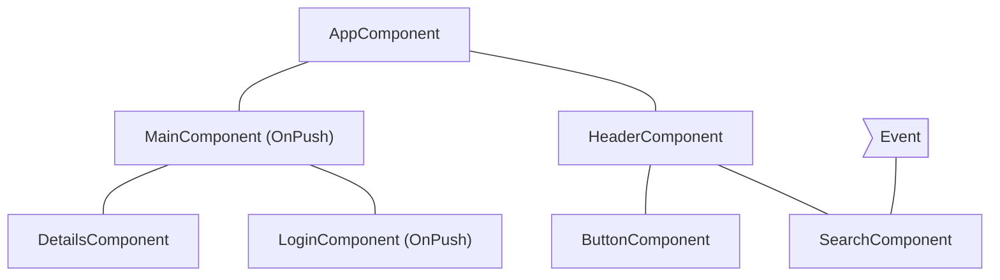
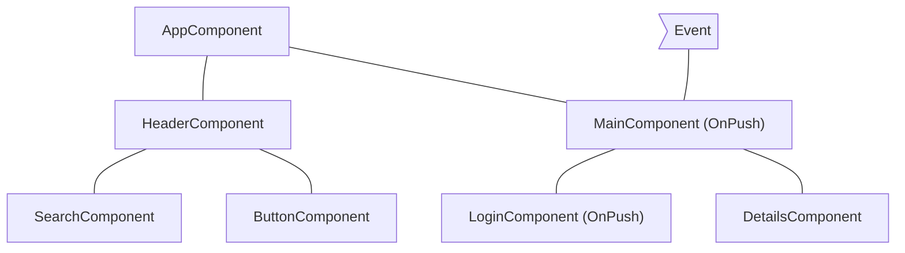
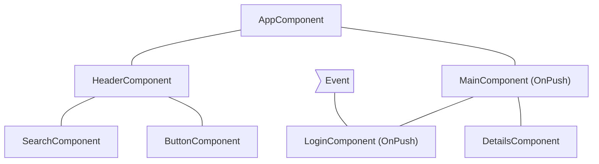
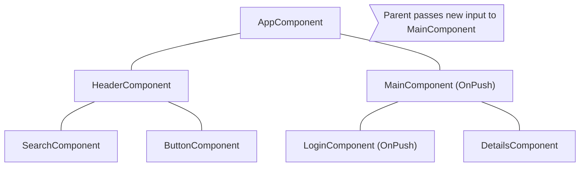

# Best Practices

(From a11y.md)

## Accessibility in Angular

The web is used by a wide variety of people, including those who have visual or motor impairments.
A variety of assistive technologies are available that make it much easier for these groups to interact with web-based software applications.
Also, designing an application to be more accessible generally improves the user experience for all users.

For an in-depth introduction to issues and techniques for designing accessible applications, see Google's web.dev [Learn Accessibility](https://web.dev/learn/accessibility/) course.

This page discusses best practices for designing Angular applications that work well for all users, including those who rely on assistive technologies.

### Accessibility attributes

<!-- TODO: add link once attribute binding guide is implemented -->
Building accessible web experience often involves setting [Accessible Rich Internet Applications \(ARIA\) attributes](https://web.dev/learn/accessibility/aria-html/) to provide semantic meaning where it might otherwise be missing.
Use attribute binding template syntax to control the values of accessibility-related attributes.

When binding to ARIA attributes in Angular, you must use the `attr.` prefix. The ARIA specification depends specifically on HTML attributes rather than properties of DOM elements.

<docs-code language="html">
<!-- Use attr. when binding to an ARIA attribute -->
<button [attr.aria-label]="myActionLabel">…</button>
</docs-code>

Note: This syntax is only necessary for attribute *bindings*.
Static ARIA attributes require no extra syntax.

<docs-code language="html">
<!-- Static ARIA attributes require no extra syntax -->
<button aria-label="Save document">…</button>
</docs-code>

HELPFUL: By convention, HTML attributes use lowercase names \(`tabindex`\), while properties use camelCase names \(`tabIndex`\).

<!-- TODO: add link once attribute binding guide implemented -->
See the [Binding syntax guide](guide/templates) for more background on the difference between attributes and properties.

### Angular UI components

The [Angular Material](https://material.angular.io) library, which is maintained by the Angular team, is a suite of reusable UI components that aims to be fully accessible.
The [Component Development Kit (CDK)](https://material.angular.io/cdk/categories) includes the `a11y` package that provides tools to support various areas of accessibility.
For example:

* `LiveAnnouncer` is used to announce messages for screen-reader users using an `aria-live` region.
    See the W3C documentation for more information on [aria-live regions](https://www.w3.org/WAI/PF/aria-1.1/states_and_properties#aria-live).

* The `cdkTrapFocus` directive traps Tab-key focus within an element.
    Use it to create accessible experience for components such as modal dialogs, where focus must be constrained.

For full details of these and other tools, see the [Angular CDK accessibility overview](https://material.angular.io/cdk/a11y/overview).

#### Augmenting native elements

Native HTML elements capture several standard interaction patterns that are important to accessibility.
When authoring Angular components, you should re-use these native elements directly when possible, rather than re-implementing well-supported behaviors.

For example, instead of creating a custom element for a new variety of button, create a component that uses an attribute selector with a native `<button>` element.
This most commonly applies to `<button>` and `<a>`, but can be used with many other types of element.

You can see examples of this pattern in Angular Material:
[`MatButton`](https://github.com/angular/components/blob/main/src/material/button/button.ts#L33C3-L36C5), [`MatTabNav`](https://github.com/angular/components/blob/main/src/material/tabs/tab-nav-bar/tab-nav-bar.ts#L62), and [`MatTable`](https://github.com/angular/components/blob/main/src/material/table/table.ts#L40).

#### Using containers for native elements

Sometimes using the appropriate native element requires a container element.
For example, the native `<input>` element cannot have children, so any custom text entry components need to wrap an `<input>` with extra elements.
By just including `<input>` in your custom component's template, it's impossible for your component's users  to set arbitrary properties and attributes to the `<input>` element.
Instead, create a container component that uses content projection to include the native control in the component's API.

You can see [`MatFormField`](https://material.angular.io/components/form-field/overview) as an example of this pattern.

### Case study: Building a custom progress bar

The following example shows how to make a progress bar accessible by using host binding to control accessibility-related attributes.

* The component defines an accessibility-enabled element with both the standard HTML attribute `role`, and ARIA attributes.
    The ARIA attribute `aria-valuenow` is bound to the user's input.
* In the template, the `aria-label` attribute ensures that the control is accessible to screen readers.

<docs-code-multifile>
  <docs-code
    path="adev/src/content/examples/accessibility/src/app/progress-bar.component.ts"
    language="ts"
    linenums
    highlight="[12, 20]"/>
  <docs-code
    path="adev/src/content/examples/accessibility/src/app/app.component.html"
    language="html"
    linenums
    highlight="[8, 9]"/>
</docs-code-multifile>

### Routing

#### Focus management after navigation

Tracking and controlling [focus](https://web.dev/learn/accessibility/focus/) in a UI is an important consideration in designing for accessibility.
When using Angular routing, you should decide where page focus goes upon navigation.

To avoid relying solely on visual cues, you need to make sure your routing code updates focus after page navigation.
Use the `NavigationEnd` event from the `Router` service to know when to update focus.

The following example shows how to find and focus the main content header in the DOM after navigation.

<docs-code language="typescript">

router.events.pipe(filter(e => e instanceof NavigationEnd)).subscribe(() => {
  const mainHeader = document.querySelector('#main-content-header')
  if (mainHeader) {
    mainHeader.focus();
  }
});

</docs-code>

In a real application, the element that receives focus depends on your specific application structure and layout.
The focused element should put users in a position to immediately move into the main content that has just been routed into view.
You should avoid situations where focus returns to the `body` element after a route change.

#### Active links identification

CSS classes applied to active `RouterLink` elements, such as `RouterLinkActive`, provide a visual cue to identify the active link.
Unfortunately, a visual cue doesn't help blind or visually impaired users.
Applying the `aria-current` attribute to the element can help identify the active link.
For more information, see [Mozilla Developer Network \(MDN\) aria-current](https://developer.mozilla.org/docs/Web/Accessibility/ARIA/Attributes/aria-current)).

The `RouterLinkActive` directive provides the `ariaCurrentWhenActive` input which sets the `aria-current` to a specified value when the link becomes active.

The following example shows how to apply the `active-page` class to active links as well as setting their `aria-current` attribute to `"page"` when they are active:

```angular-html
<nav>
  <a routerLink="home"
      routerLinkActive="active-page"
      ariaCurrentWhenActive="page">
    Home
  </a>
  <a routerLink="about"
      routerLinkActive="active-page"
      ariaCurrentWhenActive="page">
    About
  </a>
  <a routerLink="shop"
      routerLinkActive="active-page"
      ariaCurrentWhenActive="page">
    Shop
  </a>
</nav>
```

<!-- vale Angular.Angular_Spelling = NO -->

### More information

* [Accessibility - Google Web Fundamentals](https://developers.google.com/web/fundamentals/accessibility)
* [ARIA specification and authoring practices](https://www.w3.org/TR/wai-aria)
* [Material Design - Accessibility](https://material.io/design/usability/accessibility.html)
* [Smashing Magazine](https://www.smashingmagazine.com/search/?q=accessibility)
* [Inclusive Components](https://inclusive-components.design)
* [Accessibility Resources and Code Examples](https://dequeuniversity.com/resources)
* [W3C - Web Accessibility Initiative](https://www.w3.org/WAI/people-use-web)
* [Rob Dodson A11ycasts](https://www.youtube.com/watch?v=HtTyRajRuyY)
* [Angular ESLint](https://github.com/angular-eslint/angular-eslint#functionality) provides linting rules that can help you make sure your code meets accessibility standards.

<!-- vale Angular.Angular_Spelling = YES -->

Books

<!-- vale Angular.Google_Quotes = NO -->

* "A Web for Everyone: Designing Accessible User Experiences," Sarah Horton and Whitney Quesenbery
* "Inclusive Design Patterns," Heydon Pickering

<!-- vale Angular.Google_Quotes = YES -->

---


(From overview.md)

## Runtime performance optimization

Fast rendering is critical for Angular and we've built the framework with a lot of optimizations in mind to help you develop performant apps. To better understand the performance of your app we offer [Angular DevTools](tools/devtools) and a [video guide](https://www.youtube.com/watch?v=FjyX_hkscII) on how to use Chrome DevTools for profiling. In this section we cover the most common performance optimization techniques.

**Change detection** is the process through which Angular checks to see whether your application state has changed, and if any DOM needs to be updated. At a high level, Angular walks your components from top to bottom, looking for changes. Angular runs its change detection mechanism periodically so that changes to the data model are reflected in an application’s view. Change detection can be triggered either manually or through an asynchronous event (for example, a user interaction or an XMLHttpRequest completion).

Change detection is highly optimized and performant, but it can still cause slowdowns if the application runs it too frequently.

In this guide, you’ll learn how to control and optimize the change detection mechanism by skipping parts of your application and running change detection only when necessary.

Watch this video if you prefer to learn more about performance optimizations in a media format:

<docs-video src="https://www.youtube.com/embed/f8sA-i6gkGQ"/>

---


(From skipping-subtrees.md)

## Skipping component subtrees

JavaScript, by default, uses mutable data structures that you can reference from multiple different components. Angular runs change detection over your entire component tree to make sure that the most up-to-date state of your data structures is reflected in the DOM.

Change detection is sufficiently fast for most applications. However, when an application has an especially large component tree, running change detection across the whole application can cause performance issues. You can address this by configuring change detection to only run on a subset of the component tree.

If you are confident that a part of the application is not affected by a state change, you can use [OnPush](/api/core/ChangeDetectionStrategy) to skip change detection in an entire component subtree.

### Using `OnPush`

OnPush change detection instructs Angular to run change detection for a component subtree **only** when:

* The root component of the subtree receives new inputs as the result of a template binding. Angular compares the current and past value of the input with `==`.
* Angular handles an event _(for example using event binding, output binding, or `@HostListener` )_ in the subtree's root component or any of its children whether they are using OnPush change detection or not.

You can set the change detection strategy of a component to `OnPush` in the `@Component` decorator:

```ts
import { ChangeDetectionStrategy, Component } from '@angular/core';
@Component({
  changeDetection: ChangeDetectionStrategy.OnPush,
})
export class MyComponent {}
```

### Common change detection scenarios

This section examines several common change detection scenarios to illustrate Angular's behavior.

#### An event is handled by a component with default change detection

If Angular handles an event within a component without `OnPush` strategy, the framework executes change detection on the entire component tree. Angular will skip descendant component subtrees with roots using `OnPush`, which have not received new inputs.

As an example, if we set the change detection strategy of `MainComponent` to `OnPush` and the user interacts with a component outside the subtree with root `MainComponent`, Angular will check all the pink components from the diagram below (`AppComponent`, `HeaderComponent`, `SearchComponent`, `ButtonComponent`) unless `MainComponent` receives new inputs:



### An event is handled by a component with OnPush

If Angular handles an event within a component with OnPush strategy, the framework will execute change detection within the entire component tree. Angular will ignore component subtrees with roots using OnPush, which have not received new inputs and are outside the component which handled the event.

As an example, if Angular handles an event within `MainComponent`, the framework will run change detection in the entire component tree. Angular will ignore the subtree with root `LoginComponent` because it has `OnPush` and the event happened outside of its scope.



### An event is handled by a descendant of a component with OnPush

If Angular handles an event in a component with OnPush, the framework will execute change detection in the entire component tree, including the component’s ancestors.

As an example, in the diagram below, Angular handles an event in `LoginComponent` which uses OnPush. Angular will invoke change detection in the entire component subtree including `MainComponent` (`LoginComponent`’s parent), even though `MainComponent` has `OnPush` as well. Angular checks `MainComponent` as well because `LoginComponent` is part of its view.



### New inputs to component with OnPush

Angular will run change detection within a child component with `OnPush` when setting an input property as result of a template binding.

For example, in the diagram below, `AppComponent` passes a new input to `MainComponent`, which has `OnPush`. Angular will run change detection in `MainComponent` but will not run change detection in `LoginComponent`, which also has `OnPush`, unless it receives new inputs as well.



### Edge cases

* **Modifying input properties in TypeScript code**. When you use an API like `@ViewChild` or `@ContentChild` to get a reference to a component in TypeScript and manually modify an `@Input` property, Angular will not automatically run change detection for OnPush components. If you need Angular to run change detection, you can inject `ChangeDetectorRef` in your component and call `changeDetectorRef.markForCheck()` to tell Angular to schedule a change detection.
* **Modifying object references**. In case an input receives a mutable object as value and you modify the object but preserve the reference, Angular will not invoke change detection. That’s the expected behavior because the previous and the current value of the input point to the same reference.

---


(From slow-computations.md)

## Slow computations

On every change detection cycle, Angular synchronously:

* Evaluates all template expressions in all components, unless specified otherwise, based on that each component's detection strategy
* Executes the `ngDoCheck`, `ngAfterContentChecked`, `ngAfterViewChecked`, and `ngOnChanges` lifecycle hooks.
A single slow computation within a template or a lifecycle hook can slow down the entire change detection process because Angular runs the computations sequentially.

### Identifying slow computations

You can identify heavy computations with Angular DevTools’ profiler. In the performance timeline, click a bar to preview a particular change detection cycle. This displays a bar chart, which shows how long the framework spent in change detection for each component. When you click a component, you can preview how long Angular spent  evaluating its template and lifecycle hooks.


For example, in the preceding screenshot, the second recorded change detection cycle is selected. Angular spent over 573 ms on this cycle, with the most time spent in the `EmployeeListComponent`. In the details panel, you can see that Angular spent over 297 ms evaluating the template of the `EmployeeListComponent`.

### Optimizing slow computations

Here are several techniques to remove slow computations:

* **Optimizing the underlying algorithm**. This is the recommended approach. If you can speed up the algorithm that is causing the problem, you can speed up the entire change detection mechanism.
* **Caching using pure pipes**. You can move the heavy computation to a pure [pipe](guide/pipes). Angular reevaluates a pure pipe only if it detects that its inputs have changed, compared to the previous time Angular called it.
* **Using memoization**. [Memoization](https://en.wikipedia.org/wiki/Memoization) is a similar technique to pure pipes, with the difference that pure pipes preserve only the last result from the computation where memoization could store multiple results.
* **Avoid repaints/reflows in lifecycle hooks**. Certain [operations](https://web.dev/avoid-large-complex-layouts-and-layout-thrashing/) cause the browser to either synchronously recalculate the layout of the page or re-render it. Since reflows and repaints are generally slow, you want to avoid performing them in every change detection cycle.

Pure pipes and memoization have different trade-offs. Pure pipes are an Angular built-in concept compared to memoization, which is a general software engineering practice for caching function results. The memory overhead of memoization could be significant if you invoke the heavy computation frequently with different arguments.

---


(From zone-pollution.md)

## Resolving zone pollution

**Zone.js** is a signaling mechanism that Angular uses to detect when an application state might have changed. It captures asynchronous operations like `setTimeout`, network requests, and event listeners. Angular schedules change detection based on signals from Zone.js.

In some cases scheduled [tasks](https://developer.mozilla.org/docs/Web/API/HTML_DOM_API/Microtask_guide#tasks) or [microtasks](https://developer.mozilla.org/docs/Web/API/HTML_DOM_API/Microtask_guide#microtasks) don’t make any changes in the data model, which makes running change detection unnecessary. Common examples are:

* `requestAnimationFrame`, `setTimeout` or `setInterval`
* Task or microtask scheduling by third-party libraries

This section covers how to identify such conditions, and how to run code outside the Angular zone to avoid unnecessary change detection calls.

### Identifying unnecessary change detection calls

You can detect unnecessary change detection calls using Angular DevTools. Often they appear as consecutive bars in the profiler’s timeline with source `setTimeout`, `setInterval`, `requestAnimationFrame`, or an event handler. When you have limited calls within your application of these APIs, the change detection invocation is usually caused by a third-party library.


In the image above, there is a series of change detection calls triggered by event handlers associated with an element. That’s a common challenge when using third-party, non-native Angular components, which do not alter the default behavior of `NgZone`.

### Run tasks outside `NgZone`

In such cases, you can instruct Angular to avoid calling change detection for tasks scheduled by a given piece of code using [NgZone](/api/core/NgZone).

<docs-code header="Run outside of the Zone" language='ts' linenums>
import { Component, NgZone, OnInit } from '@angular/core';

@Component(...)
class AppComponent implements OnInit {
  constructor(private ngZone: NgZone) {}
  ngOnInit() {
    this.ngZone.runOutsideAngular(() => setInterval(pollForUpdates), 500);
  }
}
</docs-code>

The preceding snippet instructs Angular to call `setInterval` outside the Angular Zone and skip running change detection after `pollForUpdates` runs.

Third-party libraries commonly trigger unnecessary change detection cycles when their APIs are invoked within the Angular zone. This phenomenon particularly affects libraries that set up event listeners or initiate other tasks (such as timers, XHR requests, etc.). Avoid these extra cycles by calling library APIs outside the Angular zone:

<docs-code header="Move the plot initialization outside of the Zone" language='ts' linenums>
import { Component, NgZone, OnInit } from '@angular/core';
import * as Plotly from 'plotly.js-dist-min';

@Component(...)
class AppComponent implements OnInit {

  constructor(private ngZone: NgZone) {}

  ngOnInit() {
    this.ngZone.runOutsideAngular(() => {
      Plotly.newPlot('chart', data);
    });
  }
}
</docs-code>

Running `Plotly.newPlot('chart', data);` within `runOutsideAngular` instructs the framework that it shouldn’t run change detection after the execution of tasks scheduled by the initialization logic.

For example, if `Plotly.newPlot('chart', data)` adds event listeners to a DOM element, Angular does not run change detection after the execution of their handlers.

But sometimes, you may need to listen to events dispatched by third-party APIs. In such cases, it's important to remember that those event listeners will also execute outside of the Angular zone if the initialization logic was done there:

<docs-code header="Check whether the handler is called outside of the Zone" language='ts' linenums>
import { Component, NgZone, OnInit, output } from '@angular/core';
import * as Plotly from 'plotly.js-dist-min';

@Component(...)
class AppComponent implements OnInit {
  plotlyClick = output<Plotly.PlotMouseEvent>();

  constructor(private ngZone: NgZone) {}

  ngOnInit() {
    this.ngZone.runOutsideAngular(() => {
      this.createPlotly();
    });
  }

  private async createPlotly() {
    const plotly = await Plotly.newPlot('chart', data);

    plotly.on('plotly_click', (event: Plotly.PlotMouseEvent) => {
      // This handler will be called outside of the Angular zone because
      // the initialization logic is also called outside of the zone. To check
      // whether we're in the Angular zone, we can call the following:
      console.log(NgZone.isInAngularZone());
      this.plotlyClick.emit(event);
    });
  }
}
</docs-code>

If you need to dispatch events to parent components and execute specific view update logic, you should consider re-entering the Angular zone to instruct the framework to run change detection or run change detection manually:

<docs-code header="Re-enter the Angular zone when dispatching event" language='ts' linenums>
import { Component, NgZone, OnInit, output } from '@angular/core';
import * as Plotly from 'plotly.js-dist-min';

@Component(...)
class AppComponent implements OnInit {
  plotlyClick = output<Plotly.PlotMouseEvent>();

  constructor(private ngZone: NgZone) {}

  ngOnInit() {
    this.ngZone.runOutsideAngular(() => {
      this.createPlotly();
    });
  }

  private async createPlotly() {
    const plotly = await Plotly.newPlot('chart', data);

    plotly.on('plotly_click', (event: Plotly.PlotMouseEvent) => {
      this.ngZone.run(() => {
        this.plotlyClick.emit(event);
      });
    });
  }
}
</docs-code>

The scenario of dispatching events outside of the Angular zone may also arise. It's important to remember that triggering change detection (for example, manually) may result to the creation/update of views outside of the Angular zone.

---


(From style-guide.md)

## Angular coding style guide

Looking for an opinionated guide to Angular syntax, conventions, and application structure?
Step right in.
This style guide presents preferred conventions and, as importantly, explains why.

### Style vocabulary

Each guideline describes either a good or bad practice, and all have a consistent presentation.

The wording of each guideline indicates how strong the recommendation is.

**Do** is one that should always be followed.
*Always* might be a bit too strong of a word.
Guidelines that literally should always be followed are extremely rare.
On the other hand, you need a really unusual case for breaking a *Do* guideline.

**Consider** guidelines should generally be followed.
If you fully understand the meaning behind the guideline and have a good reason to deviate, then do so.
Aim to be consistent.

**Avoid** indicates something you should almost never do.
Code examples to *avoid* have an unmistakable red header.

**Why**? <br />
Gives reasons for following the previous recommendations.

### File structure conventions

Some code examples display a file that has one or more similarly named companion files.
For example, `hero.component.ts` and `hero.component.html`.

The guideline uses the shortcut `hero.component.ts|html|css|spec` to represent those various files.
Using this shortcut makes this guide's file structures easier to read and more terse.

### Single responsibility

Apply the [*single responsibility principle (SRP)*](https://wikipedia.org/wiki/Single_responsibility_principle) to all components, services, and other symbols.
This helps make the application cleaner, easier to read and maintain, and more testable.

#### Rule of One

##### Style 01-01

**Do** define one thing, such as a service or component, per file.

**Consider** limiting files to 400 lines of code.

**Why**? <br />
One component per file makes it far easier to read, maintain, and avoid collisions with teams in source control.

**Why**? <br />
One component per file avoids hidden bugs that often arise when combining components in a file where they may share variables, create unwanted closures, or unwanted coupling with dependencies.

**Why**? <br />
A single component can be the default export for its file which facilitates lazy loading with the router.

The key is to make the code more reusable, easier to read, and less mistake-prone.

The following *negative* example defines the `AppComponent`, bootstraps the app,
defines the `Hero` model object, and loads heroes from the server all in the same file.
*Don't do this*.

<docs-code path="adev/src/content/examples/styleguide/src/01-01/app/heroes/hero.component.avoid.ts" language="typescript" header="app/heroes/hero.component.ts"/>

It is a better practice to redistribute the component and its
supporting classes into their own, dedicated files.

<docs-code-multifile>
    <docs-code header="main.ts" path="adev/src/content/examples/styleguide/src/01-01/main.ts"/>
    <docs-code header="app/app.module.ts" path="adev/src/content/examples/styleguide/src/01-01/app/app.module.ts"/>
    <docs-code header="app/app.component.ts" path="adev/src/content/examples/styleguide/src/01-01/app/app.component.ts"/>
    <docs-code header="app/heroes/heroes.component.ts" path="adev/src/content/examples/styleguide/src/01-01/app/heroes/heroes.component.ts"/>
    <docs-code header="app/heroes/shared/hero.service.ts" path="adev/src/content/examples/styleguide/src/01-01/app/heroes/shared/hero.service.ts"/>
    <docs-code header="app/heroes/shared/hero.model.ts" path="adev/src/content/examples/styleguide/src/01-01/app/heroes/shared/hero.model.ts"/>
    <docs-code header="app/heroes/shared/mock-heroes.ts" path="adev/src/content/examples/styleguide/src/01-01/app/heroes/shared/mock-heroes.ts"/>
</docs-code-multifile>

As the application grows, this rule becomes even more important.

### Naming

Naming conventions are hugely important to maintainability and readability.
This guide recommends naming conventions for the file name and the symbol name.

#### General Naming Guidelines

##### Style 02-01

**Do** use consistent names for all symbols.

**Do** follow a pattern that describes the symbol's feature then its type.
The recommended pattern is `feature.type.ts`.

**Why**? <br />
Naming conventions help provide a consistent way to find content at a glance.
Consistency within the project is vital.
Consistency with a team is important.
Consistency across a company provides tremendous efficiency.

**Why**? <br />
The naming conventions should help find desired code faster and make it easier to understand.

**Why**? <br />
Names of folders and files should clearly convey their intent.
For example, `app/heroes/hero-list.component.ts` may contain a component that manages a list of heroes.

#### Separate file names with dots and dashes

##### Style 02-02

**Do** use dashes to separate words in the descriptive name.

**Do** use dots to separate the descriptive name from the type.

**Do** use consistent type names for all components following a pattern that describes the component's feature then its type.
A recommended pattern is `feature.type.ts`.

**Do** use conventional type names including `.service`, `.component`, `.pipe`, `.module`, and `.directive`.
Invent additional type names if you must but take care not to create too many.

**Why**? <br />
Type names provide a consistent way to quickly identify what is in the file.

**Why**? <br />
Type names make it easy to find a specific file type using an editor or IDE's fuzzy search techniques.

**Why**? <br />
Unabbreviated type names such as `.service` are descriptive and unambiguous.
Abbreviations such as `.srv`, `.svc`, and `.serv` can be confusing.

**Why**? <br />
Type names provide pattern matching for any automated tasks.

#### Symbols and file names

##### Style 02-03

**Do** use consistent names for all assets named after what they represent.

**Do** use upper camel case for class names.

**Do** match the name of the symbol to the name of the file.

**Do** append the symbol name with the conventional suffix \(such as `Component`, `Directive`, `Module`, `Pipe`, or `Service`\) for a thing of that type.

**Do** give the filename the conventional suffix \(such as `.component.ts`, `.directive.ts`, `.module.ts`, `.pipe.ts`, or `.service.ts`\) for a file of that type.

**Why**? <br />
Consistent conventions make it easy to quickly identify and reference assets of different types.

| Symbol name                                                                                                                                                                          | File name |
|:---                                                                                                                                                                                  |:---       |
| <docs-code hideCopy language="typescript"> @Component({ … }) <br>export class AppComponent { } </docs-code>                             | app.component.ts |
| <docs-code hideCopy language="typescript"> @Component({ … }) <br>export class HeroesComponent { } </docs-code>                          | heroes.component.ts |
| <docs-code hideCopy language="typescript"> @Component({ … }) <br>export class HeroListComponent { } </docs-code>                        | hero-list.component.ts |
| <docs-code hideCopy language="typescript"> @Component({ … }) <br>export class HeroDetailComponent { } </docs-code>                      | hero-detail.component.ts |
| <docs-code hideCopy language="typescript"> @Directive({ … }) <br>export class ValidationDirective { } </docs-code>                      | validation.directive.ts |
| <docs-code hideCopy language="typescript"> @NgModule({ … }) <br>export class AppModule </docs-code>                                     | app.module.ts |
| <docs-code hideCopy language="typescript"> @Pipe({ name: 'initCaps' }) <br>export class InitCapsPipe implements PipeTransform { } </docs-code> | init-caps.pipe.ts |
| <docs-code hideCopy language="typescript"> @Injectable() <br>export class UserProfileService { } </docs-code>                                  | user-profile.service.ts |

#### Service names

##### Style 02-04

**Do** use consistent names for all services named after their feature.

**Do** suffix a service class name with `Service`.
For example, something that gets data or heroes should be called a `DataService` or a `HeroService`.

A few terms are unambiguously services.
They typically indicate agency by ending in "-er".
You may prefer to name a service that logs messages `Logger` rather than `LoggerService`.
Decide if this exception is agreeable in your project.
As always, strive for consistency.

**Why**? <br />
Provides a consistent way to quickly identify and reference services.

**Why**? <br />
Clear service names such as `Logger` do not require a suffix.

**Why**? <br />
Service names such as `Credit` are nouns and require a suffix and should be named with a suffix when it is not obvious if it is a service or something else.

| Symbol name                                                                                                                                      | File name |
|:---                                                                                                                                              |:---       |
| <docs-code hideCopy language="typescript"> @Injectable() <br>export class HeroDataService { } </docs-code> | hero-data.service.ts |
| <docs-code hideCopy language="typescript"> @Injectable() <br>export class CreditService { } </docs-code>   | credit.service.ts    |
| <docs-code hideCopy language="typescript"> @Injectable() <br>export class Logger { } </docs-code>          | logger.service.ts    |

#### Bootstrapping

##### Style 02-05

**Do** put bootstrapping and platform logic for the application in a file named `main.ts`.

**Do** include error handling in the bootstrapping logic.

**Avoid** putting application logic in `main.ts`.
Instead, consider placing it in a component or service.

**Why**? <br />
Follows a consistent convention for the startup logic of an app.

**Why**? <br />
Follows a familiar convention from other technology platforms.

<docs-code header="main.ts" path="adev/src/content/examples/styleguide/src/02-05/main.ts"/>

#### Component selectors

##### Style 05-02

**Do** use *dashed-case* or *kebab-case* for naming the element selectors of components.

**Why**? <br />
Keeps the element names consistent with the specification for [Custom Elements](https://www.w3.org/TR/custom-elements).

<docs-code header="app/heroes/shared/hero-button/hero-button.component.ts" path="adev/src/content/examples/styleguide/src/05-02/app/heroes/shared/hero-button/hero-button.component.avoid.ts" visibleRegion="example"/>

<docs-code-multifile>
    <docs-code header="app/heroes/shared/hero-button/hero-button.component.ts" path="adev/src/content/examples/styleguide/src/05-02/app/heroes/shared/hero-button/hero-button.component.ts" visibleRegion="example"/>
    <docs-code header="app/app.component.html" path="adev/src/content/examples/styleguide/src/05-02/app/app.component.html"/>
</docs-code-multifile>

#### Component custom prefix

##### Style 02-07

**Do** use a hyphenated, lowercase element selector value; for example, `admin-users`.

**Do** use a prefix that identifies the feature area or the application itself.

**Why**? <br />
Prevents element name collisions with components in other applications and with native HTML elements.

**Why**? <br />
Makes it easier to promote and share the component in other applications.

**Why**? <br />
Components are easy to identify in the DOM.

<docs-code header="app/heroes/hero.component.ts" path="adev/src/content/examples/styleguide/src/02-07/app/heroes/hero.component.avoid.ts" visibleRegion="example"/>

<docs-code header="app/users/users.component.ts" path="adev/src/content/examples/styleguide/src/02-07/app/users/users.component.avoid.ts" visibleRegion="example"/>

<docs-code header="app/heroes/hero.component.ts" path="adev/src/content/examples/styleguide/src/02-07/app/heroes/hero.component.ts" visibleRegion="example"/>

<docs-code header="app/users/users.component.ts" path="adev/src/content/examples/styleguide/src/02-07/app/users/users.component.ts" visibleRegion="example"/>

#### Directive selectors

##### Style 02-06

**Do** Use lower camel case for naming the selectors of directives.

**Why**? <br />
Keeps the names of the properties defined in the directives that are bound to the view consistent with the attribute names.

**Why**? <br />
The Angular HTML parser is case-sensitive and recognizes lower camel case.

#### Directive custom prefix

##### Style 02-08

**Do** spell non-element selectors in lower camel case unless the selector is meant to match a native HTML attribute.

**Don't** prefix a directive name with `ng` because that prefix is reserved for Angular and using it could cause bugs that are difficult to diagnose.

**Why**? <br />
Prevents name collisions.

**Why**? <br />
Directives are easily identified.

<docs-code header="app/shared/validate.directive.ts" path="adev/src/content/examples/styleguide/src/02-08/app/shared/validate.directive.avoid.ts" visibleRegion="example"/>

<docs-code header="app/shared/validate.directive.ts" path="adev/src/content/examples/styleguide/src/02-08/app/shared/validate.directive.ts" visibleRegion="example"/>

#### Pipe names

##### Style 02-09

**Do** use consistent names for all pipes, named after their feature.
The pipe class name should use `UpperCamelCase` \(the general convention for class names\), and the corresponding `name` string should use *lowerCamelCase*.
The `name` string cannot use hyphens \("dash-case" or "kebab-case"\).

**Why**? <br />
Provides a consistent way to quickly identify and reference pipes.

| Symbol name                                                                                                                                                                          | File name |
|:---                                                                                                                                                                                  |:---       |
| <docs-code hideCopy language="typescript"> @Pipe({ name: 'ellipsis' }) <br>export class EllipsisPipe implements PipeTransform { } </docs-code> | ellipsis.pipe.ts  |
| <docs-code hideCopy language="typescript"> @Pipe({ name: 'initCaps' }) <br>export class InitCapsPipe implements PipeTransform { } </docs-code> | init-caps.pipe.ts |

#### Unit test file names

##### Style 02-10

**Do** name test specification files the same as the component they test.

**Do** name test specification files with a suffix of `.spec`.

**Why**? <br />
Provides a consistent way to quickly identify tests.

**Why**? <br />
Provides pattern matching for [karma](https://karma-runner.github.io) or other test runners.

| Test type  | File names |
|:---        |:---        |
| Components | heroes.component.spec.ts <br /> hero-list.component.spec.ts <br /> hero-detail.component.spec.ts |
| Services   | logger.service.spec.ts <br /> hero.service.spec.ts <br /> filter-text.service.spec.ts            |
| Pipes      | ellipsis.pipe.spec.ts <br /> init-caps.pipe.spec.ts                                              |

### Application structure and NgModules

Have a near-term view of implementation and a long-term vision.
Start small but keep in mind where the application is heading.

All of the application's code goes in a folder named `src`.
All feature areas are in their own folder.

All content is one asset per file.
Each component, service, and pipe is in its own file.
All third party vendor scripts are stored in another folder and not in the `src` folder.
Use the naming conventions for files in this guide.

#### Overall structural guidelines

##### Style 04-06

**Do** start small but keep in mind where the application is heading down the road.

**Do** have a near term view of implementation and a long term vision.

**Do** put all of the application's code in a folder named `src`.

**Consider** creating a folder for a component when it has multiple accompanying files \(`.ts`, `.html`, `.css`, and `.spec`\).

**Why**? <br />
Helps keep the application structure small and easy to maintain in the early stages, while being easy to evolve as the application grows.

**Why**? <br />
Components often have four files \(for example, `*.html`, `*.css`, `*.ts`, and `*.spec.ts`\) and can clutter a folder quickly.

Here is a compliant folder and file structure:

```markdown
project root
├── src
│ ├── app
│ │ ├── core
│ │ │ └── exception.service.ts|spec.ts
│ │ │ └── user-profile.service.ts|spec.ts
│ │ ├── heroes
│ │ │ ├── hero
│ │ │ │ └── hero.component.ts|html|css|spec.ts
│ │ │ ├── hero-list
│ │ │ │ └── hero-list.component.ts|html|css|spec.ts
│ │ │ ├── shared
│ │ │ │ └── hero-button.component.ts|html|css|spec.ts
│ │ │ │ └── hero.model.ts
│ │ │ │ └── hero.service.ts|spec.ts
│ │ │ └── heroes.component.ts|html|css|spec.ts
│ │ │ └── heroes.routes.ts
│ │ ├── shared
│ │ │ └── init-caps.pipe.ts|spec.ts
│ │ │ └── filter-text.component.ts|spec.ts
│ │ │ └── filter-text.service.ts|spec.ts
│ │ ├── villains
│ │ │ ├── villain
│ │ │ │ └── …
│ │ │ ├── villain-list
│ │ │ │ └── …
│ │ │ ├── shared
│ │ │ │ └── …
│ │ │ └── villains.component.ts|html|css|spec.ts
│ │ │ └── villains.module.ts
│ │ │ └── villains-routing.module.ts
│ │ └── app.component.ts|html|css|spec.ts
│ │ └── app.routes.ts
│ └── main.ts
│ └── index.html
│ └── …
└── node_modules/…
└── …
```

HELPFUL: While components in dedicated folders are widely preferred, another option for small applications is to keep components flat \(not in a dedicated folder\).
This adds up to four files to the existing folder, but also reduces the folder nesting.
Whatever you choose, be consistent.

#### *Folders-by-feature* structure

##### Style 04-07

**Do** create folders named for the feature area they represent.

**Why**? <br />
A developer can locate the code and identify what each file represents at a glance.
The structure is as flat as it can be and there are no repetitive or redundant names.

**Why**? <br />
Helps reduce the application from becoming cluttered through organizing the content.

**Why**? <br />
When there are a lot of files, for example 10+, locating them is easier with a consistent folder structure and more difficult in a flat structure.

For more information, refer to [this folder and file structure example](#overall-structural-guidelines).

#### App *root module*

IMPORTANT: The following style guide recommendations are for applications based on `NgModule`. New applications should use standalone components, directives, and pipes instead.

##### Style 04-08

**Do** create an NgModule in the application's root folder, for example, in `/src/app` if creating a `NgModule` based app.

**Why**? <br />
Every `NgModule` based application requires at least one root NgModule.

**Consider** naming the root module `app.module.ts`.

**Why**? <br />
Makes it easier to locate and identify the root module.

<docs-code path="adev/src/content/examples/styleguide/src/04-08/app/app.module.ts" language="typescript" visibleRegion="example" header="app/app.module.ts"/>

#### Feature modules

##### Style 04-09

**Do** create an NgModule for all distinct features in an application; for example, a `Heroes` feature.

**Do** place the feature module in the same named folder as the feature area; for example, in `app/heroes`.

**Do** name the feature module file reflecting the name of the feature area and folder; for example, `app/heroes/heroes.module.ts`.

**Do** name the feature module symbol reflecting the name of the feature area, folder, and file; for example, `app/heroes/heroes.module.ts` defines `HeroesModule`.

**Why**? <br />
A feature module can expose or hide its implementation from other modules.

**Why**? <br />
A feature module identifies distinct sets of related components that comprise the feature area.

**Why**? <br />
A feature module can easily be routed to both eagerly and lazily.

**Why**? <br />
A feature module defines clear boundaries between specific functionality and other application features.

**Why**? <br />
A feature module helps clarify and make it easier to assign development responsibilities to different teams.

**Why**? <br />
A feature module can easily be isolated for testing.

#### Shared feature module

##### Style 04-10

**Do** create a feature module named `SharedModule` in a `shared` folder; for example, `app/shared/shared.module.ts` defines `SharedModule`.

**Do** declare components, directives, and pipes in a shared module when those items will be re-used and referenced by the components declared in other feature modules.

**Consider** using the name SharedModule when the contents of a shared
module are referenced across the entire application.

**Consider** *not* providing services in shared modules.
Services are usually singletons that are provided once for the entire application or in a particular feature module.
There are exceptions, however.
For example, in the sample code that follows, notice that the `SharedModule` provides `FilterTextService`.
This is acceptable here because the service is stateless;that is, the consumers of the service aren't impacted by new instances.

**Do** import all modules required by the assets in the `SharedModule`; for example, `CommonModule` and `FormsModule`.

**Why**? <br />
`SharedModule` will contain components, directives, and pipes that may need features from another common module; for example, `ngFor` in `CommonModule`.

**Do** declare all components, directives, and pipes in the `SharedModule`.

**Do** export all symbols from the `SharedModule` that other feature modules need to use.

**Why**? <br />
`SharedModule` exists to make commonly used components, directives, and pipes available for use in the templates of components in many other modules.

**Avoid** specifying app-wide singleton providers in a `SharedModule`.
Intentional singletons are OK.
Take care.

**Why**? <br />
A lazy loaded feature module that imports that shared module will make its own copy of the service and likely have undesirable results.

**Why**? <br />
You don't want each module to have its own separate instance of singleton services.
Yet there is a real danger of that happening if the `SharedModule` provides a service.

```markdown
project root
├──src
├──├──app
├──├──├── shared
├──├──├──└── shared.module.ts
├──├──├──└── init-caps.pipe.ts|spec.ts
├──├──├──└── filter-text.component.ts|spec.ts
├──├──├──└── filter-text.service.ts|spec.ts
├──├──└── app.component.ts|html|css|spec.ts
├──├──└── app.module.ts
├──├──└── app-routing.module.ts
├──└── main.ts
├──└── index.html
└── …
```

<docs-code-multifile>
    <docs-code header="app/shared/shared.module.ts" path="adev/src/content/examples/styleguide/src/04-10/app/shared/shared.module.ts"/>
    <docs-code header="app/shared/init-caps.pipe.ts" path="adev/src/content/examples/styleguide/src/04-10/app/shared/init-caps.pipe.ts"/>
    <docs-code header="app/shared/filter-text/filter-text.component.ts" path="adev/src/content/examples/styleguide/src/04-10/app/shared/filter-text/filter-text.component.ts"/>
    <docs-code header="app/shared/filter-text/filter-text.service.ts" path="adev/src/content/examples/styleguide/src/04-10/app/shared/filter-text/filter-text.service.ts"/>
    <docs-code header="app/heroes/heroes.component.ts" path="adev/src/content/examples/styleguide/src/04-10/app/heroes/heroes.component.ts"/>
    <docs-code header="app/heroes/heroes.component.html" path="adev/src/content/examples/styleguide/src/04-10/app/heroes/heroes.component.html"/>
</docs-code-multifile>

#### Lazy Loaded folders

##### Style 04-11

A distinct application feature or workflow may be *lazy loaded* or *loaded on demand* rather than when the application starts.

**Do** put the contents of lazy loaded features in a *lazy loaded folder*.
A typical *lazy loaded folder* contains a *routing component*, its child components, and their related assets.

**Why**? <br />
The folder makes it easy to identify and isolate the feature content.

### Components

#### Components as elements

##### Style 05-03

**Consider** giving components an *element* selector, as opposed to *attribute* or *class* selectors.

**Why**? <br />
Components have templates containing HTML and optional Angular template syntax.
They display content.
Developers place components on the page as they would native HTML elements and web components.

**Why**? <br />
It is easier to recognize that a symbol is a component by looking at the template's html.

HELPFUL: There are a few cases where you give a component an attribute, such as when you want to augment a built-in element.
For example, [Material Design](https://material.angular.io/components/button/overview) uses this technique with `<button mat-button>`.
However, you wouldn't use this technique on a custom element.

<docs-code header="app/heroes/hero-button/hero-button.component.ts" path="adev/src/content/examples/styleguide/src/05-03/app/heroes/shared/hero-button/hero-button.component.avoid.ts" visibleRegion="example"/>

<docs-code header="app/app.component.html" path="adev/src/content/examples/styleguide/src/05-03/app/app.component.avoid.html"/>

<docs-code-multifile>
    <docs-code header="app/heroes/shared/hero-button/hero-button.component.ts" path="adev/src/content/examples/styleguide/src/05-03/app/heroes/shared/hero-button/hero-button.component.ts" visibleRegion="example"/>
    <docs-code header="app/app.component.html" path="adev/src/content/examples/styleguide/src/05-03/app/app.component.html"/>
</docs-code-multifile>

#### Extract templates and styles to their own files

##### Style 05-04

**Do** extract templates and styles into a separate file, when more than 3 lines.

**Do** name the template file `[component-name].component.html`, where [component-name] is the component name.

**Do** name the style file `[component-name].component.css`, where [component-name] is the component name.

**Do** specify *component-relative* URLs, prefixed with `./`.

**Why**? <br />
Large, inline templates and styles obscure the component's purpose and implementation, reducing readability and maintainability.

**Why**? <br />
In most editors, syntax hints and code snippets aren't available when developing inline templates and styles.
The Angular TypeScript Language Service \(forthcoming\) promises to overcome this deficiency for HTML templates in those editors that support it; it won't help with CSS styles.

**Why**? <br />
A *component relative* URL requires no change when you move the component files, as long as the files stay together.

**Why**? <br />
The `./` prefix is standard syntax for relative URLs; don't depend on Angular's current ability to do without that prefix.

<docs-code header="app/heroes/heroes.component.ts" path="adev/src/content/examples/styleguide/src/05-04/app/heroes/heroes.component.avoid.ts" visibleRegion="example"/>

<docs-code-multifile>
    <docs-code header="app/heroes/heroes.component.ts" path="adev/src/content/examples/styleguide/src/05-04/app/heroes/heroes.component.ts" visibleRegion="example"/>
    <docs-code header="app/heroes/heroes.component.html" path="adev/src/content/examples/styleguide/src/05-04/app/heroes/heroes.component.html"/>
    <docs-code header="app/heroes/heroes.component.css" path="adev/src/content/examples/styleguide/src/05-04/app/heroes/heroes.component.css"/>
</docs-code-multifile>

#### Decorate `input` and `output` properties

##### Style 05-12

**Do** use the `@Input()` and `@Output()` class decorators instead of the `inputs` and `outputs` properties of the `@Directive` and `@Component` metadata:

**Consider** placing `@Input()` or `@Output()` on the same line as the property it decorates.

**Why**? <br />
It is easier and more readable to identify which properties in a class are inputs or outputs.

**Why**? <br />
If you ever need to rename the property or event name associated with `@Input()` or `@Output()`, you can modify it in a single place.

**Why**? <br />
The metadata declaration attached to the directive is shorter and thus more readable.

**Why**? <br />
Placing the decorator on the same line *usually* makes for shorter code and still easily identifies the property as an input or output.
Put it on the line above when doing so is clearly more readable.

<docs-code header="app/heroes/shared/hero-button/hero-button.component.ts" path="adev/src/content/examples/styleguide/src/05-12/app/heroes/shared/hero-button/hero-button.component.avoid.ts" visibleRegion="example"/>

<docs-code header="app/heroes/shared/hero-button/hero-button.component.ts" path="adev/src/content/examples/styleguide/src/05-12/app/heroes/shared/hero-button/hero-button.component.ts" visibleRegion="example"/>

#### Avoid aliasing `inputs` and `outputs`

##### Style 05-13

**Avoid** `input` and `output` aliases except when it serves an important purpose.

**Why**? <br />
Two names for the same property \(one private, one public\) is inherently confusing.

**Why**? <br />
You should use an alias when the directive name is also an `input` property,
and the directive name doesn't describe the property.

<docs-code header="app/heroes/shared/hero-button/hero-button.component.ts" path="adev/src/content/examples/styleguide/src/05-13/app/heroes/shared/hero-button/hero-button.component.avoid.ts" visibleRegion="example"/>

<docs-code header="app/app.component.html" path="adev/src/content/examples/styleguide/src/05-13/app/app.component.avoid.html"/>

<docs-code-multifile>
    <docs-code header="app/heroes/shared/hero-button/hero-button.component.ts" path="adev/src/content/examples/styleguide/src/05-13/app/heroes/shared/hero-button/hero-button.component.ts" visibleRegion="example"/>
    <docs-code header="app/heroes/shared/hero-button/hero-highlight.directive.ts" path="adev/src/content/examples/styleguide/src/05-13/app/heroes/shared/hero-highlight.directive.ts"/>
    <docs-code header="app/app.component.html" path="adev/src/content/examples/styleguide/src/05-13/app/app.component.html"/>
</docs-code-multifile>

#### Delegate complex component logic to services

##### Style 05-15

**Do** limit logic in a component to only that required for the view.
All other logic should be delegated to services.

**Do** move reusable logic to services and keep components simple and focused on their intended purpose.

**Why**? <br />
Logic may be reused by multiple components when placed within a service and exposed as a function.

**Why**? <br />
Logic in a service can more easily be isolated in a unit test, while the calling logic in the component can be easily mocked.

**Why**? <br />
Removes dependencies and hides implementation details from the component.

**Why**? <br />
Keeps the component slim, trim, and focused.

<docs-code header="app/heroes/hero-list/hero-list.component.ts" path="adev/src/content/examples/styleguide/src/05-15/app/heroes/hero-list/hero-list.component.avoid.ts"/>

<docs-code header="app/heroes/hero-list/hero-list.component.ts" path="adev/src/content/examples/styleguide/src/05-15/app/heroes/hero-list/hero-list.component.ts" visibleRegion="example"/>

#### Don't prefix `output` properties

##### Style 05-16

**Do** name events without the prefix `on`.

**Do** name event handler methods with the prefix `on` followed by the event name.

**Why**? <br />
This is consistent with built-in events such as button clicks.

**Why**? <br />
Angular allows for an [alternative syntax](guide/templates/binding) `on-*`.
If the event itself was prefixed with `on` this would result in an `on-onEvent` binding expression.

<docs-code header="app/heroes/hero.component.ts" path="adev/src/content/examples/styleguide/src/05-16/app/heroes/hero.component.avoid.ts" visibleRegion="example"/>

<docs-code header="app/app.component.html" path="adev/src/content/examples/styleguide/src/05-16/app/app.component.avoid.html"/>

<docs-code-multifile>
    <docs-code header="app/heroes/hero.component.ts" path="adev/src/content/examples/styleguide/src/05-16/app/heroes/hero.component.ts" visibleRegion="example"/>
    <docs-code header="app/app.component.html" path="adev/src/content/examples/styleguide/src/05-16/app/app.component.html"/>
</docs-code-multifile>

#### Put presentation logic in the component class

##### Style 05-17

**Do** put presentation logic in the component class, and not in the template.

**Why**? <br />
Logic will be contained in one place \(the component class\) instead of being spread in two places.

**Why**? <br />
Keeping the component's presentation logic in the class instead of the template improves testability, maintainability, and reusability.

<docs-code header="app/heroes/hero-list/hero-list.component.ts" path="adev/src/content/examples/styleguide/src/05-17/app/heroes/hero-list/hero-list.component.avoid.ts" visibleRegion="example"/>

<docs-code header="app/heroes/hero-list/hero-list.component.ts" path="adev/src/content/examples/styleguide/src/05-17/app/heroes/hero-list/hero-list.component.ts" visibleRegion="example"/>
#### Initialize inputs

##### Style 05-18

TypeScript's `--strictPropertyInitialization` compiler option ensures that a class initializes its properties during construction.
When enabled, this option causes the TypeScript compiler to report an error if the class does not set a value to any property that is not explicitly marked as optional.

By design, Angular treats all `@Input` properties as optional.
When possible, you should satisfy `--strictPropertyInitialization` by providing a default value.

<docs-code header="app/heroes/hero/hero.component.ts" path="adev/src/content/examples/styleguide/src/05-18/app/heroes/hero/hero.component.ts" visibleRegion="example"/>

If the property is hard to construct a default value for, use `?` to explicitly mark the property as optional.

<docs-code header="app/heroes/hero/hero.component.ts" path="adev/src/content/examples/styleguide/src/05-18/app/heroes/hero/hero.component.optional.ts" visibleRegion="example"/>

You may want to have a required `@Input` field, meaning all your component users are required to pass that attribute.
In such cases, use a default value.
Just suppressing the TypeScript error with `!` is insufficient and should be avoided because it will prevent the type checker from ensuring the input value is provided.

<docs-code header="app/heroes/hero/hero.component.ts" path="adev/src/content/examples/styleguide/src/05-18/app/heroes/hero/hero.component.avoid.ts" visibleRegion="example"/>

### Directives

#### Use directives to enhance an element

##### Style 06-01

**Do** use attribute directives when you have presentation logic without a template.

**Why**? <br />
Attribute directives don't have an associated template.

**Why**? <br />
An element may have more than one attribute directive applied.

<docs-code header="app/shared/highlight.directive.ts" path="adev/src/content/examples/styleguide/src/06-01/app/shared/highlight.directive.ts" visibleRegion="example"/>

<docs-code header="app/app.component.html" path="adev/src/content/examples/styleguide/src/06-01/app/app.component.html"/>

#### `HostListener`/`HostBinding` decorators versus `host` metadata

##### Style 06-03

**Consider** preferring the `@HostListener` and `@HostBinding` to the `host` property of the `@Directive` and `@Component` decorators.

**Do** be consistent in your choice.

**Why**? <br />
The property associated with `@HostBinding` or the method associated with `@HostListener` can be modified only in a single place —in the directive's class.
If you use the `host` metadata property, you must modify both the property/method declaration in the directive's class and the metadata in the decorator associated with the directive.

<docs-code header="app/shared/validator.directive.ts" path="adev/src/content/examples/styleguide/src/06-03/app/shared/validator.directive.ts"/>

Compare with the less preferred `host` metadata alternative.

**Why**? <br />
The `host` metadata is only one term to remember and doesn't require extra ES imports.

<docs-code header="app/shared/validator2.directive.ts" path="adev/src/content/examples/styleguide/src/06-03/app/shared/validator2.directive.ts"/>
### Services

#### Services are singletons

##### Style 07-01

**Do** use services as singletons within the same injector.
Use them for sharing data and functionality.

**Why**? <br />
Services are ideal for sharing methods across a feature area or an app.

**Why**? <br />
Services are ideal for sharing stateful in-memory data.

<docs-code header="app/heroes/shared/hero.service.ts" path="adev/src/content/examples/styleguide/src/07-01/app/heroes/shared/hero.service.ts" visibleRegion="example"/>

#### Providing a service

##### Style 07-03

**Do** provide a service with the application root injector in the `@Injectable` decorator of the service.

**Why**? <br />
The Angular injector is hierarchical.

**Why**? <br />
When you provide the service to a root injector, that instance of the service is shared and available in every class that needs the service.
This is ideal when a service is sharing methods or state.

**Why**? <br />
When you register a service in the `@Injectable` decorator of the service, optimization tools such as those used by the [Angular CLI's](cli) production builds can perform tree shaking and remove services that aren't used by your app.

**Why**? <br />
This is not ideal when two different components need different instances of a service.
In this scenario it would be better to provide the service at the component level that needs the new and separate instance.

<docs-code header="src/app/treeshaking/service.ts" path="adev/src/content/examples/dependency-injection/src/app/tree-shaking/service.ts"/>

#### Use the @Injectable() class decorator

##### Style 07-04

**Do** use the `@Injectable()` class decorator instead of the `@Inject` parameter decorator when using types as tokens for the dependencies of a service.

**Why**? <br />
The Angular Dependency Injection \(DI\) mechanism resolves a service's own
dependencies based on the declared types of that service's constructor parameters.

**Why**? <br />
When a service accepts only dependencies associated with type tokens, the `@Injectable()` syntax is much less verbose compared to using `@Inject()` on each individual constructor parameter.

<docs-code header="app/heroes/shared/hero-arena.service.ts" path="adev/src/content/examples/styleguide/src/07-04/app/heroes/shared/hero-arena.service.avoid.ts" visibleRegion="example"/>

<docs-code header="app/heroes/shared/hero-arena.service.ts" path="adev/src/content/examples/styleguide/src/07-04/app/heroes/shared/hero-arena.service.ts" visibleRegion="example"/>
### Data Services

#### Talk to the server through a service

##### Style 08-01

**Do** refactor logic for making data operations and interacting with data to a service.

**Do** make data services responsible for XHR calls, local storage, stashing in memory, or any other data operations.

**Why**? <br />
The component's responsibility is for the presentation and gathering of information for the view.
It should not care how it gets the data, just that it knows who to ask for it.
Separating the data services moves the logic on how to get it to the data service, and lets the component be simpler and more focused on the view.

**Why**? <br />
This makes it easier to test \(mock or real\) the data calls when testing a component that uses a data service.

**Why**? <br />
The details of data management, such as headers, HTTP methods, caching, error handling, and retry logic, are irrelevant to components and other data consumers.

A data service encapsulates these details.
It's easier to evolve these details inside the service without affecting its consumers.
And it's easier to test the consumers with mock service implementations.

### Lifecycle hooks

Use Lifecycle hooks to tap into important events exposed by Angular.

#### Implement lifecycle hook interfaces

##### Style 09-01

**Do** implement the lifecycle hook interfaces.

**Why**? <br />
Lifecycle interfaces prescribe typed method signatures.
Use those signatures to flag spelling and syntax mistakes.

<docs-code header="app/heroes/shared/hero-button/hero-button.component.ts" path="adev/src/content/examples/styleguide/src/09-01/app/heroes/shared/hero-button/hero-button.component.avoid.ts" visibleRegion="example"/>

<docs-code header="app/heroes/shared/hero-button/hero-button.component.ts" path="adev/src/content/examples/styleguide/src/09-01/app/heroes/shared/hero-button/hero-button.component.ts" visibleRegion="example"/>
### Appendix

Useful tools and tips for Angular.

#### File templates and snippets

##### Style A-02

**Do** use file templates or snippets to help follow consistent styles and patterns.
Here are templates and/or snippets for some of the web development editors and IDEs.

**Consider** using [snippets](https://marketplace.visualstudio.com/items?itemName=johnpapa.Angular2) for [Visual Studio Code](https://code.visualstudio.com) that follow these styles and guidelines.

<a href="https://marketplace.visualstudio.com/items?itemName=johnpapa.Angular2">


</a>

**Consider** using [snippets](https://github.com/orizens/sublime-angular2-snippets) for [Sublime Text](https://www.sublimetext.com) that follow these styles and guidelines.

**Consider** using [snippets](https://github.com/mhartington/vim-angular2-snippets) for [Vim](https://www.vim.org) that follow these styles and guidelines.

---


(From update.md)

## Keeping your Angular projects up-to-date

Just like Web and the entire web ecosystem, Angular is continuously improving.
Angular balances continuous improvement with a strong focus on stability and making updates straightforward.
Keeping your Angular application up-to-date enables you to take advantage of leading-edge new features, as well as optimizations and bug fixes.

This document contains information and resources to help you keep your Angular applications and libraries up-to-date.

For information about our versioning policy and practices —including support and deprecation practices, as well as the release schedule— see [Angular versioning and releases](reference/releases "Angular versioning and releases").

HELPFUL: If you are currently using AngularJS, see [Upgrading from AngularJS](https://angular.io/guide/upgrade "Upgrading from Angular JS").
*AngularJS* is the name for all v1.x versions of Angular.

### Getting notified of new releases

To be notified when new releases are available, follow [@angular](https://x.com/angular "@angular on X") on X (formerly Twitter) or subscribe to the [Angular blog](https://blog.angular.dev "Angular blog").

### Learning about new features

What's new? What's changed? We share the most important things you need to know on the Angular blog in [release announcements]( https://blog.angular.dev/ "Angular blog - release announcements").

To review a complete list of changes, organized by version, see the [Angular change log](https://github.com/angular/angular/blob/main/CHANGELOG.md "Angular change log").

### Checking your version of Angular

To check your application's version of Angular use the `ng version` command from within your project directory.

### Finding the current version of Angular

The most recent stable released version of Angular appears [on npm](https://www.npmjs.com/package/@angular/core "Angular on npm") under "Version." For example, `16.2.4`.

You can also find the most current version of Angular by using the CLI command [`ng update`](cli/update).
By default, [`ng update`](cli/update)(without additional arguments) lists the updates that are available to you.

### Updating your environment and apps

To make updating uncomplicated, we provide complete instructions in the interactive [Angular Update Guide](update-guide).

The Angular Update Guide provides customized update instructions, based on the current and target versions that you specify.
It includes basic and advanced update paths, to match the complexity of your applications.
It also includes troubleshooting information and any recommended manual changes to help you get the most out of the new release.

For simple updates, the CLI command [`ng update`](cli/update) is all you need.
Without additional arguments, [`ng update`](cli/update) lists the updates that are available to you and provides recommended steps to update your application to the most current version.

[Angular Versioning and Releases](reference/releases#versioning "Angular Release Practices, Versioning") describes the level of change that you can expect based on a release's version number.
It also describes supported update paths.

### Resource summary

* Release announcements:
    [Angular blog - release announcements](https://blog.angular.dev/ "Angular blog announcements about recent releases")

* Release details:
    [Angular change log](https://github.com/angular/angular/blob/main/CHANGELOG.md "Angular change log")

* Update instructions:
    [Angular Update Guide](update-guide)

* Update command reference:
    [Angular CLI `ng update` command reference](cli/update)

* Versioning, release, support, and deprecation practices:
    [Angular versioning and releases](reference/releases "Angular versioning and releases")

---