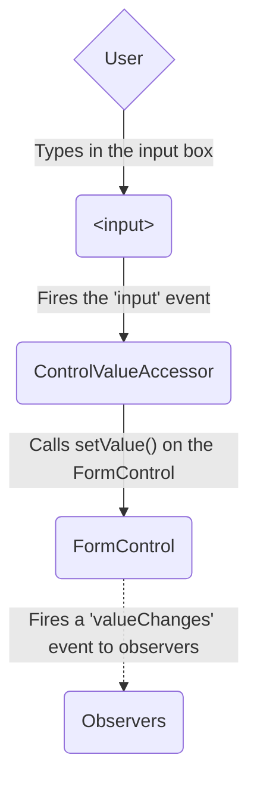
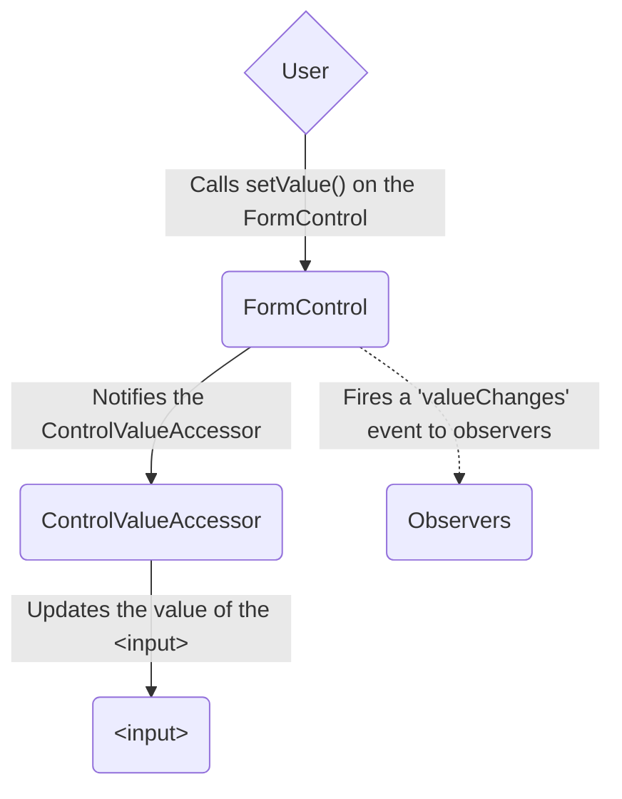
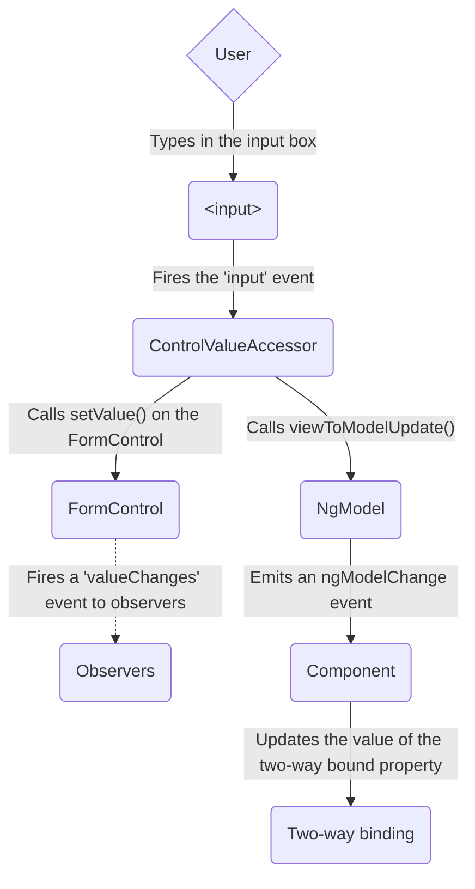
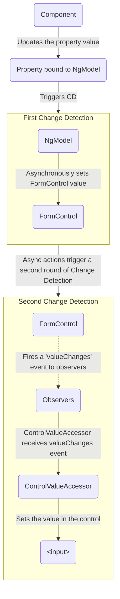

# Guide Forms

(From dynamic-forms.md)

## Building dynamic forms

Many forms, such as questionnaires, can be very similar to one another in format and intent.
To make it faster and easier to generate different versions of such a form, you can create a _dynamic form template_ based on metadata that describes the business object model.
Then, use the template to generate new forms automatically, according to changes in the data model.

The technique is particularly useful when you have a type of form whose content must change frequently to meet rapidly changing business and regulatory requirements.
A typical use-case is a questionnaire.
You might need to get input from users in different contexts.
The format and style of the forms a user sees should remain constant, while the actual questions you need to ask vary with the context.

In this tutorial you will build a dynamic form that presents a basic questionnaire.
You build an online application for heroes seeking employment.
The agency is constantly tinkering with the application process, but by using the dynamic form
you can create the new forms on the fly without changing the application code.

The tutorial walks you through the following steps.

1. Enable reactive forms for a project.
1. Establish a data model to represent form controls.
1. Populate the model with sample data.
1. Develop a component to create form controls dynamically.

The form you create uses input validation and styling to improve the user experience.
It has a Submit button that is only enabled when all user input is valid, and flags invalid input with color coding and error messages.

The basic version can evolve to support a richer variety of questions, more graceful rendering, and superior user experience.

### Enable reactive forms for your project

Dynamic forms are based on reactive forms.

To give the application access reactive forms directives, import `ReactiveFormsModule` from the `@angular/forms` library into the necessary components.

The following code from the example shows the setup in the root module.

<docs-code-multifile>
    <docs-code header="dynamic-form.component.ts" path="adev/src/content/examples/dynamic-form/src/app/dynamic-form.component.ts"/>
    <docs-code header="dynamic-form-question.component.ts" path="adev/src/content/examples/dynamic-form/src/app/dynamic-form-question.component.ts"/>
</docs-code-multifile>

### Create a form object model

A dynamic form requires an object model that can describe all scenarios needed by the form functionality.
The example hero-application form is a set of questions — that is, each control in the form must ask a question and accept an answer.

The data model for this type of form must represent a question.
The example includes the `DynamicFormQuestionComponent`, which defines a question as the fundamental object in the model.

The following `QuestionBase` is a base class for a set of controls that can represent the question and its answer in the form.

<docs-code header="src/app/question-base.ts" path="adev/src/content/examples/dynamic-form/src/app/question-base.ts"/>

#### Define control classes

From this base, the example derives two new classes, `TextboxQuestion` and `DropdownQuestion`, that represent different control types.
When you create the form template in the next step, you instantiate these specific question types in order to render the appropriate controls dynamically.

The `TextboxQuestion` control type is represented in a form template using an `<input>` element. It presents a question and lets users enter input. The `type` attribute of the element is defined based on the `type` field specified in the `options` argument (for example `text`, `email`, `url`).

<docs-code header="question-textbox.ts" path="adev/src/content/examples/dynamic-form/src/app/question-textbox.ts"/>

The `DropdownQuestion` control type presents a list of choices in a select box.

 <docs-code header="question-dropdown.ts" path="adev/src/content/examples/dynamic-form/src/app/question-dropdown.ts"/>

#### Compose form groups

A dynamic form uses a service to create grouped sets of input controls, based on the form model.
The following `QuestionControlService` collects a set of `FormGroup` instances that consume the metadata from the question model.
You can specify default values and validation rules.

<docs-code header="src/app/question-control.service.ts" path="adev/src/content/examples/dynamic-form/src/app/question-control.service.ts"/>

### Compose dynamic form contents

The dynamic form itself is represented by a container component, which you add in a later step.
Each question is represented in the form component's template by an `<app-question>` tag, which matches an instance of `DynamicFormQuestionComponent`.

The `DynamicFormQuestionComponent` is responsible for rendering the details of an individual question based on values in the data-bound question object.
The form relies on a [`[formGroup]` directive](api/forms/FormGroupDirective "API reference") to connect the template HTML to the underlying control objects.
The `DynamicFormQuestionComponent` creates form groups and populates them with controls defined in the question model, specifying display and validation rules.

<docs-code-multifile>
  <docs-code header="dynamic-form-question.component.html" path="adev/src/content/examples/dynamic-form/src/app/dynamic-form-question.component.html"/>
  <docs-code header="dynamic-form-question.component.ts" path="adev/src/content/examples/dynamic-form/src/app/dynamic-form-question.component.ts"/>
</docs-code-multifile>

The goal of the `DynamicFormQuestionComponent` is to present question types defined in your model.
You only have two types of questions at this point but you can imagine many more.
The `ngSwitch` statement in the template determines which type of question to display.
The switch uses directives with the [`formControlName`](api/forms/FormControlName "FormControlName directive API reference") and [`formGroup`](api/forms/FormGroupDirective "FormGroupDirective API reference") selectors.
Both directives are defined in `ReactiveFormsModule`.

#### Supply data

Another service is needed to supply a specific set of questions from which to build an individual form.
For this exercise you create the `QuestionService` to supply this array of questions from the hard-coded sample data.
In a real-world app, the service might fetch data from a backend system.
The key point, however, is that you control the hero job-application questions entirely through the objects returned from `QuestionService`.
To maintain the questionnaire as requirements change, you only need to add, update, and remove objects from the `questions` array.

The `QuestionService` supplies a set of questions in the form of an array bound to `@Input()` questions.

<docs-code header="src/app/question.service.ts" path="adev/src/content/examples/dynamic-form/src/app/question.service.ts"/>

### Create a dynamic form template

The `DynamicFormComponent` component is the entry point and the main container for the form, which is represented using the `<app-dynamic-form>` in a template.

The `DynamicFormComponent` component presents a list of questions by binding each one to an `<app-question>` element that matches the `DynamicFormQuestionComponent`.

<docs-code-multifile>
    <docs-code header="dynamic-form.component.html" path="adev/src/content/examples/dynamic-form/src/app/dynamic-form.component.html"/>
    <docs-code header="dynamic-form.component.ts" path="adev/src/content/examples/dynamic-form/src/app/dynamic-form.component.ts"/>
</docs-code-multifile>

#### Display the form

To display an instance of the dynamic form, the `AppComponent` shell template passes the `questions` array returned by the `QuestionService` to the form container component, `<app-dynamic-form>`.

<docs-code header="app.component.ts" path="adev/src/content/examples/dynamic-form/src/app/app.component.ts"/>

This separation of model and data lets you repurpose the components for any type of survey, as long as it's compatible with the _question_ object model.

#### Ensuring valid data

The form template uses dynamic data binding of metadata to render the form without making any hardcoded assumptions about specific questions.
It adds both control metadata and validation criteria dynamically.

To ensure valid input, the _Save_ button is disabled until the form is in a valid state.
When the form is valid, click _Save_ and the application renders the current form values as JSON.

The following figure shows the final form.


### Next steps

<docs-pill-row>
  <docs-pill title="Validating form input" href="guide/forms/reactive-forms#validating-form-input" />
  <docs-pill title="Form validation guide" href="guide/forms/form-validation" />
</docs-pill-row>

---


(From form-validation.md)

## Validating form input

You can improve overall data quality by validating user input for accuracy and completeness.
This page shows how to validate user input from the UI and display useful validation messages, in both reactive and template-driven forms.

### Validating input in template-driven forms

To add validation to a template-driven form, you add the same validation attributes as you would with [native HTML form validation](https://developer.mozilla.org/docs/Web/Guide/HTML/HTML5/Constraint_validation).
Angular uses directives to match these attributes with validator functions in the framework.

Every time the value of a form control changes, Angular runs validation and generates either a list of validation errors that results in an `INVALID` status, or null, which results in a VALID status.

You can then inspect the control's state by exporting `ngModel` to a local template variable.
The following example exports `NgModel` into a variable called `name`:

<docs-code header="template/actor-form-template.component.html (name)" path="adev/src/content/examples/form-validation/src/app/template/actor-form-template.component.html" visibleRegion="name-with-error-msg"/>

Notice the following features illustrated by the example.

* The `<input>` element carries the HTML validation attributes: `required` and `minlength`.
    It also carries a custom validator directive, `forbiddenName`.
    For more information, see the [Custom validators](#defining-custom-validators) section.

* `#name="ngModel"` exports `NgModel` into a local variable called `name`.
    `NgModel` mirrors many of the properties of its underlying `FormControl` instance, so you can use this in the template to check for control states such as `valid` and `dirty`.
    For a full list of control properties, see the [AbstractControl](api/forms/AbstractControl) API reference.

  * The `*ngIf` on the `<div>` element reveals a set of nested message `divs` but only if the `name` is invalid and the control is either `dirty` or `touched`.

  * Each nested `<div>` can present a custom message for one of the possible validation errors.
        There are messages for `required`, `minlength`, and `forbiddenName`.

HELPFUL: To prevent the validator from displaying errors before the user has a chance to edit the form, you should check for either the `dirty` or `touched` states in a control.

* When the user changes the value in the watched field, the control is marked as "dirty"
* When the user blurs the form control element, the control is marked as "touched"

### Validating input in reactive forms

In a reactive form, the source of truth is the component class.
Instead of adding validators through attributes in the template, you add validator functions directly to the form control model in the component class.
Angular then calls these functions whenever the value of the control changes.

#### Validator functions

Validator functions can be either synchronous or asynchronous.

| Validator type   | Details |
|:---              |:---     |
| Sync validators  | Synchronous functions that take a control instance and immediately return either a set of validation errors or `null`. Pass these in as the second argument when you instantiate a `FormControl`.                       |
| Async validators | Asynchronous functions that take a control instance and return a Promise or Observable that later emits a set of validation errors or `null`. Pass these in as the third argument when you instantiate a `FormControl`. |

For performance reasons, Angular only runs async validators if all sync validators pass.
Each must complete before errors are set.

#### Built-in validator functions

You can choose to [write your own validator functions](#defining-custom-validators), or you can use some of Angular's built-in validators.

The same built-in validators that are available as attributes in template-driven forms, such as `required` and `minlength`, are all available to use as functions from the `Validators` class.
For a full list of built-in validators, see the [Validators](api/forms/Validators) API reference.

To update the actor form to be a reactive form, use some of the same
built-in validators —this time, in function form, as in the following example.

<docs-code header="reactive/actor-form-reactive.component.ts (validator functions)" path="adev/src/content/examples/form-validation/src/app/reactive/actor-form-reactive.component.1.ts" visibleRegion="form-group"/>

In this example, the `name` control sets up two built-in validators —`Validators.required` and `Validators.minLength(4)`— and one custom validator, `forbiddenNameValidator`.

All of these validators are synchronous, so they are passed as the second argument.
Notice that you can support multiple validators by passing the functions in as an array.

This example also adds a few getter methods.
In a reactive form, you can always access any form control through the `get` method on its parent group, but sometimes it's useful to define getters as shorthand for the template.

If you look at the template for the `name` input again, it is fairly similar to the template-driven example.

<docs-code header="reactive/actor-form-reactive.component.html (name with error msg)" path="adev/src/content/examples/form-validation/src/app/reactive/actor-form-reactive.component.html" visibleRegion="name-with-error-msg"/>

This form differs from the template-driven version in that it no longer exports any directives. Instead, it uses the `name` getter defined in  the component class.

Notice that the `required` attribute is still present in the template. Although it's not necessary for validation, it should be retained for accessibility purposes.

### Defining custom validators

The built-in validators don't always match the exact use case of your application, so you sometimes need to create a custom validator.

Consider the `forbiddenNameValidator` function from the previous example.
Here's what the definition of that function looks like.

<docs-code header="shared/forbidden-name.directive.ts (forbiddenNameValidator)" path="adev/src/content/examples/form-validation/src/app/shared/forbidden-name.directive.ts" visibleRegion="custom-validator"/>

The function is a factory that takes a regular expression to detect a *specific* forbidden name and returns a validator function.

In this sample, the forbidden name is "bob", so the validator rejects any actor name containing "bob".
Elsewhere it could reject "alice" or any name that the configuring regular expression matches.

The `forbiddenNameValidator` factory returns the configured validator function.
That function takes an Angular control object and returns *either* null if the control value is valid *or* a validation error object.
The validation error object typically has a property whose name is the validation key, `'forbiddenName'`, and whose value is an arbitrary dictionary of values that you could insert into an error message, `{name}`.

Custom async validators are similar to sync validators, but they must instead return a Promise or observable that later emits null or a validation error object.
In the case of an observable, the observable must complete, at which point the form uses the last value emitted for validation.

#### Adding custom validators to reactive forms

In reactive forms, add a custom validator by passing the function directly to the `FormControl`.

<docs-code header="reactive/actor-form-reactive.component.ts (validator functions)" path="adev/src/content/examples/form-validation/src/app/reactive/actor-form-reactive.component.1.ts" visibleRegion="custom-validator"/>

#### Adding custom validators to template-driven forms

In template-driven forms, add a directive to the template, where the directive wraps the validator function.
For example, the corresponding `ForbiddenValidatorDirective` serves as a wrapper around the `forbiddenNameValidator`.

Angular recognizes the directive's role in the validation process because the directive registers itself with the `NG_VALIDATORS` provider, as shown in the following example.
`NG_VALIDATORS` is a predefined provider with an extensible collection of validators.

<docs-code header="shared/forbidden-name.directive.ts (providers)" path="adev/src/content/examples/form-validation/src/app/shared/forbidden-name.directive.ts" visibleRegion="directive-providers"/>

The directive class then implements the `Validator` interface, so that it can easily integrate with Angular forms.
Here is the rest of the directive to help you get an idea of how it all comes together.

<docs-code header="shared/forbidden-name.directive.ts (directive)" path="adev/src/content/examples/form-validation/src/app/shared/forbidden-name.directive.ts" visibleRegion="directive"/>

Once the `ForbiddenValidatorDirective` is ready, you can add its selector, `appForbiddenName`, to any input element to activate it.
For example:

<docs-code header="template/actor-form-template.component.html (forbidden-name-input)" path="adev/src/content/examples/form-validation/src/app/template/actor-form-template.component.html" visibleRegion="name-input"/>

HELPFUL: Notice that the custom validation directive is instantiated with `useExisting` rather than `useClass`.
The registered validator must be *this instance* of the `ForbiddenValidatorDirective` —the instance in the form with its `forbiddenName` property bound to "bob".

If you were to replace `useExisting` with `useClass`, then you'd be registering a new class instance, one that doesn't have a `forbiddenName`.

### Control status CSS classes

Angular automatically mirrors many control properties onto the form control element as CSS classes.
Use these classes to style form control elements according to the state of the form.
The following classes are currently supported.

* `.ng-valid`
* `.ng-invalid`
* `.ng-pending`
* `.ng-pristine`
* `.ng-dirty`
* `.ng-untouched`
* `.ng-touched`
* `.ng-submitted` \(enclosing form element only\)

In the following example, the actor form uses the `.ng-valid` and `.ng-invalid` classes to
set the color of each form control's border.

<docs-code header="forms.css (status classes)" path="adev/src/content/examples/form-validation/src/assets/forms.css"/>

### Cross-field validation

A cross-field validator is a [custom validator](#defining-custom-validators "Read about custom validators") that compares the values of different fields in a form and accepts or rejects them in combination.
For example, you might have a form that offers mutually incompatible options, so that if the user can choose A or B, but not both.
Some field values might also depend on others; a user might be allowed to choose B only if A is also chosen.

The following cross validation examples show how to do the following:

* Validate reactive or template-based form input based on the values of two sibling controls,
* Show a descriptive error message after the user interacted with the form and the validation failed.

The examples use cross-validation to ensure that actors do not reuse the same name in their role by filling out the Actor Form.
The validators do this by checking that the actor names and roles do not match.

#### Adding cross-validation to reactive forms

The form has the following structure:

<docs-code language="javascript">

const actorForm = new FormGroup({
  'name': new FormControl(),
  'role': new FormControl(),
  'skill': new FormControl()
});

</docs-code>

Notice that the `name` and `role` are sibling controls.
To evaluate both controls in a single custom validator, you must perform the validation in a common ancestor control: the `FormGroup`.
You query the `FormGroup` for its child controls so that you can compare their values.

To add a validator to the `FormGroup`, pass the new validator in as the second argument on creation.

<docs-code language="javascript">

const actorForm = new FormGroup({
  'name': new FormControl(),
  'role': new FormControl(),
  'skill': new FormControl()
}, { validators: unambiguousRoleValidator });

</docs-code>

The validator code is as follows.

<docs-code header="shared/unambiguous-role.directive.ts" path="adev/src/content/examples/form-validation/src/app/shared/unambiguous-role.directive.ts" visibleRegion="cross-validation-validator"/>

The `unambiguousRoleValidator` validator implements the `ValidatorFn` interface.
It takes an Angular control object as an argument and returns either null if the form is valid, or `ValidationErrors` otherwise.

The validator retrieves the child controls by calling the `FormGroup`'s [get](api/forms/AbstractControl#get) method, then compares the values of the `name` and `role` controls.

If the values do not match, the role is unambiguous, both are valid, and the validator returns null.
If they do match, the actor's role is ambiguous and the validator must mark the form as invalid by returning an error object.

To provide better user experience, the template shows an appropriate error message when the form is invalid.

<docs-code header="reactive/actor-form-template.component.html" path="adev/src/content/examples/form-validation/src/app/reactive/actor-form-reactive.component.html" visibleRegion="cross-validation-error-message"/>

This `*ngIf` displays the error if the `FormGroup` has the cross validation error returned by the `unambiguousRoleValidator` validator, but only if the user finished [interacting with the form](#control-status-css-classes).

#### Adding cross-validation to template-driven forms

For a template-driven form, you must create a directive to wrap the validator function.
You provide that directive as the validator using the [`NG_VALIDATORS` token](/api/forms/NG_VALIDATORS), as shown in the following example.

<docs-code header="shared/unambiguous-role.directive.ts" path="adev/src/content/examples/form-validation/src/app/shared/unambiguous-role.directive.ts" visibleRegion="cross-validation-directive"/>

You must add the new directive to the HTML template.
Because the validator must be registered at the highest level in the form, the following template puts the directive on the `form` tag.

<docs-code header="template/actor-form-template.component.html" path="adev/src/content/examples/form-validation/src/app/template/actor-form-template.component.html" visibleRegion="cross-validation-register-validator"/>

To provide better user experience, an appropriate error message appears when the form is invalid.

<docs-code header="template/actor-form-template.component.html" path="adev/src/content/examples/form-validation/src/app/template/actor-form-template.component.html" visibleRegion="cross-validation-error-message"/>

This is the same in both template-driven and reactive forms.

### Creating asynchronous validators

Asynchronous validators implement the `AsyncValidatorFn` and `AsyncValidator` interfaces.
These are very similar to their synchronous counterparts, with the following differences.

* The `validate()` functions must return a Promise or an observable,
* The observable returned must be finite, meaning it must complete at some point.
    To convert an infinite observable into a finite one, pipe the observable through a filtering operator such as `first`, `last`, `take`, or `takeUntil`.

Asynchronous validation happens after the synchronous validation, and is performed only if the synchronous validation is successful.
This check lets forms avoid potentially expensive async validation processes \(such as an HTTP request\) if the more basic validation methods have already found invalid input.

After asynchronous validation begins, the form control enters a `pending` state.
Inspect the control's `pending` property and use it to give visual feedback about the ongoing validation operation.

A common UI pattern is to show a spinner while the async validation is being performed.
The following example shows how to achieve this in a template-driven form.

<docs-code language="html">

<input [(ngModel)]="name" #model="ngModel" appSomeAsyncValidator>
<app-spinner *ngIf="model.pending"></app-spinner>

</docs-code>

#### Implementing a custom async validator

In the following example, an async validator ensures that actors are cast for a role that is not already taken.
New actors are constantly auditioning and old actors are retiring, so the list of available roles cannot be retrieved ahead of time.
To validate the potential role entry, the validator must initiate an asynchronous operation to consult a central database of all currently cast actors.

The following code creates the validator class, `UniqueRoleValidator`, which implements the `AsyncValidator` interface.

<docs-code path="adev/src/content/examples/form-validation/src/app/shared/role.directive.ts" visibleRegion="async-validator"/>

The constructor injects the `ActorsService`, which defines the following interface.

<docs-code language="typescript">
interface ActorsService {
  isRoleTaken: (role: string) => Observable<boolean>;
}
</docs-code>

In a real world application, the `ActorsService` would be responsible for making an HTTP request to the actor database to check if the role is available.
From the validator's point of view, the actual implementation of the service is not important, so the example can just code against the `ActorsService` interface.

As the validation begins, the `UnambiguousRoleValidator` delegates to the `ActorsService` `isRoleTaken()` method with the current control value.
At this point the control is marked as `pending` and remains in this state until the observable chain returned from the `validate()` method completes.

The `isRoleTaken()` method dispatches an HTTP request that checks if the role is available, and returns `Observable<boolean>` as the result.
The `validate()` method pipes the response through the `map` operator and transforms it into a validation result.

The method then, like any validator, returns `null` if the form is valid, and `ValidationErrors` if it is not.
This validator handles any potential errors with the `catchError` operator.
In this case, the validator treats the `isRoleTaken()` error as a successful validation, because failure to make a validation request does not necessarily mean that the role is invalid.
You could handle the error differently and return the `ValidationError` object instead.

After some time passes, the observable chain completes and the asynchronous validation is done.
The `pending` flag is set to `false`, and the form validity is updated.

#### Adding async validators to reactive forms

To use an async validator in reactive forms, begin by injecting the validator into the constructor of the component class.

<docs-code path="adev/src/content/examples/form-validation/src/app/reactive/actor-form-reactive.component.2.ts" visibleRegion="async-validator-inject"/>

Then, pass the validator function directly to the `FormControl` to apply it.

In the following example, the `validate` function of `UnambiguousRoleValidator` is applied to `roleControl` by passing it to the control's `asyncValidators` option and binding it to the instance of `UnambiguousRoleValidator` that was injected into `ActorFormReactiveComponent`.
The value of `asyncValidators` can be either a single async validator function, or an array of functions.
To learn more about `FormControl` options, see the [AbstractControlOptions](api/forms/AbstractControlOptions) API reference.

<docs-code path="adev/src/content/examples/form-validation/src/app/reactive/actor-form-reactive.component.2.ts" visibleRegion="async-validator-usage"/>

#### Adding async validators to template-driven forms

To use an async validator in template-driven forms, create a new directive and register the `NG_ASYNC_VALIDATORS` provider on it.

In the example below, the directive injects the `UniqueRoleValidator` class that contains the actual validation logic and invokes it in the `validate` function, triggered by Angular when validation should happen.

<docs-code path="adev/src/content/examples/form-validation/src/app/shared/role.directive.ts" visibleRegion="async-validator-directive"/>

Then, as with synchronous validators, add the directive's selector to an input to activate it.

<docs-code header="template/actor-form-template.component.html (unique-unambiguous-role-input)" path="adev/src/content/examples/form-validation/src/app/template/actor-form-template.component.html" visibleRegion="role-input"/>

#### Optimizing performance of async validators

By default, all validators run after every form value change.
With synchronous validators, this does not normally have a noticeable impact on application performance.
Async validators, however, commonly perform some kind of HTTP request to validate the control.
Dispatching an HTTP request after every keystroke could put a strain on the backend API, and should be avoided if possible.

You can delay updating the form validity by changing the `updateOn` property from `change` (default) to `submit` or `blur`.

With template-driven forms, set the property in the template.

<docs-code language="html">
<input [(ngModel)]="name" [ngModelOptions]="{updateOn: 'blur'}">
</docs-code>

With reactive forms, set the property in the `FormControl` instance.

<docs-code language="typescript">
new FormControl('', {updateOn: 'blur'});
</docs-code>

### Interaction with native HTML form validation

By default, Angular disables [native HTML form validation](https://developer.mozilla.org/docs/Web/Guide/HTML/Constraint_validation) by adding the `novalidate` attribute on the enclosing `<form>` and uses directives to match these attributes with validator functions in the framework.
If you want to use native validation **in combination** with Angular-based validation, you can re-enable it with the `ngNativeValidate` directive.
See the [API docs](api/forms/NgForm#native-dom-validation-ui) for details.

---


(From overview.md)

<docs-decorative-header title="Forms in Angular" imgSrc="adev/src/assets/images/overview.svg"> <!-- markdownlint-disable-line -->
Handling user input with forms is the cornerstone of many common applications.
</docs-decorative-header>

Applications use forms to enable users to log in, to update a profile, to enter sensitive information, and to perform many other data-entry tasks.

Angular provides two different approaches to handling user input through forms: reactive and template-driven.
Both capture user input events from the view, validate the user input, create a form model and data model to update, and provide a way to track changes.

This guide provides information to help you decide which type of form works best for your situation.
It introduces the common building blocks used by both approaches.
It also summarizes the key differences between the two approaches, and demonstrates those differences in the context of setup, data flow, and testing.

### Choosing an approach

Reactive forms and template-driven forms process and manage form data differently.
Each approach offers different advantages.

| Forms                 | Details |
|:---                   |:---     |
| Reactive forms        | Provide direct, explicit access to the underlying form's object model. Compared to template-driven forms, they are more robust: they're more scalable, reusable, and testable. If forms are a key part of your application, or you're already using reactive patterns for building your application, use reactive forms.                                                                                             |
| Template-driven forms | Rely on directives in the template to create and manipulate the underlying object model. They are useful for adding a simple form to an app, such as an email list signup form. They're straightforward to add to an app, but they don't scale as well as reactive forms. If you have very basic form requirements and logic that can be managed solely in the template, template-driven forms could be a good fit. |

#### Key differences

The following table summarizes the key differences between reactive and template-driven forms.

|                                                    | Reactive                             | Template-driven                 |
|:---                                                |:---                                  |:---                             |
| [Setup of form model](#setting-up-the-form-model)  | Explicit, created in component class | Implicit, created by directives |
| [Data model](#mutability-of-the-data-model)        | Structured and immutable             | Unstructured and mutable        |
| [Data flow](#data-flow-in-forms)                     | Synchronous                          | Asynchronous                    |
| [Form validation](#form-validation)                | Functions                            | Directives                      |

#### Scalability

If forms are a central part of your application, scalability is very important.
Being able to reuse form models across components is critical.

Reactive forms are more scalable than template-driven forms.
They provide direct access to the underlying form API, and use [synchronous data flow](#data-flow-in-reactive-forms) between the view and the data model, which makes creating large-scale forms easier.
Reactive forms require less setup for testing, and testing does not require deep understanding of change detection to properly test form updates and validation.

Template-driven forms focus on simple scenarios and are not as reusable.
They abstract away the underlying form API, and use [asynchronous data flow](#data-flow-in-template-driven-forms) between the view and the data model.
The abstraction of template-driven forms also affects testing.
Tests are deeply reliant on manual change detection execution to run properly, and require more setup.

### Setting up the form model

Both reactive and template-driven forms track value changes between the form input elements that users interact with and the form data in your component model.
The two approaches share underlying building blocks, but differ in how you create and manage the common form-control instances.

#### Common form foundation classes

Both reactive and template-driven forms are built on the following base classes.

| Base classes           | Details |
|:---                    |:---     |
| `FormControl`          | Tracks the value and validation status of an individual form control.               |
| `FormGroup`            | Tracks the same values and status for a collection of form controls.                |
| `FormArray`            | Tracks the same values and status for an array of form controls.                    |
| `ControlValueAccessor` | Creates a bridge between Angular `FormControl` instances and built-in DOM elements. |

#### Setup in reactive forms

With reactive forms, you define the form model directly in the component class.
The `[formControl]` directive links the explicitly created `FormControl` instance to a specific form element in the view, using an internal value accessor.

The following component implements an input field for a single control, using reactive forms.
In this example, the form model is the `FormControl` instance.

<docs-code path="adev/src/content/examples/forms-overview/src/app/reactive/favorite-color/favorite-color.component.ts"/>

IMPORTANT: In reactive forms, the form model is the source of truth; it provides the value and status of the form element at any given point in time, through the `[formControl]` directive on the `<input>` element.

#### Setup in template-driven forms

In template-driven forms, the form model is implicit, rather than explicit.
The directive `NgModel` creates and manages a `FormControl` instance for a given form element.

The following component implements the same input field for a single control, using template-driven forms.

<docs-code path="adev/src/content/examples/forms-overview/src/app/template/favorite-color/favorite-color.component.ts"/>

IMPORTANT: In a template-driven form the source of truth is the template. The `NgModel` directive automatically manages the `FormControl` instance for you.

### Data flow in forms

When an application contains a form, Angular must keep the view in sync with the component model and the component model in sync with the view.
As users change values and make selections through the view, the new values must be reflected in the data model.
Similarly, when the program logic changes values in the data model, those values must be reflected in the view.

Reactive and template-driven forms differ in how they handle data flowing from the user or from programmatic changes.
The following diagrams illustrate both kinds of data flow for each type of form, using the favorite-color input field defined above.

#### Data flow in reactive forms

In reactive forms each form element in the view is directly linked to the form model (a `FormControl` instance).
Updates from the view to the model and from the model to the view are synchronous and do not depend on how the UI is rendered.

The view-to-model diagram shows how data flows when an input field's value is changed from the view through the following steps.

1. The user types a value into the input element, in this case the favorite color *Blue*.
1. The form input element emits an "input" event with the latest value.
1. The `ControlValueAccessor` listening for events on the form input element immediately relays the new value to the `FormControl` instance.
1. The `FormControl` instance emits the new value through the `valueChanges` observable.
1. Any subscribers to the `valueChanges` observable receive the new value.



The model-to-view diagram shows how a programmatic change to the model is propagated to the view through the following steps.

1. The user calls the `favoriteColorControl.setValue()` method, which updates the `FormControl` value.
1. The `FormControl` instance emits the new value through the `valueChanges` observable.
1. Any subscribers to the `valueChanges` observable receive the new value.
1. The control value accessor on the form input element updates the element with the new value.



#### Data flow in template-driven forms

In template-driven forms, each form element is linked to a directive that manages the form model internally.

The view-to-model diagram shows how data flows when an input field's value is changed from the view through the following steps.

1. The user types *Blue* into the input element.
1. The input element emits an "input" event with the value *Blue*.
1. The control value accessor attached to the input triggers the `setValue()` method on the `FormControl` instance.
1. The `FormControl` instance emits the new value through the `valueChanges` observable.
1. Any subscribers to the `valueChanges` observable receive the new value.
1. The control value accessor also calls the `NgModel.viewToModelUpdate()` method which emits an `ngModelChange` event.
1. Because the component template uses two-way data binding for the `favoriteColor` property, the `favoriteColor` property in the component is updated to the value emitted by the `ngModelChange` event \(*Blue*\).



The model-to-view diagram shows how data flows from model to view when the `favoriteColor` changes from *Blue* to *Red*, through the following steps

1. The `favoriteColor` value is updated in the component.
1. Change detection begins.
1. During change detection, the `ngOnChanges` lifecycle hook is called on the `NgModel` directive instance because the value of one of its inputs has changed.
1. The `ngOnChanges()` method queues an async task to set the value for the internal `FormControl` instance.
1. Change detection completes.
1. On the next tick, the task to set the `FormControl` instance value is executed.
1. The `FormControl` instance emits the latest value through the `valueChanges` observable.
1. Any subscribers to the `valueChanges` observable receive the new value.
1. The control value accessor updates the form input element in the view with the latest `favoriteColor` value.



Note: `NgModel` triggers a second change detection to avoid `ExpressionChangedAfterItHasBeenChecked` errors, because the value change originates in an input binding.

#### Mutability of the data model

The change-tracking method plays a role in the efficiency of your application.

| Forms                 | Details |
|:---                   |:---     |
| Reactive forms        | Keep the data model pure by providing it as an immutable data structure. Each time a change is triggered on the data model, the `FormControl` instance returns a new data model rather than updating the existing data model. This gives you the ability to track unique changes to the data model through the control's observable. Change detection is more efficient because it only needs to update on unique changes. Because data updates follow reactive patterns, you can integrate with observable operators to transform data. |
| Template-driven forms | Rely on mutability with two-way data binding to update the data model in the component as changes are made in the template. Because there are no unique changes to track on the data model when using two-way data binding, change detection is less efficient at determining when updates are required.                                                                                                                                                                                                                                 |

The difference is demonstrated in the previous examples that use the favorite-color input element.

* With reactive forms, the **`FormControl` instance** always returns a new value when the control's value is updated
* With template-driven forms, the **favorite color property** is always modified to its new value

### Form validation

Validation is an integral part of managing any set of forms.
Whether you're checking for required fields or querying an external API for an existing username, Angular provides a set of built-in validators as well as the ability to create custom validators.

| Forms                 | Details |
|:---                   |:---     |
| Reactive forms        | Define custom validators as **functions** that receive a control to validate                                 |
| Template-driven forms | Tied to template **directives**, and must provide custom validator directives that wrap validation functions |

For more information, see [Form Validation](guide/forms/form-validation#validating-input-in-reactive-forms).

### Testing

Testing plays a large part in complex applications.
A simpler testing strategy is useful when validating that your forms function correctly.
Reactive forms and template-driven forms have different levels of reliance on rendering the UI to perform assertions based on form control and form field changes.
The following examples demonstrate the process of testing forms with reactive and template-driven forms.

#### Testing reactive forms

Reactive forms provide a relatively straightforward testing strategy because they provide synchronous access to the form and data models, and they can be tested without rendering the UI.
In these tests, status and data are queried and manipulated through the control without interacting with the change detection cycle.

The following tests use the favorite-color components from previous examples to verify the view-to-model and model-to-view data flows for a reactive form.

<!--todo: make consistent with other topics -->

##### Verifying view-to-model data flow

The first example performs the following steps to verify the view-to-model data flow.

1. Query the view for the form input element, and create a custom "input" event for the test.
1. Set the new value for the input to *Red*, and dispatch the "input" event on the form input element.
1. Assert that the component's `favoriteColorControl` value matches the value from the input.

<docs-code header="Favorite color test - view to model" path="adev/src/content/examples/forms-overview/src/app/reactive/favorite-color/favorite-color.component.spec.ts" visibleRegion="view-to-model"/>

The next example performs the following steps to verify the model-to-view data flow.

1. Use the `favoriteColorControl`, a `FormControl` instance, to set the new value.
1. Query the view for the form input element.
1. Assert that the new value set on the control matches the value in the input.

<docs-code header="Favorite color test - model to view" path="adev/src/content/examples/forms-overview/src/app/reactive/favorite-color/favorite-color.component.spec.ts" visibleRegion="model-to-view"/>

#### Testing template-driven forms

Writing tests with template-driven forms requires a detailed knowledge of the change detection process and an understanding of how directives run on each cycle to ensure that elements are queried, tested, or changed at the correct time.

The following tests use the favorite color components mentioned earlier to verify the data flows from view to model and model to view for a template-driven form.

The following test verifies the data flow from view to model.

<docs-code header="Favorite color test - view to model" path="adev/src/content/examples/forms-overview/src/app/template/favorite-color/favorite-color.component.spec.ts" visibleRegion="view-to-model"/>

Here are the steps performed in the view to model test.

1. Query the view for the form input element, and create a custom "input" event for the test.
1. Set the new value for the input to *Red*, and dispatch the "input" event on the form input element.
1. Run change detection through the test fixture.
1. Assert that the component `favoriteColor` property value matches the value from the input.

The following test verifies the data flow from model to view.

<docs-code header="Favorite color test - model to view" path="adev/src/content/examples/forms-overview/src/app/template/favorite-color/favorite-color.component.spec.ts" visibleRegion="model-to-view"/>

Here are the steps performed in the model to view test.

1. Use the component instance to set the value of the `favoriteColor` property.
1. Run change detection through the test fixture.
1. Use the `tick()` method to simulate the passage of time within the `fakeAsync()` task.
1. Query the view for the form input element.
1. Assert that the input value matches the value of the `favoriteColor` property in the component instance.

### Next steps

To learn more about reactive forms, see the following guides:

<docs-pill-row>
  <docs-pill href="guide/forms/reactive-forms" title="Reactive forms"/>
  <docs-pill href="guide/forms/form-validation#validating-input-in-reactive-forms" title="Form validation"/>
  <docs-pill href="guide/forms/dynamic-forms" title="Dynamic forms"/>
</docs-pill-row>

To learn more about template-driven forms, see the following guides:

<docs-pill-row>
  <docs-pill href="guide/forms/template-driven-forms" title="Template Driven Forms tutorial" />
  <docs-pill href="guide/forms/form-validation#validating-input-in-template-driven-forms" title="Form validation" />
  <docs-pill href="api/forms/NgForm" title="NgForm directive API reference" />
</docs-pill-row>

---


(From reactive-forms.md)

## Reactive forms

Reactive forms provide a model-driven approach to handling form inputs whose values change over time.
This guide shows you how to create and update a basic form control, progress to using multiple controls in a group, validate form values, and create dynamic forms where you can add or remove controls at run time.

### Overview of reactive forms

Reactive forms use an explicit and immutable approach to managing the state of a form at a given point in time.
Each change to the form state returns a new state, which maintains the integrity of the model between changes.
Reactive forms are built around observable streams, where form inputs and values are provided as streams of input values, which can be accessed synchronously.

Reactive forms also provide a straightforward path to testing because you are assured that your data is consistent and predictable when requested.
Any consumers of the streams have access to manipulate that data safely.

Reactive forms differ from [template-driven forms](guide/forms/template-driven-forms) in distinct ways.
Reactive forms provide synchronous access to the data model, immutability with observable operators, and change tracking through observable streams.

Template-driven forms let direct access modify data in your template, but are less explicit than reactive forms because they rely on directives embedded in the template, along with mutable data to track changes asynchronously.
See the [Forms Overview](guide/forms) for detailed comparisons between the two paradigms.

### Adding a basic form control

There are three steps to using form controls.

1. Register the reactive forms module in your application.
    This module declares the reactive-form directives that you need to use reactive forms.

1. Generate a new component and instantiate a new `FormControl`.
1. Register the `FormControl` in the template.

You can then display the form by adding the component to the template.

The following examples show how to add a single form control.
In the example, the user enters their name into an input field, captures that input value, and displays the current value of the form control element.

<docs-workflow>

<docs-step title="Import the ReactiveFormsModule">
To use reactive form controls, import `ReactiveFormsModule` from the `@angular/forms` package and add it to your NgModule's `imports` array.

<docs-code header="src/app/app.module.ts (excerpt)" path="adev/src/content/examples/reactive-forms/src/app/app.module.ts" visibleRegion="imports" />
</docs-step>

<docs-step title="Generate a new component with a FormControl">
Use the CLI command `ng generate component` to generate a component in your project to host the control.

<docs-code header="src/app/name-editor/name-editor.component.ts" path="adev/src/content/examples/reactive-forms/src/app/name-editor/name-editor.component.ts" visibleRegion="create-control"/>

Use the constructor of `FormControl` to set its initial value, which in this case is an empty string. By creating these controls in your component class, you get immediate access to listen for, update, and validate the state of the form input.
</docs-step>

<docs-step title="Register the control in the template">
After you create the control in the component class, you must associate it with a form control element in the template. Update the template with the form control using the `formControl` binding provided by `FormControlDirective`, which is also included in the `ReactiveFormsModule`.

<docs-code header="src/app/name-editor/name-editor.component.html" path="adev/src/content/examples/reactive-forms/src/app/name-editor/name-editor.component.html" visibleRegion="control-binding" />

Using the template binding syntax, the form control is now registered to the `name` input element in the template. The form control and DOM element communicate with each other: the view reflects changes in the model, and the model reflects changes in the view.
</docs-step>

<docs-step title="Display the component">
The `FormControl` assigned to the `name` property is displayed when the `<app-name-editor>` component is added to a template.

<docs-code header="src/app/app.component.html (name editor)" path="adev/src/content/examples/reactive-forms/src/app/app.component.1.html" visibleRegion="app-name-editor"/>
</docs-step>
</docs-workflow>

#### Displaying a form control value

You can display the value in the following ways.

* Through the `valueChanges` observable where you can listen for changes in the form's value in the template using `AsyncPipe` or in the component class using the `subscribe()` method
* With the `value` property, which gives you a snapshot of the current value

The following example shows you how to display the current value using interpolation in the template.

<docs-code header="src/app/name-editor/name-editor.component.html (control value)" path="adev/src/content/examples/reactive-forms/src/app/name-editor/name-editor.component.html" visibleRegion="display-value"/>

The displayed value changes as you update the form control element.

Reactive forms provide access to information about a given control through properties and methods provided with each instance.
These properties and methods of the underlying [AbstractControl](api/forms/AbstractControl "API reference") class are used to control form state and determine when to display messages when handling [input validation](#validating-form-input "Learn more about validating form input").

Read about other `FormControl` properties and methods in the [API Reference](api/forms/FormControl "Detailed syntax reference").

#### Replacing a form control value

Reactive forms have methods to change a control's value programmatically, which gives you the flexibility to update the value without user interaction.
A form control instance provides a `setValue()` method that updates the value of the form control and validates the structure of the value provided against the control's structure.
For example, when retrieving form data from a backend API or service, use the `setValue()` method to update the control to its new value, replacing the old value entirely.

The following example adds a method to the component class to update the value of the control to *Nancy* using the `setValue()` method.

<docs-code header="src/app/name-editor/name-editor.component.ts (update value)" path="adev/src/content/examples/reactive-forms/src/app/name-editor/name-editor.component.ts" visibleRegion="update-value"/>

Update the template with a button to simulate a name update.
When you click the **Update Name** button, the value entered in the form control element is reflected as its current value.

<docs-code header="src/app/name-editor/name-editor.component.html (update value)" path="adev/src/content/examples/reactive-forms/src/app/name-editor/name-editor.component.html" visibleRegion="update-value"/>

The form model is the source of truth for the control, so when you click the button, the value of the input is changed within the component class, overriding its current value.

HELPFUL: In this example, you're using a single control.
When using the `setValue()` method with a [form group](#grouping-form-controls) or [form array](#creating-dynamic-forms) instance, the value needs to match the structure of the group or array.

### Grouping form controls

Forms typically contain several related controls.
Reactive forms provide two ways of grouping multiple related controls into a single input form.

| Form groups | Details |
|:---         |:---     |
| Form group  | Defines a form with a fixed set of controls that you can manage together. Form group basics are discussed in this section. You can also [nest form groups](#creating-nested-form-groups "See more about nesting groups") to create more complex forms.      |
| Form array  | Defines a dynamic form, where you can add and remove controls at run time. You can also nest form arrays to create more complex forms. For more about this option, see [Creating dynamic forms](#creating-dynamic-forms). |

Just as a form control instance gives you control over a single input field, a form group instance tracks the form state of a group of form control instances \(for example, a form\).
Each control in a form group instance is tracked by name when creating the form group.
The following example shows how to manage multiple form control instances in a single group.

Generate a `ProfileEditor` component and import the `FormGroup` and `FormControl` classes from the `@angular/forms` package.

<docs-code language="shell">
ng generate component ProfileEditor
</docs-code>

<docs-code header="src/app/profile-editor/profile-editor.component.ts (imports)" path="adev/src/content/examples/reactive-forms/src/app/profile-editor/profile-editor.component.1.ts" visibleRegion="imports"/>

To add a form group to this component, take the following steps.

1. Create a `FormGroup` instance.
1. Associate the `FormGroup` model and view.
1. Save the form data.

<docs-workflow>

<docs-step title="Create a FormGroup instance">
Create a property in the component class named `profileForm` and set the property to a new form group instance. To initialize the form group, provide the constructor with an object of named keys mapped to their control.

For the profile form, add two form control instances with the names `firstName` and `lastName`

<docs-code header="src/app/profile-editor/profile-editor.component.ts (form group)" path="adev/src/content/examples/reactive-forms/src/app/profile-editor/profile-editor.component.1.ts" visibleRegion="formgroup"/>

The individual form controls are now collected within a group. A `FormGroup` instance provides its model value as an object reduced from the values of each control in the group. A form group instance has the same properties (such as `value` and `untouched`) and methods (such as `setValue()`) as a form control instance.
</docs-step>

<docs-step title="Associate the FormGroup model and view">
A form group tracks the status and changes for each of its controls, so if one of the controls changes, the parent control also emits a new status or value change. The model for the group is maintained from its members. After you define the model, you must update the template to reflect the model in the view.

<docs-code header="src/app/profile-editor/profile-editor.component.html (template form group)" path="adev/src/content/examples/reactive-forms/src/app/profile-editor/profile-editor.component.1.html" visibleRegion="formgroup"/>

Just as a form group contains a group of controls, the *profileForm* `FormGroup` is bound to the `form` element with the `FormGroup` directive, creating a communication layer between the model and the form containing the inputs.  The `formControlName` input provided by the `FormControlName` directive binds each individual input to the form control defined in `FormGroup`. The form controls communicate with their respective elements. They also communicate changes to the form group instance, which provides the source of truth for the model value.
</docs-step>

<docs-step title="Save form data">
The `ProfileEditor` component accepts input from the user, but in a real scenario you want to capture the form value and make it available for further processing outside the component. The `FormGroup` directive listens for the `submit` event emitted by the `form` element and emits an `ngSubmit` event that you can bind to a callback function. Add an `ngSubmit` event listener to the `form` tag with the `onSubmit()` callback method.

<docs-code header="src/app/profile-editor/profile-editor.component.html (submit event)" path="adev/src/content/examples/reactive-forms/src/app/profile-editor/profile-editor.component.html" visibleRegion="ng-submit"/>

The `onSubmit()` method in the `ProfileEditor` component captures the current value of `profileForm`. Use `EventEmitter` to keep the form encapsulated and to provide the form value outside the component. The following example uses `console.warn` to log a message to the browser console.

<docs-code header="src/app/profile-editor/profile-editor.component.ts (submit method)" path="adev/src/content/examples/reactive-forms/src/app/profile-editor/profile-editor.component.ts" visibleRegion="on-submit"/>

The `submit` event is emitted by the `form` tag using the built-in DOM event. You trigger the event by clicking a button with `submit` type. This lets the user press the **Enter** key to submit the completed form.

Use a `button` element to add a button to the bottom of the form to trigger the form submission.

<docs-code header="src/app/profile-editor/profile-editor.component.html (submit button)" path="adev/src/content/examples/reactive-forms/src/app/profile-editor/profile-editor.component.html" visibleRegion="submit-button"/>

The button in the preceding snippet also has a `disabled` binding attached to it to disable the button when `profileForm` is invalid. You aren't performing any validation yet, so the button is always enabled. Basic form validation is covered in the [Validating form input](#validating-form-input) section.
</docs-step>

<docs-step title="Display the component">
To display the `ProfileEditor` component that contains the form, add it to a component template.

<docs-code header="src/app/app.component.html (profile editor)" path="adev/src/content/examples/reactive-forms/src/app/app.component.1.html" visibleRegion="app-profile-editor"/>

`ProfileEditor` lets you manage the form control instances for the `firstName` and `lastName` controls within the form group instance.

#### Creating nested form groups

Form groups can accept both individual form control instances and other form group instances as children.
This makes composing complex form models easier to maintain and logically group together.

When building complex forms, managing the different areas of information is easier in smaller sections.
Using a nested form group instance lets you break large forms groups into smaller, more manageable ones.

To make more complex forms, use the following steps.

1. Create a nested group.
1. Group the nested form in the template.

Some types of information naturally fall into the same group.
A name and address are typical examples of such nested groups, and are used in the following examples.

<docs-workflow>
<docs-step title="Create a nested group">
To create a nested group in `profileForm`, add a nested `address` element to the form group instance.

<docs-code header="src/app/profile-editor/profile-editor.component.ts (nested form group)" path="adev/src/content/examples/reactive-forms/src/app/profile-editor/profile-editor.component.1.ts" visibleRegion="nested-formgroup"/>

In this example, `address group` combines the current `firstName` and `lastName` controls with the new `street`, `city`, `state`, and `zip` controls. Even though the `address` element in the form group is a child of the overall `profileForm` element in the form group, the same rules apply with value and status changes. Changes in status and value from the nested form group propagate to the parent form group, maintaining consistency with the overall model.
</docs-step>

<docs-step title="Group the nested form in the template">
After you update the model in the component class, update the template to connect the form group instance and its input elements. Add the `address` form group containing the `street`, `city`, `state`, and `zip` fields to the `ProfileEditor` template.

<docs-code header="src/app/profile-editor/profile-editor.component.html (template nested form group)" path="adev/src/content/examples/reactive-forms/src/app/profile-editor/profile-editor.component.1.html" visibleRegion="formgroupname"/>

The `ProfileEditor` form is displayed as one group, but the model is broken down further to represent the logical grouping areas.

Display the value for the form group instance in the component template using the `value` property and `JsonPipe`.
</docs-step>
</docs-workflow>

#### Updating parts of the data model

When updating the value for a form group instance that contains multiple controls, you might only want to update parts of the model.
This section covers how to update specific parts of a form control data model.

There are two ways to update the model value:

| Methods        | Details |
|:---            |:---     |
| `setValue()`   | Set a new value for an individual control. The `setValue()` method strictly adheres to the structure of the form group and replaces the entire value for the control. |
| `patchValue()` | Replace any properties defined in the object that have changed in the form model.                                                                                     |

The strict checks of the `setValue()` method help catch nesting errors in complex forms, while `patchValue()` fails silently on those errors.

In `ProfileEditorComponent`, use the `updateProfile` method with the following example to update the first name and street address for the user.

<docs-code header="src/app/profile-editor/profile-editor.component.ts (patch value)" path="adev/src/content/examples/reactive-forms/src/app/profile-editor/profile-editor.component.1.ts" visibleRegion="patch-value"/>

Simulate an update by adding a button to the template to update the user profile on demand.

<docs-code header="src/app/profile-editor/profile-editor.component.html (update value)" path="adev/src/content/examples/reactive-forms/src/app/profile-editor/profile-editor.component.1.html" visibleRegion="patch-value"/>

When a user clicks the button, the `profileForm` model is updated with new values for `firstName` and `street`. Notice that `street` is provided in an object inside the `address` property.
This is necessary because the `patchValue()` method applies the update against the model structure.
`PatchValue()` only updates properties that the form model defines.

### Using the FormBuilder service to generate controls

Creating form control instances manually can become repetitive when dealing with multiple forms.
The `FormBuilder` service provides convenient methods for generating controls.

Use the following steps to take advantage of this service.

1. Import the `FormBuilder` class.
1. Inject the `FormBuilder` service.
1. Generate the form contents.

The following examples show how to refactor the `ProfileEditor` component to use the form builder service to create form control and form group instances.

<docs-workflow>
<docs-step title="Import the FormBuilder class">
Import the `FormBuilder` class from the `@angular/forms` package.

<docs-code header="src/app/profile-editor/profile-editor.component.ts (import)" path="adev/src/content/examples/reactive-forms/src/app/profile-editor/profile-editor.component.2.ts" visibleRegion="form-builder-imports"/>

</docs-step>

<docs-step title="Inject the FormBuilder service">
The `FormBuilder` service is an injectable provider from the reactive forms module. Use the `inject()` function to inject this dependency in your component.

<docs-code header="src/app/profile-editor/profile-editor.component.ts (constructor)" path="adev/src/content/examples/reactive-forms/src/app/profile-editor/profile-editor.component.2.ts" visibleRegion="inject-form-builder"/>

</docs-step>
<docs-step title="Generate form controls">
The `FormBuilder` service has three methods: `control()`, `group()`, and `array()`. These are factory methods for generating instances in your component classes including form controls, form groups, and form arrays. Use the `group` method to create the `profileForm` controls.

<docs-code header="src/app/profile-editor/profile-editor.component.ts (form builder)" path="adev/src/content/examples/reactive-forms/src/app/profile-editor/profile-editor.component.2.ts" visibleRegion="form-builder"/>

In the preceding example, you use the `group()` method with the same object to define the properties in the model. The value for each control name is an array containing the initial value as the first item in the array.

Tip: You can define the control with just the initial value, but if your controls need sync or async validation, add sync and async validators as the second and third items in the array. Compare using the form builder to creating the instances manually.

  <docs-code-multifile>
    <docs-code header="src/app/profile-editor/profile-editor.component.ts (instances)" path="adev/src/content/examples/reactive-forms/src/app/profile-editor/profile-editor.component.1.ts" visibleRegion="formgroup-compare"/>
    <docs-code header="src/app/profile-editor/profile-editor.component.ts (form builder)" path="adev/src/content/examples/reactive-forms/src/app/profile-editor/profile-editor.component.2.ts" visibleRegion="formgroup-compare"/>
  </docs-code-multifile>
</docs-step>

</docs-workflow>

### Validating form input

*Form validation* is used to ensure that user input is complete and correct.
This section covers adding a single validator to a form control and displaying the overall form status.
Form validation is covered more extensively in the [Form Validation](guide/forms/form-validation) guide.

Use the following steps to add form validation.

1. Import a validator function in your form component.
1. Add the validator to the field in the form.
1. Add logic to handle the validation status.

The most common validation is making a field required.
The following example shows how to add a required validation to the `firstName` control and display the result of validation.

<docs-workflow>
<docs-step title="Import a validator function">
Reactive forms include a set of validator functions for common use cases. These functions receive a control to validate against and return an error object or a null value based on the validation check.

Import the `Validators` class from the `@angular/forms` package.

<docs-code header="src/app/profile-editor/profile-editor.component.ts (import)" path="adev/src/content/examples/reactive-forms/src/app/profile-editor/profile-editor.component.ts" visibleRegion="validator-imports"/>
</docs-step>

<docs-step title="Make a field required">
In the `ProfileEditor` component, add the `Validators.required` static method as the second item in the array for the `firstName` control.

<docs-code header="src/app/profile-editor/profile-editor.component.ts (required validator)" path="adev/src/content/examples/reactive-forms/src/app/profile-editor/profile-editor.component.ts" visibleRegion="required-validator"/>
</docs-step>

<docs-step title="Display form status">
When you add a required field to the form control, its initial status is invalid. This invalid status propagates to the parent form group element, making its status invalid. Access the current status of the form group instance through its `status` property.

Display the current status of `profileForm` using interpolation.

<docs-code header="src/app/profile-editor/profile-editor.component.html (display status)" path="adev/src/content/examples/reactive-forms/src/app/profile-editor/profile-editor.component.html" visibleRegion="display-status"/>

The **Submit** button is disabled because `profileForm` is invalid due to the required `firstName` form control. After you fill out the `firstName` input, the form becomes valid and the **Submit** button is enabled.

For more on form validation, visit the [Form Validation](guide/forms/form-validation) guide.
</docs-step>
</docs-workflow>

### Creating dynamic forms

`FormArray` is an alternative to `FormGroup` for managing any number of unnamed controls.
As with form group instances, you can dynamically insert and remove controls from form array instances, and the form array instance value and validation status is calculated from its child controls.
However, you don't need to define a key for each control by name, so this is a great option if you don't know the number of child values in advance.

To define a dynamic form, take the following steps.

1. Import the `FormArray` class.
1. Define a `FormArray` control.
1. Access the `FormArray` control with a getter method.
1. Display the form array in a template.

The following example shows you how to manage an array of *aliases* in `ProfileEditor`.

<docs-workflow>
<docs-step title="Import the `FormArray` class">
Import the `FormArray` class from `@angular/forms` to use for type information. The `FormBuilder` service is ready to create a `FormArray` instance.

<docs-code header="src/app/profile-editor/profile-editor.component.ts (import)" path="adev/src/content/examples/reactive-forms/src/app/profile-editor/profile-editor.component.2.ts" visibleRegion="form-array-imports"/>
</docs-step>

<docs-step title="Define a `FormArray` control">
You can initialize a form array with any number of controls, from zero to many, by defining them in an array. Add an `aliases` property to the form group instance for `profileForm` to define the form array.

Use the `FormBuilder.array()` method to define the array, and the `FormBuilder.control()` method to populate the array with an initial control.

<docs-code header="src/app/profile-editor/profile-editor.component.ts (aliases form array)" path="adev/src/content/examples/reactive-forms/src/app/profile-editor/profile-editor.component.ts" visibleRegion="aliases"/>

The aliases control in the form group instance is now populated with a single control until more controls are added dynamically.
</docs-step>

<docs-step title="Access the `FormArray` control">
A getter provides access to the aliases in the form array instance compared to repeating the `profileForm.get()` method to get each instance. The form array instance represents an undefined number of controls in an array. It's convenient to access a control through a getter, and this approach is straightforward to repeat for additional controls. <br />

Use the getter syntax to create an `aliases` class property to retrieve the alias's form array control from the parent form group.

<docs-code header="src/app/profile-editor/profile-editor.component.ts (aliases getter)" path="adev/src/content/examples/reactive-forms/src/app/profile-editor/profile-editor.component.ts" visibleRegion="aliases-getter"/>

Because the returned control is of the type `AbstractControl`, you need to provide an explicit type to access the method syntax for the form array instance.  Define a method to dynamically insert an alias control into the alias's form array. The `FormArray.push()` method inserts the control as a new item in the array.

<docs-code header="src/app/profile-editor/profile-editor.component.ts (add alias)" path="adev/src/content/examples/reactive-forms/src/app/profile-editor/profile-editor.component.ts" visibleRegion="add-alias"/>

In the template, each control is displayed as a separate input field.

</docs-step>

<docs-step title="Display the form array in the template">

To attach the aliases from your form model, you must add it to the template. Similar to the `formGroupName` input provided by `FormGroupNameDirective`, `formArrayName` binds communication from the form array instance to the template with `FormArrayNameDirective`.

Add the following template HTML after the `<div>` closing the `formGroupName` element.

<docs-code header="src/app/profile-editor/profile-editor.component.html (aliases form array template)" path="adev/src/content/examples/reactive-forms/src/app/profile-editor/profile-editor.component.html" visibleRegion="formarrayname"/>

The `*ngFor` directive iterates over each form control instance provided by the aliases form array instance. Because form array elements are unnamed, you assign the index to the `i` variable and pass it to each control to bind it to the `formControlName` input.

Each time a new alias instance is added, the new form array instance is provided its control based on the index. This lets you track each individual control when calculating the status and value of the root control.

</docs-step>

<docs-step title="Add an alias">

Initially, the form contains one `Alias` field. To add another field, click the **Add Alias** button. You can also validate the array of aliases reported by the form model displayed by `Form Value` at the bottom of the template.  Instead of a form control instance for each alias, you can compose another form group instance with additional fields. The process of defining a control for each item is the same.
</docs-step>

</docs-workflow>

### Reactive forms API summary

The following table lists the base classes and services used to create and manage reactive form controls.
For complete syntax details, see the API reference documentation for the [Forms package](api#forms "API reference").

#### Classes

| Class             | Details |
|:---               |:---     |
| `AbstractControl` | The abstract base class for the concrete form control classes `FormControl`, `FormGroup`, and `FormArray`. It provides their common behaviors and properties.                           |
| `FormControl`     | Manages the value and validity status of an individual form control. It corresponds to an HTML form control such as `<input>` or `<select>`.                                            |
| `FormGroup`       | Manages the value and validity state of a group of `AbstractControl` instances. The group's properties include its child controls. The top-level form in your component is `FormGroup`. |
| `FormArray`       | Manages the value and validity state of a numerically indexed array of `AbstractControl` instances.                                                                                     |
| `FormBuilder`     | An injectable service that provides factory methods for creating control instances.                                                                                                     |
| `FormRecord`      | Tracks the value and validity state of a collection of `FormControl` instances, each of which has the same value type.                                                                  |

#### Directives

| Directive              | Details |
|:---                    |:---     |
| `FormControlDirective` | Syncs a standalone `FormControl` instance to a form control element.                       |
| `FormControlName`      | Syncs `FormControl` in an existing `FormGroup` instance to a form control element by name. |
| `FormGroupDirective`   | Syncs an existing `FormGroup` instance to a DOM element.                                   |
| `FormGroupName`        | Syncs a nested `FormGroup` instance to a DOM element.                                      |
| `FormArrayName`        | Syncs a nested `FormArray` instance to a DOM element.                                      |

---


(From template-driven-forms.md)

## Building a template-driven form

This tutorial shows you how to create a template-driven form. The control elements in the form are bound to data properties that have input validation. The input validation helps maintain data integrity and styling to improve the user experience.

Template-driven forms use [two-way data binding](guide/templates/two-way-binding) to update the data model in the component as changes are made in the template and vice versa.

<docs-callout helpful title="Template vs Reactive forms">
Angular supports two design approaches for interactive forms. Template-driven forms allow you to use form-specific directives in your Angular template. Reactive forms provide a model-driven approach to building forms.

Template-driven forms are a great choice for small or simple forms, while reactive forms are more scalable and suitable for complex forms. For a comparison of the two approaches, see [Choosing an approach](guide/forms#choosing-an-approach)
</docs-callout>

You can build almost any kind of form with an Angular template —login forms, contact forms, and pretty much any business form.
You can lay out the controls creatively and bind them to the data in your object model.
You can specify validation rules and display validation errors, conditionally allow input from specific controls, trigger built-in visual feedback, and much more.

### Objectives

This tutorial teaches you how to do the following:

- Build an Angular form with a component and template
- Use `ngModel` to create two-way data bindings for reading and writing input-control values
- Provide visual feedback using special CSS classes that track the state of the controls
- Display validation errors to users and conditionally allow input from form controls based on the form status
- Share information across HTML elements using [template reference variables](guide/templates/variables#template-reference-variables)

### Build a template-driven form

Template-driven forms rely on directives defined in the `FormsModule`.

| Directives     | Details                                                                                                                                                                                                                                                                         |
| :------------- | :------------------------------------------------------------------------------------------------------------------------------------------------------------------------------------------------------------------------------------------------------------------------------ |
| `NgModel`      | Reconciles value changes in the attached form element with changes in the data model, allowing you to respond to user input with input validation and error handling.                                                                                                           |
| `NgForm`       | Creates a top-level `FormGroup` instance and binds it to a `<form>` element to track aggregated form value and validation status. As soon as you import `FormsModule`, this directive becomes active by default on all `<form>` tags. You don't need to add a special selector. |
| `NgModelGroup` | Creates and binds a `FormGroup` instance to a DOM element.                                                                                                                                                                                                                      |

#### Step overview

In the course of this tutorial, you bind a sample form to data and handle user input using the following steps.

1. Build the basic form.
   - Define a sample data model
   - Include required infrastructure such as the `FormsModule`
1. Bind form controls to data properties using the `ngModel` directive and two-way data-binding syntax.
   - Examine how `ngModel` reports control states using CSS classes
   - Name controls to make them accessible to `ngModel`
1. Track input validity and control status using `ngModel`.
   - Add custom CSS to provide visual feedback on the status
   - Show and hide validation-error messages
1. Respond to a native HTML button-click event by adding to the model data.
1. Handle form submission using the [`ngSubmit`](api/forms/NgForm#properties) output property of the form.
   - Disable the **Submit** button until the form is valid
   - After submit, swap out the finished form for different content on the page

### Build the form

<!-- TODO: link to preview -->
<!-- <docs-code live/> -->

1. The provided sample application creates the `Actor` class which defines the data model reflected in the form.

<docs-code header="src/app/actor.ts" language="typescript" path="adev/src/content/examples/forms/src/app/actor.ts"/>

1. The form layout and details are defined in the `ActorFormComponent` class.

   <docs-code header="src/app/actor-form/actor-form.component.ts (v1)" path="adev/src/content/examples/forms/src/app/actor-form/actor-form.component.ts" visibleRegion="v1"/>

   The component's `selector` value of "app-actor-form" means you can drop this form in a parent template using the `<app-actor-form>` tag.

1. The following code creates a new actor instance, so that the initial form can show an example actor.

   <docs-code language="typescript" path="adev/src/content/examples/forms/src/app/actor-form/actor-form.component.ts" language="typescript" visibleRegion="Marilyn"/>

   This demo uses dummy data for `model` and `skills`.
   In a real app, you would inject a data service to get and save real data, or expose these properties as inputs and outputs.

1. The application enables the Forms feature and registers the created form component.

<docs-code header="src/app/app.module.ts" language="typescript" path="adev/src/content/examples/forms/src/app/app.module.ts"/>

1. The form is displayed in the application layout defined by the root component's template.

   <docs-code header="src/app/app.component.html" language="html" path="adev/src/content/examples/forms/src/app/app.component.html"/>

   The initial template defines the layout for a form with two form groups and a submit button.
   The form groups correspond to two properties of the Actor data model, name and studio.
   Each group has a label and a box for user input.

   - The **Name** `<input>` control element has the HTML5 `required` attribute
   - The **Studio** `<input>` control element does not because `studio` is optional

   The **Submit** button has some classes on it for styling.
   At this point, the form layout is all plain HTML5, with no bindings or directives.

1. The sample form uses some style classes from [Twitter Bootstrap](https://getbootstrap.com/css): `container`, `form-group`, `form-control`, and `btn`.
To use these styles, the application's style sheet imports the library.

<docs-code header="src/styles.css" path="adev/src/content/examples/forms/src/styles.1.css"/>

1. The form requires that an actor's skill is chosen from a predefined list of `skills` maintained internally in `ActorFormComponent`.
The Angular [NgForOf directive](api/common/NgForOf 'API reference') iterates over the data values to populate the `<select>` element.

<docs-code header="src/app/actor-form/actor-form.component.html (skills)" path="adev/src/content/examples/forms/src/app/actor-form/actor-form.component.html" visibleRegion="skills"/>

If you run the application right now, you see the list of skills in the selection control.
The input elements are not yet bound to data values or events, so they are still blank and have no behavior.

### Bind input controls to data properties

The next step is to bind the input controls to the corresponding `Actor` properties with two-way data binding, so that they respond to user input by updating the data model, and also respond to programmatic changes in the data by updating the display.

The `ngModel` directive declared in the `FormsModule` lets you bind controls in your template-driven form to properties in your data model.
When you include the directive using the syntax for two-way data binding, `[(ngModel)]`, Angular can track the value and user interaction of the control and keep the view synced with the model.

1. Edit the template file `actor-form.component.html`.
1. Find the `<input>` tag next to the **Name** label.
1. Add the `ngModel` directive, using two-way data binding syntax `[(ngModel)]="..."`.

<docs-code header="src/app/actor-form/actor-form.component.html (excerpt)" path="adev/src/content/examples/forms/src/app/actor-form/actor-form.component.html" visibleRegion="ngModelName-1"/>

HELPFUL: This example has a temporary diagnostic interpolation after each input tag, `{{model.name}}`, to show the current data value of the corresponding property. The comment reminds you to remove the diagnostic lines when you have finished observing the two-way data binding at work.

#### Access the overall form status

When you imported the `FormsModule` in your component, Angular automatically created and attached an [NgForm](api/forms/NgForm) directive to the `<form>` tag in the template (because `NgForm` has the selector `form` that matches `<form>` elements).

To get access to the `NgForm` and the overall form status, declare a [template reference variable](guide/templates/variables#template-reference-variables).

1. Edit the template file `actor-form.component.html`.
1. Update the `<form>` tag with a template reference variable, `#actorForm`, and set its value as follows.

   <docs-code header="src/app/actor-form/actor-form.component.html (excerpt)" path="adev/src/content/examples/forms/src/app/actor-form/actor-form.component.html" visibleRegion="template-variable"/>

   The `actorForm` template variable is now a reference to the `NgForm` directive instance that governs the form as a whole.

1. Run the app.
1. Start typing in the **Name** input box.

   As you add and delete characters, you can see them appear and disappear from the data model.

The diagnostic line that shows interpolated values demonstrates that values are really flowing from the input box to the model and back again.

#### Naming control elements

When you use `[(ngModel)]` on an element, you must define a `name` attribute for that element.
Angular uses the assigned name to register the element with the `NgForm` directive attached to the parent `<form>` element.

The example added a `name` attribute to the `<input>` element and set it to "name", which makes sense for the actor's name.
Any unique value will do, but using a descriptive name is helpful.

1. Add similar `[(ngModel)]` bindings and `name` attributes to **Studio** and **Skill**.
1. You can now remove the diagnostic messages that show interpolated values.
1. To confirm that two-way data binding works for the entire actor model, add a new text binding with the [`json`](api/common/JsonPipe) pipe at the top to the component's template, which serializes the data to a string.

After these revisions, the form template should look like the following:

<docs-code header="src/app/actor-form/actor-form.component.html (excerpt)" path="adev/src/content/examples/forms/src/app/actor-form/actor-form.component.html" visibleRegion="ngModel-2"/>

You'll notice that:

- Each `<input>` element has an `id` property.
  This is used by the `<label>` element's `for` attribute to match the label to its input control.
  This is a [standard HTML feature](https://developer.mozilla.org/docs/Web/HTML/Element/label).

- Each `<input>` element also has the required `name` property that Angular uses to register the control with the form.

When you have observed the effects, you can delete the `{{ model | json }}` text binding.

### Track form states

Angular applies the `ng-submitted` class to `form` elements after the form has been submitted. This class can be used to change the form's style after it has been submitted.

### Track control states

Adding the `NgModel` directive to a control adds class names to the control that describe its state.
These classes can be used to change a control's style based on its state.

The following table describes the class names that Angular applies based on the control's state.

| States                           | Class if true | Class if false |
| :------------------------------- | :------------ | :------------- |
| The control has been visited.    | `ng-touched`  | `ng-untouched` |
| The control's value has changed. | `ng-dirty`    | `ng-pristine`  |
| The control's value is valid.    | `ng-valid`    | `ng-invalid`   |

Angular also applies the `ng-submitted` class to `form` elements upon submission,
but not to the controls inside the `form` element.

You use these CSS classes to define the styles for your control based on its status.

#### Observe control states

To see how the classes are added and removed by the framework, open the browser's developer tools and inspect the `<input>` element that represents the actor name.

1. Using your browser's developer tools, find the `<input>` element that corresponds to the **Name** input box.
   You can see that the element has multiple CSS classes in addition to "form-control".

1. When you first bring it up, the classes indicate that it has a valid value, that the value has not been changed since initialization or reset, and that the control has not been visited since initialization or reset.

   <docs-code language="html">

   <input class="form-control ng-untouched ng-pristine ng-valid">;

   </docs-code>

1. Take the following actions on the **Name** `<input>` box, and observe which classes appear.

   - Look but don't touch.
     The classes indicate that it is untouched, pristine, and valid.

   - Click inside the name box, then click outside it.
     The control has now been visited, and the element has the `ng-touched` class instead of the `ng-untouched` class.

   - Add slashes to the end of the name.
     It is now touched and dirty.

   - Erase the name.
     This makes the value invalid, so the `ng-invalid` class replaces the `ng-valid` class.

#### Create visual feedback for states

The `ng-valid`/`ng-invalid` pair is particularly interesting, because you want to send a
strong visual signal when the values are invalid.
You also want to mark required fields.

You can mark required fields and invalid data at the same time with a colored bar
on the left of the input box.

To change the appearance in this way, take the following steps.

1. Add definitions for the `ng-*` CSS classes.
1. Add these class definitions to a new `forms.css` file.
1. Add the new file to the project as a sibling to `index.html`:

<docs-code header="src/assets/forms.css" language="css" path="adev/src/content/examples/forms/src/assets/forms.css"/>

1. In the `index.html` file, update the `<head>` tag to include the new style sheet.

<docs-code header="src/index.html (styles)" path="adev/src/content/examples/forms/src/index.html" visibleRegion="styles"/>

#### Show and hide validation error messages

The **Name** input box is required and clearing it turns the bar red.
That indicates that something is wrong, but the user doesn't know what is wrong or what to do about it.
You can provide a helpful message by checking for and responding to the control's state.

The **Skill** select box is also required, but it doesn't need this kind of error handling because the selection box already constrains the selection to valid values.

To define and show an error message when appropriate, take the following steps.

<docs-workflow>
<docs-step title="Add a local reference to the input">
Extend the `input` tag with a template reference variable that you can use to access the input box's Angular control from within the template. In the example, the variable is `#name="ngModel"`.

The template reference variable (`#name`) is set to `"ngModel"` because that is the value of the [`NgModel.exportAs`](api/core/Directive#exportAs) property. This property tells Angular how to link a reference variable to a directive.
</docs-step>

<docs-step title="Add the error message">
Add a `<div>` that contains a suitable error message.
</docs-step>

<docs-step title="Make the error message conditional">
Show or hide the error message by binding properties of the `name` control to the message `<div>` element's `hidden` property.
</docs-step>

<docs-code header="src/app/actor-form/actor-form.component.html (hidden-error-msg)" path="adev/src/content/examples/forms/src/app/actor-form/actor-form.component.html" visibleRegion="hidden-error-msg"/>

<docs-step title="Add a conditional error message to name">
Add a conditional error message to the `name` input box, as in the following example.

<docs-code header="src/app/actor-form/actor-form.component.html (excerpt)" path="adev/src/content/examples/forms/src/app/actor-form/actor-form.component.html" visibleRegion="name-with-error-msg"/>
</docs-step>
</docs-workflow>

<docs-callout title='Illustrating the "pristine" state'>

In this example, you hide the message when the control is either valid or _pristine_.
Pristine means the user hasn't changed the value since it was displayed in this form.
If you ignore the `pristine` state, you would hide the message only when the value is valid.
If you arrive in this component with a new, blank actor or an invalid actor, you'll see the error message immediately, before you've done anything.

You might want the message to display only when the user makes an invalid change.
Hiding the message while the control is in the `pristine` state achieves that goal.
You'll see the significance of this choice when you add a new actor to the form in the next step.

</docs-callout>

### Add a new actor

This exercise shows how you can respond to a native HTML button-click event by adding to the model data.
To let form users add a new actor, you will add a **New Actor** button that responds to a click event.

1. In the template, place a "New Actor" `<button>` element at the bottom of the form.
1. In the component file, add the actor-creation method to the actor data model.

<docs-code header="src/app/actor-form/actor-form.component.ts (New Actor method)" path="adev/src/content/examples/forms/src/app/actor-form/actor-form.component.ts" visibleRegion="new-actor"/>

1. Bind the button's click event to an actor-creation method, `newActor()`.

<docs-code header="src/app/actor-form/actor-form.component.html (New Actor button)" path="adev/src/content/examples/forms/src/app/actor-form/actor-form.component.html" visibleRegion="new-actor-button-no-reset"/>

1. Run the application again and click the **New Actor** button.

   The form clears, and the _required_ bars to the left of the input box are red, indicating invalid `name` and `skill` properties.
   Notice that the error messages are hidden.
   This is because the form is pristine; you haven't changed anything yet.

1. Enter a name and click **New Actor** again.

   Now the application displays a `Name is required` error message, because the input box is no longer pristine.
   The form remembers that you entered a name before clicking **New Actor**.

1. To restore the pristine state of the form controls, clear all of the flags imperatively by calling the form's `reset()` method after calling the `newActor()` method.

   <docs-code header="src/app/actor-form/actor-form.component.html (Reset the form)" path="adev/src/content/examples/forms/src/app/actor-form/actor-form.component.html" visibleRegion="new-actor-button-form-reset"/>

   Now clicking **New Actor** resets both the form and its control flags.

### Submit the form with `ngSubmit`

The user should be able to submit this form after filling it in.
The **Submit** button at the bottom of the form does nothing on its own, but it does trigger a form-submit event because of its type (`type="submit"`).

To respond to this event, take the following steps.

<docs-workflow>

<docs-step title="Listen to ngOnSubmit">
Bind the form's [`ngSubmit`](api/forms/NgForm#properties) event property to the actor-form component's `onSubmit()` method.

<docs-code header="src/app/actor-form/actor-form.component.html (ngSubmit)" path="adev/src/content/examples/forms/src/app/actor-form/actor-form.component.html" visibleRegion="ngSubmit"/>
</docs-step>

<docs-step title="Bind the disabled property">
Use the template reference variable, `#actorForm` to access the form that contains the **Submit** button and create an event binding.

You will bind the form property that indicates its overall validity to the **Submit** button's `disabled` property.

<docs-code header="src/app/actor-form/actor-form.component.html (submit-button)" path="adev/src/content/examples/forms/src/app/actor-form/actor-form.component.html" visibleRegion="submit-button"/>
</docs-step>

<docs-step title="Run the application">
Notice that the button is enabled —although it doesn't do anything useful yet.
</docs-step>

<docs-step title="Delete the Name value">
This violates the "required" rule, so it displays the error message —and notice that it also disables the **Submit** button.

You didn't have to explicitly wire the button's enabled state to the form's validity.
The `FormsModule` did this automatically when you defined a template reference variable on the enhanced form element, then referred to that variable in the button control.
</docs-step>
</docs-workflow>

#### Respond to form submission

To show a response to form submission, you can hide the data entry area and display something else in its place.

<docs-workflow>
<docs-step title="Wrap the form">
Wrap the entire form in a `<div>` and bind its `hidden` property to the `ActorFormComponent.submitted` property.

<docs-code header="src/app/actor-form/actor-form.component.html (excerpt)" path="adev/src/content/examples/forms/src/app/actor-form/actor-form.component.html" visibleRegion="edit-div"/>

The main form is visible from the start because the `submitted` property is false until you submit the form, as this fragment from the `ActorFormComponent` shows:

<docs-code header="src/app/actor-form/actor-form.component.ts (submitted)" path="adev/src/content/examples/forms/src/app/actor-form/actor-form.component.ts" visibleRegion="submitted"/>

When you click the **Submit** button, the `submitted` flag becomes true and the form disappears.
</docs-step>

<docs-step title="Add the submitted state">
To show something else while the form is in the submitted state, add the following HTML below the new `<div>` wrapper.

<docs-code header="src/app/actor-form/actor-form.component.html (excerpt)" path="adev/src/content/examples/forms/src/app/actor-form/actor-form.component.html" visibleRegion="submitted"/>

This `<div>`, which shows a read-only actor with interpolation bindings, appears only while the component is in the submitted state.

The alternative display includes an _Edit_ button whose click event is bound to an expression that clears the `submitted` flag.
</docs-step>

<docs-step title="Test the Edit button">
Click the *Edit* button to switch the display back to the editable form.
</docs-step>
</docs-workflow>

### Summary

The Angular form discussed in this page takes advantage of the following
framework features to provide support for data modification, validation, and more.

- An Angular HTML form template
- A form component class with a `@Component` decorator
- Handling form submission by binding to the `NgForm.ngSubmit` event property
- Template-reference variables such as `#actorForm` and `#name`
- `[(ngModel)]` syntax for two-way data binding
- The use of `name` attributes for validation and form-element change tracking
- The reference variable's `valid` property on input controls indicates whether a control is valid or should show error messages
- Controlling the **Submit** button's enabled state by binding to `NgForm` validity
- Custom CSS classes that provide visual feedback to users about controls that are not valid

Here's the code for the final version of the application:

<docs-code-multifile>
    <docs-code header="actor-form/actor-form.component.ts" path="adev/src/content/examples/forms/src/app/actor-form/actor-form.component.ts" visibleRegion="final"/>
    <docs-code header="actor-form/actor-form.component.html" path="adev/src/content/examples/forms/src/app/actor-form/actor-form.component.html" visibleRegion="final"/>
    <docs-code header="actor.ts" path="adev/src/content/examples/forms/src/app/actor.ts"/>
    <docs-code header="app.module.ts" path="adev/src/content/examples/forms/src/app/app.module.ts"/>
    <docs-code header="app.component.html" path="adev/src/content/examples/forms/src/app/app.component.html"/>
    <docs-code header="app.component.ts" path="adev/src/content/examples/forms/src/app/app.component.ts"/>
    <docs-code header="main.ts" path="adev/src/content/examples/forms/src/main.ts"/>
    <docs-code header="forms.css" path="adev/src/content/examples/forms/src/assets/forms.css"/>
</docs-code-multifile>

---


(From typed-forms.md)

## Typed Forms

As of Angular 14, reactive forms are strictly typed by default.

As background for this guide, you should already be familiar with [Angular Reactive Forms](guide/forms/reactive-forms).

### Overview of Typed Forms

<docs-video src="https://www.youtube.com/embed/L-odCf4MfJc" alt="Typed Forms in Angular" />

With Angular reactive forms, you explicitly specify a *form model*. As a simple example, consider this basic user login form:

```ts
const login = new FormGroup({
  email: new FormControl(''),
  password: new FormControl(''),
});
```

Angular provides many APIs for interacting with this `FormGroup`. For example, you may call `login.value`, `login.controls`, `login.patchValue`, etc. (For a full API reference, see the [API documentation](api/forms/FormGroup).)

In previous Angular versions, most of these APIs included `any` somewhere in their types, and interacting with the structure of the controls, or the values themselves, was not type-safe. For example: you could write the following invalid code:

```ts
const emailDomain = login.value.email.domain;
```

With strictly typed reactive forms, the above code does not compile, because there is no `domain` property on `email`.

In addition to the added safety, the types enable a variety of other improvements, such as better autocomplete in IDEs, and an explicit way to specify form structure.

These improvements currently apply only to *reactive* forms (not [*template-driven* forms](guide/forms/template-driven-forms)).

### Untyped Forms

Non-typed forms are still supported, and will continue to work as before. To use them, you must import the `Untyped` symbols from `@angular/forms`:

```ts
const login = new UntypedFormGroup({
  email: new UntypedFormControl(''),
  password: new UntypedFormControl(''),
});
```

Each `Untyped` symbol has exactly the same semantics as in previous Angular version. By removing the `Untyped` prefixes, you can incrementally enable the types.

### `FormControl`: Getting Started

The simplest possible form consists of a single control:

```ts
const email = new FormControl('angularrox@gmail.com');
```

This control will be automatically inferred to have the type `FormControl<string|null>`. TypeScript will automatically enforce this type throughout the [`FormControl` API](api/forms/FormControl), such as `email.value`, `email.valueChanges`, `email.setValue(...)`, etc.

#### Nullability

You might wonder: why does the type of this control include `null`?  This is because the control can become `null` at any time, by calling reset:

```ts
const email = new FormControl('angularrox@gmail.com');
email.reset();
console.log(email.value); // null
```

TypeScript will enforce that you always handle the possibility that the control has become `null`. If you want to make this control non-nullable, you may use the `nonNullable` option. This will cause the control to reset to its initial value, instead of `null`:

```ts
const email = new FormControl('angularrox@gmail.com', {nonNullable: true});
email.reset();
console.log(email.value); // angularrox@gmail.com
```

To reiterate, this option affects the runtime behavior of your form when `.reset()` is called, and should be flipped with care.

#### Specifying an Explicit Type

It is possible to specify the type, instead of relying on inference. Consider a control that is initialized to `null`. Because the initial value is `null`, TypeScript will infer `FormControl<null>`, which is narrower than we want.

```ts
const email = new FormControl(null);
email.setValue('angularrox@gmail.com'); // Error!
```

To prevent this, we explicitly specify the type as `string|null`:

```ts
const email = new FormControl<string|null>(null);
email.setValue('angularrox@gmail.com');
```

### `FormArray`: Dynamic, Homogenous Collections

A `FormArray` contains an open-ended list of controls. The type parameter corresponds to the type of each inner control:

```ts
const names = new FormArray([new FormControl('Alex')]);
names.push(new FormControl('Jess'));
```

This `FormArray` will have the inner controls type `FormControl<string|null>`.

If you want to have multiple different element types inside the array, you must use `UntypedFormArray`, because TypeScript cannot infer which element type will occur at which position.

### `FormGroup` and `FormRecord`

Angular provides the `FormGroup` type for forms with an enumerated set of keys, and a type called `FormRecord`, for open-ended or dynamic groups.

#### Partial Values

Consider again a login form:

```ts
const login = new FormGroup({
    email: new FormControl('', {nonNullable: true}),
    password: new FormControl('', {nonNullable: true}),
});
```

On any `FormGroup`, it is [possible to disable controls](api/forms/FormGroup). Any disabled control will not appear in the group's value.

As a consequence, the type of `login.value` is `Partial<{email: string, password: string}>`. The `Partial` in this type means that each member might be undefined.

More specifically, the type of `login.value.email` is `string|undefined`, and TypeScript will enforce that you handle the possibly `undefined` value (if you have `strictNullChecks` enabled).

If you want to access the value *including* disabled controls, and thus bypass possible `undefined` fields, you can use `login.getRawValue()`.

#### Optional Controls and Dynamic Groups

Some forms have controls that may or may not be present, which can be added and removed at runtime. You can represent these controls using *optional fields*:

```ts
interface LoginForm {
  email: FormControl<string>;
  password?: FormControl<string>;
}

const login = new FormGroup<LoginForm>({
  email: new FormControl('', {nonNullable: true}),
  password: new FormControl('', {nonNullable: true}),
});

login.removeControl('password');
```

In this form, we explicitly specify the type, which allows us to make the `password` control optional. TypeScript will enforce that only optional controls can be added or removed.

#### `FormRecord`

Some `FormGroup` usages do not fit the above pattern because the keys are not known ahead of time. The `FormRecord` class is designed for that case:

```ts
const addresses = new FormRecord<FormControl<string|null>>({});
addresses.addControl('Andrew', new FormControl('2340 Folsom St'));
```

Any control of type `string|null` can be added to this `FormRecord`.

If you need a `FormGroup` that is both dynamic (open-ended) and heterogeneous (the controls are different types), no improved type safety is possible, and you should use `UntypedFormGroup`.

A `FormRecord` can also be built with the `FormBuilder`:

```ts
const addresses = fb.record({'Andrew': '2340 Folsom St'});
```

### `FormBuilder` and `NonNullableFormBuilder`

The `FormBuilder` class has been upgraded to support the new types as well, in the same manner as the above examples.

Additionally, an additional builder is available: `NonNullableFormBuilder`. This type is shorthand for specifying `{nonNullable: true}` on every control, and can eliminate significant boilerplate from large non-nullable forms. You can access it using the `nonNullable` property on a `FormBuilder`:

```ts
const fb = new FormBuilder();
const login = fb.nonNullable.group({
  email: '',
  password: '',
});
```

On the above example, both inner controls will be non-nullable (i.e. `nonNullable` will be set).

You can also inject it using the name `NonNullableFormBuilder`.

---