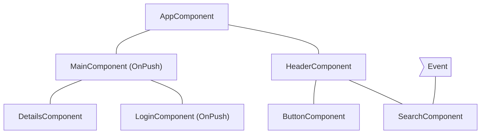
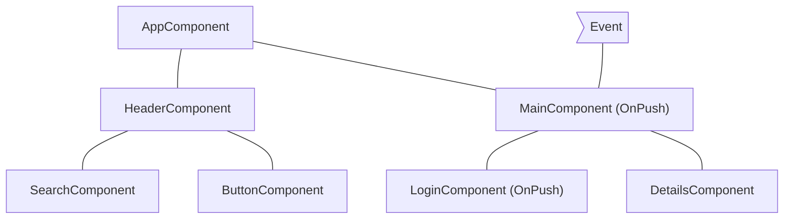
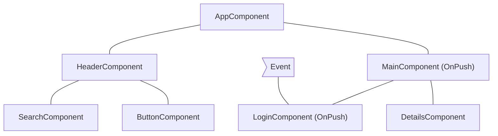
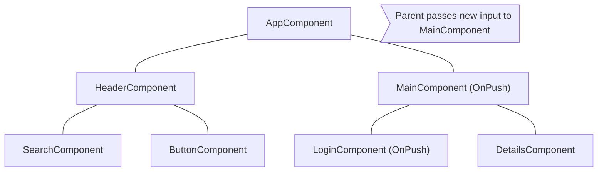

# Best Practices

(From a11y.md)

## Accessibility in Angular

The web is used by a wide variety of people, including those who have visual or motor impairments.
A variety of assistive technologies are available that make it much easier for these groups to interact with web-based software applications.
Also, designing an application to be more accessible generally improves the user experience for all users.

For an in-depth introduction to issues and techniques for designing accessible applications, see Google's web.dev [Learn Accessibility](https://web.dev/learn/accessibility/) course.

This page discusses best practices for designing Angular applications that work well for all users, including those who rely on assistive technologies.

### Accessibility attributes

<!-- TODO: add link once attribute binding guide is implemented -->
Building accessible web experience often involves setting [Accessible Rich Internet Applications \(ARIA\) attributes](https://web.dev/learn/accessibility/aria-html/) to provide semantic meaning where it might otherwise be missing.
Use attribute binding template syntax to control the values of accessibility-related attributes.

When binding to ARIA attributes in Angular, you must use the `attr.` prefix. The ARIA specification depends specifically on HTML attributes rather than properties of DOM elements.

<docs-code language="html">
<!-- Use attr. when binding to an ARIA attribute -->
<button [attr.aria-label]="myActionLabel">…</button>
</docs-code>

NOTE: This syntax is only necessary for attribute *bindings*.
Static ARIA attributes require no extra syntax.

<docs-code language="html">
<!-- Static ARIA attributes require no extra syntax -->
<button aria-label="Save document">…</button>
</docs-code>

HELPFUL: By convention, HTML attributes use lowercase names \(`tabindex`\), while properties use camelCase names \(`tabIndex`\).

<!-- TODO: add link once attribute binding guide implemented -->
See the [Binding syntax guide](guide/templates) for more background on the difference between attributes and properties.

### Angular UI components

The [Angular Material](https://material.angular.dev) library, which is maintained by the Angular team, is a suite of reusable UI components that aims to be fully accessible.
The [Component Development Kit (CDK)](https://material.angular.dev/cdk/categories) includes the `a11y` package that provides tools to support various areas of accessibility.
For example:

* `LiveAnnouncer` is used to announce messages for screen-reader users using an `aria-live` region.
    See the W3C documentation for more information on [aria-live regions](https://www.w3.org/WAI/PF/aria-1.1/states_and_properties#aria-live).

* The `cdkTrapFocus` directive traps Tab-key focus within an element.
    Use it to create accessible experience for components such as modal dialogs, where focus must be constrained.

For full details of these and other tools, see the [Angular CDK accessibility overview](https://material.angular.dev/cdk/a11y/overview).

#### Augmenting native elements

Native HTML elements capture several standard interaction patterns that are important to accessibility.
When authoring Angular components, you should re-use these native elements directly when possible, rather than re-implementing well-supported behaviors.

For example, instead of creating a custom element for a new variety of button, create a component that uses an attribute selector with a native `<button>` element.
This most commonly applies to `<button>` and `<a>`, but can be used with many other types of element.

You can see examples of this pattern in Angular Material:
[`MatButton`](https://github.com/angular/components/blob/main/src/material/button/button.ts#L33C3-L36C5), [`MatTabNav`](https://github.com/angular/components/blob/main/src/material/tabs/tab-nav-bar/tab-nav-bar.ts#L62), and [`MatTable`](https://github.com/angular/components/blob/main/src/material/table/table.ts#L40).

#### Using containers for native elements

Sometimes using the appropriate native element requires a container element.
For example, the native `<input>` element cannot have children, so any custom text entry components need to wrap an `<input>` with extra elements.
By just including `<input>` in your custom component's template, it's impossible for your component's users  to set arbitrary properties and attributes to the `<input>` element.
Instead, create a container component that uses content projection to include the native control in the component's API.

You can see [`MatFormField`](https://material.angular.dev/components/form-field/overview) as an example of this pattern.

### Case study: Building a custom progress bar

The following example shows how to make a progress bar accessible by using host binding to control accessibility-related attributes.

* The component defines an accessibility-enabled element with both the standard HTML attribute `role`, and ARIA attributes.
    The ARIA attribute `aria-valuenow` is bound to the user's input.
* In the template, the `aria-label` attribute ensures that the control is accessible to screen readers.

<docs-code-multifile>
  <docs-code
    path="adev/src/content/examples/accessibility/src/app/progress-bar.component.ts"
    language="ts"
    linenums
    highlight="[12, 20]"/>
  <docs-code
    path="adev/src/content/examples/accessibility/src/app/app.component.html"
    language="html"
    linenums
    highlight="[8, 9]"/>
</docs-code-multifile>

### Routing

#### Focus management after navigation

Tracking and controlling [focus](https://web.dev/learn/accessibility/focus/) in a UI is an important consideration in designing for accessibility.
When using Angular routing, you should decide where page focus goes upon navigation.

To avoid relying solely on visual cues, you need to make sure your routing code updates focus after page navigation.
Use the `NavigationEnd` event from the `Router` service to know when to update focus.

The following example shows how to find and focus the main content header in the DOM after navigation.

<docs-code language="typescript">

router.events.pipe(filter(e => e instanceof NavigationEnd)).subscribe(() => {
  const mainHeader = document.querySelector('#main-content-header')
  if (mainHeader) {
    mainHeader.focus();
  }
});

</docs-code>

In a real application, the element that receives focus depends on your specific application structure and layout.
The focused element should put users in a position to immediately move into the main content that has just been routed into view.
You should avoid situations where focus returns to the `body` element after a route change.

#### Active links identification

CSS classes applied to active `RouterLink` elements, such as `RouterLinkActive`, provide a visual cue to identify the active link.
Unfortunately, a visual cue doesn't help blind or visually impaired users.
Applying the `aria-current` attribute to the element can help identify the active link.
For more information, see [Mozilla Developer Network \(MDN\) aria-current](https://developer.mozilla.org/docs/Web/Accessibility/ARIA/Attributes/aria-current)).

The `RouterLinkActive` directive provides the `ariaCurrentWhenActive` input which sets the `aria-current` to a specified value when the link becomes active.

The following example shows how to apply the `active-page` class to active links as well as setting their `aria-current` attribute to `"page"` when they are active:

```angular-html
<nav>
  <a routerLink="home"
      routerLinkActive="active-page"
      ariaCurrentWhenActive="page">
    Home
  </a>
  <a routerLink="about"
      routerLinkActive="active-page"
      ariaCurrentWhenActive="page">
    About
  </a>
  <a routerLink="shop"
      routerLinkActive="active-page"
      ariaCurrentWhenActive="page">
    Shop
  </a>
</nav>
```

<!-- vale Angular.Angular_Spelling = NO -->

### More information

* [Accessibility - Google Web Fundamentals](https://developers.google.com/web/fundamentals/accessibility)
* [ARIA specification and authoring practices](https://www.w3.org/TR/wai-aria)
* [Material Design - Accessibility](https://material.io/design/usability/accessibility.html)
* [Smashing Magazine](https://www.smashingmagazine.com/search/?q=accessibility)
* [Inclusive Components](https://inclusive-components.design)
* [Accessibility Resources and Code Examples](https://dequeuniversity.com/resources)
* [W3C - Web Accessibility Initiative](https://www.w3.org/WAI/people-use-web)
* [Rob Dodson A11ycasts](https://www.youtube.com/watch?v=HtTyRajRuyY)
* [Angular ESLint](https://github.com/angular-eslint/angular-eslint#functionality) provides linting rules that can help you make sure your code meets accessibility standards.

<!-- vale Angular.Angular_Spelling = YES -->

Books

<!-- vale Angular.Google_Quotes = NO -->

* "A Web for Everyone: Designing Accessible User Experiences," Sarah Horton and Whitney Quesenbery
* "Inclusive Design Patterns," Heydon Pickering

<!-- vale Angular.Google_Quotes = YES -->

---


(From error-handling.md)

## Unhandled errors in Angular

As your Angular application runs, some of your code may throw an error. If left unhandled, these errors can lead to unexpected behavior and a nonresponsive UI. This guide covers how Angular deals with errors that are not explicitly caught by your application code. For guidance on writing your own error handling logic within your application, consult best practices for error handling in JavaScript and Angular.

A fundamental principle in Angular's error handling strategy is that errors should be surfaced to developers at the callsite whenever possible. This approach ensures that the code which initiated an operation has the context necessary to understand the error, handle it appropriately, and decide what the appropriate application state should be. By making errors visible at their origin, developers can implement error handling that is specific to the failed operation and has access to relevant information for recovery or providing informative feedback to the end-user. This also helps to avoid the "Overly general error" smell, where errors are reported without sufficient context to understand their cause.

For example, consider a component that fetches user data from an API. The code responsible for making the API call should include error handling (e.g., using a `try...catch` block or the `catchError` operator in RxJS) to manage potential network issues or errors returned by the API. This allows the component to display a user-friendly error message or retry the request, rather than letting the error propagate unhandled.

### Unhandled errors are reported to the `ErrorHandler`

Angular reports unhandled errors to the application's root [ErrorHandler](api/core/ErrorHandler). When providing a custom `ErrorHandler`, provide it in your `ApplicationConfig` as part of calling `bootstrapApplication`.

When building an Angular application, often you write code that is called automatically _by_ the framework. For example, Angular is responsible for calling a component's constructor and lifecycle methods when that component appears in a template. When the framework runs your code, there's nowhere you could reasonably add a `try` block to gracefully handle errors. In situations like this, Angular catches errors and sends them to the `ErrorHandler`.

Angular does _not_ catch errors inside of APIs that are called directly by your code. For example, if you have a service with a method that throws an error and you call that method in your component, Angular will not automatically catch that error. You are responsible for handling it using mechanisms like `try...catch`.

Angular catches _asynchronous_ errors from user promises or observables only when:

* There is an explicit contract for Angular to wait for and use the result of the asynchronous operation, and
* When errors are not presented in the return value or state.

For example, `AsyncPipe` and `PendingTasks.run` forward errors to the `ErrorHandler`, whereas `resource` presents the error in the `status` and `error` properties.

Errors that Angular reports to the `ErrorHandler` are _unexpected_ errors. These errors may be unrecoverable or an indication that the state of the application is corrupted. Applications should provide error handling using `try` blocks or appropriate error handling operators (like `catchError` in RxJS) where the error occurs whenever possible rather than relying on the `ErrorHandler`, which is most frequently and appropriately used only as a mechanism to report potentially fatal errors to the error tracking and logging infrastructure.

#### `TestBed` rethrows errors by default

In many cases, `ErrorHandler` may only log errors and otherwise allow the application to continue running. In tests, however, you almost always want to surface these errors. Angular's `TestBed` rethrows unexpected errors to ensure that errors caught by the framework cannot be unintentionally missed or ignored. In rare circumstances, a test may specifically attempt to ensure errors do not cause the application to be unresponsive or crash. In these situations, you can [configure `TestBed` to _not_ rethrow application errors](api/core/testing/TestModuleMetadata#rethrowApplicationErrors) with `TestBed.configureTestingModule({rethrowApplicationErrors: false})`.

### Global error listeners

Errors that are caught neither by the application code nor by the framework's application instance may reach the global scope. Errors reaching the global scope can have unintended consequences if not accounted for. In non-browser environments, they may cause the process to crash. In the browser, these errors may go unreported and site visitors may see the errors in the browser console. Angular provides global listeners for both environments to account for these issues.

#### Client-side rendering

Adding [`provideBrowserGlobalErrorListeners()`](/api/core/provideBrowserGlobalErrorListeners) to the [ApplicationConfig](guide/di/dependency-injection#at-the-application-root-level-using-applicationconfig) adds the `'error'` and `'unhandledrejection'` listeners to the browser window and forwards those errors to `ErrorHandler`. The Angular CLI generates new applications with this provider by default. The Angular team recommends handling these global errors for most applications, either with the framework's built-in listeners or with your own custom listeners. If you provide custom listeners, you can remove `provideBrowserGlobalErrorListeners`.

#### Server-side and hybrid rendering

When using [Angular with SSR](guide/ssr), Angular automatically adds the `'unhandledRejection'` and `'uncaughtException'` listeners to the server process. These handlers prevent the server from crashing and instead log captured errors to the console.

IMPORTANT: If the application is using Zone.js, only the `'unhandledRejection'` handler is added. When Zone.js is present, errors inside the Application's Zone are already forwarded to the application `ErrorHandler` and do not reach the server process.

---


(From overview.md)

## Runtime performance optimization

Fast rendering is critical for Angular and we've built the framework with a lot of optimizations in mind to help you develop performant apps. To better understand the performance of your app we offer [Angular DevTools](tools/devtools) and a [video guide](https://www.youtube.com/watch?v=FjyX_hkscII) on how to use Chrome DevTools for profiling. In this section we cover the most common performance optimization techniques.

**Change detection** is the process through which Angular checks to see whether your application state has changed, and if any DOM needs to be updated. At a high level, Angular walks your components from top to bottom, looking for changes. Angular runs its change detection mechanism periodically so that changes to the data model are reflected in an application’s view. Change detection can be triggered either manually or through an asynchronous event (for example, a user interaction or an XMLHttpRequest completion).

Change detection is highly optimized and performant, but it can still cause slowdowns if the application runs it too frequently.

In this guide, you’ll learn how to control and optimize the change detection mechanism by skipping parts of your application and running change detection only when necessary.

Watch this video if you prefer to learn more about performance optimizations in a media format:

<docs-video src="https://www.youtube.com/embed/f8sA-i6gkGQ"/>

---


(From skipping-subtrees.md)

## Skipping component subtrees

JavaScript, by default, uses mutable data structures that you can reference from multiple different components. Angular runs change detection over your entire component tree to make sure that the most up-to-date state of your data structures is reflected in the DOM.

Change detection is sufficiently fast for most applications. However, when an application has an especially large component tree, running change detection across the whole application can cause performance issues. You can address this by configuring change detection to only run on a subset of the component tree.

If you are confident that a part of the application is not affected by a state change, you can use [OnPush](/api/core/ChangeDetectionStrategy) to skip change detection in an entire component subtree.

### Using `OnPush`

OnPush change detection instructs Angular to run change detection for a component subtree **only** when:

* The root component of the subtree receives new inputs as the result of a template binding. Angular compares the current and past value of the input with `==`.
* Angular handles an event _(for example using event binding, output binding, or `@HostListener` )_ in the subtree's root component or any of its children whether they are using OnPush change detection or not.

You can set the change detection strategy of a component to `OnPush` in the `@Component` decorator:

```ts
import { ChangeDetectionStrategy, Component } from '@angular/core';
@Component({
  changeDetection: ChangeDetectionStrategy.OnPush,
})
export class MyComponent {}
```

### Common change detection scenarios

This section examines several common change detection scenarios to illustrate Angular's behavior.

#### An event is handled by a component with default change detection

If Angular handles an event within a component without `OnPush` strategy, the framework executes change detection on the entire component tree. Angular will skip descendant component subtrees with roots using `OnPush`, which have not received new inputs.

As an example, if we set the change detection strategy of `MainComponent` to `OnPush` and the user interacts with a component outside the subtree with root `MainComponent`, Angular will check all the pink components from the diagram below (`AppComponent`, `HeaderComponent`, `SearchComponent`, `ButtonComponent`) unless `MainComponent` receives new inputs:



### An event is handled by a component with OnPush

If Angular handles an event within a component with OnPush strategy, the framework will execute change detection within the entire component tree. Angular will ignore component subtrees with roots using OnPush, which have not received new inputs and are outside the component which handled the event.

As an example, if Angular handles an event within `MainComponent`, the framework will run change detection in the entire component tree. Angular will ignore the subtree with root `LoginComponent` because it has `OnPush` and the event happened outside of its scope.



### An event is handled by a descendant of a component with OnPush

If Angular handles an event in a component with OnPush, the framework will execute change detection in the entire component tree, including the component’s ancestors.

As an example, in the diagram below, Angular handles an event in `LoginComponent` which uses OnPush. Angular will invoke change detection in the entire component subtree including `MainComponent` (`LoginComponent`’s parent), even though `MainComponent` has `OnPush` as well. Angular checks `MainComponent` as well because `LoginComponent` is part of its view.



### New inputs to component with OnPush

Angular will run change detection within a child component with `OnPush` when setting an input property as result of a template binding.

For example, in the diagram below, `AppComponent` passes a new input to `MainComponent`, which has `OnPush`. Angular will run change detection in `MainComponent` but will not run change detection in `LoginComponent`, which also has `OnPush`, unless it receives new inputs as well.



### Edge cases

* **Modifying input properties in TypeScript code**. When you use an API like `@ViewChild` or `@ContentChild` to get a reference to a component in TypeScript and manually modify an `@Input` property, Angular will not automatically run change detection for OnPush components. If you need Angular to run change detection, you can inject `ChangeDetectorRef` in your component and call `changeDetectorRef.markForCheck()` to tell Angular to schedule a change detection.
* **Modifying object references**. In case an input receives a mutable object as value and you modify the object but preserve the reference, Angular will not invoke change detection. That’s the expected behavior because the previous and the current value of the input point to the same reference.

---


(From slow-computations.md)

## Slow computations

On every change detection cycle, Angular synchronously:

* Evaluates all template expressions in all components, unless specified otherwise, based on that each component's detection strategy
* Executes the `ngDoCheck`, `ngAfterContentChecked`, `ngAfterViewChecked`, and `ngOnChanges` lifecycle hooks.
A single slow computation within a template or a lifecycle hook can slow down the entire change detection process because Angular runs the computations sequentially.

### Identifying slow computations

You can identify heavy computations with Angular DevTools’ profiler. In the performance timeline, click a bar to preview a particular change detection cycle. This displays a bar chart, which shows how long the framework spent in change detection for each component. When you click a component, you can preview how long Angular spent  evaluating its template and lifecycle hooks.


For example, in the preceding screenshot, the second recorded change detection cycle is selected. Angular spent over 573 ms on this cycle, with the most time spent in the `EmployeeListComponent`. In the details panel, you can see that Angular spent over 297 ms evaluating the template of the `EmployeeListComponent`.

### Optimizing slow computations

Here are several techniques to remove slow computations:

* **Optimizing the underlying algorithm**. This is the recommended approach. If you can speed up the algorithm that is causing the problem, you can speed up the entire change detection mechanism.
* **Caching using pure pipes**. You can move the heavy computation to a pure [pipe](guide/pipes). Angular reevaluates a pure pipe only if it detects that its inputs have changed, compared to the previous time Angular called it.
* **Using memoization**. [Memoization](https://en.wikipedia.org/wiki/Memoization) is a similar technique to pure pipes, with the difference that pure pipes preserve only the last result from the computation where memoization could store multiple results.
* **Avoid repaints/reflows in lifecycle hooks**. Certain [operations](https://web.dev/avoid-large-complex-layouts-and-layout-thrashing/) cause the browser to either synchronously recalculate the layout of the page or re-render it. Since reflows and repaints are generally slow, you want to avoid performing them in every change detection cycle.

Pure pipes and memoization have different trade-offs. Pure pipes are an Angular built-in concept compared to memoization, which is a general software engineering practice for caching function results. The memory overhead of memoization could be significant if you invoke the heavy computation frequently with different arguments.

---


(From zone-pollution.md)

## Resolving zone pollution

**Zone.js** is a signaling mechanism that Angular uses to detect when an application state might have changed. It captures asynchronous operations like `setTimeout`, network requests, and event listeners. Angular schedules change detection based on signals from Zone.js.

In some cases scheduled [tasks](https://developer.mozilla.org/docs/Web/API/HTML_DOM_API/Microtask_guide#tasks) or [microtasks](https://developer.mozilla.org/docs/Web/API/HTML_DOM_API/Microtask_guide#microtasks) don’t make any changes in the data model, which makes running change detection unnecessary. Common examples are:

* `requestAnimationFrame`, `setTimeout` or `setInterval`
* Task or microtask scheduling by third-party libraries

This section covers how to identify such conditions, and how to run code outside the Angular zone to avoid unnecessary change detection calls.

### Identifying unnecessary change detection calls

You can detect unnecessary change detection calls using Angular DevTools. Often they appear as consecutive bars in the profiler’s timeline with source `setTimeout`, `setInterval`, `requestAnimationFrame`, or an event handler. When you have limited calls within your application of these APIs, the change detection invocation is usually caused by a third-party library.


In the image above, there is a series of change detection calls triggered by event handlers associated with an element. That’s a common challenge when using third-party, non-native Angular components, which do not alter the default behavior of `NgZone`.

### Run tasks outside `NgZone`

In such cases, you can instruct Angular to avoid calling change detection for tasks scheduled by a given piece of code using [NgZone](/api/core/NgZone).

<docs-code header="Run outside of the Zone" language='ts' linenums>
import { Component, NgZone, OnInit } from '@angular/core';

@Component(...)
class AppComponent implements OnInit {
  private ngZone = inject(NgZone);

  ngOnInit() {
    this.ngZone.runOutsideAngular(() => setInterval(pollForUpdates), 500);
  }
}
</docs-code>

The preceding snippet instructs Angular to call `setInterval` outside the Angular Zone and skip running change detection after `pollForUpdates` runs.

Third-party libraries commonly trigger unnecessary change detection cycles when their APIs are invoked within the Angular zone. This phenomenon particularly affects libraries that set up event listeners or initiate other tasks (such as timers, XHR requests, etc.). Avoid these extra cycles by calling library APIs outside the Angular zone:

<docs-code header="Move the plot initialization outside of the Zone" language='ts' linenums>
import { Component, NgZone, OnInit } from '@angular/core';
import * as Plotly from 'plotly.js-dist-min';

@Component(...)
class AppComponent implements OnInit {
  private ngZone = inject(NgZone);

  ngOnInit() {
    this.ngZone.runOutsideAngular(() => {
      Plotly.newPlot('chart', data);
    });
  }
}
</docs-code>

Running `Plotly.newPlot('chart', data);` within `runOutsideAngular` instructs the framework that it shouldn’t run change detection after the execution of tasks scheduled by the initialization logic.

For example, if `Plotly.newPlot('chart', data)` adds event listeners to a DOM element, Angular does not run change detection after the execution of their handlers.

But sometimes, you may need to listen to events dispatched by third-party APIs. In such cases, it's important to remember that those event listeners will also execute outside of the Angular zone if the initialization logic was done there:

<docs-code header="Check whether the handler is called outside of the Zone" language='ts' linenums>
import { Component, NgZone, OnInit, output } from '@angular/core';
import * as Plotly from 'plotly.js-dist-min';

@Component(...)
class AppComponent implements OnInit {
  private ngZone = inject(NgZone);

  plotlyClick = output<Plotly.PlotMouseEvent>();

  ngOnInit() {
    this.ngZone.runOutsideAngular(() => {
      this.createPlotly();
    });
  }

  private async createPlotly() {
    const plotly = await Plotly.newPlot('chart', data);

    plotly.on('plotly_click', (event: Plotly.PlotMouseEvent) => {
      // This handler will be called outside of the Angular zone because
      // the initialization logic is also called outside of the zone. To check
      // whether we're in the Angular zone, we can call the following:
      console.log(NgZone.isInAngularZone());
      this.plotlyClick.emit(event);
    });
  }
}
</docs-code>

If you need to dispatch events to parent components and execute specific view update logic, you should consider re-entering the Angular zone to instruct the framework to run change detection or run change detection manually:

<docs-code header="Re-enter the Angular zone when dispatching event" language='ts' linenums>
import { Component, NgZone, OnInit, output } from '@angular/core';
import * as Plotly from 'plotly.js-dist-min';

@Component(...)
class AppComponent implements OnInit {
  private ngZone = inject(NgZone);

  plotlyClick = output<Plotly.PlotMouseEvent>();

  ngOnInit() {
    this.ngZone.runOutsideAngular(() => {
      this.createPlotly();
    });
  }

  private async createPlotly() {
    const plotly = await Plotly.newPlot('chart', data);

    plotly.on('plotly_click', (event: Plotly.PlotMouseEvent) => {
      this.ngZone.run(() => {
        this.plotlyClick.emit(event);
      });
    });
  }
}
</docs-code>

The scenario of dispatching events outside of the Angular zone may also arise. It's important to remember that triggering change detection (for example, manually) may result in the creation/update of views outside of the Angular zone.

---


(From style-guide.md)

## Angular coding style guide

### Introduction

This guide covers a range of style conventions for Angular application code. These recommendations
are not required for Angular to work, but instead establish a set of coding practices that promote
consistency across the Angular ecosystem. A consistent set of practices makes it easier to share
code and move between projects.

This guide does _not_ cover TypeScript or general coding practices unrelated to Angular. For
TypeScript, check
out [Google's TypeScript style guide](https://google.github.io/styleguide/tsguide.html).

#### When in doubt, prefer consistency

Whenever you encounter a situation in which these rules contradict the style of a particular file,
prioritize maintaining consistency within a file. Mixing different style conventions in a single
file creates more confusion than diverging from the recommendations in this guide.

### Naming

#### Separate words in file names with hyphens

Separate words within a file name with hyphens (`-`). For example, a component named `UserProfile`
has a file name `user-profile.ts`.

#### Use the same name for a file's tests with `.spec` at the end

For unit tests, end file names with `.spec.ts`. For example, the unit test file for
the `UserProfile` component has the file name `user-profile.spec.ts`.

#### Match file names to the TypeScript identifier within

File names should generally describe the contents of the code in the file. When the file contains a
TypeScript class, the file name should reflect that class name. For example, a file containing a
component named `UserProfile` has the name `user-profile.ts`.

If the file contains more than one primary namable identifier, choose a name that describes the
common theme to the code within. If the code in a file does not fit within a common theme or feature
area, consider breaking the code up into different files. Avoid overly generic file names
like `helpers.ts`, `utils.ts`, or `common.ts`.

#### Use the same file name for a component's TypeScript, template, and styles

Components typically consist of one TypeScript file, one template file, and one style file. These
files should share the same name with different file extensions. For example, a `UserProfile`
component can have the files `user-profile.ts`, `user-profile.html`, and `user-profile.css`.

If a component has more than one style file, append the name with additional words that describe the
styles specific to that file. For example, `UserProfile` might have style
files `user-profile-settings.css` and `user-profile-subscription.css`.

### Project structure

#### All the application's code goes in a directory named `src`

All of your Angular UI code (TypeScript, HTML, and styles) should live inside a directory
named `src`. Code that's not related to UI, such as configuration files or scripts, should live
outside the `src` directory.

This keeps the root application directory consistent between different Angular projects and creates
a clear separation between UI code and other code in your project.

#### Bootstrap your application in a file named `main.ts` directly inside `src`

The code to start up, or **bootstrap**, an Angular application should always live in a file
named `main.ts`. This represents the primary entry point to the application.

#### Group closely related files together in the same directory

Angular components consist of a TypeScript file and, optionally, a template and one or more style
files. You should group these together in the same directory.

Unit tests should live in the same directory as the code-under-test. Avoid collecting unrelated
tests into a single `tests` directory.

#### Organize your project by feature areas

Organize your project into subdirectories based on the features or your application or common themes
to the code in those directories. For example, the project structure for a movie theater site,
MovieReel, might look like this:

```
src/
├─ movie-reel/
│ ├─ show-times/
│ │ ├─ film-calendar/
│ │ ├─ film-details/
│ ├─ reserve-tickets/
│ │ ├─ payment-info/
│ │ ├─ purchase-confirmation/
```

Avoid creating subdirectories based on the type of code that lives in those directories. For
example, avoid creating directories like `components`, `directives`, and `services`.

Avoid putting so many files into one directory that it becomes hard to read or navigate. As the
number files in a directory grows, consider splitting further into additional sub-directories.

#### One concept per file

Prefer focusing source files on a single _concept_. For Angular classes specifically, this usually
means one component, directive, or service per file. However, it's okay if a file contains more than
one component or directive if your classes are relatively small and they tie together as part of a
single concept.

When in doubt, go with the approach that leads to smaller files.

### Dependency injection

#### Prefer the `inject` function over constructor parameter injection

Prefer using the `inject` function over injecting constructor parameters. The `inject` function works the same way as constructor parameter injection, but offers several style advantages:

*   `inject` is generally more readable, especially when a class injects many dependencies.
*   It's more syntactically straightforward to add comments to injected dependencies
*   `inject` offers better type inference.
*   When targeting ES2022+ with [`useDefineForClassFields`](https://www.typescriptlang.org/tsconfig/#useDefineForClassFields), you can avoid separating field declaration and initialization when fields read on injected dependencies.

[You can refactor existing code to `inject` with an automatic tool](reference/migrations/inject-function).

### Components and directives

#### Choosing component selectors

See
the [Components guide for details on choosing component selectors](guide/components/selectors#choosing-a-selector).

#### Naming component and directive members

See the Components guide for details
on [naming input properties](guide/components/inputs#choosing-input-names)
and [naming output properties](guide/components/outputs#choosing-event-names).

#### Choosing directive selectors

Directives should use the
same [application-specific prefix](guide/components/selectors#selector-prefixes)
as your components.

When using an attribute selector for a directive, use a camelCase attribute name. For example, if
your application is named "MovieReel" and you build a directive that adds a tooltip to an element,
you might use the selector `[mrTooltip]`.

#### Group Angular-specific properties before methods

Components and directives should group Angular-specific properties together, typically near the top
of the class declaration. This includes injected dependencies, inputs, outputs, and queries. Define
these and other properties before the class's methods.

This practice makes it easier to find the class's template APIs and dependencies.

#### Keep components and directives focused on presentation

Code inside your components and directives should generally relate to the UI shown on the page. For
code that makes sense on its own, decoupled from the UI, prefer refactoring to other files. For
example, you can factor form validation rules or data transformations into separate functions or
classes.

#### Avoid overly complex logic in templates

Angular templates are designed to
accommodate [JavaScript-like expressions](guide/templates/expression-syntax).
You should take advantage of these expressions to capture relatively straightforward logic directly
in template expressions.

When the code in a template gets too complex, though, refactor logic into the TypeScript code (
typically with a [computed](guide/signals#computed-signals)).

There's no one hard-and-fast rule that determines what constitutes "complex". Use your best
judgement.

#### Use `protected` on class members that are only used by a component's template

A component class's public members intrinsically define a public API that's accessible via
dependency injection and [queries](guide/components/queries). Prefer `protected`
access for any members that are meant to be read from the component's template.

```ts
@Component({
  ...,
  template: `<p>{{ fullName() }}</p>`,
})
export class UserProfile {
  firstName = input();
  lastName = input();

// `fullName` is not part of the component's public API, but is used in the template.
  protected fullName = computed(() => `${this.firstName()} ${this.lastName()}`);
}
```

#### Use `readonly` on properties that are initialized by Angular

Mark component and directive properties initialized by Angular as `readonly`. This includes
properties initialized by `input`, `model`, `output`, and queries. The readonly access modifier
ensures that the value set by Angular is not overwritten.

```ts
@Component({/* ... */})
export class UserProfile {
  readonly userId = input();
  readonly userSaved = output();
}
```

For components and directives that use the decorator-based `@Input`, `@Output`, and query APIs, this
advice applies to output properties and queries, but not input properties.

```ts
@Component({/* ... */})
export class UserProfile {
  @Output() readonly userSaved = new EventEmitter<void>();
  @ViewChildren(PaymentMethod) readonly paymentMethods?: QueryList<PaymentMethod>;
}
```

#### Prefer `class` and `style` over `ngClass` and `ngStyle`

Prefer `class` and `style` bindings over using the `NgClass` and `NgStyle` directives.

```html
<!-- PREFER -->
<div [class.admin]="isAdmin" [class.dense]="density === 'high'">

<!-- AVOID -->
<div [ngClass]="{admin: isAdmin, dense: density === 'high'}">
```

Both `class` and `style` bindings use a more straightforward syntax that aligns closely with
standard HTML attributes. This makes your templates easier to read and understand, especially for
developers familiar with basic HTML.

Additionally, the `NgClass` and `NgStyle` directives incur an additional performance cost compared
to the built-in `class` and `style` binding syntax.

#### Name event handlers for what they _do_, not for the triggering event

Prefer naming event handlers for the action they perform rather than for the triggering event:

```html
<!-- PREFER -->
<button (click)="saveUserData()">Save</button>

<!-- AVOID -->
<button (click)="handleClick()">Save</button>
```

Using meaningful names like this makes it easier to tell what an event does from reading the
template.

For keyboard events, you can use Angular's key event modifiers with specific handler names:

```html
<textarea (keydown.control.enter)="commitNotes()" (keydown.control.space)="showSuggestions()">
```

Sometimes, event handling logic is especially long or complex, making it impractical to declare a
single well-named handler. In these cases, it's fine to fall back to a name like 'handleKeydown' and
then delegate to more specific behaviors based on the event details:

```ts

@Component({/* ... */})
class RichText {
  handleKeydown(event: KeyboardEvent) {
    if (event.ctrlKey) {
      if (event.key === 'B') {
        this.activateBold();
      } else if (event.key === 'I') {
        this.activateItalic();
      }
// ...
    }
  }
}
```

#### Keep lifecycle methods simple

Avoid putting long or complex logic inside lifecycle hooks like `ngOnInit`. Instead, prefer creating
well-named methods to contain that logic and then _call those methods_ in your lifecycle hooks.
Lifecycle hook names describe _when_ they run, meaning that the code inside doesn't have a
meaningful name that describes what the code inside is doing.

```typescript
// PREFER
ngOnInit() {
  this.startLogging();
  this.runBackgroundTask();
}

// AVOID
ngOnInit() {
  this.logger.setMode('info');
  this.logger.monitorErrors();
  // ...and all the rest of the code that would be unrolled from these methods.
}
```

#### Use lifecycle hook interfaces

Angular provides a TypeScript interface for each lifecycle method. When adding a lifecycle hook to
your class, import and `implement` these interfaces to ensure that the methods are named correctly.

```ts
import {Component, OnInit} from '@angular/core';

@Component({/* ... */})
export class UserProfile implements OnInit {

  // The `OnInit` interface ensures this method is named correctly.
  ngOnInit() { /* ... */ }
}
```

---


(From update.md)

## Keeping your Angular projects up-to-date

Just like Web and the entire web ecosystem, Angular is continuously improving.
Angular balances continuous improvement with a strong focus on stability and making updates straightforward.
Keeping your Angular application up-to-date enables you to take advantage of leading-edge new features, as well as optimizations and bug fixes.

This document contains information and resources to help you keep your Angular applications and libraries up-to-date.

For information about our versioning policy and practices —including support and deprecation practices, as well as the release schedule— see [Angular versioning and releases](reference/releases "Angular versioning and releases").

HELPFUL: If you are currently using AngularJS, see [Upgrading from AngularJS](https://angular.io/guide/upgrade "Upgrading from Angular JS").
*AngularJS* is the name for all v1.x versions of Angular.

### Getting notified of new releases

To be notified when new releases are available, follow [@angular](https://x.com/angular "@angular on X") on X (formerly Twitter) or subscribe to the [Angular blog](https://blog.angular.dev "Angular blog").

### Learning about new features

What's new? What's changed? We share the most important things you need to know on the Angular blog in [release announcements]( https://blog.angular.dev/ "Angular blog - release announcements").

To review a complete list of changes, organized by version, see the [Angular change log](https://github.com/angular/angular/blob/main/CHANGELOG.md "Angular change log").

### Checking your version of Angular

To check your application's version of Angular use the `ng version` command from within your project directory.

### Finding the current version of Angular

The most recent stable released version of Angular appears [on npm](https://www.npmjs.com/package/@angular/core "Angular on npm") under "Version." For example, `16.2.4`.

You can also find the most current version of Angular by using the CLI command [`ng update`](cli/update).
By default, [`ng update`](cli/update)(without additional arguments) lists the updates that are available to you.

### Updating your environment and apps

To make updating uncomplicated, we provide complete instructions in the interactive [Angular Update Guide](update-guide).

The Angular Update Guide provides customized update instructions, based on the current and target versions that you specify.
It includes basic and advanced update paths, to match the complexity of your applications.
It also includes troubleshooting information and any recommended manual changes to help you get the most out of the new release.

For simple updates, the CLI command [`ng update`](cli/update) is all you need.
Without additional arguments, [`ng update`](cli/update) lists the updates that are available to you and provides recommended steps to update your application to the most current version.

[Angular Versioning and Releases](reference/releases#versioning "Angular Release Practices, Versioning") describes the level of change that you can expect based on a release's version number.
It also describes supported update paths.

### Resource summary

* Release announcements:
    [Angular blog - release announcements](https://blog.angular.dev/ "Angular blog announcements about recent releases")

* Release details:
    [Angular change log](https://github.com/angular/angular/blob/main/CHANGELOG.md "Angular change log")

* Update instructions:
    [Angular Update Guide](update-guide)

* Update command reference:
    [Angular CLI `ng update` command reference](cli/update)

* Versioning, release, support, and deprecation practices:
    [Angular versioning and releases](reference/releases "Angular versioning and releases")

---