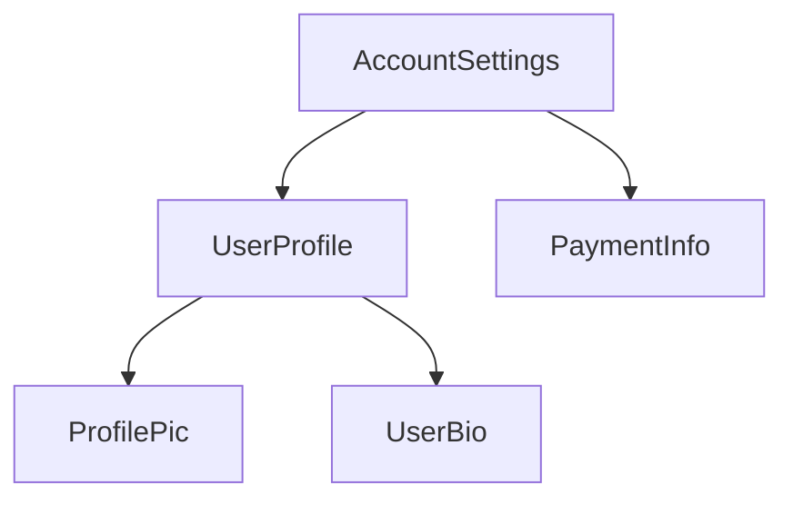
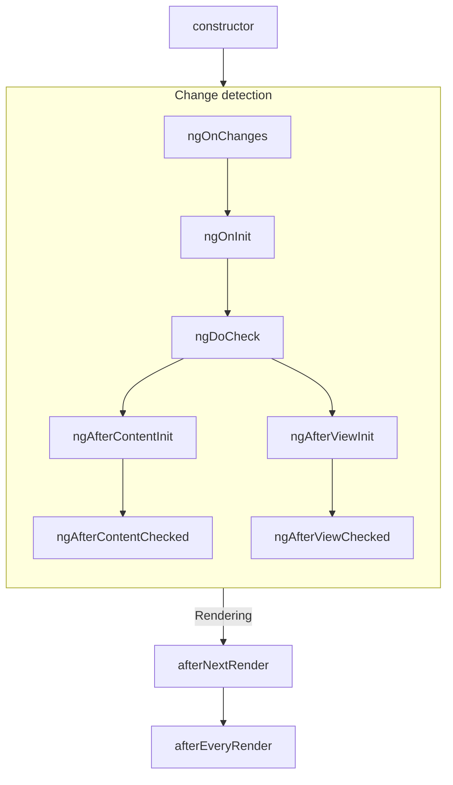
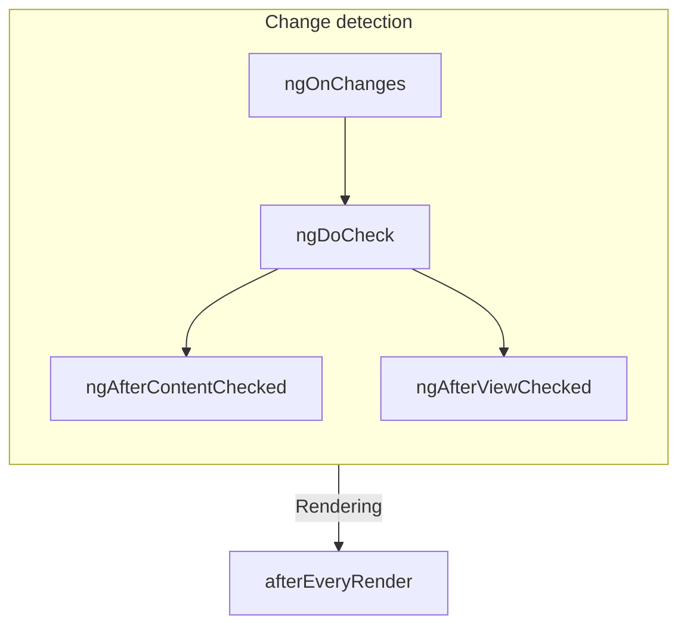

# Guide Components

(From advanced-configuration.md)

## Advanced component configuration

TIP: This guide assumes you've already read the [Essentials Guide](essentials). Read that first if you're new to Angular.

### ChangeDetectionStrategy

The `@Component` decorator accepts a `changeDetection` option that controls the component's **change
detection mode**. There are two change detection mode options.

**`ChangeDetectionStrategy.Default`** is, unsurprisingly, the default strategy. In this mode,
Angular checks whether the component's DOM needs an update whenever any activity may have occurred
application-wide. Activities that trigger this checking include user interaction, network response,
timers, and more.

**`ChangeDetectionStrategy.OnPush`** is an optional mode that reduces the amount of checking Angular
needs to perform. In this mode, the framework only checks if a component's DOM needs an update when:

- A component input has changes as a result of a binding in a template, or
- An event listener in this component runs
- The component is explicitly marked for check, via `ChangeDetectorRef.markForCheck` or something which wraps it, like `AsyncPipe`.

Additionally, when an OnPush component is checked, Angular _also_ checks all of its ancestor
components, traversing upwards through the application tree.

### PreserveWhitespaces

By default, Angular removes and collapses superfluous whitespace in templates, most commonly from
newlines and indentation. You can change this setting by explicitly setting `preserveWhitespaces` to
`true` in a component's metadata.

### Custom element schemas

By default, Angular throws an error when it encounters an unknown HTML element. You can
disable this behavior for a component by including `CUSTOM_ELEMENTS_SCHEMA` in the `schemas`
property in your component metadata.

```angular-ts
import {Component, CUSTOM_ELEMENTS_SCHEMA} from '@angular/core';

@Component({
  ...,
  schemas: [CUSTOM_ELEMENTS_SCHEMA],
  template: '<some-unknown-component></some-unknown-component>'
})
export class ComponentWithCustomElements { }
```

Angular does not support any other schemas at this time.

---


(From anatomy-of-components.md)

<docs-decorative-header title="Anatomy of a component" imgSrc="adev/src/assets/images/components.svg"> <!-- markdownlint-disable-line -->
</docs-decorative-header>

TIP: This guide assumes you've already read the [Essentials Guide](essentials). Read that first if you're new to Angular.

Every component must have:

* A TypeScript class with _behaviors_ such as handling user input and fetching data from a server
* An HTML template that controls what renders into the DOM
* A [CSS selector](https://developer.mozilla.org/docs/Learn/CSS/Building_blocks/Selectors) that defines how the component is used in HTML

You provide Angular-specific information for a component by adding a `@Component` [decorator](https://www.typescriptlang.org/docs/handbook/decorators.html) on top of the TypeScript class:

<docs-code language="angular-ts" highlight="[1, 2, 3, 4]">
@Component({
  selector: 'profile-photo',
  template: ``,
})
export class ProfilePhoto { }
</docs-code>

For full details on writing Angular templates, including data binding, event handling, and control flow, see the [Templates guide](guide/templates).

The object passed to the `@Component` decorator is called the component's **metadata**. This includes the `selector`, `template`, and other properties described throughout this guide.

Components can optionally include a list of CSS styles that apply to that component's DOM:

<docs-code language="angular-ts" highlight="[4]">
@Component({
  selector: 'profile-photo',
  template: ``,
  styles: `img { border-radius: 50%; }`,
})
export class ProfilePhoto { }
</docs-code>

By default, a component's styles only affect elements defined in that component's template. See [Styling Components](guide/components/styling) for details on Angular's approach to styling.

You can alternatively choose to write your template and styles in separate files:

<docs-code language="angular-ts" highlight="[3, 4]">
@Component({
  selector: 'profile-photo',
  templateUrl: 'profile-photo.html',
  styleUrl: 'profile-photo.css',
})
export class ProfilePhoto { }
</docs-code>

This can help separate the concerns of _presentation_ from _behavior_ in your project. You can choose one approach for your entire project, or you decide which to use for each component.

Both `templateUrl` and `styleUrl` are relative to the directory in which the component resides.

### Using components

#### Imports in the `@Component` decorator

To use a component, [directive](guide/directives), or [pipe](guide/templates/pipes), you must add
it to the `imports` array in the `@Component` decorator:

```angular-ts
import {ProfilePhoto} from './profile-photo';

@Component({
  // Import the `ProfilePhoto` component in
  // order to use it in this component's template.
  imports: [ProfilePhoto],
  /* ... */
})
export class UserProfile { }
```

By default, Angular components are *standalone*, meaning that you can directly add them to the `imports` array of other components. Components created with an earlier version of Angular may instead specify `standalone: false` in their `@Component` decorator. For these components, you instead import the `NgModule` in which the component is defined. See the full [`NgModule` guide](guide/ngmodules) for details.

Important: In Angular versions before 19.0.0, the `standalone` option defaults to `false`.

#### Showing components in a template

Every component defines a [CSS selector](https://developer.mozilla.org/docs/Learn/CSS/Building_blocks/Selectors):

<docs-code language="angular-ts" highlight="[2]">
@Component({
  selector: 'profile-photo',
  ...
})
export class ProfilePhoto { }
</docs-code>

See [Component Selectors](guide/components/selectors) for details about which types of selectors Angular supports and guidance on choosing a selector.

You show a component by creating a matching HTML element in the template of _other_ components:

<docs-code language="angular-ts" highlight="[8]">
@Component({
  selector: 'profile-photo',
})
export class ProfilePhoto { }

@Component({
  imports: [ProfilePhoto],
  template: `<profile-photo />`
})
export class UserProfile { }
</docs-code>

Angular creates an instance of the component for every matching HTML element it encounters. The DOM element that matches a component's selector is referred to as that component's **host element**. The contents of a component's template are rendered inside its host element.

The DOM rendered by a component, corresponding to that component's template, is called that
component's **view**.

In composing components in this way, **you can think of your Angular application as a tree of components**.




This tree structure is important to understanding several other Angular concepts, including [dependency injection](guide/di) and [child queries](guide/components/queries).

---


(From content-projection.md)

## Content projection with ng-content

TIP: This guide assumes you've already read the [Essentials Guide](essentials). Read that first if you're new to Angular.

You often need to create components that act as containers for different types of content. For
example, you may want to create a custom card component:

```angular-ts
@Component({
  selector: 'custom-card',
  template: '<div class="card-shadow"> <!-- card content goes here --> </div>',
})
export class CustomCard {/* ... */}
```

**You can use the `<ng-content>` element as a placeholder to mark where content should go**:

```angular-ts
@Component({
  selector: 'custom-card',
  template: '<div class="card-shadow"> <ng-content></ng-content> </div>',
})
export class CustomCard {/* ... */}
```

TIP: `<ng-content>` works similarly
to [the native `<slot>` element](https://developer.mozilla.org/docs/Web/HTML/Element/slot),
but with some Angular-specific functionality.

When you use a component with `<ng-content>`, any children of the component host element are
rendered, or **projected**, at the location of that `<ng-content>`:

```angular-ts
// Component source
@Component({
  selector: 'custom-card',
  template: `
    <div class="card-shadow">
      <ng-content />
    </div>
  `,
})
export class CustomCard {/* ... */}
```

```angular-html
<!-- Using the component -->
<custom-card>
  <p>This is the projected content</p>
</custom-card>
```

```angular-html
<!-- The rendered DOM -->
<custom-card>
  <div class="card-shadow">
    <p>This is the projected content</p>
  </div>
</custom-card>
```

Angular refers to any children of a component passed this way as that component's **content**. This
is distinct from the component's **view**, which refers to the elements defined in the component's
template.

**The `<ng-content>` element is neither a component nor DOM element**. Instead, it is a special
placeholder that tells Angular where to render content. Angular's compiler processes
all `<ng-content>` elements at build-time. You cannot insert, remove, or modify `<ng-content>` at
run time. You cannot add directives, styles, or arbitrary attributes to `<ng-content>`.

You should not conditionally include `<ng-content>` with `@if`, `@for`, or `@switch`. Angular always
instantiates and creates DOM nodes for content rendered to a `<ng-content>` placeholder, even if
that `<ng-content>` placeholder is hidden. For conditional rendering of component content,
see [Template fragments](api/core/ng-template).

### Multiple content placeholders

Angular supports projecting multiple different elements into different `<ng-content>` placeholders
based on CSS selector. Expanding the card example from above, you could create two placeholders for
a card title and a card body by using the `select` attribute:

```angular-html
<!-- Component template -->
<div class="card-shadow">
  <ng-content select="card-title"></ng-content>
  <div class="card-divider"></div>
  <ng-content select="card-body"></ng-content>
</div>
```

```angular-html
<!-- Using the component -->
<custom-card>
  <card-title>Hello</card-title>
  <card-body>Welcome to the example</card-body>
</custom-card>
```

```angular-html
<!-- Rendered DOM -->
<custom-card>
  <div class="card-shadow">
    <card-title>Hello</card-title>
    <div class="card-divider"></div>
    <card-body>Welcome to the example</card-body>
  </div>
</custom-card>
```

The `<ng-content>` placeholder supports the same CSS selectors
as [component selectors](guide/components/selectors).

If you include one or more `<ng-content>` placeholders with a `select` attribute and
one `<ng-content>` placeholder without a `select` attribute, the latter captures all elements that
did not match a `select` attribute:

```angular-html
<!-- Component template -->
<div class="card-shadow">
  <ng-content select="card-title"></ng-content>
  <div class="card-divider"></div>
  <!-- capture anything except "card-title" -->
  <ng-content></ng-content>
</div>
```

```angular-html
<!-- Using the component -->
<custom-card>
  <card-title>Hello</card-title>
  
  <p>Welcome to the example</p>
</custom-card>
```

```angular-html
<!-- Rendered DOM -->
<custom-card>
  <div class="card-shadow">
    <card-title>Hello</card-title>
    <div class="card-divider"></div>
    
    <p>Welcome to the example</p>
  </div>
</custom-card>
```

If a component does not include an `<ng-content>` placeholder without a `select` attribute, any
elements that don't match one of the component's placeholders do not render into the DOM.

### Fallback content

Angular can show *fallback content* for a component's `<ng-content>` placeholder if that component doesn't have any matching child content. You can specify fallback content by adding child content to the `<ng-content>` element itself.

```angular-html
<!-- Component template -->
<div class="card-shadow">
  <ng-content select="card-title">Default Title</ng-content>
  <div class="card-divider"></div>
  <ng-content select="card-body">Default Body</ng-content>
</div>
```

```angular-html
<!-- Using the component -->
<custom-card>
  <card-title>Hello</card-title>
  <!-- No card-body provided -->
</custom-card>
```

```angular-html
<!-- Rendered DOM -->
<custom-card>
  <div class="card-shadow">
    <card-title>Hello</card-title>
    <div class="card-divider"></div>
    Default Body
  </div>
</custom-card>
```

### Aliasing content for projection

Angular supports a special attribute, `ngProjectAs`, that allows you to specify a CSS selector on
any element. Whenever an element with `ngProjectAs` is checked against an `<ng-content>`
placeholder, Angular compares against the `ngProjectAs` value instead of the element's identity:

```angular-html
<!-- Component template -->
<div class="card-shadow">
  <ng-content select="card-title"></ng-content>
  <div class="card-divider"></div>
  <ng-content></ng-content>
</div>
```

```angular-html
<!-- Using the component -->
<custom-card>
  <h3 ngProjectAs="card-title">Hello</h3>

  <p>Welcome to the example</p>
</custom-card>
```

```angular-html
<!-- Rendered DOM -->
<custom-card>
  <div class="card-shadow">
    <h3>Hello</h3>
    <div class="card-divider"></div>
    <p>Welcome to the example</p>
  </div>
</custom-card>
```

`ngProjectAs` supports only static values and cannot be bound to dynamic expressions.

---


(From dom-apis.md)

## Using DOM APIs

TIP: This guide assumes you've already read the [Essentials Guide](essentials). Read that first if you're new to Angular.

Angular handles most DOM creation, updates, and removals for you. However, you might rarely need to
directly interact with a component's DOM. Components can inject ElementRef to get a reference to the
component's host element:

```ts
@Component({...})
export class ProfilePhoto {
  constructor() {
    const elementRef = inject(ElementRef);
    console.log(elementRef.nativeElement);
  }
}
```

The `nativeElement` property references the
host [Element](https://developer.mozilla.org/docs/Web/API/Element) instance.

You can use Angular's `afterEveryRender` and `afterNextRender` functions to register a **render
callback** that runs when Angular has finished rendering the page.

```ts
@Component({...})
export class ProfilePhoto {
  constructor() {
    const elementRef = inject(ElementRef);
    afterEveryRender(() => {
      // Focus the first input element in this component.
      elementRef.nativeElement.querySelector('input')?.focus();
    });
  }
}
```

`afterEveryRender` and `afterNextRender` must be called in an _injection context_, typically a
component's constructor.

**Avoid direct DOM manipulation whenever possible.** Always prefer expressing your DOM's structure
in component templates and updating that DOM with bindings.

**Render callbacks never run during server-side rendering or build-time pre-rendering.**

**Never directly manipulate the DOM inside of other Angular lifecycle hooks**. Angular does not
guarantee that a component's DOM is fully rendered at any point other than in render callbacks.
Further, reading or modifying the DOM during other lifecycle hooks can negatively impact page
performance by
causing [layout thrashing](https://web.dev/avoid-large-complex-layouts-and-layout-thrashing).

### Using a component's renderer

Components can inject an instance of `Renderer2` to perform certain DOM manipulations that are tied
to other Angular features.

Any DOM elements created by a component's `Renderer2` participate in that
component's [style encapsulation](guide/components/styling#style-scoping).

Certain `Renderer2` APIs also tie into Angular's animation system. You can use the `setProperty`
method to update synthetic animation properties and the `listen` method to add event listeners for
synthetic animation events. See the [Animations](guide/animations) guide for details.

Aside from these two narrow use-cases, there is no difference between using `Renderer2` and native
DOM APIs. `Renderer2` APIs do not support DOM manipulation in server-side rendering or build-time
pre-rendering contexts.

### When to use DOM APIs

While Angular handles most rendering concerns, some behaviors may still require using DOM APIs. Some
common use cases include:

- Managing element focus
- Measuring element geometry, such as with `getBoundingClientRect`
- Reading an element's text content
- Setting up native observers such
  as [`MutationObserver`](https://developer.mozilla.org/docs/Web/API/MutationObserver),
  [`ResizeObserver`](https://developer.mozilla.org/docs/Web/API/ResizeObserver), or
  [`IntersectionObserver`](https://developer.mozilla.org/docs/Web/API/Intersection_Observer_API).

Avoid inserting, removing, and modifying DOM elements. In particular, **never directly set an
element's `innerHTML` property**, which can make your application vulnerable
to [cross-site scripting (XSS) exploits](https://developer.mozilla.org/docs/Glossary/Cross-site_scripting).
Angular's template bindings, including bindings for `innerHTML`, include safeguards that help
protect against XSS attacks. See the [Security guide](best-practices/security) for details.

---


(From host-elements.md)

## Component host elements

TIP: This guide assumes you've already read the [Essentials Guide](essentials). Read that first if you're new to Angular.

Angular creates an instance of a component for every HTML element that matches the component's
selector. The DOM element that matches a component's selector is that component's **host element**.
The contents of a component's template are rendered inside its host element.

```angular-ts
// Component source
@Component({
  selector: 'profile-photo',
  template: `
    
  `,
})
export class ProfilePhoto {}
```

```angular-html
<!-- Using the component -->
<h3>Your profile photo</h3>
<profile-photo />
<button>Upload a new profile photo</button>
```

```angular-html
<!-- Rendered DOM -->
<h3>Your profile photo</h3>
<profile-photo>
  
</profile-photo>
<button>Upload a new profile photo</button>
```

In the above example, `<profile-photo>` is the host element of the `ProfilePhoto` component.

### Binding to the host element

A component can bind properties, attributes, and events to its host element. This behaves
identically to bindings on elements inside the component's template, but instead defined with
the `host` property in the `@Component` decorator:

```angular-ts
@Component({
  ...,
  host: {
    'role': 'slider',
    '[attr.aria-valuenow]': 'value',
    '[class.active]': 'isActive()',
    '[tabIndex]': 'disabled ? -1 : 0',
    '(keydown)': 'updateValue($event)',
  },
})
export class CustomSlider {
  value: number = 0;
  disabled: boolean = false;
  isActive = signal(false);
  updateValue(event: KeyboardEvent) { /* ... */ }

  /* ... */
}
```

### The `@HostBinding` and `@HostListener` decorators

You can alternatively bind to the host element by applying the `@HostBinding` and `@HostListener`
decorator to class members.

`@HostBinding` lets you bind host properties and attributes to properties and methods:

```angular-ts
@Component({
  /* ... */
})
export class CustomSlider {
  @HostBinding('attr.aria-valuenow')
  value: number = 0;

  @HostBinding('tabIndex')
  getTabIndex() {
    return this.disabled ? -1 : 0;
  }

  /* ... */
}
```

`@HostListener` lets you bind event listeners to the host element. The decorator accepts an event
name and an optional array of arguments:

```ts
export class CustomSlider {
  @HostListener('keydown', ['$event'])
  updateValue(event: KeyboardEvent) {
    /* ... */
  }
}
```

**Always prefer using the `host` property over `@HostBinding` and `@HostListener`.** These
decorators exist exclusively for backwards compatibility.

### Binding collisions

When you use a component in a template, you can add bindings to that component instance's element.
The component may _also_ define host bindings for the same properties or attributes.

```angular-ts
@Component({
  ...,
  host: {
    'role': 'presentation',
    '[id]': 'id',
  }
})
export class ProfilePhoto { /* ... */ }
```

```angular-html
<profile-photo role="group" [id]="otherId" />
```

In cases like this, the following rules determine which value wins:

- If both values are static, the instance binding wins.
- If one value is static and the other dynamic, the dynamic value wins.
- If both values are dynamic, the component's host binding wins.

---


(From inheritance.md)

## Inheritance

TIP: This guide assumes you've already read the [Essentials Guide](essentials). Read that first if you're new to Angular.

Angular components are TypeScript classes and participate in standard JavaScript inheritance
semantics.

A component can extend any base class:

```ts
export class ListboxBase {
  value: string;
}

@Component({ ... })
export class CustomListbox extends ListboxBase {
  // CustomListbox inherits the `value` property.
}
```

### Extending other components and directives

When a component extends another component or a directive, it inherits some of the metadata defined in
the base class's decorator and the base class's decorated members. This includes
host bindings, inputs, outputs, lifecycle methods.

```angular-ts
@Component({
  selector: 'base-listbox',
  template: `
    ...
  `,
  host: {
    '(keydown)': 'handleKey($event)',
  },
})
export class ListboxBase {
  @Input() value: string;
  handleKey(event: KeyboardEvent) {
    /* ... */
  }
}

@Component({
  selector: 'custom-listbox',
  template: `
    ...
  `,
  host: {
    '(click)': 'focusActiveOption()',
  },
})
export class CustomListbox extends ListboxBase {
  @Input() disabled = false;
  focusActiveOption() {
    /* ... */
  }
}
```

In the example above, `CustomListbox` inherits all the information associated with `ListboxBase`,
overriding the selector and template with its own values. `CustomListbox` has two inputs (`value`
and `disabled`) and two event listeners (`keydown` and `click`).

Child classes end up with the _union_ of all of their ancestors' inputs, outputs, and host bindings
and their own.

#### Forwarding injected dependencies

If a base class injects dependencies as constructor parameters, the child class must explicitly class these dependencies to `super`.

```ts
@Component({ ... })
export class ListboxBase {
  constructor(private element: ElementRef) { }
}

@Component({ ... })
export class CustomListbox extends ListboxBase {
  constructor(element: ElementRef) {
    super(element);
  }
}
```

#### Overriding lifecycle methods

If a base class defines a lifecycle method, such as `ngOnInit`, a child class that also
implements `ngOnInit` _overrides_ the base class's implementation. If you want to preserve the base
class's lifecycle method, explicitly call the method with `super`:

```ts
@Component({ ... })
export class ListboxBase {
  protected isInitialized = false;
  ngOnInit() {
    this.isInitialized = true;
  }
}

@Component({ ... })
export class CustomListbox extends ListboxBase {
  override ngOnInit() {
    super.ngOnInit();
    /* ... */
  }
}
```

---


(From inputs.md)

## Accepting data with input properties

TIP: This guide assumes you've already read the [Essentials Guide](essentials). Read that first if you're new to Angular.

TIP: If you're familiar with other web frameworks, input properties are similar to _props_.

When you use a component, you commonly want to pass some data to it. A component specifies the data that it accepts by declaring
**inputs**:

<docs-code language="ts" highlight="[7]">
import {Component, input} from '@angular/core';

@Component({/*...*/})
export class CustomSlider {
  // Declare an input named 'value' with a default value of zero.
  value = input(0);
}
</docs-code>

This lets you bind to the property in a template:

```angular-html
<custom-slider [value]="50" />
```

If an input has a default value, TypeScript infers the type from the default value:

```typescript
@Component({/*...*/})
export class CustomSlider {
  // TypeScript infers that this input is a number, returning InputSignal<number>.
  value = input(0);
}
```

You can explicitly declare a type for the input by specifying a generic parameter to the function.

If an input without a default value is not set, its value is `undefined`:

```typescript
@Component({/*...*/})
export class CustomSlider {
  // Produces an InputSignal<number | undefined> because `value` may not be set.
  value = input<number>();
}
```

**Angular records inputs statically at compile-time**. Inputs cannot be added or removed at run-time.

The `input` function has special meaning to the Angular compiler. **You can exclusively call `input` in component and directive property initializers.**

When extending a component class, **inputs are inherited by the child class.**

**Input names are case-sensitive.**

### Reading inputs

The `input` function returns an `InputSignal`. You can read the value by calling the signal:

<docs-code language="ts" highlight="[5]">
import {Component, input} from '@angular/core';

@Component({/*...*/})
export class CustomSlider {
  // Declare an input named 'value' with a default value of zero. 
  value = input(0);

  // Create a computed expression that reads the value input
  label = computed(() => `The slider's value is ${this.value()}`); 
}
</docs-code>

Signals created by the `input` function are read-only.

### Required inputs

You can declare that an input is `required` by calling `input.required` instead of `input`:

<docs-code language="ts" highlight="[3]">
@Component({/*...*/})
export class CustomSlider {
  // Declare a required input named value. Returns an `InputSignal<number>`.
  value = input.required<number>();
}
</docs-code>

Angular enforces that required inputs _must_ be set when the component is used in a template. If you try to use a component without specifying all of its required inputs, Angular reports an error at build-time.

Required inputs do not automatically include `undefined` in the generic parameter of the returned `InputSignal`.

### Configuring inputs

The `input` function accepts a config object as a second parameter that lets you change the way that input works.

#### Input transforms

You can specify a `transform` function to change the value of an input when it's set by Angular.

<docs-code language="ts" highlight="[6]">
@Component({
  selector: 'custom-slider',
  /*...*/
})
export class CustomSlider {
  label = input('', {transform: trimString});
}

function trimString(value: string | undefined): string {
  return value?.trim() ?? '';
}
</docs-code>

```angular-html
<custom-slider [label]="systemVolume" />
```

In the example above, whenever the value of `systemVolume` changes, Angular runs `trimString` and sets `label` to the result.

The most common use-case for input transforms is to accept a wider range of value types in templates, often including `null` and `undefined`.

**Input transform function must be statically analyzable at build-time.** You cannot set transform functions conditionally or as the result of an expression evaluation.

**Input transform functions should always be [pure functions](https://en.wikipedia.org/wiki/Pure_function).** Relying on state outside the transform function can lead to unpredictable behavior.

##### Type checking

When you specify an input transform, the type of the transform function's parameter determines the types of values that can be set to the input in a template.

<docs-code language="ts">
@Component({/*...*/})
export class CustomSlider {
  widthPx = input('', {transform: appendPx});
}

function appendPx(value: number): string {
  return `${value}px`;
}
</docs-code>

In the example above, the `widthPx` input accepts a `number` while the `InputSignal` property returns a `string`.

##### Built-in transformations

Angular includes two built-in transform functions for the two most common scenarios: coercing values to boolean and numbers.

<docs-code language="ts">
import {Component, input, booleanAttribute, numberAttribute} from '@angular/core';

@Component({/*...*/})
export class CustomSlider {
  disabled = input(false, {transform: booleanAttribute}); 
  value = input(0, {transform: numberAttribute}); 
}
</docs-code>

`booleanAttribute` imitates the behavior of standard HTML [boolean attributes](https://developer.mozilla.org/docs/Glossary/Boolean/HTML), where the
_presence_ of the attribute indicates a "true" value. However, Angular's `booleanAttribute` treats the literal string `"false"` as the boolean `false`.

`numberAttribute` attempts to parse the given value to a number, producing `NaN` if parsing fails.

#### Input aliases

You can specify the `alias` option to change the name of an input in templates.

<docs-code language="ts" highlight="[3]">
@Component({/*...*/})
export class CustomSlider {
  value = input(0, {alias: 'sliderValue'});
}
</docs-code>

```angular-html
<custom-slider [sliderValue]="50" />
```

This alias does not affect usage of the property in TypeScript code.

While you should generally avoid aliasing inputs for components, this feature can be useful for renaming properties while preserving an alias for the original name or for avoiding collisions with the name of native DOM element properties.

### Model inputs

**Model inputs** are a special type of input that enable a component to propagate new values back to its parent component.

When creating a component, you can define a model input similarly to how you create a standard input.

Both types of input allow someone to bind a value into the property. However, **model inputs allow the component author to write values into the property**. If the property is bound with a two-way binding, the new value propagates to that binding.

```typescript
@Component({ /* ... */})
export class CustomSlider {
  // Define a model input named "value".
  value = model(0);

  increment() {
    // Update the model input with a new value, propagating the value to any bindings. 
    this.value.update(oldValue => oldValue + 10);
  }
}

@Component({
  /* ... */
  // Using the two-way binding syntax means that any changes to the slider's
  // value automatically propagate back to the `volume` signal.
  // Note that this binding uses the signal *instance*, not the signal value.
  template: `<custom-slider [(value)]="volume" />`,
})
export class MediaControls {
  // Create a writable signal for the `volume` local state. 
  volume = signal(0);
}
```

In the above example, the `CustomSlider` can write values into its `value` model input, which then propagates those values back to the `volume` signal in `MediaControls`. This binding keeps the values of `value` and `volume` in sync. Notice that the binding passes the `volume` signal instance, not the _value_ of the signal.

In other respects, model inputs work similarly to standard inputs. You can read the value by calling the signal function, including in reactive contexts like `computed` and `effect`.

See [Two-way binding](guide/templates/two-way-binding) for more details on two-way binding in templates.

#### Two-way binding with plain properties

You can bind a plain JavaScript property to a model input.

```angular-ts
@Component({
  /* ... */
  // `value` is a model input.
  // The parenthesis-inside-square-brackets syntax (aka "banana-in-a-box") creates a two-way binding
  template: '<custom-slider [(value)]="volume" />',
})
export class MediaControls {
  protected volume = 0;
}
```

In the example above, the `CustomSlider` can write values into its `value` model input, which then propagates those values back to the `volume` property in `MediaControls`. This binding keeps the values of `value` and `volume` in sync.

#### Implicit `change` events

When you declare a model input in a component or directive, Angular automatically creates a corresponding [output](guide/components/outputs) for that model. The output's name is the model input's name suffixed with "Change".

```angular-ts
@Directive({ /* ... */ })
export class CustomCheckbox {
  // This automatically creates an output named "checkedChange".
  // Can be subscribed to using `(checkedChange)="handler()"` in the template.
  checked = model(false);
}
```

Angular emits this change event whenever you write a new value into the model input by calling its `set` or `update` methods.

See [Custom events with outputs](guide/components/outputs) for more details on outputs.

#### Customizing model inputs

You can mark a model input as required or provide an alias in the same way as a [standard input](guide/signals/inputs).

Model inputs do not support input transforms.

#### When to use model inputs

Use model inputs when you want a component to support two-way binding. This is typically appropriate when a component exists to modify a value based on user interaction. Most commonly, custom form controls, such as a date picker or combobox, should use model inputs for their primary value.

### Choosing input names

Avoid choosing input names that collide with properties on DOM elements like HTMLElement. Name collisions introduce confusion about whether the bound property belongs to the component or the DOM element.

Avoid adding prefixes for component inputs like you would with component selectors. Since a given element can only host one component, any custom properties can be assumed to belong to the component.

### Declaring inputs with the `@Input` decorator

TIP: While the Angular team recommends using the signal-based `input` function for new projects, the original decorator-based `@Input` API remains fully supported.

You can alternatively declare component inputs by adding the `@Input` decorator to a property:

<docs-code language="ts" highlight="[3]">
@Component({...})
export class CustomSlider {
  @Input() value = 0;
}
</docs-code>

Binding to an input is the same in both signal-based and decorator-based inputs:

```angular-html
<custom-slider [value]="50" />
```

#### Customizing decorator-based inputs

The `@Input` decorator accepts a config object that lets you change the way that input works.

##### Required inputs

You can specify the `required` option to enforce that a given input must always have a value.

<docs-code language="ts" highlight="[3]">
@Component({...})
export class CustomSlider {
  @Input({required: true}) value = 0;
}
</docs-code>

If you try to use a component without specifying all of its required inputs, Angular reports an error at build-time.

##### Input transforms

You can specify a `transform` function to change the value of an input when it's set by Angular. This transform function works identically to transform functions for signal-based inputs described above.

<docs-code language="ts" highlight="[6]">
@Component({
  selector: 'custom-slider',
  ...
})
export class CustomSlider {
  @Input({transform: trimString}) label = '';
}

function trimString(value: string | undefined) { return value?.trim() ?? ''; }
</docs-code>

##### Input aliases

You can specify the `alias` option to change the name of an input in templates.

<docs-code language="ts" highlight="[3]">
@Component({...})
export class CustomSlider {
  @Input({alias: 'sliderValue'}) value = 0;
}
</docs-code>

```angular-html
<custom-slider [sliderValue]="50" />
```

The `@Input` decorator also accepts the alias as its first parameter in place of the config object.

Input aliases work the same way as for signal-based inputs described above.

#### Inputs with getters and setters

When using decorator-based inputs, a property implemented with a getter and setter can be an input:

<docs-code language="ts">
export class CustomSlider {
  @Input()
  get value(): number {
    return this.internalValue;
  }

set value(newValue: number) { this.internalValue = newValue; }

private internalValue = 0; }
</docs-code>

You can even create a _write-only_ input by only defining a public setter:

<docs-code language="ts">
export class CustomSlider {
  @Input()
  set value(newValue: number) {
    this.internalValue = newValue;
  }

private internalValue = 0; }
</docs-code>

**Prefer using input transforms instead of getters and setters** if possible.

Avoid complex or costly getters and setters. Angular may invoke an input's setter multiple times, which may negatively impact application performance if the setter performs any costly behaviors, such as DOM manipulation.

### Specify inputs in the `@Component` decorator

In addition to the `@Input` decorator, you can also specify a component's inputs with the `inputs` property in the `@Component` decorator. This can be useful when a component inherits a property from a base class:

<docs-code language="ts" highlight="[4]">
// `CustomSlider` inherits the `disabled` property from `BaseSlider`.
@Component({
  ...,
  inputs: ['disabled'],
})
export class CustomSlider extends BaseSlider { }
</docs-code>

You can additionally specify an input alias in the `inputs` list by putting the alias after a colon in the string:

<docs-code language="ts" highlight="[4]">
// `CustomSlider` inherits the `disabled` property from `BaseSlider`.
@Component({
  ...,
  inputs: ['disabled: sliderDisabled'],
})
export class CustomSlider extends BaseSlider { }
</docs-code>

---


(From lifecycle.md)

## Component Lifecycle

TIP: This guide assumes you've already read the [Essentials Guide](essentials). Read that first if you're new to Angular.

A component's **lifecycle** is the sequence of steps that happen between the component's creation
and its destruction. Each step represents a different part of Angular's process for rendering
components and checking them for updates over time.

In your components, you can implement **lifecycle hooks** to run code during these steps.
Lifecycle hooks that relate to a specific component instance are implemented as methods on your
component class. Lifecycle hooks that relate the Angular application as a whole are implemented
as functions that accept a callback.

A component's lifecycle is tightly connected to how Angular checks your components for changes over
time. For the purposes of understanding this lifecycle, you only need to know that Angular walks
your application tree from top to bottom, checking template bindings for changes. The lifecycle
hooks described below run while Angular is doing this traversal. This traversal visits each
component exactly once, so you should always avoid making further state changes in the middle of the
process.

### Summary

<div class="docs-table docs-scroll-track-transparent">
  <table>
    <tr>
      <td><strong>Phase</strong></td>
      <td><strong>Method</strong></td>
      <td><strong>Summary</strong></td>
    </tr>
    <tr>
      <td>Creation</td>
      <td><code>constructor</code></td>
      <td>
        <a href="https://developer.mozilla.org/docs/Web/JavaScript/Reference/Classes/constructor" target="_blank">
          Standard JavaScript class constructor
        </a>. Runs when Angular instantiates the component.
      </td>
    </tr>
    <tr>
      <td rowspan="7">Change<p>Detection</td>
      <td><code>ngOnInit</code>
      </td>
      <td>Runs once after Angular has initialized all the component's inputs.</td>
    </tr>
    <tr>
      <td><code>ngOnChanges</code></td>
      <td>Runs every time the component's inputs have changed.</td>
    </tr>
    <tr>
      <td><code>ngDoCheck</code></td>
      <td>Runs every time this component is checked for changes.</td>
    </tr>
    <tr>
      <td><code>ngAfterContentInit</code></td>
      <td>Runs once after the component's <em>content</em> has been initialized.</td>
    </tr>
    <tr>
      <td><code>ngAfterContentChecked</code></td>
      <td>Runs every time this component content has been checked for changes.</td>
    </tr>
    <tr>
      <td><code>ngAfterViewInit</code></td>
      <td>Runs once after the component's <em>view</em> has been initialized.</td>
    </tr>
    <tr>
      <td><code>ngAfterViewChecked</code></td>
      <td>Runs every time the component's view has been checked for changes.</td>
    </tr>
    <tr>
      <td rowspan="2">Rendering</td>
      <td><code>afterNextRender</code></td>
      <td>Runs once the next time that <strong>all</strong> components have been rendered to the DOM.</td>
    </tr>
    <tr>
      <td><code>afterEveryRender</code></td>
      <td>Runs every time <strong>all</strong> components have been rendered to the DOM.</td>
    </tr>
    <tr>
      <td>Destruction</td>
      <td><code>ngOnDestroy</code></td>
      <td>Runs once before the component is destroyed.</td>
    </tr>
  </table>
</div>

#### ngOnInit

The `ngOnInit` method runs after Angular has initialized all the components inputs with their
initial values. A component's `ngOnInit` runs exactly once.

This step happens _before_ the component's own template is initialized. This means that you can
update the component's state based on its initial input values.

#### ngOnChanges

The `ngOnChanges` method runs after any component inputs have changed.

This step happens _before_ the component's own template is checked. This means that you can update
the component's state based on its initial input values.

During initialization, the first `ngOnChanges` runs before `ngOnInit`.

##### Inspecting changes

The `ngOnChanges` method accepts one `SimpleChanges` argument. This object is
a [`Record`](https://www.typescriptlang.org/docs/handbook/utility-types.html#recordkeys-type)
mapping each component input name to a `SimpleChange` object. Each `SimpleChange` contains the
input's previous value, its current value, and a flag for whether this is the first time the input
has changed.

```ts
@Component({
  /* ... */
})
export class UserProfile {
  @Input() name: string = '';

  ngOnChanges(changes: SimpleChanges) {
    for (const inputName in changes) {
      const inputValues = changes[inputName];
      console.log(`Previous ${inputName} == ${inputValues.previousValue}`);
      console.log(`Current ${inputName} == ${inputValues.currentValue}`);
      console.log(`Is first ${inputName} change == ${inputValues.firstChange}`);
    }
  }
}
```

If you provide an `alias` for any input properties, the `SimpleChanges` Record still uses the
TypeScript property name as a key, rather than the alias.

#### ngOnDestroy

The `ngOnDestroy` method runs once just before a component is destroyed. Angular destroys a
component when it is no longer shown on the page, such as being hidden by `@if` or upon navigating
to another page.

##### DestroyRef

As an alternative to the `ngOnDestroy` method, you can inject an instance of `DestroyRef`. You can
register a callback to be invoked upon the component's destruction by calling the `onDestroy` method
of `DestroyRef`.

```ts
@Component({
  /* ... */
})
export class UserProfile {
  constructor() {
    inject(DestroyRef).onDestroy(() => {
      console.log('UserProfile destruction');
    });
  }
}
```

You can pass the `DestroyRef` instance to functions or classes outside your component. Use this
pattern if you have other code that should run some cleanup behavior when the component is
destroyed.

You can also use `DestroyRef` to keep setup code close to cleanup code, rather than putting
all cleanup code in the `ngOnDestroy` method.

#### ngDoCheck

The `ngDoCheck` method runs before every time Angular checks a component's template for changes.

You can use this lifecycle hook to manually check for state changes outside of Angular's normal
change detection, manually updating the component's state.

This method runs very frequently and can significantly impact your page's performance. Avoid
defining this hook whenever possible, only using it when you have no alternative.

During initialization, the first `ngDoCheck` runs after `ngOnInit`.

#### ngAfterContentInit

The `ngAfterContentInit` method runs once after all the children nested inside the component (its
_content_) have been initialized.

You can use this lifecycle hook to read the results of
[content queries](guide/components/queries#content-queries). While you can access the initialized
state of these queries, attempting to change any state in this method results in an
[ExpressionChangedAfterItHasBeenCheckedError](errors/NG0100)

#### ngAfterContentChecked

The `ngAfterContentChecked` method runs every time the children nested inside the component (its
_content_) have been checked for changes.

This method runs very frequently and can significantly impact your page's performance. Avoid
defining this hook whenever possible, only using it when you have no alternative.

While you can access the updated state
of [content queries](guide/components/queries#content-queries) here, attempting to
change any state in this method results in
an [ExpressionChangedAfterItHasBeenCheckedError](errors/NG0100).

#### ngAfterViewInit

The `ngAfterViewInit` method runs once after all the children in the component's template (its
_view_) have been initialized.

You can use this lifecycle hook to read the results of
[view queries](guide/components/queries#view-queries). While you can access the initialized state of
these queries, attempting to change any state in this method results in an
[ExpressionChangedAfterItHasBeenCheckedError](errors/NG0100)

#### ngAfterViewChecked

The `ngAfterViewChecked` method runs every time the children in the component's template (its
_view_) have been checked for changes.

This method runs very frequently and can significantly impact your page's performance. Avoid
defining this hook whenever possible, only using it when you have no alternative.

While you can access the updated state of [view queries](guide/components/queries#view-queries)
here, attempting to
change any state in this method results in
an [ExpressionChangedAfterItHasBeenCheckedError](errors/NG0100).

#### afterEveryRender and afterNextRender

The `afterEveryRender` and `afterNextRender` functions let you register a **render callback** to be
invoked after Angular has finished rendering _all components_ on the page into the DOM.

These functions are different from the other lifecycle hooks described in this guide. Rather than a
class method, they are standalone functions that accept a callback. The execution of render
callbacks are not tied to any specific component instance, but instead an application-wide hook.

`afterEveryRender` and `afterNextRender` must be called in
an [injection context](guide/di/dependency-injection-context), typically a
component's constructor.

You can use render callbacks to perform manual DOM operations.
See [Using DOM APIs](guide/components/dom-apis) for guidance on working with the DOM in Angular.

Render callbacks do not run during server-side rendering or during build-time pre-rendering.

##### after*Render phases

When using `afterEveryRender` or `afterNextRender`, you can optionally split the work into phases. The
phase gives you control over the sequencing of DOM operations, letting you sequence _write_
operations before _read_ operations in order to minimize
[layout thrashing](https://web.dev/avoid-large-complex-layouts-and-layout-thrashing). In order to
communicate across phases, a phase function may return a result value that can be accessed in the
next phase.

```ts
import {Component, ElementRef, afterNextRender} from '@angular/core';

@Component({...})
export class UserProfile {
  private prevPadding = 0;
  private elementHeight = 0;

  constructor() {
    private elementRef = inject(ElementRef);
    const nativeElement = elementRef.nativeElement;

    afterNextRender({
      // Use the `Write` phase to write to a geometric property.
      write: () => {
        const padding = computePadding();
        const changed = padding !== this.prevPadding;
        if (changed) {
          nativeElement.style.padding = padding;
        }
        return changed; // Communicate whether anything changed to the read phase.
      },

      // Use the `Read` phase to read geometric properties after all writes have occurred.
      read: (didWrite) => {
        if (didWrite) {
          this.elementHeight = nativeElement.getBoundingClientRect().height;
        }
      }
    });
  }
}
```

There are four phases, run in the following order:

| Phase            | Description                                                                                                                                                                                           |
| ---------------- | ----------------------------------------------------------------------------------------------------------------------------------------------------------------------------------------------------- |
| `earlyRead`      | Use this phase to read any layout-affecting DOM properties and styles that are strictly necessary for subsequent calculation. Avoid this phase if possible, preferring the `write` and `read` phases. |
| `mixedReadWrite` | Default phase. Use for any operations need to both read and write layout-affecting properties and styles. Avoid this phase if possible, preferring the explicit `write` and `read` phases.            |
| `write`          | Use this phase to write layout-affecting DOM properties and styles.                                                                                                                                   |
| `read`           | Use this phase to read any layout-affecting DOM properties.                                                                                                                                           |

### Lifecycle interfaces

Angular provides a TypeScript interface for each lifecycle method. You can optionally import
and `implement` these interfaces to ensure that your implementation does not have any typos or
misspellings.

Each interface has the same name as the corresponding method without the `ng` prefix. For example,
the interface for `ngOnInit` is `OnInit`.

```ts
@Component({
  /* ... */
})
export class UserProfile implements OnInit {
  ngOnInit() {
    /* ... */
  }
}
```

### Execution order

The following diagrams show the execution order of Angular's lifecycle hooks.

#### During initialization



#### Subsequent updates



#### Ordering with directives

When you put one or more directives on the same element as a component, either in a template or with
the `hostDirectives` property, the framework does not guarantee any ordering of a given lifecycle
hook between the component and the directives on a single element. Never depend on an observed
ordering, as this may change in later versions of Angular.

---


(From outputs.md)

## Custom events with outputs

TIP: This guide assumes you've already read the [Essentials Guide](essentials). Read that first if you're new to Angular.

Angular components can define custom events by assigning a property to the `output` function:

<docs-code language="ts" highlight="3">
@Component({/*...*/})
export class ExpandablePanel {
  panelClosed = output<void>();
}
</docs-code>

```angular-html
<expandable-panel (panelClosed)="savePanelState()" />
```

The `output` function returns an `OutputEmitterRef`. You can emit an event by calling the `emit` method on the `OutputEmitterRef`:

<docs-code language="ts" highlight="">
  this.panelClosed.emit();
</docs-code>

Angular refers to properties initialized with the `output` function as **outputs**. You can use outputs to raise custom events, similar to native browser events like `click`.

**Angular custom events do not bubble up the DOM**.

**Output names are case-sensitive.**

When extending a component class, **outputs are inherited by the child class.**

The `output` function has special meaning to the Angular compiler. **You can exclusively call `output` in component and directive property initializers.**

### Emitting event data

You can pass event data when calling `emit`:

<docs-code language="ts" highlight="">
// You can emit primitive values.
this.valueChanged.emit(7);

// You can emit custom event objects
this.thumbDropped.emit({
  pointerX: 123,
  pointerY: 456,
})
</docs-code>

When defining an event listener in a template, you can access the event data from the `$event` variable:

```angular-html
<custom-slider (valueChanged)="logValue($event)" />
```

### Customizing output names

The `output` function accepts a parameter that lets you specify a different name for the event in a template:

<docs-code language="ts" highlight="">
@Component({/*...*/})
export class CustomSlider {
  changed = output({alias: 'valueChanged'});
}
</docs-code>

```angular-html
<custom-slider (valueChanged)="saveVolume()" />
```

This alias does not affect usage of the property in TypeScript code.

While you should generally avoid aliasing outputs for components, this feature can be useful for renaming properties while preserving an alias for the original name or for avoiding collisions with the name of native DOM events.

### Subscribing to outputs programmatically

When creating a component dynamically, you can programmatically subscribe to output events
from the component instance. The `OutputRef` type includes a `subscribe` method:

```ts
const someComponentRef: ComponentRef<SomeComponent> = viewContainerRef.createComponent(/*...*/);

someComponentRef.instance.someEventProperty.subscribe(eventData => {
  console.log(eventData);
});
```

Angular automatically cleans up event subscriptions when it destroys components with subscribers. Alternatively, you can manually unsubscribe from an event. The `subscribe` function returns an `OutputRefSubscription` with an `unsubscribe` method:

```typescript
const eventSubscription = someComponent.someEventProperty.subscribe(eventData => {
  console.log(eventData);
});

// ...

eventSubscription.unsubscribe();
```

### Choosing event names

Avoid choosing output names that collide with events on DOM elements like HTMLElement. Name collisions introduce confusion about whether the bound property belongs to the component or the DOM element.

Avoid adding prefixes for component outputs like you would with component selectors. Since a given element can only host one component, any custom properties can be assumed to belong to the component.

Always use [camelCase](https://en.wikipedia.org/wiki/Camel_case) output names. Avoid prefixing output names with "on".

### Using outputs with RxJS

See [RxJS interop with component and directive outputs](ecosystem/rxjs-interop/output-interop) for details on interoperability between outputs and RxJS.

### Declaring outputs with the `@Output` decorator

TIP: While the Angular team recommends using the `output` function for new projects, the
original decorator-based `@Output` API remains fully supported.

You can alternatively define custom events by assigning a property to a new `EventEmitter` and adding the `@Output` decorator:

<docs-code language="ts" highlight="">
@Component({/*...*/})
export class ExpandablePanel {
  @Output() panelClosed = new EventEmitter<void>();
}
</docs-code>

You can emit an event by calling the `emit` method on the `EventEmitter`.

#### Aliases with the `@Output` decorator

The `@Output` decorator accepts a parameter that lets you specify a different name for the event in a template:

<docs-code language="ts" highlight="">
@Component({/*...*/})
export class CustomSlider {
  @Output('valueChanged') changed = new EventEmitter<number>();
}
</docs-code>

```angular-html
<custom-slider (valueChanged)="saveVolume()" />
```

This alias does not affect usage of the property in TypeScript code.

### Specify outputs in the `@Component` decorator

In addition to the `@Output` decorator, you can also specify a component's outputs with the `outputs` property in the `@Component` decorator. This can be useful when a component inherits a property from a base class:

<docs-code language="ts" highlight="">
// `CustomSlider` inherits the `valueChanged` property from `BaseSlider`.
@Component({
  /*...*/
  outputs: ['valueChanged'],
})
export class CustomSlider extends BaseSlider {}
</docs-code>

You can additionally specify an output alias in the `outputs` list by putting the alias after a colon in the string:

<docs-code language="ts" highlight="">
// `CustomSlider` inherits the `valueChanged` property from `BaseSlider`.
@Component({
  /*...*/
  outputs: ['valueChanged: volumeChanged'],
})
export class CustomSlider extends BaseSlider {}
</docs-code>

---


(From programmatic-rendering.md)

## Programmatically rendering components

TIP: This guide assumes you've already read the [Essentials Guide](essentials). Read that first if you're new to Angular.

In addition to using a component directly in a template, you can also dynamically render components.
There are two main ways to dynamically render a component: in a template with `NgComponentOutlet`,
or in your TypeScript code with `ViewContainerRef`.

### Using NgComponentOutlet

`NgComponentOutlet` is a structural directive that dynamically renders a given component in a
template.

```angular-ts
@Component({ ... })
export class AdminBio { /* ... */ }

@Component({ ... })
export class StandardBio { /* ... */ }

@Component({
  ...,
  template: `
    <p>Profile for {{user.name}}</p>
    <ng-container *ngComponentOutlet="getBioComponent()" /> `
})
export class CustomDialog {
  @Input() user: User;

  getBioComponent() {
    return this.user.isAdmin ? AdminBio : StandardBio;
  }
}
```

See the [NgComponentOutlet API reference](api/common/NgComponentOutlet) for more information on the
directive's capabilities.

### Using ViewContainerRef

A **view container** is a node in Angular's component tree that can contain content. Any component
or directive can inject `ViewContainerRef` to get a reference to a view container corresponding to
that component or directive's location in the DOM.

You can use the `createComponent`method on `ViewContainerRef` to dynamically create and render a
component. When you create a new component with a `ViewContainerRef`, Angular appends it into the
DOM as the next sibling of the component or directive that injected the `ViewContainerRef`.

```angular-ts
@Component({
  selector: 'leaf-content',
  template: `
    This is the leaf content
  `,
})
export class LeafContent {}

@Component({
  selector: 'outer-container',
  template: `
    <p>This is the start of the outer container</p>
    <inner-item />
    <p>This is the end of the outer container</p>
  `,
})
export class OuterContainer {}

@Component({
  selector: 'inner-item',
  template: `
    <button (click)="loadContent()">Load content</button>
  `,
})
export class InnerItem {
  private viewContainer = inject(ViewContainerRef);

  loadContent() {
    this.viewContainer.createComponent(LeafContent);
  }
}
```

In the example above, clicking the "Load content" button results in the following DOM structure

```angular-html
<outer-container>
  <p>This is the start of the outer container</p>
  <inner-item>
    <button>Load content</button>
  </inner-item>
  <leaf-content>This is the leaf content</leaf-content>
  <p>This is the end of the outer container</p>
</outer-container>
```

### Lazy-loading components

You can use both of the approaches described above, `NgComponentOutlet` and `ViewContainerRef`, to
render components that are lazy-loaded with a standard
JavaScript [dynamic import](https://developer.mozilla.org/docs/Web/JavaScript/Reference/Operators/import).

```angular-ts
@Component({
  ...,
  template: `
    <section>
      <h2>Basic settings</h2>
      <basic-settings />
    </section>
    <section>
      <h2>Advanced settings</h2>
      <button (click)="loadAdvanced()" *ngIf="!advancedSettings">
        Load advanced settings
      </button>
      <ng-container *ngComponentOutlet="advancedSettings" />
    </section>
  `
})
export class AdminSettings {
  advancedSettings: {new(): AdvancedSettings} | undefined;

  async loadAdvanced() {
    const { AdvancedSettings } = await import('path/to/advanced_settings.js');
    this.advancedSettings = AdvancedSettings;
  }
}
```

The example above loads and displays the `AdvancedSettings` upon receiving a button click.

---


(From queries.md)

## Referencing component children with queries

TIP: This guide assumes you've already read the [Essentials Guide](essentials). Read that first if you're new to Angular.

A component can define **queries** that find child elements and read values from their injectors.

Developers most commonly use queries to retrieve references to child components, directives, DOM elements, and more.

All query functions return signals that reflect the most up-to-date results. You can read the
result by calling the signal function, including in reactive contexts like `computed` and `effect`.

There are two categories of query: **view queries** and **content queries.**

### View queries

View queries retrieve results from the elements in the component's _view_ — the elements defined in the component's own template. You can query for a single result with the `viewChild` function.

<docs-code language="angular-ts" highlight="[14, 15]">
@Component({
  selector: 'custom-card-header',
  /*...*/
})
export class CustomCardHeader {
  text: string;
}

@Component({
  selector: 'custom-card',
  template: '<custom-card-header>Visit sunny California!</custom-card-header>',
})
export class CustomCard {
  header = viewChild(CustomCardHeader);
  headerText = computed(() => this.header()?.text);
}
</docs-code>

In this example, the `CustomCard` component queries for a child `CustomCardHeader` and uses the result in a `computed`.

If the query does not find a result, its value is `undefined`. This may occur if the target element is hidden by `@if`. Angular keeps the result of `viewChild` up to date as your application state changes.

You can also query for multiple results with the `viewChildren` function.

<docs-code language="angular-ts" highlight="[17, 19, 20, 21, 22, 23]">
@Component({
  selector: 'custom-card-action',
  /*...*/
})
export class CustomCardAction {
  text: string;
}

@Component({
  selector: 'custom-card',
  template: `
    <custom-card-action>Save</custom-card-action>
    <custom-card-action>Cancel</custom-card-action>
  `,
})
export class CustomCard {
  actions = viewChildren(CustomCardAction);
  actionsTexts = computed(() => this.actions().map(action => action.text);
}
</docs-code>

`viewChildren` creates a signal with an `Array` of the query results.

**Queries never pierce through component boundaries.** View queries can only retrieve results from the component's template.

### Content queries

Content queries retrieve results from the elements in the component's _content_— the elements nested inside the component in the template where it's used. You can query for a single result with the `contentChild` function.

<docs-code language="angular-ts" highlight="[14, 15]">
@Component({
  selector: 'custom-toggle',
  /*...*/
})
export class CustomToggle {
  text: string;
}

@Component({
  selector: 'custom-expando',
  /*...*/
})
export class CustomExpando {
  toggle = contentChild(CustomToggle);
  toggleText = computed(() => this.toggle()?.text);
}

@Component({ 
  /* ... */
  // CustomToggle is used inside CustomExpando as content.  
  template: `
    <custom-expando>
      <custom-toggle>Show</custom-toggle>
    </custom-expando>
  `
})
export class UserProfile { }
</docs-code>

In this example, the `CustomExpando` component queries for a child `CustomToggle` and accesses the result in a `computed`.

If the query does not find a result, its value is `undefined`. This may occur if the target element is absent or hidden by `@if`. Angular keeps the result of `contentChild` up to date as your application state changes.

By default, content queries find only _direct_ children of the component and do not traverse into descendants.

You can also query for multiple results with the `contentChildren` function.

<docs-code language="angular-ts" highlight="[14, 16, 17, 18, 19, 20]">
@Component({
  selector: 'custom-menu-item',
  /*...*/
})
export class CustomMenuItem {
  text: string;
}

@Component({
  selector: 'custom-menu',
  /*...*/
})
export class CustomMenu {
  items = contentChildren(CustomMenuItem);
  itemTexts = computed(() => this.items().map(item => item.text));
}

@Component({
  selector: 'user-profile',
  template: `
    <custom-menu>
      <custom-menu-item>Cheese</custom-menu-item>
      <custom-menu-item>Tomato</custom-menu-item>
    </custom-menu>
  `
})
export class UserProfile { }
</docs-code>

`contentChildren` creates a signal with an `Array` of the query results.

**Queries never pierce through component boundaries.** Content queries can only retrieve results from the same template as the component itself.

### Required queries

If a child query (`viewChild` or `contentChild`) does not find a result, its value is `undefined`. This may occur if the target element is hidden by a control flow statement like `@if` or `@for`. Because of this, the child queries return a signal that include `undefined` in their value type.

In some cases, especially with `viewChild`, you know with certainty that a specific child is always available. In other cases, you may want to strictly enforce that a specific child is present. For these cases, you can use a *required query*.

```angular-ts
@Component({/* ... */})
export class CustomCard {
  header = viewChild.required(CustomCardHeader);
  body = contentChild.required(CustomCardBody);
}
```

If a required query does not find a matching result, Angular reports an error. Because this guarantees that a result is available, required queries do not automatically include `undefined` in the signal's value type.

### Query locators

This first parameter for each query decorator is its **locator**.

Most of the time, you want to use a component or directive as your locator.

You can alternatively specify a string locator corresponding to
a [template reference variable](guide/templates/variables#template-reference-variables).

```angular-ts
@Component({
  /*...*/
  template: `
    <button #save>Save</button>
    <button #cancel>Cancel</button>
  `
})
export class ActionBar {
  saveButton = viewChild<ElementRef<HTMLButtonElement>>('save');
}
```

If more than one element defines the same template reference variable, the query retrieves the first matching element.

Angular does not support CSS selectors as query locators.

#### Queries and the injector tree

TIP: See [Dependency Injection](guide/di) for background on providers and Angular's injection tree.

For more advanced cases, you can use any `ProviderToken` as a locator. This lets you locate elements based on component and directive providers.

```angular-ts
const SUB_ITEM = new InjectionToken<string>('sub-item');

@Component({
  /*...*/
  providers: [{provide: SUB_ITEM, useValue: 'special-item'}],
})
export class SpecialItem { }

@Component({/*...*/})
export class CustomList {
  subItemType = contentChild(SUB_ITEM);
}
```

The above example uses an `InjectionToken` as a locator, but you can use any `ProviderToken` to locate specific elements.

### Query options

All query functions accept an options object as a second parameter. These options control how the query finds its results.

#### Reading specific values from an element's injector

By default, the query locator indicates both the element you're searching for and the value retrieved. You can alternatively specify the `read` option to retrieve a different value from the element matched by the locator.

```ts
@Component({/*...*/})
export class CustomExpando {
  toggle = contentChild(ExpandoContent, {read: TemplateRef});
}
```

The above example, locates an element with the directive `ExpandoContent` and retrieves
the `TemplateRef` associated with that element.

Developers most commonly use `read` to retrieve `ElementRef` and `TemplateRef`.

#### Content descendants

By default, `contentChildren` queries find only _direct_ children of the component and do not traverse into descendants.
`contentChild` queries do traverse into descendants by default. 

<docs-code language="angular-ts" highlight="[13, 14, 15, 16]">
@Component({
  selector: 'custom-expando',
  /*...*/
})
export class CustomExpando {
  toggle = contentChildren(CustomToggle); // none found
  // toggle = contentChild(CustomToggle); // found
}

@Component({
  selector: 'user-profile',
  template: `
    <custom-expando>
      <some-other-component>
        <custom-toggle>Show</custom-toggle>
      </some-other-component>
    </custom-expando>
  `
})
export class UserProfile { }
</docs-code>

In the example above, `CustomExpando` cannot find `<custom-toggle>` with `contentChildren` because it is not a direct child of `<custom-expando>`. By setting `descendants: true`, you configure the query to traverse all descendants in the same template. Queries, however, _never_ pierce into components to traverse elements in other templates.

View queries do not have this option because they _always_ traverse into descendants.

### Decorator-based queries
TIP: While the Angular team recommends using the signal-based query function for new projects, the
original decorator-based query APIs remain fully supported.

You can alternatively declare queries by adding the corresponding decorator to a property. Decorator-based queries behave the same way as signal-based queries except as described below.

#### View queries

You can query for a single result with the `@ViewChild` decorator.

<docs-code language="angular-ts" highlight="[14, 16, 17, 18]">
@Component({
  selector: 'custom-card-header',
  /*...*/
})
export class CustomCardHeader {
  text: string;
}

@Component({
  selector: 'custom-card',
  template: '<custom-card-header>Visit sunny California!</custom-card-header>',
})
export class CustomCard {
  @ViewChild(CustomCardHeader) header: CustomCardHeader;

  ngAfterViewInit() {
    console.log(this.header.text);
  }
}
</docs-code>

In this example, the `CustomCard` component queries for a child `CustomCardHeader` and accesses the result in `ngAfterViewInit`.

Angular keeps the result of `@ViewChild` up to date as your application state changes.

**View query results become available in the `ngAfterViewInit` lifecycle method**. Before this point, the value is `undefined`. See the [Lifecycle](guide/components/lifecycle) section for details on the component lifecycle.

You can also query for multiple results with the `@ViewChildren` decorator.

<docs-code language="angular-ts" highlight="[17, 19, 20, 21, 22, 23]">
@Component({
  selector: 'custom-card-action',
  /*...*/
})
export class CustomCardAction {
  text: string;
}

@Component({
  selector: 'custom-card',
  template: `
    <custom-card-action>Save</custom-card-action>
    <custom-card-action>Cancel</custom-card-action>
  `,
})
export class CustomCard {
  @ViewChildren(CustomCardAction) actions: QueryList<CustomCardAction>;

  ngAfterViewInit() {
    this.actions.forEach(action => {
      console.log(action.text);
    });
  }
}
</docs-code>

`@ViewChildren` creates a `QueryList` object that contains the query results. You can subscribe to changes to the query results over time via the `changes` property.

#### Content queries

You can query for a single result with the `@ContentChild` decorator.

<docs-code language="angular-ts" highlight="[14, 16, 17, 18, 25]">
@Component({
  selector: 'custom-toggle',
  /*...*/
})
export class CustomToggle {
  text: string;
}

@Component({
  selector: 'custom-expando',
  /*...*/
})
export class CustomExpando {
  @ContentChild(CustomToggle) toggle: CustomToggle;

  ngAfterContentInit() {
    console.log(this.toggle.text);
  }
}

@Component({
  selector: 'user-profile',
  template: `
    <custom-expando>
      <custom-toggle>Show</custom-toggle>
    </custom-expando>
  `
})
export class UserProfile { }
</docs-code>

In this example, the `CustomExpando` component queries for a child `CustomToggle` and accesses the result in `ngAfterContentInit`.

Angular keeps the result of `@ContentChild` up to date as your application state changes.

**Content query results become available in the `ngAfterContentInit` lifecycle method**. Before this point, the value is `undefined`. See the [Lifecycle](guide/components/lifecycle) section for details on the component lifecycle.

You can also query for multiple results with the `@ContentChildren` decorator.

<docs-code language="angular-ts" highlight="[14, 16, 17, 18, 19, 20]">
@Component({
  selector: 'custom-menu-item',
  /*...*/
})
export class CustomMenuItem {
  text: string;
}

@Component({
  selector: 'custom-menu',
  /*...*/
})
export class CustomMenu {
  @ContentChildren(CustomMenuItem) items: QueryList<CustomMenuItem>;

  ngAfterContentInit() {
    this.items.forEach(item => {
      console.log(item.text);
    });
  }
}

@Component({
  selector: 'user-profile',
  template: `
    <custom-menu>
      <custom-menu-item>Cheese</custom-menu-item>
      <custom-menu-item>Tomato</custom-menu-item>
    </custom-menu>
  `
})
export class UserProfile { }
</docs-code>

`@ContentChildren` creates a `QueryList` object that contains the query results. You can subscribe to changes to the query results over time via the `changes` property.

#### Decorator-based query options

All query decorators accept an options object as a second parameter. These options work the same way as signal-based queries except where described below.

#### Static queries

`@ViewChild` and `@ContentChild` decorators accept the `static` option.

```angular-ts
@Component({
  selector: 'custom-card',
  template: '<custom-card-header>Visit sunny California!</custom-card-header>',
})
export class CustomCard {
  @ViewChild(CustomCardHeader, {static: true}) header: CustomCardHeader;

  ngOnInit() {
    console.log(this.header.text);
  }
}
```

By setting `static: true`, you guarantee to Angular that the target of this query is _always_ present and is not conditionally rendered. This makes the result available earlier, in the `ngOnInit` lifecycle method.

Static query results do not update after initialization.

The `static` option is not available for `@ViewChildren` and `@ContentChildren` queries.

#### Using QueryList

`@ViewChildren` and `@ContentChildren` both provide a `QueryList` object that contains a list of results.

`QueryList` offers a number of convenience APIs for working with results in an array-like manner, such as `map`, `reduce`, and `forEach`. You can get an array of the current results by calling `toArray`.

You can subscribe to the `changes` property to do something any time the results change.

### Common query pitfalls

When using queries, common pitfalls can make your code harder to understand and maintain.

Always maintain a single source of truth for state shared between multiple components. This avoids scenarios where repeated state in different components becomes out of sync.

Avoid directly writing state to child components. This pattern can lead to brittle code that is hard to understand and is prone to [ExpressionChangedAfterItHasBeenChecked](errors/NG0100) errors.

Never directly write state to parent or ancestor components. This pattern can lead to brittle code that is hard to understand and is prone to [ExpressionChangedAfterItHasBeenChecked](errors/NG0100) errors.

---


(From selectors.md)

## Component selectors

TIP: This guide assumes you've already read the [Essentials Guide](essentials). Read that first if you're new to Angular.

Every component defines
a [CSS selector](https://developer.mozilla.org/docs/Web/CSS/CSS_selectors) that determines how
the component is used:

<docs-code language="angular-ts" highlight="[2]">
@Component({
  selector: 'profile-photo',
  ...
})
export class ProfilePhoto { }
</docs-code>

You use a component by creating a matching HTML element in the templates of _other_ components:

<docs-code language="angular-ts" highlight="[3]">
@Component({
  template: `
    <profile-photo />
    <button>Upload a new profile photo</button>`,
  ...,
})
export class UserProfile { }
</docs-code>

**Angular matches selectors statically at compile-time**. Changing the DOM at run-time, either via
Angular bindings or with DOM APIs, does not affect the components rendered.

**An element can match exactly one component selector.** If multiple component selectors match a
single element, Angular reports an error.

**Component selectors are case-sensitive.**

### Types of selectors

Angular supports a limited subset
of [basic CSS selector types](https://developer.mozilla.org/docs/Web/CSS/CSS_Selectors) in
component selectors:

| **Selector type**  | **Description**                                                                                                 | **Examples**                  |
| ------------------ | --------------------------------------------------------------------------------------------------------------- | ----------------------------- |
| Type selector      | Matches elements based on their HTML tag name, or node name.                                                    | `profile-photo`               |
| Attribute selector | Matches elements based on the presence of an HTML attribute and, optionally, an exact value for that attribute. | `[dropzone]` `[type="reset"]` |
| Class selector     | Matches elements based on the presence of a CSS class.                                                          | `.menu-item`                  |

For attribute values, Angular supports matching an exact attribute value with the equals (`=`)
operator. Angular does not support other attribute value operators.

Angular component selectors do not support combinators, including
the [descendant combinator](https://developer.mozilla.org/docs/Web/CSS/Descendant_combinator)
or [child combinator](https://developer.mozilla.org/docs/Web/CSS/Child_combinator).

Angular component selectors do not support
specifying [namespaces](https://developer.mozilla.org/docs/Web/SVG/Namespaces_Crash_Course).

#### The `:not` pseudo-class

Angular supports [the `:not` pseudo-class](https://developer.mozilla.org/docs/Web/CSS/:not).
You can append this pseudo-class to any other selector to narrow which elements a component's
selector matches. For example, you could define a `[dropzone]` attribute selector and prevent
matching `textarea` elements:

<docs-code language="angular-ts" highlight="[2]">
@Component({
  selector: '[dropzone]:not(textarea)',
  ...
})
export class DropZone { }
</docs-code>

Angular does not support any other pseudo-classes or pseudo-elements in component selectors.

#### Combining selectors

You can combine multiple selectors by concatenating them. For example, you can match `<button>`
elements that specify `type="reset"`:

<docs-code language="angular-ts" highlight="[2]">
@Component({
  selector: 'button[type="reset"]',
  ...
})
export class ResetButton { }
</docs-code>

You can also define multiple selectors with a comma-separated list:

<docs-code language="angular-ts" highlight="[2]">
@Component({
  selector: 'drop-zone, [dropzone]',
  ...
})
export class DropZone { }
</docs-code>

Angular creates a component for each element that matches _any_ of the selectors in the list.

### Choosing a selector

The vast majority of components should use a custom element name as their selector. All custom
element names should include a hyphen as described
by [the HTML specification](https://html.spec.whatwg.org/multipage/custom-elements.html#valid-custom-element-name).
By default, Angular reports an error if it encounters a custom tag name that does not match any
available components, preventing bugs due to mistyped component names.

See [Advanced component configuration](guide/components/advanced-configuration) for details on
using [native custom elements](https://developer.mozilla.org/docs/Web/Web_Components) in
Angular templates.

#### Selector prefixes

The Angular team recommends using a short, consistent prefix for all the custom components
defined inside your project. For example, if you were to build YouTube with Angular, you might
prefix your components with `yt-`, with components like `yt-menu`, `yt-player`, etc. Namespacing
your selectors like this makes it immediately clear where a particular component comes from. By
default, the Angular CLI uses `app-`.

Angular uses the `ng` selector prefix for its own framework APIs. Never use `ng` as a selector
prefix for your own custom components.

#### When to use an attribute selector

You should consider an attribute selector when you want to create a component on a standard native
element. For example, if you want to create a custom button component, you can take advantage of the
standard `<button>` element by using an attribute selector:

<docs-code language="angular-ts" highlight="[2]">
@Component({
  selector: 'button[yt-upload]',
   ...
})
export class YouTubeUploadButton { }
</docs-code>

This approach allows consumers of the component to directly use all the element's standard APIs
without extra work. This is especially valuable for ARIA attributes such as `aria-label`.

Angular does not report errors when it encounters custom attributes that don't match an available
component. When using components with attribute selectors, consumers may forget to import the
component or its NgModule, resulting in the component not rendering.
See [Importing and using components](guide/components/importing) for more information.

Components that define attribute selectors should use lowercase, dash-case attributes. You can
follow the same prefixing recommendation described above.

---


(From styling.md)

## Styling components

TIP: This guide assumes you've already read the [Essentials Guide](essentials). Read that first if you're new to Angular.

Components can optionally include CSS styles that apply to that component's DOM:

<docs-code language="angular-ts" highlight="[4]">
@Component({
  selector: 'profile-photo',
  template: ``,
  styles: ` img { border-radius: 50%; } `,
})
export class ProfilePhoto { }
</docs-code>

You can also choose to write your styles in separate files:

<docs-code language="angular-ts" highlight="[4]">
@Component({
  selector: 'profile-photo',
  templateUrl: 'profile-photo.html',
  styleUrl: 'profile-photo.css',
})
export class ProfilePhoto { }
</docs-code>

When Angular compiles your component, these styles are emitted with your component's JavaScript
output. This means that component styles participate in the JavaScript module system. When you
render an Angular component, the framework automatically includes its associated styles, even when
lazy-loading a component.

Angular works with any tool that outputs CSS,
including [Sass](https://sass-lang.com), [less](https://lesscss.org),
and [stylus](https://stylus-lang.com).

### Style scoping

Every component has a **view encapsulation** setting that determines how the framework scopes a
component's styles. There are three view encapsulation modes: `Emulated`, `ShadowDom`, and `None`.
You can specify the mode in the `@Component` decorator:

<docs-code language="angular-ts" highlight="[3]">
@Component({
  ...,
  encapsulation: ViewEncapsulation.None,
})
export class ProfilePhoto { }
</docs-code>

#### ViewEncapsulation.Emulated

By default, Angular uses emulated encapsulation so that a component's styles only apply to elements
defined in that component's template. In this mode, the framework generates a unique HTML attribute
for each component instance, adds that attribute to elements in the component's template, and
inserts that attribute into the CSS selectors defined in your component's styles.

This mode ensures that a component's styles do not leak out and affect other components. However,
global styles defined outside of a component may still affect elements inside a component with
emulated encapsulation.

In emulated mode, Angular supports
the [`:host`](https://developer.mozilla.org/docs/Web/CSS/:host)
and [`:host-context()`](https://developer.mozilla.org/docs/Web/CSS/:host-context) pseudo
classes without
using [Shadow DOM](https://developer.mozilla.org/docs/Web/Web_Components/Using_shadow_DOM).
During compilation, the framework transforms these pseudo classes into attributes so it doesn't
comply with these native pseudo classes' rules at runtime (e.g. browser compatibility, specificity). Angular's
emulated encapsulation mode does not support any other pseudo classes related to Shadow DOM, such
as `::shadow` or `::part`.

##### `::ng-deep`

Angular's emulated encapsulation mode supports a custom pseudo class, `::ng-deep`. Applying this
pseudo class to a CSS rule disables encapsulation for that rule, effectively turning it into a
global style. **The Angular team strongly discourages new use of `::ng-deep`**. These APIs remain
exclusively for backwards compatibility.

#### ViewEncapsulation.ShadowDom

This mode scopes styles within a component by
using [the web standard Shadow DOM API](https://developer.mozilla.org/docs/Web/Web_Components/Using_shadow_DOM).
When enabling this mode, Angular attaches a shadow root to the component's host element and renders
the component's template and styles into the corresponding shadow tree.

This mode strictly guarantees that _only_ that component's styles apply to elements in the
component's template. Global styles cannot affect elements in a shadow tree and styles inside the
shadow tree cannot affect elements outside of that shadow tree.

Enabling `ShadowDom` encapsulation, however, impacts more than style scoping. Rendering the
component in a shadow tree affects event propagation, interaction
with [the `<slot>` API](https://developer.mozilla.org/docs/Web/Web_Components/Using_templates_and_slots),
and how browser developer tools show elements. Always understand the full implications of using
Shadow DOM in your application before enabling this option.

#### ViewEncapsulation.None

This mode disables all style encapsulation for the component. Any styles associated with the
component behave as global styles.

NOTE: In `Emulated` and `ShadowDom` modes, Angular doesn't 100% guarantee that your component's styles will always override styles coming from outside it.
It is assumed that these styles have the same specificity as your component's styles in case of collision.

### Defining styles in templates

You can use the `<style>` element in a component's template to define additional styles. The
component's view encapsulation mode applies to styles defined this way.

Angular does not support bindings inside of style elements.

### Referencing external style files

Component templates can
use [the `<link>` element](https://developer.mozilla.org/docs/Web/HTML/Element/link) to
reference CSS files. Additionally, your CSS may
use [the `@import`at-rule](https://developer.mozilla.org/docs/Web/CSS/@import) to reference
CSS files. Angular treats these references as _external_ styles. External styles are not affected by
emulated view encapsulation.

---