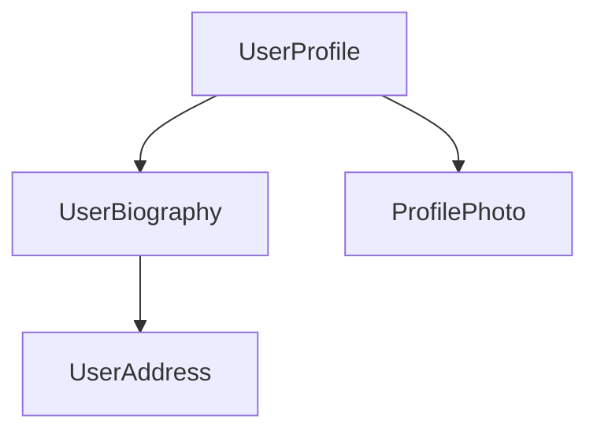

# Introduction

(From components.md)

<docs-decorative-header title="Components" imgSrc="adev/src/assets/images/components.svg"> <!-- markdownlint-disable-line -->
The fundamental building block for creating applications in Angular.
</docs-decorative-header>

Components are the main building blocks of Angular applications. Each component represents a part of a larger web page. Organizing an application into components helps provide structure to your project, clearly separating code into specific parts that are easy to maintain and grow over time.

### Defining a component

Every component has a few main parts:

1. A `@Component`[decorator](https://www.typescriptlang.org/docs/handbook/decorators.html) that contains some configuration used by Angular.
2. An HTML template that controls what renders into the DOM.
3. A [CSS selector](https://developer.mozilla.org/docs/Learn/CSS/Building_blocks/Selectors) that defines how the component is used in HTML.
4. A TypeScript class with behaviors, such as handling user input or making requests to a server.

Here is a simplified example of a `UserProfile` component.

```angular-ts
// user-profile.ts
@Component({
  selector: 'user-profile',
  template: `
    <h1>User profile</h1>
    <p>This is the user profile page</p>
  `,
})
export class UserProfile { /* Your component code goes here */ }
```

The `@Component` decorator also optionally accepts a `styles` property for any CSS you want to apply to your template:

```angular-ts
// user-profile.ts
@Component({
  selector: 'user-profile',
  template: `
    <h1>User profile</h1>
    <p>This is the user profile page</p>
  `,
  styles: `h1 { font-size: 3em; } `,
})
export class UserProfile { /* Your component code goes here */ }
```

#### Separating HTML and CSS into separate files

You can define a component's HTML and CSS in separate files using `templateUrl` and `styleUrl`:

```angular-ts
// user-profile.ts
@Component({
  selector: 'user-profile',
  templateUrl: 'user-profile.html',
  styleUrl: 'user-profile.css',
})
export class UserProfile {
  // Component behavior is defined in here
}
```

```angular-html
<!-- user-profile.html -->
<h1>Use profile</h1>
<p>This is the user profile page</p>
```

```css
/* user-profile.css */
h1 {
  font-size: 3em;
}
```

### Using components

You build an application by composing multiple components together. For example, if you are building a user profile page, you might break the page up into several components like this:



Here, the `UserProfile` component uses several other components to produce the final page.

To import and use a component, you need to:
1. In your component's TypeScript file, add an `import` statement for the component you want to use.
2. In your `@Component` decorator, add an entry to the `imports` array for the component you want to use.
3. In your component's template, add an element that matches the selector of the component you want to use.

Here's an example of a `UserProfile` component importing a `ProfilePhoto` component:

```angular-ts
// user-profile.ts
import {ProfilePhoto} from 'profile-photo.ts';

@Component({
  selector: 'user-profile',
  imports: [ProfilePhoto],
  template: `
    <h1>User profile</h1>
    <profile-photo />
    <p>This is the user profile page</p>
  `,
})
export class UserProfile {
  // Component behavior is defined in here
}
```

TIP: Want to know more about Angular components? See the [In-depth Components guide](guide/components) for the full details.

### Next Step

Now that you know how components work in Angular, it's time to learn how we add and manage dynamic data in our application.

<docs-pill-row>
  <docs-pill title="Reactivity with signals" href="essentials/signals" />
  <docs-pill title="In-depth components guide" href="guide/components" />
</docs-pill-row>

---


(From dependency-injection.md)

<docs-decorative-header title="Dependency Injection" imgSrc="adev/src/assets/images/dependency_injection.svg"> <!-- markdownlint-disable-line -->
Reuse code and control behaviors across your application and tests.
</docs-decorative-header>

When you need to share logic between components, Angular leverages the design pattern of [dependency injection](guide/di) that allows you to create a “service” which allows you to inject code into components while managing it from a single source of truth.

### What are services?

Services are reusable pieces of code that can be injected.

Similar to defining a component, services are comprised of the following:

- A **TypeScript decorator** that declares the class as an Angular service via `@Injectable` and allows you to define what part of the application can access the service via the `providedIn` property (which is typically `'root'`) to allow a service to be accessed anywhere within the application.
- A **TypeScript class** that defines the desired code that will be accessible when the service is injected

Here is an example of a `Calculator` service.

```angular-ts
import {Injectable} from '@angular/core';

@Injectable({providedIn: 'root'})
export class Calculator {
  add(x: number, y: number) {
    return x + y;
  }
}
```

### How to use a service

When you want to use a service in a component, you need to:

1. Import the service
2. Declare a class field where the service is injected. Assign the class field to the result of the call of the built-in function `inject` which creates the service

Here’s what it might look like in the `Receipt` component:

```angular-ts
import { Component, inject } from '@angular/core';
import { Calculator } from './calculator';

@Component({
  selector: 'app-receipt',
  template: `<h1>The total is {{ totalCost }}</h1>`,
})

export class Receipt {
  private calculator = inject(Calculator);
  totalCost = this.calculator.add(50, 25);
}
```

In this example, the `Calculator` is being used by calling the Angular function `inject` and passing in the service to it.

### Next Step

<docs-pill-row>
  <docs-pill title="Next Steps After Essentials" href="essentials/next-steps" />
  <docs-pill title="In-depth dependency injection guide" href="guide/di" />
</docs-pill-row>

---


(From next-steps.md)

<docs-decorative-header title="Next Steps" imgSrc="adev/src/assets/images/roadmap.svg"> <!-- markdownlint-disable-line -->
</docs-decorative-header>

Now that you have been introduced to main concepts of Angular - you're ready to put what you learned into practices with our interactive tutorials and learn more with our in-depth guides.

### Playground

Try out Angular in an interactive code editor to further explore the concepts you've learned.

<docs-pill-row>
  <docs-pill title="Play with Angular!" href="playground" />
</docs-pill-row>

### Tutorials

Put these main concepts into practice with our in-browser tutorial or build your first app locally with the Angular CLI.

<docs-pill-row>
  <docs-pill title="Learn Angular's fundamentals" href="tutorials/learn-angular" />
  <docs-pill title="Build your first Angular app" href="tutorials/first-app" />
</docs-pill-row>

### In-depth Guides

Here are some in-depth guides you might be interested in reading:

<docs-pill-row>
  <docs-pill title="Components In-depth Guide" href="guide/components/importing" />
  <docs-pill title="Template In-depth Guide" href="guide/templates" />
  <docs-pill title="Forms In-depth Guide" href="/guide/forms" />
</docs-pill-row>

To see the rest of our in-depth guides, check out the main navigation.

---


(From overview.md)

<docs-decorative-header title="Essentials" imgSrc="adev/src/assets/images/what_is_angular.svg"> <!-- markdownlint-disable-line -->
A short introduction to some of Angular's main concepts.
</docs-decorative-header>

### Interested in Angular?

Welcome! This _Essentials_ guide explains some of Angular's main concepts, helping you understand what it's like to use the framework. This guide focuses on just a few building blocks as a short introduction. If you're looking for deep, comprehensive documentation, you can navigate to specific _In-depth Guides_ from the [documentation landing page](overview).

If you prefer to immediately start writing some code, you can [skip straight to the hands-on tutorial](tutorials/learn-angular).

#### Before you start

This site expects that you're familiar with HTML, CSS and TypeScript. If you are totally new to web development, you should seek out some more introductory content before coming back here.

In particular, you should be familiar with the following concepts:

- [JavaScript Classes](https://developer.mozilla.org/docs/Web/JavaScript/Reference/Classes)
- [TypeScript fundamentals](https://www.typescriptlang.org/docs/handbook/typescript-in-5-minutes.html)
- [TypeScript Decorators](https://www.typescriptlang.org/docs/handbook/decorators.html)

### Next Step

Ready to jump in? It's time to learn about components in Angular!

<docs-pill-row>
  <docs-pill title="Composing with Components" href="essentials/components" />
</docs-pill-row>

---


(From signals.md)

<docs-decorative-header title="Signals" imgSrc="adev/src/assets/images/signals.svg"> <!-- markdownlint-disable-line -->
Create and manage dynamic data.
</docs-decorative-header>

In Angular, you use *signals* to create and manage state. A signal is a lightweight wrapper around a value.

Use the `signal` function to create a signal for holding local state:

```typescript
import {signal} from '@angular/core';

// Create a signal with the `signal` function.
const firstName = signal('Morgan');

// Read a signal value by calling it— signals are functions.
console.log(firstName());

// Change the value of this signal by calling its `set` method with a new value.
firstName.set('Jaime');

// You can also use the `update` method to change the value
// based on the previous value.
firstName.update(name => name.toUpperCase()); 
```

Angular tracks where signals are read and when they're updated. The framework uses this information to do additional work, such as updating the DOM with new state. This ability to respond to changing signal values over time is known as *reactivity*.

### Computed expressions

A `computed` is a signal that produces its value based on other signals.

```typescript
import {signal, computed} from '@angular/core';

const firstName = signal('Morgan');
const firstNameCapitalized = computed(() => firstName().toUpperCase());

console.log(firstNameCapitalized()); // MORGAN
``` 

A `computed` signal is read-only; it does not have a `set` or an `update` method. Instead, the value of the `computed` signal automatically changes when any of the signals it reads change:

```typescript
import {signal, computed} from '@angular/core';

const firstName = signal('Morgan');
const firstNameCapitalized = computed(() => firstName().toUpperCase());
console.log(firstNameCapitalized()); // MORGAN

firstName.set('Jaime');
console.log(firstNameCapitalized()); // JAIME
```

### Using signals in components

Use `signal` and `computed` inside your components to create and manage state:

```typescript
@Component({/* ... */})
export class UserProfile {
  isTrial = signal(false);
  isTrialExpired = signal(false);
  showTrialDuration = computed(() => this.isTrial() && !this.isTrialExpired());

  activateTrial() {
    this.isTrial.set(true);
  }
}
```

TIP: Want to know more about Angular Signals? See the [In-depth Signals guide](guide/signals) for the full details.

### Next Step

Now that you have learned how to declare and manage dynamic data, it's time to learn how to use that data inside of templates.

<docs-pill-row>
  <docs-pill title="Dynamic interfaces with templates" href="essentials/templates" />
  <docs-pill title="In-depth signals guide" href="guide/signals" />
</docs-pill-row>

---


(From templates.md)

<docs-decorative-header title="Templates" imgSrc="adev/src/assets/images/templates.svg"> <!-- markdownlint-disable-line -->
Use Angular's template syntax to create dynamic user interfaces.
</docs-decorative-header>

Component templates aren't just static HTML— they can use data from your component class and set up handlers for user interaction.

### Showing dynamic text

In Angular, a *binding* creates a dynamic connection between a component's template and its data. This connection ensures that changes to the component's data automatically update the rendered template.

You can create a binding to show some dynamic text in a template by using double curly-braces:

```angular-ts
@Component({
  selector: 'user-profile',
  template: `<h1>Profile for {{userName()}}</h1>`,
})
export class TodoListItem {
  userName = signal('pro_programmer_123');
}
```

When Angular renders the component, you see:

```html
<h1>Profile for pro_programmer_123</h1>
```

Angular automatically keeps the binding up-to-date when the value of the signal changes. Building on
the example above, if we update the value of the `userName` signal:

```typescript
this.userName.set('cool_coder_789');
```

The rendered page updates to reflect the new value:

```html
<h1>Profile for cool_coder_789</h1>
```

### Setting dynamic properties and attributes

Angular supports binding dynamic values into DOM properties with square brackets:

```angular-ts
@Component({
  /*...*/
  // Set the `disabled` property of the button based on the value of `isValidUserId`.
  template: `<button [disabled]="isValidUserId()">Save changes</button>`,
})
export class UserProfile {
  isValidUserId = signal(false);
}
```

You can also bind to HTML _attributes_ by prefixing the attribute name with `attr.`:

```angular-html
<!-- Bind the `role` attribute on the `<ul>` element to value of `listRole`. -->
<ul [attr.role]="listRole()">
```

Angular automatically updates DOM properties and attribute when the bound value changes.

### Handling user interaction

Angular lets you add event listeners to an element in your template with parentheses:

```angular-ts
@Component({
  /*...*/
  // Add an 'click' event handler that calls the `cancelSubscription` method. 
  template: `<button (click)="cancelSubscription()">Cancel subscription</button>`,
})
export class UserProfile {
  /* ... */
  
  cancelSubscription() { /* Your event handling code goes here. */  }
}
```

If you need to pass the [event](https://developer.mozilla.org/docs/Web/API/Event) object to your listener, you can use Angular's built-in `$event` variable inside the function call:

```angular-ts
@Component({
  /*...*/
  // Add an 'click' event handler that calls the `cancelSubscription` method. 
  template: `<button (click)="cancelSubscription($event)">Cancel subscription</button>`,
})
export class UserProfile {
  /* ... */
  
  cancelSubscription(event: Event) { /* Your event handling code goes here. */  }
}
```

### Control flow with `@if` and `@for`

You can conditionally hide and show parts of a template with Angular's `@if` block:

```angular-html
<h1>User profile</h1>

@if (isAdmin()) {
  <h2>Admin settings</h2>
  <!-- ... -->
}
```

The `@if` block also supports an optional `@else` block:

```angular-html
<h1>User profile</h1>

@if (isAdmin()) {
  <h2>Admin settings</h2>
  <!-- ... -->
} @else {
  <h2>User settings</h2>
  <!-- ... -->  
}
```

You can repeat part of a template multiple times with Angular's `@for` block:

```angular-html
<h1>User profile</h1>

<ul class="user-badge-list">
  @for (badge of badges(); track badge.id) {
    <li class="user-badge">{{badge.name}}</li>
  }
</ul>
```

Angular's uses the `track` keyword, shown in the example above, to associate data with the DOM elements created by `@for`. See [_Why is track in @for blocks important?_](guide/templates/control-flow#why-is-track-in-for-blocks-important) for more info.

TIP: Want to know more about Angular templates? See the [In-depth Templates guide](guide/templates) for the full details.

### Next Step

Now that you have dynamic data and templates in the application, it's time to learn how to enhance templates by conditionally hiding or showing certain elements, looping over elements, and more.

<docs-pill-row>
  <docs-pill title="Modular design with dependency injection" href="essentials/dependency-injection" />
  <docs-pill title="In-depth template guide" href="guide/templates" />
</docs-pill-row>

---


(From installation.md)

<docs-decorative-header title="Installation" imgSrc="adev/src/assets/images/what_is_angular.svg"> <!-- markdownlint-disable-line -->
</docs-decorative-header>

Get started with Angular quickly with online starters or locally with your terminal.

### Play Online

If you just want to play around with Angular in your browser without setting up a project, you can use our online sandbox:

<docs-card-container>
  <docs-card title="" href="/playground" link="Open on Playground">
  The fastest way to play with an Angular app. No setup required.
  </docs-card>
</docs-card-container>

### Set up a new project locally

If you're starting a new project, you'll most likely want to create a local project so that you can use tooling such as Git.

#### Prerequisites

- **Node.js** - [v20.11.1 or newer](/reference/versions)
- **Text editor** - We recommend [Visual Studio Code](https://code.visualstudio.com/)
- **Terminal** - Required for running Angular CLI commands
- **Development Tool** - To improve your development workflow, we recommend the [Angular Language Service](/tools/language-service)

#### Instructions

The following guide will walk you through setting up a local Angular project.

##### Install Angular CLI

Open a terminal (if you're using [Visual Studio Code](https://code.visualstudio.com/), you can open an [integrated terminal](https://code.visualstudio.com/docs/editor/integrated-terminal)) and run the following command:

<docs-code-multifile>
  <docs-code
    header="npm"
    >
    npm install -g @angular/cli
    </docs-code>
  <docs-code
    header="pnpm"
    >
    pnpm install -g @angular/cli
    </docs-code>
  <docs-code
    header="yarn"
    >
    yarn global add @angular/cli
    </docs-code>
  <docs-code
    header="bun"
    >
    bun install -g @angular/cli
    </docs-code>

</docs-code-multifile>

If you are having issues running this command in Windows or Unix, check out the [CLI docs](/tools/cli/setup-local#install-the-angular-cli) for more info.

##### Create a new project

In your terminal, run the CLI command `ng new` with the desired project name. In the following examples, we'll be using the example project name of `my-first-angular-app`.

<docs-code language="shell">

ng new <project-name>

</docs-code>

You will be presented with some configuration options for your project. Use the arrow and enter keys to navigate and select which options you desire.

If you don't have any preferences, just hit the enter key to take the default options and continue with the setup.

After you select the configuration options and the CLI runs through the setup, you should see the following message:

```shell
✔ Packages installed successfully.
    Successfully initialized git.
```

At this point, you're now ready to run your project locally!

##### Running your new project locally

In your terminal, switch to your new Angular project.

<docs-code language="shell">

cd my-first-angular-app

</docs-code>

All of your dependencies should be installed at this point (which you can verify by checking for the existent for a `node_modules` folder in your project), so you can start your project by running the command:

<docs-code language="shell">

npm start

</docs-code>

If everything is successful, you should see a similar confirmation message in your terminal:

```shell
Watch mode enabled. Watching for file changes...
NOTE: Raw file sizes do not reflect development server per-request transformations.
  ➜  Local:   http://localhost:4200/
  ➜  press h + enter to show help
```

And now you can visit the path in `Local` (e.g., `http://localhost:4200`) to see your application. Happy coding! 🎉

### Next steps

Now that you've created your Angular project, you can learn more about Angular in our [Essentials guide](/essentials) or choose a topic in our in-depth guides!

---


(From what-is-angular.md)

<docs-decorative-header title="What is Angular?" imgSrc="adev/src/assets/images/what_is_angular.svg"> <!-- markdownlint-disable-line -->
</docs-decorative-header>

<big style="margin-top: 2em">
Angular is a web framework that empowers developers to build fast, reliable applications.
</big>

Maintained by a dedicated team at Google, Angular provides a broad suite of tools, APIs, and
libraries to simplify and streamline your development workflow. Angular gives you
a solid platform on which to build fast, reliable applications that scale with both the size of
your team and the size of your codebase.

**Want to see some code?** Jump over to our [Essentials](essentials) for a quick overview of
what it's like to use Angular, or get started in the [Tutorial](tutorials/learn-angular) if you
prefer following step-by-step instructions.

### Features that power your development

<docs-card-container>
  <docs-card title="Keep your codebase organized with an opinionated component model and flexible dependency injection
system" href="guide/components" link="Get started with Components">
  Angular components make it easy to split your code into well-encapsulated parts.

  The versatile dependency injection helps you keep your code modular, loosely-coupled, and
  testable.
  </docs-card>
  <docs-card title="Get fast state updates with fine-grained reactivity based on Signals" href="guide/signals" link="Explore Angular Signals">
  Our fine-grained reactivity model, combined with compile-time optimizations, simplifies development and helps build faster apps by default.

  Granularly track how and where state is used throughout an application, giving the framework the power to render fast updates via highly optimized instructions.
  </docs-card>
  <docs-card title="Meet your performance targets with SSR, SSG, hydration, and next-generation deferred loading" href="guide/ssr" link="Read about SSR">
    Angular supports both server-side rendering (SSR) and static site generation (SSG) along
    with full DOM hydration. `@defer` blocks in templates make it simple to declaratively divide
    your templates into lazy-loadable parts.
  </docs-card>
  <docs-card title="Guarantee everything works together with Angular's first-party modules for forms, routing, and
more">
  [Angular's router](guide/routing) provides a feature-rich navigation toolkit, including support
  for route guards, data resolution, lazy-loading, and much more.

  [Angular's forms module](guide/forms) provides a standardized system for form participation and validation.
  </docs-card>
</docs-card-container>

### Develop applications faster than ever

<docs-card-container>
  <docs-card title="Effortlessly build, serve, test, deploy with Angular CLI" href="tools/cli" link="Angular CLI">
  Angular CLI gets your project running in under a minute with the commands you need to
  grow into a deployed production application.
  </docs-card>
  <docs-card title="Visually debug, analyze, and optimize your code with the Angular DevTools browser extension" href="tools/devtools" link="Angular DevTools">
  Angular DevTools sits alongside your browser's developer tools. It helps debug and analyze your
  app, including a component tree inspector, dependency injection tree view,
  and custom performance profiling flame chart.
  </docs-card>
  <docs-card title="Never miss a version with ng update" href="cli/update" link="ng update">
  Angular CLI's `ng update` runs automated code transformations that automatically handle routine
  breaking changes, dramatically simplifying major version updates. Keeping up with the latest
  version keeps your app as fast and secure as possible.
  </docs-card>
  <docs-card title="Stay productive with IDE integration in your favorite editor" href="tools/language-service" link="Language service">
  Angular's IDE language services powers code completion, navigation, refactoring, and real-time
  diagnostics in your favorite editor.
  </docs-card>
</docs-card-container>

### Ship with confidence

<docs-card-container>
  <docs-card title="Verified commit-by-commit against Google's colossal monorepo" href="https://cacm.acm.org/magazines/2016/7/204032-why-google-stores-billions-of-lines-of-code-in-a-single-repository/fulltext" link="Learn about Google's monorepo">
  Every Angular commit is checked against _hundreds of thousands_ of tests in Google's internal code
  repository, representing countless real-world scenarios.

  Angular is committed to stability for some of Google’s largest products, including Google Cloud.
  This commitment ensures changes are well-tested, backwards compatible, and include migration tools
  whenever possible.
  </docs-card>
  <docs-card title="Clear support policies and predictable release schedule" href="reference/releases" link="Versioning & releasing">
  Angular's predictable, time-based release schedule gives your organization confidence in the
  stability and backwards compatibility of the framework. Long Term Support (LTS) windows make sure
  you get critical security fixes when you need them. First-party update tools, guides and automated
  migration schematics help keep your apps up-to-date with the latest advancements to the framework
  and the web platform.
  </docs-card>
</docs-card-container>

### Works at any scale

<docs-card-container>
  <docs-card title="Reach users everywhere with internationalization support" href="guide/i18n" link="Internationalization">
  Angular's internationalization features handle message translations and formatting, including
  support for unicode standard ICU syntax.
  </docs-card>
  <docs-card title="Protect your users with security by default" href="best-practices/security" link="Security">
  In collaboration with Google's world-class security engineers, Angular aims to make development
  safe by default. Built-in security features, including HTML sanitization and
  trusted type support, help protect your users from common vulnerabilities like
  cross-site scripting and cross-site request forgery.
  </docs-card>
  <docs-card title="Keep large teams productive with Vite and esbuild" href="tools/cli/build-system-migration" link="ESBuild and Vite">
  Angular CLI includes a fast, modern build pipeline using Vite and ESBuild. Developers report
  building projects with hundreds of thousands of lines of code in less than a minute.
  </docs-card>
  <docs-card title="Proven in some of Google's largest web apps">
  Large Google products build on top of Angular's architecture and help develop new features that
  further improve Angular's scalability, from [Google Fonts](https://fonts.google.com/) to [Google Cloud](https://console.cloud.google.com).
  </docs-card>
</docs-card-container>

### Open-source first

<docs-card-container>
  <docs-card title="Made in the open on GitHub" href="https://github.com/angular/angular" link="Star our GitHub">
  Curious what we’re working on? Every PR and commit is available on our GitHub. Run into an issue or bug? We triage GitHub issues regularly to ensure we’re responsive and engaged with our community, and solving the real world problems you’re facing.
  </docs-card>
  <docs-card title="Built with transparency" href="roadmap" link="Read our public roadmap">
  Our team publishes a public roadmap of our current and future work and values your feedback. We publish Request for Comments (RFCs) to collect feedback on larger feature changes and ensure the community voice is heard while shaping the future direction of Angular.
  </docs-card>
</docs-card-container>

### A thriving community

<docs-card-container>
  <docs-card title="Courses, blogs and resources" href="https://devlibrary.withgoogle.com/products/angular?sort=added" link="Check out DevLibrary">
  Our community is composed of talented developers, writers, instructors, podcasters, and more. The Google for Developers library is just a sample of the high quality resources available for new and experienced developers to continue developing.
  </docs-card>
  <docs-card title="Open Source" href="https://github.com/angular/angular/blob/main/CONTRIBUTING.md" link="Contribute to Angular">
  We are thankful for the open source contributors who make Angular a better framework for everyone. From fixing a typo in the docs, to adding major features, we encourage anyone interested to get started on our GitHub.
  </docs-card>
  <docs-card title="Community partnerships" href="https://developers.google.com/community/experts/directory?specialization=angular" link="Meet the Angular GDEs">
  Our team partners with individuals, educators, and enterprises to ensure we consistently are supporting developers. Angular Google Developer Experts (GDEs) represent community leaders around the world educating, organizing, and developing with Angular. Enterprise partnerships help ensure that Angular scales well for technology industry leaders.
  </docs-card>
  <docs-card title="Partnering with other Google technologies">
  Angular partners closely with other Google technologies and teams to improve the web.

  Our ongoing partnership with Chrome’s Aurora actively explores improvements to user experience across the web, developing built-in performance optimizations like NgOptimizedImage and improvements to Angular’s Core Web Vitals.

  We are also working with [Firebase](https://firebase.google.com/), [Tensorflow](https://www.tensorflow.org/), [Flutter](https://flutter.dev/), [Material Design](https://m3.material.io/), and [Google Cloud](https://cloud.google.com/) to ensure we provide meaningful integrations across the developer workflow.
  </docs-card>
</docs-card-container>

<docs-callout title="Join the momentum!">
  <docs-pill-row>
    <docs-pill href="roadmap" title="Read Angular's roadmap"/>
    <docs-pill href="playground" title="Try out our playground"/>
    <docs-pill href="tutorials" title="Learn with tutorials"/>
    <docs-pill href="https://youtube.com/playlist?list=PL1w1q3fL4pmj9k1FrJ3Pe91EPub2_h4jF" title="Watch our YouTube course"/>
    <docs-pill href="api" title="Reference our APIs"/>
  </docs-pill-row>
</docs-callout>

---